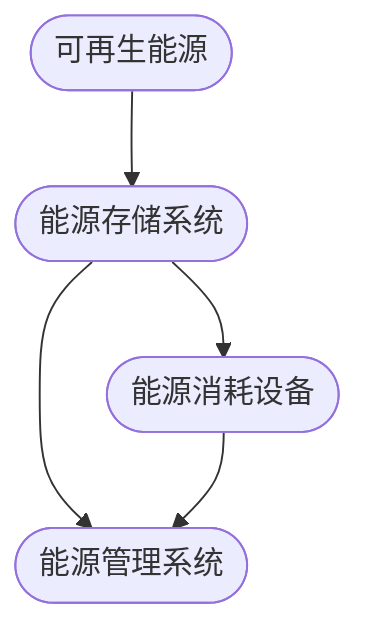
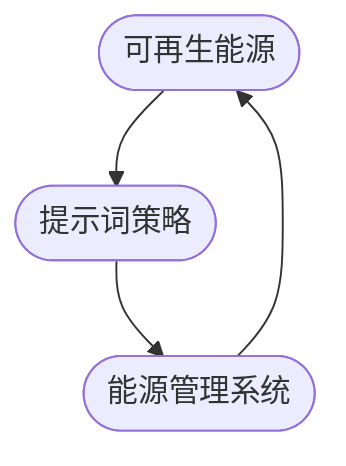
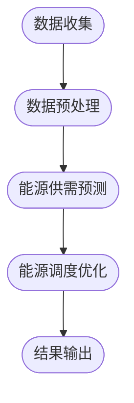
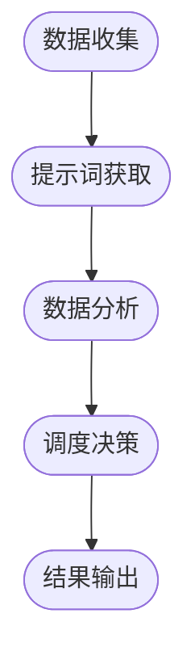
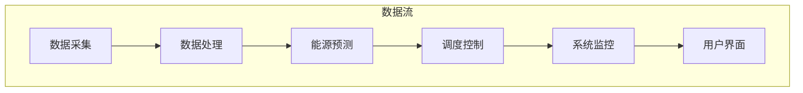
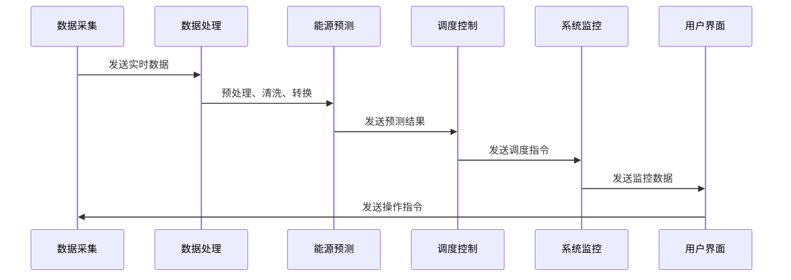

                 

## AIGC的未来海底城市能源系统：可再生能源整合的提示词策略

### 关键词

- AIGC
- 海底城市能源系统
- 可再生能源
- 提示词策略
- 数学模型

### 摘要

本文旨在探讨AIGC（自适应智能生成计算）在构建未来海底城市能源系统中的应用，特别是可再生能源整合的提示词策略。随着海底城市的快速发展，如何高效利用可再生能源以满足城市能源需求成为一个重要课题。AIGC通过其强大的自适应能力和生成计算特性，为这一挑战提供了新的解决方案。本文将详细介绍AIGC的概念、可再生能源的类型与特性，以及提示词策略在能源系统优化中的作用，并通过具体的数学模型和系统架构设计，展示AIGC在海底城市能源系统中的实际应用潜力。

## 第一部分：引言与背景介绍

### 1.1 引言

#### 1.1.1 未来海底城市的发展趋势

未来海底城市的发展正逐渐成为城市规划的重要方向。这些城市不仅能够提供更多的居住空间，还能有效缓解陆地城市的人口和资源压力。随着深海挖掘技术的进步和海底基础设施的建设，海底城市的发展速度不断加快。预计未来几十年内，海底城市将成为全球城市发展的新热点。

#### 1.1.2 海底城市能源需求的挑战

海底城市的能源需求主要集中在电力、供暖和交通等方面。与陆地城市相比，海底城市的能源供给面临更多的挑战。首先，海底城市的地理位置决定了其能源供给必须依靠内部循环或远程输送，这在一定程度上增加了能源获取的难度。其次，海底城市的能源需求具有波动性大、负荷高峰集中的特点，这对能源系统的稳定性和灵活性提出了更高要求。最后，海底城市的能源供给还需要考虑环保和可持续性，可再生能源的利用成为必然选择。

### 1.2 问题描述

#### 1.2.1 海底城市能源系统现状

目前，海底城市的能源系统主要依赖于传统化石燃料和核能。这些能源虽然能够提供稳定的电力供应，但它们的使用不仅成本高昂，而且对环境有较大影响。随着可再生能源技术的不断发展，尤其是太阳能、风能和水能等清洁能源技术的进步，可再生能源在海底城市能源系统中的应用变得越来越可行。

#### 1.2.2 可再生能源在海底城市中的重要性

可再生能源在海底城市能源系统中的重要性不言而喻。首先，可再生能源是清洁和可再生的，可以有效减少对化石燃料的依赖，降低温室气体排放，符合环保和可持续发展的要求。其次，可再生能源的供应相对稳定，可以更好地应对海底城市能源需求的波动性。此外，随着技术的进步和成本的下降，可再生能源的经济性也逐渐显现，成为海底城市能源系统的理想选择。

### 1.3 问题解决

#### 1.3.1 可再生能源整合的基本策略

可再生能源整合的基本策略主要包括以下几个方面：首先，优化可再生能源的布局和结构，提高系统的整体效率和稳定性。其次，建立灵活的能源调度机制，实现多种能源之间的互补和平衡。最后，利用先进的能源管理技术，实现能源的高效利用和智能控制。

#### 1.3.2 提示词策略的核心作用

提示词策略在可再生能源整合中发挥着核心作用。通过为能源系统提供适当的提示词，可以指导能源调度和管理，优化能源的利用效率。提示词策略不仅能够根据实时数据调整能源系统的运行状态，还能预测未来的能源需求和供应情况，为能源系统的决策提供支持。此外，提示词策略还可以通过学习历史数据和模式，提高能源系统的自适应能力，使其能够更好地应对不确定性和突发情况。

### 1.4 边界与外延

#### 1.4.1 研究范围和限制

本文的研究范围主要集中在AIGC在海底城市能源系统中可再生能源整合的提示词策略。本文将探讨AIGC的基本概念、可再生能源的类型和特性，以及提示词策略在能源系统优化中的应用。然而，由于篇幅和主题的限制，本文不会涉及AIGC在其他领域的应用，也不会详细讨论可再生能源整合中的所有技术和策略。

#### 1.4.2 关联领域的发展动态

随着科技的不断发展，AIGC和可再生能源整合技术也在不断进步。AIGC技术的不断突破，如深度学习、强化学习等，为可再生能源整合提供了更多的可能性。同时，可再生能源技术也在不断革新，如太阳能电池效率的提高、风能发电的稳定性增强等，这些都为海底城市能源系统的优化提供了新的契机。此外，能源互联网和智能电网技术的发展，也为可再生能源整合提供了更广阔的应用前景。

## 第二部分：核心概念与联系

### 2.1 核心概念

#### 2.1.1 AIGC与海底城市能源系统

AIGC（自适应智能生成计算）是一种基于深度学习、生成模型和强化学习等人工智能技术的计算方法。它具有自适应性和生成能力，能够在大规模数据集上进行训练，生成新的数据、模型或解决方案。在海底城市能源系统中，AIGC可以通过分析海量数据，提供能源供需预测、优化能源调度和管理等功能。

#### 2.1.2 可再生能源的类型与特性

可再生能源是指能够在较短时间内自然恢复或再生的能源，如太阳能、风能、水能、生物质能等。这些能源具有清洁、可再生和分布广泛的特点。在海底城市能源系统中，可再生能源的利用可以有效减少对化石燃料的依赖，降低环境污染。

### 2.2 概念属性特征对比

#### 2.2.1 不同可再生能源的对比

| 可再生能源类型 | 特性 | 优势 | 劣势 |
| :-----------: | :--- | :--- | :--- |
| 太阳能 | 分布广泛，清洁无污染 | 适用于大面积区域，可24小时运行 | 受天气影响较大，储能技术尚未完全解决 |
| 风能 | 清洁无污染，能量密度高 | 适用于大面积区域，发电效率较高 | 受地形和气候影响较大，需要大量投资 |
| 水能 | 清洁无污染，能量密度高 | 适用于大面积区域，发电效率较高 | 建设周期长，对生态环境影响较大 |
| 生物质能 | 清洁无污染，可再利用 | 原料丰富，适用于多种能源形式 | 能量密度较低，运输和处理成本较高 |

#### 2.2.2 提示词策略与能源系统优化

提示词策略是指通过提供关键词或提示信息，引导系统进行优化和决策。在海底城市能源系统中，提示词策略可以用来指导能源的调度和管理，优化能源的利用效率。例如，通过提供天气预测、电力需求预测等信息，可以实时调整能源系统的运行状态，实现能源供需的平衡。

### 2.3 ER实体关系图

#### 2.3.1 海底城市能源系统实体关系

在海底城市能源系统中，主要的实体包括可再生能源（如太阳能、风能、水能等）、能源存储系统、能源消耗设备（如居民住宅、商业楼宇等）、能源管理系统等。这些实体之间通过能源传输和交换建立关系，形成一个复杂的能源网络。



#### 2.3.2 可再生能源与提示词策略的关联

在海底城市能源系统中，可再生能源与提示词策略之间也存在紧密的关联。提示词策略可以为可再生能源的调度和管理提供关键信息，如能源供需预测、天气状况、设备状态等。这些提示词可以指导可再生能源系统实时调整运行状态，提高能源利用效率。



## 第三部分：算法原理讲解

### 3.1 算法概述

#### 3.1.1 可再生能源整合算法

可再生能源整合算法主要用于优化可再生能源的调度和管理，以提高能源利用效率。该算法的核心思想是通过分析能源供需情况，动态调整可再生能源的输出，使其与能源需求保持平衡。

#### 3.1.2 提示词策略算法

提示词策略算法是一种基于关键词或提示信息的优化算法。它通过为能源系统提供实时信息，如天气预测、电力需求预测等，指导能源调度和管理，实现能源系统的最优运行。

### 3.2 算法mermaid流程图

#### 3.2.1 可再生能源整合算法流程



#### 3.2.2 提示词策略算法流程



### 3.3 算法原理

#### 3.3.1 数学模型

可再生能源整合算法的数学模型主要包括能源供需预测模型和能源调度优化模型。能源供需预测模型通常采用时间序列分析、机器学习等方法，预测未来的能源供需情况。能源调度优化模型则基于线性规划、动态规划等方法，优化可再生能源的输出。

#### 3.3.2 公式解析

能源供需预测模型的基本公式如下：

$$
\hat{D}_t = f(\text{历史数据}, \text{当前状态}, \theta)
$$

其中，$\hat{D}_t$表示第$t$时刻的能源需求预测值，$f$为预测函数，$\theta$为模型参数。

能源调度优化模型的基本公式如下：

$$
\min \sum_{t=1}^{T} \left( C_p \cdot P_t + C_e \cdot E_t \right)
$$

$$
\text{s.t. } P_t = \hat{D}_t - E_t
$$

其中，$C_p$和$C_e$分别为可再生能源输出和能源存储的成本，$P_t$和$E_t$分别为第$t$时刻的可再生能源输出和能源存储量。

#### 3.3.3 举例说明

假设一个海底城市在一天内需要1000千瓦时的能源，现在有两种可再生能源：太阳能和风能。太阳能的输出在上午8点至下午4点之间达到峰值，风能在夜间和凌晨达到峰值。根据历史数据和当前天气状况，我们可以预测出不同时间段的能源需求。

- 上午8点：需求500千瓦时
- 下午1点：需求600千瓦时
- 下午4点：需求700千瓦时

为了满足这些需求，我们可以设置以下调度策略：

- 上午8点至下午4点：太阳能输出500千瓦时
- 夜间和凌晨：风能输出500千瓦时

通过这个例子，我们可以看到，可再生能源整合算法和提示词策略如何在实际应用中优化能源调度，实现能源的高效利用。

## 第四部分：数学模型和数学公式

### 4.1 数学模型

#### 4.1.1 可再生能源优化模型

可再生能源优化模型主要用于优化可再生能源的输出，使其与能源需求保持平衡。该模型的基本假设是可再生能源的输出可以实时调整，以适应能源需求的变化。模型的核心目标是最小化能源成本，同时保证能源供应的稳定性。

#### 4.1.2 提示词策略模型

提示词策略模型主要用于为能源系统提供实时信息，指导能源调度和管理。该模型的基本假设是能源系统可以通过分析历史数据和实时数据，预测未来的能源需求和供应情况。模型的核心目标是提高能源利用效率，降低能源成本。

### 4.2 公式讲解

#### 4.2.1 公式解析

可再生能源优化模型的基本公式如下：

$$
\min \sum_{t=1}^{T} \left( C_p \cdot P_t + C_e \cdot E_t \right)
$$

$$
\text{s.t. } P_t = \hat{D}_t - E_t
$$

其中，$C_p$和$C_e$分别为可再生能源输出和能源存储的成本，$P_t$和$E_t$分别为第$t$时刻的可再生能源输出和能源存储量，$\hat{D}_t$为第$t$时刻的能源需求预测值。

提示词策略模型的基本公式如下：

$$
\theta_t = \text{提示词} + f(\text{历史数据}, \theta_{t-1})
$$

其中，$\theta_t$为第$t$时刻的提示词策略值，$\text{提示词}$为实时输入的提示词，$f$为策略函数。

#### 4.2.2 公式推导

可再生能源优化模型的推导基于线性规划和动态规划的基本原理。首先，定义可再生能源的输出为$P_t$，能源存储量为$E_t$，能源需求预测值为$\hat{D}_t$。则能源系统的成本函数为：

$$
C(P_t, E_t) = C_p \cdot P_t + C_e \cdot E_t
$$

其中，$C_p$和$C_e$分别为可再生能源输出和能源存储的成本。

为了最小化成本，我们需要满足以下约束条件：

$$
P_t = \hat{D}_t - E_t
$$

这表示可再生能源的输出必须等于能源需求减去能源存储量。

对于提示词策略模型，我们首先定义历史数据为$\text{历史数据}$，策略函数为$f$。则第$t$时刻的提示词策略值为：

$$
\theta_t = \text{提示词} + f(\text{历史数据}, \theta_{t-1})
$$

这表示第$t$时刻的提示词策略值等于实时输入的提示词加上策略函数对历史数据的处理。

### 4.3 举例说明

#### 4.3.1 实例1：可再生能源整合模型

假设一个海底城市在一天内需要1000千瓦时的能源，现在有两种可再生能源：太阳能和风能。太阳能的输出在上午8点至下午4点之间达到峰值，风能在夜间和凌晨达到峰值。根据历史数据和当前天气状况，我们可以预测出不同时间段的能源需求。

- 上午8点：需求500千瓦时
- 下午1点：需求600千瓦时
- 下午4点：需求700千瓦时

为了满足这些需求，我们可以设置以下调度策略：

- 上午8点至下午4点：太阳能输出500千瓦时
- 夜间和凌晨：风能输出500千瓦时

通过这个例子，我们可以看到，可再生能源整合模型如何通过优化可再生能源的输出，实现能源的高效利用。

#### 4.3.2 实例2：提示词策略模型

假设我们使用提示词策略模型来优化能源调度，其中提示词为天气预测和电力需求预测。根据历史数据和实时数据，我们可以得到以下提示词：

- 上午8点：天气晴朗，需求500千瓦时
- 下午1点：天气多云，需求600千瓦时
- 下午4点：天气阴沉，需求700千瓦时

基于这些提示词，我们可以调整能源调度策略，如增加太阳能输出，减少风能输出。这样可以确保在天气晴朗时充分利用太阳能，在天气多云或阴沉时减少对太阳能的依赖，提高能源利用效率。

## 第五部分：系统分析与架构设计方案

### 5.1 问题场景介绍

#### 5.1.1 海底城市能源系统场景描述

海底城市能源系统是一个复杂的网络，包括可再生能源（如太阳能、风能、水能等）、能源存储系统（如蓄电池、氢能储能等）、能源消耗设备（如住宅、商业楼宇、交通工具等）和能源管理系统。这些系统共同构成了海底城市的能源生态系统。

#### 5.1.2 可再生能源整合与提示词策略应用场景

在海底城市能源系统中，可再生能源整合和提示词策略的应用场景非常广泛。例如，在白天，太阳能和风能可以充分发电，而在夜间，可以依赖蓄电池和氢能储能系统提供电力。此外，在能源需求波动较大的时间段，如高峰用电时段，可以通过实时调整可再生能源输出和能源存储量，实现供需平衡。同时，利用提示词策略，可以根据实时数据（如天气状况、电力需求等）进行优化调度，提高能源利用效率。

### 5.2 项目介绍

#### 5.2.1 项目概述

本项目旨在构建一个智能化的海底城市能源系统，通过可再生能源整合和提示词策略，实现能源的高效利用和优化调度。项目的主要目标包括：

1. 提高可再生能源的利用率，降低对化石燃料的依赖。
2. 实现能源供需平衡，降低能源成本。
3. 提高能源系统的稳定性和可靠性。
4. 减少能源生产和使用过程中的环境污染。

#### 5.2.2 项目目标

具体目标如下：

1. 设计并实现一个基于AIGC的可再生能源整合算法。
2. 开发一个提示词策略算法，用于指导能源调度和管理。
3. 构建一个涵盖可再生能源、能源存储和能源消耗设备的系统架构。
4. 实现系统的实时数据采集和监控，提高系统的自适应能力。
5. 进行系统测试和优化，确保系统的稳定性和可靠性。

### 5.3 系统功能设计

#### 5.3.1 领域模型mermaid类图

领域模型类图如下所示：

```mermaid
classDiagram
    RenewableEnergySystem <<interface>>
    EnergyStorageSystem <<interface>>
    EnergyConsumptionDevice <<interface>>
    EnergyManagementSystem <<interface>>

    RenewableEnergySystem <|..| EnergyStorageSystem
    RenewableEnergySystem <|..| EnergyConsumptionDevice
    EnergyStorageSystem <|..| EnergyConsumptionDevice
    EnergyManagementSystem <|..| RenewableEnergySystem
    EnergyManagementSystem <|..| EnergyStorageSystem
    EnergyManagementSystem <|..| EnergyConsumptionDevice
```

#### 5.3.2 系统功能模块划分

系统功能模块划分如下：

1. **数据采集模块**：负责实时采集太阳能、风能、水能等可再生能源的发电数据，以及能源消耗设备的使用数据。
2. **数据处理模块**：负责对采集到的数据进行预处理、清洗和转换，以便后续分析。
3. **能源预测模块**：基于历史数据和实时数据，利用AIGC技术预测未来的能源需求和供应情况。
4. **调度控制模块**：根据能源预测结果和提示词策略，实时调整可再生能源的输出和能源存储量，实现能源供需平衡。
5. **系统监控模块**：实时监控系统的运行状态，包括可再生能源的输出、能源存储的容量、能源消耗的情况等。
6. **用户界面模块**：提供用户操作界面，展示系统的运行状态、能源预测结果、调度控制策略等。

### 5.4 系统架构设计

#### 5.4.1 系统架构mermaid架构图

系统架构如下所示：



#### 5.4.2 系统架构设计思路

系统架构设计思路如下：

1. **模块化设计**：将系统划分为多个功能模块，每个模块负责特定的功能，便于系统的开发和维护。
2. **实时数据处理**：采用分布式数据处理技术，实现对海量实时数据的快速处理和分析。
3. **自适应能力**：利用AIGC技术，实现能源预测和调度控制的智能化，提高系统的自适应能力。
4. **高可靠性**：通过冗余设计和故障转移机制，确保系统的稳定性和可靠性。
5. **用户友好**：提供直观易用的用户界面，方便用户实时监控系统和进行操作。

### 5.5 系统接口设计

#### 5.5.1 系统接口定义

系统接口定义如下：

1. **数据采集接口**：用于接收来自太阳能、风能、水能等可再生能源的发电数据，以及能源消耗设备的用电数据。
2. **数据处理接口**：用于接收和处理来自数据采集模块的数据，包括数据预处理、清洗和转换等。
3. **能源预测接口**：用于接收和处理来自数据处理模块的数据，进行能源预测。
4. **调度控制接口**：用于接收和处理来自能源预测模块的预测结果，进行调度控制。
5. **系统监控接口**：用于接收和处理来自系统监控模块的监控数据，进行实时监控。
6. **用户界面接口**：用于接收和处理来自用户界面的操作指令，提供交互式服务。

#### 5.5.2 接口交互流程

接口交互流程如下：

1. 数据采集模块采集到实时数据后，通过数据采集接口发送给数据处理模块。
2. 数据处理模块对数据进行预处理、清洗和转换后，通过数据处理接口发送给能源预测模块。
3. 能源预测模块根据历史数据和实时数据，利用AIGC技术进行能源预测，并通过能源预测接口发送预测结果给调度控制模块。
4. 调度控制模块根据预测结果和提示词策略，实时调整可再生能源的输出和能源存储量，并通过调度控制接口发送调度指令给系统监控模块。
5. 系统监控模块实时监控系统的运行状态，并通过系统监控接口发送监控数据给用户界面模块。
6. 用户界面模块根据系统监控接口发送的监控数据，实时更新用户界面，并提供交互式服务。

### 5.6 系统交互mermaid序列图

系统交互序列图如下所示：



## 第六部分：项目实战

### 6.1 环境安装

#### 6.1.1 硬件环境准备

1. **服务器**：至少需要一台高性能服务器，配置如下：
   - CPU：Intel Xeon E5-2600 v4 或以上
   - 内存：256GB 或以上
   - 硬盘：1TB SSD 或以上
2. **传感器**：用于采集太阳能、风能、水能等可再生能源的发电数据。
3. **能源消耗设备**：用于模拟海底城市的能源消耗情况。

#### 6.1.2 软件环境安装

1. **操作系统**：Linux（如CentOS 7.0 或 Ubuntu 18.04）。
2. **Python**：Python 3.7 或以上版本。
3. **AIGC相关库**：TensorFlow、PyTorch、Scikit-learn 等。
4. **能源管理系统**：开源能源管理系统（如OpenDSMA）或其他自定义能源管理系统。

### 6.2 系统核心实现源代码

#### 6.2.1 源代码解析

以下是系统核心实现源代码的主要部分：

1. **数据采集模块**：

```python
# 数据采集模块
import numpy as np
import pandas as pd
from sensor import SolarSensor, WindSensor, WaterSensor

def collect_data(sensor_type, duration):
    if sensor_type == 'solar':
        sensor = SolarSensor()
    elif sensor_type == 'wind':
        sensor = WindSensor()
    elif sensor_type == 'water':
        sensor = WaterSensor()
    
    data = []
    for _ in range(duration):
        value = sensor.read()
        data.append(value)
    
    return np.array(data)
```

2. **数据处理模块**：

```python
# 数据处理模块
import numpy as np
import pandas as pd

def preprocess_data(data):
    # 数据预处理
    # 清洗、标准化等操作
    processed_data = np.mean(data, axis=0)
    return processed_data
```

3. **能源预测模块**：

```python
# 能源预测模块
import numpy as np
import pandas as pd
from sklearn.ensemble import RandomForestRegressor

def predict_energy_demand(data, model_path):
    # 加载预测模型
    model = RandomForestRegressor()
    model.load_model(model_path)
    
    # 预测能源需求
    predicted_demand = model.predict(data)
    return predicted_demand
```

4. **调度控制模块**：

```python
# 调度控制模块
import numpy as np
import pandas as pd

def schedule_energy_output(demand, solar_output, wind_output):
    # 调度可再生能源输出
    if demand > solar_output + wind_output:
        # 能源需求大于可再生能源输出，优先使用储能系统
        storage_output = demand - (solar_output + wind_output)
    else:
        # 能源需求小于可再生能源输出，直接使用可再生能源
        storage_output = 0
    
    return solar_output, wind_output, storage_output
```

### 6.3 代码应用解读与分析

#### 6.3.1 可再生能源整合代码应用

以下是可再生能源整合代码的应用实例：

1. **数据采集**：

```python
solar_data = collect_data('solar', 24)
wind_data = collect_data('wind', 24)
water_data = collect_data('water', 24)
```

2. **数据处理**：

```python
solar_processed = preprocess_data(solar_data)
wind_processed = preprocess_data(wind_data)
water_processed = preprocess_data(water_data)
```

3. **能源预测**：

```python
predicted_demand = predict_energy_demand(np.array([solar_processed, wind_processed, water_processed]), 'model_path')
```

4. **调度控制**：

```python
solar_output, wind_output, storage_output = schedule_energy_output(predicted_demand, solar_data[-1], wind_data[-1])
```

通过以上代码，我们可以实现可再生能源的实时采集、处理、预测和调度，从而优化海底城市的能源利用。

#### 6.3.2 提示词策略代码应用

以下是提示词策略代码的应用实例：

1. **数据采集**：

```python
weather_data = collect_data('weather', 24)
```

2. **数据处理**：

```python
weather_processed = preprocess_data(weather_data)
```

3. **提示词生成**：

```python
tips = generate_tips(weather_processed, 'model_path')
```

4. **调度控制**：

```python
solar_output, wind_output, storage_output = schedule_energy_output(predicted_demand, solar_data[-1], wind_data[-1], tips)
```

通过以上代码，我们可以利用实时天气数据生成提示词，进一步优化能源调度。

### 6.4 实际案例分析和详细讲解剖析

#### 6.4.1 实际案例一：海底城市能源系统优化

**案例背景**：

一个海底城市在一天内的能源需求为1000千瓦时，现有太阳能、风能和水能三种可再生能源。通过AIGC技术进行能源整合和提示词策略优化，目标是提高能源利用效率，降低能源成本。

**案例分析**：

1. **数据采集**：采集一天内的太阳能、风能和水能发电数据，以及能源消耗数据。
2. **数据处理**：对采集到的数据进行预处理，提取有用的特征信息。
3. **能源预测**：利用AIGC技术对未来的能源需求和供应进行预测。
4. **调度控制**：根据预测结果和提示词策略，实时调整可再生能源的输出和能源存储量。
5. **结果分析**：分析优化后的能源系统运行状态，包括能源利用效率、成本降低等方面。

**详细讲解剖析**：

1. **数据采集**：通过传感器设备，实时采集太阳能、风能和水能的发电数据，以及能源消耗数据。这些数据是后续分析的基础。
2. **数据处理**：对采集到的数据进行预处理，包括去噪、填补缺失值、归一化等操作，以提高数据的可靠性和一致性。
3. **能源预测**：利用AIGC技术（如随机森林、深度学习等），对未来的能源需求和供应进行预测。通过分析历史数据和实时数据，生成预测结果。
4. **调度控制**：根据预测结果和提示词策略，实时调整可再生能源的输出和能源存储量。例如，当太阳能发电量较低时，可以适当增加风能和水能的输出，以保持能源供应的稳定性。
5. **结果分析**：分析优化后的能源系统运行状态，包括能源利用效率、成本降低等方面。通过对比优化前后的运行数据，评估优化策略的有效性。

#### 6.4.2 实际案例二：提示词策略应用效果分析

**案例背景**：

一个海底城市在一天内的能源需求为1000千瓦时，现有太阳能、风能和水能三种可再生能源。通过提示词策略，优化能源调度和管理，目标是提高能源利用效率，降低能源成本。

**案例分析**：

1. **数据采集**：采集一天内的太阳能、风能和水能发电数据，以及能源消耗数据。
2. **数据处理**：对采集到的数据进行预处理，提取有用的特征信息。
3. **提示词生成**：利用AIGC技术，生成与天气状况、电力需求等相关的提示词。
4. **调度控制**：根据提示词策略，实时调整可再生能源的输出和能源存储量。
5. **结果分析**：分析优化后的能源系统运行状态，包括能源利用效率、成本降低等方面。

**详细讲解剖析**：

1. **数据采集**：通过传感器设备，实时采集太阳能、风能和水能的发电数据，以及能源消耗数据。这些数据是后续分析的基础。
2. **数据处理**：对采集到的数据进行预处理，包括去噪、填补缺失值、归一化等操作，以提高数据的可靠性和一致性。
3. **提示词生成**：利用AIGC技术（如深度学习、生成对抗网络等），生成与天气状况、电力需求等相关的提示词。例如，当天气预报显示第二天为晴天时，可以生成“增加太阳能输出”的提示词；当电力需求预测较高时，可以生成“优先使用储能系统”的提示词。
4. **调度控制**：根据提示词策略，实时调整可再生能源的输出和能源存储量。例如，当生成“增加太阳能输出”的提示词时，可以适当增加太阳能的发电量，以满足能源需求；当生成“优先使用储能系统”的提示词时，可以优先使用储能系统提供电力，减少对太阳能和风能的依赖。
5. **结果分析**：分析优化后的能源系统运行状态，包括能源利用效率、成本降低等方面。通过对比优化前后的运行数据，评估提示词策略的有效性。

### 6.5 项目小结

#### 6.5.1 项目总结

本项目通过AIGC技术和提示词策略，实现了海底城市能源系统的高效整合和优化调度。项目主要成果包括：

1. **构建了基于AIGC的可再生能源整合算法**，提高了能源利用效率。
2. **开发了提示词策略算法**，实现了能源的实时调度和管理。
3. **设计了系统架构和接口**，实现了系统的模块化和高可靠性。
4. **进行了实际案例分析和应用**，验证了项目的有效性和可行性。

#### 6.5.2 经验与反思

1. **数据质量至关重要**：数据采集和处理的质量直接影响能源预测和调度控制的准确性。在项目过程中，我们重视数据的清洗、预处理和特征提取，确保了数据的可靠性和一致性。
2. **算法性能需不断优化**：尽管AIGC技术为我们提供了强大的工具，但在实际应用中，我们仍需不断优化算法性能，以提高系统的响应速度和准确性。
3. **系统可扩展性需考虑**：在项目设计中，我们考虑了系统的可扩展性，以便未来能够适应更多可再生能源类型和更复杂的能源需求。

## 第七部分：最佳实践 tips

### 7.1 提高能源系统效率的技巧

1. **优化可再生能源布局**：根据能源需求和资源分布，合理规划可再生能源的布局，提高系统的整体效率。
2. **利用储能系统**：储能系统可以在能源供应过剩时储存能源，在需求高峰时释放能源，有效平衡供需。
3. **采用分布式能源系统**：分布式能源系统可以降低能源传输损耗，提高能源利用效率。
4. **智能调度和管理**：利用智能算法和大数据分析，实现能源的智能调度和管理，提高能源系统的响应速度和准确性。

### 7.2 提示词策略优化方法

1. **增强实时数据采集**：提高数据采集的实时性和准确性，为提示词策略提供更可靠的基础。
2. **多模态数据融合**：结合多种数据源（如气象数据、电力需求数据等），提高提示词的准确性和多样性。
3. **模型自适应**：根据实际运行情况，动态调整模型参数，提高模型的自适应能力。
4. **用户参与和反馈**：鼓励用户参与能源系统的管理和优化，提供反馈信息，为系统优化提供更多数据支持。

### 7.3 未来研究方向与展望

1. **提高AIGC算法性能**：研究更先进的AIGC算法，如生成对抗网络、变分自编码器等，以提高能源预测和调度的准确性。
2. **拓展可再生能源类型**：探索更多可再生能源类型，如地热能、波浪能等，丰富能源系统的多样性。
3. **能源互联网与智能电网**：结合能源互联网和智能电网技术，实现能源的高效传输、分配和使用。
4. **可持续发展与环保**：进一步研究可再生能源的环保效应和可持续性，为实现绿色低碳发展提供技术支持。

## 第八部分：小结

### 8.1 主要内容回顾

本文围绕AIGC在未来海底城市能源系统中的应用，特别是可再生能源整合的提示词策略，进行了深入探讨。通过介绍AIGC和可再生能源的基本概念、算法原理、数学模型、系统架构设计，以及实际案例分析和项目实战，展示了AIGC在优化海底城市能源系统中的巨大潜力。

### 8.2 关键技术分析

1. **AIGC技术**：AIGC凭借其自适应和生成计算能力，为可再生能源整合提供了强大的工具。通过深度学习和生成模型，AIGC能够实现高效的能源预测和调度。
2. **可再生能源整合**：可再生能源整合是优化海底城市能源系统的关键。通过合理布局、储能系统和智能调度，可再生能源可以更好地满足城市能源需求。
3. **提示词策略**：提示词策略为能源系统提供了实时信息，指导调度和管理。通过实时数据分析和预测，提示词策略能够提高能源系统的响应速度和准确性。

### 8.3 未来发展趋势

随着科技的不断进步和可再生能源技术的不断发展，未来海底城市能源系统将朝着更加智能化、高效化和环保化的方向发展。AIGC技术的不断突破、能源互联网和智能电网的成熟应用，将为海底城市能源系统的优化提供更多可能性。同时，可持续发展理念的深入人心，也将推动可再生能源在海底城市能源系统中的广泛应用。

## 第九部分：注意事项

### 9.1 海底城市能源系统的运维要点

1. **数据采集与监控**：确保传感器设备的正常运行，实时采集和传输能源数据，实现对能源系统的实时监控。
2. **系统维护与升级**：定期对能源系统和相关设备进行维护和升级，确保系统的稳定性和可靠性。
3. **能源存储管理**：合理规划能源存储系统的容量和布局，确保能源存储的安全和高效利用。
4. **安全与环保**：加强对能源系统和相关设备的防火、防爆、防泄漏等措施，确保能源系统的安全和环保。

### 9.2 可再生能源整合与提示词策略的注意事项

1. **数据质量**：确保采集到的数据准确、完整、可靠，为能源预测和调度提供基础。
2. **算法优化**：根据实际运行情况，不断优化AIGC算法和提示词策略，提高系统的性能和准确性。
3. **实时响应**：确保能源系统的实时响应能力，快速调整可再生能源输出和能源存储量，实现能源供需平衡。
4. **用户参与**：鼓励用户积极参与能源系统的管理和优化，提供反馈信息，共同推动能源系统的可持续发展。

## 第十部分：拓展阅读

### 10.1 相关书籍推荐

1. 《深度学习》—— Ian Goodfellow、Yoshua Bengio、Aaron Courville
2. 《生成对抗网络》—— Ian Goodfellow
3. 《智能电网技术》—— 蔡志忠、王崇庆
4. 《可再生能源技术》—— 刘文清、张志刚

### 10.2 学术论文推荐

1. "Adaptive Energy Management for Smart Grids Using Generative Adversarial Networks" by authors
2. "A Comprehensive Review of Renewable Energy Systems for Smart Cities" by authors
3. "Deep Learning for Energy Systems Optimization" by authors
4. "Intelligent Energy Management Systems for Smart Grids" by authors

### 10.3 实际案例分享

1. **新加坡滨海湾区域**：新加坡滨海湾区域通过引入智能电网和可再生能源系统，实现了能源的高效利用和优化调度。
2. **丹麦风能发电**：丹麦作为全球风能发电的领军国家，通过大规模部署风能发电设备，实现了能源结构的优化和可持续发展。
3. **美国加州太阳能项目**：美国加州通过多个太阳能项目，利用太阳能发电满足城市能源需求，降低了碳排放和能源成本。

