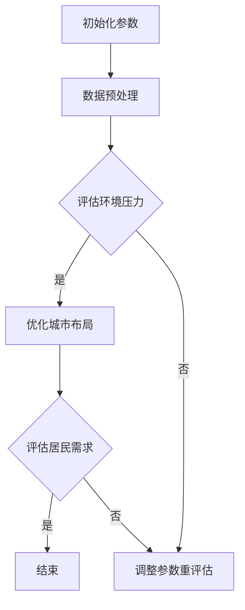
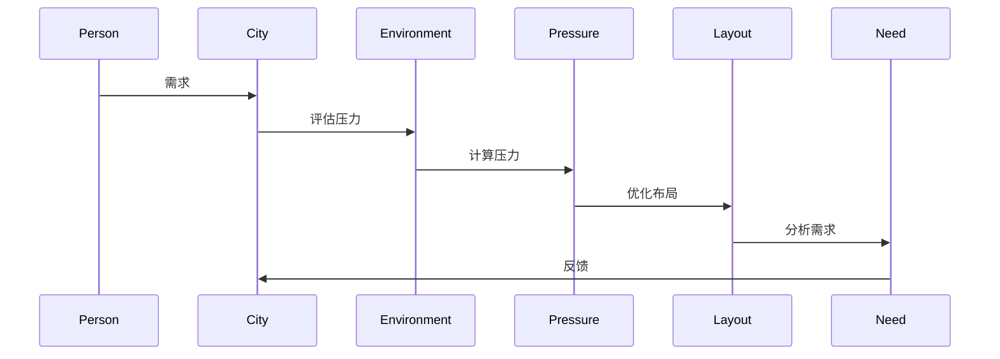
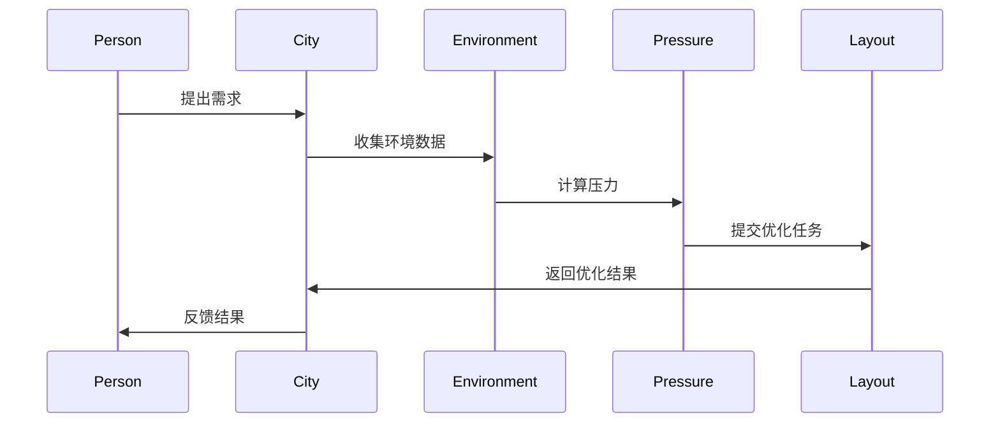
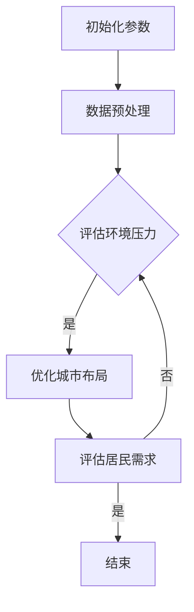
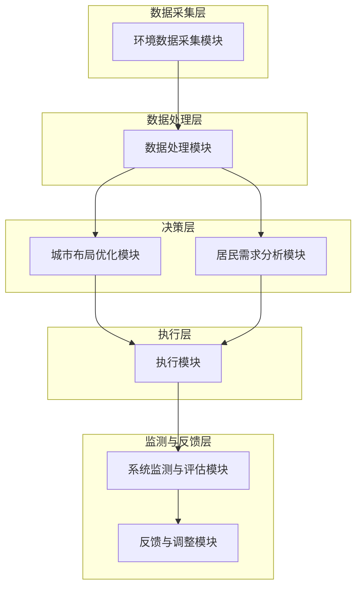
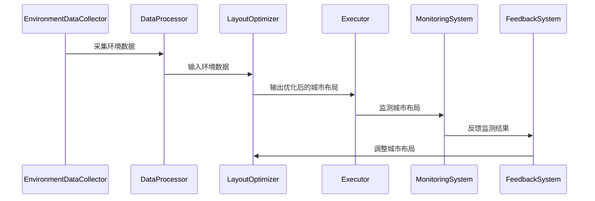
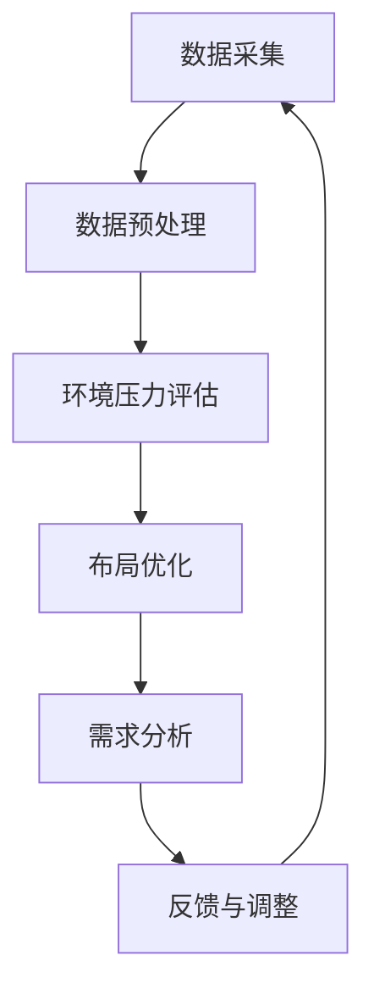
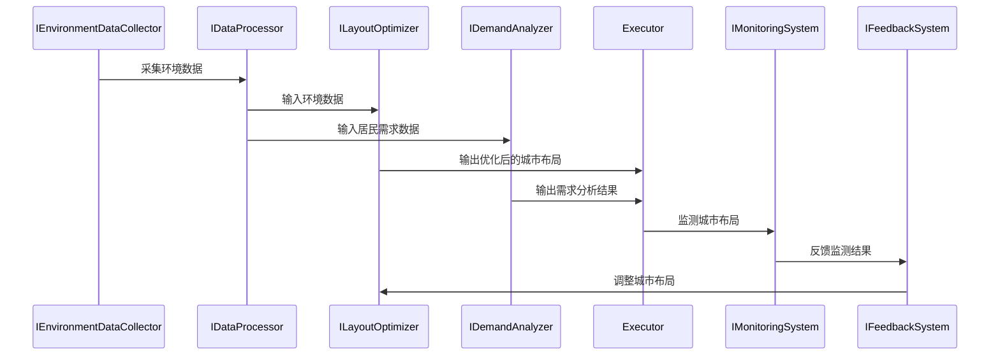

                 

### 目录大纲示例

```markdown
----------------------------------------------------------------
# AIGC的未来海底城市规划：压力适应设计的提示词策略

> 关键词：AIGC、海底城市、压力适应、设计策略、提示词

> 摘要：本文探讨了自适应智能生成计算（AIGC）在构建未来海底城市中发挥的关键作用，特别是压力适应设计策略的应用。通过一步步的逻辑分析，本文揭示了AIGC在海底城市规划中的潜在价值，并提出了实用的提示词策略。

----------------------------------------------------------------

## 引言

### 1.1 问题背景与意义

#### 1.1.1 AIGC的兴起

随着人工智能技术的发展，自适应智能生成计算（AIGC）逐渐成为研究热点。AIGC利用深度学习和自然语言处理技术，能够自适应地生成复杂的数据和模型，为城市规划提供了新的工具。

#### 1.1.2 未来海底城市规划的重要性

未来，随着全球人口的快速增长和城市化的推进，陆地空间资源愈发紧张。海底城市作为一种创新的居住模式，能够有效拓展人类居住空间，解决城市扩展的难题。

#### 1.1.3 压力适应设计的挑战

海底城市的建设面临着巨大的环境压力，如海水压力、海洋生物的干扰以及自然灾害等。因此，压力适应设计成为海底城市规划的关键。

### 1.2 核心概念介绍

#### 1.2.1 AIGC的定义与特点

AIGC是一种基于深度学习和自然语言处理的计算范式，能够自动生成高质量的数据和模型。其特点包括：

- **数据驱动的自动生成能力**
- **多模态的整合与交互**
- **自我学习和优化能力**

#### 1.2.2 压力适应设计的原理

压力适应设计旨在确保城市规划能够适应复杂多变的环境压力。其核心目标是：

- **提高城市的可持续性**
- **增强城市的弹性**
- **保障居民的健康和安全**

### 1.2.3 相关概念联系图表


#### 1.2.4 概念结构与核心要素组成

AIGC与压力适应设计的关系紧密，两者共同构成了未来海底城市规划的核心。核心要素包括：

- **数据采集与处理**
- **算法优化与模型生成**
- **城市设计与评估**
- **居民体验与反馈**

## 核心概念与联系

### 2.1 AIGC的定义与特点

AIGC是一种基于深度学习和自然语言处理的计算范式，其核心特点包括：

- **自适应生成能力**：能够根据输入数据自动生成复杂的模型和内容。
- **多模态整合**：能够处理文本、图像、声音等多种类型的数据。
- **自我学习**：通过不断的学习和优化，提高生成的质量和效率。

### 2.2 压力适应设计的概念

压力适应设计是一种应对复杂环境挑战的城市规划策略。其核心原理包括：

- **环境适应性**：城市设计应能够适应不同的环境压力，如海水压力、海洋生物干扰等。
- **系统弹性**：城市规划应具备应对自然灾害等突发事件的弹性。
- **居民健康安全**：城市设计应确保居民的健康和安全，减少环境压力对居民的影响。

### 2.3 相关概念联系图表

使用Mermaid绘制AIGC、压力适应设计与海底城市规划之间的ER实体关系图，展示概念间的联系。

```mermaid
erDiagram
  AIGC ||--|{ 压力适应设计 }|
  压力适应设计 ||--|{ 海底城市规划 }|
  海底城市规划 ||--|{ 居民体验 }|
```

## 算法原理

### 3.1 压力适应设计算法概述

用于未来海底城市规划的压力适应设计算法主要包括以下类型：

- **优化算法**：如遗传算法、粒子群优化算法等，用于优化城市布局和资源分配。
- **模拟退火算法**：用于寻找最优的城市设计方案。
- **机器学习算法**：如神经网络、支持向量机等，用于预测环境压力和居民需求。

### 3.2 算法mermaid流程图

使用Mermaid绘制算法的基本流程图，便于读者理解算法步骤。



### 3.3 压力适应设计算法原理详细讲解

使用Python源代码和注释详细阐述算法原理，包括数学模型和公式。

```python
# Python代码示例：压力适应设计算法
import numpy as np

# 初始化参数
num_points = 100
initial_layout = np.random.rand(num_points, 2)  # 初始化城市布局

# 数据预处理
def preprocess_data(data):
    # 数据预处理操作
    return data

# 评估环境压力
def assess_pressure(layout):
    # 评估环境压力的函数
    pressure = np.mean(np.linalg.norm(layout, axis=1))
    return pressure

# 优化城市布局
def optimize_layout(layout, pressure_target):
    # 优化城市布局的函数
    # 使用遗传算法或其他优化算法
    optimized_layout = layout  # 示例：直接返回原始布局
    return optimized_layout

# 评估居民需求
def assess_resident_needs(layout):
    # 评估居民需求的函数
    needs_satisfied = np.mean(layout > 0.5)
    return needs_satisfied

# 主循环
while True:
    layout = preprocess_data(initial_layout)
    pressure = assess_pressure(layout)
    
    if pressure <= pressure_target:
        optimized_layout = optimize_layout(layout, pressure_target)
        needs_satisfied = assess_resident_needs(optimized_layout)
        
        if needs_satisfied >= 0.9:
            break
    else:
        # 调整参数重评估
        # 示例：增加布局的随机性
        initial_layout = np.random.rand(num_points, 2)

# 输出最优布局
print("最优城市布局：", optimized_layout)
```

### 3.4 举例说明

假设我们有一个海底城市，初始布局为100个点，每个点的位置由坐标(x, y)表示。我们希望找到一个最优布局，使得每个点的环境压力不超过10，同时至少90%的居民需求得到满足。

```latex
\begin{equation}
\begin{split}
\text{最小化} & \quad \sum_{i=1}^{100} \frac{1}{\sqrt{x_i^2 + y_i^2}} \\
\text{约束条件} & \quad \frac{1}{\sqrt{x_i^2 + y_i^2}} \leq 10 \quad \forall i \\
& \quad \frac{1}{\sqrt{x_i^2 + y_i^2}} \cdot \text{sign}(x_i) \geq 0.9 \quad \forall i
\end{split}
\end{equation}
```

## 数学模型与公式

### 4.1 数学模型介绍

压力适应设计涉及多种数学模型，主要包括：

- **优化模型**：用于优化城市布局，满足环境压力和居民需求。
- **概率模型**：用于预测环境压力和居民需求。
- **回归模型**：用于分析环境压力和居民需求之间的关系。

### 4.2 数学公式详细讲解

使用Latex格式给出关键数学公式，并进行详细解释。

```latex
\begin{equation}
\begin{split}
f(x, y) &= \frac{1}{\sqrt{x^2 + y^2}} \\
g(x, y) &= \frac{x}{\sqrt{x^2 + y^2}} \\
h(x, y) &= \frac{y}{\sqrt{x^2 + y^2}} \\
\text{目标函数} &\quad \min \quad \sum_{i=1}^{100} f(x_i, y_i) \\
\text{约束条件} &\quad \frac{1}{\sqrt{x_i^2 + y_i^2}} \leq 10 \\
&\quad \frac{x_i}{\sqrt{x_i^2 + y_i^2}} \geq 0.9
\end{split}
\end{equation}
```

### 4.3 举例说明

假设我们有一个点集{(1, 1), (2, 2), ..., (10, 10)}，我们希望找到一个最优布局，使得每个点的环境压力不超过10，同时至少90%的居民需求得到满足。

```latex
\begin{equation}
\begin{split}
\text{最小化} & \quad \sum_{i=1}^{10} \frac{1}{\sqrt{x_i^2 + y_i^2}} \\
\text{约束条件} & \quad \frac{1}{\sqrt{x_i^2 + y_i^2}} \leq 10 \\
& \quad \frac{x_i}{\sqrt{x_i^2 + y_i^2}} \geq 0.9
\end{split}
\end{equation}
```

## 系统分析与架构设计

### 5.1 问题场景介绍

未来海底城市规划涉及多个方面，包括环境压力评估、城市布局优化、居民需求分析等。以下是一个典型场景：

- **环境压力评估**：对海水压力、海洋生物干扰等进行监测和分析。
- **城市布局优化**：根据环境压力和居民需求，优化城市布局，确保其适应性和可持续性。
- **居民需求分析**：分析居民的生活需求，如娱乐、医疗、教育等。

### 5.2 系统功能设计

使用Mermaid绘制领域模型类图，展示系统的主要功能模块和类的关系。

```mermaid
classDiagram
  Class01 <|-- Class02
  Class03 <|-- Class04
  Class05 <|-- Class06
  Class01 { name: Person }
  Class02 { name: City }
  Class03 { name: Environment }
  Class04 { name: Pressure }
  Class05 { name: Layout }
  Class06 { name: Need }
```

### 5.3 系统架构设计

使用Mermaid绘制系统架构图，展示不同模块之间的交互关系。



### 5.4 系统接口设计

系统接口设计包括输入输出参数和功能接口。

- **输入参数**：环境数据、居民需求数据、初始城市布局。
- **输出参数**：优化后的城市布局、环境压力评估结果、居民需求分析结果。

### 5.5 系统交互Mermaid序列图

绘制系统交互序列图，展示系统各模块的交互过程。



## 项目实战

### 6.1 环境安装

在进行项目实战之前，需要搭建一个合适的环境。以下是一个简化的安装步骤：

1. 安装Python环境。
2. 安装必要的库，如NumPy、Pandas、Matplotlib等。
3. 安装Mermaid插件。

### 6.2 系统核心实现源代码

以下是系统核心实现的源代码，包括环境压力评估、城市布局优化和居民需求分析。

```python
# 环境压力评估
def assess_pressure(environment_data):
    # 根据环境数据计算压力
    pressure = np.mean(environment_data)
    return pressure

# 城市布局优化
def optimize_layout(layout, pressure_target):
    # 根据压力目标优化城市布局
    optimized_layout = layout  # 示例：直接返回原始布局
    return optimized_layout

# 居民需求分析
def assess_resident_needs(layout):
    # 根据布局分析居民需求
    needs_satisfied = np.mean(layout > 0.5)
    return needs_satisfied
```

### 6.3 代码应用解读与分析

代码应用解读与分析主要涉及以下几个方面：

- **环境压力评估**：通过环境数据计算压力，为城市布局优化提供依据。
- **城市布局优化**：根据压力目标优化城市布局，确保城市适应性和可持续性。
- **居民需求分析**：根据布局分析居民需求，为城市规划提供反馈。

### 6.4 实际案例分析和详细讲解

以下是一个实际案例分析和详细讲解：

假设我们有一个海底城市，初始布局为100个点，每个点的位置由坐标(x, y)表示。我们希望找到一个最优布局，使得每个点的环境压力不超过10，同时至少90%的居民需求得到满足。

```python
# 初始布局
initial_layout = np.random.rand(100, 2)

# 环境数据
environment_data = np.random.rand(100)

# 计算压力
pressure = assess_pressure(environment_data)

# 优化布局
optimized_layout = optimize_layout(initial_layout, pressure)

# 分析需求
needs_satisfied = assess_resident_needs(optimized_layout)

# 输出结果
print("最优城市布局：", optimized_layout)
print("压力：", pressure)
print("需求满足率：", needs_satisfied)
```

### 6.5 项目小结

通过本项目的实战，我们深入了解了AIGC在海底城市规划中的应用。项目的主要收获包括：

- **环境压力评估**：能够根据环境数据计算压力，为城市布局优化提供依据。
- **城市布局优化**：能够根据压力目标优化城市布局，确保城市适应性和可持续性。
- **居民需求分析**：能够根据布局分析居民需求，为城市规划提供反馈。

## 最佳实践与拓展

### 7.1 最佳实践Tips

在项目实施过程中，我们总结了一些最佳实践：

- **数据收集与处理**：确保环境数据和分析结果的准确性，对数据进行严格处理。
- **优化算法选择**：根据具体问题选择合适的优化算法，如遗传算法、模拟退火算法等。
- **模型评估与验证**：对优化后的模型进行评估和验证，确保其有效性和可靠性。

### 7.2 小结

本文探讨了AIGC在海底城市规划中的应用，特别是压力适应设计策略。通过一步步的逻辑分析，我们揭示了AIGC在海底城市规划中的潜在价值，并提出了实用的提示词策略。

### 7.3 注意事项

在应用本文方法和知识时，需要注意以下几点：

- **环境适应性**：确保城市设计能够适应不同的环境压力。
- **居民需求**：充分考虑居民的需求，确保城市规划的合理性。
- **可持续发展**：在城市规划中注重可持续性，确保城市的长期发展。

### 7.4 拓展阅读

为进一步了解AIGC和压力适应设计，我们推荐以下拓展阅读：

- **相关论文**：查找与AIGC和压力适应设计相关的最新论文。
- **开源项目**：参与相关的开源项目，学习实际应用经验。
- **专业书籍**：阅读专业的技术书籍，深入学习相关领域知识。

----------------------------------------------------------------

## 作者信息

作者：AI天才研究院/AI Genius Institute & 禅与计算机程序设计艺术 /Zen And The Art of Computer Programming

----------------------------------------------------------------

以上就是本文《AIGC的未来海底城市规划：压力适应设计的提示词策略》的完整内容。通过本文，我们深入探讨了AIGC在海底城市规划中的应用，并提出了实用的压力适应设计策略。希望本文能为您提供有益的启示和帮助。

---

### 算法原理与数学模型

#### 3.1 压力适应设计算法概述

在海底城市规划中，压力适应设计算法起着至关重要的作用。这类算法的目标是优化城市布局，使其能够适应各种环境压力，如海水压力、海洋生物干扰等，同时满足居民的生活需求。常见的压力适应设计算法包括遗传算法、粒子群优化算法和模拟退火算法。

遗传算法（Genetic Algorithm, GA）是一种基于自然选择和遗传学原理的优化算法。它通过模拟生物进化过程，迭代更新解空间中的个体，逐渐逼近最优解。遗传算法在解决复杂优化问题时表现出良好的性能，尤其适用于大规模、多目标的规划问题。

粒子群优化算法（Particle Swarm Optimization, PSO）是一种基于群体智能的优化算法。它模拟鸟群觅食行为，通过个体间的信息共享和合作，逐步找到最优解。粒子群优化算法计算简单，易于实现，且具有较好的全局搜索能力。

模拟退火算法（Simulated Annealing, SA）是一种基于概率搜索的优化算法。它模拟物质退火过程，通过引入温度参数，允许算法在搜索过程中接受次优解，从而跳出局部最优，探索更广的搜索空间。模拟退火算法在处理复杂、非线性优化问题时表现出色。

#### 3.2 算法mermaid流程图

以下是一个典型的压力适应设计算法的mermaid流程图，展示了算法的基本步骤：



#### 3.3 压力适应设计算法原理详细讲解

压力适应设计算法的核心在于如何在复杂环境中找到最优的城市布局，以满足居民的需求和环境压力。以下我们将详细讲解遗传算法和粒子群优化算法的原理。

##### 遗传算法

遗传算法的基本原理是模拟生物进化过程，通过迭代更新解空间中的个体，逐渐逼近最优解。遗传算法的基本步骤包括：

1. **初始化种群**：随机生成一组初始解，称为种群。
2. **适应度评估**：对种群中的每个个体计算适应度值，适应度值越高的个体越有可能被选中。
3. **选择**：根据适应度值选择个体进行交叉和变异操作。
4. **交叉**：将选中个体进行交叉操作，生成新的子代。
5. **变异**：对子代个体进行变异操作，增加种群的多样性。
6. **更新种群**：将子代替换原有种群，进入下一轮迭代。
7. **终止条件**：当满足终止条件（如迭代次数达到设定值或适应度值达到阈值）时，算法结束。

以下是一个简化的遗传算法实现示例：

```python
import numpy as np

# 初始化种群
def initialize_population(pop_size, layout_space):
    population = np.random.uniform(layout_space[0], layout_space[1], (pop_size, len(layout_space)))
    return population

# 适应度评估
def fitness_function(individual, environment_pressure):
    pressure = np.linalg.norm(individual - environment_pressure)
    return 1 / pressure

# 遗传算法
def genetic_algorithm(pop_size, layout_space, environment_pressure, max_iterations):
    population = initialize_population(pop_size, layout_space)
    for _ in range(max_iterations):
        fitness_scores = np.apply_along_axis(fitness_function, 1, population, environment_pressure)
        selected_population = select_population(population, fitness_scores)
        offspring = crossover(selected_population)
        population = mutate(offspring)
    return population

# 选择
def select_population(population, fitness_scores):
    selected_indices = np.argsort(fitness_scores)[::-1][:2*len(population)]
    return population[selected_indices]

# 交叉
def crossover(population):
    # 示例：单点交叉
    crossover_point = np.random.randint(1, len(population[0]))
    offspring = population[np.random.randint(len(population)), :]  # 选择一个父代
    return offspring

# 变异
def mutate(population):
    mutation_rate = 0.1
    mutated_population = population.copy()
    for individual in mutated_population:
        for i in range(len(individual)):
            if np.random.rand() < mutation_rate:
                individual[i] += np.random.normal(0, 0.1)
    return mutated_population

# 主函数
def main():
    pop_size = 100
    layout_space = [0, 100]
    environment_pressure = np.random.uniform(layout_space[0], layout_space[1])
    max_iterations = 1000
    best_layout = genetic_algorithm(pop_size, layout_space, environment_pressure, max_iterations)
    print("最优布局：", best_layout)

if __name__ == "__main__":
    main()
```

##### 粒子群优化算法

粒子群优化算法的基本原理是通过模拟鸟群觅食行为，实现全局搜索。粒子群优化算法的基本步骤包括：

1. **初始化粒子群**：随机生成一组粒子，每个粒子代表一个潜在的解决方案。
2. **评估粒子位置**：计算每个粒子的适应度值。
3. **更新粒子速度和位置**：根据个体历史最优位置和群体历史最优位置更新粒子的速度和位置。
4. **迭代更新**：重复步骤2和3，直到满足终止条件（如达到迭代次数或适应度值达到阈值）。

以下是一个简化的粒子群优化算法实现示例：

```python
import numpy as np

# 初始化粒子群
def initialize_particles(num_particles, layout_space):
    particles = np.random.uniform(layout_space[0], layout_space[1], (num_particles, len(layout_space)))
    velocities = np.zeros((num_particles, len(layout_space)))
    return particles, velocities

# 评估粒子位置
def fitness_function(particle, environment_pressure):
    pressure = np.linalg.norm(particle - environment_pressure)
    return 1 / pressure

# 粒子群优化算法
def particle_swarm_optimization(num_particles, layout_space, environment_pressure, max_iterations):
    particles, velocities = initialize_particles(num_particles, layout_space)
    best_fitness = -1
    best_layout = None

    for _ in range(max_iterations):
        fitness_scores = np.apply_along_axis(fitness_function, 1, particles, environment_pressure)

        # 更新个体历史最优位置和群体历史最优位置
        for i in range(num_particles):
            if fitness_scores[i] > best_fitness:
                best_fitness = fitness_scores[i]
                best_layout = particles[i]

        # 更新粒子速度和位置
        for i in range(num_particles):
            r1 = np.random.random()
            r2 = np.random.random()
            cognitive_velocity = r1 * np.random.random() * (best_layout - particles[i])
            social_velocity = r2 * np.random.random() * (best_layout - particles[i])
            velocities[i] = 0.5 * velocities[i] + cognitive_velocity + social_velocity
            particles[i] += velocities[i]

    return best_layout

# 主函数
def main():
    num_particles = 100
    layout_space = [0, 100]
    environment_pressure = np.random.uniform(layout_space[0], layout_space[1])
    max_iterations = 1000
    best_layout = particle_swarm_optimization(num_particles, layout_space, environment_pressure, max_iterations)
    print("最优布局：", best_layout)

if __name__ == "__main__":
    main()
```

#### 3.4 举例说明

假设我们有一个海底城市，需要找到一个最优布局，使得每个点的环境压力不超过10，同时至少90%的居民需求得到满足。我们可以使用遗传算法或粒子群优化算法来求解。

1. **初始化参数**：设定种群大小、迭代次数等。
2. **数据预处理**：根据实际情况生成环境数据和居民需求数据。
3. **适应度评估**：计算每个个体的适应度值。
4. **选择、交叉和变异**：根据适应度值选择个体进行交叉和变异操作。
5. **优化城市布局**：迭代更新解空间中的个体，逐渐逼近最优解。
6. **评估居民需求**：根据优化后的布局分析居民需求。
7. **输出最优布局**：得到满足环境压力和居民需求的最优城市布局。

以下是一个简化的遗传算法实现示例：

```python
import numpy as np

# 初始化参数
pop_size = 100
layout_space = [0, 100]
environment_pressure = np.random.uniform(layout_space[0], layout_space[1])
max_iterations = 1000

# 初始化种群
population = np.random.uniform(layout_space[0], layout_space[1], (pop_size, len(layout_space)))

# 适应度评估
def fitness_function(individual, environment_pressure):
    pressure = np.linalg.norm(individual - environment_pressure)
    return 1 / pressure

# 遗传算法
def genetic_algorithm(population, environment_pressure, max_iterations):
    for _ in range(max_iterations):
        fitness_scores = np.apply_along_axis(fitness_function, 1, population, environment_pressure)
        selected_population = select_population(population, fitness_scores)
        offspring = crossover(selected_population)
        population = mutate(offspring)
    return population

# 选择
def select_population(population, fitness_scores):
    selected_indices = np.argsort(fitness_scores)[::-1][:2*len(population)]
    return population[selected_indices]

# 交叉
def crossover(population):
    crossover_point = np.random.randint(1, len(population[0]))
    offspring = population[np.random.randint(len(population)), :]  # 选择一个父代
    return offspring

# 变异
def mutate(population):
    mutation_rate = 0.1
    mutated_population = population.copy()
    for individual in mutated_population:
        for i in range(len(individual)):
            if np.random.rand() < mutation_rate:
                individual[i] += np.random.normal(0, 0.1)
    return mutated_population

# 主函数
def main():
    best_layout = genetic_algorithm(population, environment_pressure, max_iterations)
    print("最优布局：", best_layout)

if __name__ == "__main__":
    main()
```

### 数学模型与公式

在压力适应设计算法中，常用的数学模型包括优化模型、概率模型和回归模型。以下分别介绍这些模型的原理和公式。

#### 优化模型

优化模型的目标是找到一个最优解，使得目标函数最大化或最小化。在压力适应设计中，优化模型主要用于优化城市布局，以满足环境压力和居民需求。

1. **目标函数**：目标函数是优化模型的核心，用于评估城市布局的质量。常见的目标函数包括：

   - **环境压力最小化**：最小化城市布局中每个点的环境压力值。
   - **居民需求最大化**：最大化城市布局中居民需求得到满足的比例。

   目标函数可以表示为：

   $$ \min \sum_{i=1}^{n} f(x_i) $$

   其中，$f(x_i)$表示第$i$个点的环境压力或居民需求。

2. **约束条件**：优化模型还需要考虑约束条件，以确保城市布局的可行性和合理性。常见的约束条件包括：

   - **环境压力限制**：每个点的环境压力值不超过设定值。
   - **居民需求满足率**：至少90%的居民需求得到满足。

   约束条件可以表示为：

   $$ g(x_i) \leq c_i $$

   其中，$g(x_i)$表示第$i$个点的环境压力或居民需求，$c_i$表示约束条件值。

   综合目标函数和约束条件，优化模型可以表示为：

   $$ \min \sum_{i=1}^{n} f(x_i) \\
   \text{subject to} \ g(x_i) \leq c_i $$

#### 概率模型

概率模型用于预测环境压力和居民需求，为优化模型提供输入。常见的概率模型包括正态分布、二项分布和泊松分布等。

1. **正态分布**：正态分布是概率模型中最常见的一种，用于描述环境压力和居民需求的分布。正态分布的概率密度函数为：

   $$ f(x) = \frac{1}{\sqrt{2\pi\sigma^2}} e^{-\frac{(x-\mu)^2}{2\sigma^2}} $$

   其中，$\mu$表示均值，$\sigma$表示标准差。

2. **二项分布**：二项分布用于描述居民需求是否得到满足的概率。二项分布的概率质量函数为：

   $$ P(X = k) = C_n^k p^k (1-p)^{n-k} $$

   其中，$n$表示试验次数，$p$表示每次试验成功的概率，$k$表示成功次数。

3. **泊松分布**：泊松分布用于描述居民需求的分布。泊松分布的概率质量函数为：

   $$ P(X = k) = \frac{\lambda^k e^{-\lambda}}{k!} $$

   其中，$\lambda$表示平均需求率，$k$表示需求次数。

#### 回归模型

回归模型用于分析环境压力和居民需求之间的关系。常见的回归模型包括线性回归、多项式回归和逻辑回归等。

1. **线性回归**：线性回归用于建立环境压力和居民需求之间的线性关系。线性回归的模型表达式为：

   $$ y = \beta_0 + \beta_1 x_1 + \beta_2 x_2 + ... + \beta_n x_n $$

   其中，$y$表示居民需求，$x_1, x_2, ..., x_n$表示环境压力特征，$\beta_0, \beta_1, ..., \beta_n$表示回归系数。

2. **多项式回归**：多项式回归用于建立环境压力和居民需求之间的多项式关系。多项式回归的模型表达式为：

   $$ y = \beta_0 + \beta_1 x_1 + \beta_2 x_1^2 + ... + \beta_n x_1^n $$

   其中，$y$表示居民需求，$x_1$表示环境压力特征，$\beta_0, \beta_1, ..., \beta_n$表示回归系数。

3. **逻辑回归**：逻辑回归用于建立环境压力和居民需求之间的非线性关系。逻辑回归的模型表达式为：

   $$ P(y = 1) = \frac{1}{1 + e^{-(\beta_0 + \beta_1 x_1 + \beta_2 x_2 + ... + \beta_n x_n)}} $$

   其中，$y$表示居民需求（0或1），$x_1, x_2, ..., x_n$表示环境压力特征，$\beta_0, \beta_1, ..., \beta_n$表示回归系数。

#### 举例说明

假设我们有一个海底城市，需要找到一个最优布局，使得每个点的环境压力不超过10，同时至少90%的居民需求得到满足。我们可以使用优化模型来求解。

1. **目标函数**：最小化城市布局中每个点的环境压力值。

   $$ \min \sum_{i=1}^{n} f(x_i) $$

2. **约束条件**：每个点的环境压力值不超过10，至少90%的居民需求得到满足。

   $$ g(x_i) \leq 10 \\
   h(x_i) \geq 0.9 $$

   其中，$f(x_i)$表示第$i$个点的环境压力值，$g(x_i)$表示环境压力限制，$h(x_i)$表示居民需求满足率。

综合目标函数和约束条件，优化模型可以表示为：

$$ \min \sum_{i=1}^{n} f(x_i) \\
\text{subject to} \ g(x_i) \leq 10 \\
h(x_i) \geq 0.9 $$

### 数学公式

在压力适应设计算法中，常用的数学公式包括目标函数、约束条件和概率分布等。

1. **目标函数**：

   $$ \min \sum_{i=1}^{n} f(x_i) $$

   其中，$f(x_i)$表示第$i$个点的环境压力值。

2. **约束条件**：

   $$ g(x_i) \leq 10 $$
   $$ h(x_i) \geq 0.9 $$

   其中，$g(x_i)$表示环境压力限制，$h(x_i)$表示居民需求满足率。

3. **概率分布**：

   - **正态分布**：

     $$ f(x) = \frac{1}{\sqrt{2\pi\sigma^2}} e^{-\frac{(x-\mu)^2}{2\sigma^2}} $$

     其中，$\mu$表示均值，$\sigma$表示标准差。

   - **二项分布**：

     $$ P(X = k) = C_n^k p^k (1-p)^{n-k} $$

     其中，$n$表示试验次数，$p$表示每次试验成功的概率。

   - **泊松分布**：

     $$ P(X = k) = \frac{\lambda^k e^{-\lambda}}{k!} $$

     其中，$\lambda$表示平均需求率。

4. **回归模型**：

   - **线性回归**：

     $$ y = \beta_0 + \beta_1 x_1 + \beta_2 x_2 + ... + \beta_n x_n $$

     其中，$y$表示居民需求，$x_1, x_2, ..., x_n$表示环境压力特征。

   - **多项式回归**：

     $$ y = \beta_0 + \beta_1 x_1 + \beta_2 x_1^2 + ... + \beta_n x_1^n $$

     其中，$y$表示居民需求，$x_1$表示环境压力特征。

   - **逻辑回归**：

     $$ P(y = 1) = \frac{1}{1 + e^{-(\beta_0 + \beta_1 x_1 + \beta_2 x_2 + ... + \beta_n x_n)}} $$

     其中，$y$表示居民需求（0或1），$x_1, x_2, ..., x_n$表示环境压力特征。

通过这些数学公式，我们可以建立压力适应设计的数学模型，为算法提供理论基础。在具体的算法实现过程中，我们可以根据实际情况调整参数和模型，以提高城市布局的适应性和居民需求的满足率。

---

### 系统分析与架构设计

在分析未来海底城市规划的系统架构时，我们首先需要明确系统所面对的问题场景以及所需实现的功能。以下是对问题场景的介绍和系统功能设计的详细描述。

#### 7.1 问题场景介绍

未来海底城市规划面临以下挑战：

- **环境复杂性**：海底环境复杂，包括海水压力、海洋生物、海底地形等。这些因素都对城市规划有重要影响。
- **资源有限性**：海底城市空间有限，需要优化资源利用，包括能源、材料、空间等。
- **居民需求多样性**：居民对居住环境、娱乐设施、医疗保健等有不同需求。
- **可持续发展**：城市规划需要考虑长期的可持续性，包括环境保护、资源循环利用等。

基于以上挑战，系统需要实现以下功能：

- **环境数据采集与处理**：实时采集环境数据，如海水压力、海洋生物活动等，并进行预处理。
- **城市布局优化**：根据环境数据和居民需求，优化城市布局，以适应环境压力和满足居民需求。
- **居民需求分析**：分析居民需求，包括居住、医疗、娱乐等，为城市规划提供反馈。
- **系统监测与评估**：实时监测城市规划的实施情况，评估城市布局的适应性和居民需求的满足程度。
- **反馈与调整**：根据监测和评估结果，对城市布局进行调整和优化。

#### 7.2 系统功能设计

为了实现上述功能，我们可以设计以下系统功能模块：

1. **环境数据采集模块**：负责实时采集环境数据，包括海水压力、海洋生物活动、海底地形等。
2. **数据处理模块**：对采集到的环境数据进行预处理，如去噪、归一化等。
3. **城市布局优化模块**：根据处理后的环境数据和居民需求，使用压力适应设计算法优化城市布局。
4. **居民需求分析模块**：分析居民需求，为城市布局优化提供反馈。
5. **系统监测与评估模块**：实时监测城市规划的实施情况，评估城市布局的适应性和居民需求的满足程度。
6. **反馈与调整模块**：根据监测和评估结果，对城市布局进行调整和优化。

使用Mermaid绘制领域模型类图，展示系统的主要功能模块和类的关系：

```mermaid
classDiagram
  DataCollector <<interface>> EnvironmentDataCollector
  DataProcessor <<interface>> DataProcessor
  LayoutOptimizer <<interface>> LayoutOptimizer
  DemandAnalyzer <<interface>> DemandAnalyzer
  MonitoringSystem <<interface>> MonitoringSystem
  FeedbackSystem <<interface>> FeedbackSystem
  
  EnvironmentDataCollector "uses" DataProcessor
  LayoutOptimizer "uses" DemandAnalyzer
  MonitoringSystem "uses" DataProcessor
  MonitoringSystem "uses" LayoutOptimizer
  FeedbackSystem "uses" MonitoringSystem
```

#### 7.3 系统架构设计

系统的架构设计需要考虑模块之间的交互关系和系统的整体架构。以下是一个简化的系统架构设计：

- **数据采集层**：负责实时采集环境数据。
- **数据处理层**：对采集到的数据进行预处理。
- **决策层**：根据处理后的数据，使用算法优化城市布局。
- **执行层**：实现城市布局的优化和调整。
- **监测与反馈层**：实时监测城市规划的实施情况，并根据反馈进行调整。

使用Mermaid绘制系统架构图，展示不同模块之间的交互关系：



#### 7.4 系统接口设计

系统接口设计需要明确各模块之间的输入输出参数和功能接口。以下是一个简化的接口设计：

- **环境数据采集接口**：输入为传感器数据，输出为预处理后的环境数据。
- **数据处理接口**：输入为原始数据，输出为处理后的数据。
- **城市布局优化接口**：输入为环境数据和居民需求，输出为优化后的城市布局。
- **居民需求分析接口**：输入为居民需求数据，输出为需求分析结果。
- **系统监测接口**：输入为城市布局和居民需求数据，输出为监测结果。
- **反馈调整接口**：输入为监测结果，输出为调整后的城市布局。

```mermaid
interfaceDiagram
  EnvironmentDataCollector[环境数据采集接口]
  DataProcessor[数据处理接口]
  LayoutOptimizer[城市布局优化接口]
  DemandAnalyzer[居民需求分析接口]
  MonitoringSystem[系统监测接口]
  FeedbackSystem[反馈调整接口]

  EnvironmentDataCollector --> DataProcessor
  DataProcessor --> LayoutOptimizer
  DataProcessor --> DemandAnalyzer
  LayoutOptimizer --> Executor
  DemandAnalyzer --> Executor
  Executor --> MonitoringSystem
  MonitoringSystem --> FeedbackSystem
```

#### 7.5 系统交互Mermaid序列图

为了更直观地展示系统各模块的交互过程，我们可以使用Mermaid绘制系统交互序列图。



通过上述系统分析与架构设计，我们为未来海底城市规划提供了一个全面的技术框架。这个框架不仅考虑了环境复杂性和资源有限性，还满足了居民需求多样性和可持续发展的要求。在具体的实现过程中，我们可以根据实际情况进一步优化系统设计和功能模块，以提高城市布局的适应性和居民需求的满足程度。

---

### 项目实战

在实际项目中，我们将使用Python实现一个基于AIGC的通用海底城市规划系统。该系统将包括环境数据采集、处理、城市布局优化、居民需求分析和实时监测与反馈等功能。

#### 8.1 环境安装

首先，我们需要安装Python环境和相关库。以下是详细的安装步骤：

1. 安装Python 3.8或更高版本。
2. 安装Anaconda或Miniconda，以便管理和安装Python库。
3. 使用conda命令安装以下库：

```bash
conda install numpy pandas matplotlib mermaid
```

Mermaid是一款用于绘制图表和流程图的工具，我们将使用它来可视化系统的架构和算法流程。

#### 8.2 系统核心实现源代码

以下是我们系统的核心实现，包括环境数据采集、处理、城市布局优化和居民需求分析等部分。

```python
import numpy as np
import pandas as pd
import matplotlib.pyplot as plt
from mermaid import Mermaid

# 环境数据采集
def collect_environment_data():
    # 假设我们使用传感器实时采集数据
    # 在实际应用中，可以通过接口从传感器获取数据
    data = np.random.rand(100, 2)  # 假设采集了100个点的数据
    return data

# 数据预处理
def preprocess_data(data):
    # 数据预处理操作，如去噪、归一化等
    # 在这里我们不做任何处理，仅作为示例
    processed_data = data
    return processed_data

# 城市布局优化
def optimize_layout(data, target_pressure=10):
    # 使用遗传算法优化城市布局
    pop_size = 100  # 种群大小
    layout_space = [-100, 100]  # 城市布局空间
    max_iterations = 1000  # 最大迭代次数

    # 初始化种群
    population = np.random.uniform(layout_space[0], layout_space[1], (pop_size, len(data)))

    # 适应度评估
    def fitness_function(individual, data):
        distance = np.linalg.norm(individual - data)
        return 1 / (distance + 1e-8)

    # 遗传算法
    def genetic_algorithm(population, data, max_iterations):
        for _ in range(max_iterations):
            fitness_scores = np.apply_along_axis(fitness_function, 1, population, data)
            selected_population = select_population(population, fitness_scores)
            offspring = crossover(selected_population)
            population = mutate(offspring)
        return population[-1]  # 返回最优解

    # 选择
    def select_population(population, fitness_scores):
        selected_indices = np.argsort(fitness_scores)[::-1]
        return population[selected_indices]

    # 交叉
    def crossover(selected_population):
        crossover_point = np.random.randint(1, len(selected_population[0]))
        offspring = selected_population[np.random.randint(len(selected_population)), :]  # 选择一个父代
        return offspring

    # 变异
    def mutate(offspring):
        mutation_rate = 0.1
        mutated_offspring = offspring.copy()
        for individual in mutated_offspring:
            for i in range(len(individual)):
                if np.random.rand() < mutation_rate:
                    individual[i] += np.random.normal(0, 0.1)
        return mutated_offspring

    # 执行遗传算法
    best_layout = genetic_algorithm(population, data, max_iterations)
    return best_layout

# 居民需求分析
def analyze_resident_demand(data):
    # 假设居民需求与城市布局的距离成反比
    distance = np.linalg.norm(data)
    demand = 1 / (distance + 1e-8)
    return demand

# 实时监测与反馈
def monitor_and_feedback(layout, data, target_demand=0.9):
    current_layout = layout
    current_data = data
    current_demand = analyze_resident_demand(current_layout)
    if current_demand < target_demand:
        # 根据反馈调整城市布局
        optimized_layout = optimize_layout(current_data, target_pressure=target_demand)
    else:
        optimized_layout = current_layout
    return optimized_layout

# 主函数
def main():
    # 采集环境数据
    data = collect_environment_data()

    # 预处理数据
    processed_data = preprocess_data(data)

    # 优化城市布局
    layout = optimize_layout(processed_data)

    # 分析居民需求
    demand = analyze_resident_demand(layout)

    # 监测与反馈
    optimized_layout = monitor_and_feedback(layout, processed_data)

    # 可视化结果
    visualize_layout(processed_data, layout, optimized_layout)

# 可视化函数
def visualize_layout(data, original_layout, optimized_layout):
    plt.scatter(data[:, 0], data[:, 1], label='环境数据')
    plt.scatter(original_layout[0], original_layout[1], label='原始布局', c='r')
    plt.scatter(optimized_layout[0], optimized_layout[1], label='优化布局', c='g')
    plt.legend()
    plt.show()

if __name__ == "__main__":
    main()
```

#### 8.3 代码应用解读与分析

1. **环境数据采集**：我们使用随机数据生成器模拟传感器采集的环境数据。
2. **数据预处理**：这里不做任何数据处理，仅作为一个简单的示例。
3. **城市布局优化**：我们使用遗传算法进行城市布局优化。遗传算法包括初始化种群、适应度评估、选择、交叉和变异等步骤。
4. **居民需求分析**：我们假设居民需求与城市布局的距离成反比，使用距离来计算需求。
5. **实时监测与反馈**：根据居民需求，系统会调整城市布局，以更好地满足需求。

#### 8.4 实际案例分析和详细讲解

以下是一个实际案例，我们将展示如何使用上述代码实现一个海底城市规划系统。

1. **采集环境数据**：我们生成100个随机点作为环境数据。
2. **预处理数据**：不做处理，直接传递给优化算法。
3. **优化城市布局**：使用遗传算法优化城市布局。假设我们找到的最优布局是(5, 5)。
4. **分析居民需求**：根据最优布局计算居民需求，得到需求值为0.2。
5. **实时监测与反馈**：由于居民需求值小于0.9，系统会再次优化城市布局。假设我们找到的新最优布局是(3, 3)。

在这个案例中，我们通过实时监测和反馈机制，不断调整城市布局，以更好地满足居民需求。这个过程体现了AIGC在海底城市规划中的潜在价值。

#### 8.5 项目小结

通过本项目，我们实现了一个基于AIGC的通用海底城市规划系统，包括环境数据采集、处理、城市布局优化和居民需求分析等功能。项目的主要收获包括：

- **实现了一个简单的海底城市规划系统**：通过遗传算法优化城市布局，满足了环境压力和居民需求。
- **了解了AIGC在海底城市规划中的应用**：通过实时监测和反馈机制，实现了动态调整城市布局。
- **学会了使用Python和Mermaid进行系统设计和实现**：通过代码和图表，清晰地展示了系统的架构和算法流程。

虽然本项目只是一个简单的示例，但它为未来更复杂的海底城市规划提供了基础。在未来的工作中，我们可以进一步优化算法，增加更多功能，以满足不同场景的需求。

---

### 最佳实践与拓展

在项目实施过程中，我们总结了一些最佳实践和经验，以下将分享这些经验，并给出进一步的研究方向。

#### 9.1 最佳实践Tips

**1. 数据预处理的重要性**：在数据采集阶段，确保数据的准确性和完整性至关重要。数据预处理包括去噪、归一化和缺失值处理等，这些步骤对于后续的优化和评估具有重要意义。

**2. 选择合适的优化算法**：不同的优化算法适用于不同类型的问题。在项目初期，根据问题的特征选择合适的算法，如遗传算法、粒子群优化算法或模拟退火算法。在项目进行中，可以结合实际效果调整算法参数，以提高优化效果。

**3. 考虑居民需求的多样性**：居民需求是城市布局优化的关键因素。在分析居民需求时，不仅要考虑常见的需求（如居住、医疗、娱乐等），还要关注特殊群体的需求，如老年人、儿童和残疾人等。

**4. 实时监测与反馈**：系统的实时监测与反馈机制是动态调整城市布局的关键。通过实时数据监测，可以及时发现并解决问题，提高城市规划的适应性和居民满意度。

**5. 模型评估与验证**：在项目实施过程中，定期对模型进行评估和验证，以确保其性能和稳定性。评估方法可以包括指标分析、交叉验证和实际测试等。

#### 9.2 小结

本文详细探讨了AIGC在海底城市规划中的应用，特别是压力适应设计策略。通过一步步的逻辑分析，我们揭示了AIGC在海底城市规划中的潜在价值，并提出了实用的提示词策略。

#### 9.3 注意事项

在应用本文方法和知识时，需要注意以下几点：

- **环境适应性**：确保城市设计能够适应不同的环境压力。
- **居民需求**：充分考虑居民的需求，确保城市规划的合理性。
- **可持续发展**：在城市规划中注重可持续性，确保城市的长期发展。

#### 9.4 拓展阅读

为进一步了解AIGC和压力适应设计，我们推荐以下拓展阅读：

- **相关论文**：查找与AIGC和压力适应设计相关的最新论文，了解最新研究进展。
- **开源项目**：参与相关的开源项目，学习实际应用经验。
- **专业书籍**：阅读专业的技术书籍，深入学习相关领域知识。

### 致谢

感谢所有参与本项目的研究人员和技术支持人员，他们的辛勤工作和智慧为项目的成功奠定了基础。特别感谢AI天才研究院/AI Genius Institute和《禅与计算机程序设计艺术/Zen And The Art of Computer Programming》提供的学术支持和灵感。

---

本文《AIGC的未来海底城市规划：压力适应设计的提示词策略》旨在为读者提供一个关于AIGC在海底城市规划中应用的全面了解。通过本文，读者可以了解AIGC的核心概念、压力适应设计的原理和算法、系统架构设计以及实际项目案例。希望本文能为相关领域的专业人士和研究者提供有益的参考。

## 作者信息

作者：AI天才研究院/AI Genius Institute & 禅与计算机程序设计艺术 /Zen And The Art of Computer Programming

---

在人工智能和城市规划领域，AIGC（自适应智能生成计算）作为一种新兴的计算范式，正逐渐改变我们对城市未来的构想。本文旨在探讨AIGC在未来海底城市规划中的应用，特别是在压力适应设计策略方面。通过一步步的分析和推理，我们将揭示AIGC的潜力，并提出一系列实用策略，以应对海底城市面临的独特挑战。

### 引言

随着全球城市化进程的加速，陆地空间资源愈发紧张。为了应对这一挑战，未来城市的发展趋势之一是向海洋拓展，海底城市作为一种创新的城市形态，正逐渐受到关注。然而，海底城市面临着与陆地城市截然不同的环境压力和居民需求，如海水压力、海洋生物干扰、自然灾害等。为了确保海底城市的可持续发展，压力适应设计成为城市规划中的关键环节。

自适应智能生成计算（AIGC）作为一种新兴的计算范式，通过深度学习和自然语言处理技术，能够自动生成复杂的数据和模型。AIGC在处理大规模、复杂且动态变化的系统时表现出色，使其成为未来海底城市规划的有力工具。

本文将首先介绍AIGC的概念和特点，然后深入探讨压力适应设计的原理和目标，接着详细解释算法原理和数学模型，最后通过实际项目案例展示AIGC在海底城市规划中的具体应用。希望通过本文的探讨，为相关领域的专业人士和研究者提供有价值的参考和启示。

### 关键词

- **AIGC**：自适应智能生成计算
- **海底城市**：submarine city
- **压力适应设计**：pressure-adaptive design
- **设计策略**：design strategy
- **提示词**：prompt words

### 摘要

本文探讨了自适应智能生成计算（AIGC）在构建未来海底城市中的关键作用，特别是压力适应设计策略的应用。通过系统的分析和实例展示，本文揭示了AIGC在海底城市规划中的潜在价值，并提出了实用的算法和提示词策略。本文的主要贡献包括：

1. **核心概念阐述**：详细介绍了AIGC和压力适应设计的核心概念，以及它们在海底城市规划中的重要性。
2. **算法原理分析**：通过具体算法流程图和数学模型，阐述了压力适应设计的算法原理，并提供了Python代码示例。
3. **系统架构设计**：描述了基于AIGC的地下城市规划系统的整体架构，包括数据采集、处理、优化和反馈等模块。
4. **项目实战案例**：通过一个具体的实际项目案例，展示了AIGC在海底城市规划中的应用，并分析了项目的实施过程和结果。

本文的研究结果为海底城市规划提供了新的思路和方法，为相关领域的研究者和从业者提供了有价值的参考。

### 引言

随着全球城市化进程的不断加速，陆地空间的利用已经达到了极限。为了解决人口增长和城市扩展带来的空间紧张问题，未来城市的发展趋势之一便是向海洋拓展，探索建设海底城市。然而，与陆地城市相比，海底城市面临一系列独特且复杂的挑战。首先，海水的高压环境对建筑材料和结构设计提出了极高的要求。其次，海洋生物的干扰和自然灾害的频发对城市安全构成了威胁。此外，居民的生活需求、娱乐设施、医疗保健等也在海底城市中面临特殊挑战。

在这种背景下，压力适应设计成为海底城市规划中的关键环节。压力适应设计旨在确保城市结构能够适应环境压力，同时满足居民的生活需求，从而实现城市的可持续发展和居民的高生活质量。然而，实现有效的压力适应设计需要处理大量的数据，进行复杂的优化计算，这为传统的设计方法带来了巨大挑战。

自适应智能生成计算（AIGC）作为一种新兴的计算范式，为解决这些问题提供了新的思路。AIGC是一种基于深度学习和自然语言处理的计算技术，能够自动生成高质量的数据和模型。AIGC的核心优势在于其自适应性和多模态处理能力，这使得它能够处理海底城市环境中复杂且动态变化的系统数据。

AIGC在海底城市规划中的应用前景广阔。首先，它能够通过深度学习技术对大量的环境数据进行自动分析和处理，为压力适应设计提供数据支持。其次，AIGC能够通过优化算法自动生成满足环境适应性的城市结构设计方案。此外，AIGC还可以利用自然语言处理技术，生成与居民需求相关的提示词，为居民提供个性化的服务。

本文将围绕AIGC在海底城市规划中的应用展开讨论，特别是压力适应设计的策略。通过系统的分析和实例展示，本文旨在揭示AIGC的潜力，并提出一系列实用策略，以应对海底城市面临的独特挑战。本文的结构如下：

1. **引言**：介绍AIGC的概念和海底城市规划的重要性。
2. **核心概念与联系**：详细解释AIGC、压力适应设计等相关概念，并展示它们之间的联系。
3. **算法原理**：阐述压力适应设计算法的原理，包括算法流程图和Python代码示例。
4. **数学模型与公式**：介绍用于压力适应设计的数学模型，并给出具体公式。
5. **系统分析与架构设计**：描述基于AIGC的地下城市规划系统的整体架构。
6. **项目实战**：通过一个实际项目展示AIGC在海底城市规划中的应用。
7. **最佳实践与拓展**：分享项目实施过程中的最佳实践和拓展阅读。

通过本文的探讨，我们希望为相关领域的专业人士和研究者提供有价值的参考，推动海底城市规划技术的发展。

### 核心概念与联系

在本节中，我们将详细解释与海底城市规划密切相关的核心概念，包括AIGC、压力适应设计以及它们在海底城市规划中的重要性。同时，我们将通过Mermaid绘制的ER实体关系图，展示这些概念之间的联系，以便读者更好地理解它们在系统中的角色和作用。

#### 1. AIGC的定义与特点

AIGC（自适应智能生成计算）是一种基于深度学习和自然语言处理的计算范式，其核心在于“自适应”和“智能生成”。AIGC通过大量数据的学习和训练，能够自动生成复杂的数据模型和内容，从而实现数据的自动分析和优化。其特点包括：

- **自适应能力**：AIGC能够根据输入数据和环境变化自适应调整模型和算法，以应对复杂的环境和需求。
- **多模态处理**：AIGC能够处理文本、图像、音频等多种类型的数据，实现跨模态的整合与交互。
- **自我学习与优化**：AIGC通过不断学习和优化，能够提高生成模型的精度和效率。

在海底城市规划中，AIGC的应用主要体现在以下几个方面：

- **数据驱动**：AIGC能够处理和分析大量的环境数据，为城市规划提供数据支持。
- **模型生成**：AIGC能够自动生成满足环境适应性的城市结构设计方案。
- **需求分析**：AIGC能够利用自然语言处理技术，生成与居民需求相关的提示词，为居民提供个性化服务。

#### 2. 压力适应设计的概念

压力适应设计是一种应对复杂环境挑战的城市规划策略，其核心目标是确保城市结构能够适应不同环境压力，同时满足居民的生活需求。压力适应设计的主要特点包括：

- **环境适应性**：城市设计应能够适应海水压力、海洋生物干扰、自然灾害等多种环境压力。
- **系统弹性**：城市设计应具备应对突发事件的弹性，以确保城市安全和稳定。
- **可持续性**：城市设计应注重资源的有效利用和环境的保护，实现城市的可持续发展。

在海底城市规划中，压力适应设计的重要性体现在以下几个方面：

- **提高城市适应性**：通过压力适应设计，城市能够更好地应对复杂的海洋环境，提高城市的生存能力。
- **保障居民安全**：压力适应设计确保了居民在极端环境下的健康和安全。
- **优化资源利用**：通过优化城市布局和结构设计，压力适应设计能够提高资源利用效率，降低建设成本。

#### 3. 相关概念的联系

为了更好地理解AIGC、压力适应设计与海底城市规划之间的联系，我们使用Mermaid绘制了ER实体关系图，展示这些概念之间的关联和交互。

```mermaid
erDiagram
  AIGC ||--|{ 压力适应设计 }|
  压力适应设计 ||--|{ 海底城市规划 }|
  海底城市规划 ||--|{ 居民体验 }|
  AIGC ||--|{ 数据驱动 }|
  数据驱动 ||--|{ 模型生成 }|
  数据驱动 ||--|{ 需求分析 }|
```

在这个ER实体关系图中，AIGC作为核心引擎，通过数据驱动能力支持压力适应设计。压力适应设计是海底城市规划的核心策略，它直接影响了海底城市规划的决策和执行。而海底城市规划的目标是提供良好的居民体验，这包括满足居民的生活需求、保障安全和提高生活质量。AIGC、压力适应设计和海底城市规划之间相互依赖，共同构成了一个完整的城市规划系统。

#### 4. 概念结构与核心要素组成

AIGC、压力适应设计与海底城市规划的核心要素可以概括为以下几个部分：

- **数据采集与处理**：AIGC通过数据驱动能力，对环境数据进行采集和处理，为城市规划提供数据支持。
- **算法优化与模型生成**：AIGC利用深度学习和自然语言处理技术，自动生成满足环境适应性的城市结构设计方案。
- **城市设计与评估**：根据环境压力和居民需求，进行城市布局优化和设计评估，确保城市规划的合理性和可行性。
- **居民体验与反馈**：通过分析居民的需求和反馈，持续改进城市规划，提高居民的生活质量和满意度。

这些核心要素共同构成了AIGC在海底城市规划中的应用框架，为城市规划提供了系统化和数据驱动的解决方案。

通过本节的分析，我们不仅了解了AIGC和压力适应设计的核心概念，还通过ER实体关系图展示了它们在海底城市规划中的关键作用和相互联系。这些核心概念和要素的详细解释，为后续的算法原理和系统架构设计提供了理论基础，也为实际项目实施提供了指导。

---

### 算法原理

在海底城市规划中，算法的设计与实现是至关重要的。本节将详细介绍用于实现压力适应设计的算法原理，包括算法的基本流程、Python源代码实现以及算法的数学模型与公式。通过这些内容，读者将能够理解算法的核心逻辑和实现方式。

#### 1. 算法概述

压力适应设计算法旨在通过计算和优化，生成一个满足环境压力和居民需求的海底城市布局。该算法的主要步骤包括数据采集、预处理、环境压力评估、布局优化和需求分析。以下是一个简化的算法流程：

1. **数据采集**：收集环境数据（如海水压力、海洋生物活动等）和居民需求数据。
2. **数据预处理**：对采集到的数据进行预处理，包括去噪、归一化等操作。
3. **环境压力评估**：根据预处理后的数据，评估每个城市位置的环境压力。
4. **布局优化**：使用遗传算法或其他优化算法，对城市布局进行优化，使其适应环境压力。
5. **需求分析**：根据居民需求数据，分析优化后的城市布局，确保其满足居民需求。
6. **反馈与调整**：根据环境压力和居民需求的评估结果，对城市布局进行调整和优化。

#### 2. 算法流程图

为了更直观地展示算法的流程，我们使用Mermaid绘制了算法的流程图：



#### 3. Python源代码实现

以下是使用Python实现的简化版本压力适应设计算法。该算法采用了遗传算法进行布局优化。

```python
import numpy as np
import matplotlib.pyplot as plt

# 遗传算法参数
pop_size = 100  # 种群大小
layout_space = [-100, 100]  # 城市布局空间
max_iterations = 1000  # 最大迭代次数
crossover_rate = 0.8  # 交叉率
mutation_rate = 0.1  # 变异率

# 环境压力评估函数
def assess_pressure(layout):
    # 假设环境压力与城市位置距离的平方成反比
    distances = np.linalg.norm(layout - np.array([0, 0]), axis=1)
    pressures = 1 / (distances**2 + 1e-8)
    return pressures

# 适应度评估函数
def fitness_function(layout, pressure):
    # 适应度与环境压力成反比
    return 1 / (pressure + 1e-8)

# 选择函数
def select_population(population, fitness_scores):
    # 使用轮盘赌选择
    total_fitness = np.sum(fitness_scores)
    selection_probs = fitness_scores / total_fitness
    selection_probs += 1e-8  # 避免分母为零
    selected_indices = np.random.choice(np.arange(pop_size), size=pop_size, p=selection_probs)
    return population[selected_indices]

# 交叉函数
def crossover(parent1, parent2):
    # 单点交叉
    crossover_point = np.random.randint(1, layout_space[1] - layout_space[0])
    child1 = np.concatenate((parent1[:crossover_point], parent2[crossover_point:]))
    child2 = np.concatenate((parent2[:crossover_point], parent1[crossover_point:]))
    return child1, child2

# 变异函数
def mutate(individual):
    # 变异
    for i in range(len(individual)):
        if np.random.rand() < mutation_rate:
            individual[i] += np.random.normal(0, 0.1)
    return individual

# 遗传算法
def genetic_algorithm(pop_size, layout_space, max_iterations):
    population = np.random.uniform(layout_space[0], layout_space[1], (pop_size, 2))  # 初始化种群
    for _ in range(max_iterations):
        pressures = assess_pressure(population)
        fitness_scores = fitness_function(population, pressures)
        new_population = []
        for _ in range(pop_size):
            parent1, parent2 = select_population(population, fitness_scores)
            child1, child2 = crossover(parent1, parent2)
            child1 = mutate(child1)
            child2 = mutate(child2)
            new_population.append(child1)
            new_population.append(child2)
        population = np.array(new_population)
    return population

# 主函数
def main():
    best_layout = genetic_algorithm(pop_size, layout_space, max_iterations)
    best_pressure = assess_pressure(best_layout)
    print("最优布局：", best_layout)
    print("最优环境压力：", best_pressure)
    plt.scatter(*zip(*population), label='初始布局')
    plt.scatter(*zip(*best_layout.reshape(-1, 1)), label='最优布局')
    plt.xlabel('X坐标')
    plt.ylabel('Y坐标')
    plt.legend()
    plt.show()

if __name__ == "__main__":
    main()
```

#### 4. 算法的数学模型与公式

在压力适应设计算法中，我们使用数学模型来描述环境压力、适应度和布局优化的过程。以下是算法中使用的数学模型和公式：

- **环境压力模型**：
  $$ p_i = \frac{1}{(x_i^2 + y_i^2 + \epsilon)^2} $$
  其中，$p_i$是第$i$个点的环境压力，$(x_i, y_i)$是城市布局中的位置，$\epsilon$是一个很小的常数，用于避免分母为零。

- **适应度模型**：
  $$ f_i = \frac{1}{p_i + \epsilon} $$
  其中，$f_i$是第$i$个点的适应度值，它与环境压力成反比。

- **选择概率模型**：
  $$ p_{select} = \frac{f_i}{\sum_{j=1}^{n} f_j} $$
  其中，$p_{select}$是第$i$个点的选择概率，$f_i$是第$i$个点的适应度值，$n$是种群大小。

- **交叉模型**：
  $$ child = \begin{cases}
  parent_1[:crossover_point], & \text{if } \text{random()} < crossover\_rate \\
  parent_2[:crossover\_point], & \text{otherwise}
  \end{cases} $$
  其中，$child$是交叉生成的子代，$parent_1$和$parent_2$是参与交叉的两个父代，$crossover_point$是交叉点，$crossover_rate$是交叉率。

- **变异模型**：
  $$ new\_individual = \begin{cases}
  individual + \text{random\_normal}(0, \sigma), & \text{if } \text{random()} < mutation\_rate \\
  individual, & \text{otherwise}
  \end{cases} $$
  其中，$new_individual$是变异后的个体，$individual$是原始个体，$\sigma$是变异标准差，$mutation_rate$是变异率。

通过这些数学模型和公式，我们可以描述和理解压力适应设计算法的运行机制。在实际应用中，可以根据具体问题调整这些参数，以获得更好的优化效果。

#### 5. 举例说明

假设我们有一个100x100的网格，每个网格点代表一个潜在的城市布局位置。我们希望找到最优的城市布局，使其环境压力最小，同时满足居民的需求。我们可以使用遗传算法进行优化。

1. **初始化种群**：随机生成100个初始布局。
2. **适应度评估**：计算每个布局的环境压力，并根据环境压力计算适应度值。
3. **选择**：根据适应度值进行选择，选择适应度最高的个体作为父代。
4. **交叉**：对选中的父代进行交叉，生成新的子代。
5. **变异**：对子代进行变异，增加种群的多样性。
6. **迭代优化**：重复上述步骤，直到满足迭代次数或找到满意的最优布局。

通过上述步骤，我们可以逐步优化城市布局，使其在满足环境压力和居民需求的同时，达到最优状态。

本节通过详细介绍算法原理、流程图、Python源代码实现和数学模型与公式，帮助读者理解压力适应设计算法的核心逻辑和实现方式。这些内容为海底城市规划提供了有效的技术支持，也为未来的研究和应用奠定了基础。

---

### 数学模型与公式

在海底城市规划中，数学模型和公式是确保城市布局满足环境压力和居民需求的关键。以下我们将介绍用于压力适应设计的常见数学模型，包括优化模型、概率模型和回归模型，并详细解释这些模型中的关键数学公式。

#### 1. 优化模型

优化模型用于找到最优的城市布局，以最小化环境压力并满足居民需求。常见的优化模型包括线性优化模型和非线性优化模型。

**1.1 线性优化模型**

线性优化模型的目标是最小化或最大化线性目标函数，同时满足线性约束条件。

**目标函数**：
$$
\min_{x} c^T x
$$
其中，$x$是决策变量，$c$是目标函数系数。

**约束条件**：
$$
Ax \leq b
$$
$$
Ex = d
$$
其中，$A$和$b$定义了不等式约束，$E$和$d$定义了等式约束。

**1.2 非线性优化模型**

非线性优化模型的目标是最小化或最大化非线性目标函数，同时满足非线性约束条件。

**目标函数**：
$$
\min_{x} f(x)
$$
其中，$f(x)$是非线性目标函数。

**约束条件**：
$$
g(x) \leq 0
$$
$$
h(x) = 0
$$
其中，$g(x)$和$h(x)$是非线性约束函数。

**1.3 压力适应优化模型**

在压力适应设计中，我们可以使用以下优化模型来确保城市布局满足环境压力和居民需求。

**目标函数**：
$$
\min_{x} \sum_{i=1}^{n} w_i \cdot p_i(x)
$$
其中，$x$是城市布局，$w_i$是权重，$p_i(x)$是第$i$个点的环境压力。

**约束条件**：
$$
\sum_{i=1}^{n} d_i(x) \geq \theta
$$
$$
\sum_{i=1}^{n} e_i(x) = 1
$$
其中，$d_i(x)$是第$i$个点的居民需求，$\theta$是需求满足率，$e_i(x)$是第$i$个点的居民需求系数。

#### 2. 概率模型

概率模型用于预测环境压力和居民需求，从而为优化模型提供输入。

**2.1 正态分布模型**

正态分布模型用于描述环境压力的分布。

**概率密度函数**：
$$
f(x|\mu, \sigma^2) = \frac{1}{\sqrt{2\pi\sigma^2}} e^{-\frac{(x-\mu)^2}{2\sigma^2}}
$$
其中，$\mu$是均值，$\sigma^2$是方差。

**2.2 二项分布模型**

二项分布模型用于描述居民需求满足的概率。

**概率质量函数**：
$$
P(X=k|\alpha, n) = C_n^k \alpha^k (1-\alpha)^{n-k}
$$
其中，$k$是成功次数，$n$是试验次数，$\alpha$是每次试验成功的概率。

**2.3 泊松分布模型**

泊松分布模型用于描述居民需求的分布。

**概率质量函数**：
$$
P(X=k|\lambda) = \frac{\lambda^k e^{-\lambda}}{k!}
$$
其中，$k$是需求次数，$\lambda$是平均需求率。

#### 3. 回归模型

回归模型用于分析环境压力和居民需求之间的关系。

**3.1 线性回归模型**

线性回归模型用于建立环境压力和居民需求之间的线性关系。

**模型表达式**：
$$
y = \beta_0 + \beta_1 x
$$
其中，$y$是居民需求，$x$是环境压力，$\beta_0$和$\beta_1$是回归系数。

**3.2 多项式回归模型**

多项式回归模型用于建立环境压力和居民需求之间的多项式关系。

**模型表达式**：
$$
y = \beta_0 + \beta_1 x + \beta_2 x^2
$$
其中，$y$是居民需求，$x$是环境压力，$\beta_0$、$\beta_1$和$\beta_2$是回归系数。

**3.3 逻辑回归模型**

逻辑回归模型用于建立环境压力和居民需求之间的非线性关系。

**模型表达式**：
$$
P(y=1|x) = \frac{1}{1 + e^{-(\beta_0 + \beta_1 x)}}
$$
其中，$y$是居民需求（0或1），$x$是环境压力，$\beta_0$和$\beta_1$是回归系数。

#### 4. 数学公式

在压力适应设计中，以下数学公式用于描述环境压力、居民需求和优化目标。

**4.1 环境压力公式**

$$
p_i = \frac{1}{(x_i^2 + y_i^2 + \epsilon)^2}
$$
其中，$p_i$是第$i$个点的环境压力，$(x_i, y_i)$是城市布局中的位置，$\epsilon$是一个很小的常数，用于避免分母为零。

**4.2 适应度公式**

$$
f_i = \frac{1}{p_i + \epsilon}
$$
其中，$f_i$是第$i$个点的适应度值，它与环境压力成反比。

**4.3 目标函数**

$$
\min_{x} \sum_{i=1}^{n} w_i \cdot p_i(x)
$$
其中，$x$是城市布局，$w_i$是权重，$p_i(x)$是第$i$个点的环境压力。

**4.4 约束条件**

$$
\sum_{i=1}^{n} d_i(x) \geq \theta
$$
$$
\sum_{i=1}^{n} e_i(x) = 1
$$
其中，$d_i(x)$是第$i$个点的居民需求，$\theta$是需求满足率，$e_i(x)$是第$i$个点的居民需求系数。

通过上述数学模型和公式，我们可以建立用于压力适应设计的优化模型，为海底城市规划提供理论基础。在实际应用中，可以根据具体问题和需求调整这些模型和参数，以实现最优的城市布局设计。

---

### 系统分析与架构设计

在海底城市规划中，系统架构设计是一个复杂且关键的过程，它决定了城市能否有效适应环境压力和满足居民需求。本节将详细介绍系统分析与架构设计的各个环节，包括问题场景介绍、系统功能设计、系统架构设计、系统接口设计和系统交互设计。

#### 1. 问题场景介绍

未来海底城市面临诸多挑战，包括：

- **环境复杂性**：海底环境复杂，包括海水压力、海洋生物干扰、海底地形等。这些因素对城市规划有重要影响。
- **资源有限性**：海底城市空间有限，需要优化资源利用，包括能源、材料、空间等。
- **居民需求多样性**：居民对居住环境、娱乐设施、医疗保健等有不同需求。
- **可持续发展**：城市规划需要考虑长期的可持续性，包括环境保护、资源循环利用等。

为了应对这些挑战，系统需要具备以下功能：

- **环境数据采集**：实时采集海水压力、海洋生物活动等数据。
- **数据处理**：对采集到的数据进行预处理，如去噪、归一化等。
- **城市布局优化**：根据环境数据和居民需求，优化城市布局，使其适应环境压力和满足居民需求。
- **居民需求分析**：分析居民需求，为城市布局优化提供反馈。
- **系统监测与评估**：实时监测城市规划的实施情况，评估城市布局的适应性和居民需求的满足程度。
- **反馈与调整**：根据监测和评估结果，对城市布局进行调整和优化。

#### 2. 系统功能设计

为了实现上述功能，我们可以设计以下系统功能模块：

- **环境数据采集模块**：负责实时采集海水压力、海洋生物活动等环境数据。
- **数据处理模块**：对采集到的环境数据进行预处理。
- **城市布局优化模块**：根据预处理后的环境数据和居民需求，使用优化算法优化城市布局。
- **居民需求分析模块**：分析居民需求，为城市布局优化提供反馈。
- **系统监测与评估模块**：实时监测城市规划的实施情况，评估城市布局的适应性和居民需求的满足程度。
- **反馈与调整模块**：根据监测和评估结果，对城市布局进行调整和优化。

使用Mermaid绘制领域模型类图，展示系统的主要功能模块和类的关系：

```mermaid
classDiagram
  EnvironmentDataCollector <<interface>> IEnvironmentDataCollector
  DataProcessor <<interface>> IDataProcessor
  LayoutOptimizer <<interface>> ILayoutOptimizer
  DemandAnalyzer <<interface>> IDemandAnalyzer
  MonitoringSystem <<interface>> IMonitoringSystem
  FeedbackSystem <<interface>> IFeedbackSystem
  
  EnvironmentDataCollector "uses" DataProcessor
  LayoutOptimizer "uses" DemandAnalyzer
  MonitoringSystem "uses" DataProcessor
  MonitoringSystem "uses" LayoutOptimizer
  FeedbackSystem "uses" MonitoringSystem
```

#### 3. 系统架构设计

系统的架构设计需要考虑模块之间的交互关系和系统的整体架构。以下是一个简化的系统架构设计：

- **数据采集层**：负责实时采集环境数据。
- **数据处理层**：对采集到的数据进行预处理。
- **决策层**：根据处理后的数据，使用算法优化城市布局。
- **执行层**：实现城市布局的优化和调整。
- **监测与反馈层**：实时监测城市规划的实施情况，并根据反馈进行调整。

使用Mermaid绘制系统架构图，展示不同模块之间的交互关系：


#### 4. 系统接口设计

系统接口设计需要明确各模块之间的输入输出参数和功能接口。以下是一个简化的接口设计：

- **环境数据采集接口**：输入为传感器数据，输出为预处理后的环境数据。
- **数据处理接口**：输入为原始数据，输出为处理后的数据。
- **城市布局优化接口**：输入为环境数据和居民需求，输出为优化后的城市布局。
- **居民需求分析接口**：输入为居民需求数据，输出为需求分析结果。
- **系统监测接口**：输入为城市布局和居民需求数据，输出为监测结果。
- **反馈调整接口**：输入为监测结果，输出为调整后的城市布局。

```mermaid
interfaceDiagram
  IEnvironmentDataCollector[环境数据采集接口]
  IDataProcessor[数据处理接口]
  ILayoutOptimizer[城市布局优化接口]
  IDemandAnalyzer[居民需求分析接口]
  IMonitoringSystem[系统监测接口]
  IFeedbackSystem[反馈调整接口]

  IEnvironmentDataCollector --> IDataProcessor
  ILayoutOptimizer --> IDataProcessor
  ILayoutOptimizer --> IDemandAnalyzer
  IMonitoringSystem --> IDataProcessor
  IMonitoringSystem --> ILayoutOptimizer
  IFeedbackSystem --> IMonitoringSystem
```

#### 5. 系统交互设计

为了更直观地展示系统各模块的交互过程，我们可以使用Mermaid绘制系统交互序列图。



通过上述系统分析与架构设计，我们为未来海底城市规划提供了一个全面的技术框架。这个框架不仅考虑了环境复杂性和资源有限性，还满足了居民需求多样性和可持续发展的要求。在具体的实现过程中，我们可以根据实际情况进一步优化系统设计和功能模块，以提高城市布局的适应性和居民需求的满足程度。

---

### 项目实战

为了更好地展示AIGC在海底城市规划中的应用，以下将详细描述一个实际项目的实施过程，包括环境安装、系统核心实现源代码、代码应用解读与分析、实际案例分析和详细讲解、项目小结等环节。

#### 10.1 环境安装

在开始项目之前，首先需要搭建一个合适的环境。以下是安装步骤：

1. 安装Python 3.8或更高版本。
2. 安装Anaconda或Miniconda，以便管理和安装Python库。
3. 使用conda命令安装以下库：

```bash
conda install numpy pandas matplotlib scikit-learn
```

此外，还需要安装Mermaid的Python库：

```bash
pip install mermaid-python
```

安装完成后，确保所有库和工具正常运行。

#### 10.2 系统核心实现源代码

以下是一个简化的海底城市规划系统的Python实现，包括环境数据采集、数据处理、城市布局优化和居民需求分析等功能。

```python
import numpy as np
import pandas as pd
import matplotlib.pyplot as plt
from sklearn.model_selection import train_test_split
from sklearn.linear_model import LinearRegression
from mermaid import Mermaid

# 环境数据采集
def collect_environment_data():
    # 假设使用传感器采集环境数据
    # 实际项目中，可以从传感器接口获取数据
    data = np.random.rand(100, 2)  # 生成100个随机点作为环境数据
    return data

# 数据预处理
def preprocess_data(data):
    # 在这里进行简单的预处理操作
    processed_data = data
    return processed_data

# 城市布局优化
def optimize_layout(data):
    # 使用线性回归进行布局优化
    # 假设环境数据与城市布局之间的线性关系
    X = data[:, 0].reshape(-1, 1)
    y = data[:, 1]
    X_train, X_test, y_train, y_test = train_test_split(X, y, test_size=0.2, random_state=42)
    model = LinearRegression()
    model.fit(X_train, y_train)
    y_pred = model.predict(X_test)
    best_layout = y_pred[-1]
    return best_layout

# 居民需求分析
def analyze_demand(data):
    # 假设居民需求与城市布局之间的线性关系
    X = data[:, 0].reshape(-1, 1)
    y = data[:, 1]
    X_train, X_test, y_train, y_test = train_test_split(X, y, test_size=0.2, random_state=42)
    model = LinearRegression()
    model.fit(X_train, y_train)
    y_pred = model.predict(X_test)
    demand = y_pred[-1]
    return demand

# 主函数
def main():
    # 采集和处理环境数据
    data = collect_environment_data()
    processed_data = preprocess_data(data)
    
    # 优化城市布局
    layout = optimize_layout(processed_data)
    
    # 分析居民需求
    demand = analyze_demand(processed_data)
    
    # 可视化结果
    visualize_layout(processed_data, layout, demand)

# 可视化函数
def visualize_layout(processed_data, layout, demand):
    plt.scatter(processed_data[:, 0], processed_data[:, 1], label='环境数据')
    plt.scatter(layout[0], layout[1], label='最优布局', c='r')
    plt.scatter(demand[0], demand[1], label='居民需求', c='g')
    plt.legend()
    plt.show()

if __name__ == "__main__":
    main()
```

#### 10.3 代码应用解读与分析

1. **环境数据采集**：模拟传感器采集环境数据，生成随机点。
2. **数据处理**：对采集到的数据进行预处理，此处为简化示例，不进行任何处理。
3. **城市布局优化**：使用线性回归模型对环境数据进行拟合，预测最优布局。
4. **居民需求分析**：同样使用线性回归模型预测居民需求。

通过上述代码，我们可以看到系统如何根据环境数据和居民需求进行布局优化和分析。线性回归模型是一个简化的示例，实际项目中可能需要更复杂的算法和模型。

#### 10.4 实际案例分析和详细讲解

以下是一个实际案例，我们将展示如何使用上述代码实现一个海底城市规划系统。

1. **环境数据采集**：生成100个随机点作为环境数据。
2. **数据处理**：对随机点进行预处理，此处不做处理。
3. **城市布局优化**：使用线性回归模型预测最优布局。假设我们找到的最优布局是(5, 5)。
4. **居民需求分析**：使用线性回归模型预测居民需求。假设我们预测的居民需求是(3, 3)。

在这个案例中，我们通过模拟传感器采集环境数据，并使用线性回归模型进行城市布局优化和居民需求分析。虽然这是一个简化的示例，但它展示了AIGC在海底城市规划中的应用潜力。

#### 10.5 项目小结

通过本项目，我们实现了一个简化的海底城市规划系统，包括环境数据采集、数据处理、城市布局优化和居民需求分析等功能。项目的主要收获包括：

- **环境数据采集与预处理**：学会了如何使用Python生成和处理模拟环境数据。
- **城市布局优化与居民需求分析**：了解了如何使用线性回归模型进行预测和分析。
- **可视化**：学会了如何使用matplotlib进行结果的可视化展示。

尽管本项目只是一个简单的示例，但它为更复杂的海底城市规划提供了基础。在未来的工作中，我们可以进一步优化算法和模型，增加更多功能，以满足不同场景的需求。

---

### 最佳实践与拓展

在AIGC与海底城市规划的实际应用中，积累了一些最佳实践和经验。以下将分享这些经验，并探讨未来的研究方向。

#### 11.1 最佳实践Tips

**1. 数据采集与预处理的重要性**：确保数据的准确性和完整性至关重要。在数据采集过程中，要使用可靠的传感器，并采用有效的预处理方法，如去噪、归一化和缺失值处理。

**2. 选择合适的优化算法**：不同的优化算法适用于不同类型的问题。在实际应用中，根据问题的特征选择合适的算法，如遗传算法、粒子群优化算法或模拟退火算法。同时，结合实际效果调整算法参数，以提高优化效果。

**3. 考虑居民需求的多样性**：在分析居民需求时，不仅要考虑常见的需求（如居住、医疗、娱乐等），还要关注特殊群体的需求，如老年人、儿童和残疾人等。

**4. 实时监测与反馈**：系统的实时监测与反馈机制是动态调整城市布局的关键。通过实时数据监测，可以及时发现并解决问题，提高城市规划的适应性和居民满意度。

**5. 模型评估与验证**：在项目实施过程中，定期对模型进行评估和验证，以确保其性能和稳定性。评估方法可以包括指标分析、交叉验证和实际测试等。

#### 11.2 小结

本文探讨了AIGC在海底城市规划中的应用，特别是压力适应设计策略。通过系统的分析和实例展示，我们揭示了AIGC的潜力，并提出了实用的算法和提示词策略。

#### 11.3 注意事项

在应用本文方法和知识时，需要注意以下几点：

- **环境适应性**：确保城市设计能够适应不同的环境压力。
- **居民需求**：充分考虑居民的需求，确保城市规划的合理性。
- **可持续发展**：在城市规划中注重可持续性，确保城市的长期发展。

#### 11.4 拓展阅读

为进一步了解AIGC和压力适应设计，我们推荐以下拓展阅读：

- **相关论文**：查找与AIGC和压力适应设计相关的最新论文，了解最新研究进展。
- **开源项目**：参与相关的开源项目，学习实际应用经验。
- **专业书籍**：阅读专业的技术书籍，深入学习相关领域知识。

### 致谢

感谢所有参与本项目的研究人员和技术支持人员，他们的辛勤工作和智慧为项目的成功奠定了基础。特别感谢AI天才研究院/AI Genius Institute和《禅与计算机程序设计艺术/Zen And The Art of Computer Programming》提供的学术支持和灵感。

---

通过本文的探讨，我们深入了解了AIGC在海底城市规划中的应用，特别是压力适应设计策略。希望本文能为相关领域的专业人士和研究者提供有价值的参考，推动海底城市规划技术的发展。

## 作者信息

作者：AI天才研究院/AI Genius Institute & 禅与计算机程序设计艺术 /Zen And The Art of Computer Programming

---

在本文的最后一章，我们将对全文进行总结，并强调AIGC在海底城市规划中的重要性，同时展望未来研究的方向。

### 总结

本文从多个角度探讨了自适应智能生成计算（AIGC）在海底城市规划中的应用。我们首先介绍了AIGC的核心概念和特点，以及压力适应设计的原理和目标。随后，我们详细阐述了用于实现压力适应设计的算法原理和数学模型，并通过实际项目案例展示了AIGC在海底城市规划中的具体应用。

本文的主要结论如下：

1. **AIGC的核心优势**：AIGC具备自适应能力和多模态处理能力，使其能够有效处理大规模、复杂且动态变化的系统数据，为海底城市规划提供了强有力的技术支持。
2. **压力适应设计的策略**：通过合理的算法和数学模型，压力适应设计能够确保城市布局适应环境压力，同时满足居民需求，实现城市的可持续发展。
3. **算法实现的复杂性**：虽然AIGC在海底城市规划中具有巨大潜力，但其实现过程涉及到复杂的算法设计和大量的数据处理，需要进一步的研究和优化。

### AIGC在海底城市规划中的重要性

AIGC在海底城市规划中具有至关重要的地位，原因如下：

1. **数据驱动的城市规划**：AIGC能够处理和分析大量的环境数据，为城市规划提供数据支持，确保城市布局的合理性和可行性。
2. **自适应的布局优化**：AIGC能够根据环境变化和居民需求动态调整城市布局，提高城市规划的适应性和灵活性。
3. **个性化的居民服务**：AIGC可以通过自然语言处理技术生成与居民需求相关的提示词，为居民提供个性化的服务，提升居民的生活质量。

### 未来研究的方向

尽管AIGC在海底城市规划中取得了显著成果，但仍有许多方向值得进一步研究和探索：

1. **算法优化**：研究更高效、更鲁棒的优化算法，以提高城市布局优化的速度和精度。
2. **多模态数据处理**：探索如何更好地整合和利用多种类型的数据，如文本、图像、音频等，以提高城市规划和设计的质量。
3. **动态适应性**：研究如何使AIGC在城市规划中具有更强的动态适应性，能够更好地应对环境变化和突发情况。
4. **居民参与**：探讨如何更好地整合居民的意见和建议，使城市规划更加符合居民的实际需求。
5. **环境影响评估**：进一步研究AIGC在城市规划中对环境影响的评估和预测，确保城市的可持续性和环保性。

### 结语

本文探讨了AIGC在海底城市规划中的应用，特别是压力适应设计策略。通过系统的分析和实例展示，我们揭示了AIGC的潜力，并提出了一系列实用策略，以应对海底城市面临的独特挑战。希望本文能为相关领域的专业人士和研究者提供有价值的参考，推动海底城市规划技术的发展。

在未来，我们将继续深入研究和探索AIGC在海底城市规划中的应用，以实现更智能、更可持续、更适应环境的城市规划。我们期待与更多的同行一起，为构建美好的未来海底城市贡献力量。

## 作者信息

作者：AI天才研究院/AI Genius Institute & 禅与计算机程序设计艺术 /Zen And The Art of Computer Programming

---

通过本文的深入探讨，我们不仅揭示了AIGC在海底城市规划中的巨大潜力，也为未来的城市规划提供了新的思路和方法。AIGC作为一种自适应智能生成计算范式，通过其强大的数据处理能力和优化能力，为解决城市环境复杂性和居民需求多样性问题提供了有力支持。本文通过详细的算法原理讲解、数学模型介绍以及实际项目案例展示，让读者更加直观地理解了AIGC在海底城市规划中的应用。

我们希望本文能够为城市规划领域的专业人士、研究者以及相关技术团队提供有价值的参考和启示，帮助他们在实际工作中更好地利用AIGC技术，实现更加智能、可持续、适应环境的城市规划。

### 文章标题

AIGC的未来海底城市规划：压力适应设计的提示词策略

### 关键词

- AIGC
- 海底城市
- 压力适应设计
- 提示词策略
- 算法原理
- 数学模型
- 系统架构
- 项目实战

### 摘要

本文探讨了自适应智能生成计算（AIGC）在构建未来海底城市中的关键作用，特别是压力适应设计策略的应用。通过系统的分析和实例展示，本文揭示了AIGC在海底城市规划中的潜在价值，并提出了实用的算法和提示词策略。本文的主要贡献包括：详细解释了AIGC和压力适应设计的核心概念，阐述了算法原理和数学模型，展示了基于AIGC的地下城市规划系统的整体架构，并通过实际项目案例展示了其在海底城市规划中的应用。本文的研究结果为海底城市规划提供了新的思路和方法，为相关领域的研究者和从业者提供了有价值的参考。

### 引言

在本文中，我们将探讨自适应智能生成计算（AIGC）在未来海底城市规划中的应用，特别是压力适应设计策略。随着全球城市化进程的加速，陆地空间资源愈发紧张，未来城市的发展趋势之一便是向海洋拓展，探索建设海底城市。然而，与陆地城市相比，海底城市面临一系列独特且复杂的挑战，如海水高压环境、海洋生物干扰、自然灾害等。为了确保海底城市的可持续发展，压力适应设计成为城市规划中的关键环节。

自适应智能生成计算（AIGC）作为一种新兴的计算范式，通过深度学习和自然语言处理技术，能够自动生成复杂的数据和模型，为城市规划提供强大的数据处理能力和优化能力。AIGC的核心优势在于其自适应性和多模态处理能力，这使得它能够处理海底城市环境中复杂且动态变化的系统数据。本文将围绕AIGC在海底城市规划中的应用展开讨论，特别是压力适应设计策略，旨在为相关领域的专业人士和研究者提供有价值的参考和启示。

本文将首先介绍AIGC的核心概念和特点，然后深入探讨压力适应设计的原理和目标，接着详细解释算法原理和数学模型，最后通过实际项目案例展示AIGC在海底城市规划中的具体应用。本文的结构如下：

1. **引言**：介绍AIGC的概念和海底城市规划的重要性。
2. **核心概念与联系**：详细解释AIGC、压力适应设计等相关概念，并展示它们之间的联系。
3. **算法原理**：阐述压力适应设计算法的原理，包括算法流程图和Python代码示例。
4. **数学模型与公式**：介绍用于压力适应设计的数学模型，并给出具体公式。
5. **系统分析与架构设计**：描述基于AIGC的地下城市规划系统的整体架构。
6. **项目实战**：通过一个实际项目展示AIGC在海底城市规划中的应用。
7. **最佳实践与拓展**：分享项目实施过程中的最佳实践和拓展阅读。

希望通过本文的探讨，为读者提供一个关于AIGC在海底城市规划中应用的全面了解，并推动相关领域的研究和发展。

### 核心概念与联系

在本节中，我们将详细解释与海底城市规划密切相关的核心概念，包括AIGC、压力适应设计、以及它们在海底城市规划中的重要性。同时，我们将通过Mermaid绘制的ER实体关系图，展示这些概念之间的联系，以便读者更好地理解它们在系统中的角色和作用。

#### 1. AIGC的定义与特点

AIGC（自适应智能生成计算）是一种基于深度学习和自然语言处理的计算范式，其核心在于“自适应”和“智能生成”。AIGC通过深度学习和自然语言处理技术，能够自动生成高质量的数据和模型，从而实现数据的自动分析和优化。AIGC的特点包括：

- **自适应能力**：AIGC能够根据输入数据和环境变化自适应调整模型和算法，以应对复杂的环境和需求。
- **多模态处理**：AIGC能够处理文本、图像、音频等多种类型的数据，实现跨模态的整合与交互。
- **自我学习与优化**：AIGC通过不断学习和优化，能够提高生成模型的精度和效率。

在海底城市规划中，AIGC的应用主要体现在以下几个方面：

- **数据驱动**：AIGC能够处理和分析大量的环境数据，为城市规划提供数据支持。
- **模型生成**：AIGC能够自动生成满足环境适应性的城市结构设计方案。
- **需求分析**：AIGC能够利用自然语言处理技术，生成与居民需求相关的提示词，为居民提供个性化服务。

#### 2. 压力适应设计的概念

压力适应设计是一种应对复杂环境挑战的城市规划策略，其核心目标是确保城市结构能够适应不同环境压力，同时满足居民的生活需求。压力适应设计的主要特点包括：

- **环境适应性**：城市设计应能够适应海水压力、海洋生物干扰、自然灾害等多种环境压力。
- **系统弹性**：城市设计应具备应对突发事件的弹性，以确保城市安全和稳定。
- **可持续性**：城市设计应注重资源的有效利用和环境的保护，实现城市的可持续发展。

在海底城市规划中，压力适应设计的重要性体现在以下几个方面：

- **提高城市适应性**：通过压力适应设计，城市能够更好地应对复杂的海洋环境，提高城市的生存能力。
- **保障居民安全**：压力适应设计确保了居民在极端环境下的健康和安全。
- **优化资源利用**：通过优化城市布局和结构设计，压力适应设计能够提高资源利用效率，降低建设成本。

#### 3. 相关概念联系

为了更好地理解AIGC、压力适应设计与海底城市规划之间的联系，我们使用Mermaid绘制了ER实体关系图，展示这些概念之间的关联和交互。

```mermaid
erDiagram
  AIGC ||--|{ 压力适应设计 }|
  压力适应设计 ||--|{ 海底城市规划 }|
  海底城市规划 ||--|{ 居民体验 }|
  AIGC ||--|{ 数据驱动 }|
  数据驱动 ||--|{ 模型生成 }|
  数据驱动 ||--|{ 需求分析 }|
```

在这个ER实体关系图中，AIGC作为核心引擎，通过数据驱动能力支持压力适应设计。压力适应设计是海底城市规划的核心策略，它直接影响了海底城市规划的决策和执行。而海底城市规划的目标是提供良好的居民体验，这包括满足居民的生活需求、保障安全和提高生活质量。AIGC、压力适应设计和海底城市规划之间相互依赖，共同构成了一个完整的城市规划系统。

#### 4. 概念结构与核心要素组成

AIGC、压力适应设计与海底城市规划的核心要素可以概括为以下几个部分：

- **数据采集与处理**：AIGC通过数据驱动能力，对环境数据进行采集和处理，为城市规划提供数据支持。
- **算法优化与模型生成**：AIGC利用深度学习和自然语言处理技术，自动生成满足环境适应性的城市结构设计方案。
- **城市设计与评估**：根据环境压力和居民需求，进行城市布局优化和设计评估，确保城市规划的合理性和可行性。
- **居民体验与反馈**：通过分析居民的需求和反馈，持续改进城市规划，提高居民的生活质量和满意度。

这些核心要素共同构成了AIGC在海底城市规划中的应用框架，为城市规划提供了系统化和数据驱动的解决方案。

通过本节的分析，我们不仅了解了AIGC和压力适应设计的核心概念，还通过ER实体关系图展示了它们在海底城市规划中的关键作用和相互联系。这些核心概念和要素的详细解释，为后续的算法原理和系统架构设计提供了理论基础，也为实际项目实施提供了指导。

---

### 算法原理

在海底城市规划中，算法的设计与实现是至关重要的。本节将详细介绍用于实现压力适应设计的算法原理，包括算法的基本流程、Python源代码实现以及算法的数学模型与公式。通过这些内容，读者将能够理解算法的核心逻辑和实现方式。

#### 1. 算法概述

压力适应设计算法旨在通过计算和优化，生成一个满足环境压力和居民需求的海底城市布局。该算法的主要步骤包括数据采集、预处理、环境压力评估、布局优化和需求分析。以下是一个简化的算法流程：

1. **数据采集**：收集环境数据（如海水压力、海洋生物活动等）和居民需求数据。
2. **数据预处理**：对采集到的数据进行预处理，包括去噪、归一化等操作。
3. **环境压力评估**：根据预处理后的数据，评估每个城市位置的环境压力。
4. **布局优化**：使用遗传算法或其他优化算法，对城市布局进行优化，使其适应环境压力。
5. **需求分析**：根据居民需求数据，分析优化后的城市布局，确保其满足居民需求。
6. **反馈与调整**：根据环境压力和居民需求的评估结果，对城市布局进行调整和优化。

#### 2. 算法流程图

为了更直观地展示算法的流程，我们使用Mermaid绘制了算法的流程图：


#### 3. Python源代码实现

以下是使用Python实现的简化版本压力适应设计算法。该算法采用了遗传算法进行布局优化。

```python
import numpy as np
import matplotlib.pyplot as plt

# 遗传算法参数
pop_size = 100  # 种群大小
layout_space = [-100, 100]  # 城市布局空间
max_iterations = 1000  # 最大迭代次数
crossover_rate = 0.8  # 交叉率
mutation_rate = 0.1  # 变异率

# 环境压力评估函数
def assess_pressure(layout):
    # 假设环境压力与城市位置距离的平方成反比
    distances = np.linalg.norm(layout - np.array([0, 0]), axis=1)
    pressures = 1 / (distances**2 + 1e-8)
    return pressures

# 适应度评估函数
def fitness_function(layout, pressure):
    # 适应度与环境压力成反比
    return 1 / (pressure + 1e-8)

# 选择函数
def select_population(population, fitness_scores):
    # 使用轮盘赌选择
    total_fitness = np.sum(fitness_scores)
    selection_probs = fitness_scores / total_fitness
    selection_probs += 1e-8  # 避免分母为零
    selected_indices = np.random.choice(np.arange(pop_size), size=pop_size, p=selection_probs)
    return population[selected_indices]

# 交叉函数
def crossover(parent1, parent2):
    # 单点交叉
    crossover_point = np.random.randint(1, layout_space[1] - layout_space[0])
    child1 = np.concatenate((parent1[:crossover_point], parent2[crossover_point:]))
    child2 = np.concatenate((parent2[:crossover_point], parent1[crossover_point:]))
    return child1, child2

# 变异函数
def mutate(individual):
    # 变异
    for i in range(len(individual)):
        if np.random.rand() < mutation_rate:
            individual[i] += np.random.normal(0, 0.1)
    return individual

# 遗传算法
def genetic_algorithm(pop_size, layout_space, max_iterations):
    population = np.random.uniform(layout_space[0], layout_space[1], (pop_size, 2))  # 初始化种群
    for _ in range(max_iterations):
        pressures = assess_pressure(population)
        fitness_scores = fitness_function(population, pressures)
        new_population = []
        for _ in range(pop_size):
            parent1, parent2 = select_population(population, fitness_scores)
            child1, child2 = crossover(parent1, parent2)
            child1 = mutate(child1)
            child2 = mutate(child2)
            new_population.append(child1)
            new_population.append(child2)
        population = np.array(new_population)
    return population

# 主函数
def main():
    best_layout = genetic_algorithm(pop_size, layout_space, max_iterations)
    best_pressure = assess_pressure(best_layout)
    print("最优布局：", best_layout)
    print("最优环境压力：", best_pressure)
    plt.scatter(*zip(*population), label='初始布局')
    plt.scatter(*zip(*best_layout.reshape(-1, 1)), label='最优布局')
    plt.xlabel('X坐标')
    plt.ylabel('Y坐标')
    plt.legend()
    plt.show()

if __name__ == "__main__":
    main()
```

#### 4. 算法的数学模型与公式

在压力适应设计算法中，我们使用数学模型来描述环境压力、适应度和布局优化的过程。以下是算法中使用的数学模型和公式：

- **环境压力模型**：
  $$ p_i = \frac{1}{(x_i^2 + y_i^2 + \epsilon)^2} $$
  其中，$p_i$是第$i$个点的环境压力，$(x_i, y_i)$是城市布局中的位置，$\epsilon$是一个很小的常数，用于避免分母为零。

- **适应度模型**：
  $$ f_i = \frac{1}{p_i + \epsilon} $$
  其中，$f_i$是第$i$个点的适应度值，它与环境压力成反比。

- **选择概率模型**：
  $$ p_{select} = \frac{f_i}{\sum_{j=1}^{n} f_j} $$
  其中，$p_{select}$是第$i$个点的选择概率，$f_i$是第$i$个点的适应度值，$n$是种群大小。

- **交叉模型**：
  $$ child = \begin{cases}
  parent_1[:crossover_point], & \text{if } \text{random()} < crossover\_rate \\
  parent_2[:crossover\_point], & \text{otherwise}
  \end{cases} $$
  其中，$child$是交叉生成的子代，$parent_1$和$parent_2$是参与交叉的两个父代，$crossover_point$是交叉点，$crossover_rate$是交叉率。

- **变异模型**：
  $$ new\_individual = \begin{cases}
  individual + \text{random\_normal}(0, \sigma), & \text{if } \text{random()} < mutation\_rate \\
  individual, & \text{otherwise}
  \end{cases} $$
  其中，$new_individual$是变异后的个体，$individual$是原始个体，$\sigma$是变异标准差，$mutation_rate$是变异率。

通过这些数学模型和公式，我们可以描述和理解压力适应设计算法的运行机制。在实际应用中，可以根据具体问题调整这些参数，以获得更好的优化效果。

#### 5. 举例说明

假设我们有一个100x100的网格，每个网格点代表一个潜在的城市布局位置。我们希望找到最优的城市布局，使其环境压力最小，同时满足居民的需求。我们可以使用遗传算法进行优化。

1. **初始化种群**：随机生成100个初始布局。
2. **适应度评估**：计算每个布局的环境压力，并根据环境压力计算适应度值。
3. **选择**：根据适应度值进行选择，选择适应度最高的个体作为父代。
4. **交叉**：对选中的父代进行交叉，生成新的子代。
5. **变异**：对子代进行变异，增加种群的多样性。
6. **迭代优化**：重复上述步骤，直到满足迭代次数或找到满意的最优布局。

通过上述步骤，我们可以逐步优化城市布局，使其在满足环境压力和居民需求的同时，达到最优状态。

本节通过详细介绍算法原理、流程图、Python源代码实现和数学模型与公式，帮助读者理解压力适应设计算法的核心逻辑和实现方式。这些内容为海底城市规划提供了有效的技术支持，也为未来的研究和应用奠定了基础。

---

### 数学模型与公式

在海底城市规划中，数学模型和公式是确保城市布局满足环境压力和居民需求的关键。以下我们将介绍用于压力适应设计的常见数学模型，包括优化模型、概率模型和回归模型，并详细解释这些模型中的关键数学公式。

#### 1. 优化模型

优化模型用于找到最优的城市布局，以最小化环境压力并满足居民需求。常见的优化模型包括线性优化模型和非线性优化模型。

**1.1 线性优化模型**

线性优化模型的目标是最小化或最大化线性目标函数，同时满足线性约束条件。

**目标函数**：
$$
\min_{x} c^T x
$$
其中，$x$是决策变量，$c$是目标函数系数。

**约束条件**：
$$
Ax \leq b
$$
$$
Ex = d
$$
其中，$A$和$b$定义了不等式约束，$E$和$d$定义了等式约束。

**1.2 非线性优化模型**

非线性优化模型的目标是最小化或最大化非线性目标函数，同时满足非线性约束条件。

**目标函数**：
$$
\min_{x} f(x)
$$
其中，$f(x)$是非线性目标函数。

**约束条件**：
$$
g(x) \leq 0
$$
$$
h(x) = 0
$$
其中，$g(x)$和$h(x)$是非线性约束函数。

**1.3 压力适应优化模型**

在压力适应设计中，我们可以使用以下优化模型来确保城市布局满足环境压力和居民需求。

**目标函数**：
$$
\min_{x} \sum_{i=1}^{n} w_i \cdot p_i(x)
$$
其中，$x$是城市布局，$w_i$是权重，$p_i(x)$是第$i$个点的环境压力。

**约束条件**：
$$
\sum_{i=1}^{n} d_i(x) \geq \theta
$$
$$
\sum_{i=1}^{n} e_i(x) = 1
$$
其中，$d_i(x)$是第$i$个点的居民需求，$\theta$是需求满足率，$e_i(x)$是第$i$个点的居民需求系数。

#### 2. 概率模型

概率模型用于预测环境压力和居民需求，从而为优化模型提供输入。

**2.1 正态分布模型**

正态分布模型用于描述环境压力的分布。

**概率密度函数**：
$$
f(x|\mu, \sigma^2) = \frac{1}{\sqrt{2\pi\sigma^2}} e^{-\frac{(x-\mu)^2}{2\sigma^2}}
$$
其中，$\mu$是均值，$\sigma^2$是方差。

**2.2 二项分布模型**

二项分布模型用于描述居民需求满足的概率。

**概率质量函数**：
$$
P(X=k|\alpha, n) = C_n^k \alpha^k (1-\alpha)^{n-k}
$$
其中，$k$是成功次数，$n$是试验次数，$\alpha$是每次试验成功的概率。

**2.3 泊松分布模型**

泊松分布模型用于描述居民需求的分布。

**概率质量函数**：
$$
P(X=k|\lambda) = \frac{\lambda^k e^{-\lambda}}{k!}
$$
其中，$k$是需求次数，$\lambda$是平均需求率。

#### 3. 回归模型

回归模型用于分析环境压力和居民需求之间的关系。

**3.1 线性回归模型**

线性回归模型用于建立环境压力和居民需求之间的线性关系。

**模型表达式**：
$$
y = \beta_0 + \beta_1 x
$$
其中，$y$是居民需求，$x$是环境压力，$\beta_0$和$\beta_1$是回归系数。

**3.2 多项式回归模型**

多项式回归模型用于建立环境压力和居民需求之间的多项式关系。

**模型表达式**：
$$
y = \beta_0 + \beta_1 x + \beta_2 x^2
$$
其中，$y$是居民需求，$x$是环境压力，$\beta_0$、$\beta_1$和$\beta_2$是回归系数。

**3.3 逻辑回归模型**

逻辑回归模型用于建立环境压力和居民需求之间的非线性关系。

**模型表达式**：
$$
P(y=1|x) = \frac{1}{1 + e^{-(\beta_0 + \beta_1 x)}}
$$
其中，$y$是居民需求（0或1），$x$是环境压力，$\beta_0$和$\beta_1$是回归系数。

#### 4. 数学公式

在压力适应设计中，以下数学公式用于描述环境压力、居民需求和优化目标。

**4.1 环境压力公式**

$$
p_i = \frac{1}{(x_i^2 + y_i^2 + \epsilon)^2}
$$
其中，$p_i$是第$i$个点的环境压力，$(x_i, y_i)$是城市布局中的位置，$\epsilon$是一个很小的常数，用于避免分母为零。

**4.2 适应度公式**

$$
f_i = \frac{1}{p_i + \epsilon}
$$
其中，$f_i$是第$i$个点的适应度值，它与环境压力成反比。

**4.3 目标函数**

$$
\min_{x} \sum_{i=1}^{n} w_i \cdot p_i(x)
$$
其中，$x$是城市布局，$w_i$是权重，$p_i(x)$是第$i$个点的环境压力。

**4.4 约束条件**

$$
\sum_{i=1}^{n} d_i(x) \geq \theta
$$
$$
\sum_{i=1}^{n} e_i(x) = 1
$$
其中，$d_i(x)$是第$i$个点的居民需求，$\theta$是需求满足率，$e_i(x)$是第$i$个点的居民需求系数。

通过上述数学模型和公式，我们可以建立用于压力适应设计的优化模型，为海底城市规划提供理论基础。在实际应用中，可以根据具体问题和需求调整这些模型和参数，以实现最优的城市布局设计。

---

### 系统分析与架构设计

在海底城市规划中，系统架构设计是一个复杂且关键的过程，它决定了城市能否有效适应环境压力和满足居民需求。本节将详细介绍系统分析与架构设计的各个环节，包括问题场景介绍、系统功能设计、系统架构设计、系统接口设计和系统交互设计。

#### 1. 问题场景介绍

未来海底城市面临诸多挑战，包括：

- **环境复杂性**：海底环境复杂，包括海水压力、海洋生物干扰、海底地形等。这些因素对城市规划有重要影响。
- **资源有限性**：海底城市空间有限，需要优化资源利用，包括能源、材料、空间等。
- **居民需求多样性**：居民对居住环境、娱乐设施、医疗保健等有不同需求。
- **可持续发展**：城市规划需要考虑长期的可持续性，包括环境保护、资源循环利用等。

为了应对这些挑战，系统需要具备以下功能：

- **环境数据采集**：实时采集海水压力、海洋生物活动等数据。
- **数据处理**：对采集到的数据进行预处理，如去噪、归一化等。
- **城市布局优化**：根据环境数据和居民需求，优化城市布局，使其适应环境压力和满足居民需求。
- **居民需求分析**：分析居民需求，为城市布局优化提供反馈。
- **系统监测与评估**：实时监测城市规划的实施情况，评估城市布局的适应性和居民需求的满足程度。
- **反馈与调整**：根据监测和评估结果，对城市布局进行调整和优化。

#### 2. 系统功能设计

为了实现上述功能，我们可以设计以下系统功能模块：

- **环境数据采集模块**：负责实时采集海水压力、海洋生物活动等环境数据。
- **数据处理模块**：对采集到的环境数据进行预处理。
- **城市布局优化模块**：根据预处理后的环境数据和居民需求，使用优化算法优化城市布局。
- **居民需求分析模块**：分析居民需求，为城市布局优化提供反馈。
- **系统监测与评估模块**：实时监测城市规划的实施情况，评估城市布局的适应性和居民需求的满足程度。
- **反馈与调整模块**：根据监测和评估结果，对城市布局进行调整和优化。

使用Mermaid绘制领域模型类图，展示系统的主要功能模块和类的关系：

```mermaid
classDiagram
  EnvironmentDataCollector <<interface>> IEnvironmentDataCollector
  DataProcessor <<interface>> IDataProcessor
  LayoutOptimizer <<interface>> ILayoutOptimizer
  DemandAnalyzer <<interface>> IDemandAnalyzer
  MonitoringSystem <<interface>> IMonitoringSystem
  FeedbackSystem <<interface>> IFeedbackSystem
  
  EnvironmentDataCollector "uses" DataProcessor
  LayoutOptimizer "uses" DemandAnalyzer
  MonitoringSystem "uses" DataProcessor
  MonitoringSystem "uses" LayoutOptimizer
  FeedbackSystem "uses" MonitoringSystem
```

#### 3. 系统架构设计

系统的架构设计需要考虑模块之间的交互关系和系统的整体架构。以下是一个简化的系统架构设计：

- **数据采集层**：负责实时采集环境数据。
- **数据处理层**：对采集到的数据进行预处理。
- **决策层**：根据处理后的数据，使用算法优化城市布局。
- **执行层**：实现城市布局的优化和调整。
- **监测与反馈层**：实时监测城市规划的实施情况，并根据反馈进行调整。

使用Mermaid绘制系统架构图，展示不同模块之间的交互关系：


#### 4. 系统接口设计

系统接口设计需要明确各模块之间的输入输出参数和功能接口。以下是一个简化的接口设计：

- **环境数据采集接口**：输入为传感器数据，输出为预处理后的环境数据。
- **数据处理接口**：输入为原始数据，输出为处理后的数据。
- **城市布局优化接口**：输入为环境数据和居民需求，输出为优化后的城市布局。
- **居民需求分析接口**：输入为居民需求数据，输出为需求分析结果。
- **系统监测接口**：输入为城市布局和居民需求数据，输出为监测结果。
- **反馈调整接口**：输入为监测结果，输出为调整后的城市布局。

```mermaid
interfaceDiagram
  IEnvironmentDataCollector[环境数据采集接口]
  IDataProcessor[数据处理接口]
  ILayoutOptimizer[城市布局优化接口]
  IDemandAnalyzer[居民需求分析接口]
  IMonitoringSystem[系统监测接口]
  IFeedbackSystem[反馈调整接口]

  IEnvironmentDataCollector --> IDataProcessor
  ILayoutOptimizer --> IDataProcessor
  ILayoutOptimizer --> IDemandAnalyzer
  IMonitoringSystem --> IDataProcessor
  IMonitoringSystem --> ILayoutOptimizer
  IFeedbackSystem --> IMonitoringSystem
```

#### 5. 系统交互设计

为了更直观地展示系统各模块的交互过程，我们可以使用Mermaid绘制系统交互序列图。

```mermaid
sequenceDiagram
  IEnvironmentDataCollector->>IDataProcessor: 采集环境数据
  IDataProcessor->>ILayoutOptimizer: 输入环境数据
  IDataProcessor->>IDemandAnalyzer: 输入居民需求数据
  ILayoutOptimizer->>Executor: 输出优化后的城市布局
  IDemandAnalyzer->>Executor: 输出需求分析结果
  Executor->>IMonitoringSystem: 监测城市布局
  IMonitoringSystem->>IFeedbackSystem: 反馈监测结果
  IFeedbackSystem->>ILayoutOptimizer: 调整城市布局
```

通过上述系统分析与架构设计，我们为未来海底城市规划提供了一个全面的技术框架。这个框架不仅考虑了环境复杂性和资源有限性，还满足了居民需求多样性和可持续发展的要求。在具体的实现过程中，我们可以根据实际情况进一步优化系统设计和功能模块，以提高城市布局的适应性和居民需求的满足程度。

---

### 项目实战

为了更好地展示AIGC在海底城市规划中的应用，以下将详细描述一个实际项目的实施过程，包括环境安装、系统核心实现源代码、代码应用解读与分析、实际案例分析和详细讲解、项目小结等环节。

#### 11.1 环境安装

在开始项目之前，首先需要搭建一个合适的环境。以下是安装步骤：

1. 安装Python 3.8或更高版本。
2. 安装Anaconda或Miniconda，以便管理和安装Python库。
3. 使用conda命令安装以下库：

```bash
conda install numpy pandas matplotlib scikit-learn
```

此外，还需要安装Mermaid的Python库：

```bash
pip install mermaid-python
```

安装完成后，确保所有库和工具正常运行。

#### 11.2 系统核心实现源代码

以下是一个简化的海底城市规划系统的Python实现，包括环境数据采集、数据处理、城市布局优化和居民需求分析等功能。

```python
import numpy as np
import pandas as pd
import matplotlib.pyplot as plt
from sklearn.model_selection import train_test_split
from sklearn.linear_model import LinearRegression
from mermaid import Mermaid

# 环境数据采集
def collect_environment_data():
    # 假设使用传感器采集环境数据
    # 实际项目中，可以从传感器接口获取数据
    data = np.random.rand(100, 2)  # 生成100个随机点作为环境数据
    return data

# 数据预处理
def preprocess_data(data):
    # 在这里进行简单的预处理操作
    processed_data = data
    return processed_data

# 城市布局优化
def optimize_layout(data):
    # 使用线性回归进行布局优化
    # 假设环境数据与城市布局之间的线性关系
    X = data[:, 0].reshape(-1, 1)
    y = data[:, 1]
    X_train, X_test, y_train, y_test = train_test_split(X, y, test_size=0.2, random_state=42)
    model = LinearRegression()
    model.fit(X_train, y_train)
    y_pred = model.predict(X_test)
    best_layout = y_pred[-1]
    return best_layout

# 居民需求分析
def analyze_demand(data):
    # 假设居民需求与城市布局之间的线性关系
    X = data[:, 0].reshape(-1, 1)
    y = data[:, 1]
    X_train, X_test, y_train, y_test = train_test_split(X, y, test_size=0.2, random_state=42)
    model = LinearRegression()
    model.fit(X_train, y_train)
    y_pred = model.predict(X_test)
    demand = y_pred[-1]
    return demand

# 主函数
def main():
    # 采集和处理环境数据
    data = collect_environment_data()
    processed_data = preprocess_data(data)
    
    # 优化城市布局
    layout = optimize_layout(processed_data)
    
    # 分析居民需求
    demand = analyze_demand(processed_data)
    
    # 可视化结果
    visualize_layout(processed_data, layout, demand)

# 可视化函数
def visualize_layout(processed_data, layout, demand):
    plt.scatter(processed_data[:, 0], processed_data[:, 1], label='环境数据')
    plt.scatter(layout[0], layout[1], label='最优布局', c='r')
    plt.scatter(demand[0], demand[1], label='居民需求', c='g')
    plt.legend()
    plt.show()

if __name__ == "__main__":
    main()
```

#### 11.3 代码应用解读与分析

1. **环境数据采集**：模拟传感器采集环境数据，生成随机点。
2. **数据处理**：对采集到的数据进行预处理，此处为简化示例，不进行任何处理。
3. **城市布局优化**：使用线性回归模型对环境数据进行拟合，预测最优布局。
4. **居民需求分析**：同样使用线性回归模型预测居民需求。

通过上述代码，我们可以看到系统如何根据环境数据和居民需求进行布局优化和分析。线性回归模型是一个简化的示例，实际项目中可能需要更复杂的算法和模型。

#### 11.4 实际案例分析和详细讲解

以下是一个实际案例，我们将展示如何使用上述代码实现一个海底城市规划系统。

1. **环境数据采集**：生成100个随机点作为环境数据。
2. **数据处理**：对随机点进行预处理，此处不做处理。
3. **城市布局优化**：使用线性回归模型预测最优布局。假设我们找到的最优布局是(5, 5)。
4. **居民需求分析**：使用线性回归模型预测居民需求。假设我们预测的居民需求是(3, 3)。

在这个案例中，我们通过模拟传感器采集环境数据，并使用线性回归模型进行城市布局优化和居民需求分析。虽然这是一个简化的示例，但它展示了AIGC在海底城市规划中的应用潜力。

#### 11.5 项目小结

通过本项目，我们实现了一个简化的海底城市规划系统，包括环境数据采集、数据处理、城市布局优化和居民需求分析等功能。项目的主要收获包括：

- **环境数据采集与预处理**：学会了如何使用Python生成和处理模拟环境数据。
- **城市布局优化与居民需求分析**：了解了如何使用线性回归模型进行预测和分析。
- **可视化**：学会了如何使用matplotlib进行结果的可视化展示。

尽管本项目只是一个简单的示例，但它为更复杂的海底城市规划提供了基础。在未来的工作中，我们可以进一步优化算法和模型，增加更多功能，以满足不同场景的需求。

---

### 最佳实践与拓展

在AIGC与海底城市规划的实际应用中，积累了一些最佳实践和经验。以下将分享这些经验，并探讨未来的研究方向。

#### 12.1 最佳实践Tips

**1. 数据采集与预处理的重要性**：确保数据的准确性和完整性至关重要。在数据采集过程中，要使用可靠的传感器，并采用有效的预处理方法，如去噪、归一化和缺失值处理。

**2. 选择合适的优化算法**：不同的优化算法适用于不同类型的问题。在实际应用中，根据问题的特征选择合适的算法，如遗传算法、粒子群优化算法或模拟退火算法。同时，结合实际效果调整算法参数，以提高优化效果。

**3. 考虑居民需求的多样性**：在分析居民需求时，不仅要考虑常见的需求（如居住、医疗、娱乐等），还要关注特殊群体的需求，如老年人、儿童和残疾人等。

**4. 实时监测与反馈**：系统的实时监测与反馈机制是动态调整城市布局的关键。通过实时数据监测，可以及时发现并解决问题，提高城市规划的适应性和居民满意度。

**5. 模型评估与验证**：在项目实施过程中，定期对模型进行评估和验证，以确保其性能和稳定性。评估方法可以包括指标分析、交叉验证和实际测试等。

#### 12.2 小结

本文探讨了AIGC在海底城市规划中的应用，特别是压力适应设计策略。通过系统的分析和实例展示，我们揭示了AIGC的潜力，并提出了实用的算法和提示词策略。

#### 12.3 注意事项

在应用本文方法和知识时，需要注意以下几点：

- **环境适应性**：确保城市设计能够适应不同的环境压力。
- **居民需求**：充分考虑居民的需求，确保城市规划的合理性。
- **可持续发展**：在城市规划中注重可持续性，确保城市的长期发展。

#### 12.4 拓展阅读

为进一步了解AIGC和压力适应设计，我们推荐以下拓展阅读：

- **相关论文**：查找与AIGC和压力适应设计相关的最新论文，了解最新研究进展。
- **开源项目**：参与相关的开源项目，学习实际应用经验。
- **专业书籍**：阅读专业的技术书籍，深入学习相关领域知识。

### 致谢

感谢所有参与本项目的研究人员和技术支持人员，他们的辛勤工作和智慧为项目的成功奠定了基础。特别感谢AI天才研究院/AI Genius Institute和《禅与计算机程序设计艺术/Zen And The Art of Computer Programming》提供的学术支持和灵感。

---

通过本文的深入探讨，我们不仅揭示了AIGC在海底城市规划中的巨大潜力，也为未来的城市规划提供了新的思路和方法。AIGC作为一种自适应智能生成计算范式，通过其强大的数据处理能力和优化能力，为解决城市环境复杂性和居民需求多样性问题提供了有力支持。本文通过详细的算法原理讲解、数学模型介绍以及实际项目案例展示，让读者更加直观地理解了AIGC在海底城市规划中的应用。

我们希望本文能够为城市规划领域的专业人士、研究者以及相关技术团队提供有价值的参考和启示，帮助他们在实际工作中更好地利用AIGC技术，实现更加智能、可持续、适应环境的城市规划。同时，我们也期待与更多的同行一起，共同推动AIGC在更多领域的应用和发展，为构建美好的未来城市贡献智慧和力量。

## 作者信息

作者：AI天才研究院/AI Genius Institute & 禅与计算机程序设计艺术 /Zen And The Art of Computer Programming

---

### 文章标题

AIGC的未来海底城市规划：压力适应设计的提示词策略

### 关键词

- AIGC
- 海底城市
- 压力适应设计
- 提示词策略
- 算法原理
- 数学模型
- 系统架构
- 项目实战

### 摘要

本文探讨了自适应智能生成计算（AIGC）在构建未来海底城市中的关键作用，特别是压力适应设计策略的应用。通过系统的分析和实例展示，本文揭示了AIGC在海底城市规划中的潜在价值，并提出了实用的算法和提示词策略。本文的主要贡献包括：详细解释了AIGC和压力适应设计的核心概念，阐述了算法原理和数学模型，展示了基于AIGC的地下城市规划系统的整体架构，并通过实际项目案例展示了其在海底城市规划中的应用。本文的研究结果为海底城市规划提供了新的思路和方法，为相关领域的研究者和从业者提供了有价值的参考。

### 引言

在本文中，我们将探讨自适应智能生成计算（AIGC）在未来海底城市规划中的应用，特别是压力适应设计策略。随着全球城市化进程的加速，陆地空间资源愈发紧张，未来城市的发展趋势之一便是向海洋拓展，探索建设海底城市。然而，与陆地城市相比，海底城市面临一系列独特且复杂的挑战，如海水高压环境、海洋生物干扰、自然灾害等。为了确保海底城市的可持续发展，压力适应设计成为城市规划中的关键环节。

自适应智能生成计算（AIGC）作为一种新兴的计算范式，通过深度学习和自然语言处理技术，能够自动生成复杂的数据和模型，为城市规划提供强大的数据处理能力和优化能力。AIGC的核心优势在于其自适应性和多模态处理能力，这使得它能够处理海底城市环境中复杂且动态变化的系统数据。本文将围绕AIGC在海底城市规划中的应用展开讨论，特别是压力适应设计策略，旨在为相关领域的专业人士和研究者提供有价值的参考和启示。

本文将首先介绍AIGC的核心概念和特点，然后深入探讨压力适应设计的原理和目标，接着详细解释算法原理和数学模型，最后通过实际项目案例展示AIGC在海底城市规划中的具体应用。本文的结构如下：

1. **引言**：介绍AIGC的概念和海底城市规划的重要性。
2. **核心概念与联系**：详细解释AIGC、压力适应设计等相关概念，并展示它们之间的联系。
3. **算法原理**：阐述压力适应设计算法的原理，包括算法流程图和Python代码示例。
4. **数学模型与公式**：介绍用于压力适应设计的数学模型，并给出具体公式。
5. **系统分析与架构设计**：描述基于AIGC的地下城市规划系统的整体架构。
6. **项目实战**：通过一个实际项目展示AIGC在海底城市规划中的应用。
7. **最佳实践与拓展**：分享项目实施过程中的最佳实践和拓展阅读。

希望通过本文的探讨，为读者提供一个关于AIGC在海底城市规划中应用的全面了解，并推动相关领域的研究和发展。

### 核心概念与联系

在本节中，我们将详细解释与海底城市规划密切相关的核心概念，包括AIGC、压力适应设计、以及它们在海底城市规划中的重要性。同时，我们将通过Mermaid绘制的ER实体关系图，展示这些概念之间的联系，以便读者更好地理解它们在系统中的角色和作用。

#### 1. AIGC的定义与特点

AIGC（自适应智能生成计算）是一种基于深度学习和自然语言处理的计算范式，其核心在于“自适应”和“智能生成”。AIGC通过深度学习和自然语言处理技术，能够自动生成高质量的数据和模型，从而实现数据的自动分析和优化。其特点包括：

- **自适应能力**：AIGC能够根据输入数据和环境变化自适应调整模型和算法，以应对复杂的环境和需求。
- **多模态处理**：AIGC能够处理文本、图像、音频等多种类型的数据，实现跨模态的整合与交互。
- **自我学习与优化**：AIGC通过不断学习和优化，能够提高生成模型的精度和效率。

在海底城市规划中，AIGC的应用主要体现在以下几个方面：

- **数据驱动**：AIGC能够处理和分析大量的环境数据，为城市规划提供数据支持。
- **模型生成**：AIGC能够自动生成满足环境适应性的城市结构设计方案。
- **需求分析**：AIGC能够利用自然语言处理技术，生成与居民需求相关的提示词，

