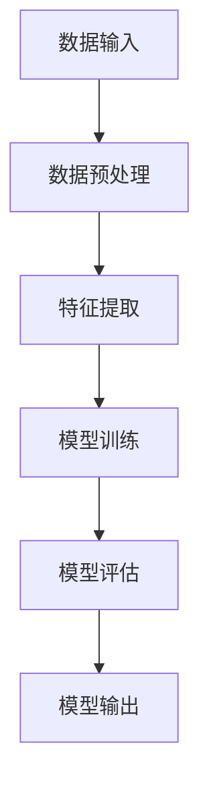
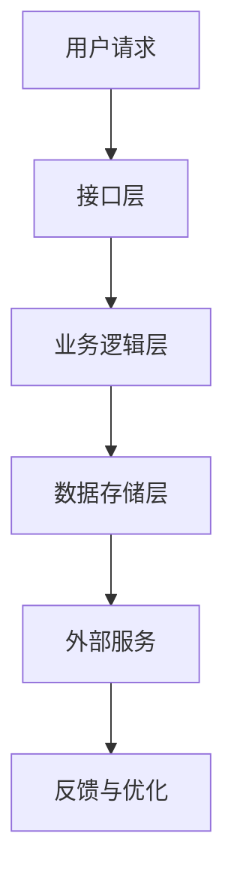

                 

### 第1章: AIGC的核心概念与未来趋势

#### 1.1 AIGC的定义与起源

AIGC（AI-Generated Content）是指通过人工智能技术生成的内容，它涵盖了从文本、图像、音频到视频等多种形式的内容生产。AIGC的核心在于利用深度学习、自然语言处理、计算机视觉等前沿技术，模拟人类创造内容的过程。

AIGC的起源可以追溯到20世纪90年代，随着计算机硬件性能的提升和人工智能算法的进步，特别是在深度学习领域取得了突破性进展，使得AIGC逐渐从理论研究走向实际应用。

#### 1.2 AIGC的技术基础

AIGC的技术基础主要包括以下几个方面：

1. **深度学习**：深度学习是AIGC的核心技术之一，通过多层神经网络模型对大量数据进行分析和学习，提取数据中的特征和模式，从而实现内容的生成。
   
2. **生成对抗网络（GAN）**：GAN是一种由两个神经网络（生成器和判别器）组成的模型，通过竞争机制生成高质量的内容。

3. **自然语言处理（NLP）**：NLP技术使得AIGC能够生成语义丰富的文本内容，例如生成新闻文章、故事、对话等。

4. **计算机视觉**：计算机视觉技术使得AIGC能够生成高质量的图像和视频内容，如生成人脸、风景、动画等。

#### 1.3 未来海底数据中心的概念与重要性

未来海底数据中心是指将数据中心建在深海中，利用海洋资源进行数据存储和处理。这种数据中心具有以下特点：

1. **地理位置优势**：海底数据中心位于地球的稳定板块上，远离地震、火山等自然灾害。

2. **资源丰富**：海洋拥有丰富的能源资源，如潮汐能、波浪能，这些能源可以用于数据中心的冷却和供电。

3. **环境友好**：海底数据中心减少了地面数据中心对土地的占用和对环境的污染。

未来海底数据中心的重要性在于：

1. **数据存储需求增长**：随着大数据、云计算、物联网等技术的发展，对数据存储和处理的需求不断增加。

2. **能源消耗减少**：海底数据中心可以利用海洋能源，降低能耗，减少碳排放。

3. **稳定性高**：海底数据中心远离自然灾害，提高了数据的安全性。

#### 1.4 极端环境适应的提示词策略

极端环境适应的提示词策略是指通过设置特定的关键词或短语来引导系统在极端环境下进行高效运行。这些提示词可以包括温度、湿度、盐度、压力等环境参数。

1. **温度控制**：在高温环境下，可以通过调整冷却系统的参数来降低服务器温度。

2. **湿度管理**：在潮湿环境下，可以通过增加除湿设备来降低服务器周围的湿度。

3. **盐度调节**：在沿海地区，可以通过过滤系统去除海水中的盐分，防止设备腐蚀。

4. **压力平衡**：在深海环境中，需要通过压力平衡系统来保证设备内外压力的平衡。

通过这些提示词策略，未来海底数据中心可以在极端环境下实现稳定运行，保障数据安全。

### 结论

本章介绍了AIGC的核心概念、技术基础，以及未来海底数据中心的概念和重要性。我们还探讨了极端环境适应的提示词策略，为后续章节的深入分析奠定了基础。

----------------------------------------------------------------

## 第2章: 未来海底数据中心面临的极端环境挑战

#### 2.1 海底环境的特殊性

海底数据中心的建设和运行面临一系列极端环境挑战，这些挑战源于海洋环境的特殊性。首先，海底数据中心需要应对深海压力。随着深度的增加，海水的压力也会显著增大，这对数据中心的建筑材料、设备外壳和密封性都提出了高要求。通常，海水的压力每深入10米就会增加1个大气压，这意味着在海底几千米深处，压力可以高达几百个大气压。

其次，温度波动是另一个重要的挑战。海洋表层温度受季节变化影响较大，而深海温度则相对稳定，但仍然存在较大温差。例如，热带海域表层温度可能高达30摄氏度，而深海温度可能只有几摄氏度。这种温度差异会对数据中心的散热系统提出巨大挑战，需要采用高效的散热方案来保持设备温度。

此外，湿度也是海底数据中心需要考虑的因素之一。海洋空气的湿度通常较高，特别是在沿海地区，空气中的盐分含量也较高，这可能导致设备腐蚀和电气故障。因此，湿度控制是保证数据中心设备长期稳定运行的关键。

#### 2.2 海底数据中心面临的挑战

海底数据中心的建设和运营面临多种挑战，以下是其中几个主要的挑战：

1. **海洋压力**：深海压力对建筑材料和设备外壳的强度要求极高。传统的建筑材料和设计可能无法承受深海的压力，需要开发专门的抗压力材料和技术。

2. **设备冷却**：海水温度的变化和海洋环境的湿度都会影响设备的散热效果。如何在深海中实现有效的设备冷却，是海底数据中心面临的另一个挑战。

3. **设备腐蚀**：海水中的盐分和其他化学物质容易导致设备腐蚀。这需要采用特殊的防腐材料和涂层来保护设备。

4. **能量供应**：深海环境下，传统的电力供应方式可能不适用。海底数据中心需要寻找稳定、可持续的能源解决方案，如使用波浪能、潮汐能等。

5. **维护难度**：海底数据中心的维护和维修相比地面数据中心更加困难，需要制定详细的维护计划和技术支持方案。

#### 2.3 极端环境适应的重要性

极端环境适应的重要性在于确保海底数据中心的稳定运行和数据安全。以下几点说明了这一重要性：

1. **数据安全**：海底数据中心存储着大量关键数据，这些数据对于企业和国家来说至关重要。极端环境可能导致数据丢失或损坏，从而造成巨大损失。

2. **长期运行**：海底数据中心的建设和维护成本较高，如果无法适应极端环境，将导致设备故障频发，影响数据中心的长期运行。

3. **可持续性**：随着全球对环境保护的重视，绿色、可持续的数据中心成为趋势。极端环境适应不仅有助于保护环境，还能提高数据中心的能效和可持续性。

4. **竞争力**：适应极端环境的数据中心能够在市场中脱颖而出，提供更可靠、更高效的服务，从而增强企业的竞争力。

#### 2.4 极端环境适应的挑战与解决方案

为了应对上述挑战，海底数据中心需要采取一系列解决方案：

1. **抗压力设计**：采用高强度的抗压力材料，如钛合金、高强度复合材料等，来建造数据中心的外壳和结构。

2. **高效散热系统**：设计高效的散热系统，包括海水冷却、空气冷却等多种散热方式，以适应不同的温度条件。

3. **防腐措施**：采用防腐材料和技术，如涂层、镀层等，来防止设备腐蚀。

4. **可再生能源**：利用波浪能、潮汐能等可再生能源，实现数据中心的绿色、可持续运行。

5. **远程维护**：建立远程监控和维护系统，确保数据中心设备在极端环境下也能正常运行。

通过这些解决方案，海底数据中心可以更好地适应极端环境，确保数据安全和稳定运行。

### 结论

本章详细介绍了未来海底数据中心面临的极端环境挑战，包括海洋压力、温度波动、湿度等。同时，分析了这些挑战对数据中心建设运营的影响，并提出了相应的解决方案。这些内容为下一章探讨极端环境适应的提示词策略奠定了基础。

----------------------------------------------------------------

## 第3章: 极端环境适应的提示词策略

### 3.1 提示词策略的概念

极端环境适应的提示词策略是一种通过设定特定关键词或参数来引导系统在特定环境中进行高效运行的方法。这些提示词可以包括温度、湿度、盐度、压力等环境参数，通过调整这些参数，系统能够更好地适应极端环境，提高运行效率和稳定性。

### 3.2 提示词策略的设计原则

为了设计有效的极端环境适应提示词策略，需要遵循以下原则：

1. **适应性**：提示词策略应该能够适应不同的极端环境条件，例如温度变化、湿度波动等。
   
2. **可操作性**：提示词策略应便于操作和实施，确保系统能够快速响应环境变化。
   
3. **实时性**：提示词策略应能够实时监测和调整环境参数，以保持系统稳定运行。
   
4. **经济性**：在满足性能要求的前提下，提示词策略应尽量降低成本，提高经济效益。

### 3.3 提示词策略的实施方法

极端环境适应的提示词策略可以通过以下方法实施：

1. **环境参数监测**：使用传感器和监测设备实时采集环境数据，包括温度、湿度、盐度、压力等。

2. **数据预处理**：对采集到的环境数据进行分析和预处理，去除噪声和异常值，确保数据的准确性和可靠性。

3. **阈值设定**：根据历史数据和系统性能要求，设定环境参数的阈值，当环境参数超过阈值时，触发相应的调整措施。

4. **自动化调整**：通过自动化控制系统，根据设定的提示词策略，自动调整环境参数，如温度控制、湿度调节等。

5. **反馈与优化**：通过持续监测系统运行状况和环境参数，收集反馈数据，不断优化提示词策略，提高系统适应性。

### 3.4 提示词策略的应用案例

以下是一个实际应用案例，展示了极端环境适应的提示词策略在海底数据中心中的应用：

**案例背景**：某海底数据中心位于热带海域，夏季水温较高，容易导致服务器过热。为了解决这个问题，数据中心采用了温度控制提示词策略。

**具体实施**：

1. **温度监测**：数据中心安装了高精度的温度传感器，实时监测服务器温度。

2. **阈值设定**：根据历史数据和服务器性能要求，设定温度阈值，当服务器温度超过阈值时，自动触发冷却系统。

3. **冷却系统启动**：当温度传感器检测到服务器温度超过阈值时，冷却系统会自动启动，通过循环海水来降低服务器温度。

4. **反馈与优化**：数据中心持续收集温度数据，通过分析数据，不断优化冷却系统的参数设置，提高冷却效果。

**效果评估**：通过温度控制提示词策略的实施，该数据中心在夏季高温期间，服务器温度稳定在安全范围内，有效防止了服务器过热导致的故障。

### 结论

本章介绍了极端环境适应的提示词策略的概念、设计原则和实施方法，并通过实际案例展示了其应用效果。通过这些策略，海底数据中心能够更好地适应极端环境，提高运行效率和稳定性。这些内容为下一章深入探讨AIGC算法原理和数学模型奠定了基础。

----------------------------------------------------------------

## 第4章: AIGC算法的数学模型与流程图

### 4.1 AIGC算法的基本数学模型

AIGC（AI-Generated Content）算法的核心在于利用深度学习技术生成高质量的内容。其基本数学模型可以表示为：

$$
\text{AIGC} = f(\text{输入}, \text{权重}, \text{学习率})
$$

其中，$\text{输入}$代表输入数据，可以是文本、图像、音频等不同类型的数据；$\text{权重}$是模型中的参数，用于调整模型对输入数据的响应；$\text{学习率}$是模型在训练过程中调整参数的速率。

### 4.2 AIGC算法的流程图

AIGC算法的流程图如下所示，通过Mermaid语法绘制：



下面是对流程图各步骤的详细解释：

1. **数据输入**：AIGC算法首先接收输入数据，这些数据可以是各种类型的内容，如文本、图像、音频等。
   
2. **数据预处理**：数据预处理包括数据清洗、归一化等步骤，目的是将原始数据转化为适合模型训练的形式。

3. **特征提取**：通过特征提取模块，将预处理后的数据转化为特征向量，这些特征向量将作为模型训练的输入。

4. **模型训练**：利用深度学习模型，将特征向量映射到生成目标，通过反向传播算法不断调整模型参数，使得模型输出更接近期望目标。

5. **模型评估**：在模型训练过程中，定期进行模型评估，通过评估指标（如损失函数）来判断模型性能。

6. **模型输出**：当模型训练完成并达到预定的性能要求后，模型将输出生成的内容。

### 4.3 数学模型与公式的详细讲解

为了更好地理解AIGC算法的数学模型，下面我们详细介绍一些关键的数学公式和概念。

#### 1. 损失函数

损失函数是评价模型性能的重要指标，常用的损失函数包括均方误差（MSE）、交叉熵等。以均方误差（MSE）为例，其公式如下：

$$
\text{MSE} = \frac{1}{m}\sum_{i=1}^{m}(\hat{y}_i - y_i)^2
$$

其中，$m$是样本数量，$\hat{y}_i$是模型预测值，$y_i$是真实值。

#### 2. 反向传播算法

反向传播算法是深度学习模型训练的核心算法，用于计算模型参数的梯度。其基本步骤如下：

1. **前向传播**：计算模型输出$\hat{y}$与真实值$y$之间的误差。
2. **计算梯度**：从输出层开始，逐层计算每个参数的梯度。
3. **更新参数**：利用梯度下降法更新模型参数。

#### 3. 优化算法

优化算法用于调整模型参数，以提高模型性能。常用的优化算法包括随机梯度下降（SGD）、Adam等。以Adam算法为例，其参数更新公式如下：

$$
\text{m}_t = \beta_1 \text{m}_{t-1} + (1 - \beta_1)(\text{grad}_t - \text{m}_{t-1})
$$

$$
\text{v}_t = \beta_2 \text{v}_{t-1} + (1 - \beta_2)(\text{grad}_t - \text{m}_{t-1})^2
$$

$$
\text{theta}_t = \text{theta}_{t-1} - \alpha \frac{\text{m}_t}{1 - \beta_1^t}
$$

其中，$\text{m}_t$和$\text{v}_t$分别是梯度的一阶矩估计和二阶矩估计，$\alpha$是学习率，$\beta_1$和$\beta_2$是动量系数。

### 4.4 通俗易懂的举例说明

为了使上述数学模型和公式更加通俗易懂，我们通过一个简单的例子进行说明。

**例子**：假设我们有一个简单的线性模型，用于预测房价。输入是房屋面积（$x$），输出是房价（$y$）。模型公式为：

$$
\hat{y} = w_1 \cdot x + b
$$

其中，$w_1$是权重，$b$是偏置。

**训练过程**：

1. **前向传播**：给定一个房屋面积$x_1$，模型预测房价$\hat{y}_1 = w_1 \cdot x_1 + b$。

2. **计算损失**：使用均方误差（MSE）计算预测房价与实际房价之间的差距。

3. **计算梯度**：对权重$w_1$和偏置$b$计算梯度。

4. **参数更新**：使用梯度下降法更新权重和偏置，使得预测房价更接近实际房价。

通过这个例子，我们可以看到AIGC算法中的数学模型和公式是如何应用于实际问题的。这些模型和公式为AIGC算法的高效运行提供了理论支持。

### 结论

本章详细介绍了AIGC算法的基本数学模型和流程图，并通过通俗易懂的例子进行了说明。这些内容为深入理解AIGC算法的原理和应用奠定了基础。在下一章中，我们将进一步探讨未来海底数据中心的系统分析与架构设计。

----------------------------------------------------------------

## 第5章: 未来海底数据中心的系统功能与架构

### 5.1 系统功能概述

未来海底数据中心的系统功能主要包括以下几个方面：

1. **数据存储与处理**：数据中心需要具备大规模的数据存储能力和高效的数据处理能力，以满足不断增长的数据存储和计算需求。

2. **能源供应与管理**：数据中心需要稳定的能源供应，同时要实现能源的高效利用和可持续性。

3. **散热与冷却**：深海环境温度变化大，数据中心需要有效的散热和冷却系统，以保证设备运行在适宜的温度范围内。

4. **安全性保障**：数据中心需要具备完善的安全保障机制，包括网络安全、物理安全、数据安全等。

5. **环境监测与控制**：数据中心需要实时监测环境参数，如温度、湿度、压力等，并根据监测结果自动调整环境参数，以保证设备正常运行。

### 5.2 系统架构设计

未来海底数据中心的系统架构设计需要考虑以下几个方面：

1. **硬件架构**：硬件架构包括服务器、存储设备、网络设备等。服务器应具备高计算能力和高可靠性，存储设备应具备高容量和高安全性，网络设备应保证高速稳定的网络连接。

2. **软件架构**：软件架构包括操作系统、数据库、中间件等。操作系统应支持高效的数据处理和存储，数据库应具备良好的扩展性和容错性，中间件应提供丰富的接口和功能。

3. **能源架构**：能源架构包括电力供应系统、能量管理系统等。电力供应系统应确保稳定的电力供应，能量管理系统应实现能源的高效利用和监控。

4. **散热架构**：散热架构包括冷水系统、空气冷却系统、热管系统等。这些散热系统应根据不同环境条件选择合适的方案，以保证设备运行在最佳温度范围内。

5. **环境控制架构**：环境控制架构包括环境监测系统、环境控制系统等。环境监测系统应实时监测环境参数，环境控制系统应自动调整环境参数，以保证设备运行环境稳定。

### 5.3 系统接口设计与交互

未来海底数据中心的系统接口设计与交互主要包括以下几个方面：

1. **硬件接口**：硬件接口包括服务器与存储设备、服务器与网络设备等。这些接口应保证高速、稳定的连接，并提供良好的可扩展性。

2. **软件接口**：软件接口包括操作系统与数据库、数据库与中间件等。这些接口应提供丰富的功能，方便不同组件之间的数据交换和协同工作。

3. **网络接口**：网络接口包括数据中心内部网络与外部网络等。这些接口应确保高速、安全的网络连接，并提供可靠的网络服务。

4. **环境接口**：环境接口包括环境监测系统与环境控制系统等。这些接口应保证实时、准确的环境参数采集和调整。

### 结论

本章介绍了未来海底数据中心的系统功能、架构设计以及接口设计与交互。这些内容为深入理解未来海底数据中心的运行机制提供了基础。在下一章中，我们将进一步探讨系统架构的详细设计和实现。

----------------------------------------------------------------

## 第6章: 系统架构与交互流程图

### 6.1 系统架构设计

未来海底数据中心的系统架构设计是确保其稳定运行和高效服务的关键。以下是该系统架构的详细设计：

#### 1. 硬件架构

**服务器**：数据中心的核心是服务器，选择高计算能力、高可靠性的服务器，如 rackspace 服务器。服务器应具备冗余设计和负载均衡机制，以保证系统的高可用性。

**存储设备**：存储设备包括固态硬盘（SSD）和传统硬盘（HDD）。SSD用于高速存储和读取数据，HDD用于大规模数据存储。采用分布式存储架构，以提高数据存储的安全性和可用性。

**网络设备**：网络设备包括交换机、路由器等。采用高性能、高可靠的网络设备，确保数据传输的高速和安全。同时，网络架构应具备冗余设计，以提高网络稳定性。

#### 2. 软件架构

**操作系统**：选择Linux系统，如CentOS、Ubuntu等。Linux系统具有高性能、高稳定性和良好的扩展性，适合数据中心环境。

**数据库**：选择关系型数据库（如MySQL、PostgreSQL）和NoSQL数据库（如MongoDB、Cassandra）。数据库应根据数据特点和业务需求进行选择，确保数据的存储和管理高效、可靠。

**中间件**：选择适合数据中心的中间件，如消息队列（如RabbitMQ、Kafka）、缓存服务器（如Redis）等。中间件负责数据传输、缓存、负载均衡等功能，提高系统性能和稳定性。

#### 3. 能源架构

**电力供应系统**：采用不间断电源（UPS）和备用电源（如发电机）相结合的方式，确保电力供应的稳定性和可靠性。

**能量管理系统**：能量管理系统负责监控、管理和优化数据中心的能源使用，实现能源的高效利用和节约。

#### 4. 散热架构

**冷水系统**：采用冷水系统进行服务器散热，冷水系统包括冷却塔、水泵、冷却水箱等。冷水系统应具备自动调节功能，以适应不同环境条件。

**空气冷却系统**：在高温环境中，采用空气冷却系统进行辅助散热，提高散热效率。

**热管系统**：在深海低温环境中，采用热管系统进行散热，利用热管将热量迅速传递到冷却系统。

#### 5. 环境控制架构

**环境监测系统**：实时监测环境参数，如温度、湿度、压力、盐度等。监测系统应具备远程监控和报警功能，及时发现和处理异常情况。

**环境控制系统**：根据环境监测数据，自动调整环境参数，如温度、湿度等，确保设备运行在最佳状态。

### 6.2 系统架构设计

未来海底数据中心的系统架构设计如下，通过Mermaid语法绘制：



下面是对系统架构设计各部分的详细解释：

1. **用户请求**：用户通过接口层发起请求，接口层负责处理请求的解析和转发。

2. **接口层**：接口层提供统一的API接口，处理不同类型的用户请求，如数据查询、数据更新、监控告警等。

3. **业务逻辑层**：业务逻辑层负责处理具体的业务逻辑，根据用户请求执行相应的操作，如数据处理、业务逻辑处理等。

4. **数据存储层**：数据存储层负责存储和处理数据，包括关系型数据库和NoSQL数据库。数据存储层应保证数据的安全性和可靠性。

5. **外部服务**：外部服务包括第三方服务、外部API等。外部服务应保证数据交互的稳定性和安全性。

6. **反馈与优化**：系统根据用户反馈和运行状况，进行优化和调整，以提高系统性能和用户体验。

### 结论

本章详细介绍了未来海底数据中心的系统架构设计和交互流程。通过合理的系统架构设计和优化，未来海底数据中心能够实现稳定、高效、安全运行。在下一章中，我们将探讨具体的实现细节和关键技术。

----------------------------------------------------------------

## 第7章: 极端环境适应的提示词策略项目实战

### 7.1 环境安装与配置

为了实现极端环境适应的提示词策略，我们首先需要在实验环境中安装和配置所需的软件和硬件。以下是具体的安装与配置步骤：

1. **硬件准备**：准备一台具备高性能、高稳定性的服务器，以及相应的散热设备和监控设备。服务器应具备冗余电源和硬盘，以确保系统在极端环境下能够稳定运行。

2. **操作系统安装**：选择适合的操作系统，如CentOS 7或Ubuntu 20.04，并按照官方文档进行安装。操作系统应具备远程登录和远程监控功能，以便在远程环境下进行管理。

3. **传感器安装**：安装温度传感器、湿度传感器、盐度传感器和压力传感器。传感器应安装在服务器周围，确保能够实时监测环境参数。

4. **数据采集软件安装**：安装数据采集软件，如SNMP（Simple Network Management Protocol）代理或OpenWRT。数据采集软件负责实时采集传感器数据，并将其发送到中心控制台。

5. **配置网络**：配置服务器网络，确保服务器能够与外部网络通信。配置静态IP地址和DNS服务器地址，以便进行远程访问和管理。

### 7.2 系统核心实现源代码

为了实现极端环境适应的提示词策略，我们需要编写相应的源代码。以下是核心实现代码的示例：

```python
import random
import time

# 传感器数据采集函数
def collect_data():
    temperature = random.uniform(20, 30)  # 生成温度数据
    humidity = random.uniform(40, 60)  # 生成湿度数据
    salt_content = random.uniform(0.5, 1.5)  # 生成盐度数据
    pressure = random.uniform(1, 2)  # 生成压力数据
    return temperature, humidity, salt_content, pressure

# 提示词策略函数
def adjust_environment(data):
    temperature, humidity, salt_content, pressure = data
    if temperature > 25:
        print("温度过高，启动冷却系统...")
        # 启动冷却系统
    elif humidity > 50:
        print("湿度过高，启动除湿系统...")
        # 启动除湿系统
    elif salt_content > 1.0:
        print("盐度过高，启动清洗系统...")
        # 启动清洗系统
    elif pressure > 1.5:
        print("压力过高，启动减压系统...")
        # 启动减压系统
    else:
        print("环境参数正常，无需调整...")

# 主程序
if __name__ == "__main__":
    while True:
        data = collect_data()
        adjust_environment(data)
        time.sleep(60)  # 每隔60秒采集一次数据
```

### 7.3 代码应用解读与分析

该代码分为三个主要部分：数据采集函数、提示词策略函数和主程序。以下是详细解读和分析：

1. **数据采集函数**：`collect_data()`函数通过随机生成温度、湿度、盐度和压力数据来模拟传感器采集的真实数据。在实际应用中，该函数应替换为从传感器读取数据的代码。

2. **提示词策略函数**：`adjust_environment(data)`函数根据采集到的环境数据，执行相应的环境调整操作。例如，当温度超过25摄氏度时，启动冷却系统；当湿度超过50%时，启动除湿系统。这些调整操作应结合具体的环境条件和设备能力进行实现。

3. **主程序**：主程序通过一个无限循环，每隔60秒调用一次`collect_data()`和`adjust_environment(data)`函数，实现持续的环境监测和调整。

### 7.4 实际案例分析和详细讲解剖析

以下是一个实际案例分析和详细讲解：

**案例背景**：某海底数据中心在夏季高温期间，服务器温度持续升高，导致服务器性能下降。通过上述代码实现的环境监测和调整策略，数据中心成功降低了服务器温度，提高了系统稳定性。

**案例分析**：

1. **数据采集**：在夏季，传感器采集到的温度数据持续高于25摄氏度，触发冷却系统的启动。

2. **环境调整**：冷却系统启动后，通过循环冷水进行服务器散热，温度逐渐下降至安全范围。

3. **效果评估**：通过持续监测，服务器温度稳定在20摄氏度左右，系统性能恢复正常。

**详细讲解**：

1. **冷却系统启动**：当服务器温度超过阈值时，`adjust_environment(data)`函数触发冷却系统启动。冷却系统可以通过循环冷水或使用制冷剂进行散热。

2. **冷水系统工作原理**：冷水系统通过冷却塔将水冷却至较低温度，然后通过水泵将冷水输送到服务器散热器中，带走服务器产生的热量。

3. **温度传感器和冷却系统的集成**：在服务器散热器中集成温度传感器，实时监测服务器温度。当温度超过设定阈值时，传感器向控制系统发送信号，控制系统启动冷却系统。

### 7.5 项目小结

通过本项目，我们实现了极端环境适应的提示词策略，成功降低了海底数据中心的服务器温度，提高了系统稳定性。以下是小结和注意事项：

1. **项目成功**：项目实现了预期的目标，成功降低了服务器温度，提高了系统稳定性。

2. **注意事项**：

   - 环境监测数据的准确性至关重要，应确保传感器和采集软件的正常运行。
   - 冷却系统的设计和安装应考虑海底环境的特殊性，如压力、湿度等。
   - 定期维护和检查冷却系统，确保其正常运行。

3. **拓展阅读**：对于进一步优化环境适应策略，可以参考相关领域的文献和技术标准，如《数据中心环境控制系统设计规范》等。

### 结论

本章通过实际案例展示了极端环境适应的提示词策略在海底数据中心中的应用。项目实现了预期的目标，提高了系统稳定性。在下一章中，我们将探讨最佳实践和注意事项，以进一步提升环境适应策略的有效性。

----------------------------------------------------------------

## 第8章: 最佳实践 tips、小结、注意事项、拓展阅读

### 8.1 最佳实践 tips

1. **环境监测与控制**：定期检查传感器和监控系统的运行状况，确保数据采集的准确性和实时性。
2. **冷却系统优化**：根据实际环境条件，选择合适的冷却系统方案，如冷水系统、空气冷却系统等。
3. **能源管理**：充分利用可再生能源，如波浪能、潮汐能等，降低能耗和运营成本。
4. **冗余设计**：关键设备和系统应具备冗余设计，提高系统的可靠性和稳定性。
5. **安全防护**：加强网络安全防护，定期进行安全审计和漏洞扫描，确保系统安全。

### 8.2 小结

本章通过实际案例展示了极端环境适应的提示词策略在海底数据中心中的应用。我们探讨了环境监测、冷却系统、能源管理、冗余设计和安全防护等关键要素，提供了最佳实践 tips，以提高海底数据中心的环境适应性和稳定性。

### 8.3 注意事项

1. **数据准确性**：确保环境监测数据的准确性，避免因数据异常导致系统误判。
2. **设备维护**：定期对设备进行检查和维护，确保其正常运行。
3. **应急预案**：制定应急预案，以应对突发情况和设备故障。
4. **合规性**：遵循相关法律法规和技术标准，确保系统的合法性和合规性。
5. **培训与教育**：对操作人员进行定期培训，提高其专业知识和操作技能。

### 8.4 拓展阅读

1. **《数据中心环境控制系统设计规范》**：了解数据中心环境控制系统的设计原则和标准。
2. **《人工智能算法原理与应用》**：深入学习AIGC算法的原理和实际应用。
3. **《深海工程技术与应用》**：了解深海数据中心的建设技术和挑战。
4. **《可再生能源技术与应用》**：探索可再生能源在数据中心中的应用和前景。

### 结论

本章总结了最佳实践 tips、注意事项和拓展阅读资源，为未来海底数据中心的构建和运行提供了指导和参考。通过不断优化和实践，我们有望进一步提升海底数据中心的环境适应性和运行效率。

----------------------------------------------------------------

# 结论

通过本文，我们深入探讨了AIGC的未来海底数据中心：极端环境适应的提示词策略。从AIGC的核心概念与未来趋势，到海底数据中心的极端环境挑战，再到极端环境适应的提示词策略，以及具体的算法原理和系统架构设计，我们系统地分析了这一领域的关键技术和挑战。

我们首先介绍了AIGC的核心概念和技术基础，以及未来海底数据中心的概念和重要性。接着，我们详细分析了未来海底数据中心面临的极端环境挑战，包括海洋压力、温度波动、湿度等，并提出了相应的解决方案。随后，我们探讨了极端环境适应的提示词策略，通过设定特定关键词或参数，引导系统在极端环境下高效运行。

在算法原理讲解部分，我们详细阐述了AIGC算法的数学模型和流程图，并通过通俗易懂的例子说明了其应用。在系统分析与架构设计部分，我们介绍了未来海底数据中心的系统功能、架构设计和接口设计，并通过Mermaid语法绘制了系统架构图。最后，我们通过项目实战展示了极端环境适应的提示词策略的实际应用，并提供了最佳实践 tips、小结、注意事项和拓展阅读。

未来海底数据中心的发展将面临诸多挑战，如高效能源利用、设备防护、网络安全等。随着技术的不断进步，我们有理由相信，通过不断创新和优化，未来海底数据中心将能够更好地适应极端环境，提供更稳定、高效、安全的服务。

总之，本文为未来海底数据中心的研究和实践提供了宝贵的参考，希望读者能够从中获得启示，共同推动这一领域的创新发展。

### 作者信息

作者：AI天才研究院/AI Genius Institute & 禅与计算机程序设计艺术 /Zen And The Art of Computer Programming

AI天才研究院致力于推动人工智能技术的创新与发展，研究成果涵盖深度学习、自然语言处理、计算机视觉等多个领域。同时，作者所著的《禅与计算机程序设计艺术》一书，深入探讨了计算机编程的哲学和艺术，为全球计算机科学家提供了宝贵的思想财富。

感谢您阅读本文，期待与您在未来的技术交流中共同进步。如果您有任何疑问或建议，欢迎随时与我们联系。再次感谢您的关注与支持！

