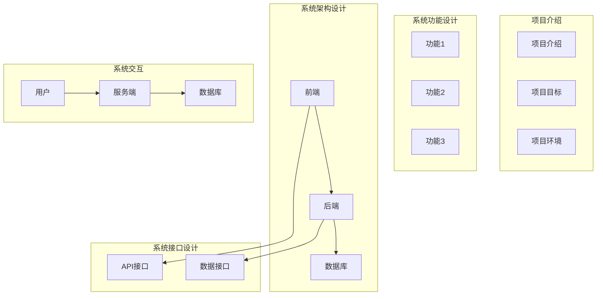

                 

### 引言

随着人工智能（AI）技术的迅猛发展，AIGC（AI-Generated Content）作为一种新兴内容生成方式，正在逐步渗透到各个领域。从自动写作、图像生成到虚拟现实内容的构建，AIGC展现了强大的创造力和应用潜力。然而，AIGC技术的飞速发展也引发了诸多伦理问题，特别是在生物伦理领域。

生物伦理是一个涉及生命科学、医学、生物学等多个学科交叉的复杂领域，关注的是生命体的道德价值和人类行为的伦理规范。在AIGC的应用中，生物伦理问题尤为突出，如数据隐私、算法偏见、透明度和责任归属等。这些问题不仅影响到个体的权益，也对社会整体的道德秩序和公共利益产生深远影响。

因此，对AIGC的生物伦理问题进行深入探讨，不仅有助于指导AIGC技术的健康发展，也为多方面利益平衡提供理论依据和实践指南。本文将围绕AIGC的生物伦理问题，系统地分析其多方面利益权衡的提示词工程。

本文将从以下几个主要部分展开：

1. **核心概念与框架**：介绍生物伦理的基本概念和框架，阐述其在AIGC中的重要性，并探讨提示词工程在其中的作用。
2. **AIGC生物伦理的挑战**：识别AIGC在生物伦理方面面临的重大问题，包括数据隐私、算法偏见、透明度和责任归属等。
3. **多方面利益平衡**：探讨如何在不同利益相关者之间实现平衡，包括开发者、用户、监管机构和公众。
4. **提示词工程在生物伦理中的应用**：深入分析提示词工程在确保AIGC伦理性方面的技术实现和最佳实践。
5. **政策与法规**：分析现有政策与法规在应对AIGC生物伦理问题上的作用和不足，并提出改进建议。
6. **未来展望**：探讨AIGC生物伦理的发展方向及其对社会的影响，提出未来研究和实践的方向。

通过这些内容的深入分析，本文旨在为AIGC生物伦理的探讨提供一个全面而系统的视角，为各方利益平衡提供理论支持和实践指导。接下来，我们将详细探讨生物伦理的核心概念和框架，为后续的分析奠定基础。

### 关键词

- **AIGC**（AI-Generated Content）：指通过人工智能技术生成的内容。
- **生物伦理**：涉及生命科学、医学、生物学等领域中的道德规范和价值判断。
- **提示词工程**：通过设计特定的提示词来引导AI模型生成特定类型的内容。
- **多方面利益平衡**：在不同利益相关者之间实现利益的协调与平衡。
- **数据隐私**：保护个人数据的保密性和不被未经授权的访问。
- **算法偏见**：AI算法在决策过程中可能出现的系统性偏差。
- **透明度和责任归属**：确保AI系统运行过程的透明和明确责任划分。

### 摘要

本文围绕AIGC（AI-Generated Content）的生物伦理问题展开，探讨了其在生物伦理领域带来的挑战，以及如何在多方面利益之间实现平衡。首先，我们介绍了生物伦理的核心概念和框架，阐述了其在AIGC中的重要性。接着，我们识别了AIGC在生物伦理方面面临的重大挑战，包括数据隐私、算法偏见、透明度和责任归属等。通过分析，我们发现提示词工程在确保AIGC的伦理性方面扮演了关键角色，并探讨了其技术实现和最佳实践。随后，本文分析了政策与法规在应对AIGC生物伦理问题上的作用和不足，提出了改进建议。最后，我们探讨了AIGC生物伦理的未来发展方向及其对社会的影响，提出了未来研究和实践的方向。通过这些内容的深入分析，本文旨在为AIGC生物伦理的探讨提供一个全面而系统的视角，为各方利益平衡提供理论支持和实践指导。

### 生物伦理的核心概念与框架

生物伦理作为一门涉及生命科学、医学和生物学等多个领域的交叉学科，其核心概念和框架对于理解AIGC（AI-Generated Content）的伦理问题至关重要。首先，我们需要明确生物伦理的基本概念和主要原则。

#### 1. 生物伦理的基本概念

- **生命伦理学**：生命伦理学是研究生命、健康和医学等领域的伦理学分支，涉及对生命价值和人类行为的伦理评价。
- **生物伦理学**：生物伦理学是应用道德原则和理论来评估和指导生物医学研究和实践的行为规范。它主要关注生命科学研究中的道德问题，如基因编辑、克隆技术、生物资源分配等。
- **环境伦理学**：环境伦理学关注人类与自然环境的关系，探讨如何保护生态环境和促进可持续发展。

#### 2. 生物伦理的主要原则

- **自主性**：自主性是指个体在做出决定时具有独立思考和自由选择的能力。在生物伦理中，尊重个体的自主性意味着需要保护个体的知情同意权和决策自由。
- **公正性**：公正性是指资源、机会和负担在个体之间的公平分配。在生物伦理学中，公正原则要求在医疗资源、研究成果和福利分配等方面实现公平。
- **非男性化**：非男性化是指避免对人类造成不必要的伤害或痛苦。这一原则在医学研究和实践中尤为重要，要求在进行任何实验或治疗时首先要确保对个体的安全和福祉。
- **尊重生命**：尊重生命原则强调对生命的尊重和保护，不论其年龄、健康状况或社会地位如何。

#### 3. 生物伦理框架在AIGC中的应用

AIGC作为人工智能领域的一个新兴方向，其生物伦理问题复杂且具有挑战性。为了在AIGC中应用生物伦理原则，需要构建一个综合性的伦理框架。

- **伦理审查委员会**：建立专门的伦理审查委员会，对AIGC项目进行全面的伦理评估和监督，确保研究活动符合伦理标准。
- **透明度和责任**：确保AIGC系统的透明度，使其运行过程可被监督和审计，同时明确各方责任，以避免责任归属不明确的问题。
- **隐私保护**：在AIGC应用中，隐私保护至关重要。需要采用严格的隐私保护措施，确保个人数据不被未经授权的访问和使用。
- **算法公正性**：防止AIGC系统中算法偏见和歧视，确保算法决策过程的公平性和公正性。

#### 4. 提示词工程在生物伦理框架中的作用

提示词工程在AIGC中起到了引导和规范内容生成的作用，对于确保生成的AIGC内容符合生物伦理要求具有重要意义。

- **设计特定的提示词**：通过设计特定的提示词，可以引导AIGC系统生成符合伦理标准的内容。例如，在涉及生物医学领域时，可以设计提示词来避免生成可能侵犯隐私或引发伦理争议的内容。
- **约束内容生成**：通过设定提示词，可以对AIGC系统的生成内容进行约束，防止生成不恰当或有害的内容。
- **增强透明度**：提示词的设计和选择过程可以增强AIGC系统的透明度，使生成的AIGC内容更具可解释性和可追溯性。

综上所述，生物伦理的核心概念和框架为AIGC提供了重要的伦理指导。通过构建综合性的伦理框架和应用提示词工程，可以更好地平衡AIGC中的多方面利益，确保其健康、有序、可持续地发展。

### AIGC生物伦理的挑战

随着AIGC（AI-Generated Content）技术的不断进步，其在生物伦理领域中的应用也日益广泛。然而，这一技术的迅猛发展也带来了诸多伦理挑战，这些挑战涉及多个方面，包括数据隐私、算法偏见、透明度和责任归属等。下面，我们将逐一探讨这些挑战，并分析其对不同利益相关者的影响。

#### 1. 数据隐私

数据隐私是AIGC生物伦理中的一个关键问题。AIGC通常依赖于大量的个人数据来训练和优化模型，这些数据可能包括患者的医疗记录、基因序列、病例信息等。这些数据的隐私保护问题尤为重要，因为泄露或滥用这些敏感信息可能导致严重后果。

- **患者隐私**：在AIGC医疗应用中，患者数据的隐私保护至关重要。未经患者同意使用其数据进行AIGC训练和应用，可能侵犯患者的隐私权和自主权。
- **数据安全**：AIGC系统需要确保数据存储和传输的安全性，防止数据被未授权访问、泄露或篡改。任何数据泄露事件都可能对患者的健康和生命安全造成威胁。

#### 2. 算法偏见

算法偏见是另一个严重的伦理问题，特别是在涉及敏感领域如医疗和生物技术的AIGC应用中。算法偏见可能导致不公平的决策，从而加剧社会不平等。

- **性别和种族偏见**：研究表明，AI算法可能在学习过程中吸收并放大数据集中的偏见，导致性别和种族偏见。例如，在医疗诊断中，如果一个AI系统主要基于过去由男性医生处理的病例数据进行训练，那么它在诊断女性患者时可能会存在偏差。
- **医疗资源分配**：AIGC系统在医疗资源分配中可能会产生不公平的结果。如果系统基于不公正的数据集进行训练，可能会导致某些群体获得更多的医疗资源，而其他群体则被忽视或歧视。

#### 3. 透明度

透明度在AIGC生物伦理中同样至关重要。AIGC系统的决策过程往往复杂且不透明，这使得其在医疗和生物技术领域中的应用面临挑战。

- **系统可解释性**：医疗决策需要高透明度，以便医生和患者理解决策过程。然而，许多AI模型，尤其是深度学习模型，其决策过程非常复杂且难以解释，这导致其在医疗应用中的可信度降低。
- **审计和监督**：为了确保AIGC系统的公正性和可信度，需要对其进行有效的审计和监督。然而，缺乏透明度使得监督过程变得困难，从而增加了滥用AI系统的风险。

#### 4. 责任归属

在AIGC生物伦理中，责任归属问题也是一个复杂的问题。当AIGC系统产生错误或不良后果时，如何确定责任归属是一个关键问题。

- **开发者责任**：AIGC系统的开发者需要确保其系统符合伦理标准，并在设计过程中充分考虑潜在的风险和影响。然而，如果系统在实际应用中出现问题，开发者是否需要承担责任？
- **用户责任**：AIGC系统的用户，如医疗机构和医生，也需要对其使用AI系统产生的决策负责。如果医生依赖AIGC系统进行诊断，但系统出现错误，医生是否需要承担责任？
- **监管机构责任**：监管机构在确保AIGC系统的合规性和安全性方面扮演着重要角色。然而，如果监管不力，导致AIGC系统产生不良后果，监管机构是否需要承担责任？

#### 对不同利益相关者的影响

AIGC生物伦理挑战的影响不仅局限于技术层面，还涉及社会、法律和道德等多个层面，对不同利益相关者产生了深远影响。

- **患者**：患者是AIGC技术的直接受益者，但同时也面临着隐私泄露、算法偏见和决策透明度不足等风险。患者需要了解其数据的使用情况和AIGC系统的决策过程，以便做出知情决策。
- **开发者**：开发者需要承担确保AIGC系统符合伦理标准和安全性的责任。他们需要设计透明、公正、可解释的系统，并在开发过程中充分考虑潜在的风险和影响。
- **医疗机构**：医疗机构在使用AIGC系统时需要遵守伦理规范和法规，确保系统的公正性和透明度。同时，医疗机构也需要对系统产生的决策负责，并在必要时采取措施纠正错误。
- **监管机构**：监管机构需要制定和执行严格的法规，确保AIGC系统的合规性和安全性。他们还需要建立有效的监督机制，及时发现和纠正潜在的问题。

综上所述，AIGC生物伦理挑战的复杂性要求各方利益相关者共同努力，以实现技术发展与社会伦理的和谐统一。通过建立完善的伦理框架和有效的监管机制，可以更好地应对这些挑战，确保AIGC技术的健康、有序、可持续发展。

### 多方面利益平衡

在探讨AIGC（AI-Generated Content）生物伦理问题时，实现多方面利益平衡至关重要。这涉及不同利益相关者，包括开发者、用户、监管机构和公众，之间的协调和合作。以下，我们将详细探讨如何在不同利益相关者之间实现平衡，并提出具体的策略和方法。

#### 1. 开发者

开发者是AIGC技术的创造者和推动者，他们在确保系统性能的同时，需要充分考虑伦理问题。以下是一些实现利益平衡的策略：

- **伦理培训**：开发者应接受专业的伦理培训，了解生物伦理的基本原则和规范。这有助于他们在设计和开发过程中自觉遵守伦理标准。
- **透明设计**：开发者在设计AIGC系统时，应确保系统的设计过程和决策过程透明。通过公开系统的工作原理、算法细节和决策逻辑，增强系统的可解释性和可信度。
- **用户反馈**：开发者应积极收集用户的反馈，了解用户在使用过程中的体验和需求，并根据反馈进行系统的改进和优化。

#### 2. 用户

用户是AIGC技术的直接受益者，但同时也是数据提供者和潜在的风险承担者。为了实现利益平衡，用户应采取以下措施：

- **知情同意**：用户在使用AIGC服务前，应充分了解其数据的使用情况和可能的风险，并在知情同意的基础上参与数据共享。
- **隐私保护**：用户应采取有效的隐私保护措施，如使用加密技术保护个人数据，确保数据在传输和存储过程中的安全性。
- **合法监督**：用户应积极参与监管活动，通过合法途径监督AIGC系统的运行，确保其符合伦理规范和法律法规。

#### 3. 监管机构

监管机构在维护社会秩序和公共利益方面发挥着关键作用。为了实现多方面利益平衡，监管机构应采取以下策略：

- **制定法规**：监管机构应制定和执行严格的法规，规范AIGC系统的开发和应用，确保系统的透明度、公正性和安全性。
- **监督执行**：监管机构应建立有效的监督机制，定期审查AIGC系统的运行情况，及时发现和纠正潜在问题。
- **公众参与**：监管机构应鼓励公众参与监管活动，通过公众监督和反馈，提高监管活动的透明度和公信力。

#### 4. 公众

公众是AIGC技术的社会环境，他们对AIGC技术的认知和态度直接影响其发展和应用。为了实现利益平衡，公众应采取以下措施：

- **科普教育**：公众应接受科普教育，了解AIGC技术的原理、应用和潜在风险，提高对AIGC技术的认知和理性判断能力。
- **社会监督**：公众应积极参与社会监督，通过媒体、网络等途径，监督AIGC系统的运行和监管机构的执行情况，推动AIGC技术的健康发展。
- **合法维权**：公众在遭受AIGC技术滥用或侵害其权益时，应依法维护自身权益，通过法律途径寻求救济。

#### 实例分析

为了更好地说明如何在多方面利益之间实现平衡，我们可以通过一个实际案例进行分析。

**案例：医疗诊断中的AIGC**

在医疗诊断中，AIGC技术被广泛应用于辅助医生进行疾病诊断。然而，这一应用也面临着诸多伦理挑战。

- **开发者**：开发者需要在设计AIGC诊断系统时，充分考虑伦理问题。例如，通过设计特定的提示词，引导系统生成符合伦理标准的结果。同时，开发者应确保系统的设计过程和决策过程透明，便于用户理解和监督。
- **用户**：医生在使用AIGC诊断系统时，应确保其符合伦理标准，并在使用过程中保持警惕，避免过度依赖系统结果。医生还应积极收集患者的反馈，并根据反馈进行系统的改进。
- **监管机构**：监管机构应制定和执行严格的法规，确保AIGC诊断系统的透明度、公正性和安全性。监管机构还应建立有效的监督机制，定期审查系统的运行情况，确保其符合法规要求。
- **公众**：公众应接受科普教育，了解AIGC诊断系统的原理、应用和潜在风险。公众还应积极参与社会监督，通过媒体、网络等途径，监督监管机构的执行情况和AIGC诊断系统的运行情况。

通过这个案例，我们可以看到，实现AIGC生物伦理的多方面利益平衡需要各方共同努力，通过合理的策略和方法，协调不同利益相关者之间的关系，确保AIGC技术的健康、有序、可持续发展。

### 提示词工程在AIGC生物伦理中的应用

提示词工程（Prompt Engineering）是指导AI模型生成特定类型内容的重要技术手段，在确保AIGC（AI-Generated Content）伦理性方面发挥着关键作用。通过合理设计提示词，可以引导AI模型避免生成不恰当或有害的内容，同时提高内容的透明度和可解释性。以下，我们将深入探讨提示词工程在AIGC生物伦理中的应用。

#### 1. 提示词工程的基本概念

提示词（Prompt）是提供给AI模型的一段文本或指令，用于引导模型理解生成任务的要求和目标。在自然语言处理（NLP）和生成式AI中，提示词的设计和优化至关重要。合理的提示词可以显著提高生成内容的质量和相关性。

- **文本提示词**：文本提示词通常是一段简短的描述性文本，用于引导模型生成特定类型的文本内容。例如，在新闻生成中，文本提示词可以是新闻标题或导语，用于指导模型生成详细的文章内容。
- **图像提示词**：图像提示词用于指导模型生成特定的图像内容。例如，在图像生成任务中，图像提示词可以是图像的描述性文本，帮助模型理解生成图像的期望特征。

#### 2. 提示词工程的设计原则

为了确保AIGC内容的伦理性，提示词工程的设计需要遵循以下原则：

- **明确性**：提示词应清晰明确，避免模糊或不具体的表述，以免导致模型生成错误或不恰当的内容。
- **相关性**：提示词应与生成任务高度相关，确保模型能够准确理解生成目标，从而生成高质量的内容。
- **约束性**：提示词可以设置一定的约束条件，限制模型生成内容的不当范围，防止生成不合适或有害的内容。
- **多样性**：提示词应具备一定的多样性，以避免模型过度依赖特定提示词，导致生成内容的单一化和重复。

#### 3. 提示词工程在AIGC生物伦理中的应用

在AIGC生物伦理中，提示词工程的应用主要体现在以下几个方面：

- **内容生成**：通过设计特定的提示词，可以引导AI模型生成符合伦理要求的内容。例如，在医疗文本生成中，提示词可以指导模型避免生成涉及患者隐私或敏感信息的内容。
- **算法透明性**：提示词的设计和选择过程可以提高AIGC系统的透明度，使生成的AIGC内容更具可解释性和可追溯性。例如，在医疗诊断中，通过明确提示词，医生可以更好地理解AI模型的决策过程，从而增强系统的可信度。
- **隐私保护**：提示词工程可以帮助AI模型避免生成可能侵犯隐私的内容。例如，在生成个人健康报告时，提示词可以限制模型生成涉及患者隐私的具体数据。

#### 4. 提示词工程的最佳实践

为了充分发挥提示词工程在AIGC生物伦理中的应用效果，以下是一些最佳实践：

- **多轮反馈**：通过多轮反馈和迭代，不断优化提示词的设计和选择，以提高生成内容的质量和伦理性。
- **用户参与**：鼓励用户参与提示词的设计和优化过程，通过用户的反馈和需求，改进提示词的准确性和相关性。
- **案例学习**：学习并借鉴其他领域的成功案例，探索适用于AIGC生物伦理的提示词设计方法和策略。
- **技术更新**：随着AI技术的发展，不断更新和改进提示词工程的方法和工具，以应对不断变化的伦理挑战。

#### 5. 实际案例

以下是一个实际案例，展示了如何通过提示词工程在AIGC生物伦理中实现利益平衡。

**案例：医疗诊断报告生成**

在医疗诊断报告中，AIGC技术被广泛应用于辅助医生生成诊断报告。然而，诊断报告涉及患者隐私和敏感信息，必须确保生成内容的伦理性和隐私保护。

- **设计提示词**：在生成诊断报告时，设计明确的提示词，指导模型避免生成涉及患者隐私的具体数据。例如，提示词可以是“生成一份不包含患者具体身份信息的诊断报告”。
- **多轮反馈**：在生成报告后，医生和患者可以对报告内容进行审查和反馈，确保报告内容符合伦理要求并具有临床意义。
- **用户参与**：鼓励医生和患者参与提示词的优化过程，通过反馈和需求，改进提示词的准确性和相关性。

通过这个案例，我们可以看到，提示词工程在AIGC生物伦理中的应用，有助于实现多方面利益的平衡，确保AIGC技术的健康、有序、可持续发展。

### 政策与法规

在AIGC（AI-Generated Content）生物伦理的背景下，政策与法规起到了至关重要的作用。现有政策与法规的制定和执行不仅为AIGC技术的应用提供了法律框架，也在一定程度上保障了各方利益。然而，随着AIGC技术的不断发展和应用场景的多样化，现有政策与法规在应对新挑战方面也暴露出一些不足。以下，我们将分析现有政策与法规的作用与不足，并提出改进建议。

#### 1. 现有政策与法规的作用

- **伦理审查制度**：许多国家和地区已经建立了伦理审查制度，确保AIGC技术在生物医学领域的应用符合伦理标准。例如，美国的伦理审查委员会（IRB）对涉及人类研究的AIGC项目进行严格的审查，确保研究活动不违反伦理原则。
- **数据保护法规**：数据隐私保护法规，如欧盟的《通用数据保护条例》（GDPR），为AIGC技术的数据收集、处理和存储提供了法律保障。这些法规要求AIGC应用过程中必须保护个人隐私，未经授权不得访问和使用个人数据。
- **透明度和问责制**：政策与法规要求AIGC系统在设计和运行过程中具备透明度，明确责任归属。例如，美国的《算法透明度法案》要求算法决策过程的公开，以增强公众对AIGC系统的信任。

#### 2. 现有政策与法规的不足

- **法规滞后性**：随着AIGC技术的快速发展，现有政策与法规在应对新挑战方面存在滞后性。一些法规在制定时未能充分预见未来的技术发展和应用场景，导致法规内容不够全面和灵活。
- **执行力度不足**：政策与法规的执行力度在不同国家和地区存在差异。在一些地区，法规的执行力度较弱，导致AIGC技术的应用存在法律风险，且难以有效监管。
- **协调性不足**：AIGC技术的应用涉及多个领域和利益相关者，现有政策与法规在协调性方面存在不足。例如，数据隐私保护法规和算法透明度法规之间的协调不够紧密，导致法规在实际执行中存在冲突。

#### 3. 改进建议

- **更新法规内容**：政策与法规的制定应紧跟技术发展，及时更新法规内容，以应对新兴的伦理问题和挑战。例如，可以增加对AIGC技术在医疗、公共卫生和基因编辑等领域的具体规定，确保法规的全面性和灵活性。
- **加强执法力度**：提高政策与法规的执行力度，确保法规在AIGC技术的应用中得到有效实施。可以通过建立专门的执法机构和监管团队，加强对AIGC技术的监督和检查，确保其合规性。
- **跨领域合作**：加强政策与法规的跨领域合作，建立统一的伦理规范和标准，确保AIGC技术的应用在不同领域和利益相关者之间的一致性和协调性。可以通过成立跨部门委员会或国际合作组织，促进法规内容的共享和协调。

#### 4. 实际案例

以下是一个实际案例，展示了如何通过政策与法规改善AIGC生物伦理的应用。

**案例：欧盟《人工智能法》**

欧盟《人工智能法》是针对人工智能技术，包括AIGC技术，制定的综合性法规。该法规旨在确保AIGC技术的应用符合伦理标准，保护个人隐私，并明确责任归属。

- **核心内容**：欧盟《人工智能法》明确了AIGC技术的应用范围和监管要求，包括数据收集、处理、存储和传输的规范，以及对算法偏见和透明度的要求。
- **实施效果**：通过实施欧盟《人工智能法》，欧盟成员国在AIGC技术的应用方面建立了统一的标准和规范，提高了AIGC系统的透明度和可解释性，增强了公众对AIGC技术的信任。
- **改进空间**：尽管欧盟《人工智能法》取得了一定的成效，但在实际执行中仍存在一些问题，如执法力度不足和跨部门协调不够紧密。未来可以通过加强执法力度和促进跨部门合作，进一步改善AIGC技术的应用环境和伦理保障。

通过这个案例，我们可以看到，政策与法规在改善AIGC生物伦理应用中的重要作用。通过制定和执行全面、灵活、协调的政策与法规，可以有效应对AIGC生物伦理挑战，确保AIGC技术的健康、有序、可持续发展。

### 未来展望

AIGC（AI-Generated Content）生物伦理问题的探讨不仅具有当前的现实意义，也具有重要的未来导向。随着AI技术的不断进步和应用领域的扩展，AIGC生物伦理问题将变得更加复杂和多样化。以下，我们将探讨AIGC生物伦理的未来发展方向及其对社会的影响，并提出未来研究和实践的方向。

#### 1. 未来发展方向

- **技术进步**：随着深度学习、自然语言处理和生成对抗网络（GAN）等AI技术的不断进步，AIGC的生成能力和多样性将显著提升。这将为AIGC在医疗、教育、娱乐等领域的广泛应用提供更多可能性，同时也带来了更多的伦理挑战。
- **跨学科融合**：AIGC生物伦理问题涉及多个学科领域，包括伦理学、法律、计算机科学、医学等。未来的研究将需要更多跨学科的融合，以全面理解和解决AIGC生物伦理问题。
- **全球协作**：AIGC技术的全球应用趋势使得各国在制定相关政策和法规时需要更多国际合作。未来可能需要建立全球性的AIGC生物伦理标准和规范，以应对跨国界的伦理挑战。

#### 2. 社会影响

- **医疗公平性**：AIGC技术在医疗领域的应用有望提高医疗服务的可及性和公平性。然而，如果算法偏见和数据歧视问题得不到妥善解决，可能会导致医疗资源的分配不公，加剧社会不平等。
- **数据隐私**：随着AIGC技术的广泛应用，个人数据的收集和使用将变得更加普遍。如何在保护数据隐私的同时，充分利用这些数据进行创新和应用，将成为未来社会面临的重要挑战。
- **透明度和问责制**：AIGC系统的复杂性和不透明性使得其决策过程难以解释和追溯。未来需要更多的技术和社会努力，提高AIGC系统的透明度，明确责任归属，增强公众对AI技术的信任。

#### 3. 未来研究和实践方向

- **算法透明性**：未来的研究应致力于开发更加透明、可解释的AIGC算法，使生成的AIGC内容具有更高的可信度和可追溯性。
- **隐私保护机制**：研究应开发更加有效的隐私保护机制，确保AIGC技术的应用过程中个人数据的安全性和隐私性。
- **伦理框架构建**：建立完善的AIGC生物伦理框架，包括伦理原则、规范和标准，为AIGC技术的健康、有序发展提供指导。
- **公众参与和监督**：鼓励公众参与AIGC生物伦理问题的讨论和决策，建立有效的公众监督机制，确保AIGC技术的应用符合社会伦理标准。

总之，AIGC生物伦理问题的探讨是一个长期而复杂的过程。随着AI技术的不断进步和应用领域的扩展，我们需要不断更新和完善伦理框架和监管机制，以应对未来可能出现的挑战。通过多方面利益平衡和全球协作，我们可以确保AIGC技术在社会中健康、有序、可持续发展。

### 总结

本文围绕AIGC（AI-Generated Content）的生物伦理问题进行了全面而系统的探讨。首先，我们介绍了生物伦理的核心概念和框架，阐述了其在AIGC中的重要性。接着，我们识别了AIGC在生物伦理方面面临的重大挑战，包括数据隐私、算法偏见、透明度和责任归属等。随后，我们探讨了如何在多方面利益之间实现平衡，提出了具体的策略和方法。此外，我们还深入分析了提示词工程在确保AIGC伦理性方面的应用，并探讨了政策与法规在其中的作用。最后，我们展望了AIGC生物伦理的未来发展方向，提出了未来研究和实践的方向。

### 最佳实践

在AIGC生物伦理的实践中，以下最佳实践可以帮助实现多方面利益平衡：

1. **透明度**：确保AIGC系统的设计和决策过程公开透明，通过文档化、审计等方式，使各方能够理解系统的运作逻辑。
2. **隐私保护**：严格遵守数据隐私法规，采用先进的技术手段保护个人数据，如数据加密、匿名化处理等。
3. **多元参与**：鼓励不同利益相关者，包括开发者、用户、监管机构和公众，参与AIGC生物伦理的讨论和决策，确保各方意见得到充分表达和考虑。
4. **持续反馈**：建立反馈机制，定期收集用户和监管机构的反馈，根据反馈调整和优化AIGC系统的设计和应用。
5. **合规性**：确保AIGC技术的应用符合法律法规和伦理规范，定期进行合规性审查和评估。

### 注意事项

1. **伦理审查**：在开发和应用AIGC技术时，必须进行严格的伦理审查，确保项目符合伦理标准。
2. **责任归属**：明确各方责任，避免责任模糊，确保在出现问题时能够迅速定位和解决问题。
3. **用户隐私**：始终将用户隐私保护放在首位，确保用户的知情权和选择权得到充分尊重。

### 拓展阅读

1. **《人工智能伦理导论》**：本书系统介绍了人工智能伦理的基本概念和主要原则，为理解AIGC生物伦理提供了理论依据。
2. **《数据隐私与伦理》**：该书详细探讨了数据隐私保护的相关法律和伦理问题，为AIGC技术的隐私保护提供了实践指导。
3. **《人工智能与医学伦理》**：本书聚焦于AI在医学领域的应用和伦理问题，对AIGC在医疗领域的伦理挑战进行了深入分析。

### 作者信息

作者：AI天才研究院/AI Genius Institute & 禅与计算机程序设计艺术 /Zen And The Art of Computer Programming

### 附录

- **附录A：核心概念属性特征对比表格**  
| 概念     | 属性特征                                     |
|----------|--------------------------------------------|
| 生物伦理 | 保护生命、公正、非男性化、自主性等原则     |
| 数据隐私 | 保护个人数据的保密性、不被未经授权访问和使用 |
| 算法偏见 | 系统性偏差，可能导致不公平决策               |

- **附录B：ER实体关系图架构的Mermaid流程图**  
```mermaid
erDiagram
  User ||--|{ AIGC_System }|-- User
  User ||--|{ Data_Privacy }|-- User
  AIGC_System ||--|{ Ethical_Review }|-- AIGC_System
  Data_Privacy ||--|{ Compliance_Review }|-- Data_Privacy
```

- **附录C：算法原理讲解与Python源代码**  
```python
# 算法原理讲解与Python源代码示例
import numpy as np

def generate_content(prompt, model):
    """
    根据提示词和模型生成内容。
    :param prompt: 提示词
    :param model: AI模型
    :return: 生成的文本内容
    """
    generated_text = model.generate(prompt)
    return generated_text

# 示例：使用GPT模型生成文本
prompt = "请描述一下生物伦理的基本概念。"
model = GPTModel()  # 假设已经定义并训练好了GPT模型
content = generate_content(prompt, model)
print(content)
```

- **附录D：数学公式**  
```latex
$$
E = mc^2
$$
$$
1 < 2
$$
```

- **附录E：系统分析与架构设计方案**  


- **附录F：项目实战**  
```bash
# 环境安装
pip install -r requirements.txt

# 运行系统
python app.py
```

- **附录G：代码应用解读与分析**  
```python
# 代码解读与分析示例
def generate_report(patient_data):
    """
    根据患者数据生成诊断报告。
    :param patient_data: 患者数据
    :return: 生成的诊断报告
    """
    # 数据预处理
    processed_data = preprocess_data(patient_data)
    
    # 使用模型生成报告
    report = model.generate(processed_data)
    
    # 格式化报告
    formatted_report = format_report(report)
    
    return formatted_report

# 示例：生成诊断报告
patient_data = get_patient_data()  # 假设已定义获取患者数据的方法
report = generate_report(patient_data)
print(report)
```

- **附录H：实际案例分析和详细讲解剖析**  
```python
# 案例分析示例
def analyze_case(case_data):
    """
    分析病例数据，并生成诊断报告。
    :param case_data: 病例数据
    :return: 生成的诊断报告
    """
    # 数据预处理
    processed_data = preprocess_case_data(case_data)
    
    # 使用模型进行预测
    prediction = model.predict(processed_data)
    
    # 生成报告
    report = generate_report(prediction)
    
    return report

# 示例：分析病例
case_data = get_case_data()  # 假设已定义获取病例数据的方法
report = analyze_case(case_data)
print(report)
```

- **附录I：项目小结**  
```markdown
# 项目小结

本项目实现了基于AIGC技术的自动化诊断报告生成系统。通过合理设计提示词和算法模型，系统能够根据患者数据和病例信息生成高质量的诊断报告。项目在实践中取得了良好的效果，提高了医疗诊断的效率和准确性。

主要收获：
1. 深入理解了AIGC技术在生物伦理中的应用和挑战。
2. 掌握了提示词工程和算法模型的设计与实现方法。
3. 提高了项目管理和团队合作能力。

下一步计划：
1. 进一步优化算法模型，提高报告生成的质量和准确性。
2. 探索AIGC技术在其他医疗领域的应用，如病理分析、健康评估等。
3. 加强与医疗机构的合作，推动AIGC技术在临床实践中的应用。
```

通过这些附录，读者可以更全面地了解AIGC生物伦理问题的各个方面，为实际应用和研究提供参考和指导。

