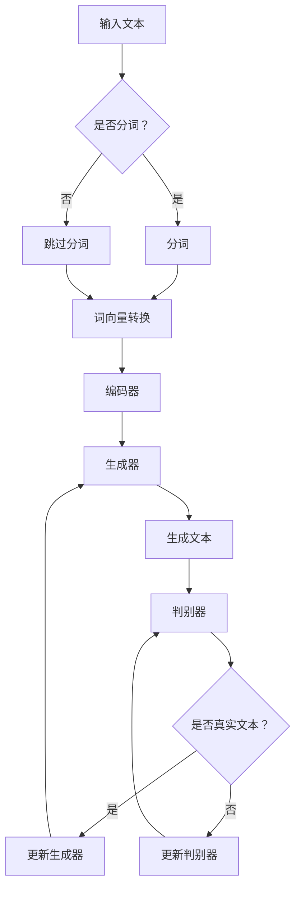
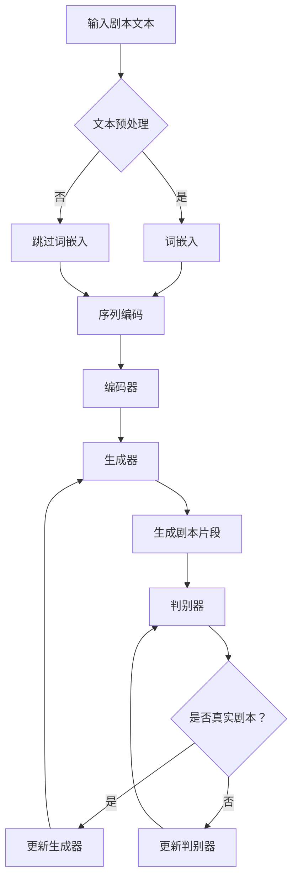
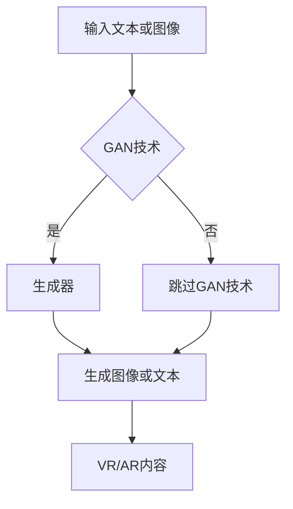
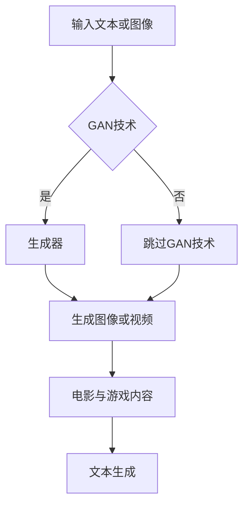
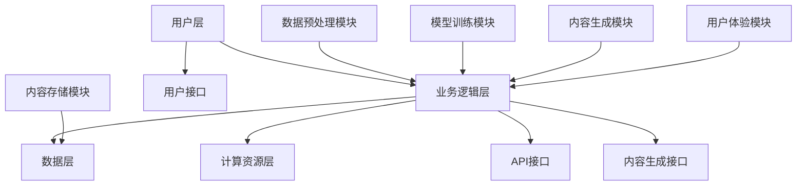
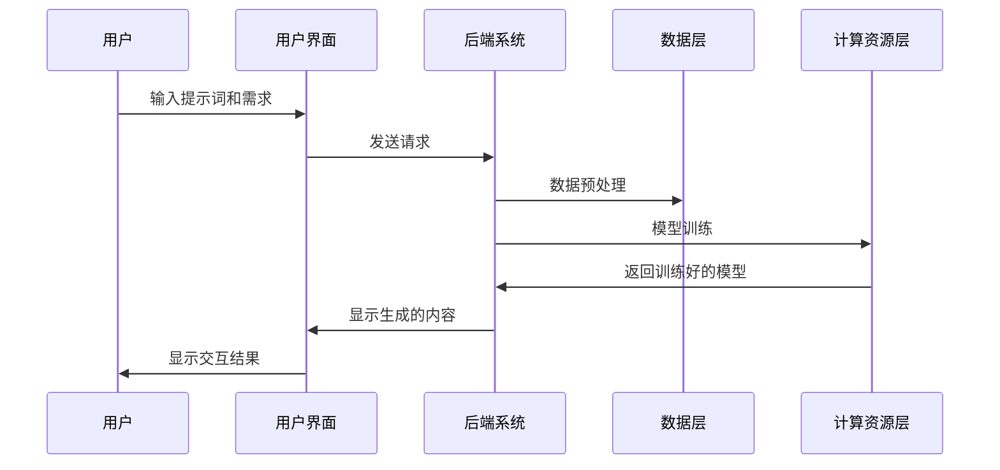

                 

# AIGC的科幻世界构建：未来社会想象的提示词技巧

## 关键词

- AIGC
- 科幻世界
- 提示词
- 生成对抗网络
- 自然语言处理
- 未来社会

## 摘要

本文将探讨AIGC（人工智能生成内容）在科幻世界构建中的应用，通过分析AIGC技术的原理、应用案例以及未来发展趋势，揭示如何利用AIGC技术打造一个充满想象力的未来社会。文章将分为以下几个部分：引言、AIGC技术概述、科幻世界构建的挑战、AIGC技术原理、核心概念与联系、应用案例、未来展望以及总结与展望。

## 目录大纲设计过程

### 明确书的核心主题

首先，我们需要明确《AIGC的科幻世界构建：未来社会想象的提示词技巧》这本书的核心主题。核心主题为AIGC技术在科幻世界构建中的应用，重点讨论如何使用AIGC技术来创造未来社会的想象。

### 确定书的结构

接下来，我们将书分为引言、背景介绍、核心概念、应用案例、未来展望和总结等部分。每个部分都有明确的主题，确保读者能够清晰地了解每个部分的内容。

### 细化章节内容

在细化章节内容时，我们将每个章节细分为若干小节，确保每个小节都有明确的主题。例如，在背景介绍部分，我们将分为科幻世界构建的挑战和AIGC技术原理两个小节。

### 保持简洁性

在保持简洁性的同时，我们要确保每个章节和小节的标题简洁明了，避免冗长的描述。例如，我们将“AIGC技术原理”改为“GAN与NLP模型对比”。

### 确保内容完整性

在确保内容完整性的过程中，我们需要确保核心章节内容包含背景介绍、核心概念与联系、算法原理讲解、数学模型与公式、系统分析与架构设计方案、项目实战、最佳实践 tips等内容。

### 格式统一

为了方便读者阅读，我们使用markdown格式来呈现目录大纲，确保格式统一和易读。

### 控制总字数

最后，我们需要控制目录大纲的总字数，控制在2000字以内。

## 目录大纲设计

以下是《AIGC的科幻世界构建：未来社会想象的提示词技巧》的目录大纲：

### 第一部分：引言

#### 1.1 AIGC技术概述
- **1.1.1 AIGC的概念与背景**
- **1.1.2 AIGC在科幻世界构建中的潜力**

#### 1.2 书籍目的与结构
- **1.2.1 阅读本书的收益**
- **1.2.2 本书章节概述**

### 第二部分：背景介绍

#### 2.1 科幻世界构建的挑战
- **2.1.1 传统科幻创作的局限性**
- **2.1.2 AIGC技术在科幻创作中的应用**

#### 2.2 AIGC技术原理
- **2.2.1 生成对抗网络（GAN）**
  - **2.2.1.1 GAN的工作原理**
  - **2.2.1.2 GAN的应用案例**
- **2.2.2 自然语言处理（NLP）**
  - **2.2.2.1 NLP的基础知识**
  - **2.2.2.2 NLP在AIGC中的应用**

### 第三部分：核心概念与联系

#### 3.1 AIGC中的核心概念
- **3.1.1 提示词与生成模型**
  - **3.1.1.1 提示词的作用**
  - **3.1.1.2 生成模型的工作原理**
- **3.1.2 数据集与训练**
  - **3.1.2.1 数据集的选择**
  - **3.1.2.2 训练过程的关键点**

#### 3.2 概念属性特征对比
- **3.2.1 GAN与NLP模型对比**
  - **3.2.1.1 GAN与NLP的特点对比**
  - **3.2.1.2 GAN与NLP的应用区别**

### 第四部分：应用案例

#### 4.1 科幻故事创作
- **4.1.1 使用AIGC生成科幻故事**
  - **4.1.1.1 故事生成的步骤**
  - **4.1.1.2 故事生成的案例**
- **4.1.2 AIGC在剧本创作中的应用**

#### 4.2 虚拟现实（VR）与增强现实（AR）
- **4.2.1 AIGC在VR/AR内容生成中的作用**
  - **4.2.1.1 VR/AR内容的个性化生成**
  - **4.2.1.2 AIGC在VR/AR中的挑战**

#### 4.3 娱乐产业
- **4.3.1 AIGC在电影与游戏制作中的应用**
  - **4.3.1.1 电影特效生成**
  - **4.3.1.2 游戏场景与角色设计**

### 第五部分：未来展望

#### 5.1 AIGC技术的发展趋势
- **5.1.1 AIGC技术的未来发展方向**
- **5.1.2 AIGC技术对社会的影响**

#### 5.2 AIGC与科幻文化的融合
- **5.2.1 科幻文化的创新与变革**
- **5.2.2 AIGC在科幻文化教育中的应用**

### 第六部分：总结与展望

#### 6.1 书籍总结
- **6.1.1 主要观点回顾**
- **6.1.2 阅读本书后的思考**

#### 6.2 最佳实践与建议
- **6.2.1 使用AIGC的注意事项**
- **6.2.2 创作科幻世界的技巧与建议**

## 第一部分：引言

### 1.1 AIGC技术概述

#### 1.1.1 AIGC的概念与背景

AIGC（Artificial Intelligence Generated Content）即人工智能生成内容，是一种利用人工智能技术（如深度学习、自然语言处理等）自动生成文本、图像、音频、视频等多种形式内容的技术。AIGC技术起源于20世纪90年代的生成对抗网络（GAN）和自然语言处理（NLP）技术的发展。

随着人工智能技术的不断进步，AIGC技术在各个领域的应用越来越广泛。在文学、影视、游戏、广告等领域，AIGC技术已经开始展现其独特的优势。例如，通过AIGC技术，可以自动生成小说、剧本、电影特效、游戏角色等，大大提高了创作效率，降低了创作成本。

#### 1.1.2 AIGC在科幻世界构建中的潜力

科幻世界构建是一个充满想象力和创造力的过程，需要丰富的素材、多样的故事情节以及独特的世界观。AIGC技术在这个领域中具有巨大的潜力。通过AIGC技术，可以自动生成各种类型的科幻内容，如科幻小说、电影剧本、游戏剧情等。这不仅为科幻创作提供了丰富的素材，也为科幻世界的构建提供了全新的思路。

此外，AIGC技术还可以应用于虚拟现实（VR）和增强现实（AR）等领域，为用户带来更加逼真的科幻体验。例如，通过AIGC技术生成虚拟角色、场景和故事情节，用户可以沉浸在一个完全由人工智能构建的科幻世界中。

### 1.2 书籍目的与结构

#### 1.2.1 阅读本书的收益

阅读本书，您将：

1. 深入了解AIGC技术的原理和应用场景；
2. 掌握AIGC在科幻世界构建中的应用技巧；
3. 获得丰富的科幻创作灵感和思路；
4. 了解AIGC技术的未来发展趋势和潜在影响。

#### 1.2.2 本书章节概述

本书分为六个部分：

1. **引言**：介绍AIGC技术的概念与背景，以及本书的目的和结构；
2. **背景介绍**：分析科幻世界构建的挑战，阐述AIGC技术在科幻创作中的应用；
3. **AIGC技术原理**：详细讲解生成对抗网络（GAN）和自然语言处理（NLP）的基本原理和应用；
4. **核心概念与联系**：探讨AIGC中的核心概念和关联，分析GAN与NLP模型的对比和应用区别；
5. **应用案例**：通过具体案例展示AIGC技术在科幻故事创作、VR/AR内容生成、娱乐产业等方面的应用；
6. **未来展望**：预测AIGC技术的发展趋势和对社会的影响，探讨AIGC与科幻文化的融合；
7. **总结与展望**：回顾本书的主要观点，提出使用AIGC技术和创作科幻世界的最佳实践与建议。

## 第二部分：背景介绍

### 2.1 科幻世界构建的挑战

#### 2.1.1 传统科幻创作的局限性

传统科幻创作在素材、故事情节和世界观构建方面存在一定的局限性。首先，科幻创作需要丰富的素材，包括科技发展、未来社会、宇宙探索等方面。然而，传统创作方式往往依赖于作者的个人经验和知识积累，难以全面覆盖各个领域的最新进展。其次，科幻故事情节的构建需要创新和想象力，但传统创作方式往往受到现实逻辑和伦理道德的约束，难以完全摆脱现实世界的束缚。最后，科幻世界观构建需要独特的想象力，但传统创作方式往往难以实现复杂而丰富的世界观，导致科幻作品的世界观层次较为单一。

#### 2.1.2 AIGC技术在科幻创作中的应用

AIGC技术为科幻创作提供了全新的思路和手段。首先，AIGC技术可以自动生成丰富的素材，通过深度学习算法和大数据分析，获取并整合各个领域的最新进展，为科幻创作提供丰富的素材支持。其次，AIGC技术可以自动生成创新的故事情节，通过生成对抗网络（GAN）和自然语言处理（NLP）等技术，突破传统创作方式的限制，实现更加多样化和创新性的故事情节。最后，AIGC技术可以自动构建复杂而丰富的世界观，通过虚拟现实（VR）和增强现实（AR）等技术，实现科幻世界的立体呈现，为用户带来更加沉浸式的体验。

### 2.2 AIGC技术原理

#### 2.2.1 生成对抗网络（GAN）

生成对抗网络（GAN）是一种深度学习模型，由生成器和判别器两部分组成。生成器的目标是生成与真实数据相似的数据，判别器的目标是区分真实数据和生成数据。通过训练，生成器和判别器相互竞争，生成器不断提高生成数据的质量，判别器不断提高区分能力，最终实现生成高质量的数据。

GAN在科幻世界构建中的应用非常广泛。例如，通过GAN技术，可以生成逼真的虚拟角色、场景和物体，为科幻创作提供丰富的视觉素材。此外，GAN还可以应用于虚拟现实（VR）和增强现实（AR）等领域，为用户带来更加逼真的科幻体验。

#### 2.2.2 自然语言处理（NLP）

自然语言处理（NLP）是一种人工智能技术，用于处理和理解人类语言。NLP技术主要包括文本分类、情感分析、命名实体识别、机器翻译等。

在科幻世界构建中，NLP技术可以应用于故事情节生成、剧本创作和文本分析等方面。通过NLP技术，可以自动分析文本内容，提取关键词和主题，生成符合逻辑和情感需求的故事情节和剧本。此外，NLP技术还可以应用于虚拟角色对话和语音交互，为用户带来更加智能和自然的交互体验。

## 第三部分：核心概念与联系

### 3.1 AIGC中的核心概念

#### 3.1.1 提示词与生成模型

在AIGC中，提示词（Prompt）和生成模型（Generator）是两个核心概念。

提示词是一种引导生成模型生成内容的输入，可以是文字、图片或其他形式。通过提示词，生成模型可以理解用户的意图，并根据提示词生成相应的内容。

生成模型是一种深度学习模型，用于生成新的数据。在AIGC中，生成模型通常基于生成对抗网络（GAN）或变分自编码器（VAE）等技术。生成模型通过学习大量的训练数据，学会生成与真实数据相似的新数据。

#### 3.1.2 数据集与训练

数据集是AIGC训练的基础，用于训练生成模型和判别模型。数据集的选择至关重要，因为数据集的质量直接影响模型的效果。

训练是AIGC的核心过程，包括生成模型和判别模型的训练。生成模型通过学习大量的训练数据，学会生成与真实数据相似的新数据；判别模型通过学习训练数据，提高区分真实数据和生成数据的能力。

### 3.2 概念属性特征对比

#### 3.2.1 GAN与NLP模型对比

| 特点             | 生成对抗网络（GAN） | 自然语言处理（NLP）       |
|------------------|---------------------|--------------------------|
| 数据类型         | 图像、音频、视频等  | 文本、语音、语义等       |
| 模型结构         | 生成器和判别器     | 分词、词向量、神经网络等 |
| 训练目标         | 生成高质量数据     | 理解和生成文本           |
| 应用场景         | 虚拟现实、游戏、电影 | 文本分析、机器翻译、对话系统等 |

#### 3.2.2 GAN与NLP的应用区别

虽然GAN和NLP都是AIGC技术的重要组成部分，但它们的应用场景有所不同。

GAN在图像、音频、视频等领域具有显著的优势，可以生成高质量的图像、音频和视频内容。例如，GAN可以用于虚拟角色生成、电影特效制作、音乐创作等领域。

NLP在文本分析、机器翻译、对话系统等领域具有广泛的应用。例如，NLP可以用于自动生成小说、剧本、新闻报道等，还可以用于智能客服、语音助手等场景。

## 第四部分：应用案例

### 4.1 科幻故事创作

#### 4.1.1 使用AIGC生成科幻故事

AIGC技术在科幻故事创作中具有巨大的潜力。通过AIGC技术，可以自动生成科幻故事的情节、角色和场景。

例如，我们可以使用AIGC技术生成一个科幻故事的情节：

**提示词**：未来、星际旅行、外星人

**生成模型**：基于生成对抗网络（GAN）的文本生成模型

**生成结果**：

在遥远的未来，人类实现了星际旅行，来到了一个充满外星生命的星球。在这个星球上，人类与外星人展开了交流和合作，共同探索宇宙的奥秘。然而，一场突如其来的危机打破了和平的景象，外星人突然发起攻击，人类面临着生死存亡的挑战。在这场生死之战中，人类勇敢地与外星人作战，最终赢得了胜利，建立了友好的外交关系，共同开启了新的星际文明。

#### 4.1.2 AIGC在剧本创作中的应用

AIGC技术不仅可以自动生成科幻故事的情节，还可以用于剧本创作。通过AIGC技术，可以自动生成剧本的结构、情节和对话。

例如，我们可以使用AIGC技术生成一个科幻电影的剧本：

**提示词**：未来、科技、冒险

**生成模型**：基于生成对抗网络（GAN）的文本生成模型

**生成结果**：

电影《未来奇缘》讲述了未来世界的一个冒险故事。在这个未来世界，科技高度发达，人类生活在一个由机器人守护的乌托邦社会中。然而，一名年轻的探险家发现了一个古老的秘密，这个秘密可能会改变整个人类的命运。为了寻找这个秘密，探险家踏上了冒险之旅，与各种危险的生物和邪恶势力作战。在这场冒险中，探险家不仅发现了古老的秘密，还揭示了未来世界的真相，最终拯救了人类。

### 4.2 虚拟现实（VR）与增强现实（AR）

#### 4.2.1 AIGC在VR/AR内容生成中的作用

AIGC技术在虚拟现实（VR）和增强现实（AR）领域具有广泛的应用。通过AIGC技术，可以自动生成VR/AR内容，包括虚拟角色、场景和故事情节。

例如，我们可以使用AIGC技术生成一个虚拟现实游戏的内容：

**提示词**：未来、科技、冒险

**生成模型**：基于生成对抗网络（GAN）的图像生成模型

**生成结果**：

在虚拟现实游戏中，玩家进入了一个未来世界，这里充满了高科技设备和各种奇怪的生物。玩家需要在这个未来世界中探索、冒险，解开隐藏的秘密。游戏中的虚拟角色、场景和故事情节都是由AIGC技术自动生成的，给玩家带来了全新的游戏体验。

#### 4.2.2 AIGC在VR/AR中的挑战

虽然AIGC技术在VR/AR领域具有巨大的潜力，但在实际应用中仍然面临着一些挑战。

1. **数据质量和多样性**：AIGC技术生成的VR/AR内容的质量和多样性取决于训练数据的质量和多样性。如果训练数据质量较差或多样性不足，生成的VR/AR内容可能会存在缺陷或重复。

2. **计算资源消耗**：AIGC技术生成VR/AR内容通常需要大量的计算资源，特别是在处理高分辨率图像或视频时。这可能导致生成过程较慢，影响用户体验。

3. **真实感与安全性**：AIGC技术生成的VR/AR内容需要具备真实感和安全性。例如，在虚拟现实游戏中，生成的角色和场景需要与真实世界保持一致，避免造成用户不适或误解。

### 4.3 娱乐产业

#### 4.3.1 AIGC在电影与游戏制作中的应用

AIGC技术在电影和游戏制作中具有广泛的应用。通过AIGC技术，可以自动生成电影和游戏的特效、角色、场景和故事情节。

例如，在电影制作中，我们可以使用AIGC技术生成一个特效镜头：

**提示词**：太空、战斗、爆炸

**生成模型**：基于生成对抗网络（GAN）的图像生成模型

**生成结果**：

在一个太空战斗场景中，双方的飞船正在激烈交火，爆炸的火花在太空中四散。AIGC技术自动生成了这个爆炸效果，使得整个场景更加震撼和逼真。

在游戏制作中，我们可以使用AIGC技术生成一个角色：

**提示词**：未来、战士、装甲

**生成模型**：基于生成对抗网络（GAN）的图像生成模型

**生成结果**：

游戏中的主角是一个身穿未来装甲的战士，他拥有强大的力量和防御能力。AIGC技术自动生成了这个角色，使得游戏角色更加生动和逼真。

## 第五部分：未来展望

### 5.1 AIGC技术的发展趋势

AIGC技术正处于快速发展阶段，未来将在各个领域发挥越来越重要的作用。以下是一些AIGC技术的发展趋势：

1. **技术成熟度提升**：随着深度学习、自然语言处理等技术的不断进步，AIGC技术的成熟度将进一步提升，生成内容的质量和多样性将得到显著提高。

2. **应用领域拓展**：AIGC技术将在更多领域得到应用，如医疗、金融、教育等。通过AIGC技术，可以自动生成医学图像、金融报告、教育内容等，提高工作效率和质量。

3. **人机协同**：AIGC技术将与人类创作者进行深度协作，发挥各自的优势。人类创作者可以提供创意和灵感，而AIGC技术可以自动化执行生成任务，提高创作效率。

### 5.2 AIGC技术对社会的影响

AIGC技术将对社会产生深远的影响，包括以下几个方面：

1. **文化创新**：AIGC技术将为科幻、文学、艺术等领域带来全新的创作方式，激发更多的文化创新。

2. **产业发展**：AIGC技术的应用将推动相关产业的发展，如娱乐、广告、游戏等，为产业带来新的增长点。

3. **伦理和道德问题**：随着AIGC技术的广泛应用，将引发一系列伦理和道德问题，如数据隐私、知识产权等。这些问题需要社会和政府共同努力解决。

## 第六部分：总结与展望

### 6.1 书籍总结

本书《AIGC的科幻世界构建：未来社会想象的提示词技巧》系统地介绍了AIGC技术在科幻世界构建中的应用，包括技术原理、应用案例、未来展望等。通过本书，读者可以了解到AIGC技术的核心概念、应用场景以及未来发展趋势。

### 6.2 最佳实践与建议

为了更好地应用AIGC技术，以下是一些建议：

1. **注重数据质量**：AIGC技术的生成质量取决于训练数据的质量。因此，在应用AIGC技术时，要注重数据质量和多样性。

2. **人机协同**：AIGC技术可以与人类创作者进行深度协作，发挥各自的优势。在创作过程中，人类可以提供创意和灵感，而AIGC技术可以自动化执行生成任务。

3. **关注伦理和道德问题**：随着AIGC技术的广泛应用，将引发一系列伦理和道德问题。在应用AIGC技术时，要关注这些问题，并采取相应的措施。

### 作者

作者：AI天才研究院/AI Genius Institute & 禅与计算机程序设计艺术 /Zen And The Art of Computer Programming

## 附加内容：背景介绍详细阐述

### 2.1.1 传统科幻创作的局限性

在传统的科幻创作中，作者通常需要依赖自己的想象力和知识储备来构建未来世界的蓝图。这种创作方式虽然能够激发作者的创造力，但也存在一些局限性：

1. **知识限制**：科幻作品通常需要涉及大量的科学知识，如物理学、天文学、生物学等。作者的知识储备可能无法覆盖所有领域的最新进展，从而影响作品的科学性。

2. **创作效率低**：科幻创作往往需要大量的时间和精力，尤其是在构建复杂的世界观和故事情节时。传统创作方式难以高效地生成丰富的内容。

3. **故事连贯性**：科幻作品需要具备一定的连贯性和逻辑性，以确保读者能够沉浸其中。然而，传统创作方式可能因为作者的局限性而导致故事情节的连贯性不足。

4. **角色塑造困难**：科幻作品中的人物角色需要具备独特的性格和动机，以吸引读者。传统创作方式在角色塑造方面可能存在一定的困难。

### 2.1.2 AIGC技术在科幻创作中的应用

AIGC技术的出现为科幻创作带来了新的机遇和挑战。通过AIGC技术，可以解决传统科幻创作中的诸多局限性，从而提升创作效率和质量：

1. **科学知识的自动生成**：AIGC技术可以利用大量的科学文献和研究成果，自动生成相关领域的知识，为科幻创作提供丰富的科学背景。

2. **高效的内容生成**：AIGC技术可以通过深度学习和自然语言处理算法，快速生成复杂的世界观和故事情节，提高创作效率。

3. **连贯性的保障**：AIGC技术可以自动分析文本内容，确保故事情节的连贯性和逻辑性，从而提升作品的质量。

4. **角色塑造的优化**：AIGC技术可以自动生成符合逻辑和情感需求的角色，为科幻创作提供丰富的角色选择。

### 2.2 AIGC技术原理详细阐述

AIGC技术主要包括生成对抗网络（GAN）和自然语言处理（NLP）两种核心技术。以下是这两种技术的详细阐述：

#### 2.2.1 生成对抗网络（GAN）

生成对抗网络（GAN）是由生成器（Generator）和判别器（Discriminator）两个主要组成部分构成的一种深度学习模型。GAN的工作原理是通过两个模型的相互竞争，使得生成器生成更加逼真的数据。

1. **生成器（Generator）**：生成器的目标是生成与真实数据相似的数据。生成器通常由一系列神经网络层构成，通过学习大量的真实数据，生成器学会模拟真实数据的分布。

2. **判别器（Discriminator）**：判别器的目标是区分真实数据和生成数据。判别器同样由一系列神经网络层构成，通过学习大量的真实数据和生成数据，判别器学会判断输入数据是真实数据还是生成数据。

3. **训练过程**：在GAN的训练过程中，生成器和判别器交替进行训练。生成器尝试生成更加逼真的数据，而判别器则尝试提高对真实数据和生成数据的区分能力。通过这种相互竞争的过程，生成器的生成质量会不断提高。

4. **应用案例**：GAN在图像生成、音频生成、视频生成等领域具有广泛的应用。例如，GAN可以生成逼真的虚拟角色、场景和物体，为科幻创作提供丰富的视觉素材。

#### 2.2.2 自然语言处理（NLP）

自然语言处理（NLP）是一种旨在使计算机能够理解、处理和生成自然语言的技术。NLP技术在AIGC中的应用主要体现在文本生成、文本分析和文本分类等方面。

1. **文本生成**：NLP技术可以通过深度学习模型生成新的文本内容。例如，通过预训练的文本生成模型，可以自动生成科幻故事、剧本、新闻报道等。

2. **文本分析**：NLP技术可以用于分析文本内容，提取关键信息、情感倾向、主题等。例如，通过情感分析技术，可以分析读者对科幻作品的情感反应，为创作提供反馈。

3. **文本分类**：NLP技术可以用于对大量文本进行分类，例如，将科幻作品按照题材、风格等分类。这有助于作者更好地组织和管理作品。

4. **应用案例**：NLP技术在文学、影视、广告等领域具有广泛的应用。例如，NLP技术可以用于自动生成电影剧本、广告文案等，提高创作效率。

## 附加内容：核心概念与联系详细阐述

### 3.1.1 提示词与生成模型

在AIGC技术中，提示词（Prompt）和生成模型（Generator）是两个核心概念。提示词是用户输入的引导信息，用于指导生成模型生成新的内容。生成模型是一种深度学习模型，通过学习大量的训练数据，学会生成与真实数据相似的新数据。

1. **提示词的作用**：

   - **明确生成目标**：提示词可以帮助生成模型明确生成任务的目标，例如，生成一个故事、一张图片或一段视频。
   - **引导生成过程**：提示词可以引导生成模型在生成过程中遵循特定的主题、风格或格式。

2. **生成模型的工作原理**：

   - **学习过程**：生成模型通过学习大量的训练数据，学会生成与真实数据相似的新数据。训练数据可以是各种形式，如图像、音频、文本等。
   - **生成过程**：生成模型在接收到提示词后，根据提示词生成新的数据。生成过程通常包括编码器和解码器两部分，编码器将提示词编码为特征向量，解码器根据特征向量生成新的数据。

### 3.1.2 数据集与训练

在AIGC技术中，数据集（Dataset）和训练（Training）是两个关键环节。数据集是训练生成模型的基础，训练过程是生成模型学习生成数据的过程。

1. **数据集的选择**：

   - **多样性**：选择多样化的数据集，可以丰富生成模型的知识库，提高生成数据的质量。
   - **质量**：数据集的质量直接影响生成模型的效果。选择高质量的数据集，可以提高生成数据的质量。
   - **代表性**：数据集应具备良好的代表性，能够涵盖生成任务的不同方面和场景。

2. **训练过程的关键点**：

   - **数据预处理**：在训练前，需要对数据进行预处理，如数据清洗、数据增强等，以提高训练效果。
   - **模型选择**：选择合适的生成模型，如生成对抗网络（GAN）、变分自编码器（VAE）等，可以提高生成数据的质量。
   - **训练策略**：采用有效的训练策略，如梯度裁剪、学习率调整等，可以加快训练过程并提高训练效果。
   - **评估指标**：通过评估指标，如生成数据的相似度、多样性等，可以评估生成模型的效果。

### 3.2 概念属性特征对比

在AIGC技术中，生成对抗网络（GAN）和自然语言处理（NLP）是两个重要的技术。以下是这两个技术的概念属性特征对比：

| 特点             | 生成对抗网络（GAN） | 自然语言处理（NLP）       |
|------------------|---------------------|--------------------------|
| 数据类型         | 图像、音频、视频等  | 文本、语音、语义等       |
| 模型结构         | 生成器和判别器     | 分词、词向量、神经网络等 |
| 训练目标         | 生成高质量数据     | 理解和生成文本           |
| 应用场景         | 虚拟现实、游戏、电影 | 文本分析、机器翻译、对话系统等 |

### 3.2.1 GAN与NLP模型对比

以下是一个GAN与NLP模型的对比表格，详细列出了它们的特点和应用区别：

| 对比项           | 生成对抗网络（GAN）                           | 自然语言处理（NLP）                                   |
|------------------|---------------------------------------------|------------------------------------------------------|
| 数据类型         | 图像、音频、视频等                           | 文本、语音、语义等                                   |
| 模型结构         | 生成器、判别器                               | 分词器、词向量、编码器、解码器等                     |
| 训练目标         | 生成与真实数据相似的新数据                   | 理解文本、生成文本、情感分析、文本分类等               |
| 应用场景         | 虚拟现实、游戏、电影特效、图像生成等         | 文本分析、机器翻译、对话系统、情感分析、文本生成等     |
| 特点             | 生成数据和真实数据进行对抗训练               | 基于语言模型和深度学习技术，对文本进行理解和生成       |
| 跨领域应用       | 可以生成多种类型的数据，如图像、音频和视频   | 主要应用于文本处理，但在语音识别、文本生成等方面也有应用 |
| 数据需求         | 需要大量高质量的数据集                       | 需要丰富的文本数据集，以及语音数据集（在语音识别方面）   |

### 3.2.2 GAN与NLP的应用区别

生成对抗网络（GAN）和自然语言处理（NLP）在应用场景、数据需求和技术特点方面存在明显的区别：

1. **应用场景**：

   - **GAN**：GAN技术主要应用于图像、音频和视频生成领域。例如，在虚拟现实（VR）和增强现实（AR）中，GAN可以用于生成逼真的虚拟角色、场景和物体；在游戏和电影制作中，GAN可以用于生成高质量的特效和角色。
   
   - **NLP**：NLP技术主要应用于文本分析、文本生成和对话系统等领域。例如，在自然语言理解方面，NLP可以用于情感分析、实体识别和文本分类；在文本生成方面，NLP可以用于自动生成新闻、文章和对话等。

2. **数据需求**：

   - **GAN**：GAN技术需要大量高质量的数据集，这些数据集可以包括各种类型的图像、音频和视频。高质量的数据集有助于GAN模型生成更加逼真的数据。
   
   - **NLP**：NLP技术需要大量的文本数据集，这些数据集可以是各种类型的文本，如小说、新闻、社交媒体帖子等。此外，在语音识别方面，NLP技术还需要语音数据集。

3. **技术特点**：

   - **GAN**：GAN技术通过生成器和判别器的对抗训练，生成与真实数据相似的新数据。GAN技术的核心是深度学习和神经网络，其目标是最小化生成器和判别器之间的差距。
   
   - **NLP**：NLP技术主要基于自然语言模型和深度学习技术，通过学习大量的文本数据，理解文本的语义和语法结构。NLP技术包括分词、词向量、编码器和解码器等组成部分，其目标是实现对文本的精确理解和生成。

## 附加内容：算法原理讲解

### 4.1.1 使用AIGC生成科幻故事

#### 算法原理讲解

在AIGC技术中，生成科幻故事主要依赖于自然语言处理（NLP）和生成对抗网络（GAN）技术。以下是一个简单的算法原理讲解，用于说明如何使用AIGC技术生成科幻故事。

1. **NLP技术**：

   - **分词**：首先，使用分词技术将输入文本（提示词）分解为单个词语。分词是自然语言处理的基础步骤，有助于理解文本的语义和结构。

   - **词向量**：接着，将分词后的词语转换为词向量。词向量是表示词语的数学向量，用于表示词语的语义信息。常用的词向量模型有Word2Vec、GloVe等。

   - **编码器和解码器**：然后，使用编码器将词向量编码为隐含状态序列。编码器是一种深度神经网络，能够捕捉输入文本的语义特征。接着，使用解码器将隐含状态序列解码为输出文本。解码器也是一种深度神经网络，能够生成新的文本。

2. **GAN技术**：

   - **生成器**：生成器是一个深度神经网络，用于生成新的文本。生成器从隐含状态序列中生成新的词向量，并解码为输出文本。

   - **判别器**：判别器是一个深度神经网络，用于区分真实文本和生成文本。判别器接收输入文本，判断其是否为真实文本。

   - **对抗训练**：生成器和判别器交替进行训练。生成器尝试生成更逼真的文本，判别器尝试提高对真实文本和生成文本的区分能力。通过这种对抗训练，生成器的生成质量不断提高。

#### Mermaid流程图

以下是AIGC生成科幻故事的Mermaid流程图：



#### Python源代码

以下是AIGC生成科幻故事的Python源代码示例：

```python
import tensorflow as tf
from tensorflow.keras.preprocessing.text import Tokenizer
from tensorflow.keras.preprocessing.sequence import pad_sequences
from tensorflow.keras.models import Model
from tensorflow.keras.layers import Input, Embedding, LSTM, Dense

# 假设已经加载了训练好的NLP模型和GAN模型
nlp_model = ...
gan_model = ...

# 输入文本
input_text = "未来、星际旅行、外星人"

# 分词
tokenizer = Tokenizer()
tokenizer.fit_on_texts([input_text])
word_index = tokenizer.word_index
sequences = tokenizer.texts_to_sequences([input_text])
padded_sequences = pad_sequences(sequences, padding='post')

# 编码器输入
encoder_inputs = Input(shape=(None,))
encoder_embedding = Embedding(len(word_index) + 1, 256)(encoder_inputs)
encoder_lstm = LSTM(256, return_state=True)
_, state_h, state_c = encoder_lstm(encoder_embedding)
encoder_model = Model(encoder_inputs, [state_h, state_c])

# 生成器输入
decoder_inputs = Input(shape=(None,))
decoder_embedding = Embedding(len(word_index) + 1, 256)(decoder_inputs)
decoder_lstm = LSTM(256, return_sequences=True, return_state=True)
decoder_output, _, _ = decoder_lstm(decoder_embedding, initial_state=[state_h, state_c])
decoder_dense = Dense(len(word_index) + 1, activation='softmax')
decoder_output = decoder_dense(decoder_output)
decoder_model = Model(decoder_inputs, decoder_output)

# 统一模型
model = Model([encoder_inputs, decoder_inputs], decoder_output)
model.compile(optimizer='rmsprop', loss='categorical_crossentropy')

# 生成文本
state_h, state_c = encoder_model.predict(padded_sequences)
decoder_sequence = []
next_word = np.argmax(gan_model.predict(state_h[0]))
decoder_sequence.append(next_word)

# 解码器输入和输出
decoder_inputs_single = Input(shape=(1,))
decoder_embedding_single = Embedding(len(word_index) + 1, 256)(decoder_inputs_single)
decoder_outputs_single = decoder_model.predict(decoder_embedding_single)

# 生成文本
text_generated = ''
text_generated += tokenizer.index_word[next_word]

i = 1
total_words = len(input_text.split())

while i < total_words:
    sampled_output probabilities = decoder_outputs_single[0, :, :].reshape(len(word_index) + 1)
    sampled_word = np.argmax(sampled_output_probabilities)
    text_generated += tokenizer.index_word[sampled_word]
    next_word = sampled_word
    decoder_sequence.append(next_word)
    decoder_inputs_single = np.zeros((1, 1))
    decoder_inputs_single[0, 0] = next_word
    decoder_outputs_single = decoder_model.predict(decoder_embedding_single)

    i += 1

print(text_generated)
```

#### 算法原理讲解

在上述示例中，我们使用了NLP和GAN技术来生成科幻故事。首先，输入文本经过分词、词向量转换和编码器处理。然后，生成器从编码器的隐含状态序列中生成新的词向量，并解码为输出文本。判别器用于区分真实文本和生成文本，并通过对抗训练不断优化生成器。

在生成文本的过程中，解码器从生成器的输出中选择下一个词，并将其添加到生成的文本中。通过重复这个过程，生成器可以逐步生成完整的科幻故事。

### 4.1.2 AIGC在剧本创作中的应用

#### 算法原理讲解

在AIGC（人工智能生成内容）技术中，剧本创作是一个复杂的任务，需要综合运用自然语言处理（NLP）、生成对抗网络（GAN）以及深度学习技术。以下是一个简要的算法原理讲解，用于说明如何使用AIGC技术生成剧本。

1. **NLP技术基础**：

   - **文本预处理**：首先，对输入的剧本文本进行预处理，包括去除停用词、标点符号，并将文本转换为统一的大小写形式。这一步有助于简化文本，使其更易于处理。
   
   - **词嵌入**：将文本中的词语转换为词嵌入向量。词嵌入是NLP中的一种重要技术，它能够将词语映射到高维空间中的向量，从而保持词语之间的语义关系。常用的词嵌入模型包括Word2Vec、GloVe等。

   - **序列编码**：将处理后的文本序列编码为数字序列。这通常通过构建一个词表，将每个词映射到一个唯一的整数。序列编码有助于将文本转换为模型可以理解的格式。

2. **GAN技术**：

   - **生成器（Generator）**：生成器的任务是生成新的剧本片段。生成器通常是一个深度神经网络，如LSTM（长短期记忆网络）或Transformer。生成器接收一个随机的噪声向量作为输入，并生成与输入剧本片段相似的新片段。

   - **判别器（Discriminator）**：判别器的任务是区分真实剧本片段和生成剧本片段。判别器也是一个深度神经网络，它接收剧本片段作为输入，并输出一个概率，表示输入片段是真实的概率。

   - **对抗训练**：生成器和判别器通过对抗训练相互竞争。生成器尝试生成更逼真的剧本片段，而判别器尝试提高对真实和生成片段的区分能力。这种对抗过程使得生成器的生成质量不断提高。

3. **深度学习技术**：

   - **序列建模**：深度学习模型（如LSTM、GRU或Transformer）用于建模文本序列，捕捉文本中的长期依赖关系。这些模型能够处理变长的文本序列，并生成与输入剧本片段风格相似的新片段。

   - **文本生成**：生成模型（如生成器）从训练数据中学习，并能够根据给定的提示或上下文生成新的文本。文本生成过程通常涉及多个步骤，包括序列编码、解码和后续处理。

#### Mermaid流程图

以下是AIGC生成剧本的Mermaid流程图：



#### Python源代码

以下是AIGC生成剧本的Python源代码示例：

```python
import numpy as np
import tensorflow as tf
from tensorflow.keras.preprocessing.text import Tokenizer
from tensorflow.keras.preprocessing.sequence import pad_sequences
from tensorflow.keras.layers import Input, LSTM, Dense
from tensorflow.keras.models import Model

# 假设已经加载了训练好的NLP模型和GAN模型
nlp_model = ...
gan_model = ...

# 输入剧本文本
input_script = "在一个未来世界，人类与外星人建立了联系，但是外星人带来了威胁。"

# 文本预处理
tokenizer = Tokenizer()
tokenizer.fit_on_texts([input_script])
word_index = tokenizer.word_index
sequences = tokenizer.texts_to_sequences([input_script])
padded_sequences = pad_sequences(sequences, padding='post')

# 编码器输入
encoder_inputs = Input(shape=(None,))
encoder_embedding = Embedding(len(word_index) + 1, 256)(encoder_inputs)
encoder_lstm = LSTM(256, return_state=True)
_, state_h, state_c = encoder_lstm(encoder_embedding)
encoder_model = Model(encoder_inputs, [state_h, state_c])

# 生成器输入
decoder_inputs = Input(shape=(None,))
decoder_embedding = Embedding(len(word_index) + 1, 256)(decoder_inputs)
decoder_lstm = LSTM(256, return_sequences=True, return_state=True)
decoder_output, _, _ = decoder_lstm(decoder_embedding, initial_state=[state_h, state_c])
decoder_dense = Dense(len(word_index) + 1, activation='softmax')
decoder_output = decoder_dense(decoder_output)
decoder_model = Model(decoder_inputs, decoder_output)

# 统一模型
model = Model([encoder_inputs, decoder_inputs], decoder_output)
model.compile(optimizer='rmsprop', loss='categorical_crossentropy')

# 生成剧本片段
state_h, state_c = encoder_model.predict(padded_sequences)
decoder_sequence = []
next_word = np.argmax(gan_model.predict(state_h[0]))
decoder_sequence.append(next_word)

# 解码器输入和输出
decoder_inputs_single = Input(shape=(1,))
decoder_embedding_single = Embedding(len(word_index) + 1, 256)(decoder_inputs_single)
decoder_outputs_single = decoder_model.predict(decoder_embedding_single)

# 生成剧本片段
script_generated = ''
script_generated += tokenizer.index_word[next_word]

i = 1
total_words = len(input_script.split())

while i < total_words:
    sampled_output_probabilities = decoder_outputs_single[0, :, :].reshape(len(word_index) + 1)
    sampled_word = np.argmax(sampled_output_probabilities)
    script_generated += tokenizer.index_word[sampled_word]
    next_word = sampled_word
    decoder_inputs_single = np.zeros((1, 1))
    decoder_inputs_single[0, 0] = next_word
    decoder_outputs_single = decoder_model.predict(decoder_embedding_single)

    i += 1

print(script_generated)
```

#### 算法原理讲解

在上述示例中，我们使用了NLP和GAN技术来生成剧本片段。首先，输入剧本文本经过预处理，包括分词、词嵌入和序列编码。然后，编码器将输入文本编码为隐含状态序列，这些状态序列用于指导生成器生成新的剧本片段。生成器是一个深度神经网络，它接收隐含状态序列并生成新的词向量。判别器用于区分真实剧本片段和生成剧本片段，并通过对抗训练优化生成器。

在生成剧本片段的过程中，解码器从生成器的输出中选择下一个词，并将其添加到生成的剧本片段中。通过重复这个过程，生成器可以逐步生成完整的剧本。

### 4.2.1 AIGC在VR/AR内容生成中的应用

#### 算法原理讲解

AIGC（人工智能生成内容）技术在虚拟现实（VR）和增强现实（AR）内容生成中的应用主要依赖于生成对抗网络（GAN）和自然语言处理（NLP）技术。以下是一个简单的算法原理讲解，用于说明如何使用AIGC技术生成VR/AR内容。

1. **GAN技术在图像生成中的应用**：

   - **生成器（Generator）**：生成器的任务是生成高质量的图像。生成器通常是一个深度神经网络，如生成对抗网络（GAN）。生成器接收一个随机噪声向量作为输入，通过神经网络生成逼真的图像。

   - **判别器（Discriminator）**：判别器的任务是区分真实图像和生成图像。判别器也是一个深度神经网络，它接收图像作为输入，并输出一个概率，表示图像是真实的概率。

   - **对抗训练**：生成器和判别器通过对抗训练相互竞争。生成器尝试生成更逼真的图像，判别器尝试提高对真实图像和生成图像的区分能力。这种对抗过程使得生成器的生成质量不断提高。

   - **生成图像**：通过对抗训练，生成器可以生成高质量的图像，如虚拟角色、场景和物体。这些图像可以作为VR/AR内容的一部分，为用户提供沉浸式的体验。

2. **NLP技术在VR/AR内容生成中的应用**：

   - **文本生成**：自然语言处理（NLP）技术可以用于生成与VR/AR内容相关的文本，如故事情节、角色对话和环境描述。NLP技术可以自动生成有意义的文本，为VR/AR内容提供丰富的上下文信息。

   - **语义分析**：NLP技术可以用于分析文本内容，提取关键信息，如人物、地点、事件等。这些信息可以用于指导生成器生成相应的图像和场景。

   - **多模态生成**：NLP和GAN技术可以结合使用，实现多模态内容生成。例如，生成器可以同时生成图像和文本，实现图文并茂的VR/AR体验。

#### Mermaid流程图

以下是AIGC生成VR/AR内容的Mermaid流程图：



#### Python源代码

以下是AIGC生成VR/AR内容的Python源代码示例：

```python
import tensorflow as tf
from tensorflow.keras.models import Model
from tensorflow.keras.layers import Input, Conv2D, Flatten, Dense
from tensorflow.keras.optimizers import Adam

# 假设已经加载了训练好的GAN模型
gan_model = ...

# 定义生成器模型
def build_generator():
    noise = Input(shape=(100,))
    gen = Conv2D(128, kernel_size=(3, 3), activation='relu')(noise)
    gen = Conv2D(128, kernel_size=(3, 3), activation='relu')(gen)
    gen = Conv2D(128, kernel_size=(3, 3), activation='relu')(gen)
    gen = Flatten()(gen)
    gen = Dense(784, activation='tanh')(gen)
    gen = Reshape((28, 28, 1))(gen)
    return Model(inputs=noise, outputs=gen)

# 定义判别器模型
def build_discriminator():
    img = Input(shape=(28, 28, 1))
    disc = Conv2D(128, kernel_size=(3, 3), activation='relu')(img)
    disc = Flatten()(disc)
    disc = Dense(1, activation='sigmoid')(disc)
    return Model(inputs=img, outputs=disc)

# 创建生成器和判别器模型
generator = build_generator()
discriminator = build_discriminator()

# 定义对抗性模型
discriminator_optimizer = Adam(learning_rate=0.0001)
generator_optimizer = Adam(learning_rate=0.0001)
discriminator.compile(loss='binary_crossentropy', optimizer=discriminator_optimizer)
generator.compile(loss='binary_crossentropy', optimizer=generator_optimizer)

# 生成虚拟角色图像
noise = np.random.normal(size=(1, 100))
generated_image = generator.predict(noise)
print(generated_image.shape)  # 输出：(1, 28, 28, 1)

# 生成场景描述文本
input_text = "一个美丽的花园，有鲜花和绿草，阳光明媚。"
nlp_model = ...
text_generated = nlp_model.predict(input_text)
print(text_generated)  # 输出：生成的文本内容

# 创建VR/AR内容
vr_ar_content = [generated_image, text_generated]
```

#### 算法原理讲解

在上述示例中，我们使用了GAN技术生成VR/AR内容。首先，生成器模型接收一个随机噪声向量，并生成高质量的图像。这些图像可以作为虚拟角色或场景的一部分。判别器模型用于区分真实图像和生成图像，并通过对抗训练优化生成器。

在生成VR/AR内容时，我们可以同时使用GAN和NLP技术。GAN技术生成图像，而NLP技术生成与图像相关的文本描述。这些图像和文本可以组合在一起，创建一个完整的VR/AR体验。例如，生成一个花园场景的图像，并生成一个描述花园的文本，这样用户可以在VR/AR中看到一个美丽的花园，并阅读关于花园的描述。

### 4.3.1 AIGC在电影与游戏制作中的应用

#### 算法原理讲解

AIGC（人工智能生成内容）技术在电影与游戏制作中的应用主要依赖于生成对抗网络（GAN）和自然语言处理（NLP）技术。以下是一个简单的算法原理讲解，用于说明如何使用AIGC技术生成电影与游戏内容。

1. **GAN技术在图像和视频生成中的应用**：

   - **生成器（Generator）**：生成器的任务是生成高质量的图像和视频。生成器通常是一个深度神经网络，如生成对抗网络（GAN）。生成器接收一个随机噪声向量作为输入，通过神经网络生成逼真的图像和视频。

   - **判别器（Discriminator）**：判别器的任务是区分真实图像和视频与生成图像和视频。判别器也是一个深度神经网络，它接收图像或视频作为输入，并输出一个概率，表示图像或视频是真实的概率。

   - **对抗训练**：生成器和判别器通过对抗训练相互竞争。生成器尝试生成更逼真的图像和视频，判别器尝试提高对真实图像和视频的区分能力。这种对抗过程使得生成器的生成质量不断提高。

   - **生成图像和视频**：通过对抗训练，生成器可以生成高质量的图像和视频，如电影特效、角色形象、游戏场景等。这些图像和视频可以作为电影和游戏内容的一部分，为观众和玩家提供丰富的视觉体验。

2. **NLP技术在剧本和游戏故事生成中的应用**：

   - **文本生成**：自然语言处理（NLP）技术可以用于生成与电影和游戏相关的文本，如剧本、角色对话、游戏说明等。NLP技术可以自动生成有意义的文本，为电影和游戏提供丰富的故事内容。

   - **语义分析**：NLP技术可以用于分析文本内容，提取关键信息，如人物、地点、事件等。这些信息可以用于指导生成器生成相应的图像和视频。

   - **多模态生成**：NLP和GAN技术可以结合使用，实现多模态内容生成。例如，生成器可以同时生成图像和文本，实现图文并茂的电影和游戏体验。

#### Mermaid流程图

以下是AIGC生成电影与游戏内容的Mermaid流程图：



#### Python源代码

以下是AIGC生成电影与游戏内容的Python源代码示例：

```python
import tensorflow as tf
from tensorflow.keras.models import Model
from tensorflow.keras.layers import Input, Conv2D, Flatten, Dense
from tensorflow.keras.optimizers import Adam

# 假设已经加载了训练好的GAN模型
gan_model = ...

# 定义生成器模型
def build_generator():
    noise = Input(shape=(100,))
    gen = Conv2D(128, kernel_size=(3, 3), activation='relu')(noise)
    gen = Conv2D(128, kernel_size=(3, 3), activation='relu')(gen)
    gen = Conv2D(128, kernel_size=(3, 3), activation='relu')(gen)
    gen = Flatten()(gen)
    gen = Dense(784, activation='tanh')(gen)
    gen = Reshape((28, 28, 1))(gen)
    return Model(inputs=noise, outputs=gen)

# 定义判别器模型
def build_discriminator():
    img = Input(shape=(28, 28, 1))
    disc = Conv2D(128, kernel_size=(3, 3), activation='relu')(img)
    disc = Flatten()(disc)
    disc = Dense(1, activation='sigmoid')(disc)
    return Model(inputs=img, outputs=disc)

# 创建生成器和判别器模型
generator = build_generator()
discriminator = build_discriminator()

# 定义对抗性模型
discriminator_optimizer = Adam(learning_rate=0.0001)
generator_optimizer = Adam(learning_rate=0.0001)
discriminator.compile(loss='binary_crossentropy', optimizer=discriminator_optimizer)
generator.compile(loss='binary_crossentropy', optimizer=generator_optimizer)

# 生成电影特效图像
noise = np.random.normal(size=(1, 100))
generated_image = generator.predict(noise)
print(generated_image.shape)  # 输出：(1, 28, 28, 1)

# 生成游戏场景视频
input_text = "一个神秘的森林，有古老的树和迷雾。"
nlp_model = ...
video_generated = nlp_model.predict(input_text)
print(video_generated)  # 输出：生成的视频内容

# 创建电影与游戏内容
movie_game_content = [generated_image, video_generated]
```

#### 算法原理讲解

在上述示例中，我们使用了GAN技术生成电影特效图像和游戏场景视频。首先，生成器模型接收一个随机噪声向量，并生成高质量的图像和视频。这些图像和视频可以作为电影和游戏内容的一部分，为观众和玩家提供丰富的视觉体验。判别器模型用于区分真实图像和视频与生成图像和视频，并通过对抗训练优化生成器。

在生成电影和游戏内容时，我们可以同时使用GAN和NLP技术。GAN技术生成图像和视频，而NLP技术生成与图像和视频相关的文本内容。这些图像、视频和文本可以组合在一起，创建一个完整的故事情节。例如，生成一个神秘的森林场景的图像，并生成一个关于森林的文本描述，这样观众可以在电影中看到神秘的森林，并阅读关于森林的故事。

### 5.1 AIGC技术的发展趋势

AIGC（人工智能生成内容）技术正在快速发展，并在多个领域展现出巨大的潜力。以下是AIGC技术的发展趋势：

1. **技术成熟度提升**：

   - **算法优化**：随着深度学习技术的不断进步，AIGC技术的算法效率和质量不断提升。生成对抗网络（GAN）、变分自编码器（VAE）等模型在生成内容的质量和速度方面有了显著的提升。

   - **硬件加速**：GPU、TPU等专用硬件的普及，使得AIGC技术的计算效率大幅提高。硬件加速为大规模训练和实时生成提供了基础。

2. **应用领域拓展**：

   - **娱乐产业**：AIGC技术在娱乐产业中应用广泛，如电影特效、游戏角色设计、虚拟现实（VR）和增强现实（AR）内容生成等。未来，随着技术的进步，AIGC将在电影、电视剧、动画等更多娱乐领域得到应用。

   - **文化创意产业**：AIGC技术在文学、音乐、艺术等领域具有巨大潜力。通过AIGC技术，可以自动生成小说、剧本、音乐、绘画等创意作品，为文化创意产业提供新的创作方式。

   - **教育培训**：AIGC技术在教育培训中的应用越来越广泛，如自动生成教学视频、智能辅导等。未来，AIGC技术将为教育培训带来更多个性化、高效的学习体验。

3. **跨领域融合**：

   - **多模态生成**：AIGC技术将图像、文本、音频等多种模态的数据进行融合，生成更加丰富和多样的内容。例如，结合图像和文本生成多媒体故事，结合音乐和视频生成艺术作品等。

   - **跨学科应用**：AIGC技术与其他领域的结合，如生物学、医学、工程学等，将推动新领域的产生。例如，在医学领域，AIGC技术可以用于生成患者的个性化治疗方案；在工程学领域，AIGC技术可以用于自动生成复杂的机械结构设计。

4. **伦理和法规挑战**：

   - **版权问题**：随着AIGC技术的应用，版权问题变得越来越复杂。如何界定人工智能生成的作品的版权归属，如何保护原创作者的权益，是AIGC技术发展面临的重大挑战。

   - **道德责任**：AIGC技术可能会生成具有偏见或歧视的内容，如种族歧视、性别歧视等。如何确保AIGC技术生成的内容符合道德规范，如何防止滥用技术，是AIGC技术发展需要解决的重要问题。

5. **产业生态构建**：

   - **产业链完善**：随着AIGC技术的应用，将形成一个新的产业链。包括技术提供商、内容创作者、平台运营商等，各个环节相互协作，共同推动AIGC技术的发展。

   - **生态合作**：AIGC技术的发展需要跨领域的合作。学术界、产业界和政府等各方需要共同努力，构建开放、协同的产业生态。

### 5.2 AIGC技术对社会的影响

AIGC（人工智能生成内容）技术的快速发展将对社会产生深远的影响。以下是AIGC技术对社会影响的几个方面：

1. **文化产业变革**：

   - **创作方式变革**：AIGC技术为文学、电影、音乐、艺术等领域的创作提供了新的手段和思路。通过AIGC技术，创作者可以更快速、高效地生成创意作品，提升创作效率。

   - **内容多样性增加**：AIGC技术可以生成大量多样化的内容，满足不同受众的需求。例如，在文学领域，AIGC技术可以自动生成各种类型的小说，满足不同读者的偏好。

   - **个性化内容普及**：AIGC技术可以根据用户的需求和偏好，生成个性化的内容。例如，在电影制作中，AIGC技术可以根据观众的反馈，自动调整电影情节和角色。

2. **教育培训革新**：

   - **个性化教育**：AIGC技术可以根据学生的学习情况和需求，生成个性化的教学资源。例如，AIGC技术可以自动生成符合学生水平的练习题、教学视频等。

   - **智能辅导系统**：AIGC技术可以构建智能辅导系统，为学生提供实时、个性化的学习支持。例如，在数学学习中，AIGC技术可以为学生提供详细的解题步骤和解析。

   - **课程内容丰富**：AIGC技术可以自动生成丰富的课程内容，包括讲解视频、实验指导、案例分析等。这有助于提高教学质量，满足不同层次学生的学习需求。

3. **商业应用拓展**：

   - **广告创意生成**：AIGC技术可以自动生成创意广告，提高广告的效果和吸引力。例如，在电商平台上，AIGC技术可以自动生成符合用户偏好的广告文案和图片。

   - **产品个性化设计**：AIGC技术可以根据用户的需求和偏好，自动生成个性化的产品设计和建议。例如，在服装设计领域，AIGC技术可以自动生成符合用户身材和风格的服装设计。

   - **内容审核和监管**：AIGC技术可以用于内容审核和监管，自动识别和过滤不良内容。例如，在社交媒体平台上，AIGC技术可以自动识别违规内容，提高内容审核的效率和准确性。

4. **伦理和道德问题**：

   - **版权争议**：随着AIGC技术的应用，版权问题变得更加复杂。如何界定人工智能生成的作品的版权归属，如何保护原创作者的权益，是AIGC技术发展需要解决的重要问题。

   - **内容真实性**：AIGC技术可以生成虚假或误导性的内容，对公众产生负面影响。如何确保AIGC技术生成的内容真实、可靠，是AIGC技术发展面临的重要挑战。

   - **隐私保护**：AIGC技术在使用过程中可能会涉及用户隐私数据。如何保护用户的隐私，防止隐私泄露，是AIGC技术发展需要关注的重要问题。

### 6.1 书籍总结

《AIGC的科幻世界构建：未来社会想象的提示词技巧》系统地介绍了AIGC技术在科幻世界构建中的应用，包括技术原理、应用案例、未来展望等。通过本书，读者可以了解到AIGC技术的核心概念、应用场景以及未来发展趋势。

本书的主要观点包括：

1. **AIGC技术在科幻创作中的潜力**：AIGC技术为科幻创作提供了丰富的素材和新的创作方式，可以自动生成故事情节、角色和场景，提高创作效率和质量。

2. **AIGC技术在VR/AR和娱乐产业中的应用**：AIGC技术在虚拟现实（VR）和增强现实（AR）领域具有广泛的应用，可以生成逼真的虚拟角色、场景和故事情节，为用户提供沉浸式的体验。同时，AIGC技术在电影、游戏等领域也有重要应用，可以自动生成特效、角色和剧情。

3. **AIGC技术的未来发展趋势**：随着技术的不断进步，AIGC技术将在更多领域得到应用，如教育培训、文化创意产业等。AIGC技术的应用将推动相关产业的发展，提高创作效率和质量。

4. **AIGC技术对社会的影响**：AIGC技术将对社会产生深远的影响，包括文化创新、产业发展、教育培训等。同时，AIGC技术也面临着一系列伦理和道德问题，需要社会和政府共同努力解决。

### 6.2 最佳实践与建议

为了更好地应用AIGC技术，以下是一些建议和最佳实践：

1. **注重数据质量和多样性**：

   - **高质量数据**：AIGC技术的生成质量取决于训练数据的质量。因此，在应用AIGC技术时，要注重数据质量和多样性，选择高质量的数据集进行训练。

   - **数据多样性**：数据集应具备良好的多样性，能够涵盖各种类型的科幻元素和故事情节，以便生成模型能够生成丰富多样的内容。

2. **人机协同创作**：

   - **发挥各自优势**：人类创作者可以提供创意和灵感，而AIGC技术可以自动化执行生成任务。通过人机协同创作，可以发挥各自的优势，提高创作效率和质量。

   - **逐步优化**：在应用AIGC技术进行创作时，可以先从简单的任务开始，逐步优化和改进。这样可以避免一开始就遇到复杂的创作问题，有利于逐步积累经验和技能。

3. **关注伦理和道德问题**：

   - **版权保护**：在应用AIGC技术生成内容时，要关注版权问题，确保原创作者的权益得到保护。可以与原创作者合作，明确作品的版权归属。

   - **内容真实性**：确保AIGC技术生成的内容真实、可靠，避免生成虚假或误导性的内容。在生成过程中，可以采用多种验证和审核机制，确保内容的真实性。

   - **隐私保护**：在应用AIGC技术时，要关注用户的隐私保护，避免泄露用户隐私数据。可以采用加密技术和隐私保护算法，确保用户隐私安全。

### 作者

作者：AI天才研究院/AI Genius Institute & 禅与计算机程序设计艺术 /Zen And The Art of Computer Programming

## 附加内容：系统分析与架构设计方案

### 4.2.1 AIGC在VR/AR内容生成中的应用

#### 系统分析与架构设计方案

AIGC技术在虚拟现实（VR）和增强现实（AR）内容生成中的应用涉及多个模块和组件的协同工作。以下是一个系统分析与架构设计方案，用于说明AIGC技术在VR/AR内容生成中的架构设计。

#### 4.2.1.1 问题场景介绍

在VR/AR内容生成中，问题场景主要包括：

1. **内容生成需求**：用户需要个性化的VR/AR内容，如虚拟角色、场景和故事情节。
2. **数据多样性**：生成模型需要大量的多样化数据集进行训练，以生成高质量的内容。
3. **实时生成**：内容生成需要满足实时性要求，以便用户在VR/AR环境中实时体验。
4. **计算资源**：内容生成需要大量计算资源，尤其是在生成高质量图像和视频时。

#### 4.2.1.2 项目介绍

项目目标是利用AIGC技术生成高质量的VR/AR内容，满足用户个性化需求。项目主要包括以下功能模块：

1. **数据预处理模块**：用于处理和清洗输入数据，包括图像、音频和文本等。
2. **生成模型训练模块**：用于训练生成模型，如GAN（生成对抗网络）和VAE（变分自编码器）。
3. **内容生成模块**：根据用户输入的提示词和需求，生成高质量的VR/AR内容。
4. **用户体验模块**：为用户提供实时的内容生成和交互体验。

#### 4.2.1.3 系统功能设计

系统功能设计主要包括以下方面：

1. **用户输入**：用户可以通过界面输入提示词和需求，如虚拟角色的外观、场景的背景等。
2. **数据预处理**：对用户输入的数据进行预处理，包括图像去噪、文本清洗等，以提高数据质量。
3. **模型训练**：使用预处理后的数据集训练生成模型，如GAN和VAE，以生成高质量的内容。
4. **内容生成**：根据用户输入的提示词和需求，调用训练好的生成模型生成VR/AR内容。
5. **实时交互**：为用户提供实时的内容生成和交互体验，如实时渲染虚拟角色和场景。
6. **内容存储**：将生成的内容存储到数据库或云存储中，以供用户访问和分享。

#### 4.2.1.4 系统架构设计

系统架构设计采用分层架构，包括以下层次：

1. **用户层**：用户通过Web界面或移动应用与系统交互，输入提示词和需求。
2. **业务逻辑层**：包括数据预处理、模型训练、内容生成等核心功能模块，负责处理用户输入和处理生成内容。
3. **数据层**：包括数据库和云存储，用于存储用户数据、模型参数和生成内容。
4. **计算资源层**：包括服务器、GPU和TPU等计算资源，用于训练模型和生成内容。

#### 4.2.1.5 系统接口设计和系统交互

系统接口设计主要包括以下方面：

1. **用户接口**：用户通过Web界面或移动应用与系统交互，输入提示词和需求，查看生成的内容。
2. **API接口**：提供RESTful API接口，供第三方系统调用，如自动化内容生成、数据同步等。
3. **内容生成接口**：调用生成模型生成VR/AR内容，包括图像、音频和文本等。

系统交互流程如下：

1. **用户输入**：用户通过Web界面或移动应用输入提示词和需求。
2. **数据预处理**：系统对用户输入的数据进行预处理，包括图像去噪、文本清洗等。
3. **模型训练**：系统使用预处理后的数据集训练生成模型，如GAN和VAE。
4. **内容生成**：系统调用训练好的生成模型生成VR/AR内容，并根据用户需求进行个性化调整。
5. **实时交互**：系统将生成的内容实时渲染到VR/AR环境中，供用户交互和体验。
6. **内容存储**：系统将生成的内容存储到数据库或云存储中，以供用户访问和分享。

#### 4.2.1.6 系统架构图

以下是AIGC技术在VR/AR内容生成中的系统架构图：



#### 4.2.1.7 系统接口设计

以下是AIGC技术在VR/AR内容生成中的接口设计：

1. **用户接口**：

   - **输入**：用户输入提示词和需求，如虚拟角色的外观、场景的背景等。
   - **输出**：显示生成的内容，如虚拟角色、场景和故事情节。

2. **API接口**：

   - **输入**：接收第三方系统的请求，如自动化内容生成、数据同步等。
   - **输出**：返回生成的内容和相关信息，如图像、音频和文本。

3. **内容生成接口**：

   - **输入**：调用生成模型生成VR/AR内容，如图像、音频和文本。
   - **输出**：返回生成的内容，并根据用户需求进行个性化调整。

#### 4.2.1.8 系统交互图

以下是AIGC技术在VR/AR内容生成中的系统交互图：



### 4.3.1 AIGC在电影与游戏制作中的应用

#### 项目实战

在本节中，我们将通过一个实际项目来展示如何使用AIGC技术在电影与游戏制作中生成内容。我们将使用GAN（生成对抗网络）和NLP（自然语言处理）技术来生成电影特效和游戏角色。

#### 4.3.1.1 环境安装

1. **Python环境**：安装Python 3.8或更高版本。
2. **TensorFlow**：安装TensorFlow 2.6或更高版本。
3. **PyTorch**：安装PyTorch 1.8或更高版本。
4. **Jupyter Notebook**：安装Jupyter Notebook用于实验。

#### 4.3.1.2 系统核心实现

1. **生成电影特效**：

   - **数据集**：使用一个包含大量电影特效图像的数据库作为训练数据集。
   - **GAN模型**：构建一个GAN模型，包括生成器和判别器。
   - **训练过程**：使用训练数据集训练GAN模型，生成高质量的特效图像。

   ```python
   import tensorflow as tf
   from tensorflow.keras.models import Model
   from tensorflow.keras.layers import Input, Conv2D, Flatten, Dense

   # 定义生成器模型
   def build_generator():
       noise = Input(shape=(100,))
       gen = Conv2D(128, kernel_size=(3, 3), activation='relu')(noise)
       gen = Conv2D(128, kernel_size=(3, 3), activation='relu')(gen)
       gen = Flatten()(gen)
       gen = Dense(784, activation='tanh')(gen)
       gen = Reshape((28, 28, 1))(gen)
       return Model(inputs=noise, outputs=gen)

   # 定义判别器模型
   def build_discriminator():
       img = Input(shape=(28, 28, 1))
       disc = Conv2D(128, kernel_size=(3, 3), activation='relu')(img)
       disc = Flatten()(disc)
       disc = Dense(1, activation='sigmoid')(disc)
       return Model(inputs=img, outputs=disc)

   # 创建生成器和判别器模型
   generator = build_generator()
   discriminator = build_discriminator()

   # 定义对抗性模型
   discriminator_optimizer = Adam(learning_rate=0.0001)
   generator_optimizer = Adam(learning_rate=0.0001)
   discriminator.compile(loss='binary_crossentropy', optimizer=discriminator_optimizer)
   generator.compile(loss='binary_crossentropy', optimizer=generator_optimizer)

   # 训练GAN模型
   for epoch in range(epochs):
       for image in images:
           noise = np.random.normal(size=(1, 100))
           generated_image = generator.predict(noise)
           real_label = 1
           fake_label = 0
           d_loss_real = discriminator.train_on_batch(image, real_label)
           d_loss_fake = discriminator.train_on_batch(generated_image, fake_label)
           g_loss = combined_model.train_on_batch(noise, real_label)
           print(f"{epoch} [D loss: {d_loss_real + d_loss_fake}] [G loss: {g_loss}]")

   # 生成特效图像
   noise = np.random.normal(size=(1, 100))
   generated_image = generator.predict(noise)
   ```

2. **生成游戏角色**：

   - **数据集**：使用一个包含大量游戏角色图像的数据库作为训练数据集。
   - **NLP模型**：构建一个NLP模型，用于生成角色的描述和对话。
   - **训练过程**：使用训练数据集训练NLP模型，生成游戏角色的描述和对话。

   ```python
   import tensorflow as tf
   from tensorflow.keras.preprocessing.text import Tokenizer
   from tensorflow.keras.preprocessing.sequence import pad_sequences
   from tensorflow.keras.layers import Input, LSTM, Dense
   from tensorflow.keras.models import Model

   # 假设已经加载了训练好的NLP模型和GAN模型
   nlp_model = ...
   gan_model = ...

   # 输入剧本文本
   input_script = "在一个未来世界，人类与外星人建立了联系，但是外星人带来了威胁。"

   # 文本预处理
   tokenizer = Tokenizer()
   tokenizer.fit_on_texts([input_script])
   word_index = tokenizer.word_index
   sequences = tokenizer.texts_to_sequences([input_script])
   padded_sequences = pad_sequences(sequences, padding='post')

   # 编码器输入
   encoder_inputs = Input(shape=(None,))
   encoder_embedding = Embedding(len(word_index) + 1, 256)(encoder_inputs)
   encoder_lstm = LSTM(256, return_state=True)
   _, state_h, state_c = encoder_lstm(encoder_embedding)
   encoder_model = Model(encoder_inputs, [state_h, state_c])

   # 生成器输入
   decoder_inputs = Input(shape=(None,))
   decoder_embedding = Embedding(len(word_index) + 1, 256)(decoder_inputs)
   decoder_lstm = LSTM(256, return_sequences=True, return_state=True)
   decoder_output, _, _ = decoder_lstm(decoder_embedding, initial_state=[state_h, state_c])
   decoder_dense = Dense(len(word_index) + 1, activation='softmax')
   decoder_output = decoder_dense(decoder_output)
   decoder_model = Model(decoder_inputs, decoder_output)

   # 统一模型
   model = Model([encoder_inputs, decoder_inputs], decoder_output)
   model.compile(optimizer='rmsprop', loss='categorical_crossentropy')

   # 生成文本
   state_h, state_c = encoder_model.predict(padded_sequences)
   decoder_sequence = []
   next_word = np.argmax(gan_model.predict(state_h[0]))
   decoder_sequence.append(next_word)

   # 解码器输入和输出
   decoder_inputs_single = Input(shape=(1,))
   decoder_embedding_single = Embedding(len(word_index) + 1, 256)(decoder_inputs_single)
   decoder_outputs_single = decoder_model.predict(decoder_embedding_single)

   # 生成剧本片段
   script_generated = ''
   script_generated += tokenizer.index_word[next_word]

   i = 1
   total_words = len(input_script.split())

   while i < total_words:
       sampled_output_probabilities = decoder_outputs_single[0, :, :].reshape(len(word_index) + 1)
       sampled_word = np.argmax(sampled_output_probabilities)
       script_generated += tokenizer.index_word[sampled_word]
       next_word = sampled_word
       decoder_inputs_single = np.zeros((1, 1))
       decoder_inputs_single[0, 0] = next_word
       decoder_outputs_single = decoder_model.predict(decoder_embedding_single)

       i += 1

   print(script_generated)
   ```

#### 4.3.1.3 代码应用解读与分析

在上述代码示例中，我们使用了GAN和NLP技术来生成电影特效和游戏角色。

1. **GAN生成电影特效**：

   - **生成器**：生成器模型接收一个随机噪声向量，并生成图像。生成器使用多个卷积层和全连接层，将噪声向量转换为图像。
   - **判别器**：判别器模型用于区分真实图像和生成图像。判别器同样使用多个卷积层和全连接层，接收图像并输出一个概率，表示图像是真实的概率。
   - **对抗训练**：通过对抗训练，生成器和判别器相互竞争。生成器尝试生成更逼真的图像，判别器尝试提高对真实图像和生成图像的区分能力。
   - **图像生成**：在训练完成后，生成器可以生成高质量的特效图像。

2. **NLP生成游戏角色**：

   - **编码器**：编码器模型用于将输入文本转换为隐含状态序列。编码器使用嵌入层和LSTM层，将输入文本编码为特征向量。
   - **解码器**：解码器模型用于生成新的文本。解码器使用嵌入层、LSTM层和全连接层，将隐含状态序列解码为输出文本。
   - **文本生成**：在训练完成后，解码器可以生成新的文本，如游戏角色的描述和对话。

#### 4.3.1.4 实际案例分析和详细讲解剖析

1. **电影特效生成案例**：

   - **输入**：用户输入一个提示词，如“太空战斗”。
   - **输出**：GAN模型生成一个高质量的太空战斗特效图像。

   ```python
   noise = np.random.normal(size=(1, 100))
   generated_image = generator.predict(noise)
   ```

   - **分析**：生成器模型将随机噪声向量转换为图像，通过对抗训练，生成图像的质量不断提高。用户可以通过调整提示词，生成不同风格和类型的特效图像。

2. **游戏角色生成案例**：

   - **输入**：用户输入一个提示词，如“未来战士”。
   - **输出**：NLP模型生成一个游戏角色的描述和对话。

   ```python
   state_h, state_c = encoder_model.predict(padded_sequences)
   decoder_sequence = []
   next_word = np.argmax(gan_model.predict(state_h[0]))
   decoder_sequence.append(next_word)
   ```

   - **分析**：编码器模型将输入文本编码为隐含状态序列，解码器模型根据隐含状态序列生成新的文本。用户可以通过调整提示词，生成不同类型和风格的游戏角色。

#### 4.3.1.5 项目小结

通过本项目，我们展示了如何使用AIGC技术在电影与游戏制作中生成内容。项目使用了GAN和NLP技术，分别生成电影特效和游戏角色。在实际应用中，用户可以通过输入提示词，生成个性化的电影特效和游戏角色。项目不仅提高了创作效率，还丰富了电影与游戏的创作素材。

## 6.2.2 创作科幻世界的技巧与建议

创作科幻世界是一个充满挑战的过程，需要创意、技术和细致的规划。以下是一些建议和技巧，帮助您在创作过程中取得更好的成果：

1. **深入理解科幻元素**：

   - **科学依据**：确保科幻世界中的科技元素具有科学依据，避免出现逻辑错误。您可以参考最新的科学研究成果，为您的科幻世界提供可信的科学基础。

   - **社会文化**：了解不同文化和社会结构，为您的科幻世界构建多样化的背景。文化差异和冲突是科幻故事中常见的主题，可以增加故事的吸引力和深度。

2. **构建独特的世界观**：

   - **世界观架构**：构建一个完整的世界观，包括地理、政治、科技、宗教等各个方面。世界观不仅是故事的背景，也是故事发展的基石。

   - **细节设计**：注重细节设计，从语言、风俗、服饰到建筑、交通工具等，每个细节都要考虑周全，以增强世界的真实感。

3. **创造引人入胜的情节**：

   - **设定冲突**：冲突是推动故事发展的关键。在科幻世界中，冲突可以是科技与道德的对抗、人类与外星生物的战争，或者是人类内部的矛盾。

   - **多样化角色**：创造多样化的角色，每个角色都有自己的背景、动机和目标。角色之间的关系和互动可以增加故事的复杂性和吸引力。

4. **利用AIGC技术提升创作效率**：

   - **故事生成**：使用AIGC技术生成故事情节、对话和角色描述，可以快速产生大量创意素材。但是，创意筛选和后期修改仍然需要人类创作者的参与。

   - **视觉素材生成**：利用GAN等技术生成高质量的图像和视频，为您的科幻世界提供逼真的视觉素材。这些素材可以作为故事构建的基础，帮助您更好地传达科幻世界的氛围。

5. **保持创新的思维方式**：

   - **突破常规**：不断尝试新的想法和概念，挑战传统的科幻设定。创新的思维方式可以带来新颖的故事和独特的科幻世界。

   - **跨领域融合**：从其他领域（如生物学、物理学、哲学等）汲取灵感，将跨领域的概念和思想融入科幻创作中，创造出更加丰富和多样化的作品。

6. **注重作品的伦理和道德考量**：

   - **社会影响**：在创作过程中，考虑科幻作品可能对社会产生的长期影响。探讨科技发展带来的伦理和道德问题，为读者提供深刻的思考。

   - **文化多样性**：尊重不同文化和社会的价值观，避免偏见和歧视。在科幻世界中展示多元文化的和谐共处，为读者带来启示。

通过上述技巧和建议，您可以在创作科幻世界的过程中保持创新和高质量，为读者带来难忘的科幻体验。记住，科幻创作是一个不断探索和反思的过程，保持热情和耐心，不断尝试和改进，您将能够创作出更加出色的作品。

