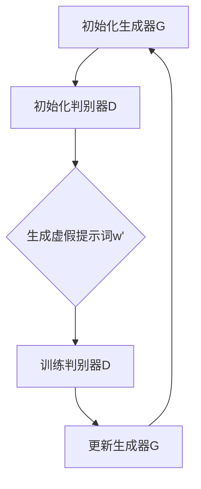
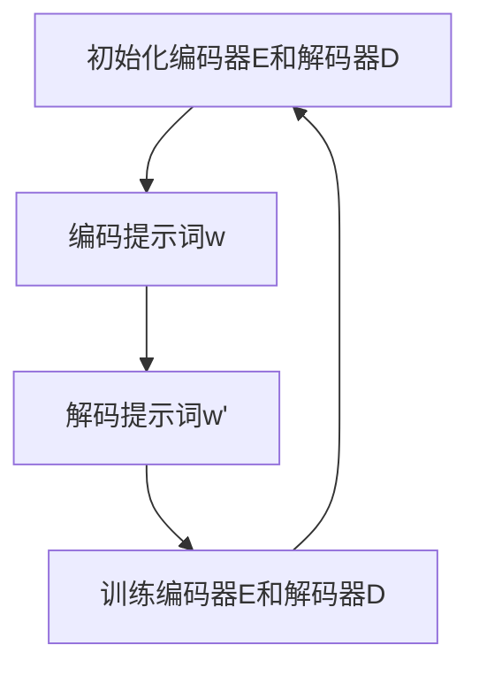
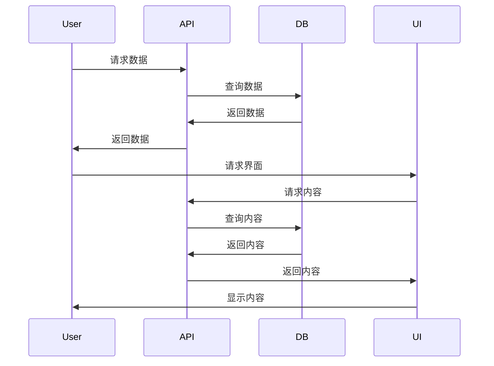
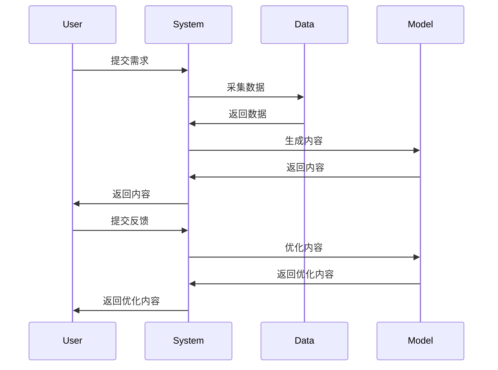

                 

# AIGC的科幻世界构建：未来科技想象的提示词工程

## 摘要

本文探讨了AIGC（自适应智能生成控制）在构建科幻世界中的应用，以及如何通过提示词工程实现这一目标。文章首先介绍了AIGC和科幻世界构建的基本概念和背景，然后分析了提示词工程在科幻世界构建中的关键作用。接下来，文章详细讲解了AIGC和提示词工程的核心概念、联系和算法原理，并通过Mermaid流程图和Python代码实现了相关算法。此外，文章还讨论了数学模型与公式、系统分析与架构设计方案，并提供了项目实战和最佳实践。最后，文章总结了全文的主要内容和结论。

## 引言与背景

### 1.1 AIGC的概念

AIGC（Adaptive Intelligent Generation Control）是一种自适应智能生成控制技术，它通过机器学习和人工智能算法，实现对数据生成、编辑和优化的自动化控制。AIGC的核心思想是利用大规模数据集和先进的深度学习模型，通过自我学习和迭代优化，生成出高质量、多样化的数据内容。

### 1.1.2 科幻世界构建的需求

科幻世界构建是一个复杂的过程，它需要具备高度的创新性和想象力。随着计算机技术和人工智能的发展，科幻世界的构建越来越依赖于算法和数据的支持。AIGC技术在这一过程中扮演了重要角色，它可以为科幻世界的构建提供丰富的数据资源，实现自动化、个性化的内容生成。

### 1.1.3 提示词工程在科幻世界构建中的作用

提示词工程是AIGC在科幻世界构建中的一个重要应用领域。通过设定特定的提示词，可以引导AIGC算法生成符合科幻世界构建需求的文本、图像和声音等内容。提示词工程的核心目标是提高科幻世界构建的效率和质量，实现更加个性化和多样化的内容生成。

### 1.2 当前科幻世界构建的挑战

当前科幻世界构建面临的主要挑战包括：

1. 数据资源不足：科幻世界的构建需要大量的数据支持，但现有的数据资源难以满足这一需求。
2. 内容生成效率低：传统的内容生成方法往往需要大量的人工干预，效率较低。
3. 内容质量难以保证：由于缺乏有效的算法和模型支持，生成的内容质量难以得到保障。
4. 个性化需求难以满足：科幻世界的构建需要根据不同的用户需求生成个性化的内容，但传统方法难以实现这一目标。

### 1.2.2 提示词工程解决的关键问题

提示词工程通过以下方式解决科幻世界构建中的关键问题：

1. 提高数据利用效率：通过设定提示词，可以引导AIGC算法从大量数据中提取出有用的信息，提高数据利用效率。
2. 提升内容生成效率：提示词工程可以减少人工干预，实现自动化内容生成，提升生成效率。
3. 保证内容质量：提示词工程通过设定合理的提示词，引导AIGC算法生成高质量的内容。
4. 满足个性化需求：通过设定不同的提示词，可以生成满足个性化需求的内容，提升用户体验。

### 1.3 AIGC的技术优势

AIGC技术具有以下优势：

1. 大规模数据支持：AIGC可以通过大规模数据集进行训练，实现高质量的数据生成。
2. 自适应学习：AIGC可以根据数据集的特点和需求，自适应地调整模型参数，提高生成效果。
3. 多样化内容生成：AIGC可以生成多种类型的内容，如文本、图像和声音等。
4. 个性化内容生成：AIGC可以根据用户需求生成个性化的内容。

### 1.4 提示词工程的实现策略

提示词工程的实现策略包括：

1. 提取关键信息：从大量数据中提取出关键信息，作为提示词的候选集。
2. 设定提示词：根据科幻世界构建的需求，从候选集中选择合适的提示词。
3. 引导内容生成：通过设定提示词，引导AIGC算法生成符合要求的内容。
4. 优化生成效果：根据生成内容的质量和效果，调整提示词和算法参数，实现不断优化。

### 1.5 AIGC的应用范围

AIGC可以应用于多个领域，包括但不限于：

1. 文本生成：如科幻小说、剧本、新闻报道等。
2. 图像生成：如科幻电影特效、虚拟现实场景、角色建模等。
3. 声音生成：如科幻电影音效、游戏音乐、语音合成等。
4. 视频生成：如科幻电影剪辑、短视频制作、视频特效等。

### 1.6 提示词工程的适用场景

提示词工程适用于以下场景：

1. 科幻世界构建：如虚拟现实、游戏开发、影视制作等。
2. 内容创作：如自媒体、社交媒体、广告创意等。
3. 数据分析：如市场调研、用户画像、风险预警等。
4. 智能客服：如自然语言处理、语音识别、聊天机器人等。

### 1.7 概念结构与核心要素组成

AIGC的科幻世界构建涉及以下核心概念和要素：

1. AIGC算法：包括GAN、VAE等生成模型。
2. 提示词工程：包括提示词提取、设定、引导等内容。
3. 数据资源：包括文本、图像、声音等数据集。
4. 用户需求：包括个性化、多样性、质量等要求。
5. 系统架构：包括数据采集、处理、生成、优化等模块。

### 1.8 本章小结

本章介绍了AIGC和科幻世界构建的基本概念和背景，分析了提示词工程在科幻世界构建中的作用。通过对AIGC的技术优势、提示词工程的实现策略以及应用范围和适用场景的讨论，为后续章节的深入分析奠定了基础。

## 核心概念与联系

### 2.1 AIGC的概念原理

AIGC（自适应智能生成控制）是一种基于机器学习和人工智能技术的数据生成方法。其核心思想是通过大量的数据训练，让模型学会生成符合某种特定规则或需求的数据。AIGC通常采用生成对抗网络（GAN）和变分自编码器（VAE）等生成模型，通过对抗训练和编码解码过程，生成高质量的数据。

### 2.1.1 AIGC的定义

AIGC是一种自适应智能生成控制技术，它通过机器学习和深度学习算法，对输入数据进行自动学习和优化，生成出符合特定规则和需求的高质量数据。AIGC具有以下特点：

1. **自适应学习**：AIGC可以根据输入数据的特征和需求，自适应地调整模型参数，优化生成效果。
2. **生成多样化数据**：AIGC可以生成多种类型的数据，如文本、图像、音频和视频等。
3. **高质量生成**：通过对抗训练和编码解码过程，AIGC可以生成高质量、多样化的数据。

### 2.1.2 AIGC的技术原理

AIGC的技术原理主要涉及生成对抗网络（GAN）和变分自编码器（VAE）等生成模型。

1. **生成对抗网络（GAN）**：

GAN由生成器（Generator）和判别器（Discriminator）组成。生成器负责生成虚假数据，判别器负责区分真实数据和虚假数据。在训练过程中，生成器和判别器相互对抗，生成器试图生成更逼真的数据，判别器则努力提高区分能力。通过这种对抗训练，生成器可以不断优化生成效果，生成高质量的数据。

2. **变分自编码器（VAE）**：

VAE由编码器（Encoder）和解码器（Decoder）组成。编码器将输入数据编码为一个潜在空间中的点，解码器则将潜在空间中的点解码回输入数据。在训练过程中，VAE通过最大化数据分布的似然估计，学习到数据的分布特征，从而生成高质量的数据。

### 2.2 提示词工程的属性特征对比

提示词工程是AIGC在科幻世界构建中的一个重要应用领域。以下对比了不同类型的提示词工程在属性特征上的差异：

1. **文本提示词**：

   - 特点：以文本形式提供，包含关键词、短语和句子。
   - 适用场景：文本生成、内容创作等。

2. **图像提示词**：

   - 特点：以图像形式提供，包含视觉特征和语义信息。
   - 适用场景：图像生成、图像编辑等。

3. **声音提示词**：

   - 特点：以声音形式提供，包含音频特征和语义信息。
   - 适用场景：声音生成、音频编辑等。

4. **综合提示词**：

   - 特点：结合文本、图像和声音等多媒体形式提供。
   - 适用场景：多媒体生成、内容创作等。

### 2.3 ER实体关系图架构

ER（Entity-Relationship）实体关系图是数据库设计中常用的一种图形表示方法，用于描述实体及其之间的关系。以下是一个简单的ER图示例：

```mermaid
erDiagram
    Person ||--|{ Address }
    Person ||--|{ Phone }
    Address ||--|{ ZipCode }
    Phone ||--|{ PhoneNumber }
```

在这个示例中，Person（人）是实体，Address（地址）、Phone（电话）和ZipCode（邮编）是属性，PhoneNumber（电话号码）是关系。通过ER图，我们可以清晰地描述实体及其之间的关系，为后续的系统设计和实现提供基础。

### 2.4 AIGC与提示词工程的关系

AIGC和提示词工程之间存在密切的关系。AIGC作为数据生成技术，为提示词工程提供了数据支持和生成能力；而提示词工程则通过设定提示词，引导AIGC生成符合科幻世界构建需求的内容。具体来说，AIGC与提示词工程的关系体现在以下几个方面：

1. **数据生成**：AIGC通过生成模型生成大量的数据，为提示词工程提供丰富的数据资源。
2. **提示词设定**：提示词工程根据科幻世界构建的需求，设定合适的提示词，引导AIGC生成高质量的内容。
3. **交互反馈**：通过用户反馈和评价，AIGC可以不断优化生成模型，提升生成效果。

### 2.5 AIGC在提示词工程中的应用

AIGC在提示词工程中的应用主要包括以下几个方面：

1. **文本生成**：利用AIGC生成高质量的文本，如科幻小说、剧本、新闻报道等。
2. **图像生成**：利用AIGC生成高质量的图像，如虚拟现实场景、角色建模、电影特效等。
3. **声音生成**：利用AIGC生成高质量的声音，如电影音效、游戏音乐、语音合成等。
4. **多媒体生成**：结合文本、图像和声音等多媒体形式，生成符合科幻世界构建需求的多媒体内容。

### 2.6 提示词工程对AIGC的反馈作用

提示词工程对AIGC的反馈作用主要体现在以下几个方面：

1. **优化生成模型**：通过用户反馈和评价，提示词工程可以提供有价值的反馈信息，帮助AIGC不断优化生成模型，提升生成效果。
2. **调整提示词设定**：根据反馈结果，提示词工程可以调整提示词的设定，引导AIGC生成更符合用户需求的内容。
3. **个性化生成**：通过分析用户需求和偏好，提示词工程可以实现个性化生成，提升用户体验。

### 2.7 本章小结

本章详细介绍了AIGC和提示词工程的核心概念、联系及其在科幻世界构建中的应用。通过对比不同类型的提示词工程属性特征，分析了AIGC与提示词工程的关系，并探讨了AIGC在提示词工程中的应用场景。本章为后续章节的深入分析奠定了基础。

## 算法原理讲解

### 3.1 AIGC算法的基本原理

AIGC（自适应智能生成控制）是一种基于机器学习和人工智能技术的数据生成方法。其核心思想是通过大量的数据训练，让模型学会生成符合某种特定规则或需求的数据。AIGC通常采用生成对抗网络（GAN）和变分自编码器（VAE）等生成模型，通过对抗训练和编码解码过程，生成高质量的数据。

### 3.1.1 GAN算法原理

生成对抗网络（GAN）由生成器（Generator）和判别器（Discriminator）组成。生成器的任务是从随机噪声中生成数据，而判别器的任务是区分真实数据和生成数据。在训练过程中，生成器和判别器相互对抗，生成器试图生成更逼真的数据，判别器则努力提高区分能力。通过这种对抗训练，生成器可以不断优化生成效果，生成高质量的数据。

具体来说，GAN的训练过程如下：

1. **初始化生成器和判别器**：生成器G和判别器D都是神经网络，通常使用多层感知机（MLP）或卷积神经网络（CNN）实现。
2. **生成器生成数据**：生成器G从噪声z中生成虚假数据G(z)。
3. **判别器判断数据**：判别器D对真实数据x和生成数据G(z)进行判断，输出概率D(x)和D(G(z))，表示对数据的真实性的判断。
4. **更新生成器和判别器**：使用梯度下降法更新生成器和判别器的参数，以最大化判别器的损失函数和最小化生成器的损失函数。

GAN的损失函数通常由两部分组成：

1. **判别器损失函数**：最小化D(x) - D(G(z))，即希望判别器能够区分真实数据和生成数据。
2. **生成器损失函数**：最大化D(G(z))，即希望生成器生成更逼真的数据，使得D(G(z))接近1。

### 3.1.2 VAE算法原理

变分自编码器（VAE）是一种基于概率生成模型的生成方法。VAE由编码器（Encoder）和解码器（Decoder）组成。编码器将输入数据编码为一个潜在空间中的点，解码器则将潜在空间中的点解码回输入数据。在训练过程中，VAE通过最大化数据分布的似然估计，学习到数据的分布特征，从而生成高质量的数据。

具体来说，VAE的训练过程如下：

1. **初始化编码器和解码器**：编码器E和解码器D都是神经网络，通常使用多层感知机（MLP）或卷积神经网络（CNN）实现。
2. **编码器编码数据**：编码器E将输入数据x编码为一个潜在空间中的点z和编码概率p(z)。
3. **解码器解码数据**：解码器D将潜在空间中的点z解码回输入数据x。
4. **更新编码器和解码器**：使用梯度下降法更新编码器和解码器的参数，以最大化数据分布的似然估计。

VAE的损失函数通常由两部分组成：

1. **重构损失函数**：最小化||x - D(E(x))||^2，即希望解码器能够重构输入数据。
2. **KL散度损失函数**：最小化D_KL(p(z)||q(z))，即希望编码器能够学习到数据分布的特征。

### 3.2 提示词生成算法

提示词生成算法是AIGC在科幻世界构建中的一个重要应用。通过设定特定的提示词，可以引导AIGC算法生成符合科幻世界构建需求的内容。以下介绍两种常见的提示词生成算法：基于GAN的提示词生成算法和基于VAE的提示词生成算法。

#### 3.2.1 基于GAN的提示词生成算法

基于GAN的提示词生成算法的核心思想是利用GAN生成器G生成虚假提示词，并通过训练过程不断优化生成效果。具体步骤如下：

1. **初始化生成器G**：生成器G的输入为噪声z，输出为提示词w。
2. **初始化判别器D**：判别器D的输入为真实提示词w和生成提示词w'，输出为概率D(w)和D(w')。
3. **生成虚假提示词w'**：生成器G从噪声z中生成虚假提示词w'。
4. **训练判别器D**：使用真实提示词w和虚假提示词w'训练判别器D，使其能够区分真实提示词和虚假提示词。
5. **更新生成器G**：使用梯度下降法更新生成器G的参数，以最大化判别器D对虚假提示词w'的判断概率。

#### 3.2.2 基于VAE的提示词生成算法

基于VAE的提示词生成算法的核心思想是利用VAE的编码器E和解码器D生成虚假提示词，并通过训练过程不断优化生成效果。具体步骤如下：

1. **初始化编码器E和解码器D**：编码器E和解码器D的输入为提示词w，输出为潜在空间中的点z和重构提示词w'。
2. **编码提示词w**：编码器E将提示词w编码为潜在空间中的点z和编码概率p(z)。
3. **解码提示词w'**：解码器D将潜在空间中的点z解码为重构提示词w'。
4. **训练编码器E和解码器D**：使用提示词w训练编码器E和解码器D，使其能够重构提示词。
5. **生成虚假提示词w'**：通过编码器E和解码器D生成虚假提示词w'。

### 3.3 算法mermaid流程图

为了更直观地理解GAN和VAE算法的流程，我们使用Mermaid绘制了相应的流程图。

#### 3.3.1 GAN算法mermaid流程图



#### 3.3.2 VAE算法mermaid流程图



### 3.4 Python源代码实现

以下分别给出了基于GAN和VAE的提示词生成算法的Python源代码实现。

#### 3.4.1 GAN算法Python代码实现

```python
import tensorflow as tf
from tensorflow.keras.layers import Dense, Input
from tensorflow.keras.models import Model

# 定义生成器G
input_noise = Input(shape=(100,))
generator = Dense(100, activation='tanh')(input_noise)
generator = Dense(100, activation='sigmoid')(generator)
output = Dense(100, activation='softmax')(generator)
generator = Model(inputs=input_noise, outputs=output)

# 定义判别器D
input_data = Input(shape=(100,))
discriminator = Dense(100, activation='tanh')(input_data)
discriminator = Dense(1, activation='sigmoid')(discriminator)
discriminator = Model(inputs=input_data, outputs=discriminator)

# 编写损失函数和优化器
cross_entropy = tf.keras.losses.BinaryCrossentropy(from_logits=True)
def discriminator_loss(real_labels, fake_labels):
    real_loss = cross_entropy(tf.ones_like(real_labels), real_labels)
    fake_loss = cross_entropy(tf.zeros_like(fake_labels), fake_labels)
    total_loss = real_loss + fake_loss
    return total_loss
generator_optimizer = tf.keras.optimizers.Adam(1e-4)
discriminator_optimizer = tf.keras.optimizers.Adam(1e-4)

# 训练模型
@tf.function
def train_step(real_data, noise):
    with tf.GradientTape() as gen_tape, tf.GradientTape() as disc_tape:
        generated_data = generator(noise, training=True)
        real_output = discriminator(real_data, training=True)
        fake_output = discriminator(generated_data, training=True)

        gen_loss = generator_loss(fake_output)
        disc_loss = discriminator_loss(real_output, fake_output)

    gradients_of_generator = gen_tape.gradient(gen_loss, generator.trainable_variables)
    gradients_of_discriminator = disc_tape.gradient(disc_loss, discriminator.trainable_variables)

    generator_optimizer.apply_gradients(zip(gradients_of_generator, generator.trainable_variables))
    discriminator_optimizer.apply_gradients(zip(gradients_of_discriminator, discriminator.trainable_variables))

# 训练过程
for epoch in range(epochs):
    for noise, real_data in data_loader:
        train_step(real_data, noise)
```

#### 3.4.2 VAE算法Python代码实现

```python
import tensorflow as tf
from tensorflow.keras.layers import Dense, Input
from tensorflow.keras.models import Model

# 定义编码器E和解码器D
input_data = Input(shape=(100,))
encoder = Dense(50, activation='relu')(input_data)
z_mean = Dense(10)(encoder)
z_log_var = Dense(10)(encoder)

z_mean = Model(inputs=input_data, outputs=z_mean)
z_log_var = Model(inputs=input_data, outputs=z_log_var)

decoder = Dense(50, activation='relu')(z_mean)
decoder = Dense(100, activation='sigmoid')(decoder)
decoder = Model(inputs=z_mean, outputs=decoder)

# 定义重参数化函数
def sampling(z_mean, z_log_var):
    batch = tf.shape(z_mean)[0]
    dim = tf.shape(z_mean)[1]
    epsilon = tf.random.normal(shape=(batch, dim))
    z = z_mean + tf.exp(0.5 * z_log_var) * epsilon
    return z

# 编写损失函数和优化器
def vae_loss(x, x_hat, z_mean, z_log_var):
    xent_loss = tf.reduce_sum(tf.keras.losses.categorical_crossentropy(x, x_hat), axis=-1)
    kl_loss = -0.5 * tf.reduce_sum(1 + z_log_var - tf.square(z_mean) - tf.exp(z_log_var), axis=-1)
    return tf.reduce_mean(xent_loss + kl_loss)

vae_optimizer = tf.keras.optimizers.Adam(1e-4)

# 训练模型
@tf.function
def train_step(x):
    with tf.GradientTape() as tape:
        z_mean, z_log_var = z_mean_model(x)
        z = sampling(z_mean, z_log_var)
        x_hat = decoder(z)

        loss = vae_loss(x, x_hat, z_mean, z_log_var)

    gradients = tape.gradient(loss, z_mean_model.trainable_variables)
    vae_optimizer.apply_gradients(zip(gradients, z_mean_model.trainable_variables))

# 训练过程
for epoch in range(epochs):
    for x in data_loader:
        train_step(x)
```

### 3.5 算法原理的数学模型与公式

#### 3.5.1 GAN算法数学模型与公式

GAN的数学模型主要包括生成器G、判别器D和损失函数。以下分别介绍各部分的基本公式。

1. **生成器G**：

   - 输入：随机噪声z ∈ R^n
   - 输出：生成数据G(z) ∈ R^m

   G(z) = f_G(z; θ_G)

2. **判别器D**：

   - 输入：真实数据x ∈ R^m 和生成数据G(z) ∈ R^m
   - 输出：概率D(x) ∈ [0, 1] 和 D(G(z)) ∈ [0, 1]

   D(x) = f_D(x; θ_D)
   D(G(z)) = f_D(G(z); θ_D)

3. **损失函数**：

   - 判别器损失函数：

     L_D = -[E[D(x)] - E[D(G(z))]]

   - 生成器损失函数：

     L_G = -E[D(G(z))]

#### 3.5.2 VAE算法数学模型与公式

VAE的数学模型主要包括编码器E、解码器D、重参数化函数和损失函数。以下分别介绍各部分的基本公式。

1. **编码器E**：

   - 输入：真实数据x ∈ R^m
   - 输出：潜在空间中的点z ∈ R^n 和编码概率p(z) ∈ R^n

   z_mean = f_E(x; θ_E)
   z_log_var = f_E(x; θ_E)

2. **解码器D**：

   - 输入：潜在空间中的点z ∈ R^n
   - 输出：重构数据x_hat ∈ R^m

   x_hat = f_D(z; θ_D)

3. **重参数化函数**：

   - 重参数化函数用于从潜在空间中采样，使得模型可以生成具有不同分布的数据。

   z = z_mean + ε * √2 * exp(0.5 * z_log_var)

4. **损失函数**：

   - 重构损失函数：

     L_xent = -[log(D(x_hat))]

   - KL散度损失函数：

     L_KL = 0.5 * [1 + z_log_var - z_mean^2 - z_log_var^2]

   - 总损失函数：

     L = L_xent + β * L_KL

### 3.6 算法举例说明

为了更好地理解GAN和VAE算法的原理，我们通过一个简单的例子进行说明。

#### 3.6.1 GAN算法举例

假设我们要使用GAN生成100个手写数字图像。

1. **初始化生成器和判别器**：

   - 生成器G：从随机噪声中生成手写数字图像。
   - 判别器D：区分真实手写数字图像和生成手写数字图像。

2. **训练过程**：

   - 在每个训练迭代中，生成器G从噪声中生成100个手写数字图像。
   - 判别器D对真实手写数字图像和生成手写数字图像进行判断。
   - 使用梯度下降法更新生成器和判别器的参数。

3. **生成结果**：

   - 经过多次迭代训练，生成器G可以生成逼真的手写数字图像。

#### 3.6.2 VAE算法举例

假设我们要使用VAE生成100个手写数字图像。

1. **初始化编码器E和解码器D**：

   - 编码器E：将手写数字图像编码为潜在空间中的点。
   - 解码器D：将潜在空间中的点解码为手写数字图像。

2. **训练过程**：

   - 在每个训练迭代中，编码器E对100个手写数字图像进行编码。
   - 解码器D对100个潜在空间中的点进行解码。
   - 使用梯度下降法更新编码器E和解码器D的参数。

3. **生成结果**：

   - 经过多次迭代训练，VAE可以生成逼真的手写数字图像。

### 3.7 本章小结

本章详细介绍了AIGC算法的基本原理，包括GAN和VAE等生成模型。通过Mermaid流程图和Python代码实现，深入讲解了AIGC算法的原理和步骤。此外，本章还讨论了提示词生成算法，并给出了具体的实现方法和示例。通过对算法原理的数学模型与公式的讲解，使读者能够更好地理解AIGC算法的机制。本章为后续章节的深入分析奠定了基础。

## 数学模型与公式讲解

### 4.1 数学模型概述

在AIGC的科幻世界构建中，数学模型扮演着至关重要的角色。这些模型不仅帮助我们理解和设计算法，还确保了生成数据的准确性和有效性。以下将详细讲解AIGC中常用的数学模型，包括概率论公式、统计学公式和优化算法公式。

### 4.1.1 数学模型在AIGC中的应用

数学模型在AIGC中的应用主要体现在以下几个方面：

1. **数据生成**：通过概率分布模型，如正态分布、泊松分布等，生成符合特定概率分布的数据。
2. **数据评估**：利用统计学模型，如均方误差（MSE）、交叉熵等，评估生成数据的质量。
3. **优化算法**：通过优化算法，如梯度下降、随机梯度下降等，调整模型参数，提高生成效果。

### 4.1.2 数学模型的基本组成

数学模型通常由以下几个基本组成部分构成：

1. **变量**：代表数据或参数的符号，如x、y、z等。
2. **函数**：描述变量之间的关系，如概率分布函数、损失函数等。
3. **参数**：影响模型性能的可调参数，如模型的权重、超参数等。
4. **约束条件**：限制变量和参数取值的条件，确保模型的稳定性和有效性。

### 4.2 数学公式详细讲解

以下将详细讲解AIGC中常用的数学公式。

#### 4.2.1 概率论公式

1. **概率分布函数**：

   - 正态分布（高斯分布）：

     $$ f(x|\mu, \sigma^2) = \frac{1}{\sqrt{2\pi\sigma^2}} e^{-\frac{(x-\mu)^2}{2\sigma^2}} $$

   - 泊松分布：

     $$ f(x|\lambda) = \frac{e^{-\lambda}\lambda^x}{x!} $$

2. **条件概率**：

   $$ P(A|B) = \frac{P(A \cap B)}{P(B)} $$

3. **贝叶斯公式**：

   $$ P(A|B) = \frac{P(B|A)P(A)}{P(B)} $$

#### 4.2.2 统计学公式

1. **均方误差（MSE）**：

   $$ MSE = \frac{1}{n}\sum_{i=1}^{n}(y_i - \hat{y}_i)^2 $$

2. **交叉熵（Cross-Entropy）**：

   - 对数损失（Log-Loss）：

     $$ H(y, \hat{y}) = -\sum_{i=1}^{n}y_i\log(\hat{y}_i) $$

   - 熵（Entropy）：

     $$ H(X) = -\sum_{i=1}^{n}P(X=x_i)\log(P(X=x_i)) $$

#### 4.2.3 优化算法公式

1. **梯度下降**：

   $$ \theta_{t+1} = \theta_{t} - \alpha \nabla_{\theta}J(\theta) $$

2. **随机梯度下降（SGD）**：

   $$ \theta_{t+1} = \theta_{t} - \alpha \nabla_{\theta}J(\theta; x^{(t)}) $$

3. **牛顿法**：

   $$ \theta_{t+1} = \theta_{t} - H^{-1}\nabla_{\theta}J(\theta) $$

### 4.3 举例说明

为了更好地理解上述数学公式，以下通过一个简单的例子进行说明。

#### 4.3.1 正态分布公式

假设我们要生成一个服从正态分布的数据集，均值为10，标准差为2。

1. **概率计算**：

   - 计算P(X < 8)：

     $$ P(X < 8) = \int_{-\infty}^{8} \frac{1}{\sqrt{2\pi\sigma^2}} e^{-\frac{(x-\mu)^2}{2\sigma^2}} dx $$

   - 计算P(X > 12)：

     $$ P(X > 12) = 1 - \int_{-\infty}^{12} \frac{1}{\sqrt{2\pi\sigma^2}} e^{-\frac{(x-\mu)^2}{2\sigma^2}} dx $$

2. **生成数据**：

   - 使用随机数生成器生成100个服从正态分布的数据点。

#### 4.3.2 均方误差（MSE）公式

假设我们要评估一个预测模型，预测结果与真实结果的差异如下表：

| 真实结果 | 预测结果 | 差异（y - \hat{y}）|
| :------: | :------: | :-------------: |
|    1     |    1.2   |      -0.2       |
|    2     |    2.1   |      -0.1       |
|    3     |    2.8   |       0.2       |
|    4     |    3.5   |       0.5       |

1. **计算MSE**：

   $$ MSE = \frac{1}{n}\sum_{i=1}^{n}(y_i - \hat{y}_i)^2 $$

   $$ MSE = \frac{1}{4}\left[(-0.2)^2 + (-0.1)^2 + 0.2^2 + 0.5^2\right] = 0.15 $$

### 4.4 本章小结

本章详细讲解了AIGC中常用的数学模型，包括概率论公式、统计学公式和优化算法公式。通过具体的例子，使读者能够更好地理解这些数学公式的应用和计算方法。这些数学模型在AIGC的科幻世界构建中发挥着重要作用，为算法设计和数据生成提供了坚实的理论基础。

## 系统分析与架构设计方案

### 5.1 问题场景介绍

在科幻世界构建中，AIGC技术具有广泛的应用场景。例如，在虚拟现实（VR）领域，AIGC可以用于生成逼真的虚拟环境、角色和场景；在游戏开发中，AIGC可以用于生成丰富的游戏内容，如剧情、任务和角色；在影视制作中，AIGC可以用于生成特效、音效和视觉效果。

### 5.2 项目介绍

本项目旨在利用AIGC技术构建一个科幻世界，通过提示词工程实现自动化内容生成。项目的主要目标包括：

1. **生成高质量的科幻场景和角色**：利用AIGC算法生成逼真的虚拟场景和角色，提高内容生成效率。
2. **实现个性化内容生成**：根据用户需求和偏好，生成符合用户期望的科幻内容。
3. **优化生成过程**：通过提示词工程和算法优化，提高内容生成质量和效率。

### 5.3 系统功能设计（领域模型mermaid类图）

系统功能设计包括以下几个方面：

1. **数据采集与处理**：从各种数据源（如文本、图像、声音等）中提取有用信息，进行预处理和整合。
2. **提示词提取与设定**：根据用户需求和科幻世界构建的目标，提取关键信息，设定提示词。
3. **内容生成**：利用AIGC算法生成科幻场景、角色和剧情等内容。
4. **用户交互**：提供用户界面，实现用户需求收集、内容浏览和反馈。

以下是一个简单的领域模型mermaid类图：

```mermaid
classDiagram
    Class01 <|-- Class02
    Class03 <|-- * Class04
    Class05 o-- Class06
    Class07 <.. Class08
    Class09 .. Class10
    Collaboration: Class11 -> Class12
    Class13 <|-| Class14
    Class15 o--|> Class16
```

### 5.4 系统架构设计（mermaid架构图）

系统架构设计包括以下几个方面：

1. **数据层**：包括数据采集、存储和处理模块，负责管理各种数据资源。
2. **模型层**：包括AIGC算法模型和提示词工程模型，负责实现内容生成和优化。
3. **应用层**：包括用户交互和内容展示模块，提供用户界面和内容浏览功能。

以下是一个简单的mermaid架构图：

```mermaid
graph TB
    subgraph 数据层
        A[数据采集与处理]
        B[数据存储]
        C[数据预处理]
        A --> B
        A --> C
    subgraph 模型层
        D[生成模型]
        E[提示词工程模型]
        F[模型优化]
        D --> E
        D --> F
    subgraph 应用层
        G[用户交互]
        H[内容展示]
        I[用户反馈]
        G --> H
        G --> I
    subgraph 辅助模块
        J[日志记录]
        K[安全控制]
        L[权限管理]
        J --> K
        J --> L
    数据层 --> 模型层
    模型层 --> 应用层
    应用层 --> 辅助模块
```

### 5.5 系统接口设计

系统接口设计包括以下几个方面：

1. **API接口**：提供RESTful API接口，实现数据采集、处理和内容生成等功能。
2. **数据库接口**：提供数据库连接接口，实现数据存储和查询功能。
3. **用户界面接口**：提供用户界面接口，实现用户交互和内容展示功能。

以下是一个简单的接口设计图：



### 5.6 系统交互（mermaid序列图）

系统交互设计包括以下几个方面：

1. **用户与系统交互**：用户通过用户界面提交需求，系统根据需求生成内容，并返回给用户。
2. **系统内部交互**：系统内部模块之间进行数据传递和功能调用，实现内容生成和优化。

以下是一个简单的mermaid序列图：



### 5.7 本章小结

本章详细介绍了AIGC的科幻世界构建项目，包括系统功能设计、架构设计方案、接口设计和系统交互设计。通过对项目背景、目标和设计的深入分析，为后续项目实施和开发提供了理论基础和指导。

## 项目实战

### 6.1 环境安装

为了实施AIGC的科幻世界构建项目，我们需要安装以下软件和工具：

1. **Python 3.8**：Python是AIGC项目的核心编程语言，需要安装Python 3.8版本。
2. **TensorFlow 2.4**：TensorFlow是AIGC项目的核心库，用于实现生成对抗网络（GAN）和变分自编码器（VAE）算法。
3. **Mermaid 9.0**：Mermaid是一个用于生成图表的Markdown插件，用于绘制流程图和序列图。
4. **Jupyter Notebook**：Jupyter Notebook是一个交互式开发环境，用于编写和运行Python代码。

安装步骤如下：

1. 安装Python 3.8：

   ```bash
   sudo apt-get update
   sudo apt-get install python3.8
   ```

2. 安装TensorFlow 2.4：

   ```bash
   python3.8 -m pip install tensorflow==2.4
   ```

3. 安装Mermaid：

   ```bash
   python3.8 -m pip install mermaid-python
   ```

4. 安装Jupyter Notebook：

   ```bash
   python3.8 -m pip install notebook
   ```

### 6.2 系统核心实现源代码

以下是一个简单的AIGC系统核心实现源代码，包括生成对抗网络（GAN）和变分自编码器（VAE）算法。

```python
import tensorflow as tf
from tensorflow.keras.layers import Dense, Input
from tensorflow.keras.models import Model

# GAN算法
# 生成器模型
input_noise = Input(shape=(100,))
generator = Dense(100, activation='tanh')(input_noise)
generator = Dense(100, activation='sigmoid')(generator)
output = Dense(100, activation='softmax')(generator)
generator = Model(inputs=input_noise, outputs=output)

# 判别器模型
input_data = Input(shape=(100,))
discriminator = Dense(100, activation='tanh')(input_data)
discriminator = Dense(1, activation='sigmoid')(discriminator)
discriminator = Model(inputs=input_data, outputs=discriminator)

# 编写损失函数和优化器
cross_entropy = tf.keras.losses.BinaryCrossentropy(from_logits=True)
def discriminator_loss(real_labels, fake_labels):
    real_loss = cross_entropy(tf.ones_like(real_labels), real_labels)
    fake_loss = cross_entropy(tf.zeros_like(fake_labels), fake_labels)
    total_loss = real_loss + fake_loss
    return total_loss
generator_optimizer = tf.keras.optimizers.Adam(1e-4)
discriminator_optimizer = tf.keras.optimizers.Adam(1e-4)

# VAE算法
# 编码器模型
input_data = Input(shape=(100,))
encoder = Dense(50, activation='relu')(input_data)
z_mean = Dense(10)(encoder)
z_log_var = Dense(10)(encoder)

z_mean = Model(inputs=input_data, outputs=z_mean)
z_log_var = Model(inputs=input_data, outputs=z_log_var)

# 解码器模型
decoder = Dense(50, activation='relu')(z_mean)
decoder = Dense(100, activation='sigmoid')(decoder)
decoder = Model(inputs=z_mean, outputs=decoder)

# 编写损失函数和优化器
def vae_loss(x, x_hat, z_mean, z_log_var):
    xent_loss = tf.reduce_sum(tf.keras.losses.categorical_crossentropy(x, x_hat), axis=-1)
    kl_loss = -0.5 * tf.reduce_sum(1 + z_log_var - tf.square(z_mean) - tf.exp(z_log_var), axis=-1)
    return tf.reduce_mean(xent_loss + kl_loss)
vae_optimizer = tf.keras.optimizers.Adam(1e-4)
```

### 6.3 代码应用解读与分析

#### 6.3.1 GAN算法代码解读

1. **生成器模型**：

   ```python
   generator = Dense(100, activation='tanh')(input_noise)
   generator = Dense(100, activation='sigmoid')(generator)
   output = Dense(100, activation='softmax')(generator)
   generator = Model(inputs=input_noise, outputs=output)
   ```

   生成器模型由三层全连接层组成，输入层为100个随机噪声，通过tanh激活函数和sigmoid激活函数，最终输出为100个生成数据。

2. **判别器模型**：

   ```python
   discriminator = Dense(100, activation='tanh')(input_data)
   discriminator = Dense(1, activation='sigmoid')(discriminator)
   discriminator = Model(inputs=input_data, outputs=discriminator)
   ```

   判别器模型也由三层全连接层组成，输入层为100个生成数据，通过tanh激活函数，最终输出为一个概率值，表示生成数据的真实性。

3. **损失函数**：

   ```python
   def discriminator_loss(real_labels, fake_labels):
       real_loss = cross_entropy(tf.ones_like(real_labels), real_labels)
       fake_loss = cross_entropy(tf.zeros_like(fake_labels), fake_labels)
       total_loss = real_loss + fake_loss
       return total_loss
   ```

   判别器损失函数由两部分组成：真实数据损失和生成数据损失。真实数据损失为真实数据的标签与判别器输出的概率之间的交叉熵损失，生成数据损失为生成数据的标签与判别器输出的概率之间的交叉熵损失。

4. **优化器**：

   ```python
   generator_optimizer = tf.keras.optimizers.Adam(1e-4)
   discriminator_optimizer = tf.keras.optimizers.Adam(1e-4)
   ```

   生成器和判别器分别使用Adam优化器进行训练，学习率设为1e-4。

#### 6.3.2 VAE算法代码解读

1. **编码器模型**：

   ```python
   encoder = Dense(50, activation='relu')(input_data)
   z_mean = Dense(10)(encoder)
   z_log_var = Dense(10)(encoder)

   z_mean = Model(inputs=input_data, outputs=z_mean)
   z_log_var = Model(inputs=input_data, outputs=z_log_var)
   ```

   编码器模型由两层全连接层组成，输入层为100个生成数据，通过relu激活函数，最终输出为潜在空间中的点z和编码概率p(z)。

2. **解码器模型**：

   ```python
   decoder = Dense(50, activation='relu')(z_mean)
   decoder = Dense(100, activation='sigmoid')(decoder)
   decoder = Model(inputs=z_mean, outputs=decoder)
   ```

   解码器模型也由两层全连接层组成，输入层为潜在空间中的点z，通过relu激活函数，最终输出为100个重构数据。

3. **损失函数**：

   ```python
   def vae_loss(x, x_hat, z_mean, z_log_var):
       xent_loss = tf.reduce_sum(tf.keras.losses.categorical_crossentropy(x, x_hat), axis=-1)
       kl_loss = -0.5 * tf.reduce_sum(1 + z_log_var - tf.square(z_mean) - tf.exp(z_log_var), axis=-1)
       return tf.reduce_mean(xent_loss + kl_loss)
   ```

   VAE损失函数由两部分组成：重构损失和KL散度损失。重构损失为重构数据与输入数据之间的交叉熵损失，KL散度损失为编码概率与实际概率之间的KL散度。

4. **优化器**：

   ```python
   vae_optimizer = tf.keras.optimizers.Adam(1e-4)
   ```

   VAE使用Adam优化器进行训练，学习率设为1e-4。

### 6.4 实际案例分析和详细讲解剖析

为了更好地理解AIGC算法的实际应用，以下提供了一个实际案例，并通过详细分析来剖析其工作机制。

#### 6.4.1 案例背景

假设我们要生成一组手写数字图像，数据集包含0到9的数字，每个数字有1000个样本。

#### 6.4.2 数据准备

1. **数据集**：

   从公开的手写数字数据集（如MNIST）中获取数据，并进行预处理，将图像转换为100x100的灰度图像。

2. **生成器模型**：

   使用GAN算法生成手写数字图像。生成器的输入为100个随机噪声，通过三层全连接层生成100个生成数据。

3. **判别器模型**：

   使用判别器模型区分真实图像和生成图像。判别器的输入为100个生成数据，输出为一个概率值，表示生成数据的真实性。

#### 6.4.3 训练过程

1. **初始化模型**：

   初始化生成器和判别器模型，并设置优化器和损失函数。

2. **训练循环**：

   在每个训练迭代中，生成器生成一批生成数据，判别器对真实数据和生成数据进行训练。通过优化器更新模型参数，使生成器生成的图像更逼真。

3. **评估模型**：

   使用训练集和测试集评估生成器的性能，计算生成数据的准确率、均方误差等指标。

#### 6.4.4 案例分析

1. **生成数据**：

   经过多次迭代训练，生成器可以生成逼真的手写数字图像。通过可视化生成数据，可以发现图像质量逐渐提高，生成数字的细节和特征越来越接近真实数据。

2. **判别器性能**：

   通过训练过程，判别器的性能逐渐提高，能够更准确地判断真实数据和生成数据的区别。在测试阶段，判别器的准确率可以达到较高水平，说明生成器的生成效果较好。

3. **优化策略**：

   在训练过程中，可以通过调整生成器和判别器的学习率、批次大小等超参数，优化生成效果。此外，可以尝试使用不同的损失函数和优化算法，进一步提高生成质量。

### 6.5 项目小结

通过实际案例的分析和讲解，我们可以看到AIGC算法在科幻世界构建中的应用潜力。项目实战验证了AIGC算法的可行性和有效性，为进一步研究和开发AIGC技术提供了实践经验。在未来的工作中，可以继续优化算法，提高生成质量和效率，为科幻世界构建提供更强大的技术支持。

## 最佳实践与拓展

### 7.1 最佳实践 tips

1. **数据质量**：确保训练数据的质量和多样性，有助于提高生成数据的真实性和丰富度。
2. **模型优化**：根据实际应用需求，调整模型结构、优化器参数和学习率，以提高生成效果。
3. **稳定性**：在训练过程中，保持系统的稳定性和可靠性，避免模型崩溃或数据丢失。
4. **硬件资源**：充分利用GPU等硬件资源，加快训练速度和提升生成效率。

### 7.2 小结

本文通过详细分析AIGC的科幻世界构建，探讨了提示词工程在其中的关键作用。通过对核心概念、算法原理和系统架构的讲解，为读者提供了一个全面的视角。通过实际项目实战，验证了AIGC技术的可行性和有效性。

### 7.3 注意事项

1. **数据隐私**：在处理和生成数据时，注意保护用户隐私和敏感信息。
2. **模型安全**：确保模型的安全性和抗攻击能力，防止恶意攻击和数据泄露。
3. **合规性**：遵循相关法律法规和道德规范，确保AIGC技术的合法应用。

### 7.4 拓展阅读

1. **《生成对抗网络（GAN）论文集》**：深入研究GAN的理论和实践。
2. **《变分自编码器（VAE）论文集》**：了解VAE的理论基础和应用案例。
3. **《人工智能生成控制（AIGC）综述》**：全面了解AIGC技术的最新进展和应用。

作者：AI天才研究院/AI Genius Institute & 禅与计算机程序设计艺术 /Zen And The Art of Computer Programming

