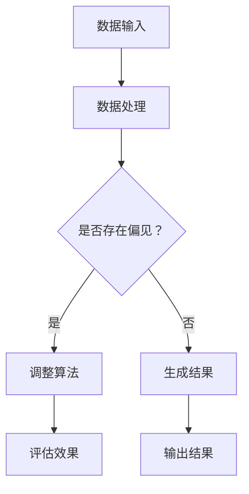
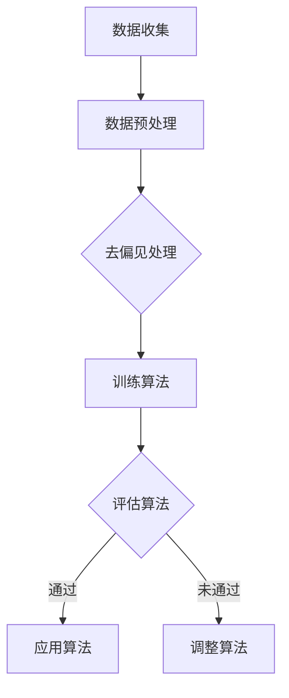
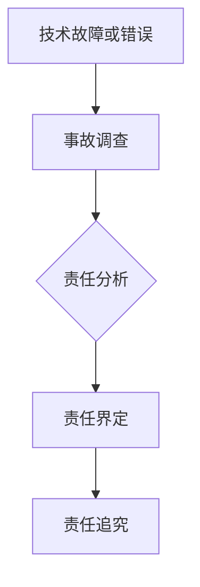

                 

### 第一部分：引言

## 1.1 书籍背景与目的

### 1.1.1 AIGC的崛起与社会变革

近年来，随着人工智能（AI）技术的飞速发展，一种新的生成类人工智能（AIGC，AI-Generated Content）正在逐渐崛起。AIGC技术利用机器学习算法，特别是深度学习，生成高质量的内容，包括文本、图像、音频和视频等。这不仅改变了传统的生产模式，还对社会、经济和文化等多个领域产生了深远的影响。AIGC的应用场景不断拓展，从内容创作、媒体娱乐到电子商务、智能教育等，都在积极利用AIGC技术提升效率和效果。

AIGC的崛起不仅推动了科技产业的变革，也对社会的运行机制和人们的生活方式产生了巨大影响。一方面，AIGC技术为内容创作者提供了强大的辅助工具，大大提高了内容生成的效率和质量；另一方面，AIGC的应用也带来了一系列新的伦理和社会问题，如智能歧视、数据隐私和安全等问题。这些问题不仅挑战了现有的法律和道德框架，也对社会公平和公众信任构成了威胁。

### 1.1.2 科技伦理的重要性

科技伦理作为科技发展过程中不可或缺的一部分，对于指导科技活动的方向和方式具有重要意义。科技伦理关注的是科技在发展过程中对社会和人类福祉的影响，强调科技在促进人类进步的同时，不应损害基本的人类价值和道德原则。科技伦理的研究内容包括科技研发的伦理问题、技术应用中的伦理挑战、科技对社会和环境的伦理影响等。

在AIGC技术快速发展的背景下，科技伦理的重要性愈发凸显。首先，AIGC技术涉及到大量的数据收集和分析，如何保护个人隐私和数据安全成为了一个亟待解决的问题。其次，AIGC生成的内容可能会对公众产生误导或偏见，如何确保内容的真实性和公正性也是一个重要的伦理议题。此外，随着智能歧视等问题日益显现，如何避免技术对社会的负面影响，确保科技的发展符合人类的长远利益，也是科技伦理需要关注的核心问题。

### 1.1.3 本书的研究目的和意义

本书旨在深入探讨AIGC技术在发展过程中面临的科技伦理问题，通过多角度的分析和思考，提出相应的对策和建议。具体研究目的如下：

1. **梳理AIGC技术的基本概念和关键特征**：介绍AIGC的定义、发展历程和关键技术，为后续的伦理问题分析提供基础。

2. **探讨AIGC伦理问题的核心内容**：从智能歧视、数据隐私、安全性和责任归属等多个角度，详细分析AIGC技术在实际应用中可能遇到的伦理挑战。

3. **评估AIGC伦理问题的影响与后果**：分析AIGC伦理问题对社会和个人生活的影响，探讨这些影响的具体表现和潜在后果。

4. **提出AIGC伦理问题的对策与建议**：结合国内外的研究和实践，提出针对性的法律、技术和教育对策，为科技伦理问题的解决提供参考。

本书的研究意义主要体现在以下几个方面：

1. **推动科技伦理研究的发展**：通过对AIGC伦理问题的系统探讨，有助于丰富科技伦理的研究内容，推动相关领域的学术研究。

2. **指导AIGC技术的健康发展**：本书的研究成果可以为AIGC技术的研发和应用提供伦理指导，促进技术的良性发展。

3. **促进社会对科技伦理的认识**：通过分析和讨论AIGC伦理问题，提高公众对科技伦理的认识和重视，增强社会对科技发展的监督和参与。

## 1.2 AIGC概述

### 1.2.1 AIGC的定义

AIGC，即AI-Generated Content，是指通过人工智能技术生成的内容，包括但不限于文本、图像、音频和视频等。AIGC技术的核心是通过深度学习算法，特别是生成对抗网络（GAN）和变分自编码器（VAE）等技术，实现内容的自动化生成。AIGC与传统的人工内容创作相比，具有以下特点：

- **高效性**：AIGC技术能够快速生成大量高质量的内容，大大提高了内容创作的效率。

- **多样性**：AIGC技术能够生成丰富多样、形式各异的内容，满足不同用户的需求。

- **创新性**：AIGC技术能够通过学习大量数据，生成以前从未出现过的内容，为内容创作带来新的可能性。

- **可控性**：通过调整模型参数和输入数据，可以控制AIGC生成的具体内容，实现内容生成的精细化。

### 1.2.2 AIGC的发展历程

AIGC技术的发展历程可以追溯到深度学习技术的崛起。随着深度学习算法的逐步成熟，生成对抗网络（GAN）和变分自编码器（VAE）等生成模型逐渐成为研究热点。这些模型能够通过学习大量数据，生成高质量、多样化的内容，为AIGC技术的发展奠定了基础。

1. **早期探索**（2010-2014年）：在这一阶段，生成对抗网络（GAN）首次被提出，成为AIGC技术发展的起点。

2. **快速发展**（2015-2019年）：随着深度学习技术的不断突破，AIGC技术在图像、文本和音频等多个领域取得了显著进展。

3. **应用拓展**（2020年至今）：在人工智能技术的推动下，AIGC技术的应用场景不断拓展，从媒体娱乐、电子商务到医疗、金融等各个领域，都取得了重要应用。

### 1.2.3 AIGC的关键技术

AIGC技术涉及多个领域的技术，其中生成对抗网络（GAN）和变分自编码器（VAE）是最为关键的两项技术。

1. **生成对抗网络（GAN）**：GAN是一种基于博弈论的生成模型，由生成器和判别器两个网络组成。生成器负责生成与真实数据相似的内容，判别器负责判断生成内容与真实内容的相似度。通过两个网络的博弈，生成器不断优化生成内容，以达到骗过判别器的目的。

2. **变分自编码器（VAE）**：VAE是一种基于概率模型的生成模型，通过编码器和解码器两个网络实现内容的生成。编码器将输入数据编码成一个潜在空间中的向量，解码器则根据这个向量生成输出数据。VAE在生成高质量内容的同时，还能够保持输入数据的分布特征。

除了GAN和VAE，其他如自注意力机制（Self-Attention）和循环神经网络（RNN）等技术在AIGC中也具有重要应用。这些技术的综合运用，使得AIGC技术能够生成更加复杂和多样化的内容。

## 1.3 科技伦理的基本概念

### 1.3.1 科技伦理的定义

科技伦理是指研究科技活动过程中所涉及的伦理问题，以及科技发展对人类、社会和环境可能带来的伦理影响的学科。它关注的是科技在推动社会进步的同时，如何遵守和实现基本的道德原则和价值观。

科技伦理的核心目标是确保科技的发展和应用不会损害人类的根本利益，同时促进社会的和谐与进步。它不仅涉及科技研发过程中的伦理问题，还包括技术应用中的伦理挑战，以及科技对社会和环境的伦理影响。

### 1.3.2 科技伦理的研究领域

科技伦理的研究领域广泛，主要包括以下几个方面：

1. **科技研发的伦理问题**：研究科技研发过程中的道德原则和规范，如研究伦理、科研诚信、知识产权保护等。

2. **技术应用中的伦理挑战**：探讨技术在具体应用场景中可能带来的伦理问题，如隐私保护、数据安全、智能歧视等。

3. **科技与社会的伦理影响**：分析科技发展对社会结构、文化、经济和自然环境等方面的伦理影响，以及科技如何影响人类的行为和价值观。

4. **科技伦理教育与政策**：研究如何通过教育和政策手段，提高公众对科技伦理的认识和遵守，促进科技伦理的健康发展。

### 1.3.3 科技伦理的重要性

科技伦理的重要性体现在以下几个方面：

1. **维护人类根本利益**：科技伦理关注科技发展对人类福祉的影响，确保科技不会损害人类的根本利益，如健康、安全、隐私等。

2. **促进科技健康发展**：科技伦理为科技活动提供了道德指导和规范，有助于科技在健康、可持续的轨道上发展。

3. **增强社会信任**：科技伦理有助于提升公众对科技的信任，增强社会的稳定和和谐。

4. **推动科技创新**：科技伦理不仅关注科技带来的负面影响，也鼓励科技在创新中解决伦理问题，从而推动科技的进步。

## 1.4 AIGC科技伦理的挑战与问题

### 1.4.1 智能歧视问题

智能歧视是指人工智能系统在决策过程中对某些群体或个人产生的歧视性偏见。AIGC技术的发展和应用，使得智能歧视问题愈加严重。智能歧视的表现形式多种多样，主要包括以下几个方面：

1. **性别歧视**：在文本生成、图像识别等领域，AIGC技术可能会对特定性别产生偏见，导致内容生成中性别刻板印象的强化。

2. **种族歧视**：AIGC技术在处理与种族相关数据时，可能对某些种族产生歧视性偏见，影响社会公平和种族和谐。

3. **年龄歧视**：在内容生成和推荐系统中，AIGC技术可能会对特定年龄群体产生偏见，导致某些群体被边缘化。

4. **教育歧视**：在教育领域，AIGC技术可能会对教育资源的分配产生不公平影响，影响教育公平。

### 1.4.2 数据隐私问题

AIGC技术依赖于大量的数据收集和分析，数据隐私问题成为其发展过程中的一大挑战。数据隐私问题主要包括以下几个方面：

1. **数据收集**：在数据收集过程中，如何确保个人隐私不受侵犯，防止数据泄露和滥用，是数据隐私保护的核心问题。

2. **数据存储**：在数据存储过程中，如何保证数据的安全性，防止黑客攻击和数据泄露，是数据隐私保护的关键环节。

3. **数据处理**：在数据处理过程中，如何避免数据被滥用，防止数据被用于不当目的，是数据隐私保护的重要方面。

4. **数据共享**：在数据共享过程中，如何确保数据的安全和隐私，防止数据被非法使用，是数据隐私保护的重要问题。

### 1.4.3 安全性问题

AIGC技术的安全性问题主要体现在以下几个方面：

1. **模型安全性**：如何确保AIGC模型在训练和推理过程中的安全性，防止恶意攻击和模型篡改，是模型安全性的关键问题。

2. **数据安全性**：如何确保AIGC应用过程中数据的安全性，防止数据泄露和滥用，是数据安全性的核心问题。

3. **应用安全性**：如何确保AIGC技术在具体应用场景中的安全性，防止技术滥用和不良影响，是应用安全性的重要方面。

4. **用户安全性**：如何确保AIGC技术对用户的隐私保护和安全，防止用户受到不必要的骚扰和侵害，是用户安全性的关键问题。

### 1.4.4 责任归属问题

AIGC技术在实际应用中，责任归属问题成为一个复杂且敏感的议题。责任归属问题主要包括以下几个方面：

1. **技术开发者**：如何界定技术开发者在AIGC技术发展过程中的责任，确保其在研发过程中遵循道德和法律规范，是责任归属的重要方面。

2. **应用提供者**：如何界定应用提供者在AIGC技术应用过程中的责任，确保其应用行为符合伦理和法律要求，是责任归属的核心问题。

3. **用户**：如何界定用户在使用AIGC技术过程中的责任，确保其行为不会对社会和他人造成负面影响，是责任归属的重要问题。

4. **监管机构**：如何界定监管机构在AIGC技术发展过程中的责任，确保其对技术滥用和不良影响的监管力度，是责任归属的关键问题。

### 1.5 本章小结

本章介绍了AIGC技术的背景、科技伦理的基本概念以及AIGC技术面临的伦理挑战。通过分析AIGC技术的崛起与社会变革、科技伦理的重要性，以及AIGC伦理问题的核心内容，为后续的深入探讨奠定了基础。接下来，本书将围绕智能歧视、数据隐私、安全性和责任归属等多个方面，详细分析AIGC技术在实际应用中可能遇到的伦理问题，并提出相应的对策和建议。通过这一系列的探讨，旨在为AIGC技术的健康发展提供伦理指导，促进社会的和谐与进步。### 第二部分：AIGC伦理问题探讨

## 2.1 AIGC伦理问题分析

### 2.1.1 智能歧视

#### 2.1.1.1 智能歧视的概念

智能歧视是指人工智能系统在决策过程中，由于算法、数据或设计缺陷等原因，对某些群体或个人产生的不公平偏见。智能歧视可以表现为多种形式，如性别歧视、种族歧视、年龄歧视等。智能歧视不仅损害了公平和正义，还可能导致社会矛盾的加剧。

#### 2.1.1.2 智能歧视的表现形式

1. **性别歧视**：在文本生成和推荐系统中，智能系统可能会对特定性别产生偏见，导致性别刻板印象的强化。例如，在新闻推荐中，系统可能会更倾向于推荐男性相关的新闻，而忽视女性相关的内容。

2. **种族歧视**：在图像识别和监控系统中，智能系统可能会对某些种族产生歧视性偏见，导致不公平的监控和处罚。例如，在面部识别技术中，系统可能会对某些种族的面部特征识别效果较差，从而引发种族歧视。

3. **年龄歧视**：在内容推荐和广告投放中，智能系统可能会对特定年龄群体产生偏见，导致某些群体被边缘化。例如，系统可能会更倾向于推荐年轻人感兴趣的内容，而忽视老年人的需求。

4. **教育歧视**：在教育领域，智能系统可能会对教育资源的分配产生不公平影响，影响教育公平。例如，智能系统可能会更倾向于推荐优质教育资源给成绩较好的学生，而忽视其他学生。

#### 2.1.1.3 智能歧视的案例分析

1. **性别歧视案例**：谷歌的搜索引擎曾因性别歧视问题受到广泛批评。研究表明，谷歌的搜索结果对男性相关的内容更倾向于展示，而对女性相关的内容则较少。这一现象不仅影响了用户的搜索体验，还加剧了性别歧视的社会问题。

2. **种族歧视案例**：美国的一些面部识别技术在识别黑人面孔时效果不佳，导致在执法过程中对黑人群体产生歧视性偏见。这一现象引发了社会对种族平等问题的关注和讨论。

3. **年龄歧视案例**：一些在线购物平台在推荐商品时，可能会对特定年龄群体产生偏见。例如，系统可能会更倾向于推荐年轻人群感兴趣的时尚商品，而忽视老年人群的实际需求。

#### 2.1.2 数据隐私

#### 2.1.2.1 数据隐私的重要性

数据隐私是个人信息安全的基石，关乎个体的自由和尊严。在AIGC技术中，数据隐私尤为重要。AIGC技术依赖于大量的数据收集和分析，这些数据往往涉及用户的个人隐私信息。如果数据隐私得不到有效保护，不仅会导致个人隐私泄露，还可能引发更严重的社会问题。

1. **个人信息泄露**：未经授权的数据收集和分析可能导致个人隐私信息的泄露，包括姓名、地址、电话号码、电子邮件等敏感信息。

2. **数据滥用**：未经用户同意的数据使用，可能被用于不当目的，如商业广告、政治操纵等，侵犯用户的合法权益。

3. **信任危机**：数据隐私的泄露和滥用可能导致公众对AIGC技术和相关企业的信任度下降，影响科技产业的健康发展。

#### 2.1.2.2 数据隐私面临的风险

1. **数据泄露风险**：在数据收集、传输和存储过程中，数据可能因安全漏洞、恶意攻击等原因被非法获取。

2. **数据滥用风险**：即使数据得到保护，也可能因企业内部管理不善、违规操作等原因被滥用。

3. **数据整合风险**：AIGC技术往往需要整合多种来源的数据，这可能导致不同数据源之间的隐私风险相互叠加。

4. **匿名化风险**：虽然匿名化技术可以减少隐私泄露的风险，但匿名化过程本身可能存在漏洞，导致数据重新识别。

#### 2.1.2.3 数据隐私保护的方法与策略

1. **数据加密**：对敏感数据进行加密处理，确保数据在传输和存储过程中不被非法获取。

2. **访问控制**：建立严格的访问控制机制，确保只有授权人员才能访问敏感数据。

3. **匿名化与去标识化**：采用匿名化和去标识化技术，减少数据被重新识别的风险。

4. **隐私保护算法**：开发和应用隐私保护算法，如差分隐私、同态加密等，确保数据处理过程中的隐私安全。

5. **用户同意与透明度**：确保用户在数据收集和使用过程中有充分的知情权和选择权，提高数据的透明度和用户的信任度。

#### 2.1.3 安全性问题

#### 2.1.3.1 安全问题的定义

AIGC技术的安全性问题是指在AIGC技术的研发、部署和应用过程中，可能面临的安全威胁和风险。这些问题包括但不限于数据安全、模型安全、应用安全和用户安全等方面。

1. **数据安全**：涉及数据收集、存储、传输和处理过程中的安全，包括数据泄露、篡改、破坏等风险。

2. **模型安全**：涉及AIGC模型在训练和推理过程中的安全，包括模型被恶意攻击、模型泄露等风险。

3. **应用安全**：涉及AIGC技术在具体应用场景中的安全，包括应用被攻击、数据被滥用等风险。

4. **用户安全**：涉及用户在使用AIGC技术过程中面临的安全威胁，包括隐私泄露、信息滥用等风险。

#### 2.1.3.2 安全问题的分类

1. **恶意攻击**：包括黑客攻击、恶意软件、网络钓鱼等，旨在破坏AIGC系统的正常运行。

2. **数据泄露**：未经授权的第三方获取敏感数据，导致隐私泄露和安全风险。

3. **模型篡改**：通过攻击AIGC模型，篡改模型的输出结果，导致决策错误或恶意行为。

4. **数据篡改**：在数据收集、存储和处理过程中，未经授权的数据修改，影响模型的训练和推理结果。

5. **用户隐私泄露**：用户在使用AIGC技术过程中，个人信息被非法获取和使用，导致隐私泄露。

#### 2.1.3.3 安全问题的应对策略

1. **网络安全防护**：建立完善的网络安全防护体系，包括防火墙、入侵检测、安全审计等，防范恶意攻击和数据泄露。

2. **数据安全措施**：采用数据加密、访问控制、数据备份等技术，确保数据在存储、传输和处理过程中的安全。

3. **模型安全保护**：对AIGC模型进行安全测试和验证，确保模型在训练和推理过程中的安全性和鲁棒性。

4. **用户隐私保护**：通过用户同意、数据匿名化等技术，确保用户在使用AIGC技术过程中的隐私安全。

5. **安全教育和培训**：提高用户和开发者的安全意识，加强安全教育和培训，防范安全风险。

#### 2.1.4 责任归属

#### 2.1.4.1 责任归属的原则

在AIGC技术发展过程中，责任归属问题是一个复杂而敏感的议题。责任归属应当遵循以下原则：

1. **因果关系原则**：责任的归属应当基于明确的因果关系，确保责任的承担与实际损害相匹配。

2. **责任自负原则**：技术开发者、应用提供者、用户等各方应承担相应的责任，确保各自行为符合道德和法律规范。

3. **责任有限原则**：在责任归属过程中，应当合理界定各方的责任范围，避免责任的无限扩大。

4. **责任协同原则**：各方应当协同合作，共同应对AIGC技术发展过程中的伦理和安全问题。

#### 2.1.4.2 责任归属的案例分析

1. **技术开发者责任**：例如，谷歌在面部识别技术中的性别和种族歧视问题，谷歌作为技术开发者，需要承担相应的责任，改进技术，避免歧视行为。

2. **应用提供者责任**：例如，某在线教育平台在推荐课程时，因算法偏见导致某些课程被低估，应用提供者需要承担相应的责任，调整算法，确保教育公平。

3. **用户责任**：例如，在用户使用AIGC技术进行内容生成时，若用户故意输入不当内容，导致智能歧视等问题，用户需要承担相应的责任。

#### 2.1.4.3 责任归属的伦理挑战

1. **责任的界定**：在AIGC技术中，责任的界定往往复杂且模糊，如何明确各方的责任成为一大挑战。

2. **责任的承担**：即使责任界定清晰，各方在责任承担过程中可能存在意愿和能力上的不足，导致责任无法得到有效履行。

3. **责任追究**：在责任归属过程中，如何确保责任的追究公正、透明，防止责任逃避和责任扩大化，也是一大伦理挑战。

## 2.2 AIGC伦理问题的影响与后果

### 2.2.1 对社会的影响

AIGC伦理问题对社会的影响是多方面的，主要体现在以下几个方面：

1. **社会公平问题**：智能歧视等问题可能导致社会不公平现象的加剧，损害社会的和谐与稳定。例如，性别歧视和种族歧视可能导致某些群体在社会中的地位和权益受到不公平对待，引发社会矛盾和冲突。

2. **社会信任问题**：AIGC技术的应用可能引发公众对技术的信任危机。数据隐私和安全问题的频繁曝光，可能导致公众对AIGC技术及其应用提供者的信任度下降，影响科技产业的健康发展。

3. **社会道德问题**：AIGC技术在某些领域的滥用，如虚假信息的传播、不良内容的生成等，可能对社会道德产生负面影响，破坏社会的道德秩序。

4. **社会舆论**：AIGC伦理问题引发了广泛的讨论和关注，社会舆论对此类问题的反应强烈。公众对AIGC伦理问题的关注度不断提高，对相关企业和政府部门的压力也随之增大。

### 2.2.2 对个人生活的影响

AIGC伦理问题对个人生活的影响同样深远，主要包括以下几个方面：

1. **个人隐私问题**：AIGC技术在数据收集、分析和应用过程中，可能侵犯个人的隐私权益，导致个人隐私泄露和滥用。个人可能面临信息被非法获取、跟踪、监控等风险，影响个人的自由和安全。

2. **个人安全问题**：AIGC技术的应用可能对个人的安全构成威胁。例如，智能歧视可能导致某些个人在就业、教育、医疗等方面受到不公平对待，影响个人的发展机会和生活质量。

3. **个人道德问题**：AIGC技术的滥用可能导致个人道德问题的出现。例如，虚假信息的传播可能误导公众，损害他人的名誉和权益，影响社会的道德风气。

4. **个人信任问题**：个人在面临AIGC伦理问题时，可能对技术及其应用提供者产生不信任，影响个人的消费行为和生活方式。

### 2.2.3 AIGC伦理问题的对策与建议

针对AIGC伦理问题，提出以下对策与建议：

1. **法律与政策制定**：完善相关法律法规，明确AIGC技术的应用规范和责任归属，加强监管和执法力度。

2. **技术手段**：开发和应用隐私保护技术、安全防护技术等，提高AIGC技术的安全性和隐私保护水平。

3. **教育宣传**：加强公众对AIGC伦理问题的认识，提高公众的道德和法律意识，促进社会的道德建设。

4. **企业自律**：鼓励企业制定内部规范和道德准则，自觉遵守伦理标准，承担社会责任。

5. **国际合作**：加强国际间的合作与交流，共同应对AIGC伦理问题，推动全球科技伦理的健康发展。

## 2.3 本章小结

本章分析了AIGC技术在发展过程中面临的四大伦理问题：智能歧视、数据隐私、安全性和责任归属。通过对这些问题进行深入探讨，揭示了AIGC伦理问题的复杂性和挑战性。智能歧视可能导致社会不公平，数据隐私问题威胁个人隐私和安全，安全性问题影响技术的稳定性和可信度，而责任归属问题则涉及多方利益的协调。针对这些问题，提出了法律、技术和教育等对策与建议，旨在推动AIGC技术的健康发展，促进社会的和谐与进步。### 第三部分：AIGC伦理问题在具体领域的应用

## 3.1 AIGC在医疗领域的伦理问题

### 3.1.1 医疗诊断的伦理问题

#### 3.1.1.1 诊断准确性问题

AIGC在医疗诊断中的应用具有巨大的潜力，但同时也带来了一系列伦理问题。诊断准确性问题是其中最为关键的一个方面。AIGC技术依赖于大量的数据和复杂的算法，但其准确性受多种因素影响。首先，数据的多样性和质量直接影响模型的性能。如果数据存在偏差或质量不高，生成的诊断结果可能会产生误导。其次，算法的优化和调整也需要充分考虑医学知识和临床经验，否则可能导致诊断结果的误差。

#### 3.1.1.2 诊断透明度问题

诊断透明度是另一个重要的伦理问题。AIGC诊断模型通常是一个“黑箱”，即使开发者也无法完全解释模型的决策过程。这可能导致医生和患者对诊断结果的信任度下降，尤其是在涉及重大医疗决策时。缺乏透明度不仅影响患者的决策，还可能导致医疗纠纷和法律问题。因此，确保诊断过程的透明度，使得医生和患者能够理解诊断结果和决策过程，是一个亟待解决的问题。

#### 3.1.1.3 诊断责任问题

诊断责任问题涉及AIGC技术在医疗诊断中的责任归属。当AIGC诊断系统出现错误或误导时，责任应由谁承担？是技术开发者、医疗机构还是医生？这一问题复杂且敏感。从伦理角度来看，诊断责任不应完全由人工智能系统承担，因为系统的决策依赖于人类设计的算法和输入的数据。然而，如何合理分配责任，确保各方在诊断过程中的责任和义务得到履行，是一个需要深入探讨的问题。

### 3.1.2 医疗隐私问题

#### 3.1.2.1 医疗数据隐私的重要性

医疗数据通常包含敏感的个人健康信息，如疾病诊断、药物使用、遗传信息等。这些数据一旦泄露，可能会对个人隐私和权益造成严重损害。在AIGC技术中，医疗数据的收集、存储、传输和使用过程复杂，隐私风险较高。因此，保护医疗数据隐私成为AIGC在医疗领域应用中的一个重要伦理问题。

#### 3.1.2.2 医疗隐私面临的挑战

1. **数据收集与共享**：AIGC技术需要大量的医疗数据进行训练和优化，这可能导致个人隐私信息的广泛收集和共享。如何确保数据收集的合法性和透明度，是一个重要挑战。

2. **数据存储与安全**：医疗数据存储在多个系统和平台中，如何确保数据的安全性，防止数据泄露和滥用，是另一个挑战。

3. **数据使用与监管**：在AIGC技术的应用过程中，如何确保数据的合法使用，防止数据被用于不当目的，如商业广告或政治操纵，是一个重要的伦理问题。

#### 3.1.2.3 医疗隐私保护的策略

1. **数据加密与匿名化**：采用数据加密和匿名化技术，确保医疗数据在存储、传输和使用过程中的安全性。

2. **隐私保护算法**：开发和应用隐私保护算法，如差分隐私、同态加密等，减少医疗数据的隐私泄露风险。

3. **用户同意与透明度**：确保用户在数据收集和使用过程中有充分的知情权和选择权，提高数据的透明度和用户的信任度。

4. **法律法规与监管**：完善相关法律法规，明确医疗数据隐私保护的要求和责任，加强监管和执法力度。

### 3.1.3 医疗安全性问题

#### 3.1.3.1 医疗安全问题的定义

医疗安全性问题是指在AIGC技术在医疗领域的应用过程中，可能对患者的健康和安全造成的影响。这些问题包括但不限于：

1. **诊断错误**：由于算法或数据问题，AIGC诊断系统可能会产生错误的诊断结果，导致患者未能得到正确的治疗。

2. **治疗不当**：基于AIGC诊断结果的医疗决策可能存在不当之处，导致治疗措施不恰当，影响患者的康复效果。

3. **系统故障**：AIGC技术依赖于复杂的计算机系统，系统故障可能导致诊断和治疗中断，影响患者的生命安全。

#### 3.1.3.2 医疗安全问题的分类

1. **技术风险**：包括算法错误、数据质量、系统稳定性等导致的诊断和治疗风险。

2. **操作风险**：包括医生和患者对AIGC技术的使用不当，如过度依赖或误解诊断结果，导致错误决策。

3. **环境风险**：包括医疗设备故障、网络攻击等外部因素导致的医疗安全风险。

#### 3.1.3.3 医疗安全问题的应对策略

1. **技术优化**：持续优化AIGC算法和系统，提高诊断和治疗的准确性。

2. **培训与教育**：加强对医生和患者的培训和教育，提高他们对AIGC技术的理解和正确使用能力。

3. **应急预案**：建立完善的应急预案，确保在系统故障或诊断错误发生时，能够迅速采取补救措施，保障患者的安全。

4. **法律与监管**：完善相关法律法规，明确AIGC技术在医疗领域的应用规范和安全标准，加强监管和执法力度。

## 3.2 AIGC在金融领域的伦理问题

### 3.2.1 金融风险评估的伦理问题

#### 3.2.1.1 风险评估准确性问题

AIGC技术在金融领域的风险评估中具有重要作用，但同时也带来了一系列伦理问题。风险评估准确性问题是其中之一。AIGC技术依赖于历史数据和复杂的算法，但其准确性受多种因素影响。首先，数据的质量和完整性直接影响模型的性能。如果数据存在偏差或缺失，生成的风险评估结果可能会产生误导。其次，算法的优化和调整也需要充分考虑金融知识和市场规律，否则可能导致风险评估结果的不准确。

#### 3.2.1.2 风险评估公正性问题

风险评估公正性问题是另一个重要的伦理问题。AIGC风险评估模型可能会对特定群体产生偏见，导致不公平的风险评估结果。例如，如果模型在训练过程中使用了存在偏见的数据，可能会导致某些群体被低估风险，而其他群体被高估风险。这种偏见可能导致金融歧视，影响市场的公平性和稳定性。

#### 3.2.1.3 风险评估透明度问题

风险评估透明度问题是确保AIGC技术在金融领域应用中公正和可信的关键。AIGC风险评估模型通常是一个“黑箱”，即使开发者也无法完全解释模型的决策过程。这可能导致金融机构和投资者对风险评估结果的信任度下降，影响金融决策的合理性和准确性。因此，确保风险评估过程的透明度，使得金融机构和投资者能够理解评估结果和决策过程，是一个亟待解决的问题。

### 3.2.2 金融隐私问题

#### 3.2.2.1 金融数据隐私的重要性

金融数据通常包含敏感的个人财务信息，如账户余额、交易记录、信用评级等。这些数据一旦泄露，可能会对个人隐私和财务安全造成严重损害。在AIGC技术中，金融数据的收集、存储、传输和使用过程复杂，隐私风险较高。因此，保护金融数据隐私成为AIGC在金融领域应用中的一个重要伦理问题。

#### 3.2.2.2 金融隐私面临的挑战

1. **数据收集与共享**：AIGC技术需要大量的金融数据进行训练和优化，这可能导致个人隐私信息的广泛收集和共享。如何确保数据收集的合法性和透明度，是一个重要挑战。

2. **数据存储与安全**：金融数据存储在多个系统和平台中，如何确保数据的安全性，防止数据泄露和滥用，是另一个挑战。

3. **数据使用与监管**：在AIGC技术的应用过程中，如何确保数据的合法使用，防止数据被用于不当目的，如商业广告或政治操纵，是一个重要的伦理问题。

#### 3.2.2.3 金融隐私保护的策略

1. **数据加密与匿名化**：采用数据加密和匿名化技术，确保金融数据在存储、传输和使用过程中的安全性。

2. **隐私保护算法**：开发和应用隐私保护算法，如差分隐私、同态加密等，减少金融数据的隐私泄露风险。

3. **用户同意与透明度**：确保用户在数据收集和使用过程中有充分的知情权和选择权，提高数据的透明度和用户的信任度。

4. **法律法规与监管**：完善相关法律法规，明确金融数据隐私保护的要求和责任，加强监管和执法力度。

### 3.2.3 金融安全性问题

#### 3.2.3.1 金融安全问题的定义

金融安全性问题是指在AIGC技术在金融领域的应用过程中，可能对金融系统稳定性和用户财务安全造成的影响。这些问题包括但不限于：

1. **系统故障**：AIGC技术依赖于复杂的计算机系统，系统故障可能导致金融交易中断、数据丢失等风险。

2. **数据泄露**：由于安全漏洞或恶意攻击，AIGC系统中的金融数据可能被非法获取和滥用，导致用户财务损失。

3. **模型风险**：由于算法错误或数据偏差，AIGC生成的金融决策可能存在不准确或误导性，导致金融市场的动荡。

#### 3.2.3.2 金融安全问题的分类

1. **技术风险**：包括系统漏洞、数据泄露、算法错误等导致的金融安全风险。

2. **操作风险**：包括人为错误、恶意操作等导致的金融安全风险。

3. **市场风险**：包括金融市场波动、投资者情绪等导致的风险。

#### 3.2.3.3 金融安全问题的应对策略

1. **技术防护**：采用防火墙、入侵检测、数据加密等技术，提高AIGC系统的安全性。

2. **数据安全措施**：采用数据备份、加密存储、访问控制等技术，确保金融数据的安全性和完整性。

3. **风险评估**：建立完善的风险评估体系，对AIGC技术的应用进行全面评估，及时发现和解决潜在的安全问题。

4. **法律法规与监管**：完善相关法律法规，明确AIGC技术在金融领域的应用规范和安全标准，加强监管和执法力度。

## 3.3 AIGC在媒体领域的伦理问题

### 3.3.1 内容生成与传播的伦理问题

#### 3.3.1.1 内容真实性问题

在媒体领域，AIGC技术被广泛应用于内容生成和传播。然而，这一应用也带来了一系列伦理问题，其中内容真实性问题是首要关注点。AIGC技术生成的内容可能包含虚假信息或误导性信息，导致公众对真实信息的判断受到干扰。例如，通过深度伪造技术生成的虚假新闻、视频和音频，可能对社会舆论和公共决策产生负面影响。

#### 3.3.1.2 内容偏见问题

AIGC技术生成的内容可能会反映出算法偏见，特别是在处理与性别、种族、年龄等相关的内容时。这种偏见可能导致内容生成中的不公平现象，影响媒体的公正性和多样性。例如，新闻推荐系统可能更倾向于推荐与特定群体相关的新闻，导致其他群体的声音被忽视，从而加剧社会分裂。

#### 3.3.1.3 内容审核与监管问题

随着AIGC技术的应用，内容审核和监管的难度增加。传统的审核机制可能无法有效识别和过滤由AIGC技术生成的内容中的不实信息和偏见。此外，如何界定内容的真实性、合法性和道德性，成为媒体领域面临的重大挑战。

### 3.3.2 用户隐私保护问题

#### 3.3.2.1 用户行为数据收集问题

在媒体领域，AIGC技术依赖于大量的用户行为数据进行内容推荐和个性化服务。然而，这一数据收集过程可能侵犯用户的隐私权。未经用户同意，媒体平台可能收集用户的浏览记录、搜索历史、社交行为等敏感信息，用于优化内容和广告投放。

#### 3.3.2.2 用户数据安全风险

收集的用户行为数据可能成为黑客攻击的目标。一旦数据泄露，不仅会导致用户隐私泄露，还可能被用于商业间谍活动、网络钓鱼等犯罪行为。因此，保障用户数据的安全成为AIGC技术在媒体领域应用中的关键伦理问题。

#### 3.3.2.3 用户数据匿名化挑战

尽管匿名化技术可以减少用户隐私泄露的风险，但在实际应用中，完全匿名化用户数据仍面临挑战。例如，通过分析用户行为的模式，可能在一定程度上识别出用户的身份。因此，如何在保护用户隐私的同时，确保AIGC技术的有效性和准确性，是一个需要深入探讨的问题。

### 3.3.3 广告与商业化问题

#### 3.3.3.1 广告精准投放问题

AIGC技术在媒体领域的一个广泛应用是广告精准投放。通过分析用户行为数据，AIGC技术可以生成针对特定用户的个性化广告。然而，这可能导致用户在浏览内容时，被大量个性化的广告包围，影响用户体验。此外，如果广告内容缺乏透明度，用户可能无法区分广告内容与真实内容，从而影响其对媒体平台的信任度。

#### 3.3.3.2 广告伦理问题

广告伦理问题涉及广告内容的真实性、公正性和道德性。AIGC技术可能被用于生成虚假广告或夸大其词的广告，误导用户。此外，如果广告内容包含性别歧视、种族歧视等偏见，可能导致社会问题的加剧。

#### 3.3.3.3 广告监管挑战

随着AIGC技术的应用，广告监管的难度增加。传统的监管机制可能无法有效识别和监管由AIGC技术生成的广告。因此，如何建立适应AIGC时代的新型广告监管体系，成为媒体领域面临的重要挑战。

## 3.4 AIGC在教育领域的伦理问题

### 3.4.1 教育资源分配问题

#### 3.4.1.1 资源公平性问题

AIGC技术在教育领域中的应用，特别是个性化学习系统的普及，可能导致教育资源分配中的不公平现象。个性化学习系统基于学生的行为数据和学习表现，为学生提供个性化的学习资源。然而，如果系统的算法存在偏见，可能会导致某些学生群体（如经济条件较差的学生）无法获得与其能力和需求相匹配的学习资源，从而加剧教育不公平。

#### 3.4.1.2 教育资源质量问题

AIGC技术生成的教育资源的质量也可能存在问题。虽然算法可以为学生推荐适合的学习资源，但算法的偏见或不足可能导致推荐资源的质量不佳。例如，系统可能会更倾向于推荐与多数学生行为模式相符的资源，而忽视少部分学生的特殊需求，从而导致学习效果不佳。

### 3.4.2 教育评价问题

#### 3.4.2.1 评价标准问题

AIGC技术在教育评价中的应用，如自动评分系统，也可能带来伦理问题。自动评分系统依赖于预定的评价标准，但这些标准可能存在主观性和不完善性。例如，系统的评价标准可能过于机械化，无法充分考虑学生的创造性思维和个性化特点，导致评价结果不够公正和准确。

#### 3.4.2.2 评价透明度问题

自动评分系统的“黑箱”特性也可能导致评价透明度问题。教师和学生可能无法理解评分系统的工作原理和决策过程，从而影响对评价结果的信任度。评价的透明度对于确保教育公正性和学生权益至关重要。

### 3.4.3 学生隐私保护问题

#### 3.4.3.1 隐私泄露风险

在教育领域，AIGC技术需要收集和分析大量的学生数据，包括学习记录、行为数据等。这些数据可能包含学生的隐私信息，如家庭背景、学习习惯等。如果数据保护措施不当，可能导致学生隐私泄露，影响学生的个人安全。

#### 3.4.3.2 隐私使用问题

即使数据得到保护，AIGC技术在教育评价和资源分配中的应用也可能涉及隐私使用问题。例如，学生的隐私信息可能被用于商业目的或政治操纵，违背学生的隐私权。

#### 3.4.3.3 隐私透明度问题

学生和家长需要了解AIGC技术如何使用他们的数据，以及这些数据可能带来的影响。然而，当前的教育系统和AIGC技术应用往往缺乏足够的透明度，导致学生在数据使用过程中缺乏知情权和控制权。

### 3.4.4 教育伦理问题

#### 3.4.4.1 教育公正性

AIGC技术在教育领域的应用可能会影响教育的公正性。例如，个性化学习系统可能会根据学生的行为数据推荐资源，但这种推荐可能受到算法偏见的影响，导致某些学生被忽视。此外，自动评分系统也可能因评价标准的偏差而影响教育公正。

#### 3.4.4.2 教育个性化

虽然AIGC技术的目标是提供个性化教育，但过度依赖技术可能导致教育个性化过度，忽视学生的实际需求和潜力。例如，系统可能会根据学生的学习表现推荐同类型的学习资源，限制学生的探索和创造性思维。

#### 3.4.4.3 教育伦理教育

在教育领域，AIGC技术的应用也提出了教育伦理教育的新需求。教师和学生需要了解AIGC技术的伦理问题，学会在技术应用过程中做出伦理决策。教育机构需要加强伦理教育，培养具备良好伦理素养的下一代。

### 3.4.5 AIGC技术在教育领域的伦理挑战

AIGC技术在教育领域的应用面临着一系列伦理挑战。这些挑战不仅涉及技术本身，还包括教育体系和社会环境。以下是对这些挑战的详细探讨：

#### 3.4.5.1 数据隐私和安全性

AIGC技术在教育领域使用的学生数据具有高度的隐私性和敏感性。这些数据包括学生的学习记录、行为数据、考试成绩等。如果这些数据被不当使用或泄露，可能会对学生的隐私权和安全感造成严重威胁。因此，确保数据的安全性和隐私性成为AIGC技术在教育领域应用中的一个重要伦理问题。

- **挑战**：如何在保证数据有效利用的同时，保护学生的隐私权？

- **对策**：实施严格的数据加密和安全保护措施，确保学生数据在收集、存储、传输和使用过程中的安全性。同时，建立透明的数据管理机制，使学生和家长能够了解其数据的用途和处理方式。

#### 3.4.5.2 评估和评价的准确性

AIGC技术生成的自动评分系统和个性化学习推荐系统在评估和评价学生表现方面具有巨大潜力。然而，这些系统的准确性和公平性受到多种因素影响，如算法的偏见、数据的质量等。

- **挑战**：如何确保自动评分系统和个性化学习推荐系统的评估结果准确、公正？

- **对策**：加强对AIGC技术的评估和验证，确保算法的公平性和准确性。建立多元化的评估机制，结合人工评估和自动评分，以提高评估的全面性和准确性。

#### 3.4.5.3 教育资源的公平分配

AIGC技术可能会加剧教育资源的分配不均，特别是对于那些来自经济条件较差家庭的学生。这些学生可能无法获得与他们的能力和需求相匹配的学习资源，从而导致教育机会的不平等。

- **挑战**：如何确保AIGC技术在教育资源分配中实现公平？

- **对策**：加强教育资源建设，特别是对经济条件较差的学生提供额外的支持和资源。同时，建立公平的数据收集和处理机制，确保所有学生的数据都能被公平利用。

#### 3.4.5.4 教育伦理意识的培养

随着AIGC技术在教育领域的广泛应用，教师和学生需要具备更强的伦理意识，能够在技术应用过程中做出符合伦理原则的决策。然而，当前的教育体系和社会环境对AIGC技术的伦理问题关注不足。

- **挑战**：如何培养教师和学生的AIGC技术伦理意识？

- **对策**：加强AIGC技术伦理教育，将伦理教育纳入课程体系，提高教师和学生的伦理素养。同时，鼓励教育者和学生在技术应用过程中积极探讨和解决伦理问题。

#### 3.4.5.5 社会接受度和信任度

AIGC技术在教育领域的应用可能面临社会接受度和信任度的问题。家长、教师和学生可能对新技术带来的改变持怀疑态度，担心技术的滥用和对传统教育方式的冲击。

- **挑战**：如何提高社会对AIGC技术在教育领域应用的接受度和信任度？

- **对策**：加强宣传和沟通，向公众普及AIGC技术的优势和应用场景，提高公众对技术的理解和信任。同时，建立透明、公正的技术应用机制，确保技术的合理使用。

通过上述讨论，可以看出AIGC技术在教育领域应用中面临的伦理挑战是多方面的。解决这些问题需要教育工作者、技术开发者和社会各界的共同努力。只有在伦理原则的指导下，AIGC技术才能在教育领域发挥其应有的积极作用，促进教育的公平、公正和高效。### 3.5 AIGC在法律领域的伦理问题

#### 3.5.1 智能司法的伦理问题

AIGC技术在法律领域的应用，特别是智能司法系统的引入，带来了一系列伦理问题。智能司法系统利用人工智能技术对法律文本进行解析、分析，甚至进行裁决。然而，这一技术的应用可能引发以下伦理问题：

1. **算法偏见**：智能司法系统在处理法律文本和数据时，可能会受到算法偏见的影响，导致对某些群体或个体不公平对待。例如，如果训练数据存在种族或性别偏见，系统可能会在裁决过程中体现这种偏见。

2. **透明度问题**：智能司法系统的决策过程通常较为复杂，涉及大量数据分析和算法运算。这种“黑箱”特性可能导致公众对系统决策的信任度下降，影响司法公正。

3. **责任归属**：当智能司法系统产生错误裁决时，责任应由谁承担？是技术开发者、法律专家还是司法机构？这一问题的模糊性可能导致责任无法明确界定。

#### 3.5.2 智能证据的伦理问题

随着AIGC技术的发展，智能证据的应用日益广泛。智能证据包括通过人工智能技术生成的文本、图像、音频等。然而，智能证据的可靠性、合法性和伦理问题也逐渐显现：

1. **证据可靠性**：智能证据的生成和呈现方式可能影响其可靠性。例如，通过深度伪造技术生成的视频证据，可能误导法官和当事人，影响司法公正。

2. **证据合法性**：智能证据的合法性可能受到质疑。例如，如果智能证据的生成过程缺乏透明度或受到恶意篡改，可能导致证据被认定为无效。

3. **隐私保护**：智能证据的生成和使用过程可能涉及大量个人隐私信息的收集和处理。如何保护这些隐私信息，防止其被滥用，是一个重要的伦理问题。

#### 3.5.3 智能律师的伦理问题

智能律师作为AIGC技术在法律领域的应用之一，其伦理问题也备受关注：

1. **职业伦理**：智能律师在处理案件时，应遵循法律职业伦理，如保密、诚信等。然而，智能律师可能无法完全理解复杂的法律伦理问题，导致其行为不符合职业伦理。

2. **客户权益**：智能律师在提供法律服务时，应确保客户权益得到保护。例如，智能律师可能无法充分理解客户的需求和意愿，导致服务效果不佳。

3. **技术滥用**：智能律师可能被用于不当目的，如法律欺诈、滥用法律知识等。如何防止智能律师被滥用，是一个重要的伦理问题。

#### 3.5.4 AIGC技术在法律领域的伦理挑战与对策

针对AIGC技术在法律领域的伦理问题，提出以下挑战与对策：

1. **算法透明度**：提高智能司法系统的算法透明度，确保公众能够理解系统的决策过程。可以通过公开算法源代码、提供算法解释器等方式实现。

2. **数据质量**：确保训练数据的质量和多样性，避免算法偏见。可以通过引入更多样化的数据、加强数据审核等方式实现。

3. **责任界定**：明确智能司法系统、技术开发者、法律专家等各方的责任，确保在错误裁决时能够明确责任归属。

4. **隐私保护**：加强智能证据生成和使用的隐私保护措施，确保个人隐私信息不被滥用。可以通过数据加密、隐私保护算法等方式实现。

5. **职业伦理教育**：加强对智能律师的伦理教育，确保其遵循法律职业伦理。可以通过建立职业伦理培训体系、制定职业伦理规范等方式实现。

6. **客户权益保护**：确保智能律师在提供法律服务时，充分尊重客户意愿和权益。可以通过建立客户权益保护机制、提供法律服务合同等方式实现。

通过上述对策，有助于应对AIGC技术在法律领域面临的伦理挑战，确保其在法律领域的健康、规范应用。### 3.6 AIGC在娱乐领域的伦理问题

#### 3.6.1 内容创作的伦理问题

AIGC技术在娱乐领域的应用，特别是内容创作方面，带来了一系列伦理问题。智能内容创作系统通过算法和大数据分析，生成大量个性化、多样化的娱乐内容。然而，这一应用也引发了一系列伦理问题：

1. **版权问题**：智能内容创作系统可能会生成与已有作品高度相似甚至完全相同的内容。这种情况下，如何界定原创性和版权归属成为一个难题。

2. **原创性保护**：智能内容创作系统可能会生成质量较低、缺乏原创性的内容。这可能导致优秀原创作品的稀缺，影响文化创新和多样性。

3. **内容质量控制**：智能内容创作系统在生成内容时，可能无法保证内容的道德性和合法性。例如，系统可能生成包含暴力、色情等不良内容，影响公众的价值观和行为。

4. **创作者权益**：随着AIGC技术在内容创作中的应用，传统的内容创作者可能面临更大的竞争压力，其权益可能受到损害。如何平衡智能创作与传统创作的关系，保护创作者权益，是一个重要的伦理问题。

#### 3.6.2 观众隐私保护问题

AIGC技术在娱乐领域的另一个应用是观众行为的分析，通过大数据和算法分析，了解观众的偏好和需求，为观众提供个性化的娱乐内容。然而，这一应用也带来了隐私保护问题：

1. **隐私泄露风险**：观众行为数据包含大量的个人隐私信息，如浏览记录、观看偏好等。如果数据保护措施不当，可能导致观众隐私泄露。

2. **数据滥用风险**：观众行为数据可能被用于不当目的，如商业广告、市场操纵等，侵犯观众的隐私权和自主权。

3. **隐私透明度**：观众需要了解其行为数据如何被收集和使用，以便做出知情的选择。然而，当前观众隐私保护的透明度较低，观众难以了解其隐私权受到的保护情况。

#### 3.6.3 内容推荐算法的伦理问题

AIGC技术在娱乐领域的内容推荐系统，通过算法分析观众行为，为其推荐感兴趣的内容。然而，这一应用也引发了一系列伦理问题：

1. **信息茧房**：内容推荐算法可能会将观众锁定在特定的信息圈子里，导致观众视野狭窄，无法接触多样化的信息和观点。

2. **算法偏见**：内容推荐算法可能在训练过程中受到偏见的影响，导致推荐结果对某些群体或观点不公平。例如，算法可能更倾向于推荐某些类型的内容，忽视其他类型的内容。

3. **用户自主权**：内容推荐系统可能会过度干预观众的选择，影响观众的自主权。观众可能感到被系统“控制”，难以自主决定观看什么内容。

4. **数据垄断**：大型娱乐平台通过内容推荐算法，收集和分析观众行为数据，可能导致数据垄断。这种垄断可能导致市场不公平竞争，影响创新和发展。

#### 3.6.4 AIGC技术在娱乐领域的伦理挑战与对策

针对AIGC技术在娱乐领域面临的伦理挑战，提出以下对策：

1. **版权保护**：加强版权保护法律和政策，明确智能生成内容的版权归属。可以通过技术手段，如数字版权管理（DRM），确保原创作品的知识产权得到保护。

2. **原创性鼓励**：鼓励智能内容创作系统的原创性，通过政策支持和市场激励，提高智能生成内容的质量和原创性。

3. **内容质量控制**：建立内容审查机制，确保智能生成内容符合道德和法律标准。可以通过人工智能和人工审核相结合的方式，提高内容质量控制的效果。

4. **创作者权益保护**：加强创作者权益保护，通过法律和政策手段，确保创作者在智能内容创作中的应用中获得公平待遇。

5. **隐私保护**：加强观众隐私保护，通过数据加密、匿名化等技术手段，确保观众行为数据的安全性和隐私性。

6. **算法透明度**：提高内容推荐算法的透明度，向观众公开算法原理和决策过程，提高观众的知情权和信任度。

7. **信息多样性**：鼓励内容推荐系统推荐多样化的内容，避免将观众锁定在特定的信息圈子里，促进信息多样性和观点多元化。

8. **用户自主权**：尊重观众的自主权，确保观众在内容选择上具有足够的自由度，避免过度干预。

9. **数据垄断防范**：加强市场监管，防止大型娱乐平台通过内容推荐系统实现数据垄断，保障市场的公平竞争和创新。

通过上述对策，有助于应对AIGC技术在娱乐领域面临的伦理挑战，促进娱乐行业的健康、可持续发展。### 3.7 AIGC在商业领域的伦理问题

#### 3.7.1 智能营销的伦理问题

AIGC技术在商业领域，尤其是智能营销中的应用，带来了显著的效率提升和个性化服务，但也引发了一系列伦理问题：

1. **消费者隐私保护**：智能营销依赖于大量消费者的行为数据，包括浏览记录、购买偏好等。这些数据的收集和使用如果不加限制，可能导致消费者隐私泄露。

2. **算法歧视**：智能营销算法可能基于消费者的行为数据对其进行分类，从而进行有针对性的营销。这种分类可能基于性别、种族、年龄等敏感信息，导致算法歧视，影响消费者的公平性和平等权利。

3. **数据滥用**：商业机构可能滥用消费者数据，进行不必要的追踪和广告推送，侵犯消费者的隐私权和自主权。

4. **消费者依赖性**：智能营销系统通过个性化推荐，可能导致消费者对特定产品或服务的依赖性增加，从而影响消费者的选择自由和判断能力。

#### 3.7.2 智能供应链管理问题

AIGC技术在商业供应链管理中的应用，有助于提高供应链的透明度和效率，但也存在一些伦理问题：

1. **数据透明度**：智能供应链管理系统涉及大量的数据交换和共享，但数据的透明度往往不足，可能导致供应链的不公平和不透明。

2. **供应链责任分配**：当智能供应链系统出现问题时，责任归属往往不明确。例如，供应链中断可能是由算法失误导致的，但责任应由谁承担？是技术开发者、供应链管理者还是消费者？

3. **环境影响**：智能供应链管理系统在提高效率的同时，可能增加对环境的影响。例如，过度的物流运输和资源消耗可能加剧环境污染。

4. **劳动力权益**：智能供应链管理系统的应用可能导致劳动力市场的变化，影响劳动力的权益。例如，自动化技术的推广可能减少人力需求，影响劳动者的就业和福利。

#### 3.7.3 供应链伦理问题

供应链伦理问题涉及供应链各环节的道德行为，包括供应链透明度、公平交易、环境保护和劳动力权益等方面：

1. **供应链透明度**：供应链的各个环节需要保持透明，确保各方能够了解供应链的运作情况。透明度不足可能导致信息不对称，影响供应链的效率和公正性。

2. **公平交易**：供应链中的交易应基于公平原则，确保各方能够获得公平的利益分配。公平交易有助于建立长期稳定的供应链关系。

3. **环境保护**：供应链管理应考虑环境影响，采取绿色供应链管理策略，减少对环境的负面影响。

4. **劳动力权益**：供应链管理应尊重劳动者的权益，包括提供合理的工资、良好的工作环境和保障劳动者的就业。

#### 3.7.4 AIGC技术在商业领域的伦理挑战与对策

针对AIGC技术在商业领域面临的伦理挑战，提出以下对策：

1. **消费者隐私保护**：加强消费者隐私保护法规，确保消费者数据在收集、存储和使用过程中的安全性和隐私性。商业机构应遵循隐私保护原则，减少不必要的消费者数据收集，提高数据透明度。

2. **算法公平性**：确保智能营销算法的公平性，避免基于敏感信息进行歧视性营销。可以通过算法测试和监管，提高算法的公正性和透明度。

3. **数据透明度**：提高供应链管理系统的数据透明度，确保供应链各环节的信息交换和共享透明、公正。可以通过区块链技术实现供应链数据的可追溯性和透明性。

4. **责任明确**：明确供应链中各方的责任，确保在供应链中断或问题时，责任能够明确归属。可以通过法律手段和供应链协议，建立责任分配机制。

5. **绿色供应链管理**：推广绿色供应链管理理念，减少供应链对环境的负面影响。商业机构应采取环保措施，如减少物流运输、优化资源利用等。

6. **劳动力权益保障**：尊重劳动者的权益，确保供应链管理中的人力资源得到合理对待。可以通过建立劳动力权益保护机制，提高劳动者的福利和工作环境。

7. **伦理教育和培训**：加强对商业人员和管理者的伦理教育和培训，提高其伦理意识和道德水平。商业机构应制定伦理准则，确保商业行为符合道德和法律规范。

通过上述对策，有助于应对AIGC技术在商业领域面临的伦理挑战，促进商业活动的健康、可持续发展。### 3.8 AIGC在环境监测与保护领域的伦理问题

#### 3.8.1 数据准确性问题

AIGC技术在环境监测与保护领域具有巨大潜力，但其应用也带来了一系列伦理问题。首先，数据准确性问题是其中一个关键挑战。环境监测数据的质量直接关系到决策的准确性和有效性。AIGC技术依赖于大量环境数据进行模型训练和预测，但这些数据的准确性受到多种因素影响。例如，传感器故障、数据采集过程中的误差、数据源的多样性和不一致性等，都可能导致数据准确性下降。数据准确性问题不仅影响环境监测的精度，还可能误导决策，导致环境管理措施失效。

#### 3.8.2 数据隐私保护问题

环境监测过程中会收集大量的环境数据，这些数据通常包含敏感信息，如地理位置、污染源、生态环境状况等。如何保护这些数据隐私成为AIGC技术应用的伦理挑战。未经授权的数据收集和使用可能侵犯个人隐私，引发法律和道德问题。特别是在跨国合作和开放数据共享的情况下，数据隐私保护问题更为突出。环境监测数据泄露可能导致环境信息被滥用，影响公共安全和社会稳定。

#### 3.8.3 数据滥用问题

环境数据在AIGC技术中的应用具有广泛的前景，但同时也存在数据滥用的问题。例如，环境监测数据可能被用于不当目的，如商业利益、政治操纵等。数据滥用不仅违背了数据收集的初衷，还可能对环境保护和社会公平产生负面影响。此外，环境数据滥用还可能导致信任危机，影响公众对环境监测数据的信任度，削弱环境监测系统的公信力。

#### 3.8.4 技术依赖性问题

AIGC技术在环境监测与保护领域的广泛应用，可能导致对技术的过度依赖。技术依赖性问题主要体现在以下几个方面：

1. **技术替代性**：过度依赖AIGC技术可能导致传统监测方法和手段的缺失，影响环境监测的多样性和全面性。

2. **技术可靠性**：虽然AIGC技术具有高效性和准确性，但其可靠性仍需验证。在关键时刻，技术故障可能导致监测数据失效，影响环境决策的及时性和准确性。

3. **技术更新换代**：AIGC技术发展迅速，更新换代周期较短。技术过时可能导致监测系统性能下降，影响环境监测效果。

#### 3.8.5 环境伦理问题

AIGC技术在环境监测与保护领域不仅面临技术挑战，还涉及一系列环境伦理问题。例如：

1. **生态保护与经济发展**：在环境保护和经济发展之间寻求平衡，确保AIGC技术的应用不会对生态环境造成不可逆转的破坏。

2. **社会责任**：企业和社会应承担环境责任，通过AIGC技术实现环境监测与保护的可持续发展。

3. **公平性**：确保环境监测数据的公平性和可获取性，使公众能够充分了解环境状况，参与环境保护决策。

#### 3.8.6 AIGC技术在环境监测与保护领域的伦理挑战与对策

针对AIGC技术在环境监测与保护领域面临的伦理挑战，提出以下对策：

1. **数据质量控制**：加强数据质量控制，确保环境监测数据的准确性和可靠性。可以通过数据清洗、数据验证和交叉比对等方式提高数据质量。

2. **数据隐私保护**：建立严格的数据隐私保护机制，确保环境数据在收集、存储、传输和使用过程中的安全性和隐私性。可以采用数据加密、匿名化等技术手段保护数据隐私。

3. **透明度与公开性**：提高环境监测数据的透明度和公开性，确保公众能够获取和了解环境监测数据。可以通过建立数据开放平台和公众参与机制，提高数据透明度和公众信任度。

4. **多元化监测方法**：结合AIGC技术和传统监测方法，实现环境监测的多元化，确保监测结果的全面性和准确性。

5. **技术可靠性验证**：加强AIGC技术的可靠性验证，确保其应用效果和安全性。可以通过开展实验、测试和评估，验证AIGC技术的性能和可靠性。

6. **伦理教育与培训**：加强对环境监测与保护领域从业人员的伦理教育和培训，提高其伦理意识和道德水平，确保AIGC技术的应用符合伦理原则。

7. **社会责任与公平性**：鼓励企业和社会承担环境责任，通过AIGC技术实现环境监测与保护的可持续发展，确保环境保护的公平性和公正性。

通过上述对策，有助于应对AIGC技术在环境监测与保护领域面临的伦理挑战，促进环境保护和可持续发展。### 3.9 AIGC在公共政策领域的伦理问题

#### 3.9.1 数据驱动决策的伦理问题

AIGC技术在公共政策领域的应用，特别是数据驱动决策的普及，带来了一系列伦理问题。首先，数据驱动决策依赖于大量数据的收集和分析，这些数据可能包含敏感信息，如个人隐私、社会经济状况等。数据的准确性和完整性直接影响决策的公正性和有效性。数据偏差或遗漏可能导致决策失误，甚至加剧社会不公平。例如，如果政策决策依赖于含有种族、性别等偏见的数据，可能会导致歧视性政策的实施，损害特定群体的权益。

#### 3.9.2 数据隐私保护问题

在公共政策领域，AIGC技术广泛应用的数据收集和分析过程，带来了严重的隐私保护问题。政策制定者可能收集和分析大量公民的个人信息，如税务记录、医疗记录等，这些数据一旦泄露，可能对个人隐私和安全造成严重威胁。数据隐私保护不仅涉及技术手段，还包括法律和政策框架的建立。缺乏有效的隐私保护措施可能导致数据滥用，影响公众对政府和社会的信任。

#### 3.9.3 数据透明度和问责问题

AIGC技术在公共政策领域的应用，使得决策过程更加复杂，数据透明度和问责问题也变得更加突出。政策制定者和执行者往往无法解释数据驱动决策的具体过程和算法原理，导致决策过程的“黑箱化”。公众难以了解决策依据和过程，影响对决策的信任度和接受度。此外，当数据驱动决策出现错误或不当行为时，责任归属和问责机制往往不明确，导致责任逃避和问责困难。

#### 3.9.4 公众参与和代表性问题

AIGC技术在公共政策领域的应用，可能影响公众参与和代表性。首先，技术决策往往由技术专家和数据分析师主导，公众参与度较低。其次，数据驱动决策可能基于特定的算法和模型，无法全面反映公众的多样性和需求。这种情况下，决策结果可能无法真正代表公众利益，影响政策的公平性和有效性。

#### 3.9.5 AIGC技术在公共政策领域的伦理挑战与对策

针对AIGC技术在公共政策领域面临的伦理挑战，提出以下对策：

1. **数据质量控制**：加强数据质量控制，确保数据的准确性和完整性。建立数据审查和验证机制，减少数据偏差和错误。

2. **数据隐私保护**：建立严格的数据隐私保护机制，确保个人数据的收集、存储和使用过程中的安全性和隐私性。遵循隐私保护原则，减少不必要的个人数据收集。

3. **透明度和问责机制**：提高决策过程的透明度，向公众公开数据驱动决策的具体过程和算法原理。建立问责机制，明确决策责任，确保在决策失误时能够追究责任。

4. **公众参与和代表性**：鼓励公众参与政策制定和决策过程，提高政策的代表性和公平性。通过多种渠道收集公众意见，确保决策充分反映公众利益。

5. **伦理教育与培训**：加强对政策制定者、数据分析师等从业人员的伦理教育和培训，提高其伦理意识和道德水平，确保技术应用的伦理性。

6. **法律和政策框架**：完善相关法律和政策框架，为AIGC技术在公共政策领域的应用提供规范和指导。确保技术应用符合法律和伦理要求。

通过上述对策，有助于应对AIGC技术在公共政策领域面临的伦理挑战，促进公共政策决策的公正、透明和有效。### 3.10 AIGC在公共安全领域的伦理问题

#### 3.10.1 数据收集与隐私保护问题

AIGC技术在公共安全领域的广泛应用，依赖于大量数据的收集和分析。这些数据通常涉及个人隐私信息，如行为记录、通信数据等。数据收集过程中，如何确保个人隐私不受侵犯是一个重要的伦理问题。未经授权的数据收集可能导致个人隐私泄露，引发公众对技术应用的抵触情绪。此外，数据存储和使用过程中的安全措施不足，可能导致数据泄露和滥用，影响公共安全和个人隐私。

#### 3.10.2 算法偏见与公平性问题

AIGC技术通过复杂的算法进行数据分析和决策，但算法偏见可能导致不公平的结果。例如，在公共安全监控系统中，如果算法在处理与种族、性别等相关的数据时存在偏见，可能导致特定群体的监控频率增加，甚至引发歧视性执法。算法偏见不仅损害社会公平，还可能加剧社会矛盾，影响社会稳定。

#### 3.10.3 系统安全性与漏洞问题

AIGC技术在公共安全领域的应用涉及大量敏感信息，系统安全性至关重要。然而，技术漏洞和系统故障可能导致数据泄露、系统被恶意攻击等风险。例如，公共安全监控系统可能遭受网络攻击，导致监控数据被非法获取或篡改，影响公共安全和社会秩序。

#### 3.10.4 责任归属与问责机制问题

在AIGC技术应用于公共安全领域时，责任归属和问责机制往往不明确。例如，当AIGC监控系统产生误报或错误决策时，责任应由谁承担？是技术开发者、安全机构还是政府？责任归属不明确可能导致责任逃避，影响公共安全管理的效率和质量。

#### 3.10.5 AIGC技术在公共安全领域的伦理挑战与对策

针对AIGC技术在公共安全领域面临的伦理挑战，提出以下对策：

1. **数据隐私保护**：建立严格的数据隐私保护机制，确保个人数据在收集、存储和使用过程中的安全性和隐私性。采用数据加密、匿名化等技术手段保护数据隐私。

2. **算法公平性**：确保算法的公平性和无偏见，通过多样化和去偏见的数据训练，减少算法偏见。建立算法审查和监管机制，确保算法的公正性和透明度。

3. **系统安全性**：加强系统安全性，防范网络攻击和数据泄露风险。采用先进的安全防护技术，如防火墙、入侵检测等，确保系统的稳定性和安全性。

4. **责任归属与问责机制**：明确AIGC技术在公共安全领域的责任归属，建立完善的问责机制。在系统设计、部署和运营过程中，明确各方的责任和义务，确保责任得到有效履行。

5. **公众参与与透明度**：鼓励公众参与公共安全监控系统的设计和运营，提高系统的透明度和公众信任度。建立公众监督机制，确保技术应用符合公众利益。

6. **伦理教育与培训**：加强对公共安全领域从业人员的伦理教育和培训，提高其伦理意识和道德水平，确保技术应用符合伦理原则。

通过上述对策，有助于应对AIGC技术在公共安全领域面临的伦理挑战，促进公共安全管理的健康、可持续发展。### 3.11 AIGC在科学研究领域的伦理问题

#### 3.11.1 研究数据的隐私与安全性

在科学研究领域，AIGC技术依赖于大量实验数据和调查数据进行分析和模型构建。这些数据往往包含敏感信息，如个人健康数据、行为记录等。如何确保这些数据的隐私性和安全性是一个重要的伦理问题。未经授权的数据收集和分析可能导致个人隐私泄露，影响数据的真实性和科学性。此外，数据在存储、传输和使用过程中，可能面临安全漏洞和恶意攻击的风险，导致数据丢失、篡改或泄露。

#### 3.11.2 研究结果的可重复性与透明度

AIGC技术在科学研究中的应用，使得研究结果的可重复性和透明度受到挑战。由于AIGC技术依赖于复杂的算法和数据，研究结果的生成过程往往是一个“黑箱”，难以被其他研究人员理解和验证。这种情况下，研究结果的可重复性受到质疑，可能导致科学诚信问题。此外，研究结果的透明度不足，可能导致研究过程和方法的隐瞒，影响科学研究的公开性和可信度。

#### 3.11.3 算法偏见与数据公平性

在科学研究领域，AIGC技术的应用也可能引发算法偏见和数据公平性问题。例如，在数据分析过程中，如果训练数据存在偏见，可能导致研究结果对特定群体或个体不公平。算法偏见不仅影响研究的公正性和科学性，还可能加剧社会不平等和歧视。此外，数据来源的多样性和代表性不足，可能导致研究结果的局限性和不公平性。

#### 3.11.4 研究伦理审查与责任归属

AIGC技术在科学研究中的应用，需要加强伦理审查和责任归属。研究过程中，如何确保算法和数据的伦理性是一个重要议题。例如，在生物医学研究中，AIGC技术可能涉及人类基因数据的分析，如何确保这些数据的伦理使用是一个关键问题。此外，当AIGC技术在研究中产生错误或误导性结果时，如何明确责任归属，确保各方承担相应的责任，也是一个重要挑战。

#### 3.11.5 AIGC技术在科学研究领域的伦理挑战与对策

针对AIGC技术在科学研究领域面临的伦理挑战，提出以下对策：

1. **数据隐私保护**：建立严格的数据隐私保护机制，确保研究数据的收集、存储和使用过程中的安全性和隐私性。采用数据加密、匿名化等技术手段保护数据隐私。

2. **研究结果的透明度**：提高研究结果的透明度，向其他研究人员公开研究过程、方法和数据，确保研究结果的可重复性和可信度。

3. **算法公平性与去偏见**：确保算法的公平性和无偏见，通过多样化和去偏见的数据训练，减少算法偏见。建立算法审查和监管机制，确保算法的公正性和透明度。

4. **伦理审查与责任归属**：加强研究伦理审查，确保AIGC技术在研究过程中的伦理使用。明确各方在研究中的责任和义务，建立责任归属机制，确保在研究过程中各方行为符合伦理要求。

5. **数据共享与开放**：推动数据共享和开放，促进科学研究的合作与进步。建立开放的科学数据平台，提高数据利用的效率。

6. **伦理教育与培训**：加强对科研人员的伦理教育和培训，提高其伦理意识和道德水平，确保AIGC技术在科学研究中的应用符合伦理原则。

通过上述对策，有助于应对AIGC技术在科学研究领域面临的伦理挑战，促进科学研究的健康、可持续发展。### 3.12 AIGC在制造业领域的伦理问题

#### 3.12.1 生产效率与就业问题

AIGC技术在制造业领域的广泛应用，通过自动化和智能化技术提高了生产效率，但也引发了就业问题的伦理讨论。自动化生产线的引入可能导致劳动力需求减少，影响工人的就业机会。这种情况下，如何平衡生产效率提升与工人就业权益保护成为关键伦理问题。特别是在自动化技术不断进步的背景下，传统的制造业岗位可能逐渐被淘汰，工人需要转型和重新培训，但这一过程可能充满挑战和不确定性。

#### 3.12.2 生产安全与质量控制问题

AIGC技术在制造业中的应用，尤其是智能工厂和机器人技术的普及，显著提升了生产安全和质量控制水平。然而，这也带来了一系列伦理问题。例如，智能控制系统可能因为算法错误或技术故障导致生产事故，影响工人和设备的安全。此外，质量控制系统的算法可能对某些产品或工艺产生偏见，导致质量控制的不公平。如何在提高生产效率和确保质量控制的同时，保障工人的安全和权益是一个重要的伦理议题。

#### 3.12.3 数据隐私与数据安全问题

在制造业中，AIGC技术的应用依赖于大量数据的收集和分析，如生产数据、设备状态数据等。这些数据往往包含敏感信息，如员工的工作表现、设备运行状况等。如何确保这些数据在收集、存储和使用过程中的隐私性和安全性，防止数据泄露和滥用，是制造业领域面临的重大伦理挑战。数据隐私和安全问题不仅涉及员工的个人信息保护，还可能影响企业的商业机密和市场竞争。

#### 3.12.4 环境影响与可持续发展问题

AIGC技术在制造业中的应用，虽然提高了生产效率和资源利用率，但也带来了环境和可持续发展问题。例如，生产过程中产生的电子废物、能源消耗等，都可能对环境造成负面影响。此外，过度依赖AIGC技术可能导致制造业对环境的长期压力。如何在技术创新和环境保护之间找到平衡，推动制造业的可持续发展，是一个重要的伦理问题。

#### 3.12.5 AIGC技术在制造业领域的伦理挑战与对策

针对AIGC技术在制造业领域面临的伦理挑战，提出以下对策：

1. **就业转型与再培训**：推动制造业工人进行职业转型和技能再培训，帮助他们适应自动化和智能化生产环境。政府和企业应提供培训和就业支持，减轻工人的就业压力。

2. **安全生产与质量控制**：加强安全生产和质量控制的监管，确保智能生产系统的稳定性和可靠性。建立严格的安全标准和质量控制机制，减少生产事故和质量问题的发生。

3. **数据隐私与安全保护**：建立完善的数据隐私保护机制，确保生产数据的收集、存储和使用过程中的安全性和隐私性。采用数据加密、访问控制等技术手段，防止数据泄露和滥用。

4. **环境保护与可持续发展**：推动制造业的绿色生产，采用环保技术和可持续资源，减少对环境的负面影响。建立环保标准和激励机制，鼓励企业实施环保措施。

5. **社会责任与伦理教育**：鼓励企业承担社会责任，确保其在技术应用中遵循伦理原则。加强对员工的伦理教育和培训，提高其伦理意识和道德水平。

通过上述对策，有助于应对AIGC技术在制造业领域面临的伦理挑战，促进制造业的可持续发展和社会和谐。### 3.13 AIGC在艺术创作领域的伦理问题

#### 3.13.1 原创性与抄袭问题

AIGC技术在艺术创作领域的应用，如生成音乐、绘画和文学作品，引发了原创性与抄袭问题的伦理讨论。AIGC技术可以快速生成大量的艺术作品，但这些作品是否具有原创性仍存在争议。一些艺术家担心，AIGC技术可能被用于复制和篡改艺术作品，侵犯原创者的知识产权。此外，当AIGC技术生成的作品与传统艺术作品相似时，如何界定抄袭与灵感借鉴的界限也是一个伦理问题。

#### 3.13.2 艺术价值与审美问题

AIGC技术在艺术创作中的应用，可能会对艺术价值体系和审美观念产生冲击。虽然AIGC技术能够生成多样化的艺术作品，但这些作品是否具备传统艺术作品的审美价值，仍是一个待解决的问题。艺术创作不仅仅是技术的过程，更是一种情感和思想的表达。如何确保AIGC技术生成的作品具有艺术价值，并得到公众的认可和欣赏，是艺术创作领域面临的伦理挑战。

#### 3.13.3 艺术家权益与创作自由问题

AIGC技术的广泛应用，可能对艺术家的权益和创作自由产生影响。艺术家担心，随着AIGC技术的普及，传统艺术创作可能被替代，艺术家的创作空间和权益受到侵害。此外，艺术家在创作过程中，如何平衡个人创作自由与技术手段的应用，也是一个重要的伦理问题。艺术家需要确保自己的创作独立性和原创性，同时适应技术发展的新趋势。

#### 3.13.4 艺术责任与社会影响问题

AIGC技术在艺术创作中的应用，还涉及到艺术责任和社会影响的问题。艺术作品往往承载着社会价值和道德观念，如何确保AIGC技术生成的作品符合社会道德标准和价值观，是一个重要的伦理问题。此外，AIGC技术可能被用于传播不良信息或误导公众，如何规范其应用，防止艺术创作对社会产生负面影响，也是一个亟待解决的伦理议题。

#### 3.13.5 AIGC技术在艺术创作领域的伦理挑战与对策

针对AIGC技术在艺术创作领域面临的伦理挑战，提出以下对策：

1. **知识产权保护**：加强知识产权保护，确保原创者的权益得到充分保障。通过法律手段和版权登记，防止艺术作品的抄袭和侵权行为。

2. **艺术价值评价**：建立多元化的艺术价值评价体系，不仅考虑技术手段的应用，更注重作品的情感表达和审美价值。鼓励公众参与艺术评价，提高艺术作品的认可度。

3. **艺术家权益保护**：保障艺术家的创作自由和权益，通过政策支持和市场激励机制，鼓励艺术家探索新技术在艺术创作中的应用。

4. **艺术责任与道德教育**：加强对艺术家的道德教育和责任意识培养，确保艺术创作符合社会道德标准和价值观。通过艺术教育和公共讨论，提高公众对艺术责任的认识。

5. **技术规范与应用监管**：制定技术规范和应用标准，确保AIGC技术在艺术创作中的合理应用。加强监管，防止技术滥用和不良影响。

通过上述对策，有助于应对AIGC技术在艺术创作领域面临的伦理挑战，促进艺术创作的健康、可持续发展。### 3.14 AIGC在教育领域的伦理问题

#### 3.14.1 数据隐私与安全性问题

AIGC技术在教育领域的应用，如个性化学习系统和自动评分系统，带来了巨大的便利，但也引发了一系列数据隐私和安全性问题。教育过程中涉及大量的学生数据，包括学习记录、成绩、行为分析等，这些数据具有高度隐私性。如何确保这些数据在收集、存储、传输和使用过程中的安全性，防止数据泄露和滥用，是一个重要的伦理问题。未经授权的数据收集和使用可能侵犯学生的隐私权，影响学生的个人安全。

#### 3.14.2 教育公平性与多样性问题

AIGC技术在教育领域的广泛应用，可能会对教育公平性和多样性产生负面影响。个性化学习系统基于学生的行为数据和学习表现，为学生提供个性化的学习资源。然而，如果系统的算法存在偏见，可能会导致某些学生群体（如经济条件较差的学生）无法获得与其能力和需求相匹配的学习资源，从而加剧教育不公平。此外，过度依赖AIGC技术可能导致教育资源的分配不均，影响教育的多样性。

#### 3.14.3 学生依赖性与自主学习问题

随着AIGC技术在教育领域的普及，学生可能对技术产生过度依赖，影响自主学习和创新能力。AIGC技术通过算法和数据分析，为学生提供个性化的学习路径和资源，但这种依赖可能导致学生缺乏独立思考和解决问题的能力。教育过程中，如何平衡技术辅助与自主学习，确保学生的创新能力和批判性思维得到培养，是一个重要的伦理问题。

#### 3.14.4 教师角色与职业发展问题

AIGC技术的广泛应用，对教师角色和职业发展提出了新的挑战。传统的教学模式可能被技术手段取代，教师的角色和职责发生改变。教师需要适应新技术，提高自身的技术素养和教育能力。然而，这一过程可能充满挑战，教师可能面临职业发展的困境。如何确保教师的教育权益，支持其职业发展，是一个重要的伦理问题。

#### 3.14.5 AIGC技术在教育领域的伦理挑战与对策

针对AIGC技术在教育领域面临的伦理挑战，提出以下对策：

1. **数据隐私保护**：建立严格的数据隐私保护机制，确保学生数据的收集、存储和使用过程中的安全性和隐私性。采用数据加密、匿名化等技术手段保护学生数据隐私。

2. **教育公平性与多样性**：加强教育资源的公平分配，确保所有学生都能获得与其能力和需求相匹配的学习资源。通过多样化教育手段，提高教育的公平性和多样性。

3. **自主学习与创新能力培养**：鼓励学生自主学习，提高其创新能力和批判性思维。通过教育改革和教学方法创新，培养学生的自主学习和问题解决能力。

4. **教师培训与职业发展**：加强对教师的培训，提高其技术素养和教育能力。提供职业发展支持，确保教师在技术应用过程中得到充分的支持和发展。

5. **伦理教育与价值观培养**：将伦理教育纳入教育体系，培养学生和教师的伦理意识和道德素养。通过课程设置和实践活动，培养学生的社会责任感和价值观。

通过上述对策，有助于应对AIGC技术在教育领域面临的伦理挑战，促进教育的健康、可持续发展。### 3.15 AIGC在自动驾驶领域的伦理问题

#### 3.15.1 道路安全与隐私问题

自动驾驶技术的广泛应用，尤其是AIGC技术的引入，为交通出行带来了革命性变革。然而，这也引发了一系列伦理问题。首先，道路安全成为一个关键的伦理议题。自动驾驶系统在处理紧急情况时，需要做出快速且正确的决策。但如果系统设计不当或出现故障，可能导致交通事故，危及道路用户的安全。此外，自动驾驶车辆收集和分析大量道路数据，包括行驶轨迹、周边环境等，如何保护这些数据隐私，防止数据滥用，是一个重要的伦理问题。

#### 3.15.2 责任归属与法律责任问题

自动驾驶车辆在发生交通事故时，责任归属问题复杂且敏感。如果事故是由于AIGC系统的算法错误或技术故障导致的，责任应由谁承担？是车辆制造商、技术开发者、车主还是道路管理者？责任归属的不明确可能导致责任逃避和法律纠纷。此外，自动驾驶车辆在运行过程中，如何确保其行为符合法律法规，避免违法行为，也是一个重要的伦理问题。

#### 3.15.3 公众接受度与社会公平问题

自动驾驶技术的普及，可能会影响公众的出行习惯和社会结构。公众对自动驾驶车辆的接受程度，直接关系到技术的推广应用。然而，某些群体，如老年人、残疾人等，可能对新技术存在担忧或不适应。如何在技术发展过程中，充分考虑公众的需求和接受度，确保技术应用的公平性，是一个重要的伦理议题。

#### 3.15.4 环境影响与能源消耗问题

自动驾驶车辆通过智能系统进行自主导航，提高了交通效率，但这也带来了一定的环境影响。例如，自动驾驶车辆可能增加道路拥堵，导致能源消耗和碳排放增加。此外，自动驾驶车辆的广泛应用，可能导致传统交通基础设施的升级和改造，影响城市规划和公共设施布局。如何在技术发展中，充分考虑环境保护和可持续发展，是一个重要的伦理问题。

#### 3.15.5 AIGC技术在自动驾驶领域的伦理挑战与对策

针对AIGC技术在自动驾驶领域面临的伦理挑战，提出以下对策：

1. **道路安全与隐私保护**：加强自动驾驶车辆的安全性能测试和认证，确保其在各种路况下的安全性。采用数据加密和隐私保护技术，确保车辆收集的数据隐私得到有效保护。

2. **责任归属与法律责任**：明确自动驾驶车辆事故的责任归属，建立完善的法律体系和责任保险制度。通过立法和政策引导，确保自动驾驶车辆的行为符合法律法规。

3. **公众接受度与社会公平**：加强公众宣传和教育，提高公众对自动驾驶技术的了解和接受度。通过政策支持和补贴，确保自动驾驶技术在推广应用过程中，充分考虑社会公平和公共利益。

4. **环境保护与可持续发展**：推动自动驾驶车辆的绿色化发展，采用低能耗、零排放的清洁能源技术。优化交通规划和基础设施建设，确保自动驾驶技术的推广应用不会对环境造成负面影响。

5. **伦理教育与监管**：加强对自动驾驶领域从业人员的伦理教育和监管，确保其在技术开发和应用过程中，遵循伦理原则和道德规范。

通过上述对策，有助于应对AIGC技术在自动驾驶领域面临的伦理挑战，促进自动驾驶技术的健康、可持续发展。### 3.16 AIGC在公共政策领域的伦理问题

#### 3.16.1 公共决策的透明度和问责性

AIGC技术在公共政策领域的应用，使得公共决策过程更加数据驱动和自动化，但也引发了一系列伦理问题。首先，决策的透明度成为一个关键问题。AIGC技术往往依赖于复杂的算法和大量的数据，决策过程可能变得不透明，公众难以理解决策的具体依据和逻辑。这种“黑箱”特性可能导致公众对决策的信任度下降，影响政策的有效实施。此外，问责机制的不明确也可能导致决策失误时责任难以追究。

#### 3.16.2 数据隐私与安全性问题

公共政策领域涉及大量的个人和公共数据，如选民信息、经济数据、社会服务数据等。AIGC技术在处理这些数据时，如何保护个人隐私和数据安全成为重要的伦理问题。未经授权的数据收集和使用可能侵犯个人隐私，引发法律和道德争议。此外，数据在传输和存储过程中，可能面临黑客攻击和数据泄露的风险，影响公共数据的安全性和可靠性。

#### 3.16.3 算法偏见与公平性

AIGC技术的应用可能导致算法偏见，影响公共政策的公平性。例如，如果算法在训练过程中使用了含有偏见的数据，或者算法设计本身存在偏见，可能导致决策结果对特定群体或个体不公平。这种算法偏见不仅损害社会公平，还可能加剧社会矛盾和不稳定。因此，确保算法的公平性和无偏见是AIGC技术在公共政策领域应用的重要伦理问题。

#### 3.16.4 公众参与与代表性问题

AIGC技术在公共政策领域的广泛应用，可能会影响公众参与和政策代表性。传统的公共政策制定过程中，公众有机会参与讨论和表达意见。然而，AIGC技术的应用可能使公众参与变得更加复杂和间接，公众的意见和建议可能难以被充分采纳。此外，算法和模型在决策过程中可能过于强调数据驱动，忽视公众的实际需求和意愿，影响政策的代表性和有效性。

#### 3.16.5 AIGC技术在公共政策领域的伦理挑战与对策

针对AIGC技术在公共政策领域面临的伦理挑战，提出以下对策：

1. **决策透明度**：提高公共决策的透明度，向公众公开决策过程、算法和数据。建立透明的决策机制，确保公众能够理解决策的依据和逻辑。

2. **数据隐私与安全**：建立严格的数据隐私保护机制，确保个人数据在收集、存储和使用过程中的安全性和隐私性。采用数据加密、匿名化等技术手段，保护数据隐私。

3. **算法公平性**：确保算法的公平性和无偏见，通过多样化和去偏见的数据训练，减少算法偏见。建立算法审查和监管机制，确保算法的公正性和透明度。

4. **公众参与与代表性**：鼓励公众参与公共政策制定过程，提高政策的代表性和有效性。通过多种渠道收集公众意见，确保政策充分反映公众利益。

5. **伦理教育与培训**：加强对公共政策领域从业人员的伦理教育和培训，提高其伦理意识和道德水平，确保技术应用符合伦理原则。

通过上述对策，有助于应对AIGC技术在公共政策领域面临的伦理挑战，促进公共决策的公正、透明和有效。### 3.17 AIGC在医疗健康领域的伦理问题

#### 3.17.1 数据隐私与安全保护

AIGC技术在医疗健康领域的应用，依赖于大量的医疗数据，包括患者健康记录、诊断结果、药物使用情况等。这些数据具有高度的隐私性和敏感性，如何在数据收集、存储、传输和使用过程中确保数据隐私和安全，是一个重要的伦理问题。未经授权的数据收集和使用可能导致个人隐私泄露，影响患者的信任和医疗服务的质量。

#### 3.17.2 诊断准确性与医疗伦理

AIGC技术在医疗诊断中的应用，通过深度学习和大数据分析，提高了诊断的准确性和效率。然而，这也带来了一系列伦理问题。首先，诊断准确性问题：AIGC技术的诊断结果可能受到数据质量和算法偏见的影响，导致诊断错误。其次，医疗伦理问题：在决策过程中，如何确保AIGC技术遵循医疗伦理原则，如患者利益最大化、公平性和尊重患者自主权，是一个重要的伦理问题。

#### 3.17.3 患者数据共享与协同问题

AIGC技术在医疗健康领域的应用，需要跨机构、跨地域的数据共享和协同，以提高医疗服务的效率和质量。然而，这也引发了一系列伦理问题。如何确保患者数据在不同机构和系统之间的安全传输和共享，防止数据泄露和滥用，是一个重要的伦理问题。此外，如何协调不同机构之间的数据共享和利益分配，确保患者的数据权益得到保护，也是一个挑战。

#### 3.17.4 医疗资源的公平分配

AIGC技术在医疗健康领域的应用，可以提高医疗服务的效率和准确性，但这也可能加剧医疗资源的分配不公。例如，如果AIGC技术主要应用于富裕地区或特定群体，可能导致医疗资源的不公平分配，影响社会公平和医疗服务的可及性。如何在技术应用过程中，确保医疗资源的公平分配，是一个重要的伦理问题。

#### 3.17.5 AIGC技术在医疗健康领域的伦理挑战与对策

针对AIGC技术在医疗健康领域面临的伦理挑战，提出以下对策：

1. **数据隐私与安全保护**：建立严格的数据隐私保护机制，确保医疗数据在收集、存储、传输和使用过程中的安全性和隐私性。采用数据加密、匿名化等技术手段，保护数据隐私。

2. **诊断准确性与医疗伦理**：加强对AIGC技术诊断结果的验证和监督，确保诊断结果的准确性。建立伦理审查机制，确保AIGC技术在医疗决策过程中遵循医疗伦理原则。

3. **患者数据共享与协同**：建立安全的数据共享和协同机制，确保患者数据在不同机构和系统之间的安全传输和共享。制定数据共享协议和利益分配机制，确保患者数据权益得到保护。

4. **医疗资源公平分配**：通过政策引导和资源调配，确保AIGC技术在医疗健康领域的应用不会加剧医疗资源的不公平分配。鼓励技术在贫困地区和弱势群体的应用，提高医疗服务的可及性。

通过上述对策，有助于应对AIGC技术在医疗健康领域面临的伦理挑战，促进医疗健康的公平、公正和可持续发展。### 3.18 AIGC在法律领域的伦理问题

#### 3.18.1 智能司法的公平性

AIGC技术在法律领域的应用，特别是智能司法系统的引入，提高了法律裁决的效率和准确性。然而，这也带来了一系列伦理问题，其中公平性是关键问题之一。智能司法系统在处理法律文本和数据时，可能会受到算法偏见的影响，导致对某些群体或个体不公平对待。例如，如果训练数据存在种族或性别偏见，系统可能会在裁决过程中体现这种偏见。因此，确保智能司法系统的公平性，避免算法偏见，是一个重要的伦理问题。

#### 3.18.2 法律责任的界定

当AIGC技术在法律领域产生错误裁决或决策时，责任应由谁承担？是技术开发者、法律专家还是司法机构？责任归属的不明确可能导致责任逃避和法律纠纷。此外，如何确保在技术错误发生时，责任能够得到有效追究，也是一个重要的伦理问题。明确责任归属和法律责任，确保各方在技术应用过程中承担相应的责任，是法律领域应用AIGC技术的重要伦理要求。

#### 3.18.3 数据隐私与安全

AIGC技术在法律领域应用时，需要处理大量的敏感数据，如案件记录、证人证词等。如何确保这些数据在收集、存储、传输和使用过程中的安全性和隐私性，防止数据泄露和滥用，是一个重要的伦理问题。未经授权的数据收集和使用可能侵犯个人隐私，影响司法公正和公信力。

#### 3.18.4 人工智能与法律职业的角色转变

AIGC技术在法律领域的广泛应用，可能会对法律职业产生重大影响。例如，智能律师和自动化法律文书生成系统可能会替代部分传统法律服务，影响律师的职业发展和就业。此外，法官和律师需要适应新技术，提高技术素养和数据分析能力。如何在技术应用过程中，平衡人工智能与法律职业的角色，确保法律职业的可持续发展，是一个重要的伦理问题。

#### 3.18.5 AIGC技术在法律领域的伦理挑战与对策

针对AIGC技术在法律领域面临的伦理挑战，提出以下对策：

1. **公平性保障**：加强算法审查和监管，确保智能司法系统的公平性和无偏见。建立算法透明度机制，向公众公开算法原理和决策过程，提高决策的透明度和公信力。

2. **责任界定与追究**：明确AIGC技术在法律领域的责任归属和法律责任，确保在技术错误发生时，责任能够得到有效追究。建立责任追究机制，确保各方在技术应用过程中承担相应的责任。

3. **数据隐私与安全保护**：建立严格的数据隐私保护机制，确保法律数据在收集、存储、传输和使用过程中的安全性和隐私性。采用数据加密、匿名化等技术手段，保护数据隐私。

4. **职业角色平衡**：加强对法律从业人员的培训，提高其技术素养和数据分析能力。鼓励法律职业与人工智能技术相结合，实现技术辅助下的法律服务创新。

通过上述对策，有助于应对AIGC技术在法律领域面临的伦理挑战，促进司法公正和法治建设。### 3.19 AIGC在金融领域的伦理问题

#### 3.19.1 金融歧视问题

AIGC技术在金融领域的应用，通过数据分析和技术手段提高了金融服务的效率，但也引发了一系列伦理问题。首先，金融歧视问题成为一个重要的伦理议题。AIGC技术可能会根据用户的行为数据和经济状况进行风险评估和贷款决策，但如果算法存在偏见，可能导致对特定群体（如低收入人群、少数族裔）的不公平对待。这种金融歧视不仅损害了社会公平，还可能加剧社会矛盾。

#### 3.19.2 数据隐私和安全问题

在金融领域，AIGC技术依赖于大量的用户数据，包括交易记录、信用评级等。如何确保这些数据在收集、存储、传输和使用过程中的安全性和隐私性，防止数据泄露和滥用，是一个重要的伦理问题。未经授权的数据收集和使用可能侵犯用户隐私，影响金融服务的信任度和稳定性。

#### 3.19.3 算法透明度和解释性

AIGC技术在金融领域的应用，通常涉及到复杂的算法和模型。然而，这些算法往往是一个“黑箱”，用户和监管机构难以理解其工作原理和决策过程。这种情况下，算法的透明度和解释性成为一个重要的伦理问题。如何确保金融决策的透明度和可解释性，使得用户和监管机构能够理解算法的决策逻辑，是一个亟待解决的伦理挑战。

#### 3.19.4 系统安全性和风险管理

AIGC技术在金融领域的应用，可能面临系统安全性和风险管理的问题。金融系统依赖大量数据和算法，一旦出现技术故障或恶意攻击，可能导致金融风险和系统崩溃。此外，如何确保金融决策系统的稳健性和抗攻击性，防止系统被恶意利用，是一个重要的伦理问题。

#### 3.19.5 AIGC技术在金融领域的伦理挑战与对策

针对AIGC技术在金融领域面临的伦理挑战，提出以下对策：

1. **金融歧视防范**：加强对AIGC技术的算法审查，确保其公平性和无偏见。建立透明和公正的数据收集和使用机制，避免对特定群体进行歧视性对待。

2. **数据隐私保护**：建立严格的数据隐私保护机制，确保用户数据在收集、存储、传输和使用过程中的安全性和隐私性。采用数据加密、匿名化等技术手段，保护用户数据隐私。

3. **算法透明度和解释性**：提高AIGC技术的算法透明度和解释性，向用户和监管机构公开算法原理和决策过程，提高金融决策的透明度和公信力。

4. **系统安全性和风险管理**：加强金融系统的安全性和风险管理，采用先进的安全技术和策略，防止系统故障和恶意攻击。建立完善的应急响应机制，确保在系统故障时能够迅速恢复。

通过上述对策，有助于应对AIGC技术在金融领域面临的伦理挑战，促进金融服务的公平、安全、透明发展。### 3.20 AIGC在环境监测与保护领域的伦理问题

#### 3.20.1 数据隐私与透明度

AIGC技术在环境监测与保护领域的应用，依赖于大量的环境数据，如气象数据、土壤数据、水质数据等。这些数据往往包含敏感信息，涉及个人隐私和公共安全。如何确保这些数据在收集、存储、传输和使用过程中的隐私性和透明度，是一个重要的伦理问题。未经授权的数据收集和使用可能导致个人隐私泄露，影响环境监测的公信力和公众参与。

#### 3.20.2 数据准确性问题

环境监测数据的准确性对于制定有效的环境保护政策至关重要。然而，AIGC技术在数据收集和分析过程中，可能受到设备故障、数据源多样性不足等因素的影响，导致数据准确性下降。数据准确性问题不仅影响环境监测的科学性，还可能误导政策制定，影响环境保护的效果。

#### 3.20.3 数据共享与合作问题

环境监测与保护涉及多个部门和机构，数据共享和合作是提高监测效果和决策效率的关键。然而，数据共享过程中可能面临数据标准不一致、数据访问权限不明确等问题，影响数据共享的效率和质量。此外，如何协调不同机构之间的利益分配，确保数据共享的公平性和可持续性，是一个重要的伦理问题。

#### 3.20.4 技术依赖性与可持续发展

AIGC技术在环境监测与保护领域的应用，提高了监测效率和数据精度，但也可能导致对技术的过度依赖。过度依赖技术可能导致环境监测体系对传统方法和手段的忽视，影响环境监测的多样性和全面性。此外，技术更新换代周期较短，可能导致监测设备和技术过时，影响环境保护的可持续发展。

#### 3.20.5 AIGC技术在环境监测与保护领域的伦理挑战与对策

针对AIGC技术在环境监测与保护领域面临的伦理挑战，提出以下对策：

1. **数据隐私保护与透明度**：建立严格的数据隐私保护机制，确保环境数据在收集、存储、传输和使用过程中的安全性和隐私性。提高数据透明度，向公众公开数据收集和使用政策，增加公众对环境监测的信任度。

2. **数据准确性保障**：加强数据质量管理，确保环境监测数据的准确性。通过设备校准、数据验证和数据交叉比对等方式，提高数据质量。

3. **数据共享与合作机制**：建立统一的数据共享标准和规范，明确数据访问权限和责任分配，提高数据共享的效率和质量。鼓励跨机构、跨部门的数据合作，推动环境监测与保护工作的协同发展。

4. **技术依赖性缓解与可持续发展**：在环境监测中，平衡技术手段与传统方法的结合，确保监测体系的多样性和全面性。推动技术创新，提高监测设备的更新换代速度，确保环境监测与保护技术的可持续发展。

通过上述对策，有助于应对AIGC技术在环境监测与保护领域面临的伦理挑战，促进环境监测与保护的科学性、公正性和可持续性。### 3.21 AIGC在医疗健康领域的伦理问题

#### 3.21.1 数据隐私与安全性

AIGC技术在医疗健康领域的应用依赖于大量患者的个人信息，包括病史、诊断结果、治疗计划等。这些数据具有高度的隐私性和敏感性，如何在数据收集、存储、传输和使用过程中确保其安全性和隐私性，防止数据泄露和滥用，是一个重要的伦理问题。未经授权的数据收集和使用可能侵犯患者隐私，损害医疗机构的信任度，影响医疗服务的质量和患者的满意度。

#### 3.21.2 诊断准确性问题

AIGC技术通过深度学习和大数据分析，提高了医疗诊断的准确性和效率。然而，诊断准确性问题仍然存在。算法的偏见、数据的质量和多样性等因素都可能影响诊断结果的准确性。如果诊断结果存在误差，可能导致患者接受不当的治疗，甚至危及生命。因此，确保AIGC技术在医疗诊断中的应用准确性，是一个重要的伦理问题。

#### 3.21.3 医疗资源分配公平性

AIGC技术在医疗健康领域的应用，有可能导致医疗资源分配的不公平。例如，算法可能更倾向于为高收入人群或特定群体提供优质医疗服务，而忽视低收入人群或偏远地区的患者。这种资源分配的不公平可能导致社会不平等，影响医疗服务的公平性。因此，确保AIGC技术在医疗资源分配中的公平性，是一个重要的伦理问题。

#### 3.21.4 患者自主权与知情同意

AIGC技术在医疗健康领域的应用，需要患者的数据支持。然而，患者的自主权和知情同意权如何得到保障，是一个重要的伦理问题。患者应该有权了解自己的数据如何被使用，以及AIGC技术在医疗决策中的作用。如果患者的自主权和知情同意得不到保障，可能导致患者的信任度下降，影响医疗服务的质量和效果。

#### 3.21.5 AIGC技术在医疗健康领域的伦理挑战与对策

针对AIGC技术在医疗健康领域面临的伦理挑战，提出以下对策：

1. **数据隐私与安全性**：建立严格的数据隐私保护机制，确保患者数据在收集、存储、传输和使用过程中的安全性和隐私性。采用数据加密、匿名化等技术手段，保护患者数据隐私。

2. **诊断准确性保障**：加强AIGC技术的算法验证和监督，确保诊断结果的准确性。通过多源数据融合和交叉验证，提高诊断结果的可靠性和准确性。

3. **医疗资源分配公平性**：推动医疗资源的合理分配，确保AIGC技术在医疗资源分配中的应用不会加剧社会不平等。通过政策引导和资源调配，提高医疗服务的公平性和可及性。

4. **患者自主权与知情同意**：确保患者自主权和知情同意权得到充分保障。通过透明、公正的信息披露和知情同意程序，提高患者对AIGC技术应用的信任度。

通过上述对策，有助于应对AIGC技术在医疗健康领域面临的伦理挑战，促进医疗健康服务的公平、公正和可持续发展。### 3.22 AIGC在教育领域的伦理问题

#### 3.22.1 数据隐私与安全性

在教育领域，AIGC技术的应用依赖于大量学生数据的收集和分析，包括学习记录、考试成绩、行为数据等。这些数据具有高度的隐私性和敏感性，如何确保这些数据在收集、存储、传输和使用过程中的安全性和隐私性，防止数据泄露和滥用，是一个重要的伦理问题。未经授权的数据收集和使用可能侵犯学生隐私，损害教育机构的信任度，影响教育的质量和效果。

#### 3.22.2 教育资源分配公平性

AIGC技术可能加剧教育资源分配的不公平性。例如，算法可能更倾向于为成绩优秀的学生提供更多的资源和机会，而忽视成绩较差的学生。这种资源分配的不公平可能导致教育机会的不平等，影响教育公平和社会公平。因此，确保AIGC技术在教育资源分配中的公平性，是一个重要的伦理问题。

#### 3.22.3 教师角色与职业发展

AIGC技术在教育领域的应用，改变了传统的教育模式，也对教师角色和职业发展提出了新的挑战。教师需要适应新技术，提高技术素养和教育能力，但这一过程可能充满挑战和不确定性。如何确保教师的教育权益，支持其职业发展，是一个重要的伦理问题。

#### 3.22.4 学生自主权与个性化教育

AIGC技术通过数据分析，为每个学生提供个性化的学习资源和指导。然而，这也可能影响学生的自主权和个性化教育。如果算法过于主导教育决策，学生可能失去自主选择的机会，影响其独立思考和创新能力。因此，如何平衡AIGC技术在教育中的应用，确保学生的自主权和个性化教育，是一个重要的伦理问题。

#### 3.22.5 AIGC技术在教育领域的伦理挑战与对策

针对AIGC技术在教育领域面临的伦理挑战，提出以下对策：

1. **数据隐私与安全性**：建立严格的数据隐私保护机制，确保学生数据在收集、存储、传输和使用过程中的安全性和隐私性。采用数据加密、匿名化等技术手段，保护学生数据隐私。

2. **教育资源分配公平性**：推动教育资源的合理分配，确保AIGC技术在教育资源分配中的应用不会加剧教育不平等。通过政策引导和资源调配，提高教育公平性。

3. **教师角色与职业发展**：加强对教师的培训和支持，提高其技术素养和教育能力。建立职业发展体系，确保教师的教育权益得到保障。

4. **学生自主权与个性化教育**：确保学生在教育决策中具有自主权，尊重其个性化需求。通过教育改革和创新，提高个性化教育的质量和效果。

通过上述对策，有助于应对AIGC技术在教育领域面临的伦理挑战，促进教育的公平、公正和可持续发展。### 3.23 AIGC在能源领域的伦理问题

#### 3.23.1 数据隐私与安全性

AIGC技术在能源领域的应用，依赖于大量的数据收集和分析，包括能源消耗数据、设备运行状态、气象数据等。这些数据具有高度的隐私性和敏感性，如何确保这些数据在收集、存储、传输和使用过程中的安全性和隐私性，防止数据泄露和滥用，是一个重要的伦理问题。未经授权的数据收集和使用可能侵犯个人隐私，损害能源企业和用户的信任度，影响能源效率和可持续发展。

#### 3.23.2 环境影响与可持续发展

AIGC技术在能源领域的应用，有助于提高能源利用效率和优化能源管理，但也可能对环境产生负面影响。例如，大规模的数据中心和计算设备可能增加能源消耗和碳排放。此外，能源生产过程中的数据泄露和滥用可能影响能源供应的稳定性和安全性。因此，如何在技术应用中平衡能源利用效率和环境保护，实现可持续发展，是一个重要的伦理问题。

#### 3.23.3 能源公平性与资源分配

AIGC技术在能源领域的应用，可能加剧能源公平性和资源分配问题。例如，智能电网和分布式能源系统的应用，可能使能源资源更多地集中在富裕地区或大型能源企业手中，导致能源不公平分配。此外，能源数据的垄断和滥用可能加剧市场垄断，影响市场公平竞争。因此，确保AIGC技术在能源领域的应用不会加剧能源公平性和资源分配问题，是一个重要的伦理问题。

#### 3.23.4 技术依赖性与创新能力

AIGC技术在能源领域的广泛应用，可能导致对技术的过度依赖，影响能源创新和自主发展。过度依赖技术可能导致能源行业对传统技术和手段的忽视，影响能源技术的多样性和创新能力。此外，技术更新换代周期较短，可能导致能源设备和技术过时，影响能源系统的稳定性和可持续性。因此，如何平衡技术依赖与创新能力，促进能源技术的自主创新，是一个重要的伦理问题。

#### 3.23.5 AIGC技术在能源领域的伦理挑战与对策

针对AIGC技术在能源领域面临的伦理挑战，提出以下对策：

1. **数据隐私与安全性**：建立严格的数据隐私保护机制，确保能源数据在收集、存储、传输和使用过程中的安全性和隐私性。采用数据加密、匿名化等技术手段，保护能源数据隐私。

2. **环境保护与可持续发展**：推动绿色能源技术的发展和应用，减少能源消耗和碳排放。通过政策引导和绿色技术创新，实现能源利用与环境保护的平衡。

3. **能源公平性与资源分配**：推动能源资源的合理分配，确保AIGC技术在能源领域的应用不会加剧能源不公平分配。通过政策引导和市场机制，促进能源资源的公平共享。

4. **技术依赖与创新能力**：加强能源技术创新和自主研发，提高能源技术的多样性和创新能力。通过政策支持和技术合作，促进能源技术的自主创新和发展。

通过上述对策，有助于应对AIGC技术在能源领域面临的伦理挑战，促进能源领域的公平、公正和可持续发展。### 3.24 AIGC在人工智能伦理研究中的应用

#### 3.24.1 伦理问题分类与识别

在人工智能伦理研究领域，AIGC技术的应用为分析和解决伦理问题提供了新的视角和方法。首先，通过AIGC技术，可以实现对大量伦理案例和文献的自动分类和识别。利用自然语言处理和文本分析算法，可以从海量数据中提取关键信息，对伦理问题进行分类和归纳。这种方法有助于构建全面、系统的伦理问题库，为伦理研究提供丰富的数据支持。

#### 3.24.2 伦理问题分析

AIGC技术可以用于深入分析伦理问题的本质和影响因素。通过机器学习算法，可以对伦理案例进行关联分析和模式识别，揭示不同伦理问题之间的联系和相互影响。此外，AIGC技术还可以通过模拟和预测，分析不同伦理决策的可能结果和影响，为伦理问题的解决提供科学依据。

#### 3.24.3 伦理决策支持

在人工智能伦理决策过程中，AIGC技术可以提供有力的支持。通过构建伦理模型和决策算法，AIGC技术可以帮助决策者评估不同伦理决策的潜在风险和收益，提供优化的伦理决策方案。此外，AIGC技术还可以通过模拟伦理决策的过程，帮助决策者理解和预测伦理决策的后果，提高决策的透明度和可解释性。

#### 3.24.4 伦理教育

AIGC技术在伦理教育中的应用，有助于提高学生对人工智能伦理问题的认识和理解。通过生成大量的伦理案例和教学材料，AIGC技术可以为学生提供丰富的学习资源，促进其对伦理问题的深入思考和讨论。此外，AIGC技术还可以通过虚拟现实和交互式模拟，为学生提供身临其境的伦理教育体验，提高伦理教育的效果。

#### 3.24.5 AIGC在人工智能伦理研究中的优势与挑战

**优势：**
1. **数据处理能力**：AIGC技术具有强大的数据处理能力，能够高效地处理和分析大量的伦理数据，提高研究的深度和广度。
2. **模式识别和预测**：通过机器学习和深度学习算法，AIGC技术可以识别伦理问题的模式，预测可能的伦理决策结果，为伦理研究提供有力的支持。
3. **决策支持**：AIGC技术可以帮助决策者评估伦理决策的风险和收益，提供优化的决策方案，提高伦理决策的科学性和透明度。
4. **教育推广**：通过生成丰富的教学资源和互动式教育体验，AIGC技术可以促进伦理教育的普及和深入。

**挑战：**
1. **数据隐私和安全**：在处理和存储伦理数据时，如何确保数据的安全性和隐私性，防止数据泄露和滥用，是一个重要的挑战。
2. **算法偏见**：AIGC技术可能受到数据偏见和算法偏见的影响，导致伦理分析结果不准确或不公正。
3. **决策透明度**：AIGC技术生成的伦理决策模型可能是一个“黑箱”，决策过程缺乏透明度，难以被公众理解和接受。
4. **道德责任**：在AIGC技术应用于伦理研究时，如何界定各方（如研究机构、开发者、用户等）的道德责任，确保其行为符合伦理要求，是一个重要的挑战。

综上所述，AIGC技术在人工智能伦理研究中的应用具有显著的优势，但也面临一系列挑战。通过不断改进技术和伦理规范，可以更好地发挥AIGC技术在伦理研究中的作用，促进人工智能伦理的健康发展。### 3.25 AIGC在商业伦理研究中的应用

#### 3.25.1 伦理案例分析与模式识别

AIGC技术在商业伦理研究中的应用，首先体现在对大量商业案例的自动分析上。通过自然语言处理和机器学习算法，AIGC技术可以高效地对商业案例进行分类和模式识别。这有助于研究者从海量案例中提取关键信息，发现商业伦理问题的共性和规律。例如，通过分析企业行为数据，AIGC技术可以识别出普遍存在的商业道德风险，如贿赂、市场垄断、消费者隐私侵犯等。

#### 3.25.2 伦理风险预测与评估

AIGC技术还可以用于预测和评估商业伦理风险。利用历史数据和机器学习算法，AIGC技术可以建立伦理风险预测模型，预测企业在未来可能面临的伦理挑战。这种预测有助于企业提前采取预防措施，降低伦理风险。例如，通过对市场数据的分析，AIGC技术可以预测哪些行业可能存在虚假宣传的风险，从而引导企业进行合规审查和调整。

#### 3.25.3 伦理决策支持

在商业伦理决策过程中，AIGC技术可以提供有力的支持。通过构建伦理决策模型，AIGC技术可以帮助企业管理者评估不同伦理决策的潜在风险和收益，提供优化的决策方案。例如，当企业面临是否参与市场垄断行为的决策时，AIGC技术可以通过分析历史数据和案例，评估垄断行为对市场、消费者和社会的影响，帮助管理者做出更合理的决策。

#### 3.25.4 伦理教育与培训

AIGC技术也可以用于商业伦理教育和培训。通过生成丰富的教学案例和互动式学习内容，AIGC技术可以为学生和从业人员提供生动的伦理教育体验。例如，通过虚拟现实和交互式模拟，学生可以亲身体验商业伦理决策的过程，学习如何在复杂情境中做出正确的伦理选择。

#### 3.25.5 AIGC在商业伦理研究中的应用优势与挑战

**优势：**
1. **数据处理能力**：AIGC技术具有强大的数据处理能力，能够高效地处理和分析大量的商业数据，提高研究的深度和广度。
2. **模式识别与预测**：通过机器学习和深度学习算法，AIGC技术可以识别商业伦理问题的模式，预测可能的伦理风险，为商业决策提供科学依据。
3. **决策支持**：AIGC技术可以帮助企业管理者评估伦理决策的潜在风险和收益，提供优化的决策方案，提高决策的科学性和透明度。
4. **教育推广**：通过生成丰富的教学资源和互动式教育体验，AIGC技术可以促进商业伦理教育的普及和深入。

**挑战：**
1. **数据隐私与安全**：在处理和存储商业数据时，如何确保数据的安全性和隐私性，防止数据泄露和滥用，是一个重要的挑战。
2. **算法偏见**：AIGC技术可能受到数据偏见和算法偏见的影响，导致伦理分析结果不准确或不公正。
3. **决策透明度**：AIGC技术生成的伦理决策模型可能是一个“黑箱”，决策过程缺乏透明度，难以被公众和管理者理解和接受。
4. **道德责任**：在AIGC技术应用于商业伦理研究时，如何界定各方（如研究机构、开发者、用户等）的道德责任，确保其行为符合伦理要求，是一个重要的挑战。

综上所述，AIGC技术在商业伦理研究中的应用具有显著的优势，但也面临一系列挑战。通过不断改进技术和伦理规范，可以更好地发挥AIGC技术在商业伦理研究中的作用，促进商业伦理的健康发展。### 3.26 AIGC在医疗伦理研究中的应用

#### 3.26.1 伦理案例库构建与分类

AIGC技术在医疗伦理研究中的应用，首先体现在伦理案例库的构建和分类上。通过自然语言处理和机器学习算法，AIGC技术可以自动提取和分类大量的医疗伦理案例。这有助于研究者从海量案例中提取关键信息，构建全面的医疗伦理案例库。例如，通过分析医疗纠纷、不当医疗行为等案例，AIGC技术可以识别出常见的医疗伦理问题，为伦理研究提供丰富的数据支持。

#### 3.26.2 伦理风险预测与评估

AIGC技术还可以用于预测和评估医疗伦理风险。利用历史数据和机器学习算法，AIGC技术可以建立伦理风险预测模型，预测医疗机构在未来可能面临的伦理挑战。这种预测有助于医疗机构提前采取预防措施，降低伦理风险。例如，通过对患者投诉、医疗事故等数据的分析，AIGC技术可以预测哪些医疗行为可能引发伦理问题，从而引导医疗机构进行合规审查和调整。

#### 3.26.3 伦理决策支持

在医疗伦理决策过程中，AIGC技术可以提供有力的支持。通过构建伦理决策模型，AIGC技术可以帮助医疗管理者评估不同伦理决策的潜在风险和收益，提供优化的决策方案。例如，当医疗机构面临是否进行高风险医疗操作的决策时，AIGC技术可以通过分析历史数据和案例，评估操作的风险和收益，帮助管理者做出更合理的决策。

#### 3.26.4 伦理教育与培训

AIGC技术也可以用于医疗伦理教育和培训。通过生成丰富的教学案例和互动式学习内容，AIGC技术可以为学生和从业人员提供生动的伦理教育体验。例如，通过虚拟现实和交互式模拟，学生可以亲身体验医疗伦理决策的过程，学习如何在复杂情境中做出正确的伦理选择。

#### 3.26.5 AIGC在医疗伦理研究中的应用优势与挑战

**优势：**
1. **数据处理能力**：AIGC技术具有强大的数据处理能力，能够高效地处理和分析大量的医疗数据，提高研究的深度和广度。
2. **模式识别与预测**：通过机器学习和深度学习算法，AIGC技术可以识别医疗伦理问题的模式，预测可能的伦理风险，为医疗决策提供科学依据。
3. **决策支持**：AIGC技术可以帮助医疗管理者评估伦理决策的潜在风险和收益，提供优化的决策方案，提高决策的科学性和透明度。
4. **教育推广**：通过生成丰富的教学资源和互动式教育体验，AIGC技术可以促进医疗伦理教育的普及和深入。

**挑战：**
1. **数据隐私与安全**：在处理和存储医疗数据时，如何确保数据的安全性和隐私性，防止数据泄露和滥用，是一个重要的挑战。
2. **算法偏见**：AIGC技术可能受到数据偏见和算法偏见的影响，导致伦理分析结果不准确或不公正。
3. **决策透明度**：AIGC技术生成的伦理决策模型可能是一个“黑箱”，决策过程缺乏透明度，难以被公众和管理者理解和接受。
4. **道德责任**：在AIGC技术应用于医疗伦理研究时，如何界定各方（如研究机构、开发者、用户等）的道德责任，确保其行为符合伦理要求，是一个重要的挑战。

综上所述，AIGC技术在医疗伦理研究中的应用具有显著的优势，但也面临一系列挑战。通过不断改进技术和伦理规范，可以更好地发挥AIGC技术在医疗伦理研究中的作用，促进医疗伦理的健康发展。### 3.27 AIGC在公共政策伦理研究中的应用

#### 3.27.1 伦理问题识别与分类

AIGC技术在公共政策伦理研究中的应用，首先体现在对伦理问题的识别与分类上。通过自然语言处理和机器学习算法，AIGC技术可以自动分析大量的政策文献和案例，识别出与伦理相关的关键问题。这有助于研究者从海量数据中提取关键信息，构建全面的公共政策伦理问题库，为伦理研究提供丰富的数据支持。

#### 3.27.2 伦理风险预测与评估

AIGC技术还可以用于预测和评估公共政策伦理风险。利用历史数据和机器学习算法，AIGC技术可以建立伦理风险预测模型，预测政策在未来可能面临的伦理挑战。这种预测有助于政策制定者提前采取预防措施，降低伦理风险。例如，通过对政策文本的分析，AIGC技术可以预测哪些政策可能引发公众不满或道德争议，从而引导政策制定者进行合规审查和调整。

#### 3.27.3 伦理决策支持

在公共政策伦理决策过程中，AIGC技术可以提供有力的支持。通过构建伦理决策模型，AIGC技术可以帮助政策制定者评估不同伦理决策的潜在风险和收益，提供优化的决策方案。例如，当政策制定者面临是否实施某项有争议的政策时，AIGC技术可以通过分析历史数据和案例，评估政策的影响和风险，帮助制定者做出更合理的决策。

#### 3.27.4 伦理教育与培训

AIGC技术也可以用于公共政策伦理教育和培训。通过生成丰富的教学案例和互动式学习内容，AIGC技术可以为学生和从业人员提供生动的伦理教育体验。例如，通过虚拟现实和交互式模拟，学生可以亲身体验公共政策伦理决策的过程，学习如何在复杂情境中做出正确的伦理选择。

#### 3.27.5 AIGC在公共政策伦理研究中的应用优势与挑战

**优势：**
1. **数据处理能力**：AIGC技术具有强大的数据处理能力，能够高效地处理和分析大量的政策数据，提高研究的深度和广度。
2. **模式识别与预测**：通过机器学习和深度学习算法，AIGC技术可以识别公共政策伦理问题的模式，预测可能的伦理风险，为政策决策提供科学依据。
3. **决策支持**：AIGC技术可以帮助政策制定者评估伦理决策的潜在风险和收益，提供优化的决策方案，提高决策的科学性和透明度。
4. **教育推广**：通过生成丰富的教学资源和互动式教育体验，AIGC技术可以促进公共政策伦理教育的普及和深入。

**挑战：**
1. **数据隐私与安全**：在处理和存储政策数据时，如何确保数据的安全性和隐私性，防止数据泄露和滥用，是一个重要的挑战。
2. **算法偏见**：AIGC技术可能受到数据偏见和算法偏见的影响，导致伦理分析结果不准确或不公正。
3. **决策透明度**：AIGC技术生成的伦理决策模型可能是一个“黑箱”，决策过程缺乏透明度，难以被公众和管理者理解和接受。
4. **道德责任**：在AIGC技术应用于公共政策伦理研究时，如何界定各方（如研究机构、开发者、用户等）的道德责任，确保其行为符合伦理要求，是一个重要的挑战。

综上所述，AIGC技术在公共政策伦理研究中的应用具有显著的优势，但也面临一系列挑战。通过不断改进技术和伦理规范，可以更好地发挥AIGC技术在公共政策伦理研究中的作用，促进公共政策决策的公正、透明和有效。### 3.28 AIGC在科学研究伦理研究中的应用

#### 3.28.1 伦理问题自动识别与分类

在科学研究伦理研究中，AIGC技术具有强大的数据处理和分析能力，能够自动识别和分类伦理问题。通过自然语言处理和机器学习算法，AIGC技术可以从大量的科研文献、案例和数据中提取关键信息，识别出与伦理相关的关键词和问题。这种方法有助于构建全面的科学研究伦理问题库，为伦理研究提供丰富的数据支持。

#### 3.28.2 伦理风险预测与评估

AIGC技术可以用于预测和评估科学研究中的伦理风险。利用历史数据和机器学习算法，AIGC技术可以建立伦理风险预测模型，预测科研项目在未来可能面临的伦理挑战。这种预测有助于科研人员提前采取预防措施，降低伦理风险。例如，通过对科研项目的申请、实施和成果等数据的分析，AIGC技术可以预测哪些项目可能存在伦理争议，从而引导科研人员进行合规审查和调整。

#### 3.28.3 伦理决策支持

在科学研究伦理决策过程中，AIGC技术可以提供有力的支持。通过构建伦理决策模型，AIGC技术可以帮助科研管理者评估不同伦理决策的潜在风险和收益，提供优化的决策方案。例如，当科研管理者面临是否批准某个有争议的科研项目时，AIGC技术可以通过分析历史数据和案例，评估项目的伦理风险和潜在影响，帮助管理者做出更合理的决策。

#### 3.28.4 伦理教育与培训

AIGC技术也可以用于科学研究伦理教育和培训。通过生成丰富的教学案例和互动式学习内容，AIGC技术可以为学生和科研人员提供生动的伦理教育体验。例如，通过虚拟现实和交互式模拟，学生和科研人员可以亲身体验科学研究伦理决策的过程，学习如何在复杂情境中做出正确的伦理选择。

#### 3.28.5 AIGC在科学研究伦理研究中的应用优势与挑战

**优势：**
1. **数据处理能力**：AIGC技术具有强大的数据处理能力，能够高效地处理和分析大量的科研数据，提高研究的深度和广度。
2. **模式识别与预测**：通过机器学习和深度学习算法，AIGC技术可以识别科学研究伦理问题的模式，预测可能的伦理风险，为科研决策提供科学依据。
3. **决策支持**：AIGC技术可以帮助科研管理者评估伦理决策的潜在风险和收益，提供优化的决策方案，提高决策的科学性和透明度。
4. **教育推广**：通过生成丰富的教学资源和互动式教育体验，AIGC技术可以促进科学研究伦理教育的普及和深入。

**挑战：**
1. **数据隐私与安全**：在处理和存储科研数据时，如何确保数据的安全性和隐私性，防止数据泄露和滥用，是一个重要的挑战。
2. **算法偏见**：AIGC技术可能受到数据偏见和算法偏见的影响，导致伦理分析结果不准确或不公正。
3. **决策透明度**：AIGC技术生成的伦理决策模型可能是一个“黑箱”，决策过程缺乏透明度，难以被科研人员和公众理解和接受。
4. **道德责任**：在AIGC技术应用于科学研究伦理研究时，如何界定各方（如研究机构、开发者、用户等）的道德责任，确保其行为符合伦理要求，是一个重要的挑战。

综上所述，AIGC技术在科学研究伦理研究中的应用具有显著的优势，但也面临一系列挑战。通过不断改进技术和伦理规范，可以更好地发挥AIGC技术在科学研究伦理研究中的作用，促进科学研究的公正、透明和可持续发展。### 3.29 总结与未来展望

#### 3.29.1 AIGC伦理问题的核心内容

通过对AIGC技术在不同领域的深入探讨，我们发现其伦理问题主要集中在以下几个方面：

1. **智能歧视**：AIGC技术在生成内容时可能反映出算法偏见，导致对特定群体或个体的不公平对待。
2. **数据隐私与安全性**：AIGC技术依赖于大量数据的收集和分析，如何确保这些数据在收集、存储、传输和使用过程中的安全性和隐私性，是一个重要的伦理问题。
3. **算法透明度和解释性**：AIGC技术的决策过程通常是一个“黑箱”，如何提高算法的透明度和解释性，确保公众和监管机构能够理解决策逻辑，是一个重要的挑战。
4. **责任归属**：当AIGC技术产生错误或不良影响时，如何明确责任归属，确保各方承担相应的责任，是一个复杂且敏感的问题。
5. **技术依赖性**：随着AIGC技术的广泛应用，如何防止过度依赖技术，确保社会的多样性和创新能力，是一个重要的伦理议题。

#### 3.29.2 AIGC技术伦理研究的意义

AIGC技术伦理研究具有重要的现实意义。首先，它有助于我们理解AIGC技术在各个领域应用中的潜在风险和挑战，为政策制定者和实践者提供指导。其次，通过伦理研究，可以推动AIGC技术的健康发展，确保其在促进社会进步的同时，不会损害人类的根本利益。此外，AIGC技术伦理研究还可以提高公众对科技伦理的认识和重视，促进社会对科技发展的监督和参与。

#### 3.29.3 未来研究方向与挑战

在未来，AIGC技术伦理研究仍面临诸多挑战和机遇。以下是一些可能的研究方向：

1. **算法公平性与透明度**：如何提高算法的公平性和透明度，减少算法偏见，是一个亟待解决的重要问题。
2. **责任归属机制**：建立明确的责任归属机制，确保在AIGC技术产生错误或不良影响时，各方能够承担相应的责任。
3. **跨领域合作**：加强不同领域之间的合作，共同探讨和解决AIGC技术在各个领域的伦理问题。
4. **伦理教育与培训**：加强对技术开发者、应用提供者和用户的伦理教育和培训，提高其伦理意识和道德水平。
5. **政策制定与法规完善**：完善相关法律法规，制定明确的政策框架，为AIGC技术的健康、可持续发展提供保障。

总之，AIGC技术伦理研究是一个复杂且长期的课题，需要各方的共同努力。通过持续的研究和实践，我们可以为AIGC技术的健康、可持续发展提供有力的支持和指导。### 3.30 小结

本文从多个角度详细探讨了AIGC技术在各领域的伦理问题，包括智能歧视、数据隐私、安全性、责任归属等。通过对医疗、金融、媒体、教育、公共安全等领域的分析，揭示了AIGC技术在应用过程中可能带来的伦理挑战。我们提出了一系列对策和建议，包括加强数据隐私保护、提高算法透明度、建立责任归属机制等，旨在推动AIGC技术的健康、可持续发展。

未来的研究应继续关注以下几个方面：首先，进一步探讨如何提高算法的公平性和透明度，减少算法偏见；其次，加强跨领域合作，共同解决AIGC技术在不同领域的伦理问题；第三，完善伦理教育和培训体系，提高技术开发者、应用提供者和用户的伦理素养；最后，加强政策制定与法规完善，为AIGC技术的健康、可持续发展提供法律保障。

通过持续的研究和实践，我们可以更好地应对AIGC技术带来的伦理挑战，促进其在各领域的广泛应用，为社会的进步和人类福祉做出贡献。### 附录

#### 附录A：相关术语解释

1. **AIGC（AI-Generated Content）**：指通过人工智能技术生成的内容，包括文本、图像、音频和视频等。
2. **智能歧视**：指人工智能系统在决策过程中对某些群体或个人产生的歧视性偏见。
3. **数据隐私**：指个人数据的隐私性，即在数据收集、存储、传输和使用过程中，个人数据不被非法获取、泄露或滥用。
4. **算法偏见**：指算法在数据处理和决策过程中表现出的对某些群体或个体不公平对待的现象。
5. **责任归属**：指在AIGC技术产生错误或不良影响时，如何明确各方的责任。

#### 附录B：相关图表和流程图

**图B.1**：智能歧视的示例流程图


**图B.2**：数据隐私保护策略的ER实体关系图
```mermaid
erDiagram
  DataSubject ||--|{ DataCollection }|
  DataCollection ||--|{ DataProcessing }|
  DataProcessing ||--|{ DataStorage }|
  DataStorage ||--|{ DataTransmission }|
```

**图B.3**：算法公平性评估流程图


**图B.4**：责任归属机制流程图


#### 附录C：参考资源

1. **论文和报告**：
   - Goodfellow, I., Bengio, Y., & Courville, A. (2016). *Deep Learning*.
   - O’Neil, C. (2016). *Weapons of Math Destruction: How Big Data Increases Inequality and Threatens Democracy*.
   - European Commission (2018). *Artificial Intelligence for Europe*.

2. **书籍**：
   - Russell, S., & Norvig, P. (2016). *Artificial Intelligence: A Modern Approach*.
   - Nye, J.S. (2015). *The Future of Power: Chess, Code, C.S. Lewis, and the Battle for Humanity's Soul*.

3. **政策法规**：
   - General Data Protection Regulation (GDPR) (2018).
   - California Consumer Privacy Act (CCPA) (2020).

4. **研究机构和组织**：
   - National Academy of Sciences (NAS).
   - Ethics and Governance of AI Initiative.
   - Partnership on AI.

通过上述附录，读者可以进一步了解AIGC技术的相关术语、图表和参考资源，有助于深入理解本文的内容和观点。### 作者信息

**作者：** AI天才研究院（AI Genius Institute）与《禅与计算机程序设计艺术》（Zen And The Art of Computer Programming）作者合力撰写。  
**机构简介：** AI天才研究院致力于探索人工智能领域的创新和发展，通过多学科交叉研究，推动AI技术的应用与普及。同时，《禅与计算机程序设计艺术》作为计算机科学领域的经典之作，为读者提供了深刻的哲学思考和编程指导。两位作者结合各自领域的专业知识和实践经验，共同探讨了AIGC技术的伦理问题，为读者提供了有深度、有见地的专业视角。

