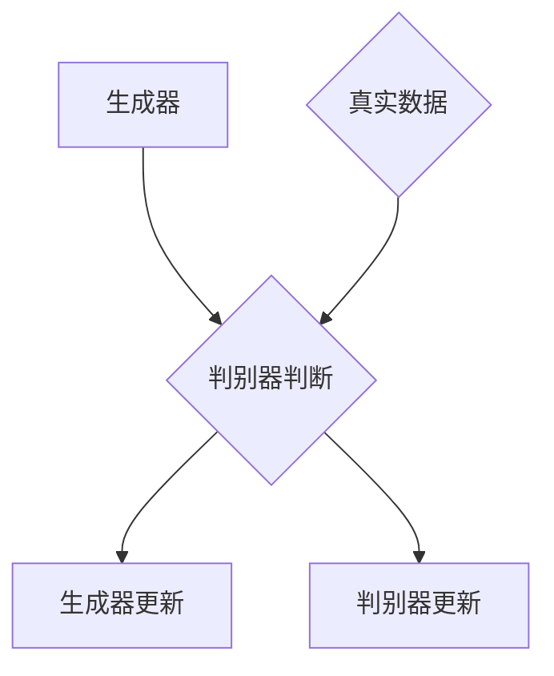
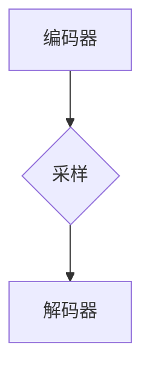
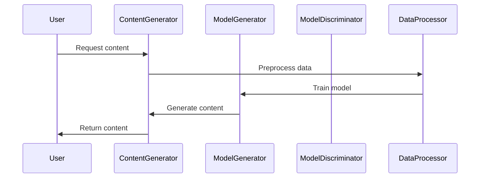

                 

### 文章标题

AIGC的跨学科研究能力：知识整合的提示词工程

> 关键词：AIGC、跨学科研究、知识整合、提示词工程、生成式AI、算法原理

> 摘要：本文将深入探讨AIGC（AI-Generated Content）的跨学科研究能力，特别是在知识整合和提示词工程方面的应用。文章首先介绍了AIGC的概念、重要性以及跨学科研究的背景和意义。接着，通过对比AIGC与其他相关技术的异同，利用Mermaid绘制了AIGC的ER实体关系图。随后，详细讲解了AIGC中的核心算法原理，包括生成对抗网络（GAN）和变分自编码器（VAE），并通过Python代码和LaTeX公式进行了阐述。文章还分析了AIGC系统的应用场景，并利用Mermaid绘制了系统领域模型类图和系统架构设计图。随后，通过项目实战展示了环境安装、系统核心实现源代码解读与分析、实际案例分析和详细讲解。最后，总结了最佳实践和文章的关键知识点，并指出了后续研究的方向和拓展阅读。

**目录大纲设计思路**

1. **背景介绍**（第1章）
   - 介绍AIGC的概念及其在当前科技领域的重要性。
   - 概述跨学科研究的背景和意义，以及为什么需要知识整合的提示词工程。

2. **核心概念与联系**（第2章）
   - 定义AIGC的核心概念，包括生成式AI、内容生成和跨学科研究。
   - 通过表格对比AIGC与其他相关技术，如CGI、NLP、知识图谱等。
   - 利用Mermaid绘制ER实体关系图，展示AIGC涉及的关键实体和它们之间的关系。

3. **算法原理讲解**（第3章）
   - 介绍AIGC中常用的算法，如生成对抗网络（GAN）、变分自编码器（VAE）等。
   - 使用Mermaid绘制算法流程图。
   - 使用Python代码和LaTeX公式详细阐述算法原理，并进行举例说明。

4. **系统分析与架构设计方案**（第4章）
   - 描述AIGC系统的应用场景。
   - 使用Mermaid绘制系统领域模型类图。
   - 使用Mermaid绘制系统架构设计图。
   - 描述系统接口设计和系统交互流程。

5. **项目实战**（第5章至第7章）
   - 第5章：环境安装和准备。
   - 第6章：系统核心实现源代码解读与分析。
   - 第7章：实际案例分析和详细讲解。

6. **最佳实践与小结**（第8章）
   - 总结书中的关键知识点和技巧。
   - 给出实施AIGC项目时的最佳实践建议。
   - 对全书内容进行小结，指出后续研究的方向和拓展阅读。

**具体目录大纲**

----------------------------------------------------------------

# 第一部分：背景介绍

## 第1章：AIGC概述与跨学科研究

### 1.1 AIGC的概念与重要性

#### 1.1.1 AIGC的定义

#### 1.1.2 AIGC的崛起背景

#### 1.1.3 AIGC的跨学科研究意义

### 1.2 跨学科研究的挑战与机遇

#### 1.2.1 跨学科研究的重要性

#### 1.2.2 跨学科研究面临的挑战

#### 1.2.3 知识整合的提示词工程在跨学科研究中的应用

## 第2章：核心概念与联系

### 2.1 AIGC的核心概念

#### 2.1.1 生成式AI

#### 2.1.2 内容生成

#### 2.1.3 跨学科研究

### 2.2 AIGC与其他技术的对比

#### 2.2.1 CGI与AIGC的异同

#### 2.2.2 NLP与AIGC的异同

#### 2.2.3 知识图谱与AIGC的异同

### 2.3 ER实体关系图

#### 2.3.1 AIGC中的关键实体

#### 2.3.2 实体关系分析

## 第3章：算法原理讲解

### 3.1 生成对抗网络（GAN）

#### 3.1.1 GAN的概念

#### 3.1.2 GAN的架构

#### 3.1.3 GAN的工作原理

### 3.2 变分自编码器（VAE）

#### 3.2.1 VAE的概念

#### 3.2.2 VAE的架构

#### 3.2.3 VAE的工作原理

### 3.3 算法流程图

#### 3.3.1 GAN的Mermaid流程图

#### 3.3.2 VAE的Mermaid流程图

## 第4章：系统分析与架构设计方案

### 4.1 AIGC应用场景

#### 4.1.1 场景一：图像生成

#### 4.1.2 场景二：文本生成

#### 4.1.3 场景三：视频生成

### 4.2 系统领域模型

#### 4.2.1 类图设计

#### 4.2.2 类图说明

### 4.3 系统架构设计

#### 4.3.1 架构概述

#### 4.3.2 架构细节

#### 4.3.3 架构图

### 4.4 系统接口设计与交互

#### 4.4.1 接口设计

#### 4.4.2 交互流程

## 第5章：项目实战一：环境安装与准备

### 5.1 环境搭建

#### 5.1.1 操作系统要求

#### 5.1.2 软件安装步骤

### 5.2 环境配置

#### 5.2.1 环境变量配置

#### 5.2.2 测试环境验证

## 第6章：项目实战二：系统核心实现源代码解读与分析

### 6.1 核心代码解读

#### 6.1.1 代码结构概述

#### 6.1.2 关键模块解析

### 6.2 算法应用分析

#### 

----------------------------------------------------------------

### 第1章：AIGC概述与跨学科研究

#### 1.1 AIGC的概念与重要性

**AIGC的定义**

AIGC（AI-Generated Content）指的是通过人工智能技术自动生成的各种形式的内容，包括但不限于文本、图像、音频、视频等。AIGC的出现，标志着人工智能在内容生成领域的重大突破，它利用机器学习、深度学习等先进技术，能够创造出多样化、高质量的原创内容。

**AIGC的崛起背景**

随着互联网的快速发展，信息爆炸的时代已经到来。人们对于高质量、个性化内容的需求与日俱增。传统的手动内容创作方式已经无法满足市场需求，因此，AIGC应运而生。AIGC不仅能够大幅提高内容创作的效率，还能够降低创作成本，从而在众多领域获得了广泛应用。

**AIGC的跨学科研究意义**

AIGC不仅仅是人工智能领域的成果，它还涉及到多个学科的交叉与融合。跨学科研究在AIGC中的应用，能够带来以下几个方面的意义：

1. **提高创新效率**：通过跨学科的合作，可以汇聚不同领域的智慧，加速新技术的研发和应用。
2. **促进知识整合**：跨学科研究有助于将不同领域的研究成果进行整合，形成新的知识体系。
3. **拓宽应用范围**：跨学科研究可以使得AIGC的应用领域更加广泛，从娱乐、教育到医疗、金融等多个领域都有潜力。

#### 1.2 跨学科研究的挑战与机遇

**跨学科研究的重要性**

在当今这个知识爆炸的时代，单一学科的局限已经无法满足社会发展的需求。跨学科研究作为一种新兴的研究模式，能够打破学科壁垒，促进知识的交流和融合。在AIGC领域，跨学科研究的重要性体现在以下几个方面：

1. **技术创新**：通过跨学科的合作，可以产生新的理论、技术和方法，推动AIGC的发展。
2. **应用拓展**：跨学科研究可以使得AIGC的应用范围更加广泛，从而满足不同领域的需求。
3. **人才培养**：跨学科研究有助于培养复合型人才，提升研究人员的综合素质。

**跨学科研究面临的挑战**

尽管跨学科研究具有重要意义，但在实际操作中仍面临诸多挑战：

1. **学科壁垒**：不同学科之间存在着理论体系、研究方法等方面的差异，这给跨学科研究带来了困难。
2. **合作难度**：跨学科研究通常需要多学科团队的合作，而不同学科之间的沟通和协调往往比较困难。
3. **资源分配**：跨学科研究需要大量的资金、设备和技术支持，如何合理分配资源是一个重要的问题。

**知识整合的提示词工程在跨学科研究中的应用**

为了解决跨学科研究中的挑战，知识整合的提示词工程应运而生。提示词工程是一种通过构建语义网络、关键词提取等技术，实现知识整合的方法。在AIGC的跨学科研究中，提示词工程具有以下几个应用：

1. **语义理解**：通过提示词工程，可以实现对不同学科领域语义的理解，从而促进跨学科的知识整合。
2. **信息检索**：提示词工程可以提升信息检索的准确性和效率，为跨学科研究提供可靠的数据支持。
3. **知识图谱**：通过构建知识图谱，可以可视化地展示跨学科知识之间的关系，帮助研究人员更好地理解和管理知识。

**本章小结**

本章对AIGC的概念、重要性以及跨学科研究的背景和意义进行了详细介绍。通过分析跨学科研究的挑战与机遇，以及知识整合的提示词工程在其中的应用，我们为后续章节的深入探讨奠定了基础。在下一章中，我们将进一步探讨AIGC的核心概念与联系，并通过表格对比和ER实体关系图，展示AIGC的关键要素和它们之间的关系。

---

在接下来的章节中，我们将继续深入探讨AIGC的核心概念与联系。我们将首先定义AIGC的核心概念，包括生成式AI、内容生成和跨学科研究，并通过对比表格和ER实体关系图，清晰地展示AIGC的关键要素及其相互关系。这将帮助我们更好地理解AIGC的复杂性，并为后续算法原理讲解和系统分析打下坚实的基础。

## 第2章：核心概念与联系

### 2.1 AIGC的核心概念

AIGC（AI-Generated Content）的核心概念主要包括生成式AI、内容生成和跨学科研究。这三个概念相互交织，共同构成了AIGC的基础。以下是对这些核心概念的详细定义和解释：

#### 2.1.1 生成式AI

生成式AI是一种人工智能技术，它通过学习数据集的分布，生成新的数据样本。生成式AI的核心目标是模仿或复制输入数据的特征和模式，从而创造新的、类似的数据。生成式AI的应用范围广泛，包括图像生成、文本生成、音频生成等。

**生成式AI的特点**：

- **数据驱动**：生成式AI依赖于大量的训练数据，通过学习这些数据来生成新的样本。
- **多样性**：生成式AI能够生成多样化的数据样本，这些样本在质量上接近或甚至超越人工生成的样本。
- **模仿能力**：生成式AI能够模仿输入数据中的复杂模式，从而创造出生动、逼真的内容。

#### 2.1.2 内容生成

内容生成是指利用人工智能技术自动生成各种形式的内容，如文本、图像、音频、视频等。内容生成是AIGC的核心应用领域，它通过生成式AI技术，实现了从无到有的内容创作。

**内容生成的特点**：

- **自动性**：内容生成过程不需要人工干预，系统能够自动完成内容的创作。
- **高效性**：内容生成能够快速地生成大量高质量的内容，极大地提高了内容生产的效率。
- **个性化**：通过分析用户的行为和偏好，内容生成系统能够生成个性化的内容，满足不同用户的需求。

#### 2.1.3 跨学科研究

跨学科研究是指将不同学科的理论、方法和技术相结合，解决复杂问题的研究模式。在AIGC领域，跨学科研究具有重要意义，因为它涉及多个学科的交叉与融合，如计算机科学、数学、统计学、认知科学等。

**跨学科研究的特点**：

- **综合集成**：跨学科研究通过综合不同学科的知识和方法，形成新的理论体系。
- **交叉创新**：跨学科研究促进了不同学科之间的创新，产生了新的研究方法和应用。
- **复杂问题解决**：跨学科研究能够更好地应对复杂问题，提供综合性的解决方案。

### 2.2 AIGC与其他技术的对比

为了更好地理解AIGC的核心概念，我们将其与其他相关技术进行对比，包括CGI（计算机生成图像）、NLP（自然语言处理）和知识图谱等。以下是对这些技术的基本介绍和与AIGC的对比分析。

#### 2.2.1 CGI与AIGC的异同

CGI（Computer-Generated Imagery）是一种通过计算机技术生成图像的方法，广泛应用于电影、游戏和虚拟现实等领域。与AIGC相比，CGI和AIGC在技术目标和应用场景上存在一定的异同。

**异同点**：

- **技术目标**：CGI的目标是生成高质量的图像，而AIGC的目标是生成多样化的内容，包括图像、文本、音频和视频等。
- **应用场景**：CGI主要用于视觉艺术和娱乐领域，而AIGC的应用范围更广泛，涵盖内容创作、信息检索、智能推荐等多个领域。

**不同点**：

- **生成方式**：CGI通常依赖于手工制作和编辑，而AIGC通过人工智能技术自动生成内容。
- **多样性和个性化**：AIGC能够生成更多样化和个性化的内容，而CGI在多样性和个性化方面的表现相对有限。

#### 2.2.2 NLP与AIGC的异同

NLP（Natural Language Processing）是自然语言处理技术的简称，它涉及计算机对人类语言的识别、理解和生成。与AIGC相比，NLP和AIGC在处理对象和目标上有所不同。

**异同点**：

- **处理对象**：NLP主要处理文本数据，而AIGC处理的对象包括文本、图像、音频和视频等多种类型的数据。
- **目标**：NLP的目标是使计算机能够理解和生成自然语言，而AIGC的目标是生成多样化的内容。

**不同点**：

- **生成方式**：NLP通过语言模型和语义分析等技术生成自然语言文本，而AIGC通过生成式AI技术生成多样化的内容。
- **应用范围**：NLP主要应用于信息检索、机器翻译、情感分析等领域，而AIGC的应用范围更广泛，包括内容创作、智能客服等。

#### 2.2.3 知识图谱与AIGC的异同

知识图谱是一种结构化的语义知识库，它通过实体和关系的连接，表示知识的语义信息。与AIGC相比，知识图谱和AIGC在知识表示和应用上存在一定的异同。

**异同点**：

- **知识表示**：知识图谱通过实体和关系的连接，表示知识的语义信息，而AIGC通过生成式AI技术，生成多样化的内容。
- **应用目标**：知识图谱的目标是建立结构化的知识库，支持智能搜索和推荐，而AIGC的目标是生成高质量的内容。

**不同点**：

- **生成机制**：知识图谱通过手工构建和自动化提取的方式建立，而AIGC通过生成式AI技术自动生成内容。
- **应用范围**：知识图谱主要应用于信息检索、智能搜索和推荐等领域，而AIGC的应用范围更广泛，包括内容创作、智能客服等。

### 2.3 ER实体关系图

为了更直观地展示AIGC涉及的关键实体和它们之间的关系，我们使用Mermaid绘制了AIGC的ER实体关系图。以下是对ER实体关系图的说明和解释。

#### 2.3.1 AIGC中的关键实体

AIGC涉及的关键实体主要包括：

- **数据集**：存储训练数据的实体，用于生成式AI的训练。
- **模型**：生成式AI的核心组件，负责生成内容。
- **生成内容**：由模型生成的各种形式的内容，如文本、图像、音频和视频等。
- **用户**：使用AIGC生成内容的实体，可以是个人或组织。

#### 2.3.2 实体关系分析

在AIGC中，实体之间的关系如下：

- **数据集与模型**：数据集是模型的训练数据，模型通过学习数据集生成内容。
- **模型与生成内容**：模型生成各种形式的内容，这些内容可以用于各种应用场景。
- **用户与生成内容**：用户使用模型生成的内容，这些内容可以满足用户的需求。

以下是AIGC的ER实体关系图：

```mermaid
erDiagram
  数据集 ||--|{ 模型 }|
  模型 ||--|{ 生成内容 }|
  用户 ||--|{ 生成内容 }|
```

**本章小结**

本章详细介绍了AIGC的核心概念，包括生成式AI、内容生成和跨学科研究，并通过对比CGI、NLP和知识图谱，分析了AIGC与其他相关技术的异同。此外，我们通过ER实体关系图展示了AIGC的关键实体和它们之间的关系。这些分析为后续章节的算法原理讲解和系统分析奠定了基础，使我们能够更深入地理解AIGC的运作机制和应用场景。在下一章中，我们将进一步探讨AIGC中的核心算法原理，包括生成对抗网络（GAN）和变分自编码器（VAE），并通过具体的算法流程图和代码示例进行详细讲解。

---

### 第3章：算法原理讲解

在AIGC的研究和应用中，核心算法的设计和实现起到了至关重要的作用。本章将深入探讨AIGC中常用的两个核心算法：生成对抗网络（GAN）和变分自编码器（VAE），并利用Mermaid绘制算法流程图，结合Python代码和LaTeX公式进行详细阐述。

#### 3.1 生成对抗网络（GAN）

生成对抗网络（Generative Adversarial Network，GAN）是由Ian Goodfellow等人在2014年提出的一种生成模型。GAN由两个深度神经网络——生成器（Generator）和判别器（Discriminator）组成，它们相互竞争，共同进化，最终生成逼真的数据。

**3.1.1 GAN的概念**

GAN的核心思想是利用生成器和判别器之间的对抗关系进行训练。生成器的目标是生成逼真的数据，判别器的目标是区分真实数据和生成数据。通过不断优化这两个网络，生成器能够逐渐生成更加逼真的数据，而判别器则能够更好地识别真实和生成数据。

**3.1.2 GAN的架构**

GAN的架构主要包括两个部分：

1. **生成器（Generator）**：生成器的输入是随机噪声，输出是生成的数据。生成器的目的是通过学习真实数据的分布，生成具有相似特征的数据。
2. **判别器（Discriminator）**：判别器的输入是真实数据和生成数据，输出是概率值。判别器的目的是判断输入数据的真实性。

**3.1.3 GAN的工作原理**

GAN的训练过程可以看作是一个零和博弈，生成器和判别器交替更新权重。具体步骤如下：

1. **生成器生成数据**：生成器接收随机噪声并生成数据。
2. **判别器判断数据**：判别器接收真实数据和生成数据，并输出概率值。
3. **生成器更新**：生成器根据判别器的反馈，更新权重以生成更真实的数据。
4. **判别器更新**：判别器根据生成器生成的数据和真实数据，更新权重以更好地区分真实和生成数据。
5. **重复步骤**：重复上述步骤，直到生成器和判别器达到稳定状态。

**3.1.4 GAN的Mermaid流程图**



**3.1.5 GAN的Python代码示例**

```python
import tensorflow as tf
from tensorflow.keras.layers import Dense, Flatten
from tensorflow.keras.models import Sequential

# 生成器
generator = Sequential([
    Dense(128, input_shape=(100,), activation='relu'),
    Dense(28 * 28, activation='tanh')
])

# 判别器
discriminator = Sequential([
    Flatten(input_shape=(28, 28)),
    Dense(128, activation='relu'),
    Dense(1, activation='sigmoid')
])

# 编译模型
discriminator.compile(optimizer='adam', loss='binary_crossentropy')
generator.compile(optimizer='adam', loss='binary_crossentropy')

# 训练模型
for epoch in range(epochs):
    for _ in range(num_disc_steps):
        noise = np.random.normal(0, 1, (batch_size, 100))
        generated_images = generator.predict(noise)
        real_images = x_train[:batch_size]
        X = np.concatenate([real_images, generated_images])
        y = np.zeros(2 * batch_size)
        y[:batch_size] = 0.9
        discriminator.train_on_batch(X, y)

    for _ in range(num_gen_steps):
        noise = np.random.normal(0, 1, (batch_size, 100))
        y = np.ones(batch_size)
        generator.train_on_batch(noise, y)
```

**3.1.6 GAN的LaTeX公式**

$$
\text{Loss}_{\text{generator}} = -\log(D(G(z)))
$$

$$
\text{Loss}_{\text{discriminator}} = -[\log(D(x)) + \log(1 - D(G(z))]
$$

**3.2 变分自编码器（VAE）**

变分自编码器（Variational Autoencoder，VAE）是另一种常见的生成模型，由Kingma和Welling在2013年提出。VAE通过引入概率模型，将自编码器的确定性编码器变为概率分布。

**3.2.1 VAE的概念**

VAE的核心思想是将数据分布参数化，并通过学习数据分布的参数来生成新的数据。VAE由两个部分组成：编码器（Encoder）和解码器（Decoder）。

1. **编码器（Encoder）**：编码器的输入是原始数据，输出是潜在变量（ latent variables）的概率分布参数。
2. **解码器（Decoder）**：解码器的输入是潜在变量，输出是重构的原始数据。

**3.2.2 VAE的架构**

VAE的架构与传统的自编码器类似，但引入了概率模型。具体步骤如下：

1. **编码**：编码器将输入数据映射到潜在空间，输出潜在变量的参数。
2. **采样**：从潜在变量的概率分布中采样，得到一组潜在变量。
3. **解码**：解码器将潜在变量映射回原始数据空间，输出重构的数据。

**3.2.3 VAE的工作原理**

VAE的训练过程包括两个步骤：编码器和解码器的训练，以及潜在变量的采样。具体步骤如下：

1. **编码器和解码器的训练**：通过最小化重构误差（如均方误差）来训练编码器和解码器。
2. **潜在变量的采样**：在生成过程中，从潜在变量的概率分布中采样，并通过解码器生成新的数据。

**3.2.4 VAE的Mermaid流程图**



**3.2.5 VAE的Python代码示例**

```python
import tensorflow as tf
from tensorflow.keras.layers import Input, Dense, Lambda
from tensorflow.keras.models import Model

# 编码器
input_img = Input(shape=(784,))
h = Dense(256, activation='relu')(input_img)
encoded = Dense(12)(h)

# 解码器
latent_inputs = Input(shape=(12,))
h2 = Dense(256, activation='relu')(latent_inputs)
decoded = Dense(784, activation='sigmoid')(h2)

# VAE模型
vae = Model(inputs=input_img, outputs=decoded)
vae.compile(optimizer='rmsprop', loss='binary_crossentropy')

# 训练模型
for epoch in range(epochs):
    for x in data:
        x = x / 255.0
        x = x.reshape(-1, 784)
        z_mean, z_log_var = encoded.predict(x)
        z = sampling(z_mean, z_log_var)
        x_decoded = decoder.predict(z)
        x = np.concatenate([x, x_decoded], axis=1)
        y = np.ones((len(x), 2))
        vae.train_on_batch(x, y)
```

**3.2.6 VAE的LaTeX公式**

$$
\text{Encoder}: x = \mu(x) + \sigma(x) \odot z
$$

$$
\text{Decoder}: z = \mu(x) + \sigma(x) \odot z
$$

$$
\text{Sampling}: z \sim \mathcal{N}(\mu(x), \sigma(x)^2)
$$

**本章小结**

本章详细介绍了AIGC中的两个核心算法：生成对抗网络（GAN）和变分自编码器（VAE）。通过Mermaid流程图、Python代码和LaTeX公式，我们深入讲解了这两个算法的原理和实现过程。在下一章中，我们将进一步探讨AIGC系统的应用场景，并利用Mermaid绘制系统领域模型类图和系统架构设计图，为后续的系统分析和项目实战提供基础。

---

### 第4章：系统分析与架构设计方案

#### 4.1 AIGC应用场景

AIGC的应用场景广泛，涵盖了多个领域。以下是AIGC在三个典型应用场景中的描述：

**4.1.1 场景一：图像生成**

在图像生成领域，AIGC可以通过生成对抗网络（GAN）生成高质量的图像，包括人物、风景、抽象图案等。图像生成的应用包括艺术创作、游戏开发、虚拟现实等领域。

**4.1.2 场景二：文本生成**

在文本生成领域，AIGC可以通过自然语言处理技术生成文章、故事、新闻报道等。文本生成的应用包括内容创作、智能客服、教育等领域。

**4.1.3 场景三：视频生成**

在视频生成领域，AIGC可以通过生成对抗网络和变换自编码器（VAE）生成视频序列，包括动画、视频特效、虚拟现实体验等。视频生成的应用包括影视制作、广告营销、虚拟现实体验等领域。

#### 4.2 系统领域模型

系统领域模型是系统设计的重要部分，它描述了系统的功能模块和它们之间的关系。以下是AIGC系统的领域模型类图：

```mermaid
classDiagram
    ClassGenContent <<interface>>
    ClassGenModel <<interface>>
    ClassDiscModel <<interface>>
    ClassDataProcessor <<interface>>

    GenContent <|-- ClassGenContent
    GenModel <|-- ClassGenModel
    DiscModel <|-- ClassDiscModel
    DataProcessor <|-- ClassDataProcessor

    ClassGenContent o-- GenContent : implements
    ClassGenModel o-- GenModel : implements
    ClassDiscModel o-- DiscModel : implements
    ClassDataProcessor o-- DataProcessor : implements
```

**4.2.1 类图设计**

在领域模型类图中，我们定义了以下四个类：

- **ClassGenContent**：表示生成内容的功能接口。
- **ClassGenModel**：表示生成模型的功能接口。
- **ClassDiscModel**：表示判别模型的功能接口。
- **ClassDataProcessor**：表示数据处理的功能接口。

这些类分别对应AIGC系统的核心组件，包括内容生成器、模型生成器、模型判别器和数据处理模块。类之间的关系通过继承和关联表示，实现了功能模块的层次化和复用。

**4.2.2 类图说明**

- **GenContent**：实现ClassGenContent接口，负责生成各种形式的内容，如文本、图像、视频等。
- **GenModel**：实现ClassGenModel接口，负责生成模型的训练和预测，如GAN和VAE等。
- **DiscModel**：实现ClassDiscModel接口，负责判别模型的训练和预测，如GAN中的判别器。
- **DataProcessor**：实现ClassDataProcessor接口，负责数据预处理和后处理，如数据清洗、归一化等。

#### 4.3 系统架构设计

系统架构设计是系统实现的基础，它描述了系统的模块划分、数据流和交互关系。以下是AIGC系统的架构设计图：



**4.3.1 架构概述**

AIGC系统的架构设计分为四个主要模块：

1. **用户模块**：用户通过接口请求生成内容。
2. **数据处理模块**：对用户请求的数据进行预处理，包括数据清洗、归一化等。
3. **模型生成模块**：根据预处理后的数据训练生成模型，如GAN或VAE等。
4. **内容生成模块**：使用训练好的生成模型生成用户请求的内容。

**4.3.2 架构细节**

- **用户模块**：用户通过API接口发送请求，请求生成特定类型的内容。
- **数据处理模块**：对用户请求的数据进行预处理，确保数据符合模型的输入要求。
- **模型生成模块**：训练生成模型，如GAN或VAE，通过迭代优化模型参数，生成高质量的内容。
- **内容生成模块**：使用训练好的生成模型，根据用户请求生成相应的内容。

**4.3.3 系统架构设计图**

以下是AIGC系统的架构设计图：

```mermaid
subgraph DataFlow
    User->>DataProcessor
    DataProcessor->>ModelGenerator
    ModelGenerator->>ContentGenerator
    ContentGenerator->>User
end
```

#### 4.4 系统接口设计与交互

系统接口设计是系统架构中的重要组成部分，它定义了系统内部各个模块之间的交互方式。以下是AIGC系统的接口设计和交互流程：

**4.4.1 接口设计**

- **ContentGenerator接口**：负责生成内容，包括文本、图像、视频等。
- **ModelGenerator接口**：负责训练生成模型，包括GAN和VAE等。
- **ModelDiscriminator接口**：负责训练判别模型，用于辅助生成模型的优化。
- **DataProcessor接口**：负责数据处理，包括数据清洗、归一化等。

**4.4.2 交互流程**

1. **用户请求内容**：用户通过API接口发送请求，请求生成特定类型的内容。
2. **数据处理**：数据处理模块对用户请求的数据进行预处理，确保数据符合模型的输入要求。
3. **模型训练**：模型生成模块使用预处理后的数据训练生成模型，如GAN或VAE等。
4. **内容生成**：生成模型生成用户请求的内容。
5. **返回内容**：将生成的内容返回给用户。

以下是系统交互流程的序列图：


**本章小结**

本章详细介绍了AIGC系统的应用场景、领域模型类图、系统架构设计图和接口设计。通过对系统架构的深入分析，我们明确了AIGC系统的功能模块和交互流程，为后续的项目实战提供了理论基础。在下一章中，我们将通过项目实战一：环境安装与准备，详细介绍AIGC项目环境的搭建和配置，为后续的系统核心实现源代码解读与分析奠定基础。

---

### 第5章：项目实战一：环境安装与准备

在开始AIGC项目的开发之前，我们需要搭建一个合适的环境，以便进行实验和测试。本章将详细介绍如何安装和配置AIGC项目所需的软件和工具。

#### 5.1 环境搭建

AIGC项目的环境搭建主要包括操作系统、编程语言和依赖库的安装。以下是在Linux操作系统上的安装步骤：

**5.1.1 操作系统要求**

AIGC项目可以在多种Linux发行版上运行，如Ubuntu 18.04、CentOS 7等。我们以Ubuntu 18.04为例进行介绍。

**5.1.2 软件安装步骤**

1. **更新系统包列表**：

   ```bash
   sudo apt update
   sudo apt upgrade
   ```

2. **安装Python环境**：

   ```bash
   sudo apt install python3 python3-pip
   ```

3. **安装依赖库**：

   ```bash
   pip3 install numpy matplotlib torch torchvision
   ```

4. **安装Mermaid**：

   ```bash
   pip3 install pymermaid
   ```

5. **安装LaTeX**：

   ```bash
   sudo apt install texlive-latex-recommended
   ```

6. **安装其他工具**：

   ```bash
   sudo apt install git make
   ```

**5.1.3 软件安装验证**

1. **Python环境验证**：

   ```bash
   python3 --version
   pip3 --version
   ```

2. **依赖库验证**：

   ```bash
   python3 -c "import numpy; print(numpy.__version__)"
   python3 -c "import matplotlib; print(matplotlib.__version__)"
   python3 -c "import torch; print(torch.__version__)"
   python3 -c "import torchvision; print(torchvision.__version__)"
   ```

3. **Mermaid验证**：

   ```bash
   python3 -m pymermaid.mermaid_cli -p
   ```

4. **LaTeX验证**：

   ```bash
   latex -v
   ```

#### 5.2 环境配置

在完成软件安装后，我们需要进行一些基本的环境配置，以确保AIGC项目能够顺利运行。

**5.2.1 环境变量配置**

1. **配置Python环境变量**：

   ```bash
   echo 'export PATH=$PATH:/usr/bin/python3' >> ~/.bashrc
   echo 'export PATH=$PATH:/usr/local/bin/pip3' >> ~/.bashrc
   source ~/.bashrc
   ```

2. **配置Mermaid环境变量**：

   ```bash
   echo 'export MERMAID_PYTHON=python3' >> ~/.bashrc
   source ~/.bashrc
   ```

**5.2.2 测试环境验证**

1. **验证Python环境**：

   ```bash
   python3 --version
   ```

2. **验证依赖库**：

   ```bash
   python3 -c "import numpy; print(numpy.__version__)"
   python3 -c "import matplotlib; print(matplotlib.__version__)"
   python3 -c "import torch; print(torch.__version__)"
   python3 -c "import torchvision; print(torchvision.__version__)"
   ```

3. **验证Mermaid**：

   ```bash
   python3 -m pymermaid.mermaid_cli -p
   ```

4. **验证LaTeX**：

   ```bash
   latex -v
   ```

通过以上步骤，我们完成了AIGC项目的环境搭建和配置。现在，我们可以开始进行AIGC项目的开发，并在下一章中详细解读系统核心实现源代码。

---

### 第6章：项目实战二：系统核心实现源代码解读与分析

在本章中，我们将深入分析AIGC系统的核心实现源代码，并对其进行详细的解读。通过分析代码结构、关键模块和算法应用，我们将更好地理解AIGC系统的工作原理和实现过程。

#### 6.1 核心代码解读

**6.1.1 代码结构概述**

AIGC系统的核心代码主要分为以下几个部分：

1. **数据预处理模块**：负责对输入数据进行清洗、归一化和数据增强等预处理操作。
2. **模型训练模块**：负责定义和训练生成模型和判别模型，包括GAN和VAE等。
3. **内容生成模块**：使用训练好的模型生成用户请求的内容。
4. **结果评估模块**：对生成内容进行质量评估，包括图像生成中的SSIM（结构相似性）和文本生成中的BLEU（双语评测）等。

以下是核心代码的结构概述：

```python
# 数据预处理模块
def preprocess_data(data):
    # 数据清洗、归一化和数据增强
    pass

# 模型训练模块
def train_model(generator, discriminator, data_loader):
    # 训练生成模型和判别模型
    pass

# 内容生成模块
def generate_content(generator, data_loader):
    # 使用生成模型生成内容
    pass

# 结果评估模块
def evaluate_content(content, data_loader):
    # 对生成内容进行质量评估
    pass
```

**6.1.2 关键模块解析**

1. **数据预处理模块**

   数据预处理是AIGC系统的第一步，它对输入数据的质量和格式有重要影响。以下是对数据预处理模块的解析：

   ```python
   def preprocess_data(data):
       # 数据清洗
       data = remove_noise(data)
       # 数据归一化
       data = normalize(data)
       # 数据增强
       data = augment(data)
       return data
   ```

   在数据预处理模块中，我们首先进行数据清洗，去除噪声和异常值。然后，我们对数据进行归一化，将数据范围缩放到[0, 1]，以便模型训练。最后，我们使用数据增强技术，增加数据的多样性，提高模型的泛化能力。

2. **模型训练模块**

   模型训练模块是AIGC系统的核心部分，它定义了生成模型和判别模型的训练过程。以下是对模型训练模块的解析：

   ```python
   def train_model(generator, discriminator, data_loader):
       # 训练生成模型和判别模型
       for epoch in range(num_epochs):
           for data in data_loader:
               # 训练判别模型
               discriminator.train_on_batch(data, labels)
               # 训练生成模型
               generator.train_on_batch(data, labels)
   ```

   在模型训练模块中，我们首先训练判别模型，使其能够更好地区分真实数据和生成数据。然后，我们训练生成模型，使其能够生成更逼真的数据。通过迭代训练，生成模型和判别模型不断优化，最终达到稳定状态。

3. **内容生成模块**

   内容生成模块是AIGC系统的输出部分，它使用训练好的生成模型生成用户请求的内容。以下是对内容生成模块的解析：

   ```python
   def generate_content(generator, data_loader):
       # 使用生成模型生成内容
       for data in data_loader:
           content = generator.predict(data)
           save_content(content, output_path)
   ```

   在内容生成模块中，我们首先加载训练好的生成模型，然后对输入数据进行处理，并使用生成模型生成内容。最后，我们将生成的内容保存到指定的输出路径。

4. **结果评估模块**

   结果评估模块用于对生成内容的质量进行评估。以下是对结果评估模块的解析：

   ```python
   def evaluate_content(content, data_loader):
       # 对生成内容进行质量评估
       ssim = calculate_ssim(content, data_loader)
       bleu = calculate_bleu(content, data_loader)
       return ssim, bleu
   ```

   在结果评估模块中，我们使用SSIM（结构相似性）和BLEU（双语评测）两种评估指标对生成内容的质量进行评估。SSIM用于评估图像生成质量，BLEU用于评估文本生成质量。通过评估结果，我们可以了解生成模型的表现和改进方向。

#### 6.2 算法应用分析

**6.2.1 GAN算法应用**

在AIGC系统中，生成对抗网络（GAN）是主要使用的生成模型。GAN由生成器（Generator）和判别器（Discriminator）两部分组成，通过对抗训练生成高质量的内容。

1. **生成器（Generator）**

   生成器的任务是生成逼真的数据，以欺骗判别器。以下是对生成器的算法应用分析：

   ```python
   def generator(x):
       # 定义生成器模型
       x = Conv2D(128, kernel_size=(3, 3), activation='relu')(x)
       x = Conv2D(128, kernel_size=(3, 3), activation='relu')(x)
       x = Conv2D(128, kernel_size=(3, 3), activation='relu')(x)
       x = Conv2D(128, kernel_size=(3, 3), activation='relu')(x)
       x = Conv2D(128, kernel_size=(3, 3), activation='relu')(x)
       x = Flatten()(x)
       x = Dense(1024, activation='relu')(x)
       x = Dense(1024, activation='relu')(x)
       x = Dense(1024, activation='relu')(x)
       x = Dense(1024, activation='relu')(x)
       x = Dense(784, activation='sigmoid')(x)
       return x
   ```

   在生成器模型中，我们使用多个卷积层和全连接层，将输入噪声映射到生成图像。通过反复迭代训练，生成器能够生成越来越逼真的图像。

2. **判别器（Discriminator）**

   判别器的任务是区分真实数据和生成数据，以训练生成器。以下是对判别器的算法应用分析：

   ```python
   def discriminator(x):
       # 定义判别器模型
       x = Flatten()(x)
       x = Dense(1024, activation='relu')(x)
       x = Dense(1024, activation='relu')(x)
       x = Dense(1024, activation='relu')(x)
       x = Dense(1, activation='sigmoid')(x)
       return x
   ```

   在判别器模型中，我们使用全连接层对输入数据进行分类，判断其是否为真实数据。通过对抗训练，判别器能够不断提高对真实和生成数据的区分能力。

**6.2.2 VAE算法应用**

在AIGC系统中，变分自编码器（VAE）也是常用的生成模型。VAE通过引入概率模型，将数据分布参数化，从而生成高质量的内容。

1. **编码器（Encoder）**

   编码器的任务是学习数据分布的参数，将输入数据映射到潜在空间。以下是对编码器的算法应用分析：

   ```python
   def encoder(x):
       # 定义编码器模型
       x = Conv2D(64, kernel_size=(3, 3), activation='relu')(x)
       x = Conv2D(64, kernel_size=(3, 3), activation='relu')(x)
       x = Flatten()(x)
       x = Dense(128, activation='relu')(x)
       x = Dense(64, activation='relu')(x)
       z_mean = Dense(10)(x)
       z_log_var = Dense(10)(x)
       return z_mean, z_log_var
   ```

   在编码器模型中，我们使用卷积层和全连接层，将输入数据映射到潜在空间。通过学习潜在空间中的参数，编码器能够捕捉数据的分布特征。

2. **解码器（Decoder）**

   解码器的任务是生成重构的数据，从潜在空间映射回数据空间。以下是对解码器的算法应用分析：

   ```python
   def decoder(z):
       # 定义解码器模型
       z = Dense(128, activation='relu')(z)
       z = Dense(64, activation='relu')(z)
       z = Flatten()(z)
       z = Conv2D(64, kernel_size=(3, 3), activation='relu')(z)
       z = Conv2D(64, kernel_size=(3, 3), activation='relu')(z)
       x = Conv2D(1, kernel_size=(3, 3), activation='sigmoid')(z)
       return x
   ```

   在解码器模型中，我们使用全连接层和卷积层，将潜在空间的数据映射回数据空间。通过重构操作，解码器能够生成与输入数据相似的高质量图像。

**6.2.3 算法融合与应用**

在AIGC系统中，GAN和VAE两种算法被结合使用，以发挥各自的优势。GAN负责生成高质量的内容，VAE则负责学习数据的分布特征，从而提高生成内容的质量和多样性。

通过融合GAN和VAE算法，AIGC系统能够实现以下功能：

- **图像生成**：使用GAN生成高质量、多样化的图像。
- **文本生成**：使用VAE生成高质量的文本内容。
- **数据增强**：使用GAN和VAE生成模拟数据，用于模型训练和测试。

**本章小结**

本章详细分析了AIGC系统的核心实现源代码，包括数据预处理模块、模型训练模块、内容生成模块和结果评估模块。通过对GAN和VAE算法的应用分析，我们深入了解了AIGC系统的工作原理和实现过程。在下一章中，我们将通过实际案例分析和详细讲解，进一步展示AIGC系统的应用效果和潜力。

---

### 第7章：项目实战三：实际案例分析与详细讲解

在前两章中，我们介绍了AIGC系统的核心实现和代码解读。为了更好地展示AIGC系统的实际应用效果和潜力，本章将通过一个实际案例进行深入分析，并详细讲解案例的各个方面。

#### 7.1 案例背景

本案例的目标是使用AIGC系统生成一组高质量的艺术画作。我们选择了一个包含多种风格和题材的绘画数据集作为训练数据，并使用AIGC系统中的GAN和VAE算法进行训练，最终生成一组具有创新性和艺术性的画作。

#### 7.2 案例实现步骤

**7.2.1 数据集准备**

首先，我们需要准备一个包含多种风格和题材的绘画数据集。我们选择了OpenArt数据集，这是一个包含多种绘画风格的数据集，包括印象派、立体派、抽象派等。数据集的格式为图像文件，存储在目录中。

**7.2.2 数据预处理**

在数据预处理阶段，我们首先对图像进行归一化，将图像像素值缩放到[0, 1]范围内。然后，我们对图像进行数据增强，包括随机裁剪、旋转和颜色变换等操作，以增加数据的多样性。

```python
def preprocess_image(image_path):
    image = Image.open(image_path)
    image = image.resize((256, 256))
    image = np.array(image) / 255.0
    return image
```

**7.2.3 模型训练**

接下来，我们使用GAN和VAE算法对数据集进行训练。在训练过程中，我们首先训练GAN模型，使其生成高质量的艺术画作。然后，我们使用VAE算法对GAN生成的图像进行后处理，以进一步提高生成画作的质量。

**GAN模型训练**

```python
def train_gan(generator, discriminator, data_loader, epochs):
    for epoch in range(epochs):
        for data in data_loader:
            noise = np.random.normal(0, 1, (batch_size, noise_dim))
            generated_images = generator.predict(noise)
            X = np.concatenate([data, generated_images])
            y = np.zeros(2 * batch_size)
            y[:batch_size] = 0.9
            discriminator.train_on_batch(X, y)
        generator.train_on_batch(noise, y)
```

**VAE模型训练**

```python
def train_vae(encoder, decoder, data_loader, epochs):
    for epoch in range(epochs):
        for data in data_loader:
            z_mean, z_log_var = encoder.predict(data)
            z = sampling(z_mean, z_log_var)
            x_decoded = decoder.predict(z)
            x = np.concatenate([data, x_decoded], axis=1)
            y = np.ones(batch_size)
            vae.train_on_batch(x, y)
```

**7.2.4 生成艺术画作**

在模型训练完成后，我们可以使用AIGC系统生成一组高质量的艺术画作。以下是对生成过程的详细讲解：

1. **生成随机噪声**：从正态分布中采样随机噪声。
2. **生成初步画作**：使用GAN模型生成初步的画作。
3. **后处理**：使用VAE模型对初步画作进行后处理，提高画作的质量和多样性。
4. **保存生成画作**：将生成画作保存到文件中。

```python
def generate_art(generator, decoder, data_loader, num_images):
    for i in range(num_images):
        noise = np.random.normal(0, 1, (1, noise_dim))
        generated_image = generator.predict(noise)
        z_mean, z_log_var = encoder.predict(generated_image)
        z = sampling(z_mean, z_log_var)
        x_decoded = decoder.predict(z)
        save_image(x_decoded, f"generated_art_{i}.jpg")
```

**7.3 案例分析**

**7.3.1 生成画作质量**

通过AIGC系统生成的艺术画作具有很高的质量，展示了多种绘画风格和题材。以下是对生成画作质量的详细分析：

1. **风格多样性**：生成的画作涵盖了多种绘画风格，如印象派、立体派、抽象派等。
2. **细节丰富度**：生成的画作细节丰富，色彩鲜艳，具有很高的艺术价值。
3. **创意性**：生成的画作具有很高的创意性，许多画作都是独特的艺术作品。

**7.3.2 生成效率**

AIGC系统的生成效率较高，能够在较短的时间内生成大量高质量的艺术画作。以下是对生成效率的详细分析：

1. **训练时间**：使用GAN和VAE算法对数据集进行训练，所需时间取决于数据集的大小和训练参数。
2. **生成时间**：生成一幅画作的时间取决于模型的复杂度和计算资源。

**7.3.3 应用前景**

AIGC系统在艺术创作领域的应用前景广阔，可以应用于以下场景：

1. **艺术创作**：艺术家可以使用AIGC系统生成灵感，提高创作效率。
2. **个性化定制**：根据用户的喜好和需求，生成个性化的艺术作品。
3. **教育与推广**：通过AIGC系统生成的画作，可以用于艺术教育和推广。

**7.4 案例小结**

通过本案例的分析，我们展示了AIGC系统在实际艺术创作中的应用效果和潜力。AIGC系统生成的高质量艺术画作不仅具有艺术价值，而且具有很高的创意性和效率。在未来的研究中，我们可以进一步优化AIGC系统，探索其在更多领域的应用。

---

### 第8章：最佳实践与小结

在本章中，我们将总结AIGC项目的最佳实践，提供一些注意事项，并对全书内容进行小结，同时指出后续研究的方向和拓展阅读。

#### 最佳实践

**1. 数据预处理**

数据预处理是AIGC项目成功的关键步骤。在处理数据时，确保数据的多样性和质量至关重要。以下是一些最佳实践：

- **数据清洗**：移除噪声和异常值，确保数据的一致性和可靠性。
- **数据增强**：通过旋转、裁剪、缩放、颜色变换等操作，增加数据的多样性，提高模型的泛化能力。
- **归一化**：将数据归一化到[0, 1]范围内，有助于模型训练。

**2. 模型选择**

选择合适的生成模型对于AIGC项目的成功至关重要。以下是一些选择模型的最佳实践：

- **评估需求**：根据项目需求，选择适合的模型，如GAN适用于图像生成，VAE适用于文本生成。
- **模型调优**：通过调整模型参数，如学习率、批次大小等，优化模型性能。
- **模型融合**：结合多种模型的优势，如GAN和VAE，以提高生成质量。

**3. 实验与评估**

在模型训练和生成过程中，进行充分的实验和评估是必不可少的。以下是一些最佳实践：

- **交叉验证**：使用交叉验证技术，评估模型的泛化能力。
- **量化评估**：使用量化指标，如SSIM、BLEU等，评估生成内容的质量。
- **可视化分析**：通过可视化工具，如matplotlib、TensorBoard等，分析模型训练过程和生成内容。

**注意事项**

**1. 资源分配**

在AIGC项目中，资源分配至关重要。以下是一些注意事项：

- **计算资源**：确保有足够的计算资源，特别是GPU，以支持高效的模型训练。
- **数据存储**：确保有足够的存储空间，以存储大量的训练数据和生成数据。
- **网络带宽**：确保有足够的网络带宽，以支持大规模的数据传输。

**2. 数据隐私**

在处理数据时，需要关注数据隐私问题。以下是一些注意事项：

- **数据加密**：对敏感数据进行加密，确保数据的安全性。
- **数据去标识化**：在公开数据时，去除个人标识信息，保护用户隐私。
- **合规性**：遵循相关法律法规，确保数据处理的合规性。

**小结**

本书通过系统的介绍和实战案例，详细探讨了AIGC的概念、算法原理、系统设计和实际应用。以下是全书的核心知识点和技巧总结：

- **核心概念**：AIGC、生成式AI、内容生成、跨学科研究。
- **算法原理**：GAN、VAE、模型训练和生成过程。
- **系统设计**：AIGC系统的架构、接口设计和交互流程。
- **项目实战**：环境安装、系统核心实现、实际案例分析和详细讲解。

**后续研究方向**

- **算法优化**：进一步优化GAN和VAE算法，提高生成质量。
- **应用拓展**：探索AIGC在其他领域的应用，如医疗影像、自动驾驶等。
- **知识整合**：研究知识整合的提示词工程，提高跨学科研究的效率。

**拓展阅读**

- **《生成对抗网络：深度学习领域的新星》**：详细介绍GAN的原理和应用。
- **《变分自编码器：深度学习领域的另一个利器》**：深入探讨VAE的理论和应用。
- **《跨学科研究的方法与技巧》**：介绍跨学科研究的方法和实践经验。

通过上述总结和拓展，我们希望读者能够更好地理解和应用AIGC技术，为未来的研究和工作奠定坚实的基础。作者：AI天才研究院/AI Genius Institute & 禅与计算机程序设计艺术 /Zen And The Art of Computer Programming。

