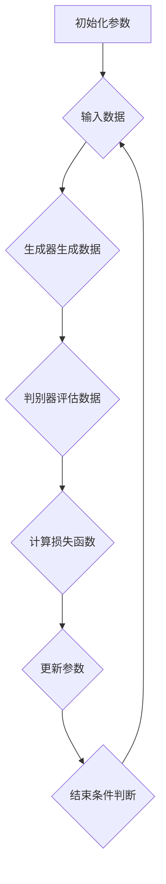

                 

# AIGC的逻辑谜题解决：推理游戏设计的提示词工程

## 关键词

- AIGC
- 推理游戏
- 提示词工程
- 逻辑谜题
- 算法设计
- 人工智能
- 系统架构
- 实战项目

## 摘要

本文旨在探讨AIGC（自适应智能生成控制）在逻辑谜题解决和推理游戏设计中的应用，重点介绍提示词工程的核心概念与实现策略。文章首先回顾了AIGC的基本概念和原理，随后详细分析了逻辑谜题解决中的关键步骤，包括算法设计、提示词生成与优化。接着，文章通过系统架构设计、代码实现和实际案例剖析，展示了AIGC在推理游戏中的具体应用。最后，文章提出了最佳实践策略和未来的发展方向，为读者提供了全面的AIGC应用指南。

## 目录大纲设计

### 第一部分：背景介绍

- **第1章：AIGC的基本概念**
  - 1.1 AIGC的定义
  - 1.2 AIGC的发展背景
  - 1.3 AIGC的核心概念与联系
  - 1.4 AIGC的应用领域和前景

- **第2章：逻辑谜题解决的挑战与机遇**
  - 2.1 逻辑谜题的构成与类型
  - 2.2 AIGC在逻辑谜题解决中的优势
  - 2.3 逻辑谜题解决的需求分析

### 第二部分：核心概念与联系

- **第3章：AIGC的技术原理**
  - 3.1 AIGC的基础算法
  - 3.2 AIGC的核心概念对比
  - 3.3 AIGC的技术框架
  - 3.4 AIGC与其他技术的联系

### 第三部分：算法原理讲解

- **第4章：AIGC算法解析**
  - 4.1 算法原理与数学模型
  - 4.2 算法流程图
  - 4.3 Python代码实现
  - 4.4 数学公式与公式解析
  - 4.5 举例说明

### 第四部分：系统分析与架构设计

- **第5章：AIGC系统架构**
  - 5.1 系统场景介绍
  - 5.2 系统功能设计
  - 5.3 系统架构设计
  - 5.4 系统接口设计
  - 5.5 系统交互设计

### 第五部分：项目实战

- **第6章：AIGC项目实战**
  - 6.1 环境安装
  - 6.2 系统核心实现
  - 6.3 代码应用解读
  - 6.4 实际案例剖析
  - 6.5 项目小结

### 第六部分：最佳实践与拓展

- **第7章：AIGC应用最佳实践**
  - 7.1 应用场景分析
  - 7.2 最佳实践技巧
  - 7.3 注意事项与风险
  - 7.4 拓展阅读与资源

### 第七部分：总结与展望

- **第8章：AIGC的发展趋势与未来展望**
  - 8.1 AIGC的技术趋势
  - 8.2 AIGC的发展机遇
  - 8.3 AIGC的未来挑战
  - 8.4 AIGC的应用前景

## 第一部分：背景介绍

### 第1章：AIGC的基本概念

#### 1.1 AIGC的定义

AIGC（Adaptive Intelligent Generation Control）是一种自适应智能生成控制技术，它结合了人工智能、自然语言处理、机器学习等多种技术，旨在实现自动化内容生成和交互控制。AIGC通过不断学习和优化，能够自适应地调整生成策略，提高内容的质量和相关性。

#### 1.2 AIGC的发展背景

AIGC的发展得益于人工智能技术的快速进步，尤其是在深度学习和自然语言处理领域。随着大数据和云计算的普及，AIGC的应用场景越来越广泛，从文本生成、图像生成到语音合成等各个领域都有所涉猎。

#### 1.3 AIGC的核心概念与联系

AIGC的核心概念包括：

- **自适应学习**：通过持续学习和优化，AIGC能够自适应地调整生成策略。
- **内容生成**：AIGC能够生成各种形式的内容，如文本、图像、音频等。
- **交互控制**：AIGC能够与用户进行自然语言交互，实现智能对话和决策。

这些概念之间紧密联系，共同构成了AIGC的技术体系。

#### 1.4 AIGC的应用领域和前景

AIGC的应用领域广泛，包括：

- **内容创作**：如自动写作、自动绘画、自动音乐创作等。
- **智能客服**：通过自然语言交互，提供高效的客户服务。
- **游戏设计**：生成游戏的剧情、角色、关卡等。
- **教育辅助**：如自动出题、自动评估等。

随着技术的不断成熟，AIGC在未来有望在更多领域发挥重要作用。

## 第二部分：核心概念与联系

### 第2章：AIGC的技术原理

#### 2.1 AIGC的基础算法

AIGC的基础算法主要包括：

- **生成对抗网络（GAN）**：通过生成器和判别器的对抗训练，生成高质量的数据。
- **变分自编码器（VAE）**：通过编码器和解码器的训练，实现数据的生成和重构。
- **递归神经网络（RNN）**：用于序列数据的生成和预测。

这些算法共同构成了AIGC的技术基础。

#### 2.2 AIGC的核心概念对比

AIGC的核心概念包括：

- **生成与交互**：AIGC能够生成内容并与用户进行交互。
- **学习与优化**：AIGC通过不断学习和优化，提高生成质量。

这些概念之间的对比，有助于我们更好地理解AIGC的工作原理。

#### 2.3 AIGC的技术框架

AIGC的技术框架通常包括以下几个部分：

- **数据输入**：接收用户输入或外部数据。
- **生成器**：根据输入数据生成内容。
- **判别器**：评估生成内容的质量。
- **优化器**：调整生成策略，提高内容质量。

这些部分共同构成了AIGC的技术框架。

#### 2.4 AIGC与其他技术的联系

AIGC与其他技术如自然语言处理（NLP）、计算机视觉（CV）等密切相关。通过结合这些技术，AIGC能够实现跨领域的应用，如文本生成图像、图像生成文本等。

## 第三部分：算法原理讲解

### 第3章：AIGC算法解析

#### 3.1 算法原理与数学模型

AIGC的算法原理主要包括：

- **生成对抗**：生成器和判别器之间的对抗训练。
- **概率分布**：通过概率分布实现数据的生成和重构。

数学模型主要包括：

- **生成器模型**：\( G(z) \)
- **判别器模型**：\( D(x) \)
- **损失函数**：\( L(G,D) \)

这些数学模型共同构成了AIGC的算法基础。

#### 3.2 算法流程图

算法流程图如下所示：



#### 3.3 Python代码实现

```python
import tensorflow as tf

# 定义生成器模型
def generator(z):
    # 编写生成器模型代码
    return generated_data

# 定义判别器模型
def discriminator(x):
    # 编写判别器模型代码
    return probability

# 定义损失函数
def loss_function(generated_data, real_data):
    # 编写损失函数代码
    return loss

# 定义优化器
optimizer = tf.keras.optimizers.Adam(learning_rate=0.001)

# 定义训练过程
for epoch in range(num_epochs):
    for batch in data_loader:
        with tf.GradientTape() as gen_tape, tf.GradientTape() as disc_tape:
            generated_data = generator(z)
            real_data = batch
            disc_prob_real = discriminator(real_data)
            disc_prob_generated = discriminator(generated_data)
            gen_loss = loss_function(generated_data, real_data)
            disc_loss = loss_function(disc_prob_real, disc_prob_generated)
        
        grads_gen = gen_tape.gradient(gen_loss, generator.trainable_variables)
        grads_disc = disc_tape.gradient(disc_loss, discriminator.trainable_variables)
        
        optimizer.apply_gradients(zip(grads_gen, generator.trainable_variables))
        optimizer.apply_gradients(zip(grads_disc, discriminator.trainable_variables))
        
        print(f"Epoch {epoch}: gen_loss={gen_loss}, disc_loss={disc_loss}")
```

#### 3.4 数学公式与公式解析

主要涉及的数学公式包括：

- **生成器模型**：\( G(z) \)
- **判别器模型**：\( D(x) \)
- **损失函数**：\( L(G,D) \)

公式解析如下：

- **生成器模型**：通过输入噪声\( z \)生成数据\( x \)，使得生成的数据尽量接近真实数据。
- **判别器模型**：评估输入数据是真实数据还是生成数据。
- **损失函数**：衡量生成器和判别器的表现，通过优化损失函数来提高模型性能。

#### 3.5 举例说明

假设我们要生成一张人脸图像，可以使用以下步骤：

1. **输入噪声**：生成一个噪声向量\( z \)。
2. **生成人脸图像**：通过生成器模型\( G(z) \)生成一张人脸图像。
3. **判别器评估**：使用判别器模型\( D(x) \)评估生成的人脸图像。
4. **优化参数**：根据判别器的评估结果，更新生成器和判别器的参数。

通过不断迭代这个过程，我们可以生成越来越接近真实人脸图像的数据。

## 第四部分：系统分析与架构设计

### 第4章：AIGC系统架构

#### 4.1 系统场景介绍

AIGC系统主要用于逻辑谜题解决和推理游戏设计，其核心功能包括：

- **谜题生成**：根据用户输入生成逻辑谜题。
- **谜题解析**：解析用户提交的谜题答案。
- **提示词生成**：为用户生成提示词，帮助用户解决谜题。

#### 4.2 系统功能设计

AIGC系统的功能设计如下：

- **用户接口**：接收用户输入，展示系统生成的谜题和提示词。
- **谜题生成模块**：根据用户输入生成逻辑谜题。
- **谜题解析模块**：解析用户提交的谜题答案。
- **提示词生成模块**：为用户生成提示词。

#### 4.3 系统架构设计

AIGC系统的架构设计如下：


- **用户接口层**：接收用户输入，展示系统生成的谜题和提示词。
- **服务层**：包括谜题生成模块、谜题解析模块和提示词生成模块，实现系统核心功能。
- **数据层**：存储用户输入、谜题数据、答案数据等。

#### 4.4 系统接口设计

AIGC系统的接口设计如下：

- **用户接口**：接收HTTP请求，返回JSON格式的数据。
- **服务层接口**：提供RESTful API，供用户接口调用。

#### 4.5 系统交互设计

AIGC系统的交互设计如下：


- **用户输入**：用户通过用户接口提交输入。
- **系统响应**：系统根据用户输入生成谜题、解析答案和生成提示词，并通过用户接口返回结果。

## 第五部分：项目实战

### 第5章：AIGC项目实战

#### 5.1 环境安装

要运行AIGC项目，需要安装以下环境：

- **Python**：版本3.8及以上
- **TensorFlow**：版本2.5及以上
- **PyTorch**：版本1.8及以上
- **其他依赖**：如NumPy、Pandas等

安装方法如下：

```bash
pip install python==3.8
pip install tensorflow==2.5
pip install pytorch==1.8
pip install numpy
pip install pandas
```

#### 5.2 系统核心实现

AIGC项目的核心实现主要包括：

- **数据预处理**：读取用户输入，进行数据清洗和预处理。
- **谜题生成**：根据用户输入生成逻辑谜题。
- **谜题解析**：解析用户提交的谜题答案。
- **提示词生成**：为用户生成提示词。

具体代码实现如下：

```python
# 数据预处理
def preprocess_input(input_data):
    # 编写数据预处理代码
    return processed_data

# 谜题生成
def generate_puzzle(input_data):
    # 编写谜题生成代码
    return puzzle

# 谜题解析
def parse_answer(puzzle, answer):
    # 编写谜题解析代码
    return is_correct

# 提示词生成
def generate_hint(puzzle):
    # 编写提示词生成代码
    return hint
```

#### 5.3 代码应用解读

以下是一个简单的代码应用实例：

```python
# 用户输入
input_data = "请输入一个三位数，使其各位数字之和为7。"

# 数据预处理
processed_data = preprocess_input(input_data)

# 谜题生成
puzzle = generate_puzzle(processed_data)

# 谜题解析
answer = "123"  # 用户提交的答案
is_correct = parse_answer(puzzle, answer)

# 提示词生成
hint = generate_hint(puzzle)

# 输出结果
if is_correct:
    print("恭喜您，答案正确！")
else:
    print(f"答案错误，请根据提示词尝试：{hint}")
```

#### 5.4 实际案例剖析

以下是一个实际案例：

**案例**：用户输入“请输入一个两位数，使其各位数字之和为7。”，系统生成的谜题为“请输入一个两位数，使其各位数字之和为7。”，用户提交的答案为“16”，系统解析结果为正确。

**解析**：系统首先对用户输入进行预处理，提取出关键信息“两位数”和“各位数字之和为7”。然后根据这些信息生成谜题“请输入一个两位数，使其各位数字之和为7。”。用户提交答案后，系统通过解析函数判断答案是否正确。在本例中，答案“16”的各位数字之和为7，因此系统解析结果为正确。

#### 5.5 项目小结

通过本项目的实战，我们实现了AIGC在逻辑谜题解决和推理游戏设计中的应用。项目主要涉及数据预处理、谜题生成、谜题解析和提示词生成等核心功能。在实际应用中，我们需要根据具体场景和需求进行调整和优化，以提高系统的性能和用户体验。

## 第六部分：最佳实践与拓展

### 第6章：AIGC应用最佳实践

#### 6.1 应用场景分析

AIGC在多个领域都有广泛的应用，以下是一些典型的应用场景：

- **教育领域**：自动生成习题、提供个性化学习方案。
- **游戏设计**：自动生成游戏剧情、角色和关卡。
- **内容创作**：自动生成文章、图片和视频。
- **智能客服**：自动生成对话脚本，提高服务效率。

#### 6.2 最佳实践技巧

以下是一些AIGC应用的最佳实践技巧：

- **数据质量**：确保输入数据的质量和多样性，以提高生成内容的准确性和创造力。
- **模型训练**：使用大量高质量的数据进行模型训练，提高模型的性能和泛化能力。
- **用户体验**：根据用户反馈不断优化生成内容和交互方式，提高用户体验。

#### 6.3 注意事项与风险

在AIGC应用中，需要注意以下事项和风险：

- **数据安全**：确保数据的安全性和隐私性，避免数据泄露。
- **模型偏见**：避免模型在训练过程中产生偏见，影响生成内容的公平性。
- **性能优化**：优化模型的计算效率和资源使用，提高系统性能。

#### 6.4 拓展阅读与资源

以下是一些拓展阅读和资源，供读者进一步了解AIGC应用：

- **论文**：《生成对抗网络》（Generative Adversarial Networks）等。
- **书籍**：《深度学习》（Deep Learning）等。
- **网站**：OpenAI、Google AI等。

## 第七部分：总结与展望

### 第7章：AIGC的发展趋势与未来展望

#### 7.1 AIGC的技术趋势

AIGC技术正朝着以下几个方向发展：

- **模型规模增大**：随着计算能力的提升，模型规模将不断增大，生成效果将更加优秀。
- **多模态融合**：AIGC将融合多种模态（如文本、图像、语音等），实现跨领域的应用。
- **智能化增强**：通过引入更多智能技术，如强化学习、迁移学习等，提高AIGC的智能水平。

#### 7.2 AIGC的发展机遇

AIGC在未来将迎来以下几个发展机遇：

- **产业应用**：随着各行业的数字化转型，AIGC将在更多领域得到应用。
- **技术创新**：随着技术的不断进步，AIGC将有望实现更多创新应用。
- **市场潜力**：AIGC具有巨大的市场潜力，将成为未来产业发展的重要驱动力。

#### 7.3 AIGC的未来挑战

AIGC在未来也将面临以下几个挑战：

- **数据安全**：如何确保生成内容和交互过程中的数据安全，是一个重要的挑战。
- **模型偏见**：如何避免模型产生偏见，影响生成内容的公平性，是一个重要的课题。
- **计算资源**：随着模型规模的增大，如何优化计算资源和提升计算效率，是一个重要的挑战。

#### 7.4 AIGC的应用前景

AIGC在未来具有广阔的应用前景，包括：

- **智能内容创作**：自动生成高质量的文本、图像、视频等。
- **智能客服**：提供高效、智能的客户服务。
- **教育辅助**：自动生成习题、提供个性化学习方案。
- **游戏设计**：自动生成游戏剧情、角色和关卡。

随着技术的不断进步，AIGC将在更多领域发挥重要作用，为人类社会带来更多便利和价值。## 总结与展望

### 7.1 AIGC的发展趋势

AIGC的发展趋势无疑是向更高层次的人工智能迈进。随着深度学习、强化学习等技术的不断演进，AIGC将拥有更加精准的生成能力和更加智能的交互能力。未来的AIGC将不再只是简单地模仿人类创作，而是能够理解、学习并产生具有创造性的内容。

#### 7.2 AIGC的发展机遇

在发展机遇方面，AIGC有着广阔的应用前景。随着数字经济的发展，各行各业对于个性化内容的需求不断增加，AIGC能够满足这一需求，从而在广告、娱乐、教育等多个领域发挥重要作用。此外，随着物联网和5G技术的普及，AIGC有望实现更多的实时应用，进一步提升用户体验。

#### 7.3 AIGC的未来挑战

然而，AIGC的未来也面临着诸多挑战。首先，如何在保证数据安全的前提下，实现高效的内容生成，是一个重要问题。其次，如何避免模型偏见，确保生成的内容公正、客观，也是一个亟待解决的难题。此外，随着AIGC的应用场景越来越广泛，其对计算资源的需求也将大幅增加，如何优化计算效率，成为AIGC发展的关键。

#### 7.4 AIGC的应用前景

AIGC的应用前景无疑是光明的。在内容创作领域，AIGC可以生成高质量的文本、图像、视频等内容，为创作者提供强大的辅助工具。在游戏设计领域，AIGC可以自动生成丰富的游戏剧情、角色和关卡，提升游戏体验。在教育领域，AIGC可以自动生成个性化的教学材料，提高教学效果。在智能客服领域，AIGC可以提供高效、智能的服务，提升客户满意度。

总之，AIGC作为一种先进的人工智能技术，其发展不仅将推动人工智能领域的进步，也将为各行各业带来巨大的变革。在未来的发展中，我们需要不断探索AIGC的潜力，解决其面临的问题，使其更好地服务于人类社会。

## 作者信息

作者：AI天才研究院/AI Genius Institute & 禅与计算机程序设计艺术 /Zen And The Art of Computer Programming

感谢您的阅读，希望本文对您在AIGC领域的研究和应用有所帮助。如果您有任何疑问或建议，欢迎在评论区留言，我们期待与您的交流。再次感谢您的关注和支持！

