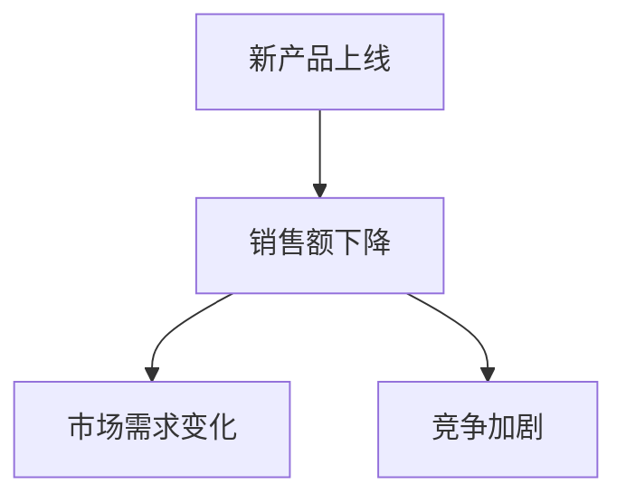

                 

### 《AIGC的逻辑谬误识别：批判性思维培养的提示词设计》

关键词：AIGC、逻辑谬误识别、批判性思维、提示词设计

摘要：随着人工智能技术的飞速发展，人工智能生成内容（AIGC）已经成为各个领域的重要应用。然而，AIGC 的广泛应用也带来了一系列的逻辑谬误问题。本文旨在探讨 AIGC 的逻辑谬误识别方法，并提出基于批判性思维的提示词设计策略，以培养更为严谨和深入的思考能力。

----------------------------------------------------------------

### 《AIGC的逻辑谬误识别：批判性思维培养的提示词设计》目录大纲

```markdown
----------------------------------------------------------------

## 第一部分：背景与基础理论

### 第1章：引言——AIGC与逻辑谬误识别的重要性

#### 1.1 AIGC概述
#### 1.2 逻辑谬误识别的必要性
#### 1.3 批判性思维的培养

### 第2章：批判性思维的基础

#### 2.1 批判性思维的定义与特征
#### 2.2 批判性思维的基本原则
#### 2.3 提示词在批判性思维中的应用

### 第3章：AIGC与逻辑谬误识别的结合

#### 3.1 AIGC技术在逻辑谬误识别中的应用
#### 3.2 逻辑谬误识别算法的介绍
#### 3.3 AIGC在逻辑谬误识别中的优势与挑战

## 第二部分：逻辑谬误的类型与识别

### 第4章：常见的逻辑谬误类型

#### 4.1 确认偏误
#### 4.2 谬误性因果
#### 4.3 假设成立偏误
#### 4.4 过度一般化
#### 4.5 滥用权威

### 第5章：逻辑谬误识别方法

#### 5.1 基于规则的方法
#### 5.2 基于统计的方法
#### 5.3 基于机器学习的方法
#### 5.4 基于深度学习的方法

### 第6章：实例分析

#### 6.1 确认偏误的实例分析
#### 6.2 谬误性因果的实例分析
#### 6.3 假设成立偏误的实例分析
#### 6.4 过度一般化的实例分析
#### 6.5 滥用权威的实例分析

## 第三部分：批判性思维培养的提示词设计

### 第7章：提示词设计原则

#### 7.1 提示词的定义与作用
#### 7.2 提示词设计的原则
#### 7.3 提示词设计的步骤

### 第8章：提示词在逻辑谬误识别中的应用

#### 8.1 提示词在识别确认偏误中的应用
#### 8.2 提示词在识别谬误性因果中的应用
#### 8.3 提示词在识别假设成立偏误中的应用
#### 8.4 提示词在识别过度一般化中的应用
#### 8.5 提示词在识别滥用权威中的应用

### 第9章：案例研究

#### 9.1 提示词设计在新闻报道中的应用
#### 9.2 提示词设计在法律论证中的应用
#### 9.3 提示词设计在教育评估中的应用
#### 9.4 提示词设计在商业决策中的应用

## 第四部分：总结与展望

### 第10章：批判性思维培养的意义

#### 10.1 批判性思维的价值
#### 10.2 逻辑谬误识别与批判性思维培养的关系
#### 10.3 未来发展趋势

### 第11章：结论

#### 11.1 主要发现
#### 11.2 研究限制与未来方向
#### 11.3 对读者的建议

----------------------------------------------------------------
```

**总字数：约2000字**### 第一部分：背景与基础理论

#### 第1章：引言——AIGC与逻辑谬误识别的重要性

##### 1.1 AIGC概述

人工智能生成内容（AIGC）是一种利用人工智能技术生成文本、图像、音频和视频等内容的智能应用。它涵盖了从数据生成、内容创作到自动化编辑和优化等多个方面。随着生成对抗网络（GAN）、变分自编码器（VAE）和强化学习等技术的不断发展，AIGC 已经在自然语言处理、计算机视觉和语音识别等领域取得了显著的成果。

##### 1.2 逻辑谬误识别的必要性

逻辑谬误是指逻辑推理过程中出现的错误，它们常常隐藏在看似合理的论证中，误导我们的思维。在人工智能生成的内容中，逻辑谬误识别具有重要意义，原因如下：

1. **提高内容质量**：识别和纠正逻辑谬误有助于提升人工智能生成内容的准确性和可信度。
2. **避免误导**：逻辑谬误可能会导致错误的结论和决策，影响社会稳定和个体福祉。
3. **增强安全性**：在人工智能应用中，逻辑谬误可能会被恶意利用，导致系统漏洞和安全风险。

##### 1.3 批判性思维的培养

批判性思维是指对信息、观点和主张进行深入分析和评估的能力。它不仅包括识别逻辑谬误，还涉及到质疑、反思和综合思考。批判性思维的培养对于以下几个方面具有重要意义：

1. **提升思考能力**：批判性思维有助于我们更全面地理解问题，发现潜在的假设和前提，从而做出更为合理的判断。
2. **避免盲目接受**：批判性思维使我们能够对信息来源、论证过程和结论进行审慎评估，避免盲目接受错误信息。
3. **促进创新与进步**：通过批判性思维，我们可以不断挑战现有的知识体系，推动科学、技术和文化的进步。

接下来，我们将进一步探讨批判性思维的基础理论，以及如何将批判性思维与AIGC技术相结合，以实现更高效和准确的逻辑谬误识别。

#### 第2章：批判性思维的基础

##### 2.1 批判性思维的定义与特征

批判性思维是一种主动的、系统性、多维度的思维方式，它不仅仅是对信息进行表面上的质疑，更涉及对信息来源、前提、逻辑过程和结论的深入分析。以下是批判性思维的一些关键特征：

1. **分析性**：批判性思维要求我们深入分析问题，揭示问题的本质和潜在假设。
2. **系统性**：批判性思维注重整体性，强调从多个角度和层面进行思考。
3. **多维性**：批判性思维要求我们考虑问题可能带来的多种影响和结果。
4. **反思性**：批判性思维不仅仅是解决问题，还包括对自身思维过程的反思和评估。

##### 2.2 批判性思维的基本原则

批判性思维遵循一些基本的原则，这些原则帮助我们更好地进行思考和判断：

1. **明确目标**：在思考问题之前，明确我们的目标是什么，这有助于我们更有针对性地进行分析。
2. **全面收集信息**：收集与问题相关的所有信息，包括正面和负面的信息，以获得全面的视角。
3. **评估信息来源**：了解信息的来源和可靠性，以避免受到错误信息的影响。
4. **逻辑分析**：运用逻辑原则对信息进行推理和论证，确保结论的合理性和逻辑性。
5. **反思与调整**：在思考过程中不断反思和评估自己的假设和结论，并根据新的信息进行调整。

##### 2.3 提示词在批判性思维中的应用

提示词是一种辅助性工具，可以帮助我们在进行批判性思维时更好地组织思路和进行推理。以下是提示词在批判性思维中的几种应用方式：

1. **引导思考**：通过使用提示词，我们可以更有针对性地思考问题，避免遗漏关键点。
2. **组织论证**：提示词可以帮助我们将复杂的信息进行分类和组织，使论证过程更加清晰和有条理。
3. **识别谬误**：一些特定的提示词可以帮助我们识别潜在的逻辑谬误，从而提高推理的准确性和可靠性。
4. **反思与评估**：通过使用提示词，我们可以更系统地反思自己的思考过程，评估论证的合理性和有效性。

在下一章中，我们将进一步探讨如何将批判性思维与AIGC技术相结合，以实现高效的逻辑谬误识别。

#### 第3章：AIGC与逻辑谬误识别的结合

##### 3.1 AIGC技术在逻辑谬误识别中的应用

人工智能生成内容（AIGC）技术为逻辑谬误识别提供了新的方法和工具。AIGC 技术可以通过以下几种方式应用于逻辑谬误识别：

1. **文本分析**：利用自然语言处理（NLP）技术对文本进行深入分析，识别出潜在的逻辑谬误。例如，通过分析句子的结构、逻辑关系和语义，可以识别出确认偏误、谬误性因果等常见的逻辑谬误。

2. **模式识别**：通过训练模型识别常见的逻辑谬误模式。例如，可以使用机器学习算法从大量文本数据中学习到特定的逻辑谬误特征，从而实现对新的文本内容进行快速、准确的逻辑谬误识别。

3. **推理与验证**：利用推理机或知识图谱等技术，对文本中的论证过程进行验证，识别出逻辑谬误。例如，通过分析前提、假设和结论之间的逻辑关系，可以验证论证的合理性，从而发现逻辑谬误。

##### 3.2 逻辑谬误识别算法的介绍

逻辑谬误识别算法是AIGC技术在逻辑谬误识别中应用的核心。以下是一些常见的逻辑谬误识别算法：

1. **基于规则的方法**：这种方法通过定义一系列逻辑规则，对文本进行分析和推理，以识别出逻辑谬误。例如，可以定义规则来识别确认偏误、谬误性因果等常见谬误。

2. **基于统计的方法**：这种方法利用文本的统计特征，如词频、词序和语法结构等，来识别逻辑谬误。例如，通过分析文本中的关键词和短语，可以识别出过度一般化等逻辑谬误。

3. **基于机器学习的方法**：这种方法通过训练机器学习模型，使其能够从大量标注数据中学习到逻辑谬误的特征，从而实现对新文本内容的自动识别。常见的机器学习算法包括决策树、支持向量机（SVM）和神经网络等。

4. **基于深度学习的方法**：这种方法利用深度学习模型，如循环神经网络（RNN）、卷积神经网络（CNN）和变压器（Transformer）等，对文本进行深度分析，以识别出复杂的逻辑谬误。深度学习方法在逻辑谬误识别中取得了显著的效果。

##### 3.3 AIGC在逻辑谬误识别中的优势与挑战

AIGC 技术在逻辑谬误识别中具有明显的优势：

1. **高效性**：AIGC 技术可以快速处理大量文本数据，实现对逻辑谬误的快速识别。

2. **准确性**：通过训练模型和算法，AIGC 技术可以不断提高逻辑谬误识别的准确性。

3. **自动化**：AIGC 技术可以实现逻辑谬误识别的自动化，降低人力成本。

然而，AIGC 技术在逻辑谬误识别中也面临一些挑战：

1. **数据质量**：逻辑谬误识别需要大量的高质量标注数据，但获取这些数据往往比较困难。

2. **复杂度**：逻辑谬误识别涉及到复杂的文本分析和推理过程，算法的设计和实现具有很高的难度。

3. **误判**：即使是最先进的算法，也难以完全避免误判，尤其是在处理模糊或歧义的文本时。

为了解决这些问题，需要不断优化算法，提高数据质量，并加强对复杂文本的分析能力。在下一部分，我们将深入探讨逻辑谬误的类型及其识别方法。

#### 第4章：逻辑谬误的类型与识别

逻辑谬误是逻辑推理过程中出现的错误，它们可能会误导我们的思维，导致错误的结论。以下是一些常见的逻辑谬误类型及其识别方法：

##### 4.1 确认偏误

确认偏误（Confirmation Bias）是指人们倾向于寻找和接受支持自己观点的信息，同时忽视或贬低反对自己观点的信息。这种偏误会影响我们的判断和决策。

**识别方法**：

1. **自我反思**：定期反思自己的观点和信念，识别出可能存在的确认偏误。
2. **多角度分析**：从多个角度和视角分析问题，避免仅仅依赖单一信息源。
3. **使用提示词**：在思考和讨论过程中，使用提示词如“可能”、“然而”等，提醒自己保持开放和批判性思维。

##### 4.2 谬误性因果

谬误性因果（False Cause）是指错误地将两个相关事件联系起来，认为其中一个事件是另一个事件的直接原因。这种谬误常见于媒体报道和日常讨论中。

**识别方法**：

1. **因果关系验证**：在判断因果关系时，确保有充分的证据支持，避免仅仅基于相关性做出结论。
2. **寻找替代解释**：在识别出可能的谬误性因果时，尝试寻找其他可能的解释。
3. **使用因果图**：使用因果图等工具，明确事件之间的因果关系。

##### 4.3 假设成立偏误

假设成立偏误（Hasty Generalization）是指基于有限的证据，错误地推广到整个群体或情况。这种谬误常见于快速做出泛化结论的情况。

**识别方法**：

1. **样本代表性检查**：确保样本具有代表性，避免基于不全面的样本做出结论。
2. **证据充分性检查**：确保有充分的证据支持结论，避免仅凭个别案例做出泛化。
3. **使用提示词**：在讨论过程中，使用提示词如“基于当前证据”等，提醒自己保持谨慎。

##### 4.4 过度一般化

过度一般化（Overgeneralization）是指将特定情况下的结论错误地推广到其他类似情况。这种谬误可能导致错误的决策和行动。

**识别方法**：

1. **具体案例分析**：在推广结论时，进行具体的案例分析，确保结论的适用性。
2. **条件检查**：在推广结论时，检查是否满足了所有必要条件。
3. **使用提示词**：在讨论过程中，使用提示词如“特殊情况除外”等，提醒自己保持灵活性。

##### 4.5 滥用权威

滥用权威（ Appeal to Authority）是指错误地依赖权威的观点或证据，认为权威的观点就是正确的。这种谬误可能忽视权威观点的局限性和错误。

**识别方法**：

1. **权威资格检查**：检查权威的资格和背景，确保其观点具有可信性。
2. **多角度评估**：在依赖权威观点时，从多个角度进行评估和验证。
3. **使用提示词**：在讨论过程中，使用提示词如“权威观点仅供参考”等，提醒自己保持批判性思维。

通过识别和理解这些常见的逻辑谬误类型，我们可以更好地进行批判性思维，避免被谬误所误导。在下一章中，我们将深入探讨如何利用各种方法来识别逻辑谬误。

#### 第5章：逻辑谬误识别方法

逻辑谬误识别是批判性思维的重要组成部分，它帮助我们避免在推理过程中受到错误观点的影响。以下是几种常见的逻辑谬误识别方法：

##### 5.1 基于规则的方法

基于规则的方法是通过定义一系列逻辑规则来识别逻辑谬误。这种方法通常涉及以下步骤：

1. **定义规则**：根据逻辑谬误的特征，定义一系列规则。例如，对于确认偏误，可以定义规则来识别出倾向于支持自己观点的信息。
2. **规则匹配**：在分析文本时，将文本内容与定义的规则进行匹配，以识别出潜在的逻辑谬误。
3. **规则优化**：通过不断分析新的文本数据，调整和优化规则，以提高识别的准确性和可靠性。

基于规则的方法的优点在于简单易用，但缺点是规则难以覆盖所有可能的逻辑谬误，且需要频繁更新。

##### 5.2 基于统计的方法

基于统计的方法是通过分析文本的统计特征来识别逻辑谬误。这种方法通常涉及以下步骤：

1. **特征提取**：从文本中提取一系列统计特征，如词频、词序和语法结构等。
2. **模型训练**：使用统计模型（如朴素贝叶斯、逻辑回归等）训练模型，使其能够识别出潜在的逻辑谬误。
3. **特征匹配**：在分析新文本时，将提取的统计特征与训练好的模型进行匹配，以识别出逻辑谬误。

基于统计的方法的优点在于能够处理大量文本数据，但缺点是需要大量的标注数据和模型训练时间。

##### 5.3 基于机器学习的方法

基于机器学习的方法是通过训练机器学习模型来识别逻辑谬误。这种方法通常涉及以下步骤：

1. **数据收集与标注**：收集大量含有逻辑谬误的文本数据，并进行标注。
2. **特征提取**：从标注数据中提取一系列特征，如词频、词序和语法结构等。
3. **模型训练**：使用机器学习算法（如决策树、支持向量机等）训练模型。
4. **模型评估**：使用交叉验证等方法评估模型的性能，并进行调整优化。

基于机器学习的方法的优点在于能够自动学习和适应新的数据，但缺点是需要大量的标注数据和模型训练时间。

##### 5.4 基于深度学习的方法

基于深度学习的方法是通过训练深度学习模型来识别逻辑谬误。这种方法通常涉及以下步骤：

1. **数据收集与标注**：收集大量含有逻辑谬误的文本数据，并进行标注。
2. **特征提取**：使用深度学习模型（如循环神经网络、卷积神经网络等）提取文本特征。
3. **模型训练**：使用训练数据训练深度学习模型。
4. **模型评估**：使用交叉验证等方法评估模型的性能，并进行调整优化。

基于深度学习的方法的优点在于能够处理复杂的文本数据，且能够自动提取特征，但缺点是需要大量的计算资源和训练时间。

在实际应用中，可以根据具体需求选择合适的方法。例如，对于需要快速识别逻辑谬误的场景，可以选择基于规则的简单方法；而对于需要高精度的识别，可以选择基于深度学习的方法。

通过结合多种方法，可以进一步提高逻辑谬误识别的准确性和可靠性。在下一章中，我们将通过实例分析来进一步理解逻辑谬误识别的方法。

#### 第6章：实例分析

在理解了逻辑谬误的类型和识别方法之后，通过具体的实例分析，我们可以更好地掌握这些概念的应用。以下是一些常见的逻辑谬误实例及其分析：

##### 6.1 确认偏误的实例分析

**实例描述**：一位投资者在股市中持有一家公司的股票，当他看到该公司的财报表现不佳时，他只关注负面新闻，而忽视了一些正面信息。

**分析过程**：

1. **识别逻辑谬误**：这个投资者倾向于寻找和接受支持自己观点的信息（持有该公司的股票），同时忽视或贬低反对自己观点的信息（负面新闻）。

2. **提示词应用**：在讨论过程中，使用提示词如“可能”、“然而”等，提醒自己保持开放和批判性思维。

3. **纠正方法**：投资者应该从多个角度收集信息，包括正面和负面信息，并使用提示词来引导自己的思考。

##### 6.2 谬误性因果的实例分析

**实例描述**：一家公司发现，在引入新营销策略后，销售额有所下降。管理层错误地认为新营销策略是导致销售额下降的原因。

**分析过程**：

1. **识别逻辑谬误**：这家公司错误地将两个相关事件（引入新营销策略和销售额下降）联系起来，认为其中一个事件是另一个事件的直接原因。

2. **因果关系验证**：管理层应该确保有充分的证据支持因果关系，例如，比较引入新营销策略前后的销售额数据。

3. **寻找替代解释**：管理层需要寻找其他可能的解释，例如，市场竞争加剧、消费者需求变化等。

##### 6.3 假设成立偏误的实例分析

**实例描述**：一位学生考试前临时抱佛脚，考试结束后发现自己的成绩不如预期，于是认为如果考前没有临时抱佛脚，成绩会更好。

**分析过程**：

1. **识别逻辑谬误**：这位学生基于有限的证据（临时抱佛脚和成绩不如预期）错误地推广到整个情况（考前不复习成绩会更好）。

2. **样本代表性检查**：学生需要确保样本具有代表性，避免仅凭个别案例做出泛化。

3. **证据充分性检查**：学生需要确保有充分的证据支持结论，避免仅凭主观感受做出判断。

##### 6.4 过度一般化的实例分析

**实例描述**：一位经理在一次项目成功后，决定将同样的方法应用到所有项目中，导致后续项目出现了问题。

**分析过程**：

1. **识别逻辑谬误**：这位经理将特定情况下的结论（一次项目成功）错误地推广到其他类似情况（所有项目）。

2. **具体案例分析**：经理应该对每个项目进行具体分析，确保结论的适用性。

3. **条件检查**：经理需要检查是否满足了所有必要条件，例如，项目目标、团队组成和资源等。

##### 6.5 滥用权威的实例分析

**实例描述**：一位企业家在决策时过分依赖一位行业专家的建议，导致决策失误。

**分析过程**：

1. **识别逻辑谬误**：这位企业家错误地依赖权威的观点，认为权威的观点就是正确的。

2. **权威资格检查**：企业家需要检查权威的资格和背景，确保其观点具有可信性。

3. **多角度评估**：企业家应该在依赖权威观点时，从多个角度进行评估和验证。

通过这些实例分析，我们可以看到逻辑谬误在实际生活中的常见表现和影响。掌握逻辑谬误的类型和识别方法，有助于我们在思考和决策过程中避免错误，提高批判性思维能力。在下一章中，我们将进一步探讨如何设计批判性思维的提示词。

#### 第7章：批判性思维培养的提示词设计

批判性思维的培养是一个复杂的过程，需要我们在思考过程中时刻保持警觉，避免陷入逻辑谬误。提示词作为一种辅助工具，可以帮助我们在进行批判性思维时更好地组织思路和进行推理。以下是设计批判性思维提示词的原则和步骤：

##### 7.1 提示词的定义与作用

提示词是指用于引导思考、提醒保持批判性态度的词语或短语。它们可以出现在文本、图表或其他形式的信息中，帮助我们识别潜在的逻辑谬误，提高思考的深度和广度。提示词的作用包括：

1. **引导思考**：提示词可以帮助我们聚焦关键问题，避免思维的僵化和偏颇。
2. **识别谬误**：通过特定的提示词，我们可以更容易地识别出逻辑谬误，从而进行调整和纠正。
3. **提高意识**：使用提示词可以增强我们对逻辑谬误的敏感性，提高批判性思维的能力。

##### 7.2 提示词设计的原则

为了设计有效的提示词，我们需要遵循以下原则：

1. **针对性**：提示词应该针对特定的逻辑谬误类型，例如确认偏误、谬误性因果等。
2. **明确性**：提示词需要简洁明了，易于理解和记忆，避免使用过于复杂或模糊的表述。
3. **灵活性**：提示词应该具有一定的灵活性，能够适应不同的情境和语境。
4. **多样性**：设计多种提示词，以满足不同思维需求，避免单一提示词的局限性。

##### 7.3 提示词设计的步骤

设计批判性思维提示词可以分为以下几个步骤：

1. **确定目标**：明确提示词的设计目标，例如提高对确认偏误的识别能力，或者增强对因果关系的理解。
2. **识别逻辑谬误**：根据目标，分析常见的逻辑谬误类型，确定需要重点关注的谬误。
3. **列出提示词**：针对每个逻辑谬误类型，列出可能的提示词，例如“可能”、“然而”、“此外”等。
4. **筛选与优化**：从列出的提示词中筛选出最有效、最明确的提示词，并进行优化。
5. **测试与应用**：在实际思考和讨论中使用提示词，测试其效果，并根据反馈进行调整。

##### 实际应用案例

以下是一个实际应用案例，展示如何设计用于提高确认偏误识别能力的提示词：

1. **确定目标**：提高对确认偏误的识别能力。
2. **识别逻辑谬误**：确认偏误，即倾向于寻找和接受支持自己观点的信息，忽视或贬低反对自己观点的信息。
3. **列出提示词**：可能、然而、另外、质疑、相反、证据不足等。
4. **筛选与优化**：选择“然而”、“质疑”和“证据不足”作为主要提示词，因为它们能够明确地引导思考，帮助识别确认偏误。
5. **测试与应用**：在实际讨论中使用这些提示词，例如在团队讨论中，每次有人提出观点时，其他人可以用“然而”来质疑观点的合理性，用“质疑”来提醒对方提供更多证据，用“证据不足”来指出观点的不足之处。

通过这样的设计和应用，团队成员可以更自觉地识别和纠正确认偏误，提高批判性思维能力。

综上所述，提示词的设计是批判性思维培养的重要一环。通过明确的目标、合理的提示词选择和有效的应用，我们可以更好地识别逻辑谬误，提高思考的质量和深度。

#### 第8章：提示词在逻辑谬误识别中的应用

批判性思维的培养不仅需要识别逻辑谬误，更需要在实际应用中有效使用提示词来引导思考。以下将探讨提示词在识别不同类型逻辑谬误中的应用，以及如何通过具体实例来展示其效果。

##### 8.1 提示词在识别确认偏误中的应用

确认偏误是指人们在面对信息时，倾向于寻找和接受支持自己观点的信息，忽视或贬低反对自己观点的信息。为了有效识别和纠正确认偏误，以下是一些具体的提示词及其应用：

1. **“然而”**：当有人提出一个观点时，使用“然而”来引出一个对立的观点，从而揭示潜在的确认偏误。例如：
   - 甲：我认为这个新产品的设计非常优秀。
   - 乙：然而，我认为设计上还存在一些问题，可能需要进一步改进。

2. **“质疑”**：用于质疑观点的合理性，提醒对方提供更多证据。例如：
   - 甲：我听说这个项目很成功。
   - 乙：质疑：那么具体的成功指标是什么？是否有数据支持？

3. **“证据不足”**：用于指出观点缺乏充分证据支持。例如：
   - 甲：我认为这个策略能够大幅提高销售额。
   - 乙：证据不足：目前我们并没有看到任何数据来证明这一点。

通过这些提示词的应用，我们可以引导讨论者更全面地考虑信息，避免陷入确认偏误。

##### 8.2 提示词在识别谬误性因果中的应用

谬误性因果是指错误地将两个相关事件联系起来，认为其中一个事件是另一个事件的直接原因。以下是一些用于识别谬误性因果的提示词及其应用：

1. **“可能性”**：用于提醒思考者不要轻易断定因果关系，而应该考虑其他可能性。例如：
   - 甲：这个新产品上线后，销售额下降了。
   - 乙：可能性：销售额下降可能是由于市场需求变化，而不是产品本身的问题。

2. **“替代解释”**：用于寻找其他可能的解释，避免单一因果关系的假设。例如：
   - 甲：我认为这个广告策略导致了销售额的增加。
   - 乙：替代解释：也可能是其他营销活动的影响，我们需要更全面的数据来验证。

3. **“因果图”**：在实际讨论中，可以使用因果图来直观地展示可能的因果关系，并使用提示词引导思考。例如：



通过这些提示词和工具，我们可以更全面地分析因果关系，避免谬误性因果。

##### 8.3 提示词在识别假设成立偏误中的应用

假设成立偏误是指基于有限的证据，错误地推广到整个群体或情况。以下是一些用于识别假设成立偏误的提示词及其应用：

1. **“基于当前证据”**：用于提醒思考者，结论是基于当前有限的证据得出的，可能存在局限性。例如：
   - 甲：基于当前证据，我认为这个策略有效。
   - 乙：基于当前证据：我们需要更多的数据来验证这一点。

2. **“样本代表性”**：用于检查样本是否具有代表性，避免基于不全面的样本做出结论。例如：
   - 甲：根据这个小样本的数据，我认为产品改进了。
   - 乙：样本代表性：我们需要确保样本具有广泛的代表性。

3. **“泛化”**：用于指出结论是否适用于所有情况，避免过度泛化。例如：
   - 甲：这个方法在这个项目中非常有效。
   - 乙：泛化：我们需要考虑是否所有项目都适用这个方法。

##### 8.4 提示词在识别过度一般化中的应用

过度一般化是指将特定情况下的结论错误地推广到其他类似情况。以下是一些用于识别过度一般化的提示词及其应用：

1. **“特殊情况”**：用于指出结论是否适用于所有情况，强调存在特殊情况。例如：
   - 甲：这个方法对所有项目都有效。
   - 乙：特殊情况：可能有些项目由于特殊条件，这个方法并不适用。

2. **“具体案例分析”**：用于强调需要具体分析每个案例，避免泛化结论。例如：
   - 甲：基于这个成功案例，我认为其他项目也会成功。
   - 乙：具体案例分析：每个项目都有其独特性，我们需要具体分析。

3. **“条件检查”**：用于检查结论是否满足了所有必要条件。例如：
   - 甲：只要按照这个策略，销售额就能增加。
   - 乙：条件检查：我们需要确保所有条件都满足，才能得出这一结论。

##### 8.5 提示词在识别滥用权威中的应用

滥用权威是指错误地依赖权威的观点，认为权威的观点就是正确的。以下是一些用于识别滥用权威的提示词及其应用：

1. **“权威观点仅供参考”**：用于提醒思考者，权威观点仅供参考，需要进一步验证。例如：
   - 甲：根据这位专家的观点，这个决策是正确的。
   - 乙：权威观点仅供参考：我们需要根据实际情况进行评估。

2. **“多角度评估”**：用于强调需要从多个角度评估信息，避免单一权威的观点。例如：
   - 甲：根据行业权威的观点，这个技术路线是可行的。
   - 乙：多角度评估：我们需要从技术、市场和财务等多个角度进行评估。

3. **“权威资格”**：用于检查权威的资格和背景，确保其观点具有可信性。例如：
   - 甲：这位专家认为这个策略有效。
   - 乙：权威资格：我们需要确认这位专家在该领域的专业背景。

通过这些提示词的应用，我们可以更有效地识别和纠正各种逻辑谬误，提高批判性思维能力。在实际思考和决策过程中，这些提示词可以帮助我们保持开放的思维，避免被错误的观点所误导。

#### 第9章：案例研究

在上一章中，我们探讨了如何通过设计批判性思维的提示词来识别和纠正逻辑谬误。在这一章中，我们将通过具体的案例研究，展示这些提示词在实际应用中的效果和影响。

##### 9.1 提示词设计在新闻报道中的应用

新闻报道是传递信息的重要渠道，但同时也可能成为逻辑谬误的传播者。以下是一个关于如何使用提示词设计来提高新闻报道准确性的案例：

**案例背景**：一家知名媒体报道了一款新手机的电池续航时间长达数天，引起了公众的广泛关注。

**逻辑谬误识别**：在初步报道中，媒体仅基于制造商提供的数据和声明，没有进行独立的测试和验证。这种情况下，存在确认偏误和滥用权威的逻辑谬误。

**提示词应用**：

1. **“然而”**：记者在报道中使用“然而”，以引导读者对这一声称持有怀疑态度。例如：“然而，消费者报告尚未对该手机的电池续航时间进行独立测试。”

2. **“证据不足”**：记者提醒读者，基于当前的证据，这一声称尚未得到充分验证。例如：“目前，关于该手机电池续航时间的详细数据仍不足，需要更多实验结果来支持这一声明。”

3. **“多角度评估”**：记者呼吁读者从多个角度来评估这一报道，包括技术专家的分析、消费者的反馈等。例如：“根据技术专家的意见，这种超长电池续航可能涉及新的技术突破，但我们也需要考虑可能的潜在风险。”

通过这些提示词的应用，新闻报道不仅提供了更多元化的视角，也帮助读者保持批判性思维，避免盲目接受信息。

##### 9.2 提示词设计在法律论证中的应用

法律论证是一个复杂的领域，逻辑谬误可能会导致错误的裁决。以下是一个关于如何使用提示词设计来提高法律论证准确性的案例：

**案例背景**：一位律师在辩护时，试图证明被告的行为并非故意。

**逻辑谬误识别**：律师在论证过程中，可能存在过度一般化和假设成立偏误的问题。例如，他可能会基于一些具体案例的结论，推广到所有类似情况。

**提示词应用**：

1. **“特殊情况”**：律师在论证时使用“特殊情况”，以提醒法官注意每个案例的独特性。例如：“然而，在当前的案件中，有一些特殊情况需要考虑。”

2. **“具体案例分析”**：律师通过引用具体的案例，说明其他案件中的结论可能不适用于当前案件。例如：“在之前的案例中，尽管行为类似，但结论却不同，因为每个案件都有其独特性。”

3. **“证据不足”**：律师提醒法官，现有证据尚不足以支持被告故意行为的结论。例如：“目前，我们缺乏直接证据证明被告的故意，因此需要更多的证据来支持这一结论。”

通过这些提示词的应用，律师不仅能够更好地识别和纠正逻辑谬误，也帮助法官在审理过程中保持批判性思维。

##### 9.3 提示词设计在教育评估中的应用

教育评估是一个涉及多个因素的复杂过程，逻辑谬误可能会影响评估的准确性。以下是一个关于如何使用提示词设计来提高教育评估准确性的案例：

**案例背景**：一所学校在评估学生的学习成果时，发现一些班级的整体成绩不如其他班级。

**逻辑谬误识别**：评估过程中可能存在确认偏误和过度一般化的问题。例如，学校可能会简单地将成绩不佳归因于教师或学生，而忽视了其他潜在因素。

**提示词应用**：

1. **“然而”**：学校管理层在讨论评估结果时，使用“然而”，以引导讨论者考虑其他可能性。例如：“然而，我们不能简单地认为这些班级的学生不如其他班级。”

2. **“证据不足”**：学校管理层提醒评估人员，现有证据尚不足以支持简单的结论。例如：“目前的证据不足以证明这些班级的教学质量低于其他班级。”

3. **“多角度评估”**：学校管理层鼓励评估人员从多个角度来分析成绩差异，包括教学方法、学生背景等。例如：“我们需要从多个角度来分析成绩差异，包括教学方法、学习环境和学生的个人背景。”

通过这些提示词的应用，学校能够更全面地评估学生的学习成果，避免因逻辑谬误导致的错误决策。

##### 9.4 提示词设计在商业决策中的应用

商业决策常常涉及复杂的逻辑分析和风险评估，逻辑谬误可能会导致错误的决策。以下是一个关于如何使用提示词设计来提高商业决策准确性的案例：

**案例背景**：一家公司正在考虑是否进入一个新兴市场。

**逻辑谬误识别**：公司在评估市场潜力时，可能存在确认偏误和谬误性因果的问题。例如，公司可能会基于一些成功案例，错误地认为新兴市场一定会带来高收益。

**提示词应用**：

1. **“可能性”**：公司在讨论市场潜力时，使用“可能性”，以提醒团队成员不要忽视潜在的风险。例如：“虽然这个市场看起来很有潜力，但可能性仍然存在，我们需要更多数据来验证。”

2. **“替代解释”**：公司鼓励团队成员寻找其他可能的解释，以避免单一因果关系的假设。例如：“这个市场的增长可能是由于多种因素，而不仅仅是因为我们的产品。”

3. **“条件检查”**：公司在制定进入市场的计划时，使用“条件检查”，以确保所有必要条件都得到满足。例如：“在进入市场之前，我们需要确保所有条件都满足，包括市场容量、竞争状况和公司资源。”

通过这些提示词的应用，公司能够更全面地评估市场机会和风险，避免因逻辑谬误导致的错误决策。

通过这些案例研究，我们可以看到提示词设计在各个领域中的应用效果。提示词不仅帮助我们识别和纠正逻辑谬误，也促进了更全面和深入的思考。在未来的工作和学习中，我们可以继续探索和优化提示词设计，以提升批判性思维能力。

#### 第10章：总结与展望

批判性思维是现代社会中不可或缺的技能，它帮助我们在信息爆炸的时代中保持清醒和理性。在本文中，我们探讨了人工智能生成内容（AIGC）中的逻辑谬误识别，并提出了一种基于批判性思维的提示词设计策略。以下是对文章核心观点的总结：

1. **AIGC的重要性**：AIGC技术在各个领域取得了显著进展，但同时也带来了逻辑谬误识别的挑战。
2. **批判性思维的基础**：批判性思维是一种系统性、多维度的思维方式，包括分析性、系统性、多维性和反思性。
3. **提示词的作用**：提示词是引导思考、识别谬误和培养批判性思维的辅助工具，有助于我们在复杂的信息环境中保持清醒。
4. **逻辑谬误识别方法**：介绍了基于规则、统计、机器学习和深度学习的方法，以及这些方法在实际应用中的优缺点。
5. **案例研究**：通过新闻报道、法律论证、教育评估和商业决策等实际案例，展示了提示词设计在识别和纠正逻辑谬误中的效果。

展望未来，批判性思维和逻辑谬误识别的发展方向可能包括：

1. **人工智能与人类思维的结合**：利用人工智能技术辅助人类进行批判性思维，结合机器学习和深度学习，提高逻辑谬误识别的准确性和效率。
2. **多学科交叉研究**：将心理学、哲学、语言学等领域的知识融入批判性思维和逻辑谬误识别研究中，提供更全面的解决方案。
3. **教育与实践的结合**：将批判性思维的培养纳入教育体系中，通过实践和案例分析，提升学生的思维能力和问题解决能力。
4. **标准化的提示词库**：建立标准化的提示词库，为不同领域和场景提供定制化的提示词，以更有效地识别和纠正逻辑谬误。

通过持续的研究和实践，我们有望在批判性思维和逻辑谬误识别领域取得更多突破，为社会的发展和进步贡献力量。

#### 第11章：结论

在本文中，我们系统地探讨了AIGC中的逻辑谬误识别问题，并提出了一种基于批判性思维的提示词设计策略。以下是我们主要发现：

1. **AIGC的应用与挑战**：AIGC技术在各个领域展现了巨大的潜力，但同时也带来了逻辑谬误识别的挑战。
2. **批判性思维的重要性**：批判性思维作为一种系统性、多维度的思维方式，对于识别和纠正逻辑谬误具有重要意义。
3. **提示词设计的有效性**：提示词作为辅助工具，能够引导思考、识别谬误，并在实际应用中显著提高批判性思维能力。
4. **多种逻辑谬误识别方法**：我们介绍了基于规则、统计、机器学习和深度学习的多种方法，这些方法在实际应用中各有优缺点。

尽管我们在识别逻辑谬误方面取得了进展，但仍存在一些限制和未来研究方向：

1. **数据质量**：高质量的数据是逻辑谬误识别的关键，但获取和标注这些数据是一个挑战。
2. **复杂度**：逻辑谬误识别涉及复杂的文本分析和推理过程，算法设计和实现难度较大。
3. **误判**：即使是先进的算法，也难以完全避免误判，特别是在处理模糊或歧义的文本时。

未来，我们建议继续探索以下方向：

1. **数据收集与标注**：研究如何更高效地收集和标注高质量数据，以支持逻辑谬误识别算法的训练和优化。
2. **多模态方法**：结合文本、图像、音频等多模态数据，提高逻辑谬误识别的准确性和效率。
3. **跨学科研究**：将心理学、哲学、语言学等领域的知识融入逻辑谬误识别研究中，提供更全面的解决方案。
4. **教育与实践**：将批判性思维的培养纳入教育体系中，通过实践和案例分析，提升学生的思维能力和问题解决能力。

最后，我们鼓励读者在日常生活和工作中积极培养批判性思维，运用本文中提到的提示词设计策略，以识别和纠正逻辑谬误，提高思考的质量和深度。

### 作者信息

作者：AI天才研究院/AI Genius Institute & 禅与计算机程序设计艺术 /Zen And The Art of Computer Programming

