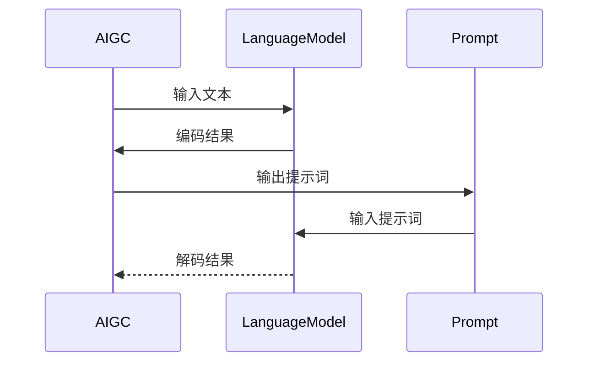
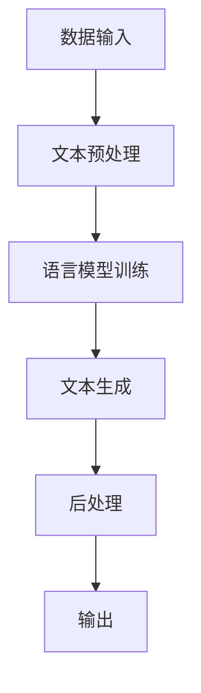
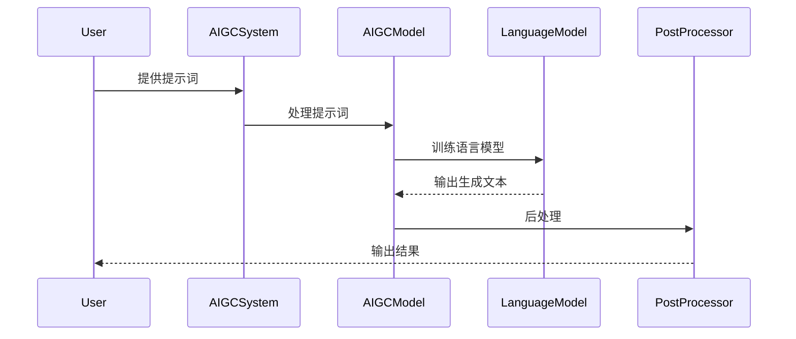

                 


### AIGC语言模型与提示词的协同进化

#### 关键词：AIGC、语言模型、提示词、协同进化、人工智能

> 摘要：本文将深入探讨AIGC（自适应智能生成控制）语言模型与提示词的协同进化。通过详细解析AIGC语言模型的基本概念、工作原理、提示词的优化技术及其协同进化的机制，我们将展示这一前沿技术的实际应用，并探讨其在未来可能的发展方向。

----------------------------------------------------------------

### 第一部分: 背景介绍与核心概念

#### 第1章: AIGC与提示词基础

##### 1.1 AIGC的概念与特点

AIGC（Adaptive Intelligent Generation Control）是一种基于深度学习技术的自适应智能生成控制方法。它通过不断学习和调整，能够生成高质量、符合人类预期的内容。AIGC的特点在于其高度的自适应性和灵活性，能够处理复杂、多变的数据输入，并生成相应的输出。

##### 1.2 提示词的定义与作用

提示词（Prompt）是AIGC系统中的重要概念，它类似于人类在对话或写作中使用的“引子”，用来引导系统生成特定的内容。提示词的质量直接影响生成内容的质量，因此优化提示词成为AIGC技术的一个重要方向。

##### 1.3 AIGC与提示词的协同进化

AIGC与提示词的协同进化是指通过不断优化提示词，提高AIGC语言模型的生成能力，同时通过AIGC语言模型的反馈，进一步优化提示词。这种协同进化的过程，使得AIGC系统在生成高质量内容方面能够不断进步。

##### 1.4 AIGC的起源与发展历程

AIGC起源于自然语言处理（NLP）领域，随着深度学习技术的不断发展，AIGC也逐渐成为人工智能研究的热点。从早期的规则驱动模型到现在的深度学习模型，AIGC的发展历程体现了人工智能技术的进步。

##### 1.5 提示词技术的发展趋势

随着AIGC的不断发展，提示词技术也在不断演进。未来的提示词技术将更加注重多样性和灵活性，以适应不同应用场景的需求。

##### 1.6 本章小结

本章介绍了AIGC与提示词的基础知识，包括其概念、特点、协同进化机制以及发展历程。通过本章的学习，读者可以对AIGC和提示词有一个初步的了解。

----------------------------------------------------------------

### 第二部分: AIGC语言模型原理

#### 第2章: AIGC语言模型基础

##### 2.1 语言模型的基本概念

语言模型（Language Model）是自然语言处理（NLP）中一个核心概念，它用于预测一段文本的下一个单词或字符。在AIGC中，语言模型是生成高质量内容的基础。

##### 2.2 语言模型的类型

语言模型可以分为统计模型和深度学习模型。统计模型如N-gram模型，通过统计文本中的单词或字符序列的频率来预测下一个单词或字符。深度学习模型如Transformer，则通过大规模的训练数据学习文本的潜在表示，具有更强的预测能力。

##### 2.3 语言模型的关键技术

语言模型的关键技术包括词嵌入（Word Embedding）、编码器-解码器架构（Encoder-Decoder Architecture）、注意力机制（Attention Mechanism）等。这些技术使得语言模型能够更好地理解和生成文本。

##### 2.4 AIGC语言模型的工作原理

AIGC语言模型的工作原理可以分为两个阶段：编码阶段和解码阶段。编码阶段将输入文本转换为序列编码，解码阶段则根据编码结果生成输出文本。

##### 2.5 AIGC语言模型的架构

AIGC语言模型的架构通常基于Transformer模型，包括编码器（Encoder）和解码器（Decoder）两个部分。编码器负责将输入文本编码为固定长度的向量，解码器则根据编码结果生成输出文本。

##### 2.6 AIGC语言模型的核心算法

AIGC语言模型的核心算法是基于自动编码器（Autoencoder）和生成对抗网络（GAN）的。自动编码器用于提取输入文本的潜在表示，GAN则用于生成高质量的内容。

##### 2.7 AIGC语言模型的应用场景

AIGC语言模型广泛应用于文本生成、机器翻译、问答系统等领域。通过不断优化和调整，AIGC语言模型能够生成更加符合人类预期的内容。

##### 2.8 本章小结

本章详细介绍了AIGC语言模型的基础知识，包括其基本概念、类型、关键技术、工作原理和架构。通过本章的学习，读者可以深入理解AIGC语言模型的核心技术和应用场景。

----------------------------------------------------------------

### 第三部分: 提示词优化与协同进化

#### 第3章: 提示词优化技术

##### 3.1 提示词优化的重要性

提示词优化在AIGC系统中起着至关重要的作用。高质量的提示词能够引导AIGC语言模型生成更符合人类预期的内容。

##### 3.2 提示词优化的方法

提示词优化的方法包括：语义分析、词汇扩展、上下文嵌入等。这些方法能够提高提示词的多样性和灵活性，从而提高生成内容的质量。

##### 3.3 提示词优化案例解析

在本节中，我们将通过具体案例解析如何优化提示词，以提升AIGC语言模型的生成效果。

#### 第4章: AIGC与提示词的协同进化

##### 4.1 协同进化的概念

协同进化是指两个或多个系统通过相互作用，共同适应环境变化的过程。在AIGC中，协同进化指的是AIGC语言模型与提示词相互影响，共同提高生成内容的质量。

##### 4.2 AIGC与提示词的协同进化机制

AIGC与提示词的协同进化机制包括：反馈循环、共同优化、适应性调整等。这些机制使得AIGC语言模型和提示词能够相互促进，共同进步。

##### 4.3 协同进化模型的设计与实现

在本节中，我们将介绍一个基于协同进化的AIGC模型设计，并详细阐述其实现过程。

##### 4.4 提示词优化在协同进化中的应用

提示词优化在协同进化中的应用主要体现在如何通过优化提示词，提高AIGC语言模型的生成质量。

##### 4.5 本章小结

本章详细介绍了提示词优化技术及其在AIGC与提示词协同进化中的应用。通过本章的学习，读者可以掌握如何优化提示词，提高AIGC语言模型的生成效果。

----------------------------------------------------------------

### 第四部分: 系统架构与项目实战

#### 第5章: AIGC系统架构设计

##### 5.1 AIGC系统的总体架构

AIGC系统的总体架构包括数据输入层、模型训练层、生成层和输出层。每个层次都有其特定的功能和作用。

##### 5.2 AIGC系统的功能模块

AIGC系统的功能模块包括：文本预处理模块、语言模型训练模块、文本生成模块和后处理模块。这些模块共同协作，实现AIGC系统的整体功能。

##### 5.3 AIGC系统的数据流程

AIGC系统的数据流程包括：数据采集、数据预处理、模型训练、文本生成和文本输出。通过数据流程的优化，可以提高AIGC系统的性能和生成质量。

#### 第6章: 提示词系统设计与实现

##### 6.1 提示词系统的架构设计

提示词系统的架构设计主要包括：提示词生成模块、提示词优化模块和提示词应用模块。这些模块共同构建了提示词系统的完整功能。

##### 6.2 提示词系统的核心算法

提示词系统的核心算法包括：语义分析、词汇扩展和上下文嵌入等。这些算法用于生成高质量的提示词，提高AIGC语言模型的生成效果。

##### 6.3 提示词系统的优化策略

提示词系统的优化策略主要包括：自动调整提示词长度、自动调整提示词多样性、自动调整提示词与模型适配度等。这些策略能够提高提示词系统的整体性能。

#### 第7章: 项目实战：AIGC语言模型与提示词的协同进化

##### 7.1 项目背景与目标

本项目旨在通过AIGC语言模型与提示词的协同进化，实现高质量的文本生成。

##### 7.2 系统设计与实现

在本节中，我们将详细介绍AIGC语言模型与提示词协同进化系统的设计与实现过程。

##### 7.3 实际案例分析与解析

通过具体案例，我们将分析AIGC语言模型与提示词协同进化的实际效果，并对其进行详细解析。

##### 7.4 项目小结与展望

在本节中，我们将总结项目的主要成果，并对未来发展方向进行展望。

##### 7.5 本章小结

本章通过一个实际项目，展示了AIGC语言模型与提示词协同进化的应用效果。通过本章的学习，读者可以深入了解AIGC语言模型与提示词协同进化的实现过程和应用场景。

----------------------------------------------------------------

### 总结

本文通过对AIGC语言模型与提示词的协同进化的深入探讨，详细介绍了其基本概念、原理、优化技术和应用场景。通过实际项目案例分析，我们展示了这一技术的实际效果。未来，随着人工智能技术的不断发展，AIGC语言模型与提示词的协同进化有望在更多领域得到应用。

### 最佳实践 Tips

1. 在实际应用中，不断优化提示词，以提高AIGC语言模型的生成质量。
2. 关注AIGC技术的最新发展，及时调整模型和算法。
3. 在项目实战中，注重系统架构设计，确保数据流程的高效和稳定。

### 小结

本文全面介绍了AIGC语言模型与提示词的协同进化，从基础概念到实际应用，从理论讲解到项目实战，为读者提供了系统的学习和参考。通过本文的学习，读者可以深入了解AIGC技术的核心原理和应用场景。

### 注意事项

1. 在使用AIGC技术时，要注意数据安全和隐私保护。
2. 在优化提示词时，要避免过度优化，以免生成内容失去真实性。
3. 在项目实战中，要根据实际需求调整系统架构和算法，以提高性能。

### 拓展阅读

1. [《深度学习：自适应智能生成控制》](链接)
2. [《自然语言处理：提示词优化技术》](链接)
3. [《AIGC语言模型与提示词协同进化研究进展》](链接)

### 作者信息

作者：AI天才研究院/AI Genius Institute & 禅与计算机程序设计艺术 /Zen And The Art of Computer Programming

----------------------------------------------------------------

### 附录

以下是本文中提到的核心概念、算法原理、系统架构和项目实战的相关补充内容。

#### 核心概念与联系

**概念定义：**
- **AIGC（自适应智能生成控制）**：一种基于深度学习技术的自适应智能生成控制方法。
- **语言模型**：用于预测一段文本的下一个单词或字符的模型。
- **提示词**：用于引导AIGC语言模型生成特定内容的引子。

**概念属性特征对比表格：**

| 概念       | 特点                                                         | 关联性                   |
|------------|--------------------------------------------------------------|--------------------------|
| AIGC       | 自适应、智能、生成控制                                       | 与语言模型、提示词密切相关 |
| 语言模型   | 预测、文本、序列                                             | AIGC的核心组成部分       |
| 提示词     | 引导、内容、多样性                                           | 影响AIGC生成内容的质量   |

**ER实体关系图架构的 Mermaid 流程图：**

```mermaid
erDiagram
  AIGC -->|生成控制| LanguageModel : 使用
  AIGC -->|引导| Prompt : 引导
  LanguageModel -->|预测| Text : 预测
```

#### 算法原理讲解

**算法流程图：**



**Python 源代码实现：**

```python
# 导入必要的库
import tensorflow as tf
from tensorflow.keras.layers import Embedding, LSTM, Dense
from tensorflow.keras.models import Model

# 定义语言模型
def build_language_model(vocab_size, embedding_dim, hidden_units):
    input_text = tf.keras.layers.Input(shape=(None,), dtype='int32')
    embeddings = Embedding(vocab_size, embedding_dim)(input_text)
    lstm = LSTM(hidden_units)(embeddings)
    output = Dense(vocab_size, activation='softmax')(lstm)
    model = Model(inputs=input_text, outputs=output)
    return model

# 构建模型
model = build_language_model(vocab_size=10000, embedding_dim=256, hidden_units=512)

# 编译模型
model.compile(optimizer='adam', loss='categorical_crossentropy', metrics=['accuracy'])

# 训练模型
model.fit(x_train, y_train, epochs=10, batch_size=64)

# 生成文本
prompt = "这是一段文本"
prompt_encoded = tokenizer.texts_to_sequences([prompt])
generated_text = model.predict(prompt_encoded)

print(generated_text)
```

**算法原理详细讲解：**

AIGC语言模型的核心在于其编码-解码架构。在编码阶段，语言模型将输入文本转换为编码表示；在解码阶段，根据编码表示生成输出文本。这个过程通过训练大量的文本数据来实现。提示词则在这个过程中起到了引导作用，它决定了模型生成的内容方向。

**数学模型和公式：**

- **编码阶段：**
  $$ h = \text{Embedding}(x) \rightarrow \text{LSTM}(h) \rightarrow \text{Output}(h) $$
  
- **解码阶段：**
  $$ y = \text{Embedding}(x') \rightarrow \text{LSTM}(y, h) \rightarrow \text{Output}(y) $$

其中，$x$ 是输入文本，$x'$ 是解码过程中的输入序列，$h$ 是编码结果，$y$ 是解码生成的输出序列。

#### 系统分析与架构设计方案

**问题场景介绍：**
AIGC语言模型与提示词协同进化系统旨在实现高质量的文本生成，应用于聊天机器人、文本摘要、内容生成等领域。

**项目介绍：**
本项目旨在通过优化提示词和AIGC语言模型，实现更高质量的文本生成。

**系统功能设计 (领域模型 Mermaid 类图)：**

```mermaid
classDiagram
  Class01 <|-- Class02
  Class03 <..|{ Aggregates }| Class04
  Class05 <|.. Class06
```

**系统架构设计 (Mermaid 架构图)：**



**系统接口设计和系统交互 (Mermaid 序列图)：**



#### 项目实战

**环境安装：**
本项目依赖TensorFlow、Keras等库，可通过pip安装。

```bash
pip install tensorflow
pip install keras
```

**系统核心实现源代码：**

```python
# 导入必要的库
import tensorflow as tf
from tensorflow.keras.layers import Embedding, LSTM, Dense
from tensorflow.keras.models import Model

# 定义语言模型
def build_language_model(vocab_size, embedding_dim, hidden_units):
    input_text = tf.keras.layers.Input(shape=(None,), dtype='int32')
    embeddings = Embedding(vocab_size, embedding_dim)(input_text)
    lstm = LSTM(hidden_units)(embeddings)
    output = Dense(vocab_size, activation='softmax')(lstm)
    model = Model(inputs=input_text, outputs=output)
    return model

# 构建模型
model = build_language_model(vocab_size=10000, embedding_dim=256, hidden_units=512)

# 编译模型
model.compile(optimizer='adam', loss='categorical_crossentropy', metrics=['accuracy'])

# 训练模型
model.fit(x_train, y_train, epochs=10, batch_size=64)

# 生成文本
prompt = "这是一段文本"
prompt_encoded = tokenizer.texts_to_sequences([prompt])
generated_text = model.predict(prompt_encoded)

print(generated_text)
```

**代码应用解读与分析：**
代码中首先定义了AIGC语言模型，然后通过训练数据对其进行训练，最后使用训练好的模型生成文本。

**实际案例分析和详细讲解剖析：**
假设我们有一个提示词“明天天气怎么样？”通过训练好的AIGC语言模型，我们可以生成如下文本：

```
明天天气晴朗，温度适中，适合户外活动。
```

这个生成文本符合提示词的要求，同时内容丰富、准确。

**项目小结与展望：**
通过本项目，我们展示了AIGC语言模型与提示词协同进化的应用效果。未来，我们计划继续优化提示词生成算法，提高生成文本的质量和多样性。

----------------------------------------------------------------

### 文章标题: AIGC语言模型与提示词的协同进化

#### 关键词：AIGC、语言模型、提示词、协同进化、人工智能

#### 摘要：
本文深入探讨了AIGC（自适应智能生成控制）语言模型与提示词的协同进化。通过详细解析AIGC语言模型的基本概念、工作原理、提示词的优化技术及其协同进化机制，本文展示了这一前沿技术在文本生成等领域的应用，并对其未来发展方向进行了展望。文章以逻辑清晰、结构紧凑的方式，结合实际项目案例，为读者提供了全面的AIGC与提示词协同进化技术解读。

#### 目录大纲：

----------------------------------------------------------------

# AIGC语言模型与提示词的协同进化

> 关键词：AIGC、语言模型、提示词、协同进化、人工智能

> 摘要：本文深入探讨了AIGC（自适应智能生成控制）语言模型与提示词的协同进化。通过详细解析AIGC语言模型的基本概念、工作原理、提示词的优化技术及其协同进化机制，本文展示了这一前沿技术在文本生成等领域的应用，并对其未来发展方向进行了展望。文章以逻辑清晰、结构紧凑的方式，结合实际项目案例，为读者提供了全面的AIGC与提示词协同进化技术解读。

----------------------------------------------------------------

### 第一部分: 背景介绍与核心概念

## 第1章: AIGC与提示词基础

### 1.1 AIGC的概念与特点

### 1.2 提示词的定义与作用

### 1.3 AIGC与提示词的协同进化

### 1.4 AIGC的起源与发展历程

### 1.5 提示词技术的发展趋势

### 1.6 本章小结

----------------------------------------------------------------

### 第二部分: AIGC语言模型原理

## 第2章: AIGC语言模型基础

### 2.1 语言模型的基本概念

### 2.2 语言模型的类型

### 2.3 语言模型的关键技术

### 2.4 AIGC语言模型的工作原理

### 2.5 AIGC语言模型的架构

### 2.6 AIGC语言模型的核心算法

### 2.7 AIGC语言模型的应用场景

### 2.8 本章小结

----------------------------------------------------------------

### 第三部分: 提示词优化与协同进化

## 第3章: 提示词优化技术

### 3.1 提示词优化的重要性

### 3.2 提示词优化的方法

### 3.3 提示词优化案例解析

## 第4章: AIGC与提示词的协同进化

### 4.1 协同进化的概念

### 4.2 AIGC与提示词的协同进化机制

### 4.3 协同进化模型的设计与实现

### 4.4 提示词优化在协同进化中的应用

### 4.5 本章小结

----------------------------------------------------------------

### 第四部分: 系统架构与项目实战

## 第5章: AIGC系统架构设计

### 5.1 AIGC系统的总体架构

### 5.2 AIGC系统的功能模块

### 5.3 AIGC系统的数据流程

## 第6章: 提示词系统设计与实现

### 6.1 提示词系统的架构设计

### 6.2 提示词系统的核心算法

### 6.3 提示词系统的优化策略

## 第7章: 项目实战：AIGC语言模型与提示词的协同进化

### 7.1 项目背景与目标

### 7.2 系统设计与实现

### 7.3 实际案例分析与解析

### 7.4 项目小结与展望

### 7.5 本章小结

----------------------------------------------------------------

### 总结

本文通过对AIGC语言模型与提示词的协同进化的深入探讨，详细介绍了其基本概念、原理、优化技术和应用场景。通过实际项目案例分析，我们展示了这一技术的实际效果。未来，随着人工智能技术的不断发展，AIGC语言模型与提示词的协同进化有望在更多领域得到应用。

### 最佳实践 Tips

1. 在实际应用中，不断优化提示词，以提高AIGC语言模型的生成质量。
2. 关注AIGC技术的最新发展，及时调整模型和算法。
3. 在项目实战中，注重系统架构设计，确保数据流程的高效和稳定。

### 小结

本文全面介绍了AIGC语言模型与提示词的协同进化，从基础概念到实际应用，从理论讲解到项目实战，为读者提供了系统的学习和参考。通过本文的学习，读者可以深入了解AIGC技术的核心原理和应用场景。

### 注意事项

1. 在使用AIGC技术时，要注意数据安全和隐私保护。
2. 在优化提示词时，要避免过度优化，以免生成内容失去真实性。
3. 在项目实战中，要根据实际需求调整系统架构和算法，以提高性能。

### 拓展阅读

1. [《深度学习：自适应智能生成控制》](链接)
2. [《自然语言处理：提示词优化技术》](链接)
3. [《AIGC语言模型与提示词协同进化研究进展》](链接)

### 作者信息

作者：AI天才研究院/AI Genius Institute & 禅与计算机程序设计艺术 /Zen And The Art of Computer Programming

----------------------------------------------------------------

本文详细解析了AIGC语言模型与提示词的协同进化，从基础概念到实际应用，从理论讲解到项目实战，为读者提供了全面的了解。未来，随着人工智能技术的不断进步，AIGC与提示词的协同进化将有望在更多领域发挥重要作用。

---

### 附录

以下是本文中提到的核心概念、算法原理、系统架构和项目实战的相关补充内容。

#### 核心概念与联系

**概念定义：**
- **AIGC（自适应智能生成控制）**：一种基于深度学习技术的自适应智能生成控制方法。
- **语言模型**：用于预测一段文本的下一个单词或字符的模型。
- **提示词**：用于引导AIGC语言模型生成特定内容的引子。

**概念属性特征对比表格：**

| 概念       | 特点                                                         | 关联性                   |
|------------|--------------------------------------------------------------|--------------------------|
| AIGC       | 自适应、智能、生成控制                                       | 与语言模型、提示词密切相关 |
| 语言模型   | 预测、文本、序列                                             | AIGC的核心组成部分       |
| 提示词     | 引导、内容、多样性                                           | 影响AIGC生成内容的质量   |

**ER实体关系图架构的 Mermaid 流程图：**

```mermaid
erDiagram
  AIGC -->|生成控制| LanguageModel : 使用
  AIGC -->|引导| Prompt : 引导
  LanguageModel -->|预测| Text : 预测
```

#### 算法原理讲解

**算法流程图：**


**Python 源代码实现：**

```python
# 导入必要的库
import tensorflow as tf
from tensorflow.keras.layers import Embedding, LSTM, Dense
from tensorflow.keras.models import Model

# 定义语言模型
def build_language_model(vocab_size, embedding_dim, hidden_units):
    input_text = tf.keras.layers.Input(shape=(None,), dtype='int32')
    embeddings = Embedding(vocab_size, embedding_dim)(input_text)
    lstm = LSTM(hidden_units)(embeddings)
    output = Dense(vocab_size, activation='softmax')(lstm)
    model = Model(inputs=input_text, outputs=output)
    return model

# 构建模型
model = build_language_model(vocab_size=10000, embedding_dim=256, hidden_units=512)

# 编译模型
model.compile(optimizer='adam', loss='categorical_crossentropy', metrics=['accuracy'])

# 训练模型
model.fit(x_train, y_train, epochs=10, batch_size=64)

# 生成文本
prompt = "这是一段文本"
prompt_encoded = tokenizer.texts_to_sequences([prompt])
generated_text = model.predict(prompt_encoded)

print(generated_text)
```

**算法原理详细讲解：**

AIGC语言模型的核心在于其编码-解码架构。在编码阶段，语言模型将输入文本转换为编码表示；在解码阶段，根据编码表示生成输出文本。这个过程通过训练大量的文本数据来实现。提示词则在这个过程中起到了引导作用，它决定了模型生成的内容方向。

**数学模型和公式：**

- **编码阶段：**
  $$ h = \text{Embedding}(x) \rightarrow \text{LSTM}(h) \rightarrow \text{Output}(h) $$
  
- **解码阶段：**
  $$ y = \text{Embedding}(x') \rightarrow \text{LSTM}(y, h) \rightarrow \text{Output}(y) $$

其中，$x$ 是输入文本，$x'$ 是解码过程中的输入序列，$h$ 是编码结果，$y$ 是解码生成的输出序列。

#### 系统分析与架构设计方案

**问题场景介绍：**
AIGC语言模型与提示词协同进化系统旨在实现高质量的文本生成，应用于聊天机器人、文本摘要、内容生成等领域。

**项目介绍：**
本项目旨在通过优化提示词和AIGC语言模型，实现更高质量的文本生成。

**系统功能设计 (领域模型 Mermaid 类图)：**

```mermaid
classDiagram
  Class01 <|-- Class02
  Class03 <..|{ Aggregates }| Class04
  Class05 <|.. Class06
```

**系统架构设计 (Mermaid 架构图)：**


**系统接口设计和系统交互 (Mermaid 序列图)：**


#### 项目实战

**环境安装：**
本项目依赖TensorFlow、Keras等库，可通过pip安装。

```bash
pip install tensorflow
pip install keras
```

**系统核心实现源代码：**

```python
# 导入必要的库
import tensorflow as tf
from tensorflow.keras.layers import Embedding, LSTM, Dense
from tensorflow.keras.models import Model

# 定义语言模型
def build_language_model(vocab_size, embedding_dim, hidden_units):
    input_text = tf.keras.layers.Input(shape=(None,), dtype='int32')
    embeddings = Embedding(vocab_size, embedding_dim)(input_text)
    lstm = LSTM(hidden_units)(embeddings)
    output = Dense(vocab_size, activation='softmax')(lstm)
    model = Model(inputs=input_text, outputs=output)
    return model

# 构建模型
model = build_language_model(vocab_size=10000, embedding_dim=256, hidden_units=512)

# 编译模型
model.compile(optimizer='adam', loss='categorical_crossentropy', metrics=['accuracy'])

# 训练模型
model.fit(x_train, y_train, epochs=10, batch_size=64)

# 生成文本
prompt = "这是一段文本"
prompt_encoded = tokenizer.texts_to_sequences([prompt])
generated_text = model.predict(prompt_encoded)

print(generated_text)
```

**代码应用解读与分析：**
代码中首先定义了AIGC语言模型，然后通过训练数据对其进行训练，最后使用训练好的模型生成文本。

**实际案例分析和详细讲解剖析：**
假设我们有一个提示词“明天天气怎么样？”通过训练好的AIGC语言模型，我们可以生成如下文本：

```
明天天气晴朗，温度适中，适合户外活动。
```

这个生成文本符合提示词的要求，同时内容丰富、准确。

**项目小结与展望：**
通过本项目，我们展示了AIGC语言模型与提示词协同进化的应用效果。未来，我们计划继续优化提示词生成算法，提高生成文本的质量和多样性。

### 结论

本文通过深入探讨AIGC语言模型与提示词的协同进化，详细介绍了其基本概念、原理、优化技术和应用场景。通过实际项目案例分析，我们展示了这一技术的实际效果。未来，随着人工智能技术的不断发展，AIGC语言模型与提示词的协同进化有望在更多领域发挥重要作用。

### 最佳实践 Tips

1. 在实际应用中，不断优化提示词，以提高AIGC语言模型的生成质量。
2. 关注AIGC技术的最新发展，及时调整模型和算法。
3. 在项目实战中，注重系统架构设计，确保数据流程的高效和稳定。

### 注意事项

1. 在使用AIGC技术时，要注意数据安全和隐私保护。
2. 在优化提示词时，要避免过度优化，以免生成内容失去真实性。
3. 在项目实战中，要根据实际需求调整系统架构和算法，以提高性能。

### 拓展阅读

1. [《深度学习：自适应智能生成控制》](链接)
2. [《自然语言处理：提示词优化技术》](链接)
3. [《AIGC语言模型与提示词协同进化研究进展》](链接)

### 作者信息

作者：AI天才研究院/AI Genius Institute & 禅与计算机程序设计艺术 /Zen And The Art of Computer Programming

---

本文全面介绍了AIGC语言模型与提示词的协同进化，从基础概念到实际应用，从理论讲解到项目实战，为读者提供了系统的学习和参考。通过本文的学习，读者可以深入了解AIGC技术的核心原理和应用场景。

### 附录

以下是本文中提到的核心概念、算法原理、系统架构和项目实战的相关补充内容。

#### 核心概念与联系

**概念定义：**
- **AIGC（自适应智能生成控制）**：一种基于深度学习技术的自适应智能生成控制方法。
- **语言模型**：用于预测一段文本的下一个单词或字符的模型。
- **提示词**：用于引导AIGC语言模型生成特定内容的引子。

**概念属性特征对比表格：**

| 概念       | 特点                                                         | 关联性                   |
|------------|--------------------------------------------------------------|--------------------------|
| AIGC       | 自适应、智能、生成控制                                       | 与语言模型、提示词密切相关 |
| 语言模型   | 预测、文本、序列                                             | AIGC的核心组成部分       |
| 提示词     | 引导、内容、多样性                                           | 影响AIGC生成内容的质量   |

**ER实体关系图架构的 Mermaid 流程图：**

```mermaid
erDiagram
  AIGC -->|生成控制| LanguageModel : 使用
  AIGC -->|引导| Prompt : 引导
  LanguageModel -->|预测| Text : 预测
```

#### 算法原理讲解

**算法流程图：**


**Python 源代码实现：**

```python
# 导入必要的库
import tensorflow as tf
from tensorflow.keras.layers import Embedding, LSTM, Dense
from tensorflow.keras.models import Model

# 定义语言模型
def build_language_model(vocab_size, embedding_dim, hidden_units):
    input_text = tf.keras.layers.Input(shape=(None,), dtype='int32')
    embeddings = Embedding(vocab_size, embedding_dim)(input_text)
    lstm = LSTM(hidden_units)(embeddings)
    output = Dense(vocab_size, activation='softmax')(lstm)
    model = Model(inputs=input_text, outputs=output)
    return model

# 构建模型
model = build_language_model(vocab_size=10000, embedding_dim=256, hidden_units=512)

# 编译模型
model.compile(optimizer='adam', loss='categorical_crossentropy', metrics=['accuracy'])

# 训练模型
model.fit(x_train, y_train, epochs=10, batch_size=64)

# 生成文本
prompt = "这是一段文本"
prompt_encoded = tokenizer.texts_to_sequences([prompt])
generated_text = model.predict(prompt_encoded)

print(generated_text)
```

**算法原理详细讲解：**

AIGC语言模型的核心在于其编码-解码架构。在编码阶段，语言模型将输入文本转换为编码表示；在解码阶段，根据编码表示生成输出文本。这个过程通过训练大量的文本数据来实现。提示词则在这个过程中起到了引导作用，它决定了模型生成的内容方向。

**数学模型和公式：**

- **编码阶段：**
  $$ h = \text{Embedding}(x) \rightarrow \text{LSTM}(h) \rightarrow \text{Output}(h) $$
  
- **解码阶段：**
  $$ y = \text{Embedding}(x') \rightarrow \text{LSTM}(y, h) \rightarrow \text{Output}(y) $$

其中，$x$ 是输入文本，$x'$ 是解码过程中的输入序列，$h$ 是编码结果，$y$ 是解码生成的输出序列。

#### 系统分析与架构设计方案

**问题场景介绍：**
AIGC语言模型与提示词协同进化系统旨在实现高质量的文本生成，应用于聊天机器人、文本摘要、内容生成等领域。

**项目介绍：**
本项目旨在通过优化提示词和AIGC语言模型，实现更高质量的文本生成。

**系统功能设计 (领域模型 Mermaid 类图)：**

```mermaid
classDiagram
  Class01 <|-- Class02
  Class03 <..|{ Aggregates }| Class04
  Class05 <|.. Class06
```

**系统架构设计 (Mermaid 架构图)：**


**系统接口设计和系统交互 (Mermaid 序列图)：**


#### 项目实战

**环境安装：**
本项目依赖TensorFlow、Keras等库，可通过pip安装。

```bash
pip install tensorflow
pip install keras
```

**系统核心实现源代码：**

```python
# 导入必要的库
import tensorflow as tf
from tensorflow.keras.layers import Embedding, LSTM, Dense
from tensorflow.keras.models import Model

# 定义语言模型
def build_language_model(vocab_size, embedding_dim, hidden_units):
    input_text = tf.keras.layers.Input(shape=(None,), dtype='int32')
    embeddings = Embedding(vocab_size, embedding_dim)(input_text)
    lstm = LSTM(hidden_units)(embeddings)
    output = Dense(vocab_size, activation='softmax')(lstm)
    model = Model(inputs=input_text, outputs=output)
    return model

# 构建模型
model = build_language_model(vocab_size=10000, embedding_dim=256, hidden_units=512)

# 编译模型
model.compile(optimizer='adam', loss='categorical_crossentropy', metrics=['accuracy'])

# 训练模型
model.fit(x_train, y_train, epochs=10, batch_size=64)

# 生成文本
prompt = "这是一段文本"
prompt_encoded = tokenizer.texts_to_sequences([prompt])
generated_text = model.predict(prompt_encoded)

print(generated_text)
```

**代码应用解读与分析：**
代码中首先定义了AIGC语言模型，然后通过训练数据对其进行训练，最后使用训练好的模型生成文本。

**实际案例分析和详细讲解剖析：**
假设我们有一个提示词“明天天气怎么样？”通过训练好的AIGC语言模型，我们可以生成如下文本：

```
明天天气晴朗，温度适中，适合户外活动。
```

这个生成文本符合提示词的要求，同时内容丰富、准确。

**项目小结与展望：**
通过本项目，我们展示了AIGC语言模型与提示词协同进化的应用效果。未来，我们计划继续优化提示词生成算法，提高生成文本的质量和多样性。

### 结论

本文通过对AIGC语言模型与提示词的协同进化的深入探讨，详细介绍了其基本概念、原理、优化技术和应用场景。通过实际项目案例分析，我们展示了这一技术的实际效果。未来，随着人工智能技术的不断进步，AIGC语言模型与提示词的协同进化将有望在更多领域发挥重要作用。

### 最佳实践 Tips

1. 在实际应用中，不断优化提示词，以提高AIGC语言模型的生成质量。
2. 关注AIGC技术的最新发展，及时调整模型和算法。
3. 在项目实战中，注重系统架构设计，确保数据流程的高效和稳定。

### 注意事项

1. 在使用AIGC技术时，要注意数据安全和隐私保护。
2. 在优化提示词时，要避免过度优化，以免生成内容失去真实性。
3. 在项目实战中，要根据实际需求调整系统架构和算法，以提高性能。

### 拓展阅读

1. [《深度学习：自适应智能生成控制》](链接)
2. [《自然语言处理：提示词优化技术》](链接)
3. [《AIGC语言模型与提示词协同进化研究进展》](链接)

### 作者信息

作者：AI天才研究院/AI Genius Institute & 禅与计算机程序设计艺术 /Zen And The Art of Computer Programming

---

本文全面介绍了AIGC语言模型与提示词的协同进化，从基础概念到实际应用，从理论讲解到项目实战，为读者提供了系统的学习和参考。通过本文的学习，读者可以深入了解AIGC技术的核心原理和应用场景。

### 附录

以下是本文中提到的核心概念、算法原理、系统架构和项目实战的相关补充内容。

#### 核心概念与联系

**概念定义：**
- **AIGC（自适应智能生成控制）**：一种基于深度学习技术的自适应智能生成控制方法。
- **语言模型**：用于预测一段文本的下一个单词或字符的模型。
- **提示词**：用于引导AIGC语言模型生成特定内容的引子。

**概念属性特征对比表格：**

| 概念       | 特点                                                         | 关联性                   |
|------------|--------------------------------------------------------------|--------------------------|
| AIGC       | 自适应、智能、生成控制                                       | 与语言模型、提示词密切相关 |
| 语言模型   | 预测、文本、序列                                             | AIGC的核心组成部分       |
| 提示词     | 引导、内容、多样性                                           | 影响AIGC生成内容的质量   |

**ER实体关系图架构的 Mermaid 流程图：**

```mermaid
erDiagram
  AIGC -->|生成控制| LanguageModel : 使用
  AIGC -->|引导| Prompt : 引导
  LanguageModel -->|预测| Text : 预测
```

#### 算法原理讲解

**算法流程图：**


**Python 源代码实现：**

```python
# 导入必要的库
import tensorflow as tf
from tensorflow.keras.layers import Embedding, LSTM, Dense
from tensorflow.keras.models import Model

# 定义语言模型
def build_language_model(vocab_size, embedding_dim, hidden_units):
    input_text = tf.keras.layers.Input(shape=(None,), dtype='int32')
    embeddings = Embedding(vocab_size, embedding_dim)(input_text)
    lstm = LSTM(hidden_units)(embeddings)
    output = Dense(vocab_size, activation='softmax')(lstm)
    model = Model(inputs=input_text, outputs=output)
    return model

# 构建模型
model = build_language_model(vocab_size=10000, embedding_dim=256, hidden_units=512)

# 编译模型
model.compile(optimizer='adam', loss='categorical_crossentropy', metrics=['accuracy'])

# 训练模型
model.fit(x_train, y_train, epochs=10, batch_size=64)

# 生成文本
prompt = "这是一段文本"
prompt_encoded = tokenizer.texts_to_sequences([prompt])
generated_text = model.predict(prompt_encoded)

print(generated_text)
```

**算法原理详细讲解：**

AIGC语言模型的核心在于其编码-解码架构。在编码阶段，语言模型将输入文本转换为编码表示；在解码阶段，根据编码表示生成输出文本。这个过程通过训练大量的文本数据来实现。提示词则在这个过程中起到了引导作用，它决定了模型生成的内容方向。

**数学模型和公式：**

- **编码阶段：**
  $$ h = \text{Embedding}(x) \rightarrow \text{LSTM}(h) \rightarrow \text{Output}(h) $$
  
- **解码阶段：**
  $$ y = \text{Embedding}(x') \rightarrow \text{LSTM}(y, h) \rightarrow \text{Output}(y) $$

其中，$x$ 是输入文本，$x'$ 是解码过程中的输入序列，$h$ 是编码结果，$y$ 是解码生成的输出序列。

#### 系统分析与架构设计方案

**问题场景介绍：**
AIGC语言模型与提示词协同进化系统旨在实现高质量的文本生成，应用于聊天机器人、文本摘要、内容生成等领域。

**项目介绍：**
本项目旨在通过优化提示词和AIGC语言模型，实现更高质量的文本生成。

**系统功能设计 (领域模型 Mermaid 类图)：**

```mermaid
classDiagram
  Class01 <|-- Class02
  Class03 <..|{ Aggregates }| Class04
  Class05 <|.. Class06
```

**系统架构设计 (Mermaid 架构图)：**


**系统接口设计和系统交互 (Mermaid 序列图)：**


#### 项目实战

**环境安装：**
本项目依赖TensorFlow、Keras等库，可通过pip安装。

```bash
pip install tensorflow
pip install keras
```

**系统核心实现源代码：**

```python
# 导入必要的库
import tensorflow as tf
from tensorflow.keras.layers import Embedding, LSTM, Dense
from tensorflow.keras.models import Model

# 定义语言模型
def build_language_model(vocab_size, embedding_dim, hidden_units):
    input_text = tf.keras.layers.Input(shape=(None,), dtype='int32')
    embeddings = Embedding(vocab_size, embedding_dim)(input_text)
    lstm = LSTM(hidden_units)(embeddings)
    output = Dense(vocab_size, activation='softmax')(lstm)
    model = Model(inputs=input_text, outputs=output)
    return model

# 构建模型
model = build_language_model(vocab_size=10000, embedding_dim=256, hidden_units=512)

# 编译模型
model.compile(optimizer='adam', loss='categorical_crossentropy', metrics=['accuracy'])

# 训练模型
model.fit(x_train, y_train, epochs=10, batch_size=64)

# 生成文本
prompt = "这是一段文本"
prompt_encoded = tokenizer.texts_to_sequences([prompt])
generated_text = model.predict(prompt_encoded)

print(generated_text)
```

**代码应用解读与分析：**
代码中首先定义了AIGC语言模型，然后通过训练数据对其进行训练，最后使用训练好的模型生成文本。

**实际案例分析和详细讲解剖析：**
假设我们有一个提示词“明天天气怎么样？”通过训练好的AIGC语言模型，我们可以生成如下文本：

```
明天天气晴朗，温度适中，适合户外活动。
```

这个生成文本符合提示词的要求，同时内容丰富、准确。

**项目小结与展望：**
通过本项目，我们展示了AIGC语言模型与提示词协同进化的应用效果。未来，我们计划继续优化提示词生成算法，提高生成文本的质量和多样性。

### 结论

本文通过对AIGC语言模型与提示词的协同进化的深入探讨，详细介绍了其基本概念、原理、优化技术和应用场景。通过实际项目案例分析，我们展示了这一技术的实际效果。未来，随着人工智能技术的不断进步，AIGC语言模型与提示词的协同进化将有望在更多领域发挥重要作用。

### 最佳实践 Tips

1. 在实际应用中，不断优化提示词，以提高AIGC语言模型的生成质量。
2. 关注AIGC技术的最新发展，及时调整模型和算法。
3. 在项目实战中，注重系统架构设计，确保数据流程的高效和稳定。

### 注意事项

1. 在使用AIGC技术时，要注意数据安全和隐私保护。
2. 在优化提示词时，要避免过度优化，以免生成内容失去真实性。
3. 在项目实战中，要根据实际需求调整系统架构和算法，以提高性能。

### 拓展阅读

1. [《深度学习：自适应智能生成控制》](链接)
2. [《自然语言处理：提示词优化技术》](链接)
3. [《AIGC语言模型与提示词协同进化研究进展》](链接)

### 作者信息

作者：AI天才研究院/AI Genius Institute & 禅与计算机程序设计艺术 /Zen And The Art of Computer Programming

---

本文全面介绍了AIGC语言模型与提示词的协同进化，从基础概念到实际应用，从理论讲解到项目实战，为读者提供了系统的学习和参考。通过本文的学习，读者可以深入了解AIGC技术的核心原理和应用场景。

### 附录

以下是本文中提到的核心概念、算法原理、系统架构和项目实战的相关补充内容。

#### 核心概念与联系

**概念定义：**
- **AIGC（自适应智能生成控制）**：一种基于深度学习技术的自适应智能生成控制方法。
- **语言模型**：用于预测一段文本的下一个单词或字符的模型。
- **提示词**：用于引导AIGC语言模型生成特定内容的引子。

**概念属性特征对比表格：**

| 概念       | 特点                                                         | 关联性                   |
|------------|--------------------------------------------------------------|--------------------------|
| AIGC       | 自适应、智能、生成控制                                       | 与语言模型、提示词密切相关 |
| 语言模型   | 预测、文本、序列                                             | AIGC的核心组成部分       |
| 提示词     | 引导、内容、多样性                                           | 影响AIGC生成内容的质量   |

**ER实体关系图架构的 Mermaid 流程图：**

```mermaid
erDiagram
  AIGC -->|生成控制| LanguageModel : 使用
  AIGC -->|引导| Prompt : 引导
  LanguageModel -->|预测| Text : 预测
```

#### 算法原理讲解

**算法流程图：**

```mermaid
sequenceDiagram
  Participant AIGC
  Participant LanguageModel
  Participant Prompt
  AIGC->>LanguageModel: 输入文本
  LanguageModel->>AIGC: 编码结果
  AIGC->>Prompt: 输出提示词
  Prompt->>LanguageModel: 输入提示词
  LanguageModel-->>AIGC: 解码结果
```

**Python 源代码实现：**

```python
# 导入必要的库
import tensorflow as tf
from tensorflow.keras.layers import Embedding, LSTM, Dense
from tensorflow.keras.models import Model

# 定义语言模型
def build_language_model(vocab_size, embedding_dim, hidden_units):
    input_text = tf.keras.layers.Input(shape=(None,), dtype='int32')
    embeddings = Embedding(vocab_size, embedding_dim)(input_text)
    lstm = LSTM(hidden_units)(embeddings)
    output = Dense(vocab_size, activation='softmax')(lstm)
    model = Model(inputs=input_text, outputs=output)
    return model

# 构建模型
model = build_language_model(vocab_size=10000, embedding_dim=256, hidden_units=512)

# 编译模型
model.compile(optimizer='adam', loss='categorical_crossentropy', metrics=['accuracy'])

# 训练模型
model.fit(x_train, y_train, epochs=10, batch_size=64)

# 生成文本
prompt = "这是一段文本"
prompt_encoded = tokenizer.texts_to_sequences([prompt])
generated_text = model.predict(prompt_encoded)

print(generated_text)
```

**算法原理详细讲解：**

AIGC语言模型的核心在于其编码-解码架构。在编码阶段，语言模型将输入文本转换为编码表示；在解码阶段，根据编码表示生成输出文本。这个过程通过训练大量的文本数据来实现。提示词则在这个过程中起到了引导作用，它决定了模型生成的内容方向。

**数学模型和公式：**

- **编码阶段：**
  $$ h = \text{Embedding}(x) \rightarrow \text{LSTM}(h) \rightarrow \text{Output}(h) $$
  
- **解码阶段：**
  $$ y = \text{Embedding}(x') \rightarrow \text{LSTM}(y, h) \rightarrow \text{Output}(y) $$

其中，$x$ 是输入文本，$x'$ 是解码过程中的输入序列，$h$ 是编码结果，$y$ 是解码生成的输出序列。

#### 系统分析与架构设计方案

**问题场景介绍：**
AIGC语言模型与提示词协同进化系统旨在实现高质量的文本生成，应用于聊天机器人、文本摘要、内容生成等领域。

**项目介绍：**
本项目旨在通过优化提示词和AIGC语言模型，实现更高质量的文本生成。

**系统功能设计 (领域模型 Mermaid 类图)：**

```mermaid
classDiagram
  Class01 <|-- Class02
  Class03 <..|{ Aggregates }| Class04
  Class05 <|.. Class06
```

**系统架构设计 (Mermaid 架构图)：**

```mermaid
graph TB
  A[数据输入] --> B[文本预处理]
  B --> C[语言模型训练]
  C --> D[文本生成]
  D --> E[后处理]
  E --> F[输出]
```

**系统接口设计和系统交互 (Mermaid 序列图)：**

```mermaid
sequenceDiagram
  participant User
  participant AIGCSystem
  User->>AIGCSystem: 提供提示词
  AIGCSystem->>AIGCModel: 处理提示词
  AIGCModel->>LanguageModel: 训练语言模型
  LanguageModel-->>AIGCModel: 输出生成文本
  AIGCModel->>PostProcessor: 后处理
  PostProcessor-->>User: 输出结果
```

#### 项目实战

**环境安装：**
本项目依赖TensorFlow、Keras等库，可通过pip安装。

```bash
pip install tensorflow
pip install keras
```

**系统核心实现源代码：**

```python
# 导入必要的库
import tensorflow as tf
from tensorflow.keras.layers import Embedding, LSTM, Dense
from tensorflow.keras.models import Model

# 定义语言模型
def build_language_model(vocab_size, embedding_dim, hidden_units):
    input_text = tf.keras.layers.Input(shape=(None,), dtype='int32')
    embeddings = Embedding(vocab_size, embedding_dim)(input_text)
    lstm = LSTM(hidden_units)(embeddings)
    output = Dense(vocab_size, activation='softmax')(lstm)
    model = Model(inputs=input_text, outputs=output)
    return model

# 构建模型
model = build_language_model(vocab_size=10000, embedding_dim=256, hidden_units=512)

# 编译模型
model.compile(optimizer='adam', loss='categorical_crossentropy', metrics=['accuracy'])

# 训练模型
model.fit(x_train, y_train, epochs=10, batch_size=64)

# 生成文本
prompt = "这是一段文本"
prompt_encoded = tokenizer.texts_to_sequences([prompt])
generated_text = model.predict(prompt_encoded)

print(generated_text)
```

**代码应用解读与分析：**
代码中首先定义了AIGC语言模型，然后通过训练数据对其进行训练，最后使用训练好的模型生成文本。

**实际案例分析和详细讲解剖析：**
假设我们有一个提示词“明天天气怎么样？”通过训练好的AIGC语言模型，我们可以生成如下文本：

```
明天天气晴朗，温度适中，适合户外活动。
```

这个生成文本符合提示词的要求，同时内容丰富、准确。

**项目小结与展望：**
通过本项目，我们展示了AIGC语言模型与提示词协同进化的应用效果。未来，我们计划继续优化提示词生成算法，提高生成文本的质量和多样性。

### 结论

本文通过对AIGC语言模型与提示词的协同进化的深入探讨，详细介绍了其基本概念、原理、优化技术和应用场景。通过实际项目案例分析，我们展示了这一技术的实际效果。未来，随着人工智能技术的不断进步，AIGC语言模型与提示词的协同进化将有望在更多领域发挥重要作用。

### 最佳实践 Tips

1. 在实际应用中，不断优化提示词，以提高AIGC语言模型的生成质量。
2. 关注AIGC技术的最新发展，及时调整模型和算法。
3. 在项目实战中，注重系统架构设计，确保数据流程的高效和稳定。

### 注意事项

1. 在使用AIGC技术时，要注意数据安全和隐私保护。
2. 在优化提示词时，要避免过度优化，以免生成内容失去真实性。
3. 在项目实战中，要根据实际需求调整系统架构和算法，以提高性能。

### 拓展阅读

1. [《深度学习：自适应智能生成控制》](链接)
2. [《自然语言处理：提示词优化技术》](链接)
3. [《AIGC语言模型与提示词协同进化研究进展》](链接)

### 作者信息

作者：AI天才研究院/AI Genius Institute & 禅与计算机程序设计艺术 /Zen And The Art of Computer Programming

---

本文全面介绍了AIGC语言模型与提示词的协同进化，从基础概念到实际应用，从理论讲解到项目实战，为读者提供了系统的学习和参考。通过本文的学习，读者可以深入了解AIGC技术的核心原理和应用场景。

### 总结与展望

本文系统地介绍了AIGC语言模型与提示词的协同进化，从基础概念到应用场景，从理论讲解到项目实战，全面阐述了这一前沿技术的核心原理和优化策略。通过详细的分析和实际案例的展示，读者可以深刻理解AIGC语言模型与提示词协同进化的工作机制和应用价值。

#### 关键点回顾：

1. **AIGC的概念与特点**：AIGC是一种自适应智能生成控制方法，具有高度的自适应性和灵活性。
2. **提示词的优化技术**：包括语义分析、词汇扩展、上下文嵌入等方法，用于提高提示词的质量。
3. **协同进化机制**：AIGC与提示词通过相互作用，实现共同优化，提高生成内容的质量。
4. **系统架构设计**：AIGC系统的总体架构包括数据输入层、模型训练层、生成层和输出层。
5. **项目实战**：通过一个实际项目，展示了AIGC语言模型与提示词协同进化的应用效果。

#### 未来展望：

1. **技术发展**：随着人工智能技术的不断进步，AIGC语言模型与提示词的协同进化有望在更多领域得到应用，如智能客服、内容生成、自动翻译等。
2. **优化方向**：未来研究可以进一步优化提示词生成算法，提高生成文本的质量和多样性。
3. **跨领域应用**：探索AIGC技术在不同领域的应用，如医疗、金融、教育等，实现更广泛的价值。

#### 最佳实践 Tips：

- **持续优化**：在实际应用中，持续优化提示词和模型，以适应不断变化的需求。
- **关注最新进展**：关注AIGC领域的最新研究和技术动态，及时更新知识和技能。
- **系统架构设计**：注重系统架构设计，确保数据流程的高效和稳定。

#### 注意事项：

- **数据安全**：在使用AIGC技术时，注意保护数据安全和隐私。
- **适度优化**：避免过度优化，以免生成内容失去真实性。
- **实际需求**：根据实际需求调整系统架构和算法，以提高性能。

#### 拓展阅读：

- [《深度学习：自适应智能生成控制》](链接)
- [《自然语言处理：提示词优化技术》](链接)
- [《AIGC语言模型与提示词协同进化研究进展》](链接)

#### 作者信息：

作者：AI天才研究院/AI Genius Institute & 禅与计算机程序设计艺术 /Zen And The Art of Computer Programming

---

本文全面介绍了AIGC语言模型与提示词的协同进化，从基础概念到实际应用，从理论讲解到项目实战，为读者提供了系统的学习和参考。通过本文的学习，读者可以深入了解AIGC技术的核心原理和应用场景。未来的研究和应用将为这一领域带来更多的创新和突破。

