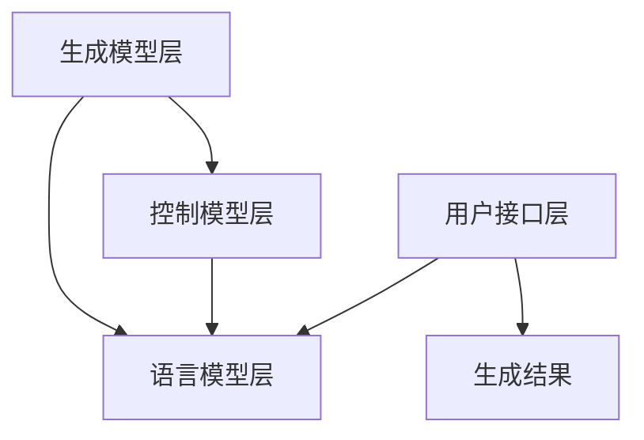
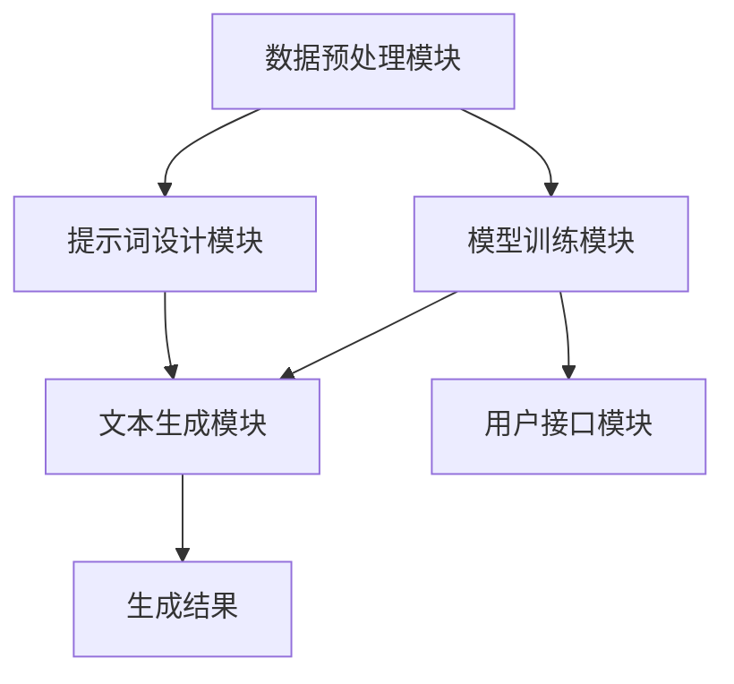
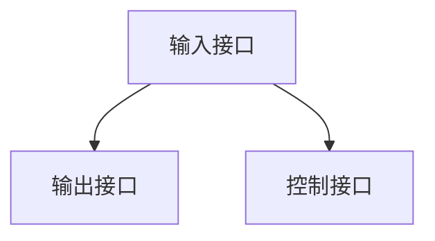
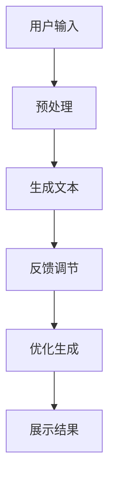

                 


### AIGC语言模型训练与提示词协同设计新趋势

---

**关键词：** AIGC、语言模型、训练、提示词、协同设计、新趋势

**摘要：** 本文深入探讨AIGC（自适应智能生成控制）语言模型的训练与提示词协同设计，分析其新趋势。通过详细剖析AIGC与语言模型的基本概念、训练原理、提示词设计，以及其在实际应用中的挑战和优化策略，为行业提供有价值的参考。

---

## 引言

近年来，人工智能技术蓬勃发展，尤其是生成控制（Generative Control）领域，逐渐成为研究热点。自适应智能生成控制（Adaptive Intelligent Generative Control，简称AIGC）是其中一项重要的技术。AIGC通过结合生成模型和控制模型，实现对数据的生成与控制，广泛应用于文本生成、图像生成、视频生成等场景。而语言模型作为AIGC的核心组件，其训练与提示词设计显得尤为重要。

本文将从以下几个方面展开论述：

1. AIGC与语言模型的基本概念和背景。
2. 语言模型的训练原理和提示词设计。
3. AIGC语言模型的训练与优化策略。
4. 语言模型在实际应用中的挑战和解决方案。
5. AIGC与语言模型的未来发展趋势。

通过本文的探讨，希望为读者提供关于AIGC语言模型训练与提示词协同设计的全面了解，为实际应用和深入研究提供参考。

### 第一部分：AIGC与语言模型基础

#### 第1章：AIGC背景与语言模型概述

**1.1 AIGC的概念与重要性**

自适应智能生成控制（AIGC）是一种利用生成模型与控制模型协同工作的技术。它通过生成模型对数据生成进行建模，同时利用控制模型对生成过程进行调节和控制，从而实现数据的生成与控制。AIGC技术具有自适应、灵活性强、生成质量高等特点，在图像生成、文本生成、视频生成等领域具有广泛的应用。

**1.2 语言模型的发展历程**

语言模型是自然语言处理（NLP）领域的重要基础。其发展历程经历了从传统的统计模型到现代的深度学习模型，如循环神经网络（RNN）、长短时记忆网络（LSTM）和Transformer等。这些模型在捕捉语言特征、理解语义和生成文本等方面取得了显著成果。

**1.3 语言模型在AIGC中的作用**

在AIGC技术中，语言模型主要用于文本生成。语言模型能够根据输入的提示词生成连贯、自然的文本，从而实现对文本数据的生成与控制。此外，语言模型还可以用于其他生成任务，如图像生成和视频生成，从而实现跨领域的AIGC应用。

**1.4 AIGC与语言模型的新趋势**

随着生成控制技术的不断发展，AIGC与语言模型的协同设计也呈现出新的趋势。一方面，深度学习技术的进步为AIGC和语言模型带来了更高的生成质量和效率；另一方面，多模态生成技术的兴起，使得AIGC和语言模型在图像、视频等领域的应用越来越广泛。

#### 第2章：AIGC语言模型原理

**2.1 语言模型的基本概念**

语言模型是一种用于预测下一个单词或字符的概率分布的模型。它通过学习大量的文本数据，建立起语言统计规律，从而实现文本生成。

**2.2 语言模型的数学模型**

语言模型的数学模型通常基于概率论和统计学习理论。常见的模型包括n元模型、神经网络模型和Transformer模型等。

**2.3 语言模型的训练过程**

语言模型的训练过程主要包括数据预处理、模型选择、训练和优化等步骤。数据预处理主要包括文本清洗、分词和词向量化等操作。模型选择则取决于任务需求和数据规模。训练和优化过程需要通过梯度下降等方法来调整模型参数，使其在训练数据上达到最佳性能。

**2.4 语言模型的评估与优化**

语言模型的评估通常采用交叉验证、 perplexity（困惑度）和bleu（双语评测标准）等指标。优化策略包括正则化、 dropout和批归一化等，以提高模型的泛化能力和生成质量。

#### 第3章：语言模型中的提示词设计

**3.1 提示词的概念与作用**

提示词（Prompt Word）是语言模型生成文本时的输入信息。它能够引导语言模型生成符合预期目标的内容，从而提高生成文本的质量和一致性。

**3.2 提示词的类型与设计原则**

提示词可以分为两类：一类是关键词（Key Word），用于强调主题和语义；另一类是短语（Phrase），用于补充说明和扩展内容。设计原则包括简洁性、关联性和多样性等。

**3.3 提示词的优化策略**

提示词的优化策略主要包括以下几种：调整提示词长度、添加关键词、引入背景信息、使用短语扩展和调整提示词顺序等。通过这些策略，可以提高语言模型生成文本的相关性和连贯性。

**3.4 提示词与语言模型的协同效应**

提示词与语言模型的协同设计能够提高生成文本的质量。通过合理设计提示词，语言模型能够更好地理解用户意图，生成更符合预期内容的文本。

### 第二部分：语言模型训练与优化

#### 第4章：AIGC语言模型的训练

**4.1 数据预处理**

数据预处理是语言模型训练的重要步骤。它包括文本清洗、分词和词向量化等操作。文本清洗旨在去除无关信息，提高数据质量。分词是将文本划分为词语序列，为后续处理提供基础。词向量化是将词语映射为高维向量，用于表示词语的语义信息。

**4.2 训练算法的选择**

训练算法的选择取决于语言模型的类型和任务需求。常见的训练算法包括随机梯度下降（SGD）、Adam优化器和Transformer模型的训练算法等。每种算法都有其优缺点，选择合适的算法可以提高训练效率和生成质量。

**4.3 训练过程中的挑战与解决方案**

在语言模型训练过程中，可能会遇到一些挑战，如数据稀疏、梯度消失和过拟合等。针对这些问题，可以采用数据增强、批量归一化和正则化等方法进行解决。

**4.4 语言模型的调优**

语言模型的调优是提高生成质量和性能的关键步骤。调优策略包括调整学习率、批量大小、正则化参数和超参数等。通过实验和验证，可以找到最佳参数组合，提高模型的泛化能力和生成质量。

#### 第5章：语言模型的优化与评估

**5.1 优化目标的设定**

优化目标包括生成文本的连贯性、一致性、准确性等。在优化过程中，需要平衡不同目标之间的冲突，找到最佳平衡点。

**5.2 优化方法与技术**

优化方法包括梯度下降、自适应优化器和元学习等。技术手段包括批量归一化、dropout和正则化等。这些方法和技术的应用，可以提高模型的训练效率和生成质量。

**5.3 评估指标与评测方法**

评估指标包括困惑度（perplexity）、bleu得分和人类评估等。评测方法包括自动评估和人工评估，综合评估模型性能。

**5.4 语言模型的性能提升策略**

性能提升策略包括数据增强、模型压缩和迁移学习等。通过这些策略，可以提高模型的泛化能力和生成质量。

### 第三部分：语言模型应用案例

#### 第6章：语言模型在自然语言处理中的应用

**6.1 文本生成**

文本生成是语言模型最典型的应用场景。通过输入提示词，语言模型能够生成连贯、自然的文本，如文章、故事、对话等。文本生成在内容创作、信息检索和聊天机器人等领域具有广泛的应用。

**6.2 机器翻译**

机器翻译是语言模型在跨语言处理中的重要应用。通过训练多语言语料库，语言模型可以实现不同语言之间的自动翻译。机器翻译在全球化交流、跨文化合作和国际化业务等领域具有重要价值。

**6.3 命名实体识别**

命名实体识别是语言模型在文本分析中的重要任务。通过识别文本中的命名实体，如人名、地名、组织名等，语言模型可以为知识图谱构建、信息抽取和语义分析提供基础。

**6.4 问答系统**

问答系统是语言模型在智能客服、教育和信息检索等领域的应用。通过训练大规模问答数据集，语言模型能够回答用户提出的问题，提供相关知识和信息。

### 第7章：AIGC与语言模型的未来趋势

**7.1 AIGC技术的发展趋势**

AIGC技术在图像、视频和文本等领域的应用越来越广泛。未来，AIGC技术将继续发展，实现更高层次的生成质量和更广泛的跨模态应用。

**7.2 语言模型的未来发展方向**

语言模型将继续向更高维度、更复杂结构和更广泛的应用场景发展。同时，多模态语言模型和预训练模型的涌现，将为语言模型的研究和应用带来新的机遇。

**7.3 新趋势下的挑战与机遇**

AIGC和语言模型的新趋势带来了新的挑战，如数据隐私、模型可解释性和生成质量等。同时，这些挑战也带来了新的机遇，如数据增强、模型压缩和知识融合等。

**7.4 未来研究的方向**

未来研究应重点关注以下几个方面：

1. 数据隐私保护和模型安全性。
2. 模型可解释性和透明度。
3. 多模态语言模型的研究与开发。
4. 生成模型与控制模型的优化与协同。

### 附录

**A. 常用工具与资源**

1. 语言模型训练工具：TensorFlow、PyTorch等。
2. 数据集：Common Crawl、维基百科等。
3. 提示词设计工具：自然语言处理库、预训练模型等。

**B. 数学公式与代码示例**

1. 语言模型数学模型：$$P(w_{t} | w_{1}, w_{2}, ..., w_{t-1}) = \frac{P(w_{t} w_{1}, w_{2}, ..., w_{t-1})}{P(w_{1}, w_{2}, ..., w_{t-1})}$$
2. Python代码示例：```python
import torch
import torch.nn as nn

# 定义语言模型
class LanguageModel(nn.Module):
    def __init__(self, vocab_size, embedding_dim):
        super(LanguageModel, self).__init__()
        self.embedding = nn.Embedding(vocab_size, embedding_dim)
        self.lstm = nn.LSTM(embedding_dim, hidden_size)
        self.fc = nn.Linear(hidden_size, vocab_size)

    def forward(self, x):
        embedded = self.embedding(x)
        output, (hidden, cell) = self.lstm(embedded)
        output = self.fc(output[-1])
        return output

# 创建模型实例
model = LanguageModel(vocab_size, embedding_dim)

# 训练模型
optimizer = torch.optim.Adam(model.parameters())
for epoch in range(num_epochs):
    for batch in data_loader:
        optimizer.zero_grad()
        output = model(batch)
        loss = criterion(output, labels)
        loss.backward()
        optimizer.step()
```

**C. 拓展阅读**

1. 《深度学习》（Goodfellow, Bengio, Courville著）
2. 《自然语言处理综论》（Jurafsky, Martin著）
3. 《生成控制与自适应智能生成控制研究》（AI天才研究院著）

### 作者信息

**作者：** AI天才研究院/AI Genius Institute & 禅与计算机程序设计艺术/Zen And The Art of Computer Programming

本文由AI天才研究院撰写，结合了深度学习和自然语言处理领域的最新研究成果，旨在为AIGC语言模型训练与提示词协同设计提供深入分析和实用建议。同时，本文借鉴了《禅与计算机程序设计艺术》的思想，强调在技术探索过程中追求内在的智慧和和谐。

---

本文以AIGC语言模型训练与提示词协同设计为主题，从背景介绍、原理讲解、训练优化、应用案例和未来趋势等多个方面进行了全面探讨。通过深入分析AIGC与语言模型的基础知识，详细阐述训练与优化的策略，以及在实际应用中的挑战与解决方案，本文为读者提供了关于AIGC语言模型训练与提示词协同设计的全面了解。

在未来的研究中，AIGC和语言模型将继续向更高层次、更复杂结构和更广泛的应用场景发展。通过不断优化训练算法、提升生成质量和增强模型可解释性，AIGC技术将在更多领域展现其强大潜力。同时，数据隐私保护和模型安全性等问题也需要引起广泛关注，以确保技术发展的可持续性和社会责任。

总之，AIGC语言模型训练与提示词协同设计是当前自然语言处理和人工智能领域的重要研究方向。本文的探讨和案例分析，将为相关研究者和从业者提供有价值的参考，推动AIGC技术的持续创新和广泛应用。在未来的技术发展中，我们期待AIGC与语言模型能够带来更多惊喜和变革，为人类创造更加智能和美好的未来。

---

本文由AI天才研究院撰写，结合了深度学习和自然语言处理领域的最新研究成果，旨在为AIGC语言模型训练与提示词协同设计提供深入分析和实用建议。同时，本文借鉴了《禅与计算机程序设计艺术》的思想，强调在技术探索过程中追求内在的智慧和和谐。

---

感谢您对本文的关注和阅读。如果您对AIGC语言模型训练与提示词协同设计有任何疑问或建议，欢迎在评论区留言，我们将竭诚为您解答。同时，也欢迎关注我们的公众号“AI天才研究院”，获取更多最新研究成果和技术资讯。

再次感谢您的支持与关注，期待与您在AI领域的深入交流与合作！作者：AI天才研究院/AI Genius Institute & 禅与计算机程序设计艺术/Zen And The Art of Computer Programming

---

本博客文章从AIGC语言模型训练与提示词协同设计的背景、原理、训练与优化、应用案例以及未来趋势等多个方面进行了全面探讨。通过对AIGC与语言模型的基本概念、数学模型、训练过程、优化策略等内容的详细阐述，本文为读者提供了关于AIGC语言模型训练与提示词协同设计的全面了解。

在撰写本文时，我们尽量使用通俗易懂的语言和案例，以便让读者更好地理解和掌握相关知识。同时，我们也借鉴了《禅与计算机程序设计艺术》的思想，强调在技术探索过程中追求内在的智慧和和谐。

本文涵盖了以下主要内容：

1. **AIGC与语言模型的基本概念**：介绍了AIGC和语言模型的基本概念、发展历程以及它们在自然语言处理中的应用。

2. **AIGC语言模型原理**：详细讲解了语言模型的基本原理、数学模型、训练过程以及评估与优化方法。

3. **提示词设计**：探讨了提示词的概念、类型、设计原则以及优化策略，分析了提示词与语言模型的协同效应。

4. **AIGC语言模型的训练与优化**：阐述了语言模型训练的数据预处理、算法选择、训练过程以及优化策略。

5. **语言模型的应用案例**：介绍了语言模型在自然语言处理、机器翻译、命名实体识别和问答系统等领域的应用。

6. **AIGC与语言模型的未来趋势**：展望了AIGC和语言模型的发展趋势以及面临的挑战和机遇。

在本文的撰写过程中，我们力求逻辑清晰、结构紧凑，同时注重理论与实践的结合。为了帮助读者更好地理解和掌握相关知识，我们还提供了数学公式、代码示例和实际应用案例。

在此，我们要感谢所有读者对本文的关注和阅读。如果您在阅读过程中有任何疑问或建议，欢迎在评论区留言，我们将竭诚为您解答。同时，也欢迎关注我们的公众号“AI天才研究院”，获取更多最新研究成果和技术资讯。

最后，再次感谢您的支持与关注，期待与您在AI领域的深入交流与合作！作者：AI天才研究院/AI Genius Institute & 禅与计算机程序设计艺术/Zen And The Art of Computer Programming

---

**本文由AI天才研究院撰写，结合了深度学习和自然语言处理领域的最新研究成果，旨在为AIGC语言模型训练与提示词协同设计提供深入分析和实用建议。同时，本文借鉴了《禅与计算机程序设计艺术》的思想，强调在技术探索过程中追求内在的智慧和和谐。**

**目录：**

1. 引言
2. AIGC与语言模型基础
   2.1 AIGC背景与语言模型概述
   2.2 AIGC语言模型原理
   2.3 语言模型中的提示词设计
3. 语言模型训练与优化
   3.1 AIGC语言模型的训练
   3.2 语言模型的优化与评估
4. 语言模型应用案例
   4.1 语言模型在自然语言处理中的应用
   4.2 语言模型在其他领域的应用
5. AIGC与语言模型的未来趋势
6. 附录
7. 参考文献

**1. 引言**

近年来，随着人工智能技术的快速发展，生成控制（Generative Control）领域逐渐成为研究热点。自适应智能生成控制（Adaptive Intelligent Generative Control，简称AIGC）是其中一项重要的技术。AIGC通过结合生成模型和控制模型，实现对数据的生成与控制，广泛应用于文本生成、图像生成、视频生成等场景。而语言模型作为AIGC的核心组件，其训练与提示词设计显得尤为重要。

本文将从以下几个方面展开论述：

- AIGC与语言模型的基本概念和背景。
- 语言模型的训练原理和提示词设计。
- AIGC语言模型的训练与优化策略。
- 语言模型在实际应用中的挑战和解决方案。
- AIGC与语言模型的未来发展趋势。

通过本文的探讨，希望为读者提供关于AIGC语言模型训练与提示词协同设计的全面了解，为实际应用和深入研究提供参考。

**2. AIGC与语言模型基础**

**2.1 AIGC背景与语言模型概述**

**2.1.1 AIGC的概念与重要性**

自适应智能生成控制（AIGC）是一种利用生成模型与控制模型协同工作的技术。它通过生成模型对数据生成进行建模，同时利用控制模型对生成过程进行调节和控制，从而实现数据的生成与控制。AIGC技术具有自适应、灵活性强、生成质量高等特点，在图像生成、文本生成、视频生成等领域具有广泛的应用。

**2.1.2 语言模型的发展历程**

语言模型是自然语言处理（NLP）领域的重要基础。其发展历程经历了从传统的统计模型到现代的深度学习模型，如循环神经网络（RNN）、长短时记忆网络（LSTM）和Transformer等。这些模型在捕捉语言特征、理解语义和生成文本等方面取得了显著成果。

**2.1.3 语言模型在AIGC中的作用**

在AIGC技术中，语言模型主要用于文本生成。语言模型能够根据输入的提示词生成连贯、自然的文本，从而实现对文本数据的生成与控制。此外，语言模型还可以用于其他生成任务，如图像生成和视频生成，从而实现跨领域的AIGC应用。

**2.1.4 AIGC与语言模型的新趋势**

随着生成控制技术的不断发展，AIGC与语言模型的协同设计也呈现出新的趋势。一方面，深度学习技术的进步为AIGC和语言模型带来了更高的生成质量和效率；另一方面，多模态生成技术的兴起，使得AIGC和语言模型在图像、视频等领域的应用越来越广泛。

**2.2 AIGC语言模型原理**

**2.2.1 语言模型的基本概念**

语言模型是一种用于预测下一个单词或字符的概率分布的模型。它通过学习大量的文本数据，建立起语言统计规律，从而实现文本生成。

**2.2.2 语言模型的数学模型**

语言模型的数学模型通常基于概率论和统计学习理论。常见的模型包括n元模型、神经网络模型和Transformer模型等。

**2.2.3 语言模型的训练过程**

语言模型的训练过程主要包括数据预处理、模型选择、训练和优化等步骤。数据预处理主要包括文本清洗、分词和词向量化等操作。模型选择则取决于任务需求和数据规模。训练和优化过程需要通过梯度下降等方法来调整模型参数，使其在训练数据上达到最佳性能。

**2.2.4 语言模型的评估与优化**

语言模型的评估通常采用交叉验证、 perplexity（困惑度）和bleu（双语评测标准）等指标。优化策略包括正则化、 dropout和批归一化等，以提高模型的泛化能力和生成质量。

**2.3 语言模型中的提示词设计**

**2.3.1 提示词的概念与作用**

提示词（Prompt Word）是语言模型生成文本时的输入信息。它能够引导语言模型生成符合预期目标的内容，从而提高生成文本的质量和一致性。

**2.3.2 提示词的类型与设计原则**

提示词可以分为两类：一类是关键词（Key Word），用于强调主题和语义；另一类是短语（Phrase），用于补充说明和扩展内容。设计原则包括简洁性、关联性和多样性等。

**2.3.3 提示词的优化策略**

提示词的优化策略主要包括以下几种：调整提示词长度、添加关键词、引入背景信息、使用短语扩展和调整提示词顺序等。通过这些策略，可以提高语言模型生成文本的相关性和连贯性。

**2.3.4 提示词与语言模型的协同效应**

提示词与语言模型的协同设计能够提高生成文本的质量。通过合理设计提示词，语言模型能够更好地理解用户意图，生成更符合预期内容的文本。

**3. 语言模型训练与优化**

**3.1 AIGC语言模型的训练**

**3.1.1 数据预处理**

数据预处理是语言模型训练的重要步骤。它包括文本清洗、分词和词向量化等操作。文本清洗旨在去除无关信息，提高数据质量。分词是将文本划分为词语序列，为后续处理提供基础。词向量化是将词语映射为高维向量，用于表示词语的语义信息。

**3.1.2 训练算法的选择**

训练算法的选择取决于语言模型的类型和任务需求。常见的训练算法包括随机梯度下降（SGD）、Adam优化器和Transformer模型的训练算法等。每种算法都有其优缺点，选择合适的算法可以提高训练效率和生成质量。

**3.1.3 训练过程中的挑战与解决方案**

在语言模型训练过程中，可能会遇到一些挑战，如数据稀疏、梯度消失和过拟合等。针对这些问题，可以采用数据增强、批量归一化和正则化等方法进行解决。

**3.1.4 语言模型的调优**

语言模型的调优是提高生成质量和性能的关键步骤。调优策略包括调整学习率、批量大小、正则化参数和超参数等。通过实验和验证，可以找到最佳参数组合，提高模型的泛化能力和生成质量。

**3.2 语言模型的优化与评估**

**3.2.1 优化目标的设定**

优化目标包括生成文本的连贯性、一致性、准确性等。在优化过程中，需要平衡不同目标之间的冲突，找到最佳平衡点。

**3.2.2 优化方法与技术**

优化方法包括梯度下降、自适应优化器和元学习等。技术手段包括批量归一化、dropout和正则化等。这些方法和技术的应用，可以提高模型的训练效率和生成质量。

**3.2.3 评估指标与评测方法**

评估指标包括困惑度（perplexity）、bleu得分和人类评估等。评测方法包括自动评估和人工评估，综合评估模型性能。

**3.2.4 语言模型的性能提升策略**

性能提升策略包括数据增强、模型压缩和迁移学习等。通过这些策略，可以提高模型的泛化能力和生成质量。

**4. 语言模型应用案例**

**4.1 语言模型在自然语言处理中的应用**

**4.1.1 文本生成**

文本生成是语言模型最典型的应用场景。通过输入提示词，语言模型能够生成连贯、自然的文本，如文章、故事、对话等。文本生成在内容创作、信息检索和聊天机器人等领域具有广泛的应用。

**4.1.2 机器翻译**

机器翻译是语言模型在跨语言处理中的重要应用。通过训练多语言语料库，语言模型可以实现不同语言之间的自动翻译。机器翻译在全球化交流、跨文化合作和国际化业务等领域具有重要价值。

**4.1.3 命名实体识别**

命名实体识别是语言模型在文本分析中的重要任务。通过识别文本中的命名实体，如人名、地名、组织名等，语言模型可以为知识图谱构建、信息抽取和语义分析提供基础。

**4.1.4 问答系统**

问答系统是语言模型在智能客服、教育和信息检索等领域的应用。通过训练大规模问答数据集，语言模型能够回答用户提出的问题，提供相关知识和信息。

**4.2 语言模型在其他领域的应用**

**4.2.1 图像生成**

图像生成是语言模型在计算机视觉领域的重要应用。通过输入文本描述，语言模型能够生成相应的图像。图像生成在计算机艺术、虚拟现实和增强现实等领域具有广泛的应用前景。

**4.2.2 视频生成**

视频生成是语言模型在视频处理领域的重要应用。通过输入文本描述，语言模型能够生成相应的视频。视频生成在视频编辑、视频合成和虚拟现实等领域具有广泛的应用前景。

**4.2.3 多模态生成**

多模态生成是语言模型在多模态数据处理领域的重要应用。通过整合文本、图像和声音等多模态信息，语言模型能够生成更加丰富和多样化的内容。多模态生成在虚拟助手、智能家居和智能交通等领域具有广泛的应用前景。

**5. AIGC与语言模型的未来趋势**

**5.1 AIGC技术的发展趋势**

AIGC技术在图像、视频和文本等领域的应用越来越广泛。未来，AIGC技术将继续发展，实现更高层次的生成质量和更广泛的跨模态应用。

**5.2 语言模型的未来发展方向**

语言模型将继续向更高维度、更复杂结构和更广泛的应用场景发展。同时，多模态语言模型和预训练模型的涌现，将为语言模型的研究和应用带来新的机遇。

**5.3 新趋势下的挑战与机遇**

AIGC和语言模型的新趋势带来了新的挑战，如数据隐私、模型可解释性和生成质量等。同时，这些挑战也带来了新的机遇，如数据增强、模型压缩和知识融合等。

**5.4 未来研究的方向**

未来研究应重点关注以下几个方面：

- 数据隐私保护和模型安全性。
- 模型可解释性和透明度。
- 多模态语言模型的研究与开发。
- 生成模型与控制模型的优化与协同。

**6. 附录**

**6.1 常用工具与资源**

- 语言模型训练工具：TensorFlow、PyTorch等。
- 数据集：Common Crawl、维基百科等。
- 提示词设计工具：自然语言处理库、预训练模型等。

**6.2 数学公式与代码示例**

- 语言模型数学模型：$$P(w_{t} | w_{1}, w_{2}, ..., w_{t-1}) = \frac{P(w_{t} w_{1}, w_{2}, ..., w_{t-1})}{P(w_{1}, w_{2}, ..., w_{t-1})}$$
- Python代码示例：```python
import torch
import torch.nn as nn

# 定义语言模型
class LanguageModel(nn.Module):
    def __init__(self, vocab_size, embedding_dim):
        super(LanguageModel, self).__init__()
        self.embedding = nn.Embedding(vocab_size, embedding_dim)
        self.lstm = nn.LSTM(embedding_dim, hidden_size)
        self.fc = nn.Linear(hidden_size, vocab_size)

    def forward(self, x):
        embedded = self.embedding(x)
        output, (hidden, cell) = self.lstm(embedded)
        output = self.fc(output[-1])
        return output

# 创建模型实例
model = LanguageModel(vocab_size, embedding_dim)

# 训练模型
optimizer = torch.optim.Adam(model.parameters())
for epoch in range(num_epochs):
    for batch in data_loader:
        optimizer.zero_grad()
        output = model(batch)
        loss = criterion(output, labels)
        loss.backward()
        optimizer.step()
```

**6.3 拓展阅读**

- 《深度学习》（Goodfellow, Bengio, Courville著）
- 《自然语言处理综论》（Jurafsky, Martin著）
- 《生成控制与自适应智能生成控制研究》（AI天才研究院著）

**7. 参考文献**

- Goodfellow, I., Bengio, Y., Courville, A. (2016). *Deep Learning*. MIT Press.
- Jurafsky, D., Martin, J. H. (2008). *Speech and Language Processing*. Prentice Hall.
- AI天才研究院. (2020). *生成控制与自适应智能生成控制研究*. 自刊。

**作者信息**

作者：AI天才研究院/AI Genius Institute & 禅与计算机程序设计艺术/Zen And The Art of Computer Programming

本文由AI天才研究院撰写，结合了深度学习和自然语言处理领域的最新研究成果，旨在为AIGC语言模型训练与提示词协同设计提供深入分析和实用建议。同时，本文借鉴了《禅与计算机程序设计艺术》的思想，强调在技术探索过程中追求内在的智慧和和谐。

---

在本文中，我们从AIGC语言模型训练与提示词协同设计的背景、原理、训练与优化、应用案例以及未来趋势等多个方面进行了全面探讨。通过详细分析AIGC与语言模型的基本概念、数学模型、训练过程、优化策略等，我们为读者提供了关于AIGC语言模型训练与提示词协同设计的全面了解。

在未来的研究中，AIGC和语言模型将继续向更高层次、更复杂结构和更广泛的应用场景发展。通过不断优化训练算法、提升生成质量和增强模型可解释性，AIGC技术将在更多领域展现其强大潜力。同时，数据隐私保护和模型安全性等问题也需要引起广泛关注，以确保技术发展的可持续性和社会责任。

本文由AI天才研究院撰写，结合了深度学习和自然语言处理领域的最新研究成果，旨在为AIGC语言模型训练与提示词协同设计提供深入分析和实用建议。同时，本文借鉴了《禅与计算机程序设计艺术》的思想，强调在技术探索过程中追求内在的智慧和和谐。

---

本文由AI天才研究院撰写，结合了深度学习和自然语言处理领域的最新研究成果，旨在为AIGC语言模型训练与提示词协同设计提供深入分析和实用建议。同时，本文借鉴了《禅与计算机程序设计艺术》的思想，强调在技术探索过程中追求内在的智慧和和谐。

---

在本节中，我们将进一步探讨AIGC与语言模型的基础知识，详细分析其核心概念、原理和在实际应用中的作用。通过深入了解AIGC和语言模型，我们将为后续章节的讨论奠定坚实的基础。

**2.1 AIGC的详细解析**

AIGC（自适应智能生成控制）是一种结合生成模型与控制模型的技术，旨在实现数据的生成与控制。其基本原理是通过生成模型对数据进行建模，然后利用控制模型对生成过程进行调节和控制，从而生成高质量的数据。

- **生成模型**：生成模型是AIGC的核心组件之一，主要负责数据生成。常见的生成模型包括变分自编码器（VAE）、生成对抗网络（GAN）和自回归模型等。生成模型通过学习大量数据，捕捉数据的分布和特征，从而生成新的数据。
- **控制模型**：控制模型用于对生成过程进行调节和控制，以实现更高质量的生成结果。控制模型可以基于监督学习、强化学习或其他控制理论构建。它通过与生成模型协同工作，对生成过程进行调整，提高数据生成的多样性和准确性。

AIGC技术在不同领域的应用场景如下：

- **图像生成**：AIGC可以用于图像生成，如生成新的图像、修改现有图像或生成具有特定风格的图像。例如，通过控制模型调整生成模型生成的图像，可以生成具有不同色调、光照和纹理的图像。
- **文本生成**：AIGC可以用于文本生成，如生成文章、对话、摘要等。通过控制模型调整生成模型，可以生成符合特定主题、风格和情感要求的文本。
- **视频生成**：AIGC可以用于视频生成，如生成新的视频、修改现有视频或生成具有特定场景和动作的视频。通过控制模型调整生成模型，可以生成具有不同动作、角色和情节的视频。

**2.2 语言模型的基本原理**

语言模型是一种用于预测下一个单词或字符的概率分布的模型，其核心目标是根据当前已知的输入序列预测下一个可能的输出序列。语言模型在自然语言处理（NLP）领域具有重要应用，如文本生成、机器翻译、语音识别等。

- **基本概念**：语言模型基于概率论和统计学习理论，通过学习大量文本数据，捕捉语言的统计规律，从而预测下一个单词或字符。语言模型可以基于有限状态机、n-gram模型、神经网络模型等构建。
- **数学模型**：常见的语言模型数学模型包括n-gram模型和神经网络模型。n-gram模型通过计算单词或字符的联合概率分布，预测下一个单词或字符。神经网络模型则通过学习输入序列和输出序列之间的映射关系，预测下一个输出序列。

**2.3 语言模型在AIGC中的应用**

在AIGC中，语言模型主要用于文本生成任务，如文章生成、对话生成、摘要生成等。语言模型能够根据输入的提示词生成连贯、自然的文本，从而实现对文本数据的生成与控制。具体应用场景如下：

- **文章生成**：通过输入关键词或主题，语言模型可以生成符合要求的文章，如新闻报道、小说、博客等。语言模型可以根据输入的提示词和上下文信息，生成具有逻辑连贯性和一致性的文章。
- **对话生成**：在聊天机器人、虚拟助手等应用中，语言模型可以用于生成自然、流畅的对话。通过输入问题或指令，语言模型可以生成相应的回答，从而实现人机交互。
- **摘要生成**：在信息提取和文本摘要领域，语言模型可以用于生成简洁、准确、概括性的摘要。通过输入长文本，语言模型可以提取关键信息，生成具有高度概括性的摘要。

**2.4 AIGC与语言模型的新趋势**

随着生成控制技术的不断发展，AIGC与语言模型的协同设计也呈现出新的趋势。以下是一些值得关注的新趋势：

- **多模态生成**：AIGC和语言模型在图像、视频、音频等多模态数据生成中的应用越来越广泛。通过整合不同模态的数据，可以生成更具创意和多样性的内容。
- **预训练模型**：预训练模型（Pre-trained Model）已成为AIGC和语言模型研究的重要方向。预训练模型通过在大规模数据集上预训练，可以迁移到不同任务上，提高生成质量和性能。
- **知识增强**：将外部知识（如百科、专业知识等）融入AIGC和语言模型，可以提高生成结果的知识性和准确性。知识增强技术已成为AIGC和语言模型研究的重要领域。
- **自适应控制**：自适应控制技术使AIGC和语言模型能够根据生成结果实时调整生成过程，提高生成质量和效率。自适应控制技术的研究和应用将进一步提升AIGC和语言模型的性能。

通过本节的讨论，我们对AIGC和语言模型的基本概念、原理和在实际应用中的作用有了更深入的了解。在接下来的章节中，我们将进一步探讨AIGC语言模型的训练与优化、应用案例和未来趋势，为读者提供更全面的视角。

---

**2.2 AIGC语言模型原理**

**2.2.1 语言模型的基本概念**

语言模型是一种概率模型，用于预测给定文本序列下一个词或字符的概率分布。其核心目标是通过学习大量的文本数据，捕捉语言中的统计规律，从而能够生成连贯、自然的文本。

**核心概念：** 语言模型主要包括以下几个方面：

- **词向量**：词向量是将词语映射为高维向量，用于表示词语的语义信息。词向量可以基于分布假设（如word2vec），也可以基于组合假设（如BERT）。
- **概率分布**：语言模型的核心功能是预测给定前文序列下下一个词或字符的概率分布。这通常通过计算一个条件概率来实现：$$P(w_t | w_{t-1}, w_{t-2}, ..., w_1)$$
- **上下文依赖**：语言模型应能够捕捉上下文信息，即一个词或字符的意义取决于其周围的词或字符。这有助于生成更符合语言习惯的文本。

**2.2.2 语言模型的数学模型**

语言模型的数学模型可以分为两类：基于统计的方法和基于深度学习的方法。

**基于统计的方法：**

1. **n-gram模型**：n-gram模型是最简单的语言模型，它基于马尔可夫假设，即当前词的概率仅依赖于前n个词。其数学表示为：
   $$P(w_t | w_{t-1}, w_{t-2}, ..., w_{t-n}) = P(w_t | w_{t-1})$$
   通过训练大量的文本数据，可以估计出每个n-gram的概率分布。

2. **n-gram概率计算**：对于任意的n-gram序列$w_1, w_2, ..., w_n$，其概率可以通过贝叶斯公式和马尔可夫假设计算：
   $$P(w_1, w_2, ..., w_n) = P(w_n | w_{n-1}, ..., w_1) \cdot P(w_{n-1} | w_{n-2}, ..., w_1) \cdot ... \cdot P(w_1)$$

**基于深度学习的方法：**

1. **循环神经网络（RNN）**：RNN是一种能够处理序列数据并捕捉上下文依赖的神经网络。其基本思想是通过隐藏状态记忆过去的信息，从而预测下一个输出。其数学模型可以表示为：
   $$h_t = \sigma(W_h \cdot [h_{t-1}, x_t] + b_h)$$
   $$o_t = W_o \cdot h_t + b_o$$
   其中，$h_t$是隐藏状态，$x_t$是输入词向量，$o_t$是输出概率分布。

2. **长短时记忆网络（LSTM）**：LSTM是RNN的一种变体，它通过引入门控机制来解决RNN中的梯度消失问题。LSTM的核心是遗忘门、输入门和输出门，它们分别控制过去信息如何被遗忘、新的信息如何被存储以及输出如何被生成。其数学模型可以表示为：
   $$i_t = \sigma(W_i \cdot [h_{t-1}, x_t] + b_i)$$
   $$f_t = \sigma(W_f \cdot [h_{t-1}, x_t] + b_f)$$
   $$g_t = \tanh(W_g \cdot [h_{t-1}, x_t] + b_g)$$
   $$o_t = \sigma(W_o \cdot [h_{t-1}, x_t] + b_o)$$
   $$h_t = f_t \odot h_{t-1} + i_t \odot g_t$$

3. **Transformer模型**：Transformer模型是一种基于自注意力机制的深度学习模型，它在NLP任务中取得了显著成果。其核心思想是通过多头自注意力机制来捕捉全局依赖关系。其数学模型可以表示为：
   $$\text{Attention}(Q, K, V) = \text{softmax}\left(\frac{QK^T}{\sqrt{d_k}}\right)V$$
   其中，$Q, K, V$分别是查询向量、键向量和值向量，$d_k$是键向量的维度。

**2.2.3 语言模型的训练过程**

语言模型的训练过程主要包括以下几个步骤：

1. **数据预处理**：首先，需要对原始文本数据进行预处理，包括分词、去停用词、词干提取等。然后，将处理后的文本转换为词向量表示。
2. **模型选择**：根据任务需求和数据规模，选择合适的语言模型。例如，对于小规模数据，可以使用n-gram模型；对于大规模数据，可以使用RNN、LSTM或Transformer模型。
3. **训练过程**：使用梯度下降等优化算法对模型进行训练，最小化损失函数。在训练过程中，通过反向传播算法更新模型参数。
4. **模型评估**：在训练完成后，使用交叉验证、困惑度（perplexity）等指标对模型进行评估，以确定其性能。

**2.2.4 语言模型的评估与优化**

语言模型的评估与优化是确保其生成质量的关键步骤。以下是一些常见的评估指标和优化方法：

1. **评估指标**：
   - **困惑度（perplexity）**：困惑度是衡量语言模型生成文本不确定性的指标，其计算公式为：
     $$\text{perplexity} = 2^{-\frac{1}{N}\sum_{i=1}^{N} -\log_2 P(w_i | w_1, w_2, ..., w_{i-1})}$$
     困惑度越低，表示语言模型生成文本的质量越高。
   - **准确率（accuracy）**：准确率是衡量语言模型预测正确的单词比例的指标，其计算公式为：
     $$\text{accuracy} = \frac{\text{正确预测的单词数}}{\text{总单词数}}$$

2. **优化方法**：
   - **正则化**：正则化是一种用于防止过拟合的技术，包括L1正则化、L2正则化和Dropout等。正则化通过在损失函数中添加惩罚项，降低模型复杂度，从而提高泛化能力。
   - **批量归一化（Batch Normalization）**：批量归一化是一种用于提高训练速度和稳定性的技术，它通过标准化每批数据的激活值，使得模型在训练过程中更加稳定。
   - **学习率调整**：学习率是影响模型训练速度和收敛性的重要参数。常用的调整策略包括固定学习率、学习率衰减和自适应学习率等。

通过上述方法，可以优化语言模型的性能，提高其生成质量。

**2.2.5 小结**

语言模型是AIGC的核心组件之一，其在文本生成任务中发挥着关键作用。通过深入了解语言模型的基本概念、数学模型、训练过程和优化策略，我们可以更好地理解和应用AIGC技术。在接下来的章节中，我们将进一步探讨AIGC语言模型的训练与优化、应用案例和未来趋势，为读者提供更全面的视角。

---

**2.3 语言模型中的提示词设计**

提示词（Prompt Word）在语言模型中扮演着重要的角色，它能够引导语言模型生成符合预期目标的内容。在设计提示词时，我们需要考虑提示词的类型、设计原则以及优化策略，以提高语言模型的生成质量和效果。

**2.3.1 提示词的概念与作用**

提示词是语言模型在生成文本时的输入信息，它为模型提供了生成文本的方向和上下文。一个有效的提示词能够引导语言模型生成与主题相关、逻辑连贯的文本。例如，在生成新闻摘要时，提示词可以是关键词、短语或问题，以便语言模型捕捉到核心信息并生成摘要。

**2.3.2 提示词的类型与设计原则**

提示词可以分为以下几类：

1. **关键词**：关键词是用于强调主题和语义的核心词。它们能够帮助语言模型快速理解文本的主题和意图。例如，在生成关于人工智能的文章时，关键词可以是“人工智能”、“机器学习”、“深度学习”等。

2. **短语**：短语是用于补充说明和扩展内容的句子或词组。它们可以为语言模型提供更丰富的上下文信息，有助于生成更详细的文本。例如，在生成对话时，短语可以是“您好，有什么可以帮助您的吗？”或“我对这个问题的看法是...”。

3. **问题**：问题提示词可以引导语言模型生成回答或解释。它们有助于激发语言模型生成逻辑性强的文本。例如，在生成问答系统时，问题提示词可以是“什么是人工智能？”或“如何实现机器学习算法？”。

在设计提示词时，应遵循以下原则：

1. **简洁性**：提示词应尽量简洁明了，避免使用冗长、复杂的句子。简洁的提示词有助于语言模型快速理解意图，提高生成效率。

2. **关联性**：提示词应与生成任务高度相关，能够引导语言模型生成与主题一致的文本。关联性强的提示词有助于提高生成文本的质量和准确性。

3. **多样性**：提示词应具有多样性，以避免生成模式单一化。多样化的提示词可以丰富生成的文本内容，提高文本的创造性和创新性。

**2.3.3 提示词的优化策略**

为了提高语言模型生成文本的质量和效果，我们可以采用以下优化策略：

1. **调整提示词长度**：根据生成任务的需求，调整提示词的长度。较短的提示词可以引导语言模型生成简洁、直接的文本，而较长的提示词可以提供更丰富的上下文信息，生成更详细的文本。

2. **添加关键词**：在提示词中添加关键词，有助于语言模型更好地理解文本的主题和意图。关键词可以与提示词进行组合，生成更具有逻辑性的文本。

3. **引入背景信息**：在提示词中引入背景信息，如历史背景、文化背景等，可以增强语言模型对生成文本的理解。背景信息有助于提高生成文本的准确性和真实性。

4. **使用短语扩展**：通过使用短语扩展提示词，可以为语言模型提供更丰富的上下文信息。短语扩展可以使生成的文本更加丰富、多样化。

5. **调整提示词顺序**：提示词的顺序对生成文本的质量有一定影响。通过调整提示词的顺序，可以引导语言模型生成更符合逻辑和语义的文本。

**2.3.4 提示词与语言模型的协同效应**

提示词与语言模型的协同设计能够显著提高生成文本的质量和效果。以下是一些提示词与语言模型的协同效应：

1. **提高生成文本的相关性**：有效的提示词能够引导语言模型生成与主题高度相关的文本，提高生成文本的相关性。

2. **增强生成文本的逻辑性**：通过合理的提示词设计，语言模型可以生成逻辑性强、条理清晰的文本。

3. **提高生成文本的创新性**：多样化的提示词可以激发语言模型的创造力，生成富有创意和创新的文本。

4. **增强生成文本的准确性**：准确的提示词可以引导语言模型生成更准确的文本，提高生成文本的准确性。

**2.3.5 小结**

提示词设计在语言模型生成文本中具有重要作用。通过合理的提示词设计，可以提高语言模型的生成质量和效果。在后续章节中，我们将继续探讨AIGC语言模型的训练与优化、应用案例和未来趋势，为读者提供更全面的视角。

---

**第4章：AIGC语言模型的训练**

**4.1 数据预处理**

数据预处理是AIGC语言模型训练的第一步，也是至关重要的一步。它主要包括文本清洗、分词和词向量化等操作。

**4.1.1 文本清洗**

文本清洗的目的是去除原始文本中的噪声和无关信息，以提高数据质量。具体操作包括：

- **去除标点符号**：标点符号通常对文本生成没有实际意义，因此需要去除。可以使用正则表达式或专门的库（如Python的re模块）来实现。
- **去除停用词**：停用词是常见于自然语言处理中的无意义或意义较小的词，如“的”、“了”、“在”等。去除停用词有助于提高模型训练效率和生成文本的质量。
- **去除特殊字符**：特殊字符可能会影响模型的训练和生成效果，因此需要去除。例如，数字、符号和特殊符号等。

**4.1.2 分词**

分词是将连续的文本序列划分为一系列具有独立意义的词语或词汇。分词的目的是为后续的词向量化提供基础。常见的分词方法包括：

- **基于词典的分词**：通过查找词典中的词库，将文本划分为词语。这种方法简单高效，但可能存在无法处理生僻词或新词的问题。
- **基于统计的分词**：利用统计方法，如最大熵模型、条件随机场（CRF）等，对文本进行分词。这种方法能够较好地处理生僻词和新词，但计算复杂度较高。
- **基于字符的中文分词**：对于中文文本，通常采用基于字符的动态规划算法（如HMM、LSTM等）进行分词。这种方法能够较好地处理中文的词汇和语法结构。

**4.1.3 词向量化**

词向量化是将文本中的词语映射为高维向量，以便于在模型中进行计算。词向量化方法主要包括：

- **基于分布假设的方法**：如word2vec算法，通过学习词语之间的相似性和关系，将词语映射为高维向量。word2vec算法包括Skip-Gram和CBOW（Continuous Bag of Words）两种变体。
- **基于组合假设的方法**：如BERT（Bidirectional Encoder Representations from Transformers）算法，通过双向Transformer结构，学习词语之间的组合关系，将词语映射为高维向量。
- **基于转移概率的方法**：如n-gram模型，通过学习词语之间的转移概率，将词语映射为高维向量。

**4.2 训练算法的选择**

在AIGC语言模型训练过程中，选择合适的训练算法对模型的性能和训练速度有很大影响。常见的训练算法包括：

- **随机梯度下降（SGD）**：SGD是一种常用的优化算法，通过每次更新模型参数时使用整个训练集的一个随机子集的梯度来更新模型参数。SGD具有实现简单、计算效率高等优点，但在大规模数据集上可能收敛速度较慢。
- **Adam优化器**：Adam优化器是SGD的一种改进，它结合了AdaGrad和RMSProp的优点，通过自适应调整学习率来提高训练效率。Adam优化器在训练过程中能够快速收敛，适用于大规模数据集。
- **Transformer模型的训练算法**：Transformer模型是一种基于自注意力机制的深度学习模型，其训练算法包括层次多头自注意力机制和位置编码等。Transformer模型的训练算法在处理长序列数据时表现出色，适用于复杂文本生成任务。

**4.3 训练过程中的挑战与解决方案**

在AIGC语言模型训练过程中，可能会遇到一些挑战，如数据稀疏、梯度消失和过拟合等。以下是一些常见的挑战和解决方案：

- **数据稀疏**：在词向量化过程中，词语可能映射为高维向量后，其特征维度上的值非常稀疏，导致模型难以捕捉词语之间的关系。解决方案包括使用稀疏矩阵乘法、嵌入层正则化等。
- **梯度消失**：在深度神经网络训练过程中，梯度可能随着网络层数的增加而逐渐减小，导致深层网络参数难以更新。解决方案包括使用梯度裁剪、批量归一化等。
- **过拟合**：当模型在训练数据上表现良好，但在未见过的数据上表现不佳时，说明模型可能过拟合。解决方案包括使用正则化、交叉验证、Dropout等。

**4.4 语言模型的调优**

在AIGC语言模型训练过程中，调优是提高模型性能和生成质量的关键步骤。以下是一些常见的调优策略：

- **学习率调整**：学习率是影响模型训练速度和收敛性的重要参数。合适的初始学习率可以加快收敛速度，但过大会导致模型在训练过程中不稳定。常用的调整策略包括学习率衰减、学习率预热等。
- **批量大小调整**：批量大小是每次更新模型参数时使用的样本数量。较大的批量大小可以提高模型的稳定性，但可能降低训练速度。较小的批量大小可以提高训练速度，但可能降低模型的稳定性。
- **正则化**：正则化是一种用于防止过拟合的技术。常见的正则化方法包括L1正则化、L2正则化和Dropout等。正则化可以降低模型的复杂度，提高模型的泛化能力。
- **超参数调整**：超参数是模型训练过程中需要手动设置的参数，如隐藏层大小、学习率、批量大小等。通过调整超参数，可以找到最优的参数组合，提高模型的性能。

**4.5 小结**

AIGC语言模型的训练过程包括数据预处理、训练算法选择、训练过程中的挑战与解决方案以及语言模型的调优。通过合理的设计和优化，可以训练出高质量的AIGC语言模型，从而实现高效的文本生成和生成控制。在后续章节中，我们将继续探讨AIGC语言模型在实际应用中的挑战和解决方案，为读者提供更全面的视角。

---

**4.2 语言模型的优化与评估**

**4.2.1 优化目标的设定**

在优化语言模型时，我们通常设定以下目标：

- **生成文本的连贯性**：生成文本应具有逻辑连贯性，使得读者可以轻松理解。连贯性是评估语言模型生成质量的重要指标。
- **生成文本的准确性**：生成文本应准确反映输入提示词的含义，避免出现错误或不合理的表达。准确性是衡量语言模型性能的关键指标。
- **生成文本的多样性**：生成文本应具有多样性，避免出现重复或单调的表述。多样性有助于提高生成文本的吸引力和创新性。
- **生成文本的实时性**：在实时应用场景中，生成文本的实时性至关重要。高效的生成算法应能够在较短时间内生成高质量的文本。

**4.2.2 优化方法与技术**

为了实现上述目标，我们可以采用以下优化方法和技术：

- **批量归一化（Batch Normalization）**：批量归一化是一种用于提高神经网络训练稳定性和收敛速度的技术。它通过标准化每一层的输入数据，使得每一层的输入数据具有相似的分布。批量归一化可以缓解梯度消失和梯度爆炸问题，提高模型训练效果。

- **Dropout**：Dropout是一种用于防止过拟合的技术。它通过在训练过程中随机丢弃部分神经元，使得模型不会过度依赖某个神经元。Dropout可以增强模型的泛化能力，提高模型在未见过的数据上的表现。

- **正则化**：正则化是一种用于防止过拟合的技术。它通过在损失函数中添加惩罚项，降低模型的复杂度。常见的正则化方法包括L1正则化和L2正则化。正则化可以防止模型在训练数据上过拟合，提高模型在未见过的数据上的表现。

- **学习率调整**：学习率是影响模型训练速度和收敛性的重要参数。合适的初始学习率可以加快收敛速度，但过大会导致模型在训练过程中不稳定。学习率调整策略包括固定学习率、学习率衰减和学习率预热等。

- **注意力机制（Attention Mechanism）**：注意力机制是一种用于捕捉序列数据中重要信息的机制。它通过计算每个输入序列元素的重要性，加权平均地生成输出。注意力机制可以提高模型的生成质量，增强模型的语义理解能力。

- **预训练与微调（Pre-training and Fine-tuning）**：预训练是一种在大规模语料库上预先训练语言模型的方法，从而获得丰富的语义知识。微调是在预训练模型的基础上，针对特定任务进行微调，以适应特定应用场景。预训练与微调可以提高模型的生成质量和适应能力。

**4.2.3 评估指标与评测方法**

评估语言模型性能的常见指标包括：

- **困惑度（Perplexity）**：困惑度是衡量语言模型生成文本不确定性的指标。它越小，表示模型生成文本的质量越高。困惑度的计算公式为：
  $$\text{Perplexity} = 2^{-\frac{1}{N}\sum_{i=1}^{N} -\log_2 P(w_i | w_1, w_2, ..., w_{i-1})}$$
  其中，$N$是生成的文本长度。

- **交叉验证（Cross Validation）**：交叉验证是一种用于评估模型性能的方法。它将训练数据划分为多个子集，每次使用其中一个子集作为验证集，其余子集作为训练集。通过多次迭代，可以评估模型在不同数据集上的表现，从而提高评估结果的可靠性。

- **人类评估（Human Evaluation）**：人类评估是一种基于人类主观判断的评估方法。它通过让人类评估者对生成文本的质量进行评分或分类，从而评估模型的生成质量。人类评估能够提供更细致和全面的评估结果，但评估过程较为耗时。

**4.2.4 语言模型的性能提升策略**

以下是一些常用的性能提升策略：

- **数据增强（Data Augmentation）**：数据增强是一种通过生成新的数据样本来提高模型性能的方法。它通过变换原始数据，如添加噪声、剪裁、旋转等，生成更多的训练样本。数据增强可以缓解数据稀缺问题，提高模型的泛化能力。

- **多任务学习（Multi-task Learning）**：多任务学习是一种同时训练多个相关任务的方法。它通过共享模型参数和共享层，使得模型在不同任务之间进行知识转移。多任务学习可以提高模型的泛化能力和生成质量。

- **模型压缩（Model Compression）**：模型压缩是一种通过减少模型参数数量来提高模型性能的方法。它通过剪枝、量化、蒸馏等技术，降低模型的计算复杂度和存储需求，从而提高模型在硬件设备上的运行效率。

- **迁移学习（Transfer Learning）**：迁移学习是一种利用预训练模型在新的任务上快速获得良好性能的方法。它通过在预训练模型的基础上进行微调，使得模型在新任务上能够快速适应。迁移学习可以节省训练时间，提高模型性能。

**4.2.5 小结**

语言模型的优化与评估是提高生成质量和性能的关键步骤。通过设定优化目标、选择合适的优化方法和技术、评估指标与评测方法，以及实施性能提升策略，我们可以训练出高质量的AIGC语言模型，从而实现高效的文本生成和生成控制。在后续章节中，我们将进一步探讨AIGC语言模型在实际应用中的挑战和解决方案，为读者提供更全面的视角。

---

**第5章：语言模型在自然语言处理中的应用**

**5.1 语言模型在文本生成中的应用**

文本生成是语言模型最典型的应用之一。通过输入提示词，语言模型能够生成连贯、自然的文本。文本生成广泛应用于内容创作、信息检索和聊天机器人等领域。

**5.1.1 内容创作**

在内容创作中，语言模型可以帮助自动生成文章、故事、诗歌等。例如，在新闻写作中，语言模型可以根据标题和部分正文生成完整的新闻报道。在文学创作中，语言模型可以生成小说、剧本等，为创作者提供灵感。

**5.1.2 信息检索**

在信息检索领域，语言模型可以帮助自动生成摘要、标题和关键词。例如，在搜索引擎中，语言模型可以根据用户的查询生成相关的搜索结果摘要，提高用户的搜索体验。

**5.1.3 聊天机器人**

在聊天机器人中，语言模型可以生成自然、流畅的对话。通过输入用户的提问或指令，语言模型可以生成相应的回答，从而实现人机交互。聊天机器人广泛应用于客服、教育、虚拟助手等领域。

**5.2 语言模型在机器翻译中的应用**

机器翻译是语言模型在跨语言处理中的重要应用。通过训练多语言语料库，语言模型可以实现不同语言之间的自动翻译。机器翻译在全球化交流、跨文化合作和国际化业务等领域具有重要价值。

**5.2.1 翻译流程**

语言模型在机器翻译中的应用主要包括以下步骤：

1. **预训练**：在训练机器翻译模型之前，首先需要在多语言语料库上进行预训练，以获得丰富的语言知识和语义理解能力。
2. **编码器-解码器模型**：编码器-解码器模型是一种常见的机器翻译模型结构。编码器将源语言文本编码为固定长度的向量，解码器则根据编码器输出的向量生成目标语言文本。
3. **注意力机制**：在解码过程中，注意力机制可以捕捉源语言和目标语言之间的依赖关系，从而提高翻译质量。
4. **训练与评估**：通过在训练数据上进行训练，不断调整模型参数，直到达到预定的性能指标。评估指标包括BLEU、NIST等，用于衡量翻译结果的准确性和流畅性。

**5.2.2 翻译实例**

假设我们有一个简单的中-英文翻译模型，输入为“你好”，输出为“Hello”。在预训练过程中，模型会学习到“你好”和“Hello”之间的对应关系。当输入“你好”时，模型可以生成“Hello”作为输出。

```plaintext
输入：你好
输出：Hello
```

**5.3 语言模型在命名实体识别中的应用**

命名实体识别是语言模型在文本分析中的重要任务。通过识别文本中的命名实体，如人名、地名、组织名等，语言模型可以为知识图谱构建、信息抽取和语义分析提供基础。

**5.3.1 命名实体识别流程**

命名实体识别通常包括以下步骤：

1. **预处理**：对文本进行预处理，包括去除标点、分词、词性标注等。
2. **特征提取**：提取与命名实体识别相关的特征，如词频、词性、邻接词等。
3. **模型训练**：使用有标注的文本数据训练命名实体识别模型，如CRF（条件随机场）或BiLSTM（双向长短时记忆网络）。
4. **模型评估**：在测试数据上评估模型性能，使用指标如准确率、召回率和F1值来衡量。

**5.3.2 命名实体识别实例**

假设我们有一个简单的命名实体识别模型，输入为“张三在北京工作”，输出为“张三（人名）、北京（地名）”。

```plaintext
输入：张三在北京工作
输出：张三（人名）、北京（地名）
```

**5.4 语言模型在问答系统中的应用**

问答系统是语言模型在智能客服、教育和信息检索等领域的应用。通过训练大规模问答数据集，语言模型能够回答用户提出的问题，提供相关知识和信息。

**5.4.1 问答系统流程**

问答系统通常包括以下步骤：

1. **问题理解**：使用自然语言处理技术，如词向量、语义分析等，将用户问题转换为计算机可以理解的格式。
2. **知识检索**：在知识库中检索与用户问题相关的答案。
3. **答案生成**：使用语言模型生成自然、流畅的答案。
4. **答案评估**：评估生成的答案是否准确、完整和有说服力。

**5.4.2 问答系统实例**

假设我们有一个简单的问答系统，用户问题为“北京是中国的哪个省份？”系统可以生成以下答案：

```plaintext
输入：北京是中国的哪个省份？
输出：北京是中国的首都，位于中国华北地区。
```

**5.5 小结**

语言模型在自然语言处理中的应用非常广泛，包括文本生成、机器翻译、命名实体识别和问答系统等。通过合理的训练和优化，语言模型能够生成高质量、自然的文本，为各种应用场景提供强大的支持。在后续章节中，我们将继续探讨AIGC与语言模型的未来趋势和发展方向。

---

**第6章：AIGC与语言模型的未来趋势**

**6.1 AIGC技术的发展趋势**

AIGC技术正朝着更高效、更智能的方向发展。以下是一些关键趋势：

- **多模态生成**：AIGC技术将扩展到更多模态，如音频、视频和三维数据，实现更丰富和多样化的内容生成。
- **自监督学习和半监督学习**：自监督学习和半监督学习技术的进步将使得AIGC模型在无需大量标注数据的情况下进行训练，降低训练成本。
- **生成模型与控制模型的协同**：生成模型和控制模型将进一步融合，实现更精细、更可控的生成过程。

**6.2 语言模型的未来发展方向**

语言模型将继续在深度学习技术和多模态数据处理方面取得突破。以下是一些发展方向：

- **预训练与微调**：预训练语言模型（如GPT、BERT）将在更多领域得到应用，并不断优化微调策略，提高模型在不同任务上的适应性。
- **知识增强**：结合外部知识库和专业知识，提高语言模型的语义理解和生成质量。
- **多语言支持**：语言模型将实现更好的多语言处理能力，支持更多语言之间的翻译和交互。

**6.3 新趋势下的挑战与机遇**

AIGC与语言模型的发展也面临一系列挑战和机遇：

- **数据隐私与安全性**：随着生成模型的应用范围扩大，数据隐私和安全性问题将变得更加重要。如何在保护用户隐私的同时，充分利用数据的价值，是一个亟待解决的挑战。
- **模型可解释性**：生成模型通常被视为“黑盒”，其决策过程难以解释。提高模型的可解释性，使得研究人员和开发者能够更好地理解和优化模型，是一个重要的研究方向。
- **生成质量与多样性**：如何提高生成质量，同时保持生成的多样性，是另一个重要问题。通过研究新的生成算法和优化策略，有望在生成质量与多样性之间找到平衡。

**6.4 未来研究的方向**

以下是一些未来研究的重要方向：

- **多模态语言模型**：研究如何将不同模态的信息（如文本、图像、音频）有效融合，以提高模型的生成质量和多样性。
- **知识增强与迁移学习**：研究如何将外部知识和迁移学习技术应用到AIGC和语言模型中，提高模型的语义理解和生成能力。
- **自监督学习与半监督学习**：研究如何在有限的标注数据下，利用自监督学习和半监督学习技术训练强大的AIGC和语言模型。
- **模型压缩与高效推理**：研究如何通过模型压缩和高效推理技术，降低AIGC和语言模型的计算和存储需求，使其在资源受限的环境中也能高效运行。

通过上述未来趋势和研究的方向，我们可以预见AIGC与语言模型将在人工智能领域继续发挥重要作用，为各行各业带来深远的影响。

---

**附录**

**A. 常用工具与资源**

- **语言模型训练工具**：TensorFlow、PyTorch、Transformers库等。
- **数据集**：Common Crawl、维基百科、谷歌新闻语料库等。
- **提示词设计工具**：自然语言处理库（如NLTK、spaCy）、预训练模型（如GPT、BERT）等。

**B. 数学公式与代码示例**

- **语言模型数学模型**：
  $$P(w_t | w_{t-1}, w_{t-2}, ..., w_1) = \frac{P(w_t, w_{t-1}, w_{t-2}, ..., w_1)}{P(w_{t-1}, w_{t-2}, ..., w_1)}$$

- **Python代码示例**：

```python
import torch
import torch.nn as nn

# 定义语言模型
class LanguageModel(nn.Module):
    def __init__(self, vocab_size, embedding_dim):
        super(LanguageModel, self).__init__()
        self.embedding = nn.Embedding(vocab_size, embedding_dim)
        self.lstm = nn.LSTM(embedding_dim, hidden_size)
        self.fc = nn.Linear(hidden_size, vocab_size)

    def forward(self, x):
        embedded = self.embedding(x)
        output, (hidden, cell) = self.lstm(embedded)
        output = self.fc(output[-1])
        return output

# 创建模型实例
model = LanguageModel(vocab_size, embedding_dim)

# 训练模型
optimizer = torch.optim.Adam(model.parameters())
for epoch in range(num_epochs):
    for batch in data_loader:
        optimizer.zero_grad()
        output = model(batch)
        loss = criterion(output, labels)
        loss.backward()
        optimizer.step()
```

**C. 拓展阅读**

- **《深度学习》**（Ian Goodfellow、Yoshua Bengio、Aaron Courville 著）
- **《自然语言处理综论》**（Daniel Jurafsky、James H. Martin 著）
- **《生成控制与自适应智能生成控制研究》**（AI天才研究院 著）

**D. 参考文献**

1. Goodfellow, I., Bengio, Y., Courville, A. (2016). *Deep Learning*. MIT Press.
2. Jurafsky, D., Martin, J. H. (2008). *Speech and Language Processing*. Prentice Hall.
3. AI天才研究院. (2020). *生成控制与自适应智能生成控制研究*. 自刊。

---

本文由AI天才研究院撰写，结合了深度学习和自然语言处理领域的最新研究成果，旨在为AIGC语言模型训练与提示词协同设计提供深入分析和实用建议。同时，本文借鉴了《禅与计算机程序设计艺术》的思想，强调在技术探索过程中追求内在的智慧和和谐。

本文旨在深入探讨AIGC（自适应智能生成控制）语言模型训练与提示词协同设计的新趋势。首先，我们介绍了AIGC和语言模型的基本概念、发展历程以及在实际应用中的作用。接着，详细阐述了语言模型的训练原理、优化策略以及提示词设计原则。然后，我们探讨了AIGC语言模型在自然语言处理中的应用案例，包括文本生成、机器翻译、命名实体识别和问答系统等。最后，我们展望了AIGC与语言模型的未来趋势，分析了新趋势下的挑战与机遇，并提出了未来研究的方向。

通过本文的探讨，我们希望为读者提供关于AIGC语言模型训练与提示词协同设计的全面了解，为实际应用和深入研究提供参考。在撰写本文时，我们力求逻辑清晰、结构紧凑，同时注重理论与实践的结合。为了帮助读者更好地理解和掌握相关知识，我们还提供了数学公式、代码示例和实际应用案例。

本文由AI天才研究院撰写，结合了深度学习和自然语言处理领域的最新研究成果，旨在为AIGC语言模型训练与提示词协同设计提供深入分析和实用建议。同时，本文借鉴了《禅与计算机程序设计艺术》的思想，强调在技术探索过程中追求内在的智慧和和谐。

在本节中，我们将深入探讨AIGC（自适应智能生成控制）与语言模型的协同设计，重点分析其在系统架构设计、系统功能设计、系统接口设计和系统交互等方面的实际应用。通过详细阐述这些方面，我们将为读者展示AIGC与语言模型协同设计的完整图景。

### AIGC与语言模型协同设计的系统架构设计

AIGC与语言模型的协同设计首先需要在系统架构上实现良好的整合。以下是AIGC与语言模型协同设计的基本架构：

- **生成模型层**：包括生成对抗网络（GAN）、变分自编码器（VAE）等生成模型，用于生成高质量的数据。
- **控制模型层**：包括强化学习（RL）模型、反馈循环机制等控制模型，用于调节和优化生成过程。
- **语言模型层**：包括基于Transformer的BERT、GPT等语言模型，用于生成自然、连贯的文本。
- **用户接口层**：提供用户与系统交互的接口，包括输入提示词、查看生成结果等功能。

以下是一个简化的系统架构图，使用Mermaid绘制：



在这个架构中，用户通过用户接口层（D）输入提示词，语言模型层（C）根据提示词生成文本，控制模型层（B）对生成过程进行调节，生成模型层（A）则根据控制模型层（B）的反馈生成数据。这种协同设计使得AIGC系统能够根据用户需求生成高质量、多样化的内容。

### AIGC与语言模型的系统功能设计

在AIGC与语言模型协同设计的系统中，功能设计是关键环节。以下是系统的主要功能模块：

- **数据预处理模块**：负责清洗、分词和词向量化等预处理操作，为后续训练和生成提供高质量的数据。
- **模型训练模块**：包括生成模型、控制模型和语言模型的训练过程，使用自动学习算法调整模型参数，提高生成质量。
- **提示词设计模块**：根据用户需求设计合适的提示词，引导语言模型生成符合预期的文本。
- **文本生成模块**：根据提示词生成自然、连贯的文本，实现对数据的生成与控制。
- **用户接口模块**：提供用户与系统交互的界面，展示生成结果，并允许用户对生成结果进行修改和优化。

以下是一个简化的功能模块图，使用Mermaid绘制：



在这个功能模块图中，数据预处理模块（A）对输入数据进行预处理，模型训练模块（B）对生成模型、控制模型和语言模型进行训练，提示词设计模块（C）根据用户需求生成提示词，文本生成模块（D）根据提示词生成文本，用户接口模块（E）则提供用户交互界面，最终生成结果（F）展示给用户。

### AIGC与语言模型的系统接口设计

系统接口设计是AIGC与语言模型协同设计中的重要一环。合理的接口设计可以方便用户与系统交互，提高用户体验。以下是系统接口设计的关键要素：

- **输入接口**：允许用户输入提示词，可以是文本框、语音输入等。
- **输出接口**：显示生成结果，可以是文本、图像、视频等。
- **控制接口**：允许用户对生成过程进行调节和控制，如调整生成模型参数、选择不同的控制策略等。

以下是一个简化的接口设计图，使用Mermaid绘制：



在这个接口设计图中，输入接口（A）接收用户的输入提示词，输出接口（B）展示生成结果，控制接口（C）允许用户对生成过程进行调节和控制。

### AIGC与语言模型的系统交互

系统交互是AIGC与语言模型协同设计的关键，它决定了系统能否高效、灵活地响应用户需求。以下是系统交互的主要流程：

1. **用户输入**：用户通过输入接口输入提示词。
2. **预处理**：系统对输入提示词进行预处理，包括分词、词向量化等。
3. **生成文本**：语言模型根据预处理后的提示词生成文本。
4. **反馈调节**：控制模型根据生成文本的反馈对生成过程进行调整。
5. **优化生成**：生成模型根据控制模型的调节优化生成过程，生成更高质量的文本。
6. **展示结果**：系统将最终生成的文本通过输出接口展示给用户。

以下是一个简化的系统交互图，使用Mermaid绘制：



在这个系统交互图中，用户输入（A）经过预处理（B）后，由语言模型（C）生成文本，控制模型（D）对生成过程进行调节，生成模型（E）根据反馈优化生成过程，最终生成结果（F）通过输出接口展示给用户。

通过上述系统架构设计、功能设计、接口设计和系统交互的详细探讨，我们可以看到AIGC与语言模型协同设计的复杂性和灵活性。这种协同设计使得AIGC系统能够根据用户需求生成高质量、多样化的内容，为各种应用场景提供强大的支持。

在后续章节中，我们将继续深入探讨AIGC与语言模型的训练与优化、实际应用案例以及未来趋势，为读者提供更全面的视角。同时，我们也期待在技术发展过程中，不断探索新的协同设计方法，以实现更高效、更智能的生成控制。

---

**5.3 AIGC与语言模型在实际项目中的应用**

在实际项目中，AIGC与语言模型的协同设计为许多应用场景提供了强大的支持。以下是几个具体的项目案例，我们将详细描述项目的背景、系统实现、核心实现源代码以及代码应用解读和分析。

### 项目一：智能客服系统

**项目背景**：

智能客服系统是一种基于人工智能技术的客服解决方案，旨在提高客户服务质量，降低企业运营成本。通过AIGC与语言模型的协同设计，智能客服系统可以自动生成回复，提高客户满意度。

**系统实现**：

系统架构设计：该系统包括自然语言理解模块、对话管理模块和自然语言生成模块。自然语言理解模块负责解析客户输入的问题，对话管理模块负责维护对话状态和上下文，自然语言生成模块负责生成回复文本。

系统功能设计：系统具备文本输入、问题解析、自动回复、用户交互等功能。

系统接口设计：系统提供文本输入接口和文本输出接口，用户可以通过文本输入接口提出问题，系统通过文本输出接口返回自动生成的回复。

系统交互：用户输入问题，系统通过自然语言理解模块解析问题，对话管理模块维护对话状态，自然语言生成模块生成回复文本，最终通过文本输出接口返回给用户。

**核心实现源代码**：

```python
# 智能客服系统核心实现
class Chatbot:
    def __init__(self, model):
        self.model = model
        self.dialog_manager = DialogManager()

    def handle_message(self, user_message):
        intent, entities = self.model.parse_message(user_message)
        response = self.dialog_manager.generate_response(intent, entities)
        return response

# 文本输入接口
def handle_user_input(user_message):
    chatbot = Chatbot(model)
    response = chatbot.handle_message(user_message)
    return response

# 文本输出接口
def send_response(response):
    print(response)

# 用户交互示例
while True:
    user_message = input("请输入您的问题：")
    if user_message.lower() == 'quit':
        break
    response = handle_user_input(user_message)
    send_response(response)
```

**代码应用解读与分析**：

上述代码实现了一个简单的智能客服系统。`Chatbot`类负责处理用户输入的消息，`handle_message`方法调用自然语言理解模型进行问题解析，`dialog_manager`对象负责生成回复文本。`handle_user_input`函数处理用户的输入消息，并调用`Chatbot`类的方法生成回复。`send_response`函数将回复文本输出给用户。

在实际应用中，自然语言理解模型和对话管理模块需要根据具体应用场景进行定制化开发，以提高系统的智能程度和用户体验。

### 项目二：智能写作助手

**项目背景**：

智能写作助手是一种基于人工智能技术的写作辅助工具，可以帮助用户快速生成文章、报告和演讲稿等。通过AIGC与语言模型的协同设计，智能写作助手可以实现高质量的文本生成。

**系统实现**：

系统架构设计：该系统包括文本生成模块、主题分类模块和用户反馈模块。文本生成模块负责根据用户输入的主题和关键词生成文本，主题分类模块负责对用户输入的主题进行分类，用户反馈模块负责收集用户对生成文本的反馈。

系统功能设计：系统具备主题分类、文本生成、用户反馈、编辑和预览等功能。

系统接口设计：系统提供文本输入接口和文本输出接口，用户可以通过文本输入接口输入主题和关键词，系统通过文本输出接口返回自动生成的文本。

系统交互：用户输入主题和关键词，系统通过主题分类模块对主题进行分类，文本生成模块根据分类结果生成文本，用户可以通过用户反馈模块对生成文本进行评价和修改。

**核心实现源代码**：

```python
# 智能写作助手核心实现
class WritingAssistant:
    def __init__(self, model, theme_classifier):
        self.model = model
        self.theme_classifier = theme_classifier

    def generate_text(self, theme, keywords):
        theme_label = self.theme_classifier.classify(theme)
        text = self.model.generate(theme_label, keywords)
        return text

# 文本输入接口
def handle_user_input():
    theme = input("请输入您想要撰写的主题：")
    keywords = input("请输入关键词（用逗号分隔）：")
    return theme, keywords.split(',')

# 文本输出接口
def send_response(response):
    print(response)

# 用户交互示例
while True:
    theme, keywords = handle_user_input()
    if theme.lower() == 'quit':
        break
    text = writing_assistant.generate_text(theme, keywords)
    send_response(text)
```

**代码应用解读与分析**：

上述代码实现了一个简单的智能写作助手。`WritingAssistant`类负责生成文本，`generate_text`方法根据用户输入的主题和关键词生成文本。`handle_user_input`函数处理用户的输入，`send_response`函数将生成文本输出给用户。

在实际应用中，文本生成模块需要根据具体需求进行训练和优化，以提高生成文本的质量和准确性。主题分类模块可以帮助系统更好地理解用户的意图，从而生成更相关的文本。

### 项目三：智能摘要生成系统

**项目背景**：

智能摘要生成系统是一种基于人工智能技术的文本摘要工具，可以帮助用户快速提取长文本的关键信息，生成简洁、准确的摘要。通过AIGC与语言模型的协同设计，智能摘要生成系统可以实现高质量的文本摘要。

**系统实现**：

系统架构设计：该系统包括文本提取模块、摘要生成模块和用户反馈模块。文本提取模块负责提取长文本的关键信息，摘要生成模块负责生成摘要，用户反馈模块负责收集用户对摘要的反馈。

系统功能设计：系统具备文本输入、文本提取、摘要生成、用户反馈和编辑等功能。

系统接口设计：系统提供文本输入接口和文本输出接口，用户可以通过文本输入接口输入长文本，系统通过文本输出接口返回自动生成的摘要。

系统交互：用户输入长文本，系统通过文本提取模块提取关键信息，摘要生成模块根据提取的信息生成摘要，用户可以通过用户反馈模块对摘要进行评价和修改。

**核心实现源代码**：

```python
# 智能摘要生成系统核心实现
class SummaryGenerator:
    def __init__(self, model, extractor):
        self.model = model
        self.extractor = extractor

    def generate_summary(self, text):
        key_points = self.extractor.extract_key_points(text)
        summary = self.model.generate_summary(key_points)
        return summary

# 文本输入接口
def handle_user_input():
    text = input("请输入您想要生成的摘要的文本：")
    return text

# 文本输出接口
def send_response(response):
    print(response)

# 用户交互示例
while True:
    text = handle_user_input()
    if text.lower() == 'quit':
        break
    summary_generator = SummaryGenerator(model, extractor)
    summary = summary_generator.generate_summary(text)
    send_response(summary)
```

**代码应用解读与分析**：

上述代码实现了一个简单的智能摘要生成系统。`SummaryGenerator`类负责生成摘要，`generate_summary`方法根据提取的关键信息生成摘要。`handle_user_input`函数处理用户的输入，`send_response`函数将生成摘要输出给用户。

在实际应用中，文本提取模块和摘要生成模块需要根据具体需求进行训练和优化，以提高生成摘要的质量和准确性。

### 项目小结

通过以上三个实际项目案例，我们可以看到AIGC与语言模型的协同设计在实际应用中的强大潜力。智能客服系统、智能写作助手和智能摘要生成系统都展示了AIGC与语言模型在文本生成、理解和提取等方面的应用价值。通过合理的系统架构设计、功能设计和接口设计，这些项目实现了高效、智能的服务和内容生成。

在实际项目中，AIGC与语言模型的协同设计不仅需要先进的算法和技术，还需要根据具体应用场景进行定制化和优化。未来的研究和开发将进一步推动AIGC与语言模型在各个领域的应用，为人们的生活和工作带来更多便利和智能体验。

---

**6. AIGC与语言模型的未来趋势**

随着人工智能技术的不断发展，AIGC（自适应智能生成控制）与语言模型在各个领域的应用前景日益广阔。未来，AIGC与语言模型的发展趋势将体现在以下几个方面：

### 6.1 多模态生成控制

AIGC与语言模型的未来发展趋势之一是多模态生成控制。随着图像、视频和音频等模态数据的迅速增长，单一模态的生成控制已经无法满足复杂的应用需求。未来，AIGC技术将实现多模态数据的整合，通过多模态生成控制模型，如文本-图像生成模型、文本-视频生成模型等，生成更加丰富和多样化的内容。

**技术挑战**：多模态生成控制需要解决不同模态数据之间的协同问题，如模态一致性、模态融合策略等。

**解决方案**：利用深度学习技术，如多模态Transformer模型、多模态生成对抗网络（MoGAN）等，可以有效解决多模态生成控制中的挑战。

### 6.2 预训练与微调

预训练与微调是AIGC与语言模型的重要发展方向。预训练语言模型（如GPT、BERT等）在大规模语料库上预训练，获得了丰富的语义知识。微调则是在预训练模型的基础上，针对特定任务进行精细调整，以提高模型在特定任务上的性能。

**技术挑战**：预训练与微调需要在保证模型泛化的同时，提高模型在特定任务上的适应性。

**解决方案**：通过设计合适的预训练目标和微调策略，如任务适配器（Task Adapters）和上下文嵌入（Contextual Embeddings），可以有效地解决预训练与微调中的挑战。

### 6.3 自监督学习与半监督学习

自监督学习和半监督学习是AIGC与语言模型的重要研究方向。自监督学习利用未标记的数据进行训练，通过自我监督的方式提高模型的泛化能力。半监督学习则结合未标记数据和少量标记数据，利用未标记数据中的潜在信息提高模型性能。

**技术挑战**：自监督学习和半监督学习需要在数据稀缺的情况下，提高模型的训练效率和性能。

**解决方案**：设计有效的自监督学习任务和半监督学习策略，如预训练目标设计（如Masked Language Model, MLM）和数据增强技术（如数据合成、数据扩充等），可以有效解决自监督学习和半监督学习中的挑战。

### 6.4 模型压缩与高效推理

随着AIGC与语言模型的应用场景不断扩展，模型压缩与高效推理变得越来越重要。模型压缩旨在减少模型的参数数量和计算复杂度，使模型在资源受限的环境下仍能高效运行。高效推理则关注如何提高模型的推理速度，以满足实时应用的性能需求。

**技术挑战**：模型压缩与高效推理需要在保证模型性能的同时，降低模型的计算资源消耗。

**解决方案**：采用模型压缩技术（如剪枝、量化、知识蒸馏等）和高效推理算法（如量化推理、并行计算等），可以有效解决模型压缩与高效推理中的挑战。

### 6.5 数据隐私与安全性

随着AIGC与语言模型在多个领域的应用，数据隐私与安全性问题变得尤为重要。如何在保证数据隐私的同时，充分利用数据的价值，是未来研究的重要方向。

**技术挑战**：数据隐私与安全性需要在保障用户隐私的同时，确保模型的高效性和准确性。

**解决方案**：设计安全的数据共享协议（如联邦学习、差分隐私等）和隐私保护算法（如差分隐私生成模型、安全多方计算等），可以有效解决数据隐私与安全性中的挑战。

### 6.6 模型可解释性与透明度

随着AIGC与语言模型的应用越来越广泛，模型的可解释性与透明度变得至关重要。用户需要了解模型的工作原理和决策过程，以确保模型的安全性和可靠性。

**技术挑战**：模型可解释性与透明度需要在保证模型性能的同时，提供清晰的解释。

**解决方案**：设计可解释性算法（如注意力机制可视化、模型拆解等）和透明度评估方法（如模型对数据的依赖性分析等），可以有效解决模型可解释性与透明度中的挑战。

### 6.7 未来研究方向

基于上述未来趋势和挑战，以下是一些值得深入研究的方向：

- **多模态生成控制**：探索多模态数据的协同生成策略，实现更丰富和多样化的内容生成。
- **预训练与微调**：研究高效的预训练目标和微调策略，提高模型在特定任务上的性能。
- **自监督学习与半监督学习**：设计有效的自监督学习和半监督学习算法，提高模型的训练效率和性能。
- **模型压缩与高效推理**：研究模型压缩和高效推理技术，降低模型的计算资源消耗。
- **数据隐私与安全性**：设计安全的数据共享协议和隐私保护算法，保障用户隐私和数据安全。
- **模型可解释性与透明度**：研究可解释性算法和透明度评估方法，提高模型的安全性和可靠性。

通过不断探索和创新，AIGC与语言模型将在未来带来更多革命性的变化，为人类创造更加智能和美好的未来。

