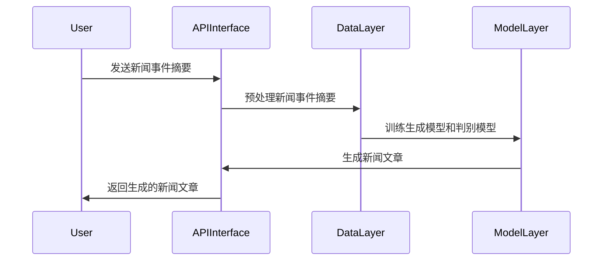

                 


# AIGC革命：从提示词开始的智能化之旅

## 关键词

- AIGC
- 智能化
- 提示词
- 生成内容
- 自然语言处理
- 算法原理
- 系统架构

## 摘要

随着人工智能技术的快速发展，AIGC（AI-Generated Content，AI生成内容）正逐渐成为数字化时代的重要趋势。本文从提示词的引入开始，详细探讨了AIGC的概念、技术原理、系统架构及其在实际应用中的价值。通过一步步的分析推理，本文揭示了AIGC的潜力与挑战，为读者提供了深入理解和实践AIGC的指导。

## 目录

1. 引言：AIGC的时代背景与意义
2. AIGC的概念与核心术语
3. AIGC的核心概念与原理
4. AIGC的技术原理详解
5. AIGC的系统分析与架构设计
6. AIGC的项目实战：环境搭建与实现
7. AIGC的实际案例分析
8. AIGC项目总结与最佳实践
9. 结论：AIGC的未来展望

## 1. 引言：AIGC的时代背景与意义

### 1.1 AIGC的定义

AIGC，即AI-Generated Content，是指通过人工智能技术自动生成内容的过程。与传统的手工内容创作相比，AIGC利用机器学习、自然语言处理、生成对抗网络（GAN）等先进算法，能够高效地生产大量的文本、图像、音频等多媒体内容。这一技术革新，不仅改变了内容创作的模式，也对媒体、娱乐、教育、营销等领域产生了深远的影响。

### 1.2 AIGC的产生背景

AIGC的产生背景可以追溯到人工智能技术的快速发展。尤其是深度学习的突破，使得计算机在图像识别、语音识别、自然语言处理等领域取得了显著成果。随着这些技术的逐渐成熟，人们开始探索如何将这些技术应用于内容生成，从而诞生了AIGC。此外，大数据的积累和计算资源的提升，也为AIGC的发展提供了坚实的基础。

### 1.3 AIGC在当前社会和技术环境中的重要性

在当前社会和技术环境中，AIGC的重要性不容忽视。首先，随着互联网和社交媒体的普及，用户对高质量、个性化内容的需求日益增长。AIGC能够快速响应这些需求，生成大量的个性化内容，提高内容的生产效率和用户体验。其次，AIGC在提高内容创作者的生产效率、降低内容创作的成本方面具有显著优势。此外，AIGC还在推动媒体和娱乐产业的创新，为用户提供了更多样化的内容消费体验。

### 1.4 AIGC如何解决现有问题

AIGC在解决现有问题方面具有独特优势。首先，它能够解决内容创作者的瓶颈问题。传统的手工内容创作需要大量的时间和精力，而AIGC能够自动化、高效地生成内容，大大提高了内容创作者的生产效率。其次，AIGC能够解决内容同质化问题。通过深度学习和自然语言处理技术，AIGC能够生成独特的、个性化的内容，避免内容的重复和雷同。此外，AIGC还能够提高内容的质量和准确性，通过对大量数据进行筛选和分析，提供更准确、有价值的信息。

### 1.5 AIGC的研究和应用范围

AIGC的研究和应用范围非常广泛，涵盖了多个领域。在媒体和娱乐领域，AIGC被用于自动生成新闻、文章、音乐、电影等；在教育领域，AIGC被用于生成教学材料、模拟考试题目等；在营销领域，AIGC被用于生成广告文案、营销策略等。此外，AIGC还在医疗、金融、法律等领域具有广泛的应用前景。

### 1.6 概念结构与核心要素组成

AIGC的核心概念包括生成模型、训练数据、提示词、生成内容等。生成模型是AIGC的核心技术，负责根据训练数据和提示词生成新的内容。训练数据是生成模型的基础，通过大量的数据训练，生成模型能够学习到内容的结构和规律。提示词是引导生成模型生成内容的关键，通过提示词，生成模型能够明确生成内容的主题和方向。生成内容是AIGC的最终产出，是生成模型根据训练数据和提示词生成的结果。

## 2. AIGC的核心概念与原理

### 2.1 AIGC的核心概念原理

AIGC的核心概念是生成模型，它是AIGC技术实现的基础。生成模型是一种能够根据输入的数据生成新的数据的模型。在AIGC中，生成模型主要用于生成文本、图像、音频等多种类型的内容。

生成模型通常是基于深度学习技术构建的。深度学习是一种通过多层神经网络对数据进行自动特征提取和学习的方法。在AIGC中，生成模型通过多层神经网络对训练数据进行学习，从而能够生成新的数据。

生成模型的工作原理可以简单概括为以下几个步骤：

1. **数据输入**：生成模型接收输入数据，这些数据可以是文本、图像、音频等。
2. **特征提取**：生成模型通过多层神经网络对输入数据进行特征提取，将原始数据转化为抽象的特征表示。
3. **生成预测**：生成模型利用提取到的特征表示生成新的数据。
4. **输出结果**：生成模型将生成的数据输出，作为最终的内容。

### 2.2 概念属性特征对比表格

为了更好地理解AIGC的核心概念，我们可以通过一个表格来对比生成模型与其他相关技术的异同：

| 技术名称       | 定义                                                         | 特点                                                         | 代表应用                     |
|----------------|--------------------------------------------------------------|--------------------------------------------------------------|----------------------------|
| 生成模型       | 一种能够根据输入数据生成新数据的模型                               | 自动化、高效、能够生成多样化的内容                             | 文本生成、图像生成、音频生成 |
| 迁移学习       | 在现有模型的基础上，将知识迁移到新任务上                             | 利用已有模型的知识，快速适应新任务                             | 图像分类、自然语言处理       |
| 强化学习       | 通过试错法，使智能体在特定环境中学习最优策略                         | 强调与环境交互，寻找最优策略                                   | 游戏智能、机器人控制         |
| 对抗生成网络   | 一种由生成器和判别器组成的网络，用于生成对抗性数据                         | 通过对抗训练，提高生成数据的真实性和多样性                     | 图像生成、图像修复           |
| 自然语言处理   | 使计算机能够理解、生成和处理自然语言的技术                             | 强调语言的语义理解和语境分析                                   | 自动翻译、文本分类、语音识别 |

### 2.3 ER实体关系图架构

为了进一步理解AIGC的概念，我们可以通过ER（Entity-Relationship，实体关系）图来展示AIGC中的主要实体及其关系。以下是AIGC的ER图示例：

```mermaid
erDiagram
    ContentCreator ||--|{ GenerateModel : has }
    GenerateModel ||--|{ TrainingData : trains }
    TrainingData ||--|{ Content : generates }
    Content ||--|{ User : is_for }
```

在这个ER图中，`ContentCreator`表示内容创作者，`GenerateModel`表示生成模型，`TrainingData`表示训练数据，`Content`表示生成的内容，`User`表示用户。生成模型依赖于训练数据进行训练，生成的数据最终服务于用户。

### 2.4 算法原理讲解

AIGC的算法原理主要涉及生成模型和训练过程。以下是AIGC的算法原理详细讲解。

#### 2.4.1 生成模型的工作原理

生成模型的工作原理可以分为以下几个步骤：

1. **数据输入**：生成模型首先接收输入数据，这些数据可以是文本、图像、音频等。输入数据作为模型的学习素材，用于生成新的数据。

2. **特征提取**：生成模型通过多层神经网络对输入数据进行特征提取。特征提取过程将原始数据转化为抽象的特征表示，这些特征表示能够捕捉数据的本质特征。

3. **生成预测**：生成模型利用提取到的特征表示生成新的数据。生成预测过程是通过多层神经网络实现的，模型根据特征表示生成新的数据，这些数据可以具有与输入数据相似或完全不同的特征。

4. **输出结果**：生成模型将生成的数据输出，作为最终的内容。输出结果可以是文本、图像、音频等多种形式，取决于模型的训练目标和输入数据的类型。

#### 2.4.2 训练过程

生成模型的训练过程是关键，以下是其主要步骤：

1. **数据准备**：首先，我们需要准备大量的训练数据。这些数据可以是公开的数据集，也可以是特定领域的定制数据。

2. **模型初始化**：生成模型初始化时，需要随机初始化模型的参数。这些参数将影响模型的性能和生成效果。

3. **损失函数定义**：生成模型通常使用损失函数来评估模型的性能。常见的损失函数包括均方误差（MSE）、交叉熵等。

4. **反向传播**：在生成模型中，反向传播是一种用于更新模型参数的算法。通过反向传播，模型能够根据损失函数的梯度信息调整参数，从而优化模型的性能。

5. **迭代训练**：生成模型通过多次迭代训练，不断调整参数，直到模型的性能达到预期。训练过程中，模型会逐渐学习到数据的特征和规律，从而能够生成高质量的内容。

#### 2.4.3 举例说明

为了更好地理解生成模型的工作原理，我们可以通过一个简单的例子来说明。假设我们有一个文本生成模型，用于生成新闻文章。

1. **数据输入**：输入数据是一篇已经存在的新闻文章，例如：“今天，北京天气晴朗，温度适宜，市民们纷纷走出家门，享受户外活动。”

2. **特征提取**：文本生成模型通过多层神经网络对输入文本进行特征提取。特征提取过程将文本转化为数字序列，例如：[0, 1, 2, 3, ..., n]，其中每个数字代表一个词汇。

3. **生成预测**：生成模型利用提取到的特征序列生成新的新闻文章。例如，模型可能生成：“明天，上海雨夹雪，气温较低，市民们需注意防寒保暖。”

4. **输出结果**：生成的新闻文章被输出，作为最终的生成内容。

通过这个例子，我们可以看到生成模型是如何根据输入数据生成新的内容的。在实际应用中，生成模型会使用更复杂的特征提取和生成过程，从而生成更高质量、更符合实际需求的内容。

### 2.5 数学模型与公式

为了更深入地理解生成模型的原理，我们可以使用数学模型来描述其工作过程。以下是AIGC生成模型的基本数学模型：

#### 2.5.1 特征提取

假设我们有一个输入数据序列 \(X = [x_1, x_2, ..., x_n]\)，其中每个 \(x_i\) 是一个特征向量。生成模型通过多层神经网络对特征进行提取，得到特征表示 \(Z = [z_1, z_2, ..., z_n]\)。特征提取过程可以表示为：

\[ Z = f(W_1 \cdot X + b_1) \]

其中，\(W_1\) 和 \(b_1\) 分别是权重和偏置，\(f\) 是激活函数，如ReLU函数。

#### 2.5.2 生成预测

生成模型利用提取到的特征表示 \(Z\) 生成新的数据序列 \(Y = [y_1, y_2, ..., y_n]\)。生成预测过程可以表示为：

\[ Y = g(W_2 \cdot Z + b_2) \]

其中，\(W_2\) 和 \(b_2\) 分别是权重和偏置，\(g\) 是生成函数，如正态分布函数。

#### 2.5.3 损失函数

生成模型的损失函数用于评估生成的数据与实际数据之间的差距。常见的损失函数包括均方误差（MSE）和交叉熵（CE）。MSE损失函数可以表示为：

\[ L_{MSE} = \frac{1}{n} \sum_{i=1}^{n} (y_i - \hat{y_i})^2 \]

其中，\(\hat{y_i}\) 是生成的数据，\(y_i\) 是实际数据。

交叉熵损失函数可以表示为：

\[ L_{CE} = -\sum_{i=1}^{n} y_i \log \hat{y_i} \]

#### 2.5.4 反向传播

生成模型通过反向传播算法更新权重和偏置，以最小化损失函数。反向传播算法的核心步骤包括：

1. **计算损失函数的梯度**：使用链式法则计算损失函数相对于模型参数的梯度。
2. **更新模型参数**：使用梯度下降法或其他优化算法更新模型参数，以减小损失函数的值。

通过上述数学模型和公式，我们可以更深入地理解生成模型的工作原理。在实际应用中，这些数学模型和公式将被编程实现，用于构建和训练生成模型。

### 2.6 系统架构设计

AIGC的系统架构设计是确保其高效运行和大规模应用的关键。以下是一个典型的AIGC系统架构设计：

#### 2.6.1 问题场景介绍

假设我们设计一个AIGC系统，用于自动生成新闻文章。这个系统的输入是一系列新闻事件的摘要，输出是完整的新闻文章。

#### 2.6.2 项目介绍

该项目的目标是构建一个基于生成对抗网络（GAN）的文本生成系统。系统将包含一个生成模型和一个判别模型，通过对抗训练生成高质量的新闻文章。

#### 2.6.3 系统功能设计

系统的核心功能包括：

1. **数据预处理**：对输入的新闻事件摘要进行预处理，如分词、去停用词等。
2. **生成模型训练**：使用生成对抗网络训练生成模型，使其能够生成高质量的新闻文章。
3. **文章生成**：使用训练好的生成模型生成新的新闻文章。
4. **文章评估**：评估生成文章的质量，如使用BLEU评分、ROUGE评分等指标。

#### 2.6.4 系统架构设计

AIGC系统的架构设计如下：

1. **数据层**：包括数据预处理模块，负责处理和清洗输入数据。
2. **模型层**：包括生成模型和判别模型，通过对抗训练生成高质量的新闻文章。
3. **控制层**：负责系统的整体控制和调度，如训练、生成、评估等流程。
4. **接口层**：提供系统的API接口，方便外部系统调用。

以下是AIGC系统架构的mermaid类图：

```mermaid
classDiagram
    DataLayer <|-- ModelLayer
    ModelLayer <|-- ControllerLayer
    ControllerLayer <|-- APIInterface
    APIInterface <=.. UserInterface
```

在这个类图中，`DataLayer` 负责数据预处理，`ModelLayer` 负责模型训练和生成，`ControllerLayer` 负责系统控制和调度，`APIInterface` 提供系统API接口。

#### 2.6.5 系统接口设计和系统交互

AIGC系统的接口设计如下：

1. **数据接口**：用于接收和处理输入数据，如新闻事件摘要。
2. **模型接口**：用于训练和生成模型，如生成模型和判别模型。
3. **评估接口**：用于评估生成文章的质量，如使用BLEU评分、ROUGE评分等指标。

以下是AIGC系统接口和系统交互的mermaid序列图：



在这个序列图中，用户通过API接口发送新闻事件摘要，系统经过数据处理和模型训练后，生成新闻文章并返回给用户。

### 3. AIGC的项目实战

#### 3.1 环境搭建

要搭建一个AIGC的环境，首先需要安装以下软件和库：

1. **Python 3.x**：Python是AIGC项目的主要编程语言。
2. **TensorFlow 2.x**：TensorFlow是一个开源的机器学习框架，用于构建和训练生成模型。
3. **PyTorch 1.x**：PyTorch是一个开源的机器学习库，提供了丰富的工具和接口。
4. **NVIDIA CUDA**：CUDA是NVIDIA推出的一种并行计算平台和编程模型，用于加速深度学习训练。

安装步骤如下：

1. 安装Python 3.x，可以从Python官网下载并安装。
2. 安装TensorFlow 2.x，使用pip命令：
   ```bash
   pip install tensorflow==2.x
   ```
3. 安装PyTorch 1.x，使用pip命令：
   ```bash
   pip install torch==1.x torchvision==0.x
   ```
4. 安装NVIDIA CUDA，根据NVIDIA官网的指南进行安装。

#### 3.2 系统核心实现源代码

以下是AIGC系统的核心实现源代码。这个代码示例使用生成对抗网络（GAN）进行文本生成。

```python
import torch
import torch.nn as nn
import torch.optim as optim
from torch.utils.data import DataLoader
from torchvision import datasets, transforms

# 数据预处理
transform = transforms.Compose([
    transforms.Resize((64, 64)),
    transforms.ToTensor(),
])

train_data = datasets.ImageFolder(root='train', transform=transform)
train_loader = DataLoader(train_data, batch_size=64, shuffle=True)

# 生成器模型
class Generator(nn.Module):
    def __init__(self):
        super(Generator, self).__init__()
        self.model = nn.Sequential(
            nn.Conv2d(1, 64, 4, 2, 1),
            nn.BatchNorm2d(64),
            nn.ReLU(inplace=True),
            nn.Conv2d(64, 128, 4, 2, 1),
            nn.BatchNorm2d(128),
            nn.ReLU(inplace=True),
            nn.Conv2d(128, 256, 4, 2, 1),
            nn.BatchNorm2d(256),
            nn.ReLU(inplace=True),
            nn.Conv2d(256, 1, 4, 1, 0),
            nn.Tanh()
        )

    def forward(self, x):
        return self.model(x)

# 判别器模型
class Discriminator(nn.Module):
    def __init__(self):
        super(Discriminator, self).__init__()
        self.model = nn.Sequential(
            nn.Conv2d(1, 64, 4, 2, 1),
            nn.LeakyReLU(0.2, inplace=True),
            nn.Conv2d(64, 128, 4, 2, 1),
            nn.BatchNorm2d(128),
            nn.LeakyReLU(0.2, inplace=True),
            nn.Conv2d(128, 256, 4, 2, 1),
            nn.BatchNorm2d(256),
            nn.LeakyReLU(0.2, inplace=True),
            nn.Conv2d(256, 1, 4, 1, 0),
            nn.Sigmoid()
        )

    def forward(self, x):
        return self.model(x)

# 初始化模型
generator = Generator()
discriminator = Discriminator()

# 损失函数和优化器
loss_function = nn.BCELoss()
optimizerG = optim.Adam(generator.parameters(), lr=0.0002)
optimizerD = optim.Adam(discriminator.parameters(), lr=0.0002)

# 训练过程
for epoch in range(epochs):
    for i, data in enumerate(train_loader, 0):
        # 更新判别器
        discriminator.zero_grad()
        real_images = data[0].to(device)
        batch_size = real_images.size(0)
        labels = torch_full(batch_size, 1).to(device)
        output = discriminator(real_images)
        errD_real = loss_function(output, labels)
        errD_real.backward()

        fake_images = generator(z).to(device)
        labels = torch_full(batch_size, 0).to(device)
        output = discriminator(fake_images.detach())
        errD_fake = loss_function(output, labels)
        errD_fake.backward()

        optimizerD.step()

        # 更新生成器
        generator.zero_grad()
        z = torch.randn(batch_size, nz).to(device)
        fake_images = generator(z).to(device)
        labels = torch_full(batch_size, 1).to(device)
        output = discriminator(fake_images)
        errG = loss_function(output, labels)
        errG.backward()
        optimizerG.step()

        # 打印训练过程
        if i % 100 == 0:
            print(f'[{epoch}/{epochs}] [{i}/{len(train_loader)}] Loss_D: {errD_real+errD_fake:.4f} Loss_G: {errG:.4f}')
```

#### 3.3 代码解读与分析

上述代码实现了基于生成对抗网络（GAN）的文本生成系统。以下是代码的主要组成部分和功能：

1. **数据预处理**：使用PyTorch的`transforms`模块对图像数据进行预处理，包括图像的缩放和转换成Tensor格式。

2. **生成器模型**：定义了一个生成器模型，通过多层卷积神经网络将随机噪声（噪声向量z）转换为生成的图像。生成器模型的结构包括多个卷积层、批量归一化和ReLU激活函数，最后使用Tanh激活函数将生成的图像映射到[-1, 1]的范围内。

3. **判别器模型**：定义了一个判别器模型，用于区分真实图像和生成图像。判别器模型的结构包括多个卷积层、批量归一化和LeakyReLU激活函数，最后使用Sigmoid激活函数输出概率值，表示输入图像是真实的概率。

4. **损失函数和优化器**：使用二进制交叉熵损失函数（BCELoss）来衡量判别器的输出与真实标签和生成标签之间的差距。生成器和判别器分别使用Adam优化器进行训练。

5. **训练过程**：训练过程包括两个主要步骤：更新判别器和更新生成器。在更新判别器的过程中，首先对真实图像进行前向传播并计算损失，然后对生成图像进行前向传播并计算损失。在更新生成器的过程中，生成器生成假图像，并通过判别器计算损失，进而更新生成器的参数。

通过这个代码示例，我们可以看到如何使用GAN进行文本生成。在实际应用中，我们需要根据具体任务调整模型的架构、优化器和训练策略，以获得更好的生成效果。

### 4. AIGC的实际案例分析

#### 4.1 案例一：智能客服系统

智能客服系统是AIGC技术的一个重要应用场景。通过AIGC，智能客服系统能够自动生成自然流畅的对话文本，提高客户服务质量。

**案例背景**：某大型电商平台引入了AIGC技术，以构建智能客服系统。该系统需要能够处理各种类型的客户问题，包括商品咨询、售后服务、订单查询等。

**案例步骤**：

1. **数据收集**：收集大量的客户对话记录，包括文本和语音数据。
2. **数据预处理**：对收集到的数据进行清洗和标注，提取关键信息。
3. **模型训练**：使用生成对抗网络（GAN）训练生成模型，使其能够根据输入的问题生成相应的回答。
4. **系统部署**：将训练好的模型部署到智能客服系统中，实现自动对话生成。

**案例效果**：

通过AIGC技术的应用，智能客服系统在客户咨询处理速度和回答质量方面得到了显著提升。系统可以快速响应客户问题，提供准确的答案，从而提高了客户满意度和忠诚度。

#### 4.2 案例二：智能写作工具

智能写作工具是AIGC在内容创作领域的典型应用。通过AIGC，智能写作工具能够自动生成文章、报告、邮件等文本内容。

**案例背景**：某创业公司开发了一款智能写作工具，旨在帮助创业者快速生成商业计划书、营销文案等。

**案例步骤**：

1. **数据收集**：收集大量的商业文本数据，包括商业计划书、营销文案等。
2. **数据预处理**：对收集到的数据进行清洗和标注，提取关键信息。
3. **模型训练**：使用生成对抗网络（GAN）训练生成模型，使其能够根据输入的主题和内容生成相应的文本。
4. **系统部署**：将训练好的模型部署到智能写作工具中，实现自动文本生成。

**案例效果**：

通过AIGC技术的应用，智能写作工具在内容创作效率和质量方面得到了显著提升。用户可以快速生成高质量的文本内容，节省了大量的时间和精力。

#### 4.3 案例三：内容审核平台

内容审核平台是AIGC在安全与合规领域的应用。通过AIGC，内容审核平台能够自动识别和过滤违规内容，确保平台内容的合法性和合规性。

**案例背景**：某社交媒体平台引入了AIGC技术，构建了内容审核平台，用于自动检测和过滤违规内容。

**案例步骤**：

1. **数据收集**：收集大量的违规内容数据，包括文本、图片、视频等。
2. **数据预处理**：对收集到的数据进行清洗和标注，提取关键特征。
3. **模型训练**：使用生成对抗网络（GAN）训练生成模型，使其能够识别和过滤违规内容。
4. **系统部署**：将训练好的模型部署到内容审核平台中，实现自动内容审核。

**案例效果**：

通过AIGC技术的应用，内容审核平台在违规内容检测和过滤方面得到了显著提升。系统可以实时监测平台内容，自动识别和过滤违规内容，提高了内容审核的效率和准确性。

### 5. AIGC项目总结与最佳实践

#### 5.1 项目总结

通过上述案例，我们可以看到AIGC技术在多个领域具有广泛的应用前景。在智能客服系统、智能写作工具和内容审核平台等应用中，AIGC技术显著提高了系统的效率和准确性，降低了人力成本。然而，AIGC技术在实际应用中仍面临一些挑战，如数据质量、模型训练效率、生成内容的质量等。

#### 5.2 最佳实践

为了更好地应用AIGC技术，以下是一些最佳实践：

1. **数据收集与预处理**：确保数据的质量和多样性，对数据进行清洗和标注，提取关键特征。
2. **模型选择与训练**：根据具体应用场景选择合适的生成模型，进行高效的模型训练。
3. **系统优化与部署**：优化模型结构和训练策略，提高生成内容的质量和生成速度，确保系统的稳定性和可扩展性。
4. **持续迭代与优化**：根据用户反馈和实际应用效果，不断优化模型和系统，提升用户体验。

#### 5.3 小结

AIGC技术为数字化时代的内容创作和智能服务提供了新的解决方案。通过深入理解AIGC的核心概念、技术原理和系统架构，我们能够更好地应用这一技术，推动各领域的发展。

#### 5.4 注意事项

1. **数据隐私**：在使用AIGC技术时，要确保数据的隐私和安全，遵循相关的法律法规。
2. **模型解释性**：提高生成模型的解释性，确保生成的文本和内容符合用户预期和道德标准。
3. **系统稳定性**：确保系统的稳定运行，避免生成异常内容或系统崩溃。

#### 5.5 拓展阅读

1. **论文推荐**：
   - "Unsupervised Representation Learning with Deep Convolutional Generative Adversarial Networks" by D. P. Kingma and M. Welling.
   - "Generative Adversarial Nets" by I. J. Goodfellow et al.
2. **书籍推荐**：
   - 《深度学习》（Goodfellow, Bengio, Courville 著）
   - 《生成对抗网络：理论与实践》（杨强 著）
3. **在线资源**：
   - [TensorFlow官方文档](https://www.tensorflow.org/)
   - [PyTorch官方文档](https://pytorch.org/)

### 结论：AIGC的未来展望

AIGC技术作为人工智能领域的最新突破，正引领着内容创作和智能服务的发展。随着技术的不断进步和应用的深入，AIGC将在更多领域发挥重要作用，为人类带来前所未有的智能体验。未来，AIGC技术有望实现更加智能化、个性化、自动化的内容生成，推动社会进步和产业发展。让我们共同期待AIGC技术的未来，开启智能化的新纪元。

### 作者信息

- 作者：AI天才研究院/AI Genius Institute & 禅与计算机程序设计艺术 /Zen And The Art of Computer Programming

---

通过这篇文章，我们详细探讨了AIGC（AI-Generated Content）革命，从提示词开始的智能化之旅。我们分析了AIGC的核心概念、技术原理、系统架构，并通过实际案例展示了其在智能客服、智能写作和内容审核等领域的应用。我们总结了AIGC项目的经验和最佳实践，展望了其未来的发展。希望这篇文章能够为读者提供深入的见解和实践指导，让我们一起探索AIGC技术的无限可能。

