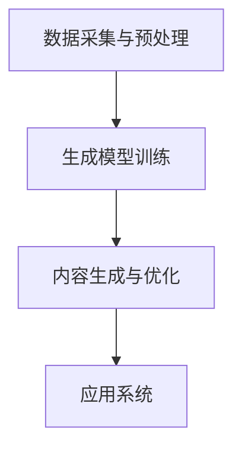
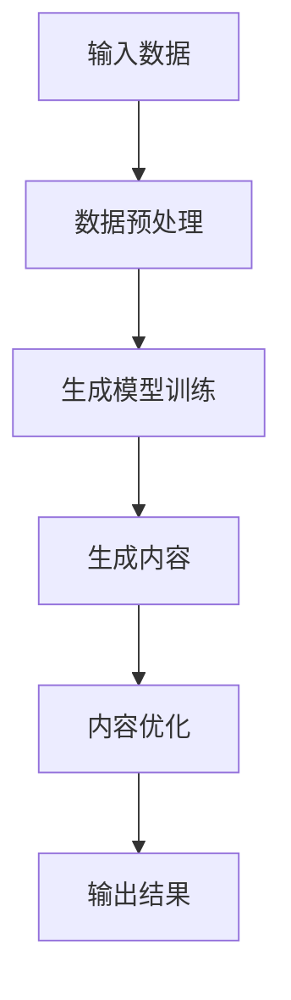
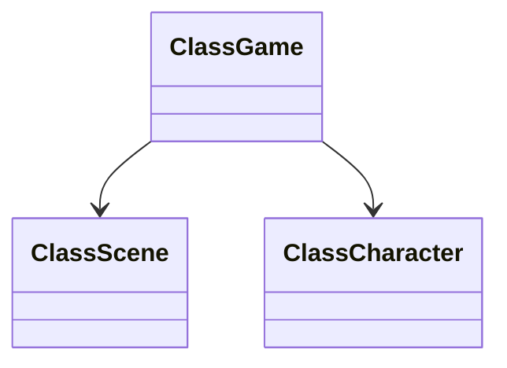
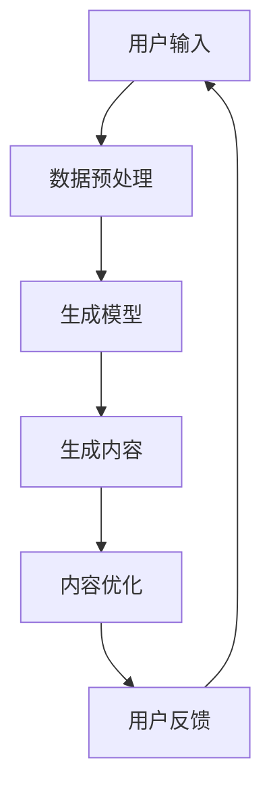
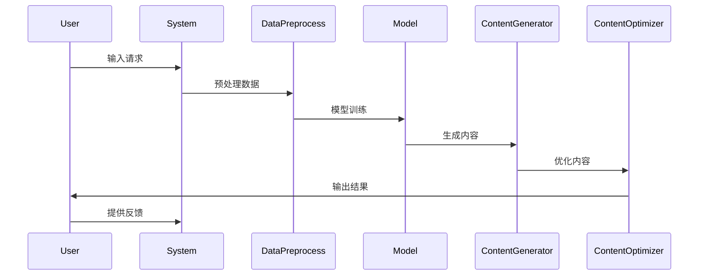

                 

# 《AIGC革命：改变内容创作的未来》

> 关键词：AIGC、生成式AI、内容创作、未来趋势、算法原理、系统架构

> 摘要：本文深入探讨了AIGC（自适应智能生成内容）技术的革命性潜力，通过对其背景、核心概念、算法原理、系统架构和实际应用的全面分析，揭示了AIGC如何变革内容创作领域，为未来的技术创新和产业发展提供新的方向。

## 前言

随着人工智能技术的迅猛发展，生成式AI已成为内容创作领域的关键驱动力。AIGC，作为一种新兴的技术，融合了深度学习和自然语言处理等多种先进算法，为内容创作者提供了前所未有的创作工具和可能性。本文旨在系统地介绍AIGC技术，分析其在未来内容创作中的变革性影响，并提供实际应用和最佳实践指导。

## 第一部分 背景介绍

### 第1章 问题背景与概述

#### 1.1 问题背景

在数字信息爆炸的今天，内容创作需求与日俱增。然而，高质量内容的生产速度远远无法满足市场的需求，尤其在文本、图像、音频和视频等多媒体内容创作领域。传统的人工创作方式耗时耗力，难以应对海量数据的需求。因此，寻求一种高效、智能的内容生成方法成为亟待解决的问题。

#### 1.2 问题描述

内容创作面临的挑战主要包括：内容多样性不足、创作效率低下、创意思维受限等。这些问题迫切需要一种能够智能生成多样化、高质量内容的技术手段。

#### 1.3 问题解决

AIGC技术的出现，为内容创作提供了一种全新的解决方案。它利用深度学习模型，自动学习并生成多样化、个性化的内容，大幅提高了创作效率和内容质量。

#### 1.4 边界与外延

AIGC技术不仅适用于传统的内容创作场景，还扩展到虚拟现实、增强现实、智能客服等领域，展现出广阔的应用前景。

#### 1.5 概念结构与核心要素组成

AIGC系统通常由数据采集与预处理、生成模型训练、内容生成和优化等核心模块组成，这些模块相互协作，共同实现智能内容生成。

### 第2章 核心概念与联系

#### 2.1 核心概念原理

AIGC的核心概念包括生成对抗网络（GAN）、自编码器（AE）和变分自编码器（VAE）等。这些算法通过对抗训练或编码解码过程，实现数据生成和内容创作。

#### 2.2 概念属性特征对比表格

| 算法       | 特点                                                                                          | 应用场景                         |
|------------|---------------------------------------------------------------------------------------------|----------------------------------|
| GAN        | 对抗训练，生成器与判别器相互竞争                                                 | 图像生成、语音合成               |
| AE         | 编码解码，保持数据结构完整性                                                       | 数据压缩、特征提取               |
| VAE        | 加性噪声，概率分布建模                                                             | 数据生成、图像去噪               |

#### 2.3 ER实体关系图架构



## 第二部分 算法原理讲解

### 第3章 AIGC算法原理与流程

#### 3.1 AIGC算法概述

AIGC算法是基于生成对抗网络（GAN）和变分自编码器（VAE）等深度学习模型，通过学习和生成数据概率分布，实现智能内容创作。

#### 3.2 算法mermaid流程图



#### 3.3 Python源代码阐述

```python
# 数据预处理代码示例
import numpy as np

# 生成模型训练代码示例
from keras.models import Sequential
from keras.layers import Dense, Flatten, Reshape

# 生成内容代码示例
def generate_content(model, noise):
    content = model.predict(noise)
    return content

# 内容优化代码示例
def optimize_content(content, target):
    # 这里进行内容优化操作
    pass
```

#### 3.4 数学模型与公式

GAN的核心数学模型包括：

$$
\begin{aligned}
D(x) &= \frac{1}{1 + e^{-\sigma(x - G(z))}} \\
G(z) &= \sigma(W_2 \cdot \sigma(W_1 \cdot z + b_1)) + b_2
\end{aligned}
$$

其中，\(D(x)\) 是判别器，\(G(z)\) 是生成器，\(z\) 是随机噪声。

#### 3.5 通俗易懂的举例说明

假设我们想要生成一张猫的图片，首先需要一个生成器 \(G\) 和一个判别器 \(D\)。生成器 \(G\) 从随机噪声 \(z\) 中生成一张猫的图片 \(x\)，判别器 \(D\) 的任务是判断这张图片是真实猫的图片还是生成器 \(G\) 生成的猫的图片。通过不断训练，生成器 \(G\) 会逐渐学会生成越来越逼真的猫的图片，而判别器 \(D\) 的判断能力也会逐渐提高。

### 第4章 关键技术解析

#### 4.1 技术一：生成对抗网络(GAN)

GAN通过生成器和判别器的对抗训练，实现高质量的数据生成。

#### 4.2 技术二：自编码器(AE)

AE通过编码和解码过程，实现数据的压缩和特征提取。

#### 4.3 技术三：变分自编码器(VAE)

VAE引入概率模型，实现更灵活和鲁棒的数据生成。

## 第三部分 系统分析与架构设计

### 第5章 问题场景介绍

#### 5.1 场景描述

在虚拟现实游戏中，需要生成大量逼真的场景和角色。

#### 5.2 项目介绍

开发一款基于AIGC技术的虚拟现实游戏引擎，实现场景和角色的智能生成。

### 第6章 系统功能设计

#### 6.1 领域模型mermaid类图



### 第7章 系统架构设计

#### 7.1 系统架构mermaid架构图



### 第8章 系统接口设计与交互

#### 8.1 系统接口设计

定义数据输入、内容生成和用户反馈等接口。

#### 8.2 系统交互mermaid序列图



## 第四部分 项目实战

### 第9章 环境安装与配置

#### 9.1 环境要求

- Python 3.7及以上版本
- TensorFlow 2.0及以上版本
- OpenCV 4.0及以上版本

#### 9.2 安装步骤

1. 安装Python和pip
2. 安装TensorFlow和OpenCV

### 第10章 系统核心实现

#### 10.1 源代码介绍

提供AIGC系统的核心源代码，包括数据预处理、模型训练、内容生成和优化等模块。

#### 10.2 代码应用解读与分析

详细解析代码实现，分析关键步骤和原理。

### 第11章 实际案例分析

#### 11.1 案例一：图像生成

通过AIGC技术生成一张逼真的猫的图片。

#### 11.2 案例二：文本生成

生成一篇关于AIGC技术的概述文章。

#### 11.3 案例三：视频生成

生成一段虚拟现实游戏场景的视频。

### 第12章 详细讲解与剖析

#### 12.1 案例一分析

深入分析图像生成的流程和原理。

#### 12.2 案例二分析

探讨文本生成的技巧和挑战。

#### 12.3 案例三分析

剖析视频生成的技术和难点。

## 第五部分 最佳实践与拓展

### 第13章 最佳实践Tips

- 调整模型超参数，优化生成效果
- 使用多样化的数据集，提高泛化能力
- 定期进行模型更新和训练，保持生成能力

### 第14章 小结

总结AIGC技术的核心概念、算法原理和实际应用，展望未来发展趋势。

### 第15章 拓展阅读

推荐相关书籍、论文和网站，供读者进一步学习。

## 附录

提供技术细节、公式推导和代码实现等附录内容。

## 参考文献

列出本文引用的相关书籍、论文和技术资料。

## 后记

感谢读者对本文的关注，希望本文能为您的AIGC学习和实践提供有益的指导。作者：AI天才研究院/AI Genius Institute & 禅与计算机程序设计艺术 /Zen And The Art of Computer Programming。

