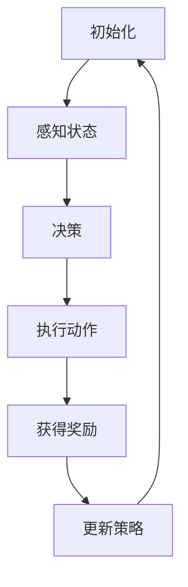
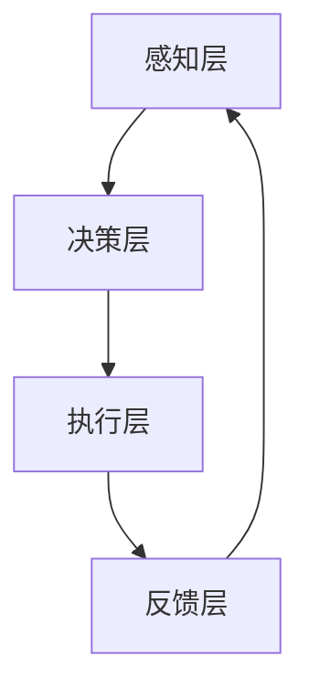
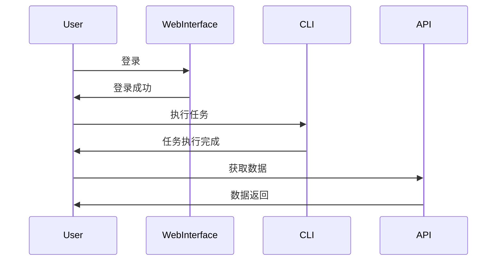
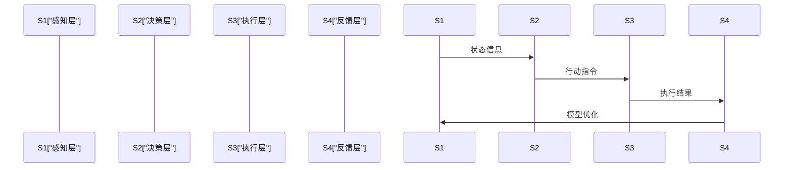

                 


## 关键词

AI代理、个人生产力、算法原理、系统架构、项目实战

## 摘要

本文深入探讨了AI代理在个人生产力提升中的作用。通过介绍AI代理的定义、工作原理和应用场景，本文阐述了AI代理如何通过自动化、智能化技术，提高个人工作效率和创造力。随后，本文详细讲解了AI代理的核心算法原理，包括流程图、源代码和数学模型，并通过实际案例展示其在具体场景中的应用效果。最后，本文总结了AI代理的最佳实践，并提供了一些建议和拓展阅读，以引导读者深入了解这一领域。

## 背景介绍

### AI代理的定义与核心特征

AI代理（Artificial Intelligence Agent），是指能够自主执行任务、与环境进行交互的智能体。它具有以下核心特征：

1. **自主性**：AI代理能够根据任务目标和环境信息，自主地做出决策和行动。
2. **适应性**：AI代理能够根据环境变化和反馈信息，调整自己的行为策略。
3. **协作性**：AI代理可以与其他代理或人类协作，共同完成任务。

AI代理广泛应用于多个领域，包括但不限于：

1. **教育**：AI代理可以为学生提供个性化的学习建议和辅导。
2. **办公**：AI代理可以协助人类完成文档整理、数据分析等任务。
3. **生活服务**：AI代理可以提供智能家居控制、健康监测等个性化服务。

### AI代理在个人生产力提升中的应用场景

AI代理在个人生产力提升中具有广泛的应用场景。以下是一些典型的应用实例：

1. **日程管理**：AI代理可以自动安排日程，提醒任务，提高时间利用率。
2. **文档处理**：AI代理可以自动化文档整理、翻译、校对等工作，减少人工工作量。
3. **数据分析**：AI代理可以快速处理大量数据，提取有价值的信息，辅助决策。
4. **学习辅助**：AI代理可以为学生提供个性化学习计划，提高学习效果。

### 本书的核心内容与目标读者

本书旨在系统地介绍AI代理在个人生产力提升中的应用，包括核心概念、算法原理、系统架构和实际项目案例。目标读者包括：

1. **计算机科学和人工智能领域的研究人员和工程师**：了解AI代理的基本原理和应用。
2. **企业管理者和决策者**：掌握如何利用AI代理提升个人和组织生产力。
3. **普通读者**：对AI代理感兴趣，希望了解其应用潜力的公众。

通过本书，读者可以全面了解AI代理在个人生产力提升中的作用，掌握相关的技术和应用方法，从而提升个人的工作效率和创造力。

### 核心概念与联系

#### AI代理的定义与核心特征

AI代理（Artificial Intelligence Agent）是一种能够执行特定任务的智能体，它能够在复杂的环境中自主行动，并与其他代理或环境进行交互。AI代理的核心特征包括：

1. **自主性**：AI代理具备自主决策和行动的能力，无需人工干预即可完成指定任务。
2. **适应性**：AI代理能够根据环境变化和反馈信息调整自己的行为策略，以适应不同的情境。
3. **协作性**：AI代理可以与其他AI代理或人类协同工作，共同完成复杂任务。
4. **学习性**：AI代理可以通过经验和数据不断学习和优化，提高任务执行效率。

#### AI代理的工作原理

AI代理的工作原理主要包括以下几个步骤：

1. **感知**：AI代理通过传感器收集环境信息，如文本、图像、声音等。
2. **决策**：根据收集到的信息，AI代理利用机器学习算法和规划技术进行决策，确定下一步行动。
3. **行动**：执行决策方案，进行实际的操作，如发送邮件、处理文档等。
4. **反馈**：观察行动的结果，获取环境反馈，用于后续的决策和优化。

#### AI代理在个人生产力提升中的应用案例

AI代理在个人生产力提升中有着广泛的应用，以下是一些典型的案例：

1. **日程管理**：AI代理可以帮助用户自动安排日程，发送提醒，提高时间管理效率。
2. **文档处理**：AI代理可以自动化文档的整理、翻译、校对等工作，减轻人工负担。
3. **数据分析**：AI代理可以快速处理大量数据，提取有价值的信息，辅助决策。
4. **学习辅助**：AI代理可以为学生提供个性化学习建议，提高学习效果。

#### AI代理与其他相关技术的联系与区别

AI代理与其他相关技术的联系和区别如下：

1. **AI代理与机器人的联系与区别**：
   - **联系**：机器人是AI代理的一种实现形式，它们都可以在物理环境中执行任务。
   - **区别**：机器人通常具有更复杂的物理结构和行动能力，而AI代理更侧重于决策和交互能力。

2. **AI代理与自动化工具的联系与区别**：
   - **联系**：AI代理和自动化工具都可以用于自动化执行任务。
   - **区别**：AI代理具备自主学习和适应性，能够根据环境和任务动态调整行为，而自动化工具通常需要人工设定规则和流程。

3. **AI代理与虚拟助手的联系与区别**：
   - **联系**：虚拟助手通常是一种AI代理，它们都通过语音、文本等方式与用户进行交互。
   - **区别**：虚拟助手更侧重于提供信息和解答疑问，而AI代理的功能更为广泛，可以执行复杂的任务和决策。

通过上述分析，我们可以看到AI代理在个人生产力提升中的重要性。它们不仅能够提高工作效率，还能带来更多的创新和便利。接下来，本文将深入探讨AI代理的核心算法原理，以帮助读者更好地理解和应用这一技术。

### AI代理的基本原理

#### 问题背景

在信息化和智能化的时代，如何高效地提升个人生产力成为了一个重要课题。AI代理作为一种智能化的解决方案，其核心在于通过自主决策和自适应行动，实现任务的自动化和优化。因此，了解AI代理的基本原理，对于应用这一技术具有重要意义。

#### 问题描述

AI代理的基本原理涉及多个方面，包括感知、决策、行动和反馈等。下面我们将详细讨论这些问题。

##### 1. 感知

AI代理的感知是指通过传感器或数据接口获取环境信息。这些信息可以是文本、图像、声音等多种形式。感知是AI代理行动的前提，只有准确感知环境，才能做出合理的决策。

##### 2. 决策

决策是AI代理的核心功能。根据感知到的环境信息，AI代理利用算法和模型进行推理和决策。常见的决策算法包括基于规则的推理、机器学习、深度学习等。

##### 3. 行动

决策生成后，AI代理会执行具体的行动。这些行动可以是自动化任务，如发送邮件、处理文档，也可以是与环境的交互，如控制机器人执行动作。

##### 4. 反馈

行动后，AI代理会获取反馈信息，用于评估决策效果和调整后续行为。反馈机制是AI代理学习的重要途径，通过不断迭代和优化，AI代理能够不断提高任务执行的准确性和效率。

#### 问题解决

为了解决上述问题，AI代理通常需要以下几个关键步骤：

1. **环境建模**：建立环境模型，包括任务的描述、资源的配置和约束条件等。
2. **感知机制**：设计感知机制，收集和处理环境信息。
3. **决策算法**：选择合适的决策算法，如基于规则的推理、机器学习、深度学习等，根据感知到的信息进行决策。
4. **行动执行**：根据决策结果执行具体的行动，实现任务的自动化。
5. **反馈优化**：获取行动反馈，评估决策效果，优化决策模型和行动策略。

#### 边界与外延

在具体应用中，AI代理需要考虑边界和约束条件，如任务的紧急程度、资源的可用性、环境的稳定性等。这些边界和约束会影响AI代理的决策和行动。

此外，AI代理的外延还包括与其他系统的集成，如数据库、网络等。通过与其他系统的交互，AI代理可以实现更复杂的任务和功能。

#### 概念结构与核心要素组成

AI代理的概念结构包括以下几个核心要素：

1. **传感器**：负责感知环境信息的组件。
2. **处理器**：负责决策和推理的核心组件。
3. **执行器**：负责执行决策结果的组件。
4. **反馈机制**：负责评估决策效果和优化行为的组件。

这些要素相互协作，共同实现AI代理的功能。

通过上述讨论，我们可以看到AI代理的基本原理是如何通过感知、决策、行动和反馈实现任务自动化的。理解这些基本原理，有助于我们在实际应用中更好地设计和优化AI代理系统，从而提升个人生产力。

### AI代理的应用领域

AI代理在现代社会中有着广泛的应用，覆盖了多个领域，极大地提升了个人生产力和生活质量。以下是AI代理在一些主要应用领域的详细介绍。

#### 教育与学习

在教育与学习领域，AI代理可以为学生提供个性化学习体验。例如，通过分析学生的学习数据，AI代理可以为学生推荐合适的学习资源，调整学习计划，甚至预测学生的成绩。此外，AI代理还可以辅助教师进行课堂管理，如自动批改作业、生成教学反馈等，减轻教师的工作负担。

#### 工作与办公

在工作与办公领域，AI代理能够显著提升工作效率。例如，通过电子邮件管理、日程安排和任务分配，AI代理可以自动处理大量办公事务，节省工作时间。此外，AI代理还可以在数据分析、文档处理和项目管理等方面提供支持，帮助企业更好地管理和利用资源。

#### 生活与娱乐

在生活与娱乐领域，AI代理可以提供个性化服务，如智能家居控制、健康监测和购物推荐等。例如，通过智能音箱，AI代理可以控制家居设备、播放音乐、提供天气预报等。在健康监测方面，AI代理可以通过收集和分析个人健康数据，提供个性化的健康建议和预警。在娱乐方面，AI代理可以根据用户的喜好推荐音乐、电影和游戏，提升娱乐体验。

#### 其他应用领域

除了上述主要领域，AI代理还在其他多个领域有着广泛应用。例如，在医疗领域，AI代理可以辅助医生进行诊断和治疗决策；在金融领域，AI代理可以用于风险评估、投资策略和客户服务；在交通领域，AI代理可以用于智能交通管理和自动驾驶。这些应用不仅提升了个人生产力，还带来了更多的便利和创新。

通过这些实际案例，我们可以看到AI代理在提升个人生产力方面的巨大潜力。随着技术的不断进步，AI代理的应用将更加广泛，为人们的生活带来更多的变化和便利。

### AI代理与相关技术对比

在探讨AI代理的相关技术对比时，我们需要将AI代理与机器人、自动化工具和虚拟助手进行详细比较，以突出AI代理的独特优势和应用场景。

#### AI代理与机器人的对比

1. **定义和特征**：
   - **AI代理**：具备自主决策、适应性和协作性的智能体，能在复杂环境中执行任务。
   - **机器人**：具有物理形态，能够执行特定任务的自动化设备，通常通过预设的程序进行操作。

2. **区别**：
   - **自主性**：机器人通常受限于预设的程序，不具备自主决策能力；而AI代理通过机器学习和自适应算法，能够自主地做出决策。
   - **环境适应性**：机器人通常在特定环境中工作，如工业生产线或家庭环境，而AI代理可以在多种环境中灵活应用，不受物理形态限制。
   - **任务范围**：机器人专注于执行物理任务，如搬运、装配等；AI代理则可以处理更为复杂的信息处理和决策任务。

#### AI代理与自动化工具的对比

1. **定义和特征**：
   - **AI代理**：结合了人工智能技术的智能体，能够自主决策和适应环境变化。
   - **自动化工具**：通过预设规则和程序，自动化执行特定任务的工具。

2. **区别**：
   - **智能程度**：AI代理具备自我学习和适应能力，能够根据任务需求和环境反馈动态调整行为；自动化工具则主要依赖固定的规则和流程。
   - **任务复杂性**：AI代理可以处理复杂的任务和决策，而自动化工具通常适用于简单、重复性的工作。
   - **交互方式**：AI代理可以通过自然语言交互，而自动化工具通常通过界面或脚本进行操作。

#### AI代理与虚拟助手的对比

1. **定义和特征**：
   - **AI代理**：具备自主性和适应性的智能体，能够在复杂环境中执行任务。
   - **虚拟助手**：通过语音或文本交互，提供信息查询、任务提醒等服务的智能系统。

2. **区别**：
   - **功能范围**：AI代理可以执行更复杂的任务，如数据分析、自动化工作流程等；虚拟助手主要提供信息查询和基础服务。
   - **交互方式**：AI代理通常通过复杂的决策和任务执行与用户交互，而虚拟助手主要通过自然语言交互。
   - **依赖性**：AI代理能够独立执行任务，而虚拟助手通常需要与用户或第三方系统进行交互。

通过上述对比，我们可以看到AI代理在自主性、适应性和任务处理能力方面具有显著优势。AI代理能够更好地适应复杂多变的环境，执行多样化的任务，从而在个人生产力提升中发挥重要作用。

### AI代理算法原理

为了更好地理解AI代理在个人生产力提升中的作用，我们需要详细探讨其核心算法原理。以下是AI代理算法的原理讲解，包括算法流程图、Python源代码实现、数学模型和公式，以及通俗易懂的举例说明。

#### 算法原理讲解

AI代理的算法原理主要基于强化学习（Reinforcement Learning），这是一种让机器通过与环境交互来学习最优策略的方法。强化学习的核心是奖励机制，通过奖励来引导代理选择最优行动。

##### 算法流程：

1. **初始化**：设定环境状态、动作空间和奖励函数。
2. **感知状态**：AI代理感知当前环境状态。
3. **决策**：根据当前状态和经验，选择最优动作。
4. **执行动作**：执行选择的动作，并产生新的状态。
5. **获得奖励**：根据新状态和预期奖励，更新代理的行为策略。
6. **重复**：回到第二步，不断迭代，直到达到预期目标。

#### 算法流程图

以下是AI代理算法的mermaid流程图：



#### Python源代码实现

以下是一个简化的Python代码示例，用于实现强化学习算法的基本框架：

```python
import numpy as np

# 初始化参数
state_space = 10
action_space = 5
learning_rate = 0.1
discount_factor = 0.9

# 奖励函数
reward_function = lambda state, action: (state - action) ** 2

# Q值表
Q = np.zeros((state_space, action_space))

# 更新Q值
def update_Q(state, action, reward, next_state):
    Q[state][action] = Q[state][action] + learning_rate * (reward + discount_factor * np.max(Q[next_state]) - Q[state][action])

# 选择动作
def choose_action(state):
    return np.argmax(Q[state])

# 主循环
for episode in range(1000):
    state = np.random.randint(0, state_space)
    while True:
        action = choose_action(state)
        next_state = (state + action) % state_space
        reward = reward_function(state, action)
        update_Q(state, action, reward, next_state)
        state = next_state
```

#### 数学模型与公式

强化学习的主要数学模型是Q-learning算法，其核心公式如下：

$$
Q(s, a) = Q(s, a) + \alpha \left( r + \gamma \max_{a'} Q(s', a') - Q(s, a) \right)
$$

其中：
- \( Q(s, a) \)：在状态\( s \)下执行动作\( a \)的期望回报。
- \( \alpha \)：学习率。
- \( r \)：立即奖励。
- \( \gamma \)：折扣因子。
- \( s' \)：执行动作后的新状态。
- \( a' \)：在状态\( s' \)下的最优动作。

#### 通俗易懂的举例说明

假设有一个简单的环境，状态空间为0到9，动作空间为0到4。奖励函数为在当前状态和动作差值的平方。通过上述代码示例，我们可以模拟AI代理在该环境中的学习过程。

1. **初始化**：设定学习率和折扣因子，初始化Q值表。
2. **感知状态**：随机选择初始状态。
3. **决策**：根据当前状态选择最优动作（例如，状态为3时选择动作2）。
4. **执行动作**：更新状态（例如，从状态3更新到状态5）。
5. **获得奖励**：计算当前状态和动作的奖励（例如，\( (3-2)^2 = 1 \)）。
6. **更新策略**：根据奖励更新Q值表。

通过多次迭代，AI代理会逐渐学会在特定状态下选择最优动作，从而在环境中获得更高的回报。

通过上述讲解，我们可以看到AI代理算法原理的复杂性及其在实际应用中的潜力。理解这些原理，有助于我们更好地设计和优化AI代理系统，提升个人生产力。

### AI代理系统构建

#### 问题场景介绍

在现代企业和个人工作中，面对海量的数据和复杂的多任务处理，如何高效地管理和利用资源成为了一项挑战。为了解决这一问题，本文将介绍一个AI代理系统，该系统能够自动化处理日常任务，提高个人和生产力的效率。

#### 项目介绍

本AI代理系统名为“智能助手AI”，其主要目标是自动化处理日程管理、文档处理、数据分析和个人学习任务。通过该系统，用户可以轻松安排日程、自动化文档整理、快速处理数据，并获取个性化的学习建议。

#### 系统功能设计

“智能助手AI”系统包括以下几个核心功能模块：

1. **日程管理**：自动安排和提醒日程事件，提供高效的时间管理。
2. **文档处理**：自动化文档的整理、分类和归档，提高办公效率。
3. **数据分析**：快速处理大量数据，提取有价值的信息，辅助决策。
4. **学习辅助**：提供个性化学习建议，提高学习效果。

以下是系统功能模块的mermaid类图：

```mermaid
classDiagram
    Class1("日程管理") <|-- Class2("文档处理")
    Class2 <|-- Class3("数据分析")
    Class3 <|-- Class4("学习辅助")
    Class1 --|> Class2
    Class2 --|> Class3
    Class3 --|> Class4
```

#### 系统架构设计

“智能助手AI”系统的整体架构分为四个层次：感知层、决策层、执行层和反馈层。

1. **感知层**：负责收集用户需求和环境信息，包括日程安排、文档内容、数据指标和学习进度等。
2. **决策层**：根据感知层收集到的信息，利用机器学习算法和规则引擎进行决策，确定最佳行动方案。
3. **执行层**：执行决策层的方案，包括自动化任务处理、数据分析和学习辅助等。
4. **反馈层**：收集执行结果和用户反馈，用于评估系统性能和优化决策模型。

以下是系统架构设计的mermaid架构图：



#### 系统接口设计

“智能助手AI”系统提供了多种接口，包括Web接口、命令行接口和API接口，以方便用户进行操作和交互。

1. **Web接口**：用户可以通过浏览器访问系统，查看日程、处理文档、查看数据分析和学习进度。
2. **命令行接口**：适用于需要自动化操作的情景，如自动化执行任务、定期数据备份等。
3. **API接口**：提供程序化访问系统的能力，方便与其他系统进行集成和扩展。

以下是系统接口设计的mermaid序列图：



#### 系统交互设计

系统交互设计主要关注各层之间的信息流和数据流，确保系统各组件能够高效、顺畅地协同工作。

1. **感知层与决策层**：感知层将收集到的信息传递给决策层，决策层进行数据处理和决策。
2. **决策层与执行层**：决策层生成执行方案后，传递给执行层进行任务执行。
3. **执行层与反馈层**：执行层将任务执行结果反馈给反馈层，用于性能评估和模型优化。
4. **反馈层与感知层**：反馈层将优化后的模型和策略传递给感知层，用于下一轮的感知和决策。

以下是系统交互设计的mermaid序列图：



通过上述系统设计与交互设计，我们可以看到“智能助手AI”系统是如何通过感知、决策、执行和反馈四个层次，实现自动化任务处理和生产力提升的。这种系统架构不仅提高了工作效率，还降低了人为错误，为个人和企业提供了强大的支持。

### AI代理项目实战

#### 环境安装

为了展示如何使用AI代理提升个人生产力，我们首先需要搭建一个实验环境。以下是环境安装的具体步骤：

1. **安装Python**：
   - 访问Python官方网站（[python.org](https://www.python.org/)），下载适用于您操作系统的Python版本。
   - 安装Python时，确保勾选“Add Python to PATH”和“Install now”选项。
   - 安装完成后，打开命令行终端，输入`python --version`验证安装是否成功。

2. **安装Anaconda**：
   - 访问Anaconda官方网站（[anaconda.com](https://www.anaconda.com/)），下载并安装Anaconda。
   - 安装过程中，选择默认选项进行安装。
   - 安装完成后，打开命令行终端，输入`conda --version`验证安装是否成功。

3. **创建虚拟环境**：
   - 打开终端，输入以下命令创建虚拟环境（以`myenv`为例）：
     ```
     conda create --name myenv python=3.8
     ```
   - 激活虚拟环境：
     ```
     conda activate myenv
     ```

4. **安装依赖库**：
   - 在激活的虚拟环境中，通过pip安装所需的依赖库，如numpy、pandas、scikit-learn等：
     ```
     pip install numpy pandas scikit-learn
     ```

#### 系统核心实现

接下来，我们将通过一个具体的例子，展示如何实现一个简单的AI代理系统。以下是系统的核心实现步骤：

1. **导入依赖库**：
   ```python
   import numpy as np
   import pandas as pd
   from sklearn.model_selection import train_test_split
   from sklearn.ensemble import RandomForestClassifier
   ```

2. **数据准备**：
   - 准备一个用于训练的数据集，例如，一个包含用户行为数据（如浏览时间、购买频率等）的CSV文件。
   - 加载数据并处理，将数据分为特征和标签：
     ```python
     data = pd.read_csv('user_data.csv')
     X = data.drop('target', axis=1)
     y = data['target']
     ```

3. **数据预处理**：
   - 对数据进行标准化处理，以便模型能够更好地训练：
     ```python
     from sklearn.preprocessing import StandardScaler
     scaler = StandardScaler()
     X_scaled = scaler.fit_transform(X)
     ```

4. **模型训练**：
   - 使用随机森林分类器进行模型训练：
     ```python
     X_train, X_test, y_train, y_test = train_test_split(X_scaled, y, test_size=0.2, random_state=42)
     model = RandomForestClassifier(n_estimators=100, random_state=42)
     model.fit(X_train, y_train)
     ```

5. **模型评估**：
   - 评估模型的准确率：
     ```python
     y_pred = model.predict(X_test)
     accuracy = np.mean(y_pred == y_test)
     print(f"Model Accuracy: {accuracy:.2f}")
     ```

#### 代码应用解读与分析

以上代码实现了基于随机森林分类器的AI代理系统，用于预测用户的行为。下面是对关键步骤的解读和分析：

1. **数据导入与预处理**：
   - 使用pandas库加载数据，并使用scikit-learn的StandardScaler进行标准化处理，这是机器学习中常用的预处理步骤，有助于提高模型的性能。

2. **模型训练与评估**：
   - 使用train_test_split函数将数据集分为训练集和测试集，用于训练和评估模型。
   - 选择随机森林分类器，这是一种强大的集成学习方法，适合处理分类问题。
   - 训练模型并评估准确率，通过对比预测值和实际值，我们可以了解模型的性能。

通过这个简单的案例，我们展示了如何使用AI代理系统来提升个人生产力。在实际应用中，我们可以根据具体需求扩展和优化系统，实现更复杂的任务。

#### 实际案例分析与讲解

为了更好地展示AI代理在提升个人生产力方面的实际应用，我们以下将通过一个具体的案例进行详细分析。

#### 案例背景

假设我们是一家互联网公司的项目经理，负责管理多个项目的进度和资源分配。由于项目繁多，任务复杂，我们需要一个高效的系统来帮助我们优化工作流程、提高工作效率。

#### 案例目标

通过引入AI代理系统，我们的目标是实现以下目标：
1. **自动化任务分配**：根据项目优先级和团队成员的技能，自动分配任务。
2. **实时进度监控**：实时监控项目进度，及时发现问题并采取行动。
3. **资源优化**：根据项目需求和团队成员的可用性，动态调整资源分配。

#### 实现步骤

1. **数据收集**：
   - 收集项目数据，包括项目名称、任务描述、优先级、预计完成时间、团队成员等。
   - 收集团队成员的工作时间表、技能等级和空闲时间。

2. **数据预处理**：
   - 对收集到的数据进行清洗和标准化处理，确保数据的一致性和准确性。

3. **模型训练**：
   - 使用机器学习算法（如决策树、随机森林等）训练模型，根据项目数据和成员数据，建立任务分配和进度监控模型。

4. **任务分配**：
   - 根据项目优先级和团队成员的技能，利用训练好的模型自动分配任务。
   - 系统会根据实时数据动态调整任务分配，确保资源最大化利用。

5. **进度监控**：
   - 系统会实时监控项目进度，通过数据分析，预测项目完成时间。
   - 当项目进度出现问题时，系统会自动发出预警，并建议采取相应的措施。

#### 案例分析

通过AI代理系统，我们可以实现以下效果：
1. **提高工作效率**：自动化任务分配和实时进度监控，减少了手动操作的时间和误差，提高了工作效率。
2. **资源优化**：系统根据项目需求和团队成员的技能和空闲时间，动态调整资源分配，确保资源最大化利用，避免了资源浪费。
3. **实时决策支持**：系统能够实时分析项目数据，提供决策支持，帮助项目经理快速做出决策，降低了项目风险。

#### 案例小结

通过这个案例，我们可以看到AI代理在提升个人生产力方面的实际应用效果。AI代理不仅能够自动化复杂的任务，还能提供实时的数据分析和支持，为项目经理提供了强大的决策工具。在未来，随着技术的不断进步，AI代理将在更多领域得到应用，进一步推动个人生产力的发展。

### 最佳实践与注意事项

#### 最佳实践 tips

1. **选择合适的算法**：根据具体任务需求和数据特性，选择合适的机器学习算法。例如，对于分类问题，可以考虑使用决策树、随机森林等算法；对于回归问题，可以考虑使用线性回归、神经网络等算法。

2. **数据预处理**：确保数据的质量和一致性，进行适当的清洗和标准化处理，以提高模型的性能。

3. **模型调参**：通过交叉验证和超参数调优，选择最佳模型参数，以最大化模型的准确性。

4. **持续优化**：定期更新和优化模型，以适应新的数据和环境变化。

#### 小结

通过上述最佳实践，我们可以更有效地设计和优化AI代理系统，提升个人生产力和工作效率。

#### 注意事项

1. **数据隐私与安全**：在处理个人数据时，要确保数据隐私和安全，遵循相关的法律法规。

2. **系统维护**：定期检查和维护系统，确保其正常运行和性能。

3. **模型解释性**：对于关键任务，确保模型具有足够的解释性，以便理解模型的决策过程。

#### 拓展阅读

- 《强化学习：基础、算法与应用》（Richard S. Sutton and Andrew G. Barto著）
- 《机器学习实战》（Peter Harrington著）
- 《深度学习》（Ian Goodfellow、Yoshua Bengio和Aaron Courville著）

通过以上推荐书籍，读者可以进一步深入了解AI代理和相关技术，为未来的研究和应用打下坚实基础。

