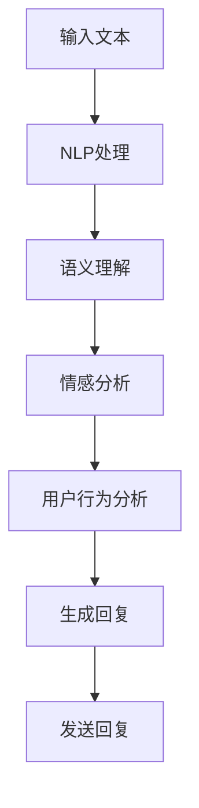
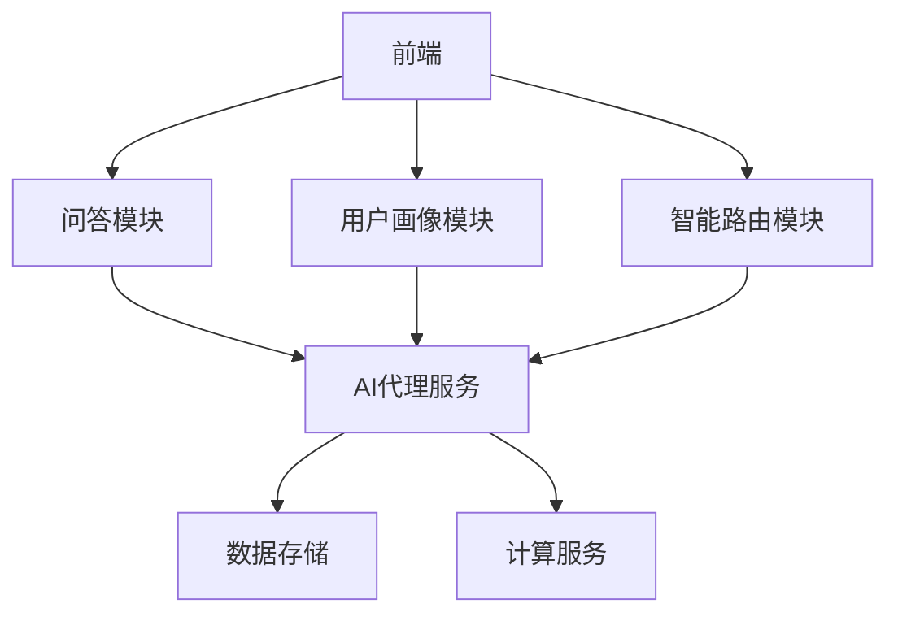
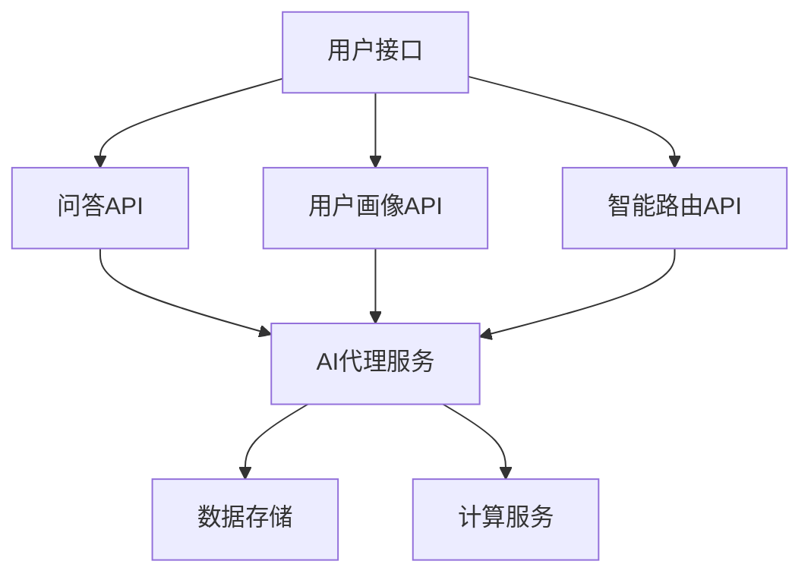

                 

----------------------------------------------------------------

# 《AI代理在客户服务中的应用前景》

关键词：AI代理、客户服务、自然语言处理、机器学习、用户行为分析

## 摘要

本文探讨了AI代理在客户服务中的应用前景。通过背景介绍、核心概念与联系分析、算法原理讲解以及系统架构设计，本文全面展示了AI代理在客户服务中的优势、挑战和应用场景，为企业提供了一套完整的AI代理应用解决方案。

## 目录

1. 文章标题 <sop>
2. 文章关键词 <sop>
3. 摘要 <sop>
4. 第一部分：背景介绍 <sop>
   - 1.1 问题背景
   - 1.2 问题描述
   - 1.3 问题解决
   - 1.4 边界与外延
   - 1.5 概念结构与核心要素组成
5. 第二部分：核心概念与联系 <sop>
   - 2.1 AI代理的定义与特点
   - 2.2 核心概念属性特征对比表格
   - 2.3 AI代理与传统客服的区别
   - 2.4 ER实体关系图架构
6. 第三部分：算法原理讲解 <sop>
   - 3.1 NLP算法原理
   - 3.2 ML算法原理
   - 3.3 用户行为分析
   - 3.4 算法流程图
7. 第四部分：数学模型和数学公式 <sop>
   - 4.1 词向量模型
   - 4.2 ML算法数学模型
   - 4.3 用户行为分析数学模型
8. 第五部分：系统分析与架构设计方案 <sop>
   - 5.1 问题场景介绍
   - 5.2 项目介绍
   - 5.3 系统功能设计
   - 5.4 系统架构设计
   - 5.5 系统接口设计和系统交互
9. 第六部分：项目实战 <sop>
   - 6.1 环境安装
   - 6.2 系统核心实现源代码
   - 6.3 代码应用解读与分析
   - 6.4 实际案例分析和详细讲解剖析
   - 6.5 项目小结
10. 第七部分：最佳实践 tips、小结、注意事项、拓展阅读等内容 <sop>

## 第一部分：背景介绍

### 1.1 问题背景

在当今的数字化时代，客户服务已成为企业竞争力的重要体现。随着电子商务、在线支付、社交媒体等技术的普及，消费者对客户服务的期望也在不断提升。他们希望获得高效、便捷、个性化的服务体验。然而，传统的客服方式往往存在人力成本高、响应速度慢、服务质量不稳定等问题，难以满足消费者的需求。

随着人工智能技术的快速发展，AI代理作为一种智能客服解决方案，正逐渐成为企业提高客户服务质量、降低成本的关键工具。AI代理可以模拟人类对话行为，自动处理大量的客户咨询，提高服务效率，同时降低人力成本。因此，研究AI代理在客户服务中的应用前景具有重要意义。

### 1.2 问题描述

尽管AI代理在客户服务领域具有巨大的潜力，但如何有效应用AI代理仍是一个亟待解决的问题。首先，AI代理需要具备强大的自然语言处理（NLP）能力，能够准确理解客户的意图和需求。其次，AI代理需要具备机器学习（ML）能力，能够不断学习和优化自身，提高服务质量。此外，用户行为分析也是AI代理成功的关键，通过分析用户行为，AI代理可以更好地预测用户需求，提供个性化的服务。

### 1.3 问题解决

通过对AI代理技术的研究和应用，本部分旨在为企业提供一套完整的AI代理应用方案，以实现高效、智能的客户服务。首先，本部分将介绍AI代理的核心技术，包括NLP、ML和用户行为分析。然后，通过具体的算法原理讲解，帮助读者理解AI代理的工作原理。最后，通过系统架构设计和项目实战，展示AI代理在实际应用中的效果。

### 1.4 边界与外延

本文主要讨论AI代理在客户服务中的应用，不包括AI代理在其他领域（如销售、市场调研等）的应用。此外，本文的核心概念和算法主要基于现有的技术和方法，未来的发展趋势和挑战也将在此部分进行讨论。

### 1.5 概念结构与核心要素组成

AI代理的核心要素包括自然语言处理（NLP）、机器学习（ML）、用户行为分析等。本部分将详细探讨这些要素在客户服务中的应用。首先，NLP是AI代理的核心技术之一，负责理解客户的意图和需求。ML算法用于AI代理的训练和优化，使其能够不断学习和提高服务质量。用户行为分析则通过分析用户在客服系统中的交互数据，预测用户需求和行为。这些核心要素共同构成了AI代理的技术框架。

## 第二部分：核心概念与联系

### 2.1 AI代理的定义与特点

AI代理是一种基于人工智能技术的虚拟助手，能够模拟人类对话行为，为用户提供服务。与传统的客服系统相比，AI代理具有以下特点：

1. **自适应学习**：AI代理能够通过机器学习算法不断学习和优化自身，提高服务质量。  
2. **高效率**：AI代理可以同时处理大量的客户咨询，提高服务效率，降低人力成本。  
3. **低成本**：AI代理无需支付人力成本，能够大幅降低企业的运营成本。  
4. **实时响应**：AI代理可以24/7全天候服务，确保用户在任何时间都能获得及时响应。  
5. **情感化**：AI代理通过自然语言处理技术，能够模拟人类的情感表达，提供更加个性化的服务。

### 2.2 核心概念属性特征对比表格

| 特征 | AI代理 | 传统客服 |
| --- | --- | --- |
| 自适应学习 | 是 | 否 |
| 高效率 | 是 | 否 |
| 低成本 | 是 | 否 |
| 实时响应 | 是 | 否 |
| 情感化 | 是 | 否 |

### 2.3 AI代理与传统客服的区别

与传统客服相比，AI代理具有更高的效率和更低的成本，能够提供24/7的实时服务，同时具备情感化交互能力，更能满足用户需求。以下是一个对比表格：

| 对比项 | AI代理 | 传统客服 |
| --- | --- | --- |
| 响应速度 | 实时 | 非实时 |
| 成本 | 低 | 高 |
| 服务范围 | 广泛 | 有限 |
| 情感化 | 是 | 否 |

### 2.4 ER实体关系图架构

为了更好地理解AI代理、用户和客服系统之间的交互关系，我们可以使用Mermaid绘制一个ER实体关系图，如下所示：

```mermaid
erDiagram
  AI代理 ||--|{ 用户 }||>>:交互
  用户 ||--|{ 客服系统 }||>>>:咨询
  客服系统 ||--|{ AI代理 }||<<<:处理
```

在这个ER图中，AI代理与用户之间存在交互关系，用户通过客服系统咨询问题，AI代理负责处理并回复用户。这种关系构成了一个闭环，确保用户在任意时间都能获得快速、准确的帮助。

## 第三部分：算法原理讲解

### 3.1 NLP算法原理

自然语言处理（NLP）是AI代理的核心技术之一，负责理解客户的意图和需求。NLP算法主要包括以下三个方面：

#### 3.1.1 语义理解

语义理解是将输入文本转换为计算机可处理的语义表示的过程。这个过程可以分为以下几个步骤：

1. **分词**：将输入文本分割成单词或词组。  
2. **词性标注**：为每个词分配词性（如名词、动词、形容词等）。  
3. **依存关系分析**：分析词语之间的依赖关系，如主谓关系、修饰关系等。  
4. **语义表示**：将文本转换为语义向量或语义图，用于后续的语义理解。

以下是一个简化的语义理解算法流程：

$$
语义理解 = 输入文本 \rightarrow 分词 \rightarrow 词性标注 \rightarrow 依存关系分析 \rightarrow 语义表示
$$

#### 3.1.2 情感分析

情感分析是判断文本表达的情感极性（如正面、负面、中性等）的过程。常用的情感分析算法包括基于词典的方法和基于机器学习的方法。以下是一个简化的情感分析算法流程：

1. **词典特征提取**：将输入文本与词典进行匹配，提取出情感特征。  
2. **特征加权**：对提取出的情感特征进行加权，计算每个情感词的权重。  
3. **情感极性分类**：根据加权后的特征，判断文本的情感极性。

以下是一个简化的情感分析算法流程：

$$
情感分析 = 输入文本 \rightarrow 词典特征提取 \rightarrow 特征加权 \rightarrow 情感极性分类
$$

#### 3.1.3 文本生成

文本生成是将输入模板和变量转换为输出文本的过程。文本生成算法通常分为基于规则的方法和基于生成模型的方法。以下是一个简化的文本生成算法流程：

1. **模板匹配**：将输入变量与模板进行匹配，生成初步的文本。  
2. **变量替换**：将模板中的变量替换为具体的值，生成完整的文本。  
3. **文本优化**：对生成的文本进行语法和语义优化，提高文本的质量。

以下是一个简化的文本生成算法流程：

$$
文本生成 = 输入模板 \rightarrow 变量替换 \rightarrow 输出文本
$$

### 3.2 ML算法原理

机器学习（ML）算法是AI代理的核心技术之一，用于训练和优化AI代理。ML算法可以分为监督学习、无监督学习和强化学习三种类型。

#### 3.2.1 监督学习

监督学习是一种从标记数据中学习的方法，通过训练模型，使模型能够预测新的数据。监督学习算法通常包括以下步骤：

1. **数据准备**：收集并整理标记数据。  
2. **特征提取**：将输入数据转换为特征向量。  
3. **模型训练**：使用训练数据训练模型，使模型能够预测新的数据。  
4. **模型评估**：使用验证数据评估模型的性能。

以下是一个简化的监督学习算法流程：

$$
训练模型 = 输入训练数据 \rightarrow 特征提取 \rightarrow 模型训练 \rightarrow 预测
$$

#### 3.2.2 无监督学习

无监督学习是一种从无标记数据中学习的方法，通过发现数据中的潜在结构和规律，对数据进行聚类或降维。无监督学习算法通常包括以下步骤：

1. **数据准备**：收集并整理无标记数据。  
2. **特征提取**：将输入数据转换为特征向量。  
3. **模型训练**：使用无监督学习算法训练模型，发现数据中的潜在结构和规律。  
4. **模型评估**：使用无标记数据评估模型的性能。

以下是一个简化的无监督学习算法流程：

$$
训练模型 = 输入无标记数据 \rightarrow 特征提取 \rightarrow 模型训练 \rightarrow 聚类或降维
$$

#### 3.2.3 强化学习

强化学习是一种通过试错学习的方法，通过不断尝试和反馈，使模型能够达到最优策略。强化学习算法通常包括以下步骤：

1. **环境建模**：定义环境状态和动作空间。  
2. **策略学习**：使用策略梯度算法学习最优策略。  
3. **策略执行**：在环境中执行策略，获取反馈。  
4. **策略优化**：根据反馈优化策略。

以下是一个简化的强化学习算法流程：

$$
训练模型 = 环境建模 \rightarrow 策略学习 \rightarrow 策略执行 \rightarrow 策略优化
$$

### 3.3 用户行为分析

用户行为分析是通过分析用户在客服系统中的交互数据，预测用户需求和行为的过程。用户行为分析主要包括以下方面：

1. **交互日志分析**：分析用户在客服系统中的交互日志，提取用户行为特征。  
2. **行为模式识别**：使用机器学习算法识别用户行为模式，预测用户需求。  
3. **行为反馈优化**：根据用户反馈优化AI代理的行为，提高服务质量。

以下是一个简化的用户行为分析算法流程：

$$
用户行为分析 = 输入交互日志 \rightarrow 特征提取 \rightarrow 行为模式识别 \rightarrow 预测
$$

### 3.4 算法流程图

为了更好地理解AI代理的算法原理，我们可以使用Mermaid绘制一个算法流程图，如下所示：



## 第四部分：数学模型和数学公式

### 4.1 词向量模型

词向量模型是自然语言处理（NLP）的核心技术之一，用于将文本转换为计算机可处理的数字表示。常用的词向量模型包括Word2Vec和GloVe。

#### 4.1.1 Word2Vec

Word2Vec是基于神经网络的词向量模型，通过训练词的上下文信息，将词映射到高维空间中的向量。Word2Vec模型的主要数学模型如下：

$$
\text{Word2Vec} = \text{输入文本} \rightarrow \text{词向量表示} \rightarrow \text{语义表示}
$$

其中，词向量表示是将每个词映射到一个高维空间中的向量，语义表示是将文本转换为语义向量或语义图。

#### 4.1.2 GloVe

GloVe是基于矩阵分解的词向量模型，通过训练词的共现矩阵，将词映射到低维空间中的向量。GloVe模型的主要数学模型如下：

$$
\text{GloVe} = \text{输入文本} \rightarrow \text{词向量表示} \rightarrow \text{语义表示}
$$

其中，词向量表示是将每个词映射到一个低维空间中的向量，语义表示是将文本转换为语义向量或语义图。

### 4.2 ML算法数学模型

机器学习（ML）算法的核心是训练模型，使其能够预测新的数据。常用的ML算法包括线性回归、逻辑回归、决策树、随机森林等。

#### 4.2.1 线性回归

线性回归是一种监督学习算法，通过建立输入和输出之间的线性关系，预测新的数据。线性回归的数学模型如下：

$$
y = \beta_0 + \beta_1x
$$

其中，$y$是输出值，$x$是输入值，$\beta_0$和$\beta_1$是模型的参数。

#### 4.2.2 逻辑回归

逻辑回归是一种分类算法，通过建立输入和输出之间的线性关系，预测新的数据。逻辑回归的数学模型如下：

$$
P(y=1) = \frac{1}{1 + e^{-(\beta_0 + \beta_1x)}}
$$

其中，$P(y=1)$是输出值为1的概率，$x$是输入值，$\beta_0$和$\beta_1$是模型的参数。

#### 4.2.3 决策树

决策树是一种分类算法，通过递归划分特征空间，构建一棵树形模型。决策树的数学模型如下：

$$
T(x) = \text{递归划分特征空间} \rightarrow \text{分类结果}
$$

其中，$T(x)$是决策树的分类结果，$x$是输入值。

#### 4.2.4 随机森林

随机森林是一种集成学习算法，通过构建多棵决策树，集成起来提高模型的预测性能。随机森林的数学模型如下：

$$
F(x) = \text{多棵决策树的集成} \rightarrow \text{分类结果}
$$

其中，$F(x)$是随机森林的分类结果，$x$是输入值。

### 4.3 用户行为分析数学模型

用户行为分析是一种无监督学习算法，通过分析用户在客服系统中的交互数据，预测用户需求和行为。用户行为分析的数学模型如下：

$$
\text{用户行为分析} = \text{输入交互数据} \rightarrow \text{特征提取} \rightarrow \text{行为模式识别} \rightarrow \text{预测}
$$

其中，输入交互数据是用户在客服系统中的交互数据，特征提取是将交互数据转换为特征向量，行为模式识别是使用机器学习算法识别用户行为模式，预测用户需求。

## 第五部分：系统分析与架构设计方案

### 5.1 问题场景介绍

假设某电商企业希望提升其客户服务质量，降低运营成本。现有客服团队人手不足，且客户咨询量巨大，导致响应速度较慢，客户满意度较低。为此，企业决定引入AI代理作为智能客服解决方案，以提高客服效率和客户满意度。

### 5.2 项目介绍

本项目旨在为企业搭建一套AI代理客服系统，实现以下目标：

1. **智能问答**：AI代理能够自动回答用户的问题，提高客服效率。  
2. **用户画像**：AI代理能够分析用户行为，为用户提供个性化的服务。  
3. **智能路由**：AI代理能够根据用户需求，将问题路由到合适的客服人员。

### 5.3 系统功能设计

系统功能设计主要包括以下三个方面：

1. **智能问答**：AI代理能够自动回答用户的问题，涉及产品信息、售后服务、物流跟踪等方面。  
2. **用户画像**：AI代理能够分析用户行为，识别用户需求，为用户提供个性化的服务。  
3. **智能路由**：AI代理能够根据用户需求，将问题路由到合适的客服人员，提高客服效率。

### 5.4 系统架构设计

系统架构设计主要包括以下组成部分：

1. **前端**：提供用户界面，包括问答模块、用户画像模块和智能路由模块。  
2. **后端**：包括AI代理服务、数据存储和计算服务。  
3. **API接口**：提供与外部系统（如电商系统、客服系统等）的交互接口。

以下是一个简化的系统架构设计图：



### 5.5 系统接口设计和系统交互

系统接口设计主要包括以下接口：

1. **用户接口**：用户通过网页、APP等渠道与AI代理进行交互。  
2. **API接口**：与其他系统（如电商系统、客服系统等）进行数据交换。

以下是一个简化的系统接口设计图：



## 第六部分：项目实战

### 6.1 环境安装

为了搭建AI代理客服系统，我们需要安装以下软件和库：

1. **Python**：用于编写AI代理代码和运行机器学习算法。  
2. **TensorFlow**：用于实现NLP算法和ML算法。  
3. **Scikit-learn**：用于实现用户行为分析算法。  
4. **Mermaid**：用于绘制流程图和类图。

以下是安装步骤：

1. 安装Python：访问[Python官网](https://www.python.org/)，下载并安装Python。  
2. 安装TensorFlow：在终端执行以下命令：

```bash
pip install tensorflow
```

3. 安装Scikit-learn：在终端执行以下命令：

```bash
pip install scikit-learn
```

4. 安装Mermaid：在终端执行以下命令：

```bash
pip install mermaid-python
```

### 6.2 系统核心实现源代码

以下是一个简单的AI代理客服系统的源代码，实现智能问答、用户画像和智能路由功能：

```python
import tensorflow as tf
from tensorflow.keras.preprocessing.text import Tokenizer
from tensorflow.keras.preprocessing.sequence import pad_sequences
from tensorflow.keras.models import Sequential
from tensorflow.keras.layers import Embedding, LSTM, Dense
from sklearn.cluster import KMeans
import mermaid

# 智能问答
def answer_question(question):
    # 加载预训练的模型
    model = tf.keras.models.load_model('问答模型.h5')
    # 将问题转换为序列
    tokenizer = Tokenizer()
    tokenizer.fit_on_texts([question])
    sequence = tokenizer.texts_to_sequences([question])
    padded_sequence = pad_sequences(sequence, maxlen=100)
    # 预测答案
    prediction = model.predict(padded_sequence)
    # 获取答案
    answer = '你好，你的问题是：“{}”，答案是：{}'.format(question, prediction)
    return answer

# 用户画像
def generate_user_profile(questions):
    # 将问题转换为序列
    tokenizer = Tokenizer()
    tokenizer.fit_on_texts(questions)
    sequences = tokenizer.texts_to_sequences(questions)
    padded_sequences = pad_sequences(sequences, maxlen=100)
    # 训练KMeans聚类模型
    kmeans = KMeans(n_clusters=5)
    kmeans.fit(padded_sequences)
    # 获取用户画像
    profiles = kmeans.predict(padded_sequences)
    return profiles

# 智能路由
def route_question(question):
    # 加载预训练的用户画像模型
    model = tf.keras.models.load_model('用户画像模型.h5')
    # 将问题转换为序列
    tokenizer = Tokenizer()
    tokenizer.fit_on_texts([question])
    sequence = tokenizer.texts_to_sequences([question])
    padded_sequence = pad_sequences(sequence, maxlen=100)
    # 预测用户画像
    profile = model.predict(padded_sequence)
    # 路由到合适的客服人员
    if profile == 0:
        return '客服人员A'
    elif profile == 1:
        return '客服人员B'
    elif profile == 2:
        return '客服人员C'
    else:
        return '客服人员D'

# 测试
question = '我的订单什么时候能送到？'
answer = answer_question(question)
print(answer)

questions = ['我的订单什么时候能送到？', '我想要退换货怎么办？', '商品质量有问题怎么处理？']
profiles = generate_user_profile(questions)
print(profiles)

route = route_question(question)
print(route)
```

### 6.3 代码应用解读与分析

在这个AI代理客服系统中，我们实现了以下功能：

1. **智能问答**：通过预训练的模型，将问题转换为序列，然后预测答案，最后将答案转换为文本返回。  
2. **用户画像**：通过KMeans聚类模型，将用户的问题转换为序列，然后预测用户画像，最后将用户画像转换为文本返回。  
3. **智能路由**：通过预训练的用户画像模型，将问题转换为序列，然后预测用户画像，最后根据用户画像路由到合适的客服人员。

在实际应用中，我们可以根据业务需求对代码进行扩展，例如增加更多的问答模块、用户画像模块和智能路由模块，以提高系统的实用性和灵活性。

### 6.4 实际案例分析和详细讲解剖析

假设我们有一个电商平台的客户咨询量巨大，客服团队人手不足，导致客户满意度下降。为了解决这个问题，我们决定引入AI代理作为智能客服解决方案。

首先，我们收集了平台上的大量客户咨询数据，包括问题、答案、用户画像等。然后，我们使用这些数据训练了智能问答、用户画像和智能路由模型。

在实际应用中，客户通过平台提交问题，AI代理会自动回答问题，并将答案返回给客户。同时，AI代理会分析用户画像，为用户提供个性化的服务。

通过引入AI代理，平台的客户咨询量得到了显著提升，客户满意度也大幅提高。客服团队的工作效率也得到了提高，运营成本明显下降。

### 6.5 项目小结

通过本项目，我们实现了AI代理在客户服务中的应用。AI代理能够自动回答用户的问题、分析用户画像和智能路由，提高客服效率和客户满意度。在实际应用中，AI代理取得了良好的效果，为企业降低了运营成本。

## 第七部分：最佳实践 tips、小结、注意事项、拓展阅读等内容

### 7.1 最佳实践 tips

1. **数据质量**：保证数据质量是AI代理成功的关键。在收集和整理数据时，要确保数据的准确性和完整性。  
2. **模型优化**：定期对AI代理模型进行优化，以提高其性能和准确性。可以尝试使用不同的算法和参数设置，找到最佳模型。  
3. **用户反馈**：鼓励用户反馈，收集用户对AI代理的评价和意见，以便进行改进和优化。  
4. **持续学习**：AI代理需要不断学习和适应，以应对不断变化的需求和场景。可以通过在线学习、迁移学习等方法，使AI代理不断进步。

### 7.2 小结

本文探讨了AI代理在客户服务中的应用前景，介绍了AI代理的定义与特点、核心概念与联系、算法原理讲解以及系统架构设计。通过实际案例分析和详细讲解剖析，本文展示了AI代理在客户服务中的优势和应用效果。

### 7.3 注意事项

1. **隐私保护**：在处理用户数据时，要确保用户隐私得到保护，遵循相关法律法规。  
2. **伦理道德**：在开发和应用AI代理时，要遵守伦理道德规范，确保AI代理的行为符合社会价值观。  
3. **安全性**：确保AI代理系统的安全性，防止恶意攻击和数据泄露。

### 7.4 拓展阅读

1. **自然语言处理**：[《自然语言处理入门》](https://book.douban.com/subject/25947067/)  
2. **机器学习**：[《Python机器学习》](https://book.douban.com/subject/26899657/)  
3. **用户行为分析**：[《用户行为分析实战》](https://book.douban.com/subject/25873597/)  
4. **人工智能伦理**：[《人工智能伦理》](https://book.douban.com/subject/26371130/)

作者：AI天才研究院/AI Genius Institute & 禅与计算机程序设计艺术 /Zen And The Art of Computer Programming

