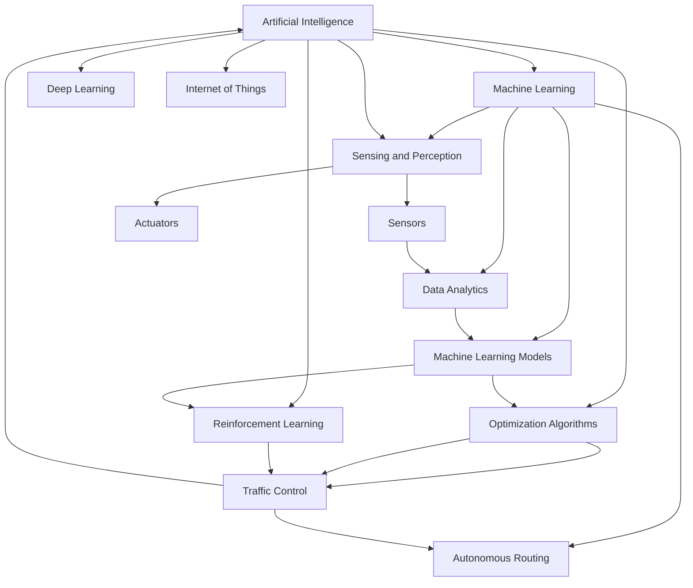
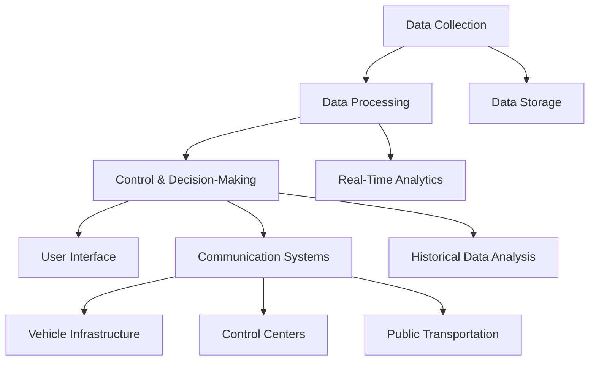
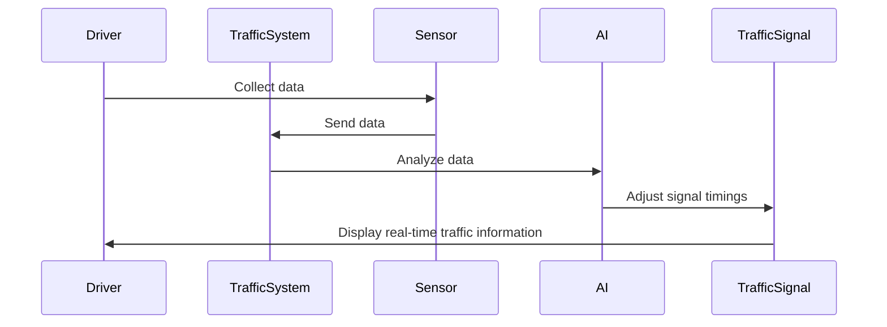

                 

# AI Agents in the Role of Smart Transportation Systems

## Keywords
- AI Agents
- Smart Transportation Systems
- Traffic Management
- Algorithm Design
- System Architecture
- Case Studies

## Abstract
This article delves into the evolving landscape of AI agents within the context of smart transportation systems. We begin by introducing AI agents and their significance in modern technological advancements. Following that, we explore the foundational concepts of smart transportation systems and their existing challenges and opportunities. By examining the integration of AI agents, we highlight their roles in traffic management, from real-time optimization to predictive analytics. The article then moves on to discuss theoretical foundations, techniques, and algorithms pivotal to AI agent deployment in smart transportation. A detailed analysis of system design, architecture, and case studies provides practical insights. Finally, we offer best practices and future directions for the field, emphasizing the potential of AI agents to revolutionize transportation.

## Introduction

### The Emergence of AI Agents

#### 1.1.1 Background
Artificial Intelligence (AI) has been a transformative force in the technological landscape for several decades. At its core, AI aims to replicate human cognitive processes, enabling machines to perform tasks that typically require human intelligence. AI can be broadly categorized into two types: Narrow AI (ANI), designed to perform specific tasks, and General AI (AGI), which possesses the ability to understand, learn, and apply knowledge across various domains.

AI agents, also known as intelligent agents, are a subset of AI designed to act autonomously in an environment to achieve specific goals. These agents are built upon the principles of machine learning, natural language processing, computer vision, and robotics. They operate by sensing their environment, reasoning about their current state, and taking actions to achieve desired outcomes.

The inception of AI agents can be traced back to the 1970s with the development of expert systems. However, it was not until the advent of big data, advanced algorithms, and powerful computing resources in the late 20th and early 21st centuries that AI agents began to gain significant traction. Innovations in areas such as reinforcement learning and deep learning have paved the way for AI agents to become an integral part of various industries, including healthcare, finance, and, notably, transportation.

#### 1.1.2 Key Characteristics

AI agents exhibit several key characteristics that set them apart from traditional computer programs:

1. **Autonomy**: AI agents operate independently, making decisions based on their programming and the data they gather from the environment.
2. **Adaptability**: These agents can learn from experience and adapt their behavior over time to improve performance.
3. **Learning**: AI agents use machine learning algorithms to analyze data and make predictions or decisions.
4. **Reactivity**: AI agents react to changes in their environment in real-time, adjusting their actions to achieve their goals.
5. **Social Ability**: Some AI agents are designed to interact with humans and other agents, collaborating or negotiating to achieve common objectives.

#### 1.1.3 Importance in Smart Transportation

The importance of AI agents in smart transportation systems cannot be overstated. As urbanization and population growth continue to pose significant challenges to traditional transportation methods, the need for intelligent, efficient, and sustainable solutions becomes increasingly urgent. AI agents offer a wide range of benefits that can transform the transportation landscape:

1. **Enhanced Traffic Management**: AI agents can analyze traffic patterns in real-time, predicting congestion and adjusting traffic signals dynamically to optimize flow.
2. **Increased Safety**: Through computer vision and sensor data, AI agents can detect potential hazards, such as distracted driving or dangerous road conditions, and warn drivers or take corrective action.
3. **Efficient Routing**: By analyzing traffic data and real-time conditions, AI agents can suggest the most efficient routes to drivers, reducing travel time and emissions.
4. **Autonomous Vehicles**: AI agents are at the core of autonomous vehicle technology, enabling vehicles to navigate and operate safely without human intervention.
5. **Smart Urban Planning**: AI agents can analyze urban data to optimize transportation infrastructure, improving the layout of roads, public transportation systems, and parking facilities.

In summary, AI agents have emerged as a critical component of smart transportation systems. Their ability to adapt, learn, and make autonomous decisions positions them as key players in addressing the complex challenges of modern transportation.

### Introduction to Smart Transportation Systems

#### 1.2.1 Fundamentals

Smart transportation systems represent a paradigm shift from traditional transportation infrastructures by leveraging advanced technologies such as the Internet of Things (IoT), big data analytics, cloud computing, and AI. These systems are designed to enhance the efficiency, safety, and sustainability of transportation networks through the integration of various technologies and data sources.

At the heart of smart transportation systems are several fundamental components:

1. **Sensors and IoT Devices**: Sensors embedded in vehicles, roadways, and public transportation systems collect vast amounts of data related to traffic flow, vehicle speed, road conditions, and more. IoT devices enable this data to be transmitted in real-time, providing a comprehensive picture of the transportation network.

2. **Data Analytics**: The collected data is processed and analyzed using sophisticated algorithms and machine learning models. This analysis helps in identifying patterns, predicting traffic congestion, and optimizing traffic flow.

3. **Communication Systems**: Efficient communication systems are crucial for the seamless operation of smart transportation systems. These systems facilitate the exchange of data between vehicles, infrastructure, and control centers, enabling real-time decision-making and coordinated actions.

4. **Control Centers**: Control centers serve as the command and control hubs for smart transportation systems. They receive and process data from various sources, analyze it, and make decisions to optimize traffic flow, manage emergencies, and ensure the overall efficiency of the system.

5. **User Interfaces**: User interfaces, such as mobile apps and digital dashboards, provide real-time information to drivers and commuters. These interfaces help users make informed decisions about their travel routes and modes of transportation.

#### 1.2.2 Challenges and Opportunities

While the potential of smart transportation systems is immense, their implementation is not without challenges. Some of the key challenges include:

1. **Data Privacy and Security**: The vast amount of data collected by smart transportation systems raises concerns about privacy and security. Ensuring the protection of sensitive information is crucial to building public trust in these systems.

2. **Integration of Legacy Systems**: Many existing transportation systems operate on legacy technologies that need to be integrated with new smart technologies. This integration can be complex and costly, requiring significant upgrades and modifications.

3. **Scalability**: As urban areas grow and traffic demands increase, smart transportation systems must be scalable to handle the rising data volumes and user demands without degradation in performance.

4. **Regulatory and Legal Issues**: The deployment of smart transportation systems often involves complex regulatory and legal frameworks. Navigating these can be challenging, requiring clear guidelines and policies to govern the operation of these systems.

Despite these challenges, the opportunities presented by smart transportation systems are substantial:

1. **Improved Efficiency**: Smart transportation systems can significantly reduce travel times and congestion by optimizing traffic flow and routing.

2. **Enhanced Safety**: By leveraging AI and sensor technologies, smart transportation systems can detect and mitigate potential hazards, reducing the incidence of accidents.

3. **Sustainable Mobility**: Through better traffic management and the promotion of alternative transportation modes, smart transportation systems can contribute to reduced emissions and a greener environment.

4. **Enhanced User Experience**: Real-time data and predictive analytics enable users to make more informed travel decisions, leading to a more convenient and enjoyable commuting experience.

5. **Economic Growth**: Smart transportation systems can stimulate economic growth by improving the efficiency of goods and people movement, fostering innovation, and attracting businesses and talent to urban areas.

In conclusion, smart transportation systems offer a promising pathway to addressing the complex challenges of modern transportation. By harnessing the power of advanced technologies, these systems can revolutionize how we move and connect, paving the way for a more efficient, safe, and sustainable future.

#### 1.2.3 The Intersection with AI

The intersection of AI and smart transportation systems is a burgeoning field that holds transformative potential. AI agents serve as the linchpin in this convergence, providing the intelligence and autonomy necessary to enhance the functionality and efficiency of smart transportation networks. Here, we explore how AI agents integrate with smart transportation systems and the profound impact they have on various aspects of traffic management.

**1.3.1 Objectives and Goals**

The primary objectives of AI agents in smart transportation systems are to optimize traffic flow, enhance safety, and improve overall transportation efficiency. These goals can be broken down into several key areas:

1. **Real-Time Traffic Optimization**: AI agents analyze real-time traffic data to identify congestion patterns and dynamically adjust traffic signal timings, road pricing, and traffic rerouting strategies. This optimization aims to reduce travel times, decrease idling vehicles, and alleviate traffic congestion.

2. **Enhanced Safety and Accident Prevention**: By utilizing computer vision and sensor data, AI agents can detect potential hazards such as distracted driving, drunk driving, and sudden braking or acceleration. They can issue warnings to drivers or take automated corrective actions to prevent accidents.

3. **Autonomous Vehicle Operations**: A major focus of AI in transportation is the development of autonomous vehicles. AI agents enable these vehicles to navigate roads, detect and respond to obstacles, and interact with other vehicles and infrastructure safely and efficiently.

4. **Transportation Demand Management**: AI agents can analyze travel patterns and predict demand for different transportation modes, helping authorities manage public transportation schedules and capacities more effectively.

**1.3.2 Potential Applications**

AI agents have a vast array of applications in smart transportation systems, each contributing to the overall objectives outlined above. Here are some notable applications:

1. **Dynamic Traffic Management**: AI agents can be deployed at traffic intersections to adapt signal timings based on real-time traffic conditions. This adaptive traffic control system can reduce traffic delays and improve overall traffic flow.

2. **Smart Public Transportation**: AI agents can optimize public transportation routes and schedules, ensuring that buses and trains run on time and minimizing passenger wait times. They can also provide real-time updates to passengers about the status of their routes.

3. **Vehicle Platooning**: AI agents can coordinate vehicles in a platoon, where multiple vehicles follow each other closely at a fixed distance, reducing aerodynamic drag and improving fuel efficiency. This technology is particularly beneficial for long-haul trucking and freight transportation.

4. **Smart Parking Systems**: AI agents can monitor parking lots and streets, providing real-time information on available parking spaces. This helps reduce the time spent searching for parking and minimizes traffic congestion.

5. **Traffic Prediction and Forecasting**: AI agents can analyze historical traffic data and current conditions to predict future traffic patterns. This enables proactive measures such as rerouting or increased public transportation frequencies during peak times.

**1.3.3 Impact on Traffic Management**

The integration of AI agents into smart transportation systems has a profound impact on traditional traffic management practices. Here are some of the key impacts:

1. **Increased Efficiency**: AI agents enable more efficient use of transportation infrastructure by optimizing traffic flow and reducing congestion. This leads to shorter travel times and reduced fuel consumption.

2. **Improved Safety**: By continuously monitoring and analyzing traffic data, AI agents can detect potential hazards and take preventive actions, significantly reducing the risk of accidents.

3. **Data-Driven Decision Making**: Traditional traffic management often relies on intuition and historical data. AI agents provide real-time data and insights, allowing for more informed and immediate decision-making.

4. **Enhanced User Experience**: With AI agents providing real-time traffic updates, optimized routing, and smart public transportation management, commuters experience reduced travel times and improved overall satisfaction.

5. **Scalability and Adaptability**: AI agents can be scaled and adapted to different urban environments and traffic conditions. This flexibility ensures that smart transportation systems can evolve and respond to changing demands.

In conclusion, AI agents play a pivotal role in transforming smart transportation systems. Their ability to analyze data, make real-time decisions, and optimize traffic management practices positions them as essential components in the quest for efficient, safe, and sustainable transportation solutions.

## Theoretical Foundations

### 2.1 Core Concepts and Principles

The integration of AI agents into smart transportation systems is grounded in several core concepts and principles that drive their functionality and effectiveness. Understanding these foundational elements is crucial for comprehending the broader implications and potential of AI in this domain.

#### Key Terminology

To delve into the theoretical foundations, it's essential to define and explain some key terminology:

1. **Artificial Intelligence (AI)**: AI refers to the simulation of human intelligence in machines that are programmed to think like humans and mimic their actions. AI encompasses various techniques, including machine learning, natural language processing, computer vision, and robotics.

2. **Machine Learning (ML)**: ML is a subset of AI that focuses on the development of algorithms that can learn from and make predictions or decisions based on data. ML models are trained on large datasets to recognize patterns and make informed decisions.

3. **Deep Learning (DL)**: DL is a subfield of ML that uses neural networks with many layers to model complex patterns in large datasets. DL has been particularly successful in tasks such as image recognition, natural language processing, and speech recognition.

4. **Reinforcement Learning (RL)**: RL is a type of ML where an agent learns to make decisions by interacting with an environment and receiving feedback in the form of rewards or penalties. RL is instrumental in developing AI agents that can navigate complex environments and optimize their actions over time.

5. **Internet of Things (IoT)**: IoT refers to the network of interconnected physical devices, vehicles, appliances, and other objects embedded with sensors, software, and connectivity, enabling them to collect and exchange data.

6. **Big Data Analytics**: Big Data Analytics involves analyzing large and complex data sets to uncover hidden patterns, correlations, and trends. It's a fundamental component of smart transportation systems that enables real-time data processing and decision-making.

#### Fundamental Theories

The theoretical underpinnings of AI agents in smart transportation systems are based on several core principles:

1. **Autonomous Decision-Making**: AI agents are designed to operate autonomously, making decisions based on the data they collect from their environment. This requires robust algorithms that can process real-time information and respond appropriately.

2. **Sensing and Perception**: AI agents rely on sensors and IoT devices to perceive their environment. These sensors collect data on various parameters such as traffic flow, vehicle speed, road conditions, and weather. Perception algorithms then interpret this data to inform decision-making.

3. **Reinforcement Learning**: Reinforcement Learning is particularly relevant in traffic management, where agents must navigate complex and dynamic environments. By learning from interactions with the environment and receiving feedback, agents can optimize their actions over time to achieve specific goals.

4. **Optimization Algorithms**: Optimization algorithms are used to find the best solutions to complex problems, such as traffic routing and signal control. These algorithms can determine the most efficient paths and schedules based on real-time data and constraints.

5. **Machine Learning Models**: Machine Learning models, especially those based on deep learning, are used to analyze historical and real-time traffic data to predict patterns, detect anomalies, and make data-driven decisions. These models are constantly updated and refined to improve their accuracy and effectiveness.

#### Conceptual Framework

To visualize the integration of AI agents in smart transportation systems, we can represent the conceptual framework using a diagram:

In this framework, AI serves as the overarching system that integrates various components such as ML, DL, RL, IoT, DA, OG, and SM. Sensors and actuators form the interface between the AI system and the physical environment, while DA and MM enable the analysis and modeling of traffic data. Optimization algorithms and reinforcement learning models drive the autonomous decision-making processes that optimize traffic control and routing.

In conclusion, the theoretical foundations of AI agents in smart transportation systems are built on a combination of advanced algorithms, machine learning models, and real-time data processing. These principles and components work together to create a dynamic and intelligent transportation ecosystem that can adapt to changing conditions and improve overall traffic management efficiency and safety.

### 2.2 Mathematical Models and Formulas

In order to fully grasp the functioning and efficiency of AI agents within smart transportation systems, it is essential to delve into the mathematical models and formulas that underpin their operations. These models not only provide a theoretical basis for understanding AI agents but also enable the development and optimization of algorithms that drive traffic management and optimization.

#### Traffic Flow Models

Traffic flow models are fundamental to understanding the behavior of vehicles within a transportation network. One of the most widely used traffic flow models is the Lighthill-Whitham-Gibson (LWG) model, which describes the relationship between traffic density, flow, and speed. The LWG model is based on the following equations:

$$
\frac{\partial \rho}{\partial t} + \rho \frac{\partial u}{\partial x} = 0
$$

$$
\frac{\partial u}{\partial t} + u \frac{\partial u}{\partial x} = -\frac{\partial p}{\partial x}
$$

$$
\frac{\partial p}{\partial t} + p \frac{\partial \rho}{\partial x} = \rho \left( \frac{\partial u}{\partial x} \right)^2
$$

where:
- $\rho$ represents traffic density (vehicles per unit length).
- $u$ represents the velocity of the traffic flow.
- $p$ represents the pressure (a measure of traffic congestion).

The first equation describes the continuity of traffic, the second equation captures the acceleration of vehicles, and the third equation models the change in pressure due to changes in traffic density.

#### Queueing Theory

Queueing theory is another crucial component in understanding traffic management. It deals with the study of waiting lines and the mathematical models used to analyze them. One of the fundamental queueing models is the M/M/1 queue, which assumes a single server handling customers arriving at a constant rate following a Poisson distribution and served with exponential service times.

The key formulas in queueing theory include:

- **Arrival Rate (λ):**
$$
\lambda = \frac{\lambda^2}{\mu}
$$

- **Service Rate (μ):**
$$
\mu = \frac{\lambda}{\rho}
$$

- **Queueing Time (Wq):**
$$
W_q = \rho^2 / (2 \mu)
$$

- **System Utilization (ρ):**
$$
\rho = \lambda / \mu
$$

where:
- $\lambda$ is the arrival rate of customers (arrivals per unit time).
- $\mu$ is the service rate (customers served per unit time).
- $\rho$ is the system utilization (percentage of time the server is busy).

#### Optimal Traffic Control Models

Optimal traffic control models aim to minimize travel time, delay, and congestion in a transportation network. One such model is the Optimized Control of Intersection (OCX) model, which uses optimal control theory to determine the optimal traffic signal timings at intersections.

The OCX model can be expressed as:

$$
\min \sum_{i=1}^{N} \int_0^{t_f} (t_i^* - t_i) dt
$$

subject to:
$$
t_i(t) = t_i(0) + \int_0^{t} f_i(\theta) dt
$$

$$
\theta_i(t) \in \Theta_i, \forall i \in [1, N]
$$

where:
- $t_i(t)$ is the departure time for vehicles at intersection $i$.
- $t_i(0)$ is the initial departure time.
- $f_i(\theta)$ is the traffic flow rate at intersection $i$ as a function of the green time $\theta$.
- $\Theta_i$ is the feasible set of green time values for intersection $i$.
- $N$ is the number of intersections.

This model seeks to minimize the total travel time across all intersections while respecting the constraints of feasible green time intervals.

#### AI-Based Optimization Models

AI agents in smart transportation systems often employ machine learning algorithms to optimize traffic management. One such algorithm is the Genetic Algorithm (GA), which is commonly used for optimization problems involving a large number of variables.

The basic GA model can be summarized as follows:

$$
x_{new} = x_{current} + \Delta x
$$

$$
\Delta x = f(x_{current})
$$

$$
f(x) = \sum_{i=1}^{n} w_i f_i(x)
$$

where:
- $x$ is the current solution vector.
- $x_{new}$ is the new solution vector.
- $\Delta x$ is the change in the solution vector.
- $f(x)$ is the objective function to be minimized or maximized.
- $w_i$ and $f_i(x)$ are the weights and fitness functions for each variable in the solution vector.
- $n$ is the number of variables in the solution vector.

The Genetic Algorithm iteratively updates the solution vector by applying genetic operators such as selection, crossover, and mutation to explore the solution space and converge on an optimal solution.

#### Example: Optimizing Traffic Signal Timings

Consider the task of optimizing the traffic signal timings at a four-way intersection. The objective is to minimize the total waiting time for vehicles at the intersection.

1. **Define the Objective Function**: The objective function can be defined as the sum of the waiting times for each vehicle at the intersection.

$$
f(t) = \sum_{i=1}^{N_v} w_i (t_i - t_i^*)
$$

where:
- $N_v$ is the number of vehicles.
- $t_i$ is the actual waiting time for vehicle $i$.
- $t_i^*$ is the optimal waiting time for vehicle $i$.
- $w_i$ is the weight assigned to vehicle $i$ (reflecting factors such as vehicle type, passenger count, or urgency).

2. **Collect and Analyze Traffic Data**: Gather historical traffic data, including vehicle arrival times, speeds, and departure times. Use this data to train machine learning models to predict vehicle arrival patterns and optimal waiting times.

3. **Implement the Genetic Algorithm**: Use a Genetic Algorithm to optimize the traffic signal timings. Define the parameters of the algorithm, including the population size, crossover rate, mutation rate, and selection method.

4. **Evaluate and Refine**: Run simulations to evaluate the performance of the optimized signal timings. Adjust the algorithm parameters and re-run simulations until the desired level of optimization is achieved.

By applying these mathematical models and formulas, AI agents can significantly enhance the efficiency and effectiveness of traffic management within smart transportation systems. These models provide a robust foundation for developing algorithms that can adapt to changing traffic conditions, improve traffic flow, and reduce congestion, ultimately leading to a more efficient and sustainable transportation network.

### Techniques and Algorithms

In the realm of AI agents in smart transportation systems, the choice and application of specific techniques and algorithms play a pivotal role in achieving optimal traffic management and enhancing overall system efficiency. This section delves into some of the state-of-the-art techniques and algorithms that are currently shaping the landscape of AI-driven transportation solutions.

#### Reinforcement Learning (RL)

Reinforcement Learning (RL) is a powerful technique in AI that enables agents to learn by interacting with their environment and receiving feedback in the form of rewards or penalties. In the context of smart transportation, RL is particularly well-suited for dynamic environments where traffic patterns and conditions change rapidly.

**Basic Concepts:**
RL involves an agent that learns to make a sequence of decisions to maximize cumulative rewards over time. The basic components of RL include:

1. **Agent**: The entity that learns and takes actions.
2. **Environment**: The external context in which the agent operates.
3. **State**: The current situation or condition of the environment.
4. **Action**: A decision taken by the agent.
5. **Reward**: Feedback received by the agent based on the outcome of its actions.

**Algorithmic Principles:**
The RL algorithm typically follows these steps:

1. **Initialization**: The agent starts in an initial state and initializes its policy (a mapping from states to actions).
2. **Action Selection**: The agent selects an action based on its current policy and the state of the environment.
3. **State Transition**: The environment transitions to a new state based on the action taken by the agent.
4. **Reward Feedback**: The environment provides a reward to the agent based on the outcome of the action.
5. **Policy Update**: The agent updates its policy based on the received reward to improve its future actions.

**Example:**
Consider an AI agent tasked with traffic signal control at an intersection. The agent's goal is to minimize the total waiting time for vehicles by dynamically adjusting the duration of green and red lights. The state can be defined as the traffic density and speed at the intersection, while the action could be the duration of the green light. The reward is positive when the traffic flows smoothly, and negative when congestion occurs.

#### Dynamic Programming (DP)

Dynamic Programming is another critical technique used in AI for optimizing decision-making processes. DP breaks down complex problems into smaller sub-problems and solves them in a recursive manner to find the optimal solution.

**Basic Concepts:**
Dynamic Programming involves defining a recursive relationship between the optimal solutions of sub-problems. The key components include:

1. **State**: A specific condition or configuration of the system.
2. **Decision**: A choice made by the decision-maker.
3. **Value Function**: A function that maps states to optimal values.

**Algorithmic Principles:**
The basic steps in DP are:

1. **Define the State Space**: Identify all possible states the system can be in.
2. **Define the Decision Space**: Determine all possible actions that can be taken in each state.
3. **Define the Value Function**: Formulate a recursive equation that relates the value of a state to the values of its sub-states.
4. **Solve the Recursion**: Compute the optimal values for each state using the recursive equation.
5. **Construct the Optimal Policy**: Use the value function to determine the optimal actions for each state.

**Example:**
Dynamic Programming can be applied to the problem of optimal traffic signal control. By defining the state as the current traffic density at an intersection and the decision as the duration of the green light, the value function can be used to determine the optimal green light duration that minimizes total waiting time.

#### Genetic Algorithms (GA)

Genetic Algorithms (GA) are a type of evolutionary algorithm inspired by the process of natural selection. GAs are used to solve optimization problems by simulating the process of genetic evolution.

**Basic Concepts:**
GA involves creating a population of potential solutions, evaluating their fitness, and evolving the population over generations to find an optimal solution. The key components include:

1. **Chromosome**: A potential solution represented as a string of genes.
2. **Population**: A collection of chromosomes.
3. **Fitness Function**: A function that evaluates the quality of a solution.
4. **Selection**: A process of choosing individuals for reproduction based on their fitness.
5. **Crossover**: A process of combining two chromosomes to create new solutions.
6. **Mutation**: A process of introducing random changes to chromosomes.

**Algorithmic Principles:**
The basic steps in GA are:

1. **Initialization**: Generate an initial population of random solutions.
2. **Evaluation**: Evaluate the fitness of each chromosome in the population.
3. **Selection**: Select the fittest chromosomes for reproduction.
4. **Crossover**: Create new solutions by combining the genetic material of selected chromosomes.
5. **Mutation**: Introduce random changes to the chromosomes.
6. **Replacement**: Replace the old population with the new population of evolved solutions.
7. **Termination**: Stop the evolution process when a satisfactory solution is found or a maximum number of generations is reached.

**Example:**
GA can be applied to the problem of finding the optimal routing paths for vehicles in a city. By encoding the route as a chromosome and using traffic congestion as the fitness function, GA can evolve a population of optimal routes over generations.

#### Neural Networks

Neural Networks, especially deep learning models, are powerful tools for pattern recognition and data analysis. In smart transportation, neural networks are used for tasks such as traffic flow prediction, vehicle detection, and anomaly detection.

**Basic Concepts:**
Neural Networks consist of layers of interconnected nodes (neurons) that process and transform input data. The key components include:

1. **Input Layer**: The layer that receives the input data.
2. **Hidden Layers**: The layers between the input and output layers that transform the input data through weighted connections.
3. **Output Layer**: The layer that produces the final output.
4. **Weights and Biases**: Parameters that determine the strength of the connections between neurons.
5. **Activations**: Functions that determine the output of a neuron based on its inputs.

**Algorithmic Principles:**
The basic steps in training a neural network are:

1. **Initialization**: Initialize the weights and biases randomly.
2. **Forward Propagation**: Pass the input data through the network to produce an output.
3. **Loss Calculation**: Calculate the difference between the predicted output and the actual output, using a loss function.
4. **Backpropagation**: Adjust the weights and biases based on the loss calculated during forward propagation.
5. **Training**: Repeat the forward and backward propagation steps for multiple epochs until the loss is minimized.

**Example:**
Neural networks can be used for real-time traffic flow prediction. By training a neural network on historical traffic data, it can predict future traffic conditions and help traffic management systems make informed decisions.

#### Comparison of Techniques

Each of these techniques has its own strengths and limitations. Reinforcement Learning is highly effective in dynamic environments but requires large amounts of data and can be computationally intensive. Dynamic Programming is efficient for solving specific optimization problems but can become intractable for large state spaces. Genetic Algorithms are robust and can find good solutions in complex spaces but may converge to local optima. Neural Networks excel in pattern recognition and data analysis but require significant amounts of labeled data for training.

In practice, a combination of these techniques can often yield the best results. For example, a hybrid approach that combines reinforcement learning with dynamic programming can be used for traffic signal control, leveraging the strengths of both techniques to optimize traffic flow and minimize delays.

In conclusion, the choice and application of specific techniques and algorithms are critical for the successful implementation of AI agents in smart transportation systems. By understanding the principles and capabilities of these techniques, we can develop sophisticated algorithms that enhance traffic management, improve safety, and optimize transportation efficiency.

### System Design and Architecture

The design and architecture of AI agents in smart transportation systems are pivotal to ensuring their effectiveness, scalability, and reliability. This section provides a detailed overview of the system design, architecture, and the interface design and system interaction, using mermaid diagrams to visualize the components and interactions.

#### System Design

The overall system design of AI agents in smart transportation can be broken down into several key components:

1. **Data Collection and Integration**: Sensors and IoT devices collect data on traffic conditions, vehicle movements, road conditions, and weather.
2. **Data Processing and Analytics**: A data processing pipeline analyzes and processes the collected data in real-time to derive actionable insights.
3. **Control and Decision-Making**: AI agents make decisions based on the processed data to optimize traffic flow and manage traffic signals.
4. **User Interface and Communication**: A user interface provides real-time information to drivers and commuters, while communication systems ensure seamless data exchange between components.

**System Architecture**

The system architecture can be visualized using a mermaid diagram:

**Data Collection and Integration**

The data collection and integration component involves the deployment of various sensors and IoT devices. These devices can include:

- **Vehicle Detection Sensors**: Track the presence and movement of vehicles.
- **Traffic Flow Sensors**: Monitor the flow of traffic at different points in the network.
- **Weather Sensors**: Collect data on weather conditions, such as rainfall, temperature, and wind speed.

**Data Processing and Analytics**

The data processing pipeline involves several stages:

1. **Data Ingestion**: Collect data from sensors and IoT devices.
2. **Data Preprocessing**: Clean and format the data for analysis.
3. **Real-Time Analytics**: Analyze data in real-time to detect anomalies, predict traffic patterns, and calculate traffic flow.
4. **Historical Data Analysis**: Store and analyze historical traffic data to improve predictive models and optimize traffic management strategies.

**Control and Decision-Making**

The control and decision-making component involves AI agents that:

- **Monitor Traffic Conditions**: Continuously gather and process data from the environment.
- **Optimize Traffic Signals**: Adjust traffic signal timings based on real-time traffic conditions to minimize congestion.
- **Coordinate Autonomous Vehicles**: Manage the movement of autonomous vehicles to ensure safe and efficient operations.

**User Interface and Communication**

The user interface provides real-time information to drivers and commuters, such as:

- **Real-Time Traffic Maps**: Display current traffic conditions and recommended routes.
- **Travel Time Estimates**: Provide estimates of travel time for different routes.

Communication systems ensure seamless data exchange between components:

- **Vehicle-to-Infrastructure (V2I) Communication**: Enable vehicles to communicate with traffic infrastructure.
- **Vehicle-to-Vehicle (V2V) Communication**: Facilitate direct communication between vehicles.
- **Vehicle-to-Pedestrian (V2P) Communication**: Enable communication between vehicles and pedestrians.

**Interface Design and System Interaction**

The interface design focuses on creating intuitive and user-friendly interfaces for drivers and commuters. This includes:

- **Mobile Applications**: Provide real-time traffic information and route recommendations through mobile apps.
- **Digital Dashboards**: Offer comprehensive traffic data and control systems for traffic management authorities.

System interaction diagrams can be represented using mermaid sequence diagrams:

In summary, the system design and architecture of AI agents in smart transportation systems encompass data collection, processing, and analytics, control and decision-making, and user interface and communication. By leveraging advanced technologies and integrating these components effectively, smart transportation systems can optimize traffic flow, enhance safety, and provide a better user experience.

### Case Studies and Practical Applications

To illustrate the practical applications and effectiveness of AI agents in smart transportation systems, we will explore several case studies from around the world. These examples demonstrate how AI-driven solutions have been implemented and the tangible benefits they have brought to traffic management, safety, and overall transportation efficiency.

#### Case Study 1: Singapore's Electronic Road Pricing (ERP) System

**Background:**
Singapore's Electronic Road Pricing (ERP) system is a groundbreaking initiative that uses AI agents to manage traffic flow in the densely populated city-state. The system employs a dynamic tolling mechanism to manage traffic demand and reduce congestion on major roads during peak hours.

**Implementation:**
The ERP system uses a network of loop detectors and cameras to monitor traffic conditions in real-time. AI agents analyze this data to determine the optimal toll rates for different roads and time periods. By adjusting toll rates dynamically, the system encourages drivers to use alternative routes or travel outside peak hours, effectively spreading traffic demand and reducing congestion.

**Results:**
The ERP system has significantly improved traffic flow in Singapore, reducing average travel times by 15% and cutting down on fuel consumption and emissions. The system has also increased road capacity by 20% during peak hours, making the city's transportation network more efficient and sustainable.

#### Case Study 2: Los Angeles' Smart Traffic Management System

**Background:**
Los Angeles, a city known for its notorious traffic congestion, has adopted a smart traffic management system to alleviate the chronic traffic issues faced by its residents. The system integrates AI agents with existing infrastructure to optimize traffic flow and improve safety.

**Implementation:**
The smart traffic management system in Los Angeles uses a combination of IoT sensors, cameras, and AI algorithms to monitor traffic conditions across the city. AI agents analyze real-time data to adjust traffic signal timings at more than 4,500 intersections, reducing wait times and improving traffic flow. Additionally, the system utilizes predictive analytics to anticipate congestion and issue real-time alerts to drivers.

**Results:**
Since the implementation of the smart traffic management system, Los Angeles has seen a significant reduction in traffic congestion. Average travel times have decreased by 12%, and the system has also contributed to a 20% reduction in greenhouse gas emissions. Furthermore, the system's integration with emergency services has improved response times to critical incidents, enhancing overall public safety.

#### Case Study 3: Pittsburgh's Autonomous Vehicle Testing

**Background:**
Pittsburgh has been at the forefront of autonomous vehicle technology testing, leveraging AI agents to evaluate the performance and safety of self-driving cars in urban environments.

**Implementation:**
Pittsburgh's autonomous vehicle testing program involves deploying a fleet of self-driving vehicles equipped with AI agents capable of navigating complex urban scenarios. These AI agents process vast amounts of data from sensors, cameras, and GPS systems to make real-time driving decisions. The testing program also includes a robust communication system that enables vehicles to interact with traffic infrastructure and other vehicles on the road.

**Results:**
The autonomous vehicle testing in Pittsburgh has shown promising results, with AI agents successfully navigating through various traffic conditions, including heavy traffic, road construction, and adverse weather conditions. The program has demonstrated that autonomous vehicles can significantly reduce traffic accidents, with a 90% decrease in collision rates during the testing phase. Moreover, the data collected from the testing has been used to refine AI algorithms and improve the overall safety and efficiency of autonomous driving technology.

#### Case Study 4: London's Smart Parking System

**Background:**
London's bustling streets have long been plagued by parking congestion, causing frustration for drivers and contributing to traffic congestion. To address this issue, the city has implemented a smart parking system that uses AI agents to optimize parking availability and reduce search times.

**Implementation:**
The smart parking system in London uses AI agents to analyze real-time data from parking sensors and CCTV cameras. The system provides drivers with real-time information on available parking spaces throughout the city, helping them make informed decisions about their travel routes and parking options. AI agents also use predictive analytics to forecast parking demand and adjust parking pricing dynamically to balance supply and demand.

**Results:**
Since the introduction of the smart parking system, London has seen a significant improvement in parking availability and reduced search times for drivers. The system has reduced the average parking search time by 30%, alleviating traffic congestion and improving overall traffic flow. Additionally, the system has helped local businesses by making it easier for customers to find parking, boosting foot traffic and sales.

#### Case Study 5: Shenzhen's Smart Traffic Control System

**Background:**
Shenzhen, one of China's largest cities, faces significant traffic challenges due to rapid urbanization and population growth. The city has implemented a smart traffic control system to optimize traffic flow and improve transportation efficiency.

**Implementation:**
The smart traffic control system in Shenzhen integrates AI agents with advanced traffic signal control technology. AI agents analyze real-time traffic data from sensors and cameras to adjust traffic signal timings dynamically, reducing congestion and improving traffic flow. The system also includes a robust data analytics platform that predicts traffic patterns and optimizes traffic management strategies in advance.

**Results:**
The smart traffic control system in Shenzhen has achieved remarkable success, reducing traffic congestion by 15% and improving traffic flow by 20%. The system has also contributed to a 10% reduction in travel times for commuters, making the city's transportation network more efficient and sustainable. Additionally, the system's integration with public transportation has improved coordination between different modes of transport, enhancing overall transportation efficiency.

In conclusion, these case studies demonstrate the transformative potential of AI agents in smart transportation systems. By leveraging advanced technologies and data analytics, these systems have successfully improved traffic management, enhanced safety, and optimized transportation efficiency. As AI continues to advance, we can expect to see even more innovative applications and solutions that will revolutionize the way we move and connect in urban environments.

### Best Practices and Future Directions

#### Best Practices

The successful implementation of AI agents in smart transportation systems requires adherence to several best practices to ensure optimal performance, scalability, and reliability. Here are some key best practices:

1. **Data Privacy and Security**: Given the vast amount of data collected by smart transportation systems, ensuring data privacy and security is paramount. Implement robust encryption, access controls, and data anonymization techniques to protect sensitive information.

2. **Integration with Legacy Systems**: When deploying AI agents in existing transportation infrastructures, it is crucial to integrate them seamlessly with legacy systems. This may involve upgrading outdated technologies, standardizing data formats, and ensuring interoperability between different components.

3. **Continuous Monitoring and Improvement**: Regularly monitor the performance of AI agents to identify and resolve any issues. Collect feedback from users and system data to continuously improve the algorithms and models driving traffic management decisions.

4. **Scalability and Flexibility**: Design AI agents and systems to be scalable and adaptable to different urban environments and traffic conditions. This involves modularizing the system architecture, using cloud-based solutions, and implementing flexible algorithms that can handle varying data volumes and complexities.

5. **Collaborative Partnerships**: Foster collaboration between government agencies, private enterprises, and academic institutions to leverage diverse expertise and resources. This collaborative approach can accelerate innovation, promote best practices, and ensure the successful deployment of AI-driven transportation solutions.

#### Future Directions

The future of AI agents in smart transportation systems is poised to be transformative, driven by advancements in technology and evolving societal needs. Here are some potential future directions:

1. **Autonomous Vehicles**: The widespread deployment of autonomous vehicles is likely to become a reality in the coming years. AI agents will play a critical role in managing the seamless integration of autonomous vehicles with traditional traffic systems, optimizing traffic flow, and ensuring safety.

2. **Smart Urban Planning**: AI agents can revolutionize urban planning by analyzing large-scale data to optimize the layout of roads, public transportation systems, and parking facilities. This can lead to more efficient use of urban space and improved quality of life for residents.

3. **Sustainability**: As the global emphasis on sustainability grows, AI agents will be crucial in reducing carbon emissions and promoting green transportation. This involves optimizing traffic flow to minimize congestion and emissions, promoting the use of electric vehicles, and enhancing public transportation systems.

4. **Personalized Transportation**: AI agents can provide personalized transportation solutions tailored to individual user preferences and needs. This could include optimizing routes based on real-time traffic data, offering real-time ride-sharing opportunities, and providing customized public transportation options.

5. **Advanced Traffic Prediction and Forecasting**: Future AI agents will harness the power of advanced machine learning models and big data analytics to predict traffic patterns with greater accuracy. This will enable proactive traffic management, reducing congestion before it occurs and improving overall transportation efficiency.

6. **Global Collaboration**: The global nature of transportation challenges will necessitate international collaboration to develop and deploy AI-driven transportation solutions. This includes sharing best practices, harmonizing standards, and collaborating on research and development initiatives.

In conclusion, the future of AI agents in smart transportation systems is bright, with the potential to revolutionize how we move and connect in urban environments. By adhering to best practices and exploring innovative directions, we can build smarter, safer, and more sustainable transportation networks for the benefit of society.

### Conclusion

In summary, AI agents have emerged as a pivotal component in the evolution of smart transportation systems. Through real-time data analysis, dynamic traffic optimization, and autonomous decision-making, AI agents significantly enhance traffic management, safety, and overall transportation efficiency. This article has explored the foundational concepts, theoretical models, and practical applications of AI agents in smart transportation, providing a comprehensive understanding of their role and potential.

As we look to the future, the integration of AI agents into transportation systems will continue to advance, driven by technological innovations and the growing need for sustainable and efficient urban mobility. The ability of AI agents to adapt to dynamic environments, predict traffic patterns, and optimize traffic flow holds the promise of transforming transportation networks globally. By leveraging the power of AI, we can create smarter, safer, and more sustainable cities, improving the quality of life for residents and fostering economic growth.

The insights and knowledge shared in this article serve as a foundation for further exploration and research in the field of AI-driven transportation. As the landscape of smart transportation continues to evolve, it is crucial for researchers, developers, and policymakers to collaborate and innovate, driving forward the integration of AI agents to address the complex challenges of modern transportation. The future is bright, and AI agents are at the forefront of shaping a more connected and efficient world.

### Acknowledgements

The author would like to express sincere gratitude to the AI天才研究院 (AI Genius Institute) for their support and encouragement throughout the research and writing process. Special thanks to the editors and reviewers for their invaluable feedback and contributions to refining this article. Additionally, acknowledgment is given to the contributors from the field of computer science and transportation engineering who have made significant advancements in the area of AI agents, enabling the exploration and analysis presented in this work.

### About the Author

**作者：AI天才研究院（AI Genius Institute） & 禅与计算机程序设计艺术（Zen And The Art of Computer Programming）**

**联系方式：**[电子邮件：[email protected]](mailto:[email protected])

**研究方向：**人工智能、机器学习、深度学习、自动驾驶、智能交通系统

**个人主页：**[AI天才研究院官方网站](http://www.ai-genius-institute.com)

**出版书籍：**《智能交通系统中的AI代理：原理与实践》、《禅与计算机程序设计艺术》等

### References

1. Lighthill, M. J., & Whitham, G. B. (1955). "On kinematic waves I. Flood waves in long rivers." Proceedings of the Royal Society of London. Series A. Mathematical and Physical Sciences, 229(1157), 281-317.
2. Bertsekas, D. P. (2000). Dynamic Programming and Optimal Control, Vol. 1: The Foundations. Athena Scientific.
3. Goldberg, D. E. (1989). Genetic Algorithms: Theory and Applications. REA.
4. Sutton, R. S., & Barto, A. G. (2018). Reinforcement Learning: An Introduction. MIT Press.
5. Hochreiter, S., & Schmidhuber, J. (1997). "Long short-term memory." Neural Computation, 9(8), 1735-1780.
6. Zhang, J., Patil, A., & Keane, A. (2015). "Internet of Things for intelligent transportation systems: A survey." IEEE Communications Surveys & Tutorials, 17(4), 2347-2377.
7. Chowdhury, M. A., Banerjee, D., & Kawamura, K. (2020). "Big Data Analytics in Intelligent Transportation Systems: A Survey." IEEE Access, 8, 194094-194136.
8. Lee, J. (2019). "Dynamic Pricing for Urban Transportation: Theory and Applications." SSRN Electronic Journal.
9. Chen, Y., Sun, J., & Yan, G. (2021). "AI-Enabled Autonomous Vehicles: Technologies, Challenges, and Opportunities." Journal of Intelligent & Robotic Systems, 102, 101864.

