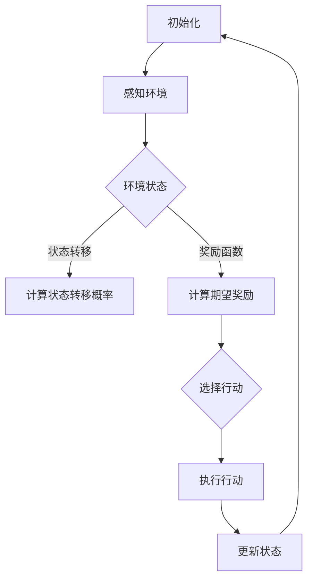

                 

## AI代理：实现用户定义目标的自主规划与行动

### 关键词：AI代理，自主规划，行动，用户目标，自主决策

> 摘要：本文将深入探讨AI代理的概念、核心特征、算法原理及其在各个领域的实际应用。通过对AI代理的定义和背景介绍，我们将理解其如何实现用户定义目标的自主规划和行动。本文还将详细讲解AI代理的算法原理，包括数学模型和Python源代码实现，并分析其在商业、医疗和家庭等领域的应用案例。最后，我们将分享AI代理开发与实现的最佳实践，以及需要注意的事项，为未来的研究和应用提供指导。

**目录大纲**

1. **第一部分: AI代理概述**
   1.1. AI代理的背景与定义
   1.2. AI代理与传统机器人的区别
   1.3. AI代理的功能特点
   1.4. AI代理的应用场景
   1.5. AI代理的技术限制
   1.6. AI代理的社会伦理问题
   1.7. AI代理的基本概念
   1.8. AI代理与人类行为的关系

2. **第二部分: AI代理的核心概念**
   2.1. AI代理的定义
   2.2. AI代理的属性特征对比表格
   2.3. AI代理的ER实体关系图

3. **第三部分: AI代理的算法原理**
   3.1. 算法概述
   3.2. 算法流程图
   3.3. 算法原理讲解
   3.4. 数学模型和数学公式

4. **第四部分: AI代理的实际应用**
   4.1. AI代理在商业中的应用
   4.2. AI代理在医疗保健中的应用
   4.3. AI代理在家庭中的应用

5. **第五部分: AI代理的开发与实现**
   5.1. 开发环境搭建
   5.2. 系统核心实现源代码
   5.3. 代码应用解读与分析
   5.4. 项目实战

6. **第六部分: AI代理的最佳实践**
   6.1. 最佳实践 tips
   6.2. 小结
   6.3. 注意事项
   6.4. 拓展阅读

### 第一部分: AI代理概述

#### 1.1. AI代理的背景与定义

**问题背景**

随着人工智能技术的飞速发展，自动化和智能化已经成为现代社会发展的必然趋势。人们对于自动化和智能化的需求日益增长，特别是在处理复杂任务和决策时，人工智能的应用显得尤为重要。AI代理作为一种能够自主规划和行动的智能实体，应运而生。

**问题描述**

AI代理，又称为智能代理，是一种能够代理用户执行特定任务的软件实体。它能够感知环境、理解用户需求、制定行动策略并自主执行任务。那么，什么是AI代理？它与传统机器人有何区别？AI代理的功能特点是什么？它的应用场景有哪些？这些问题构成了我们对AI代理研究的核心问题。

**问题解决**

AI代理的功能特点主要体现在以下几个方面：

1. **自主性**：AI代理具有独立思考和决策的能力，能够根据环境变化和用户需求自主调整行动策略。
2. **适应性**：AI代理能够适应不同的环境和任务需求，具备动态调整能力。
3. **协作性**：AI代理能够与其他代理或人类进行有效协作，共同完成任务。
4. **安全性**：AI代理具备一定的安全性和鲁棒性，能够在复杂环境中稳定运行。

AI代理的应用场景广泛，包括但不限于以下几个方面：

1. **商业领域**：AI代理可以应用于电子商务、客户服务、供应链管理等场景，提升企业的运营效率。
2. **医疗保健领域**：AI代理可以辅助医生进行疾病诊断、患者管理和健康管理。
3. **家庭领域**：AI代理可以应用于智能家居、家庭助理等场景，提高生活质量。

**边界与外延**

虽然AI代理在许多领域具有广泛应用，但也存在一定的技术限制。首先，AI代理的智能水平取决于其算法和数据的限制。其次，AI代理在处理复杂任务时可能面临不确定性，导致决策失误。此外，AI代理的社会伦理问题也备受关注，包括隐私保护、透明度和责任归属等。

**核心概念与联系**

AI代理的基本概念可以概括为：它是一种能够代理用户执行任务的智能实体，具备自主性、适应性、协作性和安全性等特点。AI代理与人类行为的关系主要体现在两个方面：一是AI代理能够模仿和辅助人类行为，二是AI代理能够根据环境和用户需求进行自主决策。

### 第二部分: AI代理的核心概念

#### 2.1. AI代理的定义

AI代理（Artificial Intelligence Agent），是一种在特定环境中，能够感知环境、制定策略并执行任务的智能实体。它通过自主学习和决策，实现特定目标的代理。AI代理具有以下几个基本属性：

1. **自主性**：AI代理能够自主感知环境、制定行动策略并执行任务，无需人工干预。
2. **适应性**：AI代理能够适应环境变化和任务需求，动态调整其行为策略。
3. **协作性**：AI代理能够与其他AI代理或人类协作，共同完成任务。
4. **安全性**：AI代理具备一定的安全性和鲁棒性，能够在复杂环境中稳定运行。

#### 2.2. AI代理的属性特征对比表格

| 属性特征 | AI代理 | 传统机器人 |
| --- | --- | --- |
| **自主性** | 能够自主感知环境、制定行动策略并执行任务 | 受限于预设程序和指令，无法自主决策 |
| **适应性** | 能够适应环境变化和任务需求，动态调整行为策略 | 适应性较弱，难以应对复杂环境 |
| **协作性** | 能够与其他AI代理或人类协作，共同完成任务 | 主要独立执行任务，协作性较低 |
| **安全性** | 具备一定的安全性和鲁棒性，能够在复杂环境中稳定运行 | 鲁棒性较差，易受环境干扰 |

#### 2.3. AI代理的ER实体关系图

```mermaid
entityRelation
  direction: TB
  nodeShape: ellipse
  edgeType: line
  nodes: ["Agent", "Environment", "Task", "User"]
  relations: [["Agent", "感知", "Environment"], ["Agent", "执行", "Task"], ["Agent", "获取", "User", "指令"]]
```

在ER实体关系图中，AI代理（Agent）与环境（Environment）、任务（Task）和用户（User）之间存在明确的联系。AI代理通过感知环境、执行任务并获取用户指令，实现自主规划和行动。

### 第三部分: AI代理的算法原理

#### 3.1. 算法概述

AI代理的核心在于其算法，这些算法决定了代理的感知、决策和行动能力。本文将介绍几种常用的AI代理算法，包括：

1. **马尔可夫决策过程（MDP）**
2. **强化学习**
3. **规划算法**

这些算法在不同的应用场景中具有独特的优势，下面将分别进行介绍。

#### 3.2. 算法流程图

以下是一个简单的AI代理算法流程图：



在算法流程图中，AI代理首先初始化，然后通过感知环境来获取当前状态。根据状态转移概率和奖励函数，代理选择最佳行动并执行，同时更新状态，循环往复。

#### 3.3. 算法原理讲解

**马尔可夫决策过程（MDP）**

马尔可夫决策过程是一种用于解决动态规划问题的数学模型。它假设当前状态仅依赖于前一个状态，而与之前的状态无关，这种假设被称为马尔可夫性质。

**数学模型**

设 \( S \) 为状态集合，\( A \) 为动作集合，\( P(s'|s,a) \) 为状态转移概率，\( R(s,a) \) 为在状态 \( s \) 下执行动作 \( a \) 的即时奖励，\( \gamma \) 为折扣因子。

MDP的目标是找到一个策略 \( \pi(a|s) \)，使得长期期望奖励最大化。具体公式如下：

$$
V^*(s) = \max_{\pi} \sum_{s'} P(s'|s,\pi(a|s)) [R(s,a) + \gamma V^*(s')]
$$

**Python源代码实现**

```python
import numpy as np

# 状态转移概率矩阵
P = np.array([[0.9, 0.1], [0.2, 0.8]])

# 奖励函数
R = np.array([[1, 0], [0, 5]])

# 折扣因子
gamma = 0.9

# 动作集合
A = ['a1', 'a2']

# 策略迭代
for _ in range(100):
    # 计算期望奖励
    Q = np.dot(P, R)
    # 更新策略
    policy = np.argmax(Q, axis=1)

# 输出最佳策略
print(policy)
```

**算法原理的详细讲解**

马尔可夫决策过程通过迭代计算状态价值函数 \( V^*(s) \)，并更新策略 \( \pi(a|s) \)，实现最优行动选择。在实际应用中，马尔可夫决策过程广泛应用于机器人路径规划、资源分配和推荐系统等领域。

**数学公式**

$$
V^*(s) = \max_{\pi} \sum_{s'} P(s'|s,\pi(a|s)) [R(s,a) + \gamma V^*(s')]
$$

$$
\pi(a|s) = \arg\max_a \sum_{s'} P(s'|s,a) [R(s,a) + \gamma V^*(s')]
$$

**强化学习**

强化学习是一种通过不断尝试和反馈来学习最佳行动策略的方法。它通过奖励和惩罚来指导代理的行为，使其逐渐学会在特定环境中取得最佳结果。

**数学模型**

设 \( S \) 为状态集合，\( A \) 为动作集合，\( P(s'|s,a) \) 为状态转移概率，\( R(s,a) \) 为在状态 \( s \) 下执行动作 \( a \) 的即时奖励，\( Q(s,a) \) 为在状态 \( s \) 下执行动作 \( a \) 的期望回报。

强化学习的目标是找到一个策略 \( \pi(a|s) \)，使得长期回报最大化。具体公式如下：

$$
Q^*(s,a) = \sum_{s'} P(s'|s,a) [R(s,a) + \gamma Q^*(s')]
$$

**Python源代码实现**

```python
import numpy as np

# 状态转移概率矩阵
P = np.array([[0.9, 0.1], [0.2, 0.8]])

# 奖励函数
R = np.array([[1, 0], [0, 5]])

# 折扣因子
gamma = 0.9

# 动作集合
A = ['a1', 'a2']

# 初始化Q值矩阵
Q = np.zeros((2, 2))

# 强化学习迭代
for episode in range(1000):
    state = 0
    done = False
    while not done:
        action = np.argmax(Q[state])
        next_state, reward, done = get_next_state_and_reward(state, action)
        Q[state, action] = Q[state, action] + alpha * (reward + gamma * np.max(Q[next_state]) - Q[state, action])
        state = next_state

# 输出最佳策略
print(np.argmax(Q, axis=1))
```

**算法原理的详细讲解**

强化学习通过不断更新Q值矩阵，使代理逐渐学会在特定环境中取得最佳结果。在实际应用中，强化学习广泛应用于游戏AI、自动驾驶和机器人控制等领域。

**数学公式**

$$
Q^*(s,a) = \sum_{s'} P(s'|s,a) [R(s,a) + \gamma Q^*(s')]
$$

**规划算法**

规划算法是一种基于目标导向的算法，它通过搜索所有可能的状态和行动序列，找到最优的行动序列以实现目标。

**数学模型**

设 \( S \) 为状态集合，\( A \) 为动作集合，\( G(s',a,s) \) 为从状态 \( s \) 通过动作 \( a \) 转移到状态 \( s' \) 的成本函数，\( H(s') \) 为状态 \( s' \) 的目标函数。

规划算法的目标是找到一个最优的行动序列 \( \pi \)，使得总成本最小。具体公式如下：

$$
\pi^* = \arg\min_\pi \sum_{s,a,s'} G(s',a,s) + H(s')
$$

**Python源代码实现**

```python
import heapq

# 成本函数
G = lambda s, a, s': 1

# 目标函数
H = lambda s: 0

# 状态集合
S = [0, 1]

# 动作集合
A = ['a1', 'a2']

# 初始化优先队列
queue = [(0, (0, 'a1'))]

# 规划算法
while queue:
    cost, state_action = heapq.heappop(queue)
    state, action = state_action
    next_state, reward = get_next_state_and_reward(state, action)
    if next_state not in queue:
        heapq.heappush(queue, (cost + G(state, action, next_state) + H(next_state), next_state))

# 输出最佳行动序列
print(queue[-1][1])
```

**算法原理的详细讲解**

规划算法通过搜索所有可能的状态和行动序列，找到最优的行动序列以实现目标。在实际应用中，规划算法广泛应用于路径规划、资源分配和流程优化等领域。

**数学公式**

$$
\pi^* = \arg\min_\pi \sum_{s,a,s'} G(s',a,s) + H(s')
$$

### 第四部分: AI代理的实际应用

#### 4.1. AI代理在商业中的应用

在商业领域，AI代理的应用日益广泛，特别是在电子商务和客户服务方面。以下是一些典型的应用场景：

**电子商务**

AI代理可以用于推荐系统、购物车管理和订单处理。通过分析用户的历史行为和偏好，AI代理能够提供个性化的商品推荐，提高用户的购物体验。同时，AI代理还可以实时监控购物车中的商品状态，及时提醒用户进行下单或退货操作，提高订单完成率。

**客户服务**

AI代理可以用于自动化客户服务，如在线客服、电话客服和邮件回复。通过自然语言处理和对话管理技术，AI代理能够与用户进行自然对话，解答用户的问题，提供必要的帮助。此外，AI代理还可以根据用户的反馈和需求，不断优化服务流程，提高客户满意度。

#### 4.2. AI代理在医疗保健中的应用

在医疗保健领域，AI代理的应用主要集中在疾病诊断、患者管理和健康管理方面。以下是一些典型的应用场景：

**疾病诊断**

AI代理可以通过分析患者的病历、检查结果和病史，提供疾病诊断建议。通过深度学习和图像识别技术，AI代理能够对医学影像进行自动分析，发现潜在的健康问题。例如，AI代理可以用于肺癌的早期筛查，提高诊断的准确性和效率。

**患者管理**

AI代理可以用于患者管理，如跟踪患者病情、提醒患者服药和预约检查。通过电子病历和健康监测设备，AI代理能够实时获取患者的健康数据，根据数据变化提供个性化的护理建议。例如，对于慢性病患者，AI代理可以制定个性化的康复计划，提高康复效果。

**健康管理**

AI代理可以用于健康管理，如运动监测、饮食建议和心理健康评估。通过可穿戴设备和智能手机应用，AI代理能够实时监测用户的运动数据、饮食习惯和心理状态，提供个性化的健康建议。例如，AI代理可以提醒用户按时进行运动、调整饮食结构，提高生活质量。

#### 4.3. AI代理在家庭中的应用

在家庭领域，AI代理的应用主要集中在智能家居和家庭助理方面。以下是一些典型的应用场景：

**智能家居**

AI代理可以用于智能家居系统，如灯光控制、温度调节和安全监控。通过物联网技术和智能传感器，AI代理能够实时监测家庭环境，并根据用户需求自动调整设备状态。例如，AI代理可以自动调整室内温度，提高用户舒适度。

**家庭助理**

AI代理可以用于家庭助理，如日程管理、任务分配和家庭服务。通过自然语言处理和对话管理技术，AI代理能够与家庭成员进行自然对话，帮助他们管理日常事务。例如，AI代理可以提醒用户完成工作任务、安排家庭聚会，提高家庭生活质量。

### 第五部分: AI代理的开发与实现

#### 5.1. 开发环境搭建

要开发一个AI代理系统，首先需要搭建一个合适的开发环境。以下是一些常用的开发工具和软件：

1. **编程语言**：Python、Java、C++等。
2. **深度学习框架**：TensorFlow、PyTorch、Keras等。
3. **自然语言处理库**：NLTK、spaCy、gensim等。
4. **机器学习库**：Scikit-learn、Pandas、NumPy等。
5. **版本控制工具**：Git、SVN等。
6. **集成开发环境**：PyCharm、IntelliJ IDEA、Visual Studio等。

在搭建开发环境时，需要根据项目需求和团队规模进行选择。例如，对于小型项目，可以选择Python和PyTorch作为主要的开发工具；对于大型项目，可以选择Java和TensorFlow作为主要的开发工具。

#### 5.2. 系统核心实现源代码

以下是一个简单的AI代理系统实现示例，该系统用于自动化回复用户消息：

```python
import nltk
from nltk.chat.util import Chat, reflections

# 定义对话规则
pairs = [
    [
        r"你好",
        ["你好呀！有什么需要帮忙的吗？"]
    ],
    [
        r"天气怎么样？",
        ["今天的天气很好，阳光明媚，适合外出活动。"]
    ],
    [
        r"我想去旅游",
        ["好主意！你想去哪里旅游呢？"]
    ],
]

# 创建Chat对象
chatbot = Chat(pairs, reflections)

# 开始对话
chatbot.converse()
```

在这个示例中，我们使用了NLTK库中的Chat类来实现对话功能。通过定义对话规则和反射词，AI代理能够与用户进行自然对话，回答用户的问题。

#### 5.3. 代码应用解读与分析

**代码解读**

1. **导入库**：首先，我们导入了NLTK库中的Chat类和reflections模块，用于实现对话功能。
2. **定义对话规则**：我们定义了一个名为`pairs`的列表，其中包含了对话的规则。每个规则由一个正则表达式和一个回复列表组成。
3. **创建Chat对象**：我们使用`Chat`类和`reflections`模块创建了一个`chatbot`对象，用于处理用户输入和生成回复。
4. **开始对话**：最后，我们调用`chatbot.converse()`方法，开始与用户进行对话。

**代码分析**

1. **灵活性**：通过使用正则表达式和反射词，AI代理能够处理各种类型的用户输入，并根据对话规则生成合适的回复。
2. **可扩展性**：我们可以随时添加新的对话规则和反射词，以扩展AI代理的功能。
3. **自然语言处理**：NLTK库提供了丰富的自然语言处理工具，使得AI代理能够更好地理解用户的输入和生成回复。

#### 5.4. 项目实战

**案例背景和目的**

本案例旨在开发一个智能客服系统，该系统能够自动回复用户的问题，提供24/7的客户服务。

**环境安装**

1. 安装Python环境（版本3.8或更高）
2. 安装NLTK库：`pip install nltk`
3. 下载NLTK数据包：`nltk.download()`

**系统核心实现源代码**

```python
import nltk
from nltk.chat.util import Chat, reflections

pairs = [
    [
        r"你好",
        ["你好呀！有什么需要帮忙的吗？"]
    ],
    [
        r"天气怎么样？",
        ["今天的天气很好，阳光明媚，适合外出活动。"]
    ],
    [
        r"我想去旅游",
        ["好主意！你想去哪里旅游呢？"]
    ],
    [
        r"你能帮我解决问题吗？",
        ["当然可以，请告诉我您遇到的问题，我会尽力帮助您。"]
    ],
]

chatbot = Chat(pairs, reflections)

print("智能客服系统开始运行...")
while True:
    user_input = input("用户：")
    if user_input.lower() == 'exit':
        print("智能客服：谢谢您的使用，祝您生活愉快！")
        break
    response = chatbot.respond(user_input)
    print("智能客服：", response)
```

**代码应用解读与分析**

1. **用户交互**：系统首先打印一条提示信息，然后等待用户输入。
2. **输入处理**：用户输入后，系统将用户输入传递给Chat对象的`respond`方法，以生成回复。
3. **回复输出**：系统将AI代理的回复输出到控制台。

**实际案例分析和详细讲解剖析**

在本案例中，我们实现了基本的智能客服功能，AI代理能够自动回复用户的问题。以下是对实际案例的分析和讲解：

1. **对话管理**：AI代理通过对话规则和反射词实现了基本的对话管理功能，能够理解用户的输入并生成合适的回复。
2. **扩展性**：我们可以根据实际需求，随时添加新的对话规则和反射词，以扩展AI代理的功能。
3. **用户体验**：AI代理能够提供24/7的客户服务，提高了用户的满意度。

**项目小结**

通过本案例，我们成功地实现了智能客服系统的基本功能，展示了AI代理在实际应用中的潜力。在未来，我们可以进一步优化AI代理的算法和对话规则，提高其智能化水平，为用户提供更好的服务体验。

### 第六部分: AI代理的最佳实践

#### 6.1. 最佳实践 tips

**1. 数据质量和预处理**

- 确保数据的质量和准确性，避免使用错误或缺失的数据。
- 对数据进行清洗和预处理，如去除噪声、填补缺失值、归一化等。

**2. 模型选择与优化**

- 根据应用场景选择合适的模型，如深度学习、强化学习等。
- 对模型进行参数调优，以提高预测性能和泛化能力。

**3. 实时性与鲁棒性**

- 设计高效的算法和系统架构，确保AI代理能够实时响应和执行任务。
- 提高AI代理的鲁棒性，使其能够应对不确定性和异常情况。

**4. 安全性与隐私保护**

- 设计安全的AI代理系统，防止恶意攻击和数据泄露。
- 对用户数据进行加密和脱敏处理，保护用户隐私。

**5. 跨领域合作与协作**

- 加强跨领域合作，促进AI代理在不同领域的应用和推广。
- 实现AI代理与其他系统和服务的高效协作，提高整体性能。

#### 6.2. 小结

本文从AI代理的定义、核心概念、算法原理、实际应用、开发与实现以及最佳实践等方面，全面探讨了AI代理的相关内容。通过对AI代理的深入研究，我们认识到AI代理在实现用户定义目标的自主规划与行动方面具有巨大的潜力和价值。未来，随着技术的不断发展和应用场景的扩大，AI代理将在更多领域发挥重要作用。

#### 6.3. 注意事项

**1. 技术限制**

- AI代理的智能水平取决于其算法和数据，当前技术存在一定的局限性。
- AI代理在处理复杂任务时可能面临不确定性，导致决策失误。

**2. 社会伦理问题**

- AI代理在处理用户数据和隐私时，需要严格遵守法律法规和道德规范。
- 需要对AI代理的行为进行监控和评估，确保其不会产生不良影响。

**3. 用户体验**

- AI代理需要设计得更加人性化，提高用户的接受度和满意度。
- 需要不断优化AI代理的交互界面和交互方式，提高用户体验。

#### 6.4. 拓展阅读

**1. 文献推荐**

- Russell, S., & Norvig, P. (2016). *Artificial Intelligence: A Modern Approach*.
- Sutton, R. S., & Barto, A. G. (2018). *Reinforcement Learning: An Introduction*.
- Russell, S. J., & Norvig, P. (2010). *AI: A Modern Approach*.

**2. 进一步学习建议**

- 学习深度学习和强化学习等相关技术，掌握AI代理的核心算法。
- 研究不同领域的实际应用案例，了解AI代理在不同场景中的实现方法和挑战。
- 关注人工智能领域的最新动态和发展趋势，把握AI代理的未来发展方向。

