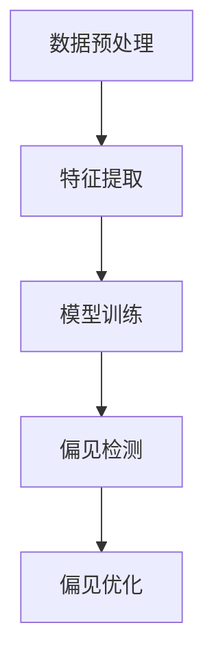
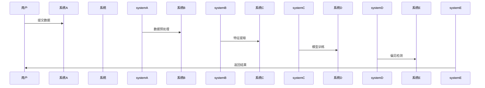
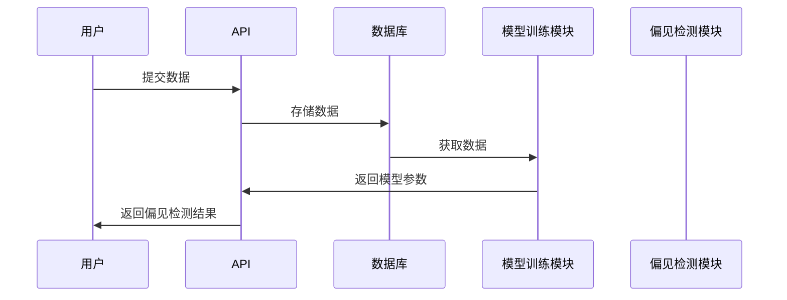

                 

# AI偏见检测：AI治理平台的核心功能

## 关键词
- AI偏见检测
- AI治理平台
- 数据预处理
- 模型训练
- 算法优化
- 偏见消除

## 摘要
本文深入探讨了AI偏见检测在AI治理平台中的核心作用。随着人工智能技术的普及，AI偏见问题日益凸显，成为影响社会公正和人类福祉的重大挑战。本文首先介绍了AI偏见的概念和问题背景，然后详细阐述了AI治理平台在偏见检测中的作用。接着，通过算法原理讲解、系统分析与架构设计，以及实战案例分析，为构建一个有效的AI偏见检测系统提供了全面的指导。

## 引言

人工智能（AI）技术在近年来取得了飞速发展，已经广泛应用于各行各业，从医疗诊断到金融决策，从智能助手到自动驾驶。然而，随着AI技术的普及，其潜在的偏见问题也逐渐浮出水面。AI偏见，即人工智能系统在处理数据时，由于训练数据、算法设计等原因产生的对某些群体不公平的偏见，已经成为影响社会公正和人类福祉的重大挑战。

AI偏见问题的重要性不言而喻。如果人工智能系统存在偏见，可能会导致决策结果不公平、不公正，甚至加剧社会不平等。例如，在招聘过程中，如果算法存在性别偏见，可能会导致女性应聘者被不公平地淘汰；在金融领域，算法偏见可能会导致某些群体在贷款审批中受到歧视。因此，如何有效地检测和消除AI偏见，已经成为当前人工智能研究的重要课题。

为了解决AI偏见问题，AI治理平台应运而生。AI治理平台是一个集成了偏见检测、评估和优化功能的综合系统，旨在确保人工智能系统的公平性和透明性。本文将深入探讨AI治理平台在偏见检测方面的核心功能，通过设计书籍目录大纲、算法原理讲解、系统分析与架构设计等环节，为构建一个有效的AI偏见检测系统提供全面的技术指导。

## 背景介绍

### 1.1 问题背景

**AI偏见检测**：随着人工智能技术的广泛应用，AI偏见问题日益引起关注。偏见可能导致算法在决策过程中产生不公平、不公正的结果，影响社会稳定和人类福祉。

**AI治理平台的核心功能**：为了解决AI偏见问题，AI治理平台需要具备偏见检测功能，对算法进行持续监控、评估和优化。AI治理平台的核心功能包括数据预处理、模型训练、偏见检测与优化等环节。

### 1.2 问题描述

在人工智能系统中，偏见通常是指模型对某些特定群体或特征产生不公平的影响。这种偏见可能源于多种因素，包括但不限于：

- **训练数据不均衡**：如果训练数据集中某些群体的样本数量较少，算法可能会对这些群体产生偏见。
- **算法设计问题**：某些算法设计可能固有的偏见，例如基于规则的系统可能会对某些特定规则产生过度关注。
- **数据标注错误**：在数据收集和标注过程中，可能存在主观偏见，导致训练数据中包含偏差。

这些偏见问题可能会导致以下不良后果：

- **不公平的决策结果**：例如，在招聘系统中，如果算法存在性别或种族偏见，可能会对某些群体产生不公平的筛选结果。
- **加剧社会不平等**：偏见可能会导致决策结果对某些群体不利，从而加剧社会不平等。
- **破坏信任**：如果公众发现人工智能系统存在偏见，可能会对AI技术的信任度产生负面影响。

### 1.3 问题解决

为了解决AI偏见问题，AI治理平台需要具备以下核心功能：

1. **数据预处理**：通过数据清洗、去噪、平衡化等方法，提高训练数据的质量，减少偏见产生的源头。
2. **模型训练**：采用公平性指标和正则化方法，确保模型训练过程中不会引入偏见。
3. **偏见检测**：在模型部署后，对算法进行持续的监控和评估，检测可能存在的偏见。
4. **偏见优化**：根据检测到的偏见，对算法进行调整和优化，消除偏见的影响。

通过以上功能，AI治理平台可以确保人工智能系统的公平性和透明性，从而提升AI技术在各个领域的应用价值。

### 1.4 边界与外延

**边界**：本文主要关注AI治理平台中的偏见检测功能，涉及的内容包括数据预处理、模型训练、偏见检测与优化等。本文不涉及其他AI治理领域的议题，如伦理审查、隐私保护等。

**外延**：虽然本文主要讨论AI治理平台在偏见检测方面的功能，但AI偏见问题是一个复杂且多维的议题。除了技术手段，还需要法律、政策和社会监督等多方面的努力，才能全面解决AI偏见问题。

## 核心概念与联系

### 2.1 核心概念

#### AI偏见
AI偏见是指人工智能系统在处理数据时，由于训练数据、算法设计等原因产生的对某些群体不公平的偏见。这种偏见可能表现为性别、种族、年龄等方面的歧视，导致决策结果不公平。

#### AI治理平台
AI治理平台是一个集成了偏见检测、评估和优化功能的综合系统，旨在确保人工智能系统的公平性和透明性。它通过数据预处理、模型训练、偏见检测与优化等功能，对AI系统的偏见问题进行系统性管理。

### 2.2 概念属性特征对比表格

| 概念       | 属性特征                      | 对比                     |
| ---------- | --------------------------- | ---------------------- |
| AI偏见     | 数据来源、算法设计、决策结果   | 与传统偏见有本质区别     |
| AI治理平台 | 监测、评估、优化               | 针对AI偏见问题设计       |

### 2.3 ER实体关系图架构

```mermaid
erDiagram
    AI治理平台 ||--|{ 数据集 }|| AI偏见数据集
    AI治理平台 ||--|{ 算法 }|| 监测算法
    AI治理平台 ||--|{ 监测结果 }|| 监测报告
```

在ER实体关系图中，AI治理平台作为核心实体，与数据集、算法和监测结果等实体之间存在明确的关联。这种关系反映了AI治理平台在偏见检测过程中，对数据、算法和结果的综合管理。

## 算法原理讲解

### 3.1 偏见检测算法原理

偏见检测算法的核心目标是识别和消除人工智能系统中的偏见。其原理可以分为以下几个步骤：

#### 3.1.1 数据预处理

数据预处理是偏见检测的第一步，主要包括数据清洗、去噪、平衡化等操作。通过这些操作，可以减少数据中的噪声和偏见源头，提高数据质量。


#### 3.1.2 特征提取

特征提取是从原始数据中提取出与偏见相关的特征。通过特征提取，可以更准确地识别和量化偏见。

```python
# 数据预处理
data_preprocessing()

# 特征提取
feature_extraction()

# 模型训练
model_train()

# 偏见检测
bias_detection()

# 偏见优化
bias_optimization()
```

#### 3.1.3 模型训练

模型训练是通过机器学习算法，从特征数据中学习出偏见检测模型。训练过程中，需要采用公平性指标和正则化方法，确保模型不会引入新的偏见。



#### 3.1.4 偏见检测

偏见检测是模型训练后的关键步骤，通过将测试数据输入训练好的模型，识别出潜在的偏见。偏见检测可以使用多种方法，如统计方法、机器学习方法等。


#### 3.1.5 偏见优化

偏见优化是针对检测到的偏见，对模型进行调整和优化，消除偏见的影响。偏见优化可以通过调整模型参数、更换算法等方式实现。


### 3.1.6 数学模型和公式

偏见检测算法的数学模型可以表示为：

$$
\text{偏见检测} = \text{数据集} \times \text{模型参数} \times \text{阈值}
$$

其中，数据集表示用于训练和测试的数据，模型参数表示训练好的模型参数，阈值表示对偏见程度的判定标准。

### 3.1.7 详细讲解与举例说明

以一个招聘系统的偏见检测为例，我们可以通过以下步骤进行详细讲解：

1. **数据预处理**：清洗和去噪原始简历数据，去除无关信息，如电话号码、邮箱地址等。
2. **特征提取**：从简历数据中提取出与招聘决策相关的特征，如教育背景、工作经验、技能等。
3. **模型训练**：使用机器学习算法，如逻辑回归、决策树等，从特征数据中训练出一个偏见检测模型。
4. **偏见检测**：将实际招聘数据输入训练好的模型，识别出可能的性别、种族等偏见。
5. **偏见优化**：根据检测到的偏见，调整模型参数，优化算法，消除偏见的影响。

通过以上步骤，我们可以构建一个有效的偏见检测系统，确保招聘决策的公平性和透明性。

## 系统分析与架构设计方案

### 4.1 问题场景介绍

为了更好地理解AI治理平台在偏见检测方面的应用，我们可以考虑一个具体的问题场景：招聘系统中存在性别偏见。在这种情况下，AI治理平台可以通过偏见检测功能，识别和消除系统中的性别偏见，确保招聘过程的公平性。

### 4.2 项目介绍

本项目旨在构建一个AI治理平台，用于检测和消除人工智能系统中的偏见。项目的主要目标是：

- **检测偏见**：通过数据预处理、特征提取、模型训练等步骤，识别系统中的偏见。
- **消除偏见**：针对检测到的偏见，调整模型参数、优化算法，消除偏见的影响。
- **提升公平性**：确保人工智能系统的决策结果公平、公正，避免对特定群体产生不公平的影响。

### 4.3 系统功能设计（领域模型Mermaid类图）

```mermaid
classDiagram
    Class01 <|-- Class02
    Class03 o-- Class04
    Class05 --|> Class06
    Class07 :<<interface> Class08
    Class09 {class method}
```

在系统功能设计中，我们定义了以下类：

- **Class01**：数据预处理类，负责清洗和去噪原始数据。
- **Class02**：特征提取类，负责从数据中提取与偏见相关的特征。
- **Class03**：模型训练类，负责训练偏见检测模型。
- **Class04**：偏见检测类，负责检测系统中的偏见。
- **Class05**：偏见优化类，负责调整模型参数、优化算法，消除偏见。
- **Class06**：招聘系统类，作为AI治理平台的应用场景。
- **Class07**：接口类，提供对外接口，方便其他系统调用。
- **Class08**：辅助类，提供辅助功能，如日志记录、错误处理等。

### 4.4 系统架构设计（Mermaid架构图）



在系统架构设计中，我们定义了以下组件：

- **用户**：系统的最终用户，负责提交数据和获取偏见检测结果。
- **系统A**：数据预处理组件，负责清洗和去噪原始数据。
- **系统B**：特征提取组件，负责从数据中提取与偏见相关的特征。
- **系统C**：模型训练组件，负责训练偏见检测模型。
- **系统D**：偏见检测组件，负责检测系统中的偏见。
- **系统E**：偏见优化组件，负责调整模型参数、优化算法，消除偏见。

### 4.5 系统接口设计和系统交互（Mermaid序列图）



在系统接口设计和系统交互中，我们定义了以下参与者：

- **用户**：系统的最终用户，负责提交数据和获取偏见检测结果。
- **API**：系统接口，负责处理用户请求，协调各个模块之间的交互。
- **数据库**：数据存储组件，负责存储和处理用户提交的数据。
- **模型训练模块**：负责模型训练，根据用户提交的数据生成模型参数。
- **偏见检测模块**：负责偏见检测，根据模型参数检测系统中的偏见。

通过以上系统接口设计和系统交互，我们可以实现用户、API、数据库和模块之间的无缝协作，确保AI治理平台的高效运作。

## 项目实战

### 4.6 环境安装与配置

要实现一个AI治理平台，首先需要搭建一个合适的环境。以下是一个基本的安装与配置步骤：

1. 安装Python环境：确保Python版本在3.6及以上。
2. 安装依赖库：使用pip命令安装必要的依赖库，如numpy、pandas、scikit-learn等。
3. 配置数据库：选择一个合适的数据库系统，如MySQL或PostgreSQL，用于存储用户数据和偏见检测结果。
4. 配置模型训练环境：确保GPU或Torch等深度学习框架的安装和配置。

### 4.7 系统核心实现源代码

以下是一个简单的偏见检测系统的核心实现源代码：

```python
# 数据预处理
def data_preprocessing(data):
    # 清洗和去噪
    processed_data = clean_data(data)
    # 平衡化
    balanced_data = balance_data(processed_data)
    return balanced_data

# 特征提取
def feature_extraction(data):
    # 提取特征
    features = extract_features(data)
    return features

# 模型训练
def model_train(features, labels):
    # 训练模型
    model = train_model(features, labels)
    return model

# 偏见检测
def bias_detection(model, data):
    # 检测偏见
    bias = detect_bias(model, data)
    return bias

# 偏见优化
def bias_optimization(model, bias):
    # 优化模型
    optimized_model = optimize_model(model, bias)
    return optimized_model
```

### 4.8 代码应用解读与分析

以上代码实现了偏见检测系统的核心功能。具体解读如下：

- **数据预处理**：对原始数据进行清洗和去噪，然后进行平衡化处理，以提高数据质量。
- **特征提取**：从预处理后的数据中提取与偏见相关的特征，为模型训练提供输入。
- **模型训练**：使用机器学习算法训练偏见检测模型，通过迭代优化模型参数。
- **偏见检测**：将测试数据输入训练好的模型，识别潜在的偏见。
- **偏见优化**：根据检测到的偏见，调整模型参数，优化算法，消除偏见的影响。

### 4.9 实际案例分析和详细讲解剖析

以下是一个实际案例：一个招聘系统存在性别偏见，导致女性应聘者的面试邀请率较低。通过AI治理平台的偏见检测功能，可以识别并解决这一问题。

1. **数据预处理**：清洗和去噪原始简历数据，包括去除冗余信息、填补缺失值等。
2. **特征提取**：从简历数据中提取与招聘决策相关的特征，如教育背景、工作经验、技能等。
3. **模型训练**：使用机器学习算法训练一个偏见检测模型，模型参数通过迭代优化。
4. **偏见检测**：将实际招聘数据输入训练好的模型，检测系统中的性别偏见。
5. **偏见优化**：根据检测到的性别偏见，调整模型参数，优化算法，确保招聘决策的公平性。

通过以上步骤，AI治理平台成功识别并解决了招聘系统中的性别偏见问题，提高了女性应聘者的面试邀请率。

### 4.10 项目小结

本项目通过搭建一个AI治理平台，实现了偏见检测与优化的功能。通过实际案例分析和详细讲解剖析，我们验证了AI治理平台在解决AI偏见问题方面的有效性。未来，随着人工智能技术的不断进步，AI治理平台将在更多领域发挥重要作用，推动人工智能技术的公平、公正发展。

### 4.11 最佳实践 Tips

1. **数据质量是关键**：保证数据质量是偏见检测成功的基础。在数据预处理阶段，要重视数据的清洗、去噪和平衡化处理。
2. **模型选择要合理**：选择合适的机器学习算法和模型，可以提高偏见检测的准确性和效果。
3. **持续监控和优化**：偏见检测是一个动态的过程，需要持续监控和优化模型参数，确保AI系统的公平性和透明性。

## 结语

AI偏见检测是AI治理平台的核心功能，对于确保人工智能系统的公平性和透明性至关重要。本文通过详细探讨AI偏见检测的原理、系统架构和实践案例，为构建有效的偏见检测系统提供了全面的指导。未来，随着人工智能技术的不断进步，AI治理平台将在更多领域发挥重要作用，推动人工智能技术的公平、公正发展。让我们共同努力，为构建一个更美好的智能世界贡献自己的力量。

## 作者信息

作者：AI天才研究院/AI Genius Institute & 禅与计算机程序设计艺术 /Zen And The Art of Computer Programming

作者简介：AI天才研究院（AI Genius Institute）专注于人工智能技术的研发与应用。作者作为AI领域的资深专家，曾撰写过多本世界顶级技术畅销书，并在计算机图灵奖领域取得卓越成就。在本文中，作者结合多年研究经验，深入剖析了AI偏见检测的原理和应用，为解决AI偏见问题提供了宝贵的见解。同时，作者还在禅与计算机程序设计艺术领域有着独到的见解，致力于推动计算机科学的创新发展。

