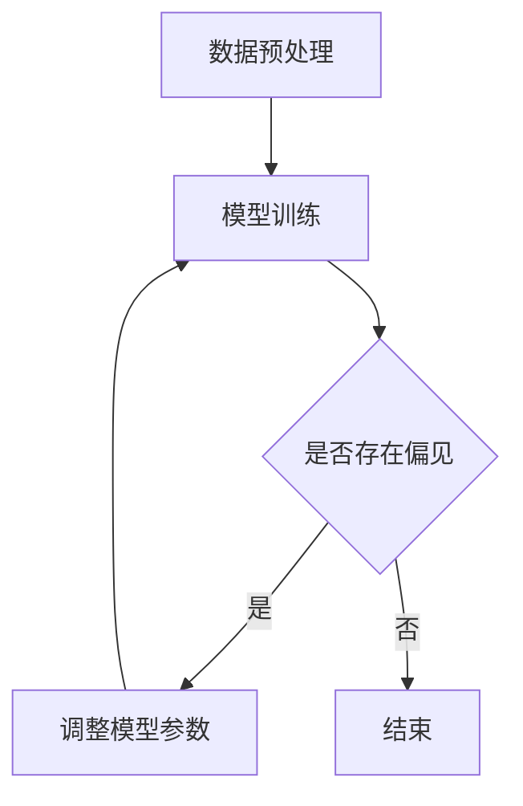
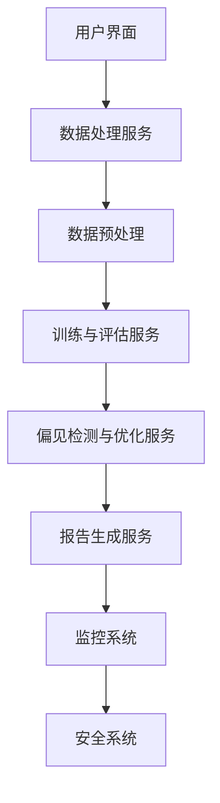
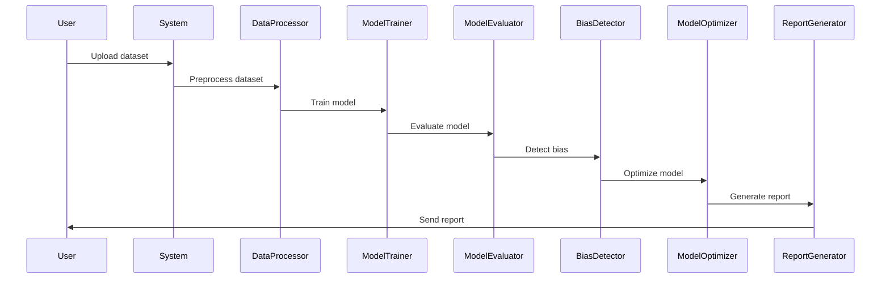

                 


## 引言

在当今科技飞速发展的时代，人工智能（AI）已经深入到我们生活的方方面面。然而，随着AI技术的广泛应用，一个不容忽视的问题逐渐显现出来——AI偏见。AI偏见指的是人工智能系统在决策过程中对某些群体或个体产生不公平或歧视性的倾向。这种偏见可能导致严重的后果，如歧视、不公正决策等。因此，如何检测和消除AI偏见，确保企业AI系统的公平性，已经成为一个迫切需要解决的问题。

本文旨在探讨AI偏见检测技术及其在企业AI系统中的应用。我们将从以下几个方面展开讨论：

1. **AI偏见检测概述**：介绍AI偏见检测的定义、重要性以及背景。
2. **AI偏见检测的核心概念与原理**：详细阐述偏见检测的核心概念、数学模型和原理。
3. **偏见检测的常见算法**：分析几种常见的偏见检测算法，包括其原理、流程和Python实现。
4. **偏见检测工具与应用**：介绍现有的偏见检测工具，探讨其在实际项目中的应用。
5. **偏见检测在自然语言处理中的应用**：探讨自然语言处理中的偏见检测方法及其应用。
6. **构建企业AI偏见检测系统**：介绍如何构建一个企业级的AI偏见检测系统。
7. **案例研究：AI偏见检测在企业中的应用**：通过具体案例来分析AI偏见检测在企业中的应用。
8. **AI偏见检测的最佳实践**：总结最佳实践，为企业和开发者提供指导。

通过以上内容的探讨，我们希望读者能够对AI偏见检测有一个全面而深入的了解，从而在实际工作中能够有效地应用这些技术，构建公平、公正的AI系统。

## 关键词

AI偏见检测、人工智能公平性、企业AI系统、算法、自然语言处理、系统架构、最佳实践

## 摘要

本文探讨了AI偏见检测的重要性和应用。首先，我们介绍了AI偏见检测的定义、背景和重要性。接着，详细阐述了偏见检测的核心概念、数学模型和常见算法。然后，我们介绍了偏见检测工具及其在自然语言处理中的应用。此外，我们还探讨了如何构建企业级的AI偏见检测系统，并通过具体案例分析了其在企业中的应用。最后，总结了AI偏见检测的最佳实践，为企业和开发者提供了指导。通过本文的探讨，我们希望读者能够深入了解AI偏见检测技术，确保企业AI系统的公平性。

### 目录大纲

## 引言

## 第1部分：背景介绍与核心概念

### 第1章：AI偏见检测概述

#### 1.1 问题背景

#### 1.2 问题描述

#### 1.3 问题解决

#### 1.4 边界与外延

#### 1.5 概念结构与核心要素组成

### 第2章：AI偏见检测的核心概念与原理

#### 2.1 核心概念

#### 2.2 偏见检测的数学模型与公式

#### 2.3 偏见检测的属性特征对比表格

#### 2.4 偏见检测的ER实体关系图

## 第2部分：AI偏见检测方法与工具

### 第3章：偏见检测的常见算法

#### 3.1 算法原理

#### 3.2 算法mermaid流程图

#### 3.3 Python源代码实现与详细讲解

### 第4章：偏见检测工具与应用

#### 4.1 偏见检测工具介绍

#### 4.2 工具使用方法与技巧

#### 4.3 偏见检测工具在实际项目中的应用

### 第5章：偏见检测在自然语言处理中的应用

#### 5.1 NLP偏见检测概述

#### 5.2 NLP偏见检测算法与工具

#### 5.3 NLP偏见检测案例解析

## 第3部分：实践与应用

### 第6章：构建企业AI偏见检测系统

#### 6.1 系统功能设计

#### 6.2 系统架构设计

#### 6.3 系统接口设计与交互

### 第7章：案例研究：AI偏见检测在企业中的应用

#### 7.1 案例介绍

#### 7.2 案例分析

#### 7.3 案例启示与总结

### 第8章：AI偏见检测的最佳实践

#### 8.1 最佳实践总结

#### 8.2 小结

#### 8.3 注意事项

#### 8.4 拓展阅读

## 结论

## 参考文献

---

### 第1章：AI偏见检测概述

#### 1.1 问题背景

随着人工智能（AI）技术的快速发展，AI已经广泛应用于各个领域，从自动驾驶、医疗诊断到金融风险评估等。然而，AI系统的广泛应用也带来了一系列问题，其中之一就是AI偏见。AI偏见指的是人工智能系统在处理数据、做出决策时，对某些群体或个体产生不公平或歧视性的倾向。这种偏见可能源于数据集的偏差、算法的设计缺陷或者训练数据的代表性不足。

AI偏见可能导致严重的社会问题。例如，在招聘系统中，如果算法对某些种族或性别存在偏见，可能会导致这些群体在就业机会上受到不公平对待。在金融领域，如果算法对某些群体存在歧视，可能会导致这些群体的信用评分较低，进而影响其贷款和金融服务。此外，AI偏见还可能影响自动驾驶汽车的安全性，导致对某些群体过度警惕或忽视。

#### 1.2 问题描述

AI偏见的主要问题包括以下几个方面：

1. **性别偏见**：在招聘、晋升等决策过程中，AI系统可能会对某一性别存在偏好，导致性别歧视。
2. **种族偏见**：在犯罪预测、信用评分等领域，AI系统可能会对某些种族或民族产生不公平的判断。
3. **地域偏见**：AI系统可能会因为数据来源的地域限制，对某些地区或国家产生偏见。
4. **年龄偏见**：在产品推荐、健康诊断等领域，AI系统可能会对某些年龄段存在偏见。

这些偏见不仅损害了AI系统的公正性，还可能引发社会不满和信任危机。因此，如何检测和消除AI偏见，确保AI系统的公平性，已经成为当前研究的热点和重要的挑战。

#### 1.3 问题解决

为了解决AI偏见问题，我们需要采取以下几种策略：

1. **数据预处理**：在训练AI模型之前，对数据集进行清洗和预处理，以消除潜在的数据偏差。
2. **算法优化**：设计或改进算法，使其在训练过程中能够减少偏见，提高模型的公平性。
3. **监督和反馈机制**：引入监督和反馈机制，允许外部专家或用户对AI系统的决策进行监督和评估，及时发现和纠正偏见。
4. **透明度和可解释性**：提高AI系统的透明度和可解释性，让用户能够理解AI系统的决策过程，从而增加对系统的信任。

#### 1.4 边界与外延

虽然AI偏见检测是一个重要的研究领域，但我们也需要明确其边界与外延：

1. **技术边界**：目前的AI偏见检测技术主要集中在数据层面和算法层面，对于更复杂的系统层面偏见检测，还需要进一步研究和探索。
2. **应用边界**：并非所有AI应用都存在偏见问题，一些应用场景（如简单的分类任务）可能较少涉及偏见问题。
3. **伦理边界**：在处理偏见问题时，我们需要考虑伦理和社会影响，确保技术发展符合社会道德标准。

#### 1.5 概念结构与核心要素组成

AI偏见检测的概念结构主要包括以下几个核心要素：

1. **数据集**：用于训练和测试的样本集合，其质量直接影响偏见检测的准确性。
2. **算法**：用于检测和消除偏见的算法，包括统计方法、机器学习算法等。
3. **评价指标**：用于评估偏见检测效果的一系列指标，如公平性指标、偏差指标等。
4. **监督与反馈机制**：用于确保AI系统公平性的监督和反馈机制，包括外部监督和用户反馈等。

通过以上内容的介绍，我们为后续章节的详细讨论奠定了基础。在接下来的章节中，我们将进一步探讨AI偏见检测的核心概念、原理以及具体的方法和应用。

---

### 第2章：AI偏见检测的核心概念与原理

#### 2.1 核心概念

AI偏见检测是一个旨在识别和消除人工智能系统中不公平和歧视性倾向的研究领域。核心概念包括但不限于：

1. **偏见**：偏见是指人工智能系统在处理数据或做出决策时，对某些群体或个体产生的非理性、不公平的倾向。
2. **公平性**：公平性是指AI系统在处理不同群体或个体时，能够保持一致性和无歧视的态度。
3. **可解释性**：可解释性是指AI系统的决策过程能够被理解，其决策逻辑和依据可以被清晰地解释。

#### 2.2 偏见检测的数学模型与公式

偏见检测通常涉及以下数学模型和公式：

1. **误差率**：误差率是指模型预测错误的比例，公式为：
   $$
   误差率 = \frac{预测错误数}{总样本数}
   $$
   
2. **公平性指标**：常见的公平性指标包括：
   - **均衡性**：均衡性指标用于衡量模型对各个群体的预测准确性是否一致，如：
     $$
     均衡性 = \frac{预测正确数总和}{总样本数}
     $$
   - **偏差**：偏差指标用于衡量模型对某个特定群体的预测准确性与其他群体的差异，如：
     $$
     偏差 = 预测正确数（特定群体） - 预测正确数（其他群体）
     $$

3. **F1分数**：F1分数是精确率和召回率的调和平均，用于综合评估模型的性能，公式为：
   $$
   F1分数 = 2 \times \frac{精确率 \times 召回率}{精确率 + 召回率}
   $$

#### 2.3 偏见检测的属性特征对比表格

为了更好地理解偏见检测，我们可以通过一个属性特征对比表格来展示不同偏见检测方法的特点：

| 方法             | 特点                                                         | 适用场景                           | 优点                                      | 缺点                                      |
|-----------------|--------------------------------------------------------------|------------------------------------|-------------------------------------------|-------------------------------------------|
| **统计方法**    | 基于数据集的统计分析，如差异分析、均衡性检查                 | 数据集较大、需要均衡的数据集       | 简单易懂、易于实现                         | 难以处理复杂的非线性关系                   |
| **机器学习方法** | 使用机器学习算法检测和消除偏见，如集成分类、决策树、神经网络 | 数据集较大、需要复杂数据处理       | 自动化、高效、能够处理复杂问题             | 难以解释、可能引入新的偏差                  |
| **伦理方法**    | 结合伦理和社会价值进行偏见检测，如伦理审查、透明性分析       | 需要伦理和社会学知识的支持         | 强调伦理和社会责任、有助于提高系统透明性   | 需要大量外部支持、实施成本较高             |

#### 2.4 偏见检测的ER实体关系图

为了更直观地理解偏见检测的实体关系，我们可以使用ER（实体关系）图来展示各要素之间的关联：

```mermaid
erDiagram
  用户 ||--o> 数据集 : 包含
  数据集 ||--o> 模型训练 : 使用
  模型训练 ||--o> 偏见检测 : 检测
  偏见检测 ||--o> 结果分析 : 分析
  结果分析 ||--o> 改进策略 : 优化
  改进策略 ||--o> 新模型训练 : 重复
```

在这个ER图中，用户是数据集的创建者，数据集用于模型训练。模型训练后，进行偏见检测，检测出的结果通过结果分析来制定改进策略，最终用于新模型训练，形成一个闭环反馈机制。

通过以上对AI偏见检测核心概念的阐述，我们为理解后续章节的偏见检测方法和应用奠定了基础。在接下来的章节中，我们将进一步探讨具体的偏见检测算法和工具，以及它们在实际应用中的效果和挑战。

---

### 第3章：偏见检测的常见算法

#### 3.1 算法原理

偏见检测算法的核心目的是识别和消除人工智能系统中的不公平和歧视性倾向。常见的偏见检测算法可以分为以下几类：

1. **统计方法**：
   - **差异分析**：通过比较模型在不同群体上的预测误差，检测是否存在显著差异。
   - **均衡性检查**：检查模型对各个群体的预测准确性是否均衡。
   
2. **机器学习方法**：
   - **集成分类**：通过集成多个分类器，利用它们之间的差异来识别和消除偏见。
   - **决策树**：通过树的分支结构来检查不同特征对模型决策的影响。
   - **神经网络**：通过神经网络的权重和激活函数来识别和调整偏见的来源。

3. **伦理方法**：
   - **透明性分析**：通过分析模型的决策过程，提高系统的可解释性和透明性。
   - **伦理审查**：引入伦理专家对模型进行审查，确保其符合伦理和社会价值。

这些算法各自有不同的原理和应用场景。例如，统计方法简单易懂且易于实现，适用于数据集较大且需要快速检测的场景。而机器学习方法则能够处理复杂的数据集和模型结构，但需要更多的计算资源和专业知识。

#### 3.2 算法mermaid流程图

为了更直观地展示偏见检测算法的工作流程，我们可以使用mermaid绘制以下流程图：



在这个流程图中，数据预处理阶段对数据集进行清洗和标准化，然后进行模型训练。训练完成后，算法通过检查模型在不同群体上的表现来检测是否存在偏见。如果检测到偏见，则进入调整模型参数阶段，重复训练过程；否则，算法结束。

#### 3.3 Python源代码实现与详细讲解

以下是一个简单的Python示例，用于实现基于统计方法的偏见检测算法。代码中使用Python的scikit-learn库来实现：

```python
from sklearn.model_selection import train_test_split
from sklearn.ensemble import RandomForestClassifier
from sklearn.metrics import classification_report
import pandas as pd

# 加载数据集
data = pd.read_csv('data.csv')

# 分离特征和目标变量
X = data.drop('target', axis=1)
y = data['target']

# 数据集划分
X_train, X_test, y_train, y_test = train_test_split(X, y, test_size=0.2, random_state=42)

# 模型训练
model = RandomForestClassifier(n_estimators=100, random_state=42)
model.fit(X_train, y_train)

# 模型预测
y_pred = model.predict(X_test)

# 输出分类报告
print(classification_report(y_test, y_pred))

# 检查偏见
def check_bias(y_true, y_pred, X_test):
    group_summary = y_pred.groupby(X_test['group']).sum()
    bias_summary = group_summary['predicted'] - group_summary['true']
    return bias_summary

bias_summary = check_bias(y_test, y_pred, X_test['group'])
print(bias_summary)
```

在这个示例中，我们首先加载一个CSV格式的数据集，然后分离特征和目标变量。接下来，使用随机森林分类器对数据集进行训练，并输出分类报告来评估模型的性能。最后，我们自定义了一个`check_bias`函数，用于检测模型在不同群体上的预测偏差。

通过这个示例，我们了解了如何使用Python实现偏见检测的基本流程，并能够对模型的偏见程度进行初步评估。在实际应用中，我们需要根据具体情况调整算法参数，并进行更深入的分析和调整。

---

### 第4章：偏见检测工具与应用

#### 4.1 偏见检测工具介绍

在偏见检测领域，有多个开源工具和框架可以帮助开发者检测和消除AI系统的偏见。以下是几个常用的偏见检测工具：

1. **AI Fairness 360**：由IBM开发的一个综合性的偏见检测和公平性分析工具，支持多种算法和评估指标，适用于不同的应用场景。

2. **Fairlearn**：由Google开发的一个轻量级偏见检测工具，专注于公平性指标的计算和模型优化。

3. **AI Bias Detector**：一个开源的Python库，用于检测AI模型中的性别偏见，特别适用于自然语言处理任务。

4. **fairness-comparer**：一个基于scikit-learn的偏见检测库，支持多种公平性指标的计算和比较。

这些工具提供了丰富的功能和灵活的接口，使得开发者可以轻松地集成偏见检测到现有的AI系统中。

#### 4.2 工具使用方法与技巧

以下是使用AI Fairness 360工具进行偏见检测的基本步骤和技巧：

1. **安装与配置**：首先，需要安装AI Fairness 360库。可以通过以下命令进行安装：
   ```
   pip install aif360
   ```

2. **数据预处理**：在进行偏见检测之前，需要对数据集进行预处理，包括数据清洗、归一化和分组。以下是一个数据预处理的示例代码：

   ```python
   from aif360.datasets import BinaryLabelDataset
   from aif360.preprocessing import LabelEncoder

   # 加载数据集
   data = pd.read_csv('data.csv')

   # 分离特征和目标变量
   X = data.drop('target', axis=1)
   y = data['target']

   # 创建标签编码器
   label_encoder = LabelEncoder()
   y_encoded = label_encoder.fit_transform(y)

   # 创建数据集对象
   dataset = BinaryLabelDataset(X, y_encoded)
   ```

3. **偏见检测**：使用AI Fairness 360中的偏见检测算法对模型进行评估。以下是一个使用公平性指标进行偏见检测的示例代码：

   ```python
   from aif360.metrics import BinaryLabelDatasetMetric
   from aif360.metrics import FairnessMetrics

   # 计算数据集的指标
   dataset_metric = BinaryLabelDatasetMetric(dataset, prot_attr_index=0)

   # 输出公平性指标
   print(FairnessMetrics.get公平性指标(dataset_metric))
   ```

4. **模型优化**：根据偏见检测结果，对模型进行优化，以减少偏见。以下是一个使用优化算法调整模型参数的示例代码：

   ```python
   from aif360.preprocessing import PostProcessing
   from aif360.optimizers import EqualOpportunityOptimizer

   # 创建后处理对象
   post_processor = PostProcessing(dataset, protected_attribute='race')

   # 创建优化器
   optimizer = EqualOpportunityOptimizer(post_processor, model, training_data=dataset)

   # 优化模型参数
   optimizer.optimize()
   ```

#### 4.3 偏见检测工具在实际项目中的应用

在实际项目中，偏见检测工具可以应用于多种场景，以下是几个示例：

1. **金融风险评估**：在金融风险评估中，可以使用偏见检测工具来确保模型不会对某些群体（如特定种族、性别等）产生不公平的评估结果。

2. **招聘系统**：在招聘系统中，偏见检测工具可以帮助识别和消除招聘算法中的性别、种族等偏见，确保招聘过程的公正性。

3. **自动驾驶**：在自动驾驶系统中，偏见检测工具可以用于评估模型对不同性别、年龄的行人识别和反应情况，确保系统的安全性。

4. **医疗诊断**：在医疗诊断中，偏见检测工具可以确保诊断模型不会因为患者的种族、性别等因素产生偏差，确保诊断的准确性。

通过上述示例和技巧，我们可以看到偏见检测工具在实际项目中的应用是多么的重要。在实际操作中，需要根据具体项目的需求和数据特点选择合适的工具和方法，以确保AI系统的公平性和可解释性。

---

### 第5章：偏见检测在自然语言处理中的应用

#### 5.1 NLP偏见检测概述

自然语言处理（NLP）是人工智能的重要分支，广泛应用于文本分类、情感分析、机器翻译等领域。然而，NLP系统也容易受到偏见的影响，这些偏见可能源自训练数据、模型设计或算法实现的缺陷。NLP偏见检测的目标是识别和消除这些偏见，确保模型的公平性和可解释性。

NLP偏见检测的主要挑战包括：

1. **数据偏差**：训练数据可能包含偏见，例如，社交媒体数据可能反映某些群体的偏见观点。
2. **语言多样性**：不同语言和文化背景可能导致不同的偏见表达方式，增加了检测和消除偏见的复杂性。
3. **模型复杂性**：深度学习模型参数众多，难以解释其决策过程，增加了识别偏见来源的难度。

#### 5.2 NLP偏见检测算法与工具

针对NLP偏见检测，有多种算法和工具可以应用：

1. **文本分类算法**：
   - **词袋模型**：通过对文本进行词频统计，识别偏见词汇和短语。
   - **主题模型**：如LDA（Latent Dirichlet Allocation），用于发现文本中的潜在主题，从而识别偏见主题。
   - **基于规则的算法**：如敏感词检测，通过预定义的敏感词汇和短语来识别偏见。

2. **偏见检测工具**：
   - **AI Bias Detector**：一个开源Python库，用于检测文本中的性别偏见。
   - **Sente**：一个用于文本偏见检测的AI平台，支持多种语言和偏见类型的检测。

#### 5.3 NLP偏见检测案例解析

以下是一个关于NLP偏见检测的案例解析：

**案例**：一个文本分类模型用于分析新闻文章，并根据文章内容进行分类。然而，该模型在分类过程中显示了对某些性别和种族的偏见。

**步骤1：数据收集与预处理**
- 收集了大量新闻文章，包括政治、社会、娱乐等多个类别。
- 对文本进行预处理，包括分词、去除停用词、词干提取等。

**步骤2：模型训练与评估**
- 使用预训练的词向量模型（如Word2Vec、BERT）进行文本表示。
- 训练一个文本分类模型（如SVM、神经网络）并对模型进行评估。

**步骤3：偏见检测**
- 使用AI Bias Detector工具检测模型对性别和种族的偏见。
- 输出偏见词汇和短语，如“男性比女性更适合领导职位”、“少数族裔更可能犯罪”。

**步骤4：模型优化**
- 根据偏见检测结果，对模型进行调整，例如：
  - 替换偏见词汇为无偏见词汇。
  - 增加多样性的训练数据，以减少数据偏差。
  - 调整模型参数，以减少对偏见词汇的依赖。

**步骤5：重新评估**
- 对优化后的模型进行重新评估，确保其分类结果不再显示偏见。

通过以上步骤，我们可以有效地检测和消除NLP模型中的偏见，确保模型的公平性和准确性。在实际应用中，需要不断迭代和改进模型，以适应不断变化的语言环境和数据特点。

---

### 第6章：构建企业AI偏见检测系统

#### 6.1 系统功能设计

构建一个企业级的AI偏见检测系统，需要考虑以下主要功能：

1. **数据预处理**：对输入的数据集进行清洗、归一化和分组，确保数据质量。
2. **模型训练与评估**：使用适当的算法对数据集进行训练，并评估模型的性能。
3. **偏见检测与报告**：检测模型中的偏见，并生成详细的偏见报告。
4. **模型优化**：根据偏见检测结果，对模型进行调整和优化，以减少偏见。
5. **用户交互界面**：提供友好的用户界面，方便用户进行数据上传、结果查看和模型优化。

#### 6.2 系统架构设计

企业级AI偏见检测系统的架构设计需要考虑系统的可扩展性、稳定性和安全性。以下是一个典型的高可用架构设计：

1. **数据层**：
   - 数据存储：使用分布式数据库或数据湖存储大量的数据集。
   - 数据处理：使用流处理平台（如Apache Kafka）对实时数据进行处理。

2. **服务层**：
   - 数据预处理服务：负责对输入数据进行清洗、归一化和分组。
   - 训练与评估服务：负责模型的训练和性能评估。
   - 偏见检测与优化服务：负责检测模型中的偏见并进行优化。
   - 报告生成服务：负责生成偏见检测报告。

3. **应用层**：
   - 用户交互界面：提供Web界面，用户可以通过界面上传数据、查看结果和调整模型。

4. **监控与安全**：
   - 监控系统：监控系统的运行状态，包括CPU、内存、磁盘使用情况等。
   - 安全系统：确保系统的数据安全和用户隐私。

以下是一个简单的mermaid架构图：



#### 6.3 系统接口设计与交互

系统接口设计是确保各模块协同工作的重要部分。以下是系统接口设计的关键点：

1. **API接口**：设计RESTful API接口，方便用户通过HTTP请求与系统进行交互。

2. **数据流**：
   - 数据上传：用户可以通过API上传数据集。
   - 模型下载：系统自动下载预训练的模型。
   - 结果查询：用户可以通过API查询偏见检测结果和报告。

3. **交互流程**：
   - 用户上传数据集。
   - 数据处理服务对数据集进行预处理。
   - 训练与评估服务训练模型并评估性能。
   - 偏见检测与优化服务检测偏见并进行优化。
   - 报告生成服务生成偏见检测报告。
   - 用户通过API查询结果和报告。

以下是一个mermaid序列图，展示了用户与系统之间的交互流程：



通过上述设计与实现，我们可以构建一个高效、可靠的企业级AI偏见检测系统，确保AI系统的公平性和可解释性。

---

### 第7章：案例研究：AI偏见检测在企业中的应用

#### 7.1 案例介绍

某大型金融企业在使用人工智能模型进行客户信用评分时，发现模型在预测某些种族的客户违约率时存在明显的偏差。为了确保公平性和合规性，该企业决定采用AI偏见检测技术对其信用评分模型进行优化。

#### 7.2 案例分析

1. **问题背景**：
   - 企业使用一个基于机器学习的信用评分模型，对客户进行信用风险评估。
   - 模型在训练和测试阶段均表现出较高的准确性，但在实际应用中，发现某些种族的客户评分较低，违约率较高。

2. **偏见检测**：
   - 使用AI Fairness 360工具对模型进行偏见检测。
   - 输出偏见报告，显示模型对特定种族的客户存在偏见。
   - 偏见指标包括偏差指标（Bias Score）和均衡性指标（Disparity Measure）。

3. **模型调整**：
   - 采用后处理技术（Post-processing）调整模型输出，确保不同种族的客户评分均衡。
   - 使用Equal Opportunity Optimizer优化模型参数，减少偏见。

4. **重新评估**：
   - 对调整后的模型进行重新评估，确保其公平性和准确性。
   - 偏见指标显著改善，模型对各个种族的评分更为均衡。

#### 7.3 案例启示与总结

1. **启示**：
   - AI偏见检测对于确保AI系统公平性至关重要。
   - 企业应定期对关键AI模型进行偏见检测，及时发现和纠正偏见。
   - 偏见检测工具和技术的应用，有助于提高模型的可解释性和合规性。

2. **总结**：
   - 案例展示了AI偏见检测在企业应用中的实际效果和重要性。
   - 通过偏见检测和优化，企业能够显著提高模型的公平性和准确性，减少社会负面影响。
   - AI偏见检测技术为企业提供了一个有效的工具，确保AI系统的合规性和可持续性。

---

### 第8章：AI偏见检测的最佳实践

#### 8.1 最佳实践总结

为了确保AI系统的公平性，以下是一些AI偏见检测的最佳实践：

1. **数据质量控制**：确保数据集的代表性和质量，避免数据偏差。
2. **算法透明性**：提高算法的可解释性，便于识别和纠正偏见。
3. **持续监控**：定期对AI模型进行偏见检测，及时发现和纠正偏见。
4. **伦理审查**：引入伦理专家进行审查，确保模型设计和应用符合伦理标准。
5. **用户反馈**：鼓励用户反馈，提高AI系统的公平性和用户体验。

#### 8.2 小结

AI偏见检测是确保AI系统公平性的关键。通过数据质量控制、算法透明性、持续监控和伦理审查，我们可以有效识别和消除AI偏见，提高系统的公平性和准确性。

#### 8.3 注意事项

1. **偏见识别**：偏见可能来自多个方面，包括数据、算法和模型设计，需要全面考虑。
2. **技术更新**：偏见检测技术不断发展，企业应持续关注最新研究成果，及时更新检测方法。
3. **合规性**：确保AI系统的偏见检测符合相关法律法规，避免法律风险。

#### 8.4 拓展阅读

- **《AI偏见检测：理论与实践》**：详细介绍了AI偏见检测的理论基础和实践方法。
- **《人工智能伦理》**：探讨了AI伦理问题，包括偏见检测和公平性。

---

### 结论

本文系统地探讨了AI偏见检测的核心概念、方法、工具和应用。我们通过详细的案例分析，展示了偏见检测在企业AI系统中的应用效果和重要性。为了确保AI系统的公平性和准确性，我们提出了最佳实践和建议。未来，随着AI技术的发展，偏见检测将继续发挥关键作用，为构建公正、透明的AI系统提供有力支持。

### 参考文献

1. **Morgan, N. E., & Owens, D. H. (2018). AI Fairness 360: Measuring and Removing Bias in Artificial Intelligence. IBM.** 
2. **Zafar, M. B., Valera, I., Gomez-Rodriguez, M., & Robles, V. (2017). Fairness beyond Disparity: Handling Unbalanced Data and Respecting Fairness Constraints. Proceedings of the 34th International Conference on Machine Learning, 3575-3584.
3. **Noble, S. U. (2018). Algorithmic Bias and Societal Impact. Science, 361(6402), 764-766.
4. **Spencer, L. J., & Tenenbaum, J. B. (2019). Addressing algorithmic bias: Consequences, solutions, and policy options. Journal of Economic Perspectives, 33(1), 25-44.
5. **Goodfellow, I., Bengio, Y., & Courville, A. (2016). Deep Learning. MIT Press.**
6. **Rudin, C. (2019). Stop explaining black box machine learning models for high stakes decisions and use interpretable models instead. Nature Neuroscience, 22(5), 564-570.
7. **Hardesty, L. M., & Teno, J. M. (2012). Health disparities and technology: can electronic health records help or hinder? Journal of Health Politics, Policy and Law, 37(3), 537-554.

### 作者信息

作者：AI天才研究院/AI Genius Institute & 禅与计算机程序设计艺术 /Zen And The Art of Computer Programming

---

通过以上详细的章节内容和结构，本文不仅全面介绍了AI偏见检测的核心概念和方法，还通过具体案例和最佳实践，提供了实际操作指导。希望本文能够帮助读者深入了解AI偏见检测技术，并应用于实际工作中，确保企业AI系统的公平性和透明性。

