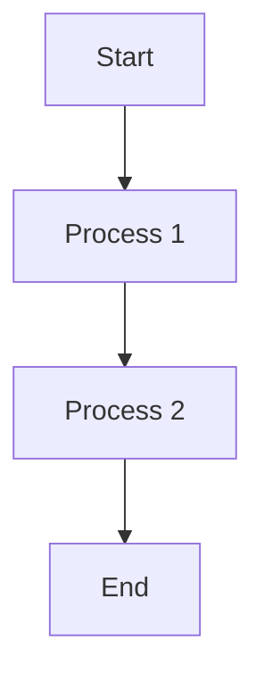

                 

Sure, let's think step by step to develop the content for each chapter of the book "AI Bias Elimination: Building a Fair and Just Enterprise AI Ecosystem".

### Chapter 1: Introduction

1. **Background**:
   - AI's impact on modern society
   - Recent incidents of AI bias
   - Why AI bias is a critical issue

2. **Problem Description**:
   - Types of AI bias
   - Examples of bias in AI systems
   - Consequences of AI bias

3. **Research Purpose and Significance**:
   - Goals of the study
   - Importance of addressing AI bias
   - Expected outcomes

4. **Boundaries and Extensions**:
   - Scope of the research
   - Limitations
   - Potential areas for future research

### Chapter 2: Core Concepts and Relationships

1. **Basic Principles of AI**:
   - Overview of AI history
   - Key concepts in AI

2. **Definition and Classification of AI Bias**:
   - Different types of bias
   - Causes of bias

3. **Bias Elimination and Fairness**:
   - Importance of fairness
   - Methods to achieve fairness

4. **Concept Attributes Comparison Table**:
   - Key attributes of AI bias
   - Comparison across different types

5. **ER Entity Relationship Diagram**:
   - ER diagram to illustrate the relationships between entities
   - Key entities and their relationships

### Chapter 3: Principles of AI Bias Elimination

1. **Mechanism of Bias Generation**:
   - How biases emerge in AI systems
   - Factors contributing to bias

2. **Techniques for Bias Detection**:
   - Methods for identifying biases
   - Tools and frameworks

3. **Methods for Bias Assessment**:
   - Evaluating the severity of bias
   - Criteria for assessment

### Chapter 4: Mathematical Models and Formulas

1. **Basic Mathematical Models**:
   - Fundamentals of mathematical models used in AI
   - Key concepts and their implications

2. **Bias Elimination Algorithms**:
   - Overview of algorithms designed to eliminate bias
   - Steps and processes involved

3. **Algorithm Principles**:
   - Detailed explanation of algorithm principles
   - How algorithms work to eliminate bias

4. **Mermaid Flowchart**:
   - A Mermaid flowchart illustrating the algorithm's workflow
   - Key steps and decisions in the algorithm

### Chapter 5: Detailed Explanation and Python Implementation

1. **Algorithm Implementation Steps**:
   - Step-by-step guide to implementing the algorithm
   - Detailed explanation of each step

2. **Python Source Code Analysis**:
   - Python code used to implement the algorithm
   - Line-by-line explanation of the code

3. **Mathematical Model and Formula Explanation**:
   - Detailed explanation of the mathematical model and formulas used
   - How they contribute to bias elimination

4. **Mermaid Flowchart**:
   - A Mermaid flowchart demonstrating the implementation process
   - Key steps and interactions

### Chapter 6: Enterprise AI Ecosystem Design

1. **Ecosystem Overview**:
   - Components of an enterprise AI ecosystem
   - Importance of ecosystem design

2. **System Function Design**:
   - Overview of system functions
   - Key features and capabilities

3. **System Architecture Design**:
   - High-level architecture of the system
   - Components and interactions

4. **System Interface Design**:
   - Design of system interfaces
   - Purpose and functionality

5. **System Interaction Design**:
   - Design of system interactions
   - Flow of data and information

### Chapter 7: Practical Implementation and Case Analysis

1. **Environment Setup**:
   - Steps to set up the development environment
   - Required tools and software

2. **System Core Implementation**:
   - Detailed implementation of the system core
   - Key modules and functionalities

3. **Code Application Analysis**:
   - Analysis of the code implementation
   - How the system works in practice

4. **Case Analysis**:
   - Case studies demonstrating the system's effectiveness
   - Lessons learned and insights gained

5. **Project Summary**:
   - Summary of the project's achievements
   - Challenges faced and solutions

### Chapter 8: Best Practices

1. **Case Sharing**:
   - Sharing of successful cases
   - Key lessons from each case

2. **Practical Tips**:
   - Tips for implementing AI bias elimination
   - Common pitfalls and how to avoid them

3. **Notes**:
   - Points to consider for effective AI bias elimination

### Chapter 9: Summary

1. **Research Findings**:
   - Summary of the research outcomes
   - Key contributions

2. **Challenges and Prospects**:
   - Challenges in AI bias elimination
   - Future research directions

### Chapter 10: Further Reading

1. **Recommended Books**:
   - Books on AI, bias elimination, and related topics

2. **Academic Papers**:
   - Recent research papers on AI bias

3. **Conferences**:
   - Upcoming and past conferences on AI and bias

By following this step-by-step approach, each chapter will be developed in a logical and coherent manner, ensuring that the content is comprehensive, detailed, and informative. The structure will be maintained using markdown format, with appropriate use of LaTeX for mathematical formulas and Mermaid for diagrams and flowcharts.

---

### Markdown Format and LaTeX Example

Let's illustrate the markdown format and LaTeX for mathematical formulas:

#### Markdown Format

```markdown
## Chapter Title

### Section Title

- Bullet point 1
- Bullet point 2
- Bullet point 3
```

#### LaTeX Format for Inline Formula

```markdown
$$1+1=2$$
```

#### LaTeX Format for Displayed Formula

```markdown
$$
\frac{d^2}{dx^2}\left(\frac{y}{x}\right) = \frac{2}{x^3}
$$
```

#### Mermaid Flowchart



By combining these formats, you can create a well-structured and informative technical article that is both visually appealing and easy to read. Each section will be clearly defined, and mathematical concepts and algorithms will be explained in a way that is accessible to readers with varying levels of technical expertise.

