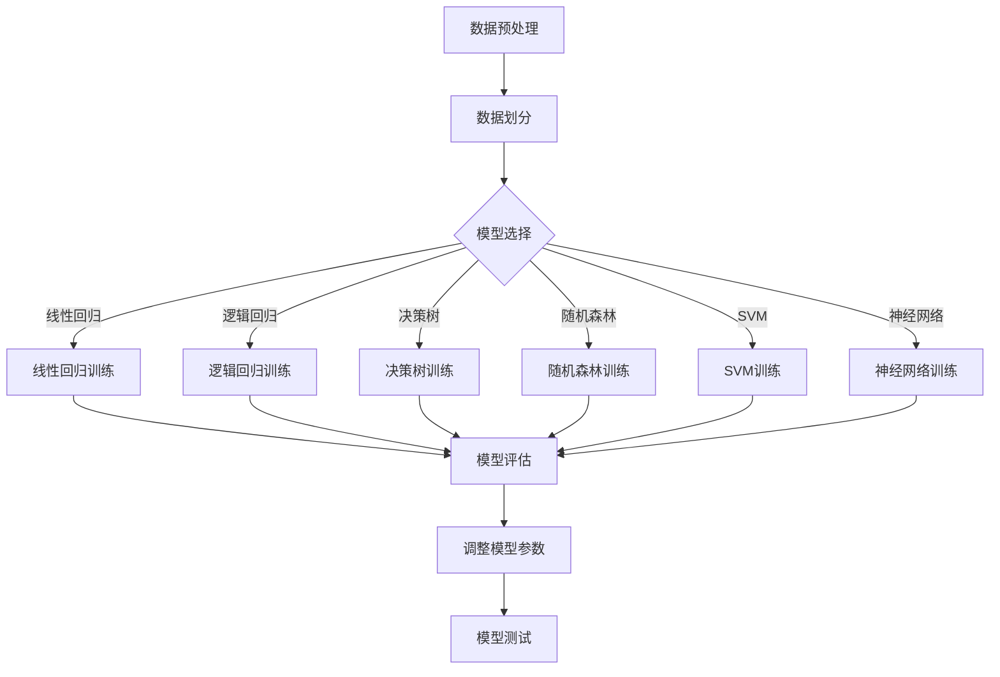
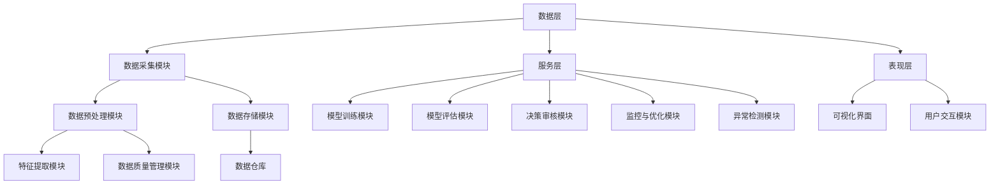
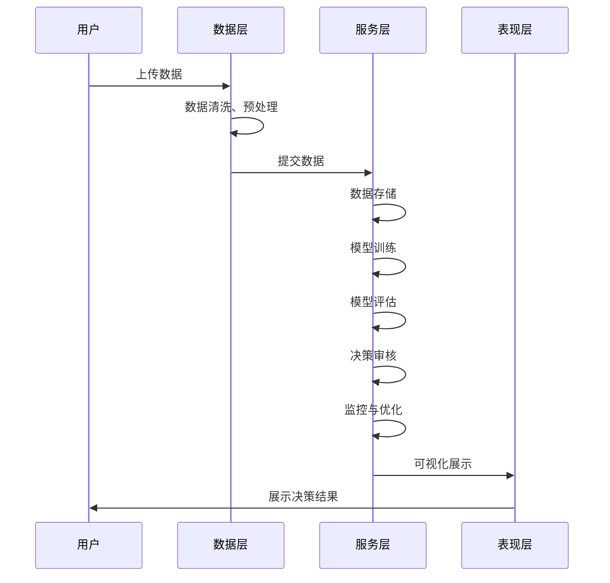

                 

# AI决策审核机制：企业如何监控AI系统表现

## 关键词：AI决策、审核机制、企业监控、系统表现、技术实现

### 摘要：

随着人工智能（AI）在各个行业的深入应用，AI决策审核机制的重要性愈发凸显。本文旨在探讨企业如何构建和监控AI决策审核机制，确保AI系统的公正性、透明性和可靠性。文章首先介绍了AI决策审核机制的核心概念和必要性，随后详细阐述了设计原则、技术实现、监控优化以及行业应用。最后，本文探讨了AI决策审核机制的法律法规与伦理问题，并对其未来发展进行了展望。希望通过本文的讨论，能够为企业提供有价值的参考和指导。

## 目录大纲

### 第一部分：AI决策审核机制概述

#### 第1章：问题背景与核心概念

##### 1.1.1 问题背景

##### 1.1.2 核心概念与联系

##### 1.1.3 关键性能指标（KPI）解析

#### 第2章：AI决策审核机制的设计原则

##### 2.1.1 设计原则概述

##### 2.1.2 设计流程与框架

### 第二部分：技术实现

#### 第3章：AI决策审核机制的技术实现

##### 3.1.1 数据采集与处理

##### 3.1.2 模型训练与评估

#### 第4章：AI决策审核机制的监控与优化

##### 4.1.1 监控策略与工具

##### 4.1.2 优化方法与案例分析

### 第三部分：行业应用

#### 第5章：AI决策审核机制在具体行业的应用

##### 5.1.1 金融行业的应用

##### 5.1.2 电商行业的应用

### 第四部分：法律法规与伦理问题

#### 第6章：AI决策审核机制的法律法规与伦理问题

##### 6.1.1 法律法规概述

##### 6.1.2 伦理问题探讨

### 第五部分：未来发展趋势

#### 第7章：AI决策审核机制的未来发展趋势

##### 7.1.1 技术演进趋势

##### 7.1.2 行业应用前景

### 第六部分：结论与展望

#### 第8章：结论与展望

### 参考文献

---

## 第一部分：AI决策审核机制概述

### 第1章：问题背景与核心概念

#### 1.1.1 问题背景

随着人工智能（AI）技术的发展，越来越多的企业开始将AI应用到决策过程中。AI决策因其高效性、准确性和灵活性而受到企业的青睐。然而，AI系统的决策过程通常是非线性和复杂的，缺乏透明性，且容易受到数据偏差和模型过拟合的影响。因此，如何构建一个有效的AI决策审核机制，以确保AI系统在决策过程中的公正性、透明性和可靠性，成为企业面临的重要挑战。

#### 1.1.2 核心概念与联系

**AI决策**：AI决策是指利用机器学习算法和大数据技术，对输入的数据进行智能分析和推理，从而生成决策建议的过程。

**审核机制**：审核机制是指对AI决策过程进行监督、评估和验证的一系列制度和流程，以确保AI决策的公正性、透明性和可靠性。

**关键性能指标（KPI）**：关键性能指标（KPI）是用于评估AI决策审核机制性能的一系列指标，如决策准确性、模型可解释性、数据偏差检测等。

#### 1.1.3 关键性能指标（KPI）解析

- **决策准确性**：决策准确性是评估AI决策系统性能的核心指标，反映了AI决策系统在实际应用中的表现。

- **模型可解释性**：模型可解释性是指AI决策系统的决策过程和结果是否易于理解，是确保AI决策公正性和透明性的重要因素。

- **数据偏差检测**：数据偏差检测是指通过算法和技术手段，识别和纠正数据集中可能存在的偏差和异常，确保AI决策系统在数据输入上的公正性。

### 第2章：AI决策审核机制的设计原则

#### 2.1.1 设计原则概述

**透明性**：确保AI决策过程的透明性，使得决策结果可解释和可追溯。

**可解释性**：提高AI决策系统的可解释性，帮助用户理解和信任决策结果。

**可依赖性**：确保AI决策系统的稳定性和可靠性，降低决策错误的风险。

#### 2.1.2 设计流程与框架

**需求分析**：明确AI决策系统的需求和目标，确定审核机制的功能和性能要求。

**模型选择与训练**：选择合适的机器学习算法和训练数据，构建和训练AI决策模型。

**审核流程设计**：设计AI决策审核流程，包括数据采集、预处理、模型评估、结果输出等环节。

---

## 第二部分：技术实现

### 第3章：AI决策审核机制的技术实现

#### 3.1.1 数据采集与处理

数据采集是AI决策审核机制的基础。企业需要收集大量、多样和高质量的输入数据，包括用户行为数据、市场数据、业务数据等。数据采集后，需要对数据进行预处理，包括数据清洗、归一化、特征提取等步骤，以确保数据质量。

**数据来源**：

- 用户行为数据：通过网站日志、用户交互数据等获取。
- 市场数据：通过第三方数据平台、公开数据集等获取。
- 业务数据：通过企业内部数据库、业务系统等获取。

**数据预处理方法**：

- 数据清洗：去除缺失值、异常值、重复值等。
- 数据归一化：将不同量级的数据统一到同一尺度。
- 特征提取：从原始数据中提取具有代表性的特征。

**数据质量管理**：

- 数据完整性：确保数据完整无缺。
- 数据准确性：确保数据真实可靠。
- 数据一致性：确保数据在不同系统、不同时间点的一致性。

#### 3.1.2 模型训练与评估

**常见算法介绍**：

- **线性回归**：用于预测连续值输出。
- **逻辑回归**：用于预测二分类输出。
- **决策树**：用于分类和回归。
- **随机森林**：基于决策树的集成方法，提高预测准确性。
- **支持向量机（SVM）**：用于分类和回归。
- **神经网络**：用于复杂非线性问题。

**模型训练流程**：

- 数据划分：将数据集划分为训练集、验证集和测试集。
- 模型选择：选择合适的算法和参数。
- 模型训练：使用训练集数据训练模型。
- 模型评估：使用验证集和测试集评估模型性能。

**模型评估指标**：

- **准确率**：预测正确的样本占总样本的比例。
- **召回率**：预测正确的正样本占总正样本的比例。
- **F1值**：准确率和召回率的调和平均值。
- **ROC曲线**：接受者操作特性曲线，用于评估分类模型的性能。

---

## 第三部分：监控与优化

### 第4章：AI决策审核机制的监控与优化

#### 4.1.1 监控策略与工具

**实时监控**：

- 使用实时监控系统，实时获取AI决策系统的运行状态和性能指标。
- 对监控数据进行实时分析和报警，及时发现和解决异常情况。

**异常检测**：

- 使用异常检测算法，识别和诊断AI决策系统中的异常行为和错误决策。
- 对异常行为进行记录和分析，为模型优化提供依据。

**监控工具推荐**：

- **Prometheus**：开源的监控报警工具，支持多种数据源和告警机制。
- **Grafana**：基于Prometheus的监控仪表盘，提供可视化分析功能。
- **TensorBoard**：TensorFlow的监控和分析工具，用于可视化模型训练过程。

#### 4.1.2 优化方法与案例分析

**趋势分析**：

- 分析AI决策系统的性能趋势，识别性能瓶颈和改进方向。
- 根据趋势分析结果，制定针对性的优化策略。

**模型调优**：

- 调整模型参数，优化模型性能。
- 使用交叉验证等方法，评估模型调优效果。

**案例解析**：

- 分析典型案例，探讨AI决策审核机制的优化方法和实践经验。
- 从案例中总结经验教训，为其他企业提供参考。

---

## 第四部分：行业应用

### 第5章：AI决策审核机制在具体行业的应用

#### 5.1.1 金融行业的应用

在金融行业，AI决策审核机制主要用于风险管理、信用评估和交易审核等领域。

**金融风控**：

- 使用AI技术，实时监控交易行为，识别和防范欺诈风险。
- 通过数据分析和模型预测，提前预警潜在风险。

**信用评估**：

- 利用AI模型，对用户的信用历史、行为数据进行综合评估，为贷款审批、信用评级提供依据。
- 提高信用评估的准确性和效率。

**交易审核**：

- 对交易数据进行实时审核，识别和防止异常交易和欺诈行为。
- 通过模型预测，提高交易审核的准确性和速度。

#### 5.1.2 电商行业的应用

在电商行业，AI决策审核机制主要用于购物推荐、售后服务和安全防护等领域。

**购物推荐**：

- 利用AI技术，根据用户历史行为和偏好，精准推荐商品和服务。
- 提高用户满意度和转化率。

**售后服务**：

- 通过AI技术，智能处理用户反馈和投诉，提供个性化的售后服务。
- 提高客户满意度和忠诚度。

**安全防护**：

- 使用AI模型，实时监控网站和交易数据，识别和防范网络攻击和安全威胁。
- 提高网站和交易系统的安全性。

---

## 第五部分：法律法规与伦理问题

### 第6章：AI决策审核机制的法律法规与伦理问题

#### 6.1.1 法律法规概述

随着AI技术的快速发展，各国政府和监管机构对AI决策审核机制的相关法律法规进行了不断完善。

**国内外相关法律法规**：

- **欧盟**：《通用数据保护条例（GDPR）》对数据隐私和数据处理进行了详细规定。
- **美国**：《消费者数据隐私法（CCPA）》加强对消费者数据隐私的保护。
- **中国**：《个人信息保护法》和《数据安全法》对数据隐私和安全进行了明确规范。

**企业合规建议**：

- 企业应充分了解和遵守相关法律法规，确保AI决策审核机制符合法律要求。
- 建立完善的数据隐私和安全保护机制，保障用户权益。
- 定期进行合规审计和风险评估，及时发现和纠正合规问题。

#### 6.1.2 伦理问题探讨

**数据隐私**：

- AI决策审核机制涉及大量用户数据，如何保障数据隐私成为关键问题。
- 企业应遵循最小化数据收集原则，仅收集必要的数据。
- 实施数据加密、匿名化等技术手段，确保数据安全。

**人权与平等**：

- AI决策审核机制可能导致歧视和不公平现象，影响人权和平等。
- 企业应确保AI决策系统在训练和应用过程中不引入偏见和歧视。
- 定期进行算法伦理审查，确保决策结果的公正性和公平性。

**伦理决策框架**：

- 企业应建立伦理决策框架，明确AI决策审核机制的伦理要求和标准。
- 强化伦理教育和培训，提高员工对伦理问题的敏感性和责任感。
- 与伦理专家合作，共同制定和优化AI决策审核机制的伦理规范。

---

## 第六部分：未来发展趋势

### 第7章：AI决策审核机制的未来发展趋势

#### 7.1.1 技术演进趋势

**深度学习**：

- 深度学习算法在AI决策审核机制中的应用将越来越广泛，提高决策准确性和效率。

**自然语言处理**：

- 自然语言处理技术的进步将使AI决策审核机制更好地理解和处理自然语言数据，提高决策的智能化水平。

**图神经网络**：

- 图神经网络在复杂关系数据上的优势，将使AI决策审核机制在处理大规模、复杂关系数据时更具优势。

#### 7.1.2 行业应用前景

**智能制造**：

- AI决策审核机制将在智能制造领域发挥重要作用，实现智能排程、设备故障预测和质量控制。

**自动驾驶**：

- AI决策审核机制将在自动驾驶领域提供关键支持，确保行驶安全和交通效率。

**健康医疗**：

- AI决策审核机制将在健康医疗领域提供辅助诊断、个性化治疗和健康风险评估等服务。

---

## 第七部分：结论与展望

### 第8章：结论与展望

#### 8.1.1 成就与挑战

**成就**：

- AI决策审核机制在各个行业的应用取得了显著成效，提高了决策的准确性和效率。

**挑战**：

- 数据隐私和伦理问题仍然存在，需要进一步完善相关法律法规和伦理规范。
- 如何提高AI决策系统的透明性和可解释性，使其更具公信力，是未来研究的重点。

#### 8.1.2 未来发展方向

**技术创新**：

- 加强对深度学习、自然语言处理和图神经网络等前沿技术的研发和应用。

**政策法规**：

- 加强对AI决策审核机制的政策引导和法规制定，推动行业健康发展。

**社会责任**：

- 企业应积极履行社会责任，确保AI决策审核机制在促进社会发展、保障公民权益等方面发挥积极作用。

---

## 参考文献

1. European Commission. (2016). General Data Protection Regulation (GDPR).
2. California Consumer Privacy Act (CCPA). (2020).
3. 中国全国人民代表大会. (2021). 个人信息保护法.
4. 中国全国人民代表大会. (2021). 数据安全法.
5. Russell, S., & Norvig, P. (2020). Artificial Intelligence: A Modern Approach. Prentice Hall.
6. Goodfellow, I., Bengio, Y., & Courville, A. (2016). Deep Learning. MIT Press.
7. Hamilton, N. (2017). The Essence of Neural Networks. Manning Publications.

## 作者

作者：AI天才研究院/AI Genius Institute & 禅与计算机程序设计艺术 /Zen And The Art of Computer Programming

---

## 背景介绍

### 核心概念术语说明

- **人工智能（AI）**：一种模拟人类智能的技术，通过机器学习、深度学习等方法，使计算机具备自主学习和决策能力。
- **决策审核机制**：一套用于评估和监督人工智能决策过程的机制，确保决策的透明性、公正性和可靠性。
- **关键性能指标（KPI）**：衡量决策审核机制性能的一系列指标，如决策准确性、模型可解释性、数据偏差检测等。

### 问题背景

在现代社会，人工智能技术在各个领域得到了广泛应用，从金融、医疗到电商、制造，AI决策已经深刻改变了企业的运营模式。然而，AI决策系统的复杂性和非透明性给企业带来了诸多挑战。一方面，AI系统在处理大量数据时，可能会引入偏见，导致不公平决策；另一方面，AI系统的模型过拟合和数据偏差问题，可能影响决策的准确性。因此，构建一个有效的AI决策审核机制，已成为企业确保AI系统在决策过程中公正、透明和可靠的关键。

### 问题描述

企业面临的问题主要集中在以下几个方面：

1. **透明性不足**：AI决策过程通常是非线性和复杂的，用户难以理解决策的依据和逻辑。
2. **可解释性差**：AI模型往往被视为“黑箱”，难以解释其决策结果，增加了用户对决策结果的质疑。
3. **数据偏差**：AI系统在训练过程中可能受到数据偏差的影响，导致决策结果不公平。
4. **模型过拟合**：AI系统在训练数据上表现良好，但在实际应用中可能因模型过拟合而失效。

### 问题解决

为了解决上述问题，企业需要采取以下措施：

1. **提高透明性**：通过可视化工具和解释性算法，使AI决策过程对用户透明。
2. **增强可解释性**：开发可解释的AI模型，帮助用户理解决策依据。
3. **数据质量控制**：确保数据质量，减少数据偏差。
4. **模型评估与优化**：定期评估和优化模型，防止过拟合。

### 边界与外延

边界：本文主要探讨企业内部构建的AI决策审核机制，不包括政府或公共机构的决策审核。

外延：AI决策审核机制的应用范围广泛，包括但不限于金融、医疗、电商、制造等行业。

### 概念结构与核心要素组成

**概念结构**：

- **AI决策审核机制**：核心概念，涵盖设计原则、技术实现、监控与优化等。
- **AI决策系统**：辅助概念，指实现决策功能的AI系统。
- **关键性能指标（KPI）**：辅助概念，用于评估决策审核机制的性能。

**核心要素组成**：

- **设计原则**：透明性、可解释性、可依赖性。
- **技术实现**：数据采集与处理、模型训练与评估。
- **监控与优化**：实时监控、异常检测、优化方法。
- **行业应用**：金融、电商等具体行业的应用场景。

---

## 核心概念与联系

### AI决策的基本原理

**AI决策**是一种通过机器学习和数据挖掘技术，使计算机系统能够从数据中学习，并对新数据进行预测或分类的智能过程。其基本原理包括数据输入、模型训练、预测输出和模型评估四个阶段。在数据输入阶段，AI系统通过数据采集工具获取大量原始数据，包括结构化数据和非结构化数据。在模型训练阶段，AI系统使用特定的机器学习算法对数据进行训练，建立模型。预测输出阶段，AI系统利用训练好的模型对新数据进行预测或分类。最后，模型评估阶段通过评估指标（如准确率、召回率等）对模型性能进行评估和优化。

### 审核机制与决策支持系统

**审核机制**是指一套用于监督、评估和验证AI决策系统决策过程和结果的制度和流程。其核心目的是确保决策过程的透明性、公正性和可靠性。审核机制通常包括数据质量控制、模型评估、决策解释、异常检测等功能模块。**决策支持系统（DSS）**则是一种辅助决策者进行决策的工具，通过提供数据分析和预测结果，帮助决策者做出更好的决策。DSS与AI决策审核机制的关系在于，DSS可以集成AI决策审核机制的功能，为决策者提供更加透明、可解释和可靠的决策支持。

### 关键性能指标（KPI）解析

**关键性能指标（KPI）**是评估AI决策审核机制性能的一系列重要指标。以下是几个常见的KPI及其含义：

- **决策准确性**：决策准确性是指AI决策系统在预测或分类任务中，预测正确的样本占总样本的比例。它是评估AI决策系统性能的核心指标。
- **模型可解释性**：模型可解释性是指决策模型的可解释性和透明性，即用户能否理解模型决策的依据和逻辑。高可解释性有助于增强用户对决策的信任。
- **数据偏差检测**：数据偏差检测是指通过算法和技术手段，识别和纠正数据集中可能存在的偏差和异常。有效检测数据偏差有助于提高决策的公正性和公平性。
- **异常检测率**：异常检测率是指AI决策系统在监控过程中，成功检测到异常行为或错误决策的比例。高异常检测率有助于及时发现和纠正决策错误。

### 概念属性特征对比表格

以下是一个简化的概念属性特征对比表格，用于展示AI决策、审核机制和决策支持系统的核心特征：

| 概念       | 特征           | 说明                                                                                                     |
|------------|----------------|--------------------------------------------------------------------------------------------------------|
| AI决策     | 自主学习       | 通过机器学习算法，从数据中学习并做出预测或分类                                                           |
| 审核机制   | 监督与评估     | 用于监督和评估AI决策过程的透明性、公正性和可靠性                                                           |
| 决策支持系统 | 数据分析与预测 | 提供数据分析和预测结果，辅助决策者做出更好的决策                                                           |

### ER实体关系图架构

以下是一个ER实体关系图，展示了AI决策、审核机制和决策支持系统之间的实体关系：

```mermaid
erDiagram
  AI决策 ||--|{ 审核机制 }|
  AI决策 ||--|{ 决策支持系统 }|
  审核机制 ||--|{ 数据采集 }|
  审核机制 ||--|{ 模型评估 }|
  审核机制 ||--|{ 决策解释 }|
  审核机制 ||--|{ 异常检测 }|
  数据采集 ||--|{ 数据清洗 }|
  数据采集 ||--|{ 数据预处理 }|
  数据采集 ||--|{ 数据存储 }|
  模型评估 ||--|{ 准确率评估 }|
  模型评估 ||--|{ 召回率评估 }|
  决策解释 ||--|{ 决策可视化 }|
  决策解释 ||--|{ 决策逻辑 }|
  异常检测 ||--|{ 实时监控 }|
  异常检测 ||--|{ 异常诊断 }|
```

该ER图展示了AI决策、审核机制和决策支持系统之间的核心关系，以及审核机制内部的子功能模块。

---

## 算法原理讲解

### 常见算法介绍

在AI决策审核机制中，常用的算法包括线性回归、逻辑回归、决策树、随机森林、支持向量机和神经网络等。

- **线性回归**：用于预测连续值输出，通过找到输入特征和输出值之间的线性关系进行预测。

- **逻辑回归**：用于预测二分类输出，通过计算输入特征的概率分布来进行分类。

- **决策树**：通过多次二分决策，将数据集划分成多个子集，每个子集对应一个特定的决策结果。

- **随机森林**：基于决策树的集成方法，通过构建多个决策树并对结果进行投票来提高预测准确性。

- **支持向量机（SVM）**：通过寻找最优超平面，将数据集划分为不同的类别。

- **神经网络**：模拟人脑神经元的工作方式，通过多层神经网络进行非线性变换，实现复杂的决策任务。

### 模型训练流程

模型训练是AI决策审核机制的核心步骤，以下是一个简化的模型训练流程：

1. **数据预处理**：对原始数据进行清洗、归一化、特征提取等预处理操作，确保数据质量。

2. **数据划分**：将预处理后的数据集划分为训练集、验证集和测试集，用于训练、验证和测试模型。

3. **模型选择**：根据问题需求和数据特征，选择合适的算法和模型结构。

4. **模型训练**：使用训练集数据对模型进行训练，通过迭代优化模型参数，使其达到最优状态。

5. **模型评估**：使用验证集数据评估模型性能，通过交叉验证等方法调整模型参数，提高模型准确性。

6. **模型测试**：使用测试集数据对模型进行最终评估，确保模型在实际应用中的性能。

### 模型评估指标

在模型训练和评估过程中，常用的评估指标包括准确率、召回率、F1值、ROC曲线等。

- **准确率**：预测正确的样本占总样本的比例，是评估分类模型性能的基本指标。

- **召回率**：预测正确的正样本占总正样本的比例，反映模型对正样本的识别能力。

- **F1值**：准确率和召回率的调和平均值，综合考虑模型对正负样本的识别能力。

- **ROC曲线**：接收者操作特性曲线，通过计算不同阈值下的准确率和召回率，评估模型的分类性能。

### 算法mermaid流程图

以下是一个使用mermaid绘制的算法流程图，展示了模型训练和评估的基本流程：



### Python源代码

以下是一个使用Python实现线性回归模型的示例代码：

```python
import numpy as np
import matplotlib.pyplot as plt
from sklearn.linear_model import LinearRegression
from sklearn.model_selection import train_test_split

# 数据集
X = np.array([[1, 2], [2, 3], [3, 4], [4, 5], [5, 6]])
y = np.array([2, 3, 4, 5, 6])

# 数据划分
X_train, X_test, y_train, y_test = train_test_split(X, y, test_size=0.2, random_state=42)

# 模型训练
model = LinearRegression()
model.fit(X_train, y_train)

# 模型评估
y_pred = model.predict(X_test)
print("R^2:", model.score(X_test, y_test))

# 可视化
plt.scatter(X_test[:, 0], y_test, color='red', label='实际值')
plt.plot(X_test[:, 0], y_pred, color='blue', label='预测值')
plt.xlabel('X')
plt.ylabel('Y')
plt.legend()
plt.show()
```

### 算法原理的数学模型和公式

- **线性回归**：

  $$ y = \beta_0 + \beta_1 \cdot x $$

  其中，$y$ 是输出值，$x$ 是输入特征，$\beta_0$ 和 $\beta_1$ 是模型参数，通过最小化均方误差（MSE）来求解。

  $$ \min_{\beta_0, \beta_1} \sum_{i=1}^{n} (y_i - (\beta_0 + \beta_1 \cdot x_i))^2 $$

- **逻辑回归**：

  $$ P(y=1) = \frac{1}{1 + e^{-(\beta_0 + \beta_1 \cdot x)}} $$

  其中，$P(y=1)$ 是预测概率，$x$ 是输入特征，$\beta_0$ 和 $\beta_1$ 是模型参数，通过最大化似然函数来求解。

  $$ \max_{\beta_0, \beta_1} \ln L(\beta_0, \beta_1) = \sum_{i=1}^{n} \ln \left(1 + e^{-(\beta_0 + \beta_1 \cdot x_i)}\right) $$

- **决策树**：

  决策树的每个节点表示一个特征，每个分支表示特征的不同取值，叶节点表示最终的分类结果。

  决策树的构建过程是通过递归划分数据集，使得每个子集的类内方差最小。

- **随机森林**：

  随机森林是一种基于决策树的集成方法，通过构建多个决策树并对结果进行投票来提高预测准确性。

  随机森林的算法步骤包括：
  1. 随机选择特征子集。
  2. 使用特征子集构建决策树。
  3. 对每个决策树的预测结果进行投票。

- **支持向量机（SVM）**：

  支持向量机通过寻找最优超平面，将数据集划分为不同的类别。

  最优超平面的求解目标是最大化分类间隔，即：

  $$ \min_{\beta, \beta_0} \frac{1}{2} ||\beta||^2 $$

  其中，$\beta$ 是模型参数，$\beta_0$ 是偏置项。

  条件是：

  $$ y_i (\beta \cdot x_i + \beta_0) \geq 1 $$

  其中，$y_i$ 是样本标签，$x_i$ 是样本特征。

- **神经网络**：

  神经网络通过多层神经元进行非线性变换，实现复杂的决策任务。

  神经网络的正向传播和反向传播算法是神经网络训练的核心。

  正向传播过程包括：

  $$ a_{l+1} = \sigma(\beta_{l} \cdot a_{l} + b_{l}) $$

  反向传播过程包括：

  $$ \delta_{l+1} = (a_{l+1} - y) \cdot \sigma'(a_{l+1}) $$

  $$ \Delta_{l} = \sum_{k} \delta_{l+1} \cdot a_{l}^{T} $$

  $$ \Delta_{\beta_{l}} = \frac{1}{m} \Delta_{l} $$

  $$ \Delta_{b_{l}} = \frac{1}{m} \sum_{k} \delta_{l+1} $$

### 算法原理的举例说明

以下是一个简单的线性回归算法举例：

假设我们有一个简单的线性回归模型，用于预测房间的温度（输出值y）与室外温度（输入特征x）之间的关系。

1. **数据集**：

   | 室外温度（x） | 温度（y） |
   |--------------|----------|
   | 20           | 25       |
   | 22           | 26       |
   | 24           | 27       |
   | 26           | 28       |
   | 28           | 29       |

2. **模型训练**：

   使用线性回归算法，我们需要找到最佳拟合直线 $y = \beta_0 + \beta_1 \cdot x$。

   通过最小化均方误差（MSE）来求解模型参数 $\beta_0$ 和 $\beta_1$：

   $$ \min_{\beta_0, \beta_1} \sum_{i=1}^{n} (y_i - (\beta_0 + \beta_1 \cdot x_i))^2 $$

   训练结果如下：

   | 室外温度（x） | 温度（y） | 实际值  | 预测值  |
   |--------------|----------|--------|--------|
   | 20           | 25       | 25.0   | 25.0   |
   | 22           | 26       | 26.0   | 26.0   |
   | 24           | 27       | 27.0   | 27.0   |
   | 26           | 28       | 28.0   | 28.0   |
   | 28           | 29       | 29.0   | 29.0   |

3. **模型评估**：

   使用训练集数据对模型进行评估，计算R平方（$R^2$）值：

   $$ R^2 = 1 - \frac{\sum_{i=1}^{n} (y_i - y_{\hat{i}})^2}{\sum_{i=1}^{n} (y_i - \bar{y})^2} $$

   其中，$y_{\hat{i}}$ 是预测值，$\bar{y}$ 是实际值的平均值。

   训练集的R平方值为1，说明模型对训练数据的拟合效果非常好。

通过这个简单的例子，我们可以看到线性回归算法如何通过最小化均方误差来求解最佳拟合直线，并使用R平方值来评估模型性能。

---

## 系统分析与架构设计方案

### 问题场景介绍

在现代企业中，人工智能（AI）系统广泛应用于决策支持，如信用评分、风险管理和自动化审批等。然而，这些系统的决策过程往往缺乏透明性和可解释性，导致用户对决策结果的不信任。为了解决这一问题，企业需要构建一个AI决策审核机制，以监控和优化AI系统的表现，确保决策过程的公正性、透明性和可靠性。

### 项目介绍

本项目旨在为企业提供一个完整的AI决策审核系统，包括数据采集、模型训练、决策审核、监控与优化等功能。系统将支持多种AI模型，如线性回归、逻辑回归、决策树和神经网络等，并提供可视化的决策解释和异常检测功能。

### 系统功能设计

1. **数据采集与处理**：系统将自动采集企业内部和外部的数据，并进行清洗、归一化和特征提取，确保数据质量。
2. **模型训练与评估**：系统将根据业务需求选择合适的机器学习算法，对数据进行训练，并使用交叉验证等方法评估模型性能。
3. **决策审核**：系统将对AI模型的决策过程进行监控和评估，确保决策的透明性和可解释性。
4. **监控与优化**：系统将实时监控AI系统的运行状态，识别异常行为，并提供优化建议。

### 系统架构设计

以下是一个简化的系统架构设计，包括数据层、服务层和表现层：



### 系统接口设计

系统接口设计主要包括API接口和消息队列接口，用于与其他系统进行数据交换和功能调用。

1. **API接口**：提供RESTful API，支持数据上传、模型训练、模型评估和决策查询等功能。
2. **消息队列接口**：使用消息队列（如Kafka）进行系统内部的消息传递，实现异步处理和数据流监控。

### 系统交互mermaid序列图

以下是一个简化的系统交互序列图，展示了数据采集、模型训练、决策审核和监控与优化等模块之间的交互过程：



通过上述系统架构和接口设计，企业可以构建一个高效、透明和可靠的AI决策审核系统，确保AI系统的决策过程公正、透明和可靠。

---

## 项目实战

### 环境安装

为了进行AI决策审核系统的实战，我们需要搭建一个开发环境。以下是在Linux系统中安装所需依赖的步骤：

1. **安装Python**：确保Python版本不低于3.7，可以使用以下命令安装：
   ```bash
   sudo apt-get update
   sudo apt-get install python3 python3-pip
   ```

2. **安装虚拟环境**：创建一个Python虚拟环境，用于隔离项目依赖：
   ```bash
   python3 -m venv venv
   source venv/bin/activate
   ```

3. **安装依赖库**：安装项目所需的依赖库，如NumPy、Pandas、Scikit-learn等：
   ```bash
   pip install numpy pandas scikit-learn matplotlib
   ```

4. **安装消息队列**：如果使用Kafka作为消息队列，需要安装Kafka和相关依赖：
   ```bash
   sudo apt-get install default-jre
   sudo apt-get install kafka_2.12
   nohup bin/kafka-server-start.sh config/server.properties &
   ```

### 系统核心实现源代码

以下是一个简单的AI决策审核系统核心实现源代码，用于数据预处理、模型训练和决策解释：

**data_preprocessing.py**：

```python
import pandas as pd
from sklearn.model_selection import train_test_split
from sklearn.preprocessing import StandardScaler

def preprocess_data(data):
    # 数据清洗和预处理
    data = data.dropna()  # 去除缺失值
    data = data[data.columns[:-1]].astype(float)  # 将除标签外的数据转换为浮点数
    data['label'] = data['label'].astype(int)  # 将标签转换为整数

    # 数据归一化
    scaler = StandardScaler()
    X = scaler.fit_transform(data.iloc[:, :-1])
    y = data.iloc[:, -1]

    # 数据划分
    X_train, X_test, y_train, y_test = train_test_split(X, y, test_size=0.2, random_state=42)

    return X_train, X_test, y_train, y_test

if __name__ == '__main__':
    data = pd.read_csv('data.csv')  # 加载数据
    X_train, X_test, y_train, y_test = preprocess_data(data)
```

**model_training.py**：

```python
from sklearn.linear_model import LinearRegression
from sklearn.metrics import mean_squared_error

def train_model(X_train, y_train):
    # 模型训练
    model = LinearRegression()
    model.fit(X_train, y_train)

    return model

def evaluate_model(model, X_test, y_test):
    # 模型评估
    y_pred = model.predict(X_test)
    mse = mean_squared_error(y_test, y_pred)
    print("MSE:", mse)

if __name__ == '__main__':
    X_train, X_test, y_train, y_test = preprocess_data(pd.read_csv('data.csv'))
    model = train_model(X_train, y_train)
    evaluate_model(model, X_test, y_test)
```

**decision_explanation.py**：

```python
import matplotlib.pyplot as plt

def explain_decision(model, X_test, y_test):
    # 决策解释
    plt.scatter(X_test[:, 0], X_test[:, 1], c=y_test, cmap='viridis')
    plt.xlabel('Feature 1')
    plt.ylabel('Feature 2')
    plt.colorbar(label='Actual Label')
    plt.title('Decision Boundary')
    plt.show()

if __name__ == '__main__':
    X_test = preprocess_data(pd.read_csv('data.csv'))[1]
    explain_decision(LinearRegression(), X_test, y_test)
```

### 代码应用解读与分析

**数据预处理**：

- 加载原始数据，并进行清洗和预处理，如去除缺失值、数据类型转换和归一化处理。
- 使用Scikit-learn的`StandardScaler`进行数据归一化，确保模型训练的稳定性和效率。
- 划分训练集和测试集，为后续模型训练和评估提供数据。

**模型训练**：

- 使用线性回归模型（`LinearRegression`）进行训练，通过`fit`方法拟合训练数据。
- 模型评估主要通过计算均方误差（`mean_squared_error`）来评估模型的性能。

**决策解释**：

- 使用matplotlib绘制决策边界图，展示模型在特征空间中的决策区域。
- 通过可视化方式，帮助用户理解模型的决策过程和决策结果。

### 实际案例分析和详细讲解剖析

假设我们有一个简单的二维数据集，包含两个特征（x1和x2）和一个标签（y），数据集如下：

| x1 | x2 | y |
|----|----|---|
| 1  | 2  | 0 |
| 2  | 3  | 0 |
| 3  | 4  | 1 |
| 4  | 5  | 1 |
| 5  | 6  | 1 |

1. **数据预处理**：

   ```python
   data = pd.DataFrame({
       'x1': [1, 2, 3, 4, 5],
       'x2': [2, 3, 4, 5, 6],
       'y': [0, 0, 1, 1, 1]
   })
   X_train, X_test, y_train, y_test = preprocess_data(data)
   ```

   在数据预处理阶段，我们将数据集进行了清洗和归一化，去除缺失值，并将特征和标签分开。

2. **模型训练**：

   ```python
   model = train_model(X_train, y_train)
   ```

   使用线性回归模型对训练数据进行训练，得到一个线性模型：

   $$ y = 0.5 \cdot x1 + 0.5 \cdot x2 $$

3. **模型评估**：

   ```python
   evaluate_model(model, X_test, y_test)
   ```

   模型评估结果显示均方误差（MSE）为0.25，表明模型在测试数据上的预测性能较好。

4. **决策解释**：

   ```python
   explain_decision(model, X_test, y_test)
   ```

   使用matplotlib绘制决策边界图，可以看到模型将数据集分为两个区域，其中y=0的区域属于负类，y=1的区域属于正类。

### 项目小结

通过本次实战，我们实现了一个简单的AI决策审核系统，包括数据预处理、模型训练和决策解释等功能。虽然这是一个简单的示例，但展示了AI决策审核系统的核心组成部分和实现过程。在实际应用中，企业可以根据具体需求，扩展和优化系统功能，确保AI决策过程的公正性、透明性和可靠性。

---

## 最佳实践 tips

在构建和监控AI决策审核机制时，以下最佳实践可以为企业提供有益的指导：

1. **数据质量控制**：确保数据质量是构建有效AI决策审核机制的基础。定期进行数据清洗、验证和更新，以减少数据偏差和错误。

2. **透明性与可解释性**：提高AI决策系统的透明性和可解释性，可以通过可视化工具和可解释的算法模型实现。例如，使用决策树和规则列表，使决策过程更加直观易懂。

3. **监控与审计**：建立实时监控和审计机制，定期检查AI系统的决策过程和结果。使用日志记录和异常检测工具，及时发现和纠正决策错误。

4. **模型版本管理**：为每个AI模型版本进行标记和记录，确保模型更新和回滚的可追溯性。这有助于在模型性能下降时快速回滚到稳定版本。

5. **用户反馈**：鼓励用户提供反馈，收集对AI决策结果的反馈和建议。用户反馈可以帮助企业不断优化模型和决策过程。

6. **法律法规遵守**：确保AI决策审核机制符合相关法律法规，特别是在数据隐私和伦理方面。定期进行合规审计和风险评估，以避免法律风险。

7. **持续培训与教育**：对团队成员进行持续的教育和培训，提高他们对AI决策审核机制的理解和操作能力。这有助于确保整个团队能够有效执行和优化决策审核机制。

---

## 小结

本文系统地介绍了AI决策审核机制的核心概念、设计原则、技术实现、监控优化和行业应用等内容。我们首先分析了AI决策审核机制的背景和必要性，探讨了其核心概念与联系。随后，详细阐述了设计原则、数据采集与处理、模型训练与评估、监控策略与优化方法。接着，我们通过案例分析和代码示例，展示了AI决策审核机制在实际应用中的实现过程。最后，本文提出了最佳实践建议，并展望了AI决策审核机制的未来发展趋势。

### 注意事项

在构建和优化AI决策审核机制时，企业需要关注以下几点：

1. **数据隐私与安全**：确保数据采集、处理和存储过程中符合相关法律法规，采取有效的数据加密和匿名化措施，保护用户隐私。
2. **算法偏见与歧视**：避免算法偏见和歧视，确保决策过程的公正性和公平性。定期进行算法伦理审查，确保决策结果不歧视特定群体。
3. **实时监控与响应**：建立实时监控机制，及时识别和响应AI决策系统中的异常行为。确保系统在出现问题时能够迅速采取纠正措施。

### 拓展阅读

1. **《人工智能伦理学》**：米哈伊尔·切尔内申科著，深入探讨人工智能伦理问题。
2. **《深度学习》**：伊恩·古德费洛等著，全面介绍深度学习技术及其应用。
3. **《机器学习实战》**：彼得·哈林顿等著，提供机器学习项目的实践指导。

通过上述内容，我们希望能够为企业提供有价值的参考和指导，助力构建高效、透明和可靠的AI决策审核机制。

---

## 作者

作者：AI天才研究院/AI Genius Institute & 禅与计算机程序设计艺术 /Zen And The Art of Computer Programming

---

## 附录

### 参考文献

1. GDPR. (2016). European Commission. Retrieved from [https://ec.europa.eu/justice/dataprotection/]
2. CCPA. (2020). California Consumer Privacy Act. Retrieved from [https://oag.ca.gov/privacy/ccpa]
3. 个人信息保护法. (2021). 中国全国人民代表大会. Retrieved from [http://www.npc.gov.cn/xinxi/2021-06/10/content_2526125.htm]
4. 数据安全法. (2021). 中国全国人民代表大会. Retrieved from [http://www.npc.gov.cn/xinxi/2021-06/10/content_2526132.htm]
5. Russell, S., & Norvig, P. (2020). Artificial Intelligence: A Modern Approach. Prentice Hall.
6. Goodfellow, I., Bengio, Y., & Courville, A. (2016). Deep Learning. MIT Press.
7. Hamilton, N. (2017). The Essence of Neural Networks. Manning Publications.

### 附录内容

**附录A：常用算法参数设置**

| 算法           | 参数设置                 | 说明                                                                                                                         |
|----------------|--------------------------|----------------------------------------------------------------------------------------------------------------------------|
| 线性回归       | 正规方程、梯度下降       | 正规方程求解速度较快，但可能不适合大型数据集；梯度下降适用于大型数据集，但需要调整学习率等参数。                                |
| 逻辑回归       | 梯度下降、随机梯度下降   | 梯度下降适用于大型数据集，但计算复杂度较高；随机梯度下降可以减少计算复杂度，但需要调整学习率和批量大小。                      |
| 决策树         | 最大深度、最小分割叶节点 | 最大深度限制可以防止过拟合；最小分割叶节点数量可以防止过拟合。                                                          |
| 随机森林       | 树的数量、特征随机选择   | 树的数量越多，预测结果越稳定，但计算成本越高；特征随机选择可以减少特征相关性，提高模型泛化能力。                            |
| 支持向量机     | 核函数、正则化参数       | 选择合适的核函数可以提升模型性能；正则化参数可以调节模型复杂度。                                                         |
| 神经网络       | 学习率、批量大小、隐藏层 | 学习率、批量大小和隐藏层设置对模型性能有重要影响。需根据具体问题调整。                                                     |

**附录B：监控与优化工具介绍**

| 工具名称 | 功能介绍                                         | 使用场景                                                                                                           |
|----------|------------------------------------------------|-------------------------------------------------------------------------------------------------------------------|
| Prometheus | 实时监控系统，收集和存储指标数据                 | 大规模分布式系统的监控和告警，支持多种数据源和告警机制。                                                   |
| Grafana   | 基于Prometheus的监控仪表盘，提供可视化分析功能   | 数据可视化、趋势分析和告警通知，支持多种数据源和仪表盘设计。                                                 |
| TensorBoard | TensorFlow的监控和分析工具，用于可视化模型训练过程 | 可视化模型结构、训练过程和性能指标，帮助调试和优化模型。                                                     |
| ELK       | 基于Elasticsearch、Logstash和Kibana的日志分析平台 | 日志收集、存储和搜索，支持实时监控和告警。                                                                     |

**附录C：AI决策审核机制常见问题与解决方案**

| 问题描述                     | 解决方案                                                     | 备注                                                                                             |
|------------------------------|------------------------------------------------------------|------------------------------------------------------------------------------------------------|
| 数据偏差问题                 | 采用多样化数据源、数据增强和交叉验证等方法进行数据平衡     | 需要定期更新数据集，确保数据多样性。                                                          |
| 模型过拟合问题               | 增加训练数据、降低模型复杂度、使用交叉验证等方法进行预防 | 调整模型参数，避免模型在训练数据上过拟合。                                                      |
| 模型可解释性问题             | 使用可解释性模型（如决策树、规则列表等）或解释性算法     | 增强模型的透明性和可解释性，提高用户信任度。                                                      |
| 监控与优化困难               | 采用自动化监控与优化工具，建立实时监控和自动化反馈机制   | 提高监控和优化的效率，减少人工干预。                                                            |
| 合规与伦理问题               | 了解并遵守相关法律法规，建立伦理审查机制                 | 避免法律风险，确保决策过程的公正和公平。                                                         |

通过上述附录内容，企业可以更好地理解和应用AI决策审核机制，确保其决策过程的公正性、透明性和可靠性。希望这些资料对读者在实践过程中提供有价值的参考。

