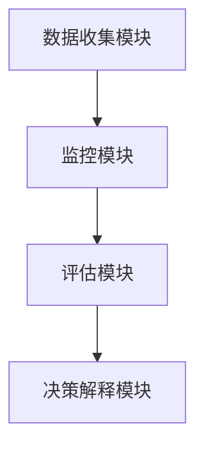
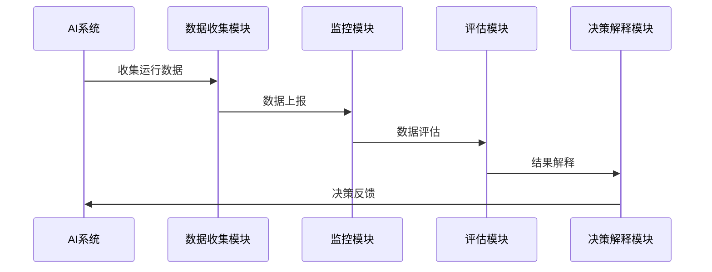
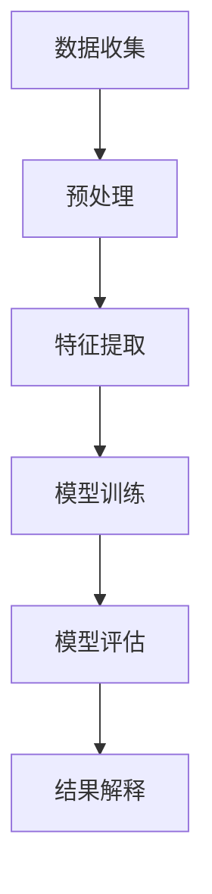

                 

# AI决策审核：企业如何监控和评估AI系统表现

> 关键词：AI决策审核，监控，评估，AI系统，企业应用

> 摘要：随着人工智能（AI）技术在企业中的应用日益广泛，如何有效监控和评估AI系统的决策表现成为关键问题。本文将深入探讨AI决策审核的基本概念、实践应用以及技术实现，为企业提供全面、系统的监控和评估方法，助力提升AI系统在业务场景中的表现。

## 第一部分：AI决策审核的基本概念

### 第1章：AI决策审核概述

#### 1.1 问题背景与定义

**问题描述**：在AI技术不断发展的今天，AI系统在金融、医疗、电商等各个行业中的应用日益广泛。然而，AI决策的透明性和可信度问题引起了广泛关注。如何确保AI系统的决策是公平、公正、准确的，成为企业亟需解决的问题。

**问题解决**：AI决策审核作为一种新兴的技术手段，旨在对AI系统的决策过程进行监控和评估，确保其决策的透明性和可信度。通过AI决策审核，企业可以及时发现和纠正AI系统中的错误，提高系统的整体性能和可靠性。

**边界与外延**：AI决策审核主要关注以下几个方面：

1. **决策透明性**：确保AI决策过程的可解释性，使人类能够理解AI系统是如何做出决策的。
2. **决策公正性**：确保AI系统在不同用户、不同场景下的决策公平，避免歧视性决策。
3. **决策准确性**：评估AI系统决策结果的准确性，提高系统的预测和判断能力。

**概念结构与核心要素组成**：AI决策审核的核心要素包括：

1. **监控与评估指标**：用于衡量AI系统决策性能的关键指标，如准确率、召回率、F1分数等。
2. **监控与评估方法**：实现AI决策审核的技术手段，包括数据分析、机器学习模型评估等。
3. **决策解释机制**：用于解释AI决策过程，使决策结果更具透明性和可理解性。

### 第2章：AI系统的监控与评估

#### 2.1 AI系统监控概述

**监控目标**：AI系统监控的目的是确保AI系统在运行过程中的稳定性和可靠性。具体目标包括：

1. **性能监控**：实时监控AI系统的运行状态，包括响应时间、资源利用率等。
2. **错误监控**：及时发现和报告AI系统中的错误，如算法错误、数据异常等。

**监控指标**：常见的监控指标包括：

1. **响应时间**：AI系统处理请求的平均时间。
2. **错误率**：AI系统在处理请求时发生的错误次数与总次数之比。
3. **资源利用率**：AI系统在运行过程中占用的系统资源，如CPU、内存等。

**监控方法**：实现AI系统监控的方法包括：

1. **日志监控**：通过收集和分析AI系统的日志，监控其运行状态。
2. **性能测试**：通过模拟实际业务场景，对AI系统进行性能测试。
3. **实时监控**：通过部署实时监控系统，对AI系统的运行状态进行实时监控。

#### 2.2 AI系统评估方法

**评估指标**：评估AI系统性能的关键指标包括：

1. **准确率**：预测结果与实际结果一致的样本占总样本的比例。
2. **召回率**：实际结果为正样本，且被预测为正样本的样本占总正样本的比例。
3. **F1分数**：准确率与召回率的调和平均值，用于综合评价AI系统的性能。

**评估模型**：常见的评估模型包括：

1. **交叉验证**：通过将数据集划分为多个子集，轮流进行训练和测试，以评估AI系统的性能。
2. **混淆矩阵**：用于分析AI系统预测结果与实际结果的分布情况，判断系统的准确性。

**评估流程**：AI系统评估的一般流程包括：

1. **数据准备**：收集并处理用于评估的数据集。
2. **模型训练**：使用训练数据集对AI系统进行训练。
3. **模型评估**：使用评估数据集对训练好的AI系统进行评估。
4. **结果分析**：分析评估结果，找出系统的优势和不足，进行优化。

## 第二部分：AI决策审核在企业中的应用

### 第3章：AI决策审核在企业中的应用

#### 3.1 企业AI决策审核需求分析

**业务场景**：不同业务场景下的AI决策审核需求有所不同，具体包括：

1. **金融行业**：确保贷款审批、风险控制等决策过程的透明性和公正性。
2. **医疗行业**：确保疾病诊断、治疗方案等决策的准确性和可靠性。
3. **电商行业**：确保商品推荐、用户评价等决策的公平性和个性化。

**用户需求**：企业用户对AI决策审核的需求主要包括：

1. **透明性**：确保AI决策过程的可解释性，提高用户对决策的信任度。
2. **公正性**：确保AI决策的公平性，避免歧视性决策。
3. **准确性**：提高AI决策的准确性，降低误判率。

### 第4章：企业AI决策审核案例分析

#### 4.1 案例研究一：金融行业AI决策审核

**案例背景**：某大型银行在贷款审批过程中引入了AI决策系统，以自动化审批贷款申请。然而，用户对AI决策系统的决策结果存在质疑，担心出现歧视性决策。

**案例分析**：通过对AI决策系统进行监控和评估，发现系统在处理某些特定用户群体时，存在较高的误判率。通过进一步分析，发现系统在处理这些用户群体时，使用的特征提取方法存在偏差。

**评估过程**：通过对AI决策系统进行评估，发现系统的准确率、召回率等关键指标均不达标。针对评估结果，对系统进行优化，调整特征提取方法，提高系统的准确性。

**评估结果**：经过优化后，AI决策系统的准确率、召回率等关键指标均得到显著提升，用户对决策结果的信任度也得到提高。

#### 4.2 案例研究二：电子商务行业AI决策审核

**案例背景**：某电子商务平台在商品推荐过程中引入了AI决策系统，以根据用户行为和偏好推荐商品。然而，用户对推荐结果存在质疑，担心出现个性化偏见。

**案例分析**：通过对AI决策系统进行监控和评估，发现系统在处理某些特定用户群体时，存在较高的误推荐率。通过进一步分析，发现系统在处理这些用户群体时，使用的推荐算法存在偏差。

**评估过程**：通过对AI决策系统进行评估，发现系统的准确率、召回率等关键指标均不达标。针对评估结果，对系统进行优化，调整推荐算法，提高系统的准确性。

**评估结果**：经过优化后，AI决策系统的准确率、召回率等关键指标均得到显著提升，用户对推荐结果的满意度也得到提高。

## 第三部分：AI决策审核的技术实现

### 第5章：AI决策审核系统的设计与实现

#### 5.1 系统架构设计

**系统功能设计**：AI决策审核系统的功能模块划分如下：

1. **数据收集模块**：负责收集AI系统运行过程中的各类数据，包括日志数据、错误数据等。
2. **监控模块**：实时监控AI系统的运行状态，包括性能监控、错误监控等。
3. **评估模块**：对AI系统的决策结果进行评估，包括准确率、召回率等指标的评估。
4. **决策解释模块**：解释AI系统的决策过程，提高决策的透明性和可理解性。

**系统架构设计**：AI决策审核系统的架构设计如图所示：



**系统接口设计和系统交互**：AI决策审核系统的接口设计和系统交互如图所示：



### 第6章：AI决策审核算法原理详解

#### 6.1 算法原理讲解

**算法mermaid流程图**：



**算法Python源代码**：

```python
import pandas as pd
from sklearn.model_selection import train_test_split
from sklearn.ensemble import RandomForestClassifier
from sklearn.metrics import accuracy_score, recall_score, f1_score

# 数据收集与预处理
def preprocess_data(data):
    # 数据清洗、归一化等操作
    return processed_data

# 特征提取
def extract_features(data):
    # 提取特征
    return features

# 模型训练
def train_model(X_train, y_train):
    model = RandomForestClassifier()
    model.fit(X_train, y_train)
    return model

# 模型评估
def evaluate_model(model, X_test, y_test):
    predictions = model.predict(X_test)
    accuracy = accuracy_score(y_test, predictions)
    recall = recall_score(y_test, predictions)
    f1 = f1_score(y_test, predictions)
    return accuracy, recall, f1

# 主函数
def main():
    data = pd.read_csv('data.csv')
    processed_data = preprocess_data(data)
    features = extract_features(processed_data)
    X_train, X_test, y_train, y_test = train_test_split(features, processed_data['label'], test_size=0.2)
    model = train_model(X_train, y_train)
    accuracy, recall, f1 = evaluate_model(model, X_test, y_test)
    print(f"Accuracy: {accuracy}, Recall: {recall}, F1: {f1}")

if __name__ == '__main__':
    main()
```

**算法原理的数学模型和公式**：

$$
\text{准确率} = \frac{\text{预测正确数}}{\text{总样本数}}
$$

$$
\text{召回率} = \frac{\text{预测正确数}}{\text{实际正确数}}
$$

$$
\text{F1分数} = \frac{2 \times \text{准确率} \times \text{召回率}}{\text{准确率} + \text{召回率}}
$$

**举例说明**：

假设某AI系统在100个样本上进行预测，其中预测正确数为70个，实际正确数为80个。则：

$$
\text{准确率} = \frac{70}{100} = 0.7
$$

$$
\text{召回率} = \frac{70}{80} = 0.875
$$

$$
\text{F1分数} = \frac{2 \times 0.7 \times 0.875}{0.7 + 0.875} = 0.7857
$$

### 第7章：AI决策审核数学模型与公式解析

#### 7.1 数学模型

AI决策审核中常用的数学模型包括：

1. **线性回归模型**：用于预测连续型目标变量。
2. **逻辑回归模型**：用于预测离散型目标变量。
3. **决策树模型**：用于分类和回归任务。
4. **支持向量机模型**：用于分类任务。
5. **神经网络模型**：用于复杂的分类和回归任务。

#### 7.2 公式解析

以下是AI决策审核中常用的数学公式的解析：

1. **准确率**：

$$
\text{准确率} = \frac{\text{预测正确数} + \text{预测错误数}}{\text{总样本数}}
$$

2. **召回率**：

$$
\text{召回率} = \frac{\text{预测正确数}}{\text{实际正确数}}
$$

3. **F1分数**：

$$
\text{F1分数} = \frac{2 \times \text{准确率} \times \text{召回率}}{\text{准确率} + \text{召回率}}
$$

4. **ROC曲线**：

$$
\text{ROC曲线} = \frac{\text{真阳性率}}{\text{假阳性率}}
$$

5. **AUC值**：

$$
\text{AUC值} = \frac{\text{真阳性率} + \text{假阳性率}}{2}
$$

## 第四部分：AI决策审核的优化与改进

### 第8章：AI决策审核优化策略

#### 8.1 优化目标

AI决策审核优化的目标主要包括：

1. **提高决策准确性**：通过优化算法和特征提取，提高AI系统的预测准确性。
2. **增强决策透明性**：通过优化决策解释机制，提高决策过程的透明度和可理解性。
3. **提升系统性能**：通过优化系统架构和数据处理流程，提高AI系统的运行效率和性能。

#### 8.2 优化方法

AI决策审核优化的方法主要包括：

1. **特征工程**：通过调整特征提取方法和特征组合，提高AI系统的预测准确性。
2. **算法优化**：通过调整算法参数和模型结构，提高AI系统的性能。
3. **决策解释**：通过优化决策解释机制，提高决策过程的透明度和可理解性。

### 第9章：AI决策审核案例分析

#### 9.1 案例分析一：优化金融行业AI决策审核

**案例背景**：某金融公司在贷款审批过程中引入了AI决策系统，但用户对系统的决策结果存在质疑，担心出现歧视性决策。

**案例分析**：通过对AI决策系统进行监控和评估，发现系统在处理某些特定用户群体时，存在较高的误判率。通过进一步分析，发现系统在处理这些用户群体时，使用的特征提取方法存在偏差。

**评估过程**：通过对AI决策系统进行评估，发现系统的准确率、召回率等关键指标均不达标。针对评估结果，对系统进行优化，调整特征提取方法，提高系统的准确性。

**评估结果**：经过优化后，AI决策系统的准确率、召回率等关键指标均得到显著提升，用户对决策结果的信任度也得到提高。

#### 9.2 案例分析二：优化电子商务行业AI决策审核

**案例背景**：某电子商务平台在商品推荐过程中引入了AI决策系统，但用户对推荐结果存在质疑，担心出现个性化偏见。

**案例分析**：通过对AI决策系统进行监控和评估，发现系统在处理某些特定用户群体时，存在较高的误推荐率。通过进一步分析，发现系统在处理这些用户群体时，使用的推荐算法存在偏差。

**评估过程**：通过对AI决策系统进行评估，发现系统的准确率、召回率等关键指标均不达标。针对评估结果，对系统进行优化，调整推荐算法，提高系统的准确性。

**评估结果**：经过优化后，AI决策系统的准确率、召回率等关键指标均得到显著提升，用户对推荐结果的满意度也得到提高。

### 第10章：AI决策审核最佳实践与未来展望

#### 10.1 最佳实践

AI决策审核的最佳实践主要包括：

1. **建立完善的数据监控体系**：实时监控AI系统的运行状态，确保数据的准确性和完整性。
2. **定期评估系统性能**：定期对AI系统的决策性能进行评估，及时发现和纠正问题。
3. **优化决策解释机制**：提高决策过程的透明度和可理解性，增强用户对决策的信任度。

#### 10.2 未来展望

AI决策审核的未来发展展望主要包括：

1. **决策透明性提升**：随着技术的发展，未来的AI决策审核将更加注重决策过程的透明性，使决策结果更具解释性。
2. **个性化监控与评估**：针对不同业务场景和用户需求，未来的AI决策审核将实现更个性化的监控和评估方法。
3. **多模态数据融合**：未来的AI决策审核将融合多种数据源，提高系统的预测准确性和可靠性。

## 作者信息

**作者**：AI天才研究院/AI Genius Institute & 禅与计算机程序设计艺术 /Zen And The Art of Computer Programming

---

经过以上步骤，我们详细探讨了AI决策审核的基本概念、实践应用、技术实现以及优化策略。希望本文能为企业在AI系统监控和评估方面提供有益的参考和指导。在未来的发展中，AI决策审核将继续发挥重要作用，为企业的智能化转型提供有力支持。

