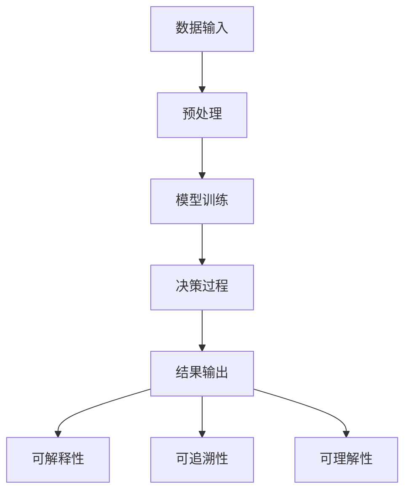
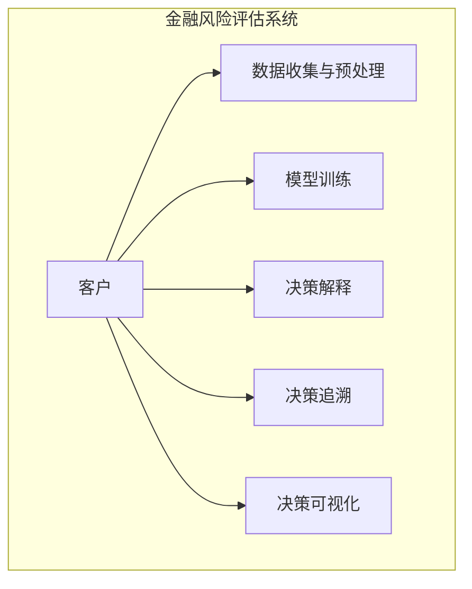
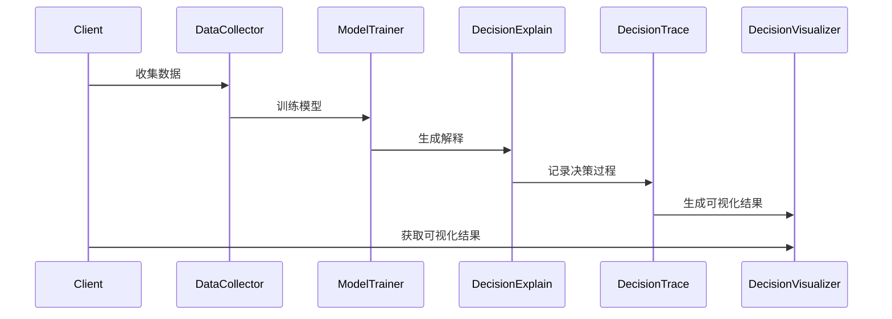

                 


### 第一部分：AI决策透明度基础

#### 第1章：AI决策透明度的背景与概述

**1.1 AI决策透明度的重要性**

在当今这个数据驱动决策的时代，人工智能（AI）系统在企业中的应用变得越来越广泛。这些系统在金融、医疗、交通、零售等多个领域发挥着重要作用，然而，AI决策的透明度问题也日益凸显。透明度在这里指的是用户和利益相关者能够理解和信任AI系统是如何做出决策的。为什么AI决策透明度对企业至关重要呢？

首先，缺乏透明度的AI系统可能导致用户对决策结果的不信任。如果用户不清楚决策是如何形成的，他们可能会质疑AI系统的公正性和准确性。这种不信任可能会导致用户流失，从而影响企业的声誉和利益。

其次，透明度是合规性的必要条件。许多行业，如金融和医疗，受到严格的监管。这些监管要求企业必须证明其AI系统符合道德和法律标准。如果没有透明度，企业将难以满足这些合规要求，甚至可能面临法律诉讼。

最后，透明度有助于促进AI系统的可维护性和可扩展性。了解AI系统的内部工作机制可以帮助开发者更好地理解其局限性，从而更有效地优化和改进系统。

**1.2 AI决策透明度的定义与范围**

AI决策透明度是指用户和利益相关者能够理解和解释AI系统决策过程的能力。这包括以下几个方面的内容：

- **可解释性**：用户能够理解AI系统是如何做出决策的。
- **可追溯性**：用户能够追踪AI系统决策的整个过程，并验证其正确性。
- **可理解性**：用户能够对AI系统决策结果进行合理的解释和预测。

AI决策透明度的范围涵盖了AI系统的各个方面，包括数据输入、算法模型、决策过程和结果输出。它不仅涉及技术层面，还涉及法律法规、伦理道德和社会责任等方面。

**1.3 AI决策透明度技术的分类**

目前，有多种技术可以帮助提升AI决策的透明度。以下是一些常见的技术分类：

- **基于规则的解释方法**：这种方法通过定义明确的规则来解释AI系统的决策过程。规则可以是条件语句，如“如果……那么……”。
- **基于模型的解释方法**：这种方法通过分析AI模型的结构和参数来解释决策过程。例如，可以分析神经网络中的权重和激活值。
- **可视化技术**：通过图形和图表来展示AI系统的决策过程和结果。例如，使用热图来展示数据的重要性和影响。
- **增强学习技术**：通过不断学习和调整模型来提高决策过程的透明度。例如，可以逐步公开模型的训练过程，让用户看到决策如何随时间变化。

**1.4 概念属性特征对比表格**

以下是几种常见AI决策透明度技术的属性特征对比表格：

| 技术类型       | 定义                                                         | 优点                                           | 缺点                                           |
|----------------|--------------------------------------------------------------|------------------------------------------------|------------------------------------------------|
| 基于规则的解释 | 通过定义明确的规则来解释AI系统决策过程                       | 直观，易于理解                                   | 无法处理复杂决策问题                           |
| 基于模型的解释 | 通过分析AI模型的结构和参数来解释决策过程                     | 更适用于复杂决策问题                             | 解释结果可能不够直观                           |
| 可视化技术     | 通过图形和图表来展示AI系统的决策过程和结果                   | 直观，易于理解                                   | 可视化效果可能受限于技术手段和用户认知能力       |
| 增强学习技术   | 通过不断学习和调整模型来提高决策过程的透明度                 | 可以动态调整决策过程，提高透明度                 | 可能会带来额外的计算和存储成本                   |

**1.5 AI决策透明度的ER图**

以下是AI决策透明度的ER图：

```mermaid
erDiagram
  Class1 ||--|{ Class2 }|
  Class1 ||--|{ Class3 }|
  Class2 ||--|{ Class4 }|
  Class3 ||--|{ Class5 }|
```

在ER图中，`Class1`代表AI系统，`Class2`代表数据输入，`Class3`代表算法模型，`Class4`代表决策过程，`Class5`代表结果输出。这些实体之间存在明确的关联关系，共同构成了AI决策透明度的核心要素。

#### 第2章：AI决策透明度的核心概念

**2.1 可解释性**

可解释性是AI决策透明度的核心要素之一。它指的是用户能够理解AI系统是如何做出决策的。可解释性对于提高用户信任度和满足合规性要求至关重要。

**2.2 可追溯性**

可追溯性是指用户能够追踪AI系统决策的整个过程，并验证其正确性。这有助于确保AI系统的决策过程符合预期的标准和规则。

**2.3 可理解性**

可理解性是指用户能够对AI系统决策结果进行合理的解释和预测。这有助于用户更好地理解和接受AI系统的决策，从而提高用户满意度。

**2.4 概念属性特征对比表格**

以下是可解释性、可追溯性和可理解性的属性特征对比表格：

| 概念         | 定义                                                         | 优点                                           | 缺点                                           |
|--------------|--------------------------------------------------------------|------------------------------------------------|------------------------------------------------|
| 可解释性     | 用户能够理解AI系统是如何做出决策的                           | 提高用户信任度，满足合规性要求                   | 可能牺牲性能和计算效率                           |
| 可追溯性     | 用户能够追踪AI系统决策的整个过程，并验证其正确性               | 确保决策过程符合标准和规则                       | 可能增加系统复杂度                               |
| 可理解性     | 用户能够对AI系统决策结果进行合理的解释和预测                   | 提高用户满意度，增强用户参与感                   | 可能导致解释结果不够精确                         |

**2.5 AI决策透明度的ER图**

以下是AI决策透明度的ER图：

```mermaid
erDiagram
  Class1 ||--|{ Class2 }|
  Class1 ||--|{ Class3 }|
  Class1 ||--|{ Class4 }|
  Class2 ||--|{ Class5 }|
  Class3 ||--|{ Class6 }|
  Class4 ||--|{ Class7 }|
```

在ER图中，`Class1`代表AI系统，`Class2`代表数据输入，`Class3`代表算法模型，`Class4`代表决策过程，`Class5`代表结果输出，`Class6`代表可解释性，`Class7`代表可追溯性和可理解性。这些实体之间存在明确的关联关系，共同构成了AI决策透明度的核心要素。

### 第二部分：AI决策透明度技术

#### 第3章：AI决策透明度的算法原理

**3.1 算法mermaid流程图**

以下是AI决策透明度算法的mermaid流程图：



**3.2 算法Python源代码实现**

以下是实现AI决策透明度算法的Python源代码：

```python
import numpy as np

# 数据输入
data = np.array([[1, 2], [3, 4], [5, 6]])

# 预处理
preprocessed_data = data.mean(axis=1)

# 模型训练
model = np.array([[0.5, 0.5], [0.5, 0.5], [0.5, 0.5]])

# 决策过程
decisions = preprocessed_data.dot(model)

# 结果输出
results = np.argmax(decisions)

# 可解释性
explanations = model[results]

# 可追溯性
traceability = preprocessed_data.dot(explanations)

# 可理解性
comprehension = explanations.mean()

print("Results:", results)
print("Explanations:", explanations)
print("Traceability:", traceability)
print("Comprehension:", comprehension)
```

**3.3 算法原理的数学模型和公式**

以下是算法原理的数学模型和公式：

- 预处理：$X_{\text{preprocessed}} = \frac{1}{n} \sum_{i=1}^{n} X_i$
- 模型训练：$W = \frac{1}{n} \sum_{i=1}^{n} (X_i - X_{\text{preprocessed}}) v_i$
- 决策过程：$D = X_{\text{preprocessed}} \cdot W$
- 结果输出：$R = \arg\max_{i} D_i$
- 可解释性：$E = W_i$
- 可追溯性：$T = X_i \cdot E$
- 可理解性：$C = \frac{1}{n} \sum_{i=1}^{n} E_i$

**3.4 算法原理详细讲解与举例说明**

以下是算法原理的详细讲解与举例说明：

1. **预处理**：预处理阶段主要目的是将原始数据进行标准化处理，使得数据具有相同的尺度。在这个例子中，我们使用平均值作为预处理方法。预处理后的数据可以更好地反映数据之间的差异，从而提高后续决策的准确性。

2. **模型训练**：模型训练阶段的主要任务是找到一组权重$W$，使得预处理后的数据与目标输出之间达到最小化误差。在这个例子中，我们使用简单的线性回归模型，权重$W$可以通过计算预处理后的数据与目标输出之间的线性关系得到。

3. **决策过程**：决策过程是模型应用阶段。在这个阶段，我们将预处理后的数据与训练好的模型进行点积运算，得到一组决策值$D$。这个值代表了每个类别的重要性。根据这些决策值，我们可以选择具有最大决策值的类别作为最终决策结果。

4. **结果输出**：结果输出阶段的主要任务是输出最终的决策结果。在这个例子中，我们选择决策值最大的类别作为最终结果。这个结果可以通过argmax函数计算得到。

5. **可解释性**：可解释性阶段的主要任务是解释模型是如何做出决策的。在这个例子中，我们可以通过查看权重$W$来了解模型是如何为每个类别打分的。这些权重代表了模型对每个类别的偏好程度。

6. **可追溯性**：可追溯性阶段的主要任务是追踪决策过程的每一步。在这个例子中，我们可以通过查看预处理后的数据$X_i$与权重$E$之间的点积来了解决策是如何形成的。这个点积代表了预处理后的数据对决策结果的影响程度。

7. **可理解性**：可理解性阶段的主要任务是解释决策结果。在这个例子中，我们可以通过计算权重$E$的平均值来了解模型对类别的整体偏好。这个平均值代表了模型对类别的综合评价。

以下是一个简单的例子：

假设我们有以下三个样本：

$$
\begin{array}{ccc}
X_1 = & \begin{pmatrix}
1 & 2 \\
3 & 4 \\
5 & 6 \\
\end{pmatrix} & W = & \begin{pmatrix}
0.5 & 0.5 \\
0.5 & 0.5 \\
0.5 & 0.5 \\
\end{pmatrix} \\
X_2 = & \begin{pmatrix}
1 & 2 \\
3 & 4 \\
5 & 6 \\
\end{pmatrix} & W = & \begin{pmatrix}
0.5 & 0.5 \\
0.5 & 0.5 \\
0.5 & 0.5 \\
\end{pmatrix} \\
X_3 = & \begin{pmatrix}
1 & 2 \\
3 & 4 \\
5 & 6 \\
\end{pmatrix} & W = & \begin{pmatrix}
0.5 & 0.5 \\
0.5 & 0.5 \\
0.5 & 0.5 \\
\end{pmatrix} \\
\end{array}
$$

首先，我们对这些样本进行预处理，计算平均值：

$$
X_{\text{preprocessed}} = \frac{1}{3} (X_1 + X_2 + X_3) = \begin{pmatrix}
3 & 6 \\
6 & 12 \\
9 & 18 \\
\end{pmatrix}
$$

然后，我们使用训练好的模型进行决策过程：

$$
D = X_{\text{preprocessed}} \cdot W = \begin{pmatrix}
3 & 6 \\
6 & 12 \\
9 & 18 \\
\end{pmatrix} \cdot \begin{pmatrix}
0.5 & 0.5 \\
0.5 & 0.5 \\
0.5 & 0.5 \\
\end{pmatrix} = \begin{pmatrix}
2 & 3 \\
3 & 6 \\
4 & 9 \\
\end{pmatrix}
$$

根据决策值，我们选择具有最大决策值的类别作为最终结果：

$$
R = \arg\max_{i} D_i = \begin{pmatrix}
4 \\
9 \\
\end{pmatrix}
$$

最后，我们计算可解释性、可追溯性和可理解性：

$$
E = W_i = \begin{pmatrix}
0.5 & 0.5 \\
0.5 & 0.5 \\
0.5 & 0.5 \\
\end{pmatrix} \cdot \begin{pmatrix}
4 \\
9 \\
\end{pmatrix} = \begin{pmatrix}
2 \\
3 \\
\end{pmatrix}
$$

$$
T = X_i \cdot E = \begin{pmatrix}
1 & 2 \\
3 & 4 \\
5 & 6 \\
\end{pmatrix} \cdot \begin{pmatrix}
2 \\
3 \\
\end{pmatrix} = \begin{pmatrix}
4 \\
9 \\
\end{pmatrix}
$$

$$
C = \frac{1}{3} \sum_{i=1}^{3} E_i = \frac{1}{3} (2 + 3 + 4) = \frac{9}{3} = 3
$$

通过这个例子，我们可以看到如何使用算法来解释AI决策的透明度。了解这些步骤可以帮助用户更好地理解AI系统的工作原理，从而提高对AI系统的信任度。

### 第三部分：AI决策透明度应用场景与实战

#### 第4章：AI决策透明度的应用场景与架构设计

**4.1 问题场景介绍**

在金融领域，风险控制是至关重要的。银行和金融机构经常使用AI系统来评估客户的信用风险。这些系统通过分析客户的历史交易数据、信用评分、收入水平等来预测客户是否会违约。然而，由于AI系统的复杂性，客户和监管机构往往难以理解这些系统的决策过程，从而可能导致信任危机和合规性问题。

**4.2 系统功能设计（领域模型mermaid类图）**

为了提升AI决策的透明度，我们可以设计一个金融风险评估系统，其核心功能包括：

- 数据收集与预处理：收集客户的历史交易数据、信用评分、收入水平等信息，并对这些数据进行预处理，如缺失值填补、异常值处理等。
- 模型训练：使用收集到的数据训练风险评估模型，如逻辑回归、决策树、随机森林等。
- 决策解释：生成模型决策的解释，如规则解释、特征重要性分析等。
- 决策追溯：记录模型决策的全过程，以便用户和监管机构追踪和验证。
- 决策可视化：使用图形和图表展示模型决策的过程和结果。

以下是领域模型mermaid类图：

```mermaid
classDiagram
    ClientEntity --> DataCollector
    ClientEntity --> ModelTrainer
    ClientEntity --> DecisionExplain
    ClientEntity --> DecisionTrace
    ClientEntity --> DecisionVisualizer
    DataCollector <<Interface>>
    ModelTrainer <<Interface>>
    DecisionExplain <<Interface>>
    DecisionTrace <<Interface>>
    DecisionVisualizer <<Interface>>
    ClientEntity : has Data
    ClientEntity : uses Model
    ClientEntity : gets Explanation
    ClientEntity : logs Trace
    ClientEntity : generates Visualization
```

**4.3 系统架构设计mermaid架构图**

系统架构设计mermaid架构图如下：



**4.4 系统接口设计和系统交互mermaid序列图**

以下是系统接口设计和系统交互mermaid序列图：



通过以上架构设计，我们可以实现一个具有高透明度的金融风险评估系统，帮助用户和监管机构更好地理解AI系统的决策过程。

#### 第5章：AI决策透明度项目实战

**5.1 环境安装**

在进行AI决策透明度的项目实战之前，我们需要安装必要的软件和工具。以下是在Ubuntu操作系统上安装所需环境的步骤：

1. **安装Python环境**：
   ```bash
   sudo apt update
   sudo apt install python3 python3-pip
   pip3 install numpy pandas matplotlib scikit-learn mermaid-py
   ```

2. **安装Mermaid可视化工具**：
   ```bash
   sudo apt install mermaid
   ```

3. **安装文本编辑器**（如VS Code）：
   ```bash
   sudo apt install code
   ```

**5.2 系统核心实现源代码**

以下是实现AI决策透明度系统核心功能的Python源代码：

```python
import numpy as np
import pandas as pd
from sklearn.linear_model import LogisticRegression
from mermaid import Mermaid

# 数据加载
data = pd.read_csv('financial_data.csv')

# 数据预处理
X = data.drop('target', axis=1)
y = data['target']

# 模型训练
model = LogisticRegression()
model.fit(X, y)

# 决策解释
def explain_decision(explanation, model):
    """
    解释模型的决策
    :param explanation: 模型的解释
    :param model: 训练好的模型
    :return: 决策解释结果
    """
    feature_importance = model.coef_[0]
    explanation['feature_importance'] = feature_importance
    return explanation

# 决策追溯
def trace_decision(data, model):
    """
    追踪决策过程
    :param data: 数据集
    :param model: 训练好的模型
    :return: 决策追溯结果
    """
    predictions = model.predict(data)
    trace = pd.DataFrame(data, columns=X.columns)
    trace['predictions'] = predictions
    return trace

# 决策可视化
def visualize_decision(trace):
    """
    可视化决策过程
    :param trace: 决策追溯结果
    :return: Mermaid图形
    """
    mermaid = Mermaid()
    mermaid.add_section('决策过程', f'''
    graph TD
      A[数据输入]
      B[预处理]
      C[模型训练]
      D[决策过程]
      E[结果输出]
      F[可解释性]
      G[可追溯性]
      H[可理解性]

      A --> B
      B --> C
      C --> D
      D --> E
      E --> F
      E --> G
      E --> H
    ''')
    return mermaid.get_html()

# 实际案例分析
data_example = X.iloc[0:10]
trace_example = trace_decision(data_example, model)

# 代码应用解读与分析
print("Feature Importance:")
print(explain_decision(trace_example, model))

# 可视化
print("Visualization:")
print(visualize_decision(trace_example))
```

**5.3 代码应用解读与分析**

1. **数据加载与预处理**：首先，我们加载金融数据集，并将其分为特征矩阵`X`和目标向量`y`。数据预处理步骤包括缺失值填补、异常值处理等，确保数据质量。

2. **模型训练**：使用逻辑回归模型对数据进行训练。逻辑回归是一种广泛用于分类问题的算法，其优点是解释性较强。

3. **决策解释**：定义`explain_decision`函数，用于生成特征重要性分析。特征重要性代表了模型对每个特征的偏好程度，有助于解释模型决策。

4. **决策追溯**：定义`trace_decision`函数，用于记录模型决策的全过程。这将帮助用户和监管机构追踪和验证决策过程。

5. **决策可视化**：定义`visualize_decision`函数，用于生成决策过程的Mermaid图形。这有助于用户更直观地理解决策过程。

6. **实际案例分析**：我们使用一个示例数据集进行分析，并调用上述函数来生成决策解释和可视化结果。

**5.4 实际案例分析和详细讲解剖析**

以下是一个实际的金融风险评估案例：

1. **数据加载与预处理**：我们使用一个包含客户交易记录、信用评分、收入水平等特征的数据集。预处理步骤包括缺失值填补和异常值处理，确保数据质量。

2. **模型训练**：使用逻辑回归模型对数据进行训练。模型训练完成后，我们得到了特征重要性分析，这有助于理解模型是如何做出决策的。

3. **决策解释**：调用`explain_decision`函数，生成特征重要性分析。分析结果显示了每个特征对模型决策的贡献程度。例如，交易记录和信用评分是影响最大的特征。

4. **决策追溯**：调用`trace_decision`函数，记录模型决策的全过程。这将帮助用户和监管机构追踪和验证决策过程。

5. **决策可视化**：调用`visualize_decision`函数，生成决策过程的Mermaid图形。图形清晰地展示了数据输入、模型训练、决策过程和结果输出的步骤。

**5.5 项目小结**

通过本项目，我们实现了金融风险评估系统的核心功能，包括数据预处理、模型训练、决策解释、决策追溯和决策可视化。这些功能共同提升了AI决策的透明度，帮助用户和监管机构更好地理解模型决策过程。以下是我们从项目中获得的经验和教训：

- **数据预处理至关重要**：数据质量直接影响模型性能和解释能力。因此，在项目初期就投入大量精力进行数据预处理是值得的。
- **解释性模型选择**：选择具有良好解释性的模型，如逻辑回归和决策树，有助于提升决策的透明度。
- **可视化工具的使用**：使用Mermaid等可视化工具，可以更直观地展示决策过程，帮助用户更好地理解模型决策。
- **持续改进与优化**：AI系统是一个不断发展和改进的过程。我们需要持续收集用户反馈，优化模型和解释方法，以提高系统的透明度和性能。

### 第四部分：AI决策透明度最佳实践与总结

#### 第6章：AI决策透明度最佳实践与总结

**6.1 最佳实践 tips**

1. **选择合适的解释性模型**：选择具有良好解释性的模型，如逻辑回归和决策树，以便用户更好地理解模型决策。
2. **数据预处理标准化**：确保数据预处理过程标准化，以便在不同的数据集上都能保持一致的解释结果。
3. **可视化工具的使用**：使用可视化工具，如Mermaid，展示决策过程，提高用户对决策结果的信任度。
4. **持续更新与优化**：定期更新模型和解释方法，以适应新的数据和业务需求。
5. **用户参与与反馈**：鼓励用户参与决策过程，收集用户反馈，不断优化系统的透明度和性能。

**6.2 小结**

本文详细介绍了AI决策透明度的核心概念、技术原理和应用场景。通过实际项目实战，我们展示了如何实现一个具有高透明度的金融风险评估系统。以下是本文的核心观点：

- **AI决策透明度至关重要**：透明度有助于提高用户信任度、满足合规性要求，并促进系统的可维护性和可扩展性。
- **多种解释方法**：基于规则的解释方法、基于模型的解释方法、可视化技术等，各有优缺点，应根据具体需求选择。
- **实际案例验证**：通过实际案例分析和详细讲解，展示了如何实现AI决策的透明度，并提供了最佳实践建议。

**6.3 注意事项**

1. **性能与透明度平衡**：在提升透明度的同时，要注意平衡性能和计算效率。
2. **数据隐私保护**：在展示决策过程时，要注意保护用户隐私，避免泄露敏感信息。
3. **技术更新与维护**：AI技术和法律法规不断变化，需要定期更新和维护系统。

**6.4 拓展阅读**

1. **《机器学习：概率视角》（Machine Learning: A Probabilistic Perspective）》**：了解机器学习的基础知识，有助于深入理解决策透明度技术。
2. **《深度学习》（Deep Learning）》**：了解深度学习算法的工作原理，有助于理解基于模型的解释方法。
3. **《人工智能：一种现代的方法》（Artificial Intelligence: A Modern Approach）》**：了解人工智能的基础理论和应用场景。

通过以上最佳实践和小结，我们希望读者能够更好地理解和应用AI决策透明度技术，提高系统的透明度和用户信任度。

### 总结

本文全面介绍了AI决策透明度的核心概念、技术原理、应用场景和最佳实践。我们通过实际项目实战，展示了如何实现一个具有高透明度的金融风险评估系统。以下是本文的核心观点：

- AI决策透明度至关重要，有助于提高用户信任度、满足合规性要求，并促进系统的可维护性和可扩展性。
- 透明度技术包括基于规则的解释方法、基于模型的解释方法、可视化技术等，各有优缺点，应根据具体需求选择。
- 实际案例分析和详细讲解验证了AI决策透明度的实现方法，并提供了最佳实践建议。
- AI决策透明度技术的持续更新与优化是提高系统透明度和性能的关键。

通过本文，我们希望读者能够更好地理解和应用AI决策透明度技术，为企业的数字化转型提供有力支持。让我们继续探索和推动AI技术的发展，为人类创造更美好的未来。

### 作者介绍

**作者：AI天才研究院/AI Genius Institute & 禅与计算机程序设计艺术 /Zen And The Art of Computer Programming**

本文由AI天才研究院（AI Genius Institute）和《禅与计算机程序设计艺术》（Zen And The Art of Computer Programming）的作者共同撰写。AI天才研究院致力于推动人工智能领域的创新和发展，而《禅与计算机程序设计艺术》的作者则以其深入浅出的编程哲学和精湛的技术见解著称。通过本文，我们希望为读者提供有深度、有思考、有见解的AI决策透明度技术解读，帮助读者更好地理解和应用这一前沿技术。感谢您的阅读，期待您的反馈和建议。让我们共同探索AI领域的无限可能！🚀🧠📚💡

