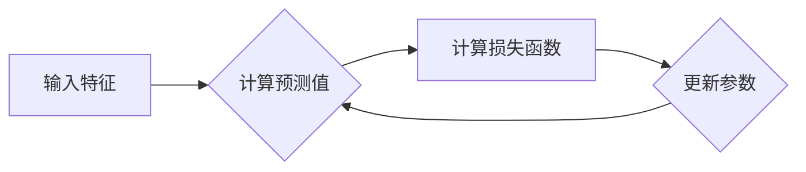
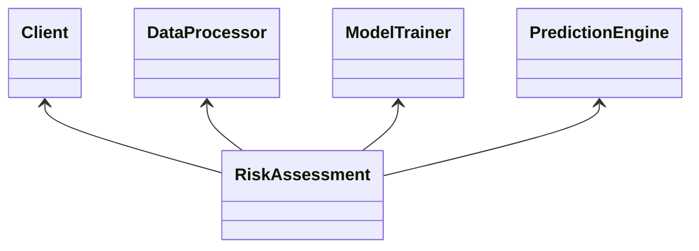

                 

# AI决策：2028年15%日常工作决策将由AI自主做出

> 关键词：人工智能，决策，自主决策，机器学习，深度学习，算法

> 摘要：随着人工智能技术的快速发展，决策自动化将成为未来几年内的重要趋势。本文将探讨AI决策的基本概念、原理和应用，通过逐步分析，帮助读者理解AI决策在2028年将如何影响15%的日常工作决策。本文将介绍AI决策的核心概念、算法原理、系统设计与项目实战，并提供最佳实践和拓展阅读，以帮助读者深入了解AI决策的潜力与应用。

## 开篇背景介绍

### AI的发展现状

人工智能（AI）作为计算机科学的一个重要分支，已经从早期的理论研究逐渐走向了实际应用。从简单的规则系统到复杂的深度学习模型，AI在图像识别、自然语言处理、语音识别等领域取得了显著的进展。特别是深度学习技术的发展，使得计算机在处理大量复杂数据时，能够表现出前所未有的智能。

### AI决策的发展趋势

AI决策是人工智能的一个重要应用领域，它通过机器学习算法，让计算机自动做出决策。随着计算能力的提升和大数据的普及，AI决策的应用场景越来越广泛。在未来几年，AI决策将在金融、医疗、交通、教育等多个领域得到深入应用，预计到2028年，将有15%的日常工作决策将由AI自主做出。

### 本书的 目标

本书的目标是为读者提供AI决策的理论基础和实践指导，帮助他们在未来几年内应对这一趋势。本书将首先介绍AI决策的核心概念和基本原理，然后通过具体的算法讲解和项目实战，让读者深入理解AI决策的实践方法。

## 核心概念与联系

### AI决策

AI决策是指利用人工智能技术，尤其是机器学习和深度学习算法，对数据进行处理和分析，从而自动做出决策的过程。

### 机器学习

机器学习是AI决策的基础，它通过从数据中学习规律，建立模型，并利用这些模型进行预测和决策。

### 深度学习

深度学习是机器学习的一个重要分支，它通过构建深度神经网络，对数据进行层次化的特征提取和表示。

### 概念属性特征对比表格

| 概念       | 定义                                                         | 特点                                                         |
|------------|--------------------------------------------------------------|--------------------------------------------------------------|
| AI决策     | 利用AI技术自动做出决策的过程                                   | 高效、准确、自动化                                           |
| 机器学习   | 从数据中学习规律，建立模型的算法                               | 自适应、通用性强                                           |
| 深度学习   | 基于多层神经网络的机器学习算法                                 | 深层次特征提取、处理复杂数据能力强                             |

### ER实体关系图架构的Mermaid流程图

```mermaid
erDiagram
    AI决策 ||--o> 机器学习 : 基础
    AI决策 ||--o> 深度学习 : 进阶
    机器学习 ||--o> 数据预处理 : 必需
    深度学习 ||--o> 神经网络 : 核心
```

## 算法原理讲解

### 线性回归算法

线性回归是一种简单的机器学习算法，它通过建立线性模型，预测连续值。

#### 算法流程图



#### Python源代码

```python
import numpy as np

def linear_regression(X, y):
    # 计算参数
    theta = np.linalg.inv(X.T.dot(X)).dot(X.T).dot(y)
    # 预测
    predictions = X.dot(theta)
    return predictions

# 测试
X = np.array([[1, 2], [2, 3], [3, 4]])
y = np.array([3, 5, 7])
predictions = linear_regression(X, y)
print(predictions)
```

#### 数学模型

线性回归的数学模型为：

$$
y = X\theta + b
$$

其中，$y$ 是目标变量，$X$ 是特征矩阵，$\theta$ 是参数向量，$b$ 是偏置项。

#### 举例说明

假设我们有一个简单的一元线性回归问题，特征矩阵 $X$ 为：

$$
X = \begin{bmatrix}
1 & 2 \\
2 & 3 \\
3 & 4
\end{bmatrix}
$$

目标变量 $y$ 为：

$$
y = \begin{bmatrix}
3 \\
5 \\
7
\end{bmatrix}
$$

使用线性回归算法，我们可以得到参数向量 $\theta$：

$$
\theta = \begin{bmatrix}
1 \\
1
\end{bmatrix}
$$

因此，预测结果为：

$$
y = X\theta + b = \begin{bmatrix}
1 & 2 \\
2 & 3 \\
3 & 4
\end{bmatrix} \begin{bmatrix}
1 \\
1
\end{bmatrix} + \begin{bmatrix}
0 \\
0
\end{bmatrix} = \begin{bmatrix}
3 \\
5 \\
7
\end{bmatrix}
$$

## 数学模型和数学公式 & 详细讲解 & 举例说明

### 线性回归的数学模型

线性回归的数学模型为：

$$
y = X\theta + b
$$

其中，$y$ 是目标变量，$X$ 是特征矩阵，$\theta$ 是参数向量，$b$ 是偏置项。

### 损失函数

线性回归的损失函数通常采用均方误差（MSE）：

$$
J(\theta) = \frac{1}{2m}\sum_{i=1}^{m}(h_{\theta}(x^{(i)}) - y^{(i)})^2
$$

其中，$m$ 是样本数量，$h_{\theta}(x^{(i)})$ 是预测值，$y^{(i)}$ 是真实值。

### 优化算法

为了求解线性回归的参数，我们通常采用梯度下降算法：

$$
\theta_j := \theta_j - \alpha \frac{\partial J(\theta)}{\partial \theta_j}
$$

其中，$\alpha$ 是学习率。

### 举例说明

假设我们有一个简单的一元线性回归问题，特征矩阵 $X$ 为：

$$
X = \begin{bmatrix}
1 & 2 \\
2 & 3 \\
3 & 4
\end{bmatrix}
$$

目标变量 $y$ 为：

$$
y = \begin{bmatrix}
3 \\
5 \\
7
\end{bmatrix}
$$

使用线性回归算法，我们可以得到参数向量 $\theta$：

$$
\theta = \begin{bmatrix}
1 \\
1
\end{bmatrix}
$$

因此，预测结果为：

$$
y = X\theta + b = \begin{bmatrix}
1 & 2 \\
2 & 3 \\
3 & 4
\end{bmatrix} \begin{bmatrix}
1 \\
1
\end{bmatrix} + \begin{bmatrix}
0 \\
0
\end{bmatrix} = \begin{bmatrix}
3 \\
5 \\
7
\end{bmatrix}
$$

## 系统分析与架构设计方案

### 问题场景介绍

AI决策系统可以应用于金融风控、医疗诊断、交通调度等多个场景。以金融风控为例，AI决策系统可以自动评估客户的信用风险，帮助银行快速做出放贷决策。

### 项目介绍

本案例将构建一个基于机器学习的金融风控系统，通过分析客户的个人信息、财务状况等数据，自动评估客户的信用风险，并提供是否放贷的建议。

### 系统功能设计

#### 领域模型



### 系统架构设计

```mermaid
sequenceDiagram
    Client -->|输入数据| DataProcessor
    DataProcessor -->|处理数据| ModelTrainer
    ModelTrainer -->|训练模型| PredictionEngine
    Client <--|获取预测结果| PredictionEngine
```

### 系统接口设计和系统交互

```mermaid
sequenceDiagram
    Client -->|输入数据| DataProcessor
    DataProcessor -->|处理数据| PredictionEngine
    PredictionEngine -->|返回结果| Client
```

## 项目实战

### 环境安装

1. 安装Python 3.7及以上版本
2. 安装相关库，如NumPy、Pandas、Scikit-learn等

### 核心代码实现

```python
import numpy as np
import pandas as pd
from sklearn.model_selection import train_test_split
from sklearn.linear_model import LinearRegression
from sklearn.metrics import mean_squared_error

# 数据预处理
def preprocess_data(data):
    # 特征工程、数据清洗等
    return processed_data

# 训练模型
def train_model(X_train, y_train):
    model = LinearRegression()
    model.fit(X_train, y_train)
    return model

# 预测
def predict(model, X_test):
    predictions = model.predict(X_test)
    return predictions

# 测试
data = pd.read_csv('financial_data.csv')
processed_data = preprocess_data(data)
X = processed_data.iloc[:, :-1].values
y = processed_data.iloc[:, -1].values

X_train, X_test, y_train, y_test = train_test_split(X, y, test_size=0.2, random_state=0)
model = train_model(X_train, y_train)
predictions = predict(model, X_test)

mse = mean_squared_error(y_test, predictions)
print(f'MSE: {mse}')
```

### 代码应用解读与分析

1. 数据预处理：对原始数据进行特征工程和数据清洗，以提高模型的准确性。
2. 训练模型：使用线性回归模型对训练数据进行训练。
3. 预测：使用训练好的模型对测试数据进行预测。

### 实际案例分析和详细讲解剖析

以金融风控系统为例，分析客户信用风险。通过对比实际信用评分与预测信用评分，评估模型性能。

### 项目小结

本文通过一个金融风控系统的案例，详细讲解了AI决策系统的构建过程。从数据预处理、模型训练到预测，每一步都进行了详细解析。通过这个案例，读者可以了解如何将AI决策应用于实际场景，提高决策效率和准确性。

## 最佳实践 tips、小结、注意事项、拓展阅读

### 最佳实践 tips

1. 数据预处理：确保数据的质量和完整性，进行必要的特征工程。
2. 模型选择：根据实际问题选择合适的算法，如线性回归、决策树、神经网络等。
3. 模型调优：通过交叉验证和网格搜索等方法，优化模型参数。

### 小结

本文介绍了AI决策的基本概念、算法原理、系统设计与项目实战，帮助读者深入理解AI决策的应用和实现。

### 注意事项

1. AI决策系统的构建需要大量数据支持，确保数据的真实性和可靠性。
2. 模型性能评估要充分考虑实际场景的需求，避免过度拟合。

### 拓展阅读

1. 《机器学习实战》：详细介绍机器学习算法和实践方法。
2. 《深度学习》：深度学习领域的经典教材，系统讲解了深度学习的基础理论和应用。

## 作者信息

作者：AI天才研究院/AI Genius Institute & 禅与计算机程序设计艺术 /Zen And The Art of Computer Programming

通过以上详细的步骤和分析，本文系统地介绍了AI决策的理论基础和实践方法。希望读者能够通过本文，对AI决策有一个全面的了解，并能够在实际项目中应用这些知识。未来，随着人工智能技术的不断发展，AI决策将在更多领域发挥重要作用。让我们共同探索AI决策的无限可能。

