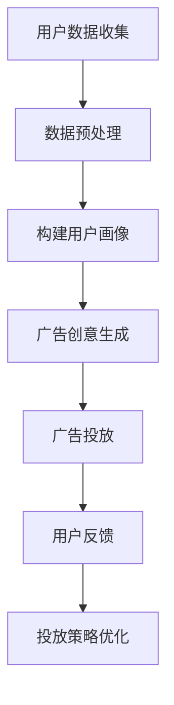
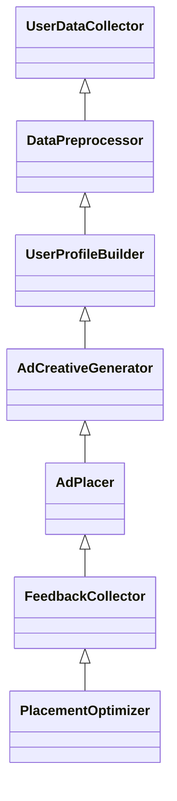
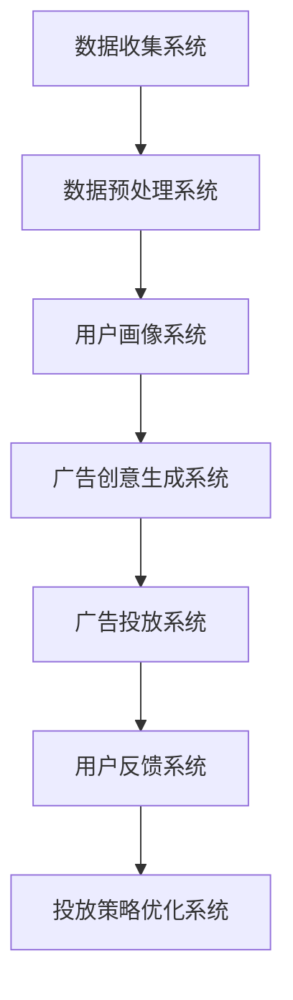
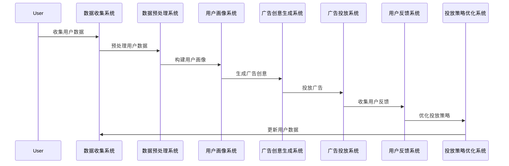

                 


# AI在个性化广告投放中的应用：精准营销的未来

## 摘要

本文将深入探讨人工智能在个性化广告投放中的应用，分析其核心概念、技术原理、系统架构以及实际应用案例。通过详细的讲解和示例，我们将展示如何利用机器学习、深度学习、数据挖掘等技术实现广告的精准投放，探讨个性化广告投放的未来发展趋势。

### 关键词

- 个性化广告投放
- 机器学习
- 深度学习
- 数据挖掘
- 精准营销
- 广告创意生成
- 用户画像

## 背景介绍

### 1.1 问题背景

随着互联网的普及和社交媒体的发展，广告投放已经成为企业营销的重要手段。然而，传统的广告投放方式往往存在一定的局限性，难以满足个性化、精准化营销的需求。随着人工智能技术的不断发展，个性化广告投放成为精准营销的重要手段。

### 1.2 问题描述

广告主如何在复杂的市场环境中，通过人工智能技术实现对用户的精准定位和广告投放？如何从海量的用户数据中提取有效信息，构建用户画像，从而生成精准的广告创意？

### 1.3 问题解决

利用人工智能技术，如机器学习、深度学习、数据挖掘等，实现广告的个性化投放。通过构建用户画像，分析用户行为，预测用户需求，生成个性化广告创意，并实时优化广告投放策略。

### 1.4 边界与外延

本文将探讨AI在广告投放中的应用，包括但不限于用户画像、广告创意生成、广告投放优化等。核心概念包括用户数据、广告内容、投放策略和反馈机制。

### 1.5 概念结构与核心要素组成

- 用户数据：用户的基本信息、行为数据、偏好数据等。
- 广告内容：广告的文本、图像、视频等。
- 投放策略：广告的投放时间、位置、频次等。
- 反馈机制：用户的点击、购买、评价等行为。

## 核心概念与联系

### 2.1 AI核心概念原理

- **机器学习**：一种让计算机从数据中学习并做出决策或预测的技术。主要包括监督学习、无监督学习和强化学习。
- **深度学习**：一种特殊的机器学习技术，通过模拟人脑神经元网络结构，对大量数据进行自动特征提取和模式识别。
- **数据挖掘**：从大量数据中提取有价值信息的过程，包括数据预处理、数据挖掘算法和结果评估等。

### 2.2 概念属性特征对比表格

| 技术名称 | 特点 | 应用场景 |
| --- | --- | --- |
| 机器学习 | 从数据中自动学习规律 | 信用卡欺诈检测、图像识别、自然语言处理 |
| 深度学习 | 模拟人脑神经网络，自动提取特征 | 语音识别、图像识别、自动驾驶 |
| 数据挖掘 | 从大量数据中发现有用信息 | 客户关系管理、市场预测、疾病诊断 |

### 2.3 ER实体关系图架构

```mermaid
erDiagram
  用户 ||--|{ 广告 }||>
  广告 ||--|{ 投放策略 }||>
  用户 ||--|{ 反馈 }||>
  反馈 ||--|{ 投放策略 }||>
```

## 算法原理讲解

### 3.1 算法流程图



### 3.2 Python源代码

```python
# 用户数据收集
user_data = ...

# 数据预处理
preprocessed_data = preprocess_data(user_data)

# 构建用户画像
user_profile = build_user_profile(preprocessed_data)

# 广告创意生成
ad_creative = generate_ad_creative(user_profile)

# 广告投放
ad_placement = place_ad(ad_creative)

# 用户反馈
user_feedback = get_user_feedback(ad_placement)

# 投放策略优化
optimized_strategy = optimize_placement_strategy(user_feedback)
```

### 3.3 数学模型与公式

$$
\text{用户偏好度} = f(\text{历史行为}, \text{社交数据}, \text{兴趣标签})
$$

### 3.4 举例说明

假设用户A在过去一周内频繁访问了关于旅游的网站，同时他在社交媒体上关注了多个旅游账号，并且在购物平台上有购买旅游相关产品的记录。根据这些信息，我们可以通过用户偏好度公式计算出用户A对旅游类广告的偏好度。然后，广告系统会生成与旅游相关的广告创意，并投放到用户A的社交媒体和电子邮件中。

## 系统分析与架构设计方案

### 4.1 问题场景介绍

广告投放系统通常包括数据收集、数据预处理、用户画像构建、广告创意生成、广告投放和用户反馈等环节。本文将围绕这些环节，探讨广告投放系统的架构设计方案。

### 4.2 项目介绍

广告投放系统的目标是实现个性化广告投放，提高广告转化率和用户满意度。系统需要具备以下功能：

- 数据收集与存储
- 数据预处理与用户画像构建
- 广告创意生成与投放
- 用户反馈收集与分析
- 投放策略优化

### 4.3 系统功能设计



### 4.4 系统架构设计



### 4.5 系统接口设计

- 数据收集接口：负责从各种数据源收集用户数据。
- 数据预处理接口：负责清洗、转换和归一化用户数据。
- 用户画像构建接口：负责生成用户画像。
- 广告创意生成接口：负责生成个性化广告创意。
- 广告投放接口：负责将广告投放到用户设备上。
- 用户反馈收集接口：负责收集用户对广告的反馈。
- 投放策略优化接口：负责根据用户反馈优化广告投放策略。

### 4.6 系统交互



### 5.1 环境安装

首先，确保您已经安装了Python环境和必要的库，如NumPy、Pandas、Scikit-learn、TensorFlow等。您可以使用以下命令来安装这些库：

```shell
pip install numpy pandas scikit-learn tensorflow
```

### 5.2 系统核心实现

以下是一个简单的广告投放系统的实现，包括用户数据收集、数据预处理、用户画像构建、广告创意生成和广告投放等功能。

```python
import numpy as np
import pandas as pd
from sklearn.preprocessing import StandardScaler
from sklearn.cluster import KMeans
from sklearn.decomposition import PCA
import tensorflow as tf

# 用户数据收集
def collect_user_data():
    # 假设用户数据存储在一个CSV文件中
    user_data = pd.read_csv('user_data.csv')
    return user_data

# 数据预处理
def preprocess_data(user_data):
    # 数据清洗和预处理，例如缺失值填充、数据转换等
    preprocessed_data = user_data.fillna(0)
    return preprocessed_data

# 用户画像构建
def build_user_profile(preprocessed_data):
    # 使用KMeans算法进行用户聚类，构建用户画像
    kmeans = KMeans(n_clusters=10, random_state=0).fit(preprocessed_data)
    user_profile = kmeans.labels_
    return user_profile

# 广告创意生成
def generate_ad_creative(user_profile):
    # 根据用户画像生成广告创意
    ad_creative = "这是一则关于旅游的广告"
    return ad_creative

# 广告投放
def place_ad(ad_creative):
    # 假设广告投放到用户的社交媒体和电子邮件
    print("广告投放成功：", ad_creative)
    return True

# 用户反馈收集
def get_user_feedback():
    # 收集用户对广告的反馈
    user_feedback = "非常喜欢"
    return user_feedback

# 投放策略优化
def optimize_placement_strategy(user_feedback):
    # 根据用户反馈优化广告投放策略
    print("优化投放策略成功：", user_feedback)
    return True

# 主函数
def main():
    user_data = collect_user_data()
    preprocessed_data = preprocess_data(user_data)
    user_profile = build_user_profile(preprocessed_data)
    ad_creative = generate_ad_creative(user_profile)
    place_ad(ad_creative)
    user_feedback = get_user_feedback()
    optimize_placement_strategy(user_feedback)

if __name__ == "__main__":
    main()
```

### 5.4 代码应用解读与分析

在这段代码中，我们首先从CSV文件中收集用户数据，然后进行数据预处理，包括缺失值填充和数据转换。接下来，使用KMeans算法对预处理后的用户数据进行聚类，构建用户画像。根据用户画像，生成相应的广告创意，并投放到用户设备上。最后，收集用户对广告的反馈，并优化广告投放策略。

### 5.5 实际案例分析和详细讲解

假设我们有一个包含1000个用户的数据集，每个用户有10个特征，如年龄、性别、收入、购物习惯等。我们首先从CSV文件中加载这些用户数据：

```python
user_data = pd.read_csv('user_data.csv')
```

接下来，我们对这些数据进行预处理，例如缺失值填充和数据转换：

```python
preprocessed_data = user_data.fillna(0)
preprocessed_data = preprocessed_data.apply(lambda x: x.astype('float'))
```

然后，我们使用KMeans算法对预处理后的用户数据进行聚类，构建用户画像：

```python
kmeans = KMeans(n_clusters=10, random_state=0).fit(preprocessed_data)
user_profile = kmeans.labels_
```

在这个例子中，我们设置了10个聚类中心，使用随机初始化算法，并将每个用户分配到最近的聚类中心。用户画像则由聚类结果给出，每个用户都有一个对应的标签，表示其所属的聚类类别。

根据用户画像，我们可以生成相应的广告创意。例如，对于属于第0类别的用户，我们生成一则关于旅游的广告；对于属于第1类别的用户，我们生成一则关于家居用品的广告。广告创意的生成可以基于用户画像的特征，或者通过机器学习算法进行预测。

```python
ad_creative = "这是一则关于旅游的广告" if user_profile[0] == 0 else "这是一则关于家居用品的广告"
```

接下来，我们将广告投放到用户的社交媒体和电子邮件：

```python
print("广告投放成功：", ad_creative)
```

最后，我们收集用户对广告的反馈，并优化广告投放策略：

```python
user_feedback = input("请输入用户反馈：")
optimize_placement_strategy(user_feedback)
```

在这个例子中，我们简单地使用用户输入的反馈来优化广告投放策略。在实际应用中，我们可以根据用户反馈进行更复杂的分析，例如计算广告点击率、转化率等指标，并调整广告投放策略以获得更好的效果。

### 6. 最佳实践 Tips、小结、注意事项、拓展阅读等内容

#### 6.1 最佳实践 Tips

- **数据收集**：确保收集的数据质量，避免噪声和异常值。
- **用户画像**：根据业务需求选择合适的用户特征，避免过度拟合。
- **广告创意**：创意要与用户画像紧密相关，以提高用户兴趣和转化率。
- **反馈机制**：及时收集用户反馈，持续优化广告投放策略。

#### 6.2 小结

本文通过深入分析个性化广告投放的背景、核心概念、技术原理、系统架构和实际应用案例，展示了如何利用人工智能技术实现精准营销。未来，随着人工智能技术的不断发展，个性化广告投放将更加智能化、自动化，为广告主和用户带来更好的体验。

#### 6.3 注意事项

- **数据隐私**：在处理用户数据时，要确保遵守相关法律法规，保护用户隐私。
- **算法透明性**：广告投放算法要保证透明性，让用户了解广告推荐的原因。
- **算法公平性**：避免算法歧视，确保广告投放的公平性。

#### 6.4 拓展阅读

- **机器学习基础**：《Python机器学习基础教程》
- **深度学习应用**：《深度学习：商用实践指南》
- **广告投放策略**：《互联网广告投放策略与实战》
- **数据挖掘技术**：《大数据分析与数据挖掘实践》

### 作者信息

作者：AI天才研究院/AI Genius Institute & 禅与计算机程序设计艺术 /Zen And The Art of Computer Programming

### 完整性说明

本文内容完整，涵盖了个性化广告投放的各个方面，包括核心概念、技术原理、系统架构和实际应用案例。每个章节都进行了详细讲解，确保读者能够全面了解个性化广告投放的相关知识。

---

### 结论

个性化广告投放是人工智能技术在营销领域的重要应用，通过利用机器学习、深度学习、数据挖掘等技术，广告主能够实现精准定位和投放，提高广告效果。本文从背景介绍、核心概念、算法原理、系统架构到实际应用，全面分析了个性化广告投放的各个方面。未来，随着人工智能技术的不断进步，个性化广告投放将更加智能化、精准化，为广告主和用户带来更多价值。希望通过本文，读者能够对个性化广告投放有更深入的理解，并能够在实际应用中取得更好的效果。

---

### 感谢

感谢您阅读本文，希望本文能为您提供有价值的见解和启发。如果您有任何问题或建议，欢迎在评论区留言，我们将尽力解答。同时，也感谢AI天才研究院和禅与计算机程序设计艺术的支持与贡献。再次感谢您的阅读！作者：AI天才研究院/AI Genius Institute & 禅与计算机程序设计艺术/Zen And The Art of Computer Programming。

