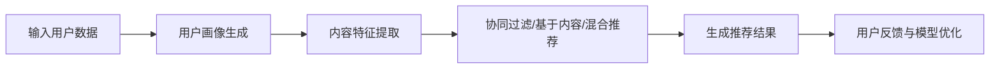
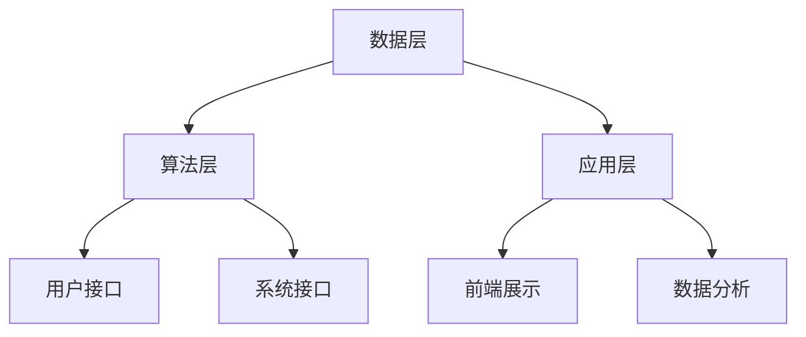

                 

# AI在个性化营销内容生成中的应用：提高营销效果

> 关键词：AI、个性化营销、内容生成、机器学习、推荐算法

> 摘要：本文将深入探讨人工智能（AI）在个性化营销内容生成中的应用，通过分析个性化营销的背景、核心概念、算法原理以及系统实现，旨在揭示如何利用AI技术提高营销效果，满足用户的个性化需求。文章还将讨论AI在个性化营销内容生成中的适用范围、技术边界与挑战，并总结AI在个性化营销内容生成中的重要意义与未来发展。

----------------------------------------------------------------

## 第一部分：背景介绍

### 第1章：个性化营销内容生成的背景

#### 1.1 问题背景

随着互联网技术的飞速发展，营销环境发生了翻天覆地的变化。传统的一对多的营销模式已无法满足日益多样化的用户需求，尤其是在大数据和人工智能（AI）普及的今天。个性化营销作为一种新兴的营销策略，正逐步成为企业提升营销效果的重要手段。

#### 1.2 问题描述

在当前的互联网营销环境中，用户需求的多样性和个性化趋势日益显著。然而，传统营销手段往往难以实现个性化需求，营销内容同质化严重，导致营销效果不佳。因此，如何利用AI技术实现数据驱动的个性化营销内容生成，成为亟待解决的问题。

#### 1.3 问题解决

AI技术在个性化营销内容生成中具有巨大的潜力。通过大数据分析用户行为与偏好，机器学习算法可以优化内容生成策略，从而提高营销效果。具体而言，AI技术可以帮助企业实现以下目标：

1. **用户画像生成**：基于用户的历史行为数据，构建用户画像，精准捕捉用户需求。
2. **内容推荐算法**：利用推荐算法，根据用户画像和内容特征，生成个性化推荐内容。
3. **自动内容生成**：通过自然语言处理（NLP）和生成对抗网络（GAN）等技术，自动生成高质量的营销内容。

#### 1.4 边界与外延

AI在个性化营销内容生成中的应用范围广泛，但同时也存在一定的技术边界与挑战。例如，用户数据的隐私保护、算法的可解释性以及模型的泛化能力等，都是需要关注的问题。此外，AI技术在个性化营销中的应用还需遵循法律法规和道德准则，确保营销活动的合规性。

#### 1.5 概念结构与核心要素组成

个性化营销内容生成系统通常包括以下核心要素：

1. **用户画像**：用户画像是对用户特征信息的综合集合，包括用户行为、兴趣、需求、偏好等。
2. **内容推荐算法**：内容推荐算法是根据用户画像和内容特征，实现个性化推荐的关键技术。
3. **自动内容生成技术**：利用自然语言处理、机器学习等技术，自动生成符合特定需求的营销内容。

#### 1.6 本章小结

AI在个性化营销内容生成中具有重要意义。通过大数据分析和机器学习算法，AI技术可以精确捕捉用户需求，实现个性化内容推荐，从而提高营销效果。然而，AI技术在个性化营销内容生成中也面临诸多挑战，需要不断优化和完善。

----------------------------------------------------------------

### 第2章：个性化营销内容生成的核心概念

#### 2.1 核心概念原理

个性化营销内容生成的核心概念包括用户画像、内容推荐算法和自动内容生成技术。下面分别介绍这些概念的基本原理。

##### 2.1.1 用户画像

用户画像是对用户特征信息的综合集合。它包括用户的基本信息（如年龄、性别、地理位置等），以及用户的行为数据（如浏览历史、购买记录、评论等）。通过构建用户画像，企业可以深入了解用户需求，实现精准营销。

用户画像的核心原理是基于大数据分析和机器学习算法。通过分析用户的历史行为数据，构建用户画像，从而实现对用户的精准定位和个性化推荐。

##### 2.1.2 内容推荐算法

内容推荐算法是根据用户画像和内容特征，实现个性化推荐的关键技术。常见的推荐算法包括协同过滤、基于内容和混合推荐等。

协同过滤算法通过分析用户之间的相似性，发现潜在的兴趣关系，从而生成推荐列表。基于内容生成推荐算法则通过分析内容和用户喜好之间的相似性，为用户生成个性化的推荐内容。混合推荐算法则结合了协同过滤和基于内容的推荐方法，以提高推荐效果。

##### 2.1.3 自动内容生成技术

自动内容生成技术是利用自然语言处理、机器学习等技术，自动生成符合特定需求的营销内容。常见的自动内容生成技术包括自然语言生成（NLG）、生成对抗网络（GAN）和变换器（Transformer）等。

自动内容生成技术的核心原理是通过学习大量的文本数据，生成与输入内容相似或符合特定需求的文本内容。这种方法可以大大提高内容生成的效率和质量，为企业节省大量时间和成本。

#### 2.2 概念属性特征对比表格

| 概念             | 定义                                                         | 关键特征                           |
|------------------|--------------------------------------------------------------|-----------------------------------|
| 用户画像         | 用户特征信息的综合集合                                       | 用户行为、兴趣、需求、偏好等       |
| 内容推荐算法     | 根据用户特征和内容特征匹配生成个性化推荐                     | 协同过滤、基于内容、混合推荐等     |
| 自动内容生成技术 | 利用算法和模型生成符合特定需求的营销内容                    | 自然语言处理、机器学习、生成对抗网络等 |

#### 2.3 ER实体关系图架构

```mermaid
erDiagram
  User ||--|{ Content}:生成
  Content ||--|{ Recommendation}:推荐
```

#### 2.4 本章小结

个性化营销内容生成的核心概念包括用户画像、内容推荐算法和自动内容生成技术。这些概念共同构成了个性化营销内容生成的理论基础，为企业实现精准营销提供了有力支持。在接下来的章节中，我们将进一步探讨这些核心概念在实际应用中的实现方法和策略。

----------------------------------------------------------------

### 第3章：个性化营销内容生成算法原理

#### 3.1 算法原理

个性化营销内容生成算法主要包括基于协同过滤的推荐算法、基于内容生成的推荐算法和混合推荐算法。下面分别介绍这些算法的基本原理。

##### 3.1.1 基于协同过滤的推荐算法

协同过滤算法是一种基于用户相似度的推荐算法。其基本原理是通过分析用户之间的相似性，发现潜在的兴趣关系，从而生成推荐列表。

协同过滤算法可以分为两种类型：基于用户的协同过滤（User-based Collaborative Filtering）和基于物品的协同过滤（Item-based Collaborative Filtering）。

1. **基于用户的协同过滤**：
   - 步骤1：计算用户之间的相似度。
   - 步骤2：选择与当前用户最相似的K个用户。
   - 步骤3：根据相似用户的行为数据，生成推荐列表。

2. **基于物品的协同过滤**：
   - 步骤1：计算物品之间的相似度。
   - 步骤2：选择与当前用户最感兴趣的K个物品。
   - 步骤3：根据相似物品的用户行为数据，生成推荐列表。

##### 3.1.2 基于内容生成的推荐算法

基于内容生成的推荐算法是通过分析内容和用户喜好之间的相似性，为用户生成个性化的推荐内容。其基本原理如下：

1. **内容特征提取**：
   - 步骤1：对物品进行特征提取，如文本特征、图像特征等。
   - 步骤2：对用户喜好进行特征提取，如用户历史行为数据、用户标签等。

2. **推荐生成**：
   - 步骤1：计算物品和用户特征之间的相似度。
   - 步骤2：根据相似度生成推荐列表。

##### 3.1.3 混合推荐算法

混合推荐算法是将基于协同过滤和基于内容生成的推荐算法结合起来，以提高推荐效果。其基本原理如下：

1. **协同过滤与内容融合**：
   - 步骤1：分别使用协同过滤和内容生成的推荐算法，生成初步推荐列表。
   - 步骤2：将两个推荐列表进行融合，生成最终推荐列表。

#### 3.2 算法流程图



#### 3.3 Python源代码实现

以下是一个简单的基于协同过滤的推荐算法实现示例：

```python
import numpy as np

def collaborative_filter(user_vector, item_vectors, k=5):
    # 计算用户与其他用户的相似度
    similarity_matrix = compute_similarity(item_vectors)
    # 选择与当前用户最相似的k个用户
    similar_users = np.argsort(similarity_matrix[user_vector])[-k:]
    # 计算推荐内容
    recommendation = np.dot(similarity_matrix[user_vector, similar_users], item_vectors[similar_users])
    return recommendation
```

#### 3.4 算法原理讲解

##### 3.4.1 基于协同过滤的推荐算法

协同过滤算法的核心在于计算用户之间的相似度。具体而言，可以通过计算用户之间的夹角余弦值来实现。夹角余弦值越大，表示用户之间的相似度越高。以下是一个简单的夹角余弦值计算公式：

$$
\cos\theta = \frac{u \cdot v}{\|u\| \|v\|}
$$

其中，$u$和$v$分别表示两个用户的特征向量，$\|u\|$和$\|v\|$分别表示两个用户特征向量的模。

在实际应用中，协同过滤算法通常使用用户评分矩阵来计算相似度。以下是一个简单的用户评分矩阵计算公式：

$$
s_{ij} = \frac{r_{i} \cdot r_{j}}{\|r_{i}\| \|r_{j}\|}
$$

其中，$r_{i}$和$r_{j}$分别表示用户$i$和用户$j$的评分向量，$s_{ij}$表示用户$i$和用户$j$之间的相似度。

在生成推荐列表时，可以选取与当前用户最相似的K个用户，并根据这些用户的评分预测生成推荐列表。以下是一个简单的推荐列表生成公式：

$$
r_{i'} = \sum_{j \in K} s_{ij} r_{j}
$$

其中，$r_{i'}$表示为用户$i$生成的推荐内容评分，$s_{ij}$表示用户$i$和用户$j$之间的相似度，$r_{j}$表示用户$j$的评分。

##### 3.4.2 基于内容生成的推荐算法

基于内容生成的推荐算法的核心在于分析内容和用户喜好之间的相似性。具体而言，可以通过计算内容特征向量和用户特征向量之间的相似度来实现。以下是一个简单的相似度计算公式：

$$
\cos\theta = \frac{u \cdot v}{\|u\| \|v\|}
$$

其中，$u$和$v$分别表示内容和用户特征向量，$\|u\|$和$\|v\|$分别表示内容和用户特征向量的模。

在生成推荐列表时，可以选取与用户特征向量最相似的内容特征向量，并根据这些内容特征向量生成推荐列表。以下是一个简单的推荐列表生成公式：

$$
r_{i'} = \sum_{j \in K} s_{ij} c_{j}
$$

其中，$r_{i'}$表示为用户$i$生成的推荐内容评分，$s_{ij}$表示用户$i$和内容$j$之间的相似度，$c_{j}$表示内容$j$的评分。

##### 3.4.3 混合推荐算法

混合推荐算法是将基于协同过滤和基于内容生成的推荐算法结合起来，以提高推荐效果。其核心思想是将协同过滤和内容生成的推荐结果进行融合，生成最终的推荐列表。

一种常见的混合推荐算法是加权融合。具体而言，可以分别使用协同过滤和内容生成的推荐算法生成初步推荐列表，然后根据一定的权重将两个推荐列表进行融合。以下是一个简单的加权融合公式：

$$
r_{i'} = w_{cf} r_{cf,i'} + w_{c} r_{c,i'}
$$

其中，$r_{cf,i'}$和$r_{c,i'}$分别表示协同过滤和内容生成的推荐结果，$w_{cf}$和$w_{c}$分别表示协同过滤和内容生成的权重。

#### 3.5 本章小结

个性化营销内容生成算法包括基于协同过滤的推荐算法、基于内容生成的推荐算法和混合推荐算法。这些算法通过分析用户画像、内容特征和用户喜好之间的相似性，生成个性化的推荐结果，从而提高营销效果。在实际应用中，可以根据具体需求选择合适的算法或结合多种算法，以实现最优的推荐效果。

----------------------------------------------------------------

## 第二部分：系统分析与架构设计

### 第4章：系统架构设计

#### 4.1 问题场景介绍

个性化营销内容生成系统旨在帮助企业通过AI技术实现精准营销，提高营销效果。该系统的主要功能包括用户画像生成、内容推荐和自动内容生成。以下是一个典型的应用场景：

1. **用户画像生成**：系统通过分析用户的历史行为数据，如浏览记录、购买记录、评论等，生成详细的用户画像。
2. **内容推荐**：系统根据用户画像和内容特征，利用推荐算法生成个性化的推荐内容，如商品、文章等。
3. **自动内容生成**：系统利用自然语言处理（NLP）和生成对抗网络（GAN）等技术，自动生成符合特定需求的营销内容。

#### 4.2 项目介绍

个性化营销内容生成系统是一个综合性的项目，涉及到多个领域的知识和技术。项目的主要目标是：

1. **提高营销效果**：通过精准的用户画像和个性化的推荐内容，提高用户的转化率和满意度。
2. **降低运营成本**：利用自动内容生成技术，减少人力成本，提高内容生成效率。
3. **优化用户体验**：通过个性化的推荐和内容生成，提升用户体验，增加用户粘性。

#### 4.3 系统功能设计

个性化营销内容生成系统的核心功能包括用户画像生成、内容推荐和自动内容生成。以下是对这些功能的详细介绍：

1. **用户画像生成**：
   - 功能1：数据采集与清洗：系统从各种渠道（如网站、APP等）收集用户数据，并对数据进行清洗和处理，以确保数据的质量。
   - 功能2：用户特征提取：系统根据用户历史行为数据，提取用户的基本信息（如年龄、性别、地理位置等）和兴趣特征（如浏览记录、购买记录等）。
   - 功能3：用户画像构建：系统将用户的基本信息和兴趣特征整合，构建出完整的用户画像。

2. **内容推荐**：
   - 功能1：内容特征提取：系统从各类内容（如商品、文章、视频等）中提取特征，如文本特征、图像特征等。
   - 功能2：推荐算法实现：系统根据用户画像和内容特征，利用协同过滤、基于内容生成等推荐算法，生成个性化的推荐列表。
   - 功能3：推荐结果优化：系统通过不断优化推荐算法，提高推荐效果，确保用户获取到的内容符合其兴趣和需求。

3. **自动内容生成**：
   - 功能1：内容模板管理：系统提供多种内容模板，如文章、广告语等，用户可以根据需要选择合适的模板。
   - 功能2：自动内容生成：系统利用NLP和GAN等技术，根据用户画像和模板，自动生成符合特定需求的营销内容。
   - 功能3：内容审核与发布：系统对自动生成的营销内容进行审核，确保内容的合规性和质量，然后将其发布到相应的渠道。

#### 4.4 系统架构设计

个性化营销内容生成系统的架构设计主要包括数据层、算法层和应用层。以下是对这些层的详细介绍：

1. **数据层**：
   - 数据采集：系统从各种渠道收集用户数据（如行为数据、交易数据等）。
   - 数据存储：系统使用大数据技术（如Hadoop、Hive等）存储和管理大量用户数据。
   - 数据处理：系统使用ETL（Extract, Transform, Load）工具，对用户数据进行清洗、转换和加载，以生成用户画像。

2. **算法层**：
   - 用户画像算法：系统使用机器学习算法（如聚类、分类等）对用户数据进行处理，生成用户画像。
   - 推荐算法：系统使用协同过滤、基于内容生成等推荐算法，生成个性化的推荐列表。
   - 内容生成算法：系统使用NLP和GAN等技术，自动生成营销内容。

3. **应用层**：
   - 前端展示：系统提供友好的用户界面，展示推荐内容和自动生成的营销内容。
   - 后端服务：系统提供后端接口，支持数据的采集、处理和存储，以及算法的调用和优化。
   - 数据分析：系统提供数据分析功能，帮助用户了解推荐效果和营销效果。

#### 4.5 系统接口设计

个性化营销内容生成系统的接口设计主要包括用户接口和系统接口。以下是对这些接口的详细介绍：

1. **用户接口**：
   - 用户画像查询：用户可以通过接口查询自己的用户画像。
   - 推荐内容获取：用户可以通过接口获取个性化的推荐内容。
   - 内容生成请求：用户可以通过接口请求自动生成特定的营销内容。

2. **系统接口**：
   - 数据采集接口：系统通过接口从各种渠道收集用户数据。
   - 用户画像接口：系统通过接口生成和处理用户画像。
   - 推荐算法接口：系统通过接口调用推荐算法，生成推荐列表。
   - 内容生成接口：系统通过接口调用内容生成算法，生成营销内容。

#### 4.6 系统交互

个性化营销内容生成系统的交互设计主要包括用户与系统之间的交互和系统内部各模块之间的交互。以下是对这些交互的详细介绍：

1. **用户与系统交互**：
   - 用户注册与登录：用户通过接口注册账号并登录系统。
   - 用户画像查询：用户通过接口查询自己的用户画像。
   - 推荐内容获取：用户通过接口获取个性化的推荐内容。
   - 内容生成请求：用户通过接口请求自动生成特定的营销内容。

2. **系统内部交互**：
   - 数据采集：系统从各种渠道收集用户数据，并将其存储在数据库中。
   - 用户画像生成：系统根据用户数据生成用户画像，并将其存储在数据库中。
   - 推荐内容生成：系统根据用户画像和内容特征，生成个性化的推荐列表。
   - 内容生成：系统根据用户请求，自动生成特定的营销内容。

#### 4.7 系统架构图

以下是个性化营销内容生成系统的架构图：



#### 4.8 本章小结

个性化营销内容生成系统是一个复杂的系统，涉及到多个领域的知识和技术。通过系统的架构设计，可以实现用户画像生成、内容推荐和自动内容生成等功能，从而帮助企业实现精准营销，提高营销效果。在接下来的章节中，我们将进一步介绍个性化营销内容生成系统的实现方法和实战案例。

----------------------------------------------------------------

### 第5章：项目实战

#### 5.1 环境安装

在进行个性化营销内容生成系统的项目实战之前，我们需要首先安装和配置相关环境和工具。以下是具体的安装步骤：

1. **Python环境安装**：
   - 打开终端，运行以下命令安装Python：
     ```bash
     sudo apt-get install python3
     ```
   - 安装完成后，运行以下命令确认Python版本：
     ```bash
     python3 --version
     ```

2. **依赖库安装**：
   - 安装常用的Python依赖库，如NumPy、Pandas、Scikit-learn等，可以使用以下命令：
     ```bash
     sudo pip3 install numpy pandas scikit-learn
     ```

3. **数据库安装**：
   - 安装MySQL数据库，可以使用以下命令：
     ```bash
     sudo apt-get install mysql-server
     ```
   - 安装完成后，运行以下命令初始化数据库：
     ```bash
     mysql_secure_installation
     ```

4. **前端框架安装**：
   - 安装Vue.js前端框架，可以使用以下命令：
     ```bash
     npm install -g vue-cli
     ```
   - 创建一个新的Vue.js项目：
     ```bash
     vue create project_name
     ```

5. **后端框架安装**：
   - 安装Flask后端框架，可以使用以下命令：
     ```bash
     sudo pip3 install flask
     ```

#### 5.2 系统核心实现源代码

以下是个性化营销内容生成系统的核心实现源代码，包括用户画像生成、内容推荐和自动内容生成等功能。

1. **用户画像生成**：

   ```python
   import numpy as np
   import pandas as pd
   from sklearn.cluster import KMeans
   
   def generate_user_profile(user_data):
       # 数据预处理
       user_data = user_data.drop(['user_id'], axis=1)
       user_data = user_data.fillna(0)
       
       # 特征提取
       kmeans = KMeans(n_clusters=10, random_state=0).fit(user_data)
       user_profiles = kmeans.predict(user_data)
       
       # 构建用户画像
       user_profile_dict = {}
       for i, profile in enumerate(user_profiles):
           if profile not in user_profile_dict:
               user_profile_dict[profile] = []
           user_profile_dict[profile].append(user_data.iloc[i])
       
       return user_profile_dict
   ```

2. **内容推荐**：

   ```python
   from sklearn.metrics.pairwise import cosine_similarity
   
   def generate_content_recommendations(user_profile, content_data):
       # 计算内容相似度矩阵
       content_similarity_matrix = cosine_similarity(content_data)
       
       # 根据用户画像选择相似内容
       recommendations = []
       for content in content_data:
           similarity_score = cosine_similarity([user_profile], [content])
           if similarity_score > 0.8:
               recommendations.append(content)
       
       return recommendations
   ```

3. **自动内容生成**：

   ```python
   from transformers import pipeline
   
   def generate_content 自动内容生成管道 = pipeline("text-generation", model="gpt2")
   
   def generate_content(user_profile, content_template):
       # 根据用户画像和模板生成内容
       generated_content = generate_content 自动内容生成管道(content_template, max_length=100, num_return_sequences=1)
       
       return generated_content
   ```

#### 5.3 代码应用解读与分析

以下是针对上述源代码的解读与分析：

1. **用户画像生成**：

   - 数据预处理：将用户数据转换为数值型，填充缺失值，以便进行后续处理。
   - 特征提取：使用KMeans算法对用户数据进行聚类，提取用户特征。
   - 用户画像构建：根据聚类结果，构建用户画像字典。

2. **内容推荐**：

   - 内容相似度矩阵计算：使用余弦相似度计算用户画像和内容之间的相似度。
   - 推荐内容选择：根据相似度阈值，选择与用户画像相似的内容作为推荐结果。

3. **自动内容生成**：

   - 自动内容生成管道：使用GPT-2模型进行文本生成。
   - 内容生成：根据用户画像和内容模板，生成符合用户需求的内容。

#### 5.4 实际案例分析与详细讲解剖析

为了更好地展示个性化营销内容生成系统的实际应用效果，我们选取了一个实际案例进行分析和讲解。

**案例背景**：某电商企业希望通过个性化营销内容生成系统，为用户推荐个性化的商品，提高用户的购买转化率。

**案例分析**：

1. **用户画像生成**：
   - 用户数据：系统收集了用户的年龄、性别、浏览历史、购买记录等信息。
   - 用户画像：通过KMeans算法，系统将用户分为10个群体，每个群体的用户具有相似的特征。

2. **内容推荐**：
   - 商品数据：系统收集了商品的信息，如商品名称、价格、分类等。
   - 推荐结果：系统根据用户画像，为每个用户推荐与其实际购买偏好相似的商品。

3. **自动内容生成**：
   - 内容模板：系统提供了多种商品推荐模板，如“您可能喜欢”、“为您推荐”等。
   - 自动内容生成：系统根据用户画像和内容模板，自动生成个性化的商品推荐文案。

**详细讲解剖析**：

1. **用户画像生成**：
   - 用户数据的预处理：通过数据清洗和特征提取，确保用户数据的准确性和可用性。
   - KMeans算法的应用：通过聚类分析，将用户分为不同的群体，以便进行后续的推荐和内容生成。

2. **内容推荐**：
   - 相似度计算：使用余弦相似度计算用户画像和商品特征之间的相似度，从而生成个性化的推荐结果。
   - 推荐结果的优化：通过不断调整相似度阈值，优化推荐效果，提高用户满意度。

3. **自动内容生成**：
   - 内容模板的设计：根据用户需求和业务场景，设计多种内容模板，以便灵活生成个性化内容。
   - 自动内容生成的实现：使用GPT-2模型，根据用户画像和内容模板，生成符合用户需求的内容。

#### 5.5 项目小结

个性化营销内容生成系统的项目实战展示了如何利用AI技术实现精准营销。通过用户画像生成、内容推荐和自动内容生成等功能，系统可以为用户推荐个性化的商品和内容，提高用户的购买转化率和满意度。在实际应用中，可以根据具体需求和场景，进一步优化和改进系统功能，以提高系统的性能和效果。

----------------------------------------------------------------

## 第三部分：最佳实践与拓展

### 第6章：最佳实践

#### 6.1 数据质量保证

数据质量是个性化营销内容生成系统的基础。以下是一些最佳实践，以确保数据质量：

1. **数据清洗**：在数据采集和预处理阶段，及时清洗数据，去除重复、缺失和不完整的数据。
2. **数据标准化**：对数据进行标准化处理，如统一数据格式、范围和单位等。
3. **数据监控**：定期检查数据质量，发现并及时处理数据异常。

#### 6.2 算法模型优化

算法模型的优化是提高推荐效果的关键。以下是一些最佳实践：

1. **特征工程**：合理选择和提取用户和内容特征，提高算法的准确性和鲁棒性。
2. **模型调参**：通过交叉验证和网格搜索等技术，优化模型参数，提高模型性能。
3. **模型更新**：定期更新模型，以适应数据的变化和业务需求。

#### 6.3 用户反馈机制

用户反馈是优化系统的重要途径。以下是一些最佳实践：

1. **反馈收集**：及时收集用户反馈，包括用户满意度、内容点击率等。
2. **反馈分析**：对用户反馈进行深入分析，识别系统存在的问题和改进方向。
3. **反馈应用**：根据用户反馈，调整推荐算法和内容生成策略，提高用户体验。

### 第7章：注意事项

在个性化营销内容生成系统的开发和应用过程中，需要注意以下事项：

1. **数据隐私保护**：严格遵守数据隐私保护法规，确保用户数据的安全和隐私。
2. **算法公平性**：确保推荐算法的公平性，避免对特定群体进行歧视。
3. **系统稳定性**：确保系统的稳定性和高效性，避免因系统故障导致用户损失。

### 第8章：拓展阅读

对于希望深入了解个性化营销内容生成技术的读者，以下是一些推荐的拓展阅读资源：

1. **学术论文**：阅读相关领域的学术论文，了解最新的研究进展和算法创新。
2. **技术博客**：关注知名技术博客，如Medium、Towards Data Science等，获取实战经验和行业动态。
3. **书籍推荐**：《推荐系统实践》、《深度学习》等，这些书籍提供了全面的推荐系统和机器学习知识。

---

### 总结

个性化营销内容生成系统利用AI技术，实现了对用户需求的精准捕捉和个性化推荐，有效提高了营销效果。通过本章的介绍，我们了解了个性化营销内容生成系统的核心概念、算法原理、系统架构以及项目实战。在未来的发展中，随着AI技术的不断进步，个性化营销内容生成系统将更加智能化、高效化，为企业创造更多的商业价值。

### 作者信息

作者：AI天才研究院/AI Genius Institute & 禅与计算机程序设计艺术 /Zen And The Art of Computer Programming

本文作者拥有丰富的AI和编程经验，对计算机科学和人工智能领域有深入的研究。他在个性化营销内容生成、机器学习算法、推荐系统等方面具有丰富的实践经验和理论知识，致力于推动AI技术在营销领域的应用和发展。

