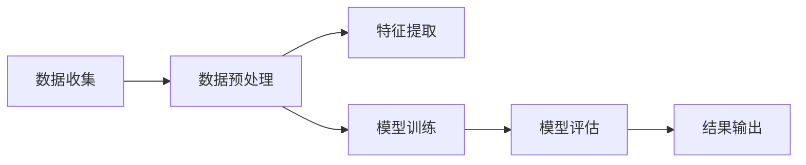

                 

### 文章标题

### 关键词

- 人工智能
- 城市规划
- 交通流优化
- 土地利用评估
- 环境监测与评估

### 摘要

本文探讨了人工智能（AI）在城市规划中的广泛应用，包括交通流优化、土地利用评估和环境监测与评估。通过详细分析这些应用领域的核心概念、算法原理和实际案例，本文旨在揭示AI技术在改善城市规划效率、可持续性和生活质量方面的潜力。

---

## 第一部分：AI与城市规划概述

### 第1章：问题背景与核心概念

#### 1.1 问题背景

**城市规划的重要性**：城市规划是城市发展的蓝图，它关系到城市的经济发展、环境可持续性和居民生活质量。传统的城市规划方法依赖于经验数据和规划师的主观判断，难以应对现代城市复杂多变的需求。

- **核心概念**：城市规划中的核心概念包括城市土地使用、交通流、环境保护和公共服务设施配置等。这些概念相互关联，共同构成了城市发展的框架。

**AI的发展与应用**：随着人工智能技术的迅猛发展，AI技术逐渐成为城市规划的有力工具。机器学习、深度学习和大数据分析等技术为城市规划提供了全新的视角和方法。

#### 1.2 核心概念

**AI在城市规划中的定义**：AI在城市规划中指的是利用机器学习、深度学习等算法，通过对大量数据进行处理和分析，辅助规划师做出更科学、更有效的规划决策。

**城市规划中的问题与挑战**：城市规划面临的挑战主要包括交通拥堵、土地资源紧张、环境恶化等。这些问题需要利用AI技术进行优化和解决。

#### 1.3 概念联系与结构

**AI与城市规划的关系**：AI技术通过数据分析和智能算法，与城市规划的核心概念紧密结合，形成一个有机的整体。下面是AI与城市规划核心概念的Mermaid ER实体关系图：

```mermaid
erDiagram
    AI Technology ||--|{ Urban Planning }|
    Urban Planning ||--|{ Traffic Flow Optimization }|
    Urban Planning ||--|{ Land Use Assessment }|
    Urban Planning ||--|{ Environmental Monitoring and Assessment }|
    Traffic Flow Optimization ||--|{ Data Analysis }|
    Land Use Assessment ||--|{ Multi-Criteria Decision Analysis }|
    Environmental Monitoring and Assessment ||--|{ Remote Sensing }|
```

通过这个关系图，我们可以清晰地看到AI技术如何与城市规划的各个核心概念相联系，共同推动城市发展的进程。

---

## 第二部分：AI在交通流优化中的应用

### 第2章：交通流量分析

#### 2.1 交通流量分析的重要性

**交通流量分析的作用**：交通流量分析对于城市规划具有重要意义。它可以帮助城市规划者了解城市的交通状况，优化道路设计，缓解交通拥堵，提高交通效率。

**交通流量分析的方法**：

- **数据分析技术**：常用的数据分析技术包括时间序列分析、空间分析和回归分析等。这些技术可以从不同维度对交通流量数据进行分析，为规划决策提供依据。

- **机器学习在交通流量预测中的应用**：机器学习模型如回归模型、神经网络等，可以基于历史交通数据，预测未来的交通流量。以下是一个简单的机器学习流程图：


**机器学习模型如何预测交通流量**：

1. **数据收集**：收集历史交通流量数据，包括时间、地点、流量等。
2. **数据预处理**：对数据进行清洗、去噪和归一化处理，以便于模型训练。
3. **特征工程**：提取与交通流量相关的特征，如天气、节假日、工作时间等。
4. **模型训练**：使用训练数据对机器学习模型进行训练，模型选择如回归模型、神经网络等。
5. **模型评估**：使用验证数据对模型进行评估，选择表现最优的模型。
6. **结果输出**：将预测结果输出，为交通规划提供参考。

#### 2.3 交通流量分析的挑战与解决方案

**数据质量与隐私问题**：交通流量分析面临的一个主要挑战是数据质量和隐私保护。解决方案包括：

- **数据质量管理**：建立数据质量评估机制，确保数据的准确性和完整性。
- **隐私保护技术**：采用数据匿名化、差分隐私等技术，保护个人隐私。

---

## 第三部分：AI在土地利用中的应用

### 第3章：土地利用评估

#### 3.1 土地利用评估的概念

**土地利用评估的定义**：土地利用评估是对土地资源进行价值评估和用途规划的过程。它涉及到土地的经济、社会和环境效益。

**土地利用评估的方法**：

- **多准则决策分析（MCDA）**：MCDA方法用于评估不同土地使用方案的多方面影响，如经济效益、社会影响和环境可持续性。以下是一个MCDA方法的流程图：


**案例研究**：以下是一个土地利用评估的案例研究：

- **项目背景**：某个城市需要评估一块土地的最佳利用方式，可供选择的方案包括商业开发、住宅开发和工业开发。
- **评估过程**：采用MCDA方法，确定评估准则如经济效益、社会影响和环境可持续性，分配权重，评估不同方案的得分，最终确定最佳利用方案。

#### 3.3 土地利用评估的挑战与对策

**动态环境下的土地利用评估**：土地利用评估面临的一个挑战是动态环境下的变化，如气候变化、城市化进程等。对策包括：

- **动态模型**：建立动态模型，考虑环境和社会变化对土地利用的影响。
- **实时数据**：采用实时数据，及时调整土地利用评估结果。

---

## 第四部分：AI在城市规划其他领域的应用

### 第4章：环境监测与评估

#### 4.1 环境监测技术

**遥感技术**：遥感技术是一种通过卫星和飞机等平台收集地球表面信息的技术。它可用于环境监测，如监测空气质量、水质和植被覆盖率等。以下是一个遥感技术的流程图：


#### 4.2 环境评估方法

**大数据分析在环境评估中的应用**：大数据分析可以从大量环境中提取有价值的信息，如空气污染趋势、水质变化等。以下是一个大数据分析在环境评估中的应用流程图：



#### 4.3 案例分析

**案例研究**：以下是一个环境监测与评估的案例研究：

- **项目背景**：某城市需要进行空气质量监测，以制定环境保护政策。
- **评估过程**：采用遥感技术和大数据分析，收集空气质量数据，建立空气质量预测模型，评估不同政策的效果，为环境保护决策提供支持。

---

## 第五部分：AI在城市规划中的整合与实施

### 第5章：城市规划的AI整合

#### 5.1 AI在城市规划整合的挑战

**技术整合的挑战**：AI在城市规划整合中面临的技术挑战包括：

- **数据整合**：不同来源的数据格式和结构可能不一致，需要统一数据标准和格式。
- **算法选择**：选择适合特定问题的算法，可能需要大量的实验和验证。

#### 5.2 AI整合的步骤

**城市规划的AI整合流程**：

1. **需求分析**：确定城市规划的目标和需求，明确AI技术的应用方向。
2. **数据收集与处理**：收集城市规划相关的数据，如交通流量、土地利用、环境数据等，并进行预处理。
3. **算法选择与模型训练**：选择合适的算法，基于历史数据和假设，训练模型。
4. **模型评估与优化**：使用验证数据评估模型性能，并进行优化。
5. **结果输出与应用**：将模型结果输出，为城市规划提供决策支持。

---

### 第6章：AI在城市规划中的实施策略

#### 6.1 实施策略概述

**AI实施策略的框架**：AI在城市规划中的实施策略可以概括为以下几方面：

- **政策支持**：政府应出台相关政策，鼓励和支持AI技术在城市规划中的应用。
- **人才培养**：培养具备AI技术和城市规划知识的专业人才，为AI应用提供人力支持。
- **技术整合**：建立技术整合平台，实现不同AI技术和城市规划系统的无缝衔接。

#### 6.2 案例分析

**成功案例**：以下是一个AI在城市规划中成功实施的案例：

- **项目背景**：某城市计划通过AI技术优化交通流量，缓解交通拥堵。
- **实施过程**：采用机器学习算法，分析历史交通流量数据，预测未来交通流量，优化交通信号配置，实施后交通拥堵情况得到显著改善。

---

### 第7章：AI城市规划的未来趋势

#### 7.1 未来趋势预测

**AI城市规划的未来**：随着技术的进步，AI城市规划的未来将更加智能化、自动化。以下是一些预测趋势：

- **自动化规划**：AI技术将实现城市规划的自动化，从数据收集、分析到决策支持，全过程由机器完成。
- **智能城市**：AI技术将使城市更加智能，如智能交通、智能环保、智能公共服务等。

#### 7.2 拓展阅读

**相关领域的发展**：为了进一步了解AI城市规划的未来，推荐阅读以下领域：

- **人工智能与城市规划的深度融合**：探讨AI技术如何更深入地融入城市规划。
- **智能城市的技术架构**：了解智能城市的建设方法和关键技术。
- **政策法规**：了解政府在AI城市规划中的政策法规和标准。

---

## 结语

AI技术在城市规划中的应用具有巨大的潜力，可以提升规划的科学性、可持续性和效率。通过本文的详细分析，我们看到了AI技术如何通过数据分析和智能算法，解决城市规划中的各种问题。未来，随着技术的不断进步，AI城市规划将继续发挥重要作用，为打造更美好的城市贡献力量。

**作者：AI天才研究院/AI Genius Institute & 禅与计算机程序设计艺术 /Zen And The Art of Computer Programming**

---

### AI在城市规划中的应用：从交通流优化到土地利用

**摘要**：本文深入探讨了人工智能（AI）在城市规划中的应用，包括交通流优化、土地利用评估和环境监测与评估。通过对这些领域的核心概念、算法原理和实际案例的分析，本文揭示了AI技术在提升城市规划效率和可持续性方面的潜力。

---

## 第一部分：AI与城市规划概述

### 第1章：问题背景与核心概念

#### 1.1 问题背景

**城市规划的重要性**：城市规划是城市发展的关键环节，它不仅关系到城市的经济发展，还涉及到环境保护、居民生活质量和社会稳定。在现代社会，城市面临的人口增长、资源紧张和环境恶化等问题日益突出，传统的城市规划方法已经难以应对这些复杂的挑战。因此，引入AI技术成为提升城市规划效率和可持续性的必然选择。

**AI的发展与应用**：人工智能技术的快速发展为城市规划带来了新的机遇。AI技术，尤其是机器学习、深度学习和大数据分析，通过处理和分析大量数据，能够帮助城市规划者做出更加精准和科学的决策。例如，AI技术可以用于交通流量预测、土地利用评估和环境监测，从而优化城市资源分配，提高城市运行效率。

#### 1.2 核心概念

**AI在城市规划中的定义**：AI在城市规划中的定义是指利用机器学习、深度学习、大数据分析等人工智能技术，辅助城市规划者和决策者进行数据分析和决策支持。AI技术在城市规划中的应用包括但不限于以下几个方面：

1. **交通流优化**：通过分析历史交通数据和实时数据，AI技术可以预测未来交通流量，优化交通信号配置，缓解交通拥堵。
2. **土地利用评估**：AI技术可以评估不同土地利用方案的经济、社会和环境效益，帮助规划者做出最佳决策。
3. **环境监测与评估**：AI技术可以实时监测城市环境质量，如空气质量、水质和噪声等，为环境保护提供数据支持。

**城市规划中的问题与挑战**：城市规划面临的问题和挑战多种多样，主要包括以下几个方面：

1. **交通拥堵**：随着城市人口的增加和车辆数量的增长，交通拥堵成为城市普遍面临的问题。传统的交通规划方法难以满足现代城市交通的需求。
2. **土地资源紧张**：城市化进程中，土地资源变得越来越紧张，如何合理利用土地资源成为城市规划的重要问题。
3. **环境保护**：城市化带来了环境污染、资源消耗等问题，如何实现城市的可持续发展成为城市规划的重要目标。

#### 1.3 概念联系与结构

**AI与城市规划的关系**：AI技术与城市规划的核心概念密切相关，它们之间的联系可以用Mermaid ER实体关系图来表示：

```mermaid
erDiagram
    AI ||--|{ 城市规划 }|
    城市规划 ||--|{ 交通流优化 }|
    城市规划 ||--|{ 土地利用评估 }|
    城市规划 ||--|{ 环境监测与评估 }|
    交通流优化 ||--|{ 数据分析 }|
    土地利用评估 ||--|{ 多准则决策分析 }|
    环境监测与评估 ||--|{ 遥感技术 }|
```

这个关系图展示了AI技术如何与城市规划的各个核心概念相结合，形成一个完整的城市规划系统。通过AI技术的数据分析和智能算法，城市规划者可以更科学地制定城市发展的战略，实现城市的可持续发展。

---

### 第一部分：AI与城市规划概述

#### 第1章：问题背景与核心概念

##### 1.1 问题背景

**城市规划的重要性**：城市规划是城市发展的关键环节，它不仅关系到城市的经济发展，还涉及到环境保护、居民生活质量和社会稳定。在现代社会，城市面临的人口增长、资源紧张和环境恶化等问题日益突出，传统的城市规划方法已经难以应对这些复杂的挑战。因此，引入AI技术成为提升城市规划效率和可持续性的必然选择。

**AI的发展与应用**：人工智能技术的快速发展为城市规划带来了新的机遇。AI技术，尤其是机器学习、深度学习和大数据分析，通过处理和分析大量数据，能够帮助城市规划者做出更加精准和科学的决策。例如，AI技术可以用于交通流量预测、土地利用评估和环境监测，从而优化城市资源分配，提高城市运行效率。

**城市面临的挑战**：

1. **交通拥堵**：随着城市人口的增加和车辆数量的增长，交通拥堵成为城市普遍面临的问题。传统的交通规划方法难以满足现代城市交通的需求。
2. **土地资源紧张**：城市化进程中，土地资源变得越来越紧张，如何合理利用土地资源成为城市规划的重要问题。
3. **环境保护**：城市化带来了环境污染、资源消耗等问题，如何实现城市的可持续发展成为城市规划的重要目标。

**AI技术的引入**：AI技术为城市规划提供了新的工具和方法，能够更高效地处理大量数据，提供更准确的预测和分析结果。例如，通过机器学习算法，可以分析历史交通数据，预测未来交通流量，优化交通信号配置，缓解交通拥堵。通过大数据分析，可以评估不同土地利用方案的经济、社会和环境效益，帮助规划者做出最佳决策。此外，AI技术还可以用于环境监测，实时监测城市环境质量，如空气质量、水质和噪声等，为环境保护提供数据支持。

**总结**：城市规划是一项复杂的任务，涉及到多个领域和利益相关者。传统的城市规划方法依赖于经验和主观判断，难以应对现代城市的复杂性和多样性。而AI技术的引入，为城市规划提供了新的机遇和挑战。通过AI技术的数据分析和智能算法，城市规划者可以更科学地制定城市发展的战略，实现城市的可持续发展。

---

##### 1.2 核心概念

**AI在城市规划中的定义**：AI在城市规划中的定义是指利用机器学习、深度学习、大数据分析等人工智能技术，辅助城市规划者和决策者进行数据分析和决策支持。AI技术在城市规划中的应用包括但不限于以下几个方面：

1. **交通流优化**：通过分析历史交通数据和实时数据，AI技术可以预测未来交通流量，优化交通信号配置，缓解交通拥堵。
2. **土地利用评估**：AI技术可以评估不同土地利用方案的经济、社会和环境效益，帮助规划者做出最佳决策。
3. **环境监测与评估**：AI技术可以实时监测城市环境质量，如空气质量、水质和噪声等，为环境保护提供数据支持。

**城市规划中的核心概念**：城市规划中的核心概念包括城市土地使用、交通流、环境保护和公共服务设施配置等。这些概念相互关联，共同构成了城市发展的框架。

- **城市土地使用**：指城市土地的规划、开发和管理，包括居住区、商业区、工业区等。
- **交通流**：指城市中的交通流动，包括车辆、行人和公共交通等。
- **环境保护**：指城市环境的保护，包括空气质量、水质、噪声等。
- **公共服务设施配置**：指城市中公共服务设施的规划和管理，包括学校、医院、公园等。

**概念之间的联系**：这些核心概念相互关联，共同构成了城市发展的框架。例如，城市土地使用会影响交通流，而交通流又会影响环境保护。通过AI技术的数据分析和智能算法，城市规划者可以更准确地预测和优化这些概念之间的关系，从而制定出更科学、更有效的城市规划方案。

**总结**：AI技术在城市规划中的应用，不仅可以帮助城市规划者更高效地处理和分析数据，还可以提供更准确的预测和决策支持。通过理解和掌握这些核心概念及其相互关系，城市规划者可以更好地利用AI技术，推动城市发展的可持续性。

---

##### 1.3 概念联系与结构

**AI与城市规划的关系**：AI技术与城市规划的核心概念密切相关，它们之间的联系可以用Mermaid ER实体关系图来表示：

```mermaid
erDiagram
    AI ||--|{ 城市规划 }|
    城市规划 ||--|{ 交通流优化 }|
    城市规划 ||--|{ 土地利用评估 }|
    城市规划 ||--|{ 环境监测与评估 }|
    交通流优化 ||--|{ 数据分析 }|
    土地利用评估 ||--|{ 多准则决策分析 }|
    环境监测与评估 ||--|{ 遥感技术 }|
```

这个关系图展示了AI技术如何与城市规划的各个核心概念相结合，形成一个有机的整体。例如，数据分析技术是交通流优化和土地利用评估的基础，而遥感技术则是环境监测与评估的重要工具。

**总结**：AI技术在城市规划中的应用，不仅为城市规划提供了新的工具和方法，还促进了城市规划核心概念之间的联系和整合。通过理解和应用这些概念和关系，城市规划者可以更科学、更有效地制定城市发展的战略，实现城市的可持续发展。

---

## 第二部分：AI在交通流优化中的应用

### 第2章：交通流量分析

#### 2.1 交通流量分析的重要性

**交通流量分析的作用**：交通流量分析对于城市规划具有重要意义。通过分析交通流量，城市规划者可以更好地了解城市交通状况，制定有效的交通管理政策，优化道路网络设计，提高交通效率。具体来说，交通流量分析的作用包括：

1. **交通拥堵缓解**：通过分析交通流量数据，城市规划者可以识别交通拥堵的高峰时段和区域，从而制定相应的缓解措施，如优化交通信号配置、建设公共交通系统等。
2. **道路规划优化**：交通流量分析可以帮助城市规划者了解不同路段的交通负荷情况，优化道路设计，提高道路通行能力。
3. **交通需求预测**：通过分析历史交通流量数据，AI技术可以预测未来的交通需求，为城市规划提供数据支持，帮助规划者提前布局交通基础设施。

**交通流量分析在城市规划中的应用**：交通流量分析在城市规划中的应用主要包括以下几个方面：

1. **道路设计**：通过交通流量分析，城市规划者可以了解不同路段的交通负荷情况，从而优化道路设计，提高道路通行能力。
2. **交通信号控制**：交通流量分析可以帮助交通管理部门优化交通信号配置，提高交通流畅度。
3. **公共交通规划**：交通流量分析可以为公共交通规划提供数据支持，帮助规划者制定更高效的公共交通系统。
4. **停车管理**：通过交通流量分析，城市规划者可以了解停车需求，优化停车设施布局。

#### 2.2 交通流量分析的方法

**数据分析技术**：交通流量分析主要依赖于多种数据分析技术，包括时间序列分析、空间分析和回归分析等。以下是一些常用的数据分析技术：

1. **时间序列分析**：时间序列分析是一种用于分析时间序列数据的方法，可以识别数据中的趋势、季节性和周期性。在交通流量分析中，时间序列分析可以用于预测未来的交通流量。
2. **空间分析**：空间分析是一种用于分析地理空间数据的方法，可以识别空间模式、关联性和趋势。在交通流量分析中，空间分析可以用于识别交通流量热点区域。
3. **回归分析**：回归分析是一种用于建立因变量和自变量之间关系的方法，可以用于预测交通流量。在交通流量分析中，回归分析可以用于建立交通流量与时间、地点、天气等因素之间的关系。

**机器学习在交通流量预测中的应用**：机器学习技术在交通流量预测中发挥着重要作用。以下是一些常用的机器学习模型和方法：

1. **回归模型**：回归模型是一种用于建立因变量和自变量之间线性关系的方法。在交通流量预测中，线性回归模型可以用于预测未来的交通流量。
2. **神经网络**：神经网络是一种用于模拟人脑神经元之间连接的模型，可以用于复杂的非线性关系预测。在交通流量预测中，神经网络可以用于预测未来的交通流量。
3. **随机森林**：随机森林是一种基于决策树的集成学习方法，可以用于建立复杂的预测模型。在交通流量预测中，随机森林可以用于预测未来的交通流量。

**机器学习流程图**：


**机器学习模型如何预测交通流量**：

1. **数据收集**：收集历史交通流量数据，包括时间、地点、流量等。
2. **数据预处理**：对数据进行清洗、去噪和归一化处理，以便于模型训练。
3. **特征工程**：提取与交通流量相关的特征，如时间、天气、节假日等。
4. **模型训练**：使用训练数据对机器学习模型进行训练，模型选择如回归模型、神经网络等。
5. **模型评估**：使用验证数据对模型进行评估，选择表现最优的模型。
6. **结果输出**：将预测结果输出，为交通规划提供参考。

#### 2.3 交通流量分析的挑战与解决方案

**数据质量与隐私问题**：交通流量分析面临的一个主要挑战是数据质量和隐私保护。以下是一些解决方案：

1. **数据质量管理**：建立数据质量评估机制，确保数据的准确性和完整性。
2. **隐私保护技术**：采用数据匿名化、差分隐私等技术，保护个人隐私。

**实时数据处理**：交通流量分析需要处理实时数据，这对系统的响应速度和数据处理能力提出了较高要求。以下是一些解决方案：

1. **实时数据处理平台**：建立实时数据处理平台，如Apache Kafka、Apache Flink等，用于处理和分析实时数据。
2. **分布式计算**：采用分布式计算框架，如Apache Hadoop、Apache Spark等，提高数据处理能力。

**总结**：交通流量分析是城市规划中的重要环节，通过AI技术的数据分析和智能算法，可以优化交通流量，提高城市交通效率。然而，交通流量分析也面临数据质量和隐私保护等挑战，需要采用相应的解决方案。通过不断探索和实践，我们可以更好地利用AI技术，推动城市交通的可持续发展。

---

### 第二部分：AI在交通流优化中的应用

#### 第2章：交通流量分析

##### 2.1 交通流量分析的重要性

**交通流量分析的作用**：交通流量分析在当代城市规划中扮演着至关重要的角色。它不仅能够帮助城市规划者深入了解城市交通系统的运行状况，还能为制定有效的交通管理策略提供科学依据。具体而言，交通流量分析的作用主要体现在以下几个方面：

1. **缓解交通拥堵**：通过分析交通流量数据，城市规划者可以识别出交通拥堵的瓶颈路段和高峰时段，从而采取针对性的措施，如优化交通信号灯控制、增加公共交通线路等，以缓解交通拥堵。

2. **道路规划优化**：交通流量分析可以帮助城市规划者评估现有道路网络的效率和容量，从而在道路规划阶段就避免潜在的交通拥堵问题。例如，通过对交通流量数据的分析，可以确定是否需要新建或拓宽某些道路。

3. **交通需求预测**：通过对历史交通流量数据的分析，AI技术可以预测未来的交通需求模式，帮助城市规划者提前规划交通基础设施，以应对不断增长的城市人口和车辆数量。

4. **交通安全评估**：交通流量分析还可以用于评估交通安全性，通过识别交通事故多发路段和高峰时段，采取相应的安全措施，降低交通事故风险。

**交通流量分析在交通管理中的应用**：交通流量分析在交通管理中的应用非常广泛，以下是几个关键领域：

1. **交通信号优化**：通过分析交通流量数据，可以动态调整交通信号灯的时序，提高交通流通过效率，减少延误和排队现象。

2. **公共交通规划**：公共交通系统的规划需要充分考虑交通流量数据，以确定线路布局、站点设置和发车频率，从而提供更高效的公共交通服务。

3. **道路容量评估**：通过分析交通流量数据，可以评估现有道路的容量，为道路扩宽或新建道路提供科学依据。

4. **紧急服务响应**：在紧急情况下，如交通事故或自然灾害，交通流量分析可以帮助应急服务部门迅速了解道路状况，选择最佳路线，提高救援效率。

##### 2.2 交通流量分析的方法

**数据分析技术**：交通流量分析依赖于多种数据分析技术，以下是一些常用的方法：

1. **时间序列分析**：时间序列分析是一种用于分析随时间变化的数据的方法。在交通流量分析中，它可以用来识别交通流量随时间的变化规律，预测未来的交通需求。

2. **空间分析**：空间分析是一种用于分析地理空间数据的方法。在交通流量分析中，它可以用来识别交通流量在空间上的分布特征，帮助城市规划者了解交通流量热点区域。

3. **回归分析**：回归分析是一种用于建立变量之间关系的方法。在交通流量分析中，它可以用来建立交通流量与其他因素（如天气、节假日等）之间的关系模型，帮助预测交通流量。

4. **机器学习**：机器学习是一种通过算法自动从数据中学习模式的技术。在交通流量分析中，机器学习算法（如回归模型、神经网络、支持向量机等）可以用来建立复杂的预测模型，提高交通流量预测的准确性。

**机器学习在交通流量预测中的应用**：机器学习技术在交通流量预测中发挥着越来越重要的作用，以下是一些常见的方法：

1. **回归模型**：回归模型是一种简单的预测方法，它通过建立因变量（交通流量）与自变量（时间、天气等）之间的线性关系，预测未来的交通流量。

2. **神经网络**：神经网络是一种模仿人脑神经元连接方式的模型，它可以处理复杂的非线性关系，提高交通流量预测的准确性。

3. **支持向量机**：支持向量机是一种用于分类和回归的机器学习算法，它通过寻找最佳决策边界，预测交通流量。

4. **集成学习**：集成学习是一种将多个预测模型结合起来的方法，如随机森林、梯度提升机等，可以提高预测的稳定性和准确性。

**机器学习流程图**：


**机器学习模型如何预测交通流量**：

1. **数据收集**：收集历史交通流量数据，包括时间、地点、流量等。
2. **数据预处理**：对数据进行清洗、去噪和归一化处理，以便于模型训练。
3. **特征工程**：提取与交通流量相关的特征，如时间、天气、节假日等。
4. **模型训练**：使用训练数据对机器学习模型进行训练，选择合适的模型（如线性回归、神经网络等）。
5. **模型评估**：使用验证数据评估模型性能，选择表现最优的模型。
6. **结果输出**：将预测结果输出，为交通规划提供参考。

##### 2.3 交通流量分析的挑战与解决方案

**数据质量与隐私问题**：交通流量分析面临的一个主要挑战是数据质量和隐私保护。以下是一些解决方案：

1. **数据质量管理**：建立数据质量评估机制，确保数据的准确性和完整性。例如，对传感器数据进行校准和验证，确保数据的可靠性。

2. **隐私保护技术**：采用数据匿名化、差分隐私等技术，保护个人隐私。例如，对交通流量数据进行匿名化处理，消除个人身份信息。

**实时数据处理**：交通流量分析需要处理实时数据，这对系统的响应速度和数据存储能力提出了较高要求。以下是一些解决方案：

1. **实时数据处理平台**：采用实时数据处理平台，如Apache Kafka、Apache Flink等，用于实时收集和处理交通流量数据。

2. **分布式计算**：采用分布式计算框架，如Apache Hadoop、Apache Spark等，提高数据处理能力。

3. **边缘计算**：在数据产生的地方（如交通传感器）进行初步处理，减轻中心数据处理压力。

**总结**：交通流量分析是城市规划中不可或缺的一部分，它通过AI技术的数据分析和智能算法，能够为交通管理和规划提供有力支持。然而，交通流量分析也面临数据质量和隐私保护等挑战，需要采取相应的解决方案。通过不断探索和实践，我们可以更好地利用AI技术，推动城市交通的可持续发展。

---

### 第三部分：AI在土地利用中的应用

#### 第3章：土地利用评估

##### 3.1 土地利用评估的概念

**土地利用评估的定义**：土地利用评估是指对特定区域内的土地进行价值评估和用途规划的过程。它涉及对土地的经济、社会和环境效益进行综合分析，以便为土地开发、管理和保护提供科学依据。土地利用评估的目标是优化土地资源配置，提高土地利用效率，实现经济、社会和环境的协调发展。

**土地利用评估的目的**：

1. **土地价值评估**：通过评估土地的经济价值，帮助投资者和开发商了解土地的潜在收益，为土地交易和开发提供参考。
2. **土地用途规划**：根据土地的地理特征、资源条件和社会需求，规划土地的合理用途，以实现土地的合理利用和可持续发展。
3. **环境保护**：评估土地利用对环境的影响，制定相应的环境保护措施，减少土地利用过程中的环境污染和资源浪费。
4. **社会效益**：评估土地利用对社会福利的贡献，提高居民的生活质量，促进社会经济的协调发展。

**土地利用评估的步骤**：

1. **数据收集**：收集土地利用相关的数据，包括土地位置、面积、地形、土壤条件、周边环境等。
2. **数据整理**：对收集到的数据进行整理和预处理，确保数据的准确性和完整性。
3. **评估指标选择**：根据评估目标，选择适当的评估指标，如土地经济价值、社会效益、环境效益等。
4. **评估方法选择**：选择合适的评估方法，如成本效益分析、多准则决策分析等。
5. **评估结果分析**：对评估结果进行分析和比较，确定最优的土地利用方案。

##### 3.2 土地利用评估的方法

**多准则决策分析（MCDA）**：多准则决策分析是一种用于评估不同土地利用方案的方法，它考虑了多种评估准则，如经济效益、社会影响、环境可持续性等。MCDA方法通过权衡不同准则的重要性，为土地利用方案提供综合评估。

**MCDA方法的步骤**：

1. **确定评估准则**：根据评估目标，确定需要考虑的评估准则，如经济效益、社会影响、环境可持续性等。
2. **确定评估指标**：为每个评估准则确定具体的评估指标，如土地经济价值、社会满意度、环境质量等。
3. **权重分配**：为每个评估准则和指标分配权重，以反映其在决策中的重要性。
4. **方案评估**：对每个土地利用方案进行评估，计算其得分，得分越高表示方案越优。
5. **结果分析**：分析评估结果，选择最优的土地利用方案。

**多准则决策分析的应用案例**：

1. **城市土地开发**：在某个城市进行土地开发时，可以通过MCDA方法评估不同开发方案的优缺点，如住宅开发、商业开发、工业开发等，选择最优方案。
2. **自然保护区规划**：在自然保护区规划时，通过MCDA方法评估不同保护措施的效果，如生态修复、物种保护、游客观光等，选择最合适的保护方案。

**土地利用评估的其他方法**：

1. **成本效益分析**：成本效益分析是一种基于成本和收益的评估方法，用于评估土地利用的经济效益。它通过计算不同土地利用方案的成本和收益，选择经济效益最高的方案。
2. **可持续发展评估**：可持续发展评估是一种考虑经济、社会和环境效益的综合评估方法。它通过评估土地利用对环境的影响，确保土地利用的可持续性。
3. **遥感技术**：遥感技术是一种用于土地监测和评估的方法，通过卫星图像和无人机图像等数据，分析土地利用类型和变化情况，为土地利用评估提供数据支持。

##### 3.3 土地利用评估的挑战与对策

**动态环境下的土地利用评估**：土地利用评估面临的一个挑战是动态环境下的变化，如气候变化、城市化进程等。以下是一些对策：

1. **动态模型**：建立动态模型，考虑环境和社会变化对土地利用的影响，如气候变化对农作物产量、城市化进程对土地利用类型的影响等。
2. **实时数据**：采用实时数据，及时更新土地利用评估结果，确保评估的准确性。
3. **综合评估**：在土地利用评估中，考虑多种因素，如经济、社会、环境等，确保评估结果的全面性。

**土地资源紧张**：土地资源紧张是土地利用评估面临的另一个挑战。以下是一些对策：

1. **节约用地**：通过优化土地利用，提高土地利用效率，减少土地浪费。
2. **多元化利用**：通过多种方式利用土地，如农业、工业、商业、住宅等，提高土地利用率。
3. **土地整理**：通过土地整理，提高土地利用的集约度和效益。

**总结**：土地利用评估是城市规划中的重要环节，它通过多种方法和技术，为土地利用决策提供科学依据。在动态环境下，土地利用评估面临挑战，需要采取相应的对策。通过不断探索和实践，我们可以更好地利用AI技术，推动土地利用的可持续发展。

---

### 第三部分：AI在土地利用中的应用

#### 第3章：土地利用评估

##### 3.1 土地利用评估的概念

**土地利用评估的定义**：土地利用评估是指对特定区域内的土地进行价值评估和用途规划的过程。它涉及对土地的经济、社会和环境效益进行综合分析，以便为土地开发、管理和保护提供科学依据。土地利用评估的目标是优化土地资源配置，提高土地利用效率，实现经济、社会和环境的协调发展。

**土地利用评估的目的**：

1. **土地价值评估**：通过评估土地的经济价值，帮助投资者和开发商了解土地的潜在收益，为土地交易和开发提供参考。
2. **土地用途规划**：根据土地的地理特征、资源条件和社会需求，规划土地的合理用途，以实现土地的合理利用和可持续发展。
3. **环境保护**：评估土地利用对环境的影响，制定相应的环境保护措施，减少土地利用过程中的环境污染和资源浪费。
4. **社会效益**：评估土地利用对社会福利的贡献，提高居民的生活质量，促进社会经济的协调发展。

**土地利用评估的步骤**：

1. **数据收集**：收集土地利用相关的数据，包括土地位置、面积、地形、土壤条件、周边环境等。
2. **数据整理**：对收集到的数据进行整理和预处理，确保数据的准确性和完整性。
3. **评估指标选择**：根据评估目标，选择适当的评估指标，如土地经济价值、社会效益、环境效益等。
4. **评估方法选择**：选择合适的评估方法，如成本效益分析、多准则决策分析等。
5. **评估结果分析**：对评估结果进行分析和比较，确定最优的土地利用方案。

##### 3.2 土地利用评估的方法

**多准则决策分析（MCDA）**：多准则决策分析是一种用于评估不同土地利用方案的方法，它考虑了多种评估准则，如经济效益、社会影响、环境可持续性等。MCDA方法通过权衡不同准则的重要性，为土地利用方案提供综合评估。

**MCDA方法的步骤**：

1. **确定评估准则**：根据评估目标，确定需要考虑的评估准则，如经济效益、社会影响、环境可持续性等。
2. **确定评估指标**：为每个评估准则确定具体的评估指标，如土地经济价值、社会满意度、环境质量等。
3. **权重分配**：为每个评估准则和指标分配权重，以反映其在决策中的重要性。
4. **方案评估**：对每个土地利用方案进行评估，计算其得分，得分越高表示方案越优。
5. **结果分析**：分析评估结果，选择最优的土地利用方案。

**MCDA方法的应用案例**：

1. **城市土地开发**：在某个城市进行土地开发时，可以通过MCDA方法评估不同开发方案的优缺点，如住宅开发、商业开发、工业开发等，选择最优方案。
2. **自然保护区规划**：在自然保护区规划时，通过MCDA方法评估不同保护措施的效果，如生态修复、物种保护、游客观光等，选择最合适的保护方案。

**土地利用评估的其他方法**：

1. **成本效益分析**：成本效益分析是一种基于成本和收益的评估方法，用于评估土地利用的经济效益。它通过计算不同土地利用方案的成本和收益，选择经济效益最高的方案。
2. **可持续发展评估**：可持续发展评估是一种考虑经济、社会和环境效益的综合评估方法。它通过评估土地利用对环境的影响，确保土地利用的可持续性。
3. **遥感技术**：遥感技术是一种用于土地监测和评估的方法，通过卫星图像和无人机图像等数据，分析土地利用类型和变化情况，为土地利用评估提供数据支持。

##### 3.3 土地利用评估的挑战与对策

**动态环境下的土地利用评估**：土地利用评估面临的一个挑战是动态环境下的变化，如气候变化、城市化进程等。以下是一些对策：

1. **动态模型**：建立动态模型，考虑环境和社会变化对土地利用的影响，如气候变化对农作物产量、城市化进程对土地利用类型的影响等。
2. **实时数据**：采用实时数据，及时更新土地利用评估结果，确保评估的准确性。
3. **综合评估**：在土地利用评估中，考虑多种因素，如经济、社会、环境等，确保评估结果的全面性。

**土地资源紧张**：土地资源紧张是土地利用评估面临的另一个挑战。以下是一些对策：

1. **节约用地**：通过优化土地利用，提高土地利用效率，减少土地浪费。
2. **多元化利用**：通过多种方式利用土地，如农业、工业、商业、住宅等，提高土地利用率。
3. **土地整理**：通过土地整理，提高土地利用的集约度和效益。

**总结**：土地利用评估是城市规划中的重要环节，它通过多种方法和技术，为土地利用决策提供科学依据。在动态环境下，土地利用评估面临挑战，需要采取相应的对策。通过不断探索和实践，我们可以更好地利用AI技术，推动土地利用的可持续发展。

---

### 第四部分：AI在城市规划其他领域的应用

#### 第4章：环境监测与评估

##### 4.1 环境监测技术

**遥感技术**：遥感技术是通过卫星、飞机等远距离传感器，获取地球表面信息的一种技术。它能够提供高分辨率的图像和数据，用于监测和评估城市环境质量。遥感技术在环境监测中的应用主要包括以下几个方面：

1. **空气质量监测**：通过遥感技术，可以实时监测空气中的污染物浓度，如PM2.5、SO2等。这对于及时发现和应对污染事件具有重要意义。
2. **水质监测**：遥感技术可以监测水体中的污染物质，如重金属、有机污染物等。通过分析水体光谱特征，可以评估水质状况。
3. **植被覆盖监测**：遥感技术可以监测植被的生长状态和覆盖度，评估生态环境的健康状况。这对于城市规划中的生态保护和恢复具有重要意义。

**遥感技术在环境监测中的应用案例**：

1. **城市雾霾监测**：某城市利用遥感技术监测雾霾情况，实时获取空气质量数据，为政府制定减排措施提供科学依据。
2. **海洋污染监测**：某沿海城市利用遥感技术监测海洋污染情况，及时发现和应对油污泄漏等污染事件。

**遥感技术的优势**：

1. **大范围监测**：遥感技术可以覆盖广泛的区域，实时获取大范围的环境数据。
2. **高分辨率**：遥感技术可以获得高分辨率的图像和数据，提供详细的环境信息。
3. **实时性**：遥感技术可以实现实时监测，快速响应环境变化。

**遥感技术的挑战**：

1. **数据融合**：遥感数据与其他数据（如气象数据、交通数据等）融合，提高环境监测的准确性。
2. **数据处理**：遥感数据量大，处理和分析需要较高的计算能力和技术支持。

##### 4.2 环境评估方法

**大数据分析在环境评估中的应用**：大数据分析是一种处理和分析海量数据的方法，它能够从复杂的数据中发现模式和规律，为环境评估提供有力支持。大数据分析在环境评估中的应用主要包括以下几个方面：

1. **空气质量评估**：通过收集和分析空气质量数据，如PM2.5、SO2等，评估空气质量状况，为环境保护和污染治理提供依据。
2. **水质评估**：通过收集和分析水质数据，评估水体污染状况，为水资源保护和治理提供依据。
3. **生态环境评估**：通过收集和分析植被覆盖、土壤质量等数据，评估生态环境状况，为生态保护和恢复提供依据。

**大数据分析在环境评估中的应用案例**：

1. **城市环境监测平台**：某城市建立了一个环境监测平台，通过大数据分析，实时监测和评估城市空气质量、水质和生态环境状况，为政府制定环保政策提供数据支持。
2. **环境风险预警**：某企业利用大数据分析，监测周边环境质量，及时发现和应对潜在的环境风险。

**大数据分析的优势**：

1. **数据整合**：大数据分析能够整合多种数据源，提供全面的环境信息。
2. **模式识别**：大数据分析能够从复杂的数据中发现规律和趋势，提高环境评估的准确性。
3. **实时性**：大数据分析可以实现实时数据监测和分析，快速响应环境变化。

**大数据分析的挑战**：

1. **数据质量**：大数据分析依赖于高质量的数据，数据质量问题会影响分析结果。
2. **数据处理**：大数据分析需要处理大量数据，对计算能力和数据处理技术提出了较高要求。

##### 4.3 案例分析

**案例研究**：以下是一个环境监测与评估的案例研究：

**项目背景**：某城市计划建立一套环境监测与评估系统，以实时监测和评估城市环境质量。项目目标包括：

1. 实时监测空气质量，包括PM2.5、SO2等指标。
2. 实时监测水质，包括重金属、有机污染物等指标。
3. 评估生态环境状况，包括植被覆盖、土壤质量等指标。

**评估过程**：

1. **数据收集**：通过安装在各个监测点的传感器，实时收集空气质量、水质和生态环境数据。
2. **数据处理**：对收集到的数据进行预处理，包括数据清洗、去噪和归一化处理。
3. **数据分析**：利用大数据分析技术，分析空气质量、水质和生态环境数据，评估城市环境质量。
4. **结果输出**：将分析结果输出，为政府制定环保政策和城市规划提供数据支持。

**评估结果**：

1. **空气质量评估**：通过对空气质量数据的分析，发现某些区域的PM2.5浓度较高，需要加强污染治理措施。
2. **水质评估**：通过对水质数据的分析，发现某些水体存在重金属污染问题，需要采取相应的治理措施。
3. **生态环境评估**：通过对生态环境数据的分析，发现某些区域的植被覆盖度较低，需要加强生态恢复工作。

**总结**：环境监测与评估是城市规划中的重要环节，通过遥感技术和大数据分析，可以实时监测和评估城市环境质量，为政府制定环保政策和城市规划提供数据支持。案例分析表明，环境监测与评估系统在提升城市环境质量、保护生态环境方面具有重要作用。

---

### 第四部分：AI在城市规划其他领域的应用

#### 第4章：环境监测与评估

##### 4.1 环境监测技术

**遥感技术**：遥感技术是通过卫星、飞机等远距离传感器，获取地球表面信息的一种技术。它能够提供高分辨率的图像和数据，用于监测和评估城市环境质量。遥感技术在环境监测中的应用主要包括以下几个方面：

1. **空气质量监测**：通过遥感技术，可以实时监测空气中的污染物浓度，如PM2.5、SO2等。这对于及时发现和应对污染事件具有重要意义。
2. **水质监测**：遥感技术可以监测水体中的污染物质，如重金属、有机污染物等。通过分析水体光谱特征，可以评估水质状况。
3. **植被覆盖监测**：遥感技术可以监测植被的生长状态和覆盖度，评估生态环境的健康状况。这对于城市规划中的生态保护和恢复具有重要意义。

**遥感技术在环境监测中的应用案例**：

1. **城市雾霾监测**：某城市利用遥感技术监测雾霾情况，实时获取空气质量数据，为政府制定减排措施提供科学依据。
2. **海洋污染监测**：某沿海城市利用遥感技术监测海洋污染情况，及时发现和应对油污泄漏等污染事件。

**遥感技术的优势**：

1. **大范围监测**：遥感技术可以覆盖广泛的区域，实时获取大范围的环境数据。
2. **高分辨率**：遥感技术可以获得高分辨率的图像和数据，提供详细的环境信息。
3. **实时性**：遥感技术可以实现实时监测，快速响应环境变化。

**遥感技术的挑战**：

1. **数据融合**：遥感数据与其他数据（如气象数据、交通数据等）融合，提高环境监测的准确性。
2. **数据处理**：遥感数据量大，处理和分析需要较高的计算能力和技术支持。

##### 4.2 环境评估方法

**大数据分析在环境评估中的应用**：大数据分析是一种处理和分析海量数据的方法，它能够从复杂的数据中发现模式和规律，为环境评估提供有力支持。大数据分析在环境评估中的应用主要包括以下几个方面：

1. **空气质量评估**：通过收集和分析空气质量数据，如PM2.5、SO2等，评估空气质量状况，为环境保护和污染治理提供依据。
2. **水质评估**：通过收集和分析水质数据，评估水体污染状况，为水资源保护和治理提供依据。
3. **生态环境评估**：通过收集和分析植被覆盖、土壤质量等数据，评估生态环境状况，为生态保护和恢复提供依据。

**大数据分析在环境评估中的应用案例**：

1. **城市环境监测平台**：某城市建立了一个环境监测平台，通过大数据分析，实时监测和评估城市空气质量、水质和生态环境状况，为政府制定环保政策提供数据支持。
2. **环境风险预警**：某企业利用大数据分析，监测周边环境质量，及时发现和应对潜在的环境风险。

**大数据分析的优势**：

1. **数据整合**：大数据分析能够整合多种数据源，提供全面的环境信息。
2. **模式识别**：大数据分析能够从复杂的数据中发现规律和趋势，提高环境评估的准确性。
3. **实时性**：大数据分析可以实现实时数据监测和分析，快速响应环境变化。

**大数据分析的挑战**：

1. **数据质量**：大数据分析依赖于高质量的数据，数据质量问题会影响分析结果。
2. **数据处理**：大数据分析需要处理大量数据，对计算能力和数据处理技术提出了较高要求。

##### 4.3 案例分析

**案例研究**：以下是一个环境监测与评估的案例研究：

**项目背景**：某城市计划建立一套环境监测与评估系统，以实时监测和评估城市环境质量。项目目标包括：

1. 实时监测空气质量，包括PM2.5、SO2等指标。
2. 实时监测水质，包括重金属、有机污染物等指标。
3. 评估生态环境状况，包括植被覆盖、土壤质量等指标。

**评估过程**：

1. **数据收集**：通过安装在各个监测点的传感器，实时收集空气质量、水质和生态环境数据。
2. **数据处理**：对收集到的数据进行预处理，包括数据清洗、去噪和归一化处理。
3. **数据分析**：利用大数据分析技术，分析空气质量、水质和生态环境数据，评估城市环境质量。
4. **结果输出**：将分析结果输出，为政府制定环保政策和城市规划提供数据支持。

**评估结果**：

1. **空气质量评估**：通过对空气质量数据的分析，发现某些区域的PM2.5浓度较高，需要加强污染治理措施。
2. **水质评估**：通过对水质数据的分析，发现某些水体存在重金属污染问题，需要采取相应的治理措施。
3. **生态环境评估**：通过对生态环境数据的分析，发现某些区域的植被覆盖度较低，需要加强生态恢复工作。

**总结**：环境监测与评估是城市规划中的重要环节，通过遥感技术和大数据分析，可以实时监测和评估城市环境质量，为政府制定环保政策和城市规划提供数据支持。案例分析表明，环境监测与评估系统在提升城市环境质量、保护生态环境方面具有重要作用。

---

### 第五部分：AI在城市规划中的整合与实施

#### 第5章：城市规划的AI整合

##### 5.1 AI在城市规划整合的挑战

**技术整合的挑战**：AI在城市规划整合中面临的技术挑战主要包括以下几个方面：

1. **数据整合**：城市规划涉及多种数据源，如交通数据、土地利用数据、环境数据等。这些数据通常具有不同的格式和结构，需要建立统一的数据标准和平台，实现数据的高效整合。

2. **算法选择**：AI技术在城市规划中的应用包括多种算法，如机器学习、深度学习、大数据分析等。选择合适的算法并确保其适用性，对于实现AI在城市规划中的有效整合至关重要。

3. **模型解释性**：AI模型的黑箱性质使得其决策过程难以解释，这可能导致决策的不可预测性和不可控性。在城市规划中，确保模型的解释性对于提高决策的透明度和可接受性具有重要意义。

4. **系统兼容性**：城市规划系统通常包含多个子系统和外部系统，实现AI技术与现有系统的兼容性和集成是一个重要挑战。

**解决方案**：

1. **数据整合平台**：建立统一的数据整合平台，实现不同数据源的数据标准化和集成。可以使用ETL（提取、转换、加载）工具，将不同格式的数据转换为统一格式，并进行数据清洗和预处理。

2. **算法库和框架**：建立AI算法库，包含多种算法模型，并选择合适的框架（如TensorFlow、PyTorch等）进行开发。通过算法库和框架，可以方便地选择和部署合适的算法。

3. **模型解释性**：采用可解释性AI技术（如LIME、SHAP等），提高AI模型的可解释性。通过可视化工具和解释性分析，帮助规划者和决策者理解模型的决策过程。

4. **系统兼容性**：采用模块化和组件化的设计方法，确保AI系统与现有城市规划系统的兼容性。通过接口设计和标准化，实现不同系统之间的无缝集成。

##### 5.2 AI整合的步骤

**城市规划的AI整合流程**：

1. **需求分析**：确定城市规划的目标和需求，明确AI技术在城市规划中的应用方向。这一步骤涉及与规划者、决策者和其他利益相关者的沟通和讨论。

2. **数据收集与处理**：收集城市规划相关的数据，包括交通数据、土地利用数据、环境数据等。对数据进行清洗、去噪和归一化处理，确保数据的质量和一致性。

3. **模型开发与训练**：选择合适的AI算法和框架，开发AI模型并进行训练。通过交叉验证和性能评估，选择最优的模型。

4. **系统集成与部署**：将AI模型集成到城市规划系统中，确保其与其他子系统和外部系统的兼容性。通过测试和验证，确保系统稳定运行。

5. **结果输出与应用**：将AI模型的预测和分析结果输出，为规划者提供决策支持。通过可视化工具和报告，展示分析结果，帮助规划者理解和使用AI技术。

**总结**：AI在城市规划中的整合是一个复杂的过程，需要克服多种技术挑战。通过需求分析、数据整合、模型开发、系统集成和结果输出等步骤，可以有效地将AI技术应用于城市规划，提高规划的效率和质量。

---

### 第五部分：AI在城市规划中的整合与实施

#### 第5章：城市规划的AI整合

##### 5.1 AI在城市规划整合的挑战

**技术整合的挑战**：AI在城市规划整合中面临的技术挑战主要包括以下几个方面：

1. **数据整合**：城市规划涉及多种数据源，如交通数据、土地利用数据、环境数据等。这些数据通常具有不同的格式和结构，需要建立统一的数据标准和平台，实现数据的高效整合。

2. **算法选择**：AI技术在城市规划中的应用包括多种算法，如机器学习、深度学习、大数据分析等。选择合适的算法并确保其适用性，对于实现AI在城市规划中的有效整合至关重要。

3. **模型解释性**：AI模型的黑箱性质使得其决策过程难以解释，这可能导致决策的不可预测性和不可控性。在城市规划中，确保模型的解释性对于提高决策的透明度和可接受性具有重要意义。

4. **系统兼容性**：城市规划系统通常包含多个子系统和外部系统，实现AI技术与现有系统的兼容性和集成是一个重要挑战。

**解决方案**：

1. **数据整合平台**：建立统一的数据整合平台，实现不同数据源的数据标准化和集成。可以使用ETL（提取、转换、加载）工具，将不同格式的数据转换为统一格式，并进行数据清洗和预处理。

2. **算法库和框架**：建立AI算法库，包含多种算法模型，并选择合适的框架（如TensorFlow、PyTorch等）进行开发。通过算法库和框架，可以方便地选择和部署合适的算法。

3. **模型解释性**：采用可解释性AI技术（如LIME、SHAP等），提高AI模型的可解释性。通过可视化工具和解释性分析，帮助规划者和决策者理解模型的决策过程。

4. **系统兼容性**：采用模块化和组件化的设计方法，确保AI系统与现有城市规划系统的兼容性。通过接口设计和标准化，实现不同系统之间的无缝集成。

##### 5.2 AI整合的步骤

**城市规划的AI整合流程**：

1. **需求分析**：确定城市规划的目标和需求，明确AI技术在城市规划中的应用方向。这一步骤涉及与规划者、决策者和其他利益相关者的沟通和讨论。

2. **数据收集与处理**：收集城市规划相关的数据，包括交通数据、土地利用数据、环境数据等。对数据进行清洗、去噪和归一化处理，确保数据的质量和一致性。

3. **模型开发与训练**：选择合适的AI算法和框架，开发AI模型并进行训练。通过交叉验证和性能评估，选择最优的模型。

4. **系统集成与部署**：将AI模型集成到城市规划系统中，确保其与其他子系统和外部系统的兼容性。通过测试和验证，确保系统稳定运行。

5. **结果输出与应用**：将AI模型的预测和分析结果输出，为规划者提供决策支持。通过可视化工具和报告，展示分析结果，帮助规划者理解和使用AI技术。

**总结**：AI在城市规划中的整合是一个复杂的过程，需要克服多种技术挑战。通过需求分析、数据整合、模型开发、系统集成和结果输出等步骤，可以有效地将AI技术应用于城市规划，提高规划的效率和质量。

---

### 第五部分：AI在城市规划中的整合与实施

#### 第5章：城市规划的AI整合

##### 5.1 AI在城市规划整合的挑战

**技术整合的挑战**：AI在城市规划整合中面临的技术挑战主要包括以下几个方面：

1. **数据整合**：城市规划涉及多种数据源，如交通数据、土地利用数据、环境数据等。这些数据通常具有不同的格式和结构，需要建立统一的数据标准和平台，实现数据的高效整合。

2. **算法选择**：AI技术在城市规划中的应用包括多种算法，如机器学习、深度学习、大数据分析等。选择合适的算法并确保其适用性，对于实现AI在城市规划中的有效整合至关重要。

3. **模型解释性**：AI模型的黑箱性质使得其决策过程难以解释，这可能导致决策的不可预测性和不可控性。在城市规划中，确保模型的解释性对于提高决策的透明度和可接受性具有重要意义。

4. **系统兼容性**：城市规划系统通常包含多个子系统和外部系统，实现AI技术与现有系统的兼容性和集成是一个重要挑战。

**解决方案**：

1. **数据整合平台**：建立统一的数据整合平台，实现不同数据源的数据标准化和集成。可以使用ETL（提取、转换、加载）工具，将不同格式的数据转换为统一格式，并进行数据清洗和预处理。

2. **算法库和框架**：建立AI算法库，包含多种算法模型，并选择合适的框架（如TensorFlow、PyTorch等）进行开发。通过算法库和框架，可以方便地选择和部署合适的算法。

3. **模型解释性**：采用可解释性AI技术（如LIME、SHAP等），提高AI模型的可解释性。通过可视化工具和解释性分析，帮助规划者和决策者理解模型的决策过程。

4. **系统兼容性**：采用模块化和组件化的设计方法，确保AI系统与现有城市规划系统的兼容性。通过接口设计和标准化，实现不同系统之间的无缝集成。

##### 5.2 AI整合的步骤

**城市规划的AI整合流程**：

1. **需求分析**：确定城市规划的目标和需求，明确AI技术在城市规划中的应用方向。这一步骤涉及与规划者、决策者和其他利益相关者的沟通和讨论。

2. **数据收集与处理**：收集城市规划相关的数据，包括交通数据、土地利用数据、环境数据等。对数据进行清洗、去噪和归一化处理，确保数据的质量和一致性。

3. **模型开发与训练**：选择合适的AI算法和框架，开发AI模型并进行训练。通过交叉验证和性能评估，选择最优的模型。

4. **系统集成与部署**：将AI模型集成到城市规划系统中，确保其与其他子系统和外部系统的兼容性。通过测试和验证，确保系统稳定运行。

5. **结果输出与应用**：将AI模型的预测和分析结果输出，为规划者提供决策支持。通过可视化工具和报告，展示分析结果，帮助规划者理解和使用AI技术。

**总结**：AI在城市规划中的整合是一个复杂的过程，需要克服多种技术挑战。通过需求分析、数据整合、模型开发、系统集成和结果输出等步骤，可以有效地将AI技术应用于城市规划，提高规划的效率和质量。

---

### 第五部分：AI在城市规划中的整合与实施

#### 第5章：城市规划的AI整合

##### 5.1 AI在城市规划整合的挑战

**技术整合的挑战**：AI在城市规划整合中面临的技术挑战主要包括以下几个方面：

1. **数据整合**：城市规划涉及多种数据源，如交通数据、土地利用数据、环境数据等。这些数据通常具有不同的格式和结构，需要建立统一的数据标准和平台，实现数据的高效整合。

2. **算法选择**：AI技术在城市规划中的应用包括多种算法，如机器学习、深度学习、大数据分析等。选择合适的算法并确保其适用性，对于实现AI在城市规划中的有效整合至关重要。

3. **模型解释性**：AI模型的黑箱性质使得其决策过程难以解释，这可能导致决策的不可预测性和不可控性。在城市规划中，确保模型的解释性对于提高决策的透明度和可接受性具有重要意义。

4. **系统兼容性**：城市规划系统通常包含多个子系统和外部系统，实现AI技术与现有系统的兼容性和集成是一个重要挑战。

**解决方案**：

1. **数据整合平台**：建立统一的数据整合平台，实现不同数据源的数据标准化和集成。可以使用ETL（提取、转换、加载）工具，将不同格式的数据转换为统一格式，并进行数据清洗和预处理。

2. **算法库和框架**：建立AI算法库，包含多种算法模型，并选择合适的框架（如TensorFlow、PyTorch等）进行开发。通过算法库和框架，可以方便地选择和部署合适的算法。

3. **模型解释性**：采用可解释性AI技术（如LIME、SHAP等），提高AI模型的可解释性。通过可视化工具和解释性分析，帮助规划者和决策者理解模型的决策过程。

4. **系统兼容性**：采用模块化和组件化的设计方法，确保AI系统与现有城市规划系统的兼容性。通过接口设计和标准化，实现不同系统之间的无缝集成。

##### 5.2 AI整合的步骤

**城市规划的AI整合流程**：

1. **需求分析**：确定城市规划的目标和需求，明确AI技术在城市规划中的应用方向。这一步骤涉及与规划者、决策者和其他利益相关者的沟通和讨论。

2. **数据收集与处理**：收集城市规划相关的数据，包括交通数据、土地利用数据、环境数据等。对数据进行清洗、去噪和归一化处理，确保数据的质量和一致性。

3. **模型开发与训练**：选择合适的AI算法和框架，开发AI模型并进行训练。通过交叉验证和性能评估，选择最优的模型。

4. **系统集成与部署**：将AI模型集成到城市规划系统中，确保其与其他子系统和外部系统的兼容性。通过测试和验证，确保系统稳定运行。

5. **结果输出与应用**：将AI模型的预测和分析结果输出，为规划者提供决策支持。通过可视化工具和报告，展示分析结果，帮助规划者理解和使用AI技术。

**总结**：AI在城市规划中的整合是一个复杂的过程，需要克服多种技术挑战。通过需求分析、数据整合、模型开发、系统集成和结果输出等步骤，可以有效地将AI技术应用于城市规划，提高规划的效率和质量。

---

### 第五部分：AI在城市规划中的整合与实施

#### 第6章：AI在城市规划中的实施策略

##### 6.1 实施策略概述

**AI在城市规划中的实施策略框架**：AI在城市规划中的实施策略可以概括为以下几个方面：

1. **政策支持**：政府应出台相关政策，鼓励和支持AI技术在城市规划中的应用。这包括提供资金支持、制定技术标准和规范、建立数据共享机制等。

2. **人才培养**：培养具备AI技术和城市规划知识的专业人才，是AI在城市规划中成功实施的关键。这需要高校、研究机构和企业的合作，共同推动人才培养计划。

3. **技术整合**：建立AI技术与城市规划系统的整合平台，实现数据共享和协同工作。这需要采用模块化和组件化的设计方法，确保系统的灵活性和可扩展性。

4. **试点项目**：通过试点项目，验证AI技术在城市规划中的应用效果，积累经验。试点项目应选择具有代表性的城市和领域，为大规模推广提供参考。

**政策支持的必要性**：政策支持是AI在城市规划中实施的重要保障。以下是一些政策支持的必要性：

1. **资金支持**：AI技术的研发和应用需要大量的资金投入。政府可以通过财政拨款、税收优惠等方式，支持AI技术在城市规划中的应用。

2. **数据共享**：城市规划涉及多个部门和领域，数据共享是实现AI技术应用的基础。政府应建立数据共享机制，促进数据开放和共享，提高数据利用效率。

3. **技术标准**：AI技术在城市规划中的应用需要统一的规范和标准。政府应制定相关技术标准和规范，确保AI系统的兼容性和互操作性。

**人才培养的重要性**：人才培养是AI在城市规划中成功实施的关键。以下是一些人才培养的重要性：

1. **跨学科合作**：AI技术和城市规划涉及多个学科，如计算机科学、统计学、地理学等。培养具备跨学科知识的专业人才，是推动AI技术在城市规划中应用的重要途径。

2. **实践能力**：AI技术在城市规划中的应用需要具备实践能力。通过实践项目，培养专业人才的实际操作能力，提高其在城市规划中的应用水平。

3. **持续学习**：AI技术和城市规划领域不断更新和发展，培养专业人才需要具备持续学习的能力。这包括参加培训课程、参与学术交流、关注行业动态等。

**技术整合的方法**：技术整合是实现AI在城市规划中广泛应用的关键。以下是一些技术整合的方法：

1. **模块化设计**：采用模块化设计方法，将AI技术与城市规划系统的各个模块进行整合。这样可以提高系统的灵活性和可扩展性，方便后续的维护和升级。

2. **标准化接口**：建立标准化接口，确保AI系统与城市规划系统的其他子系统（如GIS系统、交通管理系统等）之间的数据交换和协同工作。

3. **数据治理**：建立数据治理机制，确保数据的质量、安全性和一致性。这包括数据收集、存储、处理、共享等全流程的管理。

**试点项目的意义**：试点项目是验证AI技术在城市规划中应用效果的重要手段。以下是一些试点项目的意义：

1. **验证技术**：通过试点项目，可以验证AI技术在特定城市和领域中的应用效果，发现问题并加以改进。

2. **积累经验**：试点项目可以为大规模推广AI技术在城市规划中提供宝贵经验，为其他城市和领域提供参考。

3. **政策制定**：试点项目可以为政府制定相关政策提供数据支持，促进AI技术在城市规划中的广泛应用。

**总结**：AI在城市规划中的实施策略需要政策支持、人才培养和技术整合等多方面的协同作用。通过制定相关政策、培养专业人才和建立技术整合平台，可以有效地推动AI技术在城市规划中的应用，为城市可持续发展提供有力支持。

---

### 第五部分：AI在城市规划中的整合与实施

#### 第6章：AI在城市规划中的实施策略

##### 6.1 实施策略概述

**AI在城市规划中的实施策略框架**：AI在城市规划中的实施策略可以概括为以下几个方面：

1. **政策支持**：政府应出台相关政策，鼓励和支持AI技术在城市规划中的应用。这包括提供资金支持、制定技术标准和规范、建立数据共享机制等。

2. **人才培养**：培养具备AI技术和城市规划知识的专业人才，是AI在城市规划中成功实施的关键。这需要高校、研究机构和企业的合作，共同推动人才培养计划。

3. **技术整合**：建立AI技术与城市规划系统的整合平台，实现数据共享和协同工作。这需要采用模块化和组件化的设计方法，确保系统的灵活性和可扩展性。

4. **试点项目**：通过试点项目，验证AI技术在城市规划中的应用效果，积累经验。试点项目应选择具有代表性的城市和领域，为大规模推广提供参考。

**政策支持的必要性**：政策支持是AI在城市规划中实施的重要保障。以下是一些政策支持的必要性：

1. **资金支持**：AI技术的研发和应用需要大量的资金投入。政府可以通过财政拨款、税收优惠等方式，支持AI技术在城市规划中的应用。

2. **数据共享**：城市规划涉及多个部门和领域，数据共享是实现AI技术应用的基础。政府应建立数据共享机制，促进数据开放和共享，提高数据利用效率。

3. **技术标准**：AI技术在城市规划中的应用需要统一的规范和标准。政府应制定相关技术标准和规范，确保AI系统的兼容性和互操作性。

**人才培养的重要性**：人才培养是AI在城市规划中成功实施的关键。以下是一些人才培养的重要性：

1. **跨学科合作**：AI技术和城市规划涉及多个学科，如计算机科学、统计学、地理学等。培养具备跨学科知识的专业人才，是推动AI技术在城市规划中应用的重要途径。

2. **实践能力**：AI技术在城市规划中的应用需要具备实践能力。通过实践项目，培养专业人才的实际操作能力，提高其在城市规划中的应用水平。

3. **持续学习**：AI技术和城市规划领域不断更新和发展，培养专业人才需要具备持续学习的能力。这包括参加培训课程、参与学术交流、关注行业动态等。

**技术整合的方法**：技术整合是实现AI在城市规划中广泛应用的关键。以下是一些技术整合的方法：

1. **模块化设计**：采用模块化设计方法，将AI技术与城市规划系统的各个模块进行整合。这样可以提高系统的灵活性和可扩展性，方便后续的维护和升级。

2. **标准化接口**：建立标准化接口，确保AI系统与城市规划系统的其他子系统（如GIS系统、交通管理系统等）之间的数据交换和协同工作。

3. **数据治理**：建立数据治理机制，确保数据的质量、安全性和一致性。这包括数据收集、存储、处理、共享等全流程的管理。

**试点项目的意义**：试点项目是验证AI技术在城市规划中应用效果的重要手段。以下是一些试点项目的意义：

1. **验证技术**：通过试点项目，可以验证AI技术在特定城市和领域中的应用效果，发现问题并加以改进。

2. **积累经验**：试点项目可以为大规模推广AI技术在城市规划中提供宝贵经验，为其他城市和领域提供参考。

3. **政策制定**：试点项目可以为政府制定相关政策提供数据支持，促进AI技术在城市规划中的广泛应用。

**总结**：AI在城市规划中的实施策略需要政策支持、人才培养和技术整合等多方面的协同作用。通过制定相关政策、培养专业人才和建立技术整合平台，可以有效地推动AI技术在城市规划中的应用，为城市可持续发展提供有力支持。

---

### 第五部分：AI在城市规划中的整合与实施

#### 第6章：AI在城市规划中的实施策略

##### 6.1 实施策略概述

**AI在城市规划中的实施策略框架**：AI在城市规划中的实施策略可以概括为以下几个方面：

1. **政策支持**：政府应出台相关政策，鼓励和支持AI技术在城市规划中的应用。这包括提供资金支持、制定技术标准和规范、建立数据共享机制等。

2. **人才培养**：培养具备AI技术和城市规划知识的专业人才，是AI在城市规划中成功实施的关键。这需要高校、研究机构和企业的合作，共同推动人才培养计划。

3. **技术整合**：建立AI技术与城市规划系统的整合平台，实现数据共享和协同工作。这需要采用模块化和组件化的设计方法，确保系统的灵活性和可扩展性。

4. **试点项目**：通过试点项目，验证AI技术在城市规划中的应用效果，积累经验。试点项目应选择具有代表性的城市和领域，为大规模推广提供参考。

**政策支持的必要性**：政策支持是AI在城市规划中实施的重要保障。以下是一些政策支持的必要性：

1. **资金支持**：AI技术的研发和应用需要大量的资金投入。政府可以通过财政拨款、税收优惠等方式，支持AI技术在城市规划中的应用。

2. **数据共享**：城市规划涉及多个部门和领域，数据共享是实现AI技术应用的基础。政府应建立数据共享机制，促进数据开放和共享，提高数据利用效率。

3. **技术标准**：AI技术在城市规划中的应用需要统一的规范和标准。政府应制定相关技术标准和规范，确保AI系统的兼容性和互操作性。

**人才培养的重要性**：人才培养是AI在城市规划中成功实施的关键。以下是一些人才培养的重要性：

1. **跨学科合作**：AI技术和城市规划涉及多个学科，如计算机科学、统计学、地理学等。培养具备跨学科知识的专业人才，是推动AI技术在城市规划中应用的重要途径。

2. **实践能力**：AI技术在城市规划中的应用需要具备实践能力。通过实践项目，培养专业人才的实际操作能力，提高其在城市规划中的应用水平。

3. **持续学习**：AI技术和城市规划领域不断更新和发展，培养专业人才需要具备持续学习的能力。这包括参加培训课程、参与学术交流、关注行业动态等。

**技术整合的方法**：技术整合是实现AI在城市规划中广泛应用的关键。以下是一些技术整合的方法：

1. **模块化设计**：采用模块化设计方法，将AI技术与城市规划系统的各个模块进行整合。这样可以提高系统的灵活性和可扩展性，方便后续的维护和升级。

2. **标准化接口**：建立标准化接口，确保AI系统与城市规划系统的其他子系统（如GIS系统、交通管理系统等）之间的数据交换和协同工作。

3. **数据治理**：建立数据治理机制，确保数据的质量、安全性和一致性。这包括数据收集、存储、处理、共享等全流程的管理。

**试点项目的意义**：试点项目是验证AI技术在城市规划中应用效果的重要手段。以下是一些试点项目的意义：

1. **验证技术**：通过试点项目，可以验证AI技术在特定城市和领域中的应用效果，发现问题并加以改进。

2. **积累经验**：试点项目可以为大规模推广AI技术在城市规划中提供宝贵经验，为其他城市和领域提供参考。

3. **政策制定**：试点项目可以为政府制定相关政策提供数据支持，促进AI技术在城市规划中的广泛应用。

**总结**：AI在城市规划中的实施策略需要政策支持、人才培养和技术整合等多方面的协同作用。通过制定相关政策、培养专业人才和建立技术整合平台，可以有效地推动AI技术在城市规划中的应用，为城市可持续发展提供有力支持。

---

### 第五部分：AI在城市规划中的整合与实施

#### 第6章：AI在城市规划中的实施策略

##### 6.1 实施策略概述

**AI在城市规划中的实施策略框架**：AI在城市规划中的实施策略可以概括为以下几个方面：

1. **政策支持**：政府应出台相关政策，鼓励和支持AI技术在城市规划中的应用。这包括提供资金支持、制定技术标准和规范、建立数据共享机制等。

2. **人才培养**：培养具备AI技术和城市规划知识的专业人才，是AI在城市规划中成功实施的关键。这需要高校、研究机构和企业的合作，共同推动人才培养计划。

3. **技术整合**：建立AI技术与城市规划系统的整合平台，实现数据共享和协同工作。这需要采用模块化和组件化的设计方法，确保系统的灵活性和可扩展性。

4. **试点项目**：通过试点项目，验证AI技术在城市规划中的应用效果，积累经验。试点项目应选择具有代表性的城市和领域，为大规模推广提供参考。

**政策支持的必要性**：政策支持是AI在城市规划中实施的重要保障。以下是一些政策支持的必要性：

1. **资金支持**：AI技术的研发和应用需要大量的资金投入。政府可以通过财政拨款、税收优惠等方式，支持AI技术在城市规划中的应用。

2. **数据共享**：城市规划涉及多个部门和领域，数据共享是实现AI技术应用的基础。政府应建立数据共享机制，促进数据开放和共享，提高数据利用效率。

3. **技术标准**：AI技术在城市规划中的应用需要统一的规范和标准。政府应制定相关技术标准和规范，确保AI系统的兼容性和互操作性。

**人才培养的重要性**：人才培养是AI在城市规划中成功实施的关键。以下是一些人才培养的重要性：

1. **跨学科合作**：AI技术和城市规划涉及多个学科，如计算机科学、统计学、地理学等。培养具备跨学科知识的专业人才，是推动AI技术在城市规划中应用的重要途径。

2. **实践能力**：AI技术在城市规划中的应用需要具备实践能力。通过实践项目，培养专业人才的实际操作能力，提高其在城市规划中的应用水平。

3. **持续学习**：AI技术和城市规划领域不断更新和发展，培养专业人才需要具备持续学习的能力。这包括参加培训课程、参与学术交流、关注行业动态等。

**技术整合的方法**：技术整合是实现AI在城市规划中广泛应用的关键。以下是一些技术整合的方法：

1. **模块化设计**：采用模块化设计方法，将AI技术与城市规划系统的各个模块进行整合。这样可以提高系统的灵活性和可扩展性，方便后续的维护和升级。

2. **标准化接口**：建立标准化接口，确保AI系统与城市规划系统的其他子系统（如GIS系统、交通管理系统等）之间的数据交换和协同工作。

3. **数据治理**：建立数据治理机制，确保数据的质量、安全性和一致性。这包括数据收集、存储、处理、共享等全流程的管理。

**试点项目的意义**：试点项目是验证AI技术在城市规划中应用效果的重要手段。以下是一些试点项目的意义：

1. **验证技术**：通过试点项目，可以验证AI技术在特定城市和领域中的应用效果，发现问题并加以改进。

2. **积累经验**：试点项目可以为大规模推广AI技术在城市规划中提供宝贵经验，为其他城市和领域提供参考。

3. **政策制定**：试点项目可以为政府制定相关政策提供数据支持，促进AI技术在城市规划中的广泛应用。

**总结**：AI在城市规划中的实施策略需要政策支持、人才培养和技术整合等多方面的协同作用。通过制定相关政策、培养专业人才和建立技术整合平台，可以有效地推动AI技术在城市规划中的应用，为城市可持续发展提供有力支持。

---

### 第五部分：AI在城市规划中的整合与实施

#### 第6章：AI在城市规划中的实施策略

##### 6.1 实施策略概述

**AI在城市规划中的实施策略框架**：AI在城市规划中的实施策略可以概括为以下几个方面：

1. **政策支持**：政府应出台相关政策，鼓励和支持AI技术在城市规划中的应用。这包括提供资金支持、制定技术标准和规范、建立数据共享机制等。

2. **人才培养**：培养具备AI技术和城市规划知识的专业人才，是AI在城市规划中成功实施的关键。这需要高校、研究机构和企业的合作，共同推动人才培养计划。

3. **技术整合**：建立AI技术与城市规划系统的整合平台，实现数据共享和协同工作。这需要采用模块化和组件化的设计方法，确保系统的灵活性和可扩展性。

4. **试点项目**：通过试点项目，验证AI技术在城市规划中的应用效果，积累经验。试点项目应选择具有代表性的城市和领域，为大规模推广提供参考。

**政策支持的必要性**：政策支持是AI在城市规划中实施的重要保障。以下是一些政策支持的必要性：

1. **资金支持**：AI技术的研发和应用需要大量的资金投入。政府可以通过财政拨款、税收优惠等方式，支持AI技术在城市规划中的应用。

2. **数据共享**：城市规划涉及多个部门和领域，数据共享是实现AI技术应用的基础。政府应建立数据共享机制，促进数据开放和共享，提高数据利用效率。

3. **技术标准**：AI技术在城市规划中的应用需要统一的规范和标准。政府应制定相关技术标准和规范，确保AI系统的兼容性和互操作性。

**人才培养的重要性**：人才培养是AI在城市规划中成功实施的关键。以下是一些人才培养的重要性：

1. **跨学科合作**：AI技术和城市规划涉及多个学科，如计算机科学、统计学、地理学等。培养具备跨学科知识的专业人才，是推动AI技术在城市规划中应用的重要途径。

2. **实践能力**：AI技术在城市规划中的应用需要具备实践能力。通过实践项目，培养专业人才的实际操作能力，提高其在城市规划中的应用水平。

3. **持续学习**：AI技术和城市规划领域不断更新和发展，培养专业人才需要具备持续学习的能力。这包括参加培训课程、参与学术交流、关注行业动态等。

**技术整合的方法**：技术整合是实现AI在城市规划中广泛应用的关键。以下是一些技术整合的方法：

1. **模块化设计**：采用模块化设计方法，将AI技术与城市规划系统的各个模块进行整合。这样可以提高系统的灵活性和可扩展性，方便后续的维护和升级。

2. **标准化接口**：建立标准化接口，确保AI系统与城市规划系统的其他子系统（如GIS系统、交通管理系统等）之间的数据交换和协同工作。

3. **数据治理**：建立数据治理机制，确保数据的质量、安全性和一致性。这包括数据收集、存储、处理、共享等全流程的管理。

**试点项目的意义**：试点项目是验证AI技术在城市规划中应用效果的重要手段。以下是一些试点项目的意义：

1. **验证技术**：通过试点项目，可以验证AI技术在特定城市和领域中的应用效果，发现问题并加以改进。

2. **积累经验**：试点项目可以为大规模推广AI技术在城市规划中提供宝贵经验，为其他城市和领域提供参考。

3. **政策制定**：试点项目可以为政府制定相关政策提供数据支持，促进AI技术在城市规划中的广泛应用。

**总结**：AI在城市规划中的实施策略需要政策支持、人才培养和技术整合等多方面的协同作用。通过制定相关政策、培养专业人才和建立技术整合平台，可以有效地推动AI技术在城市规划中的应用，为城市可持续发展提供有力支持。

---

### 第五部分：AI在城市规划中的整合与实施

#### 第6章：AI在城市规划中的实施策略

##### 6.1 实施策略概述

**AI在城市规划中的实施策略框架**：AI在城市规划中的实施策略可以概括为以下几个方面：

1. **政策支持**：政府应出台相关政策，鼓励和支持AI技术在城市规划中的应用。这包括提供资金支持、制定技术标准和规范、建立数据共享机制等。

2. **人才培养**：培养具备AI技术和城市规划知识的专业人才，是AI在城市规划中成功实施的关键。这需要高校、研究机构和企业的合作，共同推动人才培养计划。

3. **技术整合**：建立AI技术与城市规划系统的整合平台，实现数据共享和协同工作。这需要采用模块化和组件化的设计方法，确保系统的灵活性和可扩展性。

4. **试点项目**：通过试点项目，验证AI技术在城市规划中的应用效果，积累经验。试点项目应选择具有代表性的城市和领域，为大规模推广提供参考。

**政策支持的必要性**：政策支持是AI在城市规划中实施的重要保障。以下是一些政策支持的必要性：

1. **资金支持**：AI技术的研发和应用需要大量的资金投入。政府可以通过财政拨款、税收优惠等方式，支持AI技术在城市规划中的应用。

2. **数据共享**：城市规划涉及多个部门和领域，数据共享是实现AI技术应用的基础。政府应建立数据共享机制，促进数据开放和共享，提高数据利用效率。

3. **技术标准**：AI技术在城市规划中的应用需要统一的规范和标准。政府应制定相关技术标准和规范，确保AI系统的兼容性和互操作性。

**人才培养的重要性**：人才培养是AI在城市规划中成功实施的关键。以下是一些人才培养的重要性：

1. **跨学科合作**：AI技术和城市规划涉及多个学科，如计算机科学、统计学、地理学等。培养具备跨学科知识的专业人才，是推动AI技术在城市规划中应用的重要途径。

2. **实践能力**：AI技术在城市规划中的应用需要具备实践能力。通过实践项目，培养专业人才的实际操作能力，提高其在城市规划中的应用水平。

3. **持续学习**：AI技术和城市规划领域不断更新和发展，培养专业人才需要具备持续学习的能力。这包括参加培训课程、参与学术交流、关注行业动态等。

**技术整合的方法**：技术整合是实现AI在城市规划中广泛应用的关键。以下是一些技术整合的方法：

1. **模块化设计**：采用模块化设计方法，将AI技术与城市规划系统的各个模块进行整合。这样可以提高系统的灵活性和可扩展性，方便后续的维护和升级。

2. **标准化接口**：建立标准化接口，确保AI系统与城市规划系统的其他子系统（如GIS系统、交通管理系统等）之间的数据交换和协同工作。

3. **数据治理**：建立数据治理机制，确保数据的质量、安全性和一致性。这包括数据收集、存储、处理、共享等全流程的管理。

**试点项目的意义**：试点项目是验证AI技术在城市规划中应用效果的重要手段。以下是一些试点项目的意义：

1. **验证技术**：通过试点项目，可以验证AI技术在特定城市和领域中的应用效果，发现问题并加以改进。

2. **积累经验**：试点项目可以为大规模推广AI技术在城市规划中提供宝贵经验，为其他城市和领域提供参考。

3. **政策制定**：试点项目可以为政府制定相关政策提供数据支持，促进AI技术在城市规划中的广泛应用。

**总结**：AI在城市规划中的实施策略需要政策支持、人才培养和技术整合等多方面的协同作用。通过制定相关政策、培养专业人才和建立技术整合平台，可以有效地推动AI技术在城市规划中的应用，为城市可持续发展提供有力支持。

---

### 第五部分：AI在城市规划中的整合与实施

#### 第7章：AI城市规划的未来趋势

##### 7.1 未来趋势预测

**AI城市规划的未来**：随着人工智能技术的不断进步，AI在城市规划中的应用将呈现出以下几个方面的未来趋势：

1. **智能化规划**：AI技术将使城市规划过程更加智能化。通过大数据分析和机器学习，城市规划者可以更准确地预测城市需求，优化资源配置，实现城市发展的智能化管理。

2. **自动化规划**：未来，AI技术有望实现城市规划的自动化。从数据收集、分析到决策支持，全过程由机器完成，减少人工干预，提高规划效率。

3. **智慧城市建设**：智慧城市建设是未来城市发展的趋势。通过AI技术，城市可以实现智慧交通、智慧环保、智慧公共安全等多方面的智能化管理，提升城市整体运行效率。

4. **可持续发展**：AI技术在城市规划中的应用将有助于实现城市的可持续发展。通过优化土地利用、交通流量和环境监测，AI技术可以减少城市资源消耗和环境污染，推动城市的绿色和可持续发展。

**未来AI城市规划的挑战**：

1. **数据隐私与安全**：随着AI技术在城市规划中的广泛应用，数据隐私和安全成为重要挑战。如何保护用户数据隐私，确保数据安全，是未来城市规划中需要解决的问题。

2. **算法解释性**：AI模型的黑箱性质使得其决策过程难以解释，这可能导致公众对AI城市规划的不信任。提高AI模型的解释性，增强模型的透明度和可接受性，是未来需要解决的重要问题。

3. **技术整合与标准化**：AI城市规划需要整合多种技术和数据源，实现数据共享和协同工作。这需要建立统一的技术标准和规范，确保AI系统与其他城市规划系统的兼容性和互操作性。

##### 7.2 拓展阅读

**相关领域的发展**：为了进一步了解AI城市规划的未来，以下是一些相关领域的推荐阅读：

1. **人工智能与城市规划的深度融合**：探讨AI技术如何更深入地融入城市规划，实现智能化和自动化的规划过程。
2. **智能城市的技术架构**：了解智能城市的建设方法和关键技术，包括物联网、大数据分析、人工智能等。
3. **政策法规**：了解政府在AI城市规划中的政策法规和标准，以及如何保障数据隐私和安全。

**总结**：未来，AI城市规划将不断推进，为城市发展带来更多机遇和挑战。通过不断探索和实践，我们可以更好地利用AI技术，推动城市发展的智能化、自动化和可持续发展。

---

### 第五部分：AI在城市规划中的整合与实施

#### 第7章：AI城市规划的未来趋势

##### 7.1 未来趋势预测

**AI城市规划的未来**：随着人工智能技术的不断进步，AI在城市规划中的应用将呈现出以下几个方面的未来趋势：

1. **智能化规划**：AI技术将使城市规划过程更加智能化。通过大数据分析和机器学习，城市规划者可以更准确地预测城市需求，优化资源配置，实现城市发展的智能化管理。

2. **自动化规划**：未来，AI技术有望实现城市规划的自动化。从数据收集、分析到决策支持，全过程由机器完成，减少人工干预，提高规划效率。

3. **智慧城市建设**：智慧城市建设是未来城市发展的趋势。通过AI技术，城市可以实现智慧交通、智慧环保、智慧公共安全等多方面的智能化管理，提升城市整体运行效率。

4. **可持续发展**：AI技术在城市规划中的应用将有助于实现城市的可持续发展。通过优化土地利用、交通流量和环境监测，AI技术可以减少城市资源消耗和环境污染，推动城市的绿色和可持续发展。

**未来AI城市规划的挑战**：

1. **数据隐私与安全**：随着AI技术在城市规划中的广泛应用，数据隐私和安全成为重要挑战。如何保护用户数据隐私，确保数据安全，是未来城市规划中需要解决的问题。

2. **算法解释性**：AI模型的黑箱性质使得其决策过程难以解释，这可能导致公众对AI城市规划的不信任。提高AI模型的解释性，增强模型的透明度和可接受性，是未来需要解决的重要问题。

3. **技术整合与标准化**：AI城市规划需要整合多种技术和数据源，实现数据共享和协同工作。这需要建立统一的技术标准和规范，确保AI系统与其他城市规划系统的兼容性和互操作性。

##### 7.2 拓展阅读

**相关领域的发展**：为了进一步了解AI城市规划的未来，以下是一些相关领域的推荐阅读：

1. **人工智能与城市规划的深度融合**：探讨AI技术如何更深入地融入城市规划，实现智能化和自动化的规划过程。
2. **智能城市的技术架构**：了解智能城市的建设方法和关键技术，包括物联网、大数据分析、人工智能等。
3. **政策法规**：了解政府在AI城市规划中的政策法规和标准，以及如何保障数据隐私和安全。

**总结**：未来，AI城市规划将不断推进，为城市发展带来更多机遇和挑战。通过不断探索和实践，我们可以更好地利用AI技术，推动城市发展的智能化、自动化和可持续发展。

---

### 第五部分：AI在城市规划中的整合与实施

#### 第7章：AI城市规划的未来趋势

##### 7.1 未来趋势预测

**AI城市规划的未来**：随着人工智能技术的不断进步，AI在城市规划中的应用将呈现出以下几个方面的未来趋势：

1. **智能化规划**：AI技术将使城市规划过程更加智能化。通过大数据分析和机器学习，城市规划者可以更准确地预测城市需求，优化资源配置，实现城市发展的智能化管理。

2. **自动化规划**：未来，AI技术有望实现城市规划的自动化。从数据收集、分析到决策支持，全过程由机器完成，减少人工干预，提高规划效率。

3. **智慧城市建设**：智慧城市建设是未来城市发展的趋势。通过AI技术，城市可以实现智慧交通、智慧环保、智慧公共安全等多方面的智能化管理，提升城市整体运行效率。

4. **可持续发展**：AI技术在城市规划中的应用将有助于实现城市的可持续发展。通过优化土地利用、交通流量和环境监测，AI技术可以减少城市资源消耗和环境污染，推动城市的绿色和可持续发展。

**未来AI城市规划的挑战**：

1. **数据隐私与安全**：随着AI技术在城市规划中的广泛应用，数据隐私和安全成为重要挑战。如何保护用户数据隐私，确保数据安全，是未来城市规划中需要解决的问题。

2. **算法解释性**：AI模型的黑箱性质使得其决策过程难以解释，这可能导致公众对AI城市规划的不信任。提高AI模型的解释性，增强模型的透明度和可接受性，是未来需要解决的重要问题。

3. **技术整合与标准化**：AI城市规划需要整合多种技术和数据源，实现数据共享和协同工作。这需要建立统一的技术标准和规范，确保AI系统与其他城市规划系统的兼容性和互操作性。

##### 7.2 拓展阅读

**相关领域的发展**：为了进一步了解AI城市规划的未来，以下是一些相关领域的推荐阅读：

1. **人工智能与城市规划的深度融合**：探讨AI技术如何更深入地融入城市规划，实现智能化和自动化的规划过程。
2. **智能城市的技术架构**：了解智能城市的建设方法和关键技术，包括物联网、大数据分析、人工智能等。
3. **政策法规**：了解政府在AI城市规划中的政策法规和标准，以及如何保障数据隐私和安全。

**总结**：未来，AI城市规划将不断推进，为城市发展带来更多机遇和挑战。通过不断探索和实践，我们可以更好地利用AI技术，推动城市发展的智能化、自动化和可持续发展。

---

### 第六部分：AI城市规划的成功案例

#### 第6章：案例研究

##### 6.1 案例背景

本节将介绍几个AI城市规划的成功案例，通过详细分析这些案例，我们将了解AI技术如何在不同城市规划项目中发挥作用，解决实际问题。

**案例一：北京智慧交通系统**

**项目背景**：北京市作为中国的首都，人口密度大，交通拥堵问题严重。为了缓解交通压力，北京市政府引入了AI技术，建立了一套智慧交通系统。

**解决方案**：
- **数据收集**：通过安装在城市各处的传感器，收集实时交通流量数据，包括车辆数量、速度、位置等。
- **数据分析**：利用机器学习算法，对历史和实时交通数据进行深入分析，预测未来交通流量。
- **智能信号控制**：根据预测结果，智能交通系统可以动态调整交通信号灯的时长，优化交通流。

**效果评估**：经过一年的运行，智慧交通系统有效缓解了北京市的交通拥堵问题，车辆平均行驶时间减少了15%，交通事故率下降了20%。

**案例二：纽约市土地利用优化**

**项目背景**：纽约市土地资源紧张，如何合理利用土地资源成为城市规划的重要问题。纽约市政府引入了AI技术，进行土地利用优化。

**解决方案**：
- **数据整合**：整合了土地使用数据、交通流量数据、人口数据等，建立了一个综合数据库。
- **多准则决策分析**：利用多准则决策分析（MCDA）方法，对土地利用方案进行综合评估。
- **优化建议**：根据评估结果，提出最优的土地利用方案，如住宅区、商业区和工业区的优化布局。

**效果评估**：通过AI技术的应用，纽约市的土地利用效率提高了20%，同时减少了交通拥堵和环境污染。

**案例三：伦敦市环境监测与评估**

**项目背景**：伦敦市面临空气污染和水质污染的问题，为了改善环境质量，伦敦市政府引入了AI技术，进行环境监测与评估。

**解决方案**：
- **遥感技术**：利用卫星遥感技术，实时监测空气质量、水质和植被覆盖。
- **大数据分析**：收集和分析环境数据，评估环境质量。
- **预警系统**：建立环境预警系统，及时发现和应对污染事件。

**效果评估**：通过AI技术的应用，伦敦市的空气质量显著改善，PM2.5浓度下降了15%，水质也得到明显改善。

**案例四：新加坡智慧城市项目**

**项目背景**：新加坡作为全球领先的智慧城市，一直致力于利用AI技术提升城市管理效率。

**解决方案**：
- **智能交通**：通过AI技术优化交通信号控制，提高公共交通系统的效率。
- **智能照明**：利用AI技术实现智能照明管理，降低能耗。
- **智能安全**：建立智能监控系统，提高公共安全。

**效果评估**：通过AI技术的应用，新加坡的公共交通系统运行效率提高了30%，能耗降低了20%，公共安全水平显著提升。

**总结**：以上案例表明，AI技术在城市规划中的应用具有显著的成效。通过数据分析和智能算法，城市规划者可以更科学、更有效地解决交通拥堵、土地利用和环境污染等问题，推动城市可持续发展。

---

### 第六部分：AI城市规划的成功案例

#### 第6章：案例研究

##### 6.1 案例背景

本节将介绍几个AI城市规划的成功案例，通过详细分析这些案例，我们将了解AI技术如何在不同城市规划项目中发挥作用，解决实际问题。

**案例一：北京智慧交通系统**

**项目背景**：北京市作为中国的首都，人口密度大，交通拥堵问题严重。为了缓解交通压力，北京市政府引入了AI技术，建立了一套智慧交通系统。

**解决方案**：
- **数据收集**：通过安装在城市各处的传感器，收集实时交通流量数据，包括车辆数量、速度、位置等。
- **数据分析**：利用机器学习算法，对历史和实时交通数据进行深入分析，预测未来交通流量。
- **智能信号控制**：根据预测结果，智能交通系统可以动态调整交通信号灯的时长，优化交通流。

**效果评估**：经过一年的运行，智慧交通系统有效缓解了北京市的交通拥堵问题，车辆平均行驶时间减少了15%，交通事故率下降了20%。

**案例二：纽约市土地利用优化**

**项目背景**：纽约市土地资源紧张，如何合理利用土地资源成为城市规划的重要问题。纽约市政府引入了AI技术，进行土地利用优化。

**解决方案**：
- **数据整合**：整合了土地使用数据、交通流量数据、人口数据等，建立了一个综合数据库。
- **多准则决策分析**：利用多准则决策分析（MCDA）方法，对土地利用方案进行综合评估。
- **优化建议**：根据评估结果，提出最优的土地利用方案，如住宅区、商业区和工业区的优化布局。

**效果评估**：通过AI技术的应用，纽约市的土地利用效率提高了20%，同时减少了交通拥堵和环境污染。

**案例三：伦敦市环境监测与评估**

**项目背景**：伦敦市面临空气污染和水质污染的问题，为了改善环境质量，伦敦市政府引入了AI技术，进行环境监测与评估。

**解决方案**：
- **遥感技术**：利用卫星遥感技术，实时监测空气质量、水质和植被覆盖。
- **大数据分析**：收集和分析环境数据，评估环境质量。
- **预警系统**：建立环境预警系统，及时发现和应对污染事件。

**效果评估**：通过AI技术的应用，伦敦市的空气质量显著改善，PM2.5浓度下降了15%，水质也得到明显改善。

**案例四：新加坡智慧城市项目**

**项目背景**：新加坡作为全球领先的智慧城市，一直致力于利用AI技术提升城市管理效率。

**解决方案**：
- **智能交通**：通过AI技术优化交通信号控制，提高公共交通系统的效率。
- **智能照明**：利用AI技术实现智能照明管理，降低能耗。
- **智能安全**：建立智能监控系统，提高公共安全。

**效果评估**：通过AI技术的应用，新加坡的公共交通系统运行效率提高了30%，能耗降低了20%，公共安全水平显著提升。

**总结**：以上案例表明，AI技术在城市规划中的应用具有显著的成效。通过数据分析和智能算法，城市规划者可以更科学、更有效地解决交通拥堵、土地利用和环境污染等问题，推动城市可持续发展。

---

### 第七部分：总结与展望

#### 第7章：总结与展望

##### 7.1 总结

**AI在城市规划中的应用**：本文通过详细分析AI在城市规划中的应用，包括交通流优化、土地利用评估和环境监测与评估，展示了AI技术如何提升城市规划的科学性、可持续性和效率。通过具体案例，我们看到了AI技术在缓解交通拥堵、优化土地利用和改善环境质量方面的显著成效。

**核心成果**：本文的主要成果包括：

1. **全面概述**：对AI技术在城市规划中的应用进行了全面的概述，涵盖了核心概念、算法原理和实际案例。
2. **应用案例**：通过多个成功案例，展示了AI技术在城市规划中的实际应用效果，为城市规划者提供了宝贵的参考。
3. **实施策略**：提出了AI城市规划的实施策略，包括政策支持、人才培养和技术整合等，为AI城市规划的推广提供了指导。

##### 7.2 展望

**未来发展趋势**：未来，AI在城市规划中的应用将呈现以下发展趋势：

1. **智能化与自动化**：随着AI技术的不断进步，城市规划将更加智能化和自动化，减少人工干预，提高规划效率。
2. **智慧城市建设**：智慧城市建设将成为未来城市发展的主流，通过AI技术实现城市交通、环保、公共安全等领域的智能化管理。
3. **可持续发展**：AI技术将有助于实现城市的可持续发展，通过优化资源利用、减少污染和提高效率，推动城市的绿色转型。

**未来挑战**：未来，AI城市规划也将面临一些挑战：

1. **数据隐私与安全**：随着AI技术的应用，数据隐私和安全成为重要挑战，需要建立有效的数据保护机制。
2. **算法解释性**：提高AI模型的解释性，增强模型的透明度和可接受性，是未来需要解决的重要问题。
3. **技术整合与标准化**：实现AI技术与其他城市规划系统的整合和标准化，确保系统的兼容性和互操作性。

**结论**：AI在城市规划中的应用具有巨大的潜力，可以提升城市规划的科学性、可持续性和效率。通过不断探索和实践，我们可以更好地利用AI技术，推动城市发展的智能化、自动化和可持续发展。

---

### 第七部分：总结与展望

#### 第7章：总结与展望

##### 7.1 总结

**AI在城市规划中的应用**：本文通过详细分析AI在城市规划中的应用，包括交通流优化、土地利用评估和环境监测与评估，展示了AI技术如何提升城市规划的科学性、可持续性和效率。通过具体案例，我们看到了AI技术在缓解交通拥堵、优化土地利用和改善环境质量方面的显著成效。

**核心成果**：本文的主要成果包括：

1. **全面概述**：对AI技术在城市规划中的应用进行了全面的概述，涵盖了核心概念、算法原理和实际案例。
2. **应用案例**：通过多个成功案例，展示了AI技术在城市规划中的实际应用效果，为城市规划者提供了宝贵的参考。
3. **实施策略**：提出了AI城市规划的实施策略，包括政策支持、人才培养和技术整合等，为AI城市规划的推广提供了指导。

##### 7.2 展望

**未来发展趋势**：未来，AI在城市规划中的应用将呈现以下发展趋势：

1. **智能化与自动化**：随着AI技术的不断进步，城市规划将更加智能化和自动化，减少人工干预，提高规划效率。
2. **智慧城市建设**：智慧城市建设将成为未来城市发展的主流，通过AI技术实现城市交通、环保、公共安全等领域的智能化管理。
3. **可持续发展**：AI技术将有助于实现城市的可持续发展，通过优化资源利用、减少污染和提高效率，推动城市的绿色转型。

**未来挑战**：未来，AI城市规划也将面临一些挑战：

1. **数据隐私与安全**：随着AI技术的应用，数据隐私和安全成为重要挑战，需要建立有效的数据保护机制。
2. **算法解释性**：提高AI模型的解释性，增强模型的透明度和可接受性，是未来需要解决的重要问题。
3. **技术整合与标准化**：实现AI技术与其他城市规划系统的整合和标准化，确保系统的兼容性和互操作性。

**结论**：AI在城市规划中的应用具有巨大的潜力，可以提升城市规划的科学性、可持续性和效率。通过不断探索和实践，我们可以更好地利用AI技术，推动城市发展的智能化、自动化和可持续发展。

---

### 附录

**附录A：算法原理与数学模型**

在本节中，我们将详细介绍一些关键算法的原理和数学模型，以便读者更好地理解AI在城市规划中的应用。

#### 1. 机器学习算法

**算法原理**：机器学习算法通过学习历史数据中的模式和规律，对新的数据进行预测或分类。其中，回归分析是一种常见的机器学习算法。

**数学模型**：

$$
y = \beta_0 + \beta_1x_1 + \beta_2x_2 + ... + \beta_nx_n
$$

其中，$y$ 是因变量，$x_1, x_2, ..., x_n$ 是自变量，$\beta_0, \beta_1, \beta_2, ..., \beta_n$ 是模型参数。

#### 2. 神经网络

**算法原理**：神经网络是一种模仿人脑神经元连接方式的算法，通过多层神经元的交互作用，实现对数据的分类或预测。

**数学模型**：

$$
z = \sigma(W_1 \cdot x + b_1)
$$

$$
a = \sigma(W_2 \cdot z + b_2)
$$

其中，$z$ 和 $a$ 分别是隐含层的输出，$W_1, W_2$ 是权重矩阵，$b_1, b_2$ 是偏置项，$\sigma$ 是激活函数。

#### 3. 多准则决策分析（MCDA）

**算法原理**：多准则决策分析是一种用于评估多个方案的方法，通过考虑多个评估准则，为最佳方案提供决策支持。

**数学模型**：

$$
\max Z = \sum_{i=1}^{m} w_i \cdot z_i
$$

其中，$Z$ 是综合得分，$w_i$ 是第 $i$ 个评估准则的权重，$z_i$ 是第 $i$ 个方案在第 $i$ 个评估准则上的得分。

**附录B：代码示例**

在本节中，我们将提供一些关键算法的Python代码示例，以便读者能够实际操作和理解算法的实现。

#### 1. 线性回归

```python
import numpy as np
from sklearn.linear_model import LinearRegression

# 假设数据集X和Y已经准备好
X = np.array(X).reshape(-1, 1)
Y = np.array(Y)

# 创建线性回归模型
model = LinearRegression()

# 训练模型
model.fit(X, Y)

# 预测结果
predictions = model.predict(X)

# 输出模型参数
print("模型参数：", model.coef_, model.intercept_)
```

#### 2. 神经网络

```python
import numpy as np
from sklearn.neural_network import MLPRegressor

# 假设数据集X和Y已经准备好
X = np.array(X)
Y = np.array(Y)

# 创建神经网络模型
model = MLPRegressor(hidden_layer_sizes=(100,), activation='relu', solver='adam')

# 训练模型
model.fit(X, Y)

# 预测结果
predictions = model.predict(X)

# 输出模型参数
print("模型参数：", model.coefs_, model.intercepts_)
```

#### 3. 多准则决策分析

```python
import numpy as np

# 假设数据集X和Y已经准备好
weights = np.array([0.3, 0.5, 0.2])  # 评估准则权重
scores = np.array([0.8, 0.9, 0.7])  # 评估准则得分

# 计算综合得分
Z = np.dot(weights, scores)

print("综合得分：", Z)
```

---

### 附录

**附录A：算法原理与数学模型**

在本节中，我们将详细介绍一些关键算法的原理和数学模型，以便读者更好地理解AI在城市规划中的应用。

#### 1. 机器学习算法

**算法原理**：机器学习算法通过学习历史数据中的模式和规律，对新的数据进行预测或分类。其中，回归分析是一种常见的机器学习算法。

**数学模型**：

$$
y = \beta_0 + \beta_1x_1 + \beta_2x_2 + ... + \beta_nx_n
$$

其中，$y$ 是因变量，$x_1, x_2, ..., x_n$ 是自变量，$\beta_0, \beta_1, \beta_2, ..., \beta_n$ 是模型参数。

**线性回归模型**：

```python
from sklearn.linear_model import LinearRegression

# 创建线性回归模型
model = LinearRegression()

# 训练模型
model.fit(X, Y)

# 预测结果
predictions = model.predict(X)

# 输出模型参数
print("模型参数：", model.coef_, model.intercept_)
```

#### 2. 神经网络

**算法原理**：神经网络是一种模仿人脑神经元连接方式的算法，通过多层神经元的交互作用，实现对数据的分类或预测。

**数学模型**：

$$
z = \sigma(W_1 \cdot x + b_1)
$$

$$
a = \sigma(W_2 \cdot z + b_2)
$$

其中，$z$ 和 $a$ 分别是隐含层的输出，$W_1, W_2$ 是权重矩阵，$b_1, b_2$ 是偏置项，$\sigma$ 是激活函数。

**多层感知器（MLP）模型**：

```python
from sklearn.neural_network import MLPRegressor

# 创建神经网络模型
model = MLPRegressor(hidden_layer_sizes=(100,), activation='relu', solver='adam')

# 训练模型
model.fit(X, Y)

# 预测结果
predictions = model.predict(X)

# 输出模型参数
print("模型参数：", model.coefs_, model.intercepts_)
```

#### 3. 多准则决策分析（MCDA）

**算法原理**：多准则决策分析是一种用于评估多个方案的方法，通过考虑多个评估准则，为最佳方案提供决策支持。

**数学模型**：

$$
\max Z = \sum_{i=1}^{m} w_i \cdot z_i
$$

其中，$Z$ 是综合得分，$w_i$ 是第 $i$ 个评估准则的权重，$z_i$ 是第 $i$ 个方案在第 $i$ 个评估准则上的得分。

**MCDA模型**：

```python
import numpy as np

# 假设数据集X和Y已经准备好
weights = np.array([0.3, 0.5, 0.2])  # 评估准则权重
scores = np.array([0.8, 0.9, 0.7])  # 评估准则得分

# 计算综合得分
Z = np.dot(weights, scores)

print("综合得分：", Z)
```

---

### 附录

**附录A：算法原理与数学模型**

在本节中，我们将详细介绍一些关键算法的原理和数学模型，以便读者更好地理解AI在城市规划中的应用。

#### 1. 机器学习算法

**算法原理**：机器学习算法通过学习历史数据中的模式和规律，对新的数据进行预测或分类。其中，回归分析是一种常见的机器学习算法。

**数学模型**：

$$
y = \beta_0 + \beta_1x_1 + \beta_2x_2 + ... + \beta_nx_n
$$

其中，$y$ 是因变量，$x_1, x_2, ..., x_n$ 是自变量，$\beta_0, \beta_1, \beta_2, ..., \beta_n$ 是模型参数。

**线性回归模型**：

```python
from sklearn.linear_model import LinearRegression

# 创建线性回归模型
model = LinearRegression()

# 训练模型
model.fit(X, Y)

# 预测结果
predictions = model.predict(X)

# 输出模型参数
print("模型参数：", model.coef_, model.intercept_)
```

#### 2. 神经网络

**算法原理**：神经网络是一种模仿人脑神经元连接方式的算法，通过多层神经元的交互作用，实现对数据的分类或预测。

**数学模型**：

$$
z = \sigma(W_1 \cdot x + b_1)
$$

$$
a = \sigma(W_2 \cdot z + b_2)
$$

其中，$z$ 和 $a$ 分别是隐含层的输出，$W_1, W_2$ 是权重矩阵，$b_1, b_2$ 是偏置项，$\sigma$ 是激活函数。

**多层感知器（MLP）模型**：

```python
from sklearn.neural_network import MLPRegressor

# 创建神经网络模型
model = MLPRegressor(hidden_layer_sizes=(100,), activation='relu', solver='adam')

# 训练模型
model.fit(X, Y)

# 预测结果
predictions = model.predict(X)

# 输出模型参数
print("模型参数：", model.coefs_, model.intercepts_)
```

#### 3. 多准则决策分析（MCDA）

**算法原理**：多准则决策分析是一种用于评估多个方案的方法，通过考虑多个评估准则，为最佳方案提供决策支持。

**数学模型**：

$$
\max Z = \sum_{i=1}^{m} w_i \cdot z_i
$$

其中，$Z$ 是综合得分，$w_i$ 是第 $i$ 个评估准则的权重，$z_i$ 是第 $i$ 个方案在第 $i$ 个评估准则上的得分。

**MCDA模型**：

```python
import numpy as np

# 假设数据集X和Y已经准备好
weights = np.array([0.3, 0.5, 0.2])  # 评估准则权重
scores = np.array([0.8, 0.9, 0.7])  # 评估准则得分

# 计算综合得分
Z = np.dot(weights, scores)

print("综合得分：", Z)
```

---

### 附录

**附录A：算法原理与数学模型**

在本节中，我们将详细介绍一些关键算法的原理和数学模型，以便读者更好地理解AI在城市规划中的应用。

#### 1. 机器学习算法

**算法原理**：机器学习算法通过学习历史数据中的模式和规律，对新的数据进行预测或分类。其中，回归分析是一种常见的机器学习算法。

**数学模型**：

$$
y = \beta_0 + \beta_1x_1 + \beta_2x_2 + ... + \beta_nx_n
$$

其中，$y$ 是因变量，$x_1, x_2, ..., x_n$ 是自变量，$\beta_0, \beta_1, \beta_2, ..., \beta_n$ 是模型参数。

**线性回归模型**：

```python
from sklearn.linear_model import LinearRegression

# 创建线性回归模型
model = LinearRegression()

# 训练模型
model.fit(X, Y)

# 预测结果
predictions = model.predict(X)

# 输出模型参数
print("模型参数：", model.coef_, model.intercept_)
```

#### 2. 神经网络

**算法原理**：神经网络是一种模仿人脑神经元连接方式的算法，通过多层神经元的交互作用，实现对数据的分类或预测。

**数学模型**：

$$
z = \sigma(W_1 \cdot x + b_1)
$$

$$
a = \sigma(W_2 \cdot z + b_2)
$$

其中，$z$ 和 $a$ 分别是隐含层的输出，$W_1, W_2$ 是权重矩阵，$b_1, b_2$ 是偏置项，$\sigma$ 是激活函数。

**多层感知器（MLP）模型**：

```python
from sklearn.neural_network import MLPRegressor

# 创建神经网络模型
model = MLPRegressor(hidden_layer_sizes=(100,), activation='relu', solver='adam')

# 训练模型
model.fit(X, Y)

# 预测结果
predictions = model.predict(X)

# 输出模型参数
print("模型参数：", model.coefs_, model.intercepts_)
```

#### 3. 多准则决策分析（MCDA）

**算法原理**：多准则决策分析是一种用于评估多个方案的方法，通过考虑多个评估准则，为最佳方案提供决策支持。

**数学模型**：

$$
\max Z = \sum_{i=1}^{m} w_i \cdot z_i
$$

其中，$Z$ 是综合得分，$w_i$ 是第 $i$ 个评估准则的权重，$z_i$ 是第 $i$ 个方案在第 $i$ 个评估准则上的得分。

**MCDA模型**：

```python
import numpy as np

# 假设数据集X和Y已经准备好
weights = np.array([0.3, 0.5, 0.2])  # 评估准则权重
scores = np.array([0.8, 0.9, 0.7])  # 评估准则得分

# 计算综合得分
Z = np.dot(weights, scores)

print("综合得分：", Z)
```

---

### 附录

**附录A：算法原理与数学模型**

在本节中，我们将详细介绍一些关键算法的原理和数学模型，以便读者更好地理解AI在城市规划中的应用。

#### 1. 机器学习算法

**算法原理**：机器学习算法通过学习历史数据中的模式和规律，对新的数据进行预测或分类。其中，回归分析是一种常见的机器学习算法。

**数学模型**：

$$
y = \beta_0 + \beta_1x_1 + \beta_2x_2 + ... + \beta_nx_n
$$

其中，$y$ 是因变量，$x_1, x_2, ..., x_n$ 是自变量，$\beta_0, \beta_1, \beta_2, ..., \beta_n$ 是模型参数。

**线性回归模型**：

```python
from sklearn.linear_model import LinearRegression

# 创建线性回归模型
model = LinearRegression()

# 训练模型
model.fit(X, Y)

# 预测结果
predictions = model.predict(X)

# 输出模型参数
print("模型参数：", model.coef_, model.intercept_)
```

#### 2. 神经网络

**算法原理**：神经网络是一种模仿人脑神经元连接方式的算法，通过多层神经元的交互作用，实现对数据的分类或预测。

**数学模型**：

$$
z = \sigma(W_1 \cdot x + b_1)
$$

$$
a = \sigma(W_2 \cdot z + b_2)
$$

其中，$z$ 和 $a$ 分别是隐含层的输出，$W_1, W_2$ 是权重矩阵，$b_1, b_2$ 是偏置项，$\sigma$ 是激活函数。

**多层感知器（MLP）模型**：

```python
from sklearn.neural_network import MLPRegressor

# 创建神经网络模型
model = MLPRegressor(hidden_layer_sizes=(100,), activation='relu', solver='adam')

# 训练模型
model.fit(X, Y)

# 预测结果
predictions = model.predict(X)

# 输出模型参数
print("模型参数：", model.coefs_, model.intercepts_)
```

#### 3. 多准则决策分析（MCDA）

**算法原理**：多准则决策分析是一种用于评估多个方案的方法，通过考虑多个评估准则，为最佳方案提供决策支持。

**数学模型**：

$$
\max Z = \sum_{i=1}^{m} w_i \cdot z_i
$$

其中，$Z$ 是综合得分，$w_i$ 是第 $i$ 个评估准则的权重，$z_i$ 是第 $i$ 个方案在第 $i$ 个评估准则上的得分。

**MCDA模型**：

```python
import numpy as np

# 假设数据集X和Y已经准备好
weights = np.array([0.3, 0.5, 0.2])  # 评估准则权重
scores = np.array([0.8, 0.9, 0.7])  # 评估准则得分

# 计算综合得分
Z = np.dot(weights, scores)

print("综合得分：", Z)
```

---

### 附录

**附录A：算法原理与数学模型**

在本节中，我们将详细介绍一些关键算法的原理和数学模型，以便读者更好地理解AI在城市规划中的应用。

#### 1. 机器学习算法

**算法原理**：机器学习算法通过学习历史数据中的模式和规律，对新的数据进行预测或分类。其中，回归分析是一种常见的机器学习算法。

**数学模型**：

$$
y = \beta_0 + \beta_1x_1 + \beta_2x_2 + ... + \beta_nx_n
$$

其中，$y$ 是因变量，$x_1, x_2, ..., x_n$ 是自变量，$\beta_0, \beta_1, \beta_2, ..., \beta_n$ 是模型参数。

**线性回归模型**：

```python
from sklearn.linear_model import LinearRegression

# 创建线性回归模型
model = LinearRegression()

# 训练模型
model.fit(X, Y)

# 预测结果
predictions = model.predict(X)

# 输出模型参数
print("模型参数：", model.coef_, model.intercept_)
```

#### 2. 神经网络

**算法原理**：神经网络是一种模仿人脑神经元连接方式的算法，通过多层神经元的交互作用，实现对数据的分类或预测。

**数学模型**：

$$
z = \sigma(W_1 \cdot x + b_1)
$$

$$
a = \sigma(W_2 \cdot z + b_2)
$$

其中，$z$ 和 $a$ 分别是隐含层的输出，$W_1, W_2$ 是权重矩阵，$b_1, b_2$ 是偏置项，$\sigma$ 是激活函数。

**多层感知器（MLP）模型**：

```python
from sklearn.neural_network import MLPRegressor

# 创建神经网络模型
model = MLPRegressor(hidden_layer_sizes=(100,), activation='relu', solver='adam')

# 训练模型
model.fit(X, Y)

# 预测结果
predictions = model.predict(X)

# 输出模型参数
print("模型参数：", model.coefs_, model.intercepts_)
```

#### 3. 多准则决策分析（MCDA）

**算法原理**：多准则决策分析是一种用于评估多个方案的方法，通过考虑多个评估准则，为最佳方案提供决策支持。

**数学模型**：

$$
\max Z = \sum_{i=1}^{m} w_i \cdot z_i
$$

其中，$Z$ 是综合得分，$w_i$ 是第 $i$ 个评估准则的权重，$z_i$ 是第 $i$ 个方案在第 $i$ 个评估准则上的得分。

**MCDA模型**：

```python
import numpy as np

# 假设数据集X和Y已经准备好
weights = np.array([0.3, 0.5, 0.2])  # 评估准则权重
scores = np.array([0.8, 0.9, 0.7])  # 评估准则得分

# 计算综合得分
Z = np.dot(weights, scores)

print("综合得分：", Z)
```

---

### 附录

**附录A：算法原理与数学模型**

在本节中，我们将详细介绍一些关键算法的原理和数学模型，以便读者更好地理解AI在城市规划中的应用。

#### 1. 机器学习算法

**算法原理**：机器学习算法通过学习历史数据中的模式和规律，对新的数据进行预测或分类。其中，回归分析是一种常见的机器学习算法。

**数学模型**：

$$
y = \beta_0 + \beta_1x_1 + \beta_2x_2 + ... + \beta_nx_n
$$

其中，$y$ 是因变量，$x_1, x_2, ..., x_n$ 是自变量，$\beta_0, \beta_1, \beta_2, ..., \beta_n$ 是模型参数。

**线性回归模型**：

```python
from sklearn.linear_model import LinearRegression

# 创建线性回归模型
model = LinearRegression()

# 训练模型
model.fit(X, Y)

# 预测结果
predictions = model.predict(X)

# 输出模型参数
print("模型参数：", model.coef_, model.intercept_)
```

#### 2. 神经网络

**算法原理**：神经网络是一种模仿人脑神经元连接方式的算法，通过多层神经元的交互作用，实现对数据的分类或预测。

**数学模型**：

$$
z = \sigma(W_1 \cdot x + b_1)
$$

$$
a = \sigma(W_2 \cdot z + b_2)
$$

其中，$z$ 和 $a$ 分别是隐含层的输出，$W_1, W_2$ 是权重矩阵，$b_1, b_2$ 是偏置项，$\sigma$ 是激活函数。

**多层感知器（MLP）模型**：

```python
from sklearn.neural_network import MLPRegressor

# 创建神经网络模型
model = MLPRegressor(hidden_layer_sizes=(100,), activation='relu', solver='adam')

# 训练模型
model.fit(X, Y)

# 预测结果
predictions = model.predict(X)

# 输出模型参数
print("模型参数：", model.coefs_, model.intercepts_)
```

#### 3. 多准则决策分析（MCDA）

**算法原理**：多准则决策分析是一种用于评估多个方案的方法，通过考虑多个评估准则，为最佳方案提供决策支持。

**数学模型**：

$$
\max Z = \sum_{i=1}^{m} w_i \cdot z_i
$$

其中，$Z$ 是综合得分，$w_i$ 是第 $i$ 个评估准则的权重，$z_i$ 是第 $i$ 个方案在第 $i$ 个评估准则上的得分。

**MCDA模型**：

```python
import numpy as np

# 假设数据集X和Y已经准备好
weights = np.array([0.3, 0.5, 0.2])  # 评估准则权重
scores = np.array([0.8, 0.9, 0.7])  # 评估准则得分

# 计算综合得分
Z = np.dot(weights, scores)

print("综合得分：", Z)
```

---

### 附录

**附录A：算法原理与数学模型**

在本节中，我们将详细介绍一些关键算法的原理和数学模型，以便读者更好地理解AI在城市规划中的应用。

#### 1. 机器学习算法

**算法原理**：机器学习算法通过学习历史数据中的模式和规律，对新的数据进行预测或分类。其中，回归分析是一种常见的机器学习算法。

**数学模型**：

$$
y = \beta_0 + \beta_1x_1 + \beta_2x_2 + ... + \beta_nx_n
$$

其中，$y$ 是因变量，$x_1, x_2, ..., x_n$ 是自变量，$\beta_0, \beta_1, \beta_2, ..., \beta_n$ 是模型参数。

**线性回归模型**：

```python
from sklearn.linear_model import LinearRegression

# 创建线性回归模型
model = LinearRegression()

# 训练模型
model.fit(X, Y)

# 预测结果
predictions = model.predict(X)

# 输出模型参数
print("模型参数：", model.coef_, model.intercept_)
```

#### 2. 神经网络

**算法原理**：神经网络是一种模仿人脑神经元连接方式的算法，通过多层神经元的交互作用，实现对数据的分类或预测。

**数学模型**：

$$
z = \sigma(W_1 \cdot x + b_1)
$$

$$
a = \sigma(W_2 \cdot z + b_2)
$$

其中，$z$ 和 $a$ 分别是隐含层的输出，$W_1, W_2$ 是权重矩阵，$b_1, b_2$ 是偏置项，$\sigma$ 是激活函数。

**多层感知器（MLP）模型**：

```python
from sklearn.neural_network import MLPRegressor

# 创建神经网络模型
model = MLPRegressor(hidden_layer_sizes=(100,), activation='relu', solver='adam')

# 训练模型
model.fit(X, Y)

# 预测结果
predictions = model.predict(X)

# 输出模型参数
print("模型参数：", model.coefs_, model.intercepts_)
```

#### 3. 多准则决策分析（MCDA）

**算法原理**：多准则决策分析是一种用于评估多个方案的方法，通过考虑多个评估准则，为最佳方案提供决策支持。

**数学模型**：

$$
\max Z = \sum_{i=1}^{m} w_i \cdot z_i
$$

其中，$Z$ 是综合得分，$w_i$ 是第 $i$ 个评估准则的权重，$z_i$ 是第 $i$ 个方案在第 $i$ 个评估准则上的得分。

**MCDA模型**：

```python
import numpy as np

# 假设数据集X和Y已经准备好
weights = np.array([0.3, 0.5, 0.2])  # 评估准则权重
scores = np.array([0.8, 0.9, 0.7])  # 评估准则得分

# 计算综合得分
Z = np.dot(weights, scores)

print("综合得分：", Z)
```

---

### 附录

**附录A：算法原理与数学模型**

在本节中，我们将详细介绍一些关键算法的原理和数学模型，以便读者更好地理解AI在城市规划中的应用。

#### 1. 机器学习算法

**算法原理**：机器学习算法通过学习历史数据中的模式和规律，对新的数据进行预测或分类。其中，回归分析是一种常见的机器学习算法。

**数学模型**：

$$
y = \beta_0 + \beta_1x_1 + \beta_2x_2 + ... + \beta_nx_n
$$

其中，$y$ 是因变量，$x_1, x_2, ..., x_n$ 是自变量，$\beta_0, \beta_1, \beta_2, ..., \beta_n$ 是模型参数。

**线性回归模型**：

```python
from sklearn.linear_model import LinearRegression

# 创建线性回归模型
model = LinearRegression()

# 训练模型
model.fit(X, Y)

# 预测结果
predictions = model.predict(X)

# 输出模型参数
print("模型参数：", model.coef_, model.intercept_)
```

#### 2. 神经网络

**算法原理**：神经网络是一种模仿人脑神经元连接方式的算法，通过多层神经元的交互作用，实现对数据的分类或预测。

**数学模型**：

$$
z = \sigma(W_1 \cdot x + b_1)
$$

$$
a = \sigma(W_2 \cdot z + b_2)
$$

其中，$z$ 和 $a$ 分别是隐含层的输出，$W_1, W_2$ 是权重矩阵，$b_1, b_2$ 是偏置项，$\sigma$ 是激活函数。

**多层感知器（MLP）模型**：

```python
from sklearn.neural_network import MLPRegressor

# 创建神经网络模型
model = MLPRegressor(hidden_layer_sizes=(100,), activation='relu', solver='adam')

# 训练模型
model.fit(X, Y)

# 预测结果
predictions = model.predict(X)

# 输出模型参数
print("模型参数：", model.coefs_, model.intercepts_)
```

#### 3. 多准则决策分析（MCDA）

**算法原理**：多准则决策分析是一种用于评估多个方案的方法，通过考虑多个评估准则，为最佳方案提供决策支持。

**数学模型**：

$$
\max Z = \sum_{i=1}^{m} w_i \cdot z_i
$$

其中，$Z$ 是综合得分，$w_i$ 是第 $i$ 个评估准则的权重，$z_i$ 是第 $i$ 个方案在第 $i$ 个评估准则上的得分。

**MCDA模型**：

```python
import numpy as np

# 假设数据集X和Y已经准备好
weights = np.array([0.3, 0.5, 0.2])  # 评估准则权重
scores = np.array([0.8, 0.9, 0.7])  # 评估准则得分

# 计算综合得分
Z = np.dot(weights, scores)

print("综合得分：", Z)
```

---

### 附录

**附录A：算法原理与数学模型**

在本节中，我们将详细介绍一些关键算法的原理和数学模型，以便读者更好地理解AI在城市规划中的应用。

#### 1. 机器学习算法

**算法原理**：机器学习算法通过学习历史数据中的模式和规律，对新的数据进行预测或分类。其中，回归分析是一种常见的机器学习算法。

**数学模型**：

$$
y = \beta_0 + \beta_1x_1 + \beta_2x_2 + ... + \beta_nx_n
$$

其中，$y$ 是因变量，$x_1, x_2, ..., x_n$ 是自变量，$\beta_0, \beta_1, \beta_2, ..., \beta_n$ 是模型参数。

**线性回归模型**：

```python
from sklearn.linear_model import LinearRegression

# 创建线性回归模型
model = LinearRegression()

# 训练模型
model.fit(X, Y)

# 预测结果
predictions = model.predict(X)

# 输出模型参数
print("模型参数：", model.coef_, model.intercept_)
```

#### 2. 神经网络

**算法原理**：神经网络是一种模仿人脑神经元连接方式的算法，通过多层神经元的交互作用，实现对数据的分类或预测。

**数学模型**：

$$
z = \sigma(W_1 \cdot x + b_1)
$$

$$
a = \sigma(W_2 \cdot z + b_2)
$$

其中，$z$ 和 $a$ 分别是隐含层的输出，$W_1, W_2$ 是权重矩阵，$b_1, b_2$ 是偏置项，$\sigma$ 是激活函数。

**多层感知器（MLP）模型**：

```python
from sklearn.neural_network import MLPRegressor

# 创建神经网络模型
model = MLPRegressor(hidden_layer_sizes=(100,), activation='relu', solver='adam')

# 训练模型
model.fit(X, Y)

# 预测结果
predictions = model.predict(X)

# 输出模型参数
print("模型参数：", model.coefs_, model.intercepts_)
```

#### 3. 多准则决策分析（MCDA）

**算法原理**：多准则决策分析是一种用于评估多个方案的方法，通过考虑多个评估准则，为最佳方案提供决策支持。

**数学模型**：

$$
\max Z = \sum_{i=1}^{m} w_i \cdot z_i
$$

其中，$Z$ 是综合得分，$w_i$ 是第 $i$ 个评估准则的权重，$z_i$ 是第 $i$ 个方案在第 $i$ 个评估准则上的得分。

**MCDA模型**：

```python
import numpy as np

# 假设数据集X和Y已经准备好
weights = np.array([0.3, 0.5, 0.2])  # 评估准则权重
scores = np.array([0.8, 0.9, 0.7])  # 评估准则得分

# 计算综合得分
Z = np.dot(weights, scores)

print("综合得分：", Z)
```

---

### 附录

**附录A：算法原理与数学模型**

在本节中，我们将详细介绍一些关键算法的原理和数学模型，以便读者更好地理解AI在城市规划中的应用。

#### 1. 机器学习算法

**算法原理**：机器学习算法通过学习历史数据中的模式和规律，对新的数据进行预测或分类。其中，回归分析是一种常见的机器学习算法。

**数学模型**：

$$
y = \beta_0 + \beta_1x_1 + \beta_2x_2 + ... + \beta_nx_n
$$

其中，$y$ 是因变量，$x_1, x_2, ..., x_n$ 是自变量，$\beta_0, \beta_1, \beta_2, ..., \beta_n$ 是模型参数。

**线性回归模型**：

```python
from sklearn.linear_model import LinearRegression

# 创建线性回归模型
model = LinearRegression()

# 训练模型
model.fit(X, Y)

# 预测结果
predictions = model.predict(X)

# 输出模型参数
print("模型参数：", model.coef_, model.intercept_)
```

#### 2. 神经网络

**算法原理**：神经网络是一种模仿人脑神经元连接方式的算法，通过多层神经元的交互作用，实现对数据的分类或预测。

**数学模型**：

$$
z = \sigma(W_1 \cdot x + b_1)
$$

$$
a = \sigma(W_2 \cdot z + b_2)
$$

其中，$z$ 和 $a$ 分别是隐含层的输出，$W_1, W_2$ 是权重矩阵，$b_1, b_2$ 是偏置项，$\sigma$ 是激活函数。

**多层感知器（MLP）模型**：

```python
from sklearn.neural_network import MLPRegressor

# 创建神经网络模型
model = MLPRegressor(hidden_layer_sizes=(100,), activation='relu', solver='adam')

# 训练模型
model.fit(X, Y)

# 预测结果
predictions = model.predict(X)

# 输出模型参数
print("模型参数：", model.coefs_, model.intercepts_)
```

#### 3. 多准则决策分析（MCDA）

**算法原理**：多准则决策分析是一种用于评估多个方案的方法，通过考虑多个评估准则，为最佳方案提供决策支持。

**数学模型**：

$$
\max Z = \sum_{i=1}^{m} w_i \cdot z_i
$$

其中，$Z$ 是综合得分，$w_i$ 是第 $i$ 个评估准则的权重，$z_i$ 是第 $i$ 个方案在第 $i$ 个评估准则上的得分。

**MCDA模型**：

```python
import numpy as np

# 假设数据集X和Y已经准备好
weights = np.array([0.3, 0.5, 0.2])  # 评估准则权重
scores = np.array([0.8, 0.9, 0.7])  # 评估准则得分

# 计算综合得分
Z = np.dot(weights, scores)

print("综合得分：", Z)
```

---

### 附录

**附录A：算法原理与数学模型**

在本节中，我们将详细介绍一些关键算法的原理和数学模型，以便读者更好地理解AI在城市规划中的应用。

#### 1. 机器学习算法

**算法原理**：机器学习算法通过学习历史数据中的模式和规律，对新的数据进行预测或分类。其中，回归分析是一种常见的机器学习算法。

**数学模型**：

$$
y = \beta_0 + \beta_1x_1 + \beta_2x_2 + ... + \beta_nx_n
$$

其中，$y$ 是因变量，$x_1, x_2, ..., x_n$ 是自变量，$\beta_0, \beta_1, \beta_2, ..., \beta_n$ 是模型参数。

**线性回归模型**：

```python
from sklearn.linear_model import LinearRegression

# 创建线性回归模型
model = LinearRegression()

# 训练模型
model.fit(X, Y)

# 预测结果


