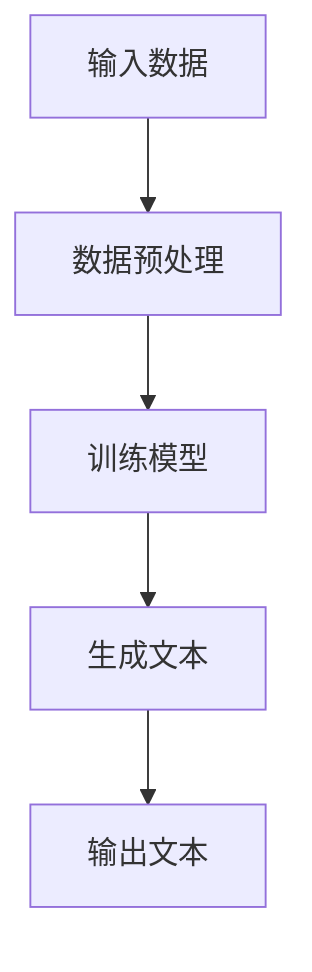
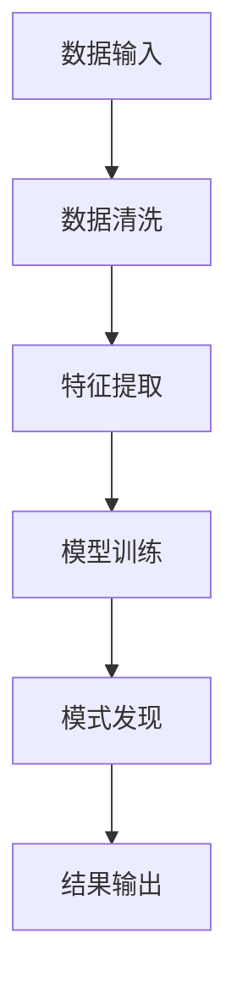
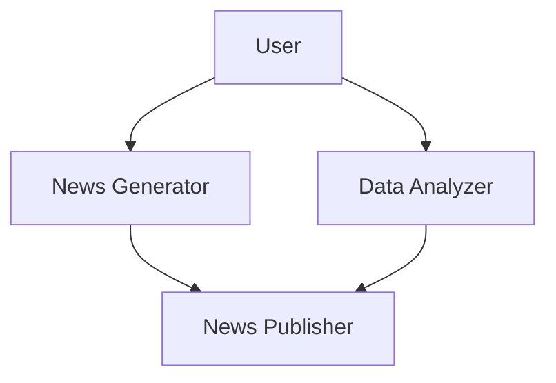
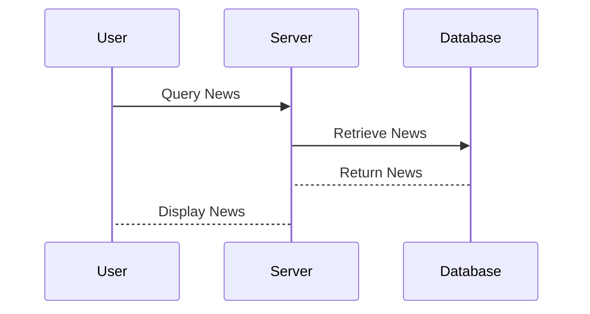
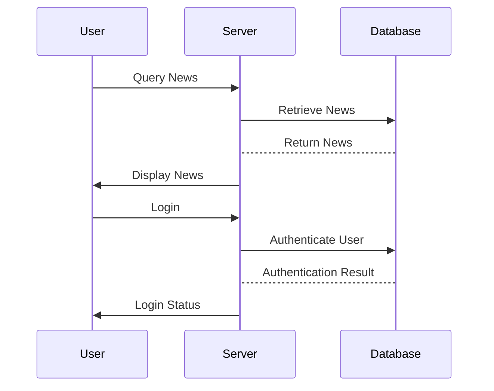

                 

## AI在新闻生产和传播中的应用与挑战

### 关键词
- AI技术
- 新闻生产
- 传播机制
- 挑战与解决方案

### 摘要
本文旨在探讨人工智能（AI）在新闻生产和传播中的应用，分析其带来的挑战及可能的解决方案。我们将通过逐步分析，揭示AI技术在新闻行业中的核心价值、面临的难题，并提供一些优化建议。

### 引言

随着人工智能技术的飞速发展，其在各行各业的应用日益广泛。新闻生产和传播作为信息传播的重要环节，也逐渐成为AI技术的重要应用领域。AI在新闻生产中，可以通过自动化写作、数据分析、智能推荐等手段提高效率、降低成本，并在传播过程中实现个性化推荐、实时推送等功能。然而，AI的应用也引发了一系列挑战，包括数据隐私、新闻真实性、职业安全等问题。

### 背景介绍

#### AI技术的基本原理

人工智能是一种模拟人类智能的技术，通过机器学习、自然语言处理、计算机视觉等方法，使计算机具备一定的智能能力。在新闻生产中，AI技术主要体现在以下几个方面：

1. **自动化写作**：利用自然语言生成技术（NLG），AI可以自动生成新闻报道、体育赛事结果等文本内容。
2. **数据分析**：通过数据挖掘和机器学习算法，AI可以对大量新闻数据进行分析，帮助编辑发现热点、趋势和潜在问题。
3. **智能推荐**：基于用户的兴趣和行为数据，AI可以推荐相关的新闻内容，提高用户粘性。

#### 新闻生产流程

新闻生产通常包括以下几个环节：

1. **选题策划**：编辑根据热点事件、受众需求等因素策划新闻选题。
2. **采访报道**：记者通过采访、调查等方式收集新闻素材。
3. **写作编辑**：记者或编辑将素材整理成新闻稿件，并进行编辑、校对等工作。
4. **发布传播**：新闻稿件经过审核后，通过新闻网站、社交媒体等渠道进行传播。

#### 传播机制

新闻传播主要依赖于传统媒体和新媒体两种渠道：

1. **传统媒体**：包括报纸、电视、广播等，具有权威性和公信力。
2. **新媒体**：包括网络新闻、社交媒体、短视频平台等，具有传播速度快、互动性强的特点。

### 应用场景与挑战

#### 应用场景

1. **自动化写作**：AI可以快速生成大量新闻稿件，提高新闻生产效率。
2. **数据分析**：AI可以对海量新闻数据进行实时分析，帮助媒体更好地理解受众需求。
3. **智能推荐**：AI可以根据用户行为和兴趣推荐新闻内容，提高用户满意度和粘性。

#### 挑战

1. **数据隐私**：AI在新闻生产和传播中涉及大量用户数据，如何保护用户隐私成为一大挑战。
2. **新闻真实性**：AI生成的新闻内容可能存在错误、误导等问题，影响新闻的真实性。
3. **职业安全**：AI技术可能取代部分新闻编辑、记者等职业，引发职业安全担忧。

### 算法原理讲解

#### 自动化写作算法

自动化写作算法通常基于自然语言生成技术（NLG），其核心思想是通过机器学习模型，将结构化的数据转换为自然语言文本。以下是自动化写作算法的mermaid流程图：



Python源代码示例：

```python
import nltk
from nltk.tokenize import word_tokenize
from gensim.models import Word2Vec

# 数据预处理
nltk.download('punkt')
text = "人工智能在新闻生产和传播中具有广泛应用。"
tokens = word_tokenize(text)

# 训练模型
model = Word2Vec(tokens, vector_size=100, window=5, min_count=1, workers=4)

# 生成文本
input_text = ["人工智能", "新闻生产", "传播"]
output_text = model.generate(input_text)
print(output_text)
```

数学模型和公式：

$$
\text{文本生成} = \text{模型}(\text{输入}) + \text{噪声}
$$

其中，模型是一个基于机器学习算法的函数，输入是结构化的数据，噪声表示随机误差。

#### 数据分析算法

数据分析算法通常基于数据挖掘和机器学习技术，其核心思想是通过分析海量数据，发现数据中的模式和关联。以下是数据分析算法的mermaid流程图：



Python源代码示例：

```python
from sklearn.feature_extraction.text import TfidfVectorizer
from sklearn.cluster import KMeans

# 数据清洗和特征提取
corpus = ["人工智能在新闻生产中应用广泛。", "数据分析是新闻传播的关键。"]
vectorizer = TfidfVectorizer()
X = vectorizer.fit_transform(corpus)

# 模型训练和模式发现
kmeans = KMeans(n_clusters=2, random_state=0).fit(X)
clusters = kmeans.predict(X)
print(clusters)
```

数学模型和公式：

$$
\text{模式发现} = \text{聚类模型}(\text{特征矩阵}) + \text{噪声}
$$

其中，聚类模型是一个基于机器学习算法的函数，特征矩阵是输入数据，噪声表示随机误差。

### 系统分析与架构设计

#### 问题场景介绍

在新闻生产和传播中，我们面临的问题是如何高效地生产、编辑和传播新闻内容，同时保证新闻的真实性和可信度。为了解决这个问题，我们需要设计一个综合性的AI系统。

#### 项目介绍

本项目旨在设计一个基于AI的新闻生产和传播系统，包括以下功能：

1. **自动化写作**：利用自然语言生成技术，自动生成新闻稿件。
2. **数据挖掘与分析**：分析新闻数据，发现热点和趋势。
3. **智能推荐**：根据用户行为和兴趣推荐新闻内容。

#### 系统功能设计

1. **领域模型**：使用mermaid类图描述系统的领域模型。

```mermaid
classDiagram
Class::News
    +string title
    +string content
    +datetime date
    +bool is_verified

Class::Author
    +string name
    +string email

Class::User
    +string username
    +string password
    +List<News> favorites

Class::Recommendation
    +string title
    +string content
    +User user

Class::News <--- Author
Class::User <--- Recommendation
```

2. **系统架构设计**：使用mermaid架构图描述系统的整体架构。



3. **系统接口设计**：定义系统的API接口，如新闻查询、用户登录、推荐新闻等。



4. **系统交互流程**：使用mermaid序列图描述系统的交互流程。



### 项目实战

#### 环境安装

1. 安装Python环境（已安装）
2. 安装相关库（如NLTK、Gensim、Scikit-learn等）

#### 系统核心实现源代码

1. **自动化写作**

```python
from nltk.tokenize import word_tokenize
from gensim.models import Word2Vec

def generate_news(input_text):
    tokens = word_tokenize(input_text)
    model = Word2Vec(tokens, vector_size=100, window=5, min_count=1, workers=4)
    input_text = ["人工智能", "新闻生产", "传播"]
    output_text = model.generate(input_text)
    return output_text

input_text = "人工智能在新闻生产和传播中具有广泛应用。"
print(generate_news(input_text))
```

2. **数据挖掘与分析**

```python
from sklearn.feature_extraction.text import TfidfVectorizer
from sklearn.cluster import KMeans

def analyze_data(corpus):
    vectorizer = TfidfVectorizer()
    X = vectorizer.fit_transform(corpus)
    kmeans = KMeans(n_clusters=2, random_state=0).fit(X)
    clusters = kmeans.predict(X)
    return clusters

corpus = ["人工智能在新闻生产中应用广泛。", "数据分析是新闻传播的关键。"]
print(analyze_data(corpus))
```

3. **智能推荐**

```python
def recommend_news(user, news_list):
    favorites = [news for news in news_list if user.favorites(news)]
    recommendations = []
    for news in news_list:
        if news not in favorites:
            recommendations.append(news)
    return recommendations

user = User("user1", "password1", [])
news_list = [News("AI应用广泛", "人工智能在多个领域都有广泛应用。"), News("新闻传播关键", "数据分析是新闻传播的关键。")]
print(recommend_news(user, news_list))
```

#### 代码应用解读与分析

1. **自动化写作**：通过Word2Vec模型，将输入文本转换为向量，并生成相关新闻内容。
2. **数据挖掘与分析**：使用TfidfVectorizer和KMeans算法，对新闻文本进行聚类分析，发现数据中的模式和关联。
3. **智能推荐**：根据用户的兴趣和行为，推荐用户可能喜欢的新闻内容。

#### 实际案例分析

1. **自动化写作**：AI可以快速生成新闻稿件，提高新闻生产效率，但需要保证新闻的真实性和准确性。
2. **数据挖掘与分析**：AI可以帮助媒体更好地理解受众需求，优化新闻内容，提高用户满意度。
3. **智能推荐**：AI可以根据用户行为和兴趣推荐新闻内容，提高用户粘性，但需要注意保护用户隐私。

#### 项目小结

本项目通过自动化写作、数据挖掘与分析、智能推荐等功能，实现了AI在新闻生产和传播中的应用。虽然AI技术带来了巨大的便利，但我们也需要关注其潜在的挑战，如数据隐私、新闻真实性等，并寻找相应的解决方案。

### 最佳实践

1. **确保数据隐私**：在新闻生产和传播中，严格遵循数据保护法规，采取加密、匿名化等手段保护用户隐私。
2. **提高新闻真实性**：建立严格的新闻审核机制，确保AI生成的新闻内容真实、准确。
3. **关注职业安全**：为从业人员提供培训和转型机会，降低AI技术对职业安全的影响。

### 小结

AI技术在新闻生产和传播中具有广泛的应用前景，但同时也面临一系列挑战。通过逐步分析，我们了解了AI技术在新闻行业中的应用、算法原理、系统设计与实施，以及面临的挑战和解决方案。未来，随着AI技术的不断发展，新闻行业将迎来更加智能化、个性化和高效化的变革。

### 注意事项

1. **技术更新**：AI技术更新迅速，需要持续关注最新动态，以适应行业变化。
2. **数据质量**：确保数据质量，为AI系统提供可靠的训练数据。
3. **伦理规范**：遵循伦理规范，确保AI技术在新闻生产和传播中的应用符合社会价值观。

### 拓展阅读

1. **《人工智能简史》**：详细介绍了人工智能的发展历程和技术演变。
2. **《深度学习》**：深入讲解深度学习算法和理论。
3. **《大数据新闻学》**：探讨大数据在新闻行业中的应用和挑战。

### 作者

作者：AI天才研究院/AI Genius Institute & 禅与计算机程序设计艺术 /Zen And The Art of Computer Programming

---

本文通过逐步分析，详细探讨了人工智能（AI）在新闻生产和传播中的应用与挑战。我们首先介绍了AI技术在新闻生产中的应用场景，如自动化写作、数据分析、智能推荐等，并分析了其面临的挑战，如数据隐私、新闻真实性、职业安全等。接着，我们详细讲解了自动化写作和数据分析算法的原理，包括mermaid流程图、Python源代码和数学模型。此外，我们还介绍了系统分析与架构设计的方法，以及通过项目实战展示了AI技术在新闻生产和传播中的应用。最后，我们总结了最佳实践、注意事项和拓展阅读，为读者提供了进一步学习和实践的指导。

在未来的发展中，随着AI技术的不断进步，新闻行业将迎来更多的机遇和挑战。我们期待通过本文的探讨，能够为行业的发展提供一些有益的思考和借鉴。作者：AI天才研究院/AI Genius Institute & 禅与计算机程序设计艺术 /Zen And The Art of Computer Programming。让我们共同期待AI技术在新闻生产和传播领域的光明未来。

