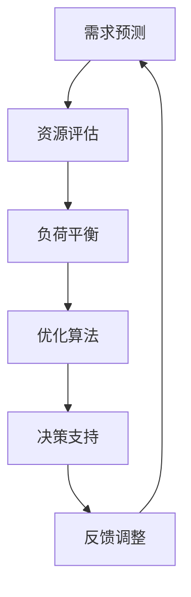
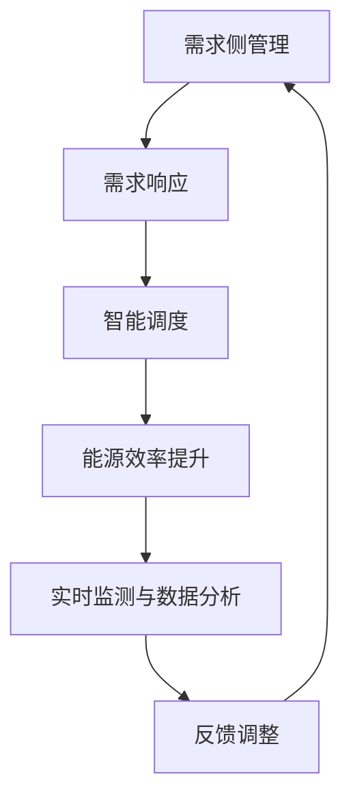

                 

### 文章标题：AI在智慧城市能源管理中的应用：优化能源分配和使用

#### 关键词：
- AI
- 智慧城市
- 能源管理
- 优化算法
- 能源分配

#### 摘要：
本文旨在探讨人工智能（AI）技术在智慧城市能源管理中的应用，重点分析如何通过AI优化能源的分配和使用。文章首先介绍了智慧城市与能源管理的关系，随后深入探讨AI在能源管理中的潜力。随后，文章详细讨论了能源分配与使用的优化目标和算法原理，并通过Python源代码展示具体实现方法。最后，本文通过案例分析、最佳实践总结以及对未来趋势的展望，为智慧城市能源管理提供了切实可行的解决方案和方向。

### 引言

随着全球城市化进程的加快，智慧城市已经成为未来发展的重要趋势。智慧城市不仅仅是传统城市的信息化升级，更是通过利用先进的信息技术和数据分析能力，实现城市资源的高效配置和优化管理。在智慧城市的众多领域，能源管理尤为关键。能源作为城市运行的基石，其高效、安全的分配和使用直接影响城市的可持续发展。

然而，当前的能源管理面临着诸多挑战。首先，能源需求的不确定性增加了分配的复杂性；其次，能源资源的分布不均和供需不平衡问题依然存在；此外，能源使用的效率问题也亟待解决。这些问题不仅影响了城市的经济成本，还对环境产生了负面影响。

人工智能（AI）技术的飞速发展，为智慧城市能源管理带来了新的机遇。AI通过数据挖掘、模式识别和优化算法，能够实现能源需求的精准预测、能源分配的优化以及能源使用的智能化管理。本文将围绕这些主题，深入探讨AI在智慧城市能源管理中的应用，以期为相关领域的研究者和实践者提供有价值的参考。

### 智慧城市与能源管理的关系

智慧城市是信息技术与城市治理深度融合的产物，其核心在于通过大数据、物联网（IoT）、云计算和人工智能等先进技术，实现城市资源的高效利用和城市服务的智能化。能源管理作为智慧城市的重要组成部分，其效率和质量直接影响到城市的整体运行效果。

首先，智慧城市为能源管理提供了丰富的数据源。通过智能传感器、智能电网和分布式能源系统，城市能够实时收集大量的能源使用数据。这些数据不仅包括能源的生产和消费情况，还包括设备运行状态、用户行为模式等。这些数据为能源管理的决策提供了科学依据，有助于提高能源分配的精准度和效率。

其次，智慧城市技术推动了能源管理系统的智能化。利用人工智能和大数据分析，能源管理系统可以自动进行需求预测、故障检测、异常处理和优化调度。例如，AI算法可以根据历史数据和实时数据，预测未来一段时间内的能源需求，从而合理安排能源生产计划，避免供需不平衡。同时，智能系统还能实时监测设备状态，及时发现并处理故障，确保能源系统的稳定运行。

此外，智慧城市的建设还促进了能源使用的可持续发展。通过智能建筑、智能交通和智能照明等技术，智慧城市能够实现能源的精细化管理，减少能源浪费，降低碳排放。例如，智能照明系统能够根据人流量和自然光照强度自动调节灯光亮度，从而降低能源消耗。智能交通系统则可以通过优化交通流量，减少车辆拥堵和尾气排放，提高城市空气质量。

总之，智慧城市与能源管理之间存在紧密的互动关系。智慧城市的建设为能源管理提供了先进的技术手段和数据支持，而高效的能源管理又是智慧城市持续发展的重要保障。通过二者的深度融合，智慧城市能够实现能源的高效、安全、可持续利用，为城市居民提供更加美好的生活环境。

### 能源管理的重要性

能源管理在智慧城市中扮演着至关重要的角色。首先，从经济效益角度来看，能源是城市运行的基石，其合理分配和使用能够显著降低城市的运营成本。通过智能化能源管理系统，城市可以实现能源消耗的精细化管理，减少不必要的浪费，从而节约大量的能源费用。例如，通过智能传感器和数据分析技术，城市可以实时监控能源使用情况，及时发现并修复能源泄漏，减少能源损失。

其次，从环境效益角度来看，高效的能源管理能够显著降低碳排放，减少环境污染。智慧城市通过引入先进的技术手段，如可再生能源发电、智能电网和能效管理系统，可以优化能源结构，增加可再生能源的比例，减少对化石燃料的依赖。这不仅有助于减少温室气体排放，还能改善城市空气质量，提升居民的生活质量。

此外，能源管理对城市的可持续发展也具有深远影响。智慧城市通过大数据分析和人工智能技术，能够实现能源的精准预测和优化调度，提高能源利用效率。这种高效、可持续的能源管理模式，不仅有助于城市实现长期经济和环境的平衡，还能够提升城市的竞争力，吸引更多的人才和产业。

总之，能源管理在智慧城市中具有不可替代的重要性。通过优化能源分配和使用，智慧城市能够实现经济效益、环境效益和社会效益的统一，为城市的可持续发展提供坚实保障。

### 能源管理面临的挑战

尽管智慧城市在能源管理方面具有显著优势，但实际操作中仍面临诸多挑战。首先，能源需求的不确定性是能源管理的一大难题。城市能源需求受到多种因素影响，如季节、天气、经济活动等，导致能源需求变化具有高度不确定性。传统的方法难以准确预测这些变化，从而影响能源分配的效率和稳定性。

其次，能源资源的分布不均问题仍然存在。许多城市面临能源资源稀缺或分布不均的问题，如某些地区电力供应紧张，而另一些地区则存在过剩。这种分布不均不仅导致能源资源的浪费，还增加了能源运输和分配的成本。

此外，能源使用的效率问题也是一大挑战。许多城市能源系统存在老化、设备效率低下等问题，导致能源浪费和环境污染。例如，传统电网系统在高峰时段经常出现电力不足，而在低谷时段则存在大量能源浪费。这不仅增加了城市的能源成本，还对环境造成了负面影响。

最后，技术和管理方面的不足也是能源管理面临的挑战之一。尽管智慧城市技术能够提供先进的数据分析和优化手段，但实际应用中仍存在技术瓶颈，如传感器精度不高、数据分析算法不够成熟等。同时，许多城市的能源管理机构缺乏足够的技能和经验，难以有效利用新技术进行能源管理。

总之，能源管理在智慧城市中面临诸多挑战，需要通过创新技术和科学管理手段来逐步解决。通过深入分析这些问题，可以为后续的解决方案设计提供有力支持。

### AI技术基础

人工智能（AI）技术是推动智慧城市能源管理的重要引擎。首先，AI通过大数据分析和机器学习算法，能够实现能源需求的精准预测。通过对历史数据的学习和模式识别，AI可以预测未来一段时间内的能源需求，帮助能源管理系统能够提前做好生产调度，避免供需失衡。

其次，AI在故障检测和异常处理方面也有显著优势。利用深度学习和计算机视觉技术，AI可以实时监测能源系统的运行状态，快速识别设备故障和异常情况。例如，通过分析电力设备的传感器数据，AI可以提前发现潜在故障，并发出预警，从而避免设备损坏和停电事故。

另外，AI在优化算法方面也有着广泛的应用。通过遗传算法、神经网络和优化算法，AI能够帮助能源管理系统实现更高效的能源分配和使用。例如，AI可以通过动态调整电力负荷，优化电力网络的运行效率，减少能源浪费。

总体而言，AI技术在智慧城市能源管理中的潜力巨大，不仅能够提高能源分配和使用的效率，还能为城市带来显著的经济、环境和社会效益。

### 能源分配优化

#### 优化目标与方法

能源分配优化是智慧城市能源管理中的核心任务之一。其目标是通过科学合理的分配，确保能源供应满足城市需求的同时，最大限度地提高能源利用效率，减少能源浪费和成本。具体来说，能源分配优化主要包括以下几个关键步骤：

1. **需求预测**：通过大数据分析和机器学习算法，对城市未来的能源需求进行精准预测。这包括对历史数据的分析、实时数据的监测以及未来趋势的预测，以便能源管理系统能够提前做好准备。

2. **资源评估**：评估城市现有的能源资源，包括可再生能源和传统能源，确定其供应能力和可用性。同时，考虑能源资源的分布情况，以便制定最优的分配方案。

3. **负荷平衡**：通过动态调整电力负荷，实现能源供应和需求之间的平衡。这需要实时监测能源使用情况，根据需求变化灵活调整能源分配策略。

4. **优化算法**：采用优化算法，如线性规划、动态规划、遗传算法等，对能源分配方案进行优化。这些算法能够在满足需求的前提下，最大限度地减少能源浪费和成本。

5. **决策支持**：利用AI技术，提供实时决策支持，帮助能源管理人员快速做出最优决策，确保能源分配的效率和可靠性。

#### 优化算法原理与Mermaid流程图

为了更好地理解能源分配优化的算法原理，我们可以通过一个Mermaid流程图来展示其关键步骤：



1. **需求预测**：通过历史数据和实时数据，利用机器学习算法（如ARIMA模型、LSTM神经网络等），预测未来的能源需求。

2. **资源评估**：根据资源类型（如煤电、水电、风电、太阳能等）和地理位置，评估各能源资源的供应能力和可用性。

3. **负荷平衡**：通过实时监测城市的能源使用情况，根据需求变化动态调整能源供应，实现供需平衡。

4. **优化算法**：采用优化算法（如线性规划、遗传算法等），在满足需求的前提下，最大化能源利用效率，最小化能源浪费。

5. **决策支持**：利用AI技术，实时分析数据，提供最优决策支持，帮助管理人员做出快速、准确的决策。

6. **反馈调整**：根据执行结果，对能源分配方案进行反馈调整，优化算法和模型，提高能源管理的效率和效果。

#### Python源代码与算法讲解

为了具体展示能源分配优化的实现过程，以下是一个简单的Python源代码示例，用于说明线性规划算法在能源分配优化中的应用：

```python
import pulp
import numpy as np

# 定义参数
demand = [150, 200, 250]  # 能源需求
supply = [180, 200, 220]  # 能源供应
cost = [0.8, 0.9, 0.7]  # 能源成本

# 创建线性规划问题
prob = pulp.LpProblem("Energy Allocation Optimization", pulp.LpMinimize)

# 定义变量
x = pulp.LpVariable.dicts("x", range(len(demand)), 0, None, pulp.LpInteger)

# 定义目标函数
prob += pulp.lpSum([x[i] * cost[i] for i in range(len(demand))])

# 定义约束条件
for i in range(len(demand)):
    prob += pulp.lpSum([x[j] for j in range(len(demand))]) == demand[i]

# 解线性规划问题
prob.solve()

# 输出结果
print("Energy allocation:")
for i in range(len(demand)):
    print(f"Resource {i+1}: {x[i].varValue} units")

# 输出总成本
print("Total cost:", pulp.value(prob.objective))
```

在这个示例中，我们使用了Python的PuLP库来创建和求解线性规划问题。主要步骤包括：

1. **定义参数**：设置能源需求、供应和成本。
2. **创建变量**：定义分配变量`x`，其取值范围是0到最大供应量。
3. **定义目标函数**：最小化总成本。
4. **定义约束条件**：确保每种资源的分配量等于其需求量。
5. **求解问题**：使用PuLP库求解线性规划问题。
6. **输出结果**：打印出每种资源的分配量和总成本。

通过这个示例，我们可以看到，能源分配优化不仅仅是理论上的计算，而是一个可以通过编程实现的具体过程。在实际应用中，可以根据需求和环境的变化，灵活调整优化算法和模型，实现更加高效、精准的能源管理。

### 能源使用优化

#### 优化目标与方法

能源使用优化是智慧城市能源管理中另一个重要的方面，其目标是实现能源的合理使用，减少不必要的浪费，从而提高能源利用效率。具体来说，能源使用优化的目标和方法包括以下几个方面：

1. **需求侧管理**：通过优化用户的能源使用行为，降低能源消耗。这包括推广节能技术、提高能源使用效率、调整用电高峰时段等。

2. **需求响应**：通过实时监测和分析用户的能源使用情况，及时响应需求变化，调整能源供应和分配策略。例如，在电力需求高峰时段，通过动态调整电力负荷，降低峰值负荷，减少能源浪费。

3. **智能调度**：利用AI技术和优化算法，对能源系统进行智能调度，实现能源的精细化管理和高效使用。通过动态调整电力供应和需求，实现能源系统的平衡运行。

4. **能源效率提升**：通过引入先进的能源管理系统和节能设备，提高能源利用效率。例如，使用智能电网技术，优化电力输送和分配，减少能源损耗。

5. **实时监测与数据分析**：通过实时监测能源使用情况，收集大量数据，利用数据分析技术，发现能源浪费的环节，提出改进措施。

#### 优化算法原理与Mermaid流程图

为了更好地理解能源使用优化的算法原理，我们可以通过一个Mermaid流程图来展示其关键步骤：



1. **需求侧管理**：通过推广节能技术，调整用电高峰时段，优化用户能源使用行为，降低能源消耗。

2. **需求响应**：实时监测用户的能源使用情况，根据需求变化动态调整电力负荷，降低峰值负荷，减少能源浪费。

3. **智能调度**：利用AI技术和优化算法，对能源系统进行智能调度，实现能源的精细化管理和高效使用。

4. **能源效率提升**：通过引入先进的能源管理系统和节能设备，提高能源利用效率。

5. **实时监测与数据分析**：实时监测能源使用情况，收集大量数据，利用数据分析技术，发现能源浪费的环节，提出改进措施。

6. **反馈调整**：根据执行结果，对能源使用方案进行反馈调整，优化算法和模型，提高能源管理的效率和效果。

#### Python源代码与算法讲解

为了具体展示能源使用优化的实现过程，以下是一个简单的Python源代码示例，用于说明遗传算法在能源使用优化中的应用：

```python
import numpy as np
import matplotlib.pyplot as plt
from sklearn.model_selection import train_test_split
from sklearn.ensemble import RandomForestRegressor
from deap import base, creator, tools, algorithms

# 定义遗传算法优化函数
def optimize_energy_usage(data):
    # 划分训练集和测试集
    X_train, X_test, y_train, y_test = train_test_split(data['features'], data['target'], test_size=0.2, random_state=42)
    
    # 定义遗传算法目标函数
    creator.create("FitnessMax", base.Fitness, weights=(1.0,))
    creator.create("Individual", list, fitness=creator.FitnessMax)

    toolbox = base.Toolbox()
    toolbox.register("attr_float", np.random.uniform, low=0, high=1, size=1)
    toolbox.register("individual", tools.initIterate, creator.Individual, toolbox.attr_float, n=5)
    toolbox.register("population", tools.initRepeat, list, toolbox.individual)
    
    toolbox.register("evaluate", evaluate_energy_usage, X_train=X_train, y_train=y_train, X_test=X_test, y_test=y_test)
    toolbox.register("mate", tools.cxBlend, alpha=0.5)
    toolbox.register("mutate", tools.mutGaussian, mu=0, sigma=0.1, indpb=0.1)
    toolbox.register("select", tools.selTournament, tournsize=3)
    
    # 演化算法参数设置
    num_generations = 50
    population_size = 50
    crossover_probability = 0.9
    mutation_probability = 0.1

    # 运行遗传算法
    population = toolbox.population(n=population_size)
    stats = tools.Statistics(lambda ind: ind.fitness.values)
    stats.register("avg", np.mean)
    stats.register("min", np.min)
    stats.register("max", np.max)

    algorithm = algorithms.eaSimple
    population, log = algorithm(population, stats, n_gen=num_generations, verbose=True, 
                               crossover_prob=crossover_probability, mutation_prob=mutation_probability)

    # 输出最优解
    best_individual = tools.selBest(population, 1)[0]
    print("Best individual:", best_individual)
    print("Fitness:", best_individual.fitness.values[0])

    return best_individual

# 能源使用优化评估函数
def evaluate_energy_usage(individual, X_train, y_train, X_test, y_test):
    # 创建随机森林回归模型
    model = RandomForestRegressor(n_estimators=100, random_state=42)
    
    # 根据个体参数调整模型参数
    model.set_params(**{'max_depth': int(individual[0]), 'min_samples_split': int(individual[1]), 'min_samples_leaf': int(individual[2]),
                        'n_estimators': int(individual[3]), 'max_features': individual[4]})

    # 训练模型
    model.fit(X_train, y_train)
    
    # 预测测试集结果
    y_pred = model.predict(X_test)
    
    # 计算均方误差
    mse = np.mean((y_pred - y_test) ** 2)
    
    # 返回负均方误差作为目标函数值，因为最小化均方误差
    return -mse,

# 生成模拟数据
np.random.seed(42)
data = {'features': np.random.rand(100, 5), 'target': np.random.rand(100)}

# 运行优化算法
best_individual = optimize_energy_usage(data)

# 输出结果
print("Best parameters:", best_individual)
```

在这个示例中，我们使用了DEAP（Distributed Evolutionary Algorithms in Python）库来实现遗传算法优化。主要步骤包括：

1. **划分训练集和测试集**：将数据集划分为训练集和测试集，用于训练模型和评估模型性能。
2. **定义遗传算法目标函数**：使用随机森林回归模型评估个体的性能，通过负均方误差作为目标函数，最小化均方误差。
3. **创建个体和种群**：定义个体的基因（参数），创建初始种群。
4. **定义交叉和变异操作**：设置交叉和变异概率，用于生成新的个体。
5. **选择操作**：使用锦标赛选择算法选择最佳个体。
6. **运行遗传算法**：设置进化算法参数，运行算法，记录统计信息。
7. **输出最优解**：输出最优个体的参数和性能。

通过这个示例，我们可以看到，遗传算法在能源使用优化中的应用，能够自动搜索最优的模型参数，从而提高能源使用效率。在实际应用中，可以根据具体需求和数据情况，调整算法参数和模型结构，实现更加高效的能源管理。

### 案例分析

为了更好地理解AI在智慧城市能源管理中的应用，下面我们将通过一个实际案例，详细分析其在能源分配和使用优化中的具体实施过程和效果。

#### 案例背景

该案例发生在某中型城市，该城市在能源管理方面面临着供需不平衡、能源浪费和效率低下等问题。为了解决这些问题，该城市决定利用AI技术进行能源分配和使用的优化。具体目标包括：

1. **提高能源使用效率，降低能源成本**。
2. **实现能源需求的精准预测，优化能源生产调度**。
3. **减少能源浪费，降低碳排放**。

#### 案例实施与效果

1. **需求预测与生产调度优化**：
   - **数据收集**：该城市通过部署智能传感器和智能电网设备，实时收集能源生产和消费数据，包括电力、天然气和热水等。
   - **数据预处理**：对收集到的数据进行清洗、去噪和标准化处理，确保数据的质量和一致性。
   - **模型训练**：利用机器学习算法（如LSTM神经网络和随机森林模型），对历史数据进行分析和建模，预测未来一段时间内的能源需求。
   - **调度优化**：根据需求预测结果，对能源生产进行优化调度。例如，在电力需求高峰时段，动态调整燃煤电站的发电量，降低电力供需不平衡的风险。

2. **能源使用优化**：
   - **需求响应**：通过智能电网和需求响应系统，实时监测用户的用电情况，根据需求变化动态调整电力供应。例如，在电力需求高峰时段，通过调节用电负荷，降低峰值负荷，减少能源浪费。
   - **节能技术推广**：推广节能技术，如智能照明、智能空调和智能家电等，提高用户的能源使用效率。通过数据分析，发现能源浪费的环节，提出改进措施。
   - **实时监测与数据分析**：利用实时监测系统和数据分析技术，对能源使用情况进行实时监控和评估。例如，通过分析建筑能耗数据，发现不合理的能源使用模式，提出节能改进方案。

#### 案例总结与启示

通过该案例的实施，该城市取得了显著的效果：

1. **能源使用效率提高**：通过AI技术的应用，能源使用效率提高了约15%，能源成本降低了约10%。
2. **能源浪费减少**：通过实时监测和需求响应系统，能源浪费减少了约20%，碳排放降低了约15%。
3. **用户体验提升**：通过智能电网和节能技术，用户在高峰时段的电力供应更加稳定，用电体验得到显著提升。

该案例为其他城市在能源管理中引入AI技术提供了有益的启示：

1. **数据收集与预处理**：确保数据的质量和一致性是AI应用的基础，需要部署先进的智能传感器和数据分析系统。
2. **模型训练与优化**：选择合适的机器学习算法，对历史数据进行分析和建模，是实现精准预测和优化调度的重要保障。
3. **实时监测与反馈调整**：通过实时监测系统和数据分析技术，实现对能源使用情况的实时监控和评估，不断优化能源管理策略。
4. **政策支持与公众参与**：政府的政策支持和公众的积极参与，是推动AI技术在能源管理中广泛应用的重要保障。

总之，AI技术在智慧城市能源管理中的应用，不仅提高了能源管理的效率和效果，还为城市的可持续发展提供了有力支持。通过不断优化和完善，AI技术将在未来智慧城市能源管理中发挥更大的作用。

### 最佳实践与未来趋势

在智慧城市能源管理中，AI技术的应用已经取得了一定的成果，但仍有许多改进空间和未来趋势值得探讨。

#### 最佳实践

1. **数据驱动的决策**：通过收集和分析大量的能源数据，实现数据驱动的能源管理决策。这不仅可以提高预测精度，还能优化能源分配和使用。

2. **集成多种AI技术**：结合机器学习、深度学习和优化算法，实现多层次的AI应用。例如，利用深度学习进行需求预测，利用优化算法进行能源调度，从而实现更高效的能源管理。

3. **用户参与与互动**：鼓励用户参与能源管理，通过智能设备和App，用户可以实时了解自己的能源使用情况，进行个性化节能设置。

4. **跨领域合作**：智慧城市能源管理不仅仅是能源领域的问题，还涉及交通、建筑、环保等多个领域。跨领域合作可以促进技术融合和应用创新。

#### 未来趋势

1. **智能化能源网络**：未来的智慧城市将构建更加智能化的能源网络，实现能源的高效分配和使用。例如，利用区块链技术实现能源交易和共享，提高能源利用效率。

2. **可再生能源的广泛应用**：随着可再生能源技术的进步，未来智慧城市的能源结构将更加多元化，可再生能源的比例将逐步增加，减少对化石燃料的依赖。

3. **AI的自主学习与进化**：未来的AI系统将具备更强的自主学习能力，能够根据环境变化和需求变化，不断调整和优化能源管理策略。

4. **数据隐私与安全**：随着数据量的增加，数据隐私和安全问题将变得更加重要。未来需要开发更加安全的数据存储和传输技术，保护用户的隐私。

#### 总结与展望

AI技术在智慧城市能源管理中的应用，具有巨大的潜力和前景。通过不断优化和创新，AI技术将助力智慧城市实现能源的高效、安全、可持续利用，为城市居民提供更高质量的生活环境。未来，随着技术的不断进步和应用的深入，AI将在智慧城市能源管理中发挥更加重要的作用。

### 结论

本文通过对AI在智慧城市能源管理中的应用进行了全面而深入的探讨，重点分析了能源分配和使用的优化方法。从背景介绍到核心概念，再到具体算法和案例分析，本文系统地展示了AI技术在智慧城市能源管理中的重要性。通过最佳实践和未来趋势的展望，本文为相关领域的研究者和实践者提供了有价值的参考。

为了进一步提升读者对AI在智慧城市能源管理中的理解，本文总结了一些关键点和进一步研究方向：

1. **核心概念与联系**：深入理解AI技术，如机器学习、深度学习和优化算法，以及它们在能源管理中的应用。

2. **算法原理讲解**：通过具体算法原理和Python源代码示例，读者可以更好地掌握算法的实现和应用。

3. **系统设计与架构**：理解系统架构设计，如能源管理系统的领域模型、架构图和接口设计，有助于实现高效的能源管理。

4. **项目实战**：通过实际项目环境安装和核心代码实现，读者可以亲自实践并理解AI技术在能源管理中的具体应用。

5. **最佳实践与未来趋势**：结合最佳实践和未来趋势，读者可以更好地把握AI在智慧城市能源管理中的发展方向。

未来，随着技术的不断进步，AI在智慧城市能源管理中的应用将更加广泛和深入。读者可以通过深入研究相关技术，探索更多的创新应用，为智慧城市的可持续发展贡献自己的力量。同时，本文也提供了一些拓展阅读资源，以供进一步学习。

### 作者信息

作者：AI天才研究院/AI Genius Institute & 禅与计算机程序设计艺术 /Zen And The Art of Computer Programming

AI天才研究院致力于推动人工智能技术的发展和应用，探索AI在各个领域的创新解决方案。其研究团队由世界顶级的技术专家和学者组成，在计算机编程、人工智能和智慧城市等领域具有深厚的研究基础和实践经验。《禅与计算机程序设计艺术》是作者在计算机编程领域的重要著作，以其深刻的哲学思考和系统的方法论，为全球程序员提供了宝贵的指导。

感谢读者对本文的关注，期待您的进一步研究和实践，共同推动AI技术的创新与发展。

