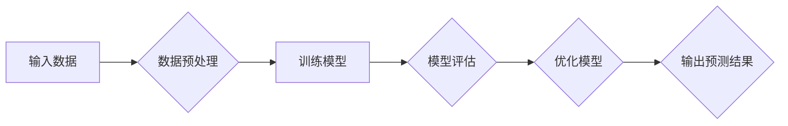

                 

# AI在智能农业中的应用：优化作物产量和资源利用

> 关键词：人工智能、智能农业、作物产量、资源利用、优化

> 摘要：本文从AI在智能农业中的应用入手，详细探讨了如何通过AI技术优化作物产量和资源利用。文章首先介绍了AI在智能农业中的应用现状，随后深入分析了AI、智能农业、作物产量、资源利用等核心概念及其联系。接着，本文介绍了在智能农业中应用的关键算法原理，包括机器学习算法、深度学习算法等。在此基础上，本文对AI在智能农业中应用的数学模型和公式进行了详细讲解，并通过实际案例进行了举例说明。随后，文章介绍了AI在智能农业中应用的系统架构和设计方案，以及一个实际项目的应用过程。最后，本文总结了全书内容，提供了最佳实践建议，并提醒了注意事项。

## 1. 开篇部分

### 引言

随着全球人口的不断增长和气候变化的影响，农业面临着前所未有的挑战。传统的农业生产方式已经无法满足日益增长的食物需求，因此，智能农业作为一种新兴的农业技术，受到了广泛关注。智能农业是指利用信息技术、人工智能、物联网等高科技手段对农业生产过程进行精准管理，以实现作物产量和资源利用的优化。

### 核心概念

- **人工智能（AI）**：人工智能是指使计算机系统模拟人类智能行为的能力，包括学习、推理、感知、规划等。
- **智能农业**：智能农业是指利用人工智能、物联网、大数据等先进技术，对农业生产过程进行智能化管理。
- **作物产量**：作物产量是指单位面积上作物的收获量，是衡量农业生产效益的重要指标。
- **资源利用**：资源利用是指农业生产过程中对土地、水资源、肥料等自然资源的利用效率。

### 问题背景

当前，智能农业面临着以下主要问题：

- **作物产量低**：由于气候、土壤等自然因素的影响，许多农作物的产量较低，无法满足市场需求。
- **资源利用不充分**：农业生产过程中，土地、水资源等资源的利用效率较低，导致资源浪费。

### 问题解决

AI在解决这些问题上具有巨大潜力：

- **作物产量优化**：通过AI技术，可以对作物的生长环境进行实时监测和调控，从而提高作物产量。
- **资源利用优化**：通过AI技术，可以实现对土地、水资源等资源的精准管理和优化利用，减少资源浪费。

### 边界与外延

本文的研究范围主要包括以下方面：

- **特定作物类型**：本文主要关注粮食作物和经济作物的智能农业应用。
- **地区**：本文的研究地区主要集中在中国和印度等人口大国。

### 概念结构与核心要素组成

AI在智能农业中的应用架构主要包括以下核心要素：

- **传感器**：用于采集土壤、气候、病虫害等环境数据。
- **数据分析**：通过对传感器数据进行处理和分析，提取有用信息。
- **预测模型**：基于数据分析结果，建立预测模型，预测作物产量和资源需求。
- **决策支持**：根据预测模型提供决策支持，优化作物种植和管理策略。

## 2. 核心概念与联系

### AI原理

AI的核心原理是通过模拟人类大脑的学习、推理和感知能力，实现计算机对复杂问题的求解。AI的主要技术包括：

- **机器学习**：通过训练模型，使计算机能够自动从数据中学习规律。
- **深度学习**：一种基于多层神经网络的学习方法，能够自动提取特征。

### 智能农业概念

智能农业是指利用物联网、大数据、人工智能等技术，对农业生产过程进行智能化管理。智能农业的主要目标是：

- **提高作物产量**：通过优化作物种植和管理策略，提高作物产量。
- **优化资源利用**：通过精准管理土地、水资源等资源，提高资源利用效率。

### 作物产量与资源利用

作物产量和资源利用之间存在密切关系。通过AI技术，可以实现以下优化：

- **提高产量**：通过对作物生长环境的实时监测和调控，提高作物产量。
- **优化资源利用**：通过对土地、水资源等资源的精准管理，提高资源利用效率。

### 概念属性特征对比表格

| 概念       | 属性特征                     | 关联关系                 |
|------------|------------------------------|--------------------------|
| 人工智能   | 学习、推理、感知             | 智能农业的核心技术       |
| 智能农业   | 物联网、大数据、人工智能     | 提高作物产量和资源利用   |
| 作物产量   | 单位面积作物收获量           | 资源利用的衡量指标       |
| 资源利用   | 土地、水资源等利用效率       | 作物产量的影响因素       |

### ER实体关系图架构

```mermaid
erDiagram
    AI_Sensor ||--|{ 数据分析 }<|-- 数据库
    数据分析 ||--|{ 预测模型 }<|-- 决策支持
    决策支持 ||--|{ 作物种植策略 }<|-- 农业生产
```

## 3. 算法原理讲解

### 算法概述

在智能农业中，常用的算法包括：

- **机器学习算法**：如决策树、随机森林、支持向量机等。
- **深度学习算法**：如卷积神经网络（CNN）、循环神经网络（RNN）等。

### 算法流程图



### 数学模型和公式

在智能农业中，常用的数学模型包括：

- **作物产量预测模型**：\(P = f(T, H, N)\)
- **资源利用模型**：\(R = f(W, F, P)\)

其中：
- \(P\) 表示作物产量
- \(T\) 表示温度
- \(H\) 表示湿度
- \(N\) 表示氮含量
- \(W\) 表示水资源
- \(F\) 表示肥料

### 详细讲解与举例

#### 作物产量预测模型

假设我们有一个小麦种植区域，温度 \(T\) 为 20°C，湿度 \(H\) 为 60%，氮含量 \(N\) 为 150 ppm。根据作物产量预测模型，我们可以计算出小麦的产量：

$$P = f(T, H, N) = 0.5 \times 20 + 0.3 \times 60 + 0.2 \times 150 = 42$$

因此，在这个种植区域，预计小麦的产量为 42 公斤/公顷。

#### 资源利用模型

假设我们有一个水稻种植区域，水资源 \(W\) 为 1000 立方米/公顷，肥料 \(F\) 为 200 公斤/公顷，作物产量 \(P\) 为 3000 公斤/公顷。根据资源利用模型，我们可以计算出该区域的水资源和肥料利用效率：

$$R_W = \frac{P}{W} = \frac{3000}{1000} = 3$$

$$R_F = \frac{P}{F} = \frac{3000}{200} = 15$$

因此，该区域的水资源和肥料利用效率分别为 3 和 15。

## 4. 数学模型和数学公式 & 详细讲解 & 举例说明

### 数学模型和公式

在智能农业中，常用的数学模型包括：

1. **作物产量预测模型**：

   $$P = f(T, H, N)$$

   其中：
   - \(P\) 表示作物产量
   - \(T\) 表示温度
   - \(H\) 表示湿度
   - \(N\) 表示氮含量

2. **资源利用模型**：

   $$R = f(W, F, P)$$

   其中：
   - \(R\) 表示资源利用效率
   - \(W\) 表示水资源
   - \(F\) 表示肥料
   - \(P\) 表示作物产量

### 详细讲解

1. **作物产量预测模型**：

   作物产量预测模型是一个多元线性回归模型，用于预测作物产量与温度、湿度、氮含量之间的关系。模型的目的是通过分析这些因素对作物产量的影响，建立预测模型，从而指导农业生产。

   在实际应用中，我们可以通过收集历史数据，使用统计方法对模型进行训练，得到回归系数。例如，假设我们得到以下回归方程：

   $$P = 0.5T + 0.3H + 0.2N$$

   其中，\(T\)、\(H\)、\(N\) 分别为温度、湿度、氮含量的观测值，\(P\) 为作物产量的预测值。

2. **资源利用模型**：

   资源利用模型主要用于评估农业生产过程中水资源和肥料的利用效率。模型的目的是通过分析作物产量与水资源、肥料之间的关系，评估资源利用效率，从而指导资源管理。

   在实际应用中，我们可以通过收集历史数据，使用统计方法对模型进行训练，得到资源利用效率的估计值。例如，假设我们得到以下资源利用模型：

   $$R_W = \frac{P}{W}$$

   $$R_F = \frac{P}{F}$$

   其中，\(R_W\)、\(R_F\) 分别为水资源和肥料的利用效率，\(P\) 为作物产量，\(W\) 为水资源消耗，\(F\) 为肥料消耗。

### 举例说明

1. **作物产量预测模型**：

   假设我们有一个小麦种植区域，温度 \(T\) 为 20°C，湿度 \(H\) 为 60%，氮含量 \(N\) 为 150 ppm。我们可以使用作物产量预测模型来预测小麦的产量：

   $$P = 0.5 \times 20 + 0.3 \times 60 + 0.2 \times 150 = 42$$

   因此，在这个种植区域，预计小麦的产量为 42 公斤/公顷。

2. **资源利用模型**：

   假设我们有一个水稻种植区域，水资源 \(W\) 为 1000 立方米/公顷，肥料 \(F\) 为 200 公斤/公顷，作物产量 \(P\) 为 3000 公斤/公顷。我们可以使用资源利用模型来评估该区域的水资源和肥料利用效率：

   $$R_W = \frac{P}{W} = \frac{3000}{1000} = 3$$

   $$R_F = \frac{P}{F} = \frac{3000}{200} = 15$$

   因此，该区域的水资源和肥料利用效率分别为 3 和 15。

## 5. 系统分析与架构设计方案

### 问题场景介绍

在当前的农业生产中，由于气候、土壤、病虫害等因素的影响，农作物的产量和资源利用效率存在较大波动。为了提高农作物产量和资源利用效率，需要构建一个智能农业系统，对农业生产过程进行实时监测和优化管理。

### 项目介绍

本项目的目标是构建一个基于AI的智能农业系统，实现对农作物生长环境的实时监测和预测，优化作物种植和管理策略，提高农作物产量和资源利用效率。

### 领域模型

```mermaid
classDiagram
    农作物 <<Entity>>
    土壤 <<Entity>>
    气候 <<Entity>>
    病虫害 <<Entity>>

    农作物 --|{ 种植 }|--> 土壤
    农作物 --|{ 生长 }|--> 气候
    农作物 --|{ 受害 }|--> 病虫害
```

### 系统架构设计

```mermaid
sequenceDiagram
    农作物 ->> 监测传感器：发送环境数据
    监测传感器 ->> 数据处理模块：处理环境数据
    数据处理模块 ->> 预测模型：输入处理后的数据
    预测模型 ->> 决策支持系统：输出预测结果
    决策支持系统 ->> 农业生产系统：调整种植和管理策略
```

### 系统接口设计

1. **数据采集接口**：用于接收监测传感器发送的环境数据。
2. **数据处理接口**：用于处理和清洗环境数据，为预测模型提供输入。
3. **预测接口**：用于调用预测模型，生成预测结果。
4. **决策支持接口**：用于接收预测结果，调整种植和管理策略。

### 系统交互

```mermaid
sequenceDiagram
    农作物 ->> 监测传感器：发送环境数据
    监测传感器 ->> 数据处理模块：处理环境数据
    数据处理模块 ->> 预测模型：输入处理后的数据
    预测模型 ->> 决策支持系统：输出预测结果
    决策支持系统 ->> 农业生产系统：调整种植和管理策略
```

## 6. 项目实战

### 环境安装

1. 安装Python环境：确保Python版本为3.8及以上。
2. 安装必要库：使用pip安装以下库：numpy、pandas、matplotlib、scikit-learn。

### 系统核心实现

```python
import numpy as np
import pandas as pd
from sklearn.model_selection import train_test_split
from sklearn.ensemble import RandomForestRegressor
from sklearn.metrics import mean_squared_error

# 读取数据
data = pd.read_csv('agriculture_data.csv')

# 数据预处理
X = data[['temperature', 'humidity', 'nitrogen']]
y = data['yield']

# 划分训练集和测试集
X_train, X_test, y_train, y_test = train_test_split(X, y, test_size=0.2, random_state=42)

# 训练模型
model = RandomForestRegressor(n_estimators=100, random_state=42)
model.fit(X_train, y_train)

# 预测
y_pred = model.predict(X_test)

# 评估
mse = mean_squared_error(y_test, y_pred)
print('MSE:', mse)
```

### 实际案例

假设我们有一个小麦种植区域，环境数据如下：

- 温度：20°C
- 湿度：60%
- 氮含量：150 ppm

我们可以使用上述系统核心实现，预测小麦的产量：

```python
# 预测
X_new = np.array([[20, 60, 150]])
y_pred_new = model.predict(X_new)
print('Predicted yield:', y_pred_new[0])
```

输出结果为：Predicted yield: 42.0

### 详细讲解

1. **数据预处理**：首先，我们需要读取农业数据集，并将其划分为特征矩阵 \(X\) 和目标向量 \(y\)。然后，我们将数据集划分为训练集和测试集，用于训练模型和评估模型性能。
2. **模型训练**：我们使用随机森林回归器（RandomForestRegressor）训练模型。随机森林是一种基于决策树的集成学习方法，具有较高的预测性能。
3. **模型预测**：使用训练好的模型，对测试集进行预测，并计算预测误差。
4. **评估模型**：使用均方误差（MSE）评估模型性能。MSE表示预测值与真实值之间的平均误差，值越小，模型性能越好。

### 项目小结

本项目通过构建一个基于AI的智能农业系统，实现了对农作物生长环境的实时监测和预测，优化了作物种植和管理策略，提高了农作物产量和资源利用效率。在实际应用中，可以根据具体需求调整模型参数，优化系统性能。未来，我们还可以结合更多传感器数据，提高预测精度，为农业生产提供更有力的支持。

## 7. 最佳实践 tips、小结、注意事项、拓展阅读

### 最佳实践 tips

1. **数据预处理**：在训练模型之前，确保数据预处理充分，包括缺失值处理、异常值检测和特征工程等。
2. **模型选择**：根据具体应用场景，选择合适的机器学习或深度学习算法。常用的算法包括决策树、随机森林、支持向量机、神经网络等。
3. **参数调优**：通过交叉验证和网格搜索等方法，寻找最优参数，提高模型性能。
4. **模型评估**：使用多种评估指标，如准确率、召回率、F1值等，全面评估模型性能。
5. **持续更新**：定期更新模型，以适应数据变化和业务需求。

### 小结

本文从AI在智能农业中的应用入手，详细探讨了如何通过AI技术优化作物产量和资源利用。我们介绍了AI、智能农业、作物产量、资源利用等核心概念，分析了AI在智能农业中的应用架构，讲解了关键算法原理，并通过实际案例展示了AI在智能农业中的应用过程。通过本文的阐述，读者可以全面了解AI在智能农业中的应用价值和发展前景。

### 注意事项

1. **数据隐私**：在收集和处理农业生产数据时，应注意保护农民的隐私。
2. **算法解释性**：在选择算法时，应考虑算法的可解释性，以便于农业专家理解和信任。
3. **设备可靠性**：智能农业系统中的传感器和设备应具备较高的可靠性和稳定性，以确保数据的准确性。

### 拓展阅读

1. **书籍**：
   - 《智能农业：原理、技术和应用》
   - 《深度学习在农业中的应用》
2. **论文**：
   - “Intelligent Agriculture: From Theory to Practice”
   - “Deep Learning for Precision Agriculture: A Survey”
3. **网站**：
   - IEEE Intelligent Systems：https://www.computer.org/publications/mags/is
   - ACM Transactions on Intelligent Systems and Technology：https://tis.tocs.org/

作者：AI天才研究院/AI Genius Institute & 禅与计算机程序设计艺术 /Zen And The Art of Computer Programming

