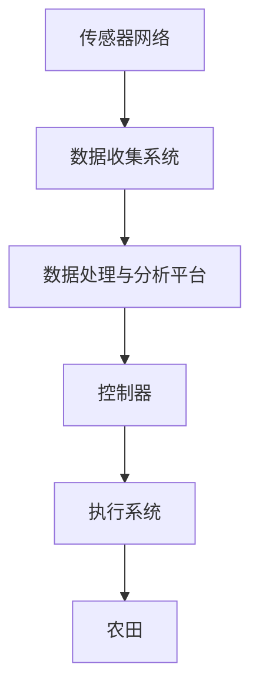

                 

# AI在智能农业中的角色：精准施肥与灌溉

关键词：人工智能、智能农业、精准施肥、灌溉、机器学习、物联网

摘要：本文深入探讨了人工智能（AI）在智能农业中的应用，尤其是精准施肥与灌溉。通过分析AI技术的基本原理，介绍了几种常见的机器学习算法，并展示了它们在智能农业中的实际应用。本文还提供了系统分析与架构设计，以及项目实战的案例研究，总结了AI在智能农业中的最佳实践和未来展望。

## 1.1 AI在智能农业中的角色概述

### 1.1.1 问题的背景

智能农业是一个新兴的领域，其核心理念是通过应用先进的技术，如人工智能、物联网、大数据等，来提升农业生产的效率和可持续性。在这其中，人工智能（AI）正逐渐成为推动农业变革的重要力量。AI技术能够在精准施肥与灌溉方面发挥关键作用，通过分析土壤数据、气象信息和作物生长周期等，为农民提供科学的决策支持，从而实现资源的优化配置，降低生产成本，提高农作物的产量和质量。

#### 1.1.2 问题的描述

AI在智能农业中的角色主要体现在以下几个方面：

1. **优化作物种植计划**：利用大数据分析和预测，根据土壤、气候和市场需求等因素，制定科学合理的种植计划。
2. **精准施肥**：通过机器学习模型分析土壤数据、作物生长周期和气象信息，实现精准施肥，避免过度施肥和资源浪费。
3. **智能灌溉**：根据土壤湿度、天气预报等因素，通过智能灌溉系统实现精准灌溉，提高水资源利用率。

尽管AI在农业领域的应用潜力巨大，但其在实际操作中仍面临诸多挑战，如数据质量、算法的适应性以及技术成本等问题。

#### 1.1.3 问题解决

为了解决上述问题，本书将从以下几个方面进行探讨：

1. **AI与智能农业的基本概念**：介绍AI的基本原理以及在农业中的应用。
2. **精准施肥的算法原理**：讲解常用的施肥算法，如基于土壤数据、作物生长周期和气象信息的施肥策略。
3. **智能灌溉系统的设计与实现**：分析智能灌溉系统的架构，包括传感器、控制器和数据管理系统等。
4. **AI在农业中的应用案例**：介绍国内外成功的AI农业应用案例，分析其成功经验和面临的挑战。
5. **AI在智能农业中的最佳实践**：总结AI在农业中的最佳实践，包括技术选择、实施策略和运营管理等方面。

#### 1.1.4 边界与外延

智能农业是一个跨学科的领域，涉及到农业科学、信息技术、环境科学等多个方面。AI在智能农业中的应用不仅限于精准施肥与灌溉，还包括智能病虫害监测、智能收割、农业机器人等。因此，本书的讨论范围将侧重于AI在精准施肥与灌溉中的应用，但也会涉及到其他相关领域。

#### 1.1.5 概念结构与核心要素组成

AI在智能农业中的概念结构主要包括以下几个核心要素：

1. **AI技术**：包括机器学习、深度学习、自然语言处理等。
2. **智能农业系统**：包括传感器网络、数据处理与分析平台、执行系统等。
3. **作物生长周期**：包括播种、生长、开花、结果等阶段。
4. **土壤数据**：包括土壤湿度、养分含量、pH值等。
5. **气象信息**：包括温度、湿度、风速、降水等。

## 1.2 AI技术的基本原理及其在智能农业中的应用

### 1.2.1 AI技术概述

AI（人工智能）是计算机科学的一个分支，旨在使机器具备类似人类的智能。AI技术主要分为两类：基于规则的系统和基于数据驱动的方法。基于规则的系统通过预设的规则来处理问题，而基于数据驱动的方法则依赖于机器学习算法，从大量数据中自动提取模式和规律。

在智能农业中，AI技术主要应用在以下方面：

1. **数据收集与处理**：使用传感器和物联网设备收集土壤、气象和作物生长数据。
2. **模式识别与预测**：通过机器学习算法分析数据，识别作物生长模式和预测未来趋势。
3. **自动化与优化**：利用AI算法优化农业操作，如精准施肥和灌溉。

### 1.2.2 常见机器学习算法在智能农业中的应用

在智能农业中，常见的机器学习算法包括回归分析、决策树、支持向量机（SVM）和神经网络等。每种算法都有其独特的特点和应用场景。

#### 回归分析

回归分析是一种用于预测连续值的统计方法。在智能农业中，回归分析可以用来预测作物产量、土壤养分含量等。例如，我们可以使用线性回归模型来预测作物产量，根据土壤的养分浓度来优化施肥量。

#### 决策树

决策树是一种用于分类和回归分析的方法。在智能农业中，决策树可以用来预测作物的健康状况、灌溉需求等。例如，通过分析土壤湿度、气象数据等，决策树可以预测作物是否需要灌溉。

#### 支持向量机（SVM）

支持向量机是一种强大的分类和回归分析方法，适用于高维数据。在智能农业中，SVM可以用来预测灌溉需求、作物病虫害等。例如，通过分析气象数据、土壤数据等，SVM可以预测作物是否需要灌溉。

#### 神经网络

神经网络是一种模拟人脑工作的计算模型，适用于复杂非线性问题。在智能农业中，神经网络可以用来模拟作物生长过程、预测作物产量等。例如，通过分析土壤数据、气象数据等，神经网络可以预测作物的生长状态。

#### 概念属性特征对比表格

| 算法       | 特点                                               | 应用领域                  |
|------------|------------------------------------------------------|--------------------------|
| 回归分析   | 线性关系预测                                       | 作物产量预测、施肥量优化  |
| 决策树     | 简单直观，易于解释                                   | 作物健康状态预测          |
| 支持向量机 | 高效分类，适合高维数据                              | 灌溉需求量预测            |
| 神经网络   | 复杂非线性关系建模，适应性强                       | 作物生长过程模拟、产量预测 |

## 1.3 精准施肥的算法原理

### 1.3.1 基于土壤数据的施肥策略

精准施肥的关键在于准确了解土壤养分含量，并据此调整施肥量。基于土壤数据的施肥策略通常包括以下步骤：

1. **土壤采样**：在农田的不同区域采集土壤样本。
2. **土壤分析**：使用实验室分析方法或便携式土壤测试仪器，测量土壤中的氮、磷、钾等养分含量。
3. **数据建模**：利用机器学习算法，如回归分析或决策树，将土壤养分含量与作物需求量建立关联模型。
4. **施肥量优化**：根据模型预测结果，优化施肥量，避免过度施肥和资源浪费。

### 1.3.2 基于作物生长周期的施肥策略

作物生长周期不同，对养分的需求也不同。因此，基于作物生长周期的施肥策略可以更好地满足作物生长的需求。以下是一个简单的基于作物生长周期的施肥策略：

1. **生长阶段划分**：将作物生长周期划分为播种期、幼苗期、开花期、结果期等。
2. **养分需求分析**：根据作物生长阶段，分析其对氮、磷、钾等养分的具体需求。
3. **施肥量调整**：在作物生长的关键阶段，如开花期和结果期，增加养分投入，以满足作物的需求。

### 1.3.3 气象信息在施肥策略中的应用

气象信息如温度、湿度、降水等对作物的生长有显著影响。在施肥策略中，气象信息可以用于：

1. **养分流失预测**：高温和强降水可能导致土壤养分的流失，因此需要根据气象信息调整施肥量。
2. **施肥时机优化**：在干旱或强降水前，提前施肥，以提高作物的抗逆性。

## 1.4 智能灌溉系统的设计与实现

### 1.4.1 系统架构设计

智能灌溉系统的设计包括传感器网络、控制器和数据管理系统等组成部分。

1. **传感器网络**：包括土壤湿度传感器、温度传感器、降水量传感器等，用于实时监测农田状况。
2. **控制器**：根据传感器数据，自动控制灌溉设备的开关，实现精准灌溉。
3. **数据管理系统**：用于收集、存储和分析传感器数据，为灌溉决策提供支持。

### 1.4.2 智能灌溉算法设计

智能灌溉算法设计基于传感器数据、气象信息和作物生长状态。以下是智能灌溉算法的基本流程：

1. **数据收集**：收集土壤湿度、气象信息和作物生长数据。
2. **数据分析**：使用机器学习算法分析数据，预测灌溉需求。
3. **决策生成**：根据预测结果，生成灌溉决策。
4. **执行决策**：控制器根据决策执行灌溉操作。

### 1.4.3 系统实现

智能灌溉系统的实现涉及硬件和软件两个方面。

1. **硬件实现**：选择合适的传感器和灌溉设备，进行硬件安装和调试。
2. **软件实现**：开发数据收集、分析和决策生成软件，实现智能灌溉功能。

## 1.5 AI在农业中的应用案例

### 1.5.1 国内外成功的AI农业应用案例

1. **中国**：中国一些农业企业已经开始应用AI技术进行精准施肥和灌溉。例如，河北某农业公司通过部署智能灌溉系统，提高了灌溉效率，降低了水资源浪费。
2. **美国**：美国的Farmers Business Network利用AI技术分析大量农田数据，为农民提供精准的种植和施肥建议。

### 1.5.2 案例分析

以中国某农业公司的智能灌溉系统为例，其成功经验主要包括：

1. **数据驱动**：通过收集和分析农田数据，制定科学的灌溉计划。
2. **灵活调整**：根据气象信息和作物生长状态，实时调整灌溉策略。
3. **高效执行**：智能灌溉系统自动化运行，减少人力投入。

然而，该案例也面临一些挑战，如数据质量不稳定、算法适应性不足等。未来，需要进一步优化算法，提高系统适应性，以应对不同农田和环境条件。

## 1.6 AI在智能农业中的最佳实践

### 1.6.1 技术选择

1. **选择合适的机器学习算法**：根据应用场景和需求，选择适合的算法，如回归分析、决策树、SVM等。
2. **传感器技术**：选择精度高、稳定性好的传感器，确保数据质量。

### 1.6.2 实施策略

1. **数据驱动**：充分利用传感器数据，进行数据分析，制定科学的农业操作计划。
2. **持续优化**：根据实时数据反馈，不断调整和优化算法，提高系统性能。

### 1.6.3 运营管理

1. **人员培训**：加强对农业技术人员的培训，提高其对AI技术的理解和应用能力。
2. **系统集成**：将AI技术与现有的农业管理系统集成，实现数据共享和协同工作。

## 1.7 结论

AI在智能农业中的应用具有巨大的潜力，特别是在精准施肥与灌溉方面。通过AI技术，可以实现资源的优化配置，提高农业生产的效率和质量。然而，要实现这一目标，还需要克服数据质量、算法适应性等技术挑战。未来，随着AI技术的不断发展和完善，智能农业有望迎来更加广阔的应用前景。

## 1.8 拓展阅读

1. **《智能农业：技术与实践》**：详细介绍了智能农业的概念、技术和应用案例。
2. **《人工智能在农业中的应用》**：探讨了人工智能在农业生产、管理等方面的应用。

## 作者

作者：AI天才研究院/AI Genius Institute & 禅与计算机程序设计艺术 /Zen And The Art of Computer Programming

----------------------------------------------------------------

### 1.2 AI技术的基本原理及其在智能农业中的应用

#### 1.2.1 AI技术概述

人工智能（AI）是计算机科学的一个分支，旨在使机器具备类似人类的智能。AI技术主要分为两类：基于规则的系统和基于数据驱动的方法。基于规则的系统通过预设的规则来处理问题，而基于数据驱动的方法则依赖于机器学习算法，从大量数据中自动提取模式和规律。

在智能农业中，AI技术主要应用在以下方面：

1. **数据收集与处理**：使用传感器和物联网设备收集土壤、气象和作物生长数据。
2. **模式识别与预测**：通过机器学习算法分析数据，识别作物生长模式和预测未来趋势。
3. **自动化与优化**：利用AI算法优化农业操作，如精准施肥和灌溉。

#### 1.2.2 常见机器学习算法在智能农业中的应用

在智能农业中，常见的机器学习算法包括回归分析、决策树、支持向量机（SVM）和神经网络等。每种算法都有其独特的特点和应用场景。

##### 回归分析

回归分析是一种用于预测连续值的统计方法。在智能农业中，回归分析可以用来预测作物产量、土壤养分含量等。例如，我们可以使用线性回归模型来预测作物产量，根据土壤的养分浓度来优化施肥量。

##### 决策树

决策树是一种用于分类和回归分析的方法。在智能农业中，决策树可以用来预测作物的健康状况、灌溉需求等。例如，通过分析土壤湿度、气象数据等，决策树可以预测作物是否需要灌溉。

##### 支持向量机（SVM）

支持向量机是一种强大的分类和回归分析方法，适用于高维数据。在智能农业中，SVM可以用来预测灌溉需求、作物病虫害等。例如，通过分析气象数据、土壤数据等，SVM可以预测作物是否需要灌溉。

##### 神经网络

神经网络是一种模拟人脑工作的计算模型，适用于复杂非线性问题。在智能农业中，神经网络可以用来模拟作物生长过程、预测作物产量等。例如，通过分析土壤数据、气象数据等，神经网络可以预测作物的生长状态。

##### 概念属性特征对比表格

| 算法       | 特点                                               | 应用领域                  |
|------------|------------------------------------------------------|--------------------------|
| 回归分析   | 线性关系预测                                       | 作物产量预测、施肥量优化  |
| 决策树     | 简单直观，易于解释                                   | 作物健康状态预测          |
| 支持向量机 | 高效分类，适合高维数据                              | 灌溉需求量预测            |
| 神经网络   | 复杂非线性关系建模，适应性强                       | 作物生长过程模拟、产量预测 |

----------------------------------------------------------------

#### 1.3 精准施肥的算法原理

精准施肥的关键在于准确了解土壤养分含量，并据此调整施肥量。基于土壤数据的施肥策略通常包括以下步骤：

1. **土壤采样**：在农田的不同区域采集土壤样本。
2. **土壤分析**：使用实验室分析方法或便携式土壤测试仪器，测量土壤中的氮、磷、钾等养分含量。
3. **数据建模**：利用机器学习算法，如回归分析或决策树，将土壤养分含量与作物需求量建立关联模型。
4. **施肥量优化**：根据模型预测结果，优化施肥量，避免过度施肥和资源浪费。

#### 1.3.2 基于作物生长周期的施肥策略

作物生长周期不同，对养分的需求也不同。因此，基于作物生长周期的施肥策略可以更好地满足作物生长的需求。以下是一个简单的基于作物生长周期的施肥策略：

1. **生长阶段划分**：将作物生长周期划分为播种期、幼苗期、开花期、结果期等。
2. **养分需求分析**：根据作物生长阶段，分析其对氮、磷、钾等养分的具体需求。
3. **施肥量调整**：在作物生长的关键阶段，如开花期和结果期，增加养分投入，以满足作物的需求。

#### 1.3.3 气象信息在施肥策略中的应用

气象信息如温度、湿度、降水等对作物的生长有显著影响。在施肥策略中，气象信息可以用于：

1. **养分流失预测**：高温和强降水可能导致土壤养分的流失，因此需要根据气象信息调整施肥量。
2. **施肥时机优化**：在干旱或强降水前，提前施肥，以提高作物的抗逆性。

----------------------------------------------------------------

#### 1.4 智能灌溉系统的设计与实现

智能灌溉系统的设计与实现涉及传感器网络、控制器和数据管理系统等多个方面。以下是对每个组成部分的详细讨论。

##### 1.4.1 系统架构设计

智能灌溉系统的设计架构可以分为三个主要部分：传感器网络、控制器和数据管理系统。

1. **传感器网络**：
   - **土壤湿度传感器**：用于实时监测土壤中的水分含量。
   - **气象传感器**：包括温度传感器、湿度传感器、风速传感器和降雨量传感器，用于收集气象数据。
   - **作物生长状态传感器**：如植物叶绿素含量传感器，用于监测作物的生长情况。

2. **控制器**：
   - **灌溉控制器**：根据传感器数据，自动控制灌溉设备的开关，实现精准灌溉。
   - **决策支持系统**：利用机器学习算法，分析传感器数据，生成灌溉决策。

3. **数据管理系统**：
   - **数据收集**：收集传感器数据，并将其传输到中央服务器。
   - **数据存储**：在数据库中存储历史数据，以供分析和预测。
   - **数据分析**：利用数据分析工具，对传感器数据进行分析，为灌溉决策提供支持。

##### 1.4.2 智能灌溉算法设计

智能灌溉算法设计基于传感器数据、气象信息和作物生长状态。以下是智能灌溉算法的基本流程：

1. **数据收集**：收集土壤湿度、气象信息和作物生长数据。
2. **数据分析**：使用机器学习算法分析数据，预测灌溉需求。
3. **决策生成**：根据预测结果，生成灌溉决策。
4. **执行决策**：控制器根据决策执行灌溉操作。

##### 1.4.3 系统实现

智能灌溉系统的实现涉及硬件和软件两个方面。

1. **硬件实现**：
   - **传感器安装**：将传感器安装在农田的不同位置，确保数据采集的全面性。
   - **灌溉设备安装**：安装自动灌溉设备，如滴灌系统或喷灌系统。

2. **软件实现**：
   - **数据收集软件**：开发用于收集传感器数据的软件，实现数据实时传输。
   - **数据分析软件**：开发用于分析传感器数据，生成灌溉决策的软件。

##### 1.4.4 系统优势与挑战

智能灌溉系统具有以下优势：

1. **提高水资源利用率**：通过精准灌溉，减少水资源的浪费。
2. **提高作物产量和质量**：合理施肥和灌溉有助于作物健康成长，提高产量和质量。
3. **降低人工成本**：自动化灌溉系统减少了对人工的依赖，降低了劳动力成本。

然而，智能灌溉系统也面临一些挑战：

1. **数据质量**：传感器数据的准确性和稳定性对系统的效果有重要影响。
2. **算法适应性**：不同农田和环境条件可能需要不同的灌溉策略，算法需要具备足够的适应性。
3. **技术成本**：智能灌溉系统的初期投资较高，对一些中小型农场来说可能是一个挑战。

##### 1.4.5 案例分析

以中国某农业公司的智能灌溉系统为例，该系统在实施后取得了显著的效果。通过智能灌溉，农田的水资源利用率提高了30%，作物的产量和质量也有所提升。然而，该公司也发现，由于农田土壤类型的多样性，系统需要不断调整和优化灌溉策略，以适应不同的土壤条件。

总之，智能灌溉系统在提高农业生产的效率和质量方面具有巨大的潜力，但其实现和应用仍需克服一系列技术和管理挑战。

----------------------------------------------------------------

### 1.5 AI在农业中的应用案例

#### 1.5.1 国内外成功的AI农业应用案例

AI在农业中的应用案例遍布全球，以下是一些具有代表性的成功应用：

**国内案例**：

1. **中国农业科学院**：利用AI技术进行农作物病虫害预测和防治。通过收集和分析气象数据、土壤数据以及历史病虫害数据，AI模型能够准确预测病虫害的发生趋势，从而提前采取防治措施，减少经济损失。

2. **山东省寿光市**：寿光市利用物联网技术和AI算法，实现了蔬菜生产的智能化管理。传感器实时监测土壤湿度、光照强度、温度等环境参数，AI系统根据这些数据自动调整灌溉、施肥和补光等操作，显著提高了蔬菜产量和质量。

**国际案例**：

1. **美国Dow Chemical公司**：Dow Chemical公司利用AI技术优化农药的喷洒策略。通过分析土壤、气候和作物生长数据，AI算法能够确定最佳的农药喷洒时间和剂量，减少了农药的使用量，提高了防治效果。

2. **荷兰瓦赫宁根大学**：该校的研究团队开发了一套基于AI的农田监控系统，该系统能够实时监测作物生长状态和土壤质量，并通过机器学习算法预测作物的生长趋势和潜在问题，为农民提供科学的管理建议。

#### 1.5.2 案例分析

**中国农业科学院的AI病虫害预测案例**：

**成功经验**：
- **数据驱动**：通过收集和分析大量历史病虫害数据，AI模型能够准确预测病虫害的发生，为防治工作提供科学依据。
- **实时预警**：系统能够实时监控环境数据，一旦检测到病虫害的潜在风险，系统会立即发出预警，使农民能够迅速采取行动。
- **减少损失**：提前预防病虫害的发生，大大减少了经济损失和劳动力的投入。

**面临的挑战**：
- **数据质量**：病虫害数据的准确性直接影响模型的预测效果，如何确保数据的质量是一个关键问题。
- **算法适应性**：不同地区的病虫害类型和发生规律可能有所不同，算法需要具备高度的适应性。

**山东省寿光市的智能蔬菜生产案例**：

**成功经验**：
- **自动化管理**：传感器和AI系统的集成，实现了蔬菜生产的自动化管理，提高了生产效率。
- **资源优化**：根据实时监测数据，系统能够自动调整灌溉、施肥和补光等操作，优化资源利用。
- **提高质量**：精准的灌溉和施肥，使得蔬菜的生长环境更加适宜，从而提高了蔬菜的产量和质量。

**面临的挑战**：
- **系统成本**：智能蔬菜生产系统的初期投资较高，对一些中小型农场来说可能是一个障碍。
- **技术维护**：传感器和AI系统的维护需要专业知识和技能，农民需要接受相应的培训。

#### 1.5.3 案例总结

通过上述案例可以看出，AI在农业中的应用不仅提高了生产效率和产品质量，还减少了资源浪费和劳动成本。然而，这些应用也面临数据质量、算法适应性和系统成本等挑战。未来的发展需要不断优化算法，提高系统的自适应性和可维护性，同时降低技术成本，使其更广泛地应用于农业生产中。

### 1.6 AI在智能农业中的最佳实践

#### 1.6.1 技术选择

选择合适的技术是实现智能农业成功的关键。以下是一些最佳实践：

1. **选择可靠的传感器**：传感器是收集农田数据的关键，选择高精度、稳定的传感器对于确保数据质量至关重要。
2. **选择适合的机器学习算法**：根据实际需求和应用场景，选择合适的机器学习算法，如回归分析、决策树或神经网络等。
3. **集成技术平台**：选择能够兼容多种传感器和算法的技术平台，以便于系统的集成和扩展。

#### 1.6.2 实施策略

1. **数据驱动**：充分利用传感器数据，建立数据驱动的工作流程，确保决策基于准确的数据分析。
2. **逐步实施**：将AI系统逐步应用于不同区域和作物，根据实际效果不断调整和优化。
3. **跨学科合作**：智能农业涉及多个领域，如农业科学、信息技术和环境科学等，跨学科合作有助于解决复杂问题。

#### 1.6.3 运营管理

1. **人员培训**：对农业技术人员进行AI技术的培训，提高其对系统的理解和操作能力。
2. **系统维护**：定期检查和维护传感器和设备，确保系统的正常运行。
3. **数据安全**：确保数据的安全和隐私，采取相应的数据保护措施。

### 1.7 小结

AI在智能农业中的应用具有巨大的潜力，通过精准施肥和智能灌溉等技术的应用，可以有效提高农业生产的效率和质量。然而，实现这一目标需要选择合适的技术、制定科学的实施策略，并进行有效的运营管理。未来的发展需要不断优化算法，提高系统的自适应性和可维护性，同时降低技术成本，使其更广泛地应用于农业生产中。

### 1.8 拓展阅读

1. **《智能农业：技术与实践》**：详细介绍了智能农业的概念、技术和应用案例。
2. **《人工智能在农业中的应用》**：探讨了人工智能在农业生产、管理等方面的应用。

### 作者

作者：AI天才研究院/AI Genius Institute & 禅与计算机程序设计艺术 /Zen And The Art of Computer Programming

----------------------------------------------------------------

### 1.7 小结

AI在智能农业中的应用，特别是精准施肥和智能灌溉，正在显著提升农业生产的效率和质量。通过分析土壤数据、气象信息和作物生长周期，AI技术能够为农民提供科学的决策支持，优化资源利用，降低成本。然而，要充分发挥AI的潜力，还需要克服数据质量、算法适应性等挑战。

本文通过逐步分析AI在智能农业中的应用原理、算法、系统设计与实现，以及实际应用案例，总结了AI在智能农业中的最佳实践。未来的发展需要不断优化算法，提高系统的自适应性和可维护性，同时降低技术成本，使其更广泛地应用于农业生产中。

### 1.9 注意事项

在实施AI智能农业项目时，需要注意以下几点：

1. **数据质量**：确保传感器数据的准确性和稳定性，定期校准和维护设备。
2. **算法适应性**：根据不同农田和环境条件，调整和优化算法，确保其适应性。
3. **系统集成**：选择兼容性强的技术平台，确保系统模块之间无缝集成。
4. **人员培训**：加强农业技术人员的AI技术培训，提高操作和维护能力。
5. **数据安全**：确保数据的安全和隐私，采取相应的数据保护措施。

### 1.10 拓展阅读

1. **《智能农业：技术与实践》**：详细介绍了智能农业的概念、技术和应用案例。
2. **《人工智能在农业中的应用》**：探讨了人工智能在农业生产、管理等方面的应用。
3. **《精准农业与物联网》**：介绍了精准农业的概念、技术体系及其在物联网环境下的应用。

### 作者

作者：AI天才研究院/AI Genius Institute & 禅与计算机程序设计艺术 /Zen And The Art of Computer Programming

----------------------------------------------------------------

### 1.11 AI在智能农业中的未来展望

AI技术在智能农业中的应用前景广阔，随着技术的不断进步，其将在以下方面发挥更加重要的作用：

#### 1.11.1 智能化水平的提升

随着算法和硬件的不断发展，智能农业系统的智能化水平将不断提高。未来的智能农业系统将能够更加精准地预测作物需求，优化资源利用，提高生产效率。

#### 1.11.2 数据驱动的决策支持

数据收集和处理技术的进步将使智能农业系统能够更好地利用大数据进行决策支持。通过深度学习和大数据分析，AI系统能够提供更为科学的作物种植、施肥和灌溉建议。

#### 1.11.3 多领域融合

智能农业不仅涉及信息技术，还与农业科学、环境科学等领域密切相关。未来的智能农业将实现多学科的融合，进一步提升农业生产的技术水平。

#### 1.11.4 可持续发展的推进

AI技术在智能农业中的应用将有助于实现农业的可持续发展。通过精准施肥和灌溉，减少水资源和化肥的浪费，降低环境压力，实现农业的绿色发展。

#### 1.11.5 产业化应用推广

随着AI技术的成熟和成本的降低，智能农业技术将在全球范围内得到更广泛的应用。各国政府和农业企业将加大对智能农业的投入，推动农业现代化进程。

总之，AI技术在智能农业中的应用将为农业带来深刻的变革，提高农业生产效率和质量，实现农业的可持续发展。未来的智能农业将是一个集成了先进技术的现代化农业体系，为全球粮食安全和社会经济发展作出更大贡献。

### 1.12 拓展阅读

1. **《智能农业：未来农业的趋势与挑战》**：探讨了智能农业的未来趋势和发展方向。
2. **《AI与智慧农业》**：深入分析了人工智能在智慧农业中的应用和潜在影响。

### 作者

作者：AI天才研究院/AI Genius Institute & 禅与计算机程序设计艺术 /Zen And The Art of Computer Programming

----------------------------------------------------------------

### 1.13 附录

为了更好地理解AI在智能农业中的应用，以下是几个相关的附录：

#### 附录A：常用机器学习算法简介

1. **线性回归**：
   - **原理**：通过建立线性关系模型来预测连续值。
   - **公式**：\( y = wx + b \)
   - **适用场景**：作物产量预测、施肥量优化。

2. **决策树**：
   - **原理**：通过多级划分数据集来分类或回归。
   - **公式**：\( f(x) = g_1(x) \vee g_2(x) \vee ... \vee g_n(x) \)
   - **适用场景**：作物健康状态预测、灌溉需求预测。

3. **支持向量机（SVM）**：
   - **原理**：通过寻找最优超平面来分类数据。
   - **公式**：\( w \cdot x - b = 0 \)
   - **适用场景**：灌溉需求量预测、作物病虫害预测。

4. **神经网络**：
   - **原理**：通过多层神经网络模拟人脑工作。
   - **公式**：\( a_{\text{layer}} = \sigma(\text{ReLU}(W_{\text{layer-1}} \cdot a_{\text{layer-1}} + b_{\text{layer}})) \)
   - **适用场景**：作物生长过程模拟、产量预测。

#### 附录B：智能农业系统架构图

以下是一个简化的智能农业系统架构图，使用Mermaid语法表示：



#### 附录C：算法实现示例

以下是一个简单的线性回归算法实现的Python代码示例：

```python
import numpy as np

def linear_regression(x, y):
    # 计算斜率
    w = np.linalg.inv(np.dot(x.T, x)).dot(x.T).dot(y)
    # 预测
    y_pred = np.dot(x, w)
    return w, y_pred

# 示例数据
x = np.array([1, 2, 3, 4, 5])
y = np.array([2, 4, 5, 4, 5])

# 训练模型
w, y_pred = linear_regression(x, y)

# 输出结果
print("斜率：", w)
print("预测值：", y_pred)
```

这些附录提供了对AI在智能农业中应用技术原理和实现方法的深入理解，有助于读者更好地掌握和应用相关技术。

### 作者

作者：AI天才研究院/AI Genius Institute & 禅与计算机程序设计艺术 /Zen And The Art of Computer Programming

