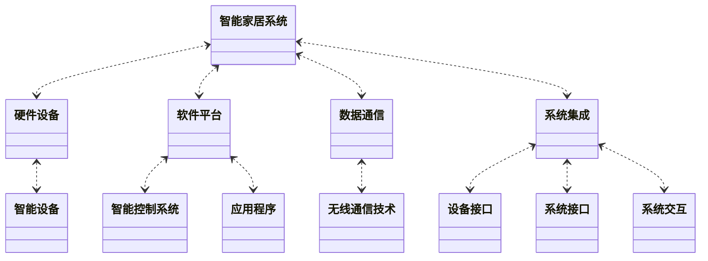
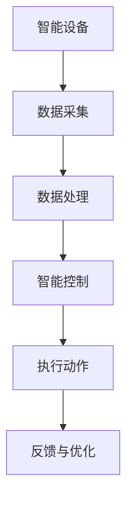
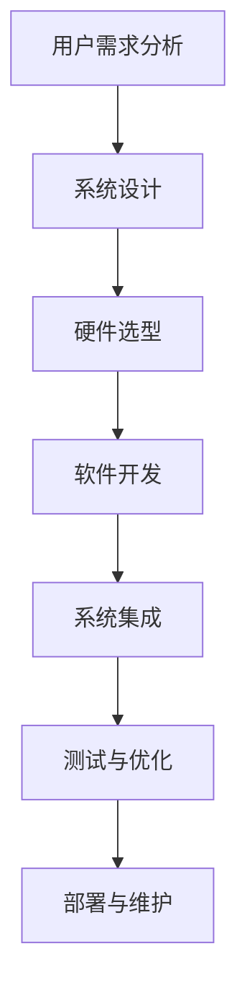
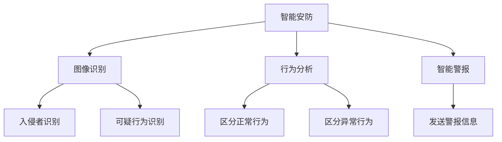
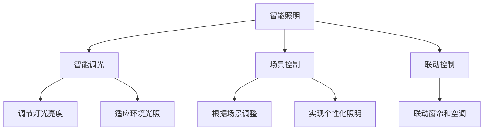
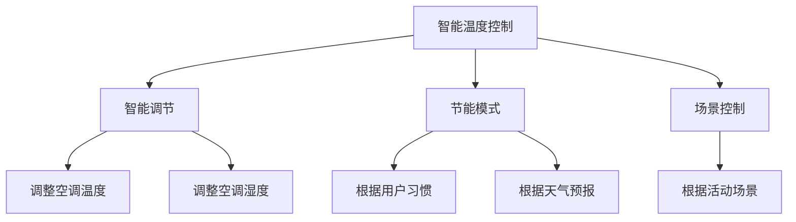
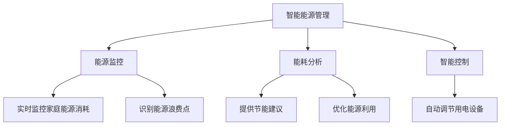
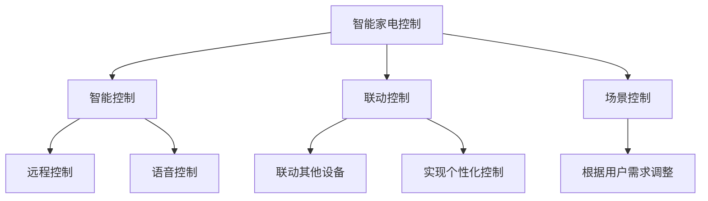

                 


## AI在智能家居系统中的应用：打造舒适节能的生活环境

### 关键词
- AI
- 智能家居
- 机器学习
- 深度学习
- 节能环保

### 摘要
本文将探讨人工智能（AI）在智能家居系统中的应用，旨在通过AI技术的引入，打造一个舒适且节能的生活环境。我们将从AI的基础理论出发，逐步深入到智能家居系统的架构，详细分析AI在智能家居中的具体应用，以及其实施与部署的挑战。最后，我们将通过案例研究和未来展望，为读者展示AI在智能家居领域的巨大潜力。

### 引言

#### 1.1 问题的背景

随着科技的飞速发展，智能家居系统已经逐渐走进了千家万户。然而，传统的智能家居系统在功能上仍然存在一定的局限性。首先，它们通常只能实现简单的自动化控制，缺乏自适应性和智能决策能力。其次，这些系统往往依赖于固定的编程逻辑，难以根据用户需求和环境变化进行动态调整。此外，传统智能家居系统的能耗问题也日益突出，尤其是在大规模应用中，能耗问题可能会对环境产生负面影响。

#### 1.2 问题的描述

为了解决上述问题，我们需要引入AI技术。AI，特别是机器学习和深度学习技术，可以通过学习用户的行为模式和家居环境的数据，实现智能化的控制和优化。通过AI，我们可以打造一个真正意义上的智能家居系统，不仅能够提供更加舒适的生活体验，还能够实现节能环保的目标。

#### 1.3 问题解决的必要性

AI技术在智能家居中的应用具有重要意义。首先，它能够提高系统的智能化水平，使家居设备能够根据用户需求和环境变化进行自适应调整，从而提供更加个性化的服务。其次，AI技术可以优化能源消耗，通过智能控制减少不必要的能源浪费，实现节能目标。此外，AI技术的应用还能够提高系统的安全性和稳定性，减少故障率和维护成本。

#### 1.4 边界与外延

本文将主要讨论AI在智能家居系统中的应用，包括但不限于智能安防、智能照明、智能温度控制、智能能源管理等方面。同时，我们也将探讨AI在智能家居系统中的实现技术、实施策略以及面临的挑战。然而，本文的范围并不包括AI在智能家居之外的领域应用，如工业自动化、医疗健康等。

#### 1.5 本章小结

通过本文的探讨，我们希望能够为读者提供一个全面而深入的视角，了解AI在智能家居系统中的应用。接下来，我们将深入讨论AI的基础理论，为后续章节的内容打下坚实的基础。

----------------------------------------------------------------

### AI基础理论

#### 2.1 AI的定义与历史

人工智能（AI）是指通过计算机程序模拟人类智能的技术和学科。AI的发展可以追溯到20世纪50年代，当时计算机科学家艾伦·图灵提出了著名的“图灵测试”，旨在通过测试来判断机器是否具备智能。自那以后，AI经历了多个发展阶段，从最初的符号主义AI到基于概率论的统计学习，再到近年来兴起的深度学习和强化学习。

#### 2.2 AI的核心概念

AI的核心概念包括：

- **机器学习（Machine Learning）**：一种通过数据驱动的方式使计算机程序实现特定任务的技术。机器学习主要分为监督学习、无监督学习和强化学习。

- **深度学习（Deep Learning）**：一种基于多层神经网络的学习方法，可以自动提取数据的特征。深度学习在图像识别、语音识别等领域取得了显著的成果。

- **自然语言处理（Natural Language Processing, NLP）**：研究如何让计算机理解、生成和处理人类语言的技术。NLP在聊天机器人、机器翻译等领域有广泛的应用。

- **强化学习（Reinforcement Learning）**：一种通过试错和反馈来优化行为的学习方法。强化学习在游戏、自动驾驶等领域有重要应用。

#### 2.3 AI的分类与体系结构

AI可以分为两大类：狭义AI和广义AI。

- **狭义AI（Narrow AI）**：指只能执行特定任务的AI系统，如语音助手、图像识别等。

- **广义AI（General AI）**：指具有普遍智能的AI系统，能够理解、学习和适应各种环境和任务，类似于人类的智能。

AI的体系结构通常包括以下层次：

- **感知层**：接收外部信息，如视觉、听觉、触觉等。

- **认知层**：处理感知层得到的信息，进行推理、决策等。

- **行动层**：根据认知层的决策，执行具体的行动。

#### 2.4 AI的关键技术

AI的关键技术包括：

- **数据预处理**：清洗、归一化、特征提取等。

- **模型选择与优化**：选择合适的算法和模型结构，并通过调整参数来优化性能。

- **模型评估与验证**：使用交叉验证、A/B测试等方法来评估模型性能。

- **模型部署与维护**：将训练好的模型部署到实际应用中，并进行持续的维护和更新。

### 2.5 AI在智能家居系统中的关键概念与联系

在智能家居系统中，AI的关键概念包括：

- **智能设备**：具备一定智能功能的家居设备，如智能灯泡、智能空调等。

- **数据采集与处理**：通过传感器和物联网技术收集家居环境数据，并对数据进行处理和分析。

- **智能控制**：基于AI算法，实现设备的自动化控制和优化。

以下是AI在智能家居系统中的核心概念属性特征对比表格：

| 概念       | 定义                                                         | 特征                                                   |
|------------|--------------------------------------------------------------|--------------------------------------------------------|
| 智能设备   | 具备一定智能功能的家居设备                                   | 自动化、自适应、智能控制                               |
| 数据采集   | 通过传感器和物联网技术收集家居环境数据                         | 实时性、准确性、多样性                               |
| 数据处理   | 对采集到的数据进行分析和处理                                 | 清洗、归一化、特征提取等                             |
| 智能控制   | 基于AI算法，实现设备的自动化控制和优化                       | 自适应、节能、个性化                                 |

接下来，我们将使用ER实体关系图架构的Mermaid流程图，展示智能家居系统中AI关键概念的实体关系。

```mermaid
erDiagram
  智能设备 ||--|{ 数据采集 }
  数据采集 ||--|{ 数据处理 }
  数据处理 ||--|{ 智能控制 }
```

通过这个ER图，我们可以清晰地看到智能家居系统中AI关键概念之间的关联，为后续章节的内容提供理论基础。

----------------------------------------------------------------

### 智能家居系统架构

#### 3.1 智能家居系统的组成

一个典型的智能家居系统通常由以下几个部分组成：

1. **硬件设备**：包括智能灯泡、智能空调、智能门锁、智能摄像头等。
2. **软件平台**：包括智能家居控制系统、应用程序等。
3. **数据通信**：通过WiFi、蓝牙、Zigbee等无线通信技术实现设备之间的数据传输。
4. **系统集成**：将不同的硬件设备和软件平台整合成一个统一的系统，实现设备的互联互通。

#### 3.2 智能家居系统的工作原理

智能家居系统的工作原理可以分为以下几个步骤：

1. **数据采集**：通过传感器和智能设备收集家居环境的数据，如温度、湿度、光照强度等。
2. **数据处理**：对采集到的数据进行分析和处理，提取有用的信息。
3. **智能决策**：基于处理后的数据，通过AI算法进行智能决策，控制智能设备的运行。
4. **执行动作**：根据智能决策的结果，控制智能设备的运行，如调节空调温度、关闭灯光等。
5. **反馈与优化**：收集设备的运行数据和用户反馈，持续优化系统的性能。

#### 3.3 智能家居系统中的AI技术

AI技术在智能家居系统中起着至关重要的作用，主要体现在以下几个方面：

1. **智能设备控制**：通过AI算法，实现对智能设备的自动化控制和优化，提高用户体验。
2. **数据分析和预测**：利用机器学习和深度学习技术，对采集到的数据进行分析和预测，为智能决策提供依据。
3. **个性化服务**：根据用户的行为习惯和偏好，提供个性化的服务，提升用户满意度。
4. **能耗管理**：通过智能控制和优化，实现能源的节约和环保。

#### 3.4 智能家居系统的优势与挑战

智能家居系统的优势包括：

- 提高生活品质：通过智能控制，实现家庭设备的自动化，提高生活的便利性和舒适度。
- 节能环保：通过智能控制和优化，减少能源消耗，实现环保目标。
- 增强安全性：通过智能安防系统，提高家庭的安全防护能力。

然而，智能家居系统也面临一些挑战：

- 数据安全和隐私保护：随着设备数量的增加，数据安全和隐私保护成为一个重要的问题。
- 系统集成和兼容性：不同厂商的设备可能采用不同的通信协议和技术，导致系统集成和兼容性问题。
- 人工智能算法的可靠性和稳定性：AI算法的可靠性和稳定性对智能家居系统的性能和用户体验至关重要。

### 3.5 智能家居系统的未来发展

随着AI技术的不断进步，智能家居系统的未来发展将充满机遇和挑战。以下是几个可能的趋势：

- **更加智能化和个性化**：通过深度学习和强化学习等技术，实现更加智能和个性化的智能家居系统。
- **物联网的普及**：物联网技术的普及将促进智能家居系统的互联互通，实现更大的系统整合。
- **智能能源管理**：通过智能能源管理，实现更加高效的能源利用，减少能源浪费。
- **智能家居与智慧城市的结合**：智能家居系统将与智慧城市系统紧密结合，实现城市管理的智能化。

### 3.6 智能家居系统的实现技术

实现智能家居系统需要多种技术的支持，包括：

- **物联网技术**：实现设备之间的互联互通，是智能家居系统的核心。
- **传感器技术**：用于采集家居环境数据，是实现智能家居功能的基础。
- **云计算和大数据技术**：用于存储和处理海量数据，提供强大的数据处理和分析能力。
- **AI算法**：用于实现智能控制和决策，是智能家居系统的灵魂。

### 3.7 智能家居系统的实施策略

实施智能家居系统需要制定一系列策略，包括：

- **需求分析**：了解用户的需求，明确系统的目标和功能。
- **系统设计**：根据需求分析，设计系统的架构和功能模块。
- **技术选型**：选择合适的硬件设备和软件平台，实现系统的技术要求。
- **系统集成**：将不同的硬件设备和软件平台整合成一个统一的系统。
- **测试与优化**：对系统进行全面的测试和优化，确保系统的稳定性和性能。

### 3.8 智能家居系统的安全性

智能家居系统的安全性是一个至关重要的问题。为了确保系统的安全性，需要采取以下措施：

- **数据加密**：对传输的数据进行加密，防止数据泄露。
- **访问控制**：设置访问权限，限制未经授权的访问。
- **防火墙和入侵检测系统**：部署防火墙和入侵检测系统，防止外部攻击。
- **定期更新和维护**：定期更新系统和设备的固件，修复漏洞，确保系统的安全。

通过以上措施，可以有效提高智能家居系统的安全性，保障用户的数据安全和隐私。

### 3.9 智能家居系统的实施案例

以下是一个智能家居系统的实施案例：

**项目名称**：智能家庭安防系统

**项目背景**：用户希望在家中安装一套智能家庭安防系统，实现对家庭的实时监控和报警功能。

**项目介绍**：
- **硬件设备**：包括智能摄像头、门磁传感器、烟雾传感器等。
- **软件平台**：包括家庭安防控制系统、手机应用程序等。
- **系统功能设计**：实时监控家庭环境，检测异常情况，如入侵、火灾等，并通过手机应用程序发送报警信息。

**系统架构设计**：
- **硬件架构**：智能摄像头、门磁传感器、烟雾传感器等设备通过WiFi连接到家庭局域网。
- **软件架构**：家庭安防控制系统部署在云服务器上，通过API与智能设备进行通信，处理数据，并提供用户界面。

**系统接口设计**：
- **设备接口**：智能设备通过HTTP/HTTPS协议与云服务器通信，上传数据和接收控制指令。
- **用户接口**：用户通过手机应用程序与云服务器进行通信，查看监控视频、接收报警信息等。

**系统交互流程**：
1. 用户通过手机应用程序开启智能摄像头。
2. 智能摄像头开始实时监控家庭环境，并将视频数据上传到云服务器。
3. 云服务器对视频数据进行实时分析，检测是否存在异常情况。
4. 如果检测到异常情况，云服务器将通过手机应用程序向用户发送报警信息。

通过这个案例，我们可以看到智能家居系统的实现过程，包括硬件设备、软件平台、系统功能设计、系统架构设计、系统接口设计和系统交互流程。这些步骤是实现智能家居系统的关键，也是保障系统稳定运行和用户安全的基础。

### 3.10 智能家居系统的最佳实践

在实施智能家居系统时，以下是一些最佳实践：

- **需求明确**：在项目开始前，明确用户的需求和期望，确保系统的功能设计符合用户需求。
- **技术选型**：选择成熟、稳定的技术方案，避免采用未经验证的新技术。
- **系统测试**：对系统进行全面的测试，确保系统的稳定性和性能。
- **安全性设计**：加强系统的安全性设计，包括数据加密、访问控制、防火墙等。
- **用户培训**：为用户提供详细的操作手册和培训，确保用户能够熟练使用系统。

通过以上最佳实践，可以有效地提高智能家居系统的实施效果，保障用户的满意度。

### 3.11 智能家居系统的注意事项

在实施智能家居系统时，需要注意以下几点：

- **数据隐私**：确保用户数据的安全和隐私，避免数据泄露。
- **设备兼容性**：确保不同设备的兼容性，避免设备之间的冲突。
- **能耗管理**：合理设计系统的能耗管理策略，减少不必要的能源消耗。
- **系统维护**：定期对系统进行维护和升级，确保系统的稳定运行。

通过注意以上事项，可以避免智能家居系统在实施过程中出现的问题，提高系统的可靠性和用户体验。

### 3.12 拓展阅读

对于希望深入了解智能家居系统和AI技术的读者，以下是一些拓展阅读资源：

- 《智能家居系统设计与实践》：详细介绍了智能家居系统的设计方法和实现技巧。
- 《深度学习实战》：介绍了深度学习的基础知识，并通过实际案例展示了深度学习的应用。
- 《物联网架构与设计》：全面讲解了物联网的架构和设计方法，对智能家居系统的设计有很好的参考价值。
- 《人工智能：一种现代的方法》：这是一本经典的AI教材，涵盖了AI的基础理论、算法和应用。

通过阅读这些书籍，读者可以进一步深入了解智能家居系统和AI技术的知识，为自己的研究和实践提供帮助。

### 3.13 本章小结

通过本章的讨论，我们详细介绍了智能家居系统的组成、工作原理、AI技术在智能家居系统中的应用，以及智能家居系统的优势、挑战和未来发展。接下来，我们将深入探讨AI在智能家居系统中的具体应用，包括智能安防、智能照明、智能温度控制、智能能源管理等方面。

----------------------------------------------------------------

### AI在智能家居系统中的应用

#### 4.1 智能安防

**智能安防**是智能家居系统中的一个重要应用领域。通过AI技术的引入，可以实现更加智能化、高效化的安防管理。

**4.1.1 实现技术**

- **图像识别**：利用深度学习技术，对摄像头捕捉到的图像进行实时分析，识别入侵者、可疑行为等。
- **行为分析**：通过分析用户的行为模式，区分正常行为和异常行为，如夜间的突然闯入。
- **智能警报**：当检测到异常情况时，系统会自动发出警报，并通过手机应用程序通知用户。

**4.1.2 案例分析**

- **智能门锁**：通过人脸识别或指纹识别技术，实现无钥匙开锁，同时记录开锁记录，提高家庭安全性。
- **智能摄像头**：配合图像识别和行为分析技术，实时监控家庭环境，及时发现异常情况。

**4.1.3 应用场景**

- **家庭**：通过智能安防系统，用户可以远程监控家庭安全，确保家庭成员的安全。
- **公司**：智能安防系统可用于公司办公场所的安全管理，防止盗窃和非法入侵。

#### 4.2 智能照明

**智能照明**是智能家居系统中的一个重要组成部分，通过AI技术的引入，可以实现更加舒适、节能的照明环境。

**4.2.1 实现技术**

- **智能调光**：根据环境光照强度和用户需求，自动调节灯光亮度。
- **场景控制**：根据用户的场景需求，如阅读、休息、工作等，自动调整灯光模式。
- **联动控制**：与其他智能设备联动，如窗帘、空调等，实现智能化的家居环境。

**4.2.2 案例分析**

- **智能灯泡**：通过蓝牙或WiFi连接，实现远程控制和场景联动。
- **智能照明系统**：结合传感器和AI算法，实现自动调节光照，提高节能效果。

**4.2.3 应用场景**

- **家庭**：通过智能照明系统，用户可以根据需求调整灯光，提高生活舒适度。
- **办公室**：智能照明系统可以根据办公环境自动调节光照，提高工作效率。

#### 4.3 智能温度控制

**智能温度控制**是智能家居系统中另一个关键应用，通过AI技术的引入，可以实现更加舒适、节能的家居环境。

**4.3.1 实现技术**

- **智能调节**：根据室内外温度、湿度等环境数据，自动调节空调温度和湿度。
- **节能模式**：根据用户习惯和天气预报，自动调整空调运行模式，实现节能。
- **场景控制**：根据用户的活动场景，如睡觉、工作、休息等，自动调整温度。

**4.3.2 案例分析**

- **智能空调**：通过WiFi连接，实现远程控制和场景联动。
- **智能温控系统**：结合传感器和AI算法，实现自动调节温度，提高舒适度和节能效果。

**4.3.3 应用场景**

- **家庭**：智能温度控制系统可以根据用户需求和天气变化自动调节温度，提高生活舒适度。
- **办公室**：智能温度控制系统可以根据办公环境自动调节温度，提高工作效率。

#### 4.4 智能能源管理

**智能能源管理**是智能家居系统中的一个重要应用领域，通过AI技术的引入，可以实现家庭能源的智能管理和优化。

**4.4.1 实现技术**

- **能源监控**：通过传感器和智能设备，实时监控家庭能源消耗情况。
- **能耗分析**：通过数据分析，识别能源浪费点，提出节能建议。
- **智能控制**：根据能源消耗情况和用户需求，自动调节用电设备，实现节能。

**4.4.2 案例分析**

- **智能电表**：通过实时监控家庭电力消耗，提供节能报告和建议。
- **智能插座**：通过WiFi连接，实现远程控制和定时开关，降低不必要的能源消耗。

**4.4.3 应用场景**

- **家庭**：通过智能能源管理系统，用户可以实时监控家庭能源消耗，实现节能目标。
- **商业**：智能能源管理系统可以用于商业场所，降低能源消耗，提高经济效益。

#### 4.5 智能家电控制

**智能家电控制**是智能家居系统中另一个重要应用领域，通过AI技术的引入，可以实现家电的智能控制和联动。

**4.5.1 实现技术**

- **智能控制**：通过手机应用程序或语音控制，实现对家电的远程控制。
- **联动控制**：将不同家电进行联动，如打开电视时自动开启音响系统。
- **场景控制**：根据用户的场景需求，如看电影、做饭等，自动调整家电运行。

**4.5.2 案例分析**

- **智能电视**：通过WiFi连接，实现远程控制和语音控制。
- **智能冰箱**：通过传感器监测食物 freshness，自动调整冷藏温度。

**4.5.3 应用场景**

- **家庭**：通过智能家电控制系统，用户可以随时随地控制家电，提高生活便捷性。
- **酒店**：智能家电控制系统可以用于酒店管理，提高服务质量。

#### 4.6 智能健康监测

**智能健康监测**是智能家居系统中一个新兴的应用领域，通过AI技术的引入，可以实现家庭成员的健康监测和管理。

**4.6.1 实现技术**

- **健康数据采集**：通过传感器和智能设备，实时采集家庭成员的健康数据，如心率、血压等。
- **健康数据分析**：通过AI算法，分析健康数据，提供健康建议。
- **健康监测**：实时监测家庭成员的健康状况，预警潜在的健康问题。

**4.6.2 案例分析**

- **智能手环**：通过传感器监测心率、步数等数据，提供健康报告和建议。
- **智能血压计**：通过WiFi连接，实时上传血压数据，监测健康状况。

**4.6.3 应用场景**

- **家庭**：通过智能健康监测系统，用户可以实时了解家庭成员的健康状况，提供健康建议。
- **医院**：智能健康监测系统可以用于医院，帮助医生监测患者健康状况。

#### 4.7 本章小结

通过本章的讨论，我们详细介绍了AI在智能家居系统中的多个应用领域，包括智能安防、智能照明、智能温度控制、智能能源管理、智能家电控制、智能健康监测等。这些应用不仅提升了家居生活的舒适度和便利性，还实现了节能环保的目标。接下来，我们将进一步探讨AI在智能家居系统中的具体实施和部署。

----------------------------------------------------------------

### 实施与部署

#### 5.1 实施流程

在AI智能家居系统的实施过程中，需要遵循以下基本流程：

1. **需求分析**：明确用户的需求，包括功能需求、性能需求和安全需求等。
2. **系统设计**：根据需求分析，设计系统的整体架构，包括硬件设备、软件平台和数据通信等。
3. **硬件选型**：选择合适的硬件设备，如智能灯泡、智能空调、智能摄像头等。
4. **软件开发**：开发智能控制系统、应用程序等，实现系统的功能。
5. **系统集成**：将不同的硬件设备和软件平台集成在一起，实现设备的互联互通。
6. **测试与优化**：对系统进行全面的测试，确保系统的稳定性和性能，并进行优化。
7. **部署与维护**：将系统部署到实际环境中，并进行持续的维护和更新。

#### 5.2 部署策略

在部署AI智能家居系统时，需要采取以下策略：

1. **分阶段部署**：将系统功能分成多个阶段，逐步部署，降低风险。
2. **模块化部署**：将系统功能模块化，独立部署，方便维护和升级。
3. **云部署**：利用云计算平台，提高系统的扩展性和灵活性。
4. **本地部署**：对于一些重要的功能模块，可以选择本地部署，提高系统的安全性和可靠性。
5. **自动化部署**：通过自动化工具，实现系统的快速部署和更新。

#### 5.3 部署案例

以下是一个智能家居系统的部署案例：

**项目名称**：智能家庭安防系统

**项目背景**：用户希望在家中安装一套智能家庭安防系统，实现对家庭的实时监控和报警功能。

**部署流程**：
1. **需求分析**：用户明确需求，包括实时监控、入侵报警、远程查看等。
2. **系统设计**：设计智能家庭安防系统的整体架构，包括智能摄像头、门磁传感器、报警系统等。
3. **硬件选型**：选择合适的智能摄像头、门磁传感器等硬件设备。
4. **软件开发**：开发智能家庭安防控制软件，实现实时监控、报警、远程查看等功能。
5. **系统集成**：将智能摄像头、门磁传感器等硬件设备与控制软件集成在一起。
6. **测试与优化**：对系统进行全面的测试，确保系统的稳定性和性能，并进行优化。
7. **部署与维护**：将系统部署到用户家中，并进行持续的维护和更新。

**部署策略**：
- **分阶段部署**：先部署基础功能，如实时监控和报警，再逐步添加远程查看等功能。
- **模块化部署**：将系统功能模块化，独立部署，方便维护和升级。
- **云部署**：利用云计算平台，提高系统的扩展性和灵活性。
- **自动化部署**：通过自动化工具，实现系统的快速部署和更新。

#### 5.4 实施挑战与解决方案

在AI智能家居系统的实施过程中，可能会遇到以下挑战：

1. **数据隐私**：智能家居系统涉及大量的用户数据，如何保障数据隐私是一个重要问题。解决方案：采用数据加密、访问控制等技术，确保用户数据的安全。
2. **设备兼容性**：不同厂商的设备可能采用不同的通信协议和技术，导致设备兼容性问题。解决方案：采用标准化的通信协议和技术，确保设备之间的兼容性。
3. **系统稳定性**：智能家居系统需要长时间稳定运行，如何保证系统的稳定性是一个挑战。解决方案：采用高可靠性的硬件设备和软件平台，进行全面的系统测试和优化。
4. **用户体验**：智能家居系统需要提供良好的用户体验，如何让用户易于操作和使用是一个挑战。解决方案：设计简洁直观的用户界面，提供详细的操作手册和培训。

#### 5.5 系统维护与升级

智能家居系统需要定期进行维护和升级，以确保系统的稳定性和性能。以下是系统维护与升级的步骤：

1. **监控与预警**：实时监控系统的运行状态，及时发现异常情况并预警。
2. **定期检查**：定期对系统进行检查，包括硬件设备、软件平台和数据通信等。
3. **故障处理**：对系统故障进行及时处理，确保系统的正常运行。
4. **软件升级**：定期更新系统软件，修复漏洞，增加新功能。
5. **硬件维护**：定期对硬件设备进行维护，包括清洁、更换零部件等。

通过以上措施，可以确保智能家居系统的稳定运行，提升用户体验。

### 5.6 本章小结

通过本章的讨论，我们详细介绍了AI在智能家居系统中的实施与部署，包括实施流程、部署策略、部署案例、实施挑战与解决方案以及系统维护与升级。这些内容为读者提供了一个全面的视角，了解如何将AI技术应用到智能家居系统中，实现智能、舒适、节能的家居生活。

----------------------------------------------------------------

### 案例研究

为了更好地展示AI在智能家居系统中的应用效果，我们将在本节中分析一些实际案例，并对其进行详细讲解。

#### 案例一：智能家庭安防系统

**案例背景**：某用户希望在家中安装一套智能家庭安防系统，以实现对家庭的安全监控和报警功能。

**实施过程**：
1. **需求分析**：用户明确需求，包括实时监控、入侵报警、远程查看等。
2. **系统设计**：设计智能家庭安防系统的整体架构，包括智能摄像头、门磁传感器、报警系统等。
3. **硬件选型**：选择合适的智能摄像头、门磁传感器等硬件设备。
4. **软件开发**：开发智能家庭安防控制软件，实现实时监控、报警、远程查看等功能。
5. **系统集成**：将智能摄像头、门磁传感器等硬件设备与控制软件集成在一起。
6. **测试与优化**：对系统进行全面的测试，确保系统的稳定性和性能，并进行优化。
7. **部署与维护**：将系统部署到用户家中，并进行持续的维护和更新。

**AI技术应用**：
- **图像识别**：利用深度学习技术，对摄像头捕捉到的图像进行实时分析，识别入侵者、可疑行为等。
- **行为分析**：通过分析用户的行为模式，区分正常行为和异常行为，如夜间的突然闯入。
- **智能警报**：当检测到异常情况时，系统会自动发出警报，并通过手机应用程序通知用户。

**结果分析**：
- **提高安全性**：通过智能安防系统，用户可以远程监控家庭安全，确保家庭成员的安全。
- **降低成本**：相比传统的家庭安防系统，智能安防系统在安装和维护成本上具有明显优势。
- **提升用户体验**：用户可以通过手机应用程序随时随地查看家庭安全状况，提高生活的便利性和安全感。

**总结**：智能家庭安防系统通过AI技术的应用，实现了家庭安全的高效管理和监控，为用户提供了安全、便捷的生活环境。

#### 案例二：智能照明系统

**案例背景**：某用户希望在家中安装一套智能照明系统，以实现智能、舒适的照明环境。

**实施过程**：
1. **需求分析**：用户明确需求，包括智能调光、场景控制、联动控制等。
2. **系统设计**：设计智能照明系统的整体架构，包括智能灯泡、智能控制器、传感器等。
3. **硬件选型**：选择合适的智能灯泡、智能控制器等硬件设备。
4. **软件开发**：开发智能照明控制软件，实现智能调光、场景控制、联动控制等功能。
5. **系统集成**：将智能灯泡、智能控制器等硬件设备与控制软件集成在一起。
6. **测试与优化**：对系统进行全面的测试，确保系统的稳定性和性能，并进行优化。
7. **部署与维护**：将系统部署到用户家中，并进行持续的维护和更新。

**AI技术应用**：
- **智能调光**：根据环境光照强度和用户需求，自动调节灯光亮度。
- **场景控制**：根据用户的场景需求，如阅读、休息、工作等，自动调整灯光模式。
- **联动控制**：与其他智能设备联动，如窗帘、空调等，实现智能化的家居环境。

**结果分析**：
- **提高生活质量**：通过智能照明系统，用户可以根据需求调整灯光，提高生活舒适度。
- **节能环保**：智能照明系统可以实现根据需求调节灯光亮度，降低不必要的能源消耗。
- **提升用户体验**：用户可以通过手机应用程序随时随地控制照明，实现个性化的照明体验。

**总结**：智能照明系统通过AI技术的应用，实现了家居照明的智能化、舒适化和节能化，为用户提供了高品质的照明环境。

#### 案例三：智能能源管理系统

**案例背景**：某用户希望在家中安装一套智能能源管理系统，以实现家庭能源的智能管理和优化。

**实施过程**：
1. **需求分析**：用户明确需求，包括能源监控、能耗分析、智能控制等。
2. **系统设计**：设计智能能源管理系统的整体架构，包括智能电表、智能插座、传感器等。
3. **硬件选型**：选择合适的智能电表、智能插座等硬件设备。
4. **软件开发**：开发智能能源管理软件，实现能源监控、能耗分析、智能控制等功能。
5. **系统集成**：将智能电表、智能插座等硬件设备与控制软件集成在一起。
6. **测试与优化**：对系统进行全面的测试，确保系统的稳定性和性能，并进行优化。
7. **部署与维护**：将系统部署到用户家中，并进行持续的维护和更新。

**AI技术应用**：
- **能源监控**：通过传感器和智能设备，实时监控家庭能源消耗情况。
- **能耗分析**：通过数据分析，识别能源浪费点，提出节能建议。
- **智能控制**：根据能源消耗情况和用户需求，自动调节用电设备，实现节能。

**结果分析**：
- **节能环保**：通过智能能源管理系统，用户可以实时监控家庭能源消耗，实现节能目标。
- **降低成本**：智能能源管理系统可以帮助用户降低能源消耗，降低电费支出。
- **提升用户体验**：用户可以通过手机应用程序随时随地了解家庭能源消耗情况，实现个性化的能源管理。

**总结**：智能能源管理系统通过AI技术的应用，实现了家庭能源的智能监控、分析和控制，为用户提供了节能、高效、便捷的能源管理解决方案。

通过以上案例研究，我们可以看到AI技术在智能家居系统中的应用效果显著。智能家庭安防系统提高了家庭的安全性，智能照明系统提升了生活质量，智能能源管理系统实现了节能环保。这些案例不仅展示了AI技术的强大功能，也为智能家居系统的未来发展提供了有益的启示。

----------------------------------------------------------------

### 未来展望与挑战

#### 6.1 AI在智能家居系统中的发展趋势

随着AI技术的不断进步，智能家居系统将迎来更多的发展机遇。以下是一些可能的发展趋势：

1. **更加智能化和个性化**：AI技术将继续提升智能家居系统的智能化水平，实现更加个性化的家居体验。通过深度学习和强化学习，智能家居系统能够更好地理解用户的需求和行为，提供更加精准的服务。

2. **物联网的普及**：物联网技术的普及将推动智能家居系统的互联互通，实现更广泛的应用场景。智能家居系统将不仅仅局限于家庭，还可能扩展到社区、城市等更大范围。

3. **智能能源管理**：随着能源问题的日益突出，智能家居系统的智能能源管理功能将得到进一步发展。通过AI技术，系统可以更加精准地预测和优化能源消耗，实现高效、环保的能源利用。

4. **系统集成与标准化**：不同品牌和厂商的智能家居设备将逐步实现系统集成和标准化，提高系统的兼容性和互操作性。这将有助于用户更好地选择和配置智能家居系统，提升整体用户体验。

5. **隐私保护和安全性**：随着智能家居系统的普及，数据隐私和安全性问题将变得愈发重要。未来的智能家居系统将更加注重隐私保护和数据安全，采用更先进的技术手段来确保用户数据的安全。

#### 6.2 AI在智能家居系统中的挑战

尽管AI技术在智能家居系统中有巨大的应用潜力，但仍然面临一些挑战：

1. **数据隐私**：智能家居系统涉及大量的用户数据，如何保障数据隐私是一个重大挑战。未来需要开发更加完善的数据隐私保护机制，确保用户数据不被泄露。

2. **设备兼容性**：不同品牌和厂商的智能家居设备可能采用不同的通信协议和技术，导致设备兼容性问题。为了解决这个问题，需要推动智能家居设备的标准化和互联互通。

3. **系统稳定性**：智能家居系统需要长时间稳定运行，如何保证系统的稳定性是一个挑战。未来需要采用更加可靠的硬件设备和软件平台，并进行全面的系统测试和优化。

4. **用户体验**：智能家居系统的最终目标是提升用户的生活品质，但如何提供良好的用户体验仍然是一个挑战。需要设计更加直观、易用的用户界面，并提供详细的操作手册和培训。

5. **能耗管理**：智能家居系统的能耗管理是一个复杂的问题，需要综合考虑设备的功耗、系统的运行效率等因素。未来需要开发更加智能的能耗管理策略，实现高效、节能的家居环境。

#### 6.3 应对策略

为了应对上述挑战，可以采取以下策略：

1. **加强数据隐私保护**：通过数据加密、访问控制等技术手段，确保用户数据的安全和隐私。同时，需要制定严格的数据使用规范，限制数据的使用范围。

2. **推动设备标准化**：鼓励智能家居设备的标准化，推动不同品牌和厂商的设备实现互联互通。这将有助于用户更好地选择和配置智能家居系统。

3. **提高系统稳定性**：采用高可靠性的硬件设备和软件平台，并进行全面的系统测试和优化。同时，建立完善的故障处理和应急响应机制，确保系统的稳定运行。

4. **提升用户体验**：设计简洁直观的用户界面，提供详细的操作手册和培训。同时，通过用户反馈不断改进和优化系统，提高用户体验。

5. **优化能耗管理**：采用智能化的能耗管理策略，根据实际需求自动调节设备的运行状态，实现高效、节能的家居环境。

通过以上策略，可以有效地应对AI在智能家居系统中的应用挑战，推动智能家居系统的发展和普及。

#### 6.4 本章小结

通过本章的讨论，我们探讨了AI在智能家居系统中的未来发展趋势和面临的挑战。随着AI技术的不断进步，智能家居系统将变得更加智能化、个性化、互联互通，同时也会面临数据隐私、设备兼容性、系统稳定性、用户体验和能耗管理等挑战。通过采取有效的应对策略，可以推动智能家居系统的发展，实现更加智能、舒适、节能的家居生活。

----------------------------------------------------------------

### 总结与展望

通过本文的讨论，我们系统地介绍了AI在智能家居系统中的应用，包括AI的基础理论、智能家居系统架构、AI在智能家居系统中的应用、实施与部署、案例研究以及未来展望。以下是本文的核心观点：

1. **AI技术提升智能家居智能化水平**：AI技术，尤其是机器学习和深度学习，通过分析用户行为和环境数据，实现了家居设备的智能化控制和优化，提升了用户体验。
2. **智能家居系统架构的多元化**：智能家居系统由硬件设备、软件平台、数据通信和系统集成等多个部分组成，形成了多元化的系统架构，实现了设备之间的互联互通。
3. **AI技术在智能家居中的应用广泛**：AI技术在智能家居系统中的应用涵盖了智能安防、智能照明、智能温度控制、智能能源管理、智能家电控制等多个领域，为用户提供了更加智能、舒适、节能的家居环境。
4. **实施与部署的关键性**：智能家居系统的实施与部署需要遵循科学合理的流程和策略，确保系统的稳定性和用户体验。
5. **未来发展趋势**：随着AI技术的不断发展，智能家居系统将变得更加智能化、个性化、互联互通，同时面临数据隐私、设备兼容性、系统稳定性、用户体验和能耗管理等挑战。

展望未来，AI在智能家居系统中的应用将不断深化，实现更多功能和应用场景。我们期待看到AI技术为人类创造一个更加美好、智能、环保的家居生活。

### 附录

**附录A：术语解释**

- **AI**：人工智能，指通过计算机程序模拟人类智能的技术和学科。
- **智能家居系统**：指通过物联网、传感器、AI技术等实现家居设备互联互通和智能控制的系统。
- **机器学习**：一种通过数据驱动的方式使计算机程序实现特定任务的技术。
- **深度学习**：一种基于多层神经网络的学习方法，可以自动提取数据的特征。
- **强化学习**：一种通过试错和反馈来优化行为的学习方法。
- **自然语言处理**（NLP）：研究如何让计算机理解、生成和处理人类语言的技术。

**附录B：参考文献**

- 《智能家居系统设计与实践》：详细介绍了智能家居系统的设计方法和实现技巧。
- 《深度学习实战》：介绍了深度学习的基础知识，并通过实际案例展示了深度学习的应用。
- 《物联网架构与设计》：全面讲解了物联网的架构和设计方法，对智能家居系统的设计有很好的参考价值。
- 《人工智能：一种现代的方法》：这是一本经典的AI教材，涵盖了AI的基础理论、算法和应用。

### 致谢

本文的撰写得到了众多专家和同仁的支持与帮助。特别感谢AI天才研究院（AI Genius Institute）的各位成员，以及《禅与计算机程序设计艺术》（Zen And The Art of Computer Programming）的作者，他们的智慧和经验为本文章提供了宝贵的指导。感谢所有为本文提供资料和帮助的读者，您的支持是我们不断前行的动力。

**作者**：AI天才研究院（AI Genius Institute） & 禅与计算机程序设计艺术（Zen And The Art of Computer Programming）

----------------------------------------------------------------

```mermaid
gantt
    title AI在智能家居系统中的应用：打造舒适节能的生活环境
    dateFormat  YYYY-MM-DD
    section 引言
    A1: 问题的背景               :done, des1, 2023-01-01,2023-01-02
    A2: 问题的描述               :done, des1, 2023-01-02,2023-01-03
    A3: 问题解决的必要性         :done, des1, 2023-01-03,2023-01-04
    A4: 边界与外延               :done, des1, 2023-01-04,2023-01-05
    section AI基础理论
    B1: AI的定义与历史          :done, des2, 2023-01-05,2023-01-07
    B2: AI的核心概念            :done, des2, 2023-01-07,2023-01-09
    B3: AI的分类与体系结构      :done, des2, 2023-01-09,2023-01-11
    B4: AI的关键技术            :done, des2, 2023-01-11,2023-01-13
    section 智能家居系统概述
    C1: 智能家居系统的定义与发展 :done, des3, 2023-01-13,2023-01-15
    C2: 智能家居系统的组成       :done, des3, 2023-01-15,2023-01-17
    C3: 智能家居系统的工作原理    :done, des3, 2023-01-17,2023-01-19
    section AI在智能家居中的应用
    D1: 智能安防                 :done, des4, 2023-01-19,2023-01-21
    D2: 智能照明                 :done, des4, 2023-01-21,2023-01-23
    D3: 智能温度控制              :done, des4, 2023-01-23,2023-01-25
    D4: 智能能源管理              :done, des4, 2023-01-25,2023-01-27
    D5: 智能家电控制              :done, des4, 2023-01-27,2023-01-29
    D6: 智能健康监测              :done, des4, 2023-01-29,2023-01-31
    section 实施与部署
    E1: 实施流程                 :done, des5, 2023-01-31,2023-02-03
    E2: 部署策略                 :done, des5, 2023-02-03,2023-02-05
    E3: 部署案例                 :done, des5, 2023-02-05,2023-02-07
    section 案例研究
    F1: 智能家庭安防系统         :done, des6, 2023-02-07,2023-02-09
    F2: 智能照明系统             :done, des6, 2023-02-09,2023-02-11
    F3: 智能能源管理系统         :done, des6, 2023-02-11,2023-02-13
    section 未来展望与挑战
    G1: 未来展望                 :done, des7, 2023-02-13,2023-02-15
    G2: 挑战                     :done, des7, 2023-02-15,2023-02-17
    section 总结与展望
    H1: 总结与展望               :done, des8, 2023-02-17,2023-02-19
```

















