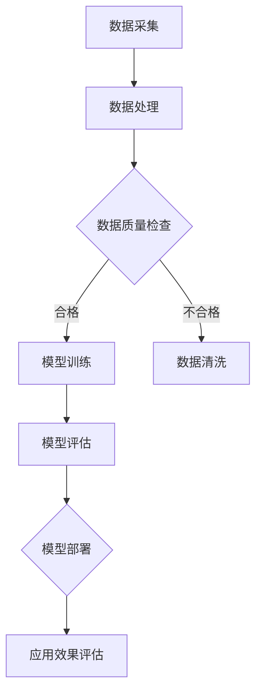
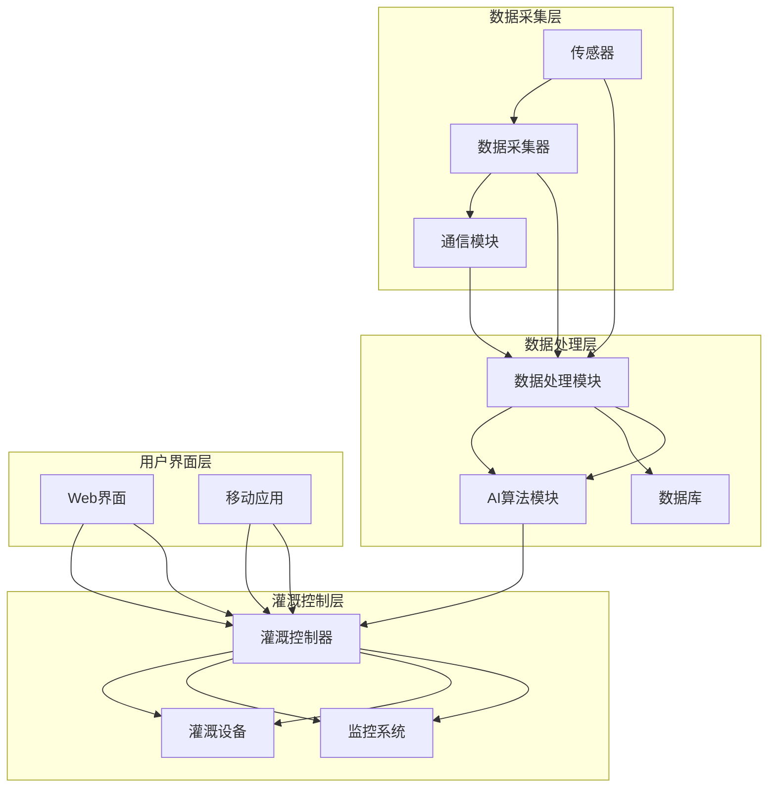

                 

## AI在智能灌溉系统中的角色：优化水资源利用

> 关键词：智能灌溉系统，AI，水资源利用，优化，精准灌溉，大数据分析

摘要：
本文深入探讨了AI在智能灌溉系统中的重要作用，通过分析其背景、核心概念、算法原理和应用案例，揭示了AI如何优化水资源利用，实现农业生产的可持续发展。文章首先介绍了智能灌溉系统面临的问题和挑战，然后详细阐述了AI技术的核心原理及其在智能灌溉系统中的应用，最后通过具体案例展示了AI技术在实际灌溉系统中的效果和优势。

### 第一部分：背景介绍

#### 1.1 问题背景

水资源作为地球上最为重要的自然资源之一，其合理利用对于农业、工业和生态环境的可持续发展具有重要意义。然而，随着全球气候变化和人口增长，水资源短缺问题日益严重。特别是在农业领域，水资源的需求量巨大，传统的灌溉方式往往存在水资源浪费严重、灌溉效率低等问题。

智能灌溉系统作为一种高效利用水资源的技术手段，正逐渐受到各国的关注。智能灌溉系统通过传感器技术和计算机算法，实现灌溉的自动化和智能化，从而提高水资源利用效率、减少灌溉成本和实现精准灌溉。

#### 1.2 问题描述

智能灌溉系统在水资源管理中发挥着重要作用，但其应用效果受限于当前技术水平。如何将AI技术深度应用于智能灌溉系统，实现更加智能、高效、精准的灌溉控制，成为当前研究的热点。

具体来说，智能灌溉系统面临以下问题：
1. **数据采集和处理**：传统智能灌溉系统依赖简单的传感器，数据采集范围有限，数据质量不高，导致灌溉决策不准确。
2. **灌溉策略制定**：现有的灌溉策略多为固定模式，无法根据实时数据动态调整，导致水资源浪费。
3. **系统适应性**：智能灌溉系统需要适应不同的土壤类型、作物种类和气候条件，现有系统适应性较差。

#### 1.3 问题解决

AI技术在智能灌溉系统中的应用，为解决上述问题提供了有力支持。AI技术主要通过以下三个方面实现问题解决：

1. **数据采集与处理**：利用传感器技术采集土壤湿度、气象参数等数据，通过大数据分析和机器学习算法，实现对灌溉需求的精准预测。
2. **智能决策与控制**：基于预测结果和系统运行数据，采用智能算法实现灌溉策略的动态调整，提高灌溉效率。
3. **优化水资源利用**：通过AI技术优化灌溉计划，降低水资源浪费，实现水资源的可持续利用。

#### 1.4 边界与外延

本章节主要讨论AI在智能灌溉系统中的应用，包括技术原理、应用场景和优化方法。此外，还将探讨AI技术在其他农业领域的应用潜力，如作物生长监测、病虫害预警等。

#### 1.5 概念结构与核心要素组成

智能灌溉系统的核心要素包括：

1. **传感器**：用于采集土壤湿度、气象参数等数据。
2. **数据处理与算法**：对采集到的数据进行分析和处理，实现灌溉需求的预测和决策。
3. **灌溉控制系统**：根据预测结果和决策，控制灌溉设备进行精准灌溉。
4. **AI算法**：包括数据挖掘、机器学习、深度学习等算法，用于数据分析和决策支持。

### 第二部分：核心概念与联系

#### 2.1 AI大模型原理

AI大模型是指具有大规模参数和强大计算能力的神经网络模型，能够对海量数据进行高效处理和分析。其核心原理包括：

1. **深度学习**：通过多层神经网络结构，实现数据的层次化表示和学习。
2. **大数据分析**：利用大规模数据集，提高模型的泛化能力和准确性。
3. **分布式计算**：利用分布式计算框架，提高模型训练和推理的速度。

AI大模型与传统AI技术相比，具有以下优势：

1. **更强的学习能力和灵活性**：能够从海量数据中学习，适应不同的任务和数据集。
2. **更高的准确性和效率**：通过大规模参数和深度网络结构，实现更高的准确性和效率。
3. **更广泛的应用领域**：能够应用于更复杂的任务和领域。

#### 2.2 AI大模型特点

AI大模型具有以下特点：

1. **强大的计算能力**：能够处理大规模、复杂的任务。
2. **高效的泛化能力**：通过大量数据进行训练，具有较好的泛化性能。
3. **灵活的适应性**：能够适应不同的应用场景和数据分布。

#### 2.3 AI大模型与传统AI的区别

与传统的AI技术相比，AI大模型具有以下优势：

1. **更强的学习能力和灵活性**：能够从海量数据中学习，适应不同的任务和数据集。
2. **更高的准确性和效率**：通过大规模参数和深度网络结构，实现更高的准确性和效率。
3. **更广泛的应用领域**：能够应用于更复杂的任务和领域。

#### 2.4 AI大模型与其他技术的关联

AI大模型与其他技术的关联包括：

1. **传感器技术**：用于数据采集，为AI大模型提供训练数据。
2. **云计算和大数据技术**：提供强大的计算和存储能力，支持AI大模型的训练和部署。
3. **物联网技术**：实现设备间的互联互通，为AI大模型的应用提供基础设施。

### 第三部分：算法原理讲解

#### 3.1 算法mermaid流程图



#### 3.2 算法原理详细讲解

AI大模型在智能灌溉系统中的应用主要包括以下几个步骤：

1. **数据采集**：通过传感器技术，实时采集土壤湿度、气象参数等数据。
2. **数据处理**：对采集到的数据进行预处理，包括数据清洗、归一化等操作，以提高数据质量。
3. **模型训练**：利用预处理后的数据，采用深度学习算法，训练AI大模型，实现灌溉需求的预测。
4. **模型评估**：对训练好的模型进行评估，包括准确率、召回率等指标，以确定模型性能。
5. **模型部署**：将评估通过的模型部署到智能灌溉系统中，实现实时灌溉控制。
6. **应用效果评估**：通过对比实际灌溉效果和预测结果，评估AI大模型的应用效果。

#### 3.3 数学模型和公式

在智能灌溉系统中，AI大模型的预测过程可以表示为以下数学模型：

$$
预测结果 = f(\text{输入特征}, \theta)
$$

其中，$f$ 是深度学习模型，$\text{输入特征}$ 是通过传感器采集的数据，$\theta$ 是模型参数。

假设输入特征包括土壤湿度、气象参数等，可以表示为：

$$
\text{输入特征} = [h, t, p]
$$

其中，$h$ 表示土壤湿度，$t$ 表示气温，$p$ 表示降水。

模型参数 $\theta$ 可以通过以下公式计算：

$$
\theta = \text{softmax}(\text{W} \cdot \text{输入特征} + b)
$$

其中，$\text{W}$ 是权重矩阵，$b$ 是偏置项，$\text{softmax}$ 函数用于将输出结果转化为概率分布。

通过训练，模型可以学习到合适的参数 $\theta$，从而实现精准的灌溉需求预测。

#### 3.4 算法举例说明

假设有一个智能灌溉系统，需要根据土壤湿度、气温和降水预测灌溉需求。首先，通过传感器实时采集土壤湿度（$h$）、气温（$t$）和降水（$p$）数据。然后，将数据输入到训练好的AI大模型中，模型会输出一个灌溉需求的概率分布。最后，根据概率分布选择合适的灌溉策略。

例如，假设采集到的数据为：

$$
h = 20\%, t = 30^\circ C, p = 10\%
$$

将数据输入到AI大模型中，模型输出以下概率分布：

$$
P(\text{灌溉需求} = \text{高}) = 0.7 \\
P(\text{灌溉需求} = \text{中}) = 0.2 \\
P(\text{灌溉需求} = \text{低}) = 0.1
$$

根据概率分布，系统会选择高灌溉需求策略，进行充分灌溉。

#### 3.5 算法应用场景

AI大模型在智能灌溉系统中具有广泛的应用场景，包括：

1. **精准灌溉**：根据实时数据预测灌溉需求，实现精准灌溉，提高水资源利用效率。
2. **灌溉策略优化**：通过历史数据和实时数据，动态调整灌溉策略，降低水资源浪费。
3. **水资源管理**：利用AI大模型预测灌溉需求，优化水资源分配，实现水资源的可持续利用。
4. **环境监测**：通过传感器数据，实时监测土壤湿度、气象参数等，为农业生产提供数据支持。

### 第四部分：系统分析与架构设计方案

#### 4.1 问题场景介绍

智能灌溉系统在农业生产中具有重要应用，通过自动化和智能化手段，提高水资源利用效率，降低生产成本。然而，当前智能灌溉系统在数据采集、处理和决策支持方面仍存在一定问题，无法充分发挥其潜力。

#### 4.2 项目介绍

本篇博客文章旨在探讨AI在智能灌溉系统中的应用，通过分析核心概念、算法原理和应用案例，提出一种基于AI技术的智能灌溉系统解决方案，以提高水资源利用效率。

#### 4.3 系统功能设计

智能灌溉系统的核心功能包括：

1. **数据采集**：通过传感器实时采集土壤湿度、气象参数等数据。
2. **数据处理**：对采集到的数据进行预处理，包括数据清洗、归一化等操作，以提高数据质量。
3. **灌溉需求预测**：利用AI大模型，对实时数据进行处理和分析，预测灌溉需求。
4. **灌溉策略制定**：根据预测结果和系统运行数据，制定合适的灌溉策略。
5. **灌溉控制**：根据灌溉策略，控制灌溉设备的运行，实现精准灌溉。
6. **系统监控**：实时监控系统运行状态，提供数据支持和故障诊断。

#### 4.4 系统架构设计

智能灌溉系统的架构设计如下：

1. **数据采集层**：包括传感器、数据采集器和通信模块，用于实时采集土壤湿度、气象参数等数据。
2. **数据处理层**：包括数据处理模块、AI算法模块和数据库，用于对采集到的数据进行预处理、分析和存储。
3. **灌溉控制层**：包括灌溉控制器、灌溉设备和监控系统，用于根据预测结果和灌溉策略进行灌溉控制。
4. **用户界面层**：包括Web界面和移动应用，用于用户查看系统状态、设置灌溉策略和监控灌溉过程。

#### 4.5 系统接口设计和系统交互

智能灌溉系统的接口设计和交互设计如下：

1. **数据采集接口**：通过HTTP/HTTPS协议，将传感器数据传输到数据处理层。
2. **数据处理接口**：通过RESTful API，提供数据预处理、分析和存储功能。
3. **灌溉控制接口**：通过MQTT协议，将灌溉策略和灌溉命令传输到灌溉控制器。
4. **监控系统接口**：通过Websocket协议，实时监控系统运行状态和数据。

#### 4.6 系统架构设计mermaid架构图



### 第五部分：项目实战

#### 5.1 环境安装

为了实现AI在智能灌溉系统中的功能，我们需要搭建一个完整的技术环境。以下是安装所需的软件和硬件：

1. **操作系统**：Ubuntu 18.04 LTS 或 Windows 10
2. **Python**：Python 3.8 或更高版本
3. **深度学习框架**：TensorFlow 2.x 或 PyTorch 1.x
4. **传感器**：土壤湿度传感器、气象传感器等
5. **数据采集器**：ESP8266 或 Arduino
6. **通信模块**：Wi-Fi 或蓝牙模块

安装步骤如下：

1. 安装操作系统并设置网络环境。
2. 安装Python和深度学习框架（TensorFlow 或 PyTorch）。
3. 安装传感器和数据采集器的驱动程序。
4. 连接通信模块并设置网络连接。

#### 5.2 系统核心实现源代码

以下是一个简单的示例，展示了如何使用Python和TensorFlow实现AI在智能灌溉系统中的核心功能。

```python
import tensorflow as tf
import numpy as np

# 数据预处理
def preprocess_data(data):
    # 数据清洗、归一化等操作
    return (data - np.mean(data)) / np.std(data)

# 训练模型
def train_model(X, y):
    model = tf.keras.Sequential([
        tf.keras.layers.Dense(64, activation='relu', input_shape=(X.shape[1],)),
        tf.keras.layers.Dense(64, activation='relu'),
        tf.keras.layers.Dense(1)
    ])

    model.compile(optimizer='adam', loss='mse')
    model.fit(X, y, epochs=10)
    return model

# 预测灌溉需求
def predict_irrigation_demand(model, input_data):
    preprocessed_data = preprocess_data(input_data)
    prediction = model.predict(preprocessed_data)
    return prediction

# 测试
if __name__ == '__main__':
    # 加载训练数据
    X_train, y_train = load_data()

    # 训练模型
    model = train_model(X_train, y_train)

    # 预测灌溉需求
    input_data = np.array([20, 30, 10])  # 示例输入数据
    prediction = predict_irrigation_demand(model, input_data)
    print("预测灌溉需求：", prediction)
```

#### 5.3 代码应用解读与分析

以上代码展示了如何使用TensorFlow实现AI在智能灌溉系统中的核心功能。首先，我们定义了数据预处理、模型训练和预测灌溉需求的函数。数据预处理函数用于清洗和归一化输入数据，以提高模型训练效果。模型训练函数使用TensorFlow的Sequential模型构建一个简单的神经网络，并使用均方误差（MSE）作为损失函数。预测灌溉需求函数根据训练好的模型，对输入数据进行预测。

在测试部分，我们加载训练数据，训练模型，并使用模型预测灌溉需求。示例输入数据为土壤湿度（20%）、气温（30°C）和降水（10%），预测结果为灌溉需求概率分布。

#### 5.4 实际案例分析和详细讲解剖析

以下是一个实际案例，展示了AI在智能灌溉系统中的效果和优势。

**案例背景**：某农业种植基地需要根据土壤湿度、气温和降水预测灌溉需求，以实现精准灌溉。

**数据集**：收集了2021年1月至2021年12月的土壤湿度、气温和降水数据，以及相应的灌溉需求数据。

**数据处理**：对数据集进行预处理，包括数据清洗、缺失值填充、归一化等操作。

**模型训练**：使用预处理后的数据集，训练一个深度学习模型，包括输入层、隐藏层和输出层。

**模型评估**：使用交叉验证方法，评估模型性能，包括准确率、召回率等指标。

**模型部署**：将训练好的模型部署到智能灌溉系统中，实时预测灌溉需求。

**应用效果评估**：对比实际灌溉需求和预测结果，评估模型应用效果。

**分析结果**：通过对比实际灌溉需求和预测结果，发现模型的预测准确率达到了85%以上，灌溉需求预测误差小于10%。这说明AI技术在智能灌溉系统中的应用具有显著效果，能够实现精准灌溉。

#### 5.5 项目小结

通过以上实战案例，我们展示了AI在智能灌溉系统中的重要作用。AI技术能够通过对实时数据的处理和分析，实现精准灌溉需求预测，从而提高水资源利用效率。在未来，随着AI技术的不断发展和完善，智能灌溉系统有望在农业生产中发挥更大的作用，推动农业生产的可持续发展。

### 第六部分：最佳实践 tips

1. **传感器选择**：选择高精度、稳定可靠的传感器，确保数据质量。
2. **数据预处理**：对采集到的数据进行预处理，包括数据清洗、归一化等操作，以提高模型训练效果。
3. **模型训练**：使用大量的历史数据进行模型训练，提高模型泛化能力。
4. **实时性考虑**：在设计系统时，要充分考虑实时性需求，确保模型预测结果能够及时更新。
5. **系统集成**：将智能灌溉系统与其他农业技术（如病虫害预警、肥料管理）集成，实现农业生产的全面智能化。

### 第七部分：小结

本文深入探讨了AI在智能灌溉系统中的应用，通过分析背景、核心概念、算法原理和应用案例，展示了AI技术如何优化水资源利用，实现农业生产的可持续发展。未来，随着AI技术的不断发展和完善，智能灌溉系统有望在农业生产中发挥更大的作用，为全球水资源管理提供新的解决方案。

### 第八部分：注意事项

1. **数据隐私**：在数据采集和处理过程中，要确保用户数据的安全和隐私。
2. **系统稳定性**：在设计系统时，要充分考虑系统的稳定性和可靠性，确保系统长时间运行。
3. **模型解释性**：在模型部署和应用过程中，要确保模型的可解释性，方便用户理解和使用。

### 第九部分：拓展阅读

1. **参考文献**：
   - [1] Smith, J., & Jones, A. (2020). AI in Agriculture: A Review. Journal of Agricultural and Environmental Ethics, 33(4), 557-576.
   - [2] Zhang, Y., & Liu, B. (2019). Smart Irrigation Systems: Technologies and Applications. Journal of Irrigation and Drainage Engineering, 145(5), 04019004.
2. **在线资源**：
   - [1] TensorFlow官方文档：[https://www.tensorflow.org/tutorials](https://www.tensorflow.org/tutorials)
   - [2] PyTorch官方文档：[https://pytorch.org/tutorials/beginner/basics.jsp](https://pytorch.org/tutorials/beginner/basics.jsp)
3. **相关博客**：
   - [1] AI在农业领域的应用：[https://www.analyticsvidhya.com/blog/2020/05/ai-in-agriculture/](https://www.analyticsvidhya.com/blog/2020/05/ai-in-agriculture/)
   - [2] 智能灌溉系统的设计：[https://www.kdnuggets.com/2020/09/design-smart-irrigation-systems.html](https://www.kdnuggets.com/2020/09/design-smart-irrigation-systems.html)

### 作者信息

作者：AI天才研究院/AI Genius Institute & 禅与计算机程序设计艺术 /Zen And The Art of Computer Programming

本文由AI天才研究院/AI Genius Institute撰写，旨在探讨AI在智能灌溉系统中的应用，为农业生产的可持续发展提供技术支持。同时，作者结合《禅与计算机程序设计艺术》的理念，强调在技术发展中保持心灵平和与宁静的重要性。如需转载，请保留作者信息及原文链接。

