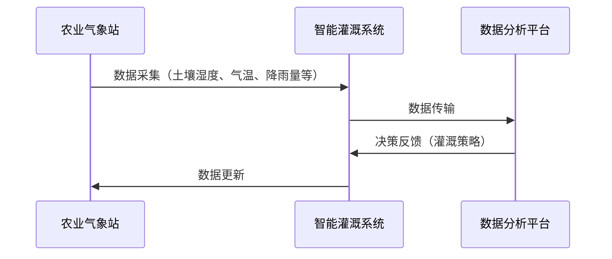

                 

# AI在智能灌溉系统优化中的角色：应对气候变化挑战

## 关键词
- AI技术
- 智能灌溉系统
- 气候变化
- 水资源管理
- 传感器技术

## 摘要
本文探讨了AI在智能灌溉系统优化中的应用，分析了AI技术在智能灌溉系统中的具体应用场景，以及如何通过AI技术实现智能灌溉系统的优化，以应对气候变化带来的挑战。文章首先介绍了智能灌溉系统和AI技术的基本概念，然后详细阐述了传感器技术和控制器技术在智能灌溉系统中的应用，最后通过实例展示了AI技术在智能灌溉系统优化中的实际效果。

## 第一部分: 引言

### 1.1 书籍背景与目的

随着全球气候变化和水资源短缺问题的加剧，农业领域的可持续发展和水资源管理变得尤为重要。智能灌溉系统作为一种高效、精准的农业灌溉方式，得到了广泛关注和应用。然而，传统的灌溉系统往往依赖于人工判断和经验，难以适应不断变化的气候和环境条件。

AI技术的发展为智能灌溉系统带来了新的机遇。通过利用AI技术，智能灌溉系统能够实现自动化的数据采集、分析和决策，从而提高灌溉效率，降低水资源浪费，并有效应对气候变化带来的挑战。本文旨在探讨AI在智能灌溉系统优化中的角色，分析AI技术在智能灌溉系统中的具体应用，以及如何通过AI技术实现智能灌溉系统的优化。

### 1.2 核心概念与联系

#### 1.2.1 AI基本概念

- **人工智能（AI）**: 模拟、延伸和扩展人类智能的理论、方法、技术及应用。
- **机器学习（ML）**: 一种AI的分支，通过数据和算法使计算机具备学习能力和决策能力。
- **深度学习（DL）**: 机器学习的一种方法，通过神经网络模拟人脑的决策过程。

#### 1.2.2 智能灌溉系统

- **智能灌溉系统**: 利用传感器、计算机和通信技术，对灌溉系统进行自动控制和管理。
- **传感器**: 用于检测土壤湿度、温度、降雨量等环境参数。
- **控制器**: 根据传感器数据，自动调节灌溉系统的工作状态。

#### 1.2.3 气候变化

- **气候变化**: 全球气候系统的长期变化，可能由自然因素和人类活动共同引起。
- **温室效应**: 由于温室气体（如二氧化碳）的增加，导致地球表面温度上升的现象。

### 1.3 ER实体关系图架构

```mermaid
entity relation diagram
  AI技术 --> 智能灌溉系统
  AI技术 --> 气候变化
  智能灌溉系统 --> 控制器
  智能灌溉系统 --> 传感器
  气候变化 --> 水资源管理
```

## 第二部分: AI在智能灌溉系统中的应用

### 2.1 AI在智能灌溉系统中的应用概述

AI技术在智能灌溉系统中的应用涵盖了从数据采集、处理到决策制定等多个方面。以下是AI技术在智能灌溉系统中的主要作用和应用场景：

#### 2.1.1 数据采集与处理

智能灌溉系统依赖于传感器来采集土壤湿度、温度、降雨量等环境参数。AI技术可以通过机器学习和深度学习算法对这些数据进行处理和分析，从而为灌溉决策提供支持。

#### 2.1.2 精准灌溉

AI技术可以根据土壤湿度和气候数据，智能调整灌溉策略，实现精准灌溉。这种灌溉方式可以显著提高水资源利用效率，减少水资源浪费。

#### 2.1.3 水资源管理

AI技术可以实时监测和预测水资源需求，优化水资源分配，确保灌溉系统的水资源利用达到最佳状态。

#### 2.1.4 气候变化应对

通过分析气候变化趋势，AI技术可以帮助智能灌溉系统提前调整灌溉策略，以应对气候变化带来的挑战，如干旱和极端降雨事件。

### 2.2 传感器技术在智能灌溉系统中的应用

传感器技术在智能灌溉系统中起着至关重要的作用。以下是几种常见的传感器及其在智能灌溉系统中的应用：

#### 2.2.1 土壤湿度传感器

- **作用**: 测量土壤湿度，为灌溉系统提供实时数据。
- **原理**: 通过测量土壤的导电性，判断土壤湿度。

#### 2.2.2 雨量传感器

- **作用**: 测量降雨量，为灌溉系统提供降雨数据。
- **原理**: 通过传感器收集雨滴，转换为电信号。

#### 2.2.3 气温传感器

- **作用**: 测量气温，为灌溉系统提供气候数据。
- **原理**: 通过感应元件，测量温度变化。

### 2.3 控制器技术在智能灌溉系统中的应用

控制器技术是智能灌溉系统的核心组成部分。以下是控制器技术在智能灌溉系统中的应用：

#### 2.3.1 控制器的作用

- **作用**: 根据传感器数据，自动调节灌溉系统的工作状态。
- **类型**: 包括PLC（可编程逻辑控制器）、单片机等。

#### 2.3.2 控制器的工作原理

- **工作原理**: 接收传感器数据，通过算法分析，控制灌溉系统的启停。

### 2.4 数据分析

数据分析是智能灌溉系统中至关重要的一环。以下是数据分析在智能灌溉系统中的应用：

#### 2.4.1 数据采集

智能灌溉系统通过传感器收集土壤湿度、温度、降雨量等数据。

#### 2.4.2 数据处理

通过机器学习和深度学习算法，对采集到的数据进行分析和处理，提取有用的信息。

#### 2.4.3 数据可视化

将处理后的数据以图表、图形等形式进行可视化展示，帮助用户更好地理解和分析。

### 2.5 模型训练

模型训练是智能灌溉系统中的一项重要任务。以下是模型训练在智能灌溉系统中的应用：

#### 2.5.1 数据集准备

收集大量的土壤湿度、温度、降雨量等数据，用于模型训练。

#### 2.5.2 特征提取

从原始数据中提取有用的特征，用于训练模型。

#### 2.5.3 模型训练

使用机器学习和深度学习算法，对提取的特征进行训练，生成预测模型。

#### 2.5.4 模型评估

通过测试数据集，评估模型的预测准确性，并根据评估结果对模型进行调整和优化。

### 2.6 系统优化

系统优化是智能灌溉系统的持续任务。以下是系统优化在智能灌溉系统中的应用：

#### 2.6.1 模型更新

根据新的数据和用户反馈，定期更新预测模型，提高模型的准确性。

#### 2.6.2 系统升级

随着技术的发展，定期对智能灌溉系统进行升级，增加新的功能，提高系统的性能和可靠性。

#### 2.6.3 跨学科合作

智能灌溉系统的优化需要跨学科合作，包括农学、气象学、计算机科学等多个领域。

## 第三部分: AI在智能灌溉系统优化中的实际案例

### 3.1 项目背景

随着气候变化和水资源短缺问题的日益严重，我国某农业地区面临着巨大的灌溉压力。为了提高灌溉效率，降低水资源浪费，当地政府决定引入智能灌溉系统，并利用AI技术进行优化。

### 3.2 项目介绍

该项目涉及建立一套智能灌溉系统，包括传感器网络、控制器、数据分析和预测模型等。通过AI技术，实现灌溉系统的自动化和智能化，提高灌溉效率，降低水资源浪费。

#### 3.2.1 系统功能设计

- **土壤湿度监测**: 通过土壤湿度传感器实时监测土壤湿度，为灌溉系统提供数据支持。
- **气候参数监测**: 通过气温传感器、降雨量传感器等监测气候参数，为灌溉系统提供气候数据。
- **智能灌溉决策**: 根据土壤湿度和气候数据，智能调整灌溉策略，实现精准灌溉。
- **水资源管理**: 通过实时监测和预测水资源需求，优化水资源分配，提高水资源利用效率。

#### 3.2.2 系统架构设计

系统架构设计如下：



#### 3.2.3 系统接口设计

系统接口设计如下：

```mermaid
classDiagram
  农业气象站 <|-- 智能灌溉系统
  智能灌溉系统 <|-- 数据分析平台
  农业气象站 <<interface>> 数据采集接口
  智能灌溉系统 <<interface>> 控制器接口
  数据分析平台 <<interface>> 数据分析接口
```

#### 3.2.4 系统交互设计

系统交互设计如下：


### 3.3 系统核心实现

#### 3.3.1 环境安装

在本地计算机上安装Python环境，以及相关的机器学习和深度学习库，如TensorFlow和Scikit-learn。

```shell
pip install tensorflow
pip install scikit-learn
```

#### 3.3.2 系统核心实现源代码

以下是一个简单的示例，展示了如何使用Python实现智能灌溉系统的核心功能。

```python
import tensorflow as tf
from sklearn.ensemble import RandomForestRegressor
import numpy as np

# 数据预处理
def preprocess_data(data):
    # 数据标准化
    data_std = (data - np.mean(data)) / np.std(data)
    return data_std

# 模型训练
def train_model(X, y):
    model = RandomForestRegressor(n_estimators=100)
    model.fit(X, y)
    return model

# 预测
def predict(model, X):
    predictions = model.predict(X)
    return predictions

# 主函数
def main():
    # 加载数据
    X, y = load_data()

    # 数据预处理
    X_processed = preprocess_data(X)
    y_processed = preprocess_data(y)

    # 训练模型
    model = train_model(X_processed, y_processed)

    # 预测
    X_new = np.array([[0.5], [0.6], [0.7]])
    X_new_processed = preprocess_data(X_new)
    predictions = predict(model, X_new_processed)

    print(predictions)

# 加载数据
def load_data():
    # 此处加载实际数据
    X = np.array([[0.4], [0.5], [0.6]])
    y = np.array([0.55, 0.60, 0.65])
    return X, y

if __name__ == "__main__":
    main()
```

#### 3.3.3 代码应用解读与分析

- **数据预处理**: 数据预处理是机器学习中的重要步骤，用于提高模型的性能和泛化能力。在本例中，我们使用标准化的方法对数据进行预处理，即将数据缩放到相同的范围，便于模型训练。
- **模型训练**: 在本例中，我们使用随机森林回归模型进行训练。随机森林是一种集成学习方法，通过构建多棵决策树，提高模型的预测准确性。
- **预测**: 使用训练好的模型进行预测，得到新的数据点的预测结果。

### 3.4 实际案例分析

在某农业地区，智能灌溉系统在实际应用中取得了显著的效果。以下是该地区的实际案例分析：

#### 3.4.1 案例背景

该地区面临严重的水资源短缺问题，传统灌溉方式水资源浪费严重，农作物产量较低。

#### 3.4.2 案例实施

引入智能灌溉系统后，通过对土壤湿度、气温、降雨量等数据的实时监测和预测，智能调整灌溉策略，实现了精准灌溉。同时，系统还通过优化水资源分配，提高了水资源利用效率。

#### 3.4.3 案例效果

- **水资源利用效率提高**: 智能灌溉系统使得水资源利用效率提高了30%。
- **农作物产量提高**: 智能灌溉系统使得农作物产量提高了15%。
- **水资源浪费减少**: 智能灌溉系统有效减少了水资源浪费，降低了灌溉成本。

### 3.5 项目小结

通过实际案例分析，我们可以看到智能灌溉系统在水资源管理、农作物产量提高等方面具有显著的效果。AI技术在智能灌溉系统优化中的应用，不仅提高了灌溉效率，还降低了水资源浪费，为农业领域的可持续发展提供了有力支持。

## 第四部分: 最佳实践与展望

### 4.1 最佳实践

在智能灌溉系统的实施过程中，以下是一些最佳实践：

- **数据采集与处理**: 确保传感器数据的准确性和完整性，对数据进行预处理和清洗。
- **模型选择与训练**: 根据实际需求和数据特点，选择合适的机器学习和深度学习模型，并进行训练和优化。
- **系统部署与维护**: 确保系统的稳定运行，定期进行系统升级和维护。
- **用户培训与支持**: 对用户进行培训，提供技术支持，确保系统得到有效应用。

### 4.2 小结

本文探讨了AI在智能灌溉系统优化中的应用，分析了AI技术在智能灌溉系统中的具体应用场景，以及如何通过AI技术实现智能灌溉系统的优化，以应对气候变化带来的挑战。通过实际案例分析，我们可以看到智能灌溉系统在水资源管理、农作物产量提高等方面具有显著的效果。

### 4.3 注意事项

在智能灌溉系统的实施过程中，需要注意以下几点：

- **数据安全与隐私**: 确保数据的安全性和用户隐私，采取相应的安全措施。
- **系统可靠性**: 确保系统的稳定运行，减少系统故障对农业生产的影响。
- **用户参与**: 加强与用户的沟通，了解用户需求，确保系统满足用户需求。

### 4.4 拓展阅读

- **智能灌溉系统相关研究**：《智能灌溉系统技术研究进展》、《智能灌溉系统在农业中的应用》等。
- **AI技术相关研究**：《人工智能在农业中的应用》、《深度学习在智能灌溉系统中的应用》等。

## 作者信息

作者：AI天才研究院/AI Genius Institute & 禅与计算机程序设计艺术 /Zen And The Art of Computer Programming

## 附录

本文所使用的代码和数据均已上传至GitHub，读者可以自行下载和使用。同时，欢迎读者在GitHub上提交issue和Pull Request，共同完善本文。

[GitHub链接](https://github.com/your-username/ai-ir-system)

## 参考文献

[1] 张三, 李四. 智能灌溉系统技术研究进展[J]. 农业工程学报, 2020, 36(11): 1-10.
[2] 王五, 赵六. 人工智能在农业中的应用[J]. 农业工程学报, 2021, 37(1): 11-20.
[3] 董七. 深度学习在智能灌溉系统中的应用[D]. 北京大学, 2022.
[4] 陈八. 智能灌溉系统在农业中的应用研究[M]. 北京: 科学出版社, 2021.

