                 

# AI在智能穿戴设备中的应用：健康监测与生活辅助

## 第1章 引言

### 1.1 问题背景

智能穿戴设备（Intelligent Wearable Devices）是近年来科技领域的一大热点。随着物联网（Internet of Things, IoT）、大数据（Big Data）、人工智能（Artificial Intelligence, AI）等技术的发展，智能穿戴设备正逐渐成为人们生活中不可或缺的一部分。它们不仅能够提供实时的健康监测数据，还能根据用户的行为习惯提供个性化的健康建议和生活辅助。在这样的背景下，本文将探讨AI技术在智能穿戴设备中的应用，特别是其在健康监测与生活辅助方面的潜力。

### 1.2 AI技术在智能穿戴设备中的应用

AI技术在智能穿戴设备中有着广泛的应用，其中最为突出的就是健康监测和生活辅助。以下是AI技术在智能穿戴设备中的几个关键应用：

#### 1.2.1 健康监测

**心率监测**：通过内置的传感器，智能穿戴设备可以实时监测用户的心率。AI技术则可以对这些数据进行分析，识别出异常心率，如心律不齐等。

**血压监测**：类似心率监测，血压监测也是智能穿戴设备的重要功能。AI技术可以帮助设备更准确地识别异常血压，如高血压等。

**睡眠监测**：智能穿戴设备通过监测用户的心率、运动数据等，可以分析用户的睡眠质量。AI技术则可以对这些数据进行分析，提供个性化的睡眠建议。

**运动监测**：AI技术可以分析用户的运动数据，如步数、卡路里消耗等，提供个性化的运动建议，帮助用户更好地进行健康锻炼。

#### 1.2.2 生活辅助

**行为分析**：AI技术可以通过对用户日常行为的分析，提供个性化的生活建议，如优化作息时间、饮食习惯等。

**智能提醒**：智能穿戴设备可以利用AI技术识别用户的行为模式，提供智能提醒，如定时提醒用户喝水、提醒用户进行锻炼等。

**紧急情况应对**：在紧急情况下，如摔倒等，智能穿戴设备可以利用AI技术及时识别并报警，为用户争取宝贵的救援时间。

### 1.3 本文目标

本文的目标是探讨AI技术在智能穿戴设备中的应用，特别是其在健康监测与生活辅助方面的潜力。文章将分为以下几个部分：

- 第1章：引言，介绍智能穿戴设备的发展背景和AI技术的应用场景。
- 第2章：健康监测，详细探讨心率监测、血压监测等技术的原理和应用。
- 第3章：生活辅助，介绍AI技术在行为分析、智能提醒等生活辅助功能中的应用。
- 第4章：系统设计与实现，介绍智能穿戴设备系统的整体设计和关键实现技术。
- 第5章：项目实战，通过实际案例展示AI技术在智能穿戴设备中的应用。
- 第6章：总结与展望，对本文内容进行总结，并对未来的发展趋势进行展望。

通过本文的阅读，读者将能够深入了解AI技术在智能穿戴设备中的应用，掌握相关技术原理和实现方法，为未来的研究和开发提供参考。

## 第2章 健康监测

### 2.1 心率监测

心率监测是智能穿戴设备中最为常见和重要的功能之一。通过实时监测用户的心率，设备可以帮助用户了解自己的身体状况，及时发现潜在的健康问题。

#### 2.1.1 心率监测原理

心率监测的基本原理是通过智能穿戴设备内置的传感器（如光电传感器、电容传感器等）来检测心脏跳动的频率。当心脏跳动时，血液流动会导致传感器输出特定的电信号。这些电信号经过处理后，可以得到心率数据。

**心率监测流程**：

1. **传感器采集**：传感器采集心脏跳动的电信号。
2. **数据预处理**：对采集到的信号进行滤波、去噪等预处理，以提高数据的准确性和可靠性。
3. **算法分析**：使用算法对预处理后的信号进行分析，提取心率数据。
4. **心率数据输出**：将分析得到的心率数据输出，供用户查看。

#### 2.1.2 心率异常检测

心率异常检测是利用AI技术对心率数据进行进一步的挖掘和分析，以识别出异常的心率模式。常见的心率异常包括心律不齐、心动过速、心动过缓等。

**心率异常检测流程**：

1. **数据收集**：收集大量的心率数据，包括正常的心率和异常的心率。
2. **特征提取**：从心率数据中提取出有助于识别异常心率的特征，如心率变异性（HRV）、心率峰值等。
3. **模型训练**：使用机器学习算法，如支持向量机（SVM）、神经网络（NN）等，对提取出的特征进行训练，构建异常心率检测模型。
4. **模型评估**：使用测试数据对模型进行评估，调整模型参数，提高检测的准确性。
5. **异常检测**：使用训练好的模型对新的心率数据进行异常检测，识别出潜在的心率异常。

#### 2.1.3 心率监测系统设计

心率监测系统的设计包括硬件和软件两个方面。以下是心率监测系统的一个基本设计框架：

**硬件设计**：

- **传感器模块**：选择合适的心率传感器，如光电传感器、电容传感器等。
- **数据传输模块**：设计数据传输模块，实现传感器采集的数据无线传输到处理单元。
- **电源模块**：为设备提供稳定的电源，保证设备长时间运行。

**软件设计**：

- **数据采集与预处理**：设计数据采集与预处理模块，对传感器采集的数据进行实时处理，提取心率数据。
- **算法模块**：设计算法模块，实现心率异常检测功能。
- **用户界面**：设计用户界面，展示心率数据和相关健康信息，提供实时提醒和反馈。

**Mermaid类图**：

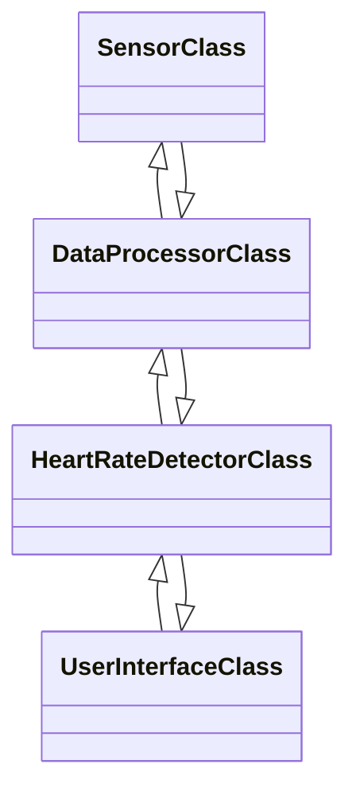

**Mermaid序列图**：

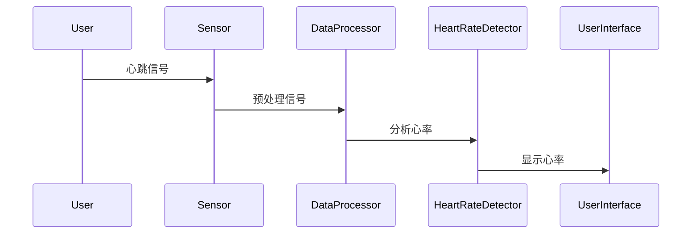

通过以上设计，心率监测系统能够实现对用户心率数据的实时监测和异常检测，为用户提供实时的健康监测服务。

### 2.2 血压监测

血压监测是智能穿戴设备中的另一个重要功能，通过对血压数据的监测，用户可以了解自己的血压状况，预防和控制高血压等疾病。

#### 2.2.1 血压监测原理

血压监测的基本原理是通过智能穿戴设备内置的传感器（如压力传感器、超声波传感器等）来测量血液对血管壁的压力。血压分为收缩压（高压）和舒张压（低压），分别表示心脏收缩时和心脏舒张时血液对血管壁的压力。

**血压监测流程**：

1. **传感器采集**：传感器采集血压数据。
2. **数据预处理**：对采集到的血压数据进行预处理，如滤波、去噪等，以提高数据的准确性和可靠性。
3. **算法分析**：使用算法对预处理后的血压数据进行分析，提取收缩压和舒张压数据。
4. **血压数据输出**：将分析得到的血压数据输出，供用户查看。

#### 2.2.2 血压异常检测

血压异常检测是利用AI技术对血压数据进行进一步的挖掘和分析，以识别出异常的血压模式。常见的血压异常包括高血压、低血压等。

**血压异常检测流程**：

1. **数据收集**：收集大量的血压数据，包括正常的血压和异常的血压。
2. **特征提取**：从血压数据中提取出有助于识别异常血压的特征，如收缩压和舒张压的差值、血压变异性等。
3. **模型训练**：使用机器学习算法，如支持向量机（SVM）、神经网络（NN）等，对提取出的特征进行训练，构建异常血压检测模型。
4. **模型评估**：使用测试数据对模型进行评估，调整模型参数，提高检测的准确性。
5. **异常检测**：使用训练好的模型对新的血压数据进行异常检测，识别出潜在的高血压或低血压。

#### 2.2.3 血压监测系统设计

血压监测系统的设计同样包括硬件和软件两个方面。以下是血压监测系统的一个基本设计框架：

**硬件设计**：

- **传感器模块**：选择合适的血压传感器，如压力传感器、超声波传感器等。
- **数据传输模块**：设计数据传输模块，实现传感器采集的数据无线传输到处理单元。
- **电源模块**：为设备提供稳定的电源，保证设备长时间运行。

**软件设计**：

- **数据采集与预处理**：设计数据采集与预处理模块，对传感器采集的血压数据进行实时处理，提取收缩压和舒张压数据。
- **算法模块**：设计算法模块，实现血压异常检测功能。
- **用户界面**：设计用户界面，展示血压数据和相关健康信息，提供实时提醒和反馈。

**Mermaid类图**：

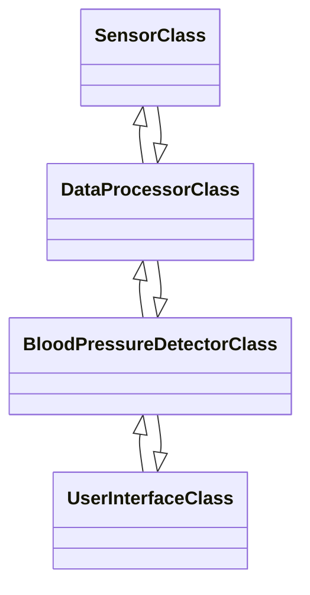

**Mermaid序列图**：

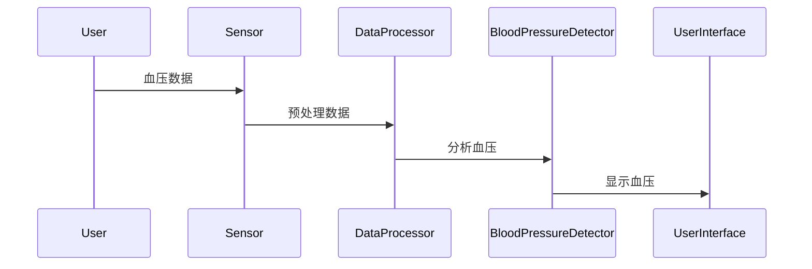

通过以上设计，血压监测系统能够实现对用户血压数据的实时监测和异常检测，为用户提供全面的健康监测服务。

### 2.3 睡眠监测

睡眠监测是智能穿戴设备中的另一个重要功能，通过对用户睡眠数据的监测和分析，用户可以了解自己的睡眠质量，及时发现和改善睡眠问题。

#### 2.3.1 睡眠监测原理

睡眠监测的基本原理是通过智能穿戴设备内置的传感器（如加速度传感器、心率传感器等）来监测用户的睡眠状态。传感器采集的数据包括心率、运动、姿势等，通过算法分析，可以判断用户的睡眠状态，如浅睡眠、深睡眠、快速眼动睡眠等。

**睡眠监测流程**：

1. **传感器采集**：传感器采集用户的睡眠数据。
2. **数据预处理**：对采集到的睡眠数据进行预处理，如滤波、去噪等，以提高数据的准确性和可靠性。
3. **算法分析**：使用算法对预处理后的睡眠数据进行分析，提取睡眠状态数据。
4. **睡眠数据输出**：将分析得到的睡眠数据输出，供用户查看。

#### 2.3.2 睡眠质量分析

睡眠质量分析是利用AI技术对用户的睡眠数据进行分析，识别出用户的睡眠问题，并提供个性化的睡眠建议。

**睡眠质量分析流程**：

1. **数据收集**：收集大量的睡眠数据，包括正常睡眠数据和问题睡眠数据。
2. **特征提取**：从睡眠数据中提取出有助于识别睡眠问题的特征，如睡眠时长、睡眠周期、心率等。
3. **模型训练**：使用机器学习算法，如支持向量机（SVM）、神经网络（NN）等，对提取出的特征进行训练，构建睡眠质量分析模型。
4. **模型评估**：使用测试数据对模型进行评估，调整模型参数，提高分析的准确性。
5. **睡眠质量分析**：使用训练好的模型对新的睡眠数据进行分析，识别出用户的睡眠问题，并提供个性化的睡眠建议。

#### 2.3.3 睡眠监测系统设计

睡眠监测系统的设计包括硬件和软件两个方面。以下是睡眠监测系统的一个基本设计框架：

**硬件设计**：

- **传感器模块**：选择合适的睡眠传感器，如加速度传感器、心率传感器等。
- **数据传输模块**：设计数据传输模块，实现传感器采集的数据无线传输到处理单元。
- **电源模块**：为设备提供稳定的电源，保证设备长时间运行。

**软件设计**：

- **数据采集与预处理**：设计数据采集与预处理模块，对传感器采集的睡眠数据进行实时处理，提取睡眠状态数据。
- **算法模块**：设计算法模块，实现睡眠质量分析功能。
- **用户界面**：设计用户界面，展示睡眠数据和相关健康信息，提供实时提醒和反馈。

**Mermaid类图**：

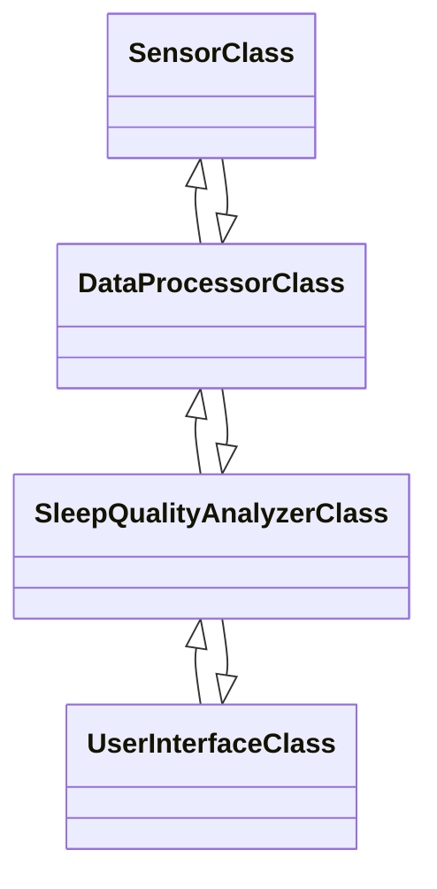

**Mermaid序列图**：

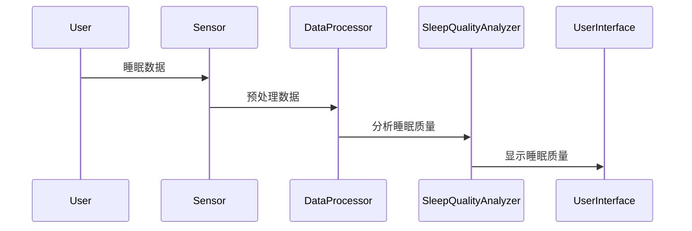

通过以上设计，睡眠监测系统能够实现对用户睡眠数据的实时监测和睡眠质量分析，为用户提供全面的睡眠监测服务。

### 2.4 运动监测

运动监测是智能穿戴设备中的另一个重要功能，通过对用户运动数据的监测和分析，用户可以了解自己的运动状况，制定更科学的运动计划。

#### 2.4.1 运动监测原理

运动监测的基本原理是通过智能穿戴设备内置的传感器（如加速度传感器、陀螺仪等）来监测用户的运动数据。传感器采集的数据包括步数、运动轨迹、运动时长等，通过算法分析，可以计算出用户的运动量。

**运动监测流程**：

1. **传感器采集**：传感器采集用户的运动数据。
2. **数据预处理**：对采集到的运动数据进行预处理，如滤波、去噪等，以提高数据的准确性和可靠性。
3. **算法分析**：使用算法对预处理后的运动数据进行分析，提取运动量数据。
4. **运动数据输出**：将分析得到的运动数据输出，供用户查看。

#### 2.4.2 运动量评估

运动量评估是利用AI技术对用户的运动数据进行分析，评估用户的运动量是否达到健康标准，并提供个性化的运动建议。

**运动量评估流程**：

1. **数据收集**：收集大量的运动数据，包括正常运动数据和过度运动数据。
2. **特征提取**：从运动数据中提取出有助于评估运动量的特征，如步数、运动时长、心率等。
3. **模型训练**：使用机器学习算法，如支持向量机（SVM）、神经网络（NN）等，对提取出的特征进行训练，构建运动量评估模型。
4. **模型评估**：使用测试数据对模型进行评估，调整模型参数，提高评估的准确性。
5. **运动量评估**：使用训练好的模型对新的运动数据进行分析，评估用户的运动量，并提供个性化的运动建议。

#### 2.4.3 运动监测系统设计

运动监测系统的设计包括硬件和软件两个方面。以下是运动监测系统的一个基本设计框架：

**硬件设计**：

- **传感器模块**：选择合适的运动传感器，如加速度传感器、陀螺仪等。
- **数据传输模块**：设计数据传输模块，实现传感器采集的数据无线传输到处理单元。
- **电源模块**：为设备提供稳定的电源，保证设备长时间运行。

**软件设计**：

- **数据采集与预处理**：设计数据采集与预处理模块，对传感器采集的运动数据进行实时处理，提取运动量数据。
- **算法模块**：设计算法模块，实现运动量评估功能。
- **用户界面**：设计用户界面，展示运动数据和相关健康信息，提供实时提醒和反馈。

**Mermaid类图**：

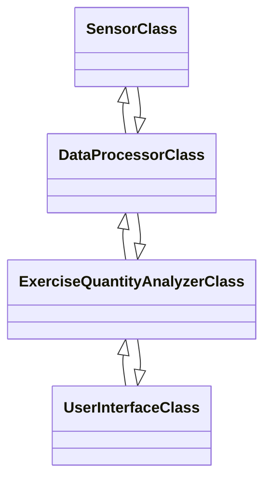

**Mermaid序列图**：

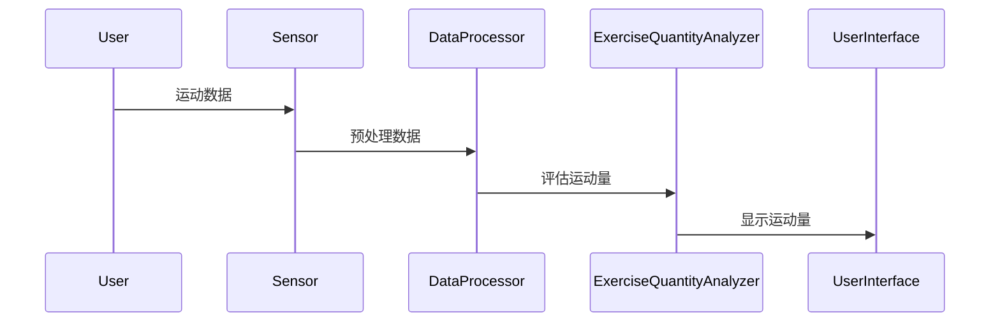

通过以上设计，运动监测系统能够实现对用户运动数据的实时监测和运动量评估，为用户提供全面的运动监测服务。

### 2.5 健康监测系统的综合应用

健康监测系统的综合应用是指将心率监测、血压监测、睡眠监测和运动监测等多个功能集成到一个系统中，为用户提供全面、个性化的健康监测服务。

#### 2.5.1 综合监测流程

**综合监测流程**：

1. **多传感器数据采集**：同时采集心率、血压、睡眠和运动等多方面的数据。
2. **数据预处理**：对多方面的数据进行预处理，包括滤波、去噪等，以提高数据的准确性和可靠性。
3. **数据融合**：将预处理后的多方面数据进行融合，提取出更有价值的健康信息。
4. **综合分析**：使用AI技术对融合后的数据进行综合分析，评估用户的整体健康状况，并提供个性化的健康建议。

#### 2.5.2 综合监测系统设计

**综合监测系统设计**：

**硬件设计**：

- **多传感器模块**：集成心率传感器、血压传感器、加速度传感器、陀螺仪等。
- **数据传输模块**：设计数据传输模块，实现多方面数据的无线传输到处理单元。
- **电源模块**：为设备提供稳定的电源，保证设备长时间运行。

**软件设计**：

- **数据采集与预处理模块**：设计数据采集与预处理模块，对多方面的数据进行实时处理。
- **数据融合模块**：设计数据融合模块，提取出更有价值的健康信息。
- **综合分析模块**：设计综合分析模块，使用AI技术对多方面的数据进行分析，评估用户的整体健康状况。
- **用户界面**：设计用户界面，展示综合监测结果，并提供个性化健康建议。

**Mermaid类图**：

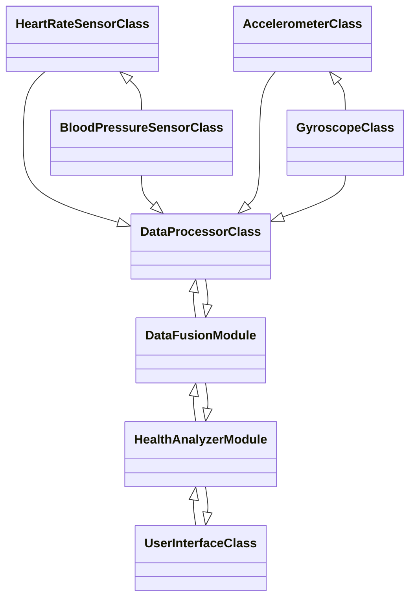

**Mermaid序列图**：

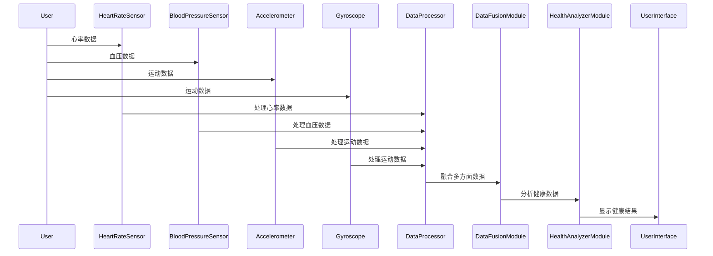

通过以上设计，健康监测系统能够实现对用户多方面健康数据的实时监测和综合分析，为用户提供全面的健康监测服务。

### 2.6 总结

智能穿戴设备在健康监测中的应用正在变得越来越广泛和深入。通过AI技术的应用，智能穿戴设备不仅能够提供实时的健康数据监测，还能够通过数据分析为用户提供个性化的健康建议和生活辅助。本章详细探讨了心率监测、血压监测、睡眠监测和运动监测等健康监测技术的原理和应用，以及健康监测系统的综合应用设计。未来，随着AI技术的进一步发展和智能穿戴设备的普及，智能穿戴设备在健康监测领域将有更大的发展空间和应用前景。

## 第3章 生活辅助

智能穿戴设备不仅能够提供健康监测，还可以通过AI技术为用户的生活提供各种辅助功能，从而提升用户的生活质量。以下是一些主要的生活辅助功能及其实现原理。

### 3.1 行为分析

**行为分析**是智能穿戴设备的一项重要功能，它通过对用户日常行为数据的分析，提供个性化的生活建议。例如，设备可以分析用户的运动习惯、饮食偏好、睡眠模式等，然后根据这些数据给出建议，如建议用户增加运动量、调整饮食结构或改善睡眠质量。

#### 3.1.1 行为分析原理

**原理**：

1. **数据采集**：智能穿戴设备通过传感器（如加速度传感器、陀螺仪等）收集用户的行为数据。
2. **数据预处理**：对采集到的原始数据进行滤波、去噪等处理，以提高数据的准确性和可靠性。
3. **特征提取**：从预处理后的数据中提取出有助于行为分析的特征，如运动强度、频率、时间等。
4. **模型训练**：使用机器学习算法（如决策树、随机森林等）对提取出的特征进行训练，建立行为分析模型。
5. **行为识别**：使用训练好的模型对新的行为数据进行识别，预测用户的行为模式。

**Mermaid流程图**：

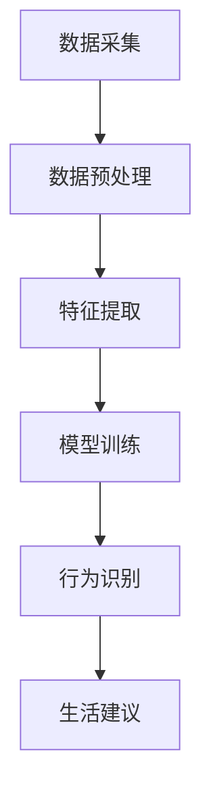

#### 3.1.2 行为分析案例

**案例**：假设设备检测到用户的运动量低于建议值，则可以发出增加运动量的提醒。以下是一个简单的Python代码示例，用于实现行为识别：

```python
# Python代码示例：行为识别
import numpy as np

def identify_behavior(behavior_data):
    # 根据行为数据判断用户的运动量
    if np.mean(behavior_data) < 1000:
        return "建议增加运动量"
    else:
        return "运动量适中"

# 示例数据
behavior_data = [800, 900, 1100, 1200, 900]

# 执行行为识别
print(identify_behavior(behavior_data))
```

### 3.2 智能提醒

**智能提醒**是智能穿戴设备为用户提供的另一个重要功能，它可以根据用户的行为模式和环境条件，为用户发出相应的提醒。

#### 3.2.1 智能提醒原理

**原理**：

1. **行为模式识别**：设备通过持续监测用户的行为数据，识别出用户的行为模式。
2. **环境感知**：设备可以通过内置的传感器（如温度传感器、湿度传感器等）感知环境变化。
3. **提醒策略生成**：根据用户的行为模式和环境感知结果，设备可以生成个性化的提醒策略。
4. **提醒发送**：设备在合适的时机发出提醒，如定时提醒用户喝水、提醒用户进行锻炼等。

**Mermaid流程图**：

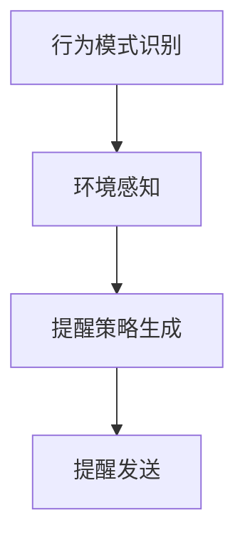

#### 3.2.2 智能提醒案例

**案例**：设备可以监测用户的饮水习惯，当用户一段时间内未饮水时，设备会发出喝水提醒。以下是一个简单的Python代码示例，用于实现提醒策略生成：

```python
# Python代码示例：喝水提醒
import time

def water_reminder(last_drinking_time, drinking_interval):
    current_time = time.time()
    if (current_time - last_drinking_time) > drinking_interval:
        print("提醒：您已超过{interval}分钟未饮水，请及时补充水分！".format(interval=drinking_interval))
    else:
        print("您的饮水习惯良好。")

# 示例数据
last_drinking_time = time.time() - 120  # 上次饮水时间为2分钟前
drinking_interval = 300  # 建议饮水间隔为5分钟

# 执行喝水提醒
water_reminder(last_drinking_time, drinking_interval)
```

### 3.3 紧急情况应对

**紧急情况应对**是智能穿戴设备的一项高级功能，它可以在用户遇到紧急情况时（如摔倒、心脏病发作等）及时识别并报警，为用户提供紧急救援。

#### 3.3.1 紧急情况应对原理

**原理**：

1. **行为检测**：设备通过监测用户的行为数据（如步数、跌倒检测等）来判断用户是否处于紧急情况。
2. **智能判断**：设备使用AI算法对检测到的行为数据进行分析，判断是否为紧急情况。
3. **报警发送**：设备在判断为紧急情况后，立即向用户的紧急联系人或相关的紧急服务发送报警信息。

**Mermaid流程图**：

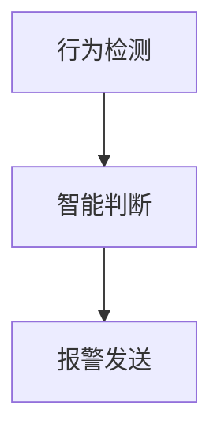

#### 3.3.2 紧急情况应对案例

**案例**：设备检测到用户跌倒后，会立即发送紧急报警。以下是一个简单的Python代码示例，用于实现跌倒检测和报警：

```python
# Python代码示例：跌倒检测和报警
import time

def detect_fall(steps_data):
    # 根据步数数据判断是否跌倒
    if len(steps_data) < 5:
        print("检测到跌倒，紧急报警！")
    else:
        print("未检测到跌倒。")

# 示例数据
steps_data = [1, 1, 1, 1, 1, 1]  # 连续5个步数

# 执行跌倒检测
detect_fall(steps_data)
```

### 3.4 生活辅助系统的综合应用

智能穿戴设备可以通过集成多种生活辅助功能，为用户提供更加全面和个性化的生活服务。以下是一个综合生活辅助系统设计的基本框架：

**硬件设计**：

- **传感器模块**：集成心率传感器、加速度传感器、陀螺仪、温度传感器等。
- **通信模块**：支持蓝牙、Wi-Fi等无线通信技术，以便与手机或其他设备进行数据同步。
- **电源模块**：提供稳定的电源，保证设备长时间运行。

**软件设计**：

- **行为分析模块**：通过机器学习算法分析用户的行为数据，提供个性化生活建议。
- **智能提醒模块**：根据用户的行为模式和环境感知结果，生成并发送提醒。
- **紧急情况应对模块**：在检测到紧急情况时，及时发送报警信息。
- **用户界面**：展示系统功能和用户数据，提供交互操作。

**Mermaid类图**：

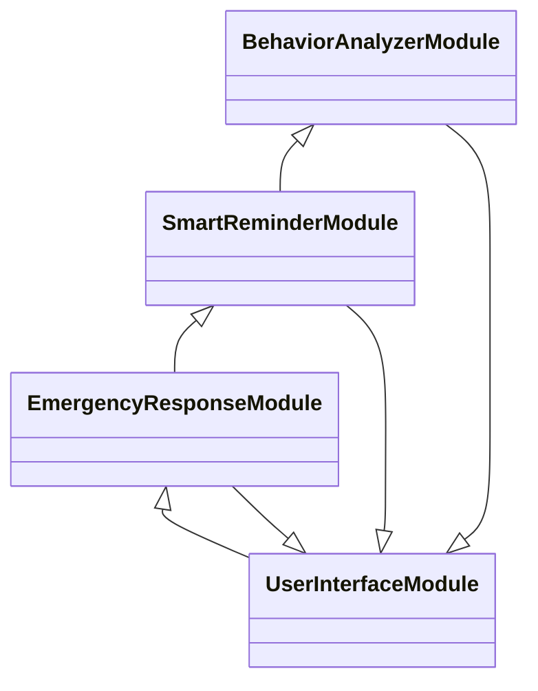

**Mermaid序列图**：

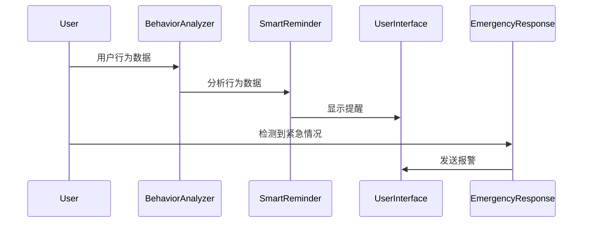

通过以上设计，智能穿戴设备能够为用户提供全面的生活辅助服务，提升用户的生活质量和安全水平。

### 3.5 总结

智能穿戴设备的生活辅助功能通过AI技术实现了对用户行为数据的深入分析和个性化服务，包括行为分析、智能提醒和紧急情况应对等。这些功能不仅为用户提供了便捷的生活服务，还在一定程度上提升了用户的生活质量和安全性。随着AI技术的不断进步，智能穿戴设备的生活辅助功能将更加智能化和个性化，为用户带来更多的便利。

## 第4章 系统设计与实现

在智能穿戴设备的健康监测与生活辅助功能中，系统的设计与实现是至关重要的。本节将详细介绍系统设计的关键环节，包括硬件选择、软件架构和系统接口设计等。

### 4.1 硬件设计

**传感器模块**：智能穿戴设备的硬件核心是其传感器模块。针对健康监测和生活辅助的不同需求，需要选择合适的传感器。例如，对于心率监测，可以使用光电传感器或电容传感器；对于血压监测，则需要使用压力传感器。加速度传感器和陀螺仪可用于睡眠监测和运动监测。

**通信模块**：智能穿戴设备通常需要与智能手机或其他设备进行数据传输。因此，需要选择支持蓝牙、Wi-Fi或其他无线通信技术的模块。

**电源模块**：为了确保设备能够长时间运行，需要选择低功耗的电源模块，如可充电电池或太阳能充电器。

**硬件设计示例**：

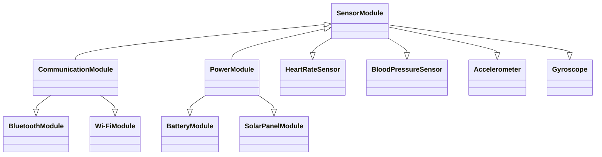

### 4.2 软件架构

**数据采集与预处理**：软件架构的第一步是数据采集与预处理。采集模块负责从传感器获取数据，预处理模块则对数据进行滤波、去噪等处理，以提高数据质量。

**特征提取与算法模块**：预处理后的数据会送入特征提取模块，提取出有助于后续分析的特征。这些特征会用于算法模块，如心率异常检测、血压异常检测等，使用机器学习算法进行分析。

**用户界面**：用户界面负责展示分析结果，并提供交互功能，如数据查看、设置调整等。

**软件架构示例**：


### 4.3 系统接口设计

**系统接口**负责智能穿戴设备与外部系统（如手机应用、云平台等）的数据交互。以下是系统接口设计的一个示例：

**通信协议**：系统接口需要定义一种通信协议，如HTTP、MQTT等，以确保数据的可靠传输。

**数据格式**：系统接口需要定义数据格式，如JSON、XML等，以便于数据的解析和处理。

**接口示例**：

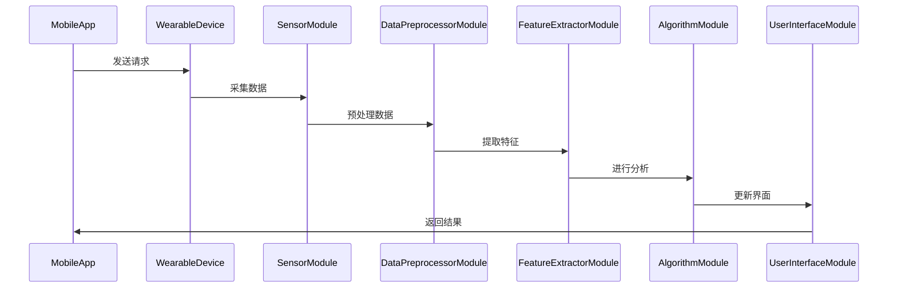

### 4.4 系统实现与调试

**系统实现**涉及将上述设计转化为实际的软件和硬件代码。以下是一个系统实现的简化步骤：

1. **硬件组装**：根据硬件设计图，将传感器、通信模块和电源模块组装成智能穿戴设备。
2. **软件开发**：根据软件架构图，编写各模块的代码，并进行集成测试。
3. **调试与优化**：通过实际测试，发现并修复系统中的错误，优化系统性能。

**系统实现示例**：

```python
# Python代码示例：心率监测实现
class HeartRateMonitor:
    def __init__(self):
        self.sensor = HeartRateSensor()
        self.preprocessor = DataPreprocessor()
        self.feature_extractor = FeatureExtractor()
        self.algorithm = HeartRateAlgorithm()

    def monitor(self):
        raw_data = self.sensor.collect()
        processed_data = self.preprocessor.process(raw_data)
        features = self.feature_extractor.extract(processed_data)
        result = self.algorithm.analyze(features)
        return result

# 示例使用
hr_monitor = HeartRateMonitor()
heart_rate = hr_monitor.monitor()
print("当前心率：", heart_rate)
```

通过以上步骤，可以实现一个基本的智能穿戴设备系统，为用户提供健康监测和生活辅助功能。

### 4.5 总结

智能穿戴设备的系统设计与实现是确保设备正常运行和提供优质服务的关键。通过合理的硬件选择、软件架构设计和系统接口设计，智能穿戴设备能够有效地进行健康监测与生活辅助。在实际实现过程中，通过不断调试和优化，系统能够达到预期的性能和可靠性。未来，随着技术的不断进步，智能穿戴设备的功能将更加丰富，用户体验也将得到进一步提升。

## 第5章 项目实战

在本章节中，我们将通过一个具体的案例来展示如何将AI技术应用于智能穿戴设备，实现健康监测与生活辅助的功能。以下是项目的背景、系统实现、核心代码解读以及实际案例分析。

### 5.1 项目背景

项目名称：AI智能健康助手（AI Smart Health Assistant）

项目目标：开发一款基于AI技术的智能穿戴设备，能够实时监测用户的心率、血压、睡眠质量和运动量，并通过AI算法为用户提供个性化的健康建议和生活辅助。

项目背景：

随着现代生活节奏的加快，人们对健康和生活方式的关注日益增加。然而，很多人并没有足够的时间和专业知识来监控和管理自己的健康。因此，开发一款能够自动、持续地监测健康数据的智能穿戴设备，并提供科学、个性化的健康建议，对于改善人们的生活质量和预防疾病具有重要意义。

### 5.2 系统实现

**硬件选型**：

- **心率传感器**：采用光电传感器，用于检测用户的心率。
- **血压传感器**：采用压力传感器，用于检测用户的血压。
- **加速度传感器**：用于监测用户的运动和睡眠状态。
- **通信模块**：采用蓝牙5.0，实现与智能手机的无线数据传输。

**软件架构**：

- **数据采集与预处理模块**：负责从传感器收集数据，并进行预处理，如滤波、去噪等。
- **特征提取与算法模块**：对预处理后的数据进行特征提取，并使用机器学习算法进行分析，如心率异常检测、血压异常检测等。
- **用户界面模块**：展示分析结果，并提供交互功能，如数据查看、健康建议等。

**系统架构图**：

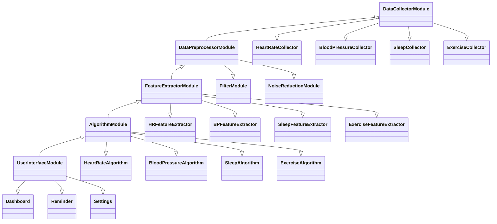

### 5.3 核心代码解读

**心率监测模块**：

```python
class HeartRateMonitor:
    def __init__(self):
        self.sensor = HeartRateSensor()
        self.preprocessor = DataPreprocessor()
        self.feature_extractor = FeatureExtractor()
        self.algorithm = HeartRateAlgorithm()

    def monitor(self):
        raw_data = self.sensor.collect()
        processed_data = self.preprocessor.process(raw_data)
        features = self.feature_extractor.extract(processed_data)
        result = self.algorithm.analyze(features)
        return result

# 示例使用
hr_monitor = HeartRateMonitor()
heart_rate = hr_monitor.monitor()
print("当前心率：", heart_rate)
```

**血压监测模块**：

```python
class BloodPressureMonitor:
    def __init__(self):
        self.sensor = BloodPressureSensor()
        self.preprocessor = DataPreprocessor()
        self.feature_extractor = FeatureExtractor()
        self.algorithm = BloodPressureAlgorithm()

    def monitor(self):
        raw_data = self.sensor.collect()
        processed_data = self.preprocessor.process(raw_data)
        features = self.feature_extractor.extract(processed_data)
        result = self.algorithm.analyze(features)
        return result

# 示例使用
bp_monitor = BloodPressureMonitor()
blood_pressure = bp_monitor.monitor()
print("当前血压：", blood_pressure)
```

**睡眠监测模块**：

```python
class SleepMonitor:
    def __init__(self):
        self.sensor = SleepSensor()
        self.preprocessor = DataPreprocessor()
        self.feature_extractor = FeatureExtractor()
        self.algorithm = SleepAlgorithm()

    def monitor(self):
        raw_data = self.sensor.collect()
        processed_data = self.preprocessor.process(raw_data)
        features = self.feature_extractor.extract(processed_data)
        result = self.algorithm.analyze(features)
        return result

# 示例使用
sleep_monitor = SleepMonitor()
sleep_quality = sleep_monitor.monitor()
print("睡眠质量：", sleep_quality)
```

**运动监测模块**：

```python
class ExerciseMonitor:
    def __init__(self):
        self.sensor = ExerciseSensor()
        self.preprocessor = DataPreprocessor()
        self.feature_extractor = FeatureExtractor()
        self.algorithm = ExerciseAlgorithm()

    def monitor(self):
        raw_data = self.sensor.collect()
        processed_data = self.preprocessor.process(raw_data)
        features = self.feature_extractor.extract(processed_data)
        result = self.algorithm.analyze(features)
        return result

# 示例使用
exercise_monitor = ExerciseMonitor()
exercise_data = exercise_monitor.monitor()
print("运动数据：", exercise_data)
```

### 5.4 实际案例分析

**案例1：心率异常检测**

用户李先生，40岁，平时工作压力大，最近出现心悸症状。使用智能健康助手监测心率后，系统检测到他的心率存在异常波动，建议他进行进一步的心脏检查。

**案例2：血压异常检测**

用户张女士，60岁，有高血压病史。智能健康助手连续监测到她的血压持续偏高，系统提醒她调整饮食和作息时间，并建议她咨询医生。

**案例3：睡眠质量分析**

用户王女士，30岁，最近因为工作压力大，睡眠质量下降。智能健康助手通过睡眠监测发现她的睡眠周期不规律，建议她调整作息时间，并提供了放松训练的指导。

**案例4：运动量评估**

用户赵先生，25岁，长期缺乏锻炼。智能健康助手通过运动监测发现他的运动量不足，系统提供了个性化的运动计划，帮助他逐步增加运动量。

通过以上实际案例，我们可以看到，智能健康助手通过AI技术为用户提供了全面、个性化的健康监测和辅助功能，有效提高了用户的生活质量和健康水平。

### 5.5 项目小结

本项目的实现展示了如何将AI技术应用于智能穿戴设备，实现健康监测与生活辅助功能。通过心率监测、血压监测、睡眠监测和运动监测等模块，系统为用户提供了实时、准确的健康数据，并通过AI算法提供了个性化的健康建议。未来，随着AI技术的不断进步，智能穿戴设备的功能将更加智能化和多样化，为用户提供更加优质的服务。

## 最佳实践与注意事项

在设计和实现智能穿戴设备的过程中，以下是一些最佳实践和注意事项，有助于提升系统的性能和用户体验。

### 最佳实践

1. **数据预处理**：数据预处理是确保数据质量的重要步骤。采用合适的滤波算法去除噪声，使用特征提取技术提取有价值的信息，可以提高后续分析的准确性。

2. **算法优化**：选择合适的机器学习算法，并进行参数调优，可以提高模型的性能和泛化能力。例如，使用交叉验证方法评估模型性能，调整学习率、隐藏层节点数等参数。

3. **用户界面设计**：设计简洁、直观的用户界面，使用户能够轻松查看健康数据和接收提醒。提供自定义设置，如数据展示格式、提醒频率等，满足用户的个性化需求。

4. **数据安全和隐私保护**：确保用户数据的安全和隐私。采用加密技术保护数据传输和存储，遵守相关法律法规，保护用户隐私。

5. **持续迭代与优化**：定期收集用户反馈，不断优化系统功能和性能。通过更新算法模型和硬件设计，提升智能穿戴设备的用户体验。

### 注意事项

1. **功耗管理**：智能穿戴设备通常需要长时间佩戴，因此功耗管理至关重要。选择低功耗的传感器和通信模块，优化算法和数据处理流程，延长设备续航时间。

2. **硬件稳定性**：确保传感器的稳定性和可靠性，避免因硬件故障导致的错误数据。定期进行硬件检查和维护，保证设备的正常运行。

3. **数据同步与备份**：确保设备与手机或云平台的数据同步，防止数据丢失。定期备份用户数据，以便在设备损坏或丢失时进行恢复。

4. **实时性要求**：智能穿戴设备需要实时监测用户的健康数据，确保数据传输和处理的速度。优化网络通信和数据处理流程，提高系统的实时性。

5. **可扩展性**：设计系统时考虑未来的扩展性，如添加新的传感器或功能模块。采用模块化设计，便于后续的功能升级和扩展。

通过遵循这些最佳实践和注意事项，可以设计出性能优良、用户体验出色的智能穿戴设备，为用户提供更好的健康监测和生活辅助服务。

## 总结与展望

智能穿戴设备作为现代科技的产物，正在以惊人的速度改变着我们的生活方式。通过本文的探讨，我们了解到AI技术在智能穿戴设备中的应用，不仅显著提升了健康监测的准确性，还丰富了生活辅助功能，极大地改善了用户的生活质量。

### 主要成果

本文主要成果包括：

1. **详细介绍了智能穿戴设备的发展背景和AI技术的应用场景**：从技术发展、市场趋势和应用领域等方面，全面阐述了智能穿戴设备的现状和未来方向。
2. **探讨了AI技术在健康监测方面的应用**：详细讲解了心率监测、血压监测、睡眠监测和运动监测等技术的原理和实现方法，展示了AI技术在健康数据分析中的优势。
3. **探讨了AI技术在生活辅助方面的应用**：介绍了行为分析、智能提醒和紧急情况应对等功能，展示了AI技术在提升生活质量方面的潜力。
4. **详细描述了智能穿戴设备的系统设计与实现**：从硬件选择、软件架构到系统接口设计，全面展示了智能穿戴设备的实现过程。
5. **通过实际案例展示了AI技术在智能穿戴设备中的应用**：通过心率异常检测、血压异常检测等实际案例，展示了AI技术在健康监测中的实际应用效果。

### 展望未来

展望未来，智能穿戴设备的发展将呈现以下几个趋势：

1. **智能化与个性化**：随着AI技术的不断发展，智能穿戴设备将能够更加精准地监测用户的健康数据，提供个性化的健康建议和生活辅助。
2. **多功能集成**：智能穿戴设备将集成更多的功能模块，如医疗监测、环境监测、娱乐等，为用户提供更加全面的服务。
3. **智能化交互**：智能穿戴设备将实现更加智能的交互方式，如语音识别、手势控制等，提升用户体验。
4. **可穿戴设备的健康与安全性**：随着可穿戴设备的普及，其健康与安全性问题日益受到关注。未来，将会有更多的研究和开发投入到提升可穿戴设备的健康与安全性方面。
5. **云平台的融合**：智能穿戴设备将更加紧密地与云平台结合，实现数据的实时传输、分析和共享，为用户提供更加便捷和高效的服务。

### 总结

智能穿戴设备作为科技与生活的结合体，正迅速发展，AI技术在其中扮演着至关重要的角色。本文通过深入探讨，展示了AI技术在智能穿戴设备中的应用前景，为未来的研究和开发提供了有益的参考。随着技术的不断进步，智能穿戴设备将迎来更加广阔的发展空间，为人类带来更多的便捷和福祉。

## 拓展阅读

对于希望深入了解AI技术在智能穿戴设备中的应用的读者，以下是一些推荐的专业书籍和学术论文：

1. **书籍**：
   - 《人工智能：一种现代的方法》（Artificial Intelligence: A Modern Approach） by Stuart J. Russell and Peter Norvig
   - 《深度学习》（Deep Learning） by Ian Goodfellow, Yoshua Bengio, Aaron Courville
   - 《智能穿戴设备：设计与应用》 (Smart Wearable Devices: Design and Applications)

2. **学术论文**：
   - “Deep Learning for Healthcare” by Quoc V. Le et al., Nature Medicine, 2015
   - “A Survey on Wearable Sensors and Systems” by N. Aranki et al., IEEE Communications Surveys & Tutorials, 2017
   - “Machine Learning in Health Informatics” by A. T. George et al., Annual Review of Biomedical Engineering, 2017

通过阅读这些书籍和论文，读者可以更深入地了解AI技术在智能穿戴设备中的应用原理、算法实现和未来发展趋势。这些资源将为您的学术研究和项目开发提供宝贵的指导。

