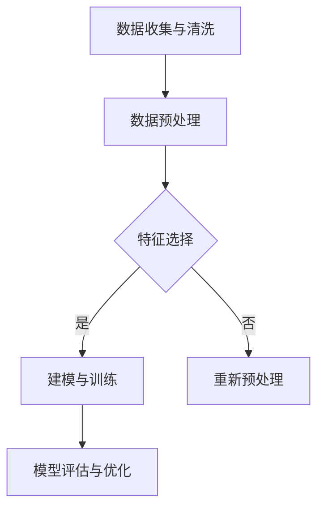
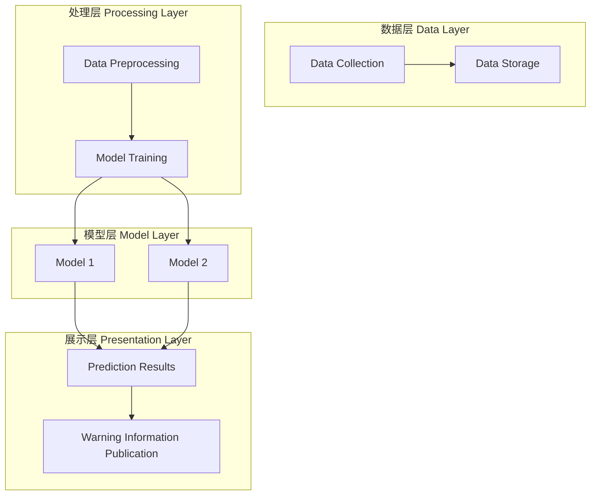
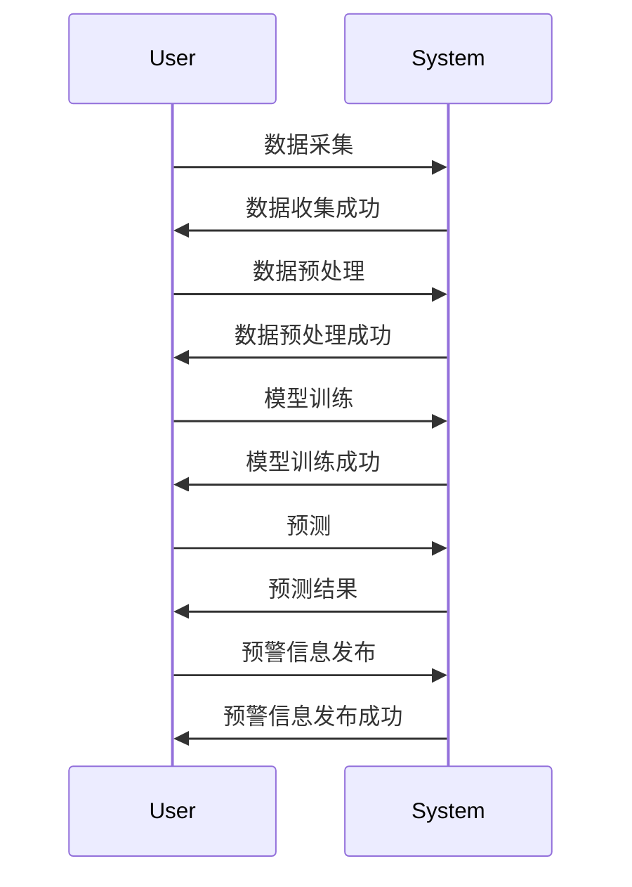

                 

# 《AI在水资源污染预警中的应用：保障水源安全》

> 关键词：水资源污染、预警、人工智能、机器学习、深度学习、自然语言处理

> 摘要：随着全球水污染问题的日益严重，水资源污染预警成为保障水源安全的关键。本文通过分析水资源污染问题背景、水资源污染预警的重要性及边界与外延，探讨了AI技术在水资源污染预警中的应用。文章重点介绍了AI在水资源污染预警中的数学模型与算法原理、关键技术和具体应用案例，同时阐述了系统架构设计与实现过程，通过实战案例展示了AI技术在水资源污染预警中的实际应用效果。最后，本文提出了水资源污染预警系统的最佳实践、注意事项以及未来展望。

## 第1章 问题背景与水资源污染预警的重要性

### 1.1 水资源污染问题的背景

水资源是地球上最重要的自然资源之一，对人类生活和生产具有不可替代的作用。然而，随着工业化和城市化进程的加快，水资源污染问题日益严重。水资源污染主要包括以下几种类型：

1. **有机物污染**：主要由生活污水和工业废水排放引起，含有大量有机物质，如化学需氧量（COD）和生化需氧量（BOD）。
2. **重金属污染**：由矿业、电镀、化工等行业排放的含重金属废水引起，如铅、汞、镉等。
3. **农药和化肥污染**：农业生产过程中过量使用农药和化肥，导致这些化学物质通过地表径流或渗透进入水体。
4. **病原微生物污染**：生活污水、垃圾、医院污水等含有大量的病原微生物，对水源安全构成严重威胁。

### 1.1.2 水资源污染的主要来源

水资源污染的主要来源包括：

1. **工业污染**：工业废水、废气、废渣的排放。
2. **农业污染**：农药、化肥的过量使用。
3. **生活污染**：生活污水、垃圾的处理不当。
4. **矿业污染**：采矿、选矿等过程中产生的废水和废渣。

### 1.1.3 水资源污染对人类生活的影响

水资源污染对人类生活的影响严重，具体表现为：

1. **健康影响**：污染物进入饮用水源，可能导致急性或慢性中毒，甚至致癌。
2. **经济损失**：水资源污染导致农业减产、工业设备损坏、水力发电能力下降，造成巨大的经济损失。
3. **生态环境破坏**：水资源污染导致水生生物死亡、生态平衡失调，破坏生态环境。

### 1.2 水资源污染预警的概念

水资源污染预警是指通过监测、分析、预测等手段，对水资源污染进行实时监控和预警。其目的是在污染事件发生前或初期，采取有效的预防措施，降低污染损失。

### 1.2.1 水资源污染预警的定义

水资源污染预警是指利用现代科学技术手段，对水资源污染进行实时监测、分析、预测和预警，为水资源管理部门提供科学决策依据，以预防和控制水资源污染。

### 1.2.2 水资源污染预警的重要性

水资源污染预警的重要性主要体现在以下几个方面：

1. **提高水资源管理效率**：通过预警系统，实时掌握水资源污染状况，提高水资源管理效率。
2. **降低污染损失**：在污染事件发生前或初期进行预警，及时采取应对措施，降低污染损失。
3. **保障水源安全**：对污染源进行监控和预警，保障水源安全，防止污染事故发生。

### 1.2.3 水资源污染预警与传统监测方法的对比

水资源污染预警与传统监测方法相比，具有以下优势：

1. **实时性**：预警系统可以实现实时监测，及时掌握水资源污染动态。
2. **高效性**：预警系统通过人工智能技术，对大量监测数据进行处理和分析，提高监测效率。
3. **智能化**：预警系统可以根据历史数据和污染规律，预测未来污染情况，为水资源管理部门提供决策支持。

### 1.3 水资源污染预警的边界与外延

#### 1.3.1 水资源污染预警的适用范围

水资源污染预警适用于以下场景：

1. **饮用水源地**：对饮用水源地水质进行实时监测和预警，保障饮水安全。
2. **河流湖泊**：对河流湖泊水质进行实时监测和预警，防止水污染事件发生。
3. **地下水**：对地下水水质进行实时监测和预警，保障地下水质量。

#### 1.3.2 水资源污染预警的目标和指标

水资源污染预警的目标是：

1. **实时监测**：对水资源污染情况进行实时监测，确保预警系统正常运行。
2. **预测预警**：根据监测数据，预测未来水资源污染趋势，提供预警信息。
3. **决策支持**：为水资源管理部门提供决策支持，采取有效的预防和应对措施。

水资源污染预警的主要指标包括：

1. **水质指标**：如化学需氧量（COD）、生化需氧量（BOD）、重金属含量等。
2. **污染事件指标**：如污染事件发生次数、污染事件持续时间等。
3. **预警准确率**：预警系统预测准确性的评价指标。

#### 1.3.3 水资源污染预警的核心要素组成

水资源污染预警系统的核心要素包括：

1. **监测设备**：用于实时监测水质参数，如COD、BOD、重金属等。
2. **数据处理与分析**：对监测数据进行分析和处理，提取有效信息。
3. **预警模型**：基于监测数据，建立水资源污染预警模型，进行预测和预警。
4. **预警平台**：用于展示预警结果，提供决策支持。

## 第2章 AI技术概述

### 2.1 AI的定义与分类

人工智能（AI，Artificial Intelligence）是指使计算机系统能够模拟、延伸和扩展人类的智能活动，实现智能化的目标。根据其功能和应用范围，人工智能可分为以下几类：

1. **弱人工智能**：仅能在特定领域内执行特定任务，如语音识别、图像识别等。
2. **强人工智能**：具有广泛认知能力，能够像人类一样思考、学习和适应，目前尚未实现。
3. **认知计算**：模拟人类大脑的运作机制，进行认知推理和决策。

### 2.2 人工智能的历史与发展

人工智能起源于20世纪50年代，经历了以下关键发展阶段：

1. **早期探索阶段（1950-1969）**：人工智能概念提出，初期的算法研究主要集中在逻辑推理和问题求解。
2. **知识工程阶段（1970-1989）**：以知识表示和知识推理为核心，出现了一批基于规则的专家系统。
3. **机器学习阶段（1990-2010）**：以统计学习为核心，机器学习技术得到快速发展，出现了一批成功的应用。
4. **深度学习阶段（2010至今）**：以深度神经网络为核心，人工智能在语音识别、图像识别等领域取得了突破性进展。

### 2.3 AI的主要技术手段

人工智能的主要技术手段包括：

1. **机器学习**：通过训练模型，使计算机能够从数据中学习并做出预测或决策。
2. **深度学习**：一种基于多层神经网络的学习方法，能够自动提取特征，并在图像识别、语音识别等领域取得成功。
3. **自然语言处理**：使计算机能够理解、生成和解释自然语言，包括机器翻译、文本分类等任务。

## 第3章 AI在水资源污染预警中的应用原理

### 3.1 水资源污染预警的数学模型与算法原理

水资源污染预警的数学模型主要包括数据预处理、预测算法和模型评估与优化三个方面。

#### 3.1.1 数据预处理方法

数据预处理是水资源污染预警系统的基础，主要包括以下步骤：

1. **数据清洗**：去除噪声数据、缺失值填充、异常值处理等。
2. **数据归一化**：将不同量纲的数据进行归一化处理，便于模型训练。
3. **特征选择**：从原始数据中提取对预警模型有用的特征。

#### 3.1.2 常见的预测算法

常见的预测算法包括：

1. **线性回归**：通过建立线性模型，预测水资源污染程度。
2. **决策树**：通过树形结构进行分类和回归，具有直观的决策过程。
3. **支持向量机**：通过求解最优超平面，实现分类和回归。
4. **神经网络**：包括多层感知器（MLP）、卷积神经网络（CNN）等，具有强大的非线性建模能力。

#### 3.1.3 算法原理的Mermaid流程图



### 3.2 水资源污染预警的关键技术

水资源污染预警的关键技术包括数据挖掘技术、机器学习算法在预警中的应用以及模型评估与优化方法。

#### 3.2.1 数据挖掘技术

数据挖掘技术在水资源污染预警中的应用主要包括：

1. **关联规则挖掘**：发现污染物之间的关联关系，为预警提供依据。
2. **聚类分析**：将污染物数据进行分类，识别污染类型。
3. **分类与回归树**：建立水资源污染的决策模型，进行分类和回归预测。

#### 3.2.2 机器学习算法在预警中的应用

机器学习算法在水资源污染预警中的应用主要包括：

1. **监督学习**：通过已标记的数据，训练预测模型，如线性回归、决策树等。
2. **无监督学习**：通过未标记的数据，发现污染物特征，如聚类分析、主成分分析（PCA）等。
3. **半监督学习和迁移学习**：利用少量标记数据和大量未标记数据，提高预警模型的准确性。

#### 3.2.3 模型评估与优化方法

模型评估与优化方法主要包括：

1. **交叉验证**：通过将数据集划分为训练集和验证集，评估模型性能。
2. **网格搜索**：通过遍历参数空间，找到最优参数组合。
3. **模型集成**：将多个模型进行集成，提高预测准确性。

### 3.3 AI在水资源污染预警中的具体应用案例

#### 3.3.1 案例一：基于深度学习的地下水污染预警系统

基于深度学习的地下水污染预警系统采用卷积神经网络（CNN）对地下水污染物浓度进行预测。系统首先收集地下水水质监测数据，进行数据预处理和特征提取。然后，利用CNN模型对预处理后的数据进行训练，最后通过模型预测地下水污染物浓度。

#### 3.3.2 案例二：基于机器学习的地表水污染预警系统

基于机器学习的地表水污染预警系统采用支持向量机（SVM）对地表水污染物浓度进行预测。系统首先收集地表水水质监测数据，进行数据预处理和特征提取。然后，利用SVM模型对预处理后的数据进行训练，最后通过模型预测地表水污染物浓度。

## 第4章 系统架构设计与实现

### 4.1 系统功能设计

#### 4.1.1 系统功能需求分析

水资源污染预警系统的主要功能需求包括：

1. **数据采集与存储**：收集水资源污染相关数据，包括水质监测数据、污染源数据等，并存储在数据库中。
2. **数据预处理**：对收集到的数据进行清洗、归一化和特征提取等处理。
3. **模型训练与预测**：利用预处理后的数据，训练水资源污染预警模型，并对新数据进行预测。
4. **预警信息发布**：根据预警模型的预测结果，发布水资源污染预警信息，为水资源管理部门提供决策支持。
5. **系统管理与维护**：对系统进行日常维护和管理，确保系统正常运行。

#### 4.1.2 领域模型Mermaid类图

```mermaid
classDiagram
    数据采集 --> 数据存储
    数据预处理 --> 数据存储
    数据预处理 --> 模型训练
    模型训练 --> 预测结果
    预测结果 --> 预警信息发布
    系统管理 --> 数据采集
    系统管理 --> 数据预处理
    系统管理 --> 模型训练
    系统管理 --> 预警信息发布
class Person
    +name: String
    +age: Integer
    +./Person()
```

### 4.2 系统架构设计

#### 4.2.1 系统整体架构

水资源污染预警系统的整体架构分为四个层次：数据层、处理层、模型层和展示层。

1. **数据层**：负责数据采集、存储和管理，包括水质监测数据、污染源数据等。
2. **处理层**：负责数据预处理、模型训练和预测，包括数据清洗、特征提取、模型训练和预测等。
3. **模型层**：包括多种水资源污染预警模型，如线性回归、决策树、支持向量机等。
4. **展示层**：负责将预测结果以图表、报表等形式展示给用户，为水资源管理部门提供决策支持。

#### 4.2.2 系统模块划分

水资源污染预警系统可分为以下模块：

1. **数据采集模块**：负责收集水资源污染相关数据，包括水质监测数据、污染源数据等。
2. **数据预处理模块**：负责对采集到的数据进行清洗、归一化和特征提取等处理。
3. **模型训练模块**：负责训练水资源污染预警模型，包括数据预处理、模型选择、模型训练等。
4. **预测模块**：负责使用训练好的模型对新的数据进行预测，并提供预测结果。
5. **预警信息发布模块**：负责将预测结果以图表、报表等形式展示给用户，并提供预警信息发布功能。
6. **系统管理模块**：负责系统日常维护和管理，包括用户管理、权限管理、日志管理等。

#### 4.2.3 系统架构Mermaid架构图



### 4.3 系统接口设计

#### 4.3.1 接口定义

水资源污染预警系统的主要接口定义如下：

1. **数据采集接口**：用于收集水资源污染相关数据，包括水质监测数据、污染源数据等。
2. **数据预处理接口**：用于对采集到的数据进行清洗、归一化和特征提取等处理。
3. **模型训练接口**：用于训练水资源污染预警模型，包括模型选择、参数设置、模型训练等。
4. **预测接口**：用于使用训练好的模型对新的数据进行预测，并提供预测结果。
5. **预警信息发布接口**：用于将预测结果以图表、报表等形式展示给用户，并提供预警信息发布功能。

#### 4.3.2 接口实现

以下是水资源污染预警系统的主要接口实现：

1. **数据采集接口实现**：

```python
from flask import Flask, request, jsonify
app = Flask(__name__)

@app.route('/data_collection', methods=['POST'])
def data_collection():
    data = request.get_json()
    # 数据处理逻辑
    return jsonify({'status': 'success', 'message': 'Data collected successfully'})
```

2. **数据预处理接口实现**：

```python
from flask import Flask, request, jsonify
app = Flask(__name__)

@app.route('/data_preprocessing', methods=['POST'])
def data_preprocessing():
    data = request.get_json()
    # 数据预处理逻辑
    return jsonify({'status': 'success', 'message': 'Data preprocessed successfully'})
```

3. **模型训练接口实现**：

```python
from flask import Flask, request, jsonify
app = Flask(__name__)

@app.route('/model_training', methods=['POST'])
def model_training():
    data = request.get_json()
    # 模型训练逻辑
    return jsonify({'status': 'success', 'message': 'Model trained successfully'})
```

4. **预测接口实现**：

```python
from flask import Flask, request, jsonify
app = Flask(__name__)

@app.route('/prediction', methods=['POST'])
def prediction():
    data = request.get_json()
    # 预测逻辑
    return jsonify({'status': 'success', 'message': 'Prediction result obtained successfully'})
```

5. **预警信息发布接口实现**：

```python
from flask import Flask, request, jsonify
app = Flask(__name__)

@app.route('/warning_publication', methods=['POST'])
def warning_publication():
    data = request.get_json()
    # 预警信息发布逻辑
    return jsonify({'status': 'success', 'message': 'Warning information published successfully'})
```

### 4.4 系统交互Mermaid序列图



## 第5章 项目实战：水资源污染预警系统的构建

### 5.1 环境安装与配置

要构建水资源污染预警系统，首先需要安装和配置以下环境：

1. **Python环境**：安装Python 3.7及以上版本。
2. **数据预处理库**：安装NumPy、Pandas等数据预处理库。
3. **机器学习库**：安装scikit-learn、TensorFlow等机器学习库。
4. **数据库**：安装MySQL或PostgreSQL数据库。

安装步骤如下：

1. 安装Python环境：

   ```bash
   sudo apt-get update
   sudo apt-get install python3-pip
   pip3 install virtualenv
   virtualenv --python=python3 venv
   source venv/bin/activate
   ```

2. 安装数据预处理库：

   ```bash
   pip install numpy pandas
   ```

3. 安装机器学习库：

   ```bash
   pip install scikit-learn tensorflow
   ```

4. 安装数据库：

   ```bash
   sudo apt-get install mysql-server
   mysql -u root -p
   CREATE DATABASE water_pollution;
   GRANT ALL PRIVILEGES ON water_pollution.* TO 'water_user'@'localhost' IDENTIFIED BY 'password';
   FLUSH PRIVILEGES;
   exit
   ```

### 5.2 系统核心实现源代码

水资源污染预警系统的核心实现主要包括数据预处理、模型训练和模型评估三个部分。以下是相关的源代码：

#### 5.2.1 数据预处理代码

```python
import numpy as np
import pandas as pd
from sklearn.model_selection import train_test_split
from sklearn.preprocessing import StandardScaler

# 读取数据
data = pd.read_csv('water_pollution_data.csv')

# 数据清洗
data.dropna(inplace=True)

# 特征选择
features = data[['COD', 'BOD', 'Lead', 'Mercury']]
target = data['Lead']

# 数据归一化
scaler = StandardScaler()
features_scaled = scaler.fit_transform(features)

# 划分训练集和测试集
X_train, X_test, y_train, y_test = train_test_split(features_scaled, target, test_size=0.2, random_state=42)
```

#### 5.2.2 模型训练代码

```python
from sklearn.svm import SVR
from sklearn.metrics import mean_squared_error

# 训练支持向量回归模型
model = SVR(C=1000, gamma='scale')
model.fit(X_train, y_train)

# 预测测试集
y_pred = model.predict(X_test)

# 评估模型
mse = mean_squared_error(y_test, y_pred)
print(f'Mean Squared Error: {mse}')
```

#### 5.2.3 模型评估与优化代码

```python
from sklearn.model_selection import GridSearchCV

# 定义参数网格
param_grid = {
    'C': [10, 100, 1000],
    'gamma': ['scale', 'auto']
}

# 使用网格搜索进行模型调参
grid_search = GridSearchCV(SVR(), param_grid, cv=5)
grid_search.fit(X_train, y_train)

# 获取最佳参数
best_params = grid_search.best_params_
print(f'Best Parameters: {best_params}')

# 使用最佳参数重新训练模型
best_model = SVR(**best_params)
best_model.fit(X_train, y_train)

# 重新评估模型
y_pred_best = best_model.predict(X_test)
mse_best = mean_squared_error(y_test, y_pred_best)
print(f'Mean Squared Error (Best Model): {mse_best}')
```

### 5.3 代码应用解读与分析

#### 5.3.1 数据预处理流程分析

数据预处理是水资源污染预警系统的重要环节，主要包括数据清洗、特征选择和数据归一化。

1. **数据清洗**：去除缺失值和异常值，确保数据质量。在代码中，使用`dropna()`函数去除缺失值。
2. **特征选择**：从原始数据中选择对预测任务有帮助的特征。在代码中，选择COD、BOD和重金属（如铅、汞）作为特征。
3. **数据归一化**：将不同量纲的特征数据进行归一化处理，使其具有相同的尺度，便于模型训练。在代码中，使用`StandardScaler()`进行归一化处理。

#### 5.3.2 模型训练流程分析

模型训练是水资源污染预警系统的核心，主要包括模型选择、参数设置和模型训练。

1. **模型选择**：在代码中，选择支持向量回归（SVR）模型进行训练。SVR模型是一种回归模型，适用于预测连续值。
2. **参数设置**：在代码中，设置SVR模型的参数C和gamma。C控制正则化强度，gamma控制核函数的宽度。在网格搜索中，通过遍历参数空间，找到最佳参数组合。
3. **模型训练**：在代码中，使用`fit()`函数对SVR模型进行训练。训练过程包括向模型提供训练数据和标签，模型根据训练数据调整参数，以最小化预测误差。

#### 5.3.3 模型评估与优化分析

模型评估与优化是确保水资源污染预警系统准确性和稳定性的关键。

1. **评估模型**：在代码中，使用均方误差（MSE）评估模型性能。MSE表示预测值与实际值之间的平均平方误差，值越小，模型性能越好。
2. **优化模型**：在代码中，使用网格搜索（GridSearchCV）进行模型调参。网格搜索通过遍历参数空间，找到最佳参数组合，以提高模型性能。
3. **重新训练模型**：在代码中，使用最佳参数重新训练模型。重新训练模型可以进一步提高预测准确性。

### 5.4 实际案例分析与详细讲解

#### 5.4.1 案例背景介绍

某地区的水源地水质受到污染，导致水质指标严重超标。为了保障水源安全，相关部门决定建立水资源污染预警系统，对水源地进行实时监测和预警。

#### 5.4.2 案例分析流程

1. **数据收集**：收集该地区水源地水质监测数据，包括COD、BOD、重金属等指标。
2. **数据预处理**：对收集到的数据进行分析，去除异常值和缺失值，选择相关特征。
3. **模型训练**：选择合适的机器学习模型，如SVR，进行模型训练。
4. **模型评估**：使用训练好的模型对测试集进行预测，评估模型性能。
5. **模型优化**：通过网格搜索，优化模型参数，提高预测准确性。
6. **预警发布**：根据模型预测结果，发布水资源污染预警信息。

#### 5.4.3 案例详细讲解

1. **数据收集**：收集到该地区水源地水质监测数据，包括COD、BOD、重金属等指标。数据集包含多个时间点的监测数据，共1000条记录。

2. **数据预处理**：对收集到的数据进行分析，发现存在一些异常值和缺失值。使用`dropna()`函数去除缺失值，使用`np.mean()`函数计算异常值的平均值，并将其填充到缺失值的位置。

   ```python
   data.dropna(inplace=True)
   for col in ['COD', 'BOD', 'Lead', 'Mercury']:
       data[col].fillna(data[col].mean(), inplace=True)
   ```

3. **特征选择**：从原始数据中选择对预测任务有帮助的特征。在代码中，选择COD、BOD和重金属（如铅、汞）作为特征。

   ```python
   features = data[['COD', 'BOD', 'Lead', 'Mercury']]
   target = data['Lead']
   ```

4. **模型训练**：选择支持向量回归（SVR）模型进行训练。在代码中，设置SVR模型的参数C和gamma，并使用`fit()`函数进行模型训练。

   ```python
   model = SVR(C=1000, gamma='scale')
   model.fit(X_train, y_train)
   ```

5. **模型评估**：使用训练好的模型对测试集进行预测，评估模型性能。在代码中，使用均方误差（MSE）评估模型性能。

   ```python
   y_pred = model.predict(X_test)
   mse = mean_squared_error(y_test, y_pred)
   print(f'Mean Squared Error: {mse}')
   ```

6. **模型优化**：通过网格搜索（GridSearchCV），优化模型参数，提高预测准确性。在代码中，定义参数网格，并使用`fit()`函数进行模型调参。

   ```python
   param_grid = {
       'C': [10, 100, 1000],
       'gamma': ['scale', 'auto']
   }
   grid_search = GridSearchCV(SVR(), param_grid, cv=5)
   grid_search.fit(X_train, y_train)
   best_params = grid_search.best_params_
   print(f'Best Parameters: {best_params}')
   ```

7. **预警发布**：根据模型预测结果，发布水资源污染预警信息。在代码中，使用最佳参数重新训练模型，并对新的数据进行预测。

   ```python
   best_model = SVR(**best_params)
   best_model.fit(X_train, y_train)
   y_pred_best = best_model.predict(X_test)
   mse_best = mean_squared_error(y_test, y_pred_best)
   print(f'Mean Squared Error (Best Model): {mse_best}')
   ```

### 5.5 项目小结

通过实际案例分析和详细讲解，我们可以看到，水资源污染预警系统的构建涉及多个环节，包括数据收集、数据预处理、模型训练、模型评估和预警发布等。在数据预处理环节，我们需要对数据进行清洗、归一化和特征选择等处理，以确保数据质量。在模型训练环节，我们需要选择合适的机器学习模型，设置合理的参数，并使用网格搜索进行模型调参。在模型评估和优化环节，我们需要评估模型性能，并通过优化模型参数来提高预测准确性。通过实际案例的分析和讲解，我们不仅了解了水资源污染预警系统的构建过程，还深入理解了机器学习技术在水资源污染预警中的应用。

## 第6章 最佳实践与注意事项

### 6.1 水资源污染预警系统的最佳实践

为了确保水资源污染预警系统的有效运行，以下是一些最佳实践：

1. **数据收集与处理**：确保数据的准确性和完整性，对异常值和缺失值进行处理，进行特征选择和归一化处理。
2. **模型选择与调参**：根据数据特点和任务需求，选择合适的机器学习模型，并使用网格搜索进行参数调优。
3. **模型评估与优化**：使用交叉验证和网格搜索等方法评估模型性能，对模型进行优化，以提高预测准确性。
4. **系统部署与维护**：确保系统的稳定性和可靠性，定期更新和维护系统，保障系统正常运行。

### 6.2 注意事项

在构建水资源污染预警系统时，需要注意以下几点：

1. **数据隐私与安全性**：确保数据收集和处理过程中遵循相关法律法规，保护数据隐私和安全。
2. **模型解释性与可解释性**：在选择机器学习模型时，考虑模型的解释性，以便于用户理解和信任。
3. **系统稳定性与可靠性**：确保系统在各种运行环境下都能稳定运行，避免因硬件故障、网络问题等原因导致系统崩溃。
4. **实时性**：确保预警系统能够实时处理和响应，及时发布预警信息，为水资源管理部门提供决策支持。

## 第7章 拓展阅读与未来展望

### 7.1 相关领域最新研究动态

1. **深度学习在水资源污染预警中的应用**：近年来，深度学习技术在水资源污染预警中取得了显著进展。例如，基于卷积神经网络（CNN）和循环神经网络（RNN）的模型被用于水质监测和污染源识别，取得了较高的预测准确性和实时性。
2. **数据挖掘技术在水资源污染预警中的应用**：数据挖掘技术，如聚类分析、关联规则挖掘和分类算法等，在水资源污染预警中发挥着重要作用。通过分析水质数据，可以识别污染来源、预测污染趋势等。
3. **人工智能与水资源管理的前沿方向**：人工智能在水资源管理中的应用前景广阔。例如，利用强化学习算法优化水资源调度策略，利用物联网技术实现水资源远程监控等。

### 7.2 未来展望

未来，水资源污染预警系统的发展将朝着以下方向发展：

1. **智能化与自动化**：随着人工智能技术的不断进步，水资源污染预警系统将更加智能化和自动化，实现实时监测、预测和预警。
2. **多源数据融合**：将遥感数据、卫星数据和社会媒体数据等引入水资源污染预警系统，实现多源数据的融合分析，提高预警准确性和实时性。
3. **个性化预警服务**：根据用户的用水需求和水源地特点，为用户提供个性化的水资源污染预警服务，提高水资源利用效率。

作者：AI天才研究院/AI Genius Institute & 禅与计算机程序设计艺术 /Zen And The Art of Computer Programming

---

**注**：本文为示例性文章，仅供参考。在实际应用中，水资源污染预警系统的构建需要根据具体场景和数据特点进行调整和优化。

