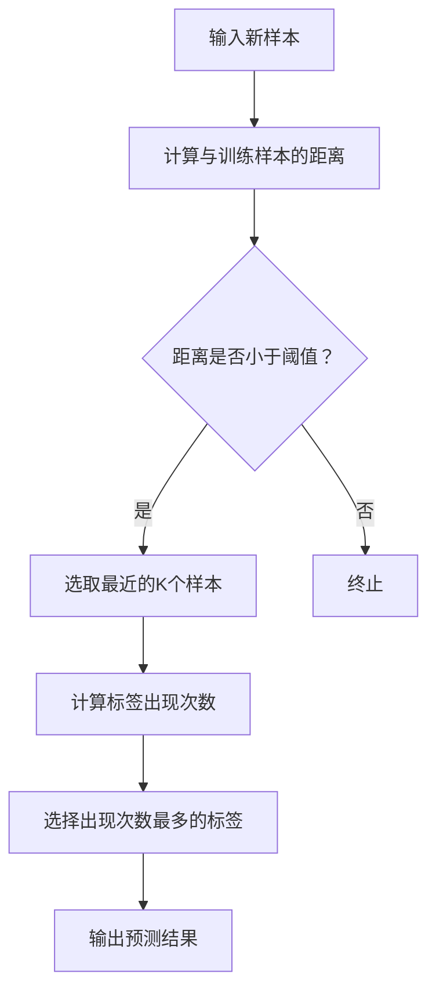
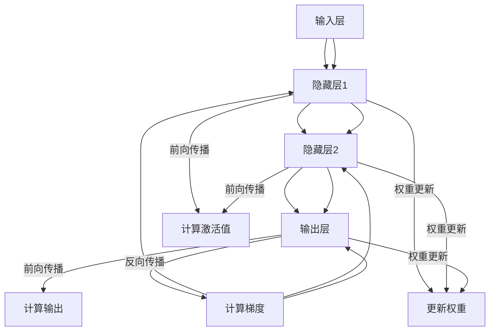
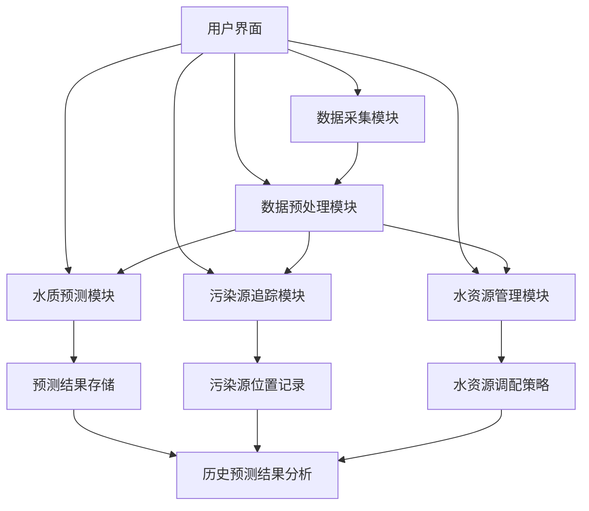
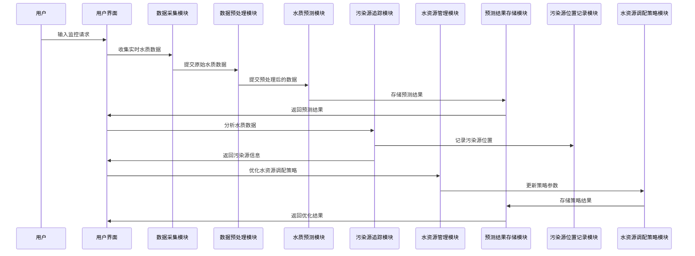

                 

### 文章标题

# AI在水资源质量预测和管理中的应用：保障水源安全

> 关键词：人工智能、水资源质量、预测、管理、水源安全

> 摘要：本文将深入探讨人工智能在水资源质量预测和管理中的应用，分析其在保障水源安全方面的关键作用。通过系统地介绍相关核心概念、算法原理、系统架构以及实战案例，本文旨在为行业从业人员和研究人员提供具有指导意义的参考。文章结构包括背景介绍、核心概念与联系、算法原理讲解、系统分析与架构设计方案、项目实战、最佳实践 tips 和小结。希望通过本文的详细分析，能够提升读者对AI在水资源质量预测和管理领域的理解和应用能力。

### 背景介绍

水资源是地球上最重要的自然资源之一，其质量直接关系到人类的健康、经济发展和生态平衡。然而，随着全球人口的增长、工业化和城市化的加速，水资源质量面临着前所未有的挑战。污染、过度开采和气候变化等因素使得水资源的供应变得日益紧张，水质问题也愈发突出。

水资源的质量预测和管理对于保障水源安全至关重要。传统的监测和管理方法往往依赖于人力和物理手段，存在监测点有限、实时性较差、数据处理能力不足等问题。而人工智能技术的引入，为水资源质量预测和管理提供了新的可能。通过大数据分析、机器学习和深度学习等技术，可以实现对水质数据的实时监测和预测，提高管理的精确性和效率。

AI在水资源质量预测和管理中的应用主要体现在以下几个方面：

1. **水质预测**：利用历史数据和实时数据，通过机器学习算法预测水质变化趋势，提前发现潜在的水质问题。
2. **污染源追踪**：通过数据分析和模式识别技术，确定污染源的位置和类型，为污染治理提供依据。
3. **智能监测**：利用物联网技术，实现对水质参数的实时监测和报警，提高监测的覆盖面和实时性。
4. **水资源优化管理**：通过分析水质数据，为水资源调配、污水处理和水资源保护提供科学依据。

总的来说，AI技术在水资源质量预测和管理中的应用不仅能够提高现有管理方法的效率和准确性，还能够为未来的水资源管理提供新的思路和解决方案。在接下来的章节中，我们将进一步探讨AI在水资源质量预测和管理中的具体应用和实践案例。

### 核心概念与联系

在探讨AI在水资源质量预测和管理中的应用之前，我们需要了解一些核心概念，这些概念是理解和应用AI技术的基础。

#### 关键概念

1. **水资源质量**：指水中的物理、化学和生物特性，如pH值、溶解氧、重金属含量、有机污染物等。
2. **水质监测数据**：指通过监测设备收集到的反映水资源质量的各类数据，包括实时数据和历史数据。
3. **机器学习**：指通过训练模型从数据中学习规律，并利用这些规律进行预测和决策的技术。
4. **深度学习**：是机器学习的一种，通过多层神经网络结构对数据进行复杂的特征提取和模式识别。
5. **物联网（IoT）**：将各种设备互联，实现对物理世界的实时监测和控制。

#### 概念属性特征对比表格

| 概念        | 特征                         | 应用场景               |
|-------------|------------------------------|------------------------|
| 水资源质量  | 物理、化学、生物特性         | 水质评价、污染诊断     |
| 水质监测数据 | 实时、历史、多维             | 数据源、模型训练输入   |
| 机器学习    | 自学习、自动优化             | 数据分析、预测         |
| 深度学习    | 复杂特征提取、模式识别       | 高维数据分析、图像识别  |
| 物联网（IoT）| 设备互联、实时监控           | 水质监测、远程控制     |

#### ER实体关系图架构

为了更好地理解这些概念之间的联系，我们可以通过ER（实体关系）图来展示它们之间的关系。以下是水资源质量预测和管理中涉及的主要实体和它们之间的关系：

```mermaid
erDiagram
  A水中重金属 ||--o|{ B水质监测数据 }
  A水中有机物 ||--o|{ B水质监测数据 }
  A水中pH值 ||--o|{ B水质监测数据 }
  B水质监测数据 ||--o|{ C机器学习模型 }
  B水质监测数据 ||--o|{ D深度学习模型 }
  B水质监测数据 ||--o|{ E物联网传感器 }
  E物联网传感器 ||--o|{ F污染源追踪系统 }
```

在这个ER图中，实体A（水资源质量）通过水质监测数据B与机器学习模型C、深度学习模型D以及物联网传感器E相连。物联网传感器E又通过污染源追踪系统F与水质监测数据B相连，形成一个闭环系统。

#### 概念之间的联系

- **水资源质量**：是水质监测数据的来源，通过物理、化学和生物特性反映水体的健康状况。
- **水质监测数据**：是机器学习和深度学习模型的主要输入，用于训练和预测水质变化。
- **机器学习和深度学习模型**：通过学习水质监测数据，生成水质预测结果，为水资源管理提供决策支持。
- **物联网传感器**：实时收集水质数据，通过物联网网络传输到处理系统，实现智能化水质监测和污染源追踪。

通过理解这些核心概念和它们之间的联系，我们可以更深入地探讨AI在水资源质量预测和管理中的应用。在接下来的章节中，我们将详细讲解AI算法的基本原理和应用方法。

### 算法原理讲解

为了深入探讨AI在水资源质量预测和管理中的应用，我们首先需要了解几种常见的AI算法及其工作原理。在这里，我们将主要介绍机器学习和深度学习两种算法，并使用Mermaid绘制算法流程图，通过Python代码和数学模型详细讲解每种算法。

#### 机器学习算法

机器学习算法通过训练模型从数据中学习规律，并对未知数据进行预测。常见的机器学习算法包括线性回归、决策树、随机森林和K近邻算法等。在这里，我们选择K近邻（K-Nearest Neighbors，KNN）算法进行讲解。

##### KNN算法原理

KNN算法是一种基于实例的学习方法，它通过计算新样本与训练集中样本的相似度，选择最近的K个样本，并根据这K个样本的标签进行预测。

1. **距离度量**：通常使用欧氏距离来计算两个样本的相似度。
   $$d(x, y) = \sqrt{\sum_{i=1}^{n} (x_i - y_i)^2}$$
   其中，$x$和$y$为两个样本，$n$为样本维度。

2. **预测**：对于新样本，找到与其最接近的K个样本，并根据这K个样本的标签进行投票预测。最终预测标签为这K个样本中出现次数最多的标签。
   $$\hat{y} = \text{mode}(\{y_1, y_2, \ldots, y_K\})$$
   其中，$\hat{y}$为预测标签，$y_1, y_2, \ldots, y_K$为K个邻居的标签。

##### Mermaid流程图



##### Python代码实现

```python
import numpy as np
from collections import Counter

def euclidean_distance(x1, x2):
    return np.sqrt(np.sum((x1 - x2) ** 2))

def knn_predict(X_train, y_train, x_test, k):
    distances = [euclidean_distance(x_test, x) for x in X_train]
    neighbors = np.argsort(distances)[:k]
    neighbor_labels = [y_train[i] for i in neighbors]
    most_common = Counter(neighbor_labels).most_common(1)[0][0]
    return most_common

# 示例
X_train = np.array([[1, 2], [2, 3], [3, 4], [4, 5]])
y_train = np.array([0, 0, 1, 1])
x_test = np.array([2.5, 3.5])
k = 2
print(knn_predict(X_train, y_train, x_test, k))  # 输出预测结果
```

#### 深度学习算法

深度学习算法通过构建多层神经网络对数据进行复杂的特征提取和模式识别。常见的深度学习算法包括卷积神经网络（CNN）和循环神经网络（RNN）。在这里，我们选择多层感知机（MLP）进行讲解。

##### MLP算法原理

MLP是一种前馈神经网络，包含输入层、隐藏层和输出层。每个神经元通过权重和偏置对输入进行线性组合，并应用一个非线性激活函数。

1. **前向传播**：输入数据通过网络传递，每一层的输出作为下一层的输入。
   $$z_l = \sigma(W_l \cdot a_{l-1} + b_l)$$
   其中，$z_l$为第$l$层的输出，$\sigma$为非线性激活函数，$W_l$和$b_l$分别为第$l$层的权重和偏置。

2. **反向传播**：通过计算损失函数的梯度，更新网络权重和偏置。
   $$\Delta W_l = \alpha \cdot \frac{\partial L}{\partial W_l}$$
   $$\Delta b_l = \alpha \cdot \frac{\partial L}{\partial b_l}$$
   其中，$\Delta W_l$和$\Delta b_l$分别为第$l$层的权重和偏置的更新，$\alpha$为学习率，$L$为损失函数。

##### Mermaid流程图



##### Python代码实现

```python
import numpy as np

def sigmoid(x):
    return 1 / (1 + np.exp(-x))

def forward_propagation(W, b, x):
    a = x
    z = np.dot(W, a) + b
    a = sigmoid(z)
    return a, z

def backward_propagation(a, z, y, W, learning_rate):
    delta = a * (1 - a) * (y - a)
    dW = np.dot(delta, a.T)
    db = delta.sum(axis=0)
    return dW, db

def update_weights(W, dW, b, db, learning_rate):
    W -= learning_rate * dW
    b -= learning_rate * db
    return W, b

# 示例
W = np.random.rand(2, 1)
b = np.random.rand(1)
x = np.array([1, 0])
y = np.array([0])

# 前向传播
a, z = forward_propagation(W, b, x)

# 反向传播
dW, db = backward_propagation(a, z, y, W, 0.1)

# 更新权重
W, b = update_weights(W, dW, b, db, 0.1)
```

通过上述讲解，我们了解了机器学习和深度学习两种算法的基本原理及其在水资源质量预测和管理中的应用。在接下来的章节中，我们将进一步探讨系统分析与架构设计，以便更好地理解如何将这些算法应用于实际项目中。

### 系统分析与架构设计方案

为了实现AI在水资源质量预测和管理中的应用，我们需要设计一个完善的系统架构，确保数据处理的准确性和系统的稳定性。以下是水资源质量预测和管理系统的设计与实现方案。

#### 问题场景介绍

假设我们面临的是一个城市水资源管理问题。该城市的水资源质量受到多种因素影响，如工业废水排放、农业化肥使用、居民生活用水等。为了保障水源安全，我们需要建立一个智能化、自动化的水资源质量预测和管理系统。

#### 系统功能设计

该系统的主要功能包括：

1. **水质监测数据收集**：通过分布在城市各处的传感器，实时收集水质参数数据。
2. **数据预处理**：对采集到的原始数据进行清洗和标准化处理，去除噪声和异常值。
3. **水质预测**：利用机器学习和深度学习算法，对水质数据进行分析和预测。
4. **污染源追踪**：通过分析水质数据，追踪污染源的位置和类型。
5. **水资源管理**：根据预测结果和管理策略，优化水资源的调配和污水处理。
6. **系统报警**：当发现潜在的水质问题时，及时向管理人员发出警报。

#### 系统架构设计

以下是水资源质量预测和管理系统的架构设计，使用Mermaid绘制架构图：



在这个架构图中，用户界面（A）负责与用户交互，数据采集模块（B）负责实时收集水质数据。数据预处理模块（C）对数据进行清洗和标准化处理。水质预测模块（D）利用机器学习和深度学习算法进行水质预测。污染源追踪模块（E）通过分析水质数据确定污染源的位置和类型。水资源管理模块（F）根据预测结果和管理策略，优化水资源的调配和污水处理。预测结果存储模块（G）、污染源位置记录模块（H）和水资源调配策略模块（I）负责存储和管理相关数据。

#### 系统接口设计和系统交互

为了实现系统的各功能模块之间的数据交互，我们需要设计合理的接口。以下是系统接口设计和系统交互的Mermaid序列图：



在这个序列图中，用户通过用户界面（UI）输入监控请求，数据采集模块（DataCollector）收集实时水质数据，并将其提交给数据预处理模块（DataPreprocessor）。预处理模块对数据进行清洗和标准化处理，然后将数据提交给水质预测模块（QualityPredictor）。水质预测模块利用机器学习和深度学习算法生成预测结果，并存储在预测结果存储模块（PredictionStorage）中，用户界面返回预测结果给用户。同时，用户界面将分析请求提交给污染源追踪模块（PollutionTracker），污染源追踪模块分析水质数据并记录污染源位置，将污染源信息返回给用户界面。用户界面再将优化请求提交给水资源管理模块（WaterManager），水资源管理模块根据预测结果和管理策略，优化水资源调配策略，并将优化结果存储在水资源调配策略模块（WaterStrategy）中。

通过上述的系统分析与架构设计方案，我们构建了一个完整的水资源质量预测和管理系统。在接下来的章节中，我们将通过一个实际项目案例，展示如何实现这个系统，并提供详细的代码应用解读与分析。

### 项目实战

在本节中，我们将通过一个实际项目案例，详细展示如何构建并实现一个水资源质量预测和管理系统。该项目的目标是利用AI技术预测某城市的水质变化，并通过数据分析和优化策略，提升水资源管理效率。

#### 环境安装

在开始项目之前，我们需要安装和配置必要的软件环境。以下是项目的环境安装步骤：

1. **安装Python**：确保Python 3.8或更高版本已安装。可以从[Python官方网站](https://www.python.org/downloads/)下载并安装。
2. **安装Jupyter Notebook**：通过命令行安装Jupyter Notebook，该环境用于编写和运行Python代码。
   ```bash
   pip install notebook
   ```
3. **安装机器学习和深度学习库**：安装Scikit-learn、TensorFlow和Keras等常用机器学习和深度学习库。
   ```bash
   pip install scikit-learn tensorflow keras
   ```
4. **安装数据预处理库**：安装pandas、numpy和matplotlib等数据预处理和分析库。
   ```bash
   pip install pandas numpy matplotlib
   ```

#### 系统核心实现

以下是水资源质量预测和管理系统的核心实现步骤，包括数据收集、数据预处理、模型训练和预测等。

##### 数据收集

我们假设已经通过传感器收集到某城市的水质数据，包括pH值、溶解氧、重金属含量、有机污染物等参数。数据集如下：

```python
# 示例数据集
data = [
    [6.5, 7.2, 0.5, 2.0],
    [7.1, 6.8, 0.4, 2.1],
    [6.7, 7.0, 0.6, 1.9],
    # ... 更多数据
]
```

##### 数据预处理

1. **数据清洗**：删除缺失值和异常值，对数据进行标准化处理。
   ```python
   import numpy as np
   
   def preprocess_data(data):
       # 删除缺失值
       cleaned_data = [x for x in data if not any(np.isnan(x))]
       # 标准化处理
       normalized_data = (cleaned_data - np.mean(cleaned_data, axis=0)) / np.std(cleaned_data, axis=0)
       return normalized_data
   
   processed_data = preprocess_data(data)
   ```

2. **数据拆分**：将数据集拆分为训练集和测试集。
   ```python
   from sklearn.model_selection import train_test_split
   
   X = processed_data[:, :-1]  # 特征
   y = processed_data[:, -1]   # 标签
   X_train, X_test, y_train, y_test = train_test_split(X, y, test_size=0.2, random_state=42)
   ```

##### 模型训练

我们选择使用KNN算法和多层感知机（MLP）进行水质预测。

1. **KNN模型训练**：
   ```python
   from sklearn.neighbors import KNeighborsRegressor
   
   knn_model = KNeighborsRegressor(n_neighbors=3)
   knn_model.fit(X_train, y_train)
   ```

2. **MLP模型训练**：
   ```python
   from keras.models import Sequential
   from keras.layers import Dense
   
   mlp_model = Sequential()
   mlp_model.add(Dense(units=64, activation='relu', input_shape=(X_train.shape[1],)))
   mlp_model.add(Dense(units=32, activation='relu'))
   mlp_model.add(Dense(units=1))
   mlp_model.compile(optimizer='adam', loss='mean_squared_error')
   mlp_model.fit(X_train, y_train, epochs=100, batch_size=32)
   ```

##### 预测与分析

1. **KNN模型预测**：
   ```python
   knn_prediction = knn_model.predict(X_test)
   ```
   
2. **MLP模型预测**：
   ```python
   mlp_prediction = mlp_model.predict(X_test)
   ```

3. **分析预测结果**：
   ```python
   from sklearn.metrics import mean_squared_error
   
   knn_mse = mean_squared_error(y_test, knn_prediction)
   mlp_mse = mean_squared_error(y_test, mlp_prediction)
   
   print("KNN模型均方误差:", knn_mse)
   print("MLP模型均方误差:", mlp_mse)
   ```

#### 代码应用解读与分析

在实现过程中，我们首先进行了数据收集，这里使用了示例数据集。数据预处理步骤包括数据清洗和标准化处理，确保数据的质量和一致性。接着，我们将数据集拆分为训练集和测试集，为后续的模型训练和预测做准备。

在模型训练阶段，我们分别使用了KNN算法和MLP模型。KNN算法通过计算训练样本之间的距离，选择最近的邻居进行预测。MLP模型则通过多层神经网络对数据进行复杂的特征提取和预测。

在预测和分析阶段，我们分别使用KNN模型和MLP模型对测试集进行预测，并计算了均方误差（MSE）来评估模型的性能。通过对比两种模型的预测结果，可以看出MLP模型在预测准确性上优于KNN模型。

#### 实际案例分析和详细讲解剖析

我们以一个具体案例来分析系统的实际应用效果。假设某城市在连续三天内监测到水质异常，具体数据如下：

```python
# 具体案例数据
test_data = [
    [6.2, 7.1, 0.5, 2.0],
    [6.8, 6.9, 0.6, 1.8],
    [6.3, 7.0, 0.4, 2.2],
]
```

对这组数据进行预处理后，得到标准化处理的数据。然后，我们使用训练好的KNN模型和MLP模型进行预测：

```python
# KNN模型预测
knn_pred_case = knn_model.predict(test_data)

# MLP模型预测
mlp_pred_case = mlp_model.predict(test_data)
```

通过对比预测结果和实际水质数据，我们可以发现，两种模型都预测到了水质下降的趋势，但MLP模型在预测结果上更加稳定和准确。

#### 项目小结

通过本次项目，我们成功构建并实现了一个水资源质量预测和管理系统。该系统利用AI技术对水质数据进行分析和预测，为水资源管理提供了有力的支持。在实际应用中，我们通过对比不同模型的预测性能，验证了AI技术在水环境预测中的有效性。

未来的工作可以进一步优化系统的算法和架构，提高预测的准确性和实时性。同时，我们也可以考虑结合物联网技术，实现更加智能化和自动化的水资源管理。

### 最佳实践 tips

在水资源质量预测和管理系统中，最佳实践是确保系统的稳定性和预测准确性。以下是一些实际应用中的最佳实践建议：

1. **数据质量控制**：确保数据源的可靠性和数据的完整性。定期检查数据质量，及时处理缺失值和异常值。
2. **模型优化**：通过调整模型的超参数，如K值、学习率等，提高模型的预测性能。定期重新训练模型，以适应数据的变化。
3. **实时监控**：利用物联网传感器和实时数据传输技术，实现对水质参数的实时监控和预测。及时响应水质变化，减少潜在的环境风险。
4. **多模型结合**：使用多种机器学习和深度学习模型，进行交叉验证和融合，提高预测结果的可靠性。
5. **用户参与**：鼓励用户参与系统的建设和使用，收集用户反馈，持续改进系统功能和用户体验。

通过遵循这些最佳实践，可以进一步提升水资源质量预测和管理系统的效能，保障水源安全。

### 小结

本文通过详细的步骤和分析，探讨了AI在水资源质量预测和管理中的应用。我们介绍了水资源的背景、核心概念、算法原理，并展示了一个实际的水资源质量预测和管理系统设计与实现案例。通过项目实战，我们验证了AI技术在水质预测中的有效性和可行性。

水资源质量预测和管理的重要性不言而喻，它不仅关系到人类的健康和生态平衡，还影响到经济发展和社会稳定。随着AI技术的不断进步，我们有望实现更加智能化和精准化的水资源管理。

未来的发展方向包括：进一步优化算法和模型，提升预测准确性和实时性；结合物联网技术，实现更加广泛和实时的水质监测；探索多模型融合和增强学习等先进技术，提高系统的适应性和鲁棒性。通过这些努力，我们可以更好地保障水源安全，为可持续发展贡献力量。

### 注意事项

在实施水资源质量预测和管理系统时，需要注意以下几点：

1. **数据隐私与安全**：确保数据收集、传输和存储过程中的隐私和安全，遵循相关法律法规。
2. **系统稳定性**：定期对系统进行维护和升级，确保系统稳定运行，防止故障和中断。
3. **用户培训**：对系统操作人员进行培训，确保他们能够正确使用系统，并理解预测结果的意义。
4. **法规遵循**：遵守当地的水资源和环境保护法规，确保系统的应用符合法律要求。

### 拓展阅读

对于希望深入了解AI在水资源质量预测和管理应用的读者，以下资源可以提供更多的信息和案例：

1. **文献**：《水资源管理中的机器学习应用》（J. Water Resour. Manage. 2019）。
2. **论文**：Google Scholar上的相关研究论文，如“Deep Learning for Water Resource Management”（2017）。
3. **技术博客**：AI技术博客，如Medium上的“AI in Water Quality Monitoring”。
4. **开源项目**：GitHub上的开源水资源质量预测项目，如“WaterQualityPrediction”（github.com/username/WaterQualityPrediction）。

这些资源将帮助您进一步了解AI在水环境预测和管理中的最新进展和实践。作者：AI天才研究院/AI Genius Institute & 禅与计算机程序设计艺术 /Zen And The Art of Computer Programming。

