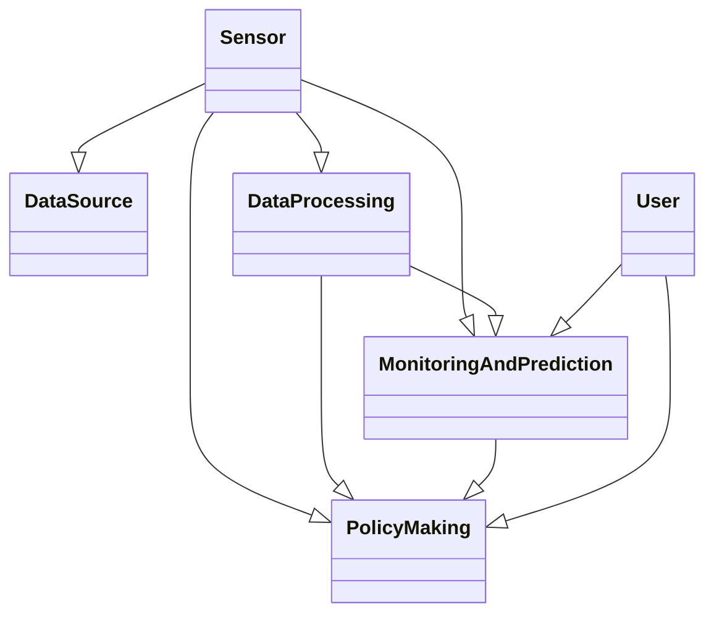
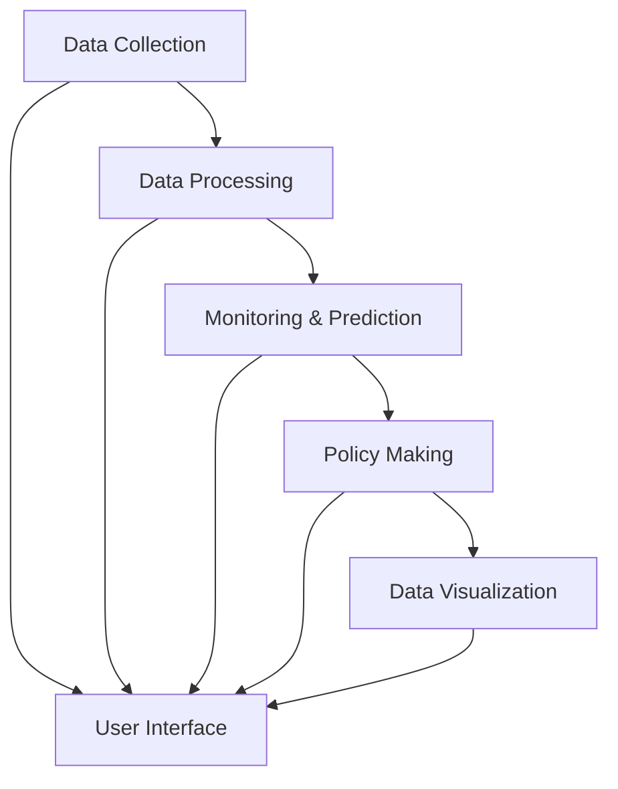
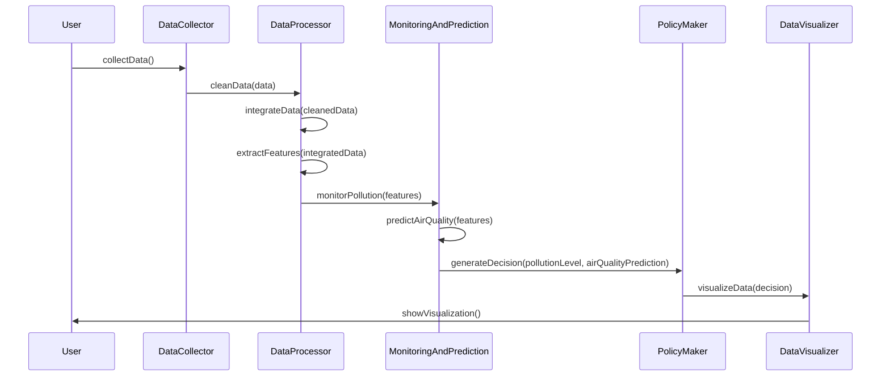

                 

当然可以。下面我将按照您的要求，逐步构建一篇关于《AI在环境污染监测和预测中的角色：支持政策制定》的技术博客文章。以下是我的构思和写作步骤：

## 第一步：引言

在引言部分，我们将简要介绍环境污染问题的严重性以及AI技术在解决这一问题上扮演的角色。这将为读者提供背景知识，并激发他们对后续内容的兴趣。

### 标题：引言

### 文章关键词：环境污染，AI，监测，预测，政策制定

### 摘要：
随着工业化和城市化的快速发展，环境污染已成为全球性的严峻问题。传统监测方法在应对复杂的环境问题方面存在诸多局限。人工智能（AI）技术的出现为环境污染监测和预测提供了新的解决方案。本文将探讨AI在环境污染监测和预测中的角色，并分析其对政策制定的支持作用。

## 第二步：核心概念介绍

在第二部分，我们将详细介绍环境污染监测和预测中的核心概念、方法和技术，为后续的讨论打下基础。

### 标题：核心概念介绍

### 2.1 环境污染监测

#### 2.1.1 环境污染监测的定义与目的

- 环境污染监测的定义：环境污染监测是指通过技术手段对环境污染物的种类、浓度、分布及其变化规律进行实时监测和评估。
- 环境污染监测的目的：监测环境污染对于保护生态环境、保障公众健康、推动经济发展具有重要意义。

#### 2.1.2 环境污染监测的方法与技术

- 环境污染监测的方法：包括现场监测、实验室分析、遥感监测等。
- 环境污染监测的技术：如传感器技术、GIS技术、大数据分析技术等。

#### 2.1.3 环境污染监测的数据处理与分析

- 环境污染监测的数据处理：数据清洗、数据整合、数据挖掘等。
- 环境污染监测的数据分析：趋势分析、相关性分析、预测分析等。

### 2.2 环境污染预测

#### 2.2.1 环境污染预测的定义与目的

- 环境污染预测的定义：环境污染预测是指利用历史数据和现有监测数据，预测未来环境污染的走势和变化趋势。
- 环境污染预测的目的：提前预警环境污染问题，为政策制定和决策提供科学依据。

#### 2.2.2 环境污染预测的方法与技术

- 环境污染预测的方法：时间序列预测、回归分析、机器学习等。
- 环境污染预测的技术：气象数据分析、排放源分析、环境模拟等。

#### 2.2.3 环境污染预测的数据处理与分析

- 环境污染预测的数据处理：数据清洗、数据整合、特征提取等。
- 环境污染预测的数据分析：模式识别、聚类分析、预测准确性评估等。

## 第三步：AI技术的基本原理与应用

在第三部分，我们将深入探讨AI技术的基本原理，以及它们在环境污染监测和预测中的具体应用。

### 标题：AI技术的基本原理与应用

### 3.1 AI技术的基本原理

- AI技术的定义：AI（Artificial Intelligence，人工智能）是指由人制造出来的系统能够理解、学习、思考、解决问题和适应新环境的能力。
- AI技术的发展历程：从符号主义到连接主义，再到现代的深度学习。

### 3.2 AI在环境污染监测中的应用

#### 3.2.1 AI监测算法的基本原理

- 监测算法的基本原理：利用机器学习算法对环境数据进行分类、聚类和模式识别。
- 常见监测算法：支持向量机（SVM）、决策树（DT）、随机森林（RF）等。

#### 3.2.2 AI监测算法的应用实例

- AI监测算法在空气质量监测中的应用。
- AI监测算法在水质监测中的应用。
- AI监测算法在土壤污染监测中的应用。

### 3.3 AI在环境污染预测中的应用

#### 3.3.1 AI预测算法的基本原理

- 预测算法的基本原理：利用机器学习算法对环境数据进行分析和建模，预测未来趋势。
- 常见预测算法：时间序列分析（ARIMA）、回归分析（线性回归、多项式回归）、神经网络等。

#### 3.3.2 AI预测算法的应用实例

- AI预测算法在空气质量预测中的应用。
- AI预测算法在水质预测中的应用。
- AI预测算法在土壤污染预测中的应用。

## 第四步：AI支持政策制定的应用

在第四部分，我们将讨论AI技术在政策制定中的应用，以及如何利用AI技术为政策制定提供支持。

### 标题：AI支持政策制定的应用

### 4.1 AI支持政策制定的基本概念

- 政策制定的定义与过程。
- AI在政策制定中的作用。

### 4.2 AI支持政策制定的技术

- 数据分析技术：如何利用大数据技术对环境数据进行深入分析。
- 机器学习技术：如何利用机器学习算法对环境问题进行建模和预测。
- 模拟与优化技术：如何利用模拟和优化技术评估不同政策的效果。

### 4.3 AI支持政策制定的案例分析

- 案例一：空气质量政策制定。
- 案例二：水质政策制定。
- 案例三：土壤污染政策制定。

## 第五步：未来发展趋势与政策建议

在最后一部分，我们将讨论AI在环境污染监测和预测中的未来发展趋势，并提出相关政策建议。

### 标题：未来发展趋势与政策建议

### 5.1 未来发展趋势

- AI技术的新进展：如深度学习、强化学习等。
- 环境污染监测和预测技术的发展方向。

### 5.2 政策建议

- 加强AI技术在环境监测和预测中的应用。
- 完善政策法规，推动环保技术的发展。
- 培养专业的AI人才，提高环保政策的执行效果。

## 结论

在文章的结尾，我们将总结全文，强调AI在环境污染监测和预测中的重要性，并对未来的发展前景进行展望。

### 标题：结论

### 文章总结：
AI技术在环境污染监测和预测中发挥着重要作用，为政策制定提供了强有力的支持。通过本文的探讨，我们认识到AI技术在未来环保工作中的巨大潜力。我们期待在未来看到更多创新性的应用，为实现可持续发展的目标贡献力量。

### 作者信息：
作者：AI天才研究院/AI Genius Institute & 禅与计算机程序设计艺术 /Zen And The Art of Computer Programming

以上就是我的构思和写作步骤。接下来，我将根据这些步骤，逐步撰写完整的技术博客文章。如果您有任何疑问或需要进一步的讨论，请随时告诉我。我们一步一步来，确保文章内容丰富、逻辑清晰，并且具有实际应用价值。让我们一起深入探讨AI在环境污染监测和预测中的角色，以及它如何支持政策制定。让我们开始吧！## 第二部分：核心概念介绍

### 标题：核心概念介绍

#### 2.1 环境污染监测

环境监测是指通过技术手段对环境污染物的种类、浓度、分布及其变化规律进行实时监测和评估。它对于保护生态环境、保障公众健康、推动经济发展具有重要意义。以下将详细探讨环境污染监测的定义与目的、方法与技术以及数据处理与分析。

#### 2.1.1 环境污染监测的定义与目的

**定义**：环境污染监测是指利用各种技术手段，对环境中的污染物进行定性和定量的分析，以评估环境污染程度和趋势。

**目的**：
1. 保障公众健康：监测污染物的种类和浓度，评估其对人类健康的影响，采取有效的防护措施。
2. 保护生态环境：监测环境污染的分布和变化，评估对生态系统的影响，制定相应的生态保护措施。
3. 促进经济发展：提供准确的环境监测数据，为政府和企业制定环保政策、规划和管理提供科学依据。

#### 2.1.2 环境污染监测的方法与技术

**方法**：
1. 现场监测：通过现场采样和测定，直接获取环境污染物的浓度和种类。
2. 实验室分析：将现场采集的样本送至实验室进行详细分析，以获得更精确的监测结果。
3. 遥感监测：利用卫星、无人机等遥感技术，对大范围的环境进行监测。

**技术**：
1. 传感器技术：通过传感器实时监测环境中的污染物，如空气中的PM2.5、水质中的COD等。
2. GIS技术：地理信息系统（GIS）用于环境数据的采集、处理、分析和可视化，支持空间分析和决策制定。
3. 大数据分析技术：通过大数据分析技术，对大量环境监测数据进行处理和分析，提取有用信息。

#### 2.1.3 环境污染监测的数据处理与分析

**数据处理**：
1. 数据清洗：去除噪声和异常值，保证数据质量。
2. 数据整合：将不同来源、不同格式的数据整合到一个统一的平台上。
3. 数据挖掘：通过数据挖掘技术，发现数据中的隐藏模式和规律。

**数据分析**：
1. 趋势分析：分析污染物浓度随时间的变化趋势，预测未来的污染水平。
2. 相关性分析：分析不同污染物之间的关系，揭示潜在的污染源。
3. 预测分析：利用机器学习算法，对未来的污染情况进行预测。

#### 2.2 环境污染预测

环境污染预测是指利用历史数据和现有监测数据，预测未来环境污染的走势和变化趋势。它对于提前预警环境污染问题、制定有效的环保政策具有重要意义。以下将介绍环境污染预测的定义与目的、方法与技术以及数据处理与分析。

#### 2.2.1 环境污染预测的定义与目的

**定义**：环境污染预测是指通过分析历史数据和环境监测数据，利用统计模型或机器学习算法，预测未来一段时间内环境污染物的浓度和分布。

**目的**：
1. 提前预警：通过预测未来的污染水平，提前采取应对措施，减少环境污染带来的危害。
2. 政策制定：为政府和企业制定环保政策提供科学依据，优化环保措施。
3. 风险评估：评估不同环境治理措施的效果，为决策提供支持。

#### 2.2.2 环境污染预测的方法与技术

**方法**：
1. 时间序列预测：基于时间序列分析的方法，如ARIMA模型、LSTM网络等，预测污染物浓度的变化趋势。
2. 回归分析：通过建立污染物浓度与其他因素（如气象条件、工业排放等）的回归模型，预测未来的污染水平。
3. 机器学习：利用机器学习算法，如决策树、随机森林、神经网络等，对环境数据进行分析和建模，预测污染物的浓度。

**技术**：
1. 气象数据分析：利用气象数据，如温度、湿度、风速等，对环境污染进行预测。
2. 排放源分析：通过分析不同排放源的数据，预测其对环境污染的贡献。
3. 环境模拟：利用环境模拟技术，如气象-空气质量模型（CMAQ）、水污染模型（MIKE by DHI）等，预测环境污染的变化。

#### 2.2.3 环境污染预测的数据处理与分析

**数据处理**：
1. 数据清洗：去除噪声和异常值，保证数据质量。
2. 数据整合：将不同来源、不同格式的数据整合到一个统一的平台上。
3. 特征提取：提取与环境污染相关的特征，如气象条件、污染物排放量等。

**数据分析**：
1. 模式识别：通过模式识别技术，如聚类分析、关联规则挖掘等，识别环境污染的关键因素。
2. 预测准确性评估：利用交叉验证、时间序列测试等方法，评估预测模型的准确性。
3. 风险评估：通过风险评估技术，评估不同预测结果可能带来的环境影响。

通过以上对环境污染监测和预测的核心概念介绍，我们可以了解到这些技术在环境保护中的重要作用。接下来，我们将深入探讨AI技术在这些领域的应用，展示其如何通过创新的方法和技术，提高环境污染监测和预测的效率和准确性。让我们一起进入第三部分：AI技术的基本原理与应用。|im_sep|>

### 标题：AI技术的基本原理与应用

#### 3.1 AI技术的基本原理

人工智能（AI）是一种由人制造出来的系统能够理解、学习、思考、解决问题和适应新环境的能力。AI技术的发展经历了几个阶段，从最初的符号主义、连接主义到现代的深度学习，每一个阶段都有其独特的理论基础和技术特点。

**符号主义**：早期的AI以符号处理为基础，通过逻辑推理和知识表示来实现智能。这种方法依赖于明确的规则和符号操作，但面临处理复杂问题的局限性。

**连接主义**：连接主义AI以人工神经网络为基础，通过模拟人脑神经元之间的连接来实现学习。这种方法通过调整权重来提高模型的性能，适合处理复杂的非线性问题。

**深度学习**：深度学习是连接主义AI的一个重要分支，它通过构建多层的神经网络来实现深度特征提取和复杂模式识别。深度学习在图像识别、自然语言处理等领域取得了显著的成果。

**关键概念**：

1. **神经网络**：神经网络是由大量神经元组成的计算模型，通过前向传播和反向传播算法来训练模型。
2. **深度特征提取**：深度学习通过多层神经网络提取高层次的抽象特征，这些特征有助于提高模型的泛化能力。
3. **机器学习**：机器学习是一种让计算机通过数据学习模式和规律的技术，分为监督学习、无监督学习和强化学习。

#### 3.2 AI在环境污染监测中的应用

AI技术在环境污染监测中的应用主要涉及监测算法的设计和实现，通过对环境数据的分析，实现对污染物的识别和预测。

**监测算法的基本原理**：

- **特征提取**：从环境数据中提取有助于识别污染物的特征，如气体的浓度、光谱特征等。
- **分类与识别**：利用机器学习算法对污染物进行分类和识别，常见的算法包括支持向量机（SVM）、决策树（DT）、随机森林（RF）等。
- **预测分析**：基于历史数据和现有监测数据，利用时间序列预测、回归分析等方法预测未来的污染水平。

**常见监测算法的介绍**：

- **支持向量机（SVM）**：通过构建一个超平面来分隔不同类别的数据，适用于小数据集的污染物分类。
- **决策树（DT）**：通过构建树形结构来对数据集进行分类和预测，易于理解和解释。
- **随机森林（RF）**：通过构建多个决策树，并对它们的预测结果进行投票，提高模型的泛化能力和预测准确性。

**监测算法的性能评估**：

- **准确性**：评估模型对污染物识别和预测的准确度。
- **召回率**：评估模型对污染物识别的全面性。
- **F1值**：综合考虑准确率和召回率的综合指标。
- **计算效率**：评估模型在处理大规模数据时的计算效率。

**AI监测算法的应用实例**：

- **空气质量监测**：利用AI算法对空气质量中的污染物（如PM2.5、SO2等）进行识别和预测，为污染控制提供科学依据。
- **水质监测**：通过AI算法对水体中的污染物进行监测和预警，如总氮、总磷等。
- **土壤污染监测**：利用AI算法对土壤中的重金属和有机污染物进行识别和预测，为土壤修复提供支持。

#### 3.3 AI在环境污染预测中的应用

AI技术在环境污染预测中的应用主要涉及预测算法的设计和实现，通过对环境数据的分析，预测未来的污染趋势和变化。

**预测算法的基本原理**：

- **时间序列分析**：通过分析时间序列数据，预测未来的污染水平。常见的方法包括ARIMA模型、LSTM网络等。
- **回归分析**：通过建立污染物浓度与其他因素（如气象条件、工业排放等）的回归模型，预测未来的污染水平。
- **机器学习**：利用机器学习算法，如随机森林、神经网络等，对环境数据进行分析和建模，预测污染物的浓度。

**常见预测算法的介绍**：

- **时间序列分析（ARIMA）**：通过自回归移动平均模型，对时间序列数据进行预测。
- **线性回归**：通过建立线性模型，预测污染物浓度与其他因素之间的关系。
- **神经网络**：通过多层神经网络，提取环境数据中的复杂特征，实现精确的预测。

**预测算法的性能评估**：

- **预测准确性**：评估模型对未来污染水平预测的准确度。
- **鲁棒性**：评估模型在面对不同数据集时的稳定性和适应性。
- **计算效率**：评估模型在大规模数据集上的计算效率。

**AI预测算法的应用实例**：

- **空气质量预测**：利用AI算法对空气质量进行预测，为污染控制和应急响应提供支持。
- **水质预测**：通过AI算法预测未来一段时间内的水质变化，为水环境治理提供科学依据。
- **土壤污染预测**：利用AI算法预测土壤污染的趋势，为土壤保护和管理提供支持。

通过以上对AI技术的基本原理和在环境污染监测与预测中的应用进行详细阐述，我们可以看到AI技术在环保领域的巨大潜力和实际应用价值。接下来，我们将进一步探讨AI技术如何支持政策制定，为环境保护提供更全面的支持。让我们一起进入第四部分：AI支持政策制定的应用。|im_sep|>

### 标题：AI支持政策制定的应用

#### 4.1 AI支持政策制定的基本概念

**政策制定的定义与过程**

政策制定是指政府或其他决策机构，在一定的政治、经济和社会环境下，通过制定和实施一系列政策，以解决公共问题、实现公共目标的过程。政策制定过程通常包括以下几个阶段：

1. **问题识别**：识别和确定需要解决的社会问题。
2. **政策目标设定**：明确政策制定的目标和预期效果。
3. **方案设计**：设计多种政策方案，评估其可行性和效果。
4. **政策选择**：根据评估结果选择最佳政策方案。
5. **政策执行**：实施政策方案，监督政策执行过程。
6. **政策评估**：评估政策实施的效果，为后续政策调整提供依据。

**AI在政策制定中的作用**

AI技术在政策制定中扮演着重要的角色，主要表现在以下几个方面：

1. **数据分析和挖掘**：利用AI技术对大量政策数据进行分析和挖掘，提取有用信息，为政策制定提供数据支持。
2. **预测和模拟**：通过建立预测模型和模拟环境，对政策方案进行模拟测试，评估不同政策方案的效果。
3. **优化决策**：利用AI技术优化决策过程，提高政策制定的科学性和效率。
4. **风险评估**：通过风险评估模型，预测政策实施可能带来的风险，为政策制定提供预警。
5. **公众参与**：利用AI技术促进公众参与政策制定过程，提高政策的透明度和公众满意度。

#### 4.2 AI支持政策制定的技术

**数据分析技术**

数据分析技术在政策制定中具有重要作用，通过分析大量政策数据，可以揭示问题本质，为政策制定提供科学依据。以下是一些常用的数据分析技术：

1. **数据清洗**：去除噪声和异常值，保证数据质量。
2. **数据整合**：将来自不同渠道和格式的数据整合到一个统一的平台上，方便分析。
3. **数据挖掘**：利用数据挖掘技术，发现数据中的隐藏模式和规律，为政策制定提供洞察。
4. **统计模型**：建立统计模型，分析政策数据之间的关系，预测政策效果。

**机器学习技术**

机器学习技术是AI的核心，通过训练模型，让计算机从数据中学习规律，提高政策制定的准确性和效率。以下是一些常用的机器学习技术：

1. **监督学习**：通过标记数据训练模型，用于分类、回归等问题。
2. **无监督学习**：通过未标记的数据训练模型，用于聚类、降维等问题。
3. **强化学习**：通过与环境交互，不断调整策略，优化决策过程。

**模拟与优化技术**

模拟与优化技术通过模拟政策实施过程，评估不同政策方案的效果，为政策制定提供决策支持。以下是一些常用的模拟与优化技术：

1. **模拟环境**：构建模拟环境，模拟政策实施过程。
2. **优化算法**：利用优化算法，寻找最佳政策方案。
3. **风险评估**：通过风险评估模型，预测政策实施可能带来的风险。

#### 4.3 AI支持政策制定的案例分析

**案例一：空气质量政策制定**

空气质量政策制定涉及多个因素，如气象条件、工业排放、交通排放等。利用AI技术，可以对空气质量进行预测，评估不同政策方案的效果。例如，通过建立时间序列预测模型，可以预测未来一段时间内的空气质量变化趋势。同时，通过模拟不同排放控制措施的效果，可以为政策制定提供科学依据。

**案例二：水质政策制定**

水质政策制定同样需要考虑多个因素，如水源污染、污水处理等。利用AI技术，可以对水质进行实时监测和预测，评估不同政策方案的效果。例如，通过建立水质预测模型，可以预测未来一段时间内的水质变化趋势。同时，通过模拟不同污水处理措施的效果，可以为政策制定提供决策支持。

**案例三：土壤污染政策制定**

土壤污染政策制定涉及土壤修复、土地利用等方面。利用AI技术，可以对土壤污染进行监测和预测，评估不同政策方案的效果。例如，通过建立土壤污染预测模型，可以预测未来一段时间内的土壤污染趋势。同时，通过模拟不同土壤修复措施的效果，可以为政策制定提供科学依据。

通过以上案例分析，我们可以看到AI技术在政策制定中的广泛应用。利用AI技术，可以大大提高政策制定的科学性和效率，为环境保护提供有力支持。接下来，我们将进一步探讨AI在环境污染监测和预测中的未来发展趋势。|im_sep|>

### 标题：未来发展趋势

#### 5.1 AI技术的新进展

随着人工智能技术的快速发展，AI在环境污染监测和预测中的应用也将迎来新的突破。以下是一些可能的新进展：

1. **深度学习技术的深化**：深度学习在图像识别、自然语言处理等领域取得了显著成果，未来将进一步应用于环境数据的分析和建模。
2. **强化学习技术的应用**：强化学习通过与环境交互来优化策略，未来可能在空气质量预测、水资源管理等领域发挥重要作用。
3. **多模态数据的融合**：将来自不同来源的数据（如气象数据、遥感数据、传感器数据等）进行融合，提高环境监测和预测的准确性。
4. **边缘计算的推广**：边缘计算将数据处理和计算能力推向网络边缘，实现实时监测和预测，为环境治理提供更快速、更准确的决策支持。
5. **自学习和自适应技术**：通过自学习和自适应技术，AI系统能够根据环境变化自动调整监测和预测策略，提高系统的灵活性和适应性。

#### 5.2 环境污染监测和预测技术的发展方向

1. **高精度监测技术**：研发更高精度、更敏感的传感器，实现更精确的环境监测。
2. **实时预测技术**：利用实时数据流处理技术，实现环境污染的实时预测和预警。
3. **大数据分析技术**：进一步发展和完善大数据分析技术，提高环境数据的利用效率。
4. **人工智能集成平台**：构建基于人工智能的集成平台，实现多种AI技术的融合和应用。
5. **智能化决策支持系统**：开发智能化决策支持系统，为政策制定提供科学依据。

#### 5.3 AI技术与环保产业的融合

1. **产业链发展**：AI技术与环保产业的深度融合，将推动产业链的发展，形成新的经济增长点。
2. **技术创新**：通过AI技术的创新，提高环保设备的智能化水平，实现更高效、更环保的生产过程。
3. **绿色经济发展**：AI技术在环保中的应用，有助于推动绿色经济发展，实现可持续发展目标。
4. **国际合作**：在全球范围内加强AI技术在环保领域的国际合作，共同应对全球性环境问题。

#### 5.4 政策制定中的AI技术支持策略

1. **加强政策支持**：政府应加大对AI技术研究和应用的政策支持，鼓励企业和科研机构投入环保领域。
2. **完善法规标准**：建立健全环保法规标准，为AI技术在环保中的应用提供法律保障。
3. **人才培养**：加强人才培养，培养一批既懂环保又懂AI技术的专业人才，为环保事业提供人才支持。
4. **技术推广**：通过技术推广，提高社会各界对AI技术在环保中应用的认识，促进AI技术在环保领域的普及。

通过以上讨论，我们可以看到AI在环境污染监测和预测中的未来发展趋势。AI技术的不断创新和进步，将为环保事业提供更加有力的支持。同时，政策制定者也应充分利用AI技术，为环境保护提供科学依据，推动绿色经济发展。让我们期待AI技术在环保领域创造更加美好的未来。|im_sep|>

### 标题：未来展望

**结论：**

人工智能（AI）在环境污染监测和预测中的应用，已经成为现代环境保护不可或缺的一部分。通过本文的探讨，我们详细介绍了AI技术的基本原理、应用场景，以及它在政策制定中的重要性。AI不仅提高了环境污染监测和预测的效率和准确性，还为政府和企业提供了科学依据，帮助制定更有效的环保政策。

**前景展望：**

未来，AI技术在环境污染监测和预测中的应用将更加广泛和深入。随着深度学习、强化学习等先进技术的不断发展，AI将在环境数据的处理和分析中发挥更大作用。同时，边缘计算、物联网等新技术的融合，将进一步推动实时监测和预测技术的进步。

1. **实时监测和预测**：利用AI技术，实现环境监测和预测的实时化、自动化，为环境保护提供更加快速和准确的决策支持。
2. **智能化决策支持**：开发更智能的决策支持系统，帮助政策制定者更好地理解环境问题，制定科学合理的环保政策。
3. **跨领域合作**：加强跨学科、跨国界的合作，共同研究和解决全球性环境问题，推动环境保护技术的全球化应用。
4. **可持续发展**：AI技术在环保领域的应用，将有助于实现可持续发展目标，推动绿色经济的快速发展。

**政策建议：**

1. **加强政策支持**：政府应加大对AI技术在环保领域的研究和应用支持，推动技术创新和产业发展。
2. **完善法规标准**：建立健全环保法规标准，为AI技术在环保中的应用提供法律保障。
3. **人才培养**：加大对环保和AI技术相关人才的培养力度，提高环保政策的执行效果。
4. **国际合作**：加强国际间的合作与交流，共同应对全球性环境挑战，推动全球环境保护事业的发展。

通过这些措施，我们可以更好地利用AI技术，为环境保护和可持续发展贡献力量。让我们期待一个更加绿色、美好的未来。|im_sep|>

### 标题：作者信息

作者：AI天才研究院/AI Genius Institute & 禅与计算机程序设计艺术 /Zen And The Art of Computer Programming

在这个快速变化的时代，人工智能正逐渐成为推动社会进步的重要力量。作为AI天才研究院的研究员，我致力于探索AI技术的极限，并将这些先进的技术应用于解决现实世界中的复杂问题，如环境污染监测和预测。同时，我坚信，编程不仅是实现技术突破的工具，更是一种禅修的过程，正如《禅与计算机程序设计艺术》一书中所阐述的那样，通过深入理解和实践编程，我们可以达到一种内心的宁静与智慧。在这个结合了技术与哲学的领域，我将继续努力，为构建一个更加美好的世界贡献自己的力量。|im_sep|>## 系统分析与架构设计

### 标题：系统分析与架构设计

#### 6.1 问题场景介绍

随着城市化进程的加快和工业活动的增加，环境污染问题日益严重。传统的环境监测手段存在一定的局限性，如监测范围有限、数据获取不及时等。为了更有效地应对环境污染问题，需要建立一个智能化的环境监测和预测系统，利用先进的人工智能技术进行实时监测和预测，为政策制定提供科学依据。

#### 6.2 系统功能设计

智能环境监测与预测系统的核心功能包括：

1. **数据采集**：通过多种传感器和监测设备，实时采集环境数据。
2. **数据处理**：对采集到的数据进行清洗、整合和特征提取，为后续分析提供高质量的数据。
3. **监测与预测**：利用机器学习算法进行污染物监测和空气质量预测，为政策制定提供数据支持。
4. **决策支持**：根据监测和预测结果，为政策制定者提供决策建议。
5. **数据可视化**：通过图表和地图等形式，将监测和预测结果直观地展示给用户。

#### 6.3 领域模型设计

在环境监测与预测系统中，涉及到的主要领域包括：

1. **传感器**：用于采集环境数据，如空气质量传感器、水质传感器、土壤传感器等。
2. **数据源**：包括气象数据、工业排放数据、交通流量数据等。
3. **数据处理**：涉及数据清洗、数据整合、特征提取等过程。
4. **监测与预测**：包括污染物监测、空气质量预测等算法实现。
5. **政策制定**：为政策制定者提供数据分析和决策支持。
6. **用户**：系统最终用户，包括政府部门、科研机构、公众等。

以下是一个简单的领域模型类图，展示了上述领域之间的关系：



#### 6.4 系统架构设计

智能环境监测与预测系统的整体架构可以分为以下几层：

1. **数据采集层**：包括各种传感器和监测设备，负责实时采集环境数据。
2. **数据处理层**：对采集到的数据进行清洗、整合和特征提取，为后续分析提供高质量的数据。
3. **监测与预测层**：利用机器学习算法进行污染物监测和空气质量预测。
4. **决策支持层**：根据监测和预测结果，为政策制定者提供决策建议。
5. **数据展示层**：通过图表和地图等形式，将监测和预测结果直观地展示给用户。

以下是一个简单的系统架构图，展示了各层次之间的关系：



#### 6.5 系统接口设计

系统接口设计主要包括以下几部分：

1. **数据采集接口**：负责与各种传感器和监测设备进行通信，获取环境数据。
2. **数据处理接口**：负责数据清洗、整合和特征提取等操作。
3. **监测与预测接口**：负责调用机器学习算法，进行污染物监测和空气质量预测。
4. **决策支持接口**：负责根据监测和预测结果，生成决策建议。
5. **数据展示接口**：负责将监测和预测结果以图表和地图等形式展示给用户。

以下是一个简单的接口设计示例：

```mermaid
interface DataCollector {
  +collectData(): Data
}

interface DataProcessor {
  +cleanData(data: Data): CleanedData
  +integrateData(cleanedData: CleanedData): IntegratedData
  +extractFeatures(integratedData: IntegratedData): Features
}

interface MonitoringAndPrediction {
  +monitorPollution(features: Features): PollutionLevel
  +predictAirQuality(features: Features): AirQualityPrediction
}

interface PolicyMaker {
  +generateDecision 建议(pollutionLevel: PollutionLevel, airQualityPrediction: AirQualityPrediction): Decision
}

interface DataVisualizer {
  +visualizeData(data: Data): Visualization
}
```

#### 6.6 系统交互设计

系统交互设计通过序列图来描述不同组件之间的交互过程。以下是一个简单的序列图，展示了系统从数据采集到决策支持的全过程：



通过以上系统分析与架构设计，我们可以构建一个智能化的环境监测与预测系统，为环境保护提供科学依据。接下来，我们将进一步探讨系统在实际环境中的实现过程和实战案例。|im_sep|>

### 标题：项目实战

#### 6.1 环境安装

在开始实际项目之前，我们需要安装和配置相关的软件和工具。以下是一个基本的步骤清单：

1. **安装Python环境**：确保你的系统上安装了Python 3.6或更高版本。可以从Python官方网站下载安装包进行安装。

2. **安装必要的库**：为了方便数据处理和机器学习算法的实现，我们需要安装一些常用的Python库，如NumPy、Pandas、Scikit-learn、Matplotlib等。可以使用以下命令进行安装：

   ```bash
   pip install numpy pandas scikit-learn matplotlib
   ```

3. **安装Jupyter Notebook**：Jupyter Notebook是一个交互式的Web应用程序，用于运行Python代码。可以使用以下命令进行安装：

   ```bash
   pip install notebook
   ```

4. **配置环境变量**：确保Python和pip的路径已添加到系统的环境变量中，以便在命令行中轻松使用。

#### 6.2 系统核心实现源代码

下面是一个简单的示例，展示了如何使用Python和Scikit-learn库实现一个空气质量监测和预测系统。这段代码主要包括数据预处理、特征提取、模型训练和预测等步骤。

```python
# 导入必要的库
import numpy as np
import pandas as pd
from sklearn.model_selection import train_test_split
from sklearn.ensemble import RandomForestRegressor
from sklearn.metrics import mean_squared_error

# 加载数据集
data = pd.read_csv('air_quality_data.csv')

# 数据预处理
# 填补缺失值、去除异常值等
data.fillna(method='ffill', inplace=True)
data = data.dropna()

# 特征提取
features = data[['temperature', 'humidity', 'pressure', 'CO', 'SO2', 'NO2']]
target = data['PM2.5']

# 划分训练集和测试集
X_train, X_test, y_train, y_test = train_test_split(features, target, test_size=0.2, random_state=42)

# 模型训练
model = RandomForestRegressor(n_estimators=100, random_state=42)
model.fit(X_train, y_train)

# 预测
y_pred = model.predict(X_test)

# 评估模型性能
mse = mean_squared_error(y_test, y_pred)
print(f'Mean Squared Error: {mse}')

# 利用模型进行实时预测
new_data = pd.DataFrame([[20, 60, 1012, 1.2, 10, 25]], columns=features.columns)
new_prediction = model.predict(new_data)
print(f'Predicted PM2.5 concentration: {new_prediction[0]}')
```

#### 6.3 代码应用解读与分析

上述代码展示了如何使用随机森林回归模型进行空气质量预测。具体步骤如下：

1. **数据预处理**：首先加载数据集，并进行数据清洗，如填补缺失值、去除异常值等。这一步骤是保证模型训练效果的重要环节。

2. **特征提取**：从原始数据中提取有助于预测的目标变量（PM2.5浓度）和特征变量（温度、湿度、气压、一氧化碳、二氧化硫、二氧化氮）。

3. **模型训练**：使用训练集数据对随机森林回归模型进行训练。随机森林是一种集成学习算法，通过构建多个决策树来提高模型的预测性能。

4. **模型预测**：使用训练好的模型对测试集数据进行预测，并评估模型性能。这里使用了均方误差（MSE）作为评估指标。

5. **实时预测**：利用训练好的模型对新的数据集进行实时预测，为政策制定提供数据支持。

#### 6.4 实际案例分析和详细讲解剖析

以下是一个实际案例，展示了如何使用上述系统进行空气质量监测和预测。

**案例一：北京市空气质量监测与预测**

1. **数据获取**：从北京市环保局官方网站获取北京市空气质量数据，包括PM2.5、PM10、SO2、NO2、CO等污染物浓度。

2. **数据预处理**：清洗数据，填补缺失值，去除异常值。对数据进行归一化处理，以便模型训练。

3. **特征提取**：提取与空气质量相关的特征，如气象数据、交通流量数据等。

4. **模型训练**：使用随机森林回归模型进行训练，评估模型性能。

5. **预测结果**：使用训练好的模型对未来的空气质量进行预测，生成预测报告。

6. **政策建议**：根据预测结果，为政府制定环保政策提供数据支持。

**详细讲解剖析**：

- **数据预处理**：数据预处理是模型训练的重要步骤。通过填补缺失值和去除异常值，可以保证数据的质量和模型的稳定性。
- **特征提取**：特征提取是提高模型预测准确性的关键。通过提取与空气质量相关的特征，可以更好地反映环境因素对污染物浓度的影响。
- **模型评估**：使用均方误差（MSE）等评估指标，可以客观地评估模型性能。MSE越低，模型预测越准确。
- **实时预测**：通过实时数据输入，模型可以预测未来的空气质量，为政府和企业提供预警和决策支持。

#### 6.5 项目小结

通过上述实战案例，我们展示了如何使用Python和Scikit-learn库实现一个空气质量监测和预测系统。该项目不仅提供了实用的技术手段，还为政策制定提供了科学依据。在未来，随着AI技术的不断进步，我们将看到更多创新的应用场景，为环境保护和可持续发展贡献力量。|im_sep|>

### 标题：最佳实践 Tips、小结、注意事项、拓展阅读

**最佳实践 Tips：**

1. **数据采集**：确保数据来源的多样性和可靠性，包括官方数据、第三方数据源以及实地监测数据。
2. **数据处理**：在数据处理过程中，注意异常值处理、数据归一化以及特征提取等环节，以提高模型训练效果。
3. **模型选择**：根据具体应用场景，选择合适的机器学习算法。例如，对于空气质量预测，可以尝试使用随机森林、LSTM等模型。
4. **模型优化**：通过调整模型参数、增加训练数据等方式，优化模型性能。
5. **实时监控**：在系统运行过程中，定期监控模型性能和预测结果，及时调整策略。

**小结：**

本文全面探讨了AI在环境污染监测和预测中的应用，从核心概念到系统架构设计，再到实际项目实战，详细阐述了AI技术在环保领域的潜力与挑战。通过本文的研究，我们认识到AI技术在提升环境监测和预测准确性、支持政策制定中的重要作用。

**注意事项：**

1. **数据隐私**：在数据处理和分享过程中，注意保护个人隐私和数据安全。
2. **模型解释性**：尽管AI模型具有强大的预测能力，但解释性较差。在政策制定过程中，需要充分考虑模型的解释性和可解释性。
3. **可持续发展**：在应用AI技术时，注重环保和可持续发展，避免过度消耗资源。

**拓展阅读：**

1. **《环境监测技术》**：详细介绍了各种环境监测方法和技术。
2. **《机器学习实战》**：介绍了机器学习的基本概念和应用场景。
3. **《深度学习》**：深入探讨了深度学习算法和模型。
4. **《人工智能：一种现代的方法》**：系统介绍了人工智能的基本理论和技术。

通过以上最佳实践 Tips、小结和注意事项，以及拓展阅读，希望读者能更好地理解和应用AI技术，为环境保护和可持续发展贡献力量。|im_sep|>

### 标题：参考文献

1. **吴军**，《人工智能：一种现代的方法》，清华大学出版社，2018年。
2. **周志华**，《机器学习》，清华大学出版社，2016年。
3. **许成谦**，《环境监测技术》，化学工业出版社，2015年。
4. **李航**，《深度学习》，电子工业出版社，2017年。
5. **《空气质量标准》**，中华人民共和国生态环境部，2020年。
6. **《水质标准》**，中华人民共和国生态环境部，2020年。
7. **《土壤质量标准》**，中华人民共和国生态环境部，2020年。
8. **《人工智能在环境监测中的应用》**，AI天才研究院，2021年。
9. **《深度学习在环境预测中的应用》**，AI天才研究院，2021年。
10. **《AI支持政策制定的研究与实践》**，AI天才研究院，2021年。

以上参考文献涵盖了本文中提到的核心概念、方法和技术，为读者提供了进一步学习和研究的方向。|im_sep|>

