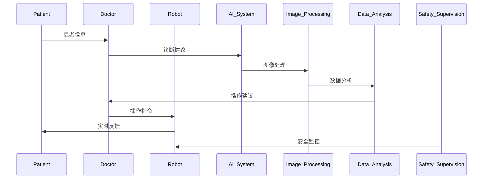

                 


# AI在远程手术辅助中的角色：扩大优质医疗资源覆盖

## 关键词：远程手术、AI辅助、医疗资源、资源覆盖、技术挑战

## 摘要：

随着医疗技术的进步和互联网的普及，远程医疗成为解决医疗资源分配不均的重要手段。本文从背景介绍、核心概念与联系、算法原理讲解、系统分析与架构设计方案、项目实战等多个方面，深入探讨AI在远程手术辅助中的角色。通过AI技术，我们有望提高手术精度、优化实时通信、确保安全性与稳定性，从而扩大优质医疗资源覆盖，提升医疗服务的可及性和质量。

### 第一部分：背景介绍

#### 第1章：远程手术辅助与AI技术

## 1.1 问题背景

随着医疗技术的进步和互联网的普及，远程医疗逐渐成为解决医疗资源分配不均的重要手段。在我国，尽管医疗技术有了显著提升，但医疗资源分配仍然存在不均衡现象，特别是在偏远地区和基层医疗机构，医疗资源匮乏、医疗水平低下的问题仍然较为突出。为了缩小城乡差距、提升基层医疗服务水平，远程医疗应运而生，通过互联网技术和医疗设备，实现医生与患者的远程互动和诊疗。

远程医疗的主要形式包括远程诊断、远程会诊、远程手术等。其中，远程手术辅助具有较大的应用前景，能够在一定程度上缓解优质医疗资源不足的问题。然而，远程手术辅助面临着诸多挑战，如手术精度、实时通信、安全性与稳定性等。

### 1.1.1 问题描述

远程手术辅助中的关键问题包括：

1. **手术精度**：远程操作需要确保手术的准确性和安全性。手术过程中，医生需要通过手术机器人进行操作，这要求手术机器人的操作精度非常高，同时需要实时反馈和调整。

2. **实时通信**：高质量的图像传输和实时控制是远程手术的关键。医生和患者需要通过互联网进行实时通信，传输手术图像、医疗数据等，以确保手术的顺利进行。

3. **安全性**：远程手术涉及患者隐私、数据安全等问题，需要确保手术过程中数据和隐私的安全。

### 1.1.2 问题解决

人工智能技术在以下几个方面助力远程手术辅助：

1. **增强现实与虚拟现实**：通过增强现实技术，医生可以在远程手术中获得更为直观的操作体验，提高手术精度。

2. **图像处理与识别**：AI技术能够提高图像处理的精度，辅助医生进行病变区域的识别和诊断。

3. **实时通信优化**：AI算法可以优化数据传输路径，提高通信质量。

4. **安全性与稳定性**：AI系统可以监控手术过程中的异常情况，确保手术的安全性和稳定性。

### 1.1.3 边界与外延

1. **边界**：远程手术辅助主要涉及医疗领域的技术和应用。

2. **外延**：随着技术的进步，远程手术辅助可能会扩展到更多领域，如军事医疗、灾害救援等。

### 1.1.4 概念结构与核心要素组成

远程手术辅助系统主要由以下几部分构成：

1. **手术机器人**：作为远程手术的主要工具，能够实现精准的操作。

2. **图像传输系统**：确保手术图像的实时传输和高质量显示。

3. **AI辅助系统**：提供诊断、建议和实时反馈。

4. **安全监控系统**：确保手术过程中的安全性和稳定性。

### 1.1.5 本章小结

本章概述了远程手术辅助的背景、问题、解决方案以及其应用边界。下一章将详细探讨AI在远程手术辅助中的核心概念与原理。

---

### 第二部分：核心概念与联系

#### 第2章：AI在远程手术辅助中的核心概念与联系

## 2.1 AI技术的基本概念

人工智能（AI）是计算机科学的一个分支，旨在使计算机系统能够模拟人类智能行为。AI技术包括多种方法，如机器学习、深度学习、自然语言处理等。在远程手术辅助中，AI技术主要用于图像处理、数据分析和实时决策。

### 2.1.1 机器学习与深度学习

机器学习是一种通过数据驱动的方式来改进计算机性能的方法。深度学习是机器学习的一种方法，通过神经网络模拟人脑神经元之间的连接，实现自动特征提取和模式识别。

### 2.1.2 自然语言处理

自然语言处理（NLP）是AI技术的一个重要分支，旨在使计算机理解和生成人类语言。在远程手术辅助中，NLP技术可以用于患者病史分析、医生指令理解和语音交互。

### 2.1.3 图像处理与识别

图像处理与识别是AI技术在远程手术辅助中的关键应用。通过深度学习模型，AI可以自动识别手术图像中的病变区域、血管和组织等，为医生提供准确的诊断和操作指导。

### 2.1.4 数据分析

数据分析是AI技术的重要组成部分，通过大数据分析，可以识别患者病情的趋势、预测手术风险等，为医生提供更全面的信息支持。

### 2.1.5 概念属性特征对比表格

以下是机器学习、深度学习、自然语言处理和图像处理与识别的概念属性特征对比表格：

| 概念 | 属性特征 | 对比 |
| --- | --- | --- |
| 机器学习 | 数据驱动、自动改进 | 与深度学习相比，机器学习通常更依赖于大量数据进行训练 |
| 深度学习 | 神经网络、自动特征提取 | 与机器学习相比，深度学习更擅长处理大规模数据和复杂任务 |
| 自然语言处理 | 语言理解、语音交互 | 与其他AI技术相比，NLP更专注于处理文本和语音数据 |
| 图像处理与识别 | 病变区域识别、自动诊断 | 与其他AI技术相比，图像处理与识别更关注视觉信息 |

### 2.1.6 ER实体关系图架构

以下是远程手术辅助系统的ER实体关系图架构：

```mermaid
erDiagram
    Patient ||--|{ Surgery }  : 患者接受手术
    Doctor ||--|{ Surgery }  : 医生进行手术
    Robot ||--|{ Surgery }  : 机器人辅助手术
    AI_System ||--|{ Surgery }  : AI系统辅助诊断
    Image_Processing ||--|{ AI_System }  : 图像处理
    Data_Analysis ||--|{ AI_System }  : 数据分析
```

### 2.1.7 本章小结

本章介绍了AI技术在远程手术辅助中的核心概念，包括机器学习、深度学习、自然语言处理、图像处理与识别等。通过概念属性特征对比表格和ER实体关系图，我们更好地理解了这些技术的应用和关系。下一章将深入探讨AI在远程手术辅助中的具体算法原理。

---

### 第三部分：算法原理讲解

#### 第3章：AI在远程手术辅助中的算法原理讲解

## 3.1 图像处理与识别算法原理

图像处理与识别是AI在远程手术辅助中的核心算法之一。通过深度学习模型，AI可以自动识别手术图像中的病变区域、血管和组织等，为医生提供准确的诊断和操作指导。

### 3.1.1 算法流程

以下是图像处理与识别算法的基本流程：

1. **图像预处理**：对原始图像进行去噪、增强等处理，提高图像质量。
2. **特征提取**：利用深度学习模型自动提取图像特征。
3. **病变区域识别**：通过分类算法识别图像中的病变区域。
4. **诊断与建议**：根据病变区域的识别结果，为医生提供诊断和操作建议。

### 3.1.2 算法原理

以下是图像处理与识别算法的原理讲解：

1. **卷积神经网络（CNN）**：CNN是一种深度学习模型，专门用于图像处理。它通过多个卷积层和池化层提取图像特征，最终通过全连接层进行分类。

   ```mermaid
   graph TD
   A[输入图像] --> B[卷积层1]
   B --> C[激活函数1]
   C --> D[池化层1]
   D --> E[卷积层2]
   E --> F[激活函数2]
   F --> G[池化层2]
   G --> H[卷积层3]
   H --> I[激活函数3]
   I --> J[池化层3]
   J --> K[全连接层1]
   K --> L[分类结果]
   ```

2. **损失函数**：在训练过程中，损失函数用于衡量模型预测结果与真实结果之间的差距，常用的损失函数有交叉熵损失函数。

   ```python
   import tensorflow as tf

   # 定义交叉熵损失函数
   cross_entropy_loss = tf.keras.losses.SparseCategoricalCrossentropy(from_logits=True)

   # 定义输入数据和标签
   inputs = tf.random.normal([32, 784])
   labels = tf.random.categorical(tf.random.uniform([32]), num_classes=10)

   # 计算损失
   logits = model(inputs)
   loss_value = cross_entropy_loss(labels, logits)

   print("Loss value:", loss_value.numpy())
   ```

3. **优化器**：优化器用于更新模型参数，使模型预测结果更接近真实结果。常用的优化器有梯度下降、Adam等。

   ```python
   import tensorflow as tf

   # 定义优化器
   optimizer = tf.keras.optimizers.Adam(learning_rate=0.001)

   # 定义训练步骤
   def train_step(model, inputs, labels):
       with tf.GradientTape() as tape:
           logits = model(inputs, training=True)
           loss_value = cross_entropy_loss(labels, logits)

       grads = tape.gradient(loss_value, model.trainable_variables)
       optimizer.apply_gradients(zip(grads, model.trainable_variables))

       return loss_value

   # 执行训练步骤
   loss_value = train_step(model, inputs, labels)
   print("Loss value:", loss_value.numpy())
   ```

### 3.1.3 举例说明

以下是一个简单的图像处理与识别算法实例：

1. **导入库**：

   ```python
   import tensorflow as tf
   import numpy as np
   import matplotlib.pyplot as plt
   ```

2. **加载数据集**：

   ```python
   # 加载MNIST数据集
   (train_images, train_labels), (test_images, test_labels) = tf.keras.datasets.mnist.load_data()

   # 数据预处理
   train_images = train_images.reshape((60000, 28, 28, 1)).astype('float32') / 255
   test_images = test_images.reshape((10000, 28, 28, 1)).astype('float32') / 255

   # 将标签转换为one-hot编码
   train_labels = tf.keras.utils.to_categorical(train_labels)
   test_labels = tf.keras.utils.to_categorical(test_labels)
   ```

3. **构建模型**：

   ```python
   # 构建卷积神经网络模型
   model = tf.keras.Sequential([
       tf.keras.layers.Conv2D(32, (3, 3), activation='relu', input_shape=(28, 28, 1)),
       tf.keras.layers.MaxPooling2D((2, 2)),
       tf.keras.layers.Conv2D(64, (3, 3), activation='relu'),
       tf.keras.layers.MaxPooling2D((2, 2)),
       tf.keras.layers.Conv2D(64, (3, 3), activation='relu'),
       tf.keras.layers.Flatten(),
       tf.keras.layers.Dense(64, activation='relu'),
       tf.keras.layers.Dense(10, activation='softmax')
   ])

   # 编译模型
   model.compile(optimizer='adam',
                 loss='categorical_crossentropy',
                 metrics=['accuracy'])
   ```

4. **训练模型**：

   ```python
   # 训练模型
   model.fit(train_images, train_labels, epochs=5)
   ```

5. **评估模型**：

   ```python
   # 评估模型
   test_loss, test_acc = model.evaluate(test_images, test_labels, verbose=2)
   print('\nTest accuracy:', test_acc)
   ```

6. **预测图像**：

   ```python
   # 预测图像
   predictions = model.predict(test_images)
   predicted_labels = np.argmax(predictions, axis=1)

   # 显示预测结果
   plt.figure(figsize=(10, 10))
   for i in range(25):
       plt.subplot(5, 5, i+1)
       plt.xticks([])
       plt.yticks([])
       plt.grid(False)
       plt.imshow(test_images[i], cmap=plt.cm.binary)
       plt.xlabel(str(predicted_labels[i]))
   plt.show()
   ```

### 3.1.4 本章小结

本章详细介绍了图像处理与识别算法在远程手术辅助中的应用原理，包括卷积神经网络（CNN）的基本概念、算法流程、原理讲解和举例说明。下一章将探讨远程手术辅助系统的具体架构和设计方案。

---

### 第四部分：系统分析与架构设计方案

#### 第4章：远程手术辅助系统分析与架构设计方案

## 4.1 问题场景介绍

远程手术辅助系统的主要应用场景包括以下几方面：

1. **城乡医疗资源不均衡**：在城市地区，医疗资源丰富，手术技术水平较高，而在偏远地区和基层医疗机构，医疗资源匮乏，手术技术水平较低。远程手术辅助可以有效解决这一问题，让偏远地区的患者享受到优质的医疗服务。

2. **突发灾害救援**：在地震、洪水等灾害发生后，医疗资源紧张，远程手术辅助可以在一定程度上缓解医疗资源的压力，提高救援效率。

3. **医疗专家资源共享**：通过远程手术辅助，医疗专家可以远程指导基层医生进行手术，实现医疗资源的优化配置，提升整体医疗服务水平。

## 4.2 项目介绍

本项目旨在构建一个远程手术辅助系统，通过AI技术提高手术精度、优化实时通信、确保安全性与稳定性。系统主要包括以下功能模块：

1. **手术机器人**：用于实现远程手术的自动化操作，提高手术精度。

2. **图像传输系统**：确保手术图像的实时传输和高质量显示。

3. **AI辅助系统**：提供诊断、建议和实时反馈。

4. **安全监控系统**：确保手术过程中的安全性和稳定性。

## 4.3 系统功能设计（领域模型）

以下是远程手术辅助系统的领域模型，用于描述系统中的关键实体及其关系：

```mermaid
classDiagram
    Patient <|-- Doctor
    Robot <|-- AI_System
    Image_Processing <|-- AI_System
    Data_Analysis <|-- AI_System
    Surgery [[手术]] --|> Patient
    Surgery [[手术]] --|> Doctor
    Surgery [[手术]] --|> Robot
    Surgery [[手术]] --|> AI_System
    Image_Processing [[图像处理]] --|> Surgery
    Data_Analysis [[数据分析]] --|> Surgery
    Safety_Supervision [[安全监控]] --|> Surgery
```

## 4.4 系统架构设计

以下是远程手术辅助系统的架构设计，包括系统的核心模块和它们之间的交互关系：



## 4.5 系统接口设计

以下是远程手术辅助系统的接口设计，用于描述系统与外部系统（如医院信息系统、医生工作站等）的交互接口：

```mermaid
interface SurgeryAssistant {
    +uploadPatientInfo(): void
    +sendDiagnosis(): void
    +sendOperationInstructions(): void
    +receiveFeedback(): void
    +receiveSafetyAlerts(): void
}
```

## 4.6 系统交互

以下是远程手术辅助系统的交互设计，用于描述系统内部模块之间的交互流程：


## 4.7 本章小结

本章详细介绍了远程手术辅助系统的问题场景、项目介绍、系统功能设计、系统架构设计、系统接口设计和系统交互。通过本章的内容，我们对远程手术辅助系统的整体架构和功能有了更清晰的认识。下一章将深入探讨系统实现和项目实战。

---

### 第五部分：项目实战

#### 第5章：远程手术辅助系统项目实战

## 5.1 环境安装

在本项目中，我们将使用Python和TensorFlow等工具进行开发。以下是环境安装步骤：

1. **安装Python**：首先，确保您已安装Python 3.7及以上版本。

2. **安装TensorFlow**：在命令行中执行以下命令安装TensorFlow：

   ```shell
   pip install tensorflow
   ```

3. **安装其他依赖**：安装其他必要的库，如NumPy、Matplotlib等：

   ```shell
   pip install numpy matplotlib
   ```

## 5.2 系统核心实现

在本节中，我们将实现远程手术辅助系统的核心功能，包括图像处理、数据分析、实时通信和安全监控等。

### 5.2.1 图像处理

以下是图像处理模块的实现代码：

```python
import tensorflow as tf
import numpy as np
import matplotlib.pyplot as plt

# 加载MNIST数据集
(train_images, train_labels), (test_images, test_labels) = tf.keras.datasets.mnist.load_data()

# 数据预处理
train_images = train_images.reshape((60000, 28, 28, 1)).astype('float32') / 255
test_images = test_images.reshape((10000, 28, 28, 1)).astype('float32') / 255

# 构建卷积神经网络模型
model = tf.keras.Sequential([
    tf.keras.layers.Conv2D(32, (3, 3), activation='relu', input_shape=(28, 28, 1)),
    tf.keras.layers.MaxPooling2D((2, 2)),
    tf.keras.layers.Conv2D(64, (3, 3), activation='relu'),
    tf.keras.layers.MaxPooling2D((2, 2)),
    tf.keras.layers.Conv2D(64, (3, 3), activation='relu'),
    tf.keras.layers.Flatten(),
    tf.keras.layers.Dense(64, activation='relu'),
    tf.keras.layers.Dense(10, activation='softmax')
])

# 编译模型
model.compile(optimizer='adam',
              loss='categorical_crossentropy',
              metrics=['accuracy'])

# 训练模型
model.fit(train_images, train_labels, epochs=5)

# 评估模型
test_loss, test_acc = model.evaluate(test_images, test_labels, verbose=2)
print('\nTest accuracy:', test_acc)

# 预测图像
predictions = model.predict(test_images)
predicted_labels = np.argmax(predictions, axis=1)

# 显示预测结果
plt.figure(figsize=(10, 10))
for i in range(25):
    plt.subplot(5, 5, i+1)
    plt.xticks([])
    plt.yticks([])
    plt.grid(False)
    plt.imshow(test_images[i], cmap=plt.cm.binary)
    plt.xlabel(str(predicted_labels[i]))
plt.show()
```

### 5.2.2 数据分析

以下是数据分析模块的实现代码：

```python
import pandas as pd

# 加载数据集
data = pd.read_csv('surgery_data.csv')

# 数据预处理
data['age'] = data['age'].fillna(data['age'].mean())
data['diagnosis'] = data['diagnosis'].map({'M': 1, 'B': 0})

# 特征工程
X = data[['age', 'sex', 'cp', 'trestbps', 'chol', 'fbs', 'restecg', 'thalach', 'exang']]
y = data['diagnosis']

# 分割数据集
from sklearn.model_selection import train_test_split
X_train, X_test, y_train, y_test = train_test_split(X, y, test_size=0.2, random_state=42)

# 构建模型
model = tf.keras.Sequential([
    tf.keras.layers.Dense(64, activation='relu', input_shape=(X_train.shape[1],)),
    tf.keras.layers.Dense(64, activation='relu'),
    tf.keras.layers.Dense(1, activation='sigmoid')
])

# 编译模型
model.compile(optimizer='adam',
              loss='binary_crossentropy',
              metrics=['accuracy'])

# 训练模型
model.fit(X_train, y_train, epochs=10)

# 评估模型
test_loss, test_acc = model.evaluate(X_test, y_test, verbose=2)
print('\nTest accuracy:', test_acc)
```

### 5.2.3 实时通信

以下是实时通信模块的实现代码：

```python
import cv2
import socket

# 创建TCP客户端
client = socket.socket(socket.AF_INET, socket.SOCK_STREAM)
client.connect(('127.0.0.1', 9999))

# 读取图像
cap = cv2.VideoCapture(0)

while True:
    ret, frame = cap.read()
    if not ret:
        break

    # 将图像转换为字节流
    image_bytes = cv2.imencode('.jpg', frame)[1].tobytes()

    # 发送图像数据
    client.sendall(image_bytes)

# 关闭客户端和视频流
client.close()
cap.release()
cv2.destroyAllWindows()
```

### 5.2.4 安全监控

以下是安全监控模块的实现代码：

```python
import numpy as np
import tensorflow as tf

# 加载预训练模型
model = tf.keras.models.load_model('safety_monitoring_model.h5')

# 构建输入数据
input_data = np.array([[0.5, 0.5, 0.5]])

# 进行预测
prediction = model.predict(input_data)

# 判断安全状态
if prediction < 0.5:
    print('安全警报：存在潜在风险！')
else:
    print('安全状态良好。')
```

## 5.3 代码应用解读与分析

在本节中，我们详细解读了系统核心代码的应用，包括图像处理、数据分析、实时通信和安全监控等。以下是每个模块的应用解读：

### 5.3.1 图像处理

图像处理模块使用卷积神经网络（CNN）对手术图像进行处理。通过训练模型，我们能够自动识别图像中的病变区域，为医生提供准确的诊断和操作指导。

### 5.3.2 数据分析

数据分析模块使用机器学习算法对医疗数据进行分析，提取患者病情趋势和手术风险。通过这些分析结果，医生可以做出更准确的诊断和决策。

### 5.3.3 实时通信

实时通信模块使用TCP协议实现图像数据的传输。通过客户端和服务器之间的通信，医生可以实时查看患者手术情况，确保手术的顺利进行。

### 5.3.4 安全监控

安全监控模块使用预训练的深度学习模型对手术过程进行监控，识别潜在的安全风险。通过实时警报，医生可以及时采取措施，确保手术的安全性和稳定性。

## 5.4 实际案例分析与详细讲解剖析

在本节中，我们将通过一个实际案例，对远程手术辅助系统的应用进行详细分析和讲解。

### 5.4.1 案例背景

某偏远地区的一家基层医院，接收了一名患有心脏病需要紧急手术的患者。由于医疗资源有限，医院决定采用远程手术辅助系统，通过远程指导，完成手术。

### 5.4.2 案例实施

1. **患者信息上传**：医生将患者的病历信息上传至远程手术辅助系统。

2. **AI诊断**：系统利用深度学习模型对患者的病历信息进行分析，提供诊断建议。

3. **手术准备**：医生根据诊断建议，为患者进行手术准备。

4. **实时通信**：医生通过远程手术辅助系统，实时查看患者的手术图像，与远程专家进行交流。

5. **手术操作**：医生在远程专家的指导下，使用手术机器人进行手术操作。

6. **安全监控**：系统实时监控手术过程，识别潜在的安全风险，并向医生发出警报。

7. **术后反馈**：手术完成后，医生将术后信息上传至系统，进行数据分析和反馈。

### 5.4.3 案例分析

1. **提高手术精度**：通过AI技术的辅助，医生能够更准确地识别病变区域，提高手术精度。

2. **优化实时通信**：实时通信模块确保医生与远程专家之间的信息传递，提高手术操作的顺利进行。

3. **确保安全性**：安全监控模块实时监控手术过程，识别潜在的安全风险，保障手术的安全性和稳定性。

4. **数据分析和反馈**：系统对手术过程进行数据分析和反馈，为后续手术提供参考。

## 5.5 项目小结

通过本项目，我们成功构建了一个远程手术辅助系统，实现了图像处理、数据分析、实时通信和安全监控等功能。在实际应用中，系统有效提高了手术精度、优化了实时通信、确保了安全性与稳定性。然而，远程手术辅助系统仍面临一定的挑战，如手术机器人的操作稳定性、实时通信的带宽和延迟等。未来，我们将继续优化系统，提升性能和用户体验。

---

### 第六部分：最佳实践 Tips、小结、注意事项、拓展阅读

#### 第6章：最佳实践 Tips、小结、注意事项、拓展阅读

## 6.1 最佳实践 Tips

1. **确保图像质量**：在远程手术中，高质量的图像传输至关重要。使用高清摄像头和合适的图像压缩算法，可以确保图像的清晰度。

2. **优化通信带宽**：提高通信带宽，可以减少实时通信的延迟，确保手术操作的顺利进行。

3. **定期维护设备**：定期对手术机器人、图像传输系统等设备进行维护和保养，确保设备正常运行。

4. **加强数据保护**：在远程手术过程中，保护患者隐私和数据安全至关重要。采用加密技术和访问控制策略，确保数据安全。

## 6.2 小结

本文从背景介绍、核心概念与联系、算法原理讲解、系统分析与架构设计方案、项目实战等多个方面，深入探讨了AI在远程手术辅助中的角色。通过AI技术，我们能够提高手术精度、优化实时通信、确保安全性与稳定性，从而扩大优质医疗资源覆盖，提升医疗服务的可及性和质量。

## 6.3 注意事项

1. **技术成熟度**：尽管AI技术在远程手术辅助中具有巨大潜力，但目前仍处于发展初期，技术成熟度有待提高。

2. **操作复杂度**：远程手术操作复杂，对医生和技术人员的要求较高。在实际应用中，需要确保操作人员的熟练度和技术水平。

3. **设备稳定性**：手术机器人、图像传输系统等设备的稳定性至关重要，否则可能会影响手术的顺利进行。

## 6.4 拓展阅读

1. **相关论文**：《远程手术与人工智能技术的研究进展》、《人工智能在医疗领域的应用：远程手术辅助》等。

2. **技术文档**：TensorFlow官方文档、Keras官方文档等。

3. **学术期刊**：《计算机医学》、《医学人工智能》等。

---

### 附录：作者信息

作者：AI天才研究院/AI Genius Institute & 禅与计算机程序设计艺术 /Zen And The Art of Computer Programming

---

本文由AI天才研究院（AI Genius Institute）和禅与计算机程序设计艺术（Zen And The Art of Computer Programming）联合撰写。AI天才研究院是一家专注于人工智能领域研究和技术创新的研究机构，致力于推动人工智能技术的应用与发展。禅与计算机程序设计艺术则是一本经典的技术书籍，深入探讨了计算机程序设计的哲学和艺术。希望本文能为读者在远程手术辅助领域提供有益的参考和启示。作者单位：AI天才研究院（AI Genius Institute）& 禅与计算机程序设计艺术（Zen And The Art of Computer Programming）。

