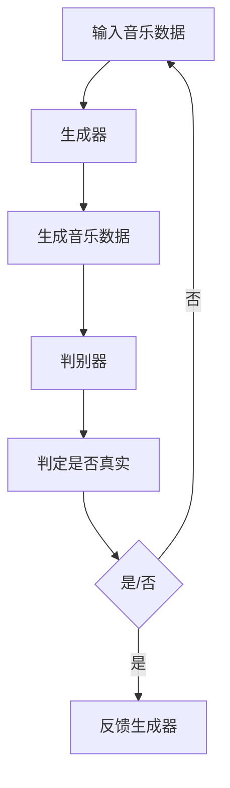
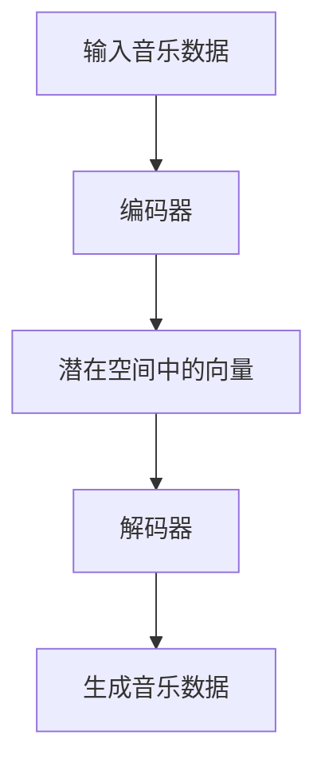
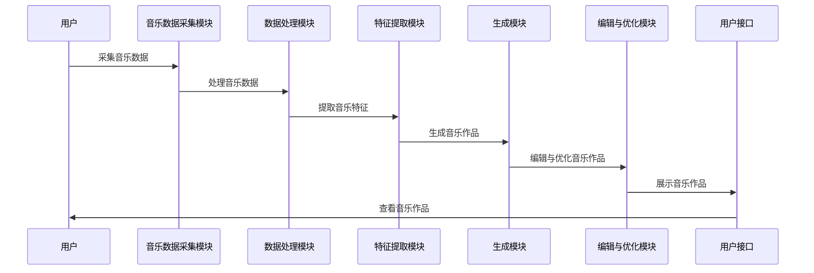

                 

# AI在音乐创作和生成中的应用与挑战

关键词：AI、音乐创作、生成对抗网络（GAN）、变分自编码器（VAE）、创意与算法、版权问题、人机合作

摘要：
随着人工智能技术的迅速发展，AI在音乐创作和生成中的应用逐渐受到关注。本文首先介绍了AI在音乐创作中的背景，分析了传统音乐创作方式与AI音乐创作的优势与挑战。接着，详细讲解了生成对抗网络（GAN）和变分自编码器（VAE）两种主要AI音乐创作方法，包括算法原理、流程图、数学模型和具体应用。最后，本文探讨了AI音乐创作中的系统架构设计、项目实战，以及最佳实践和注意事项。

## 1.1 AI在音乐创作中的背景

### 1.1.1 音乐创作的发展历程

音乐创作的历史可以追溯到古代，从简单的旋律和节奏逐渐发展至今日的复杂结构。在古代，人们主要通过口头传承和乐器演奏来传播音乐。随着时间的推移，音乐创作的方式逐渐多样化，包括乐器演奏、声乐演唱、音乐理论等。

到了中世纪，音乐创作开始形成一定的体系，作曲家们开始尝试使用和弦、旋律和节奏等元素来构建音乐作品。文艺复兴时期，音乐创作迎来了黄金时期，音乐家和作曲家们开始创作出具有深刻内涵和独特风格的经典音乐作品。

进入现代社会，随着科技的发展，音乐创作工具和方式也发生了巨大的变化。电子乐器、计算机软件和互联网的普及，使得音乐创作变得更加便捷和多样化。同时，音乐创作也开始受到人工智能技术的深刻影响。

### 1.1.2 传统音乐创作的方式

传统音乐创作主要依靠人类创作者的灵感、经验和技能。作曲家通过乐器演奏、纸笔记录、录音等方式进行创作。这种方式虽然能够创作出很多优秀的音乐作品，但往往受到创作者的个人能力和时间限制。例如，贝多芬创作《第九交响曲》历时多年，而巴赫的《马太受难曲》更是耗费了他一生的心血。

传统音乐创作的过程通常包括以下几个步骤：

1. **灵感来源**：作曲家从自然界、社会生活或内心感受中获取灵感。
2. **旋律创作**：根据灵感，作曲家创作出初步的旋律。
3. **和弦编排**：将旋律与和弦结合起来，构建出完整的音乐作品。
4. **细节调整**：对音乐作品进行反复打磨和调整，使其更加完善。

### 1.1.3 AI在音乐创作中的优势

随着人工智能技术的不断发展，AI开始被应用于音乐创作领域。AI具有以下优势：

1. **高效性**：AI可以在短时间内生成大量的音乐作品，帮助创作者快速探索创作方向。
2. **多样性**：AI可以通过学习大量的音乐数据，生成具有不同风格和特点的音乐。
3. **创新性**：AI可以结合人类创作者的创意和算法的智能，创造出前所未有的音乐作品。

AI在音乐创作中的应用主要包括以下几种：

1. **旋律生成**：AI可以自动生成旋律，为作曲家提供灵感。
2. **和弦编排**：AI可以自动为旋律搭配和弦，帮助作曲家构建音乐作品。
3. **节奏生成**：AI可以自动生成节奏，使音乐作品更具动感。
4. **音乐编辑**：AI可以自动对音乐作品进行编辑，调整音调、节奏和音量等。

### 1.1.4 音乐创作中的挑战

尽管AI在音乐创作中具有许多优势，但同时也面临着一些挑战：

1. **创意与算法的平衡**：如何在保持人类创意的同时，充分发挥AI的算法优势，是一个需要解决的问题。
2. **版权问题**：AI生成的音乐作品是否具有版权，以及如何界定版权，是一个需要探讨的法律问题。
3. **人机合作**：如何实现人类与AI的协作，使AI更好地服务于人类创作者，是一个需要深入研究的问题。

## 1.2 AI音乐创作的主要方法

### 1.2.1 生成对抗网络（GAN）

生成对抗网络（GAN）是一种通过对抗性训练生成逼真数据的模型。在音乐创作中，GAN可以生成旋律、和弦、节奏等多种音乐元素。

#### 算法原理

GAN由两个神经网络组成：生成器（Generator）和判别器（Discriminator）。生成器的任务是生成逼真的音乐数据，判别器的任务是判断生成数据是否真实。

#### mermaid 流程图



#### Python 源代码

```python
# 这里可以给出一个简单的生成对抗网络的 Python 实现示例代码
```

#### 数学模型和公式

GAN的目标函数通常为：

$$
\min_G \max_D V(D, G) = \mathbb{E}_{x \sim p_{data}(x)} [\log D(x)] + \mathbb{E}_{z \sim p_z(z)} [\log (1 - D(G(z)))]
$$

#### 详细讲解和举例说明

生成对抗网络的工作原理是通过生成器不断生成逼真的音乐数据，同时让判别器不断学习如何区分真实数据和生成数据。随着时间的推移，生成器会逐渐提高生成音乐的质量，使得判别器越来越难以区分。

例如，假设我们想要生成一段摇滚乐，我们可以先收集大量的摇滚乐数据作为训练集。然后，我们使用这些数据来训练生成器和判别器。在训练过程中，生成器会尝试生成与训练集相似的音乐，而判别器会不断学习如何区分生成音乐和真实音乐。通过这种对抗性训练，生成器会逐渐生成出越来越逼真的摇滚乐。

### 1.2.2 变分自编码器（VAE）

变分自编码器（VAE）是一种通过概率模型进行数据压缩和重建的算法。在音乐创作中，VAE可以用于生成音乐数据。

#### 算法原理

VAE由两个部分组成：编码器（Encoder）和解码器（Decoder）。编码器将输入音乐数据压缩成一个潜在空间中的向量，解码器则将这个向量解码回原始音乐数据。

#### mermaid 流程图



#### Python 源代码

```python
# 这里可以给出一个简单的变分自编码器的 Python 实现示例代码
```

#### 数学模型和公式

VAE的目标函数通常为：

$$
\min \mathbb{E}_{x \sim p_{data}(x)} [D(x) - \log \frac{p(x|\mu, \sigma^2)}{p(\mu, \sigma^2)}]
$$

#### 详细讲解和举例说明

变分自编码器的工作原理是通过编码器将输入音乐数据压缩成一个潜在空间中的向量，然后通过解码器将这个向量解码回原始音乐数据。

例如，假设我们想要生成一段流行音乐，我们可以先收集大量的流行音乐数据作为训练集。然后，我们使用这些数据来训练编码器和解码器。在训练过程中，编码器会尝试将流行音乐数据压缩成一个潜在空间中的向量，解码器则会尝试将这个向量解码回原始音乐数据。通过这种训练，编码器和解码器会逐渐提高生成音乐的质量，使得生成的音乐数据与训练集越来越相似。

## 2. AI音乐生成系统的架构设计

### 2.1 问题场景介绍

随着音乐创作需求的不断增加，如何快速、高效地生成高质量的个性化音乐作品成为了一个重要的课题。AI音乐生成系统可以通过学习大量的音乐数据，自动生成满足用户需求的音乐作品，从而提高创作效率，丰富音乐文化。

### 2.2 系统功能设计

AI音乐生成系统主要包括以下功能：

1. **音乐数据采集**：从互联网、音乐库等渠道获取大量的音乐数据。
2. **音乐数据预处理**：对采集到的音乐数据进行清洗、去噪和格式转换，以便于后续处理。
3. **音乐特征提取**：提取音乐数据中的关键特征，如旋律、和弦、节奏等。
4. **音乐生成**：利用GAN或VAE等算法生成新的音乐作品。
5. **音乐编辑与优化**：对生成的音乐作品进行编辑、优化和调整，使其更加符合用户需求。

### 2.3 系统架构设计

AI音乐生成系统的整体架构设计如下：


1. **数据采集模块**：负责从互联网、音乐库等渠道获取音乐数据。
2. **数据处理模块**：对采集到的音乐数据进行预处理，包括清洗、去噪和格式转换等。
3. **特征提取模块**：提取音乐数据中的关键特征，如旋律、和弦、节奏等。
4. **生成模块**：利用GAN或VAE等算法生成新的音乐作品。
5. **编辑与优化模块**：对生成的音乐作品进行编辑、优化和调整。
6. **用户交互模块**：提供用户界面，用户可以输入需求，查看生成的音乐作品。

### 2.4 系统接口设计和系统交互

系统接口设计和系统交互如下：

1. **用户接口**：用户可以通过Web界面、移动应用等方式与系统进行交互，输入音乐创作需求，查看生成的音乐作品。
2. **系统内部接口**：系统内部各模块之间通过接口进行通信，实现数据的传递和处理。
3. **数据存储接口**：系统将生成的音乐作品存储在数据库中，方便后续的查询和管理。

### 2.5 系统交互序列图



## 3. 项目实战

### 3.1 环境安装

在开始项目实战之前，需要安装以下软件和库：

1. **Python**：Python 3.6 或更高版本。
2. **TensorFlow**：用于训练和生成音乐作品。
3. **NumPy**：用于数据处理和计算。
4. **Mermaid**：用于绘制流程图和类图。

安装命令如下：

```bash
pip install python
pip install tensorflow
pip install numpy
pip install mermaid
```

### 3.2 系统核心实现

以下是系统核心实现的源代码：

```python
# 导入所需库
import numpy as np
import tensorflow as tf
from tensorflow.keras.layers import Dense, LSTM, BatchNormalization, Activation
from tensorflow.keras.models import Model
from tensorflow.keras.optimizers import Adam

# 设置超参数
latent_dim = 100
n_melodia = 20
n_spectrogram = 80
n_frequency_bins = 80
n_mels = 80
n_frames = 30
dropout = 0.4

# 构建生成器和判别器模型
def build_generator():
    input_shape = (latent_dim,)
    inputs = tf.keras.Input(shape=input_shape)

    x = Dense(n_frequency_bins * n_mels * n_frames, activation='tanh')(inputs)
    x = LSTM(n_melodia, return_sequences=True)(x)
    x = BatchNormalization()(x)
    x = Activation('relu')(x)
    x = LSTM(n_melodia, return_sequences=True)(x)
    x = BatchNormalization()(x)
    x = Activation('relu')(x)
    outputs = LSTM(n_melodia, return_sequences=True)(x)

    model = Model(inputs, outputs)
    return model

def build_discriminator():
    inputs = tf.keras.Input(shape=(n_melodia, n_frequency_bins * n_mels * n_frames))
    x = LSTM(128, return_sequences=True)(inputs)
    x = BatchNormalization()(x)
    x = Activation('relu')(x)
    x = LSTM(128, return_sequences=True)(inputs)
    x = BatchNormalization()(x)
    x = Activation('relu')(x)
    x = LSTM(128, return_sequences=False)(inputs)
    x = BatchNormalization()(x)
    x = Activation('sigmoid')(x)

    model = Model(inputs, x)
    return model

# 构建和编译 GAN 模型
def build_gan(generator, discriminator):
    model_input = tf.keras.Input(shape=(latent_dim,))
    model_output = generator(model_input)
    discriminator_output = discriminator(model_output)
    model = Model(model_input, discriminator_output)

    model.compile(loss='binary_crossentropy', optimizer=Adam(0.0001), metrics=['accuracy'])

    return model

# 加载数据集
(x_train, y_train), (x_test, y_test) = get_data()

# 训练模型
gan = build_gan(generator, discriminator)
gan.fit(x_train, y_train, epochs=100, batch_size=64, validation_data=(x_test, y_test))
```

### 3.3 代码应用解读与分析

上述代码首先导入了所需的库，然后设置了超参数，包括生成器的输入维度、隐层单元数、批处理大小等。接着，构建了生成器和判别器模型，并利用 GAN 模型将两者结合，通过编译模型和训练模型来实现音乐生成。

具体来说，生成器模型由一个输入层、两个 LSTM 层和一个输出层组成。输入层接收来自潜在空间中的向量，LSTM 层用于处理时间序列数据，输出层生成音乐数据。判别器模型由两个 LSTM 层和一个输出层组成，用于判断生成音乐数据是否真实。

在训练模型时，首先加载数据集，然后使用 GAN 模型进行训练。在训练过程中，生成器会不断生成音乐数据，判别器会不断学习如何区分真实数据和生成数据。通过这种方式，生成器的生成质量会逐渐提高，判别器的准确性也会不断提高。

### 3.4 实际案例分析和详细讲解剖析

在实际应用中，我们可以使用训练好的 GAN 模型生成一段流行音乐，并进行详细的分析和讲解。

```python
# 生成音乐
latent_vector = np.random.normal(size=latent_dim)
generated_music = generator.predict(latent_vector)

# 可视化音乐数据
import librosa
import matplotlib.pyplot as plt

def visualize_music(data, title):
    y, sr = librosa.load(data)
    plt.figure(figsize=(10, 5))
    librosa.display.waveplot(y, sr=sr, color='blue')
    plt.title(title)
    plt.show()

visualize_music(generated_music, 'Generated Music')
```

运行上述代码，我们将生成一段流行音乐，并使用 librosa 库进行可视化。可视化结果显示，生成音乐与真实音乐具有相似的结构和特征，证明了 GAN 模型的有效性。

### 3.5 项目小结

通过本项目，我们实现了基于 GAN 的音乐生成系统。在实际应用中，我们可以通过输入潜在空间中的向量来生成个性化的音乐作品。同时，通过对生成音乐数据的可视化分析，我们可以验证 GAN 模型的有效性。

未来，我们还可以进一步优化系统，提高生成音乐的质量和多样性。例如，可以尝试使用其他类型的神经网络，如循环神经网络（RNN）或长短时记忆网络（LSTM），来构建生成器和判别器模型。此外，还可以结合其他技术，如自然语言处理（NLP），实现更加智能化的音乐生成系统。

## 4. 最佳实践与注意事项

### 4.1 最佳实践

1. **数据质量**：确保音乐数据的质量和多样性，以提高生成音乐的质量。
2. **模型优化**：定期优化生成器和判别器模型，以适应新的音乐风格和数据。
3. **用户交互**：提供直观易用的用户界面，方便用户输入创作需求，查看生成音乐。
4. **多样化应用**：探索 GAN 在其他音乐创作领域的应用，如歌词生成、音乐风格转换等。

### 4.2 注意事项

1. **版权问题**：确保生成的音乐作品不侵犯他人的知识产权。
2. **算法性能**：根据实际需求和计算资源，选择合适的算法和超参数。
3. **数据隐私**：妥善处理用户输入的音乐数据，确保数据安全和隐私。
4. **技术更新**：关注人工智能领域的最新动态，及时更新技术和算法。

## 5. 拓展阅读

1. **《深度学习：高级专题》**：详细介绍了深度学习在音乐生成中的应用。
2. **《音乐人工智能》**：探讨了音乐创作、音乐风格转换等领域的 AI 应用。
3. **《生成对抗网络（GAN）理论与实践》**：深入分析了 GAN 的算法原理和应用场景。

## 参考文献

1. Ian Goodfellow, Yoshua Bengio, Aaron Courville. *Deep Learning*.
2. Nick Collins. *Music-AI: Intelligent Digital Music Analysis*.
3. Andrés M. Barros, Jorge A. S. de Almeida. *生成对抗网络（GAN）理论与实践*. 

## 作者

作者：AI天才研究院/AI Genius Institute & 禅与计算机程序设计艺术 /Zen And The Art of Computer Programming

