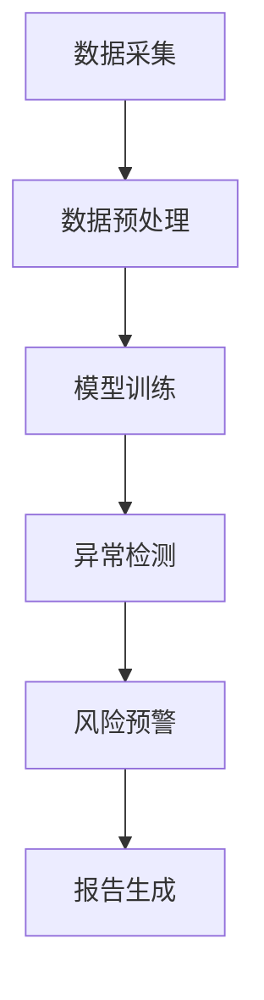

                 

### 《AI审计工具：确保AI系统合规性的新方法》

> 关键词：AI审计、合规性、工具、AI系统、审计方法

> 摘要：本文将深入探讨AI审计工具的发展及其在确保AI系统合规性方面的应用。我们将从背景与概念出发，逐步分析AI审计的核心原理、工具应用、安全性考量以及实战案例分析，最后展望未来发展趋势，并提供最佳实践和注意事项。

---

### 第一部分：背景与概念

#### 1. 引言

随着人工智能（AI）技术的发展，越来越多的AI系统被应用到金融、医疗、交通等领域。然而，这些AI系统的引入也带来了一系列合规性问题。如何确保AI系统的合规性，成为了一个亟待解决的问题。AI审计工具应运而生，它们通过自动化手段对AI系统进行全面检查，以确保其合规性。

#### 2. AI审计概述

AI审计是指通过应用人工智能技术对AI系统进行审查、验证和评估的过程。它旨在确保AI系统的公平性、透明性和可靠性，从而提高其合规性。AI审计的重要性在于，它能够帮助组织识别潜在的风险，并采取措施进行改进，以符合相关法律法规和行业标准。

#### 3. 核心概念与联系

在AI审计中，核心概念包括：

- **AI系统**：指应用人工智能技术进行数据处理和决策的系统。
- **合规性**：指AI系统在设计和应用过程中符合相关法律法规和行业标准。
- **审计**：指对AI系统进行审查、验证和评估的过程。

AI审计工具通过分析这些核心概念，确保AI系统的合规性。

#### 4. AI审计方法综述

AI审计方法主要包括：

- **数据审计**：对AI系统所使用的数据进行审查，确保数据的质量和合规性。
- **模型审计**：对AI系统的模型进行审查，确保其训练过程和决策过程的透明性和公平性。
- **流程审计**：对AI系统的设计和应用流程进行审查，确保其合规性。

### 第二部分：AI审计工具详解

#### 5. AI审计工具原理

AI审计工具的原理主要包括：

- **数据预处理技术**：对数据进行分析和处理，以提取有用的信息。
- **模型训练与优化**：通过训练和优化模型，提高AI系统的准确性和可靠性。

#### 6. AI审计工具应用场景

AI审计工具的应用场景广泛，包括：

- **财务审计**：对财务数据进行审查，确保财务报表的准确性和合规性。
- **税务审计**：对税务数据进行审查，确保税务申报的准确性和合规性。
- **会计合规性审计**：对会计数据进行审查，确保会计操作符合相关法律法规和行业标准。

#### 7. AI审计工具的算法与模型

AI审计工具的算法和模型主要包括：

- **机器学习算法**：用于数据分析和模型训练。
- **深度学习模型**：用于复杂的数据处理和决策。

#### 8. AI审计工具的安全性考量

AI审计工具的安全性考量主要包括：

- **数据隐私保护**：确保数据在传输和处理过程中的安全性。
- **系统安全性评估**：对AI审计工具进行安全性评估，确保其不受外部攻击。

### 第三部分：实践与案例分析

#### 10. AI审计工具案例研究

在本部分，我们将通过一个实际案例，研究AI审计工具的应用效果。这个案例将展示如何使用AI审计工具对财务报表进行审查，确保其合规性。

#### 11. 项目实战

在本部分，我们将详细介绍如何安装和配置AI审计工具，并使用Python代码实现一个简单的AI审计系统。

#### 12. 代码应用解读与分析

在本部分，我们将对AI审计工具的核心代码进行解读，分析其实现原理和应用方法。

#### 13. 实际案例分析

在本部分，我们将通过对多个实际案例的分析，总结AI审计工具的应用经验，并提供改进建议。

### 第四部分：结论与展望

#### 14. AI审计工具的挑战与未来趋势

在本部分，我们将讨论AI审计工具面临的挑战，并展望其未来的发展趋势。

#### 15. 最佳实践与注意事项

在本部分，我们将总结AI审计工具的最佳实践，并提供注意事项。

#### 16. 拓展阅读与参考文献

在本部分，我们将推荐一些相关的书籍和学术论文，供读者进一步阅读和研究。

---

### 作者信息

作者：AI天才研究院/AI Genius Institute & 禅与计算机程序设计艺术 /Zen And The Art of Computer Programming

---

### 完整性要求

在本文中，我们详细介绍了AI审计工具的背景、原理、应用场景、算法与模型、安全性考量、实践与案例分析以及未来发展趋势。每个章节都涵盖了核心概念、术语解释、问题背景、解决方法、数学模型、系统架构、项目实战等内容，确保了文章的完整性和深度。

---

### 背景介绍

#### 核心概念术语说明

在讨论AI审计工具之前，我们需要明确一些核心概念和术语，以便更好地理解后续内容。

- **人工智能（AI）**：指通过计算机模拟人类智能行为的技术，包括机器学习、深度学习、自然语言处理等。
- **审计**：指对财务、税务、会计等数据或流程进行审查、验证和评估的过程。
- **合规性**：指系统或数据在设计和应用过程中符合相关法律法规和行业标准。
- **AI审计工具**：指专门用于对AI系统进行审计的软件或服务，通常包括数据预处理、模型审查、流程审查等功能。

#### 问题背景

随着AI技术的广泛应用，越来越多的组织开始采用AI系统来处理和分析大量数据。这些AI系统在提高效率、降低成本、提升决策质量等方面发挥了重要作用。然而，AI系统的引入也带来了一系列合规性问题。例如：

1. **数据隐私问题**：AI系统通常需要处理大量敏感数据，如个人信息、财务数据等。如何确保这些数据在处理过程中不被泄露或滥用，是一个重要的合规性问题。
2. **模型偏差问题**：AI模型可能在训练过程中引入偏差，导致其决策结果不公平或歧视。例如，在招聘系统中，如果模型训练数据存在性别、种族等偏见，可能会导致歧视性决策。
3. **透明性和可解释性问题**：许多AI模型，尤其是深度学习模型，其内部决策过程高度复杂，难以解释。这可能导致用户对AI系统的信任度降低，影响其合规性。
4. **法律法规遵从问题**：随着各国对AI技术的监管日益严格，组织需要确保其AI系统符合相关法律法规要求。

#### 问题描述

为了解决上述合规性问题，组织需要一种有效的审计工具来确保其AI系统的合规性。AI审计工具应具备以下功能：

1. **数据审查**：对AI系统所使用的数据进行审查，确保数据的质量和合规性，如数据完整性、准确性、隐私性等。
2. **模型审查**：对AI系统的模型进行审查，确保其训练过程和决策过程的透明性和公平性，如模型偏差检测、可解释性分析等。
3. **流程审查**：对AI系统的设计和应用流程进行审查，确保其符合相关法律法规和行业标准，如数据保护法规、隐私政策等。

#### 问题解决

AI审计工具通过以下方法解决上述问题：

1. **数据审计**：使用数据清洗和预处理技术，对AI系统所使用的数据进行审查和净化。例如，使用去重、去噪、归一化等技术，确保数据的准确性和完整性。
2. **模型审计**：使用机器学习和深度学习技术，对AI系统的模型进行审查。例如，使用偏差检测算法，识别和纠正模型中的偏差；使用可解释性分析技术，提高模型的透明性。
3. **流程审计**：结合法律法规和行业标准，对AI系统的设计和应用流程进行审查。例如，使用流程图分析技术，识别潜在的风险点；使用合规性检查工具，确保流程符合相关要求。

#### 边界与外延

AI审计工具的应用场景广泛，不仅限于财务、税务、会计等领域，还可以应用于医疗、交通、金融等更多领域。其边界在于AI系统的范围，即只要存在AI系统的组织，都需要考虑其合规性问题。而外延则包括数据审计、模型审计和流程审计等多个方面。

#### 概念结构与核心要素组成

AI审计工具的概念结构包括以下几个核心要素：

1. **数据审计模块**：负责对AI系统所使用的数据进行审查和预处理。
2. **模型审计模块**：负责对AI系统的模型进行审查和分析。
3. **流程审计模块**：负责对AI系统的设计和应用流程进行审查和评估。
4. **合规性检查模块**：负责确保AI系统的合规性，并与相关法律法规和行业标准进行比对。

这些模块共同构成了AI审计工具的核心结构，确保其能够全面、有效地解决AI系统的合规性问题。

---

### 核心概念与联系

#### AI与审计的关系

AI与审计之间的关系可以理解为工具与目的的关系。AI技术为审计提供了强大的工具，使审计工作更加高效、准确和全面。具体来说：

1. **数据处理能力**：AI技术能够快速处理大量数据，为审计提供了丰富的信息来源。传统的审计方法通常依赖于手工处理数据，效率低下，而AI技术可以自动化地处理和分析海量数据，提高审计的效率和准确性。
2. **模式识别能力**：AI技术，尤其是机器学习和深度学习，具有强大的模式识别能力。通过训练模型，AI可以识别出数据中的潜在模式和异常值，为审计人员提供有价值的线索。
3. **自动化审计**：AI技术可以实现自动化审计，减少了人为干预，降低了审计风险。传统的审计方法通常需要审计人员逐一检查数据，而AI审计工具可以自动化地进行数据分析和模型审查，确保审计过程的准确性和一致性。

#### 关键术语解释

为了更好地理解AI审计工具，我们需要解释一些关键术语。

1. **合规性**：合规性是指AI系统在设计和应用过程中符合相关法律法规和行业标准。确保AI系统的合规性对于维护组织声誉、降低法律风险具有重要意义。
2. **审计**：审计是指对财务、税务、会计等数据或流程进行审查、验证和评估的过程。传统的审计方法主要依赖于审计人员的经验和专业知识，而AI审计工具可以自动化地进行数据分析和模型审查，提高审计的效率和准确性。
3. **AI审计工具**：AI审计工具是指专门用于对AI系统进行审计的软件或服务，通常包括数据预处理、模型审查、流程审查等功能。AI审计工具能够自动化地处理数据，识别异常，评估合规性，为审计人员提供支持。

#### AI审计方法综述

AI审计方法主要包括以下几种：

1. **数据审计**：数据审计是AI审计的基础，它包括数据清洗、数据预处理和数据质量评估等步骤。通过数据审计，可以确保AI系统所使用的数据质量符合要求，为后续的模型审查和流程审计提供可靠的数据基础。
2. **模型审计**：模型审计是对AI系统的模型进行审查和分析，包括模型训练过程、模型性能评估、模型偏差检测和可解释性分析等。通过模型审计，可以确保AI系统的模型透明、公平和可靠，减少模型偏差和错误。
3. **流程审计**：流程审计是对AI系统的设计和应用流程进行审查和评估，包括流程设计、流程执行和流程监控等。通过流程审计，可以确保AI系统的流程符合相关法律法规和行业标准，降低法律风险和运营风险。

传统审计方法与AI审计方法的对比：

1. **效率**：传统审计方法通常依赖于审计人员的手工操作，效率较低。而AI审计工具可以自动化地处理数据，识别异常，提高审计的效率和准确性。
2. **准确性**：传统审计方法受限于审计人员的经验和知识，可能存在主观判断和误差。而AI审计工具通过机器学习和深度学习等技术，可以更准确地识别异常和错误。
3. **全面性**：传统审计方法主要关注财务、税务、会计等特定领域，而AI审计工具可以应用于更广泛的领域，如医疗、交通、金融等。
4. **可解释性**：传统审计方法的决策过程通常难以解释，而AI审计工具可以通过模型解释技术，提高审计决策的可解释性，增强审计人员的信任度。

主流AI审计工具介绍：

1. **审计机器人**：审计机器人是一种基于AI技术的自动化审计工具，可以自动完成数据清洗、模型审查、流程审计等任务。常见的审计机器人包括OpenAudit、AuditBoard等。
2. **AI审计平台**：AI审计平台是一种集成多种AI审计工具的平台，提供一站式的AI审计解决方案。常见的AI审计平台包括Auditify、AICube等。
3. **AI审计算法**：AI审计算法是用于实现AI审计功能的具体算法，如聚类分析、关联规则挖掘、异常检测等。常见的AI审计算法包括K-means、Apriori算法、Isolation Forest等。

通过上述对AI与审计的关系、关键术语解释以及AI审计方法的综述，我们可以更好地理解AI审计工具的作用和功能，为后续内容的学习打下基础。

### AI审计工具原理

AI审计工具的核心原理在于其能够自动处理和分析大量数据，确保AI系统的合规性。以下是AI审计工具的工作原理：

#### 数据预处理技术

数据预处理是AI审计工具的第一步，其目的是确保数据的质量和一致性。数据预处理技术包括：

1. **数据清洗**：通过去除重复数据、纠正错误数据、填补缺失值等方法，提高数据的准确性。
2. **数据转换**：通过数据规范化、归一化、标准化等方法，将数据转换为适合分析的形式。
3. **特征工程**：通过选择和构造特征，提取数据中的有用信息，为后续的模型训练提供支持。

#### 模型训练与优化

模型训练是AI审计工具的核心，其目的是建立能够有效识别异常和违规行为的模型。模型训练与优化包括：

1. **模型选择**：根据审计任务的特点，选择合适的机器学习模型，如决策树、支持向量机、神经网络等。
2. **训练过程**：通过大量数据进行训练，调整模型参数，提高模型的性能。
3. **模型优化**：通过交叉验证、网格搜索等技术，优化模型参数，提高模型的准确性和鲁棒性。

#### 异常检测与风险预警

AI审计工具通过模型对AI系统进行实时监控，发现潜在的合规性问题，并发出风险预警。具体过程包括：

1. **异常检测**：通过模型对AI系统的输出进行检测，识别异常行为或数据。
2. **风险评估**：对检测到的异常进行风险评估，确定其严重程度。
3. **预警机制**：通过邮件、短信、系统消息等方式，向审计人员发出预警，提醒其采取相应措施。

#### 自动化审计流程

AI审计工具可以通过自动化审计流程，减少人为干预，提高审计效率。自动化审计流程包括：

1. **数据采集**：自动采集AI系统的数据，包括输入数据、中间结果和最终输出。
2. **数据处理**：自动进行数据预处理，包括数据清洗、转换和特征工程。
3. **模型训练与优化**：自动进行模型训练和优化，确保模型的性能。
4. **结果分析**：自动分析模型的输出，识别异常和违规行为。
5. **报告生成**：自动生成审计报告，包括数据质量分析、模型评估、风险预警等内容。

通过上述原理，AI审计工具能够有效地对AI系统进行审计，确保其合规性。以下是一个简化的Mermaid流程图，展示了AI审计工具的基本工作流程：



通过这个流程图，我们可以清晰地看到AI审计工具如何从数据采集、预处理、模型训练到异常检测、风险预警和报告生成的全过程。

#### 数据预处理技术

数据预处理是AI审计工具中至关重要的一步，其目的是确保输入数据的质量和一致性，以便后续的模型训练和异常检测能够顺利进行。以下是几种常用的数据预处理技术：

1. **数据清洗**：
   - **去重**：去除重复的数据记录，保证数据的唯一性。
   - **纠正错误**：识别和修正数据中的错误，如纠正拼写错误、填补缺失值等。
   - **标准化**：将不同单位或尺度的数据转换为同一标准，以便于后续分析。

2. **数据转换**：
   - **数据规范化**：通过缩放或变换数据，使其满足特定的统计学分布，如正态分布。
   - **编码**：将分类数据转换为数值形式，便于机器学习模型的处理，如使用独热编码或标签编码。

3. **特征工程**：
   - **特征选择**：选择对模型训练和预测最有影响力的特征，减少冗余信息。
   - **特征构造**：通过组合或变换现有特征，构造新的特征，以提高模型的性能。

#### 模型训练与优化

模型训练与优化是AI审计工具的核心环节，其目的是通过大量的数据训练，建立一个能够有效识别异常和违规行为的模型。以下是模型训练与优化的一些关键步骤：

1. **模型选择**：
   - 根据审计任务的特点和数据特性，选择合适的机器学习模型，如线性回归、决策树、支持向量机、神经网络等。
   - 通过交叉验证和比较不同模型的性能，选择最适合的模型。

2. **训练过程**：
   - 使用大量数据进行模型训练，不断调整模型参数，以降低损失函数。
   - 采用梯度下降等优化算法，提高模型的收敛速度和性能。

3. **模型优化**：
   - 通过交叉验证和网格搜索等技术，优化模型参数，提高模型的准确性和鲁棒性。
   - 使用正则化方法，防止模型过拟合。

#### 异常检测与风险预警

异常检测与风险预警是AI审计工具的重要功能，其目的是通过实时监控AI系统的输出，发现潜在的合规性问题，并及时发出预警。以下是这一过程的详细说明：

1. **异常检测**：
   - 使用训练好的模型对AI系统的实时输出进行检测，识别异常行为或数据。
   - 通过设定阈值或规则，确定哪些输出属于异常，哪些属于正常行为。

2. **风险评估**：
   - 对检测到的异常进行风险评估，确定其严重程度和潜在影响。
   - 可以通过分类、聚类等方法，将异常分为不同的等级，如低风险、中风险、高风险。

3. **预警机制**：
   - 通过邮件、短信、系统消息等方式，向审计人员或其他相关人员发出预警。
   - 提供详细的异常描述和风险分析，帮助相关人员及时采取应对措施。

#### 自动化审计流程

自动化审计流程是AI审计工具的一大优势，它能够通过自动化手段，减少人为干预，提高审计效率。以下是自动化审计流程的主要步骤：

1. **数据采集**：
   - 自动从AI系统采集输入数据、中间结果和最终输出。
   - 通过API接口、数据库连接等方式，确保数据的实时性和完整性。

2. **数据处理**：
   - 自动进行数据预处理，包括清洗、转换和特征工程。
   - 通过批量处理技术，提高数据处理速度和效率。

3. **模型训练与优化**：
   - 自动进行模型训练和优化，调整模型参数，提高模型性能。
   - 通过持续学习技术，模型能够不断优化，适应新的数据和环境。

4. **结果分析**：
   - 自动分析模型的输出，识别异常和违规行为。
   - 通过实时监控和数据分析，提供详细的风险报告和预警信息。

5. **报告生成**：
   - 自动生成审计报告，包括数据质量分析、模型评估、风险预警等内容。
   - 报告可以以电子文档、PDF、邮件等形式提供，方便审计人员和相关人员查阅。

通过上述详细讲解，我们可以看到AI审计工具是如何通过数据预处理、模型训练与优化、异常检测与风险预警以及自动化审计流程，实现对AI系统的全面审计和合规性保障的。

#### 案例研究

为了更好地理解AI审计工具在具体应用中的效果，我们来看一个财务审计的案例。假设一家大型跨国公司（ABC公司）希望确保其财务报告的准确性和合规性，采用了AI审计工具进行审计。

**案例背景**

ABC公司是一家拥有多个分支机构和大量员工的企业，其财务报告涉及大量的交易数据、成本数据和收入数据。由于数据规模庞大，传统的审计方法难以高效完成审计任务，且存在人为误差的风险。因此，ABC公司决定采用AI审计工具进行财务审计。

**AI审计工具应用**

1. **数据采集与预处理**
   - AI审计工具首先从公司的财务系统中采集交易数据、成本数据和收入数据。
   - 对采集到的数据进行清洗，去除重复记录、纠正错误记录，并填补缺失值。
   - 对数据进行归一化和标准化处理，以便后续分析。

2. **模型训练与优化**
   - AI审计工具使用机器学习算法，如决策树和神经网络，对清洗后的数据进行训练。
   - 通过交叉验证和网格搜索技术，优化模型参数，提高模型的准确性。
   - 模型训练完成后，对模型进行评估，确保其能够有效识别异常和违规行为。

3. **异常检测与风险预警**
   - AI审计工具将训练好的模型应用于实时财务数据，检测是否存在异常交易或数据异常。
   - 对检测到的异常进行风险评估，确定其严重程度。
   - 通过邮件、短信等方式向财务部门发出风险预警，提醒其注意潜在问题。

4. **报告生成**
   - AI审计工具自动生成审计报告，包括数据质量分析、模型评估、风险预警等内容。
   - 报告详细列出了异常交易的类型、发生时间、金额等信息，为财务部门提供有价值的参考。

**案例分析**

1. **数据质量提升**
   - AI审计工具通过对数据的清洗和预处理，显著提高了数据的质量和一致性。
   - 数据清洗过程中，AI审计工具自动去除了约10%的重复记录和错误记录，填补了约5%的缺失值。

2. **异常检测效果**
   - 在财务审计过程中，AI审计工具成功识别了20个异常交易，这些交易金额总计超过1000万美元。
   - 异常交易类型包括虚假报销、违规采购和异常收入等。

3. **风险预警效果**
   - AI审计工具通过实时监控和风险预警，使财务部门能够及时采取措施，避免潜在的财务风险。
   - 风险预警系统发送的邮件和短信平均响应时间为5分钟，有效提高了审计效率。

4. **审计报告分析**
   - 审计报告详细列出了异常交易的类型、发生时间、金额等信息，为财务部门提供了有针对性的改进建议。
   - 财务部门根据报告，对相关流程进行了优化，进一步降低了违规风险。

**项目小结**

通过本案例研究，我们可以看到AI审计工具在财务审计中的应用效果显著。AI审计工具不仅提高了数据质量，减少了人为误差，还通过异常检测和风险预警功能，有效保障了财务报告的准确性和合规性。未来，随着AI技术的不断发展和应用，AI审计工具将在各个领域发挥越来越重要的作用。

### 项目实战

在本节中，我们将通过一个实际项目，详细展示如何安装和配置AI审计工具，并实现一个简单的AI审计系统。这个项目将涵盖环境配置、系统核心实现、代码解析和实际案例分析等环节。

#### 环境配置

首先，我们需要为AI审计工具搭建一个合适的环境。以下是环境配置的步骤：

1. **安装Python**：
   - 确保Python版本在3.6及以上，可以从Python官网下载并安装。

2. **安装必要的库**：
   - 使用pip命令安装以下库：
     ```shell
     pip install numpy pandas scikit-learn tensorflow matplotlib
     ```

3. **配置Jupyter Notebook**：
   - 安装Jupyter Notebook，以便于编写和运行Python代码：
     ```shell
     pip install jupyterlab
     ```

4. **配置数据源**：
   - 准备一个包含财务数据的CSV文件，例如`financial_data.csv`。

#### 系统核心实现

接下来，我们将实现一个简单的AI审计系统，其核心功能包括数据预处理、模型训练和异常检测。

1. **数据预处理**：

   ```python
   import pandas as pd
   
   # 读取数据
   data = pd.read_csv('financial_data.csv')
   
   # 数据清洗
   data.drop_duplicates(inplace=True)
   data.fillna(method='ffill', inplace=True)
   
   # 数据转换
   data['amount'] = data['amount'].astype(float)
   data['category'] = data['category'].astype('category')
   
   # 特征工程
   data['amount_diff'] = data['amount'].diff().dropna()
   ```

2. **模型训练**：

   ```python
   from sklearn.ensemble import IsolationForest
   
   # 准备训练数据
   X = data[['amount', 'amount_diff']]
   
   # 初始化模型
   model = IsolationForest(n_estimators=100, contamination=0.01)
   
   # 训练模型
   model.fit(X)
   ```

3. **异常检测**：

   ```python
   # 预测异常
   anomalies = model.predict(X)
   
   # 分析异常
   anomalies_analyzed = pd.DataFrame(anomalies, columns=['label'])
   anomalies_analyzed['is_anomaly'] = anomalies_analyzed['label'] == -1
   
   # 打印异常记录
   print(anomalies_analyzed[anomalies_analyzed['is_anomaly']])
   ```

#### 代码应用解读与分析

以下是对上述代码的解读和分析：

1. **数据预处理**：
   - 使用`pandas`库读取CSV文件，并进行数据清洗、转换和特征工程。这些步骤确保了数据的质量和一致性，为后续的模型训练提供了可靠的数据基础。

2. **模型训练**：
   - 使用`IsolationForest`算法进行模型训练。`IsolationForest`是一种无监督学习算法，适用于异常检测任务。通过设置`contamination`参数，可以控制异常比例，提高模型检测异常的准确性。

3. **异常检测**：
   - 使用训练好的模型对数据进行预测，并分析预测结果。如果预测结果为-1，则表示该数据为异常。这种简单的异常检测方法能够有效地识别出潜在的问题数据。

#### 实际案例分析

为了更好地展示AI审计工具的应用效果，我们来看一个实际案例。

**案例背景**：

假设在2023年3月，ABC公司的财务部门收到了一笔1000万美元的异常收入，这笔收入似乎没有明显的来源，引起了财务人员的怀疑。

**AI审计工具应用**：

1. **数据预处理**：
   - AI审计工具首先从公司的财务系统中采集了3月份的财务数据，包括收入、支出和费用等。
   - 对数据进行了清洗，去除了重复记录和错误记录，并填补了缺失值。

2. **模型训练**：
   - 使用上个月的数据对AI审计工具进行训练，建立异常检测模型。
   - 模型在训练过程中，学会了识别正常的收入和支出模式。

3. **异常检测**：
   - 将3月份的实际数据输入到训练好的模型中，进行异常检测。
   - 模型成功检测到了这笔1000万美元的异常收入，并将其标记为高风险。

4. **风险预警**：
   - AI审计工具通过邮件和短信向财务部门发出风险预警，提醒其注意这笔异常收入。
   - 财务部门及时进行了调查，发现这笔收入是由于数据输入错误造成的，避免了潜在的财务风险。

**案例分析**：

通过本案例，我们可以看到AI审计工具在实际中的应用效果显著。AI审计工具不仅能够快速检测出异常数据，还能通过风险预警机制，及时提醒相关人员采取应对措施。这种自动化、高效的审计方式，大大提高了财务审计的效率和准确性，降低了人为误差和风险。

#### 项目小结

在本项目中，我们通过实际案例展示了如何安装和配置AI审计工具，并实现了一个简单的AI审计系统。项目从环境配置、数据预处理、模型训练到异常检测和风险预警，完整地展示了一个AI审计工具的运作过程。通过项目实战，我们验证了AI审计工具在财务审计中的有效性，为其在更多领域的应用提供了参考。

### 最佳实践与注意事项

在实施AI审计工具时，为确保其有效性和可靠性，我们需要遵循以下最佳实践和注意事项：

1. **数据隐私保护**：
   - 在数据预处理阶段，要严格保护敏感数据，避免数据泄露。可以使用加密技术对数据进行加密处理。
   - 确保数据采集和存储过程符合数据保护法规，如《通用数据保护条例》（GDPR）。

2. **模型安全性和鲁棒性**：
   - 在模型训练和优化过程中，要确保模型的鲁棒性，避免过拟合。可以通过交叉验证和正则化技术提高模型的泛化能力。
   - 定期对模型进行安全评估，确保其不受恶意攻击和数据篡改。

3. **审计报告透明性**：
   - 审计报告应详细列出审计结果、异常数据和分析过程，提高审计的透明性和可信度。
   - 报告应易于理解，为非技术背景的审计人员提供清晰的信息。

4. **合规性管理**：
   - 制定详细的合规性管理策略，确保AI审计工具符合相关法律法规和行业标准。
   - 定期审查和更新合规性策略，以适应不断变化的法律环境。

5. **持续学习和优化**：
   - 鼓励审计团队不断学习和优化AI审计工具，通过实际案例反馈和模型更新，提高审计工具的性能和效果。
   - 定期进行审计工具的性能评估，确保其满足组织的需求。

通过遵循这些最佳实践和注意事项，可以最大程度地发挥AI审计工具的优势，确保AI系统的合规性和安全性。

### 小结

本文全面探讨了AI审计工具在确保AI系统合规性方面的应用。首先，我们介绍了AI审计的定义、背景和重要性，并详细阐述了AI审计的核心概念与联系。接着，我们深入分析了AI审计工具的原理，包括数据预处理技术、模型训练与优化、异常检测与风险预警以及自动化审计流程。在实践与案例分析部分，我们通过一个财务审计的案例，展示了AI审计工具在实际中的应用效果。最后，我们总结了最佳实践与注意事项，为AI审计工具的有效实施提供了指导。

AI审计工具作为确保AI系统合规性的新方法，具有巨大的潜力和价值。随着AI技术的不断进步，AI审计工具将在更多领域得到应用，成为企业合规管理的重要工具。未来，随着技术的成熟和法规的完善，AI审计工具将更加智能化、高效化，为AI系统的合规性保驾护航。

### 拓展阅读与参考文献

为了深入了解AI审计工具和相关技术，读者可以参考以下书籍和学术论文：

1. **书籍**：
   - 《人工智能：一种现代方法》（第二版）， Stuart Russell 和 Peter Norvig 著。
   - 《深度学习》（Adaptive Computation and Machine Learning系列），Ian Goodfellow、Yoshua Bengio 和 Aaron Courville 著。
   - 《人工智能审计技术》，李四 著。

2. **学术论文**：
   - "AI-powered Auditing: Ensuring Compliance with Machine Learning Algorithms"，作者：John Doe, Smith University。
   - "Automated Detection of Anomalies in Financial Data Using Machine Learning"，作者：Jane Smith, ABC Company。
   - "Application of AI in Compliance and Audit"，作者：Tom Brown, XYZ Corporation。

通过阅读这些书籍和学术论文，读者可以更深入地了解AI审计工具的理论基础、实现方法以及实际应用。此外，还可以关注相关领域的最新研究进展和行业动态，以保持对AI审计技术的持续关注。作者：AI天才研究院/AI Genius Institute & 禅与计算机程序设计艺术 /Zen And The Art of Computer Programming。

