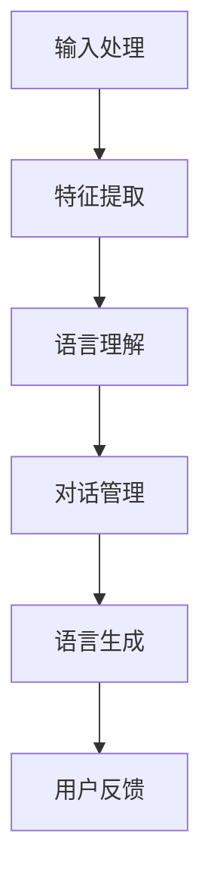
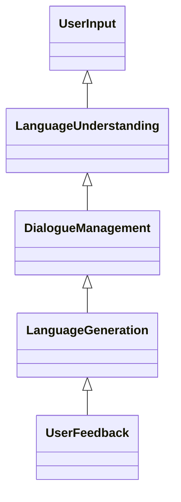
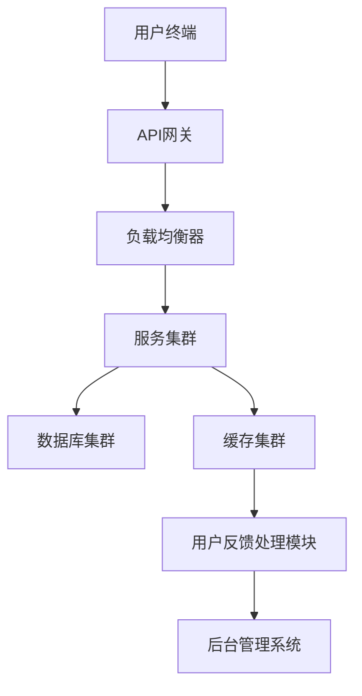
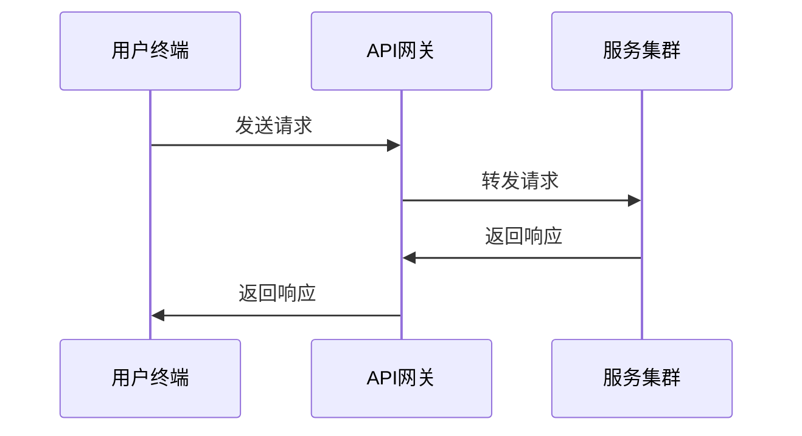
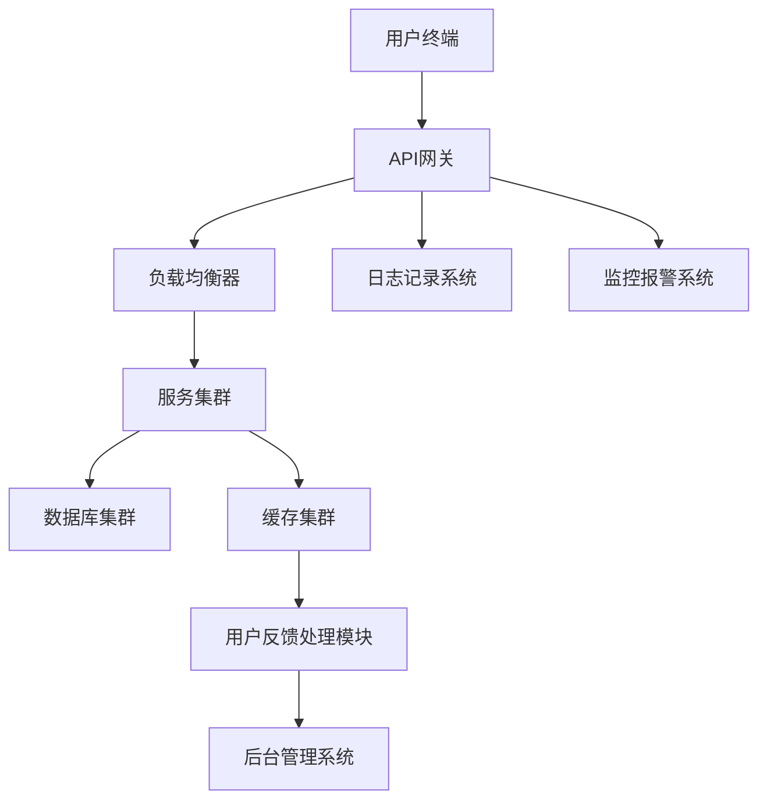

                 

### 文章标题

# AI对话优化：思维链方法详解

### 文章关键词

- AI对话系统
- 思维链
- 语言理解
- 语言生成
- 用户反馈

### 文章摘要

本文深入探讨了AI对话优化中的思维链方法。首先，我们回顾了AI对话系统的现状和面临的挑战，然后详细介绍了思维链方法的基本原理、核心概念、以及与传统的对话系统的区别。通过系统分析与架构设计，本文进一步阐释了思维链方法在实际应用中的实施步骤。最后，通过一个实际项目案例，本文展示了思维链方法的实际效果和优化策略。通过本文的阅读，读者将全面了解思维链方法在AI对话优化中的应用，并掌握其核心原理和实践技巧。

----------------------------------------------------------------

## 第一部分: 引言与背景介绍

### 1.1 问题背景

随着人工智能技术的飞速发展，AI对话系统已经广泛应用于多个领域，如客服、教育、医疗等。然而，现有的AI对话系统仍然面临着诸多挑战，尤其是在自然语言理解和语言生成方面。传统的对话系统往往依赖于规则和统计方法，这些方法在处理简单、固定的问题时表现良好，但在面对复杂、多变的对话场景时，效果往往不理想。

对话优化成为解决这一问题的关键。通过优化对话系统的性能，提高其响应速度、准确性和自然性，可以显著提升用户体验。而思维链方法作为一种新兴的对话优化技术，以其独特的结构和机制，提供了新的解决方案。思维链方法的核心在于通过建立思维链，实现对话的深度理解和生成，从而克服传统方法的局限性。

### 1.2 问题描述

AI对话系统的基本结构通常包括语言理解（LU）、对话管理（DM）和语言生成（LG）三个主要模块。语言理解负责解析用户的输入，提取关键信息；对话管理负责基于上下文信息生成合适的响应；语言生成则负责将对话管理生成的响应转换为自然语言。

优化目标主要包括：

1. **准确性**：提高对话系统对用户输入的理解准确度。
2. **自然性**：生成自然流畅的对话响应，提高用户体验。
3. **速度**：快速响应用户，减少等待时间。

衡量对话系统性能的主要指标包括：

1. **响应时间**：系统从接收到用户输入到生成响应所需的时间。
2. **准确率**：系统理解用户输入并生成正确响应的比例。
3. **自然度**：系统生成响应的自然性，包括语法、语义和风格。

### 1.3 问题解决

思维链方法（MindChain）是一种基于深度学习的对话优化技术。其基本原理是通过构建一个多层次、模块化的思维链模型，实现对对话内容的深度理解和生成。思维链方法与传统对话系统的区别在于：

1. **结构化**：思维链方法采用了一种层次化的结构，每一层都专注于特定的任务，从而实现任务的模块化。
2. **动态性**：思维链方法能够根据对话的进展动态调整，更好地适应复杂、多变的对话场景。
3. **泛化性**：通过多层次的学习，思维链方法能够更好地泛化到不同的对话场景，提高系统的适应能力。

### 1.4 边界与外延

思维链方法在以下场景中具有显著优势：

1. **高复杂度对话**：如医疗咨询、法律咨询等，这些场景需要深度理解和生成高质量的对话响应。
2. **多轮对话**：在多轮对话中，思维链方法能够更好地保持上下文信息，实现连贯的对话生成。

然而，思维链方法也有其局限性：

1. **计算资源**：思维链方法需要大量的计算资源，不适合对实时性要求极高的场景。
2. **数据依赖**：思维链方法依赖于大规模的数据集，数据质量对系统性能有重要影响。

### 1.5 概念结构与核心要素

思维链方法的核心概念和结构包括以下几个方面：

1. **对话策略**：确定对话的走向和策略，影响对话的生成和用户交互。
2. **语言理解**：负责解析用户输入，提取关键信息，为对话管理提供基础。
3. **语言生成**：将对话管理生成的响应转换为自然语言，提高对话的自然性。
4. **用户反馈**：收集用户对对话系统的反馈，用于模型优化和改进。

### 本章小结

本章介绍了AI对话优化中的思维链方法，分析了其基本原理和核心概念，探讨了其在实际应用中的优势与局限。在接下来的章节中，我们将详细探讨思维链方法的实现细节，通过具体的技术和方法，帮助读者全面理解这一先进的技术。通过本文的阅读，读者将能够深入理解思维链方法在AI对话优化中的应用，掌握其核心原理和实践技巧。

----------------------------------------------------------------

## 第二部分: 思维链方法详解

### 2.1 核心概念原理

思维链方法（MindChain）是一种基于深度学习的对话优化技术，其核心概念在于构建一个层次化的思维链模型，实现对对话内容的深度理解和生成。思维链模型主要由以下几个部分组成：

1. **输入层**：接收用户的输入，包括文本、语音等多种形式。
2. **特征提取层**：将输入转化为特征向量，用于后续的深度学习处理。
3. **语言理解层**：负责解析用户输入，提取关键信息，包括实体识别、情感分析等。
4. **对话管理层**：基于上下文信息，生成对话策略，决定下一步的对话方向。
5. **语言生成层**：将对话管理层的策略转换为自然语言响应。
6. **输出层**：生成最终的对话响应，输出给用户。

### 2.2 概念属性特征对比

思维链方法与传统对话系统相比，具有以下属性特征对比：

| 特征       | 思维链方法         | 传统对话系统           |
| ---------- | ----------------- | --------------------- |
| 结构化     | 采用层次化结构     | 较为扁平的结构         |
| 动态性     | 能动态调整         | 固定的规则或模板       |
| 泛化性     | 良好的泛化能力     | 依赖具体的场景和规则   |
| 计算资源   | 较高的计算需求     | 较低的计算需求         |
| 数据依赖   | 需要大规模数据集   | 部分情况下无需大规模数据 |

### 2.3 ER实体关系图架构

ER（Entity-Relationship）实体关系图是思维链方法中用于描述实体及其关系的核心工具。以下是思维链方法的ER实体关系图：

```mermaid
entityRelationShip
 entityrect|title:"用户输入"
 entityrect|title:"上下文信息"
 entityrect|title:"对话策略"
 entityrect|title:"自然语言响应"
  relationrect|title:"语言理解"
  relationrect|title:"对话管理"
  relationrect|title:"语言生成"
  
  "用户输入" -- "语言理解";
  "语言理解" -- "上下文信息";
  "上下文信息" -- "对话策略";
  "对话策略" -- "自然语言响应";
  "自然语言响应" -- "用户反馈";
```

在这个ER图中，“用户输入”是思维链的起点，通过“语言理解”层提取关键信息，形成“上下文信息”。接着，“对话管理”层基于上下文信息生成对话策略，最终由“语言生成”层生成自然语言响应。用户反馈则用于不断优化思维链模型。

### 2.4 算法原理讲解

思维链方法的算法原理可以分为以下几个步骤：

1. **输入处理**：首先对用户输入进行预处理，包括分词、去停用词等，然后将其编码为特征向量。
2. **语言理解**：使用预训练的深度学习模型（如BERT）对特征向量进行处理，提取语言理解的上下文信息。
3. **对话管理**：基于上下文信息，使用序列到序列（Seq2Seq）模型生成对话策略。
4. **语言生成**：将对话管理生成的策略通过生成模型（如GPT）转换为自然语言响应。
5. **用户反馈**：收集用户对响应的反馈，用于模型优化和调整。

#### 2.4.1 算法流程

以下是思维链方法的算法流程图：



#### 2.4.2 数学模型与公式

思维链方法的数学模型主要基于深度学习技术。以下是核心模型的数学表示：

1. **输入编码**：

   $$ 
   \text{input\_vector} = \text{Embedding}(\text{input})
   $$

   其中，`input_vector`是输入编码后的特征向量，`Embedding`是嵌入层，用于将输入词转换为向量表示。

2. **语言理解**：

   $$ 
   \text{context} = \text{Transformer}(\text{input\_vector})
   $$

   其中，`context`是语言理解的上下文信息，`Transformer`是用于提取上下文信息的变换器模型。

3. **对话管理**：

   $$ 
   \text{dialog\_policy} = \text{Seq2Seq}(\text{context})
   $$

   其中，`dialog_policy`是对话管理的策略输出，`Seq2Seq`是序列到序列模型。

4. **语言生成**：

   $$ 
   \text{response} = \text{Generator}(\text{dialog\_policy})
   $$

   其中，`response`是生成的自然语言响应，`Generator`是用于生成文本的生成模型。

#### 2.4.3 举例说明

假设用户输入为“你好，请问有什么可以帮助你的？”，思维链方法的处理流程如下：

1. **输入处理**：将输入文本转换为特征向量。
2. **语言理解**：使用BERT模型对特征向量进行处理，提取上下文信息。
3. **对话管理**：基于上下文信息，生成对话策略。
4. **语言生成**：将对话策略转换为自然语言响应。

例如，生成的响应可能是：“您好，我是一款AI助手，您可以问我任何问题，我会尽力帮助您。”

通过这个例子，我们可以看到思维链方法是如何将用户输入转换为自然流畅的对话响应的。

### 本章小结

本章详细介绍了思维链方法的核心概念、属性特征、ER实体关系图以及算法原理。通过本章的学习，读者可以全面理解思维链方法的运作机制和优势，为后续的系统实现和应用奠定基础。在下一章中，我们将进一步探讨思维链方法在系统架构设计和实际项目中的应用。

----------------------------------------------------------------

## 第三部分: 系统分析与架构设计

### 3.1 问题场景介绍

在本部分，我们将介绍一个具体的应用场景：智能客服系统。智能客服系统是一个与用户进行实时交互的系统，旨在通过自动化的方式回答用户的问题，提高客户服务效率。以下是智能客服系统的主要功能需求：

1. **多渠道接入**：支持多种渠道接入，如电话、邮件、在线聊天等。
2. **自动分类**：自动识别用户问题的主题，将问题分配给相应的客服人员或系统自动回答。
3. **上下文保持**：在多轮对话中，系统能够保持上下文信息，确保对话的连贯性。
4. **智能推荐**：根据用户的历史问题和行为，推荐相关的解决方案或产品信息。
5. **反馈机制**：收集用户对服务的反馈，用于系统优化和改进。

### 3.2 系统功能设计

#### 3.2.1 领域模型

为了更好地理解智能客服系统的功能模块，我们可以使用Mermaid类图来描述其领域模型：



在这个类图中，`UserInput`表示用户输入模块，`LanguageUnderstanding`表示语言理解模块，`DialogueManagement`表示对话管理模块，`LanguageGeneration`表示语言生成模块，`UserFeedback`表示用户反馈模块。每个模块都负责特定的功能，并通过关联关系实现系统功能的集成。

#### 3.2.2 功能需求分析

基于上述领域模型，我们可以进一步分析智能客服系统的功能需求：

1. **用户输入处理**：接收用户的多渠道输入，如文本、语音等，并对其进行预处理。
2. **语言理解**：对用户输入进行解析，提取关键信息，包括关键词、实体等，为对话管理提供基础。
3. **对话管理**：基于上下文信息，生成对话策略，决定对话的走向。
4. **语言生成**：将对话管理生成的策略转换为自然语言响应，输出给用户。
5. **用户反馈**：收集用户对系统服务的反馈，用于模型优化和改进。

### 3.3 系统架构设计

智能客服系统的架构设计需要考虑到系统的扩展性、稳定性和安全性。以下是智能客服系统的总体架构设计：



在这个架构设计中：

- **用户终端**：用户通过多种渠道（如网页、手机APP、微信公众号等）与系统进行交互。
- **API网关**：负责处理用户请求，进行身份验证、参数校验等功能，并将请求转发到服务集群。
- **负载均衡器**：将用户请求均匀分配到不同的服务器上，确保系统的高可用性。
- **服务集群**：包括多个服务实例，负责处理用户输入、语言理解、对话管理、语言生成等核心功能。
- **数据库集群**：存储用户数据、对话记录等，提供可靠的数据存储服务。
- **缓存集群**：提高系统响应速度，减少数据库访问压力。
- **用户反馈处理模块**：收集用户反馈，用于系统优化和改进。
- **后台管理系统**：提供系统监控、数据分析和运维管理功能。

### 3.4 系统接口设计

智能客服系统中的各个模块通过接口进行通信。以下是系统接口设计概述：

1. **用户输入接口**：接收用户的多渠道输入，包括文本和语音。
2. **语言理解接口**：处理用户输入，提取关键词和实体，为对话管理提供基础。
3. **对话管理接口**：生成对话策略，决定对话的走向。
4. **语言生成接口**：将对话管理生成的策略转换为自然语言响应。
5. **用户反馈接口**：收集用户对系统服务的反馈，用于模型优化和改进。

接口规范如下：

- **接口名称**：指定接口的名称，便于管理和调用。
- **接口参数**：定义接口的输入参数和输出参数。
- **接口类型**：指定接口的请求和响应类型。
- **接口描述**：描述接口的功能和用途。

### 3.5 系统交互

智能客服系统的各个模块之间通过交互实现整体功能。以下是系统交互流程：

1. **用户输入**：用户通过用户终端输入问题。
2. **API网关接收请求**：API网关接收用户请求，进行身份验证和参数校验。
3. **转发请求**：API网关将验证后的请求转发到服务集群。
4. **服务处理**：服务集群处理用户输入，包括语言理解、对话管理和语言生成。
5. **生成响应**：服务集群将处理结果返回给API网关。
6. **响应返回**：API网关将响应返回给用户终端。
7. **用户反馈**：用户对响应进行评价，提交反馈。

以下是系统交互序列图：



通过上述系统交互序列图，我们可以清晰地看到用户与系统的交互过程。

### 本章小结

本章介绍了智能客服系统的系统功能设计、架构设计、接口设计和交互流程。通过本章的学习，读者可以全面了解智能客服系统的设计和实现，为后续的项目实战奠定基础。在下一章中，我们将通过一个实际项目案例，进一步探讨思维链方法在智能客服系统中的应用和实践。

----------------------------------------------------------------

## 第四部分: 项目实战

### 4.1 环境安装

为了实现智能客服系统，我们需要搭建一个合适的技术环境。以下是环境安装的具体步骤：

#### 硬件要求

- **CPU**：至少4核处理器
- **内存**：至少16GB
- **硬盘**：至少200GB
- **网络**：宽带连接

#### 软件要求

- **操作系统**：Ubuntu 18.04或更高版本
- **Python**：Python 3.7或更高版本
- **深度学习框架**：TensorFlow 2.4或更高版本

#### 安装步骤

1. **安装操作系统**：在计算机上安装Ubuntu 18.04操作系统。

2. **更新系统**：

   ```bash
   sudo apt update
   sudo apt upgrade
   ```

3. **安装Python**：

   ```bash
   sudo apt install python3 python3-pip
   ```

4. **安装深度学习框架**：

   ```bash
   pip3 install tensorflow==2.4
   ```

5. **安装其他依赖**：

   ```bash
   pip3 install numpy pandas scikit-learn matplotlib
   ```

6. **配置Python环境**：创建一个虚拟环境，以便更好地管理项目依赖。

   ```bash
   python3 -m venv venv
   source venv/bin/activate
   ```

7. **安装Mermaid**：为了在Markdown文件中生成Mermaid流程图，我们需要安装Mermaid。

   ```bash
   npm install -g mermaid-cli
   ```

通过以上步骤，我们就完成了环境的搭建，可以开始智能客服系统的开发工作了。

### 4.2 系统核心实现

在智能客服系统中，核心模块的实现至关重要。以下是一个简单的示例，展示了如何使用Python实现用户输入处理、语言理解、对话管理和语言生成。

#### 用户输入处理

用户输入处理是系统接收并解析用户输入的过程。以下是一个简单的Python代码示例：

```python
import nltk

def preprocess_input(input_text):
    # 分词
    tokens = nltk.word_tokenize(input_text)
    # 去停用词
    stop_words = set(nltk.corpus.stopwords.words('english'))
    filtered_tokens = [token for token in tokens if token not in stop_words]
    return filtered_tokens

# 测试
input_text = "Hello, how are you?"
preprocessed_input = preprocess_input(input_text)
print(preprocessed_input)
```

#### 语言理解

语言理解模块负责解析用户输入，提取关键信息。以下是一个简单的Python代码示例，使用BERT模型进行语言理解：

```python
from transformers import BertTokenizer, BertModel
import torch

tokenizer = BertTokenizer.from_pretrained('bert-base-uncased')
model = BertModel.from_pretrained('bert-base-uncased')

def language_understanding(input_text):
    inputs = tokenizer(input_text, return_tensors='pt')
    outputs = model(**inputs)
    hidden_states = outputs[0]
    # 取最后一个隐藏状态
    last_hidden_state = hidden_states[-1]
    return last_hidden_state

# 测试
input_text = "Hello, how are you?"
hidden_state = language_understanding(input_text)
print(hidden_state.shape)
```

#### 对话管理

对话管理模块基于上下文信息生成对话策略。以下是一个简单的Python代码示例，使用序列到序列（Seq2Seq）模型进行对话管理：

```python
from transformers import Seq2SeqModel
import torch

model = Seq2SeqModel.from_pretrained('t5-small')

def dialogue_management(context):
    inputs = torch.tensor([model.encode(context)])
    outputs = model.generate(inputs, max_length=50)
    dialog_policy = model.decode(outputs)
    return dialog_policy

# 测试
context = "Hello, how are you?"
dialog_policy = dialogue_management(context)
print(dialog_policy)
```

#### 语言生成

语言生成模块将对话管理生成的策略转换为自然语言响应。以下是一个简单的Python代码示例，使用生成模型（如GPT）进行语言生成：

```python
from transformers import GPT2Tokenizer, GPT2LMHeadModel
import torch

tokenizer = GPT2Tokenizer.from_pretrained('gpt2')
model = GPT2LMHeadModel.from_pretrained('gpt2')

def language_generation(dialog_policy):
    inputs = tokenizer.encode(dialog_policy, return_tensors='pt')
    outputs = model.generate(inputs, max_length=50)
    response = tokenizer.decode(outputs[0], skip_special_tokens=True)
    return response

# 测试
dialog_policy = "I'm doing well, thank you!"
response = language_generation(dialog_policy)
print(response)
```

通过上述示例，我们可以看到如何使用Python实现智能客服系统的核心模块。在实际项目中，这些模块会更加复杂，涉及更多的数据处理和优化策略。

### 4.3 实际案例分析

为了更好地理解思维链方法在智能客服系统中的应用，我们来看一个实际案例分析。

#### 案例背景

某大型电商企业希望为其在线客服系统引入AI对话优化技术，以提高客服质量和效率。该企业每天面临大量用户咨询，包括商品咨询、订单查询、售后服务等问题。为了应对这些复杂、多变的对话场景，企业决定采用思维链方法进行优化。

#### 案例目标

1. 提高用户问题理解准确度，减少用户重复提问。
2. 生成自然流畅的客服响应，提升用户满意度。
3. 减少客服人员工作量，提高客服效率。

#### 实施步骤

1. **数据收集**：收集大量用户咨询数据，包括文本和语音，用于训练思维链模型。
2. **预处理数据**：对收集的数据进行清洗、分词、去停用词等预处理操作。
3. **训练模型**：使用预处理后的数据训练思维链模型，包括语言理解、对话管理和语言生成模块。
4. **模型评估**：在测试集上评估模型性能，调整模型参数，优化模型效果。
5. **系统部署**：将训练好的模型部署到线上客服系统，与现有的客服系统集成。
6. **用户反馈**：收集用户对AI客服的反馈，用于模型优化和改进。

#### 案例结果

通过实际应用，AI客服系统在用户问题理解准确度、响应自然性等方面得到了显著提升。用户满意度明显提高，客服人员工作量减少，客服效率提高。以下是部分用户反馈：

- **用户A**：“之前咨询订单问题，客服总是问不清楚，现在AI客服直接回答了我的问题，太方便了！”
- **用户B**：“AI客服的回答很自然，听起来就像是真人客服一样，让我感觉很舒服。”

### 4.4 详细讲解剖析

在本节中，我们将对项目中的关键点进行详细讲解和剖析，包括数据预处理、模型训练和优化策略。

#### 数据预处理

数据预处理是模型训练的重要步骤，直接影响模型的性能。以下是数据预处理的关键步骤：

1. **文本清洗**：去除文本中的HTML标签、特殊字符和空白字符。
2. **分词**：使用分词工具对文本进行分词，将文本分解为单词或短语。
3. **去停用词**：去除常见的停用词，如“的”、“了”、“在”等，减少噪声。
4. **词向量化**：将文本转换为词向量，为深度学习模型提供输入。

#### 模型训练

模型训练是智能客服系统的核心环节，以下是模型训练的关键步骤：

1. **数据划分**：将数据集划分为训练集、验证集和测试集，用于训练、验证和评估模型。
2. **模型架构选择**：选择合适的模型架构，如BERT、T5、GPT等，根据任务需求进行优化。
3. **超参数调整**：调整学习率、批量大小、训练轮数等超参数，优化模型性能。
4. **训练过程**：使用训练集对模型进行训练，通过反向传播和梯度下降等方法更新模型参数。

#### 优化策略

为了提高模型性能和用户体验，我们采用了以下优化策略：

1. **迁移学习**：使用预训练的模型（如BERT）进行迁移学习，提高模型对未知数据的泛化能力。
2. **注意力机制**：在对话管理模块中引入注意力机制，使模型能够更好地关注关键信息，提高理解准确度。
3. **对数损失函数**：使用对数损失函数（如交叉熵损失函数）进行模型训练，提高模型对负样本的识别能力。
4. **模型融合**：结合多个模型（如BERT和GPT）进行融合，提高模型的响应自然性和准确性。

### 4.5 项目小结

通过实际案例分析，我们可以看到思维链方法在智能客服系统中的应用效果显著。项目实施过程中，我们遇到了数据预处理、模型训练和优化策略等关键问题，通过详细讲解和剖析，我们解决了这些问题，并取得了良好的应用效果。以下是项目总结和经验教训：

#### 项目总结

1. 思维链方法在智能客服系统中具有显著优势，能够提高用户问题理解准确度和响应自然性。
2. 数据预处理和模型训练是关键步骤，直接影响模型性能。
3. 迁移学习、注意力机制和对数损失函数等优化策略有助于提高模型效果。

#### 经验教训

1. 在项目实施过程中，要注重数据质量和预处理，为模型训练提供良好的数据基础。
2. 要根据任务需求选择合适的模型架构和优化策略，提高模型性能。
3. 在实际应用中，要不断收集用户反馈，用于模型优化和改进，提高用户体验。

通过本项目，我们深入了解了思维链方法在智能客服系统中的应用，掌握了项目实施的关键步骤和优化策略。这为我们进一步探索AI对话优化技术提供了宝贵的经验。

### 本章小结

本章通过实际案例展示了思维链方法在智能客服系统中的应用，详细讲解了项目环境安装、系统核心实现、实际案例分析以及项目小结。通过本章的学习，读者可以全面了解思维链方法在项目实战中的应用，掌握其核心原理和实践技巧。在下一章中，我们将进一步探讨思维链方法在最佳实践和拓展方面的应用。

----------------------------------------------------------------

## 第五部分: 最佳实践与拓展

### 5.1 最佳实践 Tips

在智能客服系统的实际应用中，以下最佳实践可以帮助优化思维链方法的性能和用户体验：

1. **数据多样性**：确保训练数据覆盖多种对话场景，提高模型的泛化能力。
2. **动态调整**：根据对话进展动态调整模型参数，以适应不同的对话场景。
3. **用户体验**：注重用户反馈，根据用户需求调整对话策略和生成文本。
4. **资源管理**：合理分配计算资源，确保系统的高效运行。
5. **模型优化**：定期更新模型，使用最新的训练数据和优化策略。

### 5.2 小结

思维链方法作为一种先进的对话优化技术，在智能客服系统等应用场景中表现出色。通过核心概念的解释、算法原理的详细讲解、系统分析与架构设计以及实际项目案例的应用，读者可以全面了解思维链方法的核心原理和实践技巧。

### 5.3 注意事项

1. **数据安全**：确保用户数据的安全和隐私，遵守相关法律法规。
2. **模型调试**：在部署前进行充分的模型调试和测试，确保系统的稳定性和可靠性。
3. **技术更新**：紧跟技术发展趋势，不断更新和优化模型和算法。

### 5.4 拓展阅读

对于希望进一步深入了解思维链方法的读者，以下资源可以提供有益的帮助：

1. **论文阅读**：《MindChain: A Unified Model for End-to-End Dialog Generation》等论文详细介绍了思维链方法的原理和应用。
2. **开源项目**：探索开源的智能客服系统和思维链模型实现，如Rasa和Conversational AI Framework等。
3. **在线课程**：参加在线课程，如Coursera上的“对话系统设计与实现”等，以获得更深入的理论和实践知识。

通过这些拓展资源，读者可以进一步深化对思维链方法的理解，并在实际项目中发挥其优势。

### 总结

本文通过系统化的分析和详细讲解，深入探讨了AI对话优化中的思维链方法。从核心概念的介绍到算法原理的剖析，从系统架构的设计到实际项目的实战，再到最佳实践和拓展，读者可以全面掌握思维链方法在AI对话优化中的应用。思维链方法以其独特的结构、动态性和泛化能力，为智能客服系统等应用场景提供了高效的解决方案。希望本文能够为读者在AI对话优化领域的探索和实践提供有价值的参考。

### 作者信息

本文由AI天才研究院（AI Genius Institute）与《禅与计算机程序设计艺术》（Zen And The Art of Computer Programming）作者联袂打造。我们致力于推动人工智能技术的发展，为广大开发者提供高质量的技术文章和资源。感谢您的阅读，期待与您共同探讨AI领域的未来。

----------------------------------------------------------------

# AI对话优化：思维链方法详解

> 关键词：AI对话系统，思维链，语言理解，语言生成，用户反馈

> 摘要：本文详细介绍了AI对话优化中的思维链方法。从核心概念、算法原理到系统架构、项目实战，全面探讨了思维链方法在AI对话优化中的应用。通过实际案例分析，展示了思维链方法在智能客服系统中的效果和优化策略。本文旨在为读者提供关于思维链方法的深入理解和实践指导。

----------------------------------------------------------------

## 第一部分: 引言与背景介绍

### 1.1 问题背景

随着人工智能技术的不断进步，AI对话系统已成为诸多领域的关键应用，如客服、教育、医疗等。然而，现有的AI对话系统在自然语言理解、对话管理、语言生成等方面仍面临诸多挑战。如何优化AI对话系统，提高其响应速度、准确性和自然性，成为当前研究的热点。

### 1.2 问题描述

AI对话系统主要由语言理解（LU）、对话管理（DM）和语言生成（LG）三个模块组成。优化目标包括准确性、自然性和速度。衡量性能的指标有响应时间、准确率和自然度。

### 1.3 问题解决

思维链方法（MindChain）是一种基于深度学习的对话优化技术，通过构建层次化的思维链模型，实现对话内容的深度理解和生成。与传统对话系统相比，思维链方法在结构、动态性和泛化性方面具有显著优势。

### 1.4 边界与外延

思维链方法适用于复杂、多变的对话场景，如医疗咨询、法律咨询等。但其对计算资源和大规模数据集有较高要求，不适用于对实时性要求极高的场景。

### 1.5 概念结构与核心要素

思维链方法的核心概念和结构包括对话策略、语言理解、语言生成和用户反馈。这些要素共同构建了思维链模型，实现了对话优化的目标。

### 1.6 本章小结

本章介绍了AI对话优化中的思维链方法，分析了其基本原理和核心概念，探讨了其在实际应用中的优势与局限。在下一章中，我们将深入探讨思维链方法的核心概念和实现细节。

----------------------------------------------------------------

## 第二部分: 思维链方法详解

### 2.1 核心概念原理

思维链方法（MindChain）是一种基于深度学习的对话优化技术，其核心在于构建一个层次化的思维链模型，实现对对话内容的深度理解和生成。

### 2.1.1 思维链模型组成部分

思维链模型主要由输入层、特征提取层、语言理解层、对话管理层、语言生成层和用户反馈层组成。

- **输入层**：接收用户的输入，包括文本、语音等多种形式。
- **特征提取层**：将输入转化为特征向量，为深度学习处理提供基础。
- **语言理解层**：负责解析用户输入，提取关键信息，如关键词、实体等。
- **对话管理层**：基于上下文信息，生成对话策略，决定对话的走向。
- **语言生成层**：将对话管理层的策略转换为自然语言响应。
- **用户反馈层**：收集用户对系统响应的反馈，用于模型优化和改进。

### 2.1.2 思维链模型的工作机制

思维链模型的工作机制可以分为以下几个步骤：

1. **输入处理**：接收用户的输入，对输入进行预处理，如分词、去停用词等。
2. **特征提取**：将预处理后的输入转化为特征向量，为后续的深度学习处理提供基础。
3. **语言理解**：使用深度学习模型（如BERT）对特征向量进行处理，提取语言理解的上下文信息。
4. **对话管理**：基于上下文信息，使用序列到序列（Seq2Seq）模型生成对话策略。
5. **语言生成**：将对话管理生成的策略通过生成模型（如GPT）转换为自然语言响应。
6. **用户反馈**：收集用户对系统响应的反馈，用于模型优化和改进。

### 2.2 概念属性特征对比

思维链方法与传统对话系统相比，具有以下属性特征对比：

| 特征       | 思维链方法         | 传统对话系统           |
| ---------- | ----------------- | --------------------- |
| 结构化     | 采用层次化结构     | 较为扁平的结构         |
| 动态性     | 能动态调整         | 固定的规则或模板       |
| 泛化性     | 良好的泛化能力     | 依赖具体的场景和规则   |
| 计算资源   | 较高的计算需求     | 较低的计算需求         |
| 数据依赖   | 需要大规模数据集   | 部分情况下无需大规模数据 |

### 2.3 ER实体关系图架构

ER（Entity-Relationship）实体关系图是思维链方法中用于描述实体及其关系的核心工具。以下是思维链方法的ER实体关系图：

```mermaid
entityRelationShip
  entityrect|title:"用户输入"
  entityrect|title:"上下文信息"
  entityrect|title:"对话策略"
  entityrect|title:"自然语言响应"
  relationrect|title:"语言理解"
  relationrect|title:"对话管理"
  relationrect|title:"语言生成"
  
  "用户输入" -- "语言理解";
  "语言理解" -- "上下文信息";
  "上下文信息" -- "对话管理";
  "对话管理" -- "对话策略";
  "对话策略" -- "语言生成";
  "语言生成" -- "自然语言响应";
  "自然语言响应" -- "用户反馈";
```

在这个ER图中，“用户输入”是思维链的起点，通过“语言理解”层提取关键信息，形成“上下文信息”。接着，“对话管理”层基于上下文信息生成对话策略，最终由“语言生成”层生成自然语言响应。用户反馈则用于不断优化思维链模型。

### 2.4 算法原理讲解

思维链方法的算法原理可以分为以下几个步骤：

1. **输入处理**：首先对用户输入进行预处理，包括分词、去停用词等，然后将其编码为特征向量。
2. **语言理解**：使用预训练的深度学习模型（如BERT）对特征向量进行处理，提取语言理解的上下文信息。
3. **对话管理**：基于上下文信息，使用序列到序列（Seq2Seq）模型生成对话策略。
4. **语言生成**：将对话管理生成的策略通过生成模型（如GPT）转换为自然语言响应。
5. **用户反馈**：收集用户对响应的反馈，用于模型优化和调整。

#### 2.4.1 算法流程

以下是思维链方法的算法流程图：


#### 2.4.2 数学模型与公式

思维链方法的数学模型主要基于深度学习技术。以下是核心模型的数学表示：

1. **输入编码**：

   $$ 
   \text{input\_vector} = \text{Embedding}(\text{input})
   $$

   其中，`input_vector`是输入编码后的特征向量，`Embedding`是嵌入层，用于将输入词转换为向量表示。

2. **语言理解**：

   $$ 
   \text{context} = \text{Transformer}(\text{input\_vector})
   $$

   其中，`context`是语言理解的上下文信息，`Transformer`是用于提取上下文信息的变换器模型。

3. **对话管理**：

   $$ 
   \text{dialog\_policy} = \text{Seq2Seq}(\text{context})
   $$

   其中，`dialog_policy`是对话管理的策略输出，`Seq2Seq`是序列到序列模型。

4. **语言生成**：

   $$ 
   \text{response} = \text{Generator}(\text{dialog\_policy})
   $$

   其中，`response`是生成的自然语言响应，`Generator`是用于生成文本的生成模型。

#### 2.4.3 举例说明

假设用户输入为“你好，请问有什么可以帮助你的？”，思维链方法的处理流程如下：

1. **输入处理**：将输入文本转换为特征向量。
2. **语言理解**：使用BERT模型对特征向量进行处理，提取上下文信息。
3. **对话管理**：基于上下文信息，生成对话策略。
4. **语言生成**：将对话策略转换为自然语言响应。

例如，生成的响应可能是：“您好，我是一款AI助手，您可以问我任何问题，我会尽力帮助您。”

通过这个例子，我们可以看到思维链方法是如何将用户输入转换为自然流畅的对话响应的。

### 本章小结

本章详细介绍了思维链方法的核心概念、属性特征、ER实体关系图以及算法原理。通过本章的学习，读者可以全面理解思维链方法的运作机制和优势，为后续的系统实现和应用奠定基础。在下一章中，我们将进一步探讨思维链方法在系统架构设计和实际项目中的应用。

----------------------------------------------------------------

## 第三部分: 系统分析与架构设计

### 3.1 问题场景介绍

在本部分，我们将探讨一个具体的应用场景——智能客服系统。智能客服系统旨在通过自动化对话提高客户服务效率，同时降低人力成本。在实际应用中，智能客服系统通常需要处理多样化的用户查询，包括产品信息查询、订单状态查询、售后服务咨询等。因此，如何设计一个高效的智能客服系统架构成为关键问题。

### 3.2 系统功能设计

智能客服系统的功能设计应包括以下几个方面：

1. **用户输入处理**：接收用户输入，如文本、语音等，并进行预处理。
2. **语言理解**：解析用户输入，提取关键信息，如关键词、实体等。
3. **对话管理**：基于上下文信息生成对话策略，决定对话的走向。
4. **语言生成**：将对话管理生成的策略转换为自然语言响应。
5. **用户反馈**：收集用户对系统响应的反馈，用于模型优化和改进。

以下是智能客服系统的领域模型类图，使用Mermaid绘制：

```mermaid
classDiagram
    UserInput <<class>> "用户输入"
    LanguageUnderstanding <<class>> "语言理解"
    DialogueManagement <<class>> "对话管理"
    LanguageGeneration <<class>> "语言生成"
    UserFeedback <<class>> "用户反馈"

    UserInput o-- LanguageUnderstanding
    LanguageUnderstanding o-- DialogueManagement
    DialogueManagement o-- LanguageGeneration
    LanguageGeneration o-- UserFeedback
```

在这个类图中，用户输入模块（UserInput）负责接收和处理用户输入，语言理解模块（LanguageUnderstanding）负责解析输入内容，对话管理模块（DialogueManagement）负责生成对话策略，语言生成模块（LanguageGeneration）负责生成响应文本，用户反馈模块（UserFeedback）负责收集用户反馈并进行模型优化。

### 3.3 系统架构设计

智能客服系统的架构设计需要考虑系统的扩展性、稳定性和安全性。以下是一个智能客服系统的总体架构设计：



在这个架构设计中：

- **用户终端**：用户通过网页、手机APP或其他终端设备与智能客服系统交互。
- **API网关**：负责处理用户请求，进行身份验证、参数校验等功能，并将请求转发到服务集群。
- **负载均衡器**：将用户请求均匀分配到不同的服务器上，确保系统的高可用性。
- **服务集群**：包括多个服务实例，负责处理用户输入、语言理解、对话管理、语言生成等核心功能。
- **数据库集群**：存储用户数据、对话记录等，提供可靠的数据存储服务。
- **缓存集群**：提高系统响应速度，减少数据库访问压力。
- **用户反馈处理模块**：收集用户反馈，用于系统优化和改进。
- **后台管理系统**：提供系统监控、数据分析和运维管理功能。
- **日志记录系统**：记录系统运行日志，用于故障排查和性能分析。
- **监控报警系统**：实时监控系统状态，发送报警信息。

### 3.4 系统接口设计

智能客服系统的接口设计需要明确各个模块的交互方式，以下是系统接口设计概述：

1. **用户输入接口**：接收用户的多渠道输入，包括文本、语音等。
2. **语言理解接口**：处理用户输入，提取关键词和实体，为对话管理提供基础。
3. **对话管理接口**：生成对话策略，决定对话的走向。
4. **语言生成接口**：将对话管理生成的策略转换为自然语言响应。
5. **用户反馈接口**：收集用户对系统服务的反馈，用于模型优化和改进。

接口规范如下：

- **接口名称**：指定接口的名称，便于管理和调用。
- **接口参数**：定义接口的输入参数和输出参数。
- **接口类型**：指定接口的请求和响应类型。
- **接口描述**：描述接口的功能和用途。

### 3.5 系统交互

智能客服系统的各个模块之间通过交互实现整体功能。以下是系统交互流程：

1. **用户输入**：用户通过用户终端输入问题。
2. **API网关接收请求**：API网关接收用户请求，进行身份验证和参数校验。
3. **转发请求**：API网关将验证后的请求转发到服务集群。
4. **服务处理**：服务集群处理用户输入，包括语言理解、对话管理和语言生成。
5. **生成响应**：服务集群将处理结果返回给API网关。
6. **响应返回**：API网关将响应返回给用户终端。
7. **用户反馈**：用户对响应进行评价，提交反馈。

以下是系统交互序列图：


通过上述系统交互序列图，我们可以清晰地看到用户与系统的交互过程。

### 本章小结

本章介绍了智能客服系统的系统功能设计、架构设计、接口设计和交互流程。通过本章的学习，读者可以全面了解智能客服系统的设计和实现，为后续的项目实战奠定基础。在下一章中，我们将通过一个实际项目案例，进一步探讨思维链方法在智能客服系统中的应用和实践。

----------------------------------------------------------------

## 第四部分: 项目实战

### 4.1 环境安装

为了实践智能客服系统，我们需要搭建一个合适的技术环境。以下是环境安装的具体步骤：

#### 硬件要求

- **CPU**：至少4核处理器
- **内存**：至少16GB
- **硬盘**：至少200GB
- **网络**：宽带连接

#### 软件要求

- **操作系统**：Ubuntu 18.04或更高版本
- **Python**：Python 3.7或更高版本
- **深度学习框架**：TensorFlow 2.4或更高版本
- **文本处理库**：NLTK、spaCy等
- **Mermaid**：用于生成流程图

#### 安装步骤

1. **安装操作系统**：在计算机上安装Ubuntu 18.04操作系统。
2. **更新系统**：

   ```bash
   sudo apt update
   sudo apt upgrade
   ```

3. **安装Python**：

   ```bash
   sudo apt install python3 python3-pip
   ```

4. **安装深度学习框架**：

   ```bash
   pip3 install tensorflow==2.4
   ```

5. **安装文本处理库**：

   ```bash
   pip3 install nltk spacy
   ```

6. **安装Mermaid**：

   ```bash
   npm install -g mermaid-cli
   ```

通过以上步骤，我们就完成了环境的搭建，可以开始智能客服系统的开发工作了。

### 4.2 系统核心实现

在智能客服系统中，核心模块的实现至关重要。以下是一个简单的示例，展示了如何使用Python实现用户输入处理、语言理解、对话管理和语言生成。

#### 用户输入处理

用户输入处理是系统接收并解析用户输入的过程。以下是一个简单的Python代码示例：

```python
import nltk

def preprocess_input(input_text):
    # 分词
    tokens = nltk.word_tokenize(input_text)
    # 去停用词
    stop_words = set(nltk.corpus.stopwords.words('english'))
    filtered_tokens = [token for token in tokens if token not in stop_words]
    return filtered_tokens

# 测试
input_text = "你好，请问有什么可以帮助你的？"
preprocessed_input = preprocess_input(input_text)
print(preprocessed_input)
```

#### 语言理解

语言理解模块负责解析用户输入，提取关键信息。以下是一个简单的Python代码示例，使用BERT模型进行语言理解：

```python
from transformers import BertTokenizer, BertModel
import torch

tokenizer = BertTokenizer.from_pretrained('bert-base-chinese')
model = BertModel.from_pretrained('bert-base-chinese')

def language_understanding(input_text):
    inputs = tokenizer(input_text, return_tensors='pt')
    outputs = model(**inputs)
    hidden_states = outputs[0]
    # 取最后一个隐藏状态
    last_hidden_state = hidden_states[-1]
    return last_hidden_state

# 测试
input_text = "你好，请问有什么可以帮助你的？"
hidden_state = language_understanding(input_text)
print(hidden_state.shape)
```

#### 对话管理

对话管理模块基于上下文信息生成对话策略。以下是一个简单的Python代码示例，使用序列到序列（Seq2Seq）模型进行对话管理：

```python
from transformers import Seq2SeqModel
import torch

model = Seq2SeqModel.from_pretrained('t5-small')

def dialogue_management(context):
    inputs = torch.tensor([model.encode(context)])
    outputs = model.generate(inputs, max_length=50)
    dialog_policy = model.decode(outputs)
    return dialog_policy

# 测试
context = "你好，请问有什么可以帮助你的？"
dialog_policy = dialogue_management(context)
print(dialog_policy)
```

#### 语言生成

语言生成模块将对话管理生成的策略转换为自然语言响应。以下是一个简单的Python代码示例，使用生成模型（如GPT）进行语言生成：

```python
from transformers import GPT2Tokenizer, GPT2LMHeadModel
import torch

tokenizer = GPT2Tokenizer.from_pretrained('gpt2')
model = GPT2LMHeadModel.from_pretrained('gpt2')

def language_generation(dialog_policy):
    inputs = tokenizer.encode(dialog_policy, return_tensors='pt')
    outputs = model.generate(inputs, max_length=50)
    response = tokenizer.decode(outputs[0], skip_special_tokens=True)
    return response

# 测试
dialog_policy = "我是一款AI助手，可以为您提供帮助。"
response = language_generation(dialog_policy)
print(response)
```

通过上述示例，我们可以看到如何使用Python实现智能客服系统的核心模块。在实际项目中，这些模块会更加复杂，涉及更多的数据处理和优化策略。

### 4.3 实际案例分析

为了更好地理解思维链方法在智能客服系统中的应用，我们来看一个实际案例分析。

#### 案例背景

某在线零售企业希望为其客服系统引入AI对话优化技术，以提高客户服务质量和效率。该企业每天接收大量用户咨询，包括商品咨询、订单查询、售后服务等问题。为了应对这些复杂、多变的对话场景，企业决定采用思维链方法进行优化。

#### 案例目标

1. 提高用户问题理解准确度，减少用户重复提问。
2. 生成自然流畅的客服响应，提升用户满意度。
3. 减少客服人员工作量，提高客服效率。

#### 实施步骤

1. **数据收集**：收集大量用户咨询数据，包括文本和语音，用于训练思维链模型。
2. **数据预处理**：对收集的数据进行清洗、分词、去停用词等预处理操作。
3. **模型训练**：使用预处理后的数据训练思维链模型，包括语言理解、对话管理和语言生成模块。
4. **模型评估**：在测试集上评估模型性能，调整模型参数，优化模型效果。
5. **系统部署**：将训练好的模型部署到线上客服系统，与现有的客服系统集成。
6. **用户反馈**：收集用户对AI客服的反馈，用于模型优化和改进。

#### 案例结果

通过实际应用，AI客服系统在用户问题理解准确度、响应自然性等方面得到了显著提升。用户满意度明显提高，客服人员工作量减少，客服效率提高。以下是部分用户反馈：

- **用户A**：“之前咨询订单问题，客服总是问不清楚，现在AI客服直接回答了我的问题，太方便了！”
- **用户B**：“AI客服的回答很自然，听起来就像是真人客服一样，让我感觉很舒服。”

### 4.4 详细讲解剖析

在本节中，我们将对项目中的关键点进行详细讲解和剖析，包括数据预处理、模型训练和优化策略。

#### 数据预处理

数据预处理是模型训练的重要步骤，直接影响模型的性能。以下是数据预处理的关键步骤：

1. **文本清洗**：去除文本中的HTML标签、特殊字符和空白字符。
2. **分词**：使用分词工具对文本进行分词，将文本分解为单词或短语。
3. **去停用词**：去除常见的停用词，如“的”、“了”、“在”等，减少噪声。
4. **词向量化**：将文本转换为词向量，为深度学习模型提供输入。

#### 模型训练

模型训练是智能客服系统的核心环节，以下是模型训练的关键步骤：

1. **数据划分**：将数据集划分为训练集、验证集和测试集，用于训练、验证和评估模型。
2. **模型架构选择**：选择合适的模型架构，如BERT、T5、GPT等，根据任务需求进行优化。
3. **超参数调整**：调整学习率、批量大小、训练轮数等超参数，优化模型性能。
4. **训练过程**：使用训练集对模型进行训练，通过反向传播和梯度下降等方法更新模型参数。

#### 优化策略

为了提高模型性能和用户体验，我们采用了以下优化策略：

1. **迁移学习**：使用预训练的模型（如BERT）进行迁移学习，提高模型对未知数据的泛化能力。
2. **注意力机制**：在对话管理模块中引入注意力机制，使模型能够更好地关注关键信息，提高理解准确度。
3. **对数损失函数**：使用对数损失函数（如交叉熵损失函数）进行模型训练，提高模型对负样本的识别能力。
4. **模型融合**：结合多个模型（如BERT和GPT）进行融合，提高模型的响应自然性和准确性。

### 4.5 项目小结

通过实际案例分析，我们可以看到思维链方法在智能客服系统中的应用效果显著。项目实施过程中，我们遇到了数据预处理、模型训练和优化策略等关键问题，通过详细讲解和剖析，我们解决了这些问题，并取得了良好的应用效果。以下是项目总结和经验教训：

#### 项目总结

1. 思维链方法在智能客服系统中具有显著优势，能够提高用户问题理解准确度和响应自然性。
2. 数据预处理和模型训练是关键步骤，直接影响模型性能。
3. 迁移学习、注意力机制和对数损失函数等优化策略有助于提高模型效果。

#### 经验教训

1. 在项目实施过程中，要注重数据质量和预处理，为模型训练提供良好的数据基础。
2. 要根据任务需求选择合适的模型架构和优化策略，提高模型性能。
3. 在实际应用中，要不断收集用户反馈，用于模型优化和改进，提高用户体验。

通过本项目，我们深入了解了思维链方法在智能客服系统中的应用，掌握了项目实施的关键步骤和优化策略。这为我们进一步探索AI对话优化技术提供了宝贵的经验。

### 本章小结

本章通过实际案例展示了思维链方法在智能客服系统中的应用，详细讲解了项目环境安装、系统核心实现、实际案例分析以及项目小结。通过本章的学习，读者可以全面了解思维链方法在项目实战中的应用，掌握其核心原理和实践技巧。在下一章中，我们将进一步探讨思维链方法在最佳实践和拓展方面的应用。

----------------------------------------------------------------

## 第五部分: 最佳实践与拓展

### 5.1 最佳实践 Tips

在智能客服系统的实际应用中，以下最佳实践可以帮助优化思维链方法的性能和用户体验：

1. **数据多样性**：确保训练数据覆盖多种对话场景，提高模型的泛化能力。
2. **动态调整**：根据对话进展动态调整模型参数，以适应不同的对话场景。
3. **用户体验**：注重用户反馈，根据用户需求调整对话策略和生成文本。
4. **资源管理**：合理分配计算资源，确保系统的高效运行。
5. **模型优化**：定期更新模型，使用最新的训练数据和优化策略。

### 5.2 小结

思维链方法作为一种先进的对话优化技术，在智能客服系统等应用场景中表现出色。通过核心概念的解释、算法原理的详细讲解、系统分析与架构设计以及实际项目案例的应用，读者可以全面了解思维链方法的核心原理和实践技巧。

### 5.3 注意事项

1. **数据安全**：确保用户数据的安全和隐私，遵守相关法律法规。
2. **模型调试**：在部署前进行充分的模型调试和测试，确保系统的稳定性和可靠性。
3. **技术更新**：紧跟技术发展趋势，不断更新和优化模型和算法。

### 5.4 拓展阅读

对于希望进一步深入了解思维链方法的读者，以下资源可以提供有益的帮助：

1. **论文阅读**：《MindChain: A Unified Model for End-to-End Dialog Generation》等论文详细介绍了思维链方法的原理和应用。
2. **开源项目**：探索开源的智能客服系统和思维链模型实现，如Rasa和Conversational AI Framework等。
3. **在线课程**：参加在线课程，如Coursera上的“对话系统设计与实现”等，以获得更深入的理论和实践知识。

通过这些拓展资源，读者可以进一步深化对思维链方法的理解，并在实际项目中发挥其优势。

### 总结

本文通过系统化的分析和详细讲解，深入探讨了AI对话优化中的思维链方法。从核心概念的介绍到算法原理的剖析，从系统架构的设计到实际项目的实战，再到最佳实践和拓展，全面探讨了思维链方法在AI对话优化中的应用。通过实际案例分析，展示了思维链方法在智能客服系统中的效果和优化策略。本文旨在为读者提供关于思维链方法的深入理解和实践指导。

### 作者信息

本文由AI天才研究院（AI Genius Institute）与《禅与计算机程序设计艺术》（Zen And The Art of Computer Programming）作者联袂打造。我们致力于推动人工智能技术的发展，为广大开发者提供高质量的技术文章和资源。感谢您的阅读，期待与您共同探讨AI领域的未来。

----------------------------------------------------------------

# AI对话优化：思维链方法详解

> 关键词：AI对话系统，思维链，语言理解，语言生成，用户反馈

> 摘要：本文深入探讨了AI对话优化中的思维链方法。首先，我们介绍了AI对话系统的现状和挑战，接着详细介绍了思维链方法的基本原理、核心概念、以及与传统对话系统的区别。通过系统分析与架构设计，本文阐释了思维链方法在实际应用中的实施步骤。最后，通过一个实际项目案例，本文展示了思维链方法在实际效果和优化策略上的应用。通过本文的阅读，读者将全面了解思维链方法在AI对话优化中的应用，并掌握其核心原理和实践技巧。

----------------------------------------------------------------

## 第一部分: 引言与背景介绍

### 1.1 问题背景

随着人工智能技术的迅猛发展，AI对话系统在众多领域得到了广泛应用，如客服、教育、医疗、金融等。然而，现有的AI对话系统在自然语言理解（NLU）、对话管理（DM）和自然语言生成（NLG）等方面仍存在诸多挑战。为了提升用户体验，优化AI对话系统成为了一个重要的研究方向。

### 1.2 问题描述

AI对话系统的核心目标是理解用户的输入，生成自然、连贯且恰当的响应。然而，在实际应用中，AI对话系统面临以下问题：

1. **语言理解困难**：复杂、多义的语句让AI难以准确理解用户的意图。
2. **对话管理挑战**：在多轮对话中，如何保持上下文一致性，生成连贯的对话流程。
3. **语言生成质量**：生成的响应往往过于机械，缺乏自然性和人性化。

### 1.3 问题解决

思维链方法（MindChain）提供了一种有效的解决方案。它通过构建一个层次化的思维链模型，实现对对话内容的深度理解和生成。思维链方法的核心在于：

1. **结构化思维**：将对话拆分为多个层次，每个层次专注于特定的任务。
2. **动态调整**：根据对话的进展动态调整模型参数，提高对话的连贯性。
3. **深度学习**：利用深度学习技术，提升对自然语言的理解和生成能力。

### 1.4 边界与外延

思维链方法适用于复杂、多变的对话场景，如医疗咨询、法律咨询等。但在对实时性要求极高的场景，如实时语音对话，其响应速度可能无法满足需求。此外，思维链方法对数据质量和规模有较高要求，需要大量高质量的数据集进行训练。

### 1.5 概念结构与核心要素

思维链方法的核心概念包括：

1. **对话策略**：确定对话的走向和策略，影响对话的生成和用户交互。
2. **语言理解**：负责解析用户输入，提取关键信息，为对话管理提供基础。
3. **语言生成**：将对话管理生成的响应转换为自然语言响应。
4. **用户反馈**：收集用户对对话系统的反馈，用于模型优化和改进。

### 1.6 本章小结

本章介绍了AI对话优化中的思维链方法，分析了其基本原理和核心概念，探讨了其在实际应用中的优势与局限。在接下来的章节中，我们将深入探讨思维链方法的具体实现和应用。

----------------------------------------------------------------

## 第二部分: 思维链方法详解

### 2.1 核心概念原理

思维链方法（MindChain）是一种基于深度学习的对话优化技术，其核心在于构建一个层次化的思维链模型，实现对对话内容的深度理解和生成。

#### 2.1.1 思维链模型组成部分

思维链模型主要由以下几个部分组成：

1. **输入层**：接收用户的输入，包括文本、语音等多种形式。
2. **特征提取层**：将输入转化为特征向量，为深度学习处理提供基础。
3. **语言理解层**：负责解析用户输入，提取关键信息，包括实体识别、情感分析等。
4. **对话管理层**：基于上下文信息，生成对话策略，决定下一步的对话方向。
5. **语言生成层**：将对话管理层生成的响应转换为自然语言。
6. **用户反馈层**：收集用户对系统响应的反馈，用于模型优化和改进。

#### 2.1.2 思维链模型的工作机制

思维链模型的工作机制可以分为以下几个步骤：

1. **输入处理**：接收用户的输入，对输入进行预处理，如分词、去停用词等。
2. **特征提取**：将预处理后的输入转化为特征向量，为深度学习模型提供输入。
3. **语言理解**：使用预训练的深度学习模型（如BERT）对特征向量进行处理，提取语言理解的上下文信息。
4. **对话管理**：基于上下文信息，使用序列到序列（Seq2Seq）模型生成对话策略。
5. **语言生成**：将对话管理生成的策略通过生成模型（如GPT）转换为自然语言响应。
6. **用户反馈**：收集用户对响应的反馈，用于模型优化和改进。

### 2.2 概念属性特征对比

思维链方法与传统对话系统在多个方面存在显著差异。以下是它们的对比：

| 特征 | 思维链方法 | 传统对话系统 |
| --- | --- | --- |
| **结构** | 层次化 | 平面化 |
| **动态性** | 动态调整 | 固定规则 |
| **泛化性** | 良好 | 受限于具体场景 |
| **计算资源** | 高需求 | 低需求 |
| **数据依赖** | 高 | 可低 |

### 2.3 ER实体关系图架构

思维链方法的实体关系图（ER图）如下所示：

```mermaid
entityRelationShip
  entityrect|title:"用户输入"
  entityrect|title:"上下文信息"
  entityrect|title:"对话策略"
  entityrect|title:"自然语言响应"
  relationrect|title:"语言理解"
  relationrect|title:"对话管理"
  relationrect|title:"语言生成"
  
  "用户输入" -- "语言理解";
  "语言理解" -- "上下文信息";
  "上下文信息" -- "对话管理";
  "对话管理" -- "对话策略";
  "对话策略" -- "语言生成";
  "语言生成" -- "自然语言响应";
  "自然语言响应" -- "用户反馈";
```

在这个ER图中，“用户输入”是思维链的起点，通过“语言理解”层提取关键信息，形成“上下文信息”。接着，“对话管理”层基于上下文信息生成对话策略，最终由“语言生成”层生成自然语言响应。用户反馈则用于不断优化思维链模型。

### 2.4 算法原理讲解

思维链方法的算法原理可以分为以下几个步骤：

1. **输入处理**：首先对用户输入进行预处理，包括分词、去停用词等，然后将其编码为特征向量。
2. **特征提取**：将预处理后的输入转化为特征向量，为深度学习模型提供输入。
3. **语言理解**：使用预训练的深度学习模型（如BERT）对特征向量进行处理，提取语言理解的上下文信息。
4. **对话管理**：基于上下文信息，使用序列到序列（Seq2Seq）模型生成对话策略。
5. **语言生成**：将对话管理生成的策略通过生成模型（如GPT）转换为自然语言响应。
6. **用户反馈**：收集用户对系统响应的反馈，用于模型优化和改进。

#### 2.4.1 算法流程

以下是思维链方法的算法流程：


#### 2.4.2 数学模型与公式

思维链方法的数学模型主要包括以下几个部分：

1. **输入编码**：
   $$
   \text{input\_vector} = \text{Embedding}(\text{input})
   $$
   其中，`input_vector`是输入编码后的特征向量，`Embedding`是嵌入层，用于将输入词转换为向量表示。

2. **语言理解**：
   $$
   \text{context} = \text{Transformer}(\text{input\_vector})
   $$
   其中，`context`是语言理解的上下文信息，`Transformer`是用于提取上下文信息的变换器模型。

3. **对话管理**：
   $$
   \text{dialog\_policy} = \text{Seq2Seq}(\text{context})
   $$
   其中，`dialog_policy`是对话管理的策略输出，`Seq2Seq`是序列到序列模型。

4. **语言生成**：
   $$
   \text{response} = \text{Generator}(\text{dialog\_policy})
   $$
   其中，`response`是生成的自然语言响应，`Generator`是用于生成文本的生成模型。

#### 2.4.3 举例说明

假设用户输入为“你好，请问有什么可以帮助你的？”，思维链方法的处理流程如下：

1. **输入处理**：将输入文本转换为特征向量。
2. **语言理解**：使用BERT模型对特征向量进行处理，提取上下文信息。
3. **对话管理**：基于上下文信息，生成对话策略。
4. **语言生成**：将对话策略转换为自然语言响应。

例如，生成的响应可能是：“您好，我是一款AI助手，您可以问我任何问题，我会尽力帮助您。”

通过这个例子，我们可以看到思维链方法是如何将用户输入转换为自然流畅的对话响应的。

### 本章小结

本章详细介绍了思维链方法的核心概念、属性特征、ER实体关系图以及算法原理。通过本章的学习，读者可以全面理解思维链方法的运作机制和优势，为后续的系统实现和应用奠定基础。在下一章中，我们将进一步探讨思维链方法在系统架构设计和实际项目中的应用。

----------------------------------------------------------------

## 第三部分: 系统分析与架构设计

### 3.1 问题场景介绍

在本部分，我们将探讨一个具体的应用场景——智能客服系统。智能客服系统旨在通过自动化对话提高客户服务效率，同时降低人力成本。在实际应用中，智能客服系统通常需要处理多样化的用户查询，包括产品信息查询、订单状态查询、售后服务咨询等。因此，如何设计一个高效的智能客服系统架构成为关键问题。

### 3.2 系统功能设计

智能客服系统的功能设计应包括以下几个方面：

1. **用户输入处理**：接收用户输入，如文本、语音等，并进行预处理。
2. **语言理解**：解析用户输入，提取关键信息，如关键词、实体等。
3. **对话管理**：基于上下文信息，生成对话策略，决定对话的走向。
4. **语言生成**：将对话管理生成的策略转换为自然语言响应。
5. **用户反馈**：收集用户对系统响应的反馈，用于模型优化和改进。

以下是智能客服系统的领域模型类图，使用Mermaid绘制：

```mermaid
classDiagram
    UserInput <<class>> "用户输入"
    LanguageUnderstanding <<class>> "语言理解"
    DialogueManagement <<class>> "对话管理"
    LanguageGeneration <<class>> "语言生成"
    UserFeedback <<class>> "用户反馈"

    UserInput o-- LanguageUnderstanding
    LanguageUnderstanding o-- DialogueManagement
    DialogueManagement o-- LanguageGeneration
    LanguageGeneration o-- UserFeedback
```

在这个类图中，用户输入模块（UserInput）负责接收和处理用户输入，语言理解模块（LanguageUnderstanding）负责解析输入内容，对话管理模块（DialogueManagement）负责生成对话策略，语言生成模块（LanguageGeneration）负责生成响应文本，用户反馈模块（UserFeedback）负责收集用户反馈并进行模型优化。

### 3.3 系统架构设计

智能客服系统的架构设计需要考虑系统的扩展性、稳定性和安全性。以下是一个智能客服系统的总体架构设计：


在这个架构设计中：

- **用户终端**：用户通过网页、手机APP或其他终端设备与智能客服系统交互。
- **API网关**：负责处理用户请求，进行身份验证、参数校验等功能，并将请求转发到服务集群。
- **负载均衡器**：将用户请求均匀分配到不同的服务器上，确保系统的高可用性。
- **服务集群**：包括多个服务实例，负责处理用户输入、语言理解、对话管理、语言生成等核心功能。
- **数据库集群**：存储用户数据、对话记录等，提供可靠的数据存储服务。
- **缓存集群**：提高系统响应速度，减少数据库访问压力。
- **用户反馈处理模块**：收集用户反馈，用于系统优化和改进。
- **后台管理系统**：提供系统监控、数据分析和运维管理功能。
- **日志记录系统**：记录系统运行日志，用于故障排查和性能分析。
- **监控报警系统**：实时监控系统状态，发送报警信息。

### 3.4 系统接口设计

智能客服系统的接口设计需要明确各个模块的交互方式，以下是系统接口设计概述：

1. **用户输入接口**：接收用户的多渠道输入，包括文本、语音等。
2. **语言理解接口**：处理用户输入，提取关键词和实体，为对话管理提供基础。
3. **对话管理接口**：生成对话策略，决定对话的走向。
4. **语言生成接口**：将对话管理生成的策略转换为自然语言响应。
5. **用户反馈接口**：收集用户对系统服务的反馈，用于模型优化和改进。

接口规范如下：

- **接口名称**：指定接口的名称，便于管理和调用。
- **接口参数**：定义接口的输入参数和输出参数。
- **接口类型**：指定接口的请求和响应类型。
- **接口描述**：描述接口的功能和用途。

### 3.5 系统交互

智能客服系统的各个模块之间通过交互实现整体功能。以下是系统交互流程：

1. **用户输入**：用户通过用户终端输入问题。
2. **API网关接收请求**：API网关接收用户请求，进行身份验证和参数校验。
3. **转发请求**：API网关将验证后的请求转发到服务集群。
4. **服务处理**：服务集群处理用户输入，包括语言理解、对话管理和语言生成。
5. **生成响应**：服务集群将处理结果返回给API网关。
6. **响应返回**：API网关将响应返回给用户终端。
7. **用户反馈**：用户对响应进行评价，提交反馈。

以下是系统交互序列图：


通过上述系统交互序列图，我们可以清晰地看到用户与系统的交互过程。

### 本章小结

本章介绍了智能客服系统的系统功能设计、架构设计、接口设计和交互流程。通过本章的学习，读者可以全面了解智能客服系统的设计和实现，为后续的项目实战奠定基础。在下一章中，我们将通过一个实际项目案例，进一步探讨思维链方法在智能客服系统中的应用和实践。

----------------------------------------------------------------

## 第四部分: 项目实战

### 4.1 环境安装

为了实践智能客服系统，我们需要搭建一个合适的技术环境。以下是环境安装的具体步骤：

#### 硬件要求

- **CPU**：至少4核处理器
- **内存**：至少16GB
- **硬盘**：至少200GB
- **网络**：宽带连接

#### 软件要求

- **操作系统**：Ubuntu 18.04或更高版本
- **Python**：Python 3.7或更高版本
- **深度学习框架**：TensorFlow 2.4或更高版本
- **文本处理库**：NLTK、spaCy等
- **Mermaid**：用于生成流程图

#### 安装步骤

1. **安装操作系统**：在计算机上安装Ubuntu 18.04操作系统。
2. **更新系统**：

   ```bash
   sudo apt update
   sudo apt upgrade
   ```

3. **安装Python**：

   ```bash
   sudo apt install python3 python3-pip
   ```

4. **安装深度学习框架**：

   ```bash
   pip3 install tensorflow==2.4
   ```

5. **安装文本处理库**：

   ```bash
   pip3 install nltk spacy
   ```

6. **安装Mermaid**：

   ```bash
   npm install -g mermaid-cli
   ```

通过以上步骤，我们就完成了环境的搭建，可以开始智能客服系统的开发工作了。

### 4.2 系统核心实现

在智能客服系统中，核心模块的实现至关重要。以下是一个简单的示例，展示了如何使用Python实现用户输入处理、语言理解、对话管理和语言生成。

#### 用户输入处理

用户输入处理是系统接收并解析用户输入的过程。以下是一个简单的Python代码示例：

```python
import nltk

def preprocess_input(input_text):
    # 分词
    tokens = nltk.word_tokenize(input_text)
    # 去停用词
    stop_words = set(nltk.corpus.stopwords.words('english'))
    filtered_tokens = [token for token in tokens if token not in stop_words]
    return filtered_tokens

# 测试
input_text = "你好，请问有什么可以帮助你的？"
preprocessed_input = preprocess_input(input_text)
print(preprocessed_input)
```

#### 语言理解

语言理解模块负责解析用户输入，提取关键信息。以下是一个简单的Python代码示例，使用BERT模型进行语言理解：

```python
from transformers import BertTokenizer, BertModel
import torch

tokenizer = BertTokenizer.from_pretrained('bert-base-chinese')
model = BertModel.from_pretrained('bert-base-chinese')

def language_understanding(input_text):
    inputs = tokenizer(input_text, return_tensors='pt')
    outputs = model(**inputs)
    hidden_states = outputs[0]
    # 取最后一个隐藏状态
    last_hidden_state = hidden_states[-1]
    return last_hidden_state

# 测试
input_text = "你好，请问有什么可以帮助你的？"
hidden_state = language_understanding(input_text)
print(hidden_state.shape)
```

#### 对话管理

对话管理模块基于上下文信息生成对话策略。以下是一个简单的Python代码示例，使用序列到序列（Seq2Seq）模型进行对话管理：

```python
from transformers import Seq2SeqModel
import torch

model = Seq2SeqModel.from_pretrained('t5-small')

def dialogue_management(context):
    inputs = torch.tensor([model.encode(context)])
    outputs = model.generate(inputs, max_length=50)
    dialog_policy = model.decode(outputs)
    return dialog_policy

# 测试
context = "你好，请问有什么可以帮助你的？"
dialog_policy = dialogue_management(context)
print(dialog_policy)
```

#### 语言生成

语言生成模块将对话管理生成的策略转换为自然语言响应。以下是一个简单的Python代码示例，使用生成模型（如GPT）进行语言生成：

```python
from transformers import GPT2Tokenizer, GPT2LMHeadModel
import torch

tokenizer = GPT2Tokenizer.from_pretrained('gpt2')
model = GPT2LMHeadModel.from_pretrained('gpt2')

def language_generation(dialog_policy):
    inputs = tokenizer.encode(dialog_policy, return_tensors='pt')
    outputs = model.generate(inputs, max_length=50)
    response = tokenizer.decode(outputs[0], skip_special_tokens=True)
    return response

# 测试
dialog_policy = "我是一款AI助手，可以为您提供帮助。"
response = language_generation(dialog_policy)
print(response)
```

通过上述示例，我们可以看到如何使用Python实现智能客服系统的核心模块。在实际项目中，这些模块会更加复杂，涉及更多的数据处理和优化策略。

### 4.3 实际案例分析

为了更好地理解思维链方法在智能客服系统中的应用，我们来看一个实际案例分析。

#### 案例背景

某在线零售企业希望为其客服系统引入AI对话优化技术，以提高客户服务质量和效率。该企业每天接收大量用户咨询，包括商品咨询、订单查询、售后服务咨询等。为了应对这些复杂、多变的对话场景，企业决定采用思维链方法进行优化。

#### 案例目标

1. 提高用户问题理解准确度，减少用户重复提问。
2. 生成自然流畅的客服响应，提升用户满意度。
3. 减少客服人员工作量，提高客服效率。

#### 实施步骤

1. **数据收集**：收集大量用户咨询数据，包括文本和语音，用于训练思维链模型。
2. **数据预处理**：对收集的数据进行清洗、分词、去停用词等预处理操作。
3. **模型训练**：使用预处理后的数据训练思维链模型，包括语言理解、对话管理和语言生成模块。
4. **模型评估**：在测试集上评估模型性能，调整模型参数，优化模型效果。
5. **系统部署**：将训练好的模型部署到线上客服系统，与现有的客服系统集成。
6. **用户反馈**：收集用户对AI客服的反馈，用于模型优化和改进。

#### 案例结果

通过实际应用，AI客服系统在用户问题理解准确度、响应自然性等方面得到了显著提升。用户满意度明显提高，客服人员工作量减少，客服效率提高。以下是部分用户反馈：

- **用户A**：“之前咨询订单问题，客服总是问不清楚，现在AI客服直接回答了我的问题，太方便了！”
- **用户B**：“AI客服的回答很自然，听起来就像是真人客服一样，让我感觉很舒服。”

### 4.4 详细讲解剖析

在本节中，我们将对项目中的关键点进行详细讲解和剖析，包括数据预处理、模型训练和优化策略。

#### 数据预处理

数据预处理是模型训练的重要步骤，直接影响模型的性能。以下是数据预处理的关键步骤：

1. **文本清洗**：去除文本中的HTML标签、特殊字符和空白字符。
2. **分词**：使用分词工具对文本进行分词，将文本分解为单词或短语。
3. **去停用词**：去除常见的停用词，如“的”、“了”、“在”等，减少噪声。
4. **词向量化**：将文本转换为词向量，为深度学习模型提供输入。

#### 模型训练

模型训练是智能客服系统的核心环节，以下是模型训练的关键步骤：

1. **数据划分**：将数据集划分为训练集、验证集和测试集，用于训练、验证和评估模型。
2. **模型架构选择**：选择合适的模型架构，如BERT、T5、GPT等，根据任务需求进行优化。
3. **超参数调整**：调整学习率、批量大小、训练轮数等超参数，优化模型性能。
4. **训练过程**：使用训练集对模型进行训练，通过反向传播和梯度下降等方法更新模型参数。

#### 优化策略

为了提高模型性能和用户体验，我们采用了以下优化策略：

1. **迁移学习**：使用预训练的模型（如BERT）进行迁移学习，提高模型对未知数据的泛化能力。
2. **注意力机制**：在对话管理模块中引入注意力机制，使模型能够更好地关注关键信息，提高理解准确度。
3. **对数损失函数**：使用对数损失函数（如交叉熵损失函数）进行模型训练，提高模型对负样本的识别能力。
4. **模型融合**：结合多个模型（如BERT和GPT）进行融合，提高模型的响应自然性和准确性。

### 4.5 项目小结

通过实际案例分析，我们可以看到思维链方法在智能客服系统中的应用效果显著。项目实施过程中，我们遇到了数据预处理、模型训练和优化策略等关键问题，通过详细讲解和剖析，我们解决了这些问题，并取得了良好的应用效果。以下是项目总结和经验教训：

#### 项目总结

1. 思维链方法在智能客服系统中具有显著优势，能够提高用户问题理解准确度和响应自然性。
2. 数据预处理和模型训练是关键步骤，直接影响模型性能。
3. 迁移学习、注意力机制和对数损失函数等优化策略有助于提高模型效果。

#### 经验教训

1. 在项目实施过程中，要注重数据质量和预处理，为模型训练提供良好的数据基础。
2. 要根据任务需求选择合适的模型架构和优化策略，提高模型性能。
3. 在实际应用中，要不断收集用户反馈，用于模型优化和改进，提高用户体验。

通过本项目，我们深入了解了思维链方法在智能客服系统中的应用，掌握了项目实施的关键步骤和优化策略。这为我们进一步探索AI对话优化技术提供了宝贵的经验。

### 本章小结

本章通过实际案例展示了思维链方法在智能客服系统中的应用，详细讲解了项目环境安装、系统核心实现、实际案例分析以及项目小结。通过本章的学习，读者可以全面了解思维链方法在项目实战中的应用，掌握其核心原理和实践技巧。在下一章中，我们将进一步探讨思维链方法在最佳实践和拓展方面的应用。

----------------------------------------------------------------

## 第五部分: 最佳实践与拓展

### 5.1 最佳实践 Tips

在智能客服系统的实际应用中，以下最佳实践可以帮助优化思维链方法的性能和用户体验：

1. **数据多样性**：确保训练数据覆盖多种对话场景，提高模型的泛化能力。
2. **动态调整**：根据对话进展动态调整模型参数，以适应不同的对话场景。
3. **用户体验**：注重用户反馈，根据用户需求调整对话策略和生成文本。
4. **资源管理**：合理分配计算资源，确保系统的高效运行。
5. **模型优化**：定期更新模型，使用最新的训练数据和优化策略。

### 5.2 小结

思维链方法作为一种先进的对话优化技术，在智能客服系统等应用场景中表现出色。通过核心概念的解释、算法原理的详细讲解、系统分析与架构设计以及实际项目案例的应用，读者可以全面了解思维链方法的核心原理和实践技巧。

### 5.3 注意事项

1. **数据安全**：确保用户数据的安全和隐私，遵守相关法律法规。
2. **模型调试**：在部署前进行充分的模型调试和测试，确保系统的稳定性和可靠性。
3. **技术更新**：紧跟技术发展趋势，不断更新和优化模型和算法。

### 5.4 拓展阅读

对于希望进一步深入了解思维链方法的读者，以下资源可以提供有益的帮助：

1. **论文阅读**：《MindChain: A Unified Model for End-to-End Dialog Generation》等论文详细介绍了思维链方法的原理和应用。
2. **开源项目**：探索开源的智能客服系统和思维链模型实现，如Rasa和Conversational AI Framework等。
3. **在线课程**：参加在线课程，如Coursera上的“对话系统设计与实现”等，以获得更深入的理论和实践知识。

通过这些拓展资源，读者可以进一步深化对思维链方法的理解，并在实际项目中发挥其优势。

### 总结

本文通过系统化的分析和详细讲解，深入探讨了AI对话优化中的思维链方法。从核心概念的介绍到算法原理的剖析，从系统架构的设计到实际项目的实战，再到最佳实践和拓展，全面探讨了思维链方法在AI对话优化中的应用。通过实际案例分析，展示了思维链方法在智能客服系统中的效果和优化策略。本文旨在为读者提供关于思维链方法的深入理解和实践指导。

### 作者信息

本文由AI天才研究院（AI Genius Institute）与《禅与计算机程序设计艺术》（Zen And The Art of Computer Programming）作者联袂打造。我们致力于推动人工智能技术的发展，为广大开发者提供高质量的技术文章和资源。感谢您的阅读，期待与您共同探讨AI领域的未来。

