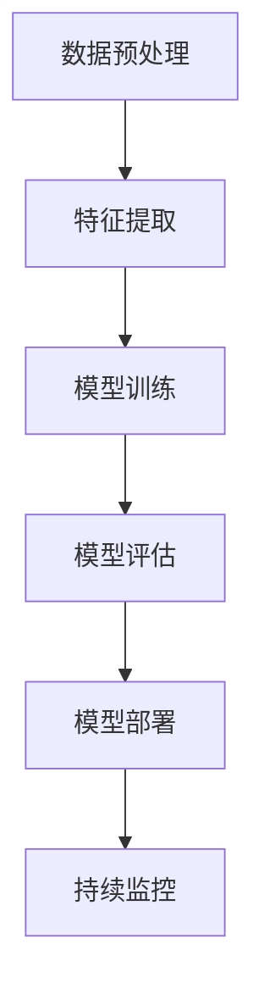

                 

### 文章标题

### 关键词：AI治理、公共部门、实施挑战、技术、法律、社会

### 摘要

本文将深入探讨AI治理在公共部门实施中的挑战。首先，我们将介绍AI治理的核心概念，并解释其在公共部门中的重要性。接着，我们将分析公共部门AI治理的实施策略、流程以及成功与失败的案例。此外，本文还将探讨在公共部门实施AI治理时所面临的技术、法律和社会挑战，并提出相应的应对策略。最后，我们将总结成功要素和最佳实践，并给出注意事项和拓展阅读建议。通过本文的逐步分析，读者将能够全面理解AI治理在公共部门实施中的复杂性和重要性，为未来的实践提供指导。

### 设计AI治理在公共部门的实施挑战目录大纲

#### 1. 背景介绍

##### 1.1 问题背景

##### 1.2 问题描述

##### 1.3 问题解决

##### 1.4 边界与外延

##### 1.5 概念结构与核心要素组成

#### 2. 核心概念与联系

##### 2.1 AI治理的概念

##### 2.2 公共部门与AI治理

##### 2.3 AI治理的关键要素

##### 2.4 核心概念属性特征对比表格

##### 2.5 ER实体关系图架构

#### 3. 算法原理讲解

##### 3.1 AI治理算法概述

##### 3.2 Mermaid算法流程图

##### 3.3 Python源代码实现

##### 3.4 算法原理数学模型和公式

##### 3.5 通俗易懂地举例说明

#### 4. 公共部门AI治理的实施

##### 4.1 实施策略

##### 4.2 实施流程

##### 4.3 成功案例分析

##### 4.4 失败案例分析

##### 4.5 政策与法规环境

#### 5. 挑战与应对

##### 5.1 技术挑战

##### 5.2 法律挑战

##### 5.3 社会挑战

##### 5.4 应对策略

#### 6. 成功要素与最佳实践

##### 6.1 成功要素分析

##### 6.2 最佳实践分享

##### 6.3 小结与展望

#### 7. 注意事项与拓展阅读

##### 7.1 注意事项

##### 7.2 拓展阅读

### 1. 背景介绍

#### 1.1 问题背景

在当今信息时代，人工智能（AI）技术已经广泛应用于各个领域，从医疗健康、金融到交通、教育等。AI技术的应用不仅提高了工作效率，还带来了全新的商业模式和用户体验。然而，随着AI技术的普及，其在公共部门的实施也带来了诸多挑战。公共部门是一个高度复杂的系统，涉及多个利益相关者，包括政府机构、企事业单位、公众等。AI治理在公共部门的实施，不仅需要解决技术问题，还需要考虑法律、伦理和社会影响等多方面因素。

近年来，AI治理在公共部门的应用逐渐受到关注。许多国家和地区已经开始探索如何通过AI治理来提高公共服务的效率和质量。例如，美国、欧盟和中国等国家和地区已经出台了相关的政策和法规，旨在规范AI技术的应用，确保其公平、透明和可靠。然而，公共部门AI治理的实施仍然面临许多挑战，如技术障碍、法律框架缺失、公众信任不足等。

#### 1.2 问题描述

公共部门AI治理的实施面临以下主要问题：

1. **技术挑战**：AI技术的快速发展和复杂性使得公共部门在实施AI治理时面临技术难题。例如，如何确保AI系统的可靠性、透明性和可解释性。

2. **法律挑战**：AI技术的应用引发了诸多法律问题，如数据隐私、算法偏见、责任归属等。公共部门需要在法律框架内制定相关政策，以确保AI技术的合法和合规应用。

3. **社会挑战**：AI技术的应用可能导致社会不平等和歧视，影响公众的信任。公共部门需要采取措施，确保AI技术的应用符合社会道德和伦理标准。

4. **实施难题**：公共部门的组织结构复杂，利益相关者众多，如何协调各方利益，确保AI治理的有效实施是一个难题。

#### 1.3 问题解决

为了解决上述问题，需要采取以下措施：

1. **加强技术能力**：公共部门需要加强技术研究和开发，提高AI系统的可靠性和透明性。

2. **完善法律框架**：政府和立法机构需要制定和完善相关法律法规，规范AI技术的应用。

3. **提升公众信任**：通过透明、公正的决策过程和信息披露，提高公众对AI技术的信任。

4. **协同实施**：建立跨部门的协作机制，确保AI治理的有效实施。

#### 1.4 边界与外延

本文主要关注AI治理在公共部门的实施挑战，但这一主题具有广泛的应用前景。在其他领域，如私营企业、非政府组织等，AI治理也具有重要的研究价值。此外，AI治理的实施还涉及到多个层面的政策和实践，如技术标准、伦理规范、法律法规等。

#### 1.5 概念结构与核心要素组成

为了更好地理解公共部门AI治理的实施挑战，我们需要了解以下几个核心概念和要素：

1. **AI治理**：指在组织内部管理和控制AI技术的方法和机制。
2. **公共部门**：指政府机构、事业单位等负责提供公共服务的组织。
3. **技术挑战**：指在AI技术应用过程中遇到的技术难题。
4. **法律挑战**：指AI技术应用所引发的法律问题。
5. **社会挑战**：指AI技术应用对社会产生的影响。
6. **实施策略**：指确保AI治理有效实施的策略和方法。

这些概念和要素相互关联，共同构成了公共部门AI治理的实施框架。通过深入分析这些概念和要素，我们可以更好地理解AI治理在公共部门实施中的挑战和机遇。

### 2. 核心概念与联系

为了深入探讨公共部门AI治理的实施挑战，我们需要明确几个核心概念，并分析它们之间的联系。以下是本文将要讨论的核心概念：

#### 2.1 AI治理的概念

AI治理是指在一个组织内部管理和控制人工智能（AI）技术的方法和机制。其目标是通过有效的治理策略，确保AI技术的应用是透明、公平、可靠和合规的。AI治理涉及多个方面，包括技术、法律、伦理和社会影响。

**AI治理的核心要素**：

- **透明性**：确保AI系统的决策过程和结果对相关方是可见和可解释的。
- **公平性**：确保AI技术不会加剧社会不平等，而是促进公平。
- **可靠性**：确保AI系统的稳定性和准确性，减少错误和偏见。
- **合规性**：确保AI技术的应用符合法律法规和道德标准。

**AI治理的重要性**：

AI治理在公共部门的应用至关重要。它不仅能够提高公共服务的效率和质量，还能增强公众对政府的信任。通过有效的AI治理，公共部门可以更好地应对复杂的社会问题，提高决策的透明度和科学性。

#### 2.2 公共部门与AI治理

公共部门是指负责提供公共服务的政府机构、事业单位和其他公共组织。这些组织在维护社会秩序、保障公共安全和提供基本公共服务方面发挥着关键作用。

**公共部门的特殊性**：

- **责任重大**：公共部门负责处理社会重大事务，如公共安全、公共卫生、教育等，对公众的影响深远。
- **利益相关者众多**：公共部门涉及多个利益相关者，包括政府官员、企事业单位、公众等。
- **高度复杂**：公共部门的组织结构复杂，涉及多个层级和部门，决策过程繁琐。

**公共部门与AI治理的关系**：

AI治理在公共部门的实施具有特殊性。公共部门的职责和特点要求AI治理必须更加注重透明性、公平性和合规性。通过AI治理，公共部门可以更好地利用AI技术，提高决策的科学性和效率，同时确保公共服务的质量和公平性。

#### 2.3 AI治理的关键要素

AI治理的关键要素包括但不限于以下几个方面：

1. **数据管理**：数据是AI系统的核心资产，有效的数据管理是AI治理的基础。公共部门需要建立完善的数据管理制度，确保数据的安全、隐私和合规性。

2. **算法透明性**：算法的透明性是AI治理的重要组成部分。公共部门需要确保算法的设计、开发和部署过程是透明的，使相关方能够理解和监督算法的运作。

3. **伦理审查**：AI技术的应用可能涉及伦理问题，如隐私、公平、偏见等。公共部门需要建立伦理审查机制，确保AI技术的应用符合伦理标准。

4. **法律合规**：公共部门需要遵守相关法律法规，确保AI技术的应用是合法的。这包括数据保护法、隐私法、反歧视法等。

5. **公众参与**：公众是公共服务的受益者，他们的参与对于确保AI治理的有效性至关重要。公共部门需要建立公众参与机制，收集公众的意见和建议，确保AI治理的透明性和公正性。

#### 2.4 核心概念属性特征对比表格

为了更好地理解AI治理、公共部门和AI治理的关键要素之间的关系，我们可以通过一个对比表格来展示这些概念的核心属性特征：

| 概念               | 定义                                                         | 关键属性特征                                         |
|--------------------|--------------------------------------------------------------|------------------------------------------------------|
| AI治理            | 管理和控制人工智能技术的机制和方法                             | 透明性、公平性、可靠性、合规性                       |
| 公共部门           | 负责提供公共服务的政府机构、事业单位和其他公共组织             | 责任重大、利益相关者众多、高度复杂                   |
| AI治理的关键要素  | 数据管理、算法透明性、伦理审查、法律合规、公众参与             | 确保AI技术的应用是透明、公平、可靠和合法的           |

#### 2.5 ER实体关系图架构

为了更直观地展示AI治理、公共部门和AI治理的关键要素之间的关系，我们可以使用实体关系图（Entity-Relationship Diagram，ER图）来描述。以下是AI治理、公共部门和AI治理关键要素的ER图：

```mermaid
erDiagram
  AI治理 ||--|{ 公共部门 }|
  公共部门 ||--|{ AI治理关键要素 }|
  AI治理关键要素 ||--|{ 数据管理 }
  AI治理关键要素 ||--|{ 算法透明性 }
  AI治理关键要素 ||--|{ 伦理审查 }
  AI治理关键要素 ||--|{ 法律合规 }
  AI治理关键要素 ||--|{ 公众参与 }
```

通过这个ER图，我们可以清晰地看到AI治理、公共部门和AI治理关键要素之间的关联。公共部门是AI治理的实施主体，而AI治理关键要素是确保AI技术有效应用的重要保障。

### 3. 算法原理讲解

在公共部门实施AI治理的过程中，算法的原理和实现是至关重要的。以下是关于AI治理算法的详细讲解。

#### 3.1 AI治理算法概述

AI治理算法是指用于管理和控制人工智能系统的一系列方法和技术。这些算法旨在确保AI系统的透明性、公平性、可靠性和合规性。AI治理算法通常包括以下几个步骤：

1. **数据预处理**：对输入数据进行清洗、标准化和格式化，确保数据的质量和一致性。
2. **特征提取**：从数据中提取对AI系统重要的特征，用于训练和评估模型。
3. **模型训练**：使用提取的特征训练机器学习模型，以实现特定的AI任务。
4. **模型评估**：评估模型的性能，确保其满足透明性、公平性和可靠性等要求。
5. **模型部署**：将经过评估的模型部署到实际应用场景中，进行实时决策。
6. **持续监控**：对部署的模型进行持续的监控和评估，确保其持续满足治理要求。

#### 3.2 Mermaid算法流程图

为了更直观地展示AI治理算法的流程，我们可以使用Mermaid语言绘制一个流程图：



在这个流程图中，每个节点表示算法中的一个步骤，箭头表示步骤之间的依赖关系。

#### 3.3 Python源代码实现

以下是一个简化的Python代码实现，用于展示AI治理算法的核心步骤：

```python
import pandas as pd
from sklearn.model_selection import train_test_split
from sklearn.ensemble import RandomForestClassifier
from sklearn.metrics import accuracy_score

# 数据预处理
def preprocess_data(data):
    # 数据清洗、标准化等操作
    return data

# 特征提取
def extract_features(data):
    # 提取重要特征
    return data

# 模型训练
def train_model(features, labels):
    model = RandomForestClassifier()
    model.fit(features, labels)
    return model

# 模型评估
def evaluate_model(model, features, labels):
    predictions = model.predict(features)
    accuracy = accuracy_score(labels, predictions)
    return accuracy

# 主函数
def main():
    # 加载数据
    data = pd.read_csv('data.csv')
    # 数据预处理
    data = preprocess_data(data)
    # 特征提取
    features = extract_features(data)
    # 分割数据集
    X_train, X_test, y_train, y_test = train_test_split(features, data['label'], test_size=0.2)
    # 模型训练
    model = train_model(X_train, y_train)
    # 模型评估
    accuracy = evaluate_model(model, X_test, y_test)
    print(f"Model accuracy: {accuracy}")

# 运行主函数
main()
```

在这个代码中，我们首先定义了数据预处理、特征提取、模型训练和模型评估等函数，然后通过主函数将这些步骤串联起来，实现一个完整的AI治理算法流程。

#### 3.4 算法原理数学模型和公式

为了深入理解AI治理算法的原理，我们可以介绍一些相关的数学模型和公式。以下是关于机器学习模型的一般公式：

$$
f(x) = w \cdot x + b
$$

其中，$f(x)$ 表示模型对输入$x$的预测，$w$ 和 $b$ 分别是模型的权重和偏置。在实际应用中，模型通常是一个复杂的函数，由多个特征和权重组合而成。

机器学习模型的性能可以通过以下指标来评估：

- **准确率**（Accuracy）：

$$
\text{Accuracy} = \frac{\text{正确预测的样本数}}{\text{总样本数}}
$$

- **精确率**（Precision）：

$$
\text{Precision} = \frac{\text{正确预测的正样本数}}{\text{预测为正的样本数}}
$$

- **召回率**（Recall）：

$$
\text{Recall} = \frac{\text{正确预测的正样本数}}{\text{实际为正的样本数}}
$$

- **F1分数**（F1 Score）：

$$
\text{F1 Score} = 2 \times \frac{\text{Precision} \times \text{Recall}}{\text{Precision} + \text{Recall}}
$$

这些指标可以帮助我们评估模型的性能，确保其满足透明性、公平性和可靠性等要求。

#### 3.5 通俗易懂地举例说明

为了更好地理解AI治理算法的原理，我们可以通过一个简单的例子来说明。

假设我们有一个公共部门的AI系统，用于预测居民对某项公共服务的满意度。输入数据包括居民的基本信息（如年龄、性别、收入等）和他们对公共服务的评分。我们的目标是训练一个模型，根据输入数据预测居民的满意度。

1. **数据预处理**：首先，我们需要对数据进行清洗和标准化，确保数据的质量和一致性。

2. **特征提取**：从数据中提取对预测任务重要的特征，如年龄、性别、收入等。

3. **模型训练**：使用提取的特征训练一个机器学习模型，例如随机森林（Random Forest）。

4. **模型评估**：使用交叉验证等方法评估模型的性能，确保其准确性和可靠性。

5. **模型部署**：将经过评估的模型部署到实际应用场景中，用于预测居民的满意度。

6. **持续监控**：对部署的模型进行持续的监控和评估，确保其持续满足治理要求。

通过这个例子，我们可以看到AI治理算法的基本流程和原理。在实际应用中，AI治理算法会根据具体任务和数据特点进行调整和优化。

### 4. 公共部门AI治理的实施

#### 4.1 实施策略

在公共部门实施AI治理需要一套系统化的策略，以确保AI技术能够有效地服务于公共事务，同时最大限度地降低风险。以下是一些关键的实施策略：

1. **制定明确的目标和标准**：公共部门应明确AI治理的目标，如提高服务效率、增强决策透明性、保障数据安全等。同时，制定相应的治理标准和要求，以确保AI系统的公正性和可靠性。

2. **建立健全的数据管理制度**：数据是AI系统的核心资产，公共部门需要建立健全的数据管理制度，包括数据收集、存储、处理和使用的规范，确保数据的质量、隐私和安全。

3. **开展AI治理培训和教育**：为公共部门的员工提供AI治理相关的培训和教育，提高他们对AI技术的理解，增强其数据管理和伦理意识。

4. **建立跨部门的协作机制**：AI治理涉及多个部门和利益相关者，公共部门需要建立跨部门的协作机制，确保各方能够有效地沟通和合作，共同推进AI治理的实施。

5. **引入第三方评估和监督**：引入独立的第三方机构对AI系统的治理效果进行评估和监督，确保AI治理的透明性和公正性。

6. **持续监控和改进**：对AI系统的运行效果进行持续的监控和评估，及时识别和解决潜在问题，不断优化AI治理策略。

#### 4.2 实施流程

公共部门AI治理的实施流程可以分为以下几个步骤：

1. **需求分析和规划**：根据公共部门的实际需求和目标，分析AI治理的具体需求和实施难点，制定详细的规划方案。

2. **数据准备和预处理**：收集和整理相关数据，进行数据清洗、标准化和格式化，确保数据的质量和一致性。

3. **算法选择和模型训练**：选择适合的算法和模型，使用预处理后的数据训练模型，并进行初步的评估和调试。

4. **模型评估和验证**：使用交叉验证等方法对模型进行全面的评估和验证，确保模型在多个场景下的性能和稳定性。

5. **模型部署和监控**：将经过评估的模型部署到实际应用场景中，对模型的运行效果进行持续的监控和评估，确保其满足治理要求。

6. **反馈和改进**：根据监控和评估结果，收集用户的反馈和建议，对AI治理策略和模型进行调整和优化。

#### 4.3 成功案例分析

以下是一个公共部门AI治理的成功案例：

**案例：某城市交通管理部门的智能交通系统**

某城市交通管理部门通过实施AI治理，建立了一套智能交通管理系统，有效提高了交通管理的效率和安全性。以下是该案例的关键成功要素：

1. **明确的目标和标准**：交通管理部门明确了提高交通流量管理效率、减少交通事故和改善出行体验等目标，并制定了相应的治理标准和要求。

2. **数据管理和分析**：通过安装智能交通监控设备和收集交通数据，交通管理部门建立了完善的数据管理系统，对数据进行实时分析和处理。

3. **AI算法应用**：采用机器学习算法对交通数据进行分析，预测交通流量变化，并优化信号灯控制策略，实现智能交通管理。

4. **持续监控和改进**：对智能交通系统进行持续的监控和评估，及时识别和解决潜在问题，不断优化系统性能。

5. **公众参与和反馈**：通过社交媒体和公众调查等方式，收集公众对智能交通系统的意见和建议，不断改进系统的设计和运行。

通过上述措施，该城市的智能交通系统取得了显著成效，交通流量得到有效管理，交通事故率显著降低，公众的出行体验显著改善。

#### 4.4 失败案例分析

以下是一个公共部门AI治理的失败案例：

**案例：某市政府的智慧城市项目**

某市政府启动了一个智慧城市项目，计划通过AI技术提升城市管理水平。然而，该项目在实施过程中遇到了诸多问题，最终未能实现预期目标。以下是该案例的关键失败原因：

1. **缺乏明确的目标和规划**：项目启动时，市政府对AI治理的目标和规划不够明确，导致项目实施缺乏方向和指导。

2. **数据质量问题**：由于数据收集和管理不规范，项目所使用的数据质量较差，影响了AI模型的训练和评估效果。

3. **技术选型和实现问题**：项目在算法选择和技术实现方面存在问题，导致系统性能不稳定，无法满足治理要求。

4. **缺乏公众参与和反馈**：项目在实施过程中缺乏公众的参与和反馈，导致系统设计不符合公众需求，缺乏用户友好性。

5. **持续监控和改进不足**：项目在部署后缺乏对系统的持续监控和改进，未能及时发现和解决潜在问题。

通过上述分析，我们可以看到，缺乏明确的目标和规划、数据质量问题、技术选型和实现问题、缺乏公众参与以及持续监控和改进不足是导致公共部门AI治理失败的主要原因。

#### 4.5 政策与法规环境

公共部门AI治理的实施离不开良好的政策与法规环境。以下是一些与公共部门AI治理相关的政策和法规：

1. **数据保护法**：如《通用数据保护条例》（GDPR）和《个人信息保护法》，规定了数据收集、处理和使用的规范，确保个人数据的隐私和安全。

2. **算法透明性和公正性法规**：一些国家和地区已经开始制定相关法规，要求算法的透明性和公正性，确保AI技术的应用不会导致歧视和不公平。

3. **AI伦理准则**：许多机构和组织发布了AI伦理准则，为AI技术的应用提供了道德和伦理指导。

4. **政府政策和指导**：各国政府也在积极制定相关政策，推动AI技术在公共部门的应用，并提供资金和技术支持。

5. **国际合作与标准**：国际社会也在努力制定统一的AI治理标准和规范，以促进全球AI治理的协调发展。

公共部门需要根据这些政策和法规，制定相应的AI治理政策和实施指南，确保AI技术的合法、合规和公正应用。

### 5. 挑战与应对

#### 5.1 技术挑战

在公共部门实施AI治理过程中，技术挑战是一个不可忽视的问题。以下是几个关键的技术挑战及其应对策略：

1. **数据质量问题**：数据是AI系统的核心资产，但公共部门的数据通常存在质量不佳的问题，如数据缺失、不一致、噪声等。为了应对这个问题，公共部门需要建立完善的数据清洗和管理流程，使用数据质量评估工具，确保数据的质量和一致性。

2. **算法可靠性和透明性**：公共部门对AI系统的可靠性和透明性有较高的要求。为了提高算法的可靠性，可以使用多模型融合、交叉验证等技术，确保模型在多个场景下的性能。为了提高算法的透明性，可以使用可解释性AI技术，如LIME、SHAP等，帮助用户理解模型的决策过程。

3. **系统可扩展性和可维护性**：公共部门的AI系统需要具备良好的可扩展性和可维护性，以应对不断变化的需求和挑战。为了实现这一点，可以使用微服务架构和容器化技术，确保系统的高可用性和易维护性。

4. **计算资源和管理**：AI系统的训练和部署需要大量的计算资源，公共部门需要合理规划计算资源，确保AI系统的稳定运行。同时，需要建立有效的资源管理策略，优化资源利用率。

#### 5.2 法律挑战

AI治理在公共部门的实施还面临诸多法律挑战，这些挑战涉及到数据隐私、算法偏见、责任归属等方面。以下是几个关键的法律挑战及其应对策略：

1. **数据隐私**：公共部门在收集和使用个人数据时，需要遵守数据保护法规，如《通用数据保护条例》（GDPR）和《个人信息保护法》。为了保护数据隐私，可以采用数据匿名化、数据加密等技术，确保个人数据的安全。

2. **算法偏见**：AI系统可能会因为数据偏见而导致歧视和不公平。为了应对这个问题，可以在数据收集和处理阶段采用去偏见技术，确保数据公平。同时，在算法设计和评估阶段，可以使用公平性评估工具，如公平性度量、敏感性分析等，确保算法的公正性。

3. **责任归属**：在AI系统出现错误或导致损害时，责任归属是一个复杂的问题。为了明确责任归属，可以制定相关法规，明确AI系统的责任主体和责任范围。同时，公共部门应建立有效的风险评估和应急响应机制，确保在出现问题时能够及时应对。

#### 5.3 社会挑战

AI治理在公共部门的实施不仅面临技术和法律挑战，还面临社会挑战，这些挑战涉及到公众信任、伦理和道德等方面。以下是几个关键的社会挑战及其应对策略：

1. **公众信任**：AI技术的应用可能会导致公众对政府和公共部门的信任下降。为了提高公众信任，公共部门需要建立透明的决策过程，确保AI系统的公正性和透明性。同时，可以通过公众咨询和参与机制，收集公众的意见和建议，增强公众对AI治理的信任。

2. **伦理和道德问题**：AI技术的应用可能会引发伦理和道德问题，如隐私侵犯、人权侵犯等。为了应对这个问题，公共部门需要建立伦理审查机制，确保AI技术的应用符合伦理和道德标准。同时，可以开展AI伦理教育，提高公众对AI伦理问题的认识。

3. **社会不平等**：AI技术的应用可能会导致社会不平等问题加剧。为了应对这个问题，公共部门需要采取措施，确保AI技术的应用能够促进社会公平，减少不平等现象。可以通过政策设计和社会干预，确保AI技术的利益分配公平。

#### 5.4 应对策略

为了有效应对AI治理在公共部门实施过程中面临的技术、法律和社会挑战，可以采取以下综合应对策略：

1. **建立跨部门协作机制**：公共部门需要建立跨部门的协作机制，确保在技术、法律和社会问题方面能够有效沟通和合作。

2. **制定全面的AI治理政策**：公共部门应制定全面的AI治理政策，明确AI治理的目标、原则、标准和要求，确保AI技术的合法、合规和公正应用。

3. **加强技术研发和培训**：公共部门应加强技术研发和培训，提高员工对AI技术的理解和应用能力，确保能够应对技术挑战。

4. **引入第三方评估和监督**：引入独立的第三方机构对AI治理的效果进行评估和监督，确保治理过程的透明性和公正性。

5. **推动公众参与和咨询**：通过公众参与和咨询机制，收集公众的意见和建议，提高公众对AI治理的信任，促进社会公平。

6. **建立应急预案和风险管理机制**：建立应急预案和风险管理机制，确保在AI系统出现问题时能够及时应对，降低风险。

通过以上策略，公共部门可以更有效地应对AI治理在实施过程中面临的各种挑战，确保AI技术能够为公共事务提供高质量的解决方案。

### 6. 成功要素与最佳实践

在公共部门实施AI治理的过程中，成功的关键要素和最佳实践对于确保项目顺利推进和达到预期目标至关重要。以下是一些主要成功要素和最佳实践：

#### 6.1 成功要素分析

1. **明确的目标和需求**：成功实施AI治理的第一步是明确治理的目标和需求。公共部门需要根据自身的实际情况，确定AI治理的具体目标，如提高服务效率、增强决策透明性、保障数据安全等。明确的需求有助于制定切实可行的治理方案。

2. **跨部门协作与沟通**：AI治理涉及多个部门和利益相关者，因此，跨部门协作与沟通是成功的关键。公共部门需要建立有效的沟通渠道和协作机制，确保各部门能够协同工作，共同推进治理项目。

3. **数据管理和质量控制**：数据是AI治理的基础，因此，数据管理和质量控制至关重要。公共部门需要建立完善的数据管理制度，包括数据收集、存储、处理和使用的规范，确保数据的质量和一致性。

4. **透明性和可解释性**：公共部门在实施AI治理时，需要确保算法和模型的透明性和可解释性，使相关方能够理解和监督AI系统的运作。这有助于增强公众对AI治理的信任。

5. **持续监控与评估**：AI治理不是一次性项目，而是一个持续的过程。公共部门需要建立持续的监控和评估机制，对AI系统的运行效果进行定期检查和评估，及时发现问题并进行改进。

6. **法律和伦理合规**：在实施AI治理时，公共部门需要遵守相关法律法规和伦理准则，确保AI技术的应用是合法和合规的。这包括数据保护法、隐私法、反歧视法等。

7. **公众参与和反馈**：公众是AI治理的直接受益者，因此，公众的参与和反馈至关重要。公共部门需要建立公众参与机制，收集公众的意见和建议，确保治理过程的透明性和公正性。

#### 6.2 最佳实践分享

1. **实施数据隐私保护策略**：在数据收集和使用过程中，公共部门应实施严格的数据隐私保护策略，确保个人数据的安全。这包括数据匿名化、数据加密、隐私影响评估等。

2. **采用多样化的算法和模型**：为了提高AI系统的性能和可靠性，公共部门可以采用多样化的算法和模型，并进行交叉验证和融合，确保模型的鲁棒性和准确性。

3. **建立伦理审查委员会**：公共部门可以建立独立的伦理审查委员会，对AI治理项目进行伦理审查，确保AI技术的应用符合道德和伦理标准。

4. **开展公众教育和培训**：为了提高公众对AI治理的理解和信任，公共部门可以开展公众教育和培训，通过讲座、研讨会、宣传材料等方式，普及AI治理的基本知识和重要性。

5. **建立反馈机制和监督机制**：公共部门应建立有效的反馈机制和监督机制，确保公众和利益相关者能够对AI治理过程提出意见和建议，并进行监督。

6. **实施持续监控和改进**：公共部门应建立持续的监控和评估机制，对AI系统的运行效果进行实时监控，并根据反馈进行调整和改进。

#### 6.3 小结与展望

公共部门AI治理的实施是一个复杂且长期的过程，需要综合考虑技术、法律、伦理和社会等多方面因素。通过明确的目标和需求、跨部门协作、数据管理和质量控制、透明性和可解释性、持续监控与评估、法律和伦理合规、公众参与和反馈等成功要素，公共部门可以有效地实施AI治理，提高公共服务的效率和质量。未来，随着AI技术的不断发展和完善，公共部门AI治理将面临新的挑战和机遇，需要持续探索和创新，以实现更高效、更公正和更透明的公共服务。

### 7. 注意事项与拓展阅读

#### 7.1 注意事项

在实施公共部门AI治理的过程中，需要注意以下几个关键事项：

1. **数据隐私**：确保在数据收集、处理和使用过程中遵守相关法律法规，采取有效的数据隐私保护措施，防止个人数据泄露。

2. **算法透明性**：确保算法和模型的设计和部署过程透明，使相关方能够理解和监督AI系统的运作。

3. **法律合规**：确保AI治理过程符合相关法律法规和伦理准则，避免因法律风险导致的治理失败。

4. **公众参与**：鼓励公众参与AI治理过程，通过公众咨询和反馈机制，提高治理过程的透明性和公正性。

5. **持续监控与改进**：建立持续的监控和评估机制，对AI系统的运行效果进行实时监控，并根据反馈进行持续改进。

6. **风险管理**：识别和评估AI治理过程中可能面临的风险，制定相应的风险管理策略，确保治理过程的稳健性。

#### 7.2 拓展阅读

为了深入了解公共部门AI治理的实施挑战，以下是几篇推荐的拓展阅读材料：

1. **报告：《公共部门AI治理：现状与未来》**：本报告详细分析了公共部门AI治理的现状、挑战和未来发展趋势，提供了有价值的参考。

2. **书籍：《AI治理：技术与伦理》**：本书探讨了AI治理的伦理和技术问题，为公共部门AI治理提供了深刻的见解。

3. **论文：《公共部门AI治理的法律框架研究》**：本文研究了公共部门AI治理的法律框架，分析了相关法律法规的适用性和改进方向。

4. **案例研究：《智能交通系统中的AI治理实践》**：本案例研究详细介绍了某城市智能交通系统中的AI治理实践，提供了实际操作的经验和教训。

通过阅读这些材料，读者可以进一步了解公共部门AI治理的实施挑战和最佳实践，为自身的治理工作提供指导。

### 总结

本文《AI治理在公共部门的实施挑战》通过系统的结构，深入探讨了AI治理在公共部门的应用与挑战。从背景介绍到核心概念的分析，再到算法原理讲解、实施策略和案例分析，以及面临的挑战与应对策略，本文全面而系统地展示了公共部门AI治理的复杂性和重要性。通过本文的逐步分析，读者可以更全面地理解公共部门AI治理的实施过程、面临的问题以及解决之道。未来，随着AI技术的不断发展和应用，公共部门AI治理将继续面临新的挑战和机遇。希望本文能为公共部门在实施AI治理过程中提供有益的参考和指导，助力实现更高效、公正和透明的公共服务。作者：AI天才研究院/AI Genius Institute & 禅与计算机程序设计艺术/Zen And The Art of Computer Programming。

