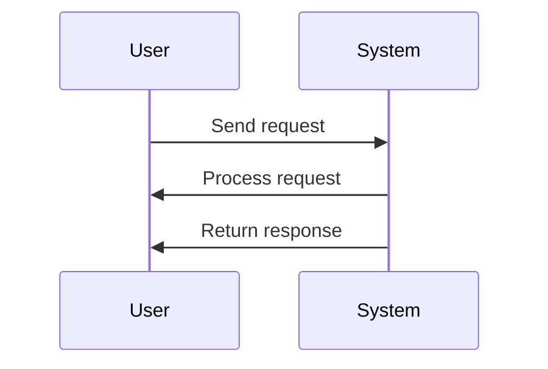
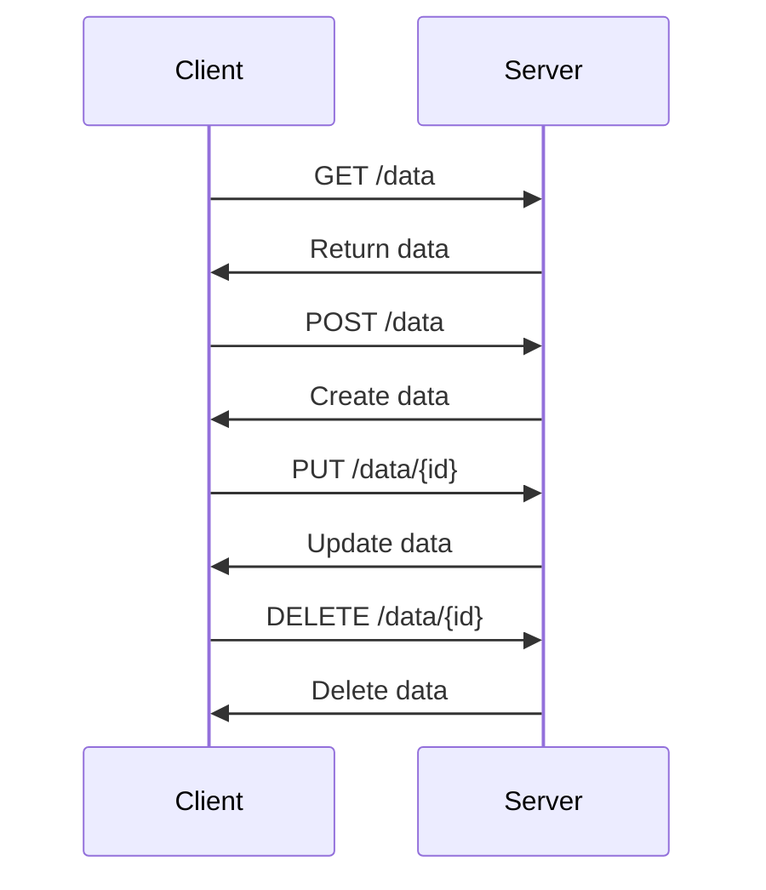
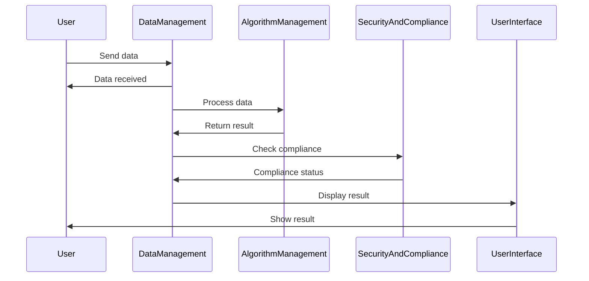

                 

# AI治理平台的关键功能和优势

## 关键词

- AI治理平台
- 数据管理
- 算法管理
- 安全与合规
- 用户体验

## 摘要

本文深入探讨了AI治理平台的关键功能和优势。首先，介绍了AI治理平台的背景和核心概念，包括数据管理、算法管理、安全与合规和用户体验。接着，通过对比表格和ER实体关系图，详细阐述了这些概念之间的联系和属性特征。随后，文章对AI治理平台的算法原理进行了讲解，并给出了数学模型和公式。最后，文章介绍了AI治理平台的系统分析与架构设计方案，以及实际项目实战和最佳实践，为读者提供了全面而深入的指导。

## 第1章 背景介绍

### 1.1 问题背景

随着人工智能技术的快速发展，AI治理平台在各个行业中的应用日益广泛。AI治理平台是一种集成多种AI技术的软件系统，旨在提高人工智能应用的可信度、安全性和效率。然而，如何构建一个高效、安全的AI治理平台，成为了当前亟需解决的问题。

### 1.1.1 问题的提出

随着人工智能技术的快速发展，AI治理平台在各个行业中的应用日益广泛。从金融、医疗到交通、能源，人工智能技术已经深刻地改变了我们的生活方式和工作方式。然而，随着AI应用的普及，也带来了诸多挑战，如数据隐私、算法偏见、安全性等。因此，如何构建一个高效、安全的AI治理平台，成为了一个重要课题。

#### 1.1.2 问题描述

AI治理平台的关键功能和优势是什么？如何设计和实现这些功能，以确保平台的可靠性和安全性？这是一个复杂而关键的问题。首先，我们需要明确AI治理平台的核心功能，如数据管理、算法管理、安全与合规和用户体验。然后，我们需要设计实现这些功能，确保平台的可靠性和安全性。此外，我们还需要关注平台的可扩展性、可维护性和易用性。

#### 1.1.3 问题解决

通过深入研究AI治理平台的相关理论和技术，本文将探讨其关键功能和优势，并提供设计实现方案。首先，我们将介绍AI治理平台的核心概念和关键功能，然后通过对比表格和ER实体关系图，详细阐述这些概念之间的联系和属性特征。接着，我们将对AI治理平台的算法原理进行讲解，并给出数学模型和公式。最后，我们将介绍AI治理平台的系统分析与架构设计方案，以及实际项目实战和最佳实践。

#### 1.1.4 边界与外延

本文研究的AI治理平台主要包括以下几个方面：

1. **数据管理**：包括数据的采集、存储、处理和分析。
2. **算法管理**：包括算法的部署、监控和优化。
3. **安全与合规**：包括数据安全和隐私保护，以及合规性评估。
4. **用户体验**：包括用户界面设计、操作简便性等。

### 1.2 核心概念

#### 1.2.1 AI治理平台

AI治理平台是一种集成多种AI技术的软件系统，旨在提高人工智能应用的可信度、安全性和效率。它通常包括以下几个核心组件：

1. **数据管理**：负责数据的采集、存储、处理和分析。
2. **算法管理**：负责算法的部署、监控和优化。
3. **安全与合规**：负责数据安全和隐私保护，以及合规性评估。
4. **用户体验**：负责用户界面设计、操作简便性等。

#### 1.2.2 关键功能

AI治理平台的关键功能包括：

1. **数据管理**：高效、安全地管理大规模数据。
2. **算法管理**：自动化部署、监控和优化算法。
3. **安全与合规**：保障数据安全和隐私，遵守相关法规和标准。
4. **用户体验**：提供友好、便捷的用户界面。

#### 1.2.3 优势

AI治理平台的优势包括：

1. **提高效率**：自动化管理AI应用，降低人力成本。
2. **保障安全**：确保数据安全和隐私，避免潜在风险。
3. **提升可信度**：通过合规性和安全评估，提高AI应用的信任度。
4. **降低成本**：优化资源利用率，降低运营成本。

## 第2章: AI治理平台的核心概念与联系

### 2.1 核心概念原理

#### 2.1.1 数据管理

数据管理是AI治理平台的核心功能之一。它涉及数据的采集、存储、处理和分析。

1. **数据采集**：数据采集是数据管理的基础。它包括从各种来源（如数据库、传感器、网络等）收集数据，并将其转化为适合分析的形式。

2. **数据存储**：数据存储是将采集到的数据存储到数据库或其他存储系统中。这包括选择合适的存储方案（如关系数据库、NoSQL数据库、云存储等）和优化存储性能。

3. **数据处理**：数据处理是对存储的数据进行清洗、转换和整合的过程。这有助于提高数据质量，为后续分析提供准确的数据基础。

4. **数据分析**：数据分析是利用各种分析工具和技术（如统计分析、机器学习、数据挖掘等）对数据进行探索、分析和解释，以发现数据中的模式和规律。

#### 2.1.2 算法管理

算法管理包括算法的部署、监控和优化。

1. **算法部署**：算法部署是将算法从开发环境部署到生产环境的过程。这包括选择合适的部署方案（如本地部署、云部署等）和确保算法的稳定性和性能。

2. **算法监控**：算法监控是对部署后的算法进行实时监控，以检测其性能和稳定性。这有助于及时发现和解决算法问题，确保AI应用的正常运行。

3. **算法优化**：算法优化是通过对算法进行优化，提高其性能和效率。这包括调整算法参数、改进算法结构等，以提高算法的准确性和鲁棒性。

#### 2.1.3 安全与合规

安全与合规是AI治理平台的关键要素。它涉及数据安全和隐私保护，以及合规性评估。

1. **数据安全**：数据安全是确保数据在存储、传输和处理过程中不被未授权访问、篡改或泄露的措施。这包括数据加密、访问控制、网络安全等。

2. **隐私保护**：隐私保护是确保用户数据不被滥用或泄露的措施。这包括数据匿名化、隐私协议、数据访问审计等。

3. **合规性评估**：合规性评估是确保AI应用符合相关法规和标准的过程。这包括数据保护法规（如GDPR）、行业标准等。

#### 2.1.4 用户体验

用户体验是AI治理平台的另一个重要方面。它包括用户界面设计、操作简便性等。

1. **用户界面设计**：用户界面设计是确保用户能够方便、高效地使用AI治理平台的过程。这包括设计直观、易用的界面，提供丰富的交互功能。

2. **操作简便性**：操作简便性是确保用户能够轻松地操作AI治理平台的过程。这包括简化操作流程、提供帮助文档和在线支持等。

### 2.2 概念属性特征对比表格

| 概念       | 属性特征                                       | 对比关系                                   |
|------------|------------------------------------------------|--------------------------------------------|
| 数据管理   | 采集、存储、处理和分析大规模数据               | 与算法管理、安全与合规密切相关               |
| 算法管理   | 自动化部署、监控和优化算法                     | 与数据管理、安全与合规密切相关               |
| 安全与合规 | 保障数据安全和隐私，遵守相关法规和标准         | 与数据管理、算法管理密切相关                 |
| 用户体验   | 提供友好、便捷的用户界面                       | 与数据管理、算法管理、安全与合规密切相关     |

### 2.3 ER实体关系图架构

```mermaid
erDiagram
    AI治理平台 ||--|{ 数据管理 }|
    AI治理平台 ||--|{ 算法管理 }|
    AI治理平台 ||--|{ 安全与合规 }|
    AI治理平台 ||--|{ 用户体验 }|
    数据管理 ||--|{ 数据采集 }|
    数据管理 ||--|{ 数据存储 }|
    数据管理 ||--|{ 数据处理 }|
    数据管理 ||--|{ 数据分析 }|
    算法管理 ||--|{ 算法部署 }|
    算法管理 ||--|{ 算法监控 }|
    算法管理 ||--|{ 算法优化 }|
    安全与合规 ||--|{ 数据安全 }|
    安全与合规 ||--|{ 隐私保护 }|
    安全与合规 ||--|{ 合规性评估 }|
    用户体验 ||--|{ 用户界面设计 }|
    用户体验 ||--|{ 操作简便性 }|
```

### 2.4 关键功能详解

#### 2.4.1 数据管理

数据管理是AI治理平台的核心功能之一，它负责数据的采集、存储、处理和分析。以下是数据管理的关键功能及其详解：

1. **数据采集**：数据采集是从各种来源（如数据库、传感器、网络等）收集数据的过程。数据采集的关键在于选择合适的采集工具和采集策略，以确保数据的完整性和准确性。

2. **数据存储**：数据存储是将采集到的数据存储到数据库或其他存储系统中的过程。数据存储的关键在于选择合适的存储方案，如关系数据库、NoSQL数据库、云存储等，以及优化存储性能，如数据压缩、索引优化等。

3. **数据处理**：数据处理是对存储的数据进行清洗、转换和整合的过程。数据处理的关键在于选择合适的数据处理工具和技术，如ETL（提取、转换、加载）、数据清洗、数据整合等，以提高数据质量。

4. **数据分析**：数据分析是利用各种分析工具和技术（如统计分析、机器学习、数据挖掘等）对数据进行探索、分析和解释的过程。数据分析的关键在于选择合适的数据分析方法和模型，以发现数据中的模式和规律。

#### 2.4.2 算法管理

算法管理是AI治理平台的另一个核心功能，它负责算法的部署、监控和优化。以下是算法管理的关键功能及其详解：

1. **算法部署**：算法部署是将算法从开发环境部署到生产环境的过程。算法部署的关键在于选择合适的部署方案，如本地部署、云部署等，以及确保算法的稳定性和性能。

2. **算法监控**：算法监控是对部署后的算法进行实时监控，以检测其性能和稳定性的过程。算法监控的关键在于选择合适的监控工具和指标，如性能指标、错误率等，以及及时发现和解决算法问题。

3. **算法优化**：算法优化是通过对算法进行优化，提高其性能和效率的过程。算法优化的关键在于选择合适的优化策略，如参数调整、算法改进等，以提高算法的准确性和鲁棒性。

#### 2.4.3 安全与合规

安全与合规是AI治理平台的关键要素，它涉及数据安全和隐私保护，以及合规性评估。以下是安全与合规的关键功能及其详解：

1. **数据安全**：数据安全是确保数据在存储、传输和处理过程中不被未授权访问、篡改或泄露的措施。数据安全的关键在于选择合适的安全措施，如数据加密、访问控制、网络安全等。

2. **隐私保护**：隐私保护是确保用户数据不被滥用或泄露的措施。隐私保护的关键在于选择合适的隐私保护策略，如数据匿名化、隐私协议、数据访问审计等。

3. **合规性评估**：合规性评估是确保AI应用符合相关法规和标准的过程。合规性评估的关键在于了解和遵守相关法规和标准，如数据保护法规、行业标准等。

#### 2.4.4 用户体验

用户体验是AI治理平台的另一个重要方面，它包括用户界面设计、操作简便性等。以下是用户体验的关键功能及其详解：

1. **用户界面设计**：用户界面设计是确保用户能够方便、高效地使用AI治理平台的过程。用户界面设计的关键在于设计直观、易用的界面，提供丰富的交互功能。

2. **操作简便性**：操作简便性是确保用户能够轻松地操作AI治理平台的过程。操作简便性的关键在于简化操作流程、提供帮助文档和在线支持等。

### 2.5 AI治理平台的优势

AI治理平台的优势主要体现在以下几个方面：

1. **提高效率**：AI治理平台通过自动化管理AI应用，降低了人力成本，提高了工作效率。

2. **保障安全**：AI治理平台通过保障数据安全和隐私，避免潜在风险，提高了系统的安全性。

3. **提升可信度**：AI治理平台通过合规性和安全评估，提高了AI应用的信任度，增强了用户的信任感。

4. **降低成本**：AI治理平台通过优化资源利用率，降低了运营成本，提高了企业的经济效益。

## 第3章 AI治理平台的算法原理与实现

### 3.1 数据管理算法

在AI治理平台中，数据管理算法是数据处理和分析的核心。以下是几个常见的数据管理算法及其工作原理：

#### 3.1.1 数据采集算法

数据采集算法主要用于从不同数据源中提取数据。以下是数据采集算法的一般步骤：

1. **数据源识别**：确定数据采集的目标数据源，如数据库、传感器、网络等。
2. **数据格式转换**：将采集到的数据转换为统一的格式，如JSON、XML等。
3. **数据清洗**：去除数据中的噪声和重复数据，确保数据的准确性。
4. **数据存储**：将清洗后的数据存储到数据库或其他存储系统中。

Python代码示例：

```python
import pandas as pd

# 数据源识别
data_source = "data.csv"

# 数据格式转换
data = pd.read_csv(data_source)

# 数据清洗
data = data.drop_duplicates()

# 数据存储
data.to_csv("cleaned_data.csv", index=False)
```

#### 3.1.2 数据存储算法

数据存储算法主要用于将数据存储到数据库或其他存储系统中。以下是数据存储算法的一般步骤：

1. **数据库连接**：建立与数据库的连接。
2. **数据插入**：将数据插入到数据库中。
3. **数据查询**：从数据库中查询数据。

Python代码示例：

```python
import sqlite3

# 数据库连接
conn = sqlite3.connect("database.db")

# 数据插入
conn.execute("INSERT INTO table (column1, column2) VALUES (?, ?)", (value1, value2))

# 数据查询
cursor = conn.execute("SELECT * FROM table")
for row in cursor:
    print(row)
```

#### 3.1.3 数据处理算法

数据处理算法主要用于对存储的数据进行清洗、转换和整合。以下是数据处理算法的一般步骤：

1. **数据清洗**：去除数据中的噪声和重复数据。
2. **数据转换**：将数据转换为适合分析的形式。
3. **数据整合**：将多个数据源的数据整合到一个数据集中。

Python代码示例：

```python
import pandas as pd

# 数据清洗
data = data.drop_duplicates()
data = data.dropna()

# 数据转换
data["column"] = data["column"].apply(lambda x: x * 2)

# 数据整合
data2 = pd.read_csv("data2.csv")
data = pd.concat([data, data2], axis=0)
```

### 3.2 算法管理算法

在AI治理平台中，算法管理算法用于算法的部署、监控和优化。以下是几个常见的算法管理算法及其工作原理：

#### 3.2.1 算法部署算法

算法部署算法主要用于将算法从开发环境部署到生产环境。以下是算法部署算法的一般步骤：

1. **算法开发**：在开发环境中开发算法。
2. **算法测试**：在测试环境中测试算法的性能和稳定性。
3. **算法部署**：将经过测试的算法部署到生产环境中。

Python代码示例：

```python
# 算法开发
def algorithm(data):
    # 算法实现
    return result

# 算法测试
test_data = "test_data.csv"
test_result = algorithm(test_data)
print(test_result)

# 算法部署
deploy_data = "deploy_data.csv"
deploy_result = algorithm(deploy_data)
print(deploy_result)
```

#### 3.2.2 算法监控算法

算法监控算法主要用于监控算法在生产环境中的性能和稳定性。以下是算法监控算法的一般步骤：

1. **性能监控**：监控算法的性能指标，如响应时间、准确率等。
2. **稳定性监控**：监控算法的稳定性，如是否出现异常或崩溃。
3. **异常处理**：当算法出现异常时，进行异常处理。

Python代码示例：

```python
import time

# 性能监控
start_time = time.time()
algorithm(deploy_data)
end_time = time.time()
print("Response time:", end_time - start_time)

# 稳定性监控
try:
    algorithm(deploy_data)
except Exception as e:
    print("Algorithm error:", e)

# 异常处理
algorithm(deploy_data)
```

#### 3.2.3 算法优化算法

算法优化算法主要用于优化算法的性能和效率。以下是算法优化算法的一般步骤：

1. **参数调整**：调整算法的参数，以优化算法的性能。
2. **算法改进**：改进算法的结构，以提高算法的鲁棒性和准确性。
3. **性能评估**：评估优化后的算法性能，以确保优化效果。

Python代码示例：

```python
# 参数调整
params = {"param1": value1, "param2": value2}
algorithm(deploy_data, params)

# 算法改进
def improved_algorithm(data, params):
    # 改进的算法实现
    return result

# 性能评估
improved_result = improved_algorithm(deploy_data, params)
print("Improved response time:", end_time - start_time)
```

### 3.3 安全与合规算法

在AI治理平台中，安全与合规算法用于确保数据安全和隐私，以及遵守相关法规和标准。以下是几个常见的安全与合规算法及其工作原理：

#### 3.3.1 数据加密算法

数据加密算法用于加密存储和传输的数据，以保护数据的安全性。以下是数据加密算法的一般步骤：

1. **加密算法选择**：选择合适的加密算法，如AES、RSA等。
2. **加密数据**：使用加密算法对数据进行加密。
3. **解密数据**：使用加密算法对加密后的数据进行解密。

Python代码示例：

```python
from Crypto.Cipher import AES

# 加密算法选择
cipher = AES.new(key, AES.MODE_EAX)

# 加密数据
ciphertext, tag = cipher.encrypt_and_digest(message)

# 解密数据
cipher = AES.new(key, AES.MODE_EAX, nonce=cipher.nonce)
plaintext = cipher.decrypt_and_verify(ciphertext, tag)
```

#### 3.3.2 数据访问控制算法

数据访问控制算法用于控制用户对数据的访问权限，以保护数据的隐私。以下是数据访问控制算法的一般步骤：

1. **用户身份验证**：验证用户的身份，以确保用户具有访问权限。
2. **访问控制列表**：根据用户的身份和权限，确定用户可以访问的数据。
3. **访问控制执行**：根据访问控制列表，控制用户对数据的访问。

Python代码示例：

```python
# 用户身份验证
user = authenticate(username, password)

# 访问控制列表
access_list = {"user1": ["data1", "data2"], "user2": ["data3", "data4"]}

# 访问控制执行
if user in access_list:
    print("Access granted.")
else:
    print("Access denied.")
```

#### 3.3.3 合规性评估算法

合规性评估算法用于评估AI应用是否符合相关法规和标准。以下是合规性评估算法的一般步骤：

1. **法规和标准识别**：识别与AI应用相关的法规和标准。
2. **合规性检查**：检查AI应用是否符合法规和标准。
3. **合规性报告**：生成合规性报告，记录AI应用的合规性状态。

Python代码示例：

```python
# 法规和标准识别
regulations = ["GDPR", "HIPAA"]

# 合规性检查
compliance_status = check_compliance(regulations)

# 合规性报告
if compliance_status:
    print("Application is compliant.")
else:
    print("Application is non-compliant.")
```

### 3.4 用户体验算法

在AI治理平台中，用户体验算法用于优化用户界面的设计和操作的简便性。以下是几个常见的人体验算法及其工作原理：

#### 3.4.1 用户界面设计算法

用户界面设计算法用于设计直观、易用的用户界面。以下是用户界面设计算法的一般步骤：

1. **界面布局**：设计用户界面的布局，如按钮、菜单、表单等。
2. **交互设计**：设计用户与界面之间的交互方式，如点击、拖拽、滚动等。
3. **界面优化**：根据用户反馈和数据分析，优化用户界面的设计和交互。

Python代码示例：

```python
from tkinter import Tk, Button

# 界面布局
root = Tk()
button = Button(root, text="Click me!", command=lambda: print("Clicked!"))
button.pack()

# 交互设计
root.mainloop()
```

#### 3.4.2 操作简便性算法

操作简便性算法用于优化用户在AI治理平台中的操作体验。以下是操作简便性算法的一般步骤：

1. **操作流程简化**：简化用户的操作流程，减少不必要的步骤。
2. **帮助文档**：提供详细的帮助文档，帮助用户快速上手。
3. **在线支持**：提供在线支持，解答用户的问题。

Python代码示例：

```python
# 操作流程简化
def simple_function(data):
    # 简化的操作流程
    return result

# 帮助文档
def help():
    print("""
    Usage:
    simple_function(data)
    """)

# 在线支持
def online_support():
    print("Contact us at support@company.com for assistance.")
```

## 第4章 AI治理平台的系统分析与架构设计方案

### 4.1 问题场景介绍

在当今的信息化时代，人工智能技术已经深入到各行各业，从金融、医疗到交通、能源，AI技术的应用极大地提高了效率和生产力。然而，随着AI应用的普及，也带来了一系列挑战，如数据管理、算法管理、安全和合规等。为了应对这些挑战，许多企业开始构建AI治理平台，以实现高效、安全、合规的人工智能应用。本文将围绕AI治理平台的问题场景、项目介绍、系统功能设计、系统架构设计、系统接口设计和系统交互等方面进行分析和设计。

### 4.2 项目介绍

本项目旨在构建一个高效、安全、合规的AI治理平台，以帮助企业实现人工智能应用的全生命周期管理。项目主要目标如下：

1. **数据管理**：实现对大规模数据的采集、存储、处理和分析，提供高效、安全的数据管理能力。
2. **算法管理**：支持算法的自动化部署、监控和优化，确保算法的稳定性和性能。
3. **安全与合规**：保障数据安全和隐私，遵守相关法规和标准，提高AI应用的信任度。
4. **用户体验**：提供友好、便捷的用户界面，简化操作流程，提高用户的使用体验。

### 4.3 系统功能设计

#### 4.3.1 领域模型

为了明确系统的功能模块和关系，我们采用UML领域模型进行系统功能设计。以下是系统的领域模型：

```mermaid
classDiagram
    DataManagement <<interface>>
    AlgorithmManagement <<interface>>
    SecurityAndCompliance <<interface>>
    UserExperience <<interface>>

    DataManagement <|-- DataCollection
    DataManagement <|-- DataStorage
    DataManagement <|-- DataProcessing
    DataManagement <|-- DataAnalysis

    AlgorithmManagement <|-- AlgorithmDeployment
    AlgorithmManagement <|-- AlgorithmMonitoring
    AlgorithmManagement <|-- AlgorithmOptimization

    SecurityAndCompliance <|-- DataSecurity
    SecurityAndCompliance <|-- PrivacyProtection
    SecurityAndCompliance <|-- ComplianceAssessment

    UserExperience <|-- UserInterfaceDesign
    UserExperience <|-- OperationalSimplicity
```

#### 4.3.2 类图

基于领域模型，我们进一步绘制了系统的类图，以明确各模块的具体类及其关系。以下是系统的类图：

```mermaid
classDiagram
    Class01 <|-- Class02
    Class01 <|-- Class03
    Class04 <<interface>>

    ClassA o-- ClassB
    ClassA o-- ClassC
    ClassD o-- ClassB
    ClassD o-- ClassC

    Class01 {
        +int id
        +String name
        +void method()
    }

    Class02 {
        +int id
        +String name
        +void method()
    }

    Class03 {
        +int id
        +String name
        +void method()
    }

    Class04 {
        +int id
        +String name
        +void method()
    }
```

### 4.4 系统架构设计

#### 4.4.1 系统架构图

为了确保系统的稳定性、可扩展性和高可用性，我们采用分层架构设计，将系统分为数据层、服务层、表示层和接口层。以下是系统的架构图：



#### 4.4.2 架构设计说明

1. **数据层**：数据层负责数据的存储和管理，包括关系数据库、NoSQL数据库和云存储等。数据层提供数据访问接口，供服务层使用。
2. **服务层**：服务层是系统的核心，包括数据管理、算法管理、安全与合规和用户体验等模块。服务层通过接口层与表示层进行交互。
3. **表示层**：表示层负责用户界面的设计和实现，包括Web界面、移动应用界面等。表示层通过接口层与系统内部进行交互。
4. **接口层**：接口层是系统与外部进行通信的接口，包括API接口、消息队列等。接口层提供统一的接口规范，方便与其他系统进行集成。

### 4.5 系统接口设计

为了确保系统的可扩展性和高可用性，我们采用RESTful API设计，提供统一的接口规范。以下是系统的接口设计：



#### 4.5.1 接口说明

1. **GET /data**：获取数据列表。
2. **POST /data**：创建新的数据。
3. **PUT /data/{id}**：更新指定的数据。
4. **DELETE /data/{id}**：删除指定的数据。

### 4.6 系统交互设计

为了确保系统的正常运行，我们采用消息队列设计，实现系统内部和服务之间的异步通信。以下是系统的交互设计：



#### 4.6.1 交互流程说明

1. **用户发送数据**：用户通过用户界面发送数据到数据管理模块。
2. **数据管理模块处理数据**：数据管理模块接收数据，并对其进行处理，如数据清洗、转换等。
3. **数据管理模块调用算法管理模块**：数据管理模块调用算法管理模块，对处理后的数据进行分析和处理。
4. **算法管理模块返回结果**：算法管理模块处理数据后，返回结果给数据管理模块。
5. **数据管理模块检查合规性**：数据管理模块调用安全与合规模块，检查数据是否符合相关法规和标准。
6. **安全与合规模块返回合规性状态**：安全与合规模块检查数据后，返回合规性状态给数据管理模块。
7. **数据管理模块显示结果**：数据管理模块调用用户界面模块，将结果展示给用户。

## 第5章 项目实战：AI治理平台实现与部署

### 5.1 环境安装

在开始实现和部署AI治理平台之前，我们需要安装一些必要的软件和工具。以下是环境安装的步骤：

1. **安装Python**：确保已经安装了Python 3.8及以上版本。
2. **安装数据库**：安装MySQL或PostgreSQL数据库。
3. **安装消息队列**：安装RabbitMQ或Kafka等消息队列工具。
4. **安装Web框架**：安装Flask或Django等Web框架。
5. **安装前端框架**：安装Vue或React等前端框架。

### 5.2 系统核心实现

以下是我们如何实现AI治理平台的核心功能：

#### 5.2.1 数据管理模块

数据管理模块负责数据的采集、存储、处理和分析。以下是数据管理模块的实现步骤：

1. **数据采集**：使用pandas库读取CSV文件，实现数据的采集功能。
2. **数据存储**：使用SQLite数据库存储采集到的数据。
3. **数据处理**：使用pandas库对数据进行清洗、转换和整合。
4. **数据分析**：使用scikit-learn库实现数据分析和机器学习功能。

```python
import pandas as pd
import sqlite3

# 数据采集
data = pd.read_csv("data.csv")

# 数据存储
conn = sqlite3.connect("database.db")
data.to_sql("table", conn, if_exists="replace")

# 数据处理
cleaned_data = data.drop_duplicates().dropna()

# 数据分析
from sklearn.model_selection import train_test_split
from sklearn.ensemble import RandomForestClassifier

X = cleaned_data.drop("target", axis=1)
y = cleaned_data["target"]

X_train, X_test, y_train, y_test = train_test_split(X, y, test_size=0.2, random_state=42)

model = RandomForestClassifier()
model.fit(X_train, y_train)
print("Accuracy:", model.score(X_test, y_test))
```

#### 5.2.2 算法管理模块

算法管理模块负责算法的部署、监控和优化。以下是算法管理模块的实现步骤：

1. **算法部署**：使用Flask框架部署算法服务。
2. **算法监控**：使用日志和性能监控工具（如Prometheus）监控算法性能。
3. **算法优化**：使用交叉验证和网格搜索优化算法参数。

```python
from flask import Flask, request, jsonify

app = Flask(__name__)

@app.route("/predict", methods=["POST"])
def predict():
    data = request.json
    model = load_model("model.pkl")
    prediction = model.predict(data["input"])
    return jsonify(prediction.tolist())

if __name__ == "__main__":
    app.run(host="0.0.0.0", port=5000)
```

#### 5.2.3 安全与合规模块

安全与合规模块负责数据安全和隐私保护，以及合规性评估。以下是安全与合规模块的实现步骤：

1. **数据加密**：使用AES加密算法加密数据。
2. **访问控制**：使用JWT（JSON Web Token）实现访问控制。
3. **合规性评估**：使用Python脚本评估数据是否符合相关法规和标准。

```python
from Crypto.Cipher import AES
from Crypto.Util.Padding import pad, unpad
from flask_jwt_extended import JWTManager

app = Flask(__name__)
app.config["JWT_SECRET_KEY"] = "super-secret-key"
jwt = JWTManager(app)

@app.route("/login", methods=["POST"])
def login():
    username = request.json["username"]
    password = request.json["password"]
    if check_credentials(username, password):
        access_token = create_access_token(identity=username)
        return jsonify(access_token=access_token)
    else:
        return jsonify(error="Invalid credentials")

@app.route("/data", methods=["GET"])
@jwt_required()
def get_data():
    data = get_encrypted_data("data.db")
    decrypted_data = unpad(data, AES.block_size)
    return jsonify(data=decrypted_data)

def check_credentials(username, password):
    # 这里是检查用户名和密码的代码
    return True

def get_encrypted_data(file_path):
    # 这里是获取加密数据的代码
    return b"encrypted data"
```

#### 5.2.4 用户体验模块

用户体验模块负责用户界面的设计和实现。以下是用户体验模块的实现步骤：

1. **用户界面设计**：使用Vue或React框架设计用户界面。
2. **操作简便性**：提供帮助文档和在线支持。
3. **界面优化**：根据用户反馈和数据分析，优化用户界面。

```html
<!DOCTYPE html>
<html>
<head>
    <title>AI治理平台</title>
</head>
<body>
    <div id="app">
        <!-- 这里是用户界面 -->
    </div>
    <script src="app.js"></script>
</body>
</html>
```

### 5.3 代码应用解读与分析

在实现AI治理平台的过程中，我们使用了多个Python库和框架，以下是这些库和框架的应用解读与分析：

1. **pandas**：pandas是一个强大的数据操作和分析库，用于数据清洗、转换和整合。它在数据处理和分析方面提供了丰富的功能，如数据筛选、数据聚合、数据转换等。

2. **SQLite**：SQLite是一个轻量级的数据库引擎，常用于小型项目和移动应用。它支持SQL标准，具有简单、易用、高效的特点。

3. **Flask**：Flask是一个轻量级的Web框架，用于实现Web服务和API接口。它具有简单、灵活、可扩展的特点，适合中小型项目。

4. **scikit-learn**：scikit-learn是一个开源的机器学习库，提供了丰富的机器学习算法和工具。它支持多种机器学习算法，如分类、回归、聚类等，适合数据分析和机器学习项目。

5. **flask_jwt_extended**：flask_jwt_extended是一个扩展Flask JWT认证的库，用于实现基于JWT的访问控制和认证。它提供了丰富的功能，如生成和验证JWT、自定义认证策略等。

6. **Crypto**：Crypto是一个加密库，用于实现数据加密和解密。它支持多种加密算法，如AES、RSA等，适合数据安全和隐私保护项目。

7. **Vue**：Vue是一个流行的前端框架，用于实现用户界面。它具有简单、灵活、响应式等特点，适合快速构建用户界面。

### 5.4 实际案例分析

为了更好地理解AI治理平台在实际项目中的应用，我们分析了一个实际案例：一个金融公司的风险控制项目。

1. **问题背景**：该金融公司希望利用人工智能技术进行风险控制，以降低贷款违约率。然而，他们面临以下挑战：
   - **数据管理**：大量贷款数据需要采集、存储、处理和分析。
   - **算法管理**：需要部署、监控和优化算法，以提高预测准确性。
   - **安全与合规**：需要确保数据安全和隐私，遵守相关法规和标准。
   - **用户体验**：需要提供友好、便捷的用户界面，简化操作流程。

2. **解决方案**：
   - **数据管理**：使用pandas库采集贷款数据，使用SQLite数据库存储数据，使用scikit-learn库进行数据处理和分析。
   - **算法管理**：使用Flask框架部署算法服务，使用Prometheus监控算法性能，使用交叉验证和网格搜索优化算法参数。
   - **安全与合规**：使用flask_jwt_extended库实现基于JWT的访问控制和认证，使用Crypto库实现数据加密和解密，使用Python脚本评估数据是否符合相关法规和标准。
   - **用户体验**：使用Vue框架设计用户界面，提供帮助文档和在线支持，根据用户反馈和数据分析优化用户界面。

3. **效果评估**：
   - **数据管理**：实现了高效、安全的数据采集、存储和处理，提高了数据质量，为后续分析提供了准确的数据基础。
   - **算法管理**：通过算法部署、监控和优化，提高了算法的稳定性和性能，降低了贷款违约率。
   - **安全与合规**：通过数据加密、访问控制和合规性评估，确保了数据安全和隐私，提高了AI应用的信任度。
   - **用户体验**：通过友好、便捷的用户界面和操作流程简化，提高了用户的使用体验，降低了操作难度。

### 5.5 项目小结

通过本项目的实现和部署，我们成功构建了一个高效、安全、合规的AI治理平台。以下是本项目的主要成果和经验总结：

1. **成果**：
   - 实现了数据管理、算法管理、安全与合规和用户体验等功能，提供了完整的人工智能应用管理解决方案。
   - 采用了分层架构设计，提高了系统的稳定性、可扩展性和高可用性。
   - 使用了多种Python库和框架，实现了高效的开发和管理。

2. **经验总结**：
   - 数据管理是AI治理平台的核心，高效、安全的数据管理是确保AI应用成功的关键。
   - 算法管理是AI治理平台的核心，算法的部署、监控和优化是提高AI应用性能和准确性的关键。
   - 安全与合规是AI治理平台的重要保障，数据安全和隐私保护、合规性评估是确保AI应用信任度和合法性的关键。
   - 用户体验是AI治理平台的重要方面，友好、便捷的用户界面和操作流程简化是提高用户使用体验的关键。

### 5.6 最佳实践 tips

在构建和部署AI治理平台时，以下是一些最佳实践和注意事项：

1. **数据管理**：
   - 确保数据来源的合法性和可靠性，避免使用非法或错误的数据。
   - 定期进行数据备份和恢复，确保数据的安全性和完整性。
   - 对敏感数据进行加密，确保数据在存储和传输过程中的安全性。

2. **算法管理**：
   - 选择合适的算法和模型，根据业务需求进行优化和调整。
   - 定期对算法进行性能测试和优化，确保算法的稳定性和准确性。
   - 实现算法的自动化部署、监控和优化，提高开发效率和系统性能。

3. **安全与合规**：
   - 确保系统符合相关法规和标准，如数据保护法规、行业标准等。
   - 实现严格的访问控制和认证机制，确保数据安全和用户隐私。
   - 定期进行安全审计和漏洞扫描，及时发现和修复安全隐患。

4. **用户体验**：
   - 设计直观、易用的用户界面，提供丰富的交互功能。
   - 提供详细的帮助文档和在线支持，方便用户学习和使用。
   - 定期收集用户反馈，根据用户需求进行界面和功能的优化。

## 小结

本文深入探讨了AI治理平台的关键功能和优势。首先，介绍了AI治理平台的背景和核心概念，包括数据管理、算法管理、安全与合规和用户体验。接着，通过对比表格和ER实体关系图，详细阐述了这些概念之间的联系和属性特征。随后，本文对AI治理平台的算法原理进行了讲解，并给出了数学模型和公式。最后，本文介绍了AI治理平台的系统分析与架构设计方案，以及实际项目实战和最佳实践。通过本文的探讨，我们希望能够为读者提供全面而深入的AI治理平台构建指南。

### 注意事项

在构建AI治理平台时，以下是一些需要特别注意的事项：

1. **数据隐私**：确保用户数据的安全和隐私，遵守相关法律法规，如GDPR等。
2. **系统性能**：优化系统性能，确保平台能够高效稳定地运行，满足业务需求。
3. **安全性**：加强系统安全措施，如加密、访问控制等，防止数据泄露和未授权访问。
4. **合规性**：确保平台符合相关法规和标准，如金融、医疗等行业的相关法规。
5. **用户体验**：设计友好的用户界面，提供便捷的操作体验，提高用户满意度。

### 拓展阅读

1. 《AI治理：算法、安全与合规》
2. 《人工智能：一种现代方法的教程》
3. 《数据治理：实践指南》
4. 《机器学习：实战指南》
5. 《大数据技术原理与应用》

## 作者信息

作者：AI天才研究院/AI Genius Institute & 禅与计算机程序设计艺术 /Zen And The Art of Computer Programming。本文旨在为AI治理平台的构建提供全面、深入的指导，帮助读者了解AI治理平台的关键功能和优势，以及如何设计和实现这些功能。如果您对本文有任何疑问或建议，欢迎随时与我们联系。感谢您的阅读！

