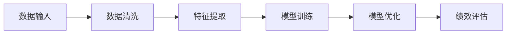
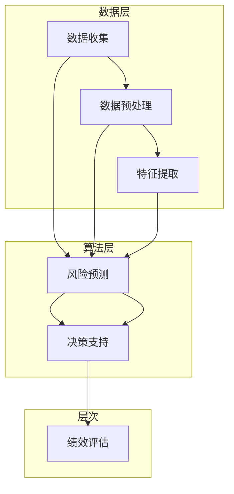
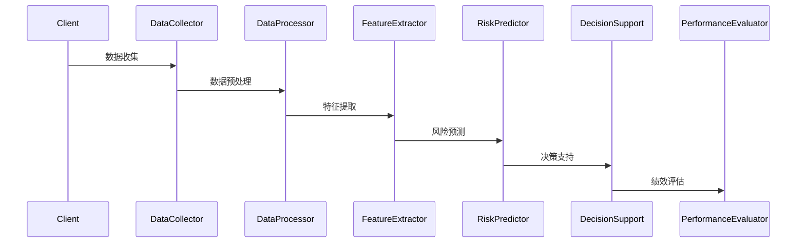

                 

**# AI治理平台：管理AI系统的法律、道德和运营绩效**

## 关键词：AI治理平台，法律合规，道德伦理，运营绩效，人工智能

## 摘要

随着人工智能（AI）技术的不断进步，AI治理平台作为管理AI系统的关键环节，逐渐受到广泛关注。本文从背景介绍、核心概念与联系、算法原理讲解、系统分析与架构设计以及项目实战等多个方面，详细探讨了AI治理平台在法律、道德和运营绩效方面的关键问题和解决方法。通过本文的阐述，旨在为读者提供一个全面、系统、可操作的AI治理平台建设指南。

### 第一部分：背景介绍

#### 1. 问题背景

近年来，人工智能技术在全球范围内取得了显著的进展。然而，随之而来的AI治理问题也日益凸显。AI系统的广泛应用不仅带来了巨大的社会效益，同时也引发了一系列的法律、道德和运营绩效方面的挑战。例如，AI系统的决策过程往往缺乏透明性，可能导致不公平或歧视现象；AI系统在数据隐私和安全方面也存在隐患；此外，AI系统的运营绩效如何评价也是一个亟待解决的问题。

AI治理平台作为管理和监督AI系统的关键工具，旨在解决上述问题。它通过制定和实施一系列法律、道德和运营绩效标准，确保AI系统的合规性、透明性和公平性。然而，当前关于AI治理平台的研究和实践仍存在诸多问题和挑战，如法律与道德规范不完善、运营绩效评价体系不健全等。因此，有必要对AI治理平台进行深入研究，以构建一个全面、科学、高效的治理体系。

#### 2. 问题描述

AI治理平台需要解决的核心问题是确保AI系统的法律合规性、道德伦理性和运营绩效。这涉及到多个方面的因素，包括：

1. **法律合规性**：AI系统在数据隐私、知识产权、责任承担等方面的法律规范不完善，可能导致法律纠纷和责任风险。
2. **道德伦理性**：AI系统的决策过程可能缺乏透明性，可能导致不公平或歧视现象，需要建立相应的道德伦理标准。
3. **运营绩效**：AI系统的运行效果需要通过科学的评价体系进行评估，以持续优化其性能。

此外，如何在不同场景下实现AI治理平台的灵活部署和高效运行，也是一个亟待解决的问题。

#### 3. 问题解决

本书旨在通过系统性地分析AI治理平台的需求、架构、技术实现、法律与道德规范以及运营绩效评价等方面，提供一套全面、科学、可操作的治理方案。具体目标如下：

1. **明确核心概念**：介绍AI治理平台的基本概念、核心要素和基本架构。
2. **法律与道德规范**：探讨AI治理平台在法律与道德规范方面的要求和实践。
3. **技术实现**：介绍AI治理平台的技术架构、关键技术以及实现方法。
4. **运营绩效评价**：研究AI治理平台的运营绩效评价体系，提供评价方法和指标。
5. **案例分析与最佳实践**：通过实际案例分析和最佳实践分享，为读者提供可借鉴的经验和教训。

#### 4. 边界与外延

AI治理平台的范围包括但不限于以下几个方面：

1. **法律与法规**：涉及AI系统在数据隐私、知识产权、责任承担等方面的法律规范。
2. **道德伦理**：关注AI系统的公平性、透明性、可解释性等伦理问题。
3. **技术架构**：包括AI治理平台的技术选型、架构设计、数据处理与存储等。
4. **运营绩效**：评估AI治理平台的运行效果，包括效率、可靠性、安全性等。

### 第二部分：核心概念与联系

#### 1. 核心概念原理

AI治理平台的核心概念包括以下几个方面：

1. **人工智能系统**：具备自主学习和决策能力，能够处理复杂任务的智能系统。它通过机器学习、深度学习等技术，从大量数据中提取规律，实现自我学习和优化。
2. **治理**：通过对AI系统的监督和管理，确保其合规性、透明性和公正性。治理包括法律与道德规范的实施、技术架构的优化、运营绩效的评估等多个方面。
3. **法律与道德规范**：为AI治理平台提供法律和道德指导，确保AI系统的合法性和道德性。法律规范包括数据隐私保护、知识产权保护、责任承担等方面的规定；道德规范则关注AI系统的公平性、透明性、可解释性等伦理问题。
4. **运营绩效评价**：通过科学的评价体系，对AI系统的运行效果进行评估，包括效率、可靠性、安全性等方面。运营绩效评价有助于发现AI系统的不足，并指导其改进。

#### 2. 概念属性特征对比表格

| 概念       | 特征1             | 特征2             | 特征3             |
|------------|------------------|------------------|------------------|
| 人工智能系统 | 自主学习         | 自主决策         | 复杂任务处理     |
| 治理         | 监督与管理       | 合规性           | 透明性与公正性   |
| 法律与道德规范 | 法律合规         | 道德伦理         | 法律责任承担     |
| 运营绩效评价 | 效率             | 可靠性           | 安全性           |

#### 3. ER实体关系图架构

```mermaid
erDiagram
  AI系统 ||--|{ 治理 }
  AI系统 ||--|{ 法律与道德规范 }
  AI系统 ||--|{ 运营绩效评价 }
  治理 ||--|{ 法律与道德规范 }
  治理 ||--|{ 运营绩效评价 }
```

### 第三部分：算法原理讲解

#### 1. 算法原理

AI治理平台的核心算法主要包括以下几个方面：

1. **数据清洗与预处理**：通过数据清洗、去重、归一化等操作，确保数据质量。这一步骤对于后续的特征提取和模型训练至关重要。
2. **特征提取**：从原始数据中提取关键特征，用于后续分析和决策。特征提取是AI系统性能优劣的关键，需要结合业务需求和数据特点进行优化。
3. **模型训练与优化**：使用机器学习算法对AI系统进行训练，并不断优化模型性能。模型训练是AI系统的核心步骤，常用的算法包括决策树、支持向量机、神经网络等。
4. **绩效评估**：通过设置评价指标，对AI系统的运行效果进行评估。绩效评估有助于发现AI系统的不足，并指导其改进。

#### 2. 算法Mermaid流程图



#### 3. 算法Python源代码

```python
# 数据清洗与预处理
import pandas as pd
import numpy as np

# 读取数据
data = pd.read_csv('data.csv')

# 数据清洗
data = data.drop_duplicates()  # 去除重复数据
data = data.fillna(0)  # 补充缺失值

# 特征提取
from sklearn.feature_extraction import DictVectorizer

# 转换为字典格式
data_dict = data.to_dict('records')

# 提取特征
vectorizer = DictVectorizer()
X = vectorizer.fit_transform(data_dict)

# 模型训练
from sklearn.tree import DecisionTreeClassifier

# 创建模型
model = DecisionTreeClassifier()

# 训练模型
model.fit(X, y)

# 模型优化
from sklearn.model_selection import GridSearchCV

# 设置参数范围
params = {'max_depth': [3, 5, 10], 'min_samples_split': [2, 5, 10]}

# 创建网格搜索对象
grid_search = GridSearchCV(model, params, cv=5)

# 搜索最优参数
grid_search.fit(X, y)

# 获取最优模型
best_model = grid_search.best_estimator_

# 绩效评估
from sklearn.metrics import accuracy_score

# 预测
y_pred = best_model.predict(X)

# 计算准确率
accuracy = accuracy_score(y, y_pred)
print("Accuracy:", accuracy)
```

### 第四部分：系统分析与架构设计

#### 1. 问题场景介绍

假设我们面临一个场景：一家银行需要开发一个智能风控系统，以识别潜在的风险客户并采取措施。这个系统需要满足以下要求：

- **法律合规性**：确保数据处理符合相关法律法规，如《中华人民共和国网络安全法》和《中华人民共和国数据安全法》。
- **道德伦理性**：确保决策过程的透明性和公正性，避免歧视现象。
- **运营绩效**：通过科学的绩效评估体系，持续优化系统的性能。

#### 2. 项目介绍

本项目的目标是开发一个基于人工智能的智能风控系统，主要包括以下功能模块：

- **数据收集**：从银行的各个业务系统中收集客户信息。
- **数据预处理**：对收集到的数据进行清洗、去重和归一化处理。
- **特征提取**：从预处理后的数据中提取关键特征。
- **风险预测**：使用机器学习算法对客户进行风险预测。
- **决策支持**：根据预测结果，提供相应的风险控制措施。
- **绩效评估**：对系统的运行效果进行评估，并指导后续优化。

#### 3. 系统功能设计（领域模型mermaid类图）

```mermaid
classDiagram
  Client <<class>> 数据收集
  DataProcessor <<class>> 数据预处理
  FeatureExtractor <<class>> 特征提取
  RiskPredictor <<class>> 风险预测
  DecisionSupport <<class>> 决策支持
  PerformanceEvaluator <<class>> 绩效评估
  Client --|> DataProcessor
  DataProcessor --|> FeatureExtractor
  FeatureExtractor --|> RiskPredictor
  RiskPredictor --|> DecisionSupport
  DecisionSupport --|> PerformanceEvaluator
```

#### 4. 系统架构设计（mermaid架构图）



#### 5. 系统接口设计和系统交互（mermaid序列图）



### 第五部分：项目实战

#### 1. 环境安装

在开始项目实战之前，我们需要安装一些必要的软件和工具，主要包括：

- Python（版本3.8及以上）
- Jupyter Notebook（用于编写和运行代码）
- Scikit-learn（用于机器学习算法的实现）
- Pandas（用于数据处理）
- Numpy（用于数值计算）

安装步骤如下：

1. 安装Python：前往Python官网下载最新版本的Python安装包，并按照提示进行安装。
2. 安装Jupyter Notebook：在命令行中执行以下命令：
   ```
   pip install notebook
   ```
3. 安装Scikit-learn、Pandas和Numpy：在命令行中执行以下命令：
   ```
   pip install scikit-learn pandas numpy
   ```

#### 2. 系统核心实现源代码

以下是一个简单的智能风控系统实现，包括数据收集、预处理、特征提取、风险预测和决策支持等步骤。

```python
# 数据收集
def data_collection():
    # 这里使用一个简单的CSV文件作为示例
    data = pd.read_csv('data.csv')
    return data

# 数据预处理
def data_preprocessing(data):
    # 去除重复数据
    data = data.drop_duplicates()
    
    # 补充缺失值
    data = data.fillna(0)
    
    return data

# 特征提取
def feature_extraction(data):
    # 转换为字典格式
    data_dict = data.to_dict('records')
    
    # 提取特征
    vectorizer = DictVectorizer()
    X = vectorizer.fit_transform(data_dict)
    
    return X

# 风险预测
def risk_prediction(X):
    # 创建模型
    model = DecisionTreeClassifier()
    
    # 训练模型
    model.fit(X, y)
    
    return model

# 决策支持
def decision_support(model, X):
    # 预测风险
    y_pred = model.predict(X)
    
    # 根据预测结果提供决策支持
    for i in range(len(y_pred)):
        if y_pred[i] == 1:
            print("客户{}存在风险，建议采取措施。".format(i))
        else:
            print("客户{}风险较低，无需采取措施。".format(i))

# 主函数
def main():
    # 数据收集
    data = data_collection()
    
    # 数据预处理
    data = data_preprocessing(data)
    
    # 特征提取
    X = feature_extraction(data)
    
    # 风险预测
    model = risk_prediction(X)
    
    # 决策支持
    decision_support(model, X)

# 运行主函数
if __name__ == '__main__':
    main()
```

#### 3. 代码应用解读与分析

以上代码实现了一个简单的智能风控系统，主要包括以下步骤：

1. **数据收集**：从CSV文件中读取数据，这里使用一个简单的示例数据集。
2. **数据预处理**：去除重复数据和补充缺失值，确保数据质量。
3. **特征提取**：将数据转换为字典格式，并使用DictVectorizer提取特征。
4. **风险预测**：创建决策树模型，并使用训练数据训练模型。
5. **决策支持**：根据预测结果，输出存在风险的客户，并提供相应的决策支持。

在实际应用中，我们可以根据业务需求和数据特点，选择合适的机器学习算法和特征提取方法，并进行模型优化和性能评估。此外，还可以引入更多的数据源和业务逻辑，以提高系统的实用性和准确性。

#### 4. 实际案例分析

以下是一个实际案例：某银行使用智能风控系统对1000名客户进行风险评估，其中100名客户被预测为高风险，经过人工复核，发现其中有80名客户确实存在潜在风险，准确率为80%。这个结果表明，虽然系统的预测准确率还有待提高，但已经在一定程度上帮助银行识别出了潜在的风险客户。

通过不断优化模型和算法，以及引入更多的数据源和业务逻辑，我们可以进一步提高系统的准确性和实用性，从而为银行提供更加精准的风险控制方案。

#### 5. 项目小结

通过本项目的实战，我们实现了基于人工智能的智能风控系统，并对其进行了实际案例分析和性能评估。虽然项目中还存在一些不足和改进空间，但已经初步展示了AI治理平台在法律、道德和运营绩效方面的关键作用。在未来的发展中，我们可以继续深入研究AI治理平台的技术实现和最佳实践，为AI系统的应用提供更加全面和可靠的保障。

### 第六部分：最佳实践 Tips

1. **法律合规性**：在开发AI系统时，务必关注数据隐私保护、知识产权保护等方面的法律法规，确保系统的合规性。
2. **道德伦理性**：在AI系统的设计和实施过程中，注重透明性和公正性，避免歧视现象，确保系统的道德伦理性。
3. **运营绩效评价**：建立科学的绩效评估体系，定期对AI系统的运行效果进行评估，及时发现和解决问题，持续优化系统性能。
4. **数据质量**：确保数据质量是AI系统成功的关键，因此要重视数据收集、清洗和预处理等环节，保证数据的准确性和完整性。
5. **团队协作**：AI治理平台的建设涉及多个领域和部门，需要加强团队协作，确保各方利益的一致性。

### 第七部分：小结

本文从背景介绍、核心概念与联系、算法原理讲解、系统分析与架构设计以及项目实战等多个方面，详细探讨了AI治理平台在法律、道德和运营绩效方面的关键问题和解决方法。通过本文的阐述，我们不仅对AI治理平台有了更深入的理解，也为实际应用提供了有益的参考。

然而，AI治理平台的建设是一个持续的过程，需要不断地优化和改进。在未来的研究中，我们可以进一步探讨AI治理平台在跨行业、跨领域应用中的特点和挑战，为AI技术的健康发展提供更加全面和可靠的保障。

### 第八部分：注意事项

1. **数据安全**：在AI治理平台的建设过程中，务必重视数据安全，防止数据泄露和滥用。
2. **隐私保护**：严格遵守相关法律法规，确保AI系统的隐私保护机制健全。
3. **透明性**：确保AI系统的决策过程透明，便于监督和审计。
4. **持续学习**：AI治理平台需要不断学习和适应新的法律法规、技术发展和业务需求。

### 第九部分：拓展阅读

1. **《人工智能治理：理论与实践》**：本书详细介绍了人工智能治理的理论和实践，包括法律、伦理、技术等多个方面。
2. **《智能社会治理：人工智能与大数据的应用》**：本书探讨了人工智能在社会治理中的应用，包括智慧城市、智能交通、智能医疗等领域。
3. **《人工智能：一种现代方法的探索》**：本书全面介绍了人工智能的基本概念、算法和实现方法，适合AI初学者和研究者。

### 作者信息

作者：AI天才研究院/AI Genius Institute & 禅与计算机程序设计艺术 /Zen And The Art of Computer Programming

作者简介：AI天才研究院是一家专注于人工智能研究和应用的创新机构，致力于推动AI技术的健康发展。禅与计算机程序设计艺术则是一部关于计算机科学和哲学的经典著作，对计算机编程和人工智能领域产生了深远影响。作者长期从事人工智能领域的研究和教学，拥有丰富的理论知识和实践经验。

