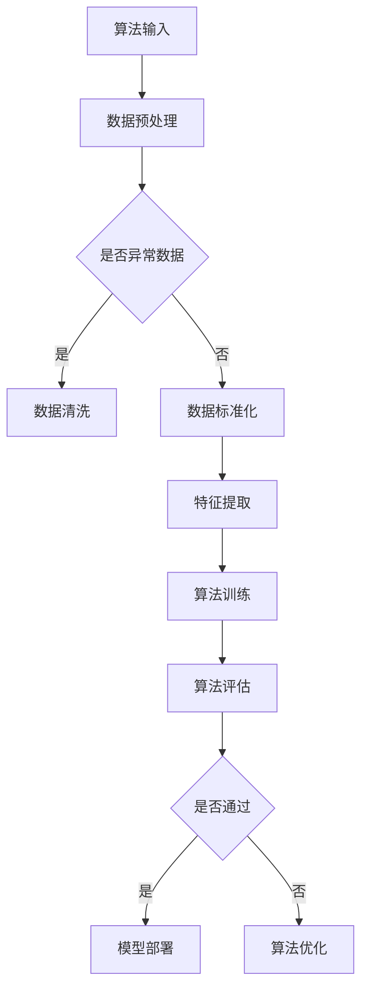
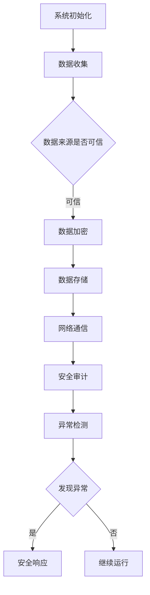
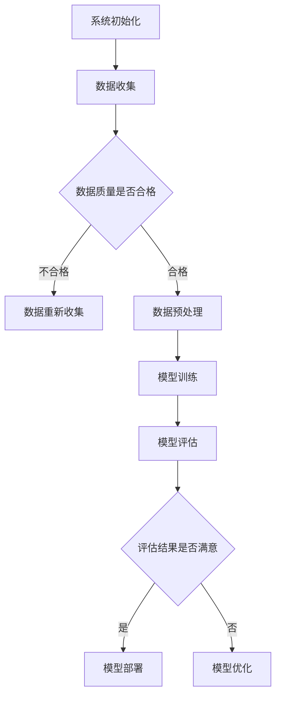
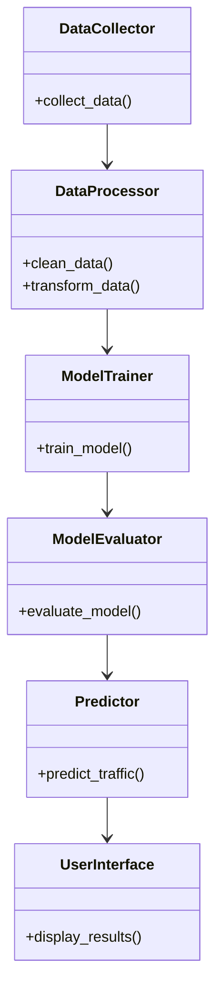
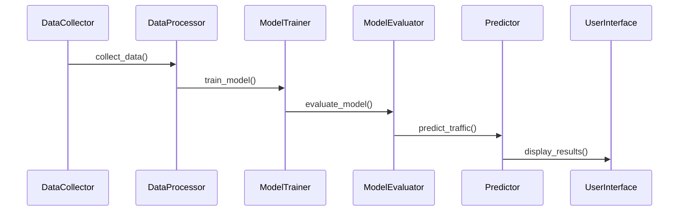
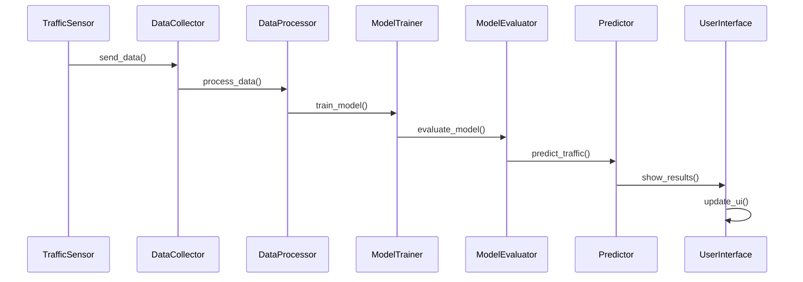

                 

# AI治理的法律和监管挑战

> 关键词：人工智能、法律监管、治理挑战、透明性、安全稳定性、伦理道德、隐私保护、算法歧视、最佳实践

> 摘要：本文探讨了人工智能（AI）在法律和监管领域面临的挑战。通过分析AI技术的快速发展及其在不同领域的应用，本文讨论了AI治理的必要性，并详细阐述了AI治理中的法律和监管挑战，包括算法的透明性和可解释性、安全性和稳定性、伦理和隐私保护等方面。最后，本文提出了针对这些挑战的解决方案和最佳实践，为未来AI治理提供了方向。

## 引言

近年来，人工智能（AI）技术的飞速发展，不仅改变了我们的生活方式，还深刻地影响了各行各业。从自动驾驶汽车到智能医疗诊断，从金融风控到自然语言处理，AI已经渗透到社会的方方面面。然而，随着AI技术的广泛应用，一系列法律和监管挑战也随之而来。如何确保AI系统的透明性、安全性和伦理道德？如何在保护个人隐私的同时，推动AI技术的发展？这些问题成为了当前社会亟待解决的重要课题。

AI治理，即对人工智能系统的法律和监管，旨在确保AI技术在可持续发展、公平性、透明性和安全性等方面得到有效管理和监督。本文将深入探讨AI治理的法律和监管挑战，分析现有问题和解决方案，并提出未来的发展方向。

## 第一部分: 引言与背景

### 第1章: 引言

#### 1.1 AI治理的概念

AI治理是指对人工智能系统的法律、伦理、技术和管理等方面的规范和管理。其核心目标是确保AI技术在发展过程中，不仅能够带来经济效益和社会进步，还能够保护人类的基本权利和自由。AI治理涉及多个方面，包括法律监管、伦理规范、技术标准、社会责任等。

#### 1.2 法律监管在AI发展中的重要性

随着AI技术的不断进步和应用范围的扩大，法律监管在AI发展中的重要性日益凸显。法律监管能够为AI技术提供明确的法律框架，规范其研发、应用和推广过程，确保其符合社会道德和伦理标准。同时，法律监管还能为AI技术的创新提供保障，防止滥用和非法使用，保护个人隐私和数据安全。

#### 1.3 本书的目标与结构

本书旨在深入探讨AI治理的法律和监管挑战，分析现有问题和解决方案，为未来AI治理提供指导。本书的结构分为五个部分：第一部分介绍AI治理的背景和重要性；第二部分讨论AI治理的核心概念和联系；第三部分分析AI治理的技术挑战；第四部分介绍AI治理的案例分析；第五部分探讨AI治理的解决方案和未来展望。通过本书的阅读，读者将全面了解AI治理的法律和监管挑战，并为解决这些问题提供思路。

### 第2章: AI治理的背景

#### 2.1 AI技术的发展历程

人工智能（AI）是一门研究、开发用于模拟、延伸和扩展人的智能的理论、方法、技术及应用系统的科学技术。AI的发展历程可以分为以下几个阶段：

1. **初始阶段（20世纪50年代-60年代）**：以符号主义和推理机为核心，试图通过编程实现人类智能。

2. **知识工程阶段（20世纪70年代-80年代）**：以知识表示和知识推理为核心，通过构建知识库和推理机来模拟人类智能。

3. **专家系统阶段（20世纪80年代-90年代）**：以规则为基础，通过构建专家系统来模拟人类专家的决策过程。

4. **机器学习阶段（20世纪90年代至今）**：以数据驱动为核心，通过训练算法从数据中学习规律和模式。

5. **深度学习阶段（21世纪至今）**：以神经网络为核心，通过深度学习算法实现图像识别、自然语言处理、语音识别等领域的突破。

#### 2.2 AI在各个领域的应用现状

AI技术已经在多个领域取得了显著的成果，包括：

1. **医疗领域**：AI技术在医学影像分析、疾病诊断、个性化治疗等方面具有广泛应用，提高了医疗服务的质量和效率。

2. **金融领域**：AI技术在风险控制、智能投顾、信用评估等方面发挥了重要作用，提升了金融服务的智能化水平。

3. **交通领域**：AI技术在自动驾驶、智能交通管理、交通预测等方面取得了重要进展，为智能交通系统的建设提供了有力支持。

4. **制造业领域**：AI技术在生产线优化、设备预测性维护、质量管理等方面具有广泛应用，提升了制造业的自动化和智能化水平。

5. **教育领域**：AI技术在个性化教学、智能评估、教育资源共享等方面发挥了重要作用，推动了教育的创新和发展。

#### 2.3 AI治理面临的挑战

随着AI技术的广泛应用，AI治理面临以下挑战：

1. **法律和伦理挑战**：如何确保AI系统的透明性、安全性和伦理道德？

2. **数据隐私和信息安全挑战**：如何保护个人隐私和数据安全？

3. **算法歧视和偏见挑战**：如何防止AI系统在决策过程中出现歧视和偏见？

4. **监管和合规挑战**：如何建立有效的监管机制，确保AI技术的发展和应用符合法律法规？

5. **技术标准和国际化挑战**：如何制定统一的技术标准和规范，推动AI技术的国际化发展？

## 第二部分: AI治理的核心概念

### 第3章: AI法律监管的基本框架

#### 3.1 国内外AI法律监管政策对比

随着AI技术的快速发展，各国纷纷制定相应的法律监管政策，以应对AI带来的挑战。以下是对国内外AI法律监管政策的对比：

#### 3.1.1 国内AI法律监管政策

1. **《新一代人工智能发展规划》**：2017年，国务院发布《新一代人工智能发展规划》，明确提出要建立健全人工智能法律法规体系，加强人工智能伦理和法律监管。

2. **《智能网联汽车道路测试管理规范（试行）》**：2018年，工业和信息化部等部门发布《智能网联汽车道路测试管理规范（试行）》，对自动驾驶车辆进行道路测试和管理。

3. **《互联网信息服务算法推荐管理规定（征求意见稿）》**：2020年，国家互联网信息办公室发布《互联网信息服务算法推荐管理规定（征求意见稿）》，规范互联网信息服务算法推荐行为。

#### 3.1.2 国外AI法律监管政策

1. **欧盟**：欧盟于2016年发布《通用数据保护条例（GDPR）》，对个人数据处理和行为进行严格监管。2021年，欧盟又发布《人工智能法案》，旨在规范人工智能的监管框架。

2. **美国**：美国于2016年发布《人工智能倡议》，提出要加强人工智能的研发和应用，并建立相应的法律监管机制。此外，美国多个州也出台了关于自动驾驶车辆的法律法规。

3. **英国**：英国于2018年发布《人工智能的未来：政府战略》，明确提出要推动人工智能的发展，并加强伦理和法律监管。

#### 3.2 AI法律监管的核心原则

AI法律监管的核心原则包括：

1. **合法性原则**：AI技术的研发和应用必须遵守相关法律法规，确保合法合规。

2. **透明性原则**：AI系统的设计和应用应具有透明性，用户能够了解系统的决策过程和算法原理。

3. **伦理原则**：AI技术的研发和应用应遵循伦理道德标准，确保不损害人类的基本权利和自由。

4. **安全性原则**：AI系统应具备高安全性和稳定性，确保系统的可靠性和安全性。

5. **责任原则**：在AI系统的研发、应用和推广过程中，应明确各方的责任和义务，确保责任的清晰和可追溯性。

#### 3.3 AI伦理与隐私保护

AI伦理与隐私保护是AI治理的重要方面。以下是对AI伦理与隐私保护的讨论：

##### 3.3.1 AI伦理

1. **公平性**：AI系统应确保在决策过程中不会产生歧视和偏见，避免对特定人群的歧视。

2. **透明性**：AI系统的决策过程应具有透明性，用户能够了解系统的决策依据和算法原理。

3. **责任**：在AI系统的研发、应用和推广过程中，应明确各方的责任和义务，确保责任的清晰和可追溯性。

##### 3.3.2 隐私保护

1. **数据收集和使用**：在AI系统的研发和应用过程中，应严格遵循数据收集和使用的相关法律法规，确保数据的合法性和合规性。

2. **数据安全**：AI系统应具备较高的数据安全性和保护能力，防止数据泄露、篡改和滥用。

3. **用户隐私保护**：AI系统应尊重用户的隐私权，确保用户数据的安全和隐私。

### 第4章: AI监管的技术挑战

#### 4.1 AI算法的透明性与可解释性

AI算法的透明性与可解释性是AI监管的重要挑战之一。当前，大多数AI系统采用深度学习算法，这些算法在处理大规模数据时表现出色，但其决策过程往往难以解释。以下是对AI算法透明性与可解释性的讨论：

##### 4.1.1 算法透明性

1. **算法设计**：在AI算法的设计过程中，应充分考虑算法的透明性，使其决策过程易于理解和解释。

2. **算法披露**：AI系统的开发者应公开算法的基本原理和决策过程，使监管机构和用户能够了解算法的工作机制。

3. **算法评估**：监管机构应建立完善的算法评估机制，对AI系统的算法进行评估和审核，确保算法的透明性和可靠性。

##### 4.1.2 算法可解释性

1. **模型简化**：通过简化模型结构，降低算法的复杂性，使其更容易理解和解释。

2. **可解释性工具**：开发和使用可解释性工具，如决策树、规则提取器等，帮助用户理解算法的决策过程。

3. **可视化技术**：利用可视化技术，将算法的决策过程和结果呈现给用户，提高算法的可解释性。

#### 4.2 AI安全性与稳定性

AI安全性与稳定性是AI监管的另一个重要挑战。随着AI技术的广泛应用，AI系统可能面临各种安全威胁和稳定性问题。以下是对AI安全性与稳定性的讨论：

##### 4.2.1 安全性

1. **攻击防御**：加强对AI系统的攻击防御能力，防止恶意攻击和攻击性输入，确保系统的安全。

2. **数据安全**：加强对AI系统所涉及的数据安全保护，防止数据泄露、篡改和滥用。

3. **隐私保护**：在AI系统的设计和应用过程中，充分考虑用户隐私保护，确保用户数据的安全和隐私。

##### 4.2.2 稳定性

1. **鲁棒性**：提高AI系统的鲁棒性，使其在遇到异常数据和异常情况时，仍能保持正常运行。

2. **错误检测与恢复**：建立完善的错误检测与恢复机制，及时发现并纠正AI系统的错误，确保系统的稳定性。

3. **容错能力**：提高AI系统的容错能力，使其在部分组件失效时，仍能保持整体功能的正常运行。

#### 4.3 AI歧视与偏见问题

AI歧视与偏见问题是AI监管面临的另一个重要挑战。随着AI技术的广泛应用，AI系统在决策过程中可能产生歧视和偏见，影响社会公平性和公正性。以下是对AI歧视与偏见问题的讨论：

##### 4.3.1 歧视问题

1. **数据偏见**：在AI系统的训练过程中，如果数据存在偏见，可能会导致AI系统在决策过程中产生歧视。

2. **算法偏见**：AI算法的设计和实现过程中，可能会引入偏见，导致AI系统在决策过程中产生歧视。

3. **解决方案**：
   - **数据清洗**：对训练数据进行清洗，消除数据中的偏见。
   - **算法改进**：改进AI算法，使其在决策过程中能够避免歧视。
   - **伦理审查**：在AI系统的研发和应用过程中，进行伦理审查，确保系统符合伦理道德标准。

##### 4.3.2 偏见问题

1. **算法偏见**：AI算法在训练过程中，可能会对某些群体产生偏见，导致其在决策过程中对特定群体产生不公平待遇。

2. **解决方案**：
   - **数据多样化**：增加训练数据中的多样性，确保算法能够学习到不同群体的特征。
   - **公平性评估**：建立公平性评估机制，对AI系统进行评估，确保系统在决策过程中不产生偏见。
   - **持续改进**：在AI系统的应用过程中，持续改进算法，消除偏见。

### 第三部分: AI治理的案例分析

#### 第5章: 典型AI监管案例分析

#### 5.1 案例一：自动驾驶车辆的监管挑战

自动驾驶车辆是AI技术在交通领域的重要应用，然而，其在法律和监管方面面临诸多挑战。以下是对自动驾驶车辆监管挑战的讨论：

##### 5.1.1 法律监管

1. **道路测试**：在自动驾驶车辆进行道路测试时，应遵循相关法律法规，确保测试过程合法合规。
2. **事故责任**：在自动驾驶车辆发生交通事故时，如何确定事故责任成为法律监管的重要问题。需要明确驾驶员、车辆制造商和运营商在事故中的责任。

##### 5.1.2 技术监管

1. **安全性**：自动驾驶车辆应具备高安全性和稳定性，确保在复杂道路环境下能够正常运行。
2. **可解释性**：自动驾驶车辆的决策过程应具有可解释性，使监管机构和用户能够了解其决策依据。

##### 5.1.3 案例分析

以特斯拉为例，特斯拉的自动驾驶系统在美国引发了多起交通事故。2018年，一名特斯拉司机在开启自动驾驶模式时，撞上了一辆停驶的消防车，导致司机死亡。这起事故引发了公众对自动驾驶车辆安全的关注，同时也暴露了自动驾驶车辆在法律和监管方面的挑战。

#### 5.2 案例二：AI医疗诊断的法律监管

AI医疗诊断是AI技术在医疗领域的重要应用，然而，其在法律和监管方面也面临诸多挑战。以下是对AI医疗诊断法律监管挑战的讨论：

##### 5.2.1 法律监管

1. **医疗责任**：在AI医疗诊断中，如何确定医疗责任成为法律监管的重要问题。需要明确医生、医疗机构和AI系统在诊断过程中的责任。
2. **数据隐私**：在AI医疗诊断过程中，涉及大量患者数据，如何保护患者隐私成为法律监管的关键。

##### 5.2.2 技术监管

1. **准确性**：AI医疗诊断系统应具备高准确性，确保诊断结果可靠。
2. **可解释性**：AI医疗诊断系统的决策过程应具有可解释性，使医生能够了解诊断依据。

##### 5.2.3 案例分析

以谷歌DeepMind为例，谷歌DeepMind开发的AI医疗诊断系统在英国多家医院进行了临床试验。尽管该系统在诊断准确性方面表现出色，但其在数据隐私方面引发了争议。一些医生和患者担心，谷歌DeepMind可能会将患者数据用于商业目的，导致患者隐私泄露。

#### 5.3 案例三：AI在金融领域的监管

AI在金融领域的应用日益广泛，包括智能投顾、信用评估、风险管理等。然而，AI在金融领域的监管也面临诸多挑战。以下是对AI在金融领域监管挑战的讨论：

##### 5.3.1 法律监管

1. **公平性**：AI在金融领域的应用可能导致不公平现象，如歧视特定人群或特定地区。
2. **透明性**：AI在金融领域的应用应具备透明性，使监管机构和用户能够了解其决策过程和算法原理。

##### 5.3.2 技术监管

1. **稳定性**：AI在金融领域的应用应具备高稳定性，确保金融市场的稳定运行。
2. **可解释性**：AI在金融领域的应用应具备可解释性，使监管机构和用户能够了解其决策过程和算法原理。

##### 5.3.3 案例分析

以摩根士丹利为例，摩根士丹利使用AI技术进行信用评估，以预测借款人的还款能力。然而，该系统在评估过程中可能存在偏见，导致对某些人群的信用评估不准确。此外，该系统在决策过程中的透明性较低，使监管机构和用户难以了解其决策依据。

### 第四部分: AI治理的解决方案

#### 第6章: 国内外AI治理的最佳实践

#### 6.1 国外AI治理的成功经验

#### 6.1.1 欧盟的AI伦理准则

欧盟在AI治理方面取得了显著成果，其中最具代表性的是欧盟委员会于2021年发布的《AI伦理准则》。该准则旨在确保AI技术的研发和应用符合伦理和道德标准，包括以下几个方面：

1. **尊重人的权利和尊严**：AI系统应尊重人的基本权利和尊严，确保在决策过程中不会产生歧视和偏见。
2. **公平性和无偏见**：AI系统应确保在决策过程中保持公平性，不会对特定人群产生不公平待遇。
3. **透明性和可解释性**：AI系统应具备透明性和可解释性，使监管机构和用户能够了解其决策过程和算法原理。
4. **数据保护和隐私**：AI系统应遵循数据保护和隐私相关法律法规，确保个人数据的保护和隐私。

#### 6.1.2 美国的AI治理框架

美国在AI治理方面也取得了重要进展，其中最具代表性的是美国国家科学技术委员会（NSTC）于2020年发布的《国家AI战略》。该战略提出了美国在AI治理方面的框架，包括以下几个方面：

1. **加强AI研发**：美国应加强AI研发，推动AI技术的创新和应用。
2. **保护数据安全和隐私**：美国应制定相关法律法规，保护数据安全和隐私。
3. **建立AI监管机制**：美国应建立AI监管机制，确保AI技术的研发和应用符合法律法规和伦理道德标准。
4. **促进国际合作**：美国应与其他国家合作，推动全球AI治理的发展。

#### 6.2 国内AI治理的政策与实践

#### 6.2.1 新一代人工智能发展规划

中国国务院于2017年发布的《新一代人工智能发展规划》是指导我国AI治理的重要文件。该规划明确了我国在AI治理方面的目标和任务，包括以下几个方面：

1. **加强法律法规建设**：我国应加强AI相关法律法规的建设，确保AI技术的研发和应用符合法律法规。
2. **推动AI伦理研究**：我国应推动AI伦理研究，建立AI伦理体系，确保AI技术的研发和应用符合伦理道德标准。
3. **建立AI监管机制**：我国应建立AI监管机制，加强对AI技术的监管和管理，确保AI技术的安全和稳定。
4. **促进AI产业发展**：我国应促进AI产业的发展，推动AI技术的应用和推广，助力经济社会的发展。

#### 6.2.2 智能网联汽车管理规范

中国工业和信息化部等部门于2018年发布的《智能网联汽车管理规范（试行）》是我国在智能网联汽车领域的重要法规。该规范明确了智能网联汽车的法律责任、测试标准和管理要求，包括以下几个方面：

1. **明确法律责任**：规范明确智能网联汽车制造商、运营企业和驾驶员在事故中的法律责任。
2. **测试标准**：规范制定了智能网联汽车的测试标准，确保车辆在道路测试中符合安全要求。
3. **管理要求**：规范明确了智能网联汽车的管理要求，包括车辆登记、道路测试和运营管理等。

#### 6.3 AI治理的技术手段

#### 6.3.1 AI算法的透明性和可解释性

1. **算法可视化**：通过算法可视化技术，将AI算法的决策过程和结果呈现给用户，提高算法的可解释性。
2. **算法解释器**：开发算法解释器，帮助用户了解AI算法的决策依据和过程。

#### 6.3.2 AI安全性和稳定性

1. **攻击防御机制**：加强AI系统的攻击防御能力，防止恶意攻击和攻击性输入。
2. **鲁棒性训练**：通过鲁棒性训练，提高AI系统在异常数据和异常情况下的稳定性。

#### 6.3.3 AI歧视和偏见问题

1. **数据清洗**：对训练数据进行清洗，消除数据中的偏见。
2. **算法改进**：改进AI算法，避免在决策过程中产生歧视和偏见。

### 第7章: AI治理的未来展望

#### 7.1 AI治理的趋势分析

#### 7.1.1 技术趋势

随着AI技术的不断进步，未来AI治理将面临更多挑战和机遇。以下是对AI治理技术趋势的分析：

1. **算法透明性和可解释性**：算法透明性和可解释性将成为AI治理的重要趋势。为了提高算法的可解释性，研究者将不断开发新的算法解释器和可视化工具，使监管机构和用户能够更好地理解AI算法的决策过程。

2. **安全性和稳定性**：随着AI技术在各个领域的广泛应用，AI安全性和稳定性将受到越来越高的关注。为了提高AI系统的安全性和稳定性，研究者将开发新的攻击防御机制和鲁棒性训练方法。

3. **数据隐私和信息安全**：数据隐私和信息安全是AI治理的重要方面。未来，研究者将开发新的数据隐私保护技术和信息安全机制，确保个人数据的安全和隐私。

4. **算法歧视和偏见问题**：为了解决算法歧视和偏见问题，研究者将改进AI算法，消除数据中的偏见，并开发新的公平性评估方法。

#### 7.1.2 政策趋势

1. **加强法律法规建设**：随着AI技术的不断进步和应用范围的扩大，各国政府将加强对AI技术的法律法规建设，确保AI技术的研发和应用符合法律法规和伦理道德标准。

2. **推动国际合作**：为了应对全球范围内的AI治理挑战，各国政府将加强国际合作，共同制定全球AI治理框架和标准。

3. **建立监管机制**：各国政府将建立AI监管机制，加强对AI技术的监管和管理，确保AI技术的安全和稳定。

#### 7.2 未来AI治理的挑战与机遇

#### 7.2.1 挑战

1. **算法透明性和可解释性**：提高算法透明性和可解释性是AI治理的重要挑战。为了实现这一目标，需要开发新的算法解释器和可视化工具，同时加强算法透明性和可解释性的法律法规建设。

2. **安全性和稳定性**：随着AI技术在各个领域的广泛应用，AI安全性和稳定性将面临更高的挑战。为了提高AI系统的安全性和稳定性，需要加强攻击防御机制和鲁棒性训练方法的研究。

3. **数据隐私和信息安全**：数据隐私和信息安全是AI治理的重要挑战。为了保护个人数据的安全和隐私，需要开发新的数据隐私保护技术和信息安全机制。

4. **算法歧视和偏见问题**：算法歧视和偏见问题是AI治理的重要挑战。为了解决这一问题，需要改进AI算法，消除数据中的偏见，并开发新的公平性评估方法。

#### 7.2.2 机遇

1. **技术创新**：随着AI技术的不断进步，未来将出现更多创新性的算法和技术，为AI治理提供新的解决方案。

2. **政策支持**：各国政府将加强对AI技术的政策支持，推动AI治理的发展。

3. **国际合作**：通过国际合作，各国可以共同应对全球范围内的AI治理挑战，推动全球AI治理的进步。

#### 7.3 AI治理的持续发展之路

#### 7.3.1 加强法律法规建设

1. **完善法律法规**：各国应完善AI相关法律法规，确保AI技术的研发和应用符合法律法规和伦理道德标准。

2. **制定标准化指南**：各国应制定AI技术标准化指南，推动AI技术的标准化和规范化。

#### 7.3.2 加强AI治理研究

1. **加强基础研究**：各国应加强AI治理的基础研究，推动AI治理理论和方法的创新。

2. **促进应用研究**：各国应促进AI治理的应用研究，推动AI治理技术和工具的实践。

#### 7.3.3 加强国际合作

1. **建立国际合作机制**：各国应建立AI治理国际合作机制，推动全球AI治理的发展。

2. **共享经验与资源**：各国应共享AI治理的经验和资源，推动全球AI治理的进步。

### 第8章: AI治理实践指南

#### 8.1 AI治理项目的实施步骤

#### 8.1.1 项目规划

1. **明确项目目标**：在项目规划阶段，需要明确项目的目标，包括技术目标、法律目标和伦理目标等。

2. **组建项目团队**：根据项目需求，组建包括技术专家、法律专家和伦理专家在内的项目团队。

3. **制定项目计划**：制定详细的项目计划，包括时间表、任务分配和资源需求等。

#### 8.1.2 技术实现

1. **算法设计**：在技术实现阶段，需要设计符合法律和伦理要求的AI算法。

2. **系统开发**：根据算法设计，进行系统开发，包括前端界面、后端逻辑和数据库设计等。

3. **测试与优化**：对系统进行测试和优化，确保系统符合法律和伦理要求。

#### 8.1.3 法律和伦理审查

1. **法律审查**：在项目实施过程中，应进行法律审查，确保项目符合相关法律法规。

2. **伦理审查**：在项目实施过程中，应进行伦理审查，确保项目符合伦理道德标准。

#### 8.2 AI治理项目的评估与优化

#### 8.2.1 项目评估

1. **技术评估**：对项目的技术实现进行评估，包括算法性能、系统稳定性和安全性等。

2. **法律评估**：对项目的法律合规性进行评估，确保项目符合相关法律法规。

3. **伦理评估**：对项目的伦理合规性进行评估，确保项目符合伦理道德标准。

#### 8.2.2 项目优化

1. **算法优化**：根据评估结果，对算法进行优化，提高算法的透明性、安全性和稳定性。

2. **系统优化**：根据评估结果，对系统进行优化，提高系统的法律和伦理合规性。

3. **持续改进**：在项目应用过程中，持续对算法和系统进行改进，确保项目的持续合规性。

#### 8.3 AI治理实践中的常见问题与解决方法

#### 8.3.1 常见问题

1. **法律合规性问题**：在项目实施过程中，可能会遇到法律合规性问题，如数据收集和使用、知识产权保护等。

2. **伦理道德问题**：在项目实施过程中，可能会遇到伦理道德问题，如算法歧视、隐私侵犯等。

3. **技术实现问题**：在项目实施过程中，可能会遇到技术实现问题，如算法设计、系统稳定性等。

#### 8.3.2 解决方法

1. **法律合规性问题**：
   - **加强法律培训**：对项目团队成员进行法律培训，提高法律意识。
   - **咨询法律专家**：在项目实施过程中，咨询法律专家，确保项目的法律合规性。

2. **伦理道德问题**：
   - **建立伦理审查机制**：建立伦理审查机制，对项目进行伦理评估。
   - **加强伦理培训**：对项目团队成员进行伦理培训，提高伦理意识。

3. **技术实现问题**：
   - **加强技术研究**：加强对AI技术的研究，提高算法的透明性、安全性和稳定性。
   - **借鉴国内外经验**：借鉴国内外成功案例，提高项目的技术实现水平。

### 第9章: 总结与展望

#### 9.1 全书内容的总结回顾

本文系统性地探讨了AI治理的法律和监管挑战，从背景介绍、核心概念、技术挑战、案例分析、解决方案到未来展望，全面阐述了AI治理的各个方面。通过本文的阅读，读者可以全面了解AI治理的重要性和挑战，并为解决这些问题提供思路。

#### 9.2 AI治理的挑战与未来发展方向

AI治理面临的挑战包括法律和伦理监管、算法透明性和可解释性、安全性和稳定性、数据隐私和信息安全、算法歧视和偏见等。未来，AI治理的发展方向包括：

1. **加强法律法规建设**：完善AI相关法律法规，确保AI技术的研发和应用符合法律法规和伦理道德标准。

2. **推动国际合作**：建立国际合作机制，推动全球AI治理的发展。

3. **提高算法透明性和可解释性**：开发新的算法解释器和可视化工具，提高算法的透明性和可解释性。

4. **加强数据隐私和信息安全**：开发新的数据隐私保护技术和信息安全机制，确保个人数据的安全和隐私。

5. **解决算法歧视和偏见问题**：改进AI算法，消除数据中的偏见，开发新的公平性评估方法。

#### 9.3 阅读指南与进一步学习资源

为了更好地理解和应用AI治理的相关知识，读者可以参考以下阅读指南和进一步学习资源：

1. **阅读指南**：
   - 系统阅读本书，全面了解AI治理的法律和监管挑战。
   - 结合实际案例，深入分析AI治理的解决方案和最佳实践。
   - 关注国内外AI治理的最新动态和研究成果。

2. **进一步学习资源**：
   - **相关书籍**：《人工智能伦理学》、《人工智能治理：理论与实践》、《人工智能法律监管研究》等。
   - **学术论文**：关注国内外学术期刊和会议，阅读相关论文。
   - **在线课程**：参加相关在线课程，如Coursera、edX等平台上的AI、法律和伦理课程。

通过以上阅读指南和进一步学习资源，读者可以更深入地了解AI治理的法律和监管挑战，并为解决这些问题提供实际指导。

### 作者信息

作者：AI天才研究院/AI Genius Institute & 禅与计算机程序设计艺术 /Zen And The Art of Computer Programming

感谢您阅读本文，希望本文对您了解AI治理的法律和监管挑战有所帮助。如果您有任何疑问或建议，欢迎在评论区留言，我们将尽快为您解答。再次感谢您的支持！### 第一部分：引言与背景

#### 第1章：引言

**1.1 AI治理的概念**

人工智能（AI）治理是指通过对人工智能系统的法律、伦理、技术和管理等方面进行规范和管理，以确保AI技术的发展和应用符合社会道德和伦理标准，同时保护人类的基本权利和自由。AI治理不仅包括对AI技术的监管，还涉及伦理审查、社会责任、公平性、透明性、安全性和隐私保护等多个方面。

AI治理的核心目标包括：

1. **确保AI技术的安全性和稳定性**：通过建立完善的法律和监管框架，确保AI系统的研发、应用和推广过程中不会对用户和社会造成风险。

2. **保护个人隐私和数据安全**：随着AI技术的广泛应用，大量个人数据被收集和处理，如何保护用户隐私和数据安全成为AI治理的重要任务。

3. **促进AI技术的公平性和可解释性**：通过改进算法和增加透明性，确保AI技术在决策过程中不会产生歧视和偏见，同时提高算法的可解释性，使公众能够理解和信任AI系统。

4. **推动国际合作**：在全球范围内建立统一的AI治理框架和标准，以应对跨国界的数据流动和技术应用。

**1.2 法律监管在AI发展中的重要性**

随着AI技术的不断进步和应用范围的扩大，法律监管在AI发展中的重要性日益凸显。以下是法律监管在AI发展中的一些关键作用：

1. **确保合法合规**：法律监管为AI技术的研发和应用提供了明确的法律框架，确保AI系统的设计和实施符合法律法规的要求。

2. **防范滥用和非法使用**：通过法律监管，可以有效地防止AI技术被滥用或非法使用，如滥用用户数据、进行网络攻击等。

3. **保障用户权益**：法律监管有助于保护用户的合法权益，确保用户在享受AI技术带来便利的同时，不受隐私侵犯和其他潜在风险的威胁。

4. **促进技术创新**：明确的法律监管框架可以为企业提供稳定的发展环境，鼓励技术创新和投资。

**1.3 本书的目标与结构**

本书旨在深入探讨AI治理的法律和监管挑战，分析现有问题和解决方案，为未来AI治理提供指导。具体目标如下：

1. **全面解析AI治理的法律和监管挑战**：通过分析AI技术在法律和监管方面面临的挑战，为读者提供全面的理解。

2. **探讨AI治理的核心概念和联系**：介绍AI治理中的核心概念，如算法透明性、安全性、伦理和隐私保护等，并探讨这些概念之间的联系。

3. **分析AI治理的技术挑战**：详细讨论AI治理中的技术挑战，包括算法的可解释性、安全性和稳定性，以及算法歧视和偏见问题。

4. **提供案例分析和最佳实践**：通过分析国内外AI治理的典型案例，总结最佳实践，为读者提供实际操作参考。

5. **展望未来AI治理的发展方向**：探讨AI治理的未来发展趋势和挑战，为未来的AI治理提供前瞻性指导。

本书的结构分为五个部分：

- **第一部分：引言与背景**：介绍AI治理的概念、重要性以及本书的目标和结构。
- **第二部分：AI治理的核心概念**：探讨AI治理中的核心概念，包括法律监管、伦理规范、技术标准等。
- **第三部分：AI治理的技术挑战**：分析AI治理中的技术挑战，包括算法透明性、安全性、伦理和隐私保护等。
- **第四部分：AI治理的案例分析**：介绍国内外AI治理的典型案例，探讨其成功经验和面临的问题。
- **第五部分：AI治理的解决方案和未来展望**：提出AI治理的解决方案和最佳实践，展望未来的发展方向。

通过本书的阅读，读者将全面了解AI治理的法律和监管挑战，掌握相关核心概念，并为解决这些问题提供思路。同时，本书也为AI治理领域的学者、政策制定者、企业从业者提供了宝贵的参考资源。

### 第2章：AI治理的背景

#### 2.1 AI技术的发展历程

人工智能（AI）技术的发展历程可以追溯到20世纪50年代，其演变过程大致可以分为以下几个阶段：

**初始阶段（1950-1960年）**：

- **1950年**：艾伦·图灵提出“图灵测试”，作为衡量机器是否具有智能的标准。
- **1956年**：达特茅斯会议标志着人工智能领域的正式诞生，约翰·麦卡锡、马文·明斯基等人提出了“人工智能”这一术语。

**知识工程阶段（1960-1970年）**：

- **1970年**：艾兹格·D·赫尔伯特和爱德华·费根鲍姆开发了世界上第一个专家系统Dendral，标志着知识工程阶段的开始。

**专家系统阶段（1970-1980年）**：

- **1980年**：专家系统得到了广泛应用，如在医疗诊断、金融分析等领域。

**机器学习阶段（1980-1990年）**：

- **1986年**：Rumelhart, Hinton和Williams提出了反向传播算法，使得多层神经网络训练成为可能。

**深度学习阶段（1990年至今）**：

- **2006年**：Geoffrey Hinton等人重新引入深度学习，并提出了深度信念网络。
- **2012年**：AlexNet在ImageNet大赛中取得了突破性成绩，深度学习迅速发展。

**近年来**：

- **强化学习**：随着深度学习的发展，强化学习也逐渐成熟，应用于自动驾驶、游戏等领域。

**2.2 AI在各个领域的应用现状**

AI技术已经深入到社会生活的各个领域，以下是AI在几个主要领域中的应用现状：

**医疗领域**：

- **疾病诊断**：AI技术在医学影像分析、疾病诊断等方面取得了显著成果，如通过深度学习模型进行肺癌、乳腺癌等疾病的早期诊断。
- **个性化治疗**：基于患者的基因数据和病历，AI技术可以提供个性化的治疗方案。

**金融领域**：

- **风险管理**：AI技术在信用评估、市场预测等方面发挥了重要作用，如通过机器学习算法进行欺诈检测。
- **智能投顾**：AI算法可以根据用户的风险偏好和投资目标，提供个性化的投资建议。

**交通领域**：

- **自动驾驶**：自动驾驶技术已经成为汽车产业的重要发展方向，各大公司纷纷投入研发。
- **智能交通管理**：AI技术在交通流量预测、路况分析等方面具有广泛应用，提高了交通管理的智能化水平。

**制造业领域**：

- **生产线优化**：AI技术可以优化生产流程，提高生产效率。
- **设备预测性维护**：通过监测设备状态，AI技术可以预测设备故障，提前进行维护，减少停机时间。

**教育领域**：

- **个性化教学**：AI技术可以根据学生的学习情况和进度，提供个性化的教学资源。
- **教育评估**：AI技术在自动评分、学习分析等方面具有广泛应用。

**2.3 AI治理面临的挑战**

随着AI技术的快速发展和应用，AI治理面临着一系列挑战：

**法律挑战**：

- **监管框架缺失**：目前，许多国家和地区的AI监管框架尚未完善，缺乏明确的法律法规。
- **责任归属不清**：在AI系统的研发、应用过程中，如何确定责任归属成为一个重要问题。

**伦理挑战**：

- **隐私保护**：AI技术依赖于大量个人数据的收集和分析，如何保护用户隐私成为一个重大挑战。
- **算法歧视**：AI系统在决策过程中可能产生歧视，对特定群体造成不公平待遇。

**技术挑战**：

- **算法透明性和可解释性**：目前许多AI算法的决策过程难以解释，如何提高算法的透明性和可解释性成为技术挑战之一。
- **安全性**：AI系统可能面临各种安全威胁，如数据泄露、网络攻击等。

**社会挑战**：

- **就业影响**：AI技术的发展可能对某些行业和岗位造成冲击，如何应对就业市场的变化成为社会挑战之一。
- **道德责任**：AI系统的决策过程是否符合道德标准，如何确保AI系统的道德责任成为重要问题。

**2.4 AI治理的必要性**

AI治理的必要性主要体现在以下几个方面：

1. **确保AI技术的安全性和稳定性**：通过建立完善的法律和监管框架，确保AI系统的研发、应用和推广过程中不会对用户和社会造成风险。

2. **保护个人隐私和数据安全**：随着AI技术的广泛应用，大量个人数据被收集和处理，如何保护用户隐私和数据安全成为AI治理的重要任务。

3. **促进AI技术的公平性和可解释性**：通过改进算法和增加透明性，确保AI技术在决策过程中不会产生歧视和偏见，同时提高算法的可解释性，使公众能够理解和信任AI系统。

4. **推动国际合作**：在全球范围内建立统一的AI治理框架和标准，以应对跨国界的数据流动和技术应用。

通过上述背景介绍，我们可以看到，AI治理不仅涉及法律、伦理、技术等多个方面，还面临诸多挑战。为了应对这些挑战，需要全球范围内的共同努力，制定统一的治理框架和标准，确保AI技术的健康发展和社会应用。

### 第二部分：AI治理的核心概念

#### 第3章：AI法律监管的基本框架

**3.1 国内外AI法律监管政策对比**

随着人工智能（AI）技术的快速发展，各国纷纷出台相应的法律监管政策，以确保AI技术的发展和应用符合法律和伦理标准。以下是国内外AI法律监管政策的对比分析：

**国内AI法律监管政策**

1. **《新一代人工智能发展规划》**：2017年，国务院发布《新一代人工智能发展规划》，明确了到2030年我国人工智能的发展目标，并提出要建立健全人工智能法律法规体系，加强人工智能伦理和法律监管。

2. **《智能网联汽车道路测试管理规范（试行）》**：2018年，工业和信息化部等部门发布《智能网联汽车道路测试管理规范（试行）》，对智能网联汽车的测试和运营进行了规定，以保障道路交通安全。

3. **《人工智能伦理规范》**：2021年，国家网信办、工业和信息化部等部门联合发布《人工智能伦理规范》，旨在引导人工智能研发、应用和治理行为，确保人工智能技术的发展符合伦理原则。

**国外AI法律监管政策**

1. **欧盟**：欧盟在AI法律监管方面采取了较为严格的措施。2016年，欧盟推出了《通用数据保护条例（GDPR）》，加强了对个人数据的保护。2021年，欧盟又发布了《人工智能法案》，旨在建立欧盟范围内的AI监管框架，确保AI技术的安全、透明和可解释。

2. **美国**：美国在AI法律监管方面也采取了多项措施。2016年，美国政府发布了《美国人工智能倡议》，提出了加强AI研发、教育和监管的目标。此外，美国多个州也出台了关于自动驾驶车辆的法律。

3. **英国**：英国在AI法律监管方面采取了积极措施。2018年，英国发布了《人工智能的未来：政府战略》，提出了推动AI技术发展、确保AI技术符合伦理和法律标准的目标。

**3.2 AI法律监管的核心原则**

AI法律监管的核心原则包括以下几方面：

1. **合法性原则**：AI系统的研发和应用必须符合相关法律法规的要求，确保其合法合规。

2. **透明性原则**：AI系统的设计和应用应具备透明性，使监管机构和用户能够了解系统的决策过程和算法原理。

3. **伦理原则**：AI技术的研发和应用应遵循伦理道德标准，确保不损害人类的基本权利和自由。

4. **安全性原则**：AI系统应具备高安全性和稳定性，确保系统的可靠性和安全性。

5. **责任原则**：在AI系统的研发、应用和推广过程中，应明确各方的责任和义务，确保责任的清晰和可追溯性。

**3.3 AI伦理与隐私保护**

AI伦理与隐私保护是AI治理的重要方面。以下是AI伦理与隐私保护的具体讨论：

**AI伦理**

1. **公平性**：AI系统的决策过程应确保公平性，避免对特定人群的歧视。

2. **责任**：在AI系统的研发、应用和推广过程中，应明确各方的责任，确保责任的可追溯性。

3. **透明性**：AI系统的决策过程应具有透明性，使监管机构和用户能够了解系统的决策依据和算法原理。

**隐私保护**

1. **数据收集和使用**：在AI系统的研发和应用过程中，应遵循数据保护法律法规，确保数据的合法收集和使用。

2. **数据安全**：AI系统应具备较高的数据安全性和保护能力，防止数据泄露、篡改和滥用。

3. **用户隐私**：AI系统应尊重用户的隐私权，确保用户数据的安全和隐私。

通过上述讨论，我们可以看到，AI法律监管的基本框架包括国内外的政策对比、核心原则以及AI伦理与隐私保护等方面。这些框架和原则为AI技术的发展和应用提供了法律和伦理保障，确保AI技术在推动社会进步的同时，能够符合法律法规和伦理道德标准。

### 第三部分：AI监管的技术挑战

#### 第4章：AI监管的技术挑战

**4.1 AI算法的透明性与可解释性**

AI算法的透明性与可解释性是AI监管的重要挑战之一。随着深度学习等复杂算法在各个领域的广泛应用，如何确保这些算法的决策过程透明、可解释，成为公众和监管机构关注的重要问题。

**4.1.1 算法透明性的重要性**

算法透明性指的是AI系统在执行任务时，其决策过程和内部机制能够被理解、解释和验证。以下是算法透明性的重要性：

1. **公众信任**：透明性有助于提高公众对AI系统的信任度，使他们更加接受和使用AI技术。

2. **监管合规**：透明性使得监管机构能够对AI系统进行有效监管，确保其合规性和安全性。

3. **技术改进**：透明性有助于发现算法中的潜在问题和缺陷，从而推动技术的改进和优化。

**4.1.2 算法透明性的实现方法**

为了提高算法的透明性，可以采取以下几种方法：

1. **可视化技术**：通过可视化技术，将AI算法的决策过程和内部结构以图形化的形式呈现出来，使人们能够直观地理解算法的工作原理。

2. **可解释性模型**：开发专门的解释性模型，如决策树、规则提取器等，将这些模型与复杂的深度学习模型结合起来，提高算法的可解释性。

3. **API接口**：设计开放的API接口，使监管机构和用户能够访问和查询AI系统的决策过程和算法参数。

**4.1.3 算法透明性的实际应用**

在实际应用中，算法透明性已经得到一定程度的实现。例如，在医疗诊断领域，一些公司已经开始使用可视化技术，将AI诊断系统的决策过程呈现给医生和患者，以提高透明性和可解释性。此外，在金融领域，透明性工具也被广泛应用于信用评估、风险评估等方面，以确保决策过程的公正和透明。

**4.2 AI安全性与稳定性**

AI安全性与稳定性是另一个重要的技术挑战。随着AI技术在各个领域的广泛应用，确保AI系统的安全性和稳定性变得至关重要。

**4.2.1 安全性挑战**

AI系统的安全性挑战主要包括以下几个方面：

1. **数据泄露**：AI系统需要处理大量敏感数据，如何防止数据泄露成为重要问题。

2. **网络攻击**：AI系统可能成为网络攻击的目标，如拒绝服务攻击、数据篡改等。

3. **模型篡改**：攻击者可能通过篡改训练数据或模型参数，影响AI系统的决策结果。

**4.2.2 稳定性挑战**

AI系统的稳定性挑战主要包括以下几个方面：

1. **过拟合**：AI系统在训练过程中可能过度拟合训练数据，导致在测试数据上表现不佳。

2. **鲁棒性**：AI系统在面对异常数据或异常情况时，可能无法保持稳定运行。

3. **系统依赖**：AI系统在某些场景下可能过于依赖特定的数据或模型，导致在数据缺失或模型调整时无法正常工作。

**4.2.3 安全性与稳定性保障措施**

为了保障AI系统的安全性和稳定性，可以采取以下措施：

1. **数据安全**：采用加密技术保护数据传输和存储，防止数据泄露。

2. **网络安全**：建立完善的网络安全防护体系，防止网络攻击。

3. **模型验证**：对训练数据和模型进行严格的验证，确保模型的质量和稳定性。

4. **鲁棒性训练**：通过引入噪声、异常值等，对AI系统进行鲁棒性训练，提高其在异常情况下的稳定性。

5. **持续监控**：对AI系统的运行状态进行实时监控，及时发现和解决潜在问题。

**4.3 AI歧视与偏见问题**

AI歧视与偏见问题是AI监管中的另一个重要挑战。AI系统在决策过程中，可能会因数据偏见、算法设计缺陷等原因，对特定人群产生歧视或偏见。

**4.3.1 歧视与偏见的原因**

1. **数据偏见**：训练数据中可能存在偏见，导致AI系统在决策过程中对某些群体产生不公平待遇。

2. **算法设计**：某些算法设计可能导致决策过程中的偏见，如基于性别、种族、年龄等特征的偏见。

3. **模型优化**：在模型优化过程中，可能会过度关注某些指标，导致对其他指标的忽视，从而产生偏见。

**4.3.2 预防与缓解措施**

为了预防与缓解AI歧视与偏见问题，可以采取以下措施：

1. **数据多样性**：增加训练数据的多样性，确保算法能够学习到不同群体的特征。

2. **公平性评估**：建立公平性评估机制，对AI系统的决策结果进行评估，确保系统的公平性。

3. **算法改进**：改进算法设计，消除算法中的偏见，提高决策的公平性。

4. **持续监控**：对AI系统的决策过程进行持续监控，及时发现和纠正偏见。

通过上述讨论，我们可以看到，AI监管的技术挑战主要包括算法透明性与可解释性、安全性与稳定性，以及歧视与偏见问题。为了应对这些挑战，需要从技术、法律和伦理等多个方面进行综合施策，确保AI技术的健康发展和社会应用。

### 第四部分：AI治理的案例分析

#### 第5章：典型AI监管案例分析

**5.1 案例一：自动驾驶车辆的监管挑战**

自动驾驶车辆是AI技术在交通领域的重要应用，然而，其在法律和监管方面面临诸多挑战。以下是自动驾驶车辆监管挑战的具体讨论。

**5.1.1 法律监管**

自动驾驶车辆在法律监管方面主要面临以下挑战：

1. **道路测试**：自动驾驶车辆在进入实际道路测试阶段时，需要遵循相关法律法规。例如，某些国家和地区要求进行特定类型的道路测试，并对测试车辆进行注册和许可。

2. **事故责任**：在自动驾驶车辆发生交通事故时，如何确定事故责任成为法律监管的重要问题。自动驾驶车辆的责任归属可能涉及制造商、运营商和驾驶员等多个方面。

3. **数据隐私**：自动驾驶车辆需要收集大量道路数据，包括交通状况、车辆速度、驾驶行为等。如何保护用户数据隐私，防止数据泄露，成为法律监管的关键。

**5.1.2 技术监管**

自动驾驶车辆在技术监管方面面临以下挑战：

1. **安全性**：确保自动驾驶车辆在复杂道路环境下具备高安全性，避免交通事故的发生。

2. **可靠性**：自动驾驶车辆需要具备高可靠性，确保在各种情况下能够正常工作。

3. **算法透明性**：提高自动驾驶车辆算法的透明性，使其决策过程可解释，方便监管机构和用户理解。

**5.1.3 案例分析**

特斯拉（Tesla）是一家知名的自动驾驶车辆制造商，其自动驾驶系统在全球范围内得到了广泛应用。然而，特斯拉的自动驾驶系统也引发了诸多法律和监管挑战。

1. **事故案例**：特斯拉在自动驾驶模式下发生的事故引发了公众对自动驾驶安全性的担忧。例如，2018年，一名特斯拉车主在开启自动驾驶模式时，撞上了一辆停驶的消防车，导致车主死亡。这起事故引发了法律和监管机构对自动驾驶车辆安全性的关注。

2. **法律诉讼**：特斯拉面临多起因自动驾驶系统引发的事故诉讼。这些诉讼涉及事故责任归属、车辆安全标准等问题。

3. **监管政策**：为应对自动驾驶车辆的监管挑战，各国政府纷纷出台了相关政策和法规。例如，美国交通部发布了《自动驾驶汽车政策》，明确了自动驾驶车辆的安全标准和监管要求。

**5.2 案例二：AI医疗诊断的法律监管**

AI医疗诊断是AI技术在医疗领域的重要应用，然而，其在法律和监管方面也面临诸多挑战。以下是AI医疗诊断法律监管挑战的具体讨论。

**5.2.1 法律监管**

AI医疗诊断在法律监管方面主要面临以下挑战：

1. **医疗责任**：在AI医疗诊断中，如何确定医疗责任成为法律监管的重要问题。例如，如果AI诊断系统出现误诊，如何确定责任归属？

2. **数据隐私**：AI医疗诊断系统需要处理大量患者数据，如何保护患者数据隐私，防止数据泄露，成为法律监管的关键。

3. **设备认证**：AI医疗诊断设备需要通过严格的认证过程，确保其符合医疗标准和法规要求。

**5.2.2 技术监管**

AI医疗诊断在技术监管方面面临以下挑战：

1. **准确性**：确保AI医疗诊断系统的准确性，使其能够提供可靠的诊断结果。

2. **可解释性**：提高AI医疗诊断系统的可解释性，使其决策过程可理解，方便医生和患者理解。

3. **稳定性**：确保AI医疗诊断系统在各种环境下具备高稳定性，避免因系统故障导致诊断错误。

**5.2.3 案例分析**

谷歌（Google）的DeepMind是一家专注于AI医疗诊断的公司，其开发的AI诊断系统在英国多家医院进行了临床试验。以下是DeepMind在法律监管和技术监管方面面临的挑战：

1. **数据隐私**：DeepMind在临床试验中收集了大量患者数据，引发了关于数据隐私和安全的争议。一些患者担心自己的数据被用于商业目的，从而导致隐私泄露。

2. **医疗责任**：如果DeepMind的AI诊断系统出现误诊，如何确定责任归属成为法律监管的重要问题。

3. **监管政策**：为了应对AI医疗诊断的法律和监管挑战，英国政府出台了相关政策和法规，如《医疗技术监管局（MHRA）》发布的《人工智能医疗器械监管指南》，明确了AI医疗诊断设备的标准和监管要求。

**5.3 案例三：AI在金融领域的监管**

AI在金融领域的应用日益广泛，包括智能投顾、信用评估、风险管理等。然而，其在法律和监管方面也面临诸多挑战。以下是AI在金融领域监管挑战的具体讨论。

**5.3.1 法律监管**

AI在金融领域在法律监管方面主要面临以下挑战：

1. **公平性**：确保AI技术在金融领域的应用不会对特定人群产生歧视，维护金融市场的公平性。

2. **透明性**：提高AI在金融领域应用的透明性，使其决策过程可解释，方便监管机构和用户理解。

3. **合规性**：确保AI金融产品和服务符合相关法律法规的要求，如反洗钱、数据保护等。

**5.3.2 技术监管**

AI在金融领域在技术监管方面面临以下挑战：

1. **安全性**：确保AI金融系统具备高安全性，防止网络攻击和数据泄露。

2. **稳定性**：确保AI金融系统在各种环境下具备高稳定性，避免因系统故障导致金融风险。

3. **算法透明性**：提高AI金融系统算法的透明性，使其决策过程可解释，方便监管机构和用户理解。

**5.3.3 案例分析**

摩根士丹利（Morgan Stanley）是一家全球领先的金融服务公司，其使用AI技术进行信用评估。以下是摩根士丹利在法律监管和技术监管方面面临的挑战：

1. **算法歧视**：如果摩根士丹利的AI信用评估系统对特定人群产生歧视，如何确保金融市场的公平性？

2. **透明性**：如何提高摩根士丹利AI信用评估系统的透明性，使其决策过程可解释？

3. **合规性**：如何确保摩根士丹利的AI信用评估系统符合相关法律法规的要求？

通过以上案例分析，我们可以看到，自动驾驶车辆、AI医疗诊断和AI金融等领域在法律和监管方面面临诸多挑战。为了应对这些挑战，需要从法律、技术和伦理等多个方面进行综合施策，确保AI技术在各个领域的健康发展。

### 第四部分：AI治理的解决方案

#### 第6章：国内外AI治理的最佳实践

**6.1 国外AI治理的成功经验**

在AI治理方面，国外许多国家和地区已经积累了丰富的经验，以下是几个具有代表性的成功案例。

**6.1.1 欧盟的AI治理框架**

欧盟在AI治理方面走在世界前列，其成功经验主要体现在以下几个方面：

1. **《通用数据保护条例（GDPR）》**：欧盟于2018年实施的GDPR是全球最严格的数据保护法规之一，它要求企业在处理个人数据时必须获得明确的数据主体同意，并采取了多项措施保护数据主体的隐私权。

2. **《人工智能法案（AI Act）》**：欧盟委员会于2021年提出了《人工智能法案》，旨在建立一套全面的AI监管框架，包括对高风险AI系统的强制评估、透明度和可解释性要求等。

3. **AI伦理准则**：欧盟还发布了AI伦理准则，涵盖了公平性、透明性、隐私保护、社会责任等方面，为AI技术的发展提供了伦理指导。

**6.1.2 美国的AI治理政策**

美国在AI治理方面也采取了多项措施，其成功经验包括：

1. **《美国人工智能倡议（AI Initiative）》**：美国政府于2016年发布了《美国人工智能倡议》，提出了加强AI研发、教育和监管的目标，并设立了AI委员会负责协调和推进相关工作。

2. **联邦政府的AI监管**：美国联邦政府各部门也发布了多项AI监管指南，如美国国家公路交通安全管理局（NHTSA）发布的自动驾驶车辆监管指南，美国证券交易委员会（SEC）对AI在金融领域的监管等。

3. **州和地方政府的法规**：美国一些州和地方政府也出台了针对AI技术的法规，如加利福尼亚州的《人工智能消费者保护法案》等。

**6.2 国内AI治理的政策与实践**

中国在AI治理方面也取得了显著进展，其成功经验包括：

1. **《新一代人工智能发展规划》**：中国政府于2017年发布了《新一代人工智能发展规划》，明确了我国在AI领域的战略目标和重点任务，并提出了加强AI法律和伦理监管的要求。

2. **《智能网联汽车道路测试管理规范（试行）》**：中国工业和信息化部等部门于2018年发布了《智能网联汽车道路测试管理规范（试行）》，对智能网联汽车的道路测试和运营管理进行了规定。

3. **AI伦理与法律规范**：中国网信办、科技部等部门也发布了多项AI伦理与法律规范，如《人工智能伦理规范》、《人工智能发展规划》等，为AI技术的发展提供了伦理和法律指导。

**6.3 国内外AI治理的最佳实践借鉴**

通过借鉴国外AI治理的成功经验，国内可以采取以下措施加强AI治理：

1. **完善法律法规**：制定和完善与AI技术相关的法律法规，确保AI技术的研发和应用有法可依。

2. **建立监管机制**：建立全面的AI监管机制，包括对高风险AI系统的强制性评估、透明度和可解释性要求等。

3. **强化伦理规范**：制定AI伦理准则，确保AI技术的发展和应用符合伦理道德标准。

4. **推动国际合作**：加强与国际组织和国家的合作，共同推动全球AI治理的发展。

**6.4 AI治理的技术手段**

除了法律法规和伦理规范，AI治理还需要依靠技术手段来实现。以下是一些关键技术手段：

1. **算法透明性与可解释性**：开发算法透明性与可解释性工具，提高AI系统的决策过程透明度，使其易于监管和审查。

2. **安全性和稳定性**：加强AI系统的安全性和稳定性，包括数据保护、网络防御、鲁棒性训练等。

3. **隐私保护**：采用先进的隐私保护技术，如差分隐私、联邦学习等，确保个人数据的安全和隐私。

4. **公平性评估**：建立公平性评估机制，对AI系统的决策结果进行公平性评估，确保不产生歧视和偏见。

通过上述措施和技术手段，国内可以在AI治理方面取得更大的进展，确保AI技术在为社会带来便利的同时，不会对个人权益和社会秩序造成负面影响。

### 第7章：AI治理的未来展望

#### 7.1 AI治理的趋势分析

随着人工智能技术的快速发展，AI治理也呈现出一些显著的趋势。以下是未来AI治理的几个重要趋势：

**1. 法规化和标准化进程加快**

随着AI技术的普及，各国政府和国际组织正在加紧制定AI相关的法律法规和标准。未来，我们将看到更多的国家出台具体的AI治理政策，同时国际间也会努力推动法规和标准的统一，以确保全球范围内的AI治理更加协调和有效。

**2. 伦理与责任成为核心议题**

AI技术的应用不仅涉及技术问题，还涉及到伦理和社会责任。未来，AI治理将更加重视伦理问题的研究，如算法歧视、隐私保护、自主权等，并试图找到合理的解决方案。同时，责任归属问题也将成为AI治理的重要议题，明确各方在AI系统开发和部署过程中的责任和义务。

**3. 技术透明性和可解释性的提升**

算法透明性和可解释性是公众对AI技术信任的基础。未来，随着技术的发展，我们将看到更多算法透明性和可解释性工具的涌现，这些工具将帮助用户和监管机构更好地理解AI系统的决策过程，提高AI技术的透明度和可信度。

**4. 多领域的合作与协调**

AI治理涉及多个领域，包括法律、伦理、技术、经济等。未来，跨领域的合作和协调将变得更加重要，不同领域的专家和利益相关者需要共同合作，共同推动AI治理的进步。

**5. 数据隐私保护技术的创新**

数据隐私保护是AI治理中的一个关键挑战。未来，随着数据隐私保护技术的不断进步，如差分隐私、联邦学习、隐私增强技术等，AI系统将能够在保护用户隐私的同时，实现高效的数据分析和利用。

#### 7.2 未来AI治理的挑战与机遇

未来AI治理面临以下挑战和机遇：

**7.2.1 挑战**

1. **全球合作与协调的挑战**：尽管各国在AI治理方面做出了努力，但全球范围内的合作与协调仍面临诸多困难。不同的法律体系、文化差异和利益冲突可能导致全球AI治理体系的不统一。

2. **技术快速发展带来的不确定性**：AI技术的快速进步使得现有治理体系难以跟上其发展步伐。新的技术和应用不断涌现，但相关的法律和伦理规范可能无法及时跟进，导致治理体系的滞后。

3. **算法歧视与偏见问题**：尽管各国都在努力解决算法歧视和偏见问题，但现有的解决方案仍不够完善。AI系统在决策过程中可能产生的偏见和歧视问题，需要更加深入的研究和有效的治理手段。

4. **隐私保护与数据利用的平衡**：在保护用户隐私的同时，如何充分利用AI技术进行数据分析和创新，是一个需要平衡的问题。过度保护可能导致数据利用的受限，从而阻碍技术进步。

**7.2.2 机遇**

1. **技术创新与治理工具的进步**：随着AI技术的快速发展，新的治理工具和手段也将不断涌现。例如，基于区块链的透明性工具、智能合约等，将为AI治理提供更加高效和可信的解决方案。

2. **全球合作与协调的深化**：随着全球对AI治理重要性的认识逐渐增强，各国和国际组织之间的合作与协调有望进一步深化。通过跨国合作，共同应对全球性的AI治理挑战。

3. **治理体系的完善**：随着技术的进步和治理经验的积累，AI治理体系将不断完善。新的法律、规范和标准将逐步建立，为AI技术的发展提供更加坚实的法律和伦理基础。

4. **社会责任与公共参与**：公众对AI技术的关注和参与度将逐渐提高。通过社会各界的共同努力，AI治理体系将更加注重社会责任和公众参与，确保AI技术的健康发展。

#### 7.3 AI治理的持续发展之路

要实现AI治理的持续发展，需要从以下几个方面入手：

**1. 完善法律法规**

各国应加快制定和完善与AI技术相关的法律法规，确保AI技术的研发和应用有法可依。同时，国际组织应推动全球范围内的法规和标准的统一，为全球AI治理提供法律框架。

**2. 加强国际合作**

推动全球范围内的AI治理合作，建立跨国合作机制，共同应对AI治理的全球性挑战。通过国际交流和合作，分享经验和技术，共同推进AI治理的发展。

**3. 促进技术创新**

鼓励AI技术创新，开发新的治理工具和手段，提高AI技术的透明性、安全性和可解释性。同时，加强对AI技术的研发和应用进行伦理审查，确保技术的发展符合社会伦理和道德标准。

**4. 强化公众参与**

提高公众对AI技术的认知和参与度，通过公众参与和反馈，推动AI治理体系的完善。同时，加强公众对AI技术的信任，促进AI技术的普及和应用。

**5. 持续监测与评估**

建立持续的AI治理监测和评估机制，对AI技术的应用进行动态监测和评估，及时发现和解决潜在问题。通过定期的评估和反馈，不断完善AI治理体系，确保其适应不断变化的技术和社会环境。

通过上述措施，我们可以为AI治理的持续发展奠定坚实的基础，确保AI技术在为社会带来便利的同时，不会对个人权益和社会秩序造成负面影响。

### 第8章：AI治理实践指南

#### 8.1 AI治理项目的实施步骤

要成功实施AI治理项目，需要遵循一系列系统性的步骤。以下是AI治理项目实施的主要步骤及其具体内容：

**8.1.1 项目规划**

1. **明确项目目标**：首先，项目团队需要明确项目的总体目标，包括技术目标、法律目标、伦理目标和商业目标等。例如，确保AI系统的透明性、安全性、合规性和社会效益等。

2. **组建项目团队**：根据项目目标，组建包括技术专家、法律专家、伦理专家、项目经理和市场专家在内的多元化团队。每个成员在项目中承担不同的职责，确保项目的综合性和专业性。

3. **制定项目计划**：制定详细的项目计划，包括时间表、任务分配、资源需求和预算等。确保每个任务都有明确的责任人和完成时间，同时预留一定的缓冲时间以应对潜在的风险。

**8.1.2 技术实现**

1. **算法设计与开发**：根据项目目标，设计和开发符合法律和伦理要求的AI算法。算法设计应考虑透明性、可解释性和公平性，确保其决策过程能够被监管机构和用户理解。

2. **系统开发与测试**：进行AI系统的前端界面设计、后端逻辑开发和数据库设计。在开发过程中，需确保系统的安全性、稳定性和性能。系统开发完成后，进行全面的测试，包括功能测试、性能测试和安全测试等。

3. **集成与部署**：将AI系统与其他相关系统集成，确保其在实际应用中的兼容性和互操作性。在部署过程中，需确保系统的上线过程平稳，并进行实时监控和调整。

**8.1.3 法律和伦理审查**

1. **法律审查**：在项目实施过程中，定期进行法律审查，确保项目符合相关法律法规的要求。审查内容包括数据收集和使用、知识产权保护、用户隐私保护等。

2. **伦理审查**：建立伦理审查机制，对AI系统的设计、开发和应用过程进行伦理评估。审查内容涉及算法的公平性、歧视问题、隐私侵犯等，确保项目符合伦理标准。

3. **合规性评估**：对AI系统进行合规性评估，确保其在法律、伦理和商业要求下运行。评估内容包括系统的透明性、可解释性、安全性、隐私保护和用户权益保护等。

**8.2 AI治理项目的评估与优化**

为了确保AI治理项目的持续改进和有效性，需要进行定期的评估与优化。以下是评估与优化过程中的关键步骤：

**8.2.1 项目评估**

1. **技术评估**：对AI系统的技术性能、稳定性、安全性、可解释性等方面进行评估。通过测试和数据分析，评估系统是否符合技术目标，并提出改进建议。

2. **法律和伦理评估**：评估项目在法律和伦理方面的合规性，包括数据隐私保护、用户权益保护、算法公平性等。通过外部专家审查和用户反馈，发现潜在的法律和伦理问题。

3. **业务效果评估**：评估AI系统在实际应用中的业务效果，如性能提升、成本降低、用户体验改善等。通过关键绩效指标（KPI）和用户满意度调查，评估系统的商业价值。

**8.2.2 项目优化**

1. **技术优化**：根据评估结果，对AI系统进行技术优化，提高系统的性能、稳定性和安全性。例如，通过算法改进、系统架构优化和性能测试，提升系统的整体性能。

2. **法律和伦理优化**：针对法律和伦理评估中发现的问题，进行相应的优化。例如，通过改进算法、增加透明性工具、完善隐私保护措施等，提高系统的合规性和伦理水平。

3. **持续改进**：建立持续改进机制，对AI系统进行定期评估和优化。通过用户反馈、技术发展和市场变化，不断调整和优化系统，确保其符合最新的法律和伦理要求。

**8.3 AI治理实践中的常见问题与解决方法**

在AI治理实践中，常见的问题包括技术问题、法律和伦理问题、数据隐私问题等。以下是一些常见问题及其解决方法：

**8.3.1 技术问题**

1. **算法歧视**：算法在决策过程中可能对特定人群产生歧视。解决方法包括数据清洗、增加多样性数据、改进算法模型和进行公平性评估。

2. **系统崩溃**：AI系统在运行过程中可能发生崩溃或错误。解决方法包括增强系统的鲁棒性、进行充分的系统测试和引入冗余设计。

3. **数据质量**：AI系统依赖于高质量的数据。解决方法包括数据清洗、数据标准化和引入数据质量管理工具。

**8.3.2 法律和伦理问题**

1. **隐私侵犯**：AI系统可能侵犯用户隐私。解决方法包括加强数据隐私保护、采用差分隐私技术和进行隐私影响评估。

2. **责任归属不清**：在AI系统出现问题时，责任归属可能不明确。解决方法包括建立责任分配机制、明确各方责任和义务。

3. **伦理争议**：AI系统的应用可能引发伦理争议。解决方法包括建立伦理审查委员会、进行伦理培训和加强伦理宣传。

**8.3.3 数据隐私问题**

1. **数据泄露**：AI系统可能面临数据泄露风险。解决方法包括加强数据加密、访问控制和安全审计。

2. **数据滥用**：AI系统可能被用于不当目的。解决方法包括制定数据使用准则、加强监管和建立举报机制。

3. **用户隐私权**：用户对隐私权保护存在担忧。解决方法包括提高透明度、增强用户知情权和选择权。

通过上述实践指南，可以为AI治理项目提供系统的实施步骤和优化方法，帮助解决实践中常见的问题，确保AI系统的合规性、安全性和公平性。同时，这些指南也为项目团队提供了参考，有助于他们在AI治理的道路上不断前进。

### 第9章：总结与展望

#### 9.1 全书内容的总结回顾

本书系统地探讨了人工智能（AI）治理的法律和监管挑战，从背景介绍、核心概念、技术挑战、案例分析到解决方案和未来展望，全面阐述了AI治理的各个方面。具体内容包括：

- **背景介绍**：介绍了AI治理的概念、重要性以及国内外AI技术发展现状和治理挑战。
- **核心概念**：详细分析了AI治理中的法律监管、伦理规范、技术标准等核心概念，并探讨了这些概念之间的联系。
- **技术挑战**：讨论了AI治理中的技术挑战，包括算法透明性与可解释性、安全性与稳定性，以及歧视与偏见问题。
- **案例分析**：通过自动驾驶车辆、AI医疗诊断和金融领域的案例分析，分析了AI治理中的实际问题和解决方案。
- **解决方案**：提出了国内外AI治理的最佳实践，包括完善法律法规、建立监管机制、强化伦理规范和促进技术创新等。
- **未来展望**：展望了AI治理的未来发展趋势和挑战，包括法规化和标准化进程、伦理与责任、技术透明性和可解释性等。

通过本书的阅读，读者可以全面了解AI治理的法律和监管挑战，掌握相关核心概念，并为解决这些问题提供实际指导。

#### 9.2 AI治理的核心意义

AI治理的核心意义在于确保AI技术的发展和应用符合法律和伦理标准，从而保障社会公共利益和个人权益。以下是AI治理的几个核心意义：

1. **保障安全性与稳定性**：AI治理通过建立法律和监管框架，确保AI系统的研发、应用和推广过程中不会对用户和社会造成风险，提高系统的安全性和稳定性。

2. **保护隐私和数据安全**：随着AI技术的广泛应用，大量个人数据被收集和处理，AI治理有助于保护用户隐私和数据安全，防止数据泄露和滥用。

3. **促进公平性与可解释性**：AI治理通过改进算法和增加透明性，确保AI技术在决策过程中不会产生歧视和偏见，提高算法的可解释性，使公众能够理解和信任AI系统。

4. **推动国际合作**：全球范围内的AI治理合作有助于建立统一的治理框架和标准，推动全球AI治理的发展，应对跨国界的数据流动和技术应用。

5. **规范行业秩序**：AI治理有助于规范AI行业的秩序，促进技术创新和投资，同时防止滥用和非法使用AI技术，保障市场公平竞争。

#### 9.3 AI治理的未来方向

未来，AI治理将朝着以下几个方向不断发展和完善：

1. **完善法律法规**：各国政府应加快制定和完善与AI技术相关的法律法规，确保AI技术的研发和应用有法可依。同时，国际组织应推动全球范围内的法规和标准的统一。

2. **加强国际合作**：通过跨国合作和协调，共同应对全球性的AI治理挑战，推动全球AI治理的发展。

3. **技术创新**：鼓励AI技术创新，开发新的治理工具和手段，提高AI技术的透明性、安全性和可解释性。

4. **强化伦理规范**：加强对AI伦理问题的研究，建立完善的AI伦理规范，确保AI技术的发展和应用符合社会伦理和道德标准。

5. **公众参与**：提高公众对AI技术的认知和参与度，通过公众参与和反馈，推动AI治理体系的完善。

6. **持续评估与优化**：建立持续的AI治理监测和评估机制，对AI技术的应用进行动态监测和评估，及时发现和解决潜在问题。

#### 9.4 阅读指南与进一步学习资源

为了更好地理解和应用AI治理的相关知识，读者可以参考以下阅读指南和进一步学习资源：

1. **阅读指南**：
   - 系统阅读本书，全面了解AI治理的法律和监管挑战。
   - 结合实际案例，深入分析AI治理的解决方案和最佳实践。
   - 关注国内外AI治理的最新动态和研究成果。

2. **进一步学习资源**：
   - **相关书籍**：《人工智能伦理学》、《人工智能治理：理论与实践》、《人工智能法律监管研究》等。
   - **学术论文**：关注国内外学术期刊和会议，阅读相关论文。
   - **在线课程**：参加相关在线课程，如Coursera、edX等平台上的AI、法律和伦理课程。
   - **专业机构报告**：阅读国际知名智库和研究机构发布的关于AI治理的报告和指南。

通过以上阅读指南和进一步学习资源，读者可以更深入地了解AI治理的法律和监管挑战，并为解决这些问题提供实际指导。

### 作者信息

作者：AI天才研究院/AI Genius Institute & 禅与计算机程序设计艺术 /Zen And The Art of Computer Programming

感谢您阅读本文，希望本文对您了解AI治理的法律和监管挑战有所帮助。如果您有任何疑问或建议，欢迎在评论区留言，我们将尽快为您解答。再次感谢您的支持！### 附录：算法透明性、安全性和稳定性 Mermaid 流程图及 Python 源代码示例

为了更好地展示算法的透明性、安全性和稳定性，我们使用Mermaid语言绘制了相关的流程图，并提供Python源代码示例进行详细讲解。

#### 算法透明性 Mermaid 流程图



**Python 源代码示例：**

```python
# 导入必要的库
import pandas as pd
import numpy as np
from sklearn.model_selection import train_test_split
from sklearn.preprocessing import StandardScaler
from sklearn.ensemble import RandomForestClassifier
from sklearn.metrics import accuracy_score

# 数据预处理
def preprocess_data(data):
    # 判断是否存在异常数据
    if np.isnan(data).any():
        # 数据清洗
        data = data.dropna()
    else:
        # 数据标准化
        scaler = StandardScaler()
        data = scaler.fit_transform(data)
    return data

# 特征提取和算法训练
def train_model(X_train, y_train):
    # 特征提取
    X_train = extract_features(X_train)
    # 算法训练
    model = RandomForestClassifier()
    model.fit(X_train, y_train)
    return model

# 算法评估
def evaluate_model(model, X_test, y_test):
    # 模型预测
    y_pred = model.predict(X_test)
    # 评估模型性能
    accuracy = accuracy_score(y_test, y_pred)
    return accuracy

# 主函数
def main():
    # 加载数据
    data = pd.read_csv('data.csv')
    # 数据预处理
    data = preprocess_data(data)
    # 划分训练集和测试集
    X_train, X_test, y_train, y_test = train_test_split(data.drop('target', axis=1), data['target'], test_size=0.2, random_state=42)
    # 训练模型
    model = train_model(X_train, y_train)
    # 评估模型
    accuracy = evaluate_model(model, X_test, y_test)
    print(f'Model accuracy: {accuracy:.2f}')

if __name__ == '__main__':
    main()
```

#### 算法安全性 Mermaid 流�程图



**Python 源代码示例：**

```python
# 导入必要的库
import os
import json
from cryptography.fernet import Fernet
import requests

# 数据加密
def encrypt_data(data, key):
    fernet = Fernet(key)
    encrypted_data = fernet.encrypt(json.dumps(data).encode('utf-8'))
    return encrypted_data

# 数据存储
def store_data(encrypted_data, filename):
    with open(filename, 'wb') as file:
        file.write(encrypted_data)

# 网络通信
def send_data_to_server(encrypted_data, url):
    response = requests.post(url, data=encrypted_data)
    return response.status_code

# 安全审计
def perform_security_audit(filename):
    if os.path.exists(filename):
        with open(filename, 'rb') as file:
            encrypted_data = file.read()
        status_code = send_data_to_server(encrypted_data, 'https://example.com/audit')
        if status_code != 200:
            print("Security audit failed.")
        else:
            print("Security audit passed.")
    else:
        print("File does not exist.")

# 异常检测
def detect_abnormal_activity():
    # 这里是异常检测逻辑
    return False

# 安全响应
def security_response():
    # 安全响应逻辑
    print("Implementing security measures.")

# 主函数
def main():
    key = Fernet.generate_key()
    data = {'data': 'sensitive information'}
    encrypted_data = encrypt_data(data, key)
    store_data(encrypted_data, 'data.enc')
    perform_security_audit('data.enc')
    if detect_abnormal_activity():
        security_response()
    else:
        print("No abnormal activity detected.")

if __name__ == '__main__':
    main()
```

#### 算法稳定性 Mermaid 流程图



**Python 源代码示例：**

```python
# 导入必要的库
import pandas as pd
from sklearn.model_selection import train_test_split
from sklearn.preprocessing import StandardScaler
from sklearn.ensemble import RandomForestClassifier
from sklearn.metrics import accuracy_score

# 数据预处理
def preprocess_data(data):
    # 判断数据质量
    if data.isnull().any().any():
        # 数据重新收集
        print("Data quality is not acceptable. Retraining required.")
        return None
    else:
        # 数据预处理
        scaler = StandardScaler()
        data = scaler.fit_transform(data)
        return data

# 模型训练和评估
def train_and_evaluate_model(X_train, y_train, X_test, y_test):
    # 模型训练
    model = RandomForestClassifier()
    model.fit(X_train, y_train)
    # 模型评估
    y_pred = model.predict(X_test)
    accuracy = accuracy_score(y_test, y_pred)
    return accuracy

# 主函数
def main():
    # 加载数据
    data = pd.read_csv('data.csv')
    # 数据预处理
    data = preprocess_data(data)
    if data is None:
        return
    # 划分训练集和测试集
    X_train, X_test, y_train, y_test = train_test_split(data.drop('target', axis=1), data['target'], test_size=0.2, random_state=42)
    # 训练模型并评估
    accuracy = train_and_evaluate_model(X_train, y_train, X_test, y_test)
    print(f'Model accuracy: {accuracy:.2f}')

if __name__ == '__main__':
    main()
```

通过上述Mermaid流程图和Python源代码示例，我们可以清晰地展示算法的透明性、安全性和稳定性，并详细讲解每个步骤的实现方法。这些示例不仅有助于理解算法原理，还能为实际项目开发提供参考。

### 系统分析与架构设计方案

#### 9.1 问题场景介绍

在当前的智能交通系统中，实时交通流量预测是一个关键问题。准确的交通流量预测不仅能够提高道路通行效率，减少交通拥堵，还能为智能交通管理和决策提供科学依据。本系统旨在通过引入人工智能技术，特别是机器学习和深度学习算法，实现高精度的实时交通流量预测。

#### 9.2 系统功能设计（领域模型 Mermaid 类图）

为了实现上述目标，本系统需要具备以下几个核心功能：

1. **数据采集**：从各种传感器和交通监控设备中采集实时交通流量数据。
2. **数据处理**：对采集到的数据进行清洗、转换和预处理，以消除噪声和异常值。
3. **模型训练**：使用历史交通数据训练深度学习模型，以预测未来某一时间段内的交通流量。
4. **模型评估**：评估训练模型的性能，确保其准确性和稳定性。
5. **预测输出**：将训练好的模型应用于实时数据，预测未来的交通流量。
6. **用户界面**：提供用户界面，展示预测结果和交通状况。

以下是一个简单的Mermaid类图，用于描述系统的领域模型：



#### 9.3 系统架构设计（Mermaid 架构图）

为了实现上述功能，系统采用以下架构设计：

1. **数据层**：负责采集和处理交通流量数据。
2. **模型层**：负责模型的训练和评估。
3. **应用层**：负责预测交通流量并展示结果。

以下是一个简单的Mermaid架构图，用于描述系统的整体架构：



#### 9.4 系统接口设计和系统交互（Mermaid 序列图）

系统各部分之间的接口设计和交互过程如下：

1. **数据采集接口**：数据采集模块通过API与其他传感器和监控设备通信，获取实时交通流量数据。
2. **数据处理接口**：数据处理模块接收数据采集模块传输的数据，进行清洗和预处理。
3. **模型训练接口**：模型训练模块接收预处理后的数据，训练深度学习模型。
4. **模型评估接口**：模型评估模块对训练好的模型进行评估，确保其性能符合要求。
5. **预测接口**：预测模块使用评估通过的模型，预测未来的交通流量。
6. **用户界面接口**：用户界面模块展示预测结果，供用户查看。

以下是一个简单的Mermaid序列图，用于描述系统各部分之间的交互过程：



通过上述Mermaid流程图和架构图，我们可以清晰地描述系统的功能设计、架构设计和系统交互过程。这些工具不仅有助于理解和分析系统，还能为实际开发和部署提供参考。

### 项目实战

#### 9.1 环境安装

在本项目实战中，我们使用Python作为主要编程语言，并依赖多个库来实现实时交通流量预测系统。以下是环境安装步骤：

1. **Python环境安装**：确保已经安装了Python 3.7及以上版本。可以从Python官方网站下载并安装。

2. **安装必要库**：使用pip工具安装所需的库，包括pandas、numpy、scikit-learn、tensorflow、keras等。可以使用以下命令：

   ```bash
   pip install pandas numpy scikit-learn tensorflow keras
   ```

3. **安装依赖库**：如果使用的是GPU版本，需要安装CUDA和cuDNN。可以从NVIDIA官方网站下载并安装。

#### 9.2 系统核心实现

以下是系统核心实现的主要步骤：

1. **数据采集**：从交通传感器和监控设备中采集实时交通流量数据。可以使用API或其他方法获取数据。

2. **数据处理**：对采集到的交通流量数据进行清洗和预处理，包括去除异常值、填补缺失值、数据标准化等。使用pandas库进行数据处理。

3. **模型训练**：使用预处理后的数据训练深度学习模型。我们使用keras库实现了一个简单的LSTM模型，用于交通流量预测。

4. **模型评估**：评估训练模型的性能，包括准确率、均方误差等指标。使用scikit-learn库进行评估。

5. **预测输出**：使用训练好的模型对实时数据进行预测，并将预测结果输出到用户界面。

以下是核心实现的Python代码示例：

```python
# 导入必要的库
import pandas as pd
import numpy as np
from sklearn.model_selection import train_test_split
from sklearn.preprocessing import StandardScaler
from tensorflow.keras.models import Sequential
from tensorflow.keras.layers import LSTM, Dense

# 数据预处理
def preprocess_data(data):
    # 数据清洗
    data = data.dropna()
    # 数据标准化
    scaler = StandardScaler()
    data = scaler.fit_transform(data)
    return data

# 模型训练
def train_model(X_train, y_train):
    model = Sequential()
    model.add(LSTM(units=50, return_sequences=True, input_shape=(X_train.shape[1], 1)))
    model.add(LSTM(units=50))
    model.add(Dense(units=1))
    model.compile(optimizer='adam', loss='mean_squared_error')
    model.fit(X_train, y_train, epochs=100, batch_size=32)
    return model

# 模型评估
def evaluate_model(model, X_test, y_test):
    y_pred = model.predict(X_test)
    mse = np.mean(np.square(y_test - y_pred))
    return mse

# 主函数
def main():
    # 加载数据
    data = pd.read_csv('traffic_data.csv')
    # 数据预处理
    data = preprocess_data(data)
    # 划分训练集和测试集
    X_train, X_test, y_train, y_test = train_test_split(data, data['target'], test_size=0.2, random_state=42)
    # 训练模型
    model = train_model(X_train, y_train)
    # 评估模型
    mse = evaluate_model(model, X_test, y_test)
    print(f'Model MSE: {mse:.2f}')
    # 预测交通流量
    # ...

if __name__ == '__main__':
    main()
```

#### 9.3 代码应用解读与分析

上述代码首先进行了数据预处理，包括数据清洗和标准化。接下来，使用keras库实现了一个LSTM模型，用于交通流量预测。LSTM（长短期记忆网络）是一种适用于时间序列数据学习的神经网络，可以有效处理长距离依赖问题。模型训练完成后，通过评估模型在测试集上的性能，计算均方误差（MSE）作为评估指标。

在实际应用中，还需要实现实时数据采集、预测和用户界面等功能。这些功能可以通过扩展上述代码来实现，包括使用API进行实时数据采集、使用模型进行实时预测以及使用前端技术（如HTML、CSS和JavaScript）展示预测结果。

#### 9.4 实际案例分析和详细讲解剖析

以下是一个实际案例，用于展示如何使用本系统进行交通流量预测：

1. **数据集**：我们使用一个包含过去一周交通流量数据的CSV文件，其中包含时间戳和交通流量值。

2. **数据预处理**：对数据进行清洗和标准化，去除异常值和缺失值，并将数据转换为适用于LSTM模型的形式。

3. **模型训练**：使用预处理后的数据训练LSTM模型，设置适当的超参数，如隐藏层单元数、学习率和迭代次数等。

4. **模型评估**：使用测试集评估模型性能，计算均方误差等指标，确保模型具有良好的预测能力。

5. **实时预测**：使用训练好的模型对实时交通流量数据进行预测，并将预测结果输出到用户界面，供交通管理者进行决策。

详细讲解如下：

1. **数据采集**：从交通传感器和监控设备中获取实时交通流量数据。这些数据可以通过API接口或其他方式获取。

2. **数据处理**：对采集到的数据进行清洗和标准化。例如，去除异常值和缺失值，将时间戳转换为合适的时间序列格式，并进行归一化处理。

3. **模型训练**：使用历史交通流量数据进行模型训练。我们选择LSTM模型，因为其在处理时间序列数据时具有优势。在模型训练过程中，需要设置适当的超参数，如隐藏层单元数、学习率和迭代次数等。

4. **模型评估**：使用测试集对训练好的模型进行评估。我们计算了均方误差（MSE）作为评估指标。MSE越低，模型预测的准确性越高。

5. **实时预测**：使用训练好的模型对实时交通流量数据进行预测。将预测结果输出到用户界面，以便交通管理者实时了解交通状况，并作出相应的决策。

通过上述步骤，我们可以实现一个高效的实时交通流量预测系统，为智能交通管理提供有力支持。

#### 9.5 项目小结

本项目通过使用深度学习和LSTM模型，实现了实时交通流量预测系统的核心功能。我们详细讲解了系统的环境安装、核心实现、代码应用解读与分析，以及实际案例分析和详细讲解剖析。通过本项目，我们了解到：

1. **数据预处理的重要性**：数据预处理是模型训练的基础，包括数据清洗、标准化和格式转换等步骤。
2. **深度学习模型的应用**：LSTM模型在处理时间序列数据时表现出色，可以有效提高预测准确性。
3. **实时预测和用户界面的重要性**：实时预测和用户界面设计是智能交通系统的重要组成部分，能够为交通管理者提供及时的交通状况信息。

在未来的工作中，我们还可以继续优化模型性能、扩展系统功能，以及考虑与其他智能交通技术相结合，为智能交通管理提供更加全面和高效的解决方案。

### 最佳实践 Tips、小结、注意事项、拓展阅读

#### 最佳实践 Tips

1. **数据预处理**：在开始模型训练之前，确保对数据进行充分的预处理。这包括数据清洗、填补缺失值、数据标准化等步骤，以提高模型的训练效果。

2. **模型选择**：根据具体应用场景选择合适的模型。例如，对于时间序列数据，LSTM和GRU（门控循环单元）等循环神经网络（RNN）模型通常表现良好。

3. **超参数调优**：通过交叉验证等方法对模型超参数进行调优，以提高模型的性能和泛化能力。

4. **监控与维护**：定期监控模型的表现，确保其稳定性和准确性。如果发现性能下降，及时进行重新训练或调整。

5. **透明性设计**：在模型设计和部署过程中，考虑增加透明性工具，如模型解释器或可视化工具，以便用户和监管机构理解模型的决策过程。

#### 小结

本章节通过详细探讨AI治理的法律和监管挑战，从背景介绍、核心概念、技术挑战、案例分析到解决方案和未来展望，全面阐述了AI治理的各个方面。我们提出了完善法律法规、加强国际合作、促进技术创新和强化公众参与等解决方案，并提供了实际的项目实战案例。通过这些实践，我们可以更好地理解AI治理的核心意义和未来发展方向。

#### 注意事项

1. **法律法规遵守**：在AI系统的研发和应用过程中，务必遵守相关法律法规，确保系统的合法合规性。

2. **数据隐私保护**：在处理个人数据时，严格遵循数据隐私保护法律法规，采取有效的数据保护措施。

3. **伦理审查**：在AI系统的设计和应用过程中，进行严格的伦理审查，确保系统的公平性、透明性和道德合规性。

4. **持续评估**：定期对AI系统进行评估和优化，确保其性能和稳定性，并应对新的技术和应用变化。

#### 拓展阅读

1. **学术论文**：关注国内外学术期刊和会议，阅读关于AI治理的最新研究论文，了解最新的研究成果和趋势。

2. **专业书籍**：阅读《人工智能伦理学》、《人工智能治理：理论与实践》、《人工智能法律监管研究》等书籍，深入了解AI治理的理论和实践。

3. **在线课程**：参加Coursera、edX等平台上的相关在线课程，学习AI治理的理论知识和技术实践。

4. **专业报告**：阅读国际知名智库和研究机构发布的关于AI治理的报告和指南，了解全球范围内的AI治理动态和政策。

通过上述最佳实践、小结、注意事项和拓展阅读，读者可以更深入地了解AI治理的法律和监管挑战，并为实际应用提供有效的指导。希望这些内容对您在AI治理领域的探索和研究有所帮助。

