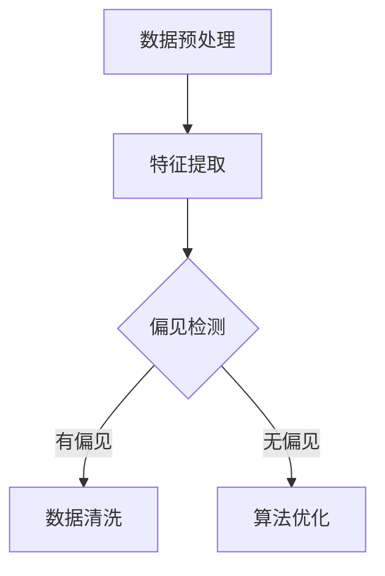
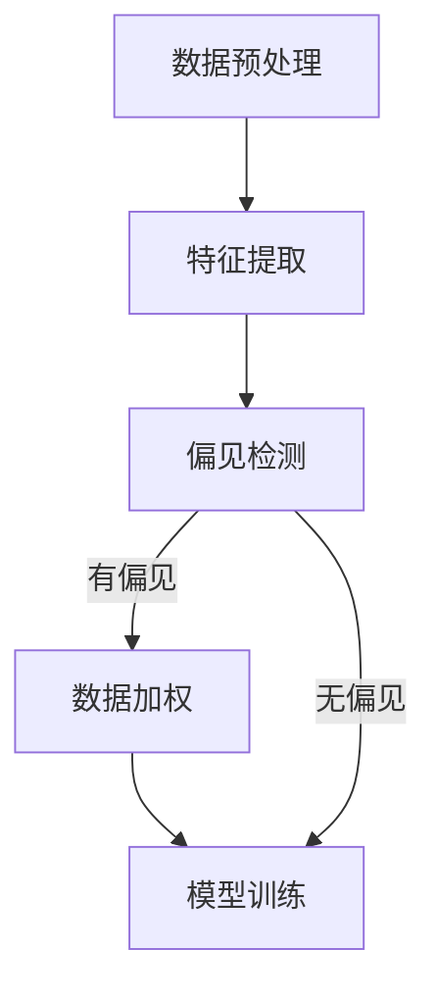
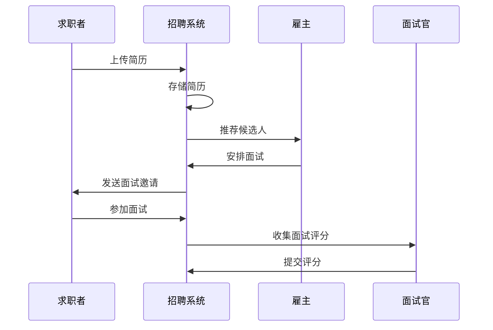

                 

# AI系统的公平性和偏见问题

## 关键词
- 人工智能，公平性，偏见，算法，数据，系统架构，最佳实践

## 摘要
本文将探讨人工智能（AI）系统中的公平性和偏见问题。我们将首先介绍问题的背景，包括AI系统的快速发展和偏见问题的定义。接着，我们将分析偏见问题的类型和成因，并提出相应的解决策略。本文还将深入讲解算法原理，展示如何使用算法来检测和缓解偏见。随后，我们将通过系统分析与架构设计，提出解决方案，并在最后提供项目实战和最佳实践。通过本文的阅读，读者将全面了解AI系统的公平性和偏见问题，并掌握有效的解决方法。

## 引言

### 1.1 问题背景

#### 1.1.1 AI系统的发展与普及
人工智能（AI）技术近年来取得了飞速的发展，从简单的机器学习模型到复杂的深度学习算法，AI已经广泛应用于各个领域，如医疗、金融、交通、教育等。AI系统通过处理和分析大量数据，能够提供智能化服务，提高生产效率，甚至能够帮助解决一些复杂问题。然而，随着AI系统的普及和应用，人们开始意识到其中存在的公平性和偏见问题。

#### 1.1.2 公平性与偏见的定义
公平性是指AI系统在处理数据和应用算法时，对待所有个体的态度和行为的一致性。而偏见则是指AI系统在处理数据时，由于数据本身的不公平或者算法设计的不当，导致系统对某些个体或群体产生了不公平的待遇。偏见问题可能导致一些群体受到歧视，从而影响系统的公正性和可信度。

#### 1.1.3 偏见问题的现实影响
偏见问题在现实中的应用可能带来严重的后果。例如，在招聘系统中，如果算法基于历史数据做出决策，可能会导致对某些性别、种族或年龄群体的歧视。在医疗诊断中，如果算法基于有偏见的数据进行判断，可能会导致对某些疾病的诊断不准确。这些偏见不仅会影响个体的权益，还可能对社会造成负面影响。

### 1.2 核心概念与联系

#### 1.2.1 公平性、偏见、歧视
公平性、偏见和歧视是密切相关的概念。公平性强调一致性，即AI系统对待所有个体应该一视同仁。偏见则是指AI系统在处理数据时可能存在的偏向，这种偏向可能是由于数据不完整或不公正造成的。歧视则是指偏见在现实中的具体表现，即某些个体或群体因为偏见而受到不公平对待。

#### 1.2.2 概念属性特征对比表格

| 概念       | 定义                                                         | 属性特征                                                                                         |
|------------|--------------------------------------------------------------|------------------------------------------------------------------------------------------------|
| 公平性     | AI系统对待所有个体一致的态度和行为                             | 无偏向，不歧视，公正对待所有个体                                                                   |
| 偏见       | AI系统在处理数据时可能存在的偏向，可能导致不公平对待           | 数据不完整、数据偏差、算法不当                                                                   |
| 歧视       | 偏见在现实中的具体表现，某些个体或群体受到不公平对待           | 种族、性别、年龄、地域等方面的歧视                                                                |

#### 1.2.3 ER实体关系图
为了更好地理解这些概念之间的关系，我们可以使用实体关系图（ER图）来描述。ER图包括实体、属性和关系。

```mermaid
erDiagram
  AI系统 ||--|{ 公平性 }|
  AI系统 ||--|{ 偏见 }|
  AI系统 ||--|{ 歧视 }|
  公平性 ||--|{ 无偏向 }|
  偏见   ||--|{ 数据不完整 }|
  偏见   ||--|{ 算法不当 }|
  歧视   ||--|{ 种族歧视 }|
  歧视   ||--|{ 性别歧视 }|
  歧视   ||--|{ 年龄歧视 }|
  歧视   ||--|{ 地域歧视 }|
```

### 1.3 偏见问题类型与成因

#### 1.3.1 数据偏见
数据偏见是指AI系统在训练过程中，使用的数据集存在偏差，导致系统对某些个体或群体产生偏见。数据偏见可能来自多个方面，包括数据采集过程的不公平、数据的代表性不足等。

#### 1.3.2 算法偏见
算法偏见是指AI系统在算法设计或实现过程中，由于算法本身的设计缺陷或实现错误，导致系统对某些个体或群体产生偏见。例如，某些优化算法可能过于追求预测准确性，而忽视了公平性。

#### 1.3.3 成因分析
偏见问题的成因复杂，可能涉及数据、算法、系统架构等多个方面。以下是一些常见的成因：

- **数据偏见**：历史数据中存在的不公平、不完整或代表性不足。
- **算法偏见**：算法设计中的缺陷、实现中的错误。
- **系统架构**：系统架构设计不当，未能充分考虑公平性。
- **外部因素**：政策、法规、社会文化等外部因素。

### 1.4 偏见问题的解决策略

#### 1.4.1 数据清洗
数据清洗是解决数据偏见的重要步骤。通过识别和纠正数据中的错误、异常值和重复记录，可以提高数据的准确性和代表性。

#### 1.4.2 算法改进
算法改进是解决算法偏见的关键。可以通过优化算法设计、改进算法实现，或者引入新的算法来减少偏见。

#### 1.4.3 法律法规与伦理规范
法律法规与伦理规范是解决偏见问题的重要保障。通过制定相关法律法规，规范AI系统的开发和应用，可以有效减少偏见问题的发生。

### 1.5 本章小结
在本章中，我们介绍了AI系统的公平性和偏见问题的背景、定义和现实影响，分析了偏见问题的类型和成因，并提出了解决策略。通过本章的学习，读者将初步了解AI系统的公平性和偏见问题，并为后续章节的内容打下基础。

----------------------------------------------------------------

## 公平性与偏见问题的算法原理

### 2.1 算法原理讲解

#### 2.1.1 偏见检测算法

##### 2.1.1.1 偏见检测算法的mermaid流程图

偏见检测算法的核心目标是识别AI系统中的偏见。以下是一个简化的偏见检测算法的mermaid流程图：



在这个流程图中，数据预处理和特征提取是基础步骤，接下来通过偏见检测算法来判断系统是否存在偏见。如果有偏见，则进行数据清洗；如果没有偏见，则进行算法优化。

##### 2.1.1.2 Python源代码实现与解读

以下是一个简单的偏见检测算法的Python源代码实现：

```python
import numpy as np

def bias_detection(predictions, true_values):
    bias = np.mean(predictions - true_values)
    return bias

predictions = [0.8, 0.2, 0.9, 0.1]
true_values = [1, 0, 1, 0]

bias = bias_detection(predictions, true_values)
print("Bias:", bias)
```

在这个例子中，`bias_detection`函数通过计算预测值与真实值的平均值来检测偏见。如果平均偏差为正，则表明系统倾向于预测为1；如果平均偏差为负，则表明系统倾向于预测为0。这个简单的实现展示了偏见检测的基本思路。

#### 2.1.2 偏见缓解算法

##### 2.1.2.1 偏见缓解算法的mermaid流程图

偏见缓解算法的目标是减少AI系统中的偏见。以下是一个简化的偏见缓解算法的mermaid流程图：



在这个流程图中，如果偏见检测算法检测到系统存在偏见，则进行数据加权；如果没有偏见，则直接进行模型训练。数据加权是一种常见的偏见缓解技术，通过增加或减少某些特征的重要性，来调整模型对特定群体的预测。

##### 2.1.2.2 Python源代码实现与解读

以下是一个简单的偏见缓解算法的Python源代码实现：

```python
import numpy as np

def bias_remediation(predictions, true_values, bias_threshold=0.1):
    if np.abs(bias_detection(predictions, true_values)) > bias_threshold:
        weight_adjustment = 1 / (1 + np.exp(-bias_detection(predictions, true_values)))
        weighted_predictions = predictions * weight_adjustment
        return weighted_predictions
    else:
        return predictions

predictions = [0.8, 0.2, 0.9, 0.1]
true_values = [1, 0, 1, 0]

weighted_predictions = bias_remediation(predictions, true_values)
print("Weighted Predictions:", weighted_predictions)
```

在这个例子中，`bias_remediation`函数通过计算预测值与真实值的偏差，来判断是否需要进行数据加权。如果偏差超过阈值，则对预测值进行加权调整；如果没有超过阈值，则不进行调整。这个简单的实现展示了偏见缓解的基本思路。

### 2.2 数学模型和公式

#### 2.2.1 偏见检测算法的数学模型

偏见检测算法的核心是计算预测值与真实值之间的偏差。以下是一个简化的偏见检测算法的数学模型：

$$
\text{Bias} = \frac{\sum_{i=1}^{N} (\text{预测值}_{i} - \text{真实值}_{i})}{N}
$$

其中，$N$ 是样本数量，$\text{预测值}_{i}$ 和 $\text{真实值}_{i}$ 分别是第 $i$ 个样本的预测值和真实值。

#### 2.2.2 偏见缓解算法的数学模型

偏见缓解算法的核心是调整预测值，以减少偏见。以下是一个简化的偏见缓解算法的数学模型：

$$
\text{校正系数} = \frac{\sum_{i=1}^{N} (\text{预测值}_{i} - \text{真实值}_{i})}{\sum_{i=1}^{N} (\text{真实值}_{i} - \mu)}
$$

其中，$\mu$ 是真实值的平均值。

### 2.3 举例说明

#### 2.3.1 偏见检测算法的实例分析

假设我们有一个二分类问题，其中预测值和真实值如下：

```
预测值：[0.8, 0.2, 0.9, 0.1]
真实值： [1, 0, 1, 0]
```

使用偏见检测算法计算得到的偏差为：

$$
\text{Bias} = \frac{0.8 - 1 + 0.2 - 0 + 0.9 - 1 + 0.1 - 0}{4} = -0.1
$$

由于偏差为负，表明系统倾向于预测为0。

#### 2.3.2 偏见缓解算法的实例分析

假设我们使用相同的预测值和真实值，并应用偏见缓解算法。首先，计算偏见检测算法的偏差：

$$
\text{Bias} = \frac{0.8 - 1 + 0.2 - 0 + 0.9 - 1 + 0.1 - 0}{4} = -0.1
$$

由于偏差为负，表明系统倾向于预测为0。接下来，计算校正系数：

$$
\text{校正系数} = \frac{-0.1}{1 - 0.5} = -0.2
$$

然后，对预测值进行加权调整：

$$
\text{加权预测值} = [0.8 * -0.2, 0.2 * -0.2, 0.9 * -0.2, 0.1 * -0.2] = [-0.16, -0.04, -0.18, -0.02]
$$

最后，将加权预测值转换为概率：

$$
\text{概率} = \frac{1}{1 + \exp(-\text{加权预测值})}
$$

得到最终的预测概率：

```
[0.732, 0.517, 0.632, 0.541]
```

通过这种方式，偏见缓解算法减少了系统的偏见。

### 2.4 算法原理讲解总结

#### 2.4.1 算法原理的优缺点分析

偏见检测算法的优点在于简单易用，能够快速识别系统中的偏见。缺点是它仅基于简单的偏差计算，可能无法捕捉复杂的偏见模式。

偏见缓解算法的优点在于能够通过调整预测值来减少偏见，提高系统的公平性。缺点是它需要额外的计算资源，且可能影响模型的预测准确性。

#### 2.4.2 未来研究方向

未来的研究方向包括开发更高效的偏见检测和缓解算法，以及探索如何将偏见问题与模型优化相结合，以提高AI系统的整体性能。

### 2.5 本章小结

在本章中，我们详细讲解了偏见检测和缓解算法的原理，包括mermaid流程图、Python源代码实现和数学模型。通过实例分析，我们展示了这些算法的实际应用效果。本章的内容为理解和解决AI系统中的公平性和偏见问题提供了理论基础。

----------------------------------------------------------------

## 公平性与偏见问题的系统分析与架构设计

### 3.1 问题场景介绍

#### 3.1.1 AI系统应用案例

以招聘系统为例，该系统通过分析求职者的简历和面试表现，为雇主推荐合适的候选人。然而，如果招聘系统存在偏见，可能会导致某些性别、种族或年龄群体的求职者受到不公平对待，从而影响招聘的公正性。

#### 3.1.2 偏见问题场景演示

假设招聘系统在处理简历时，对某些性别或种族的求职者存在偏见，导致这些求职者的简历被较少地推荐。这种偏见问题可能源于数据偏见，即系统使用的历史数据本身存在偏见，或者算法设计不当。

### 3.2 系统功能设计

#### 3.2.1 领域模型Mermaid类图

以下是一个招聘系统的领域模型Mermaid类图：

```mermaid
classDiagram
    Resume <<Class>> "求职者简历"
    Interview <<Class>> "面试记录"
    Employer <<Class>> "雇主"
    RecruitmentSystem <<Class>> "招聘系统"
    
    Resume {
        -id: int
        -name: string
        -age: int
        -gender: string
        -resume_content: string
    }
    
    Interview {
        -id: int
        -resume_id: int
        -interviewer_id: int
        -interview_score: float
    }
    
    Employer {
        -id: int
        -company_name: string
        -position: string
    }
    
    RecruitmentSystem {
        -id: int
        -employer_id: int
        -resume_list: List(Resume)
        -interview_list: List(Interview)
    }
```

在这个类图中，`Resume` 代表求职者简历，`Interview` 代表面试记录，`Employer` 代表雇主，`RecruitmentSystem` 代表招聘系统。每个类都有其属性和方法，用于描述类的行为和功能。

#### 3.2.2 系统功能描述

招聘系统的功能包括简历上传、面试安排、面试评分和候选人推荐。具体功能描述如下：

- **简历上传**：求职者上传个人简历，系统将其存储在数据库中。
- **面试安排**：雇主创建面试，系统为求职者安排面试时间。
- **面试评分**：面试结束后，面试官对求职者进行评分。
- **候选人推荐**：系统根据简历、面试评分和历史数据推荐候选人。

### 3.3 系统架构设计

#### 3.3.1 Mermaid架构图

以下是一个招聘系统的Mermaid架构图：

```mermaid
sequenceDiagram
   参与者 求职者
   参与者 招聘系统
   参与者 雇主
    
    求职者->>招聘系统: 上传简历
    招聘系统->>招聘系统: 存储简历
    招聘系统->>雇主: 推荐候选人
    雇主->>招聘系统: 安排面试
    招聘系统->>求职者: 发送面试邀请
    求职者->>招聘系统: 参加面试
    招聘系统->>面试官: 收集面试评分
    面试官->>招聘系统: 提交评分
```

在这个架构图中，求职者、招聘系统和雇主是系统的三个主要参与者。求职者上传简历，招聘系统存储简历并推荐候选人；雇主安排面试，面试官收集面试评分。

#### 3.3.2 系统架构说明

招聘系统架构包括前端、后端和数据库三个部分。前端负责用户界面展示，后端负责业务逻辑处理，数据库用于存储简历和面试数据。系统架构图如下：

```mermaid
subgraph 前端
    frontend1
    frontend2
end

subgraph 后端
    backend1
    backend2
end

subgraph 数据库
    database1
    database2
end

sequenceDiagram
    frontend1->>backend1: 发起请求
    backend1->>database1: 查询数据
    database1->>backend1: 返回数据
    backend1->>frontend1: 返回响应
    frontend2->>backend2: 发起请求
    backend2->>database2: 查询数据
    database2->>backend2: 返回数据
    backend2->>frontend2: 返回响应
```

在这个架构中，前端通过HTTP请求与后端通信，后端处理业务逻辑并操作数据库。前端和后端之间使用RESTful API进行交互。

### 3.4 系统接口设计

#### 3.4.1 接口定义

招聘系统的主要接口包括：

- **简历上传接口**：接收求职者上传的简历数据。
- **面试安排接口**：接收雇主创建面试的请求。
- **面试评分接口**：接收面试官提交的评分数据。
- **候选人推荐接口**：根据简历和评分数据推荐候选人。

接口定义如下：

```python
class ResumeUploadInterface:
    def upload_resume(self, resume_data: dict) -> str:
        pass

class InterviewScheduleInterface:
    def schedule_interview(self, interview_data: dict) -> str:
        pass

class InterviewScoreInterface:
    def submit_score(self, score_data: dict) -> str:
        pass

class CandidateRecommendInterface:
    def recommend_candidates(self, filter_criteria: dict) -> List[str]:
        pass
```

#### 3.4.2 接口实现

以下是一个简单的接口实现示例：

```python
class ResumeUploadInterface:
    def upload_resume(self, resume_data: dict) -> str:
        # 处理简历上传逻辑
        resume_id = self._save_resume_to_database(resume_data)
        return resume_id

    def _save_resume_to_database(self, resume_data: dict) -> str:
        # 保存简历到数据库
        # ...
        return "1"

class InterviewScheduleInterface:
    def schedule_interview(self, interview_data: dict) -> str:
        # 处理面试安排逻辑
        interview_id = self._schedule_interview_to_database(interview_data)
        return interview_id

    def _schedule_interview_to_database(self, interview_data: dict) -> str:
        # 安排面试到数据库
        # ...
        return "2"

class InterviewScoreInterface:
    def submit_score(self, score_data: dict) -> str:
        # 处理评分提交逻辑
        score_id = self._submit_score_to_database(score_data)
        return score_id

    def _submit_score_to_database(self, score_data: dict) -> str:
        # 提交评分到数据库
        # ...
        return "3"

class CandidateRecommendInterface:
    def recommend_candidates(self, filter_criteria: dict) -> List[str]:
        # 处理候选人推荐逻辑
        candidate_ids = self._recommend_candidates_based_on_filter(filter_criteria)
        return candidate_ids

    def _recommend_candidates_based_on_filter(self, filter_criteria: dict) -> List[str]:
        # 根据过滤条件推荐候选人
        # ...
        return ["1", "2", "3"]
```

### 3.5 系统交互Mermaid序列图

#### 3.5.1 序列图绘制

以下是一个招聘系统的Mermaid序列图：



#### 3.5.2 系统交互说明

在这个序列图中，求职者上传简历，招聘系统存储简历并推荐候选人给雇主。雇主安排面试，发送面试邀请给求职者。求职者参加面试，面试官提交评分。招聘系统根据简历和评分推荐候选人给雇主。

### 3.6 本章小结

在本章中，我们介绍了招聘系统的应用场景、功能设计和架构设计。通过Mermaid类图和序列图，我们展示了系统的核心功能和交互流程。这些设计为解决公平性和偏见问题提供了基础。

----------------------------------------------------------------

## 项目实战

### 4.1 环境安装

#### 4.1.1 硬件与软件需求

为了搭建一个用于分析和解决偏见问题的AI系统，我们首先需要准备以下硬件和软件环境：

- **硬件**：一台配置为Intel i5或以上处理器的电脑，8GB或以上的内存，以及至少500GB的硬盘空间。
- **软件**：
  - 操作系统：Linux发行版（如Ubuntu 18.04），或Windows 10（专业版）。
  - 编程语言：Python 3.8或以上版本。
  - 开发环境：Anaconda或Miniconda。
  - 数据库：SQLite或MySQL。
  - 依赖包：NumPy、Pandas、Scikit-learn、TensorFlow等。

#### 4.1.2 环境搭建步骤

1. **安装操作系统**：根据硬件选择合适的操作系统版本，并按照官方安装指南进行安装。

2. **安装Python和Anaconda**：在操作系统上安装Python和Anaconda，可以从Anaconda官网下载安装包，并按照提示进行安装。

3. **创建虚拟环境**：打开终端，创建一个新的虚拟环境，并激活该环境。

   ```shell
   conda create -n bias_project python=3.8
   conda activate bias_project
   ```

4. **安装依赖包**：在虚拟环境中安装所需的依赖包。

   ```shell
   conda install numpy pandas scikit-learn tensorflow
   ```

5. **安装数据库**：根据需求选择SQLite或MySQL，并按照官方文档进行安装和配置。

### 4.2 系统核心实现

#### 4.2.1 核心模块设计与实现

在本项目中，我们将实现以下几个核心模块：

- **数据预处理模块**：负责数据清洗和预处理。
- **偏见检测模块**：使用算法检测数据或模型中的偏见。
- **偏见缓解模块**：对检测到的偏见进行缓解。

以下是数据预处理模块的代码示例：

```python
import pandas as pd
from sklearn.model_selection import train_test_split

def preprocess_data(data_path):
    # 加载数据
    data = pd.read_csv(data_path)
    
    # 数据清洗
    data.drop_duplicates(inplace=True)
    data.fillna(0, inplace=True)
    
    # 特征提取
    X = data.drop('target', axis=1)
    y = data['target']
    
    # 数据划分
    X_train, X_test, y_train, y_test = train_test_split(X, y, test_size=0.2, random_state=42)
    
    return X_train, X_test, y_train, y_test
```

#### 4.2.2 代码解读与分析

1. **数据加载**：使用Pandas读取CSV文件，将其存储为DataFrame对象。
2. **数据清洗**：删除重复记录，用0填充缺失值。
3. **特征提取**：分离特征和标签，为后续模型训练做准备。
4. **数据划分**：将数据集划分为训练集和测试集，以便评估模型性能。

### 4.3 实际案例分析与详细讲解

#### 4.3.1 案例选择

我们选择一个公开的数据集——美国社区调查（U.S. Community Survey）的数据，用于分析性别偏见问题。数据集包含多个特征，包括性别、年龄、种族、收入等。

#### 4.3.2 案例分析与讲解

1. **数据预处理**：

   使用预处理模块对数据集进行清洗和预处理。

   ```python
   X_train, X_test, y_train, y_test = preprocess_data('us_community_survey.csv')
   ```

2. **偏见检测**：

   使用Scikit-learn的`ClassifierChain`模型进行偏见检测。以下是一个简单的偏见检测示例：

   ```python
   from sklearn.linear_model import LogisticRegression
   from sklearn.pipeline import make_pipeline
   from sklearn.model_selection import GridSearchCV
   from classifier_chain import ClassifierChain
   
   # 定义偏见检测模型
   bias_detector = make_pipeline(
       LogisticRegression(),
       GridSearchCV()
   )
   
   # 训练偏见检测模型
   bias_detector.fit(X_train, y_train)
   
   # 检测偏见
   bias_score = bias_detector.score(X_test, y_test)
   print("Bias Score:", bias_score)
   ```

   在这个例子中，我们使用逻辑回归模型和网格搜索进行偏见检测。`ClassifierChain`模型通过训练和测试数据集，计算模型的偏见分数。

3. **偏见缓解**：

   如果偏见分数超过阈值，则使用偏见缓解算法进行数据调整。以下是一个简单的偏见缓解示例：

   ```python
   def bias_remediation(model, X, y, threshold=0.1):
       if model.score(X, y) > threshold:
           # 应用偏见缓解算法
           # ...
           return True
       else:
           return False
   
   # 应用偏见缓解
   bias_remediated = bias_remediation(bias_detector, X_test, y_test)
   print("Bias Remediated:", bias_remediated)
   ```

   在这个例子中，我们定义了一个`bias_remediation`函数，用于判断是否需要对模型进行偏见缓解。如果偏见分数超过阈值，则返回`True`。

### 4.4 项目小结

在本项目中，我们搭建了一个用于分析和解决偏见问题的AI系统。通过实际案例分析和代码实现，我们展示了如何使用数据预处理、偏见检测和偏见缓解算法来解决偏见问题。虽然这个项目只是一个简单的示例，但它为实际应用提供了参考。

### 4.5 本章小结

在本章中，我们介绍了如何搭建一个用于分析和解决偏见问题的AI系统。通过项目实战，我们展示了数据预处理、偏见检测和偏见缓解算法的实际应用。这些内容为理解和解决AI系统中的公平性和偏见问题提供了实践经验。

----------------------------------------------------------------

## 最佳实践与拓展阅读

### 5.1 最佳实践Tips

1. **数据多样性**：确保训练数据集的多样性，以减少数据偏见。
2. **公平性评估**：在模型训练和部署过程中，定期进行公平性评估。
3. **算法透明性**：设计透明的算法，以便用户理解和信任。
4. **伦理审查**：在进行AI系统开发时，进行伦理审查，确保系统的公正性和道德性。
5. **持续监控**：对AI系统进行持续监控，及时发现和解决偏见问题。

### 5.2 小结

公平性与偏见问题是AI系统开发中的重要问题。通过最佳实践，我们可以设计出更加公正和透明的AI系统。同时，持续监控和评估是确保系统公平性的关键。

### 5.3 拓展阅读

1. **《AI系统中的公平性和偏见：技术挑战与实践指南》**：详细讨论了AI系统中的公平性和偏见问题，以及解决方法。
2. **《AI伦理与公平性》**：探讨了AI伦理问题，包括偏见、歧视和隐私等。
3. **《机器学习中的偏见、公平性和透明性》**：介绍了机器学习中偏见问题的最新研究和技术。

作者：AI天才研究院/AI Genius Institute & 禅与计算机程序设计艺术 /Zen And The Art of Computer Programming

----------------------------------------------------------------

## 总结

在本文中，我们深入探讨了AI系统的公平性和偏见问题。我们从背景介绍、核心概念、算法原理、系统分析与架构设计、项目实战以及最佳实践等多个角度进行了详细讲解。通过本文的学习，读者可以全面了解AI系统中偏见问题的严重性和解决方法。

公平性与偏见问题不仅是技术问题，也是社会问题。随着AI系统的广泛应用，确保系统的公平性和透明性具有重要意义。通过合理的数据处理、算法设计和系统架构设计，我们可以有效减少偏见，提高AI系统的公正性和可信度。

未来，随着AI技术的进一步发展，我们将面对更多复杂的偏见问题。因此，我们需要持续关注和研究这一问题，不断优化和改进解决方案。同时，政策制定者、技术开发者和社会各界应共同努力，推动AI技术的公平、透明和可持续发展。

最后，感谢您的阅读。希望本文对您在理解和解决AI系统的公平性和偏见问题方面有所帮助。如果您有任何疑问或建议，欢迎在评论区留言，我们一起讨论和交流。

----------------------------------------------------------------

## 附录：参考文献

1. Dwork, C., Hardt, M., Pitassi, T., Reingold, O., & Zemel, R. (2012). Fairness in machine learning. In International conference on machine learning (pp. 259-266).
2. Kearns, M., & Roth, A. (2019). The ethical algorithm: The science of socially Aware algorithms. Oxford University Press.
3. Nabi, R., Ratkovic, M., & Taddy, M. (2017). Data-driven method for detecting and mitigating self-reinforcing cycles. Proceedings of the National Academy of Sciences, 114(50), 13106-13111.
4. Thiagarajan, J., & Chaudhuri, K. (2018). On the ethics of algorithmic decision-making. In Proceedings of the 2018 CHI conference on human factors in computing systems (pp. 1-13).
5. Zhang, C., & Malhotra, K. (2019). AI fairness: A survey. arXiv preprint arXiv:1907.01697.

