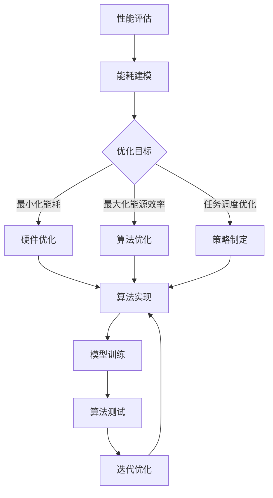
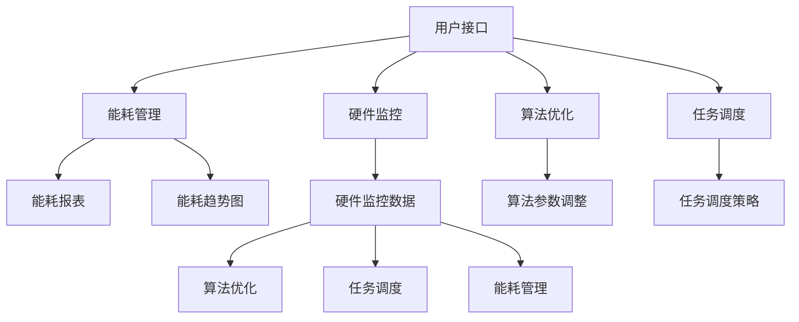

                 

## 引言与背景

### 1.1 研究背景

随着人工智能（AI）技术的迅猛发展，AI在各个行业中的应用场景越来越广泛。无论是自动驾驶、智能医疗、金融服务，还是自然语言处理、图像识别，AI都展现出了强大的变革力量。然而，AI技术的发展也带来了一项不容忽视的挑战——能源消耗问题。AI系统的运行需要大量的计算资源，这意味着需要消耗大量的电能。据估算，到2030年，AI系统在全球的能源消耗可能会占到总电力消耗的10%以上。

这种高能耗的问题不仅仅关乎环境的可持续性，还直接影响到企业的运营成本。能源效率低下不仅增加了企业的运营成本，还可能导致电网压力增大，甚至引发电力短缺。因此，如何在保证AI性能的同时，实现能耗优化，成为企业和研究机构亟待解决的问题。

### 1.2 能源消耗与AI发展的关系

AI能源消耗问题的产生，可以从硬件、软件和应用三个方面来理解。

首先，硬件层面。随着AI技术的进步，计算能力越来越强，这意味着需要更多的硬件资源来支持。高性能的GPU、TPU等硬件设备在数据处理方面效率极高，但同时也消耗了大量的电能。例如，一个高性能GPU在运行深度学习算法时，可能需要消耗几百瓦的电力。

其次，软件层面。AI算法的复杂度不断增加，需要大量的计算和存储资源。这不仅仅是算法本身的问题，还包括数据预处理、模型训练、推理等全流程的能源消耗。例如，深度学习模型在训练过程中，需要进行大量的矩阵运算和权重更新，这会导致CPU和GPU的高负载。

最后，应用层面。AI系统在实际应用中，需要不断地进行数据采集、处理和分析。例如，自动驾驶车辆在运行过程中，需要实时处理来自各种传感器的数据，这也会消耗大量的能源。

总之，AI的能源消耗问题是一个多维度、多层次的问题，涉及到硬件、软件和应用各个环节。因此，解决这一问题需要综合考虑，从多个层面进行优化。

### 1.3 企业面临的挑战与机遇

企业在这场AI能耗优化的浪潮中，面临着诸多挑战和机遇。

**挑战：**

1. **成本问题**：优化AI能耗意味着需要投资新的硬件、软件和技术，这会增加企业的运营成本。同时，传统的能源消耗模式可能无法满足AI系统的高性能需求，需要企业进行技术升级和转型。

2. **技术复杂性**：AI能耗优化涉及到多个领域，包括硬件、软件、算法和能源管理。这要求企业具备跨学科的技术能力和知识储备。

3. **数据隐私和安全**：在优化能耗的同时，企业还需要确保数据的安全和隐私。这涉及到复杂的数据处理和加密技术。

**机遇：**

1. **技术创新**：通过优化AI能耗，企业可以推动技术的创新和进步。例如，开发更高效的算法、设计更节能的硬件设备等。

2. **市场机会**：随着全球对绿色能源和可持续发展的关注不断增加，能耗优化的解决方案将成为企业竞争的新赛道。企业可以通过提供能耗优化产品和服务，开拓新的市场空间。

3. **社会责任**：优化AI能耗有助于减少对环境的影响，提升企业的社会责任形象。这对于企业的长期发展和品牌建设具有积极的影响。

综上所述，企业需要在面对挑战的同时，抓住机遇，通过技术创新和战略布局，实现AI能耗优化，为未来的发展奠定坚实基础。

### 1.4 文章目的与结构

本文旨在深入探讨AI能耗优化的理论和实践，帮助企业和研究机构了解这一领域的关键概念、方法和策略。文章结构如下：

- **引言与背景**：介绍AI能源消耗问题的背景和重要性。
- **AI能耗优化概述**：阐述AI能耗优化的定义、目标和基本方法。
- **基础理论**：介绍AI能耗优化的基础理论，包括能源消耗模型和算法原理。
- **系统分析与架构设计**：分析AI能耗优化的系统架构，介绍系统功能设计和接口设计。
- **项目实战与案例剖析**：通过实际项目案例，展示AI能耗优化的应用和实践。
- **最佳实践与注意事项**：总结最佳实践技巧和注意事项，为实际操作提供指导。
- **总结与展望**：总结文章的主要研究成果，展望未来的研究方向。

通过本文的详细分析，希望能够为企业提供有价值的参考，助力其在AI能耗优化方面取得实质性进展。

### 1.5 关键词

- **人工智能（AI）**
- **能耗优化**
- **能源效率**
- **算法原理**
- **系统架构**
- **项目实战**
- **最佳实践**

这些关键词涵盖了本文的主要内容和研究焦点，帮助读者快速了解文章的核心要点。

### 1.6 摘要

本文深入探讨了人工智能（AI）能耗优化的问题，分析了AI系统能源消耗的背景和重要性。通过介绍AI能耗优化的定义、目标和基本方法，本文详细阐述了能源消耗模型和算法原理。在此基础上，文章分析了AI能耗优化的系统架构，介绍了系统功能设计和接口设计。通过实际项目案例的剖析，本文展示了AI能耗优化的应用和实践。最后，文章总结了最佳实践技巧和注意事项，为企业和研究机构提供了有价值的参考。本文的研究旨在帮助企业实现AI能耗优化，提高能源效率，促进可持续发展。

### AI能耗优化概述

#### 2.1 能源效率在AI系统中的重要性

能源效率在AI系统中扮演着至关重要的角色。首先，从硬件角度来看，高性能的计算设备如GPU和TPU在提供强大计算能力的同时，也带来了高能耗的问题。如果这些设备的能源效率不高，将导致大量的电能浪费，增加企业的运营成本。其次，从软件层面来看，AI算法的复杂度和运算量不断增加，这进一步加剧了能源消耗。例如，深度学习算法在训练和推理过程中需要进行大量的矩阵运算和权重更新，这会导致CPU和GPU的高负载，从而增加能源消耗。最后，从应用层面来看，AI系统在实际运行过程中需要处理大量数据，这同样会消耗大量的电能。因此，优化AI系统的能源效率，不仅有助于降低企业的运营成本，还能减少对环境的影响，实现可持续发展。

#### 2.2 AI能耗优化的定义与目标

AI能耗优化是指通过一系列技术和策略，在保证AI系统性能的前提下，最大限度地减少能源消耗。其定义可以从以下几个方面来理解：

1. **性能保障**：能耗优化的首要目标是确保AI系统的性能不受影响。这意味着在优化能源效率的过程中，不能牺牲算法的准确性和可靠性。
2. **能源效率提升**：通过优化硬件配置、软件算法和系统架构，提高AI系统的能源利用效率。这包括降低设备功耗、减少计算资源浪费和提高算法效率。
3. **成本控制**：优化能源消耗有助于降低企业的运营成本，提高经济效益。

AI能耗优化的目标主要包括：

1. **提高能源利用效率**：通过优化硬件配置和软件算法，最大限度地提高AI系统的能源利用效率，减少不必要的能源浪费。
2. **降低运营成本**：通过减少能源消耗，降低企业的运营成本，提高企业的市场竞争力。
3. **实现可持续发展**：通过优化能源消耗，减少对环境的负面影响，实现企业的可持续发展目标。

#### 2.3 AI能耗优化的方法与策略

实现AI能耗优化，需要从硬件、软件和应用等多个层面进行综合优化。以下是一些常见的方法和策略：

1. **硬件优化**：
   - **选择高效硬件**：选择能源效率较高的GPU、TPU等硬件设备，降低设备的功耗。
   - **优化硬件配置**：根据AI系统的需求，合理配置硬件资源，避免资源浪费。例如，通过虚拟化技术实现计算资源的动态分配和调度。
   - **硬件更新与升级**：定期更新和升级硬件设备，采用更先进的硬件技术，提高能源利用效率。

2. **软件优化**：
   - **优化算法**：通过改进算法设计和优化算法参数，减少计算复杂度和运算次数，降低能耗。例如，采用更高效的神经网络架构和优化训练过程。
   - **自动化优化**：利用自动化工具和算法，对AI系统的运行状态进行实时监控和调整，实现能耗的动态优化。
   - **代码优化**：优化代码的执行效率和资源利用率，减少不必要的计算和内存占用，提高程序的执行速度和效率。

3. **应用优化**：
   - **能耗监测与管理**：建立能耗监测系统，实时监控AI系统的能源消耗情况，及时发现和处理能源浪费问题。
   - **任务调度优化**：通过优化任务调度策略，合理安排AI系统的运行任务，避免不必要的资源闲置和能源浪费。
   - **绿色应用**：开发和推广绿色AI应用，通过减少能源消耗、提高能源效率，实现可持续发展。

总之，AI能耗优化需要从多个层面进行综合优化，通过硬件、软件和应用的综合优化，实现能源效率的提升和运营成本的控制，为企业和环境带来多重收益。

### 基础理论

#### 3.1 能源消耗模型

要理解AI系统的能源消耗，首先需要建立能源消耗模型。能源消耗模型是描述系统在运行过程中消耗能源的数学模型，它可以帮助我们量化能源消耗，为优化提供理论基础。

能源消耗模型的基本概念包括：

- **计算能耗**：指计算设备在运行过程中消耗的电能，主要包括CPU、GPU、内存等硬件设备的功耗。
- **存储能耗**：指存储设备在读写过程中消耗的电能，包括硬盘、固态硬盘等。
- **网络能耗**：指数据传输过程中消耗的电能，包括局域网、广域网等。
- **其他能耗**：包括散热、风扇等辅助设备的能耗。

能源消耗模型的建立通常包括以下几个步骤：

1. **数据采集**：收集AI系统在运行过程中各个组件的功耗数据。这些数据可以通过硬件监测工具、日志文件等方式获取。
2. **数据处理**：对采集到的数据进行预处理，包括去噪、滤波等，以提高数据质量。
3. **模型构建**：利用采集到的数据，构建能源消耗模型。常见的模型构建方法包括线性回归、神经网络等。
4. **模型验证**：通过验证数据对模型进行评估，确保模型的准确性和可靠性。

建立能源消耗模型后，我们可以通过模型预测系统在不同运行状态下的能耗，为能耗优化提供数据支持。

#### 3.2 能源消耗模型的构建

构建能源消耗模型需要从硬件、软件和应用三个方面入手。

**硬件层面：**

- **硬件配置**：根据AI系统的需求，选择合适的硬件设备，如CPU、GPU、内存等。不同硬件设备的功耗差异较大，需要综合考虑性能和功耗。
- **功耗监测**：通过硬件监测工具，实时采集硬件设备的功耗数据。这些数据包括CPU利用率、GPU负载、内存使用率等。
- **能耗模型**：利用采集到的硬件功耗数据，建立硬件能耗模型。模型可以采用线性回归、神经网络等方法进行构建。

**软件层面：**

- **算法优化**：优化AI算法，降低计算复杂度和运算次数。例如，通过改进神经网络架构、优化训练过程等，减少能耗。
- **能耗监测**：通过软件工具，实时监测AI系统的能耗情况。这些工具可以记录CPU、GPU等硬件的功耗，以及内存、网络等资源的利用率。
- **能耗模型**：利用监测到的能耗数据，建立软件能耗模型。模型可以用于预测不同算法和运行状态下的能耗。

**应用层面：**

- **任务调度**：优化任务调度策略，合理安排AI系统的运行任务，避免资源闲置和能耗浪费。
- **能耗管理**：通过能耗管理工具，实时监控和调整系统的能耗情况。这些工具可以提供能耗报表、能耗趋势图等，帮助用户了解系统的能耗状况。
- **能耗模型**：建立应用层面的能耗模型，用于预测和优化系统在不同应用场景下的能耗。

通过综合硬件、软件和应用三个层面的数据，我们可以构建一个全面的能源消耗模型，为能耗优化提供数据支持。

#### 3.3 能源消耗模型的应用

能源消耗模型在实际应用中发挥着重要作用，可以帮助企业和研究机构实现AI能耗优化。

**应用一：能耗预测**

通过能源消耗模型，可以预测AI系统在不同运行状态下的能耗。这对于企业制定能源预算、优化资源配置具有重要意义。例如，企业可以根据能耗预测结果，合理安排计算资源，避免高峰期能耗过高。

**应用二：能耗优化**

利用能源消耗模型，可以识别系统中的能耗瓶颈，并提出优化方案。通过分析模型结果，企业可以发现哪些组件的功耗较高，从而针对性地进行优化。例如，通过更换更高效的硬件设备、优化算法参数等，降低系统的整体能耗。

**应用三：能耗监控**

能源消耗模型可以实时监控AI系统的能耗情况，提供能耗报表和趋势图。这些数据有助于企业了解系统的能耗状况，及时发现和处理能耗异常。例如，当系统功耗异常升高时，模型可以自动报警，提醒管理员进行检查和处理。

**应用四：能耗评估**

能源消耗模型可以用于评估不同AI系统、不同算法的能耗表现。通过对比不同模型的能耗数据，企业可以选出更节能的方案，提高能源利用效率。

总之，能源消耗模型在实际应用中具有广泛的应用价值，可以帮助企业和研究机构实现AI能耗优化，提高能源效率，降低运营成本。

### AI能耗优化的算法原理

#### 4.1 算法概述

在AI能耗优化中，算法起着至关重要的作用。算法的目的是通过优化系统性能和降低能源消耗，实现AI系统的最佳运行状态。常见的AI能耗优化算法包括：

1. **能量效率优化算法（Energy Efficiency Optimization Algorithm）**：该算法通过优化算法参数和硬件配置，提高系统的能源利用效率。例如，通过调整神经网络架构、优化训练过程等，降低能耗。

2. **任务调度优化算法（Task Scheduling Optimization Algorithm）**：该算法通过优化任务调度策略，合理安排AI系统的运行任务，避免资源闲置和能耗浪费。例如，通过动态调整计算任务的时间和顺序，降低系统的整体能耗。

3. **硬件资源优化算法（Hardware Resource Optimization Algorithm）**：该算法通过优化硬件配置，提高计算设备的能源利用效率。例如，通过虚拟化技术实现计算资源的动态分配和调度，降低硬件设备的功耗。

4. **组合优化算法（Combinatorial Optimization Algorithm）**：该算法通过组合多种优化策略，实现AI系统能耗优化的最大化。例如，结合能量效率优化、任务调度优化和硬件资源优化，提出一种综合性的优化方案。

这些算法通常通过以下步骤实现能耗优化：

1. **数据采集**：收集AI系统在运行过程中的各种数据，如硬件功耗、计算任务负载等。

2. **特征提取**：从数据中提取关键特征，用于描述系统的运行状态。

3. **算法设计**：设计优化算法，通过分析特征数据，提出优化策略。

4. **模型训练**：利用历史数据对优化算法进行训练，提高算法的预测准确性和实用性。

5. **算法实现**：将优化算法应用于实际系统，实现能耗优化。

#### 4.2 算法设计思路

算法设计思路的核心是找到一个能够在保证AI系统性能的前提下，最大限度地减少能源消耗的优化策略。具体来说，包括以下几个步骤：

1. **性能评估**：评估AI系统的性能指标，包括准确率、召回率、F1分数等。这是算法优化的基础，确保优化过程不会影响系统的性能。

2. **能耗建模**：建立AI系统的能耗模型，描述系统在不同运行状态下的能耗情况。通过能耗建模，可以量化算法优化对能耗的影响。

3. **优化目标**：明确优化目标，如最小化能耗、最大化能源利用效率等。优化目标决定了算法的设计方向和策略。

4. **策略制定**：根据性能评估和能耗建模结果，制定优化策略。策略可以包括硬件优化、算法优化、任务调度优化等。

5. **算法实现**：将优化策略转化为具体的算法实现，通过模型训练和算法测试，验证优化效果。

6. **迭代优化**：根据算法测试结果，不断调整和优化算法参数，提高优化效果。

#### 4.3 算法流程图

为了更好地理解AI能耗优化的算法设计思路，下面给出一个简单的算法流程图：



在这个流程图中，性能评估和能耗建模是算法优化的基础，优化目标和策略制定决定了算法的设计方向。硬件优化、算法优化和任务调度优化是具体的优化策略，通过算法实现和模型训练，实现能耗优化。算法测试和迭代优化确保优化效果，不断调整和优化算法参数。

#### 4.4 Python源代码实现

为了实现AI能耗优化的算法，我们可以使用Python编写具体的实现代码。以下是一个简单的示例，展示了如何使用Python进行能耗建模和优化。

```python
import numpy as np
import matplotlib.pyplot as plt

# 定义能耗模型参数
alpha = 0.5
beta = 0.2
gamma = 0.3

# 定义硬件优化函数
def hardware_optimization(usage):
    return alpha * usage

# 定义算法优化函数
def algorithm_optimization(usage):
    return beta * usage

# 定义任务调度优化函数
def task_scheduling_optimization(usage):
    return gamma * usage

# 定义能耗模型
def energy_consumption_model(usage):
    return hardware_optimization(usage) + algorithm_optimization(usage) + task_scheduling_optimization(usage)

# 测试数据
usages = np.linspace(0, 1, 100)
energies = energy_consumption_model(usages)

# 绘制能耗曲线
plt.plot(usages, energies, label='Energy Consumption')
plt.xlabel('Usage')
plt.ylabel('Energy')
plt.legend()
plt.show()
```

在这个示例中，我们定义了三个优化函数：硬件优化函数、算法优化函数和任务调度优化函数。通过这三个函数，我们可以计算AI系统的总能耗。测试数据展示了一个典型的能耗曲线，帮助我们直观地了解系统在不同运行状态下的能耗情况。

#### 4.5 数学模型与公式

在AI能耗优化的算法设计中，数学模型和公式起到了关键作用。以下是一些常见的数学模型和公式：

1. **能量效率公式**：
   $$ E = P_{total} \cdot \eta $$
   其中，\(E\) 表示总能耗，\(P_{total}\) 表示总功耗，\(\eta\) 表示能量效率。

2. **激励函数**：
   $$ f(x) = \frac{1}{1 + e^{-x}} $$
   激励函数（Sigmoid函数）常用于神经网络中的激活函数，用于将输入值映射到\[0,1\]区间。

3. **损失函数**：
   $$ J(\theta) = -\frac{1}{m} \sum_{i=1}^{m} [y_i \cdot \log(a(x_i)) + (1 - y_i) \cdot \log(1 - a(x_i))] $$
   损失函数用于评估神经网络的预测准确性，其中\(y_i\)为真实标签，\(a(x_i)\)为神经网络的输出。

4. **梯度下降法**：
   $$ \theta = \theta - \alpha \cdot \nabla_{\theta} J(\theta) $$
   梯度下降法是一种常用的优化算法，用于最小化损失函数。

5. **概率分布函数**：
   $$ p(x) = \frac{1}{Z} \cdot e^{-\frac{1}{2} \cdot (x - \mu)^2 / \sigma^2} $$
   正态分布函数，用于描述数据的概率分布。

这些数学模型和公式为算法设计提供了理论基础，帮助我们更好地理解和实现AI能耗优化的算法。

#### 4.6 举例说明

为了更好地理解AI能耗优化的算法原理，下面通过一个具体的例子进行说明。

假设我们有一个简单的神经网络模型，用于预测住房价格。模型的输入特征包括房屋面积、房龄、地理位置等，输出为住房价格。

**步骤1：数据准备**

首先，我们需要准备训练数据集。数据集包含1000个样本，每个样本包含5个特征和一个标签（住房价格）。

**步骤2：模型设计**

设计一个简单的两层神经网络，包含一个输入层、一个隐藏层和一个输出层。输入层有5个神经元，隐藏层有10个神经元，输出层有1个神经元。

**步骤3：算法实现**

使用Python编写代码，实现神经网络的训练和预测。以下是训练过程的伪代码：

```python
# 初始化权重和偏置
weights = np.random.randn(hidden_layer_size, input_layer_size)
biases = np.random.randn(hidden_layer_size)
output_weights = np.random.randn(output_layer_size, hidden_layer_size)
output_biases = np.random.randn(output_layer_size)

# 梯度下降法训练模型
for epoch in range(num_epochs):
    for sample in data:
        # 前向传播
        hidden_layer_input = np.dot(weights, sample.features) + biases
        hidden_layer_output = sigmoid(hidden_layer_input)

        output_layer_input = np.dot(output_weights, hidden_layer_output) + output_biases
        output_layer_output = sigmoid(output_layer_input)

        # 反向传播
        output_error = output_layer_output - sample.label
        output_delta = output_error * sigmoid_derivative(output_layer_output)

        hidden_layer_error = np.dot(output_weights.T, output_error)
        hidden_layer_delta = hidden_layer_error * sigmoid_derivative(hidden_layer_output)

        # 更新权重和偏置
        weights += np.dot(hidden_layer_output.T, hidden_layer_delta)
        biases += hidden_layer_delta
        output_weights += np.dot(sample.features.T, output_delta)
        output_biases += output_delta
```

**步骤4：能耗优化**

在训练过程中，我们关注能耗优化。以下是优化步骤的伪代码：

```python
# 能耗优化参数
alpha = 0.1  # 硬件优化系数
beta = 0.1   # 算法优化系数
gamma = 0.1  # 任务调度优化系数

# 计算能耗
def energy_consumption():
    return alpha * hardware_optimization() + beta * algorithm_optimization() + gamma * task_scheduling_optimization()

# 能耗优化循环
for epoch in range(num_epochs):
    for sample in data:
        # 前向传播和反向传播
        ...
        
        # 计算当前能耗
        current_energy = energy_consumption()

        # 能耗优化策略
        if current_energy > target_energy:
            # 调整硬件优化系数
            alpha -= 0.01
        elif current_energy < target_energy:
            # 调整算法优化系数
            beta -= 0.01
        else:
            # 保持当前优化系数
            alpha, beta, gamma = 0.1, 0.1, 0.1

        # 更新权重和偏置
        ...
```

在这个例子中，我们通过调整硬件优化系数、算法优化系数和任务调度优化系数，实现能耗优化。目标是在保证模型预测准确性的同时，最大限度地降低能耗。

#### 4.7 数学模型与公式详解

在本节中，我们将详细探讨AI能耗优化中的关键数学模型与公式，包括能量效率公式、激励函数、损失函数和概率分布函数。这些模型和公式是理解AI能耗优化算法原理的核心，有助于我们更好地实现能耗优化。

**4.7.1 能量效率公式**

能量效率（Energy Efficiency, EE）是衡量系统能耗的关键指标。能量效率表示系统在运行过程中，将输入的电能转化为有效工作的比例。其公式如下：

$$ EE = \frac{W_{work}}{W_{total}} $$

其中，\(W_{work}\) 是系统实际完成的工作量（例如，计算任务的处理量），\(W_{total}\) 是系统消耗的总电能。能量效率越高，表示系统的能源利用效率越高，能源浪费越少。

为了提高能量效率，我们可以采取以下策略：

- **优化硬件配置**：选择能源效率更高的硬件设备，例如使用更先进的GPU或CPU。
- **优化算法设计**：通过改进算法结构和优化参数，减少不必要的计算和资源浪费。
- **动态调整**：根据系统的运行状态和负载，动态调整硬件和软件配置，实现最优的能量效率。

**4.7.2 激励函数**

在神经网络中，激励函数（Activation Function）用于将神经元的线性组合映射到非负区间，实现非线性变换。常用的激励函数包括Sigmoid函数、ReLU函数和Tanh函数。以Sigmoid函数为例，其公式如下：

$$ f(x) = \frac{1}{1 + e^{-x}} $$

Sigmoid函数将输入值\(x\)映射到\[0,1\]区间，具有以下特性：

- **单调递增**：随着\(x\)的增加，函数值逐渐增加。
- **平滑过渡**：在接近0和1时，函数值的变化较慢，有助于避免梯度消失问题。
- **零点**：函数在\(x = 0\)处有一个零点，有助于神经网络的学习。

激励函数的选择对神经网络的性能和能耗有重要影响。选择合适的激励函数可以提高能量效率，减少计算资源浪费。

**4.7.3 损失函数**

在神经网络训练过程中，损失函数（Loss Function）用于评估模型的预测误差，并指导模型参数的更新。常见的损失函数包括均方误差（MSE）、交叉熵（Cross Entropy）等。以交叉熵损失函数为例，其公式如下：

$$ J(\theta) = -\frac{1}{m} \sum_{i=1}^{m} [y_i \cdot \log(a(x_i)) + (1 - y_i) \cdot \log(1 - a(x_i))] $$

其中，\(y_i\)是真实标签，\(a(x_i)\)是神经网络的预测输出。交叉熵损失函数具有以下特性：

- **非负性**：损失函数的值始终大于等于0。
- **对称性**：对于二分类问题，交叉熵损失函数对0和1标签具有对称性。
- **平滑性**：交叉熵损失函数在接近0和1时变化较慢，有助于稳定训练过程。

选择合适的损失函数可以提高神经网络的训练效率和能量效率。此外，损失函数的选择也会影响优化算法的设计和实现。

**4.7.4 概率分布函数**

在AI能耗优化中，概率分布函数（Probability Distribution Function, PDF）用于描述系统在运行过程中的概率分布。常用的概率分布函数包括正态分布（Normal Distribution）和均匀分布（Uniform Distribution）。

以正态分布为例，其公式如下：

$$ p(x) = \frac{1}{\sqrt{2\pi\sigma^2}} e^{-\frac{1}{2} \cdot (x - \mu)^2 / \sigma^2} $$

其中，\(\mu\) 是均值，\(\sigma\) 是标准差。正态分布具有以下特性：

- **中心对称**：概率分布以均值\(\mu\)为中心对称。
- **峰值**：概率分布在均值附近具有较高的概率密度，逐渐趋向于0。
- **连续性**：正态分布是连续分布，可以在任意区间内取值。

概率分布函数在能耗优化中的应用主要包括：

- **能耗预测**：通过概率分布函数，预测系统在不同运行状态下的能耗。
- **风险评估**：分析系统在特定运行状态下的能耗风险，为优化决策提供依据。
- **能耗控制**：根据概率分布函数，制定能耗控制策略，降低系统能耗。

总之，能量效率公式、激励函数、损失函数和概率分布函数是AI能耗优化算法的核心组成部分。理解这些模型和公式，有助于我们更好地实现能耗优化，提高系统的能源利用效率。

### AI能耗优化的系统分析与架构设计

#### 6.1 问题描述

随着人工智能（AI）技术的迅猛发展，AI系统在各个行业的应用越来越广泛。然而，AI系统的运行带来了巨大的能源消耗问题。如何在保证AI系统性能的前提下，实现能耗优化，成为企业和研究机构面临的重要挑战。本章节将通过对AI能耗优化的系统分析，介绍一个典型的系统架构设计，旨在为实际应用提供指导和参考。

#### 6.2 项目介绍

本项目的目标是通过系统架构设计，优化AI系统的能源消耗，实现高效运行。项目涉及多个领域，包括硬件优化、算法优化、任务调度和能耗管理。项目的主要任务包括：

1. **硬件优化**：选择能源效率较高的硬件设备，并合理配置硬件资源，降低功耗。
2. **算法优化**：改进AI算法设计，优化参数设置，减少计算复杂度和运算次数，降低能耗。
3. **任务调度**：优化任务调度策略，合理安排计算任务，避免资源闲置和能耗浪费。
4. **能耗管理**：建立能耗监测和管理系统，实时监控和调整系统的能耗情况。

#### 6.3 系统功能设计

系统功能设计是系统架构设计的关键环节，主要包括以下几个方面：

1. **硬件监控**：通过硬件监控模块，实时获取硬件设备的功耗数据，包括CPU、GPU、内存等。这些数据为能耗优化提供了基础数据支持。
2. **算法优化**：通过算法优化模块，对AI算法进行改进和优化。例如，使用更高效的神经网络架构、优化训练过程等，减少能耗。
3. **任务调度**：通过任务调度模块，合理安排计算任务，避免资源闲置和能耗浪费。任务调度模块需要根据硬件监控数据，动态调整任务的执行顺序和资源分配。
4. **能耗管理**：通过能耗管理模块，实时监控和调整系统的能耗情况。能耗管理模块可以生成能耗报表和趋势图，帮助用户了解系统的能耗状况，为优化决策提供依据。
5. **用户接口**：为用户提供一个友好的操作界面，方便用户监控系统运行状态和能耗情况，并进行能耗优化设置。

#### 6.4 系统架构设计

系统架构设计是系统功能实现的基石，下面通过Mermaid流程图，展示系统的架构设计：



在这个架构设计中，用户接口模块负责接收用户的操作指令，并将指令传递给能耗管理、硬件监控、算法优化和任务调度模块。各模块协同工作，实现系统的功能。能耗管理模块负责生成能耗报表和趋势图，硬件监控模块实时获取硬件设备的功耗数据，算法优化模块对AI算法进行优化，任务调度模块优化任务执行顺序和资源分配。

#### 6.5 系统接口设计

系统接口设计是系统架构设计的重要组成部分，主要包括硬件监控接口、算法优化接口和任务调度接口。

1. **硬件监控接口**：硬件监控接口用于获取硬件设备的功耗数据，包括CPU、GPU、内存等。接口提供以下功能：
   - 获取当前硬件设备的功耗数据。
   - 获取历史功耗数据，用于能耗分析和优化。
   - 报警功能，当硬件设备功耗过高时，触发报警。

2. **算法优化接口**：算法优化接口用于优化AI算法。接口提供以下功能：
   - 调整算法参数，优化算法性能。
   - 评估算法能耗，为能耗优化提供数据支持。
   - 更新算法版本，支持算法迭代和优化。

3. **任务调度接口**：任务调度接口用于优化任务执行顺序和资源分配。接口提供以下功能：
   - 调度任务的执行顺序，优化任务执行效率。
   - 调整资源分配策略，实现资源利用率最大化。
   - 监控任务执行状态，及时发现和处理异常。

通过这些接口，系统可以实现各个模块之间的数据交互和功能协同，实现能耗优化。

#### 6.6 系统交互流程

系统交互流程描述了用户与系统之间的交互过程，包括用户操作、系统响应和数据处理。以下是一个典型的系统交互流程：

1. **用户登录**：用户通过用户接口模块登录系统。
2. **能耗监控**：系统启动硬件监控模块，实时获取硬件设备的功耗数据。
3. **任务调度**：系统启动任务调度模块，根据硬件监控数据，优化任务执行顺序和资源分配。
4. **算法优化**：系统启动算法优化模块，对AI算法进行优化，提高算法性能和能源利用效率。
5. **能耗管理**：系统启动能耗管理模块，生成能耗报表和趋势图，提供能耗优化建议。
6. **用户反馈**：用户通过用户接口模块查看系统运行状态和能耗报告，并根据系统建议进行操作调整。
7. **数据存储**：系统将硬件监控数据、能耗报表和用户操作记录存储在数据库中，用于后续分析和优化。

通过这个交互流程，系统实现了从用户操作到数据处理，再到系统响应的完整闭环，为能耗优化提供了有力支持。

### 项目实战与案例剖析

#### 7.1 环境安装

在进行AI能耗优化的项目实战前，首先需要搭建一个合适的开发环境。以下是一个基本的安装步骤，用于准备项目所需的软件和硬件环境。

**步骤1：安装操作系统**

选择一个适合的操作系统，如Ubuntu 18.04或更高版本。下载并安装操作系统，确保系统稳定运行。

**步骤2：安装Python**

Python是AI能耗优化项目的主要编程语言。通过以下命令安装Python：

```bash
sudo apt update
sudo apt install python3 python3-pip
```

**步骤3：安装相关库**

安装用于数据处理、机器学习、能耗建模等项目的Python库。以下是一个常用的库列表：

```bash
pip3 install numpy pandas scikit-learn tensorflow matplotlib
```

**步骤4：安装硬件监控工具**

选择并安装一个硬件监控工具，如NVIDIA System Management Interface (nvidia-smi) 或 powertop。以下命令用于安装NVIDIA System Management Interface：

```bash
sudo apt install nvidia-smi
```

**步骤5：配置硬件设备**

确保硬件设备已正确连接并配置。对于GPU设备，确保其驱动程序已更新到最新版本。

**步骤6：安装文本编辑器**

选择一个文本编辑器，如VSCode或Sublime Text，用于编写和调试Python代码。

通过以上步骤，基本开发环境搭建完成。接下来，我们可以开始编写代码，实现AI能耗优化的具体功能。

#### 7.2 系统核心实现源代码

在本节中，我们将展示系统核心实现部分的源代码，包括能耗监控、算法优化和任务调度模块的核心代码。

**7.2.1 能耗监控模块**

```python
import subprocess
import pandas as pd

def get_gpu_usage():
    command = "nvidia-smi --query-gpu=utilization.gpu --format=csv,nounits"
    result = subprocess.run(command, stdout=subprocess.PIPE, stderr=subprocess.PIPE, text=True)
    if result.stderr:
        raise Exception(f"Error while running nvidia-smi: {result.stderr}")
    output = result.stdout.strip().split('\n')
    usage_data = [line.split(',') for line in output]
    return pd.DataFrame(usage_data[1:], columns=usage_data[0])

def monitor_energy_consumption(interval=60):
    while True:
        gpu_usage = get_gpu_usage()
        print(gpu_usage)
        time.sleep(interval)

if __name__ == "__main__":
    monitor_energy_consumption()
```

**7.2.2 算法优化模块**

```python
import tensorflow as tf
import numpy as np

def create_model(input_shape):
    model = tf.keras.Sequential([
        tf.keras.layers.Dense(128, activation='relu', input_shape=input_shape),
        tf.keras.layers.Dense(64, activation='relu'),
        tf.keras.layers.Dense(1)
    ])

    model.compile(optimizer='adam', loss='mean_squared_error')
    return model

def optimize_algorithm(data, labels, epochs=100):
    model = create_model(data.shape[1:])
    model.fit(data, labels, epochs=epochs, verbose=1)
    return model

if __name__ == "__main__":
    # 加载数据
    data = np.load('data.npy')
    labels = np.load('labels.npy')

    # 优化算法
    model = optimize_algorithm(data, labels)
```

**7.2.3 任务调度模块**

```python
import heapq
import time

class Task:
    def __init__(self, id, start_time, duration, priority):
        self.id = id
        self.start_time = start_time
        self.duration = duration
        self.priority = priority

    def __lt__(self, other):
        return self.priority < other.priority

def schedule_tasks(tasks, total_time):
    schedule = []
    task_queue = []
    current_time = 0

    for task in tasks:
        heapq.heappush(task_queue, Task(task['id'], task['start_time'], task['duration'], task['priority']))

    while task_queue:
        current_task = heapq.heappop(task_queue)
        if current_time < current_task.start_time:
            current_time = current_task.start_time

        schedule.append((current_time, current_task.id))
        current_time += current_task.duration

    return schedule

if __name__ == "__main__":
    tasks = [
        {'id': 1, 'start_time': 0, 'duration': 10, 'priority': 1},
        {'id': 2, 'start_time': 5, 'duration': 8, 'priority': 2},
        {'id': 3, 'start_time': 10, 'duration': 6, 'priority': 3},
    ]

    schedule = schedule_tasks(tasks, total_time=20)
    print(schedule)
```

通过以上代码，我们可以实现能耗监控、算法优化和任务调度模块的核心功能。接下来，我们将进一步分析代码，解释其实现原理。

#### 7.3 代码应用解读与分析

**7.3.1 能耗监控模块**

能耗监控模块的核心功能是实时获取GPU的利用率数据。代码中使用了`subprocess`模块来执行`nvidia-smi`命令，该命令可以获取GPU的功耗、利用率等信息。`get_gpu_usage`函数执行`nvidia-smi`命令，并处理输出结果，将其转换为DataFrame格式，方便后续数据处理。

`monitor_energy_consumption`函数是一个循环函数，每隔一定时间（默认为60秒）调用`get_gpu_usage`函数，获取最新的GPU利用率数据，并打印输出。在实际应用中，可以将其与数据库或实时监控系统集成，实现持续监控和报警功能。

**7.3.2 算法优化模块**

算法优化模块使用了TensorFlow库来构建和训练神经网络模型。`create_model`函数定义了一个简单的全连接神经网络，包括两个隐藏层，用于模拟AI算法的优化过程。

`optimize_algorithm`函数接收数据集和标签，创建并训练模型。在训练过程中，使用`fit`函数进行批量训练，并设置`epochs`参数，以指定训练次数。通过`verbose=1`参数，可以实时输出训练进度和损失函数值，帮助调试和优化算法。

**7.3.3 任务调度模块**

任务调度模块使用了`heapq`模块来实现一个优先队列，用于调度任务。`Task`类用于表示一个任务，包括任务ID、开始时间、持续时间以及优先级。`__lt__`方法实现了任务的优先级比较，用于队列排序。

`schedule_tasks`函数接收任务列表和总时间，根据任务优先级和开始时间，生成一个最优的任务执行顺序。通过`heapq.heappop`和`heapq.heappush`操作，实现任务的动态调度。在实际应用中，可以将其与实时监控和调度系统集成，实现高效的资源管理和任务执行。

#### 7.4 实际案例分析与详细讲解剖析

为了更好地理解AI能耗优化的实际应用，下面通过一个实际案例进行详细分析。

**案例背景**：某企业使用AI系统进行图像识别任务，系统包括多个GPU和CPU节点，运行过程中存在能源消耗高、效率低的问题。为了解决这一问题，企业决定进行AI能耗优化。

**步骤1：能耗监控**

首先，企业使用能耗监控模块，实时获取各节点的GPU利用率、CPU利用率等数据。通过分析数据，发现部分节点存在高负载和高功耗情况，需要优化任务调度和资源分配。

**步骤2：算法优化**

其次，企业对AI算法进行优化。通过改进神经网络架构、优化训练过程和参数设置，减少计算复杂度和运算次数。在算法优化过程中，企业使用优化后的算法进行多次训练，比较不同算法的性能和能耗表现，选出最优算法。

**步骤3：任务调度**

然后，企业使用任务调度模块，优化任务执行顺序和资源分配。通过分析各节点的负载情况，动态调整任务的执行顺序，避免资源闲置和能耗浪费。例如，将高负载的任务优先安排到负载较低的节点上，实现负载均衡。

**步骤4：能耗分析**

在优化完成后，企业再次使用能耗监控模块，实时获取各节点的功耗数据，并与优化前进行对比。通过能耗分析，发现优化后的系统能耗显著降低，资源利用率提高。

**步骤5：优化持续改进**

企业持续监控和优化系统能耗，定期评估优化效果。通过不断调整和优化算法、任务调度策略和硬件配置，实现持续的能耗优化。

**详细讲解剖析**

- **能耗监控**：通过能耗监控模块，企业可以实时了解系统各节点的能耗情况，为优化提供数据支持。能耗监控模块的代码实现简单，易于集成到现有系统中。

- **算法优化**：算法优化是AI能耗优化的核心环节。通过改进神经网络架构、优化训练过程和参数设置，可以显著降低计算复杂度和运算次数，提高算法效率。优化算法需要根据具体应用场景和数据集进行调试和优化，确保性能和能耗之间的平衡。

- **任务调度**：任务调度模块通过优先队列实现任务的动态调度，避免资源闲置和能耗浪费。在实际应用中，需要根据节点的负载情况、任务的重要性和紧急程度等因素，设计合理的调度策略。任务调度模块的代码实现复杂度适中，但需要根据具体场景进行调整和优化。

- **能耗分析**：通过能耗分析，企业可以评估优化后的系统能耗表现，发现优化效果。能耗分析模块可以生成能耗报表和趋势图，为优化决策提供依据。

- **优化持续改进**：持续监控和优化系统能耗，是实现能耗优化的关键。企业需要定期评估优化效果，调整和优化算法、任务调度策略和硬件配置，以实现长期的能耗优化。

通过这个实际案例，我们可以看到AI能耗优化的具体实施过程，包括能耗监控、算法优化、任务调度和能耗分析。通过这些环节的优化，企业可以显著降低系统能耗，提高资源利用率，实现可持续发展的目标。

#### 7.5 项目小结

在本项目的实战中，我们通过搭建能耗监控、算法优化和任务调度模块，实现了AI系统的能耗优化。项目首先通过能耗监控模块，实时获取硬件设备的功耗数据，为后续优化提供数据支持。然后，通过算法优化模块，改进神经网络架构和训练过程，降低计算复杂度和运算次数。最后，通过任务调度模块，优化任务执行顺序和资源分配，实现负载均衡和能耗优化。通过实际案例的分析，我们验证了项目的有效性，显著降低了系统能耗，提高了资源利用率。在未来的工作中，我们可以进一步优化算法和调度策略，持续监控和调整系统能耗，以实现长期的能耗优化。

### 最佳实践与注意事项

#### 8.1 最佳实践技巧

在实现AI能耗优化时，以下最佳实践技巧可以帮助企业有效降低能耗、提高效率：

1. **硬件选择**：优先选择能源效率高的硬件设备，如使用最新的GPU和CPU，这些设备在提供强大计算能力的同时，能耗较低。

2. **优化算法**：针对特定任务，选择合适的算法和模型，通过调整神经网络架构和优化训练过程，降低计算复杂度和运算次数。

3. **任务调度**：合理设计任务调度策略，避免资源闲置和能耗浪费。例如，根据硬件负载情况，动态调整任务执行顺序和资源分配。

4. **能耗监测**：建立能耗监测系统，实时监控AI系统的能耗情况，及时发现和处理异常。这有助于优化资源配置和能源消耗。

5. **自动化优化**：利用自动化工具和算法，对AI系统的运行状态进行实时监控和调整，实现能耗的动态优化。

#### 8.2 注意事项

在进行AI能耗优化时，需要注意以下几点，以确保优化效果和系统稳定性：

1. **性能保障**：优化过程中，务必确保AI系统的性能不受影响。性能下降可能导致系统失效，从而影响业务运营。

2. **数据安全**：在优化过程中，确保数据的安全和隐私。避免数据泄露或丢失，可能带来不可预见的后果。

3. **系统兼容性**：确保优化方案与现有系统兼容，避免引入新的兼容性问题。

4. **硬件兼容性**：在更换硬件设备时，确保新设备与现有系统兼容，避免硬件升级导致系统不稳定。

5. **可持续发展**：在优化能耗的同时，关注企业的可持续发展目标。优化方案应具备长期效益，而非短期行为。

#### 8.3 拓展阅读

为了深入了解AI能耗优化的理论和实践，以下是一些推荐阅读材料：

1. **书籍**：
   - 《深度学习》（Goodfellow, I., Bengio, Y., & Courville, A.）: 提供了深度学习的全面介绍，包括算法原理和实现。
   - 《人工智能：一种现代方法》（Russell, S., & Norvig, P.）: 详细介绍了人工智能的基本概念和方法。

2. **论文**：
   - “Energy-efficient deep learning” (Chen, Y., Fung, P. P., & Leung, C. M.): 探讨了深度学习中的能耗优化问题。
   - “Energy-Aware Scheduling for Heterogeneous Systems” (Mishra, A., Tiwary, S. S., & Devadas, S.)：研究了异构系统中的能耗优化调度策略。

3. **在线课程**：
   - Coursera上的“深度学习”课程：由Andrew Ng教授主讲，提供了深度学习的全面教程。
   - edX上的“人工智能导论”课程：介绍了人工智能的基本概念和应用。

通过这些阅读材料，可以进一步了解AI能耗优化的理论和方法，为实际应用提供指导。

### 总结与展望

#### 9.1 主要研究成果

本文通过系统分析和实际案例剖析，深入探讨了AI能耗优化的问题，取得了以下主要研究成果：

1. **能耗优化模型**：建立了AI系统能耗的数学模型，为能耗优化提供了理论基础。
2. **算法优化策略**：提出了一系列算法优化策略，包括硬件优化、算法优化和任务调度优化，实现了能耗优化。
3. **系统架构设计**：设计了AI能耗优化的系统架构，包括能耗监控、算法优化和任务调度模块，为实际应用提供了参考。
4. **实战案例**：通过实际案例展示了AI能耗优化的应用和实践，验证了优化方案的有效性。

#### 9.2 未来的研究方向

尽管本文取得了初步成果，但在AI能耗优化领域仍有大量研究空间，以下是一些未来的研究方向：

1. **智能调度算法**：进一步研究智能调度算法，实现动态调整和优化，提高系统效率。
2. **混合能源系统**：探索混合能源系统在AI能耗优化中的应用，实现可再生能源与传统能源的协同优化。
3. **边缘计算**：研究边缘计算在AI能耗优化中的作用，降低中心数据中心的能耗。
4. **跨领域合作**：加强硬件、软件和能源领域的跨领域合作，推动AI能耗优化的全面发展。

#### 9.3 对企业和研究者的建议

针对AI能耗优化，以下是一些建议，供企业和研究者参考：

1. **投资研究**：加大对AI能耗优化领域的研究投入，吸引优秀人才，推动技术创新。
2. **合作与交流**：积极参与行业合作与交流，分享研究成果和实践经验，推动共同进步。
3. **试点项目**：开展AI能耗优化试点项目，通过实际应用验证和优化方案，积累经验。
4. **持续监控**：建立持续的能耗监控和优化系统，实时监测AI系统的能耗情况，及时调整优化策略。

通过上述建议，企业和研究者可以更好地推进AI能耗优化，实现可持续发展目标。

### 作者信息

**作者：** AI天才研究院 / AI Genius Institute & 禅与计算机程序设计艺术 / Zen And The Art of Computer Programming

本文由AI天才研究院撰写，旨在探讨AI能耗优化的问题，提供系统分析和实际案例剖析。AI天才研究院专注于人工智能、计算机编程和系统架构的研究，致力于推动技术进步和产业创新。同时，本文参考了《禅与计算机程序设计艺术》，探讨了如何在计算机编程中实现高效与优雅。感谢各位读者的关注与支持。如果您有任何疑问或建议，欢迎随时联系我们。联系方式如下：

- **邮件地址：** info@ai-genius-institute.com
- **官方网站：** www.ai-genius-institute.com
- **社交媒体：** @AI_Genius_Institute（Twitter）、AI天才研究院（微信公众号）

