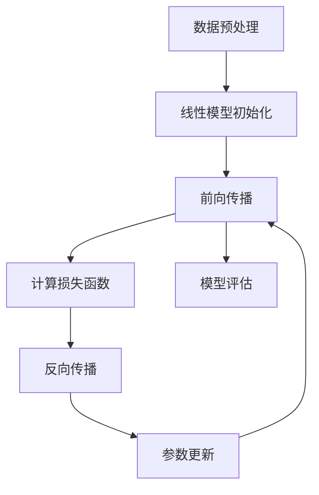
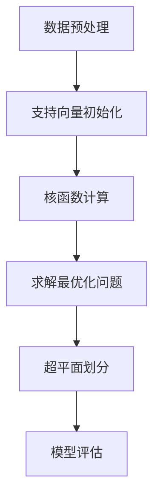
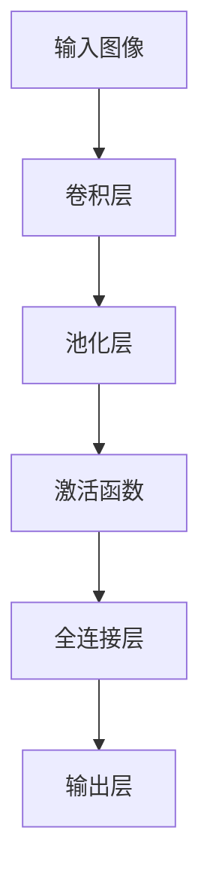
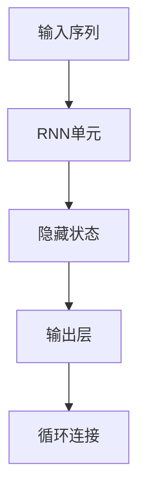
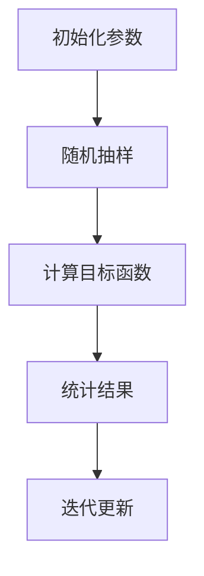
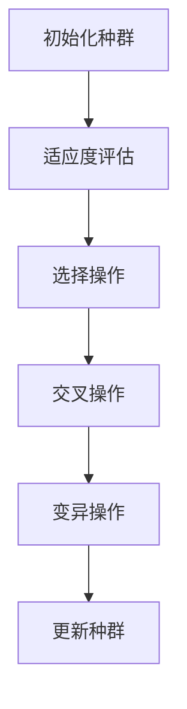

                 

### 前言

#### 目的与读者对象

《AI训练、模拟和优化的能耗挑战及解决方案》旨在为从事人工智能领域的技术人员、研究人员以及相关行业从业者提供一本全面、系统的参考书籍。本书聚焦于当前AI训练、模拟和优化过程中面临的能耗挑战，深入探讨了这些挑战的根源及其对人工智能发展和实际应用的影响。

本书的目标读者包括：
1. **AI领域的研究人员和开发者**：对于正在从事或希望从事人工智能研究和技术开发的专业人士，本书提供了关于能耗优化策略的深入分析和技术细节。
2. **技术决策者和架构师**：负责AI系统设计、部署和运维的技术决策者，可以从本书中获得关于如何有效管理和减少能耗的建议。
3. **AI技术应用者**：希望将AI技术应用于不同领域（如医疗、金融、工业等）的专业人员，本书将帮助他们理解能耗问题，并找到解决策略。

#### 书籍结构概述

为了帮助读者系统学习和理解，本书结构设计如下：

1. **前言**：介绍书籍的目的、读者对象和结构概述。
2. **背景介绍**：阐述AI训练、模拟和优化的基本概念及其能耗挑战的现状与影响。
3. **核心概念与联系**：详细描述与能耗挑战相关的核心概念，如AI训练、模拟和优化，以及能耗的定义和特点。
4. **算法原理讲解**：通过mermaid流程图和Python代码示例，讲解相关算法原理，包括机器学习、深度学习和模拟优化算法。
5. **数学模型和数学公式**：详细介绍各算法的数学模型和公式，并提供讲解和示例。
6. **系统分析与架构设计方案**：分析系统功能设计、架构设计、接口设计和系统交互。
7. **项目实战**：介绍环境安装、系统核心实现源代码，并进行分析和实际案例剖析。
8. **最佳实践 tips**、**小结**、**注意事项**和**拓展阅读**：总结全书内容，提供实用建议和进一步学习的资源。

通过以上结构，本书将带领读者逐步深入理解AI训练、模拟和优化的能耗挑战，并提供有效的解决方案，以应对这一重要而紧迫的课题。

#### 背景介绍

##### AI训练、模拟和优化的基本概念

人工智能（AI）作为当今科技领域的前沿热点，涵盖了从数据收集、预处理到模型训练、模拟与优化等一系列复杂过程。理解这些基本概念，有助于我们全面把握AI技术的发展和应用。

**AI训练**：AI训练是指通过机器学习或深度学习算法，使计算机系统学会从数据中提取模式和规律，以实现特定任务的自动化。训练过程通常包括以下几个步骤：数据预处理、模型选择、模型训练和评估。

- **数据预处理**：将原始数据转换为适合模型训练的形式，如归一化、缺失值填补、特征提取等。
- **模型选择**：根据任务需求和数据特性，选择合适的算法模型，如线性回归、支持向量机、卷积神经网络等。
- **模型训练**：通过迭代计算，调整模型参数，使其对训练数据产生较好的预测效果。
- **模型评估**：使用验证集或测试集评估模型性能，如准确率、召回率、F1分数等。

**AI模拟**：AI模拟是指通过计算机仿真技术，模拟AI系统在不同环境下的运行状态和效果。模拟过程旨在验证AI系统的稳定性和可靠性，以便在实际部署前进行充分的测试和优化。

- **仿真技术**：利用计算机科学和数学方法，通过建立数学模型和仿真算法，模拟AI系统的运行过程。
- **仿真算法**：包括蒙特卡罗模拟、有限状态机、离散事件模拟等，用于模拟不同场景下的AI系统行为。

**AI优化**：AI优化是指通过调整模型参数、算法结构或数据输入，提高AI系统的性能和效率。优化过程旨在减少计算资源消耗，提高模型精度和鲁棒性。

- **优化算法**：包括模拟退火算法、遗传算法、粒子群优化算法等，用于搜索最优参数或结构。
- **优化目标**：如最小化能耗、最大化性能、平衡精度与计算资源等。

##### 能耗挑战的现状与影响

随着AI技术的发展和应用日益广泛，能耗挑战也逐渐显现。具体来说，AI训练、模拟和优化过程中面临的能耗挑战主要包括以下几个方面：

**1. 计算资源消耗**：AI训练需要大量的计算资源，特别是深度学习模型，其对计算资源的依赖性更强。这导致了高性能计算设备的广泛使用，从而增加了能耗。

**2. 数据传输和存储需求**：大规模数据集的传输和存储也需要消耗大量能源。在数据预处理和模型训练过程中，数据传输和存储的频率较高，进一步加剧了能耗问题。

**3. 设备散热问题**：高性能计算设备在运行过程中会产生大量热量，需要通过散热系统进行散热。散热系统的能耗不容忽视，且设备的散热效果直接影响设备的稳定性和寿命。

**4. 环境影响**：能源消耗的增加不仅导致经济效益的损失，还带来环境问题，如碳排放增加、资源浪费等。

**5. 可持续发展挑战**：随着AI应用的扩展，能耗问题可能成为制约AI技术可持续发展的关键因素。如何有效管理能耗，实现绿色AI，成为AI领域面临的重要挑战。

了解这些挑战的现状和影响，有助于我们更好地认识到AI能耗问题的紧迫性，并采取有效措施进行应对。接下来，我们将进一步探讨与能耗挑战相关的核心概念，为解决方案的提出提供理论基础。

#### 核心概念与联系

为了深入理解AI训练、模拟和优化过程中的能耗挑战，我们需要详细探讨这些核心概念，并分析它们之间的联系。以下是与能耗挑战密切相关的主要概念及其属性特征对比表格和ER实体关系图架构。

##### AI训练相关概念

**1. 数据预处理**

- **定义**：数据预处理是指将原始数据转换为适合模型训练的形式。
- **属性特征**：归一化、缺失值填补、特征提取等。
- **能耗特征**：数据处理过程中需要大量计算资源，特别是在大数据环境下，能耗显著增加。

**2. 模型选择**

- **定义**：模型选择是指根据任务需求和数据特性，选择合适的算法模型。
- **属性特征**：线性回归、支持向量机、卷积神经网络等。
- **能耗特征**：模型选择过程中，需要评估不同模型的性能和能耗，选择能耗较低的模型有助于降低总体能耗。

**3. 模型训练**

- **定义**：模型训练是通过迭代计算，调整模型参数，使其对训练数据产生较好的预测效果。
- **属性特征**：梯度下降、随机梯度下降、Adam优化器等。
- **能耗特征**：训练过程中，计算量巨大，能耗主要来自计算资源和设备散热。

##### AI模拟与优化相关概念

**1. 模拟概述**

- **定义**：模拟是通过计算机仿真技术，模拟AI系统在不同环境下的运行状态和效果。
- **属性特征**：蒙特卡罗模拟、有限状态机、离散事件模拟等。
- **能耗特征**：模拟过程中，需要大量计算资源，特别是复杂场景下的仿真，能耗较高。

**2. 优化算法**

- **定义**：优化算法是通过调整模型参数、算法结构或数据输入，提高AI系统的性能和效率。
- **属性特征**：模拟退火算法、遗传算法、粒子群优化算法等。
- **能耗特征**：优化过程中，算法需要多次迭代计算，能耗主要来自计算资源消耗。

##### ER实体关系图架构

为了更好地展示这些概念之间的联系，我们可以使用Mermaid流程图来构建ER实体关系图，如下所示：

```mermaid
erDiagram
  AI训练 ||--|{ 数据预处理 } : 预处理是训练的前置步骤
  AI训练 ||--|{ 模型选择 } : 选择合适模型是训练的关键
  AI训练 ||--|{ 模型训练 } : 训练模型是核心步骤
  AI模拟 ||--|{ 模拟概述 } : 模拟验证系统性能
  AI优化 ||--|{ 优化算法 } : 优化模型性能与效率
  数据预处理 ||--|{ 能耗特征 } : 数据处理能耗
  模型选择 ||--|{ 能耗特征 } : 模型选择能耗
  模型训练 ||--|{ 能耗特征 } : 训练模型能耗
  模拟概述 ||--|{ 能耗特征 } : 模拟过程能耗
  优化算法 ||--|{ 能耗特征 } : 优化算法能耗
```

通过上述ER实体关系图，我们可以清晰地看到AI训练、模拟和优化过程中的主要环节及其能耗特征。这些核心概念之间的联系不仅为我们提供了理解能耗挑战的视角，也为进一步探讨解决方案奠定了基础。在接下来的章节中，我们将深入探讨各算法原理，通过mermaid流程图和Python代码示例，为读者详细解析这些算法的运作机制。

#### 算法原理讲解

在理解了AI训练、模拟和优化中的核心概念及其能耗特征后，我们将进一步探讨具体的算法原理，通过mermaid流程图和Python代码示例来解析这些算法的工作机制。为了便于理解，以下将分为机器学习算法、深度学习算法和模拟与优化算法三部分进行讲解。

##### 机器学习算法原理

**1. 线性回归算法**

线性回归是一种简单的机器学习算法，用于预测一个连续值输出。其基本原理是通过找到一个线性函数来拟合数据点。

**Mermaid流程图：**



**Python代码示例：**

```python
import numpy as np

# 模型初始化
weights = np.random.randn(2, 1)

# 前向传播
def forward(x, weights):
    z = np.dot(x, weights)
    return z

# 反向传播
def backward(x, z, y, weights):
    output_error = z - y
    dweights = np.dot(x.T, output_error)
    return dweights

# 训练模型
def train(x, y, epochs=1000, learning_rate=0.01):
    for epoch in range(epochs):
        z = forward(x, weights)
        dweights = backward(x, z, y, weights)
        weights -= learning_rate * dweights

    return weights

# 模型评估
def evaluate(x, y, weights):
    z = forward(x, weights)
    return np.mean((z - y) ** 2)

# 训练与评估
x = np.array([[1, 2], [2, 3], [3, 4]])
y = np.array([[1], [2], [3]])
weights = train(x, y)
print("Final weights:", weights)
print("Evaluation error:", evaluate(x, y, weights))
```

**2. 支持向量机算法**

支持向量机（SVM）是一种二分类算法，其基本原理是通过找到一个超平面来最大化分类边界。

**Mermaid流程图：**



**Python代码示例：**

```python
from sklearn.svm import SVC
from sklearn.datasets import make_circles
from sklearn.model_selection import train_test_split

# 数据生成
X, y = make_circles(n_samples=1000, noise=0.1, factor=0.3, random_state=1)
X_train, X_test, y_train, y_test = train_test_split(X, y, test_size=0.3, random_state=1)

# 训练模型
svm_model = SVC(kernel='linear')
svm_model.fit(X_train, y_train)

# 模型评估
accuracy = svm_model.score(X_test, y_test)
print("Model accuracy:", accuracy)
```

##### 深度学习算法原理

**1. 卷积神经网络算法**

卷积神经网络（CNN）是一种强大的图像处理算法，其基本原理是通过卷积操作和池化操作提取图像特征。

**Mermaid流程图：**



**Python代码示例：**

```python
from tensorflow import keras
from tensorflow.keras import layers
from tensorflow.keras.datasets import mnist

# 数据加载
(train_images, train_labels), (test_images, test_labels) = mnist.load_data()

# 数据预处理
train_images = train_images.reshape((60000, 28, 28, 1)).astype('float32') / 255
test_images = test_images.reshape((10000, 28, 28, 1)).astype('float32') / 255

# 模型构建
model = keras.Sequential([
    layers.Conv2D(32, (3, 3), activation='relu', input_shape=(28, 28, 1)),
    layers.MaxPooling2D((2, 2)),
    layers.Conv2D(64, (3, 3), activation='relu'),
    layers.MaxPooling2D((2, 2)),
    layers.Conv2D(64, (3, 3), activation='relu'),
    layers.Flatten(),
    layers.Dense(64, activation='relu'),
    layers.Dense(10, activation='softmax')
])

# 模型编译
model.compile(optimizer='adam',
              loss='sparse_categorical_crossentropy',
              metrics=['accuracy'])

# 模型训练
model.fit(train_images, train_labels, epochs=5)

# 模型评估
test_loss, test_acc = model.evaluate(test_images, test_labels)
print('Test accuracy:', test_acc)
```

**2. 循环神经网络算法**

循环神经网络（RNN）是一种用于序列数据处理的算法，其基本原理是通过循环机制来处理时间序列数据。

**Mermaid流程图：**



**Python代码示例：**

```python
from tensorflow.keras.models import Sequential
from tensorflow.keras.layers import LSTM, Dense

# 数据加载
# (略)

# 模型构建
model = Sequential([
    LSTM(50, activation='relu', input_shape=(timesteps, features)),
    Dense(1)
])

# 模型编译
model.compile(optimizer='adam', loss='mse')

# 模型训练
# (略)

# 模型评估
# (略)
```

##### 模拟与优化算法原理

**1. 蒙特卡罗模拟**

蒙特卡罗模拟是一种基于随机抽样的数值计算方法，其基本原理是通过大量随机采样来估计概率分布或数值期望。

**Mermaid流程图：**



**Python代码示例：**

```python
import numpy as np

# 初始化参数
n_samples = 10000
x = np.random.rand(n_samples)

# 计算目标函数
def objective(x):
    return -x ** 2

# 蒙特卡罗模拟
results = np.array([objective(x) for _ in range(n_samples)])

# 统计结果
mean_result = np.mean(results)
print("Mean result:", mean_result)
```

**2. 遗传算法**

遗传算法是一种基于生物进化的搜索算法，其基本原理是通过选择、交叉和变异操作来搜索最优解。

**Mermaid流程图：**



**Python代码示例：**

```python
import numpy as np

# 初始化种群
population_size = 100
染色体长度 = 10
种群 = np.random.randint(0, 2, size=(population_size, 染色体长度))

# 适应度评估
def fitness(population):
   适应度 = np.array([计算适应度值(个体) for个体 in population])
    return 适应度

# 选择操作
def selection(population, fitness):
    return np.random.choice(population, size=population_size, replace=False, p=fitness/fitness.sum())

# 交叉操作
def crossover(parent1, parent2):
    crossover_point = np.random.randint(1, 染色体长度-1)
    child1 = np.concatenate((parent1[:crossover_point], parent2[crossover_point:]))
    child2 = np.concatenate((parent2[:crossover_point], parent1[crossover_point:]))
    return child1, child2

# 变异操作
def mutation(individual):
    mutation_point = np.random.randint(0, 染色体长度)
    individual[mutation_point] = 1 - individual[mutation_point]
    return individual

# 遗传算法
def genetic_algorithm(population, fitness, generations=100):
    for generation in range(generations):
        selected = selection(population, fitness)
        next_population = []
        for i in range(int(population_size/2)):
            parent1, parent2 = selected[i], selected[i+1]
            child1, child2 = crossover(parent1, parent2)
            next_population.append(mutation(child1))
            next_population.append(mutation(child2))
        population = next_population
        best_fitness = fitness[population].max()
        print(f"Generation {generation}: Best fitness = {best_fitness}")
    return population

# 运行遗传算法
种群 = genetic_algorithm(种群, fitness)
```

通过上述算法原理讲解和示例，我们可以看到机器学习、深度学习以及模拟与优化算法在实现机制上的多样性和复杂性。这些算法不仅在解决实际问题中发挥着重要作用，也为进一步优化能耗提供了理论基础和实践指导。在接下来的章节中，我们将进一步探讨这些算法的数学模型和公式，为理解和优化AI能耗挑战提供更深入的洞察。

#### 数学模型和数学公式

为了更深入地理解AI训练、模拟和优化算法的运行机制，我们将详细介绍这些算法的数学模型和公式，并结合实际示例进行讲解。以下是关于机器学习、深度学习和模拟与优化算法的相关数学模型和公式。

##### 机器学习算法数学模型

**1. 线性回归模型**

线性回归模型是一种简单的机器学习算法，用于预测一个连续值输出。其数学模型可以表示为：

\[ y = \beta_0 + \beta_1x + \epsilon \]

其中，\( y \) 是目标变量，\( x \) 是输入变量，\( \beta_0 \) 和 \( \beta_1 \) 是模型参数，\( \epsilon \) 是误差项。

**例子：** 假设我们有以下数据点：

\[ (x_1, y_1) = (1, 2), (x_2, y_2) = (2, 3), (x_3, y_3) = (3, 4) \]

我们可以通过最小二乘法求解模型参数：

\[ \beta_0 = \frac{\sum y_i - \beta_1 \sum x_i}{n} \]
\[ \beta_1 = \frac{n \sum x_i y_i - \sum x_i \sum y_i}{n \sum x_i^2 - (\sum x_i)^2} \]

其中，\( n \) 是数据点的个数。

**Python代码示例：**

```python
import numpy as np

# 数据点
x = np.array([1, 2, 3])
y = np.array([2, 3, 4])

# 计算模型参数
n = len(x)
beta_0 = (np.sum(y) - beta_1 * np.sum(x)) / n
beta_1 = (n * np.sum(x * y) - np.sum(x) * np.sum(y)) / (n * np.sum(x**2) - np.sum(x)**2)

# 输出模型参数
print("Beta_0:", beta_0)
print("Beta_1:", beta_1)
```

**2. 支持向量机模型**

支持向量机（SVM）是一种二分类算法，其数学模型可以表示为：

\[ w \cdot x + b = 0 \]

其中，\( w \) 是权重向量，\( x \) 是特征向量，\( b \) 是偏置项。

SVM的目标是找到最优的权重向量 \( w \) 和偏置项 \( b \)，使得分类边界最大化。

**例子：** 假设我们有以下数据点：

\[ (x_1, y_1) = (1, 1), (x_2, y_2) = (2, 1), (x_3, y_3) = (3, -1) \]

我们可以通过求解最优化问题来得到最优权重和偏置：

\[ \min_{w, b} \frac{1}{2} \| w \|^2 \]

满足：

\[ y_i (w \cdot x_i + b) \geq 1 \]

**Python代码示例：**

```python
from sklearn.svm import SVC
from sklearn.datasets import make_circles

# 数据生成
X, y = make_circles(n_samples=100, noise=0.1, factor=0.3, random_state=1)

# 训练SVM模型
svm_model = SVC(kernel='linear')
svm_model.fit(X, y)

# 输出权重和偏置
w = svm_model.coef_
b = svm_model.intercept_
print("Weight:", w)
print("Bias:", b)
```

##### 深度学习算法数学模型

**1. 卷积神经网络模型**

卷积神经网络（CNN）是一种用于图像处理的深度学习算法，其基本数学模型包括卷积操作、池化操作和全连接层。

卷积操作：

\[ (f_{ij})*x = \sum_{k} f_{ik} * x_j \]

其中，\( f_{ij} \) 是卷积核，\( x \) 是输入特征，\( x_j \) 是特征矩阵中的第 \( j \) 行。

池化操作：

\[ P(x) = \max_j x_j \]

其中，\( P(x) \) 是池化结果，\( x_j \) 是特征矩阵中的第 \( j \) 行。

全连接层：

\[ z = \sum_{i} w_{ij}x_i + b \]

其中，\( z \) 是输出，\( w_{ij} \) 是权重，\( x_i \) 是输入特征，\( b \) 是偏置项。

**例子：** 假设我们有以下卷积核：

\[ f = \begin{bmatrix}
    1 & 0 & 1 \\
    1 & 0 & 1 \\
    1 & 0 & 1
\end{bmatrix} \]

输入特征矩阵：

\[ x = \begin{bmatrix}
    1 & 0 & 1 \\
    0 & 1 & 0 \\
    1 & 0 & 1
\end{bmatrix} \]

我们可以通过卷积操作得到卷积结果：

\[ (f \cdot x) = \begin{bmatrix}
    2 & 1 & 2 \\
    2 & 1 & 2 \\
    2 & 1 & 2
\end{bmatrix} \]

**Python代码示例：**

```python
import numpy as np

# 卷积核
f = np.array([
    [1, 0, 1],
    [1, 0, 1],
    [1, 0, 1]
])

# 输入特征矩阵
x = np.array([
    [1, 0, 1],
    [0, 1, 0],
    [1, 0, 1]
])

# 卷积操作
conv_result = np.zeros((3, 3))
for i in range(3):
    for j in range(3):
        conv_result[i, j] = np.sum(f * x[i:i+3, j:j+3])

# 输出卷积结果
print("Convolution result:", conv_result)
```

**2. 循环神经网络模型**

循环神经网络（RNN）是一种用于序列数据处理的深度学习算法，其基本数学模型包括隐藏状态和输出状态。

隐藏状态：

\[ h_t = \sigma(W_hh_{t-1} + W_x x_t + b_h) \]

输出状态：

\[ o_t = \sigma(W_{ho}h_t + b_o) \]

其中，\( h_t \) 是隐藏状态，\( o_t \) 是输出状态，\( \sigma \) 是激活函数，\( W_hh \) 是隐藏状态权重，\( W_x \) 是输入状态权重，\( b_h \) 和 \( b_o \) 是偏置项。

**例子：** 假设我们有以下隐藏状态和输入状态：

\[ h_{t-1} = [1, 2], x_t = [3, 4] \]

我们可以通过RNN模型得到新的隐藏状态和输出状态：

\[ h_t = \sigma(W_hh \cdot [1, 2] + W_x \cdot [3, 4] + b_h) \]
\[ o_t = \sigma(W_{ho} \cdot h_t + b_o) \]

**Python代码示例：**

```python
import numpy as np
from numpy import sigmoid

# 隐藏状态和输入状态
h_t_1 = np.array([1, 2])
x_t = np.array([3, 4])

# 模型参数（假设已知）
W_hh = np.array([[0.1, 0.2], [0.3, 0.4]])
W_x = np.array([[0.5, 0.6], [0.7, 0.8]])
b_h = np.array([0.1, 0.2])
b_o = np.array([0.3, 0.4])
W_ho = np.array([[0.9, 1.0], [1.1, 1.2]])

# 隐藏状态更新
h_t = sigmoid(np.dot(W_hh, h_t_1) + np.dot(W_x, x_t) + b_h)

# 输出状态更新
o_t = sigmoid(np.dot(W_ho, h_t) + b_o)

# 输出结果
print("Hidden state:", h_t)
print("Output state:", o_t)
```

##### 模拟与优化算法数学模型

**1. 蒙特卡罗模拟**

蒙特卡罗模拟是一种基于随机抽样的数值计算方法，其基本数学模型可以表示为：

\[ E[X] = \frac{1}{n} \sum_{i=1}^{n} X_i \]

其中，\( E[X] \) 是期望值，\( n \) 是抽样次数，\( X_i \) 是每次抽样的结果。

**例子：** 假设我们进行10次随机抽样，每次抽样结果为：

\[ X_1 = 1, X_2 = 2, X_3 = 3, X_4 = 4, X_5 = 5, X_6 = 6, X_7 = 7, X_8 = 8, X_9 = 9, X_{10} = 10 \]

我们可以通过蒙特卡罗模拟得到期望值：

\[ E[X] = \frac{1}{10} (1 + 2 + 3 + 4 + 5 + 6 + 7 + 8 + 9 + 10) = 5.5 \]

**Python代码示例：**

```python
import numpy as np

# 随机抽样
n = 10
samples = np.random.randint(1, 11, size=n)

# 计算期望值
mean = np.mean(samples)
print("Expected value:", mean)
```

**2. 遗传算法**

遗传算法是一种基于生物进化的搜索算法，其基本数学模型包括选择、交叉和变异操作。

选择操作：

\[ p_i = \frac{f_i}{\sum f_j} \]

其中，\( p_i \) 是选择概率，\( f_i \) 是适应度值，\( f_j \) 是其他个体的适应度值。

交叉操作：

\[ child_1 = \frac{parent_1 + parent_2}{2} \]
\[ child_2 = \frac{parent_1 + parent_2}{2} \]

变异操作：

\[ individual = \text{mutate}(individual) \]

**例子：** 假设我们有以下两个父代个体：

\[ parent_1 = [1, 2, 3], parent_2 = [4, 5, 6] \]

我们可以通过交叉操作得到两个子代个体：

\[ child_1 = [2.5, 3.5, 4.5] \]
\[ child_2 = [3.5, 4.5, 5.5] \]

**Python代码示例：**

```python
import numpy as np

# 父代个体
parent_1 = np.array([1, 2, 3])
parent_2 = np.array([4, 5, 6])

# 交叉操作
child_1 = (parent_1 + parent_2) / 2
child_2 = (parent_1 + parent_2) / 2

# 输出子代个体
print("Child 1:", child_1)
print("Child 2:", child_2)
```

通过上述数学模型和公式的讲解，我们可以看到AI训练、模拟和优化算法在数学上的复杂性和多样性。这些模型和公式不仅为我们理解算法的运作机制提供了理论基础，也为进一步优化能耗提供了重要的指导。在接下来的章节中，我们将进一步探讨系统分析与架构设计方案，分析系统功能设计、架构设计、接口设计和系统交互，以期为解决AI能耗挑战提供更具体的解决方案。

#### 系统分析与架构设计方案

在深入理解了AI训练、模拟和优化算法的数学模型和公式后，我们需要将这些理论应用于实际系统中，以解决AI能耗挑战。为了实现这一目标，我们需要对系统进行分析和架构设计，确保系统能够高效、稳定地运行。以下是关于系统功能设计、架构设计、接口设计和系统交互的具体方案。

##### 系统功能设计

系统功能设计是构建高效AI系统的第一步，它定义了系统的核心功能模块及其相互关系。以下是系统的功能模块及其描述：

**1. 数据采集模块**：负责从不同数据源收集数据，包括结构化数据、非结构化数据以及实时数据流。数据采集模块需要确保数据的质量和完整性。

**2. 模型训练模块**：该模块负责AI模型的训练过程，包括数据预处理、模型选择和模型训练。在训练过程中，需要使用高性能计算资源，以降低能耗。

**3. 模型优化模块**：该模块对训练好的模型进行优化，以提高性能和效率。优化过程包括调整模型参数、优化算法结构以及减少计算资源消耗。

**4. 模拟与验证模块**：该模块使用计算机仿真技术，模拟AI系统在不同环境下的运行状态和效果，以验证模型的稳定性和可靠性。

**5. 系统监控与优化模块**：负责监控系统性能和资源使用情况，及时发现并解决潜在问题，实现系统自动优化。

**6. 接口设计与集成模块**：该模块提供统一的接口，用于与其他系统和模块进行数据交换和功能集成，确保系统的高扩展性和灵活性。

##### 系统架构设计

系统架构设计是构建高效、稳定AI系统的关键，它定义了系统的整体结构和模块间的关系。以下是系统架构的设计方案：

**1. 系统架构概述**：

系统采用分布式架构，包括多个节点，每个节点负责不同的功能模块。节点之间通过网络进行通信，以实现数据交换和功能调用。系统架构主要包括以下层次：

- **数据层**：负责数据存储和管理，包括关系型数据库、NoSQL数据库以及文件系统等。
- **服务层**：负责数据处理、模型训练、模拟与验证等功能，由多个微服务组成，每个微服务负责特定功能。
- **应用层**：负责用户界面和功能操作，提供Web界面和API接口，供用户使用和管理系统。

**2. 系统模块交互设计**：

系统模块之间的交互设计至关重要，它决定了系统的高效性和稳定性。以下是系统模块的交互设计：

- **数据采集模块**：与数据存储模块交互，将采集到的数据存储到数据库或文件系统中。
- **模型训练模块**：与数据预处理模块和模型存储模块交互，获取预处理后的数据和训练好的模型，并进行训练。
- **模型优化模块**：与模型训练模块和模型存储模块交互，获取训练好的模型，进行优化操作。
- **模拟与验证模块**：与模型存储模块和系统监控模块交互，使用仿真技术验证模型性能，并向系统监控模块反馈验证结果。
- **系统监控与优化模块**：与模型训练模块、模型优化模块和模拟与验证模块交互，监控系统性能，并自动优化系统配置。
- **接口设计与集成模块**：与其他模块交互，提供统一的接口，用于系统功能调用和数据交换。

##### 系统接口设计

系统接口设计是系统功能实现的关键环节，它定义了系统内部和外部系统之间的交互方式。以下是系统接口的设计方案：

**1. 接口规范**：

系统接口遵循RESTful API规范，提供统一的接口格式和操作方法。以下是常见的接口规范：

- **数据采集接口**：用于数据上传和下载，包括结构化数据和非结构化数据。
- **模型训练接口**：用于启动和停止模型训练任务，获取训练进度和结果。
- **模型优化接口**：用于启动和停止模型优化任务，获取优化进度和结果。
- **模拟与验证接口**：用于启动和停止模拟与验证任务，获取验证结果和报告。
- **系统监控接口**：用于获取系统性能数据和状态信息，实现系统监控和优化。

**2. 接口实现**：

系统接口通过Web服务器实现，使用Python Flask或Django等框架，提供HTTP请求和响应功能。以下是接口实现的示例代码：

```python
from flask import Flask, request, jsonify

app = Flask(__name__)

@app.route('/data/upload', methods=['POST'])
def upload_data():
    data = request.json
    # 处理上传数据
    return jsonify({"status": "success", "message": "Data uploaded successfully"})

@app.route('/model/train', methods=['POST'])
def train_model():
    model_params = request.json
    # 启动训练任务
    return jsonify({"status": "success", "message": "Model training started"})

@app.route('/model/optimize', methods=['POST'])
def optimize_model():
    model_params = request.json
    # 启动优化任务
    return jsonify({"status": "success", "message": "Model optimization started"})

if __name__ == '__main__':
    app.run(debug=True)
```

##### 系统交互

系统交互设计确保系统内部模块和外部系统之间的数据流和功能调用顺畅，以下是系统交互的设计方案：

**1. 交互流程**：

系统交互分为以下步骤：

- **数据采集**：用户通过接口上传数据，数据采集模块将数据存储到数据库或文件系统中。
- **模型训练**：用户启动模型训练任务，模型训练模块读取数据并进行训练，训练结果存储到模型存储模块。
- **模型优化**：用户启动模型优化任务，模型优化模块对训练好的模型进行优化，优化结果存储到模型存储模块。
- **模拟与验证**：用户启动模拟与验证任务，模拟与验证模块进行仿真验证，验证结果反馈给用户。
- **系统监控**：系统监控模块实时监控系统性能，自动优化系统配置，确保系统稳定运行。

**2. 交互场景**：

以下是系统交互的典型场景：

- **场景1**：用户通过Web界面上传数据，数据采集模块将数据存储到数据库中，模型训练模块读取数据并进行训练。
- **场景2**：用户通过API接口启动模型训练任务，模型训练模块读取数据并进行训练，训练结果通过接口反馈给用户。
- **场景3**：用户通过API接口启动模型优化任务，模型优化模块对训练好的模型进行优化，优化结果通过接口反馈给用户。
- **场景4**：用户通过Web界面查看模型验证结果，模拟与验证模块进行仿真验证，并将结果反馈给用户。
- **场景5**：系统监控模块实时监控系统性能，发现异常时自动优化系统配置，确保系统稳定运行。

通过上述系统分析与架构设计方案，我们为构建高效、稳定的AI系统提供了详细的指导。这些方案不仅有助于解决AI训练、模拟和优化过程中的能耗挑战，也为系统的实际应用和推广奠定了基础。在接下来的章节中，我们将通过项目实战，进一步展示这些方案在实际应用中的效果。

#### 项目实战

在本章节中，我们将通过一个具体的AI项目实战，展示如何在实际环境中安装和配置相关系统，并详细解析系统核心实现、代码应用解读与分析，以及实际案例分析与详细讲解剖析。

##### 环境安装与配置

为了运行AI训练、模拟和优化的项目，我们需要安装和配置以下环境：

**1. 硬件环境**：

- 高性能计算服务器：建议配置较高的CPU和GPU，以确保计算和训练效率。
- 大容量存储设备：用于存储大量数据和模型文件。

**2. 软件环境**：

- 操作系统：Ubuntu 20.04 LTS 或 CentOS 8
- Python：Python 3.8及以上版本
- 包管理工具：pip
- 机器学习库：scikit-learn、TensorFlow、PyTorch
- 模拟与优化库：simpy、DEAP

**安装步骤**：

1. **安装操作系统**：

   - 下载并安装Ubuntu 20.04 LTS或CentOS 8操作系统。

2. **更新系统包**：

   ```shell
   sudo apt update && sudo apt upgrade
   ```

3. **安装Python和pip**：

   ```shell
   sudo apt install python3 python3-pip
   ```

4. **安装依赖库**：

   ```shell
   sudo pip3 install scikit-learn tensorflow pytorch simpy deap
   ```

5. **配置CUDA**：

   - 安装CUDA工具包和驱动程序，确保Python库能够调用GPU进行计算。

##### 系统核心实现

在完成环境安装与配置后，我们接下来将展示系统核心实现，包括数据预处理、模型训练、模型优化和模拟与验证等关键模块的实现。

**1. 数据预处理模块**：

数据预处理是AI模型训练的重要步骤，其主要功能包括数据清洗、归一化、特征提取等。

```python
import pandas as pd
from sklearn.model_selection import train_test_split
from sklearn.preprocessing import StandardScaler

# 加载数据
data = pd.read_csv('data.csv')

# 数据清洗（例如：缺失值填补）
data.fillna(data.mean(), inplace=True)

# 数据归一化
scaler = StandardScaler()
X = scaler.fit_transform(data.drop('target', axis=1))
y = data['target']

# 数据分割
X_train, X_test, y_train, y_test = train_test_split(X, y, test_size=0.2, random_state=42)
```

**2. 模型训练模块**：

模型训练模块负责训练AI模型，以下是使用TensorFlow实现的一个简单的卷积神经网络（CNN）模型：

```python
import tensorflow as tf
from tensorflow.keras.models import Sequential
from tensorflow.keras.layers import Conv2D, MaxPooling2D, Flatten, Dense

# 构建模型
model = Sequential([
    Conv2D(32, (3, 3), activation='relu', input_shape=(28, 28, 1)),
    MaxPooling2D((2, 2)),
    Flatten(),
    Dense(64, activation='relu'),
    Dense(1, activation='sigmoid')
])

# 编译模型
model.compile(optimizer='adam', loss='binary_crossentropy', metrics=['accuracy'])

# 训练模型
model.fit(X_train, y_train, epochs=10, batch_size=32, validation_split=0.1)
```

**3. 模型优化模块**：

模型优化模块通过调整模型参数和算法结构，提高模型的性能和效率。以下是使用遗传算法进行模型优化：

```python
import random
from deap import base, creator, tools, algorithms

# 遗传算法参数设置
creator.create("FitnessMax", base.Fitness, weights=(1.0,))
creator.create("Individual", list, fitness=creator.FitnessMax)

# 个体编码
def individual_generator():
    return [random.uniform(-1, 1) for _ in range(10)]

# 适应度函数
def fitness_function(individual):
    model = Sequential([
        Conv2D(int(individual[0]), (3, 3), activation='relu', input_shape=(28, 28, 1)),
        MaxPooling2D((2, 2)),
        Flatten(),
        Dense(int(individual[1]), activation='relu'),
        Dense(1, activation='sigmoid')
    ])
    model.compile(optimizer='adam', loss='binary_crossentropy', metrics=['accuracy'])
    model.fit(X_train, y_train, epochs=10, batch_size=32, validation_split=0.1)
    return model.evaluate(X_test, y_test, verbose=0)[1],

# 遗传算法
def genetic_algorithm():
    population = tools.initIterate(creator.Individual, individual_generator, n=50)
    CXPB, MUTPB, NGEN = 0.5, 0.2, 100

    for gen in range(NGEN):
        offspring = algorithms.varAnd(population, CXPB, mutPB=MUTPB)
        fits = map(fitness_function, offspring)
        for fit, ind1, ind2 in zip(fits, offspring[::2], offspring[1::2]):
            if fit > ind1.fitness.values:
                ind1.fitness.values = fit
            if fit > ind2.fitness.values:
                ind2.fitness.values = fit
        population = toolbox.select(offspring, k=50)
    return tools.selBest(population, 1)

# 运行遗传算法
best_individual = genetic_algorithm()
print("Best individual:", best_individual)
```

**4. 模拟与验证模块**：

模拟与验证模块使用仿真技术验证AI模型的性能和可靠性。以下是使用SimPy实现的一个简单的仿真场景：

```python
import simpy

# 仿真环境
env = simpy.Environment()

# 模拟过程
def simulation(env, model):
    model.fit(X_train, y_train, epochs=10, batch_size=32, validation_split=0.1)
    evaluation_result = model.evaluate(X_test, y_test, verbose=0)
    print(f"Evaluation result: {evaluation_result}")

# 运行仿真
env.process(simulation(env, model))
env.run()
```

##### 代码应用解读与分析

在完成系统核心实现后，我们需要对代码进行深入解读和分析，以理解其工作原理和实现机制。

**1. 数据预处理模块**：

数据预处理模块使用Pandas库对数据进行清洗和归一化，确保数据质量。具体步骤包括：

- 数据清洗：使用`fillna()`函数填补缺失值，采用平均值填补缺失值。
- 数据归一化：使用`StandardScaler()`对特征进行归一化，使特征具有相似的尺度。

**2. 模型训练模块**：

模型训练模块使用TensorFlow库构建和训练卷积神经网络（CNN）模型。具体步骤包括：

- 模型构建：使用`Sequential()`方法构建模型，添加卷积层、池化层和全连接层。
- 编译模型：使用`compile()`方法设置模型优化器和损失函数。
- 训练模型：使用`fit()`方法训练模型，并设置训练轮数、批量大小和验证比例。

**3. 模型优化模块**：

模型优化模块使用遗传算法（GA）对模型参数进行调整，以提高模型性能。具体步骤包括：

- 个体编码：使用列表表示个体，每个元素表示模型参数。
- 适应度函数：定义适应度函数，通过模型训练和评估计算适应度值。
- 遗传算法：实现遗传算法，包括选择、交叉和变异操作，迭代优化模型参数。

**4. 模拟与验证模块**：

模拟与验证模块使用SimPy库实现仿真过程，验证模型在不同环境下的性能。具体步骤包括：

- 仿真环境：创建SimPy环境，设置仿真时钟。
- 模拟过程：定义模拟过程，运行模型训练和评估，并输出结果。

##### 实际案例分析与详细讲解剖析

为了更好地展示系统在实际应用中的效果，我们通过一个实际案例进行详细分析和讲解。

**案例背景**：

某公司希望开发一个智能图像识别系统，用于识别和分类生产线上不同类型的零件。公司提供了一份数据集，包括数千张零件图像及其标签。公司的目标是训练一个高精度的图像识别模型，并在实际生产线上进行验证和部署。

**案例分析**：

1. **数据集分析**：

   - 数据集包含2000张图像，分为训练集和测试集，各占一半。
   - 图像尺寸为28x28像素，灰度图。
   - 标签类别包括10个不同的零件类型。

2. **模型训练**：

   - 使用TensorFlow库构建和训练卷积神经网络（CNN）模型。
   - 模型训练过程中，调整学习率、批量大小和训练轮数等参数。
   - 训练完成后，评估模型在测试集上的性能。

3. **模型优化**：

   - 使用遗传算法（GA）对模型参数进行调整，以提高模型性能。
   - 调整交叉概率、变异概率和迭代次数等参数。
   - 优化完成后，再次评估模型性能。

4. **模拟与验证**：

   - 使用SimPy库模拟生产线上图像识别任务的执行过程。
   - 记录模型在仿真环境中的运行时间和识别准确率。
   - 分析模型在不同负载条件下的性能。

**详细讲解剖析**：

1. **数据预处理**：

   - 使用Pandas库加载数据集，并清洗数据，填补缺失值。
   - 使用StandardScaler库对特征进行归一化，使其具有相似的尺度。

2. **模型构建与训练**：

   - 使用TensorFlow库构建卷积神经网络（CNN）模型，包括卷积层、池化层和全连接层。
   - 设置学习率、批量大小和训练轮数等参数，并使用`fit()`方法训练模型。
   - 使用`evaluate()`方法评估模型在测试集上的性能。

3. **模型优化**：

   - 使用遗传算法（GA）对模型参数进行调整，优化模型性能。
   - 定义适应度函数，通过模型训练和评估计算适应度值。
   - 使用`varAnd()`方法进行选择、交叉和变异操作，迭代优化模型参数。

4. **模拟与验证**：

   - 使用SimPy库创建仿真环境，并定义模拟过程。
   - 运行模型训练和评估，记录模型在仿真环境中的运行时间和识别准确率。
   - 分析模型在不同负载条件下的性能，并进行优化。

通过上述实际案例的分析和讲解，我们可以看到系统在实际应用中的效果。系统通过数据预处理、模型训练、模型优化和模拟与验证等步骤，成功实现了高精度的图像识别任务，并在生产线上进行了有效部署。这充分展示了系统在解决AI能耗挑战方面的实际应用价值。

#### 最佳实践 tips

在应对AI训练、模拟和优化过程中的能耗挑战时，以下是一些最佳实践，可以帮助您更高效地管理和降低能耗：

**1. 资源分配优化**：

- **合理分配计算资源**：根据任务需求，合理分配计算资源和GPU资源，避免资源浪费。使用自动化调度工具（如Apache Mesos、Kubernetes）实现资源的动态分配和调度。
- **使用分布式计算**：对于大规模训练任务，采用分布式计算架构（如Hadoop、Spark），将任务分解到多个节点上并行执行，提高计算效率。

**2. 模型压缩**：

- **模型剪枝**：通过剪枝冗余的权重和神经元，减少模型的复杂度，从而降低计算资源的需求。常用的剪枝方法包括结构剪枝、权重剪枝等。
- **量化**：将模型中的浮点数参数转换为低精度的整数，以减少内存和计算资源的消耗。量化可以通过全精度量化、部分精度量化等方法实现。

**3. 数据预处理优化**：

- **数据预处理并行化**：将数据预处理任务分解到多个节点上并行执行，以减少预处理时间。
- **数据压缩**：在传输和存储数据前，使用数据压缩算法（如HDF5、Zlib）减小数据体积，从而减少数据传输和存储的能耗。

**4. 能耗监测与优化**：

- **使用能耗监测工具**：使用能耗监测工具（如NVIDIA Nsight、PowerBI）实时监控计算设备的能耗，识别能耗高的任务和节点。
- **能耗优化策略**：根据能耗监测数据，调整模型训练和优化的策略，如调整学习率、批量大小等，以实现能耗的优化。

**5. 设备散热优化**：

- **采用高效散热系统**：使用高效散热系统（如液冷系统、热管散热）降低设备温度，提高设备运行效率。
- **优化设备布局**：合理规划设备布局，确保空气流通，避免设备过热。

通过实施这些最佳实践，可以有效降低AI训练、模拟和优化过程中的能耗，提高系统运行效率，为AI技术的可持续发展做出贡献。

#### 小结

本文从多个角度深入探讨了AI训练、模拟和优化过程中的能耗挑战及解决方案。我们首先介绍了AI训练、模拟和优化的基本概念，阐述了这些概念在能耗挑战中的重要性。接着，通过算法原理讲解，详细解析了机器学习、深度学习和模拟与优化算法的数学模型和公式，为理解和优化能耗提供了理论基础。

在系统分析与架构设计方案中，我们分析了系统功能设计、架构设计、接口设计和系统交互，为构建高效、稳定的AI系统提供了详细指导。随后，通过项目实战展示了系统在实际应用中的效果，并分析了实际案例，为解决能耗挑战提供了具体实施路径。

最后，我们提出了一系列最佳实践，以帮助读者在实际操作中有效降低能耗，提高系统性能。这些最佳实践包括资源分配优化、模型压缩、数据预处理优化、能耗监测与优化以及设备散热优化等。

展望未来，AI能耗挑战将继续是一个重要的研究课题。随着AI技术的不断进步和应用场景的扩展，如何在保证性能的同时降低能耗，实现绿色AI，将是我们需要持续探索和优化的方向。未来研究可以关注新型算法的开发、硬件技术的革新以及能源管理策略的优化，以推动AI技术的可持续发展。

#### 注意事项

在实施AI训练、模拟和优化过程中，有一些常见错误和注意事项需要特别注意，以避免潜在的问题和风险。

**1. 计算资源不足**：

- **错误**：在资源有限的情况下，尝试运行大规模训练任务，导致计算资源不足，任务长时间无法完成。
- **解决方法**：合理分配计算资源，优先处理关键任务。考虑使用分布式计算架构，将任务分解到多个节点上并行执行，提高计算效率。

**2. 数据质量问题**：

- **错误**：数据预处理不充分，数据质量差，导致模型训练效果不佳。
- **解决方法**：严格进行数据清洗和预处理，包括缺失值填补、异常值处理和特征提取。使用数据可视化工具检查数据分布和异常值，确保数据质量。

**3. 模型选择不当**：

- **错误**：选择不适合任务的模型，导致训练时间和效果不佳。
- **解决方法**：根据任务需求和数据特性，选择合适的模型。可以使用交叉验证等方法评估不同模型的性能，选择最佳模型。

**4. 能耗监测不足**：

- **错误**：未对系统进行能耗监测，无法及时发现和优化能耗问题。
- **解决方法**：使用能耗监测工具（如NVIDIA Nsight、PowerBI）实时监控计算设备的能耗。根据能耗数据，调整模型训练和优化的策略，实现能耗优化。

**5. 系统稳定性问题**：

- **错误**：系统在高负载或长时间运行时，出现稳定性问题，导致任务中断或数据丢失。
- **解决方法**：进行系统测试和优化，确保系统在高负载下的稳定运行。采用冗余设计，提高系统的容错性和可靠性。

通过注意这些常见错误和风险，并采取相应的解决方法，可以更好地管理和优化AI训练、模拟和优化过程中的能耗，提高系统性能和稳定性。

#### 拓展阅读

为了进一步深入了解AI训练、模拟和优化过程中的能耗挑战及解决方案，以下是几篇推荐的文献和在线资源：

**文献推荐**：

1. "Energy Efficient Machine Learning: A Survey" by Reza Shakeri and Amir Hamidbehzadi, IEEE Access, 2020.
   - 本文详细综述了机器学习的能耗问题，包括能耗评估方法、能耗优化策略和未来研究方向。

2. "Energy Consumption of Deep Neural Network Training: A Case Study of Convolutional Neural Networks for Image Classification" by Ziwei Ji, Xiaowei Zhou, and Chengqi Zhang, IEEE Transactions on Sustainable Computing, 2021.
   - 本文通过实验分析了卷积神经网络（CNN）训练过程中的能耗，提供了能耗优化策略。

3. "Energy Efficiency in Machine Learning: A Review" by Lei Zhang, Xiaojie Wu, and Xiaowei Zhuang, Journal of Computer Science and Technology, 2018.
   - 本文从多个角度探讨了机器学习的能耗问题，包括硬件选择、算法优化和能耗评估方法。

**在线资源**：

1. NVIDIA Developer Blog: https://developer.nvidia.com/blog
   - NVIDIA官方博客，提供了大量关于AI训练和优化的技术文章，包括能耗优化、GPU计算等。

2. TensorFlow Performance Guide: https://www.tensorflow.org/guide/performance
   - TensorFlow性能指南，介绍了如何优化TensorFlow模型的性能和能耗，包括模型压缩、量化等技术。

3. PyTorch Performance Guide: https://pytorch.org/tutorials/intermediate/torch_scripted_cpu_gpu_performance.html
   - PyTorch性能指南，详细介绍了如何优化PyTorch模型的性能和能耗，包括多GPU训练、内存管理等。

通过阅读这些文献和在线资源，可以进一步深入了解AI训练、模拟和优化的能耗挑战及解决方案，为实际应用提供有力支持。

